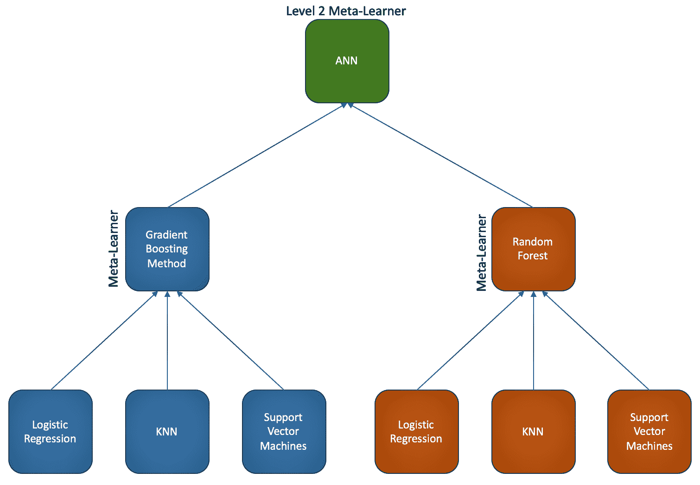
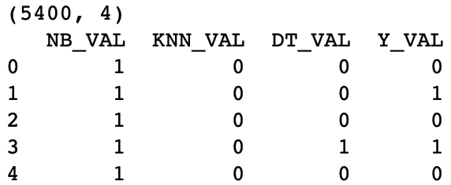
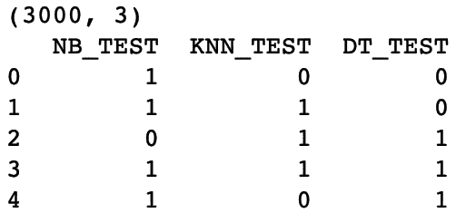

# 第八章：与堆叠结合

在本章中，我们将涵盖以下食谱：

+   理解堆叠泛化

+   通过结合预测实现堆叠泛化

+   使用 H2O 实现营销活动结果预测的堆叠泛化

# 技术要求

本章的技术要求与我们在早期章节中详细说明的要求相同。

访问 GitHub 仓库以查找数据集和代码。数据集和代码文件按章节编号和主题名称排列。

# 理解堆叠泛化

堆叠泛化是一组多样化的模型的集成，引入了元学习器的概念。元学习器是一个第二级机器学习算法，它从基础学习器的最优组合中学习：

"堆叠泛化是一种非线性组合泛化器以创建一个新的泛化器的方法，试图最优地整合每个原始泛化器对学习集的看法。每个泛化器有更多的话要说（这不会在其他泛化器的话中重复），结果堆叠泛化就越好。"

- Wolpert (1992)*,* 堆叠泛化

堆叠的步骤如下：

1.  将您的数据集分为训练集和测试集。

1.  在训练集上训练几个基础学习器。

1.  将基础学习器应用于测试集进行预测。

1.  使用预测作为输入，实际响应作为输出来训练一个高级学习器。

由于基础学习器的预测被混合在一起，堆叠也被称为混合。

以下图表为我们提供了堆叠的概念表示：



对于堆叠泛化来说，基础学习器的预测之间不相关是很重要的。为了从基础学习器中获得不相关的预测，可以使用内部采用不同方法的算法来训练基础学习器。堆叠泛化主要用于最小化基础学习器的泛化误差，可以看作是交叉验证的改进版本。它使用比交叉验证的**赢家通吃**方法更复杂的策略来结合基础学习器的预测。

# 通过结合预测实现堆叠泛化

在本节中，我们将探讨如何从头实现堆叠泛化。

我们将执行以下步骤以开始：

1.  为堆叠构建三个基础学习器。

1.  结合每个基础学习器的预测。

1.  使用另一种算法构建元学习器。

# 准备中...

在这个例子中，我们使用 UCI ML 存储库中的信用卡违约数据集。该数据集包含关于违约支付、人口统计因素、信用数据、支付历史和信用卡客户的账单陈述的信息。数据和数据描述在 GitHub 上提供。

我们将首先加载所需的库并读取我们的数据集：

```py
import os
import numpy as np
import pandas as pd
from sklearn.metrics import accuracy_score
```

我们将工作文件夹设置为以下内容：

```py
# Set your working directory according to your requirement
os.chdir(".../Chapter 8/")
os.getcwd()
```

现在我们读取我们的数据。我们将以`df_`作为 DataFrame 名称的前缀，这样我们就可以轻松理解它：

```py
df_creditcarddata = pd.read_csv("UCI_Credit_Card.csv")
```

我们删除了`ID`列，因为这个列不是必需的：

```py
df_creditcarddata = df_creditcarddata.drop("ID", axis= 1) 
```

我们检查数据集的形状：

```py
df_creditcarddata.shape
```

我们注意到数据集现在有 30,000 个观测值和 24 列。现在让我们继续训练我们的模型。

# 如何做到这一点...

1.  我们分割目标和特征变量：

```py
from sklearn.model_selection import train_test_split

X = df_creditdata.iloc[:,0:23]
Y = df_creditdata['default.payment.next.month']
```

1.  将数据分割为训练、验证和测试子集：

```py
# We first split the dataset into train and test subset
X_train, X_test, Y_train, Y_test = train_test_split(X, Y, test_size=0.1, random_state=1)

# Then we take the train subset and carve out a validation set from the same
X_train, X_val, Y_train, Y_val = train_test_split(X_train, Y_train, test_size=0.2, random_state=1)
```

1.  检查每个子集的维度以确保我们的分割是正确的：

```py
# Dimensions for train subsets
print(X_train.shape)
print(Y_train.shape)

# Dimensions for validation subsets
print(X_val.shape)
print(Y_val.shape)

# Dimensions for test subsets
print(X_test.shape)
print(Y_test.shape)
```

1.  导入基础学习器和元学习器所需的库：

```py
# for the base learners
from sklearn.naive_bayes import GaussianNB
from sklearn.neighbors import KNeighborsClassifier
from sklearn.tree import DecisionTreeClassifier

# for the meta learner
from sklearn.linear_model import LogisticRegression
```

1.  创建基础学习器的实例并在我们的训练数据上拟合模型：

```py
# The base learners
model_1 = GaussianNB()
model_2 = KNeighborsClassifier(n_neighbors=1)
model_3 = DecisionTreeClassifier()

# Now we train a list of models
base_learner_1 = model_1.fit(X_train, Y_train)
base_learner_2 = model_2.fit(X_train, Y_train)
base_learner_3 = model_3.fit(X_train, Y_train)
```

1.  使用我们的验证子集上的基础学习器进行预测：

```py
# We then use the models to make predictions on validation data
val_prediction_base_learner_1 = base_learner_1.predict(X_val)
val_prediction_base_learner_2 = base_learner_2.predict(X_val)
val_prediction_base_learner_3 = base_learner_3.predict(X_val)
```

1.  我们从三个基础学习器获得了三组预测结果。我们使用它们来创建堆叠数组：

```py
# And then use the predictions to create a new stacked dataset
import numpy as np
prediction_test_stack = np.dstack([val_prediction_base_learner_1, val_prediction_base_learner_2, val_prediction_base_learner_3])

# Now we stack the actual outcomes i.e. Y_Test with the prediction_stack
final_train_stack = np.dstack([prediction_test_stack, Y_val])
```

1.  我们将`final_train_stack`堆叠数组转换为 DataFrame 并为每个列添加列名。验证维度并查看前几行：

```py
stacked_train_dataframe = pd.DataFrame(final_train_stack[0,0:5400], columns='NB_VAL KNN_VAL DT_VAL Y_VAL'.split())

print(stacked_train_dataframe.shape)
print(stacked_train_dataframe.head(5))
```

在以下图像中，我们看到堆叠数组现在有 5,400 个观测值和 4 列：



1.  使用我们在*步骤 8*中创建的堆叠数组来训练元学习器：

```py
# Build the Mata-learner
meta_learner = LogisticRegression()
meta_learner_model = meta_learner.fit(stacked_train_dataframe.iloc[:,0:3], stacked_train_dataframe['Y_VAL'])
```

1.  使用测试子集创建堆叠测试集：

```py
# Take the test data (new data)
# Apply the base learners on this new data to make predictions

# We now use the models to make predictions on the test data and create a new stacked dataset
test_prediction_base_learner_1 = base_learner_1.predict(X_test)
test_prediction_base_learner_2 = base_learner_2.predict(X_test)
test_prediction_base_learner_3 = base_learner_3.predict(X_test)

# Create the stacked data
final_test_stack = np.dstack([test_prediction_base_learner_1, test_prediction_base_learner_2, test_prediction_base_learner_3])
```

1.  将`final_test_stack`堆叠数组转换为 DataFrame 并为每个列添加列名。验证维度并查看前几行：

```py
stacked_test_dataframe = pd.DataFrame(final_test_stack[0,0:3000], columns='NB_TEST KNN_TEST DT_TEST'.split())
print(stacked_test_dataframe.shape)
print(stacked_test_dataframe.head(5))
```

我们看到`stacked_test_dataframe`中的堆叠数组现在有 3,000 个观测值和 3 列：



1.  检查`base_learner`在我们原始测试数据上的准确率：

```py
test_prediction_base_learner_1 = base_learner_1.predict(X_test)
test_prediction_base_learner_2 = base_learner_2.predict(X_test)
test_prediction_base_learner_3 = base_learner_3.predict(X_test)

print("Accuracy from GaussianNB:", accuracy_score(Y_test, test_prediction_base_learner_1))
print("Accuracy from KNN:", accuracy_score(Y_test, test_prediction_base_learner_2))
print("Accuracy from Decision Tree:", accuracy_score(Y_test, test_prediction_base_learner_3))
```

我们注意到准确率如下。请注意，根据采样策略和超参数，结果可能会有所不同：


1.  在堆叠测试数据上使用元学习器并检查准确率：

```py
test_predictions_meta_learner = meta_learner_model.predict(stacked_test_dataframe)
print("Accuracy from Meta Learner:", accuracy_score(Y_test, test_predictions_meta_learner))
```

我们看到元学习器在堆叠测试数据上应用后返回的以下输出。这个准确率高于单个基础学习器：


# 它是如何工作的...

在*步骤 1*中，我们将数据集分为目标和特征集。在*步骤 2*中，我们创建了我们的训练、验证和测试子集。在*步骤 3*中，我们检查了每个子集的维度，以验证分割是否正确。

然后我们继续构建基础学习器和元学习器。在*步骤 4*中，我们导入了用于基础学习器和元学习器的必需库。对于基础学习器，我们使用了高斯朴素贝叶斯、KNN 和决策树，而对于元学习器，我们使用了逻辑回归。

在*步骤 5*中，我们将基础学习器拟合到我们的训练数据集。包括高斯朴素贝叶斯、KNN 和决策树在内的单一模型在 0 层空间中建立。然后我们有了三个基础模型。

在*步骤 6*中，我们使用这三个基础模型在我们的验证子集中预测目标变量。然后我们得到了基础学习器给出的三组预测。

现在将通过堆叠泛化在第一层空间中将基础学习器通过逻辑回归进行集成。在*步骤 7*中，我们将三组预测值堆叠起来创建了一个数组。我们还把训练数据集的实际目标变量也堆叠到数组中。然后我们的数组中有四列：三列来自基础学习器的三组预测值，以及一列来自训练数据集的目标变量。我们称之为`final_train_stack`，也称为`stacked_train_dataframe`，并且根据用于基础学习器的算法命名列。在我们的例子中，我们使用了`NB_VAL`、`KNN_VAL`和`DT_VAL`这些名称，因为我们分别使用了高斯朴素贝叶斯、KNN 和决策树分类器。因为基础学习器被拟合到我们的验证子集中，所以我们给列名加上`_VAL`后缀，以便更容易理解。

在*步骤 9*中，我们使用逻辑回归构建了元学习器并将其拟合到我们的堆叠数据集`stacked_train_dataframe`。请注意，我们离开了原始数据集，转向了一个包含基础学习器预测值的堆叠数据集。

在*步骤 10*中，我们使用基础模型在我们的测试子集中获取预测结果。我们称之为`final_test_stack`。在*步骤 11*中，我们将`final_test_stack`数组转换为名为`stacked_test_dataframe`的 DataFrame。请注意，在我们的`stacked_test_dataframe`中，我们只有三列，这些列包含了在测试子集上应用基础学习器返回的预测值。这三列以使用的算法命名，后缀为`_TEST`，因此`stacked_test_dataframe`中的三列是`NB_TEST`、`KNN_TEST`和`DT_TEST`。

在*步骤 12*中，我们检查了基础模型在我们原始测试子集中的准确性。高斯朴素贝叶斯、KNN 和决策树分类器模型分别给出了 0.39、0.69 和 0.73 的准确性评分。

在*步骤 13*中，我们检查了通过在堆叠测试数据上应用元学习器模型所获得的准确性。这给出了 0.77 的准确性，我们可以看到这比单个基础学习器的准确性要高。然而，请记住，仅仅在堆叠算法中添加更多基础学习器并不能保证你会得到更好的准确性。

# 还有更多...

创建堆叠模型可能很繁琐。`mlxtend`库提供了简化堆叠模型构建的工具。它提供了`StackingClassifier`，这是堆叠的集成学习元分类器，并且它还提供了`StackingCVClassifier`，它使用交叉验证为第二级元学习器准备输入，以防止过拟合。

您可以从[`pypi.org/project/mlxtend/`](https://pypi.org/project/mlxtend/)下载库，或者使用`pip install mlxtend`命令进行安装。您可以在[`rasbt.github.io/mlxtend/user_guide/classifier/StackingClassifier/`](http://rasbt.github.io/mlxtend/user_guide/classifier/StackingClassifier/)找到一些简单的堆叠分类和带有网格搜索的堆叠分类的优秀示例。

# 相关内容

您还可以查看`ML-Ensemble`库。要了解更多关于`ML-Ensemble`的信息，请访问[`ml-ensemble.com/`](http://ml-ensemble.com/)。`ML-Ensemble`的使用指南可在[`bit.ly/2GFsxJN`](https://bit.ly/2GFsxJN)找到。

# 使用 H2O 实现针对活动结果预测的堆叠泛化

H2O 是一个开源平台，用于构建机器学习和预测分析模型。算法是写在 H2O 的分布式 map-reduce 框架上的。使用 H2O，数据在节点间分布式，并行读取，并以压缩方式存储在内存中。这使得 H2O 非常快。

H2O 的堆叠集成方法是一个用于监督问题的集成机器学习算法，它通过堆叠找到一组预测算法的最佳组合。H2O 的堆叠集成支持回归、二分类和多分类。

在本例中，我们将探讨如何使用 H2O 的堆叠集成构建堆叠模型。我们将使用可在 GitHub 上找到的银行营销数据集。

# 准备中...

首先，导入`h2o`库和其他 H2O 模块：

```py
import h2o
from h2o.estimators.random_forest import H2ORandomForestEstimator
from h2o.estimators.gbm import H2OGradientBoostingEstimator
from h2o.estimators.glm import H2OGeneralizedLinearEstimator
from h2o.estimators.stackedensemble import H2OStackedEnsembleEstimator
from h2o.grid.grid_search import H2OGridSearch
```

使用`init()`函数初始化`h2o`实例：

```py
h2o.init()
```

一旦运行前面的代码，`h2o`实例将被初始化，我们将看到以下输出：


现在我们已经实例化了`H2O`实例，我们将继续读取我们的数据集并构建堆叠模型。

# 如何操作...

1.  我们使用`h2o.import_file()`函数读取数据。我们将文件名作为参数传递给函数：

```py
df_bankdata = h2o.import_file("bank-full.csv")
```

1.  我们将数据分为训练集和测试集：

```py
# split into train and validation sets
train, test = df_bankdata.split_frame(ratios = [.8], seed = 1234)
```

1.  我们检查训练集和测试集的维度，以验证分割是否正确：

```py
train.shape, test.shape
```

1.  我们查看前几行以确保数据正确加载：

```py
df_bankdata.head()
```

1.  我们将目标列和预测列的名称分别命名为`response`和`predictors`：

```py
# Set the predictor names 
predictors = train.columns

# Set the response column name
response = "y"

# Remove the 'y' variable from the predictors
predictors.remove(response)

print(predictors)
```

1.  我们使用`asfactor()`函数将`response`变量转换为分类类型：

```py
train[response] = train[response].asfactor()
test[response] = test[response].asfactor()
```

1.  我们将使用交叉验证来训练我们的基本学习器。我们将`nfolds`值设置为`5`。我们还设置了一个变量`encoding`为`OneHotExplicit`。我们将使用此变量来对分类变量进行编码。

```py
# Number of CV folds
nfolds = 5

# Using the `categorical_encoding` parameter
encoding = "OneHotExplicit"
```

1.  我们开始训练我们的基本学习器。我们选择梯度提升机算法来构建我们的第一个基本学习器：

```py
# Train and cross-validate a GBM
base_learner_gbm = H2OGradientBoostingEstimator(distribution="bernoulli",\
                                                ntrees=100,\
                                                max_depth=5,\
                                                min_rows=2,\
                                                learn_rate=0.01,\
                                                nfolds=nfolds,\
                                                fold_assignment="Modulo",\
                                                categorical_encoding = encoding,\
                                                keep_cross_validation_predictions=True)

base_learner_gbm.train(x=predictors, y=response, training_frame=train)
```

1.  对于我们的第二个基本学习器，我们使用随机森林：

```py
# Train and cross-validate a RF
base_learner_rf = H2ORandomForestEstimator(ntrees=250,\
                                           nfolds=nfolds,\
                                           fold_assignment="Modulo",\
                                           categorical_encoding = encoding,\
                                           keep_cross_validation_predictions=True)
base_learner_rf.train(x=predictors, y=response, training_frame=train)
```

1.  对于我们的第三个基本学习器，我们实现了一个**广义线性模型**（**GLM**）：

```py
# Train and cross-validate a GLM
base_learner_glm = H2OGeneralizedLinearEstimator(family="binomial",\
                                                 model_id="GLM",\
                                                 lambda_search=True,\
                                                 nfolds = nfolds,\
                                                 fold_assignment = "Modulo",\
                                                 keep_cross_validation_predictions = True)

base_learner_glm.train(x = predictors, y = response,training_frame = train)
```

1.  在测试集上，根据`test AUC`获取最佳性能的基本学习器。将其与堆叠集成模型的`test AUC`进行比较：

```py
# Compare to base learner performance on the test set
gbm_test_performance = base_learner_gbm.model_performance(test)
rf_test_performance = base_learner_rf.model_performance(test)
glm_test_performance = base_learner_glm.model_performance(test)

print("Best AUC from the GBM", gbm_test_performance.auc())
print("Best AUC from the Random Forest", rf_test_performance.auc())
print("Best AUC from the GLM", glm_test_performance.auc())

baselearner_best_auc_test = max(gbm_test_performance.auc(), rf_test_performance.auc(), glm_test_performance.auc())
print("Best AUC from the base learners", baselearner_best_auc_test)

stack_auc_test = perf_stack_test.auc()
print("Best Base-learner Test AUC: ", baselearner_best_auc_test)
print("Ensemble Test AUC: ", stack_auc_test)
```

1.  我们使用前面步骤中构建的基本学习器训练一个堆叠集成：

```py
all_models = [base_learner_glm, base_learner_gbm, base_learner_rf]

# Set up Stacked Ensemble. Using Deep Learning as the meta learner
ensemble_deep = H2OStackedEnsembleEstimator(model_id ="stack_model_d", base_models = all_models, metalearner_algorithm = 'deeplearning')

ensemble_deep.train(y = response, training_frame = train)

# Eval ensemble performance on the test data
perf_stack_test = ensemble_deep.model_performance(test)
stack_auc_test = perf_stack_test.auc()
print("Ensemble_deep Test AUC: {0}".format(stack_auc_test))
```

# 它是如何工作的...

在*步骤 1*中，我们使用了`h2o.import_file()`函数来读取我们的数据集。

`h2o.import_file()`函数返回一个`H2OFrame`实例。

在*步骤 2*中，我们将`H2OFrame`拆分为训练集和测试集。在*步骤 3*中，我们检查了这些子集的维度，以验证我们的拆分是否满足我们的要求。

在*步骤 4*中，我们查看了一些前几行数据，以检查数据是否正确加载。在*步骤 5*中，我们分离出响应变量和预测变量的列名，并在*步骤 6*中，我们使用`asfactor()`函数将响应变量转换为分类类型。

在*步骤 7*中，我们定义了一个名为`nfolds`的变量，我们使用它进行交叉验证。我们还定义了一个名为`encoding`的变量，我们在后续步骤中使用它来指示 H2O 对分类变量使用独热编码。在*步骤 8*到*步骤 10*中，我们构建了我们的基本学习器。

在*步骤 11*中，我们训练了一个梯度提升机模型。我们向一些超参数传递了一些值，如下所示：

+   `nfolds`：K 折交叉验证的折数。

+   `fold_assignment`：此选项指定用于交叉验证折分配的方案。此选项仅在指定了`nfolds`值且未指定`fold_column`时适用。

+   `distribution`：指定分布。在我们的情况下，由于响应变量有两个类别，我们将`distribution`设置为`"bernoulli"`。

+   `ntrees`：树的数量。

+   `max_depth`：表示最大树深度。

+   `min_rows`：叶子节点中允许的最少观测值。

+   `learn_rate`：学习率取值范围从`0.0`到`1.0`。

注意，对于所有基本学习器，交叉验证折数必须相同，并且`keep_cross_validation_predictions`必须设置为`True`。

在*步骤 9*中，我们使用以下超参数训练了一个随机森林基本学习器：`ntrees`、`nfolds`、`fold_assignment`。

在*步骤 10*中，我们使用 GLM 训练了我们的算法。请注意，我们尚未对 GLM 中的分类变量进行编码。

H2O 建议用户允许 GLM 处理分类列，因为它可以利用分类列以获得更好的性能和高效的内存利用。

来自 H2o.ai 的建议："我们强烈建议避免将具有任何级别的分类列进行 one-hot 编码成多个二进制列，因为这非常低效。这对于习惯手动扩展其分类变量以适应其他框架的 Python 用户来说尤其如此"。

在*步骤 11*中，我们为每个基础学习者生成了测试 AUC 值，并打印了最佳的 AUC。

在*步骤 12*中，我们通过使用`H2OStackedEnsembleEstimator`结合基础学习者的输出，训练了一个堆叠集成模型。我们在测试子集上使用了训练好的集成模型。请注意，默认情况下，GLM 被用作`H2OStackedEnsembleEstimator`的元学习器。然而，在我们的示例中，我们使用了深度学习作为元学习器。

注意，我们已经为我们的元学习器使用了默认的超参数值。我们可以使用`metalearner_params`指定超参数值。`metalearner_params`选项允许您传递一个字典/超参数列表，用于作为元学习器的算法。

微调超参数可以带来更好的结果。

# 还有更多...

您也可以以不同的方式组装一个模型列表以堆叠。在前面的示例中，我们训练了单个模型并将它们放入列表中进行集成。我们也可以训练一个模型网格：

1.  我们指定网格的随机森林超参数：

```py
hyper_params = {"max_depth": [3, 4, 5, 8, 10],
                "min_rows": [3,4,5,6,7,8,9,10],
                "mtries": [10,15, 20],
                "ntrees": [100,250,500, 750],
                "sample_rate": [0.7, 0.8, 0.9, 1.0],
                "col_sample_rate_per_tree": [0.5, 0.6, 0.7, 0.8, 0.9, 1.0]}

search_criteria = {"strategy": "RandomDiscrete", "max_models": 3, "seed": 1}
```

1.  我们使用前面代码中定义的超参数进行网格训练：

```py
# Train the grid
grid = H2OGridSearch(model=H2ORandomForestEstimator(nfolds=nfolds,\
                                                    fold_assignment="Modulo",\
                                                    keep_cross_validation_predictions=True),\
                     hyper_params=hyper_params,\
                     search_criteria=search_criteria,\
                     grid_id="rf_grid_binomial")

grid.train(x=predictors, y=response, training_frame=train)
```

1.  我们使用随机森林网格进行集成训练：

```py
# Train a stacked ensemble using the RF grid
ensemble = H2OStackedEnsembleEstimator(model_id="ensemble_rf_grid_binomial_9", base_models=grid.model_ids)

ensemble.train(x=predictors, y=response, training_frame=train)

# Evaluate ensemble performance on the test data
perf_stack_test = ensemble.model_performance(test)

# Compare to base learner performance on the test set
baselearner_best_auc_test = max([h2o.get_model(model).model_performance(test_data=test).auc() for model in grid.model_ids])

stack_auc_test = perf_stack_test.auc()

print("Best Base-learner Test AUC: ", baselearner_best_auc_test)
print("Ensemble Test AUC: ", stack_auc_test)
```

上述代码将给出最佳基础学习器测试 AUC，并测试集成模型的 AUC。如果响应变量高度不平衡，考虑微调以下超参数以控制过采样和欠采样：

+   `balance_classes`：此选项可用于平衡类分布。当启用时，H2O 将减少多数类的样本量或增加少数类的样本量。如果此选项被启用，您还可以指定`class_sampling_factors`和`max_after_balance_size`选项的值。

+   `class_sampling_factors`：默认情况下，采样因子将在训练期间自动计算以获得类平衡。此行为可以通过`class_sampling_factors`参数进行更改。此选项为每个类设置过采样或欠采样比率，并需要`balance_classes=true`。

+   `max_after_balance_size`：在大多数情况下，将`balance_classes`设置为 true 会增加 DataFrame 的大小。为了减少 DataFrame 的大小，您可以使用`max_after_balance_size`参数。此参数指定平衡类计数后的训练数据的最大相对大小，默认为`5.0`。

# 参见

看一看由 Marios Michailidis 在其博士论文中开发的`StackNet`。`StackNet`在 MIT 许可下可用。它是一个可扩展的分析框架，类似于前馈神经网络，并使用 Wolpert 的堆叠泛化概念来提高机器学习预测任务的准确性。它使用元学习者的概念，即它使用某些算法的预测作为其他算法的特征。StackNet 还可以在多个级别上进行泛化堆叠。然而，它计算密集。最初是用 Java 开发的，但现在也提供了一种较轻的 Python 版本，名为`pystacknet`。

让我们思考一下 StackNet 是如何工作的。在神经网络的情况下，某一层的输出被插入到下一层作为输入，并应用激活函数，如 sigmoid、tanh 或 relu。同样，在 StackNet 的情况下，激活函数可以被任何监督机器学习算法所替代。

堆叠元素可以在两种模式下运行：正常堆叠模式和重新堆叠模式。在正常堆叠模式下，每一层使用前一层的结果进行预测。在重新堆叠模式下，每一层使用前几层的神经元和激活。

使用 StackNet 的示例代码将包括以下步骤：

1.  导入所需的库（请注意，我们已经从`pystacknet`库中导入了`StackNetClassifier`和`StackNetRegressor`）：

```py
import numpy as np

# import required libraries from sklearn
from sklearn.tree import DecisionTreeClassifier
from sklearn.ensemble import RandomForestClassifier, GradientBoostingClassifier
from sklearn.linear_model import LogisticRegression

from sklearn.metrics import roc_auc_score, log_loss
from sklearn.model_selection import StratifiedKFold

# import StackNetClassifier and StackNetRegressor from pystacknet
from pystacknet.pystacknet import StackNetClassifier,StackNetRegressor
from pystacknet.metrics import rmse,mae
```

1.  我们读取数据，删除`ID`列，并检查数据集的维度：

```py
df_creditcarddata = pd.read_csv("UCI_Credit_Card.csv")

#dropping the ID column, as it would not be required
df_creditcarddata.drop(["ID"],axis=1,inplace=True)

# Check the shape of the data
df_creditcarddata.shape
```

1.  我们将目标变量和预测变量分开。同时，我们将数据分为训练集和测试集：

```py
#create the predictor & target set
X = df_creditcarddata.iloc[:,0:23]
Y = df_creditcarddata['default.payment.next.month']

# Create train & test sets
X_train, X_test, Y_train, Y_test = \
train_test_split(X, Y, test_size=0.20, random_state=1)
```

1.  我们定义了基学习器和元学习器的模型：

```py
models=[[DecisionTreeClassifier(criterion="entropy", max_depth=5, max_features=0.5, random_state=1),
GradientBoostingClassifier(n_estimators=100, learning_rate=0.1, max_depth=5, max_features=0.5, random_state=1),
LogisticRegression(random_state=1)],
[RandomForestClassifier (n_estimators=500, criterion="entropy", max_depth=5, max_features=0.5, random_state=1)]]
```

1.  现在我们使用`StackNetClassifier`构建堆叠集成。但是请注意，我们使用`restacking=False`，这意味着它使用正常堆叠模式：

```py
model=StackNetClassifier(models, metric="accuracy", folds=4, restacking=False, use_retraining=True, use_proba=True, random_state=12345, n_jobs=1, verbose=1)

model.fit(X_train,Y_train )

# Uses the meta-learner model to predict the outcome
preds=model.predict_proba(X_test)[:,1]
print ("TEST ACCURACY without RESTACKING, auc %f " % (roc_auc_score(Y_test,preds)))
```

使用`restacking=True`时，`StackNetClassifier`将使用重新堆叠模式来构建模型。

在 Kaggle 竞赛中，StackNet 被用于赢得各种案例研究。关于如何使用`StackNet`的示例可以在[`bit.ly/2T7339y`](https://bit.ly/2T7339y)找到。
