# 第三章：联邦学习系统的工作原理

本章将概述联邦学习系统（**FL**）的架构、流程流程、消息序列和模型聚合的基本原理。如*第二章*“什么是联邦学习？”中讨论的，FL 框架的概念基础非常简单且易于理解。然而，FL 框架的真正实现需要具备对 AI 和分布式系统的良好理解。

本章内容基于联邦学习系统最标准的基石，这些基石将在本书后面的实际练习中使用。首先，我们将介绍联邦学习系统的构建块，例如带有联邦学习服务器的聚合器、带有联邦学习客户端的代理、数据库服务器以及这些组件之间的通信。本章介绍的架构以解耦的方式设计，以便对系统的进一步增强将比包含所有内容在一个机器上的联邦学习系统更容易。然后，我们将解释从初始化到聚合的联邦学习操作流程。

最后，我们将探讨如何通过横向设计去中心化的联邦学习设置来扩展联邦学习系统的规模。

本章涵盖了以下主题：

+   联邦学习系统架构

+   理解联邦学习系统流程——从初始化到持续运行

+   模型聚合的基本原理

+   通过横向设计进一步扩展可伸缩性

# 联邦学习系统架构

联邦学习系统是分散到服务器和分布式客户端的分布式系统。在这里，我们将定义一个具有以下组件的联邦学习系统的代表性架构：带有联邦学习服务器的聚合器、带有联邦学习客户端的代理和数据库：

+   **集群聚合器**（或**聚合器**）：一个带有联邦学习服务器的系统，它收集和聚合在多个分布式代理（稍后定义）上训练的机器学习模型，并创建全局机器学习模型，这些模型被发送回代理。该系统作为*集群聚合器*，或者更简单地说，作为*联邦学习系统聚合器*。

+   **分布式代理**（或**代理**）：一个带有联邦学习客户端（如本地边缘设备、移动应用、平板电脑或任何分布式云环境）的分布式学习环境，在这些环境中以分布式方式训练机器学习模型并将其发送到聚合器。代理可以通过聚合器的联邦学习客户端通信模块连接到聚合器的联邦学习服务器。联邦学习客户端端的代码包含一系列库，这些库可以集成到由个别机器学习工程师和数据科学家设计和实现的本地机器学习应用中。

+   **数据库服务器**（或**数据库**）：用于存储与聚合器、代理、全局和本地机器学习模型及其性能指标相关的数据的数据库及其服务器。数据库服务器处理来自聚合器的查询，并将必要的数据发送回聚合器。为了简化联邦学习系统设计，代理不需要直接连接到数据库服务器。

*图 3.1*展示了典型的整体架构，包括单个集群聚合器和数据库服务器，以及多个分布式代理：

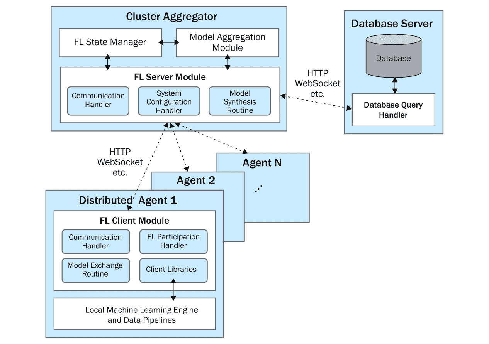

图 3.1 – 联邦学习系统的整体架构

联邦学习系统架构的一个优点是用户不需要将私有原始数据发送到服务器，尤其是第三方拥有的数据。相反，他们只需将本地训练的模型发送给聚合器。本地训练的模型可以有多种格式，例如整个机器学习模型的权重、权重的变化（梯度），甚至它们的子集。另一个优点是减少通信负载，因为用户只需交换通常比原始数据轻得多的模型。

## 聚类聚合器

集群聚合器由联邦学习服务器模块、联邦学习状态管理模块和模型聚合模块组成，如*图 3.1*所示。我们只称带有联邦学习服务器的集群聚合器为聚合器。虽然这些模块是聚合器的基础，但可以添加高级模块以确保进一步的安全性和灵活性。由于本书的主要目的是理解联邦学习系统的基本结构和系统流程，因此本书提供的`simple-fl` GitHub 仓库中未实现一些高级模块。在聚合器系统中，与联邦学习服务器、联邦学习状态管理和模型聚合相关的以下模块是实现聚合器端功能的关键。

+   **联邦学习服务器模块**：联邦学习服务器模块有三个主要功能，包括通信处理程序、系统配置处理程序和模型合成例程：

    +   **通信处理器**：作为聚合器的一个模块，支持与代理和数据库的*通信*。通常，此模块接受来自代理的轮询消息并向它们发送响应。他们接收的消息类型包括使用安全凭证和认证机制进行代理注册、初始化作为未来聚合过程*初始模型*的 ML 模型、确认代理是否参与某一轮次以及重新训练于分布式代理（如移动设备和本地边缘机器）的本地 ML 模型。通信处理器还可以查询数据库服务器，以访问系统数据以及数据库中的 ML 模型，并在聚合器接收或创建新模型后推送和存储这些数据和模型。此模块可以使用 HTTP、WebSocket 或任何其他通信框架来实现其实现。

    +   **系统配置处理器**：处理代理的*注册*和跟踪连接的代理及其状态。聚合器需要了解代理的连接和注册状态。如果代理使用已建立的认证机制进行注册，它们将接受消息并相应地处理它们。否则，此模块将执行认证过程，例如验证从代理发送的令牌，以便下次此代理连接到 FL 服务器时，系统能够正确识别该代理。

    +   **模型合成例程**：支持检查本地 ML 模型的收集状态，并在满足收集标准后进行聚合。收集标准包括连接的代理收集的本地模型数量。例如，当 80%的连接代理将训练好的本地模型发送到聚合器时，就会发生聚合。实现这一目标的设计模式之一是定期检查代理上传的 ML 模型数量，这些操作在 FL 服务器运行时持续进行。模型合成例程将定期访问数据库或本地缓冲区，以检查本地模型收集的状态并聚合这些模型，以生成将存储在数据库服务器中并发送回代理的全局模型。

+   **FL 状态管理器**：状态管理器跟踪聚合器和连接的代理的状态信息。它存储聚合器的易失性信息，例如代理提供的本地和全局模型、从数据库拉取的集群模型、FL 轮次信息或连接到聚合器的代理。缓冲的本地模型由模型聚合模块使用，以生成发送回连接到聚合器的每个活动代理的全局模型。

+   **模型聚合模块**：模型聚合模块是本章“模型聚合基础”部分和第七章“模型聚合”中介绍的模型聚合算法的集合。最典型的聚合算法是*联邦平均*，它平均收集到的 ML 模型的权重，考虑到每个模型用于其本地训练的样本数量。

## 分布式代理

分布式代理由一个 FL 客户端模块组成，该模块包括通信处理程序和客户端库，以及通过 FL 客户端库连接到 FL 系统的本地 ML 应用程序：

+   **FL 客户端模块**：FL 客户端模块主要有四个关键功能，包括通信处理程序、代理参与处理程序、模型交换例程和客户端库：

    +   **通信处理程序**：作为与分配给代理的聚合器通信的通道。发送给聚合器的消息包括代理本身的注册有效载荷和一个将成为聚合模型基础的初始模型。该消息还包含本地训练的模型及其性能数据。此模块支持*推送*和*轮询*机制，并可以利用 HTTP 或 WebSocket 框架来实现其实现。

    +   **FL 参与处理程序**：通过向聚合器发送包含要注册在 FL 平台上的代理信息本身的消息来处理代理在 FL 过程和周期中的参与。响应消息将设置代理以进行持续和持续的 FL 过程，并且通常包括代理可以利用和本地训练的最新全局模型。

    +   **模型交换例程**：支持一个同步功能，该功能不断检查是否有新的全局模型可用。如果新的全局模型可用，此模块将从聚合器下载全局模型，并在需要时用全局模型替换本地模型。此模块还会检查客户端状态，并在本地训练过程完成后发送重新训练的模型。

    +   **客户端库**：包括管理库和通用 FL 客户端库：

        +   当注册其他代理将使用的初始模型时使用管理库。也可以由具有更高控制能力的行政代理请求 FL 系统的任何配置更改。

        +   通用 FL 客户端库提供基本功能，例如启动 FL 客户端核心线程、将本地模型发送到聚合器、在本地机器的特定位置保存模型、操作客户端状态以及下载全局模型。本书主要讨论这种通用类型的库。

+   **本地 ML 引擎和数据管道**：这些部分由个别 ML 工程师和科学家设计，可以独立于 FL 客户端功能。此模块本身有一个 ML 模型，用户可以立即使用它进行更准确的推理，一个可以插入 FL 客户端库的培训和测试环境，以及数据管道的实现。虽然上述模块和库可以通用并提供为任何 ML 应用程序的**应用程序编程接口**（**API**）或库，但此模块根据要开发的 AI 应用程序的需求是独特的。

## 数据库服务器

数据库服务器由数据库查询处理器和数据库组成，作为存储。数据库服务器可以位于服务器端，例如在云上，并且与聚合器紧密相连，而推荐的设计是将此数据库服务器与聚合器服务器分开，以解耦功能，增强系统的简单性和弹性。数据库查询处理器和示例数据库表的功能如下：

+   **数据库查询处理器**：接受来自聚合器的传入请求，并将所需数据和 ML 模型发送回聚合器。

+   **数据库**：存储所有与 FL 过程相关的信息。我们在此列出数据库的一些潜在条目：

    +   **聚合器信息**：此聚合器相关信息包括聚合器本身的 ID、IP 地址和各种端口号、系统注册和更新时间以及系统状态。此外，此条目还可以包括模型聚合相关信息，例如 FL 的轮次及其信息以及聚合标准。

    +   **代理信息**：此代理相关信息包括代理本身的 ID、IP 地址和各种端口号、系统注册和更新时间以及系统状态。此条目还可以包含用于同步 FL（在本章的*同步和异步 FL*部分中解释）的 opt-in/out 状态，以及一个标志来记录代理是否在过去有过不良行为（例如，参与投毒攻击，或返回结果非常慢）。

    +   **基础模型信息**：基础模型信息用于注册初始 ML 模型，其架构和信息用于 FL 轮次的整个流程。

    +   **本地模型**：本地模型的信息包括唯一标识个别 ML 模型的模型 ID、模型的生成时间、上传模型的代理 ID、从代理接收模型的聚合器 ID 等。通常，模型 ID 唯一映射到实际 ML 模型文件的存储位置，这些文件可以存储在数据库服务器或某些云存储服务中，例如亚马逊网络服务的 S3 存储桶等。

    +   **集群全局模型**：集群全局模型的信息类似于本地模型可以在数据库中记录的信息，包括模型 ID、聚合器 ID、模型的生成时间等。一旦聚合器创建了一个聚合模型，数据库服务器将接受全局模型并将它们存储在数据库服务器或任何云存储服务中。任何全局模型都可以由聚合器请求。

    +   **性能数据**：本地和全局模型的表现可以追踪，作为附加到这些模型的元数据。这些性能数据将被用于确保在将聚合模型实际部署到用户 ML 应用之前，聚合模型的表现足够好。

注意

在`simple-fl`存储库的代码示例中，仅覆盖了与本地模型和集群模型相关的数据库表，以简化整个 FL 过程的解释。

现在 FL 系统的基本架构已经介绍完毕，接下来我们将讨论如果代理端设备计算资源有限时，如何增强 FL 系统的架构。

## 中间服务器用于低计算能力的代理设备

有时，本地用户设备的计算能力有限 – 在这些设备上可能难以进行 ML 训练，但仅通过下载全局模型就可以进行推理或预测。在这些情况下，FL 平台可能能够设置一个额外的中间服务器层，例如使用智能手机、平板电脑或边缘服务器。例如，在医疗 AI 应用中，用户可以在他们的智能手表上管理他们的健康信息，这些信息可以传输到他们的智能平板电脑或与笔记本电脑同步。在这些设备上，重新训练 ML 模型和集成分布式代理功能都很简单。

因此，系统架构需要根据 FL 系统集成的应用进行修改或重新设计，并且可以使用分布式代理应用中间服务器概念来实现 FL 过程。我们不需要修改聚合器与中间服务器之间的交互和通信机制。只需在用户设备和中间服务器之间实现 API，大多数情况下就可以实现 FL。

*图 3.2* 展示了聚合器、中间服务器和用户设备之间的交互：

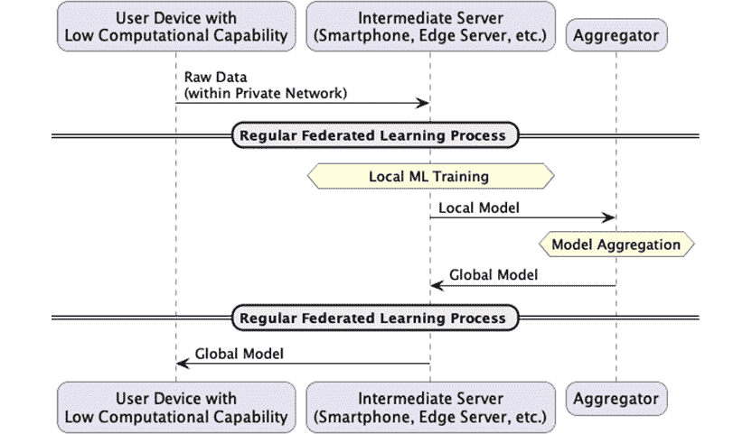

图 3.2 – 带有中间服务器的 FL 系统

现在我们已经了解了 FL 系统的基本架构和组件，接下来我们将探讨在下一节中 FL 系统是如何运行的。

# 理解 FL 系统流程 – 从初始化到持续运行

每个分布式代理都属于一个由 FL 服务器管理的聚合器，在那里进行 ML 模型聚合，以合成一个将要发送回代理的全局模型。这个概念听起来很简单，因此我们将更详细地探讨这些过程的整个流程。

我们还定义了一个**集群全局模型**，我们简单地称之为**集群模型**或**全局模型**，它是从分布式代理收集的本地模型的聚合 ML 模型。

注意

在接下来的两个章节中，我们将指导您如何实现本章讨论的程序和消息序列。然而，一些系统操作视角，如聚合器或代理在数据库中的系统注册，在`simple-fl`存储库的代码示例中没有介绍，以简化整个 FL 过程的解释。

## 数据库、聚合器和代理的初始化

初始化过程的顺序相当简单。初始化和注册过程需要按照数据库、聚合器和代理的顺序进行。聚合器和代理在数据库中的整体注册顺序如图 3.3 所示：

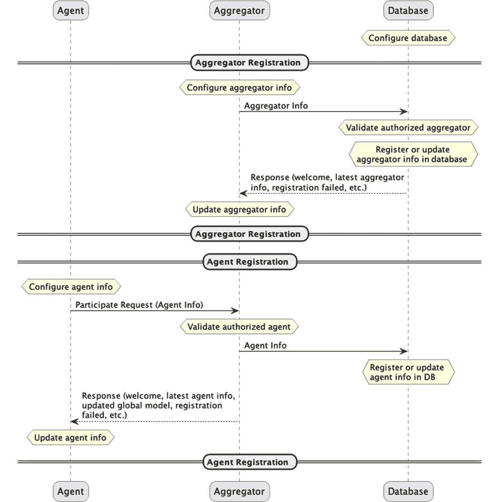

图 3.3 – 数据库服务器中聚合器和代理注册的过程

这里是 FL 系统中每个组件的初始化和注册过程：

+   **数据库服务器初始化**：FL 系统操作的第一步是启动数据库服务器。多个组织提供了一些简单的框架，这些框架不包括数据库或数据库服务器。然而，为了维护联邦 ML 模型的过程，建议您使用数据库，即使是一个轻量级的数据库，如 SQLite 数据库。

+   **聚合器初始化和注册**：在代理开始运行并上传机器学习模型之前，应该设置并运行聚合器。当聚合器开始运行并首次连接到数据库服务器时，注册过程会自动进行，同时也会检查聚合器是否安全连接。如果注册过程失败，它会收到数据库发送回来的注册失败消息。此外，如果聚合器在失去与数据库的连接后再次尝试连接到数据库，数据库服务器会检查聚合器是否已经注册。如果是这种情况，数据库服务器响应中会包含已注册聚合器的系统信息，以便聚合器可以从它停止的地方开始。如果聚合器使用 HTTP 或 WebSocket，它可能需要发布 IP 地址和端口号以便代理连接。

+   **代理初始化和注册**：通常情况下，如果代理知道它想要连接的聚合器，注册过程类似于聚合器连接到数据库服务器的方式。连接过程应该足够简单，只需使用 IP 地址、聚合器的端口号（如果我们使用某些框架，如 HTTP 或 WebSocket）以及一个认证令牌向该聚合器发送一个参与消息。如果代理在失去与聚合器的连接后再次尝试连接到聚合器，数据库服务器会检查代理是否已经注册。如果代理已经注册，数据库服务器响应中会包含已注册代理的系统信息，以便代理可以从与聚合器断开连接的点开始。

特别地，当它收到代理的参与消息时，聚合器会按照*图 3.4*中的流程进行操作。接收参与请求后的关键过程是（i）检查代理是否可信，或者代理是否已经注册，以及（ii）检查初始全局模型是否已经注册。如果（i）成立，注册过程将继续。如果（初始）全局模型已经注册，代理将能够接收全局模型并开始使用该全局模型在代理端进行本地训练过程。

在聚合器端，代理的参与和注册过程如*图 3.4*所示：

![图 3.4 – 代理通过聚合器的注册过程

![img/B18369_03_04_New.jpg]

图 3.4 – 代理通过聚合器的注册过程

现在我们已经了解了 FL 系统组件的初始化和注册过程，让我们继续到正在进行的 FL 过程的基本配置，这涉及到上传初始机器学习模型。

## 初始代理的初始模型上传过程

运行 FL 过程的下一步是注册初始机器学习模型，该模型的架构将被 FL 的所有聚合器和代理在整个连续过程中使用。初始模型可以由拥有机器学习应用程序和 FL 服务器的公司分发。他们可能会将初始基模型作为聚合器配置的一部分提供。

我们将用作模型聚合参考的初始机器学习模型称为**基模型**。我们还将上传初始基模型的代理称为*初始代理*。基模型信息可能包括机器学习模型本身以及生成时间和初始性能数据。因此，初始化基模型的过程可以在*图 3.5*中看到：

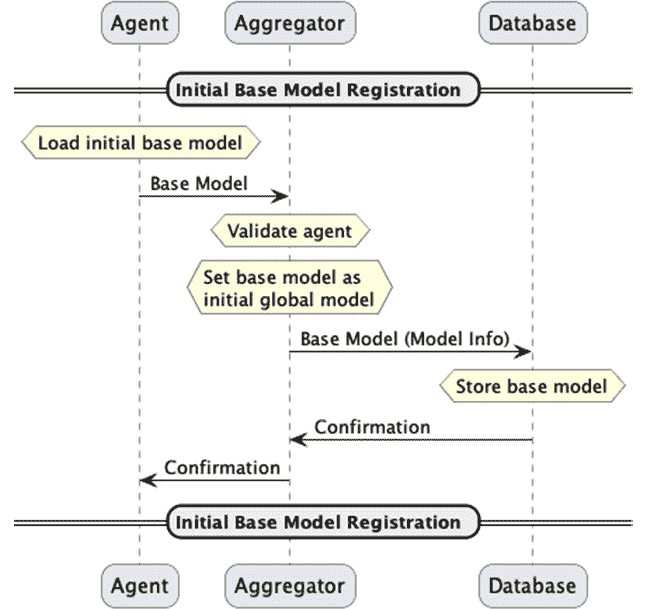

](img/B18369_03_05.jpg)

图 3.5 – 初始代理的基模型上传过程

现在，FL 过程已准备好进行。接下来，我们将了解 FL 周期，这是 FL 过程的核心部分。

## FL 系统的整体循环和过程

在本节中，我们只提供一个单代理和聚合器的示例，但在实际案例和操作中，代理环境是多样的，分散到分布式设备中。以下是如何上传、聚合、存储本地模型并将其作为全局模型发送回代理的流程列表：

1.  除了初始代理之外的其他代理将请求全局模型，这是一个更新的聚合机器学习模型，以便将其部署到自己的应用程序中。

1.  一旦代理从聚合器获取更新后的模型并部署它，代理将使用随后获得的新数据在本地重新训练机器学习模型，以反映数据的最新性和时效性。代理还可以参与多个轮次，使用不同的数据来吸收其本地示例和倾向。再次强调，这些本地数据不会与聚合器共享，并保持在分布式设备上本地。

1.  在重新训练本地机器学习模型（当然，该模型与 FL 的全局或基模型具有相同的架构）之后，代理调用 FL 客户端 API 将模型发送到聚合器。

1.  聚合器接收本地机器学习模型并将模型推送到数据库。聚合器跟踪收集到的本地模型数量，只要联盟轮次开放，就会继续接受本地模型。轮次可以通过任何定义的标准关闭，例如聚合器接收足够多的机器学习模型以进行聚合。当满足标准时，聚合器将聚合本地模型并生成一个更新的全局模型，该模型已准备好发送回代理。

1.  在此过程中，代理会不断查询聚合器，以确定全局模型是否已准备好，或者在某些情况下，根据通信系统设计和网络约束，聚合器可能会将全局模型推送到连接到聚合器的代理。然后，更新的模型被发送回代理。

1.  在收到更新的全局模型后，代理在准备好时在本地部署和重新训练全局模型。描述的整个过程会重复进行，直到满足联邦学习的终止条件。在某些情况下，没有终止条件来停止这个联邦学习循环和重新训练过程，以便全局模型持续学习最新的现象、当前趋势或与用户相关的倾向。联邦学习回合可以通过手动停止来为一些评估做准备，在部署之前。

*图 3.6* 展示了联邦学习在代理、聚合器和数据库之间持续进行的过程的总体情况：

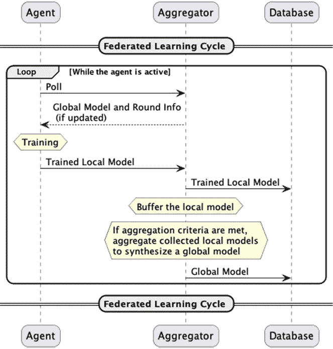

图 3.6 – 联邦学习连续循环概述

现在我们已经了解了联邦学习过程的整体流程，我们将探讨联邦学习过程中的不同回合管理方法：同步联邦学习和异步联邦学习。

## 同步和异步联邦学习

当模型聚合发生在聚合器时，存在多个与从哪些代理收集多少本地模型相关的标准。在本节中，我们将简要讨论同步和异步联邦学习之间的差异，这些差异已在许多文献中讨论过，例如 https://iqua.ece.toronto.edu/papers/ningxinsu-iwqos22.pdf，因此请参阅以进一步了解这些概念。

### 同步联邦学习

同步联邦学习要求聚合器在每个回合中选择需要发送本地模型的代理，以便进行模型聚合。这种同步联邦学习方法设计简单，易于实现，适用于需要明确选择代理的联邦学习应用。然而，如果代理的数量变得太多，聚合器可能需要等待很长时间才能完成当前回合，因为代理的计算能力可能不同，其中一些可能存在上传问题或未能上传其本地模型。因此，一些代理在向聚合器发送模型时可能会变得缓慢或完全无法工作。这些缓慢的代理在分布式机器学习中被称为 *拖沓者*，这促使我们使用异步联邦学习模式。

### 异步联邦学习

异步 FL 不需要聚合器选择必须上传其本地模型的代理。相反，它为任何受信任的代理在任何时候上传模型打开了大门。此外，聚合器想要生成全局模型时，无论是否有收集所需的最小数量本地模型的标准，或者聚合器需要等待接收来自代理的本地模型直到该轮次聚合发生的一些预定义间隔或截止日期，都可以结束联盟轮次。这种异步 FL 方法为每个 FL 轮次的模型聚合提供了 FL 系统更多的灵活性，但设计可能比简单的同步聚合框架更复杂。

在管理 FL 轮次时，需要考虑运行轮次的实际操作，例如调度和处理延迟响应，所需的最小参与水平，示例存储的细节，使用下载或训练的模型在边缘设备上的应用中进行改进推理，以及处理不良或缓慢的代理。

我们将探讨 FL 过程和流程，重点关注聚合器端。

## 聚合器端的 FL 周期和流程

聚合器运行两个线程来接受和缓存本地模型，并聚合收集到的本地机器学习模型。在本节中，我们将描述这些过程。

### 接受和缓存本地机器学习模型

聚合器端接受和缓存本地机器学习模型的流程在*图 3.7*中展示，并如下解释：

1.  聚合器将等待代理上传本地机器学习模型。这种方法听起来像是异步 FL。然而，如果聚合器已经决定接受哪些代理上传模型，它只需排除来自不受欢迎的代理的模型上传即可。其他系统或模块可能已经告知不受欢迎的代理不要参与这一轮。

1.  一旦收到机器学习模型，聚合器会检查该模型是否由受信任的代理上传。此外，如果上传本地模型的代理不在 FL 操作员希望接受的代理列表中，聚合器将丢弃该模型。此外，聚合器需要有一种机制来仅过滤有效模型——否则，存在毒害全局模型并搞乱整个 FL 过程的危险。

1.  如果上传的本地机器学习模型有效，聚合器将把模型推送到数据库。如果数据库位于不同的服务器上，聚合器将打包模型并发送到数据库服务器。

1.  当上传的模型存储在数据库中时，它们应在聚合器状态管理器的内存中以适当的格式（如 NumPy 数组）进行缓冲。

此流程会一直运行，直到满足终止条件或 FL 系统的操作员选择停止该过程。*图 3.7* 描述了接受和缓存本地机器学习模型的流程：

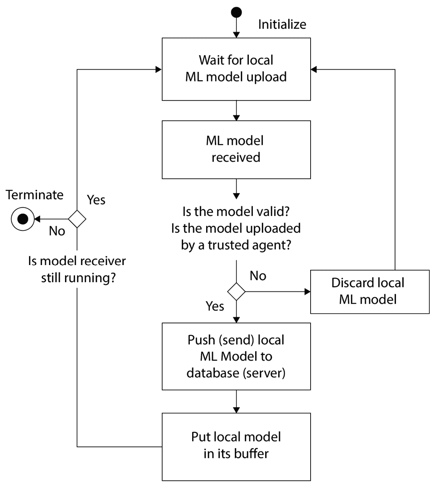

图 3.7 – 接受和缓存本地机器学习模型的流程

一旦本地机器学习模型被接受并缓存，FL 系统继续进行下一个流程：聚合本地模型。

### 聚合本地机器学习模型

如 *图 3.8* 所示的聚合器端聚合本地机器学习模型的流程如下：

1.  聚合器持续检查聚合标准是否满足。典型的聚合标准如下：

    +   在此 FL 轮次中迄今为止收集到的本地模型数量。例如，如果代理的数量是 10 个节点，在 8 个节点（意味着 80%的节点）报告了本地训练的模型后，聚合器开始聚合模型。

    +   收集到的模型数量和 FL 轮次所花费的时间的组合。这可以自动化聚合过程，防止系统陷入停滞。

1.  一旦满足聚合标准，聚合器开始模型聚合过程。通常，联邦平均是一种非常典型但强大的聚合方法。关于模型聚合方法的进一步解释见本章的 *模型聚合基础* 部分，以及 *第七章*，*模型聚合*。在本 FL 轮次中，聚合的模型被定义为全局模型。

在 FL 轮次的时间已过期且参与轮次的代理中上传的模型不足的情况下，该轮次可以被放弃或强制对迄今为止收集到的本地模型进行聚合。

1.  一旦模型聚合完成，聚合器将聚合的全局模型推送到数据库。如果数据库位于不同的服务器上，聚合器将打包全局模型并将其发送到数据库服务器。

1.  然后，聚合器将全局模型发送给所有代理，或者当代理轮询检查全局模型是否准备就绪时，聚合器将通知代理全局模型已准备就绪，并将其放入对代理的响应消息中。

1.  在模型聚合的整个过程中，聚合器仅通过递增来更新 FL 轮次的数量。

*图 3.8* 显示了在收集到足够的模型后，聚合器从检查聚合标准到合成全局模型的流程：

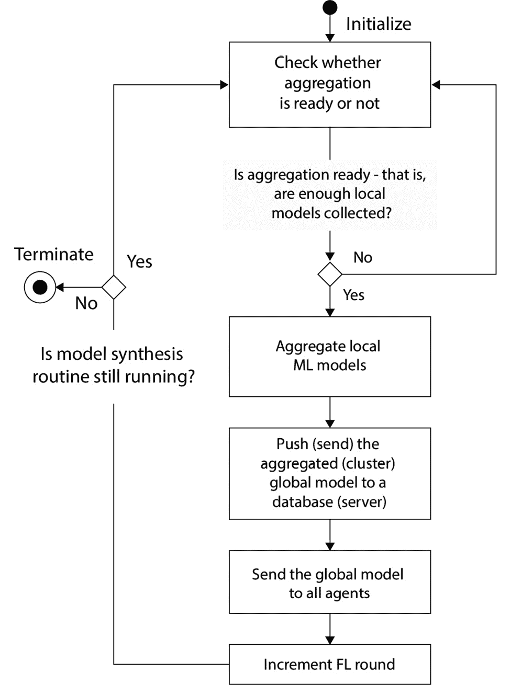

图 3.8 – 模型合成流程：聚合本地机器学习模型

已经解释了如何聚合本地模型以生成全局模型。现在，让我们看看代理端的 FL 周期，包括本地机器学习模型的重新训练过程。

## 代理端本地重训练周期和过程

在分布式智能体中，以下状态转换发生，并且为了 FL 循环的持续运行而重复：

1.  在`等待 _gm`状态，智能体轮询聚合器以接收与全局模型相关的任何更新。基本上，使用轮询方法定期查询更新的全局模型。然而，在某些特定设置下，聚合器可以将更新的全局模型推送到所有智能体。

1.  `gm_ready`是聚合器形成全局模型并由智能体下载后的状态。模型参数在智能体设备中缓存。智能体用下载的全局模型替换其本地机器学习模型。在完全用下载的模型替换本地模型之前，智能体可以检查全局模型的输出是否足够高效以供本地机器学习引擎使用。如果性能不符合预期，用户可以继续使用本地旧模型，直到接收到具有所需性能的全局模型。

1.  接下来，在`训练`状态中，智能体可以本地训练模型以最大化其性能。训练好的模型保存在一个本地数据存储中，其中包含训练示例。智能体的 FL 客户端库确认其准备就绪，可以操作可以异步函数访问保护的本地区域模型。

1.  在本地模型训练完成后，智能体检查新的全局模型是否已发送给智能体。如果全局模型已到达，则丢弃本地训练的机器学习模型，并返回到`gm_ready`状态。

1.  在本地训练完成后，智能体进入`发送`状态，将更新后的本地模型发送回聚合器，然后，智能体返回到`等待 _gm`状态。

*图 3.9* 描述了智能体适应和更新机器学习模型的状态转换：

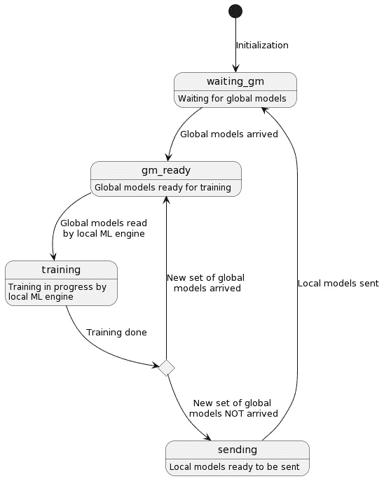

图 3.9 – 智能体侧状态转换以适应和更新机器学习模型

接下来，我们将讨论基于基线输出的偏差的模型解释，这些基线输出用于异常检测和防止模型退化。

## 基于基线输出偏差的模型解释

我们还可以通过查看每个本地模型的输出提供解释框架。以下程序可以被认为是确保本地模型始终可用并且可以部署到生产中的方法：

1.  获取智能体生成的最新机器学习输出以及一个基线输出，该输出可以是用户准备的一个典型期望输出。基线输出可能包括基于过去窗口或操作员、主题专家或基于规则的算法定义的参考点的平均值输出。

1.  计算本地模型输出与基线输出之间的偏差。

1.  通过检查偏差是否超过操作员指定的阈值，可以检测到异常或性能下降。如果检测到异常，可以向操作员发送警报，指示故障或机器学习模型处于异常状态。

既然联邦学习的过程已经解释清楚，让我们来看看模型聚合的基本概念，它是联邦学习的关键部分。

# 模型聚合的基本概念

聚合是联邦学习（FL）中的一个核心概念。实际上，用于聚合模型的策略是联邦学习系统性能的关键理论驱动因素。本节的目的在于介绍在联邦学习系统背景下聚合的高级概念——更深入地讨论高级聚合策略的理论和示例将在*第七章* *模型聚合*中进行。

## 模型聚合究竟意味着什么？

让我们回顾一下在*理解联邦学习系统流程——从初始化到持续运行*章节中讨论的聚合器端周期，在过程中分配给某个聚合器的代理完成本地训练并将这些模型传回该聚合器时。任何聚合策略，或任何聚合这些模型的方式，的目标是产生新的模型，这些模型在构成代理收集的所有数据上逐渐提高性能。

需要记住的一个重要观点是，按照定义，联邦学习是一种受限的分布式学习设置版本，其中每个代理收集的本地数据不能被其他代理直接访问。如果这种限制不存在，可以通过从每个代理收集数据并在联合数据集上训练来使模型在所有数据上简单地表现良好；因此，将这种*集中训练*的模型作为联邦学习方法的靶模型是有意义的。从高层次来看，我们可以将这种不受限制的分布式学习场景视为模型训练前的聚合（在这种情况下，聚合指的是结合每个代理的数据）。由于联邦学习不允许数据被其他代理访问，我们将这种情况视为模型训练后的聚合；在这种情况下，聚合指的是结合每个训练模型从其不同的本地数据集中捕获的智能。总结来说，聚合策略的目标是以一种最终导致泛化模型性能接近相应集中训练模型性能的方式结合模型。

## FedAvg – 联邦平均

为了使一些想法更加具体，让我们先看看最著名且最直接的聚合策略之一，即**联邦平均**（**FedAvg**）。FedAvg 算法的执行过程如下：设为来自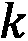个代理的模型的参数，每个代理拥有一个本地数据集大小为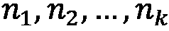。此外，是定义为的总数据集大小。然后，FedAvg 返回以下机器学习模型作为聚合模型：

实际上，我们通过对一组模型进行加权平均来执行 FedAvg，权重与用于训练模型的本地数据集大小成比例。因此，FedAvg 可以应用到的模型类型是那些可以表示为一些参数值集合的模型。深度神经网络是目前这类模型中最引人注目的——大多数分析 FedAvg 性能的结果都是与深度学习模型一起工作的。

真是令人惊讶，这种相对简单的方法竟然能导致最终模型产生泛化。我们可以通过在玩具二维参数空间中观察 FedAvg 的样子，来直观地检验聚合策略的好处：

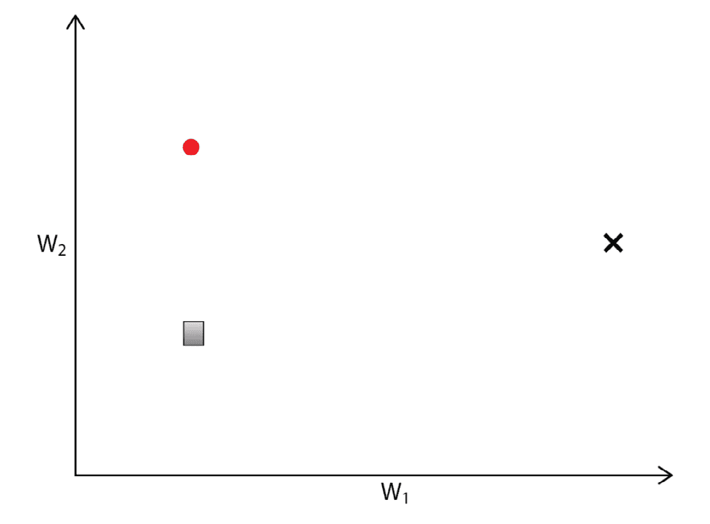

图 3.10 – 来自两个代理（圆形和方形）和目标模型（黑色 x）的二维参数空间中的本地模型

让我们考虑一个有两个新初始化的模型（圆形和方形点）属于不同代理的情况。前面图中的空间代表模型的参数空间，其中每个玩具模型由两个参数定义。随着模型的训练，这些点将在参数空间中移动——目标是接近参数空间中的局部最优解，通常对应于上述集中训练的模型：

图 3.11 – 没有聚合的本地模型参数变化

每个模型都收敛到各自数据集特定的最优解（来自圆形和方形的两个 x 点），这些最优解不具有泛化能力。因为每个代理只能访问数据的一个子集，所以通过本地训练每个模型所达到的局部最优解将与真实的局部最优解不同；这种差异取决于每个代理的底层数据分布的相似程度。如果模型仅在本地进行训练，那么得到的模型可能无法泛化到所有数据：

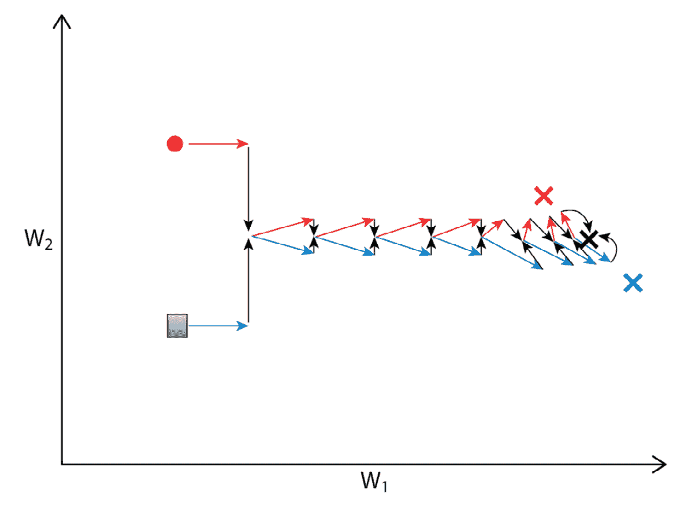

图 3.12 – 添加聚合将局部模型参数移动到每个步骤中两个模型的平均值，导致在目标模型上收敛

在每一步应用 FedAvg 允许我们创建一个聚合模型，该模型最终在参数空间中接近真实局部最优。

此示例展示了 FedAvg 产生泛化模型的基本能力。然而，与真实模型（如高度参数化的深度学习模型）一起工作引入了额外的复杂性，这由 FedAvg 处理，但不是更简单的方法。例如，我们可能会想知道为什么我们不是简单地完全训练每个本地模型，只在最后平均；虽然这种方法在这个玩具案例中可以工作，但观察到仅对真实模型进行一次平均会导致所有数据上的性能较差。FedAvg 过程允许在高度维参数空间内以更稳健的方式达到泛化模型。

本节仅旨在概述联邦学习中的聚合；第七章，*模型聚合*，包含对不同场景中聚合的更详细解释和示例。

我们现在已经理解了 FL 系统如何与基本模型聚合工作的整个过程。在某些应用中，FL 系统可能需要支持大量的代理以实现其可扩展性。下一节将为您提供一些关于如何更平滑地扩展的想法，特别是在去中心化的横向设计中。

# 进一步通过横向设计提高可扩展性

在本节中，我们将探讨在需要支持大量设备和用户时如何进一步提高可扩展性。

在实际案例中，集中式联邦学习提供了控制、易于维护和部署以及低通信开销。如果代理数量不是很大，坚持集中式联邦学习比去中心化联邦学习更有意义。然而，当参与代理的数量变得相当大时，可能值得考虑使用去中心化 FL 架构的横向扩展。如今自动扩展框架的最新发展，如**Kubernetes**框架（https://kubernetes.io/），可以很好地与本章讨论的主题相结合，尽管与 Kubernetes 的实际集成和实现超出了本书的范围。

## 带有半全局模型的横向设计

在某些用例中，需要许多聚合器来聚类一组代理并在这许多聚合器之上创建一个全局模型。谷歌采用集中式方法来实现这一点，正如在论文《迈向大规模联邦学习》中所述，而为管理多个聚合器设置一个集中式节点可能存在一些弹性问题。其想法很简单：定期在某个中央主节点上聚合所有聚类模型。

另一方面，我们可以实现由多个聚合器创建的集群模型的去中心化聚合方式。这种架构基于两个关键思想：

+   在没有主节点的情况下，在单个集群聚合器之间进行的模型聚合

+   半全局模型综合以聚合由其他聚合器生成的集群模型

为了创建半全局模型，去中心化的集群聚合器相互交换它们聚合的集群模型，并近似最优的全局模型。集群聚合器还可以使用数据库定期收集其他集群模型以生成半全局模型。这个框架允许通过综合最新的全局模型来吸收来自分散在许多聚合器上的不同用户集的训练结果，而不需要主节点概念。

基于这种去中心化架构，整个 FL 系统的鲁棒性可以得到增强，因为半全局模型可以在每个集群聚合器独立计算。FL 系统可以进一步扩展，因为每个集群聚合器都负责自己创建自己的半全局模型——不是通过这些聚合器的主节点——因此，去中心化的半全局模型形成具有弹性和移动性。

我们甚至可以将存储上传的本地模型、集群全局模型和半全局模型的数据库解耦。通过将分布式数据库引入 FL 系统，整个系统可以变得更加可扩展、弹性，并且安全，同时还有一些故障转移机制。

例如，每个集群聚合器将集群模型存储在分布式数据库中。集群聚合器可以通过定期从数据库中拉取模型来检索其他聚合器的集群模型。在每个集群聚合器，通过综合拉取的模型生成一个半全局 ML 模型。

*图 3.13* 展示了多聚合器 FL 系统去中心化水平设计的整体架构：

![图 3.13 – 具有多个聚合器的去中心化 FL 系统架构（水平设计）]

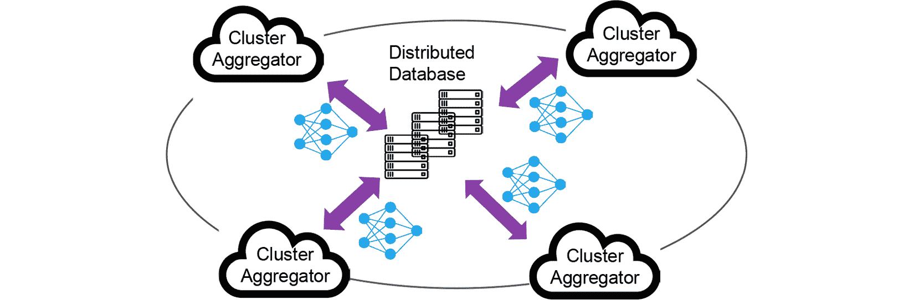

图 3.13 – 具有多个聚合器的去中心化 FL 系统架构（水平设计）

既然我们已经讨论了如何通过半全局模型概念使用水平设计来增强 FL 系统，接下来，我们将探讨分布式数据库框架以进一步确保可扩展性和弹性。

## 分布式数据库

此外，可以通过在数据驱动的分布式数据库中存储历史模型数据来提供模型更新的问责制。**星际文件系统**（**IPFS**）和区块链是众所周知的分布式数据库，它们确保了全局模型更新的问责制。当一个集群聚合器基于其他集群模型生成半全局模型后，该半全局模型被存储在分布式数据库中。分布式数据库使用唯一标识符管理这些模型的信息。为了保持所有模型的一致性，包括本地、集群和半全局模型，每个机器学习模型都被分配了一个全局唯一的标识符，例如哈希值，这可以通过使用**Chord 分布式哈希表**（**Chord DHT**）的概念来实现。Chord DHT 是一个用于互联网应用的可扩展的 P2P 查找协议。

集群聚合器可以在集群模型上存储元数据，例如时间戳和哈希标识符。这为我们提供了对模型合成的进一步问责制，确保集群模型没有被更改。一旦恶意模型可检测，还可以识别出一组发送有害集群模型以破坏半全局模型的聚合器。这些模型可以通过分析集群模型权重的模式或与其他集群模型的偏差来过滤，当差异太大而无法依赖时。

分布式数据库的本质是存储分布式 FL 系统所有易变的状态信息。在发生故障的情况下，FL 系统可以从分布式数据库中恢复。集群聚合器也会根据系统操作员定义的某个间隔交换它们的集群模型。因此，集群模型和聚合器之间的映射表需要与本地、集群和半全局模型上的元信息一起记录在数据库中，例如这些模型的生成时间和训练样本的大小。

## 在多聚合器场景中的异步代理参与

分布式代理可以在他们想要加入 FL 过程时向可连接的聚合器广播参与消息。参与消息可以包含代理的唯一 ID。然后，集群聚合器之一会返回一个集群聚合器 ID，这可能是基于一个共同哈希函数生成的值，代理应该属于该值。*图 3.14*展示了如何使用哈希函数将代理分配给特定的集群聚合器：

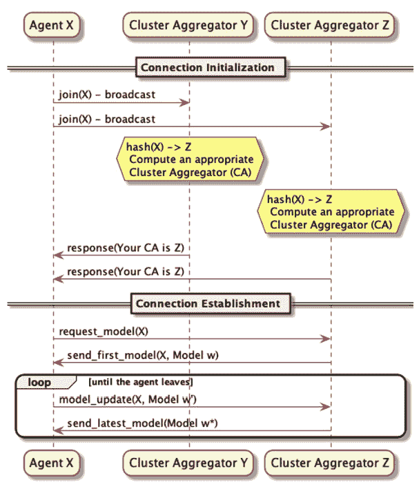

图 3.14 – 代理加入 FL 系统中一个集群聚合器的序列

在下一节中，我们将探讨如何基于聚合多个集群全局模型来生成半全局模型。

## 半全局模型合成

在代理被分配到特定的集群聚合器后，代理开始参与 FL 过程。如果它已注册，则请求基础 ML 模型；否则，它需要上传基础模型以开始本地训练。上传本地模型、生成集群和半全局模型的过程将继续，直到代理或聚合器从系统中断开连接。本地和集群模型上传过程、聚合过程以及半全局模型合成和拉取的序列在*图 3.15*中说明：

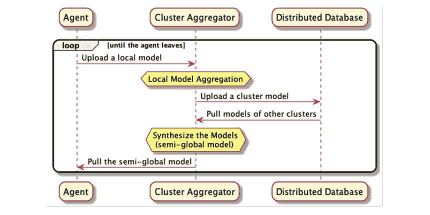

图 3.15 – 从上传本地模型到拉取半全局模型合成过程的序列

让我们看看使用代理、聚合器和分布式数据库之间的流程图来查看半全局模型合成。

聚合器从代理那里接收一个本地模型。在接收本地模型时，模型过滤过程将决定是否接受上传的模型。此框架可以使用许多不同的方法实现，例如检查全局和本地模型权重差异的基本方案。如果模型无效，则简单地丢弃本地模型。

然后，通过聚合所有接受的本地模型创建一个集群模型。聚合器将集群模型存储在数据库中，同时检索其他集群聚合器生成的集群模型。然后从这些集群模型中合成一个半全局模型，并将用于分配给集群聚合器的代理。

*图 3.16*展示了集群聚合器如何使用分布式数据库进行集群和半全局模型合成：

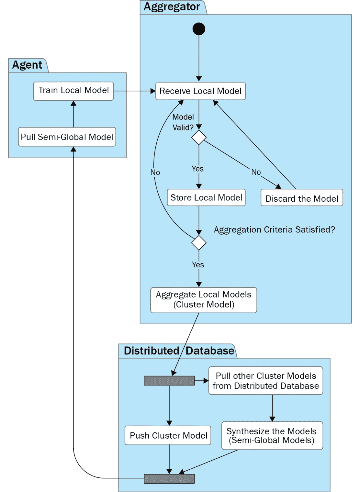

图 3.16 – 半全局模型合成的流程和流程图

聚合器不需要检索每一轮生成的所有集群模型来创建半全局模型。为了合成一个半全局模型，全局模型可以最终基于每个聚合器随机选择的模型子集收敛。采用这种方法，通过在每次更新时妥协创建全局模型的条件，可以增强聚合器的鲁棒性和独立性。此框架还可以解决集中式 FL 系统典型的计算和通信瓶颈。

# 摘要

在本章中，我们讨论了 FL 系统内的潜在架构、流程流程和消息序列。典型的 FL 系统架构包括一个聚合器、代理和数据库服务器。这三个组件不断相互通信以交换系统信息和 ML 模型，以实现模型聚合。

实现良好的 FL 系统的关键是解耦关键组件并仔细设计它们之间的接口。我们专注于其设计的简单性，以便只需向系统中添加额外的组件即可实现进一步的增强。水平分布式设计也有助于实现可扩展的 FL 系统。

在下一章中，我们将讨论在服务器端实现 FL 的实现细节。由于本章已介绍了功能的一些关键方面，您将能够实现基本系统并使用一些机器学习应用程序顺利运行模拟。

# 进一步阅读

本章讨论的一些概念可以通过阅读以下论文进一步探索：

+   Keith Bonawitz, Hubert Eichner, Wolfgang Grieskamp, Dzmitry Huba, Alex Ingerman, Vladimir Ivanov, Chloe Kiddon 等. *迈向大规模联邦学习：系统设计.* 机器学习与系统会议论文集 1 (2019): 374–388, ([`arxiv.org/abs/1902.01046`](https://arxiv.org/abs/1902.01046)).

+   Kairouz, P., McMahan, H. B., Avent, B., Bellet, A., Bennis, M., Bhagoji, A. N.，以及 Zhao, S. (2021). *联邦学习中的进展和开放问题.* *机器学习基础与趋势*, *14 (1 和 2): 1–210*, ([`arxiv.org/abs/1912.04977`](https://arxiv.org/abs/1912.04977)).

+   Stoica, I., Morris, R., Liben-Nowell, D., Karger, D., Kaashoek, M., Dabek, F.，以及 Balakrishnan, H. (2003). Chord: *一个用于互联网应用的可扩展对等查找协议*, IEEE/ACM Transactions on Networking., 第 11 卷，第 1 期，第 17–32 页，([`resources.mpi-inf.mpg.de/d5/teaching/ws03_04/p2p-data/11-18-writeup1.pdf`](https://resources.mpi-inf.mpg.de/d5/teaching/ws03_04/p2p-data/11-18-writeup1.pdf)).

+   Juan Benet. (2014). *IPFS – 基于内容寻址、版本化、P2P 文件系统*, ([`arxiv.org/abs/1407.3561`](https://arxiv.org/abs/1407.3561)).

# 第二部分 联邦学习系统的设计与实现

在本部分，我们将使用 Python 解释**联邦学习**（**FL**）系统的实现原理。您将学习如何设计软件组件并编写 FL 服务器和客户端的基本功能代码。此外，您还能够将您自己的机器学习过程集成到 FL 系统中，并运行和分析基于 FL 的应用程序。

本部分包括以下章节：

+   *第四章*, *使用 Python 实现联邦学习服务器*

+   *第五章*, *联邦学习客户端实现*

+   *第六章*, *运行联邦学习系统并分析结果*

+   *第七章*, *模型聚合*
