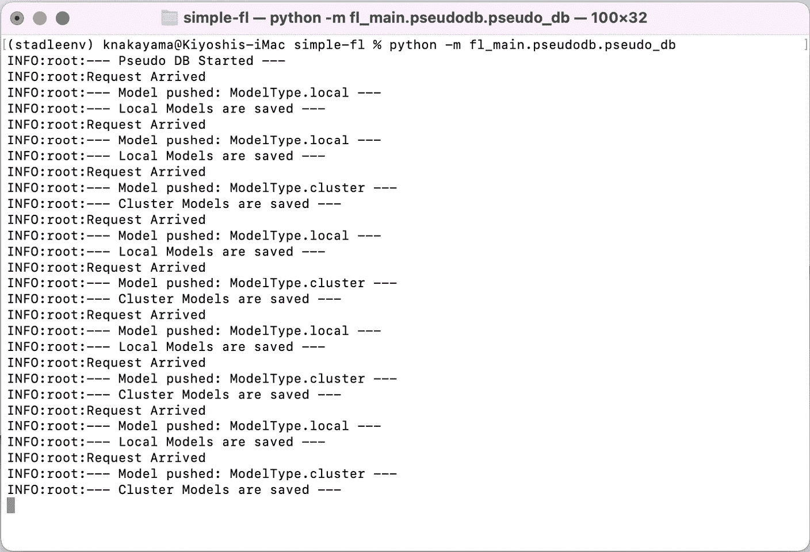
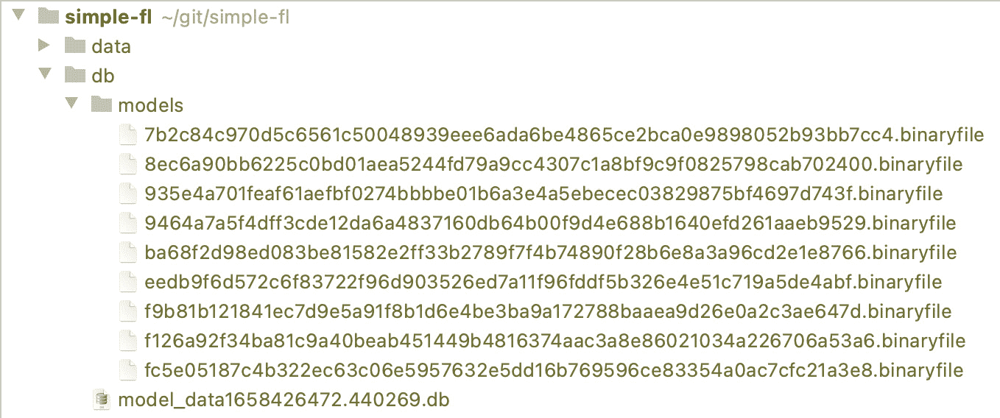
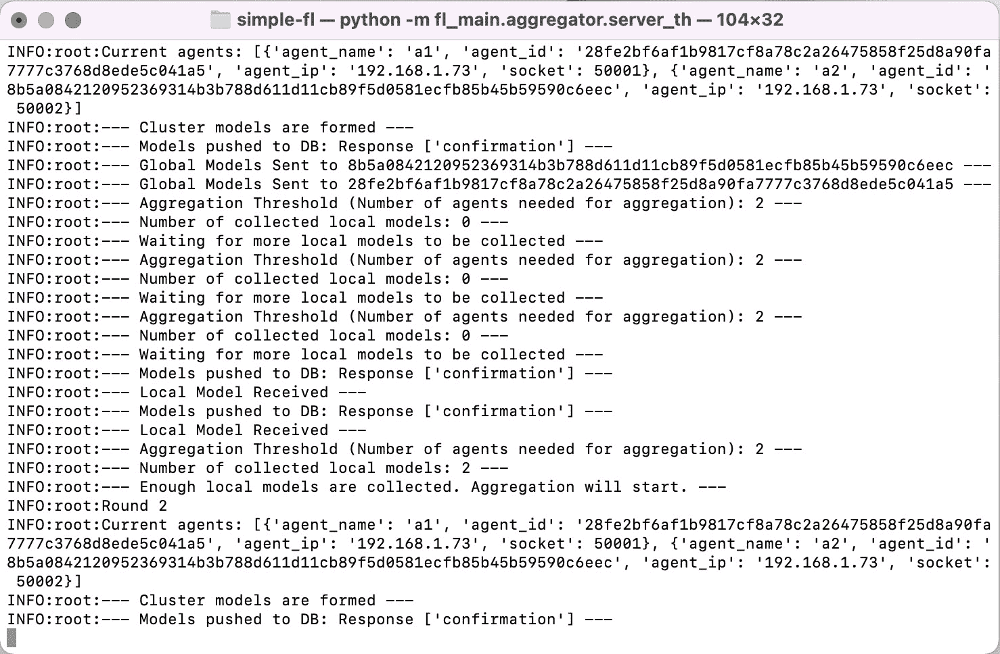
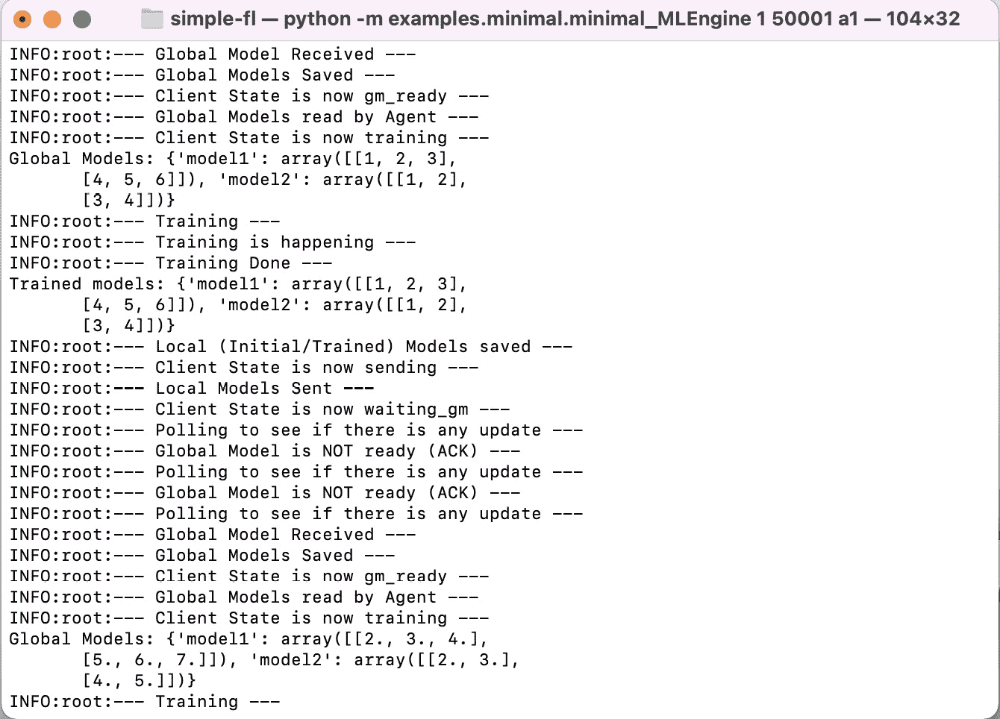
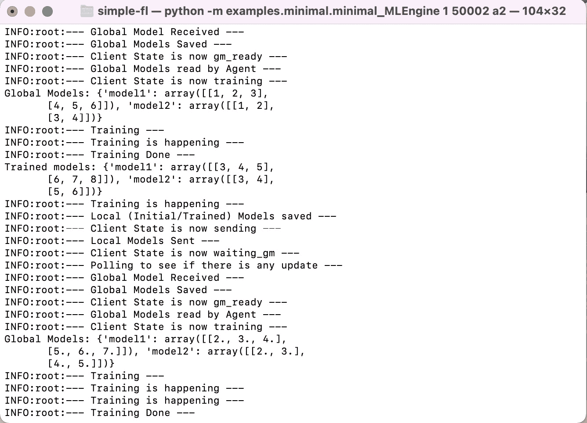
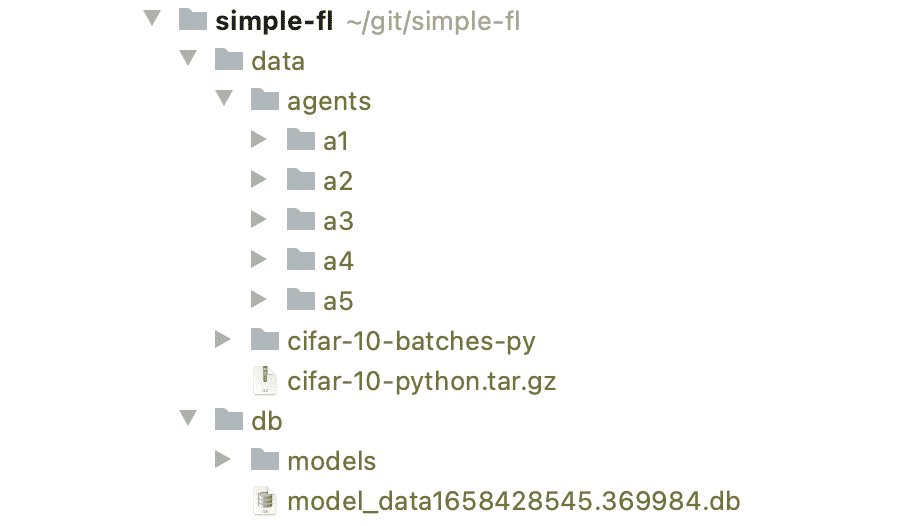
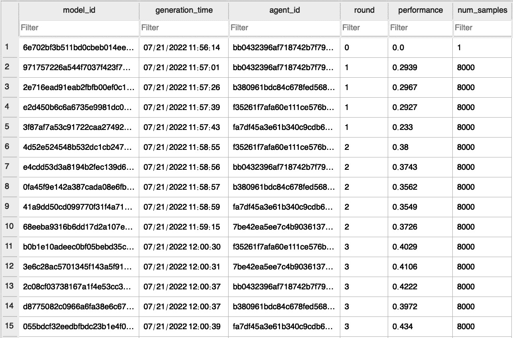

# 第六章：运行联邦学习系统并分析结果

在本章中，你将运行在前几章中讨论过的**联邦学习**（**FL**）系统，并分析系统行为和聚合模型的输出结果。我们将首先解释 FL 系统组件的配置，以便正确运行系统。基本上，在安装我们 GitHub 示例提供的简单 FL 系统之后，你首先需要选择运行数据库和聚合模块的服务器机器或实例。然后，你可以运行代理程序连接到已经运行的聚合器。每个代理端配置中都需要正确设置聚合器的 IP 地址。此外，还有一个模拟模式，这样你可以在同一台机器或笔记本电脑上运行所有组件，仅测试 FL 系统的功能。在成功运行 FL 系统的所有模块后，你将能够看到在数据库服务器和代理端设置的路径下创建的数据文件夹和数据库。你将能够检查本地和全局模型，包括训练和聚合的模型，以便你可以从数据文件夹中下载最新的或表现最佳的模型。

此外，你还可以看到在最小引擎和图像分类上运行 FL 系统的示例。通过审查生成的模型和性能数据，你可以理解聚合算法以及聚合器和代理之间模型的实际交互。

在本章中，我们将涵盖以下主要主题：

+   配置和运行 FL 系统

+   理解最小示例运行时会发生什么

+   运行图像分类和分析结果

# 技术要求

本章中介绍的所有代码文件都可以在 GitHub 上找到（https://github.com/tie-set/simple-fl）。

重要注意事项

你可以使用代码文件用于个人或教育目的。请注意，我们不会支持商业部署，也不会对使用代码造成的任何错误、问题或损害负责。

# 配置和运行 FL 系统

配置 FL 系统及其环境相对简单，请遵循下一小节中的说明。

## 安装 FL 环境

首先，要运行前一章中讨论的 FL 系统，请使用以下命令将以下存储库克隆到你想要运行 FL 的机器上：

```py
git clone https://github.com/tie-set/simple-fl
```

一旦完成克隆过程，请在命令行中将目录更改为`simple-fl`文件夹。模拟运行可以使用一台机器或使用多个系统进行。为了在一台或多台机器上运行 FL 过程，这些机器包括 FL 服务器（聚合器）、FL 客户端（代理）和数据库服务器，你应该创建一个`conda`虚拟环境并激活它。

要在 macOS 中创建`conda`环境，你需要输入以下命令：

```py
conda env create -n federatedenv -f ./setups/federatedenv.yaml
```

如果你使用的是 Linux 机器，你可以使用以下命令创建`conda`环境：

```py
conda env create -n federatedenv -f ./setups/federatedenv_linux.yaml
```

然后，在运行代码时激活`conda`环境`federatedenv`。为了你的信息，`federatedenv.yaml`和`federatedenv_linux.yaml`文件可以在`simple-fl` GitHub 仓库的`setups`文件夹中找到，并包含本书中代码示例所使用的库。

如同 GitHub 仓库的`README`文件所述，运行此程序主要需要三个组件：数据库服务器、聚合器和代理（们）。如果你想在单台机器上运行模拟，你只需在该机器上安装一个`conda`环境（`federatedenv`）即可。

如果你想要创建一个分布式环境，你需要在你想要使用的所有机器上安装`conda`环境，例如在云实例上的数据库服务器、聚合器服务器以及本地客户端机器。

现在 FL 过程的安装过程已经准备就绪，让我们继续使用配置文件来配置 FL 系统。

## 使用 JSON 文件为每个组件配置 FL 系统

首先，编辑提供的 GitHub 仓库`setups`文件夹中的配置 JSON 文件。这些 JSON 文件被数据库服务器、聚合器和代理读取以配置它们的初始设置。再次提醒，配置细节如下所述。

### config_db.json

`config_db.json`文件用于配置数据库服务器。使用以下信息来正确操作服务器：

+   `db_ip`：数据库服务器的 IP 地址（例如，`localhost`）。如果你想在云实例上运行数据库服务器，例如在**亚马逊网络服务**（**AWS**）EC2 实例上，你可以指定实例的私有 IP 地址。

+   `db_socket`：数据库和聚合器之间使用的套接字编号（例如，`9017`）。

+   `db_name`：SQLite 数据库的名称（例如，`sample_data`）。

+   `db_data_path`：SQLite 数据库的路径（例如，`./db`）。

+   `db_model_path`：保存所有`./db/models`的目录路径。

### config_aggregator.json

`config_aggregator.json`文件用于在 FL 服务器中配置聚合器。使用以下信息来正确操作聚合器：

+   `aggr_ip`：聚合器的 IP 地址（例如，`localhost`）。如果你想在云实例上运行聚合器服务器，例如 AWS EC2 实例，你可以指定实例的私有 IP 地址。

+   `db_ip`：数据库服务器的 IP 地址（例如，`localhost`）。如果你想要连接到托管在不同云实例上的数据库服务器，你可以指定数据库实例的公网 IP 地址。如果你将数据库服务器托管在与聚合器实例相同的云实例上，你可以指定实例的相同私有 IP 地址。

+   `reg_socket`：代理首次连接到聚合器时使用的套接字编号（例如，`8765`）。

+   `recv_socket`: 用于从代理上传本地模型或轮询聚合器的套接字编号。代理将通过与聚合器通信来学习此套接字信息（例如，`7890`）。

+   `exch_socket`: 当使用推送方法时，用于从聚合器将全局模型发送回代理的套接字编号。代理将通过与聚合器通信来学习此套接字信息（例如，`4321`）。

+   `db_socket`: 数据库和聚合器之间使用的套接字编号（例如，`9017`）。

+   `round_interval`: 代理检查是否有足够模型以启动聚合步骤的时间间隔（单位：秒；例如，`5`）。

+   `aggregation_threshold`: 需要收集的本地模型百分比，以启动聚合步骤（例如，`0.85`）。

+   `polling`: 指定是否使用轮询方法的标志。如果标志为`1`，则使用轮询方法；如果标志为`0`，则使用推送方法。此值需要在聚合器和代理之间相同。

### config_agent.json

`config_agent.json`文件用于在 FL 客户端中配置代理。使用以下信息正确操作代理：

+   `aggr_ip`: 聚合器服务器的 IP 地址（例如，`localhost`）。如果你想连接到托管在云实例上的聚合器服务器，例如 AWS EC2 实例，你可以指定聚合器实例的公网 IP 地址。

+   `reg_socket`: 代理首次加入聚合器时使用的套接字编号（例如，`8765`）。

+   `model_path`: 代理机器中本地目录的路径，用于保存本地和全局模型以及一些状态信息（例如，`./data/agents`）。

+   `local_model_file_name`: 在代理机器中保存本地模型的文件名（例如，`lms.binaryfile`）。

+   `global_model_file_name`: 在代理机器中保存全局模型的文件名（例如，`gms.binaryfile`）。

+   `state_file_name`: 存储代理状态的文件名（例如，`state`）。

+   `init_weights_flag`: 如果权重以特定值初始化，则为`1`，否则为`0`，其中权重以零初始化。

+   `polling`: 指定是否使用轮询方法的标志。如果标志为`1`，则使用轮询方法；如果标志为`0`，则使用推送方法。此值需要在聚合器和代理之间相同。

现在，可以使用本节中解释的配置文件配置 FL 系统。接下来，你将在 FL 服务器端运行数据库和聚合器。

## 在 FL 服务器上运行数据库和聚合器

在本节中，你将在 FL 服务器端配置数据库和聚合器。然后，你将编辑`simple-fl` GitHub 仓库中`setups`文件夹中的配置文件。之后，你将首先运行`pseudo_db`，然后运行`server_th`，如下所示：

```py
python -m fl_main.pseudodb.pseudo_db
python -m fl_main.aggregator.server_th
```

重要注意事项

如果数据库服务器和聚合服务器运行在不同的机器上，您需要指定数据库服务器或聚合服务器实例的 IP 地址。数据库服务器的 IP 地址可以在`setups`文件夹中的`config_aggregator.json`文件中修改。此外，如果数据库和聚合实例都在公共云环境中运行，这些服务器的配置文件 IP 地址需要是私有 IP 地址。代理需要使用公共 IP 地址和连接套接字（端口号）连接到聚合器，并且连接套接字（端口号）需要打开以接受入站消息。

在您启动数据库和聚合服务器后，您将在控制台中看到如下消息：

```py
# Database-side Console Example
INFO:root:--- Pseudo DB Started ---
```

在控制台的聚合端，您将看到如下内容：

```py
# Aggregator-side Console Example
INFO:root:--- Aggregator Started ---
```

在这个聚合服务器背后，模型合成模块每 5 秒运行一次，它开始检查收集到的本地模型数量是否超过了聚合阈值定义的数量。

我们现在已经运行了数据库和聚合模块，并准备好使用 FL 客户端运行最小示例。

## 使用 FL 客户端运行最小示例

在上一章中，我们讨论了将本地 ML 引擎集成到 FL 系统中的方法。在这里，我们使用一个没有实际训练数据的最小样本来尝试运行已经讨论过的 FL 系统。这个最小示例可以作为实现任何本地分布式 ML 引擎时的模板。

在运行最小示例之前，您应该检查数据库和聚合服务器是否已经启动。然后，运行以下命令：

```py
python -m examples.minimal.minimal_MLEngine
```

在这种情况下，仅连接了一个具有最小 ML 引擎的代理。因此，聚合会在默认代理上传本地模型时发生。

注意，如果聚合服务器运行在不同的机器上，您需要指定聚合服务器或实例的公共 IP 地址。聚合服务器的 IP 地址可以在`setups`文件夹中的`config_agent.json`文件中修改。我们还建议在云实例中运行聚合器和数据库时将`polling`标志设置为`1`。

*图 6.1* 展示了运行数据库服务器时的控制台屏幕示例。



图 6.1 – 数据库端控制台示例

*图 6.2* 展示了运行聚合器时的控制台屏幕示例：


图 6.2 – 聚合端控制台示例

*图 6.3* 展示了运行代理时的控制台屏幕示例。


图 6.3 – 代理端控制台示例

现在我们知道了如何运行所有 FL 组件：数据库、聚合器和代理。在下一节中，我们将检查运行 FL 系统时如何生成输出。

## 数据和数据库文件夹

运行 FL 系统后，您将注意到数据库文件夹和数据文件夹是在您在数据库和代理的配置文件中指定的位置创建的。

例如，`db`文件夹是在`db_data_path`下创建的，在`config_db.json`文件中写入。在数据库文件夹中，您将找到 SQLite 数据库，例如`model_data12345.db`，其中存储了本地和集群全局模型的元数据，以及一个包含所有由代理上传的实际本地模型和由聚合器创建的全局模型的`models`文件夹。

*图 6.4* 展示了在`db`文件夹中存储的二进制文件格式下的 SQLite 数据库和 ML 模型文件，这些文件是通过运行最小示例代码创建的：



图 6.4 – 存储在 db 文件夹中的 SQLite 数据库和 ML 模型文件的二进制文件格式

`data`文件夹位于代理设备上的`model_path`位置，这是一个在`config_agent.json`中定义的字符串值。在最小示例的运行示例中，以下文件在`data/agents/default-agent`文件夹下创建：

+   `lms.binaryfile`: 包含由代理创建的本地模型的二进制文件

+   `gms.binaryfile`: 包含由聚合器创建的全局模型的二进制文件，发送回代理

+   `state`: 一个包含整数值的文件，表示客户端自身的状态

*图 6.5* 展示了代理端数据的结构，包括以二进制文件格式表示的全局和本地 ML 模型，以及反映 FL 客户端状态的文件：


图 6.5 – 包含全局和本地 ML 模型以及以二进制文件格式表示的客户端状态的代理数据

现在我们已经了解了关键数据，如全局和本地模型，存储的位置。接下来，我们将更详细地查看数据库，使用 SQLite。

## SQLite 数据库

在`db`文件夹中创建的数据库可以使用任何工具查看，以显示可以打开`***.db`格式文件的 SQLite 数据库。数据库表在以下章节中定义。

### 数据库中的本地模型

*图 6.6* 展示了与上传的本地模型相关的示例数据库条目，其中每个条目列出了本地模型 ID、模型生成的时间、上传本地模型的代理 ID、轮次信息、性能指标和数据样本数量：


图 6.6 – 与上传的本地模型相关的示例数据库条目

### 数据库中的集群模型

*图 6.7*显示了与上传的集群模型相关的样本数据库条目，其中每个条目列出了集群模型 ID、模型创建时间、创建此集群模型的聚合器 ID、轮次信息和数据样本数量：


图 6.7 – 与上传的集群模型相关的样本数据库条目

现在我们已经学会了如何使用最小示例配置和运行联邦学习系统，以及如何检查结果。在下一节中，你将了解联邦学习系统的行为以及当运行最小示例时会发生什么。

# 理解最小示例运行时发生的情况

逐步理解整个联邦学习系统的行为将有助于你设计启用联邦学习的应用程序，并进一步增强联邦学习系统本身。让我们首先看看当我们只运行一个代理时会发生什么，通过打印代理和聚合器模块的一些过程。

## 只运行一个最小代理

在运行数据库和聚合器服务器之后，让我们运行最小代理并看看会发生什么。当代理以最小机器学习引擎启动时，你将在代理控制台中看到以下消息：

```py
# Agent-side Console Example
INFO:root:--- This is a minimal example ---
INFO:root:--- Agent initialized —
INFO:root:--- Your IP is xxx.xxx.1.101 ---
```

当代理初始化用于联邦学习的模型时，它会显示这条消息，如果你查看`state`文件，它已经进入了`发送`状态，当联邦学习客户端启动时，将触发向聚合器发送模型：

```py
# Agent-side Console Example
INFO:root:--- Model template generated ---
INFO:root:--- Local (Initial/Trained) Models saved ---
INFO:root:--- Client State is now sending ---
```

然后，在用`start_fl_client`函数启动客户端之后，参与消息被发送到聚合器。以下是发送到聚合器的参与消息：

```py
[
        <AgentMsgType.participate: 0>, # Agent Message Type
        'A89fd1c2d9*****', # Agent ID
        '047b18ddac*****',    # Model ID
        {
                'model1': array([[1, 2, 3], [4, 5, 6]]), 
                'model2': array([[1, 2], [3, 4]])
        }, # ML Models
        True,    # Init weights flag
        False, # Simulation flag
        0, # Exch Port
        1645141807.846751, # Generated Time of the models
        {'accuracy': 0.0, 'num_samples': 1}, # Meta information 
        'xxx.xxx.1.101' # Agent's IP Address
]
```

发送到聚合器的参与消息包括消息类型、代理 ID、模型 ID、带有 NumPy 的机器学习模型、初始化权重标志、模拟标志、交换端口号、模型生成时间以及性能指标和代理的 IP 地址等元信息。

代理收到聚合器发送的确认连接的欢迎消息，其中还包含以下信息：

```py
# Agent-side Console Example
INFO:root:--- Init Response: [
        <AggMsgType.welcome: 0>, # Message Type
        '4e2da*****', # Aggregator ID
        '23487*****', # Model ID 
        {'model1': array([[1, 2, 3], [4, 5, 6]]), 
         'model2': array([[1, 2], [3, 4]])}, # Global Models
        1, # FL Round
        'A89fd1c2d9*****', # Agent ID
        '7890', # exch_socket number
        '4321' # recv_socket number
] ---
```

在聚合器端，在此代理向聚合器发送参与消息后，聚合器确认参与并将此初始模型推送到数据库：

```py
# Aggregator-side Console Example
INFO:root:--- Participate Message Received ---
INFO:root:--- Model Formats initialized, model names: ['model1', 'model2'] ---
INFO:root:--- Models pushed to DB: Response ['confirmation'] ---
INFO:root:---  Global Models Sent to A89fd1c2d9***** ---
INFO:root:--- Aggregation Threshold (Number of agents needed for aggregation): 1 ---
INFO:root:--- Number of collected local models: 0 ---
INFO:root:--- Waiting for more local models to be collected ---
```

在数据库服务器端控制台中，你还可以检查本地模型是否从聚合器发送过来，并且模型已保存在数据库中：

```py
# DB-side Console Example
INFO:root:Request Arrived
INFO:root:--- Model pushed: ModelType.local ---
INFO:root:--- Local Models are saved ---
```

在聚合器将全局模型发送回代理后，代理接收并保存它，并将客户端状态从`等待 _gm`更改为`gm_ready`，表示全局模型已准备好在本地重新训练：

```py
# Agent-side Console Example
INFO:root:--- Global Model Received ---
INFO:root:--- Global Models Saved ---
INFO:root:--- Client State is now gm_ready ---
```

这里是聚合器发送给代理的消息，包括全局模型。消息内容包含消息类型、聚合器 ID、集群模型 ID、联邦学习轮次和带有 NumPy 的机器学习模型：

```py
[
        <AggMsgType.sending_gm_models: 1>, # Message Type
        '8c6c946472*****', # Aggregator ID
        'ab633380f6*****', # Global Model ID
        1, # FL Round Info 
        {     
                'model1': array([[1., 2., 3.],[4., 5., 6.]]), 
                'model2': array([[1., 2.],[3., 4.]])
        } # ML models
]
```

然后，代理读取全局模型，以便使用它们进行本地训练，并将客户端状态更改为`训练`：

```py
# Agent-side Console Example
INFO:root:--- Global Models read by Agent ---
INFO:root:--- Client State is now training ---
INFO:root:--- Training ---
INFO:root:--- Training is happening ---
INFO:root:--- Training is happening ---
INFO:root:--- Training Done ---
INFO:root:--- Local (Initial/Trained) Models saved ---
INFO:root:--- Client State is now sending ---
INFO:root:--- Local Models Sent ---
INFO:root:--- Client State is now waiting_gm ---
INFO:root:--- Polling to see if there is any update (shown only when polling) ---
INFO:root:--- Global Model Received ---
INFO:root:--- The global models saved ---
```

在前面的本地训练过程之后，代理继续将训练好的本地模型`发送`到聚合器，并将客户端状态更改为`waiting_gm`，这意味着它正在等待具有轮询机制的全球模型。

这里是发送给聚合器的消息，作为训练好的本地模型消息。消息内容包含消息类型、代理 ID、模型 ID、机器学习模型、模型的生成时间以及如性能数据之类的元数据：

```py
[
        <AgentMsgType.update: 1>, # Agent's Message Type
        'a1031a737f*****', # Agent ID
        'e89ccc5dc9*****', # Model ID
        {
                'model1': array([[1, 2, 3],[4, 5, 6]]), 
                'model2': array([[1, 2],[3, 4]])
        }, # ML Models
            1645142806.761495, # Generated Time of the models
        {'accuracy': 0.5, 'num_samples': 1} # Meta information
]
```

然后，在聚合器中，在本地模型被推送到数据库后，它显示了缓冲区中的变化，收集到的本地模型数量从 0 增加到 1，从而表明已收集足够的本地模型以开始聚合：

```py
# Aggregator-side Console Example
INFO:root:--- Models pushed to DB: Response ['confirmation'] ---
INFO:root:--- Local Model Received ---
INFO:root:--- Aggregation Threshold (Number of agents needed for aggregation): 1 ---
INFO:root:--- Number of collected local models: 1 ---
INFO:root:--- Enough local models are collected. Aggregation will start. ---
```

然后，第一轮的聚合发生，集群全局模型形成，在收到代理的轮询消息后推送到数据库，并发送给代理。聚合器也可以通过推送方法将消息推回代理：

```py
# Aggregator-side Console Example
INFO:root:Round 1
INFO:root:Current agents: [{'agent_name': 'default_agent', 'agent_id': 'A89fd1c2d9*****', 'agent_ip': 'xxx.xxx.1.101', 'socket': 7890}]
INFO:root:--- Cluster models are formed ---
INFO:root:--- Models pushed to DB: Response ['confirmation'] ---
INFO:root:--- Global Models Sent to A89fd1c2d9***** ---
```

在数据库服务器端，集群全局模型被接收并推送到数据库：

```py
# DB-side Console Example
INFO:root:Request Arrived
INFO:root:--- Model pushed: ModelType.cluster ---
INFO:root:--- Cluster Models are saved ---
```

在生成并保存了即将到来的联邦学习轮次的集群模型后，本节中的此过程会重复进行，并且联邦学习轮次将继续使用此交互机制进行。

如果您查看本地和集群全局模型，它们如下所示：

```py
{
        'model1': array([[1, 2, 3],[4, 5, 6]]), 
        'model2': array([[1, 2],[3, 4]])
}
```

这意味着即使发生聚合，也始终只使用一个固定的模型，因此全局模型与初始模型完全相同，因为这里使用了虚拟训练过程。

我们现在将查看在下一节中运行两个最小代理的结果。

## 运行两个最小代理

在数据库和聚合器服务器运行的情况下，您可以使用`simple-fl/examples/minimal`文件夹中的`minimal_MLEngine.py`文件运行许多代理。

您应该通过指定聚合器的 IP 地址来从不同的本地机器运行两个单独的代理，以将那些代理与最小机器学习示例连接起来。

您也可以通过为单个代理指定不同的端口号来从同一台机器运行多个代理以进行模拟。

在 GitHub 上`simple-fl`存储库中提供的代码中，您可以通过使用以下命令运行多个代理：

```py
python -m examples.minimal.minimal_MLEngine [simulation_flag] [gm_recv_port] [agent_name]
```

要进行模拟，应将`simulation_flag`设置为`1`。`gm_recv_port`是从聚合器接收全局模型的端口号。聚合器将通过参与消息的响应通知代理端口号。此外，`agent_name`是本地代理的名称和存储状态和模型文件的目录名称。这对于每个代理都需要是唯一的。

例如，您可以使用以下命令运行第一个和第二个代理：

```py
# First agent
python -m examples.minimal.minimal_MLEngine 1 50001 a1
# Second agent
python -m examples.minimal.minimal_MLEngine 1 50002 a2
```

如果需要，您可以编辑`setups`文件夹中的配置 JSON 文件。在这种情况下，`agg_threshold`被设置为`1`。

当您在运行多个代理的最小示例的数据库服务器上运行模拟时，控制台屏幕将类似于*图 6.1*中的屏幕。

*图 6.8* 展示了在聚合器服务器上运行使用虚拟 ML 模型的最小示例的模拟控制台屏幕：



图 6.8 – 示例：运行最小示例的聚合器端控制台连接两个代理

*图 6.9* 展示了在其中一个代理中运行使用虚拟 ML 模型的最小示例的模拟控制台屏幕：



图 6.9 – 示例：代理 1 的控制台运行使用虚拟 ML 模型的最小示例

*图 6.10* 展示了在另一个代理中运行使用虚拟 ML 模型的最小示例的模拟控制台屏幕：



图 6.10 – 示例：代理 2 的控制台运行使用虚拟 ML 模型的最小示例

现在我们知道了如何使用两个代理运行最小示例。为了进一步了解使用此示例的 FL 流程，我们将回答以下问题：

+   对于简单情况，聚合是否已经正确完成？

+   `FedAvg` 算法是否被正确应用？

+   聚合器阈值是否与连接的代理一起工作？

在运行和连接两个代理后，聚合器将等待接收来自两个连接代理的两个模型，如下所示：

```py
# Aggregator-side Console Example
INFO:root:--- Aggregation Threshold (Number of agents needed for aggregation): 2 ---
INFO:root:--- Number of collected local models: 0 ---
INFO:root:--- Waiting for more local models to be collected ---
```

在这种情况下，聚合器阈值在 `setups` 文件夹中的 `config_aggregator.json` 文件中设置为 `1.0`，因此聚合器需要收集所有连接代理的模型，这意味着它需要从连接到聚合器的所有代理那里接收本地 ML 模型。

然后，它从其中一个代理那里接收一个模型，收集到的本地模型数量增加到 1。然而，由于聚合器仍然缺少一个本地模型，它还没有开始聚合：

```py
# Aggregator-side Console Example
INFO:root:--- Local Model Received ---
INFO:root:--- Aggregation Threshold (Number of agents needed for aggregation): 2 ---
INFO:root:--- Number of collected local models: 1 ---
INFO:root:--- Waiting for more local models to be collected ---
```

在代理端，在将本地模型发送到聚合器后，它将等待聚合器创建集群全局模型并将其发送回代理。这样，您可以在代理端同步 FL 流程，并在全局模型发送回代理并准备重新训练时自动化本地训练过程。

在聚合器收到另一个本地模型后，收集到的模型数量足够开始聚合过程：

```py
# Aggregator-side Console Example
INFO:root:--- Local Model Received ---
INFO:root:--- Aggregation Threshold (Number of agents needed for aggregation): 2 ---
INFO:root:--- Number of collected local models: 2 ---
INFO:root:--- Enough local models are collected. Aggregation will start. ---
```

它最终将开始第一轮的聚合，如下所示：

```py
# Aggregator-side Console Example
INFO:root:Round 1
INFO:root:Current agents: [{'agent_name': 'a1', 'agent_id': '1f503*****', 'agent_ip': 'xxx.xxx.1.101', 'socket': 50001}, {'agent_name': 'a2', 'agent_id': '70de8*****', 'agent_ip': 'xxx.xxx.1.101', 'socket': 50002}]
INFO:root:--- Cluster models are formed ---
INFO:root:--- Models pushed to DB: Response ['confirmation'] ---
INFO:root:--- Global Models Sent to 1f503***** ---
INFO:root:--- Global Models Sent to 70de8***** ---
```

在这里，让我们看看在本地训练的代理端 ML 模型：

```py
# Agent 1's Console Example
INFO:root:--- Training ---
INFO:root:--- Training is happening ---
INFO:root:--- Training Done ---
Trained models: {'model1': array([[1, 2, 3],
             [4, 5, 6]]), 'model2': array([[1, 2],
             [3, 4]])}
INFO:root:--- Local (Initial/Trained) Models saved ---
```

此外，让我们看看另一个代理在本地训练的 ML 模型：

```py
# Agent 2's Console Example
INFO:root:--- Training ---
INFO:root:--- Training is happening ---
INFO:root:--- Training Done ---
Trained models: {'model1': array([[3, 4, 5],
             [6, 7, 8]]), 'model2': array([[3, 4],
             [5, 6]])}
INFO:root:--- Local (Initial/Trained) Models saved ---
```

与从代理 1 和 2 发送到聚合器的模型一样，如果 `FedAvg` 被正确应用，全局模型应该是这两个模型的平均值。在这种情况下，代理 1 和 2 的数据样本数量相同，因此全局模型应该是这两个模型的平均值。

因此，让我们看看在聚合器中生成的全局模型：

```py
# Agent 1 and 2's Console Example
Global Models: {'model1': array([[2., 3., 4.],
             [5., 6., 7.]]), 'model2': array([[2., 3.],
             [4., 5.]])}
```

收到的模型是两个本地模型的平均值，因此平均已经正确执行。

数据库和数据文件夹是在代理配置文件中指定的`model_path`下创建的。您可以使用 SQLite 查看器应用程序查看数据库值，并基于模型 ID 查找一些模型。

现在我们已经通过最小示例运行了解了正在发生的事情，在下一节中，我们将使用一个**卷积神经网络**（**CNN**）的图像分类模型运行一个真实的机器学习应用。

# 运行图像分类和分析结果

本例演示了使用此 FL 框架进行图像分类任务的使用。我们将使用著名的图像数据集 CIFAR-10（URL：[`www.cs.toronto.edu/~kriz/cifar.html`](https://www.cs.toronto.edu/~kriz/cifar.html)），以展示 ML 模型如何通过 FL 过程随时间增长。然而，这个例子只是为了使用我们之前讨论的 FL 系统，并不专注于最大化图像分类任务的性能。

## 准备 CIFAR-10 数据集

以下是与数据集大小、训练和测试数据、类别数量和图像大小相关的信息：

+   数据集大小：60,000 张图像

+   训练数据：50,000 张图像

+   测试数据：10,000 张图像

+   类别数量：10（飞机、汽车、鸟、猫、鹿、狗、青蛙、马、船和卡车）

+   每个类别有 6,000 张图像

+   图像大小：32x32 像素，彩色

*图 6.11*展示了数据集中 10 个不同类别的样本图片集合，每个类别有 10 个随机图像：

![图 6.11 – 数据集中的类别以及每个类别的 10 个随机图像（图像来自 https://www.cs.toronto.edu/~kriz/cifar.html）]

](img/B18369_06_11.jpg)

图 6.11 – 数据集中的类别以及每个类别的 10 个随机图像（图像来自 https://www.cs.toronto.edu/~kriz/cifar.html）

现在数据集已经准备好了，我们将探讨用于 FL 过程的 CNN 模型。

## 用于图像分类的 FL 机器学习模型

这是本图像分类示例中使用的 CNN 模型机器学习模型架构的描述。要了解更多关于 CNN 的信息，您可以找到许多有用的学习资源，例如[`cs231n.github.io/convolutional-networks/`](https://cs231n.github.io/convolutional-networks/)：

+   Conv2D

+   MaxPool2D（最大池化）

+   Conv2D

+   3 个全连接层

定义 CNN 模型的脚本已经设计好，可以在 GitHub 上的`simple-fl`仓库中的`examples/image_classification`目录下的`cnn.py`中找到。接下来，我们将使用 FL 系统运行图像分类应用。

## 如何使用 CNN 运行图像分类示例

如本章开头所述的安装步骤中提到，我们首先使用 `federatedenv` 安装必要的库，然后安装 `torch` 和 `torchvision`：

```py
pip install torch
pip install torchvision
```

您可以通过 GitHub 上 `simple-fl` 仓库的 `setups` 文件夹中的 JSON 配置文件来配置许多设置。有关更多详细信息，您可以在我们的 `setups` 文档中阅读配置文件的一般描述 ([`github.com/tie-set/simple-fl/tree/master/setups`](https://github.com/tie-set/simple-fl/tree/master/setups))。

首先，您可以运行两个代理。您可以通过指定适当的端口号来增加在同一设备上运行的代理数量。

如您所知，您首先可以运行数据库和聚合器：

```py
# FL server side
python -m fl_main.pseudodb.pseudo_db
python -m fl_main.aggregator.server_th
```

然后，启动第一个和第二个代理以运行图像分类示例：

```py
# First agent
python -m examples.image_classification.classification
_engine 1 50001 a1
# Second agent
python -m examples.image_classification.classification
_engine 1 50002 a2
```

为了模拟实际的 FL 场景，每个代理可访问的训练数据量可以限制为特定数量。这应该在 `classification_engine.py` 中的 `num_training_data` 变量中指定。默认情况下，每轮使用 8,000 张图像（2,000 个批次）。

现在我们可以使用 CNN 模型运行两个代理来测试 FL 过程，让我们通过运行图像分类示例来进一步查看结果。

## 使用 CNN 进行图像分类的运行评估

性能数据（每个本地模型集群模型的准确率）存储在我们的数据库中。您可以通过访问相应的 `.db` 文件来查看性能历史。

`DataManager` 实例（在 `ic_training.py` 中定义）有一个函数可以返回一批图像及其标签（`get_random_images`）。您可以使用此函数通过训练的 CNN 在特定图像上显示实际标签和预测标签。

*图 6.12* 展示了我们在自己一侧进行的实验运行的学习性能图；当您使用自己的设置运行时，结果可能会有所不同：


图 6.12 – 使用 CNN 进行图像分类的 FL 实验运行的学习性能图

再次，因为我们这里只使用两个代理，所以结果看起来略有不同。然而，通过适当的超参数设置、数据量和代理数量，您将能够执行一个产生有意义的 FL 评估，我们希望您自己探索，因为这里的重点是只是如何将实际的 ML 模型连接到这个 FL 环境中。

## 运行五个代理

您可以通过在终端中指定不同的端口号和代理名称来轻松运行五个代理进行图像分类应用。结果看起来与我们在上一节中讨论的相似，只是连接了实际的 ML 模型（在这种情况下，聚合的 ML 模型是 CNN）。运行五个代理后，数据和数据库文件夹看起来像 *图 6.13*：



图 6.13 – 每个文件夹中存储的具有代理唯一名称的结果

*图 6.14*显示了数据库中上传的本地模型，包括本地模型 ID、模型生成时间、上传本地模型的代理 ID、性能指标和轮次信息：



图 6.14 – 数据库中本地模型的信息

如果你查看图*6.14*中的数据库，可以看到五个代理收集的具有本地性能数据的五个模型。

对于每一轮，这五个本地模型被聚合以生成一个集群全局模型，正如数据库中`cluster_models`表所示，如图*6.15*所示。存储集群模型的数据库包含有关集群模型 ID、模型生成时间、创建集群模型的聚合器 ID 以及轮次信息：


图 6.15 – 数据库中集群模型的信息

通过这种方式，你可以连接尽可能多的代理。优化本地机器学习算法的设置以获得 FL 系统中性能最佳的联邦模型取决于你。

# 摘要

在本章中，我们详细讨论了联邦学习系统的执行情况以及系统将如何根据聚合器和代理之间的交互行为。基于控制台示例结果的逐步解释指导你理解`FedAvg`算法的聚合过程。此外，图像分类示例展示了 CNN 模型如何连接到联邦学习系统，以及联邦学习过程如何通过聚合提高准确性，尽管这并没有优化以最大化训练结果，而是简化以验证使用 CNN 的集成。

通过本章所学的内容，你将能够设计自己的联邦学习应用，整合本书中介绍的原则和框架，并且能够评估你自己的联邦学习行为，以查看整个联邦学习过程和模型聚合是否正确且一致地进行。

在下一章中，我们将介绍各种模型聚合方法，并展示联邦学习如何与这些聚合算法良好地协同工作。
