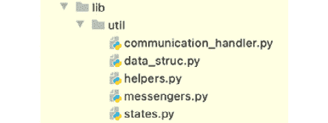

# 第十章：未来趋势和发展

智慧将推动下一代技术，而不是大数据。正如在*第一章*“大数据和传统人工智能的挑战”中讨论的那样，大数据系统存在一些问题，世界正逐渐从数据为中心的时代过渡到智能为中心的时代。**联邦学习**（**FL**）将在智慧驱动技术中扮演核心角色。因此，现在是欢迎集体智慧世界的时刻。

在本章中，我们将讨论由联邦学习（FL）带来的范式转变所驱动的未来人工智能技术的方向。对于许多人工智能领域，如对隐私敏感的领域和需要可扩展性的**机器学习**（**ML**）领域，FL 的好处和潜力已经非常显著，这主要归功于 FL 设计上自然支持的隐私保护和分布式学习方面。你将了解 FL 的不同类型以及该领域的最新发展努力，如分片学习和群集学习技术，这些可以被视为增强 FL 的进化框架。

此外，联邦学习（FL）创造了一个新的概念——*智能互联网*，在这个互联网中，人和计算机交换的是智慧，而不仅仅是数据本身。区块链技术进一步加速了面向每个人的智能互联网。这种智能互联网可以形成一个新的定义——*集体智慧*，它推动着从*数据为中心*的方法向*智能为中心*或*模型为中心*的方法的又一创新。

最后，我们将分享一个集体愿景，在这个愿景中，联邦学习（FL）在协同创造由世界各地许多人和机器学习到的智慧中扮演关键角色。

在本章中，我们将涵盖以下主题：

+   观察未来人工智能趋势

+   联邦学习的研究和发展

+   探索集体智慧

# 观察未来人工智能趋势

如下节所述，大多数行业领导者现在都意识到集中式机器学习的局限性。

## 集中式机器学习的局限性

当展望人工智能的未来时，首先要知道的一个事实是，许多公司今天都在努力从他们拥有的数据中提取智能和获得洞察。通常，组织和企业收集的数据中超过一半都没有被使用。传统的机器学习和数据科学方法需要在分析和管理机器学习模型之前，将数据组织并整合到数据湖和存储中。你需要复制并移动数据，这会导致从数据中提取的智能价值的实现和交付延迟，同时伴随着一定的运营风险和复杂性。

此外，大多数企业公司生成的大量数据将在传统的集中式数据中心或云之外创建和处理。以集中方式处理数据以生成洞察力变得越来越不切实际且效率低下。

此外，根据一些市场报告，大多数最大的全球组织和公司至少会探索一次联邦学习，以创建更加准确、安全和环保的模型。

话虽如此，许多行业和市场逐渐意识到分布式和联邦学习范式的重要性，因为他们正面临着当前集中式大数据 AI 训练不可避免的问题和限制，如第一章中所述，*大数据和传统 AI 的挑战*。联邦学习将模型带到训练过程所在的数据处，而不是将数据带到模型处。因此，联邦学习被认为是数据科学和机器学习的未来。

在下一节中，让我们总结一下为什么联邦学习（FL）对那些公司有益，尤其是那些面临上述问题的企业。

## 重温联邦学习的益处

在本节中，我们将总结本书中介绍过的联邦学习的益处。

### 模型准确性和泛化能力的提升

联邦学习通过在本地对分散的数据集进行训练，将学习持续地纳入全局模型，实现了协作和分布式学习，从而可以提高机器学习模型的性能。这样，可以产生更准确和泛化的机器学习模型。

### 进一步的隐私和安全

联邦学习提供了隐私和安全优势，因为它不会因为其设计和安全机制而要求私有和原始数据，正如我们在第二章中讨论的*什么是联邦学习*和第九章中讨论的*联邦学习应用的关键用例案例研究*。因此，联邦学习降低了数据滥用、泄露或敏感信息暴露的风险。联邦学习也符合许多隐私法规，如**通用数据保护条例**（**GDPR**）、**加州消费者隐私法案**（**CCPA**）和**健康保险可携带性和问责法案**（**HIPAA**）。

### 提高速度和效率

联邦学习还以其高计算效率而闻名，这可以加速机器学习模型的部署和测试，以及减少通信和计算延迟。由于联邦学习的去中心化特性，模型交付和更新的延迟最小化，从而使得全局模型能够近乎实时地进行预测。对于时间敏感的机器学习应用来说，智能的实时交付和更新是非常有价值的。

FL 还有助于通过克服系统异质性和不平衡的数据分布来减少带宽和能源消耗，这导致最小化数据存储和传输成本，这些成本也可以显著减少环境影响。

## 向分布式学习迈进，以实现更高的隐私性和训练效率

目前，AI 是在大型计算服务器上训练的，通常在大数据公司的大型机器上发生。

正如超级计算机时代所看到的，它可以在一台机器或一台机器集群中处理大量数据和任务，技术的进化过程始于一个中心位置，并逐渐过渡到分布式环境。

在 AI 领域，同样的事情即将发生。现在，数据湖概念在组织训练 ML 模型方面非常流行，但 ML 已经需要分布式学习框架。

FL 是一种将训练过程分布到多个节点上的绝佳方式。正如许多研究报告所示，大多数数据并未被充分利用来提取 ML 模型的洞察力。

有些公司和项目正在尝试使用 FL 作为一种强大的分布式学习技术，例如 Devron 提供的平台([devron.ai](https://devron.ai))、FedML([fedml.ai](https://fedml.ai))和 STADLE([stadle.ai](https://stadle.ai))。这些平台已经解决了*集中式 AI 的局限性*部分中讨论的问题，并在各种用例中显著提高了 ML 过程，正如*重访 FL 的好处*部分所述。

根据我们讨论的 AI 趋势，让我们在下一节中看看与 FL 相关的正在进行的研究和发展，这些研究是由前沿公司现在进行的。

# FL 的持续研究和开发

我们现在来讨论正在全球学术界和工业界进行的研究和开发项目。让我们从 FL（联邦学习）的不同类型和方法开始，然后继续探讨进一步增强 FL 框架的持续努力。

## 探索各种 FL 类型和方法

在这本书中，我们探讨了 FL 系统的最基本算法和设计概念。在现实世界中，我们需要深入了解哪些 FL 框架可用，以从这些算法中提取最佳性能。根据数据场景和用例，FL 中有几种方法，如下所示：

+   水平 FL 和垂直 FL

+   集中式 FL 和去中心化 FL

+   跨部门 FL 和跨设备 FL

现在，让我们在以下各节中看看每种 FL 类型。

### 水平 FL 和垂直 FL

**水平联邦学习（Horizontal FL**）使用所有分布式设备上具有相同特征空间或模式的数据库集（[`www.arxiv-vanity.com/papers/1902.04885/`](https://www.arxiv-vanity.com/papers/1902.04885/)）。这实际上意味着数据集共享相同的列，但行不同。大多数现有的联邦学习项目都是基于水平联邦学习。具有水平联邦学习的数据库和训练过程很简单，因为数据集是相同的，只是数据分布和要学习的数据输入不同。水平联邦学习也称为同质或基于样本的联邦学习。

**垂直联邦学习（Vertical FL**）适用于不同数据集共享相同的样本 ID 空间但特征空间不同的情况。您可以查看这篇论文（https://arxiv.org/pdf/2202.04309）以获取有关垂直联邦学习的更多信息。通过联邦学习将这些不同的数据库联系起来可能具有挑战性，特别是如果数据的不同唯一 ID 不同。垂直联邦学习的关键思想是通过使用具有不同属性集的分布式数据集来改进机器学习模型。因此，垂直联邦学习可以垂直处理具有相同样本空间中不同属性的分区数据。垂直联邦学习也称为异质或基于特征的联邦学习。

### 集中式联邦学习和去中心化联邦学习

**集中式联邦学习（Centralized FL**）是目前最常见的方法，大多数平台都采用这种框架。它使用集中式服务器来收集和聚合不同的机器学习模型，并在所有本地数据源上进行分布式训练。在这本书中，我们专注于集中式联邦学习方法，其中本地训练代理将学习结果传达给集中式联邦学习服务器以创建全局模型。

**去中心化联邦学习（Decentralized FL**），另一方面，不使用集中式服务器来聚合机器学习模型。它要求在本地数据源上训练的各个机器学习模型之间相互通信，而不需要一个主节点。在这种情况下，模型权重从每个单独的数据集传输到其他数据集以进行进一步训练。如果不受信任的方能够访问智能，则可能容易受到模型中毒的影响，这是从对等框架中衍生出的一个常见问题。

### 跨领域联邦学习和跨设备联邦学习

**跨领域联邦学习（Cross-silo FL**）是指机器学习模型在跨越任何功能、组织和监管障碍的数据上训练的情况。在这种情况下，大数据通常存储在更大的存储空间中，并具备如云虚拟机这样的训练计算能力。在跨领域联邦学习的情况下，领域/训练环境的数量相对较小，因此在联邦学习过程中不需要太多代理。

**跨设备 FL**是模型需要在大规模训练的情况，通常在边缘设备上进行，例如手机、**物联网**（**IoT**）设备、Raspberry Pi 类型的设备等。在这种情况下，大量设备连接起来以聚合机器学习模型。在跨设备 FL 的情况下，限制基本上在于这些边缘设备的低计算能力。该框架还需要处理大量断开和无效的设备，以进行一致和持续的 FL 过程。训练过程及其数据量也应受到限制。

这就总结了可以应用于机器学习应用中各种场景的不同类型的 FL。有一些新技术试图增强 FL 框架，使其演变成下一代具有 FL 的人工智能技术。让我们在下一节中探讨几个高级方法。

## 理解基于 FL 的增强分布式学习框架

正在进行着进一步增强 FL 或分布式学习框架的努力。

### 分割学习

**分割学习**是在麻省理工学院媒体实验室开发的，是一种新兴的分布式学习技术，它使机器学习模型能够分割成多个部分，在分布式客户端上训练这些分割的机器学习模型，并在最后进行聚合。分割学习也不必共享数据，因此也被认为是保护隐私的人工智能。

整体框架类似于 FL。然而，不同之处在于神经网络被划分为多个部分，这些部分将在分布式客户端上进行训练。然后，该神经网络部分的训练权重将被传输到服务器和客户端。这些多个部分的权重将在下一次训练会话中持续训练。因此，分布式客户端之间不共享任何原始和私有数据，只有每个部分的权重被发送到下一个客户端。

尤其是 SplitFed（[`arxiv.org/abs/2004.12088`](https://arxiv.org/abs/2004.12088)）是另一种结合分割学习和 FL 的高级技术。SplitFed 在 FL 客户端和服务器之间分割深度神经网络架构，以实现比 FL 更高的隐私级别。它比基于 FL 并行学习范式的分割学习提供了更好的效率。

### 群体学习

**群体学习**是基于区块链技术的去中心化机器学习解决方案，特别设计用于使企业行业能够利用分布式数据的力量，从而保护数据隐私和安全。

这可以通过各个节点共享从本地数据推导出的机器学习模型的参数来实现。

从分布式客户端共享的参数合并到一个全局模型中。与正常 FL 的不同之处在于，合并过程不是由中央服务器执行的。分布式节点和客户端选择一个临时领导者来执行合并。这就是为什么蜂群学习真正实现了去中心化，同时也提供了更大的容错性和弹性。分布式代理具有网络的集体智能，而不需要将本地数据共享到一个节点。

蜂群学习建立在区块链之上。区块链提供了去中心化控制、可扩展性和容错性等方面，以超越单个企业的限制。同时，区块链引入了一个防篡改的加密货币框架，参与者可以使用该框架来货币化他们的贡献。

### BAFFLE

此外，还有一个名为**BAFFLE**的框架，代表**基于区块链的聚合器免费联邦学习**（https://arxiv.org/abs/1909.07452）。BAFFLE 也是一个无聚合器、由区块链驱动的 FL 框架，本质上具有去中心化特性。BAFFLE 利用区块链框架中的**智能合约**（**SCs**）来协调轮次管理，以及 FL 的模型聚合和更新任务。使用 BAFFLE 可以提升计算性能。全局模型也被分解成许多数据块集合，直接由 SC 处理。

现在我们已经了解了 FL 领域的最新研究和发展，在下一节中，让我们看看人工智能、科学和集体智能技术的更具有前瞻性的方面。

# 前往集体智能之旅

大数据已经成为人工智能运动的一个变革者。虽然边缘和人们生成数据的数量将以指数级增长，但从中提取的智能对社会有益。因此，大数据时代将逐渐将接力棒传递给由 FL（联邦学习）赋能的集体智能时代，在这个时代，人们将共同创造一个由智慧驱动的世界。

让我们从定义一个以智能为中心的时代开始，在这个时代，基于 FL 的集体智能概念得以实现。

## 以集体智能为中心的时代

**集体智能**（**CI**）是指大量单个实体以看似智能的方式共同行动的概念。CI 是一种涌现现象，其中人群处理信息以获得仅靠单个成员无法理解的见解。

最近，麻省理工学院集体智能中心负责人、最初提出“集体智能”一词的人托马斯·马龙，扩展了 CI 的定义：“CI 是能够从包括人和计算机在内的群体中产生的东西。CI 是一个非常普遍的特性，超级智能可以在许多类型的系统中出现，尽管我主要讨论的系统是涉及人和计算机的系统。”（参考：[`www2.deloitte.com/xe/en/insights/focus/technology-and-the-future-of-work/human-and-machine-collaboration.html`](https://www2.deloitte.com/xe/en/insights/focus/technology-and-the-future-of-work/human-and-machine-collaboration.html)）。

我们现在正迎来由 FL（强化学习）赋能的技术中 CI（集体智能）的新视角。

在当前的技术世界中，数据是提取智能的巨大来源。全球分散的数据集可以通过 AI 技术转化为智能集合。正如提到的，当前的趋势是大数据，因此大数据公司不仅领导着技术产业，也领导着整个世界经济。未来正朝着 CI 的方向发展。随着复杂 ML 算法（包括深度学习）的出现，CI 的愿景变得更加清晰，因为 ML 模型所代表的智能可以从人、计算机或任何生成有意义数据的设备中提取智能。

为什么 FL 会推崇 CI 的概念？FL 的本质是收集一组分布式智能，通过书中讨论的聚合机制进行增强。这本身就能实现一个无需直接从人或设备收集数据的数据无平台。

尽管书中讨论了大数据问题，但我们并没有专注于以数据为中心的平台。然而，学习大数据对于真正创建真正有价值并能在世界许多领域创造实际价值的应用系统来说，是非常关键和不可避免的。这就是为什么即使面对隐私法规、安全、数据孤岛等重大挑战，大数据领域仍然是发展最繁荣的行业。

现在是进一步发展和传播 FL 等技术的时机，这些技术可以通过从根本上解决大数据问题来加速 CI 时代的到来。这样，我们就能实现一个由真正的数学基础支持的 CI 驱动的新技术时代。

正如所述，*以数据为中心*的平台是当前的趋势。因此，许多数据和自动机器学习供应商可以通过组织数据和学习程序来支持并自动化创建基于机器学习的智能的过程。一个*以智能为中心*或*以模型为中心*的平台应该是下一波技术浪潮，人们可以在其中共享和增强他们自己生成的智能。借助 FL，我们甚至可以实现众包学习，人们可以共同且持续地提升机器学习模型的质量和性能。因此，FL 是智能中心平台实现智慧驱动世界的关键和必要部分。

## 智能互联网

物联网演变为**万物互联**。然而，人们真正需要的信息是什么？仅仅是大数据吗？还是从数据中提取的智能？随着 5G 技术的出现，大量数据可以在互联网上以更高的速度传输，部分解决了许多人工智能应用中的延迟问题。FL 可以交换比原始数据更少的信息，但仍需要在互联网上传输机器学习模型。

虽然许多研究项目正在最小化 FL 中的通信延迟，但在未来，与智能相关的信息将成为另一种经常在网络上交换的实体。到处都会有模型库，例如**模型动物园**，由 FL 支持的众包学习将更常见，以在互联网上与全球的人们共同创造更好的智能。

这种范式转变不仅限于人工智能领域本身，还包括广泛的信息技术领域。正如我们将在下一节中讨论的，这种**智能互联网**运动将成为众包学习和 CI 的基础，并有助于在未来的几年内让尽可能多的人获得智能。

## FL 的众包学习

FL 执行的**智能集合**自然使其非常适合向 CI（集体智能）迈进。同样的事情也适用于人们可以集体贡献训练过程以供全球机器学习模型使用的场景。

计算机视觉和自然语言处理等领域的高性能机器学习模型已被某些大数据公司训练，通常花费巨额资金，包括数亿美元。

是否有办法集体训练一个可能对广大公众都有益的机器学习模型？借助 FL（联邦学习）的先进框架，这是可能的。

FL 提供了一种管理来自各种分布式代理的多个训练模型聚合的真正方式。在这种情况下，分布式代理本身可能是全球的每个人，其中每个机器学习模型的用户和训练者都有自己的独特数据集，这些数据集由于数据隐私、孤岛效应等原因而无法被其他人获取。

这种利用 CI 的方式通常被称为*众包学习*。然而，传统的众包学习是以一种更加有限的方式进行，仅仅基于大规模促进和招募数据标注者。

在 FL 的新范式下，CI 平台上的用户可以访问和下载他们感兴趣的人工智能模型，并在必要时重新训练它们，以在自己的环境中吸收学习。然后，通过用户共享训练好的机器学习模型的框架，FL 的高级聚合框架可以挑选出合适的模型进行联邦学习，使全局模型表现更佳，采用只有用户才能访问的多样化数据。

这样，通过机器学习的智能正变得更加普遍，不仅限于那些拥有大量数据和预算来训练真实机器学习模型的特定公司。换句话说，没有 FL 框架，协作学习是困难的、棘手的，甚至几乎不可能自动化。这种机器学习模型的开放性将推动整个技术世界达到下一个水平，并将使更多应用成为可能，这些应用拥有由爱好者训练的真正强大的智能，旨在使世界变得更好。

# 摘要

在本书的最后一章中，我们讨论了未来趋势和发展，其中 FL 预计将在未来十年内发挥关键作用。在未来，FL 对于大多数企业和应用提供商来说，将是从“希望拥有”的框架转变为“必须拥有”的技术，因为不可避免的数据隐私法规和技术趋势要求与众多用户一起实现可扩展性。

正如我们所讨论的，未来的技术将由智能互联网的概念所驱动，人们和计算机主要交换他们的智慧，共同创造一个更加智能的社会和世界。最后，由于当前与 CI 相关的协作学习趋势，以数据为中心的技术将逐渐演变为以智能为中心的技术，这使得人们高度重视 FL 相关的技术，这些技术的基石在本书中进行了讨论。

这本书是在人工智能带来的新进步时代曙光下撰写的。在过去几十年里，我们在利用大数据策略方面取得了巨大进步，但我们已经超越了这些方法，必须采用新的做事方式、新技术和新理念来继续前进。只要我们抓住当前的时刻，投资于如 FL 等新技术，我们面前就有光明的未来。

# 进一步阅读

如果您希望深入了解本章讨论的一些概念，以下是一些参考资料：

+   *理解联邦学习的类型*，由 OpenMinded 发布：[`blog.openmined.org/federated-learning-types`](https://blog.openmined.org/federated-learning-types)

)

+   Thapa, Chandra, 等人。*SplitFed: 当联邦学习遇到分割学习*，AAAI 人工智能会议论文集。第 36 卷。第 8 期。2022 年：[`arxiv.org/pdf/2004.12088.pdf`](https://arxiv.org/pdf/2004.12088.pdf)

)

+   *SWARM LEARNING: 将您的分布式数据转化为竞争优势，* 技术白皮书：[`www.labs.hpe.com/pdf/Swarm_Learning.pdf`](https://www.labs.hpe.com/pdf/Swarm_Learning.pdf)

)

+   Paritosh Ramanan 和 Kiyoshi Nakayama。*BAFFLE: 基于区块链的聚合器免费联邦学习*，2020 IEEE 国际区块链会议（Blockchain）。IEEE，2020 年：[`arxiv.org/pdf/1909.07452.pdf`](https://arxiv.org/pdf/1909.07452.pdf)

# 附录：探索内部库

在*第四章*，*使用 Python 实现联邦学习服务器*，和*第五章*，*联邦学习客户端实现*，都关于提供的 `simple-fl` GitHub 仓库中 `fl_main/lib/util` 目录的实现。

在本附录中，我们将提供内部库和利用类及函数的概述，并附上代码示例以展示其功能。

在本章中，我们将涵盖以下主要内容：

+   FL 系统内部库概述

+   用于实现 FL 系统的枚举类

+   理解通信处理器功能

+   理解数据结构处理器类

+   理解辅助和支持库

+   用于生成通信负载的消息传递器

# 技术要求

本章中介绍的所有库代码文件都可以在 GitHub 仓库（https://github.com/tie-set/simple-fl）的 `fl_main/lib/util` 目录中找到。

重要提示

您可以使用这些代码文件用于个人或教育目的。请注意，我们不会支持商业部署，并且不对使用代码造成的任何错误、问题或损害负责。

# FL 系统内部库概述

*图 A.1* 展示了位于 `fl_main` 目录下的 `lib/util` 文件夹中内部库的 Python 代码组件，这些组件用于 FL 系统的数据库、聚合器和代理：



图 A.1 – 用于数据库、聚合器和代理通信的 Python 软件组件

以下是对 FL 系统中位于 `lib/util` 文件夹内部库的 Python 文件的简要描述。

## states.py

位于 `lib/util` 文件夹中的 `states.py` 文件定义了多种枚举类以支持实现 FL 系统。类定义包括 FL 客户端状态、ML 模型类型和消息类型，以及各种消息的信息和值的位置。

## communication_handler.py

在`lib/util`文件夹中的`communication_handler.py`文件可以提供数据库、FL 服务器和客户端之间的通信功能，主要定义它们之间的`send`和`receive`函数。此外，它还提供了启动数据库、聚合器和代理服务器的函数。

## data_struc.py

在`lib/util`文件夹中的`data_struc.py`文件定义了一个名为`LimitedDict`的类，以支持 FL 周期的聚合过程。它提供了将具有字典格式的 ML 模型转换为`LimitedDict`以及相反的函数。

## helpers.py

在`lib/util`文件夹中的`helpers.py`文件包含了一系列内部辅助函数，例如读取配置文件、生成唯一的哈希 ID、将 ML 模型打包成字典、加载和保存本地 ML 模型、获取机器的 IP 地址以及操作 FL 客户端状态。

## messengers.py

在`lib/util`文件夹中的`messengers.py`文件用于生成 FL 系统之间作为通信有效载荷的各种消息，以促进书中讨论的简单 FL 系统通信协议的实现。

既然我们已经讨论了 FL 系统内部库的概述，那么接下来让我们更详细地讨论各个代码文件。

# 用于实现 FL 系统的枚举类

枚举类用于辅助实现 FL 系统。它们定义在`fl_main`目录的`lib/util`文件夹中的`states.py`文件中。让我们看看定义枚举类时导入了哪些库。

## 导入库以定义枚举类

在这个`states.py`代码示例中，该文件导入了来自`enum`的通用库，如`Enum`和`IntEnum`：

```py
from enum import Enum, IntEnum
```

接下来，我们将解释定义 FL 系统三个组成部分前缀的类。

## 定义 FL 系统组件的 IDPrefix

以下是一系列定义 FL 系统组件的类。`IDPrefix`是用于指示代码中引用的 FL 组件的前缀，例如`agent`、`aggregator`或`database`：

```py
class IDPrefix:
    agent = 'agent'
    aggregator = 'aggregator'
    db = 'database'
```

接下来，我们将提供客户端状态的类列表。

## 客户端状态类

以下是与 FL 客户端状态相关的枚举类列表，包括等待全局模型的状态（`waiting_gm`）、机器学习训练的状态（`training`）、发送本地机器学习模型的状态（`sending`）和接收全局模型的状态（`gm_ready`）。在代理规范中定义的客户端状态如下：

```py
# CLIENT STATE
class ClientState(IntEnum):
    waiting_gm = 0
    training = 1
    sending = 2
    gm_ready = 3
```

## 定义 ML 模型和消息类型的类列表

以下是一系列定义与 FL 系统实现相关的 ML 模型和消息类型的类。

### ModelType 类

机器学习模型的类型，包括`local`模型和`cluster`模型（`global`模型），定义如下：

```py
class ModelType(Enum):
    local = 0
    cluster = 1
```

### DBMsgType 类

消息类型在聚合器和数据库之间的通信协议中定义，如下所示：

```py
class DBMsgType(Enum):
    push = 0
```

### AgentMsgType 类

消息类型在从代理发送到聚合器的通信协议中定义，如下所示：

```py
class AgentMsgType(Enum):
    participate = 0
    update = 1
    polling = 2
```

### AggMsgType 类

消息类型在从聚合器发送到代理的通信协议中定义，如下所示：

```py
class AggMsgType(Enum):
    welcome = 0
    update = 1
    ack = 2
```

## 定义消息位置的州类列表

以下是与 FL 系统之间通信相关的消息位置定义的类列表。

### ParticipateMSGLocation 类

从代理到聚合器的参与消息的索引指示器如下：

```py
class ParticipateMSGLocation(IntEnum):
    msg_type = 0
    agent_id = 1
    model_id = 2
    lmodels = 3
    init_flag = 4
    sim_flag = 5
    exch_socket = 6
    gene_time = 7
    meta_data = 8
    agent_ip = 9
    agent_name = 10
    round = 11
```

### ParticipateConfirmationMSGLocation 类

从聚合器返回的参与确认消息的索引指示器如下：

```py
class ParticipateConfirmationMSGLocation(IntEnum):
    msg_type = 0
    aggregator_id = 1
    model_id = 2
    global_models = 3
    round = 4
    agent_id = 5
    exch_socket = 6
    recv_socket = 7
```

### DBPushMsgLocation 类

从聚合器到数据库的`push`消息的索引指示器如下：

```py
class DBPushMsgLocation(IntEnum):
    msg_type = 0
    component_id = 1
    round = 2
    model_type = 3
    models = 4
    model_id = 5
    gene_time = 6
    meta_data = 7
    req_id_list = 8
```

### GMDistributionMsgLocation 类

从聚合器到代理的全局模型分布消息的索引指示器如下：

```py
class GMDistributionMsgLocation(IntEnum):
    msg_type = 0
    aggregator_id = 1
    model_id = 2
    round = 3
    global_models = 4
```

### ModelUpMSGLocation 类

从代理到聚合器上传本地机器学习模型的索引指示器如下：

```py
class ModelUpMSGLocation(IntEnum):
    msg_type = 0
    agent_id = 1
    model_id = 2
    lmodels = 3
    gene_time = 4
    meta_data = 5
```

### PollingMSGLocation 类

从代理到聚合器的`polling`消息的索引指示器如下：

```py
class PollingMSGLocation(IntEnum):
    msg_type = 0
    round = 1
    agent_id = 2
```

我们已定义了在整个 FL 系统代码中使用的枚举类。在下一节中，我们将讨论通信处理器的功能。

# 理解通信处理器功能

通信处理器的功能实现在`communication_handler.py`文件中，该文件位于`fl_main`目录下的`lib/util`文件夹中。

## 为通信处理器导入库

在此`communication_handler.py`代码示例中，处理器导入了一般库，如`websockets`、`asyncio`、`pickle`和`logging`：

```py
import websockets, asyncio, pickle, logging
```

接下来，我们将提供通信处理器功能的列表。

## 通信处理器的功能

以下是与通信处理器相关的函数列表。尽管为了简化，此处未在通信处理器代码中实现**安全套接字层**（**SSL**）或**传输层安全性**（**TLS**）框架，但建议始终支持它们以保护 FL 组件之间的通信安全。

### init_db_server 函数

`init_db_server`函数用于在 FL 服务器端启动数据库服务器。它接受一个函数、数据库 IP 地址和套接字信息作为输入，并根据 WebSocket 框架启动服务器功能。您也可以使用其他通信协议，如 HTTP。以下是启动数据库服务器的示例代码：

```py
def init_db_server(func, ip, socket):
    start_server = websockets.serve( \
        func, ip, socket, max_size=None, max_queue=None)
    loop = asyncio.get_event_loop()
    loop.run_until_complete(start_server)
    loop.run_forever()
```

### init_fl_server 函数

`init_fl_server` 函数用于在聚合器端启动 FL 服务器。它接受三个函数作为参数，用于代理注册、从代理接收消息和模型合成例程，以及聚合器的 IP 地址和注册接收套接字信息（用于接收来自代理的消息），以基于 WebSocket 框架启动服务器功能。以下是启动 FL 服务器的示例代码：

```py
def init_fl_server(register, receive_msg_from_agent, \
            model_synthesis_routine, aggr_ip, \
            reg_socket, recv_socket):
    loop = asyncio.get_event_loop()
    start_server = websockets.serve(register, aggr_ip, \
        reg_socket, max_size=None, max_queue=None)
    start_receiver = websockets.serve( \
        receive_msg_from_agent, aggr_ip, recv_socket, \
        max_size=None, max_queue=None)
    loop.run_until_complete(asyncio.gather( \
        start_server, start_receiver, \
        model_synthesis_routine))
    loop.run_forever()
```

### init_client_server 函数

`init_client_server` 函数用于启动 FL 客户端服务器功能。它接受一个函数、代理的 IP 地址以及用于接收来自聚合器的消息的套接字信息作为输入，并根据 WebSocket 框架启动功能。以下是启动 FL 客户端服务器功能的示例代码：

```py
def init_client_server(func, ip, socket):
    loop = asyncio.new_event_loop()
    asyncio.set_event_loop(loop)
    client_server = websockets.serve(func, ip, socket, \
        max_size=None, max_queue=None)
    loop.run_until_complete(asyncio.gather(client_server))
    loop.run_forever()
```

### 发送函数

`send` 函数用于将消息发送到由 IP 地址和套接字信息指定的目的地，这些信息作为参数一起传递，同时传递要发送的消息。如果目的地节点有响应，则返回从目的地节点发送回源节点的响应消息：

```py
async def send(msg, ip, socket):
    resp = None
    try:
        wsaddr = f'ws://{ip}:{socket}'
        async with websockets.connect( \
                wsaddr, max_size=None, max_queue=None, \
                ping_interval=None) as websocket:
            await websocket.send(pickle.dumps(msg))
            try:
                rmsg = await websocket.recv()
                resp = pickle.loads(rmsg)
            except:
                pass
            return resp
    except:
        return resp
```

### send_websocket 函数

`send_websocket` 函数用于将消息返回给由 WebSocket 信息指定的消息源，该信息作为参数一起传递，同时传递要发送的消息：

```py
async def send_websocket(msg, websocket):
    while not websocket:
        await asyncio.sleep(0.001)
    await websocket.send(pickle.dumps(msg))
```

### 接收函数

`receive` 函数用于接收一个作为参数的 WebSocket 消息，并返回一个序列化的消息：

```py
async def receive(websocket):
    return pickle.loads(await websocket.recv())
```

接下来，我们将讨论处理 ML 模型的数据结构类。

# 理解数据结构处理程序类

数据结构处理程序在 `data_struc.py` 文件中实现，该文件位于 `fl_main` 目录的 `lib/util` 文件夹中。数据结构类具有 `LimitedDict` 类，用于以一致的方式处理 ML 模型的聚合。

## 导入数据结构处理程序的库

在这个 `data_struc.py` 代码示例中，处理程序导入了通用库，如 `numpy` 和 `Dict`：

```py
from typing import Dict
import numpy as np
```

接下来，让我们继续了解 `LimitedDict` 类及其与数据结构处理程序相关的函数。

## LimitedDict 类

以下是对 `LimitedDict` 类及其与数据结构处理程序相关的函数的定义。

### LimitedDict 类及其函数

`LimitedDict` 类的函数用于将字典格式转换为具有键和值的类。`LimitedDict` 与 ML 模型中的缓冲区一起使用，以存储聚合器状态管理器的内存空间中的本地和集群模型：

```py
class LimitedDict(dict):
    def __init__(self, keys):
        self._keys = keys
        self.clear()
    def __setitem__(self, key, value):
        if key not in self._keys:
            raise KeyError
        dict.__setitem__(self, key, value)
    def clear(self):
        for key in self._keys:
            self[key] = list()
```

### convert_LDict_to_Dict 函数

`convert_LDict_to_Dict` 函数用于将之前定义的 `LimitedDict` 实例转换为正常字典格式：

```py
def convert_LDict_to_Dict(ld: LimitedDict)
        -> Dict[str,np.array]:
    d = dict()
    for key, val in ld.items():
        d[key] = val[0]
    return d
```

在下一节中，我们将讨论辅助和支持库。

# 理解辅助和支持库

辅助和支持函数在 `helpers.py` 文件中实现，该文件位于 `fl_main` 目录的 `lib/util` 文件夹中。

## 导入辅助库的库

在这个 `helpers.py` 代码示例中，文件导入了通用库，如 `json` 和 `time`：

```py
import json, time, pickle, pathlib, socket, asyncio
from getmac import get_mac_address as gma
from typing import Dict, List, Any
from hashlib import sha256
from fl_main.lib.util.states import IDPrefix, ClientState
```

接下来，让我们继续到辅助库的函数列表。

## 辅助库的函数

以下是与辅助库相关的函数列表。

### `set_config_file` 函数

`set_config_file` 函数接受配置文件的类型作为参数，例如 `db`、`aggregator` 或 `agent`，并返回配置文件的路径字符串：

```py
def set_config_file(config_type: str) -> str:
    # set the config file name
    module_path = pathlib.Path.cwd()
    config_file = \
        f'{module_path}/setups/config_{config_type}.json'
    return config_file
```

### `read_config` 函数

`read_config` 函数读取 JSON 配置文件以设置数据库、聚合器或代理。它接受配置路径作为参数，并以字典格式返回配置信息：

```py
def read_config(config_path: str) -> Dict[str, Any]:
    with open(config_path) as jf:
        config = json.load(jf)
    return config
```

### `generate_id` 函数

`generate_id` 函数基于 MAC 地址和实例化时间，使用哈希函数 (`sha256`) 生成一个系统范围内的唯一 ID，并将哈希值作为 ID：

```py
def generate_id() -> str:
    macaddr = gma()
    in_time = time.time()
    raw = f'{macaddr}{in_time}'
    hash_id = sha256(raw.encode('utf-8'))
    return hash_id.hexdigest()
```

### `generate_model_id` 函数

`generate_model_id` 函数基于以下内容为一系列模型生成系统范围内的唯一 ID：

+   **组件 ID**：创建模型的 FL 系统实体的 ID

+   **生成时间**：模型的创建时间

ID 是通过哈希函数（sha256）生成的。它接受以下参数：

+   `component_type`：带有前缀的字符串值，指示 `IDPrefix` 的组件类型

+   `component_id`：创建模型的实体的 ID 字符串值

+   `gene_time`：模型创建时间的浮点值

此函数将哈希值作为模型 ID 返回：

```py
def generate_model_id(component_type: str, \
        component_id: str, gene_time: float) -> str:
    raw = f'{component_type}{component_id}{gene_time}'
    hash_id = sha256(raw.encode('utf-8'))
    return hash_id.hexdigest()
```

### `create_data_dict_from_models` 函数

`create_data_dict_from_models` 函数通过以下参数创建 ML 模型的数据字典：

+   `model_id`：模型 ID 的字符串值

+   `models`：关于 ML 模型的 `np.array`

+   `component_id`：FL 系统的 ID，例如聚合器 ID 和代理 ID

它返回包含 ML 模型的数据字典：

```py
def create_data_dict_from_models( \
        model_id, models, component_id):
    data_dict = dict()
    data_dict['models'] = models
    data_dict['model_id'] = model_id
    data_dict['my_id'] = component_id
    data_dict['gene_time'] = time.time()
    return data_dict
```

### `create_meta_data_dict` 函数

`create_meta_data_dict` 函数通过将性能指标 (`perf_val`) 和样本数量 (`num_samples`) 作为参数，创建包含 ML 模型元数据的元数据字典，并返回 `meta_data_dict`，其中包含性能值和样本数量：

```py
def create_meta_data_dict(perf_val, num_samples):
    meta_data_dict = dict()
    meta_data_dict["accuracy"] = perf_val
    meta_data_dict["num_samples"] = num_samples
    return meta_data_dict
```

### `compatible_data_dict_read` 函数

`compatible_data_dict_read` 函数接受 `data_dict`，其中包含与 ML 模型相关的信息，如果字典中存在相应的键，则提取值，并返回组件 ID、ML 模型的生成时间、ML 模型本身和模型 ID：

```py
def compatible_data_dict_read(data_dict: Dict[str, Any])
        -> List[Any]:
    if 'my_id' in data_dict.keys():
        id = data_dict['my_id']
    else:
        id = generate_id()
    if 'gene_time' in data_dict.keys():
        gene_time = data_dict['gene_time']
    else:
        gene_time = time.time()
    if 'models' in data_dict.keys():
        models = data_dict['models']
    else:
        models = data_dict
    if 'model_id' in data_dict.keys():
        model_id = data_dict['model_id']
    else:
        model_id = generate_model_id( \
                       IDPrefix.agent, id, gene_time)
    return id, gene_time, models, model_id
```

### `save_model_file` 函数

`save_model_file` 函数用于将一组模型保存到本地文件。它接受以下参数：

+   `data_dict`：包含模型 ID 和 ML 模型的字典，格式为 `Dict[str,np.array]`。

+   `path`：ML 模型存储目录的路径字符串值

+   `name`：模型文件名的字符串值。

+   `performance_dict`：一个包含性能数据的字典，格式为 `Dict[str,float]`。每个条目都包含模型 ID 和其性能信息：

```py
def save_model_file(
        data_dict: Dict[str, Any], path: str, name: str,
        performance_dict: Dict[str, float] = dict()):
    data_dict['performance'] = performance_dict
    fname = f'{path}/{name}'
    with open(fname, 'wb') as f:
        pickle.dump(data_dict, f)
```

### The load_model_file 函数

`load_model_file` 函数读取一个本地模型文件，需要以下参数：

+   `path`：存储机器学习模型的目录的字符串值

+   `name`：模型文件名的字符串值

它以 `Dict` 格式返回未反序列化的机器学习模型和性能数据：

```py
def load_model_file(path: str, name: str) \
        -> (Dict[str, Any], Dict[str, float]):
    fname = f'{path}/{name}'
    with open(fname, 'rb') as f:
        data_dict = pickle.load(f)
    performance_dict = data_dict.pop('performance')
    # data_dict only includes models
    return data_dict, performance_dict
```

### The read_state 函数

`read_state` 函数读取一个本地状态文件，需要以下参数：

+   `path`：客户端状态文件目录的字符串值

+   `name`：模型文件名的字符串值

此函数返回一个客户端状态，`ClientState`（例如，*training* 或 *sending*），文件中指示的状态，以整数格式。如果客户端状态文件在访问时正在写入，它将在 0.01 秒后再次尝试读取文件：

```py
def read_state(path: str, name: str) -> ClientState:
    fname = f'{path}/{name}'
    with open(fname, 'r') as f:
        st = f.read()
    if st == '':
        time.sleep(0.01)
        return read_state(path, name)
    return int(st)
```

### The write_state 函数

`write_state` 函数用于在代理的状态文件上更改客户端状态。它需要以下参数：

+   `path`：客户端状态文件目录的字符串值

+   `name`：模型文件名的字符串值

+   `state`：`ClientState` 的值（例如，*training* 或 *sending*），用于设置新的客户端状态：

```py
def write_state(path: str, name: str, state: ClientState):
    fname = f'{path}/{name}'
    with open(fname, 'w') as f:
        f.write(str(int(state)))
```

### The get_ip 函数

The `get_ip` 函数获取机器的 IP 地址并返回 IP 地址的值：

```py
def get_ip() -> str:
    s = socket.socket(socket.AF_INET, socket.SOCK_DGRAM)
    try:
        # doesn't even have to be reachable
        s.connect(('1.1.1.1', 1))
        ip = s.getsockname()[0]
    except:
        ip = '127.0.0.1'
    finally:
        s.close()
    return ip
```

### The init_loop 函数

The `init_loop` 函数用于启动一个连续循环函数。它需要一个用于运行循环函数的函数：

```py
def init_loop(func):
    loop = asyncio.new_event_loop()
    asyncio.set_event_loop(loop)
    loop.run_until_complete(asyncio.gather(func))
    loop.run_forever()
```

在下一节中，让我们看看创建通信有效载荷的消息传递函数。

# 用于生成通信有效载荷的消息传递器

消息传递函数定义在 `messengers.py` 文件中，该文件位于 `fl_main` 目录的 `lib/util` 文件夹中。

## 为消息传递导入库

在这个 `messengers.py` 代码示例中，文件导入了通用库，如 `time` 和 `numpy`。它还导入了 `ModelType`、`DBMsgType`、`AgentMsgType` 和 `AggMsgType`，这些在本书的 *实现联邦学习系统的枚举类* 部分中定义：

```py
import time
import numpy as np
from typing import Dict, List, Any
from fl_main.lib.util.states import \
    ModelType, DBMsgType, AgentMsgType, AggMsgType
```

接下来，让我们继续查看 `messengers` 库的函数列表。

## 消息传递函数的功能

以下是与 `messengers` 库相关的函数列表。

### The generate_db_push_message 函数

`generate_db_push_message` 函数生成并返回一个消息，用于将包含机器学习模型的推送消息推送到数据库。它通过以下参数将它们打包为有效载荷消息（以 `List` 格式，消息类型定义为 `push`），在聚合器和数据库之间：

+   `component_id`：组件 ID 的字符串值，例如聚合器 ID

+   `round`：FL 轮次信息，以整数格式

+   `model_type`：机器学习模型类型，例如 `cluster` 或 `local` 模型

+   `models`：格式为 `Dict[str, np.array]` 的机器学习模型

+   `model_id`: 机器学习模型唯一 ID 的字符串值

+   `gene_time`: 机器学习模型生成时间的浮点值

+   `performance_dict`: 以 `Dict[str, float]` 格式的性能数据

以下代码提供了生成前面数据库推送消息的功能：

```py
def generate_db_push_message(
      component_id: str, round: int, model_type: ModelType,
      models: Dict[str,np.array], model_id: str,
      gene_time: float, performance_dict: Dict[str,float])
          -> List[Any]:
    msg = list()
    msg.append(DBMsgType.push)  # 0
    msg.append(component_id)  # 1
    msg.append(round)  # 2
    msg.append(model_type)  # 3
    msg.append(models)  # 4
    msg.append(model_id)  # 5
    msg.append(gene_time)  # 6
    msg.append(performance_dict)  # 7
    return msg
```

### The generate_lmodel_update_message function

`generate_lmodel_update_message` 函数生成并返回一个消息，用于向聚合器发送包含在代理中创建的本地模型的消息。它通过以下参数将它们打包为有效载荷消息（以 `List` 格式，消息类型定义为 `update`），在代理和聚合器之间传递：

+   `agent_id`: 代理 ID 的字符串值

+   `model_id`: 机器学习模型唯一 ID 的字符串值

+   `local_models`: 以 `Dict[str, np.array]` 格式的本地机器学习模型

+   `performance_dict`: 以 `Dict[str, float]` 格式的性能数据

以下代码展示了生成前面本地模型更新消息的功能：

```py
def generate_lmodel_update_message(
        agent_id: str, model_id: str,
        local_models: Dict[str,np.array],
        performance_dict: Dict[str,float]) -> List[Any]:
    msg = list()
    msg.append(AgentMsgType.update)  # 0
    msg.append(agent_id)  # 1
    msg.append(model_id)  # 2
    msg.append(local_models)  # 3
    msg.append(time.time())  # 4
    msg.append(performance_dict)  # 5
    return msg
```

### generate_cluster_model_dist_message 函数

`generate_cluster_model_dist_message` 函数生成并返回一个 `List` 格式的消息，用于发送包含由聚合器创建的全局模型的消息到连接的代理。它通过以下参数将它们打包为有效载荷消息（以 `List` 格式，消息类型定义为 `update`），在聚合器和代理之间传递：

+   `aggregator_id`: 聚合器 ID 的字符串值

+   `model_id`: 机器学习模型唯一 ID 的字符串值

+   `round`: 以整数格式表示的联邦学习轮次信息

+   `models`: 以 `Dict[str, np.array]` 格式的机器学习模型

以下代码展示了生成前面聚类模型分布消息的功能：

```py
def generate_cluster_model_dist_message(
        aggregator_id: str, model_id: str, round: int,
        models: Dict[str,np.array]) -> List[Any]:
    msg = list()
    msg.append(AggMsgType.update)  # 0
    msg.append(aggregator_id)  # 1
    msg.append(model_id)  # 2
    msg.append(round)  # 3
    msg.append(models)  # 4
    return msg
```

### generate_agent_participation_message 函数

`generate_agent_participation_message` 函数生成并返回一个消息，用于发送包含由代理创建的初始模型参与请求消息到连接的聚合器。它通过以下参数将它们打包为有效载荷消息（以 `List` 格式，消息类型定义为 `participate`），在代理和聚合器之间传递：

+   `agent_name`: 代理名称的字符串值

+   `agent_id`: 代理 ID 的字符串值

+   `model_id`: 机器学习模型唯一 ID 的字符串值

+   `models`: 以 `Dict[str, np.array]` 格式的机器学习模型

+   `init_weights_flag`: 一个布尔值，用于指示权重是否已初始化

+   `simulation_flag`: 一个布尔值，用于指示运行是否为模拟

+   `exch_socket`: 用于从聚合器向该代理发送消息的字符串值套接字信息

+   `gene_time`: 机器学习模型生成时间的浮点值

+   `meta_dict`: 以 `Dict[str, float]` 格式的性能数据

+   `agent_ip`: 代理自身的 IP 地址

以下代码展示了生成前面代理参与消息的功能：

```py
def generate_agent_participation_message(
       agent_name: str, agent_id: str, model_id: str,
       models: Dict[str,np.array], init_weights_flag: bool,
       simulation_flag: bool, exch_socket: str,
       gene_time: float, meta_dict: Dict[str,float],
       agent_ip: str) -> List[Any]:
    msg = list()
    msg.append(AgentMsgType.participate)  # 0
    msg.append(agent_id)  # 1
    msg.append(model_id)  # 2
    msg.append(models)  # 3
    msg.append(init_weights_flag)  # 4
    msg.append(simulation_flag)  # 5
    msg.append(exch_socket)  # 6
    msg.append(gene_time)  # 7
    msg.append(meta_dict)  # 8
    msg.append(agent_ip)  # 9
    msg.append(agent_name)  # 9
    return msg
```

### `generate_agent_participation_confirm_message` 函数

`generate_agent_participation_confirm_message` 函数生成并返回一个消息，用于发送包含全局模型的参与确认消息回代理。它接受以下参数，将它们打包成一个有效载荷消息（以`List`格式，消息类型定义为`welcome`），在聚合器和代理之间：

+   `aggregator_id`: 聚合器 ID 的字符串值

+   `model_id`: 机器学习模型唯一 ID 的字符串值

+   `models`: 以`Dict[str, np.array]`格式的机器学习模型

+   `round`: 以整数格式表示的联邦学习轮次信息

+   `agent_id`: 代理 ID 的字符串值

+   `exch_socket`: 从聚合器到达代理的端口号

+   `recv_socket`: 接收来自代理的消息的端口号

以下代码展示了生成前面代理参与确认消息的功能：

```py
def generate_agent_participation_confirm_message(
        aggregator_id: str, model_id: str,
        models: Dict[str,np.array], round: int,
        agent_id: str, exch_socket: str, recv_socket: str)
            -> List[Any]:
    msg = list()
    msg.append(AggMsgType.welcome)  # 0
    msg.append(aggregator_id)  # 1
    msg.append(model_id)  # 2
    msg.append(models)  # 3
    msg.append(round)  # 4
    msg.append(agent_id) # 5
    msg.append(exch_socket)  # 6
    msg.append(recv_socket)  # 7
    return msg
```

### `generate_polling_message` 函数

`generate_polling_message` 函数生成并返回一个消息，用于发送包含轮询信号的`polling`消息到聚合器。它接受以下参数，将它们打包成一个有效载荷消息（以`List`格式，消息类型定义为`polling`），在代理和聚合器之间：

+   `round`: 以整数格式表示的联邦学习轮次信息

+   `agent_id`: 代理 ID 的字符串值

以下代码展示了生成前面轮询消息的功能：

```py
def generate_polling_message(round: int, agent_id: str):
    msg = list()
    msg.append(AgentMsgType.polling) # 0
    msg.append(round) # 1
    msg.append(agent_id) # 2
    return msg
```

### `generate_ack_message` 函数

`generate_ack_message` 函数生成并返回一个消息，用于发送包含确认信号的`ack`消息回代理。创建有效载荷消息（以`List`格式，消息类型定义为`ack`）不需要参数，在聚合器和代理之间：

```py
def generate_ack_message():
    msg = list()
    msg.append(AggMsgType.ack) # 0
    return msg
```

# 摘要

在本章中，我们详细解释了内部库，以便您可以在不进一步调查基本功能（如通信和数据结构转换框架）的情况下实现整个联邦学习系统。

内部库主要涵盖以下五个方面：*枚举类*，定义系统状态，例如联邦学习客户端状态；*通信处理器*，支持发送和接收功能；*数据结构*，在聚合时处理机器学习模型；*辅助和支持函数*，处理基本操作，如保存数据和生成随机 ID；以及*messenger 函数*，用于生成在数据库、聚合器和代理之间发送的各种有效载荷。

使用这些函数，您会发现联邦学习系统的实现既简单又顺畅，但这些库仅支持实现联邦学习系统的一些基本功能；因此，您需要进一步扩展联邦学习系统，以创建一个更真实的平台，可以用于现实生活中的用例和技术。
