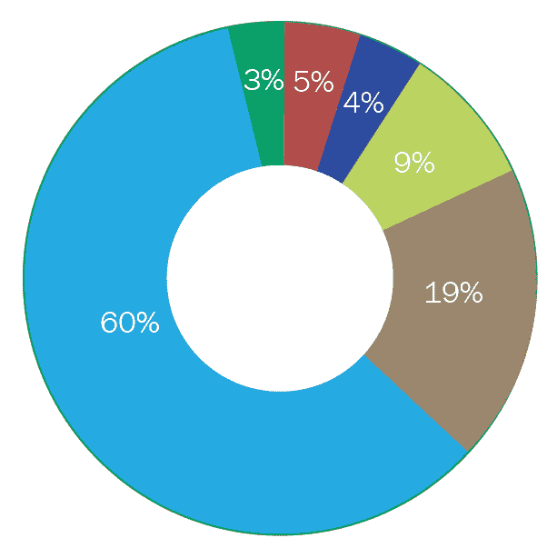
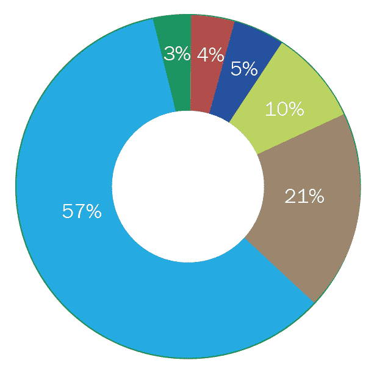
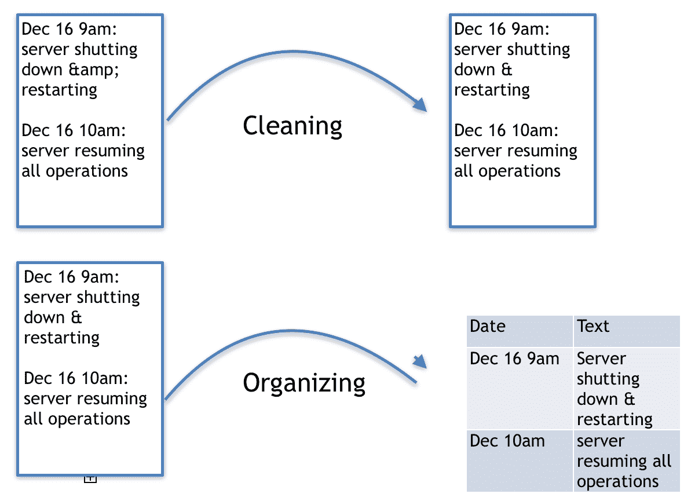
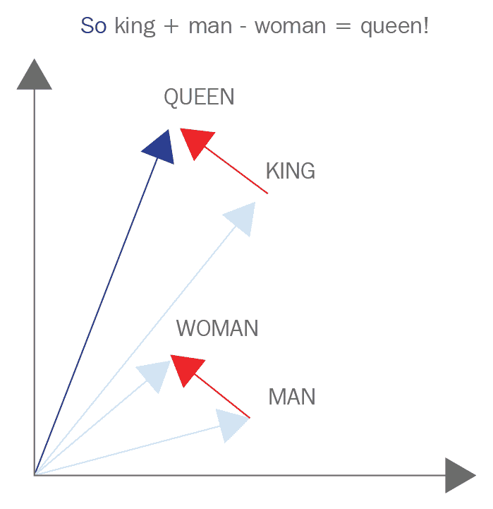

# 第一章：特征工程简介

近年来，工程师和执行人员一直在尝试实施**机器学习**（**ML**）和**人工智能**（**AI**）来解决大部分使用相当手动方法解决的问题。一个很好的例子就是**自然语言处理**（**NLP**）的进步，更具体地说是在自然语言生成和理解方面。更具体地说，我们指的是能够从用户那里读取原始文本的人工智能系统（可能是最新智能手机的不满用户），并且能够以人类的散文和机器的速度准确、清晰地回应。在本章中，我们将介绍特征工程等主题，例如：

+   为什么特征工程很重要的激励性例子

+   对机器学习的基本理解，包括性能、评估

+   本书包含的章节的详细列表

# 激励性例子 - AI 驱动的通信

来认识一下 Arty，我们的 AI 聊天系统，它能够处理和回应客户支持请求，就像我们任何人类员工一样。Arty 拥有我们公司的知识，随时准备出发。

下面是一个人类和 AI 客户支持系统之间样本对话的进行方式：

| **人类** | **AI** |
| --- | --- |
| 我的手机坏了。 | 很抱歉听到这个，它是怎么坏的？ |
| 它冻住了，我无法重置它。 | 这是什么手机？ |
| 新的 iDroid 28 | 哦，我明白了。按住电源和音量下键 20 秒，它应该会重置。 |
| 它工作了，谢谢！ | 没问题，祝你有个美好的一天。 |

这些类型系统令人兴奋并颠覆主要市场的原因是这样一个复杂系统的简单性。让我们来分解一下。表面上，你可能认为，*这是一个多么简单的问题!* 这个人有一个简单的问题，有一个简单的解决方案。一个请求进来，一个响应出来。*你好，我的手机冻住了，我该怎么办？* 简单，只需重置它。当然，表面上，这里发生的就是这样：

```py
from Arty import AI
AI.respond_to("my phone froze, what should I do?")
>> "reset it."
```

当从人工智能的角度来看时，问题就来了。它没有经历过我们经历的人类全部体验。它没有阅读过*《伊利亚特》*或甚至*《大红狗克利福德》*并学习内化它们的信息的特权。关键是，人工智能在阅读事物方面没有太多的经验。这个人工智能可能被给了几十万（甚至可能是几百万）以前人们的聊天对话，并被告诉去弄清楚。

以下是我们 AI 系统基于以前聊天日志给出的样本数据：

| **请求** | **响应** |
| --- | --- |
| 嗨 | 你好，有什么问题吗？ |
| 我的手机不工作了！！！！ | 哦不！！！它怎么了？ |
| >等等，我得去遛狗。待会儿回来。 | 好的。我会等你的。 |
| 嗨。 | 你好。我叫马克，我能帮什么忙？ |

数据被组织成两列，其中`Request`列表示最终用户在聊天支持对话中输入的内容。下一列，`Response`，表示客户支持代理对传入消息的回复。

在阅读数千个错别字、愤怒的消息和脱节的聊天之后，AI 开始认为自己已经掌握了这项客户支持工作。一旦发生这种情况，人类就会让 AI 处理新收到的聊天。人类没有意识到自己的错误，开始注意到 AI 还没有完全掌握这项工作。AI 似乎无法识别甚至简单的消息，并不断返回无意义的回复。人们很容易认为 AI 只需要更多的时间或更多的数据，但这些解决方案只是对更大问题的临时补救，而且往往甚至不能解决根本问题。

根本问题可能是，提供给 AI 的原始文本数据不够好，AI 无法捕捉到英语语言的细微差别。例如，可能的问题包括：

+   错别字人为地扩大了 AI 的词汇量，却没有原因。*Helllo*和*hello*是两个不同的词，彼此之间没有关联。

+   同义词对 AI 来说毫无意义。例如，*hello*和*hey*这两个词没有任何相似之处，因此人为地增加了问题的难度。

# 为什么特征工程很重要

数据科学家和机器学习工程师经常收集数据以解决问题。因为他们试图解决的问题通常与实际情况高度相关，并且在这个混乱的世界中自然存在，所以旨在代表问题的数据也可能非常混乱、未经筛选，并且常常不完整。

这就是为什么在过去的几年里，诸如*数据工程师*等头衔的职位不断涌现。这些工程师的独特任务是构建管道和架构，用于处理和转换原始数据，使其能够被公司其他部门使用，尤其是数据科学家和机器学习工程师。这项工作不仅与机器学习专家创建机器学习管道的工作一样重要，而且常常被忽视和低估。

由数据科学家进行的调查显示，他们超过 80%的时间用于捕获、清理和组织数据。剩余的不到 20%的时间用于创建这些最终主导对话的机器学习管道。此外，这些数据科学家的大部分时间都花在准备数据上；超过 75%的人还报告说，准备数据是他们流程中最不愉快的一部分。

以下是之前提到的调查结果：

以下图表显示了数据科学家花费最多时间做的事情：



从前面的图表中可以看出，我们将数据科学家的任务分解为以下百分比：

+   **构建训练集**：3%

+   **清洗和整理数据**：60%

+   **收集数据集**：19%

+   **挖掘数据模式**：9%

+   **优化算法**：5%

与数据科学中最不愉快部分相似的饼图：



从图表中可以看出，对于数据科学中最不愉快部分的类似调查结果如下：

+   **构建训练集**：10 %

+   **清洗和整理数据**：57%

+   **收集数据集**：21%

+   **挖掘数据模式**：3%

+   **优化算法**：4%

+   **其他**：5%

最上面的图表表示数据科学家在不同部分上花费的时间百分比。超过 80%的数据科学家时间用于准备数据以供进一步使用。下面的图表表示那些被调查的人报告的数据科学过程中最不愉快部分的比例。其中超过 75%的人报告说准备数据是他们最不愉快的一部分。

数据来源：[`whatsthebigdata.com/2016/05/01/data-scientists-spend-most-of-their-time-cleaning-data/`](https://whatsthebigdata.com/2016/05/01/data-scientists-spend-most-of-their-time-cleaning-data/).

一位杰出的数据科学家知道，准备数据不仅非常重要，占据了他们大部分的时间，而且他们也知道这是一个艰巨的过程，可能并不愉快。我们往往过于理所当然地接受机器学习竞赛和学术来源提供的干净数据。超过 90%的数据，有趣的数据，最有用的数据，都存在于这种原始格式中，就像之前描述的 AI 聊天系统中的数据一样。

**准备数据**可能是一个模糊的短语。准备包括捕获数据、存储数据、清洗数据等。如前述图表所示，数据科学家的大部分时间，尽管比例较小，但仍然是一大部分，用于清洗和整理数据。在这个过程中，我们的数据工程师对我们最有用。清洗是指将数据转换成可以被我们的云系统和数据库轻松解释的格式的过程。整理通常指的是更彻底的转换。整理往往涉及将整个数据集的格式改变成一个更整洁的格式，例如将原始聊天记录转换成表格的行/列结构。

下面是**清洗**和**整理**的示例：



顶部的转换表示清理包含数据和服务器上发生情况的文本解释的服务器日志样本。请注意，在清理过程中，Unicode 字符`&amp;`被转换成了更易读的符号（`&`）。清理阶段使文档几乎保持了之前的完全相同的格式。底部的组织转换则是一个更为激进的转换。它将原始文档转换成了行/列结构，其中每一行代表服务器执行的单个操作，而列代表服务器操作的特征。在这种情况下，两个特征是**日期**和**文本**。

清洁和组织都属于数据科学的一个更广泛的类别，恰好这也是本书的主题，即特征工程。

# 什么是特征工程？

最后，本书的标题。

是的，朋友们，特征工程将是这本书的主题。我们将专注于为机器学习管道清理和组织数据的过程。我们还将超越这些概念，探讨数据更复杂的转换形式，如数学公式和神经理解，但我们现在有些过于超前了。让我们从高层次开始。

**特征工程**是将数据转换为更好地代表潜在问题的特征的过程，从而提高机器学习性能。

为了进一步解释这个定义，让我们看看特征工程究竟包含哪些内容：

+   **转换数据的过程**：请注意，我们并没有指定原始数据、未过滤数据等。特征工程可以应用于数据的任何阶段。通常情况下，我们将对数据分销者眼中的已处理数据进行特征工程。同样重要的是要提到，我们将要处理的数据通常将以表格格式存在。数据将被组织成行（观测值）和列（属性）。有时，我们将从数据的最原始形式开始，例如在之前提到的服务器日志示例中，但大部分情况下，我们将处理已经有一定程度清洁和组织的数据。

+   **特征**：在这本书中，显然会大量使用“特征”这个词。在最基本的意义上，特征是数据的一个属性，对机器学习过程有意义。很多时候，我们将诊断表格数据，并确定哪些列是特征，哪些仅仅是属性。

+   **更好地代表潜在问题**：我们将要处理的数据始终用于在特定领域代表特定问题。在执行这些技术的同时，我们确保不失去对整体情况的关注是很重要的。我们希望转换数据，使其更好地代表手头的大问题。

+   **导致机器学习性能提升**：特征工程是数据科学过程中的一个单独部分。正如我们所见，它是一个重要且经常被低估的部分。特征工程的最终目标是获取我们的学习算法能够从中提取模式并用于获得更好结果的数据。我们将在本书的后面深入讨论机器学习指标和结果，但到目前为止，要知道我们进行特征工程不仅是为了获得更干净的数据，而且是为了最终在我们的机器学习管道中使用这些数据。

我们知道你在想什么，*为什么我应该花时间阅读关于一个人们说他们不喜欢做的事情的过程？* 我们认为许多人不喜欢特征工程的过程，因为他们往往没有理解他们所做工作的结果的益处。

大多数公司都雇佣了数据工程师和机器学习工程师。数据工程师主要关注数据的准备和转换，而机器学习工程师通常对学习算法以及如何从已经清洗过的数据中挖掘模式有实际的知识。

他们的工作往往是分开的，但又是相互交织和迭代的。数据工程师将向机器学习工程师展示一个数据集，他们声称无法从中获得好的结果，并要求数据工程师进一步转换数据，等等。这个过程不仅可能单调且重复，还可能损害整体大局。

如果没有关于特征和机器学习工程的知识，整个过程可能不会像它本可以的那样有效。这就是这本书的作用所在。我们将讨论特征工程以及它与机器学习的直接关系。这将是一个以结果为导向的方法，我们将认为技术是有帮助的，如果并且只有如果它们能够提高性能。现在深入探讨数据、数据结构和机器学习的基础是值得的，以确保术语的标准化。

# 理解数据和机器学习的基础

当我们谈论数据时，我们通常处理的是表格数据，即组织成行和列的数据。想象一下，这些数据可以在像 Microsoft Excel 这样的电子表格技术中打开。每一行数据，也称为**观察结果**，代表了一个问题的单个实例/例子。如果我们的数据属于股票市场日内交易领域，一个观察结果可能代表整个市场及价格的一个小时的变化。

例如，在处理网络安全领域时，一个观察结果可能代表一次可能的攻击或通过无线系统发送的数据包。

以下展示了网络安全领域以及更具体地说，网络入侵领域的样本表格数据：

| **日期时间** | **协议** | **紧急** | **恶意** |
| --- | --- | --- | --- |
| 2018 年 6 月 2 日 | TCP | 否 | 是 |
| 2018 年 6 月 2 日 | HTTP | 是 | 是 |
| 2018 年 6 月 2 日 | HTTP | 是 | 否 |
| 2018 年 6 月 3 日 | HTTP | 否 | 是 |

我们可以看到，每一行或观察结果都包含一个网络连接，并且我们有四个观察属性：`DateTime`（日期时间）、`Protocol`（协议）、`Urgent`（紧急）和`Malicious`（恶意）。虽然我们不会深入探讨这些特定属性，但我们会注意到以表格格式给出的数据结构。

由于我们大部分时间都会将数据视为表格形式，我们还可以查看数据矩阵只有一列/属性的具体实例。例如，如果我们正在构建一个能够接收单个房间图像并输出该房间是否有人存在的软件，输入数据可能表示为一个单列矩阵，其中单列只是一个指向房间照片的 URL，没有其他内容。

例如，考虑以下只有一个名为`Photo URL`的列的表格。表格的值是照片的 URL（这些都是虚构的，不会导向任何地方，仅用于示例）：

| 照片 URL |
| --- |
| [`photo-storage.io/room/1`](http://photo-storage.io/room/1) |
| [`photo-storage.io/room/2`](http://photo-storage.io/room/2) |
| [`photo-storage.io/room/3`](http://photo-storage.io/room/3) |
| [`photo-storage.io/room/4`](http://photo-storage.io/room/4) |

输入到系统中的数据可能只有一列，例如在这个案例中。在我们创建能够分析图像的系统时，输入可能只是一个指向图像的 URL。作为数据科学家，我们将负责从 URL 中提取特征。

作为数据科学家，我们必须准备好处理可能很大、很小、宽泛、狭窄（就属性而言）、完成度低（可能存在缺失值）的数据，并准备好利用这些数据进行机器学习。现在是讨论这个话题的好时机。机器学习算法属于一类算法，它们通过从数据中提取和利用模式来完成基于历史训练数据的任务。这听起来很模糊，对吧？机器学习可以处理许多类型的任务，因此我们将机器学习的定义保持不变，并深入探讨一下。

我们通常将机器学习分为两种主要类型：监督学习和无监督学习。每种机器学习算法都可以从特征工程中受益，因此了解每种类型都很重要。

# 监督学习

很多次，我们在监督学习的特定背景下听到特征工程，也称为预测分析。监督学习算法专门处理使用数据的其他属性来预测一个值（通常是数据的一个属性）的任务。以表示网络入侵的数据集为例：

| **DateTime** | **Protocol** | **Urgent** | **Malicious** |
| --- | --- | --- | --- |
| 2018 年 6 月 2 日 | TCP | FALSE | TRUE |
| 2018 年 6 月 2 日 | HTTP | TRUE | TRUE |
| 2018 年 6 月 2 日 | HTTP | TRUE | FALSE |
| 2018 年 6 月 3 日 | HTTP | FALSE | TRUE |

这是之前相同的同一个数据集，但让我们在预测分析的背景下进一步剖析它。

注意，这个数据集有四个属性：`DateTime`、`Protocol`、`Urgent`和`Malicious`。假设现在恶意属性包含表示观察是否为恶意入侵尝试的值。所以，在我们的非常小的四个网络连接数据集中，第一个、第二个和第四个连接是试图入侵网络的恶意尝试。

假设进一步，给定这个数据集，我们的任务是能够接受三个属性（`datetime`、`protocol`和`urgent`）并能够准确预测恶意属性的值。用通俗的话说，我们希望有一个系统可以将`datetime`、`protocol`和`urgent`的值映射到恶意属性的值。这正是监督学习问题设置的方式：

```py
Network_features = pd.DataFrame({'datetime': ['6/2/2018', '6/2/2018', '6/2/2018', '6/3/2018'], 'protocol': ['tcp', 'http', 'http', 'http'], 'urgent': [False, True, True, False]})
Network_response = pd.Series([True, True, False, True])
Network_features
>>
 datetime protocol  urgent
0  6/2/2018      tcp   False
1  6/2/2018     http    True
2  6/2/2018     http    True
3  6/3/2018     http   False
Network_response
>>
 0     True
1     True
2    False
3     True
dtype: bool
```

当我们与监督学习一起工作时，我们通常称数据集中我们试图预测响应的属性（通常只有一个，但这不是必需的）为属性。数据集的其余属性被称为**特征**。

监督学习也可以被认为是试图利用数据结构的一类算法。通过这种方式，我们指的是机器学习算法试图从通常非常整洁和有序的数据中提取模式。如前所述，我们不应总是期望数据整齐有序；这正是特征工程发挥作用的地方。

但如果你不预测任何东西，机器学习有什么好处呢？我很高兴你问了。在机器学习能够利用数据结构之前，有时我们必须改变甚至创造结构。这就是无监督学习成为一项宝贵工具的地方。

# 无监督学习

监督学习全部关于做出预测。我们利用数据的特点，并使用它们来对数据的响应做出有信息的预测。如果我们不是通过探索结构来做出预测，我们就是在尝试从我们的数据中提取结构。我们通常通过应用数学变换到数据的数值矩阵表示或迭代过程来获得新的特征集。

这个概念可能比监督学习更难理解，所以我会提供一个激励性的例子来帮助阐明这一切是如何工作的。

# 无监督学习示例 - 营销细分市场

假设我们得到了一个大型（一百万行）数据集，其中每一行/观测值代表一个单独的人，包含基本的人口统计信息（年龄、性别等）以及购买商品的数量，这代表这个人从特定商店购买的商品数量：

| **年龄** | **性别** | **购买商品数量** |
| --- | --- | --- |
| 25 | F | 1 |
| 28 | F | 23 |
| 61 | F | 3 |
| 54 | M | 17 |
| 51 | M | 8 |
| 47 | F | 3 |
| 27 | M | 22 |
| 31 | F | 14 |

这是一个我们的营销数据集的样本，其中每一行代表一个单独的客户，包含关于每个人的三个基本属性。我们的目标将是将这个数据集细分为不同类型或**聚类**的人群，以便进行数据分析的公司能更好地理解客户画像。

现在，当然，我们只展示了百万行中的一行，这可能会让人感到 daunting。当然，我们可以对这个数据集进行基本的描述性统计，并得到数值列的平均值、标准差等；然而，如果我们希望将这百万个人分成不同的**类型**，以便营销部门能更好地了解购物人群的类型，并为每个细分市场制作更合适的广告呢？

每种类型的客户都会表现出独特的品质，使该细分市场与众不同。例如，他们可能会发现，20%的客户属于他们喜欢称之为年轻且富有的类别，这些人通常较年轻，购买了几件商品。

这种分析和创建这些类型可以归入一种特定的无监督学习类型，称为**聚类**。我们将在本书的后面部分进一步讨论这种机器学习算法，但就目前而言，聚类将创建一个新的特征，将人们分离成不同的类型或聚类：

| **年龄** | **性别** | **购买商品数量** | **聚类** |
| --- | --- | --- | --- |
| 25 | F | 1 | 6 |
| 28 | F | 23 | 1 |
| 61 | F | 3 | 3 |
| 54 | M | 17 | 2 |
| 51 | M | 8 | 3 |
| 47 | F | 3 | 8 |
| 27 | M | 22 | 5 |
| 31 | F | 14 | 1 |

这显示了在应用聚类算法后的客户数据集。注意末尾的新列，称为`cluster`，它代表算法已识别的人的类型。想法是，属于相似聚类的**人们**在数据方面（年龄、性别、购买行为）会有相似的行为。也许可以将第六个聚类重命名为*年轻买家*。

这个聚类的例子告诉我们，有时我们并不关心预测任何事情，而是希望通过添加新的有趣特征或甚至删除无关特征，在更深的层面上理解我们的数据。

注意，我们之所以将每一列都称为特征，是因为在无监督学习中没有响应，因为没有预测发生。

现在这一切开始变得有道理了，不是吗？我们反复讨论的这些特征正是本书主要关注的内容。特征工程涉及对特征的理解和转换，这既与无监督学习相关，也与监督学习相关。

# 机器学习算法和特征工程流程的评估

重要的是要注意，在文献中，*特征*和*属性*这两个术语之间往往存在鲜明的对比。术语**属性**通常用于表格数据中的列，而术语**特征**通常仅用于对机器学习算法的成功有贡献的属性。也就是说，一些属性可能对我们的机器学习系统无益，甚至有害。例如，当预测一辆二手车在需要维修之前能使用多长时间时，车的颜色可能对这个值不太具有指示性。

在本书中，我们将通常将所有列都称为特征，直到它们被证明是无用的或有害的。当这种情况发生时，我们通常会在代码中将这些属性弃用。因此，考虑这个决策的基础非常重要。一个人如何评估机器学习系统，然后使用这种评估来执行特征工程？

# 特征工程流程的示例——真的有人能预测天气吗？

考虑一个旨在预测天气的机器学习流程。为了在引言章节中简化，假设我们的算法直接从传感器接收大气数据，并设置为预测两个值之一，*太阳*或*雨*。这个流程显然是一个分类流程，只能输出两个答案中的一个。我们将在每天开始时运行这个算法。如果算法输出*太阳*而当天大部分时间都是晴天，那么算法是正确的；同样，如果算法预测*雨*而当天大部分时间都是雨天，那么算法也是正确的。在任何其他情况下，算法将被认为是错误的。如果我们每天运行这个算法一个月，我们将获得近 30 个预测天气和实际观察天气的值。我们可以计算算法的准确率。也许算法在 30 天中有 20 天预测正确，这使我们将其标记为三分之二或大约 67%的准确率。使用这个标准化的值或准确率，我们可以调整我们的算法，看看准确率是上升还是下降。

当然，这是一个过于简化的说法，但想法是，对于任何机器学习流程，如果我们不能使用一组标准指标来评估其性能，那么它基本上是无用的。因此，应用于改进机器学习的特征工程，没有这种评估程序是不可能的。在本书中，我们将重新审视这种评估的想法；然而，让我们简要地谈谈我们通常将如何处理这个想法。

当面对特征工程的主题时，通常涉及转换我们的数据集（根据特征工程的定义）。为了确定特定的特征工程过程是否有助于我们的机器学习算法，我们将遵循以下章节中详细说明的步骤。

# 评估特征工程过程的步骤

评估特征工程过程的步骤：

1.  在应用任何特征工程过程之前，获取机器学习模型的基线性能

1.  应用特征工程和特征工程过程的组合

1.  对于每次特征工程的应用，获取一个性能指标并将其与我们的基线性能进行比较

1.  如果性能变化（delta）先于阈值（通常由人类定义），我们认为该过程是有益的，并将其应用于我们的机器学习流程

1.  这种性能的变化通常以百分比来衡量（如果基线从 40%的准确率提高到 76%的准确率，那么这是一个 90%的提升）

在性能方面，这个想法在机器学习算法之间有所不同。大多数优秀的机器学习入门书籍都会告诉你，在数据科学实践中有数十种接受的指标。

在我们的案例中，因为这本书的重点不一定在机器学习，而是对特征的理解和转换，我们将使用基线机器学习算法和相关基线指标来评估特征工程过程。

# 评估监督学习算法

在进行预测建模，也称为**监督学习**时，性能直接与模型利用数据结构的能力以及使用该结构进行适当预测的能力相关。一般来说，我们可以将监督学习进一步细分为两种更具体的类型，**分类**（预测定性响应）和**回归**（预测定量响应）。

当我们评估分类问题时，我们将直接使用五折交叉验证计算逻辑回归模型的准确率：

```py
# Example code for evaluating a classification problem
from sklearn.linear_model import LogisticRegression
from sklearn.model_selection import cross_val_score
X = some_data_in_tabular_format
y = response_variable
lr = LinearRegression()
scores = cross_val_score(lr, X, y, cv=5, scoring='accuracy')
scores
>> [.765, .67, .8, .62, .99]
```

类似地，在评估回归问题时，我们将使用五折交叉验证的线性回归的**均方误差**（MSE）：

```py
# Example code for evaluating a regression problem
from sklearn.linear_model import LinearRegression
from sklearn.model_selection import cross_val_score
X = some_data_in_tabular_format
y = response_variable
lr = LinearRegression()
scores = cross_val_score(lr, X, y, cv=5, scoring='mean_squared_error')
scores
>> [31.543, 29.5433, 32.543, 32.43, 27.5432]
```

我们将使用这两个线性模型而不是更新、更先进的模型，因为它们的速度更快，方差更低。这样，我们可以更有信心地认为任何性能的提升都是直接与特征工程过程相关，而不是与模型捕捉到隐秘和隐藏模式的能力相关。

# 评估无监督学习算法

这有点棘手。因为无监督学习不涉及预测，我们不能直接根据模型预测值的准确性来评估性能。话虽如此，如果我们正在进行聚类分析，例如在先前的市场细分示例中，那么我们通常会利用**轮廓系数**（一个介于-1 和 1 之间的聚类分离和凝聚度的度量）和一些人为驱动的分析来判断特征工程程序是否提高了模型性能，或者我们只是在浪费时间。

这里是一个使用 Python 和 scikit-learn 导入和计算一些虚假数据的轮廓系数的例子：

```py
attributes = tabular_data
cluster_labels = outputted_labels_from_clustering

from sklearn.metrics import silhouette_score
silhouette_score(attributes, cluster_labels)
```

在本书的后续部分，我们将花更多的时间在无监督学习上，因为它变得更加相关。我们的大部分例子将围绕预测分析/监督学习展开。

重要的是要记住，我们标准化算法和指标的原因是为了展示特征工程的力量，以及让你能够成功重复我们的程序。实际上，你可能会优化除了准确率之外的其他东西（例如，例如真正的阳性率），并希望使用决策树而不是逻辑回归。这不仅是可以接受的，而且是鼓励的。然而，你应该始终记住，要遵循评估特征工程程序的标准步骤，并比较基线和工程后的性能。

有可能你不是为了提高机器学习性能而阅读这本书。特征工程在假设检验和一般统计学等其他领域也是有用的。在本书的一些例子中，我们将探讨特征工程和数据转换在应用于各种统计测试的统计显著性方面的应用。我们将探索诸如 R²和 p 值等指标，以便对我们的程序如何帮助做出判断。

通常，我们将从三个类别中量化特征工程的好处：

+   **监督学习**：也称为**预测分析**

    +   回归分析——预测一个**定量**变量：

        +   我们将利用均方误差（MSE）作为我们的主要度量指标

    +   分类分析——预测一个**定性**变量

        +   我们将利用准确率作为我们的主要度量指标

+   **无监督学习**：聚类——根据数据的特征分配元属性：

    +   我们将利用轮廓系数作为我们的主要度量指标

+   **统计测试**：使用相关系数、t 检验、卡方检验等来评估和量化我们原始和转换数据的效用

在接下来的几节中，我们将查看本书将涵盖的内容。

# 特征理解——我的数据集中有什么？

在我们的第一个子主题中，我们将开始构建处理数据的基本知识。通过理解我们面前的数据，我们可以开始更好地了解下一步该去哪里。我们将开始探索不同类型的数据以及如何识别数据集中数据的类型。我们将查看来自几个领域的数据集，并确定它们彼此之间的不同之处以及它们之间的相似之处。一旦我们能够舒适地检查数据并识别不同属性的特征，我们就可以开始理解允许的类型以及承诺改进我们的机器学习算法的转换。

在不同的理解方法中，我们将探讨：

+   结构化数据与非结构化数据

+   数据的四个层次

+   识别缺失数据值

+   探索性数据分析

+   描述性统计

+   数据可视化

我们将从基本水平开始，通过识别我们面前数据的结构以及数据类型。一旦我们能够理解数据是什么，我们就可以开始解决数据的问题。例如，我们必须知道我们有多少数据是缺失的，以及当我们有缺失数据时应该做什么。

不要误解，数据可视化、描述性统计和探索性数据分析都是特征工程的一部分。我们将从机器学习工程师的角度探索这些程序中的每一个。每个程序都有能力增强我们的机器学习管道，我们将使用它们来测试和改变关于我们数据的假设。

# 特征改进——清理数据集

在这个主题中，我们利用我们对数据的理解，并使用这些理解来清理数据集。本书的大部分内容将以这种方式流动，使用前几节的结果来处理当前章节。在特征改进中，我们的理解将使我们开始对数据集进行第一次操作。我们将使用数学变换来增强给定的数据，但不会删除或插入任何新的属性（这将在下一章中讨论）。

在本节中，我们将探讨几个主题，包括：

+   结构化非结构化数据

+   数据插补——在之前没有数据的地方插入数据（缺失数据）

+   数据归一化：

    +   标准化（称为 z 分数归一化）

    +   Min-max 缩放

    +   L1 和 L2 归一化（投影到不同的空间，很有趣）

到这本书的这一阶段，我们将能够确定我们的数据是否有结构。也就是说，我们的数据是否以整洁的表格格式存在。如果不是，这一章将为我们提供将数据转换为更表格化格式的工具。在尝试创建机器学习管道时，这是必不可少的。

数据插补是一个特别有趣的话题。在数据之前缺失的地方填补数据的能力比听起来要复杂。我们将提出各种解决方案，从非常简单的，仅仅删除整个列，Boom，不再有缺失数据，到复杂有趣的，使用机器学习在其余特征上填补缺失的部分。一旦我们填补了大量缺失数据，我们就可以衡量这如何影响我们的机器学习算法。

标准化使用（通常简单的）数学工具，用于改变我们数据的缩放。同样，这从简单的，如将英里转换为英尺或磅转换为千克，到更复杂的，如将我们的数据投影到单位球面上（关于这一点将在后面详细介绍）。

本章以及后续章节将更加侧重于我们的量化特征工程流程评估。几乎每次我们查看新的数据集或特征工程流程时，我们都会对其进行测试。我们将根据机器学习性能、速度和其他指标来评估各种特征工程方法的表现。本文本仅应作为参考，而不应作为根据难度和性能变化选择可**忽略**的特征工程流程的指南。每个新的数据任务都伴随着其自身的注意事项，可能需要与之前的数据任务不同的流程。

# 特征选择 – 对不良属性说“不”

到本章为止，我们将对处理新数据集感到更加自在。我们将具备理解和清理面前数据的技能。一旦我们能够处理给定的数据，我们就可以开始做出重大决策，例如，**何时一个特征实际上是一个属性**。回想一下，通过这种区分，特征与属性，真正的问题其实是，*哪些列没有帮助我的机器学习流程，因此损害了我的流程，应该被移除？*本章重点介绍用于决定在数据集中移除哪些属性的技巧。我们将探讨几种统计和迭代过程，这些过程将帮助我们做出这个决定。

这些过程包括：

+   相关系数

+   识别和消除多重共线性

+   卡方检验

+   安诺瓦检验

+   p 值的解释

+   迭代特征选择

+   使用机器学习来衡量熵和信息增益

所有这些流程都将尝试建议删除特征，并给出不同的理由。最终，将由我们，即数据科学家，来做出最终决定，决定哪些特征可以保留并贡献于我们的机器学习算法。

# 特征构建 – 我们能构建它吗？

在前面的章节中，我们主要关注移除对我们机器学习流程没有帮助的特征，而本章将探讨创建全新的特征并在我们的数据集中正确放置这些特征的技术。这些新特征理想情况下将包含新的信息，并生成新的模式，机器学习流程可以利用这些模式并用于提高性能。

这些创建的特征可以来自许多地方。通常，我们会从给定的现有特征中创建新的特征。我们可以通过对现有特征应用变换并放置结果向量与它们的先前对应向量旁边来创建新的特征。我们还将探讨从不同的系统添加新特征。例如，如果我们正在处理尝试根据购物行为对人群进行聚类的数据，那么添加来自公司及其购买数据之外的人口普查数据可能会对我们有所帮助。然而，这将带来一些问题：

+   如果人口普查知道 1,700 个约翰，而公司只知道 13 个，我们如何知道这 1,700 个人中的哪一个与这 13 个人匹配？这被称为*实体匹配*

+   人口普查数据将会相当大，实体匹配将需要非常长的时间

这些问题和更多的问题使得整个过程相当困难，但往往创造出非常密集且数据丰富的环境。

在本章中，我们将花一些时间来讨论通过高度无结构化的数据手动创建特征。两个大的例子是文本和图像。这些数据本身对机器学习和人工智能流程来说是不可理解的，因此我们需要手动创建代表图像/文本片段的特征。作为一个简单的例子，想象一下我们正在制作自动驾驶汽车的基础，首先，我们想要创建一个模型，它可以接收汽车前方看到的图像，并决定是否应该停车。原始图像不够好，因为机器学习算法不知道如何处理它。我们必须从其中手动构建特征。给定这个原始图像，我们可以以几种方式将其分割：

+   我们可以考虑每个像素的颜色强度，并将每个像素视为一个属性：

    +   例如，如果汽车的摄像头产生 2,048 x 1,536 像素的图像，我们将有 3,145,728 列

+   我们可以将像素的每一行视为一个属性，每行的平均颜色作为其值：

    +   在这种情况下，将只有 1,536 行

+   我们可以将这个图像投影到空间中，其中特征代表图像中的对象。这是三者中最难的，看起来可能像这样：

| **停止标志** | **猫** | **天空** | **道路** | **草地斑块** | **潜艇** |
| --- | --- | --- | --- | --- | --- |
| 1 | 0 | 1 | 1 | 4 | 0 |

其中每个特征都是一个可能或可能不在图像中的对象，其值表示该对象在图像中出现的次数。如果模型被提供了这些信息，停止就相当好了！

# 特征变换 – 进入数学达人

本章是事情变得数学化和有趣的地方。我们已经讨论了理解特征和清理它们。我们还探讨了如何删除和添加新特征。在我们的特征构建章节中，我们必须手动创建这些新特征。作为人类，我们必须用我们的大脑想出分解停车标志图像的那三种方法。当然，我们可以编写自动创建特征的代码，但最终我们选择了我们想要使用的特征。

本章将开始探讨这些特征在数学维度上的自动创建。如果我们把我们的数据视为 n 维空间（n 代表列数）中的向量，我们会问自己，*我们能否在 k 维空间（k < n）中创建一个新的数据集，该数据集可以完全或近似地表示原始数据，但可能会在机器学习中提供速度提升或性能提升？* 这里的目标是创建一个维度更小的数据集，其性能优于原始数据集在更大维度上的性能。

这里的第一个问题是，*我们之前在特征选择时不是已经在创建低维度的数据了吗？如果我们从 17 个特征开始，去掉五个，我们不是已经将维度减少到 12 了吗？* 当然是！然而，我们在这里讨论的不仅仅是去掉列，我们是在讨论使用复杂的数学变换（通常来自我们的线性代数研究）并将它们应用于我们的数据集。

我们将花一些时间讨论的一个显著例子被称为**主成分分析**（**PCA**）。*这是一种将我们的数据分解成三个不同数据集的变换，我们可以使用这些结果来创建全新的数据集，这些数据集可以超越我们的原始数据！

这里有一个来自普林斯顿大学研究实验的视觉示例，该实验使用了 PCA 来利用基因表达的模式。这是维度降低的一个很好的应用，因为有如此多的基因和基因组合，即使是世界上最复杂的算法也需要很长时间来处理：


在前面的屏幕截图中，**A**代表原始数据集，其中**U**、**W**和**V^T**代表奇异值分解的结果。然后，将这些结果组合起来，创建一个新的数据集，可以在一定程度上取代**A**。

# 特征学习 – 使用 AI 来提升我们的 AI

顶部的樱桃，一个由今天在机器学习和 AI 管道自动构建特征的最先进算法驱动的樱桃。

上一章讨论了使用数学公式自动创建特征，但再次强调，最终是我们人类选择公式并从中获益。本章将概述一些算法，这些算法本身并不是数学公式，而是一种试图以某种方式理解和建模数据以利用数据中的模式来创建新数据的架构。这听起来可能有些模糊，但我们希望让你对它感到兴奋！

我们将主要关注专门设计用于使用神经网络设计（节点和权重）的神经网络算法。这些算法将把特征强加到数据上，有时对人类来说可能难以理解，但对机器来说却非常有用。我们将探讨的一些主题包括：

+   限制性玻尔兹曼机

+   Word2Vec/GLoVe 用于词嵌入

Word2Vec 和 GLoVe 是将高维数据添加到文本中看似单词标记的两种方法。例如，如果我们查看 Word2Vec 算法结果的视觉表示，我们可能会看到以下内容：



通过将单词表示为欧几里得空间中的向量，我们可以实现类似数学的结果。在先前的例子中，通过添加这些自动生成的特征，我们可以通过添加和减去 Word2Vec 给出的向量表示来*添加*和*减去*单词。然后我们可以得出有趣的结论，例如**king+man-woman=queen**。酷！

# 摘要

特征工程是数据科学家和机器学习工程师要承担的巨大任务。这是成功和可投入生产的机器学习管道所必需的任务。在接下来的七个章节中，我们将探讨特征工程的六个主要方面：

+   特征理解：学习如何根据其质量和定量状态来识别数据

+   特征改进：清理和填充缺失数据值，以最大化数据集的价值

+   特征选择 - 统计选择和子集特征集，以减少我们数据中的噪声

+   特征构造 - 构建新的特征，目的是利用特征交互

+   特征转换 - 从数据集中提取潜在（隐藏）结构，以便将我们的数据集在数学上转换成新的（通常更好的）东西

+   特征学习 - 利用深度学习的力量以全新的视角看待数据，从而开辟新的问题来解决。

在这本书中，我们将探讨与我们的机器学习努力相关的特征工程。通过将这个大主题分解为我们的子主题，并在单独的章节中深入探讨每一个子主题，我们将能够获得更广泛、更有用的理解，了解这些过程是如何工作的，以及如何在 Python 中应用每一个过程。

在我们下一章中，我们将直接进入我们的第一个小节，*特征理解*。我们终于要接触一些真实数据了，所以让我们开始吧！
