# 第六章：特征转换

到目前为止，在这篇文本中，我们已经从看似所有可能的角度遇到了特征工程工具。从分析表格数据以确定数据级别，到使用统计量构建和选择列以优化我们的机器学习流程，我们经历了一段处理数据中特征的非凡旅程。

值得再次提及的是，机器学习的改进形式多种多样。我们通常将我们的两个主要指标视为准确性和预测/拟合时间。这意味着，如果我们能够利用特征工程工具使我们的流程在交叉验证设置中具有更高的准确性，或者能够更快地拟合和/或预测数据，那么我们可以将其视为成功。当然，我们最终的希望是优化准确性和时间，从而为我们提供一个更好的工作流程。

过去的五章内容处理了被认为是经典的特征工程。到目前为止，我们已经研究了特征工程的五个主要类别/步骤：

+   **探索性数据分析**：在我们开始使用机器学习流程的工作之初，甚至在接触机器学习算法或特征工程工具之前，鼓励我们对数据集执行一些基本的描述性统计，并创建可视化，以更好地理解数据的本质。

+   **特征理解**：一旦我们对数据的规模和形状有了概念，我们应该仔细查看我们的数据集（如果可能的话）中的每一列，并概述特征，包括数据的级别，因为这将决定在必要时如何清理特定的列。

+   **特征改进**：这一阶段是关于通过根据列的级别插补缺失值，并在可能的情况下执行虚拟变量转换和缩放操作，来改变数据值和整个列。

+   **特征构建**：一旦我们有了最佳可能的数据集，我们就可以考虑构建新的列来解释特征交互。

+   **特征选择**：在我们的流程选择阶段，我们取所有原始和构建的列，并执行（通常是单变量）统计测试，以隔离表现最佳的列，目的是去除噪声并加快计算速度。

下面的图总结了这一过程，并展示了我们如何思考过程中的每一步：

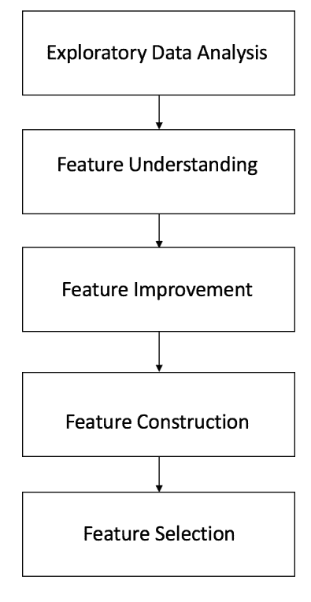

机器学习流程

这是一个使用本文前面方法示例的机器学习流程。它由五个主要步骤组成：分析、理解、改进、构建和选择。在接下来的章节中，我们将关注一种新的数据转换方法，这种方法部分打破了这种经典观念。

在本书的这个阶段，读者已经准备好以合理的信心和期望去处理世界上的数据集。接下来的两个章节，第六章，*特征转换*，和第七章，*特征学习*，将重点关注特征工程中的两个子集，这两个子集在编程和数学上都非常重要，特别是线性代数。我们将一如既往地尽力解释本章中使用的所有代码行，并在必要时仅描述数学过程。

本章将处理**特征转换**，这是一套旨在改变数据内部结构以产生数学上更优的*超级列*的算法，而下一章将专注于使用非参数算法（不依赖于数据形状的算法）来自动学习新特征的**特征学习**。本文的最后一章包含几个案例研究，以展示特征工程的端到端过程及其对机器学习管道的影响。

现在，让我们从对特征转换的讨论开始。正如我们之前提到的，特征转换是一组矩阵算法，将结构性地改变我们的数据，并产生一个本质上全新的数据矩阵。基本思想是，数据集的原始特征是数据点的描述符/特征，我们应该能够创建一组新的特征，这些特征能够像原始特征一样，甚至可能更好地解释数据点，而且列数更少。

想象一个简单的、矩形的房间。房间是空的，除了一个站在中央的人体模特。人体模特从不移动，并且始终朝同一个方向。你被赋予了 24/7 监控这个房间的任务。当然，你提出了在房间里安装安全摄像头的想法，以确保所有活动都被捕捉和记录。你将一个摄像头放置在房间的角落，向下对着人体模特的脸，在这个过程中，捕捉到房间的大部分区域。使用一个摄像头，你几乎可以看到房间的所有方面。问题是，摄像头有盲点。例如，你将无法直接看到摄像头下方（由于物理上的无法看到那里）和人体模特后面（因为人体模特本身阻挡了摄像头的视线）。作为一个聪明人，你向对面的角落添加了第二个摄像头，位于人体模特后面，以补偿第一个摄像头的盲点。使用两个摄像头，你现在可以从安全办公室看到超过 99%的房间。

在这个例子中，房间代表数据的原始特征空间，而人体模特代表一个数据点，位于特征空间的一个特定部分。更正式地说，我要求你考虑一个三维特征空间和一个单一的数据点：

*[X, Y, Z]*

要尝试用单个相机捕捉这个数据点就像将我们的数据集压缩成只有一个新维度，即相机一看到的数据：

*[X, Y, Z] ≈ [C1]*

然而，仅使用一个维度可能是不够的，因为我们能够构想出那个单相机的盲点，所以我们添加了第二个相机：

*[X, Y, Z] ≈ [C1, C2]*

这两个相机（由特征转换产生的新维度）以新的方式捕捉数据，但只用两列而不是三列就提供了我们所需的大部分信息。特征转换中最困难的部分是我们对原始特征空间是最佳空间的信念的放弃。我们必须开放地接受可能存在其他数学轴和系统，它们可以用更少的特征，甚至可能更好地描述我们的数据。

# 维度降低 – 特征转换与特征选择与特征构造

在上一节中，我提到了如何将数据集压缩成更少的列，以用新的方式描述数据。这听起来与特征选择的概念相似：从我们的原始数据集中删除列，通过剔除噪声并增强信号列来创建不同的、可能更好的数据集视图。虽然特征选择和特征转换都是执行降维的方法，但它们在方法论上却大相径庭。

特征选择过程仅限于从原始列集中选择特征，而特征转换算法使用这些原始列并以有用的方式将它们组合起来，创建出比原始数据集中任何单列都更好地描述数据的新的列。因此，特征选择方法通过隔离信号列和忽略噪声列来降低维度。

特征转换方法通过使用原始数据集中的隐藏结构来创建新的列，从而产生一个完全不同、结构上不同的数据集。这些算法创建了全新的列，它们如此强大，我们只需要其中的一小部分就能准确地解释整个数据集。

我们还提到，特征转换通过产生新的列来捕捉数据的本质（方差）。这与特征构造的核心思想相似：为了捕捉数据中的潜在结构而创建新的特征。再次强调，这两个不同的过程使用截然不同的方法实现了类似的结果。

特征构建再次仅限于通过每次在几个列之间进行简单操作（加法、乘法等）来构建新的列。这意味着任何使用经典特征构建方法构建的特征都只使用原始数据集的一小部分列。如果我们目标是创建足够多的特征来捕捉所有可能的特征交互，那么可能需要大量的额外列。例如，如果给定的数据集有 1,000 个特征或更多，我们需要创建数以万计的列来构建足够多的特征来捕捉所有可能特征交互的子集。

特征转换方法能够利用每个新超列中所有列的一小部分信息，因此我们不需要创建大量的新列来捕捉潜在的特征交互。由于特征转换算法的性质及其对矩阵/线性代数的使用，特征转换方法永远不会创建比我们开始时更多的列，并且仍然能够提取特征构建列试图提取的潜在结构。

特征转换算法能够通过选择所有列中的最佳列并组合这种潜在结构与一些全新的列来*构建*新的特征。通过这种方式，我们可以将特征转换视为本文中将要讨论的最强大的算法集之一。话虽如此，现在是时候介绍本书中的第一个算法和数据集了：**主成分分析**（**PCA**）和`iris`数据集。

# 主成分分析

主成分分析是一种技术，它将具有多个相关特征的数据集投影到一个具有较少相关特征的坐标（轴）系统上。这些新的、不相关的特征（我之前称之为超列）被称为**主成分**。主成分作为替代坐标系统，用于原始特征空间，它需要更少的特征，并尽可能多地捕捉方差。如果我们回顾我们关于相机的例子，主成分就是相机本身。

换句话说，PCA 的目标是在数据集中识别模式和潜在结构，以便创建新的列，并使用这些列而不是原始特征。正如在特征选择中，如果我们从一个大小为 *n x d* 的数据矩阵开始，其中 *n* 是观测值的数量，*d* 是原始特征的数目，我们将这个矩阵投影到一个大小为 *n x k* 的矩阵上（其中 *k < d*）。

我们的主成分产生新的列，这些列最大化了数据中的方差。这意味着每一列都在尝试解释数据的形状。主成分按解释的方差排序，因此第一个主成分对解释数据的方差贡献最大，而第二个成分对解释数据的方差贡献次之。目标是利用尽可能多的成分来优化机器学习任务，无论是监督学习还是无监督学习：

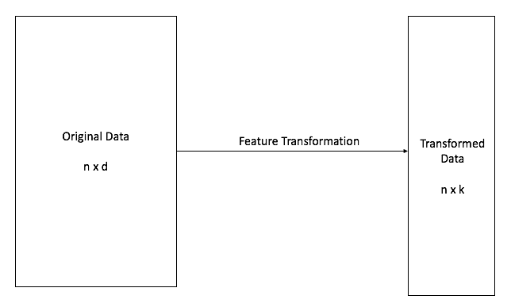

特征转换是将数据集转换成具有相同行数但特征数量减少的矩阵。这与特征选择的目的类似，但在这个情况下，我们关注的是创建全新的特征。

PCA 本身是一个无监督任务，这意味着它不利用响应列来执行投影/转换。这很重要，因为我们将要处理的第二个特征转换算法将是监督的，并将利用响应变量以不同的方式创建优化预测任务的超级列。

# PCA 是如何工作的

PCA 通过调用协方差矩阵的**特征值分解**过程来工作。这一数学原理最早在 20 世纪 30 年代发表，涉及一些多元微积分和线性代数。为了本文本的目的，我们将跳过这部分内容，直接进入重点。

PCA 也可能适用于相关矩阵。如果你选择使用相关矩阵，那么特征处于相似尺度时更为合适，而协方差矩阵在处理不同尺度时更有用。我们通常推荐使用缩放数据的协方差矩阵。

这个过程分为四个步骤：

1.  创建数据集的协方差矩阵

1.  计算协方差矩阵的特征值

1.  保留最大的*k*个特征值（按特征值降序排列）

1.  使用保留的特征向量来转换新的数据点

让我们通过一个名为`iris`数据集的例子来看看这一点。在这个相对较小的数据集中，我们将逐步查看 PCA 的性能，然后是 scikit-learn 的实现。

# 使用 Iris 数据集的 PCA – 手动示例

`iris`数据集包含 150 行和四列。每一行/观测值代表一朵花，而列/特征代表花的四个不同的定量特征。数据集的目标是拟合一个分类器，尝试根据四个特征预测三种类型的`iris`。这朵花可以是 setosa、virginica 或 versicolor 之一。

这个数据集在机器学习教学领域非常常见，scikit-learn 内置了一个模块用于下载数据集：

1.  让我们先导入模块，然后将数据集提取到一个名为`iris`的变量中：

```py
# import the Iris dataset from scikit-learn
from sklearn.datasets import load_iris
# import our plotting module
import matplotlib.pyplot as plt
%matplotlib inline

# load the Iris dataset
iris = load_iris()
```

1.  现在，让我们将提取的数据矩阵和响应变量分别存储到两个新变量`iris_X`和`iris_y`中：

```py
# create X and y variables to hold features and response column
iris_X, iris_y = iris.data, iris.target
```

1.  让我们看看我们试图预测的花的名称：

```py
# the names of the flower we are trying to predict.
iris.target_names

array(['setosa', 'versicolor', 'virginica'], dtype='|S10')
```

1.  除了花的名称外，我们还可以查看我们用于做出这些预测的特征的名称：

```py
# Names of the features
iris.feature_names

['sepal length (cm)',
 'sepal width (cm)',
 'petal length (cm)',
 'petal width (cm)']
```

1.  为了了解我们的数据看起来像什么，让我们编写一些代码来显示四个特征中的两个的数据点：

```py
# for labelling
label_dict = {i: k for i, k in enumerate(iris.target_names)}
# {0: 'setosa', 1: 'versicolor', 2: 'virginica'}

def plot(X, y, title, x_label, y_label):
 ax = plt.subplot(111)
 for label,marker,color in zip(
 range(3),('^', 's', 'o'),('blue', 'red', 'green')):

 plt.scatter(x=X[:,0].real[y == label],
 y=X[:,1].real[y == label],
 color=color,
 alpha=0.5,
 label=label_dict[label]
 )

 plt.xlabel(x_label)
 plt.ylabel(y_label)

 leg = plt.legend(loc='upper right', fancybox=True)
 leg.get_frame().set_alpha(0.5)
 plt.title(title)

plot(iris_X, iris_y, "Original Iris Data", "sepal length (cm)", "sepal width (cm)")
```

以下为前述代码的输出：


现在我们对`iris`数据集执行 PCA，以获得我们的主成分。请记住，这需要四个步骤。

# 创建数据集的协方差矩阵

要计算`iris`的协方差矩阵，我们首先将计算特征均值向量（用于未来使用），然后使用 NumPy 计算我们的协方差矩阵。

协方差矩阵是一个*d x d*矩阵（具有与行数和列数相同数量的特征的方阵），它表示每个特征之间的特征交互。它与相关矩阵非常相似：

```py
# Calculate a PCA manually

# import numpy
import numpy as np

# calculate the mean vector
mean_vector = iris_X.mean(axis=0)
print mean_vector
[ 5.84333333  3.054       3.75866667  1.19866667]

# calculate the covariance matrix
cov_mat = np.cov((iris_X-mean_vector).T)
print cov_mat.shape
(4, 4)
```

变量`cov_mat`存储我们的 4 x 4 协方差矩阵。

# 计算协方差矩阵的特征值

NumPy 是一个方便的函数，可以计算特征向量和特征值，我们可以使用它来获取`iris`数据集的主成分：

```py
# calculate the eigenvectors and eigenvalues of our covariance matrix of the iris dataset
eig_val_cov, eig_vec_cov = np.linalg.eig(cov_mat)

# Print the eigen vectors and corresponding eigenvalues
# in order of descending eigenvalues
for i in range(len(eig_val_cov)):
 eigvec_cov = eig_vec_cov[:,i]
 print 'Eigenvector {}: \n{}'.format(i+1, eigvec_cov)
 print 'Eigenvalue {} from covariance matrix: {}'.format(i+1, eig_val_cov[i])
 print 30 * '-'

Eigenvector 1: 
[ 0.36158968 -0.08226889  0.85657211  0.35884393]
Eigenvalue 1 from covariance matrix: 4.22484076832
------------------------------
Eigenvector 2: 
[-0.65653988 -0.72971237  0.1757674   0.07470647]
Eigenvalue 2 from covariance matrix: 0.242243571628
------------------------------
Eigenvector 3: 
[-0.58099728  0.59641809  0.07252408  0.54906091]
Eigenvalue 3 from covariance matrix: 0.0785239080942
------------------------------
Eigenvector 4: 
[ 0.31725455 -0.32409435 -0.47971899  0.75112056]
Eigenvalue 4 from covariance matrix: 0.023683027126
------------------------------
```

# 保留最大的 k 个特征值（按特征值降序排序）

现在我们有了四个特征值，我们将选择适当的数量来考虑它们作为主成分。如果我们愿意，可以选择所有四个，但通常我们希望选择一个小于原始特征数量的数字。但正确的数字是多少？我们可以使用网格搜索并通过暴力方法找到答案，然而，我们还有另一个工具，称为**scree 图**。

Scree 图是一个简单的折线图，显示了每个主成分解释的数据中的总方差百分比。为了构建这个图，我们将特征值按降序排序，并绘制每个组件及其之前所有组件解释的**累积**方差。在`iris`的情况下，我们的 scree 图上将有四个点，每个主成分一个。每个组件单独解释了捕获的总方差的一部分，当百分比相加时，应该占数据集中总方差的 100%。

让我们通过将每个特征向量（主成分）关联的特征值除以所有特征值的总和来计算每个特征向量（主成分）解释的方差百分比：

```py
# the percentages of the variance captured by each eigenvalue
# is equal to the eigenvalue of that components divided by
# the sum of all eigen values

explained_variance_ratio = eig_val_cov/eig_val_cov.sum()
explained_variance_ratio

array([ 0.92461621,  0.05301557,  0.01718514,  0.00518309])
```

这告诉我们，我们的四个主成分在解释方差的数量上差异很大。第一个主成分作为一个单独的特征/列，能够解释数据中超过 92%的方差。这是惊人的！这意味着这个单独的超列理论上可以完成四个原始列几乎所有的任务。

为了可视化我们的斯克里普图，让我们创建一个图，其中四个主成分在 *x* 轴上，累积方差解释在 *y* 轴上。对于每一个数据点，*y* 位置将代表使用所有主成分直到该点的总百分比方差：

```py
# Scree Plot

plt.plot(np.cumsum(explained_variance_ratio))
plt.title('Scree Plot')
plt.xlabel('Principal Component (k)')
plt.ylabel('% of Variance Explained <= k')
```

以下为前述代码的输出：

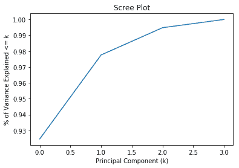

这告诉我们，前两个成分单独就几乎解释了原始数据集总方差的 98%，这意味着如果我们只使用前两个特征向量并将它们作为新的主成分，那么我们会做得很好。我们能够将数据集的大小减半（从四列减到两列），同时保持性能的完整性并加快性能。我们将在接下来的章节中通过机器学习的例子来更详细地研究这些理论概念。

特征值分解总是会产生与我们特征数量一样多的特征向量。一旦计算完毕，选择我们希望使用的多少个主成分取决于我们。这突出了 PCA，就像本文中的大多数其他算法一样，是半监督的，需要一些人工输入。

# 使用保留的特征向量来转换新的数据点

一旦我们决定保留两个主成分（无论我们使用网格搜索模块还是通过斯克里普图分析来找到最佳数量无关紧要），我们必须能够使用这些成分来转换进入样本外的数据点。为此，让我们首先隔离前两个特征向量并将它们存储在一个名为 `top_2_eigenvectors` 的新变量中：

```py
# store the top two eigenvectors in a variable
top_2_eigenvectors = eig_vec_cov[:,:2].T

# show the transpose so that each row is a principal component, we have two rows == two components
top_2_eigenvectors

array([[ 0.36158968, -0.08226889,  0.85657211,  0.35884393],
       [-0.65653988, -0.72971237,  0.1757674 ,  0.07470647]])
```

此数组表示前两个特征向量：

+   `[ 0.36158968, -0.08226889, 0.85657211, 0.35884393]`

+   `[-0.65653988, -0.72971237, 0.1757674 , 0.07470647]]`

在这些向量就位的情况下，我们可以通过将两个矩阵相乘来使用它们将我们的数据投影到新的、改进的超数据集：`iris_X` 和 `top_2_eigenvectors`。以下图像展示了我们如何确保数字正确：

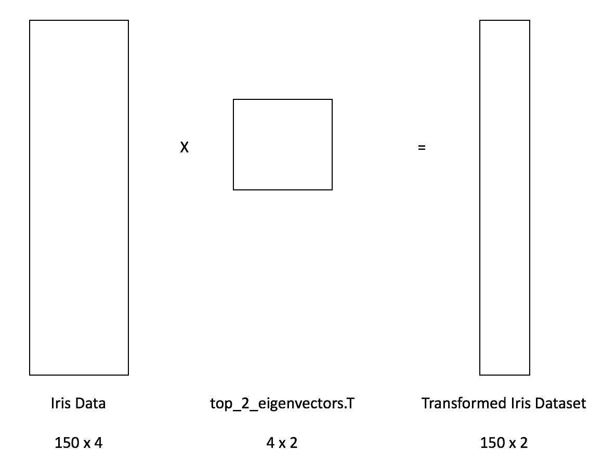

前面的图示展示了如何利用主成分将数据集从原始特征空间转换到新的坐标系。在`iris`的情况下，我们取原始的 150 x 4 数据集，并将其乘以前两个特征向量的转置。我们使用转置来确保矩阵的大小匹配。结果是具有相同行数但列数减少的矩阵。每一行都乘以两个主成分。

通过将这些矩阵相乘，我们正在将原始数据集**投影**到这个二维空间：

```py
# to transform our data from having shape (150, 4) to (150, 2)
# we will multiply the matrices of our data and our eigen vectors together

np.dot(iris_X, top_2_eigenvectors.T)[:5,]

array([[ 2.82713597, -5.64133105],
       [ 2.79595248, -5.14516688],
       [ 2.62152356, -5.17737812],
       [ 2.7649059 , -5.00359942],
       [ 2.78275012, -5.64864829]])
```

就这样。我们已经将四维的 iris 数据转换成了一个只有两列的新矩阵。这个新矩阵可以在我们的机器学习流程中代替原始数据集。

# Scikit-learn 的 PCA

如往常一样，scikit-learn 通过实现一个易于使用的转换器来拯救这一天，这样我们就不必每次使用这个强大的过程时都进行手动处理：

1.  我们可以从 scikit-learn 的分解模块中导入它：

```py
# scikit-learn's version of PCA
from sklearn.decomposition import PCA
```

1.  为了模拟我们在`iris`数据集上执行的过程，让我们实例化一个只有两个成分的`PCA`对象：

```py
# Like any other sklearn module, we first instantiate the class
pca = PCA(n_components=2)
```

1.  现在，我们可以将我们的 PCA 拟合到数据上：

```py
# fit the PCA to our data
pca.fit(iris_X)
```

1.  让我们查看 PCA 对象的一些属性，看看它们是否与我们在手动过程中实现的结果相匹配。让我们查看对象的`components_`属性，看看它是否与没有`top_2_eigenvectors`变量相匹配：

```py
pca.components_

array([[ 0.36158968, -0.08226889,  0.85657211,  0.35884393],
       [ 0.65653988,  0.72971237, -0.1757674 , -0.07470647]])

# note that the second column is the negative of the manual process
# this is because eignevectors can be positive or negative
# It should have little to no effect on our machine learning pipelines
```

1.  我们的两个成分几乎与之前的变量`top_2_eigenvectors`相匹配。我们说几乎是因为第二个成分实际上是计算出的特征向量的负值。这是可以的，因为从数学上讲，这两个特征向量都是 100%有效的，并且仍然实现了创建不相关列的主要目标。

1.  到目前为止，这个过程比我们之前所做的方法痛苦少得多。为了完成这个过程，我们需要使用 PCA 对象的 transform 方法将数据投影到新的二维平面上：

```py
pca.transform(iris_X)[:5,]

array([[-2.68420713,  0.32660731],
       [-2.71539062, -0.16955685],
       [-2.88981954, -0.13734561],
       [-2.7464372 , -0.31112432],
       [-2.72859298,  0.33392456]])

# sklearn PCA centers the data first while transforming, so these numbers won't match our manual process.
```

注意，我们的投影数据与之前得到的投影数据完全不匹配。这是因为 scikit-learn 版本的 PCA 在预测阶段自动将数据居中，这改变了结果。

1.  我们可以通过修改我们版本中的一行来模拟这个过程：

```py
# manually centering our data to match scikit-learn's implementation of PCA
np.dot(iris_X-mean_vector, top_2_eigenvectors.T)[:5,]

array([[-2.68420713, -0.32660731],
       [-2.71539062,  0.16955685],
       [-2.88981954,  0.13734561],
       [-2.7464372 ,  0.31112432],
       [-2.72859298, -0.33392456]])
```

1.  让我们快速绘制一下投影后的`iris`数据，并比较在投影到新的坐标系前后数据集看起来如何：

```py
# Plot the original and projected data
plot(iris_X, iris_y, "Original Iris Data", "sepal length (cm)", "sepal width (cm)")
plt.show()
plot(pca.transform(iris_X), iris_y, "Iris: Data projected onto first two PCA components", "PCA1", "PCA2")
```

下面的代码是前面的输出：


在我们的原始数据集中，我们可以看到在第一、第二列中沿原始特征空间的花。注意，在我们的投影空间中，花朵彼此之间分离得更多，并且在其轴上略有旋转。看起来数据簇是“直立”的。这种现象是因为我们的主成分正在努力捕捉数据中的方差，这在我们的图中显示出来。

我们可以提取每个成分解释的方差量，就像我们在手动示例中所做的那样：

```py
# percentage of variance in data explained by each component
# same as what we calculated earlier
pca.explained_variance_ratio_

array([ 0.92461621,  0.05301557])
```

现在，我们已经可以使用 scikit-learn 的 PCA 执行所有基本功能，让我们利用这些信息来展示 PCA 的一个主要好处：特征去相关。

按照本质，在特征值分解过程中，得到的主成分彼此垂直，这意味着它们彼此之间线性无关。

这是一个主要的好处，因为许多机器学习模型和预处理技术都假设输入的特征是独立的，而利用 PCA 可以确保这一点。

为了展示这一点，让我们创建原始 `iris` 数据集的相关矩阵，并找出每个特征之间的平均线性相关系数。然后，我们将对 PCA 投影数据集做同样的事情，并比较这些值。我们预计投影数据集的平均相关性应该接近于零，这意味着它们都是线性无关的。

让我们首先计算原始 `iris` 数据集的相关矩阵：

1.  它将是一个 4x4 的矩阵，其中的值代表每个特征与其他每个特征之间的相关系数：

```py
# show how pca attempts to eliminate dependence between columns

# show the correlation matrix of the original dataset
np.corrcoef(iris_X.T)

array([[ 1\.        , -0.10936925,  0.87175416,  0.81795363],
       [-0.10936925,  1\.        , -0.4205161 , -0.35654409],
       [ 0.87175416, -0.4205161 ,  1\.        ,  0.9627571 ],
       [ 0.81795363, -0.35654409,  0.9627571 ,  1\.        ]])
```

1.  然后，我们将提取所有对角线以上 1 的值，以使用它们来找出所有特征之间的平均相关性：

```py
# correlation coefficients above the diagonal
 np.corrcoef(iris_X.T)[[0, 0, 0, 1, 1], [1, 2, 3, 2, 3]]

 array([-0.10936925, 0.87175416, 0.81795363, -0.4205161 , -0.35654409])
```

1.  最后，我们将取这个数组的平均值：

```py
# average correlation of original iris dataset.
 np.corrcoef(iris_X.T)[[0, 0, 0, 1, 1], [1, 2, 3, 2, 3]].mean()

 0.16065567094168495
```

1.  原始特征的平均相关系数是 `.16`，相当小，但绝对不是零。现在，让我们创建一个包含所有四个主成分的完整 PCA：

```py
# capture all four principal components
 full_pca = PCA(n_components=4)

 # fit our PCA to the iris dataset
 full_pca.fit(iris_X)
```

1.  一旦我们完成这个操作，我们将使用之前的方法来计算新、理论上线性无关的列之间的平均相关系数：

```py
 pca_iris = full_pca.transform(iris_X)
 # average correlation of PCAed iris dataset.
 np.corrcoef(pca_iris.T)[[0, 0, 0, 1, 1], [1, 2, 3, 2, 3]].mean()
 # VERY close to 0 because columns are independent from one another
 # This is an important consequence of performing an eigenvalue decomposition

 7.2640855025557061e-17 # very close to 0
```

这显示了数据投影到主成分上最终会有更少的相关特征，这在机器学习中通常是有帮助的。

# 数据中心化和缩放如何影响主成分分析（PCA）

就像我们在本文中之前使用过的许多转换一样，特征的缩放往往对转换有很大影响。PCA 也不例外。之前我们提到，scikit-learn 版本的 PCA 在预测阶段自动对数据进行中心化，但为什么在拟合时不这样做呢？如果 scikit-learn 的 PCA 模块在预测方法中费尽心机对数据进行中心化，为什么不在计算特征向量时这样做呢？这里的假设是数据中心化不会影响主成分。让我们来测试这个假设：

1.  让我们导入 scikit-learn 的 `StandardScaler` 模块并将 `iris` 数据集进行中心化：

```py
# import our scaling module
 from sklearn.preprocessing import StandardScaler
 # center our data, not a full scaling
 X_centered = StandardScaler(with_std=False).fit_transform(iris_X)

 X_centered[:5,]

 array([[-0.74333333, 0.446 , -2.35866667, -0.99866667], [-0.94333333, -0.054 , -2.35866667, -0.99866667], [-1.14333333, 0.146 , -2.45866667, -0.99866667], [-1.24333333, 0.046 , -2.25866667, -0.99866667], [-0.84333333, 0.546 , -2.35866667, -0.99866667]])
```

1.  让我们看一下现在中心化的数据集：

```py
# Plot our centered data
 plot(X_centered, iris_y, "Iris: Data Centered", "sepal length (cm)", "sepal width (cm)")
```

我们得到以下代码输出：

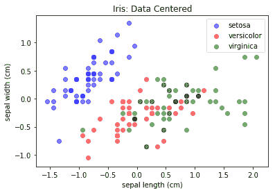

1.  我们可以将之前实例化的 PCA 类拟合到我们的中心化 `iris` 数据集，其中 `n_components` 设置为 `2`：

```py
# fit our PCA (with n_components still set to 2) on our centered data
 pca.fit(X_centered)
```

1.  完成此操作后，我们可以调用 PCA 模块的`components_ 属性`，并将得到的特征成分与使用原始`iris`数据集得到的 PCs 进行比较：

```py
# same components as before
 pca.components_

 array([[ 0.36158968, -0.08226889, 0.85657211, 0.35884393], [ 0.65653988, 0.72971237, -0.1757674 , -0.07470647]])
```

1.  看起来，由中心化数据产生的主成分（PCs）与我们之前看到的是完全相同的。为了澄清这一点，让我们使用 PCA 模块对中心化数据进行转换，并查看前五行，看看它们是否与之前获得的投影对应：

```py
# same projection when data are centered because PCA does this automatically
 pca.transform(X_centered)[:5,]

 array([[-2.68420713, 0.32660731], [-2.71539062, -0.16955685], [-2.88981954, -0.13734561], [-2.7464372 , -0.31112432], [-2.72859298, 0.33392456]])
```

1.  行与行对应！如果我们查看投影中心化数据的图表和解释方差比，我们会发现这些也对应：

```py
# Plot PCA projection of centered data, same as previous PCA projected data
 plot(pca.transform(X_centered), iris_y, "Iris: Data projected onto first two PCA components with centered data", "PCA1", "PCA2")

```

我们得到以下输出：

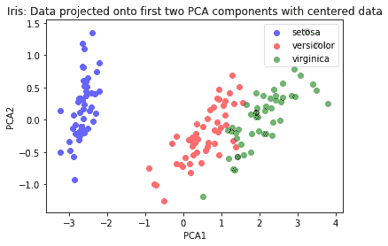

对于百分比方差，我们实现以下操作：

```py
 # percentage of variance in data explained by each component
 pca.explained_variance_ratio_

 array([ 0.92461621, 0.05301557])
```

发生这种情况的原因是因为矩阵与其中心化对应矩阵具有相同的协方差矩阵。如果两个矩阵具有相同的协方差矩阵，那么它们将具有相同的特征值分解。这就是为什么 scikit-learn 版本的 PCA 在寻找特征值和特征向量时不需要对数据进行中心化，因为无论是否中心化，它们都会找到相同的值，所以为什么还要增加一个额外的、不必要的步骤？

现在，让我们看看当我们使用标准 z-score 缩放数据时，我们的主成分会发生什么变化：

```py
# doing a normal z score scaling
 X_scaled = StandardScaler().fit_transform(iris_X)

 # Plot scaled data
 plot(X_scaled, iris_y, "Iris: Data Scaled", "sepal length (cm)", "sepal width (cm)")
```

我们得到以下输出：

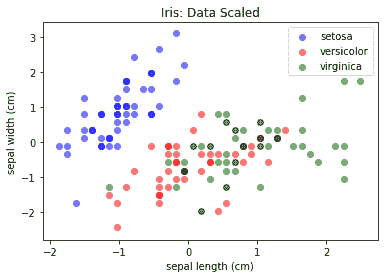

值得注意的是，到目前为止，我们已经在原始格式、中心化和现在完全缩放的情况下绘制了 iris 数据。在每个图表中，数据点都是完全相同的，但坐标轴是不同的。这是预期的。中心化和缩放数据不会改变数据的形状，但它确实会影响我们的特征工程和机器学习管道中的特征交互。

让我们在新缩放的数据上拟合我们的 PCA 模块，看看我们的 PCs 是否不同：

```py
# fit our 2-dimensional PCA on our scaled data
 pca.fit(X_scaled)

 # different components as cenetered data
 pca.components_

 array([[ 0.52237162, -0.26335492, 0.58125401, 0.56561105], [ 0.37231836, 0.92555649, 0.02109478, 0.06541577]])
```

这些是与之前不同的成分。PCA 是尺度不变的，这意味着尺度会影响成分。请注意，当我们说缩放时，我们指的是中心化和除以标准差。让我们将我们的数据集投影到我们的新成分上，并确保新投影的数据确实不同：

```py
# different projection when data are scaled
 pca.transform(X_scaled)[:5,]

 array([[-2.26454173, 0.5057039 ], [-2.0864255 , -0.65540473], [-2.36795045, -0.31847731], [-2.30419716, -0.57536771], [-2.38877749, 0.6747674 ]])
```

最后，让我们看一下我们的解释方差比：

```py
# percentage of variance in data explained by each component
 pca.explained_variance_ratio_

 array([ 0.72770452, 0.23030523])
```

这很有趣。在执行特征工程/机器学习时，对数据进行缩放通常是一个好主意，我们通常也向我们的读者推荐这样做，但为什么我们的第一个成分的解释方差比比之前低得多？

这是因为一旦我们缩放了数据，列之间的协方差变得更加一致，每个主成分解释的方差被分散开来，而不是固化在一个单独的 PC 中。在实际生产和实践中，我们通常推荐缩放，但测试您的管道在缩放和非缩放数据上的性能是一个好主意。

让我们用查看缩放数据上的投影 iris 数据来结束本节：

```py
# Plot PCA projection of scaled data
 plot(pca.transform(X_scaled), iris_y, "Iris: Data projected onto first two PCA components", "PCA1", "PCA2")
```

我们得到以下输出：

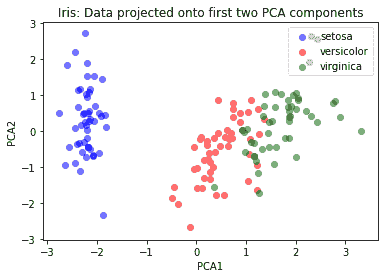

这很微妙，但如果你看看这个图表，并将其与原始数据和中心数据下之前的项目数据图表进行比较，你会注意到它们之间有细微的差异。

# 深入了解主成分

在我们查看第二个特征变换算法之前，重要的是要看看如何解释主成分：

1.  我们的`iris`数据集是一个 150 x 4 的矩阵，当我们计算`n_components`设置为`2`时的 PCA 组件时，我们得到了一个`2 x 4`大小的组件矩阵：

```py
# how to interpret and use components
 pca.components_ # a 2 x 4 matrix

 array([[ 0.52237162, -0.26335492, 0.58125401, 0.56561105], [ 0.37231836, 0.92555649, 0.02109478, 0.06541577]])
```

1.  就像我们在手动计算特征向量的例子中一样，`components_`属性可以通过矩阵乘法来投影数据。我们通过将原始数据集与`components_ 矩阵`的转置相乘来实现这一点：

```py
# Multiply original matrix (150 x 4) by components transposed (4 x 2) to get new columns (150 x 2)
 np.dot(X_scaled, pca.components_.T)[:5,]

 array([[-2.26454173, 0.5057039 ], [-2.0864255 , -0.65540473], [-2.36795045, -0.31847731], [-2.30419716, -0.57536771], [-2.38877749, 0.6747674 ]])
```

1.  我们在这里调用转置函数，以便矩阵维度匹配。在底层发生的事情是，对于每一行，我们都在计算原始行与每个主成分之间的点积。点积的结果成为新行的元素：

```py
# extract the first row of our scaled data
 first_scaled_flower = X_scaled[0]

 # extract the two PC's
 first_Pc = pca.components_[0]
 second_Pc = pca.components_[1]

 first_scaled_flower.shape # (4,)
 print first_scaled_flower # array([-0.90068117, 1.03205722, -1.3412724 , -1.31297673])

 # same result as the first row of our matrix multiplication
 np.dot(first_scaled_flower, first_Pc), np.dot(first_scaled_flower, second_Pc)

 (-2.2645417283949003, 0.50570390277378274)
```

1.  幸运的是，我们可以依赖内置的 transform 方法来为我们完成这项工作：

```py
# This is how the transform method works in pca
 pca.transform(X_scaled)[:5,]

 array([[-2.26454173, 0.5057039 ], [-2.0864255 , -0.65540473], [-2.36795045, -0.31847731], [-2.30419716, -0.57536771], [-2.38877749, 0.6747674 ]])
```

换句话说，我们可以将每个成分解释为原始列的组合。在这种情况下，我们的第一个主成分是：

```py
[ 0.52237162, -0.26335492, 0.58125401, 0.56561105]
```

第一个缩放后的花是：

```py
[-0.90068117, 1.03205722, -1.3412724 , -1.31297673]
```

要得到投影数据第一行的第一个元素，我们可以使用以下公式：


事实上，一般来说，对于任何坐标为（a，b，c，d）的花朵，其中 a 是鸢尾花的萼片长度，b 是萼片宽度，c 是花瓣长度，d 是花瓣宽度（这个顺序是从之前的`iris.feature_names`中取的），新坐标系统的第一个值可以通过以下公式计算：


让我们更进一步，并在空间中将这些成分与我们的数据可视化。我们将截断原始数据，只保留其原始特征中的两个，即萼片长度和萼片宽度。我们这样做的原因是，这样我们可以更容易地可视化数据，而不用担心四个维度：

```py
# cut out last two columns of the original iris dataset
 iris_2_dim = iris_X[:,2:4]

 # center the data
 iris_2_dim = iris_2_dim - iris_2_dim.mean(axis=0)

 plot(iris_2_dim, iris_y, "Iris: Only 2 dimensions", "sepal length", "sepal width")
```

我们得到了以下输出：

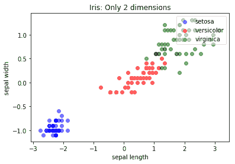

我们可以看到左下角有一簇**setosa**花，右上角有一簇较大的**versicolor**和**virginicia**花。一开始很明显，数据整体上沿着从左下角到右上角的对角线拉伸。希望我们的主成分也能捕捉到这一点，并相应地重新排列我们的数据。

让我们实例化一个保留两个主成分的 PCA 类，然后使用这个类将我们的截断**iris 数据**转换成新的列：

```py
# instantiate a PCA of 2 components
 twodim_pca = PCA(n_components=2)

 # fit and transform our truncated iris data
 iris_2_dim_transformed = twodim_pca.fit_transform(iris_2_dim)

 plot(iris_2_dim_transformed, iris_y, "Iris: PCA performed on only 2 dimensions", "PCA1", "PCA2")
```

我们得到了以下输出：


**PCA 1**，我们的第一个主成分，应该包含大部分方差，这就是为什么投影数据主要分布在新的*x*轴上。注意*x*轴的刻度在-3 到 3 之间，而*y*轴只在-0.4 到 0.6 之间。为了进一步阐明这一点，以下代码块将绘制原始和投影的鸢尾花散点图，以及将`twodim_pca`的主成分叠加在它们之上，既在原始坐标系中，也在新坐标系中。

目标是将成分解释为引导向量，显示数据移动的方式以及这些引导向量如何成为垂直坐标系：

```py
# This code is graphing both the original iris data and the projected version of it using PCA.
 # Moreover, on each graph, the principal components are graphed as vectors on the data themselves
 # The longer of the arrows is meant to describe the first principal component and
 # the shorter of the arrows describes the second principal component
 def draw_vector(v0, v1, ax):
 arrowprops=dict(arrowstyle='->',linewidth=2,
 shrinkA=0, shrinkB=0)
 ax.annotate('', v1, v0, arrowprops=arrowprops)

 fig, ax = plt.subplots(2, 1, figsize=(10, 10))
 fig.subplots_adjust(left=0.0625, right=0.95, wspace=0.1)

 # plot data
 ax[0].scatter(iris_2_dim[:, 0], iris_2_dim[:, 1], alpha=0.2)
 for length, vector in zip(twodim_pca.explained_variance_, twodim_pca.components_):
 v = vector * np.sqrt(length) # elongdate vector to match up to explained_variance
 draw_vector(twodim_pca.mean_,
 twodim_pca.mean_ + v, ax=ax[0])
 ax[0].set(xlabel='x', ylabel='y', title='Original Iris Dataset',
 xlim=(-3, 3), ylim=(-2, 2))

 ax[1].scatter(iris_2_dim_transformed[:, 0], iris_2_dim_transformed[:, 1], alpha=0.2)
 for length, vector in zip(twodim_pca.explained_variance_, twodim_pca.components_):
 transformed_component = twodim_pca.transform([vector])[0] # transform components to new coordinate system
 v = transformed_component * np.sqrt(length) # elongdate vector to match up to explained_variance
 draw_vector(iris_2_dim_transformed.mean(axis=0),
 iris_2_dim_transformed.mean(axis=0) + v, ax=ax[1])
 ax[1].set(xlabel='component 1', ylabel='component 2',
 title='Projected Data',
 xlim=(-3, 3), ylim=(-1, 1))

```

这是**原始鸢尾花数据集**和**使用 PCA 投影的数据**：


顶部图表显示了原始数据轴系统中的主成分。它们不是垂直的，并且指向数据自然遵循的方向。我们可以看到，两个向量中较长的第一个主成分明显遵循鸢尾花数据最遵循的对角线方向。

次级主成分指向一个解释数据形状一部分但不是全部的方差方向。底部图表显示了将鸢尾花数据投影到这些新成分上，并伴随着相同的成分，但作为垂直坐标系。它们已成为新的*x*轴和*y*轴。

PCA 是一种特征转换工具，它允许我们通过先前特征的线性组合构建全新的超级特征。我们已经看到，这些成分包含最大量的方差，并作为我们数据的新坐标系。我们的下一个特征转换算法与此类似，因为它也会从我们的数据中提取成分，但它以机器学习的方式这样做。

# 线性判别分析

**线性判别分析**（**LDA**）是一种特征转换技术，也是一种监督分类器。它通常用作分类流程的预处理步骤。LDA 的目标，就像 PCA 一样，是提取一个新的坐标系并将数据集投影到低维空间。LDA 与 PCA 的主要区别在于，与 PCA 关注数据的整体方差不同，LDA 优化低维空间以实现最佳类别可分性。这意味着新的坐标系在寻找分类模型的决策边界方面更有用，这对于我们构建分类流程来说非常完美。

LDA 之所以极其有用，是因为基于类别可分性的分离有助于我们在机器学习流程中避免过拟合。这也被称为*防止维度灾难*。LDA 还可以降低计算成本。

# LDA 是如何工作的

LDA 作为一个降维工具，就像 PCA 一样工作，然而，LDA 不是计算整个数据集协方差矩阵的特征值，而是计算类内和类间散布矩阵的特征值和特征向量。执行 LDA 可以分为五个步骤：

1.  计算每个类别的均值向量

1.  计算类内和类间散布矩阵

1.  为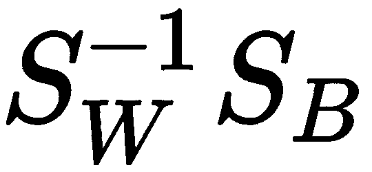计算特征值和特征向量

1.  通过按降序排列特征值来保留最大的 k 个特征向量

1.  使用最大的特征向量将数据投影到新的空间

让我们来看一个例子。

# 计算每个类别的均值向量

首先，我们需要为我们的每个类别计算一个列向量的均值向量。一个用于`setosa`，一个用于`versicolor`，另一个用于`virginica`：

```py
# calculate the mean for each class
 # to do this we will separate the iris dataset into three dataframes
 # one for each flower, then we will take one's mean columnwise
 mean_vectors = []
 for cl in [0, 1, 2]:
 class_mean_vector = np.mean(iris_X[iris_y==cl], axis=0)
 mean_vectors.append(class_mean_vector)
 print label_dict[cl], class_mean_vector

 setosa [ 5.006 3.418 1.464 0.244]
 versicolor [ 5.936 2.77 4.26 1.326]
 virginica [ 6.588 2.974 5.552 2.026]
```

# 计算类内和类间散布矩阵

我们现在将计算一个**类内**散布矩阵，其定义为以下：


其中我们定义 *S[i]* 为：


在这里，*m*[*i*] 代表第 *i* 类的均值向量，以及以下定义的**类间散布矩阵**：


*m* 是数据集的整体均值，*m[i]* 是每个类别的样本均值，*N[i]* 是每个类别的样本大小（每个类别的观测数）：

```py
# Calculate within-class scatter matrix
 S_W = np.zeros((4,4))
 # for each flower
 for cl,mv in zip([0, 1, 2], mean_vectors):
 # scatter matrix for every class, starts with all 0's
 class_sc_mat = np.zeros((4,4))
 # for each row that describes the specific flower
 for row in iris_X[iris_y == cl]:
 # make column vectors
 row, mv = row.reshape(4,1), mv.reshape(4,1)
 # this is a 4x4 matrix
 class_sc_mat += (row-mv).dot((row-mv).T)
 # sum class scatter matrices
 S_W += class_sc_mat

 S_W

 array([[ 38.9562, 13.683 , 24.614 , 5.6556], [ 13.683 , 17.035 , 8.12 , 4.9132], [ 24.614 , 8.12 , 27.22 , 6.2536], [ 5.6556, 4.9132, 6.2536, 6.1756]])

 # calculate the between-class scatter matrix

 # mean of entire dataset
 overall_mean = np.mean(iris_X, axis=0).reshape(4,1)

 # will eventually become between class scatter matrix
 S_B = np.zeros((4,4))
 for i,mean_vec in enumerate(mean_vectors):
 # number of flowers in each species
 n = iris_X[iris_y==i,:].shape[0]
 # make column vector for each specied
 mean_vec = mean_vec.reshape(4,1)
 S_B += n * (mean_vec - overall_mean).dot((mean_vec - overall_mean).T)

 S_B

 array([[ 63.2121, -19.534 , 165.1647, 71.3631], [ -19.534 , 10.9776, -56.0552, -22.4924], [ 165.1647, -56.0552, 436.6437, 186.9081], [ 71.3631, -22.4924, 186.9081, 80.6041]])
```

类内和类间散布矩阵是 ANOVA 测试中一个步骤的推广（如前一章所述）。这里的想法是将我们的鸢尾花数据集分解成两个不同的部分。

一旦我们计算了这些矩阵，我们就可以进行下一步，即使用矩阵代数来提取线性判别式。

# 计算 SW-1SB 的特征值和特征向量

正如我们在 PCA 中所做的那样，我们依赖于特定矩阵的特征值分解。在 LDA 的情况下，我们将分解矩阵****：

```py
# calculate eigenvalues and eigenvectors of S−1W x SB
 eig_vals, eig_vecs = np.linalg.eig(np.dot(np.linalg.inv(S_W), S_B))
 eig_vecs = eig_vecs.real
 eig_vals = eig_vals.real

 for i in range(len(eig_vals)):
 eigvec_sc = eig_vecs[:,i]
 print 'Eigenvector {}: {}'.format(i+1, eigvec_sc)
 print 'Eigenvalue {:}: {}'.format(i+1, eig_vals[i])
 print

 Eigenvector 1: [-0.2049 -0.3871 0.5465 0.7138]
 Eigenvalue 1: 32.2719577997 Eigenvector 2: [ 0.009 0.589 -0.2543 0.767 ] Eigenvalue 2: 0.27756686384 Eigenvector 3: [ 0.2771 -0.3863 -0.4388 0.6644] Eigenvalue 3: -6.73276389619e-16 . # basically 0 Eigenvector 4: [ 0.2771 -0.3863 -0.4388 0.6644] Eigenvalue 4: -6.73276389619e-16 . # basically 0
```

注意第三个和第四个特征值基本上为零。这是因为 LDA 试图通过在我们类别之间绘制决策边界来工作。因为我们只有三个鸢尾花类别，所以我们可能只能绘制两个决策边界。一般来说，将 LDA 拟合到具有 n 个类别的数据集将只产生至多 n-1 个成分。

# 通过按降序排列特征值来保留最大的 k 个特征向量

正如 PCA 一样，我们只想保留做大部分工作的特征向量：

```py
# keep the top two linear discriminants
 linear_discriminants = eig_vecs.T[:2]

 linear_discriminants

 array([[-0.2049, -0.3871, 0.5465, 0.7138], [ 0.009 , 0.589 , -0.2543, 0.767 ]])
```

我们可以通过将每个特征值除以所有特征值的总和来查看每个成分/线性判别式的解释方差比：

```py
#explained variance ratios
 eig_vals / eig_vals.sum()

 array([ .99147, .0085275, -2.0685e-17, -2.0685e-17])
```

看起来第一个成分做了大部分工作，并且独自占据了超过 99%的信息。

# 使用最大的特征向量将数据投影到新的空间

现在我们有了这些成分，让我们通过首先使用特征向量将原始数据投影到新空间，然后调用我们的绘图函数来绘制投影的鸢尾花数据：

```py
# LDA projected data
 lda_iris_projection = np.dot(iris_X, linear_discriminants.T)
 lda_iris_projection[:5,]

 plot(lda_iris_projection, iris_y, "LDA Projection", "LDA1", "LDA2")
```

我们得到以下输出：

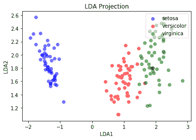

注意，在这个图中，数据几乎完全垂直（甚至比 PCA 投影数据更垂直），就像 LDA 成分试图通过绘制这些决策边界并提供特征向量/线性判别分析来尽可能帮助机器学习模型分离花朵一样。这有助于我们将数据投影到尽可能分离类的空间中。

# 如何在 scikit-learn 中使用 LDA

LDA 在 scikit-learn 中有一个实现，以避免这个过程非常繁琐。它很容易导入：

```py
from sklearn.discriminant_analysis import LinearDiscriminantAnalysis
```

从那里，让我们用它来拟合和转换我们的原始鸢尾花数据，并绘制结果投影数据集，以便我们可以将其与使用 PCA 的投影进行比较。在下面的代码块中要注意的最大事情是 fit 函数需要两个输入。

回想一下我们提到 LDA 实际上是一个伪装成特征变换算法的分类器。与 PCA 不同，PCA 以无监督的方式（没有响应变量）找到成分，而 LDA 将尝试找到最佳坐标系，该坐标系相对于响应变量优化了类可分性。这意味着 LDA 只在我们有响应变量时才起作用。如果有，我们将响应作为 fit 方法的第二个输入，让 LDA 做其事：

```py
# instantiate the LDA module
 lda = LinearDiscriminantAnalysis(n_components=2)

 # fit and transform our original iris data
 X_lda_iris = lda.fit_transform(iris_X, iris_y)

 # plot the projected data
 plot(X_lda_iris, iris_y, "LDA Projection", "LDA1", "LDA2")
```

我们得到以下输出：

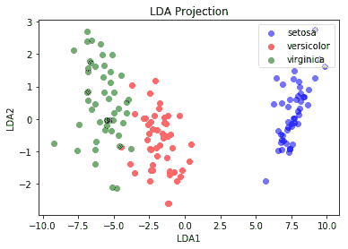

此图是手动 LDA 的镜像。这是可以的。回想一下在 PCA 中，我们手动版本的特征向量具有相反的符号（正与负）。这不会影响我们的机器学习流程。在 LDA 模块中，我们有一些差异需要注意。我们没有 `.components_` 属性，而是有 `.scalings_` 属性，它几乎以相同的方式工作：

```py
# essentially the same as pca.components_, but transposed (4x2 instead of 2x4)
 lda.scalings_

 array([[ 0.81926852, 0.03285975], [ 1.5478732 , 2.15471106], [-2.18494056, -0.93024679], [-2.85385002, 2.8060046 ]])

 # same as manual calculations
 lda.explained_variance_ratio_
 array([ 0.9915, 0.0085])
```

两个线性判别分析的解释方差比与之前计算出的完全相同，并且注意它们省略了第三个和第四个特征值，因为它们几乎为零。

然而，这些成分乍一看与之前我们得到的手动特征向量完全不同。原因是 scikit-learn 计算特征向量的方式产生了相同的特征向量，但通过一个标量进行了缩放，如下所示：

```py
# show that the sklearn components are just a scalar multiplication from the manual components we calculateda
 for manual_component, sklearn_component in zip(eig_vecs.T[:2], lda.scalings_.T):
 print sklearn_component / manual_component

 [-3.9982 -3.9982 -3.9982 -3.9982] [ 3.6583 3.6583 3.6583 3.6583]
```

scikit-learn 中的线性判别分析是对手动特征向量的标量乘积，这意味着它们都是有效的特征向量。唯一的区别在于投影数据的缩放。

这些成分被组织成一个 4 x 2 的矩阵，而不是 PCA 成分，PCA 成分以 2 x 4 矩阵的形式提供给我们。这是在开发模块时做出的选择，对我们来说并不会影响数学计算。LDA，就像 PCA 一样，具有缩放不变性，因此数据的缩放很重要。

让我们将 LDA 模块拟合到缩放后的鸢尾花数据，并查看组件以查看差异：

```py
# fit our LDA to scaled data
 X_lda_iris = lda.fit_transform(X_scaled, iris_y)

 lda.scalings_ # different scalings when data are scaled

 array([[ 0.67614337, 0.0271192 ], [ 0.66890811, 0.93115101], [-3.84228173, -1.63586613], [-2.17067434, 2.13428251]])
```

`缩放 _ 属性`（类似于 PCA 的`components_ 属性`）向我们展示了不同的数组，这意味着投影也将不同。为了完成我们对 LDA（线性判别分析）的（更简短的）描述，让我们应用与 PCA 相同的代码块，并将`缩放 _ 数组`解释为 PCA 的`components_ 属性`。

让我们先对截断的鸢尾花数据集进行 LDA 拟合和转换，我们只保留了前两个特征：

```py
# fit our LDA to our truncated iris dataset
 iris_2_dim_transformed_lda = lda.fit_transform(iris_2_dim, iris_y)
```

让我们看看我们投影数据集的前五行：

```py
# project data
 iris_2_dim_transformed_lda[:5,]

 array([[-6.04248571, 0.07027756], [-6.04248571, 0.07027756], [-6.19690803, 0.28598813], [-5.88806338, -0.14543302], [-6.04248571, 0.07027756]])
```

我们的`缩放 _ 矩阵`现在是一个 2 x 2 矩阵（2 行 2 列），其中列是组件（而不是 PCA 中行是组件）。为了调整这一点，让我们创建一个新的变量`components`，它包含`缩放 _ 属性`的转置版本：

```py
# different notation
 components = lda.scalings_.T # transposing gives same style as PCA. We want rows to be components

 print components
 [[ 1.54422328 2.40338224] [-2.15710573 5.02431491]]

 np.dot(iris_2_dim, components.T)[:5,] # same as transform method

 array([[-6.04248571, 0.07027756], [-6.04248571, 0.07027756], [-6.19690803, 0.28598813], [-5.88806338, -0.14543302], [-6.04248571, 0.07027756]])
```

我们可以看到，它使用与 PCA `components_ 属性`相同的方式使用组件变量。这意味着投影是原始列的另一个线性组合，就像在 PCA 中一样。还值得注意的是，LDA 仍然去相关特征，就像 PCA 一样。为了展示这一点，让我们计算原始截断的鸢尾花数据和投影数据的协方差矩阵：

```py
# original features are highly correlated
np.corrcoef(iris_2_dim.T)
 array([[ 1\. , 0.9627571],
 [ 0.9627571, 1\. ]])

 # new LDA features are highly uncorrelated, like in PCA
 np.corrcoef(iris_2_dim_transformed_lda.T)
 array([[ 1.00000000e+00, 1.03227536e-15], [ 1.03227536e-15, 1.00000000e+00]])
```

注意到在每个矩阵的右上角值，原始矩阵显示的是高度相关的特征，而使用 LDA 投影的数据具有高度独立的特点（考虑到接近零的协方差系数）。在我们转向真正的乐趣（使用 PCA 和 LDA 进行机器学习）之前，让我们看一下 LDA 的`缩放 _ 属性`的可视化，就像我们对 PCA 所做的那样：

```py
# This code is graphing both the original iris data and the projected version of it using LDA.
 # Moreover, on each graph, the scalings of the LDA are graphed as vectors on the data themselves
 # The longer of the arrows is meant to describe the first scaling vector and
 # the shorter of the arrows describes the second scaling vector
 def draw_vector(v0, v1, ax):
 arrowprops=dict(arrowstyle='->',
 linewidth=2,
 shrinkA=0, shrinkB=0)
 ax.annotate('', v1, v0, arrowprops=arrowprops)

 fig, ax = plt.subplots(2, 1, figsize=(10, 10))
 fig.subplots_adjust(left=0.0625, right=0.95, wspace=0.1)

 # plot data
 ax[0].scatter(iris_2_dim[:, 0], iris_2_dim[:, 1], alpha=0.2)
 for length, vector in zip(lda.explained_variance_ratio_, components):
 v = vector * .5
 draw_vector(lda.xbar_, lda.xbar_ + v, ax=ax[0]) # lda.xbar_ is equivalent to pca.mean_
 ax[0].axis('equal')
 ax[0].set(xlabel='x', ylabel='y', title='Original Iris Dataset',
 xlim=(-3, 3), ylim=(-3, 3))

 ax[1].scatter(iris_2_dim_transformed_lda[:, 0], iris_2_dim_transformed_lda[:, 1], alpha=0.2)
 for length, vector in zip(lda.explained_variance_ratio_, components):
 transformed_component = lda.transform([vector])[0]
 v = transformed_component * .1
 draw_vector(iris_2_dim_transformed_lda.mean(axis=0), iris_2_dim_transformed_lda.mean(axis=0) + v, ax=ax[1])
 ax[1].axis('equal')
 ax[1].set(xlabel='lda component 1', ylabel='lda component 2',
 title='Linear Discriminant Analysis Projected Data',
 xlim=(-10, 10), ylim=(-3, 3))
```

我们得到以下输出：

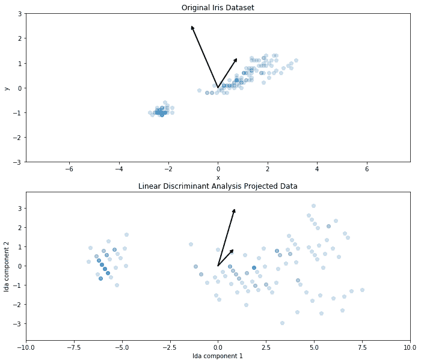

注意到组件，而不是随着数据的方差变化，几乎垂直于它；它遵循类别的分离。还要注意它几乎与左右两侧花朵之间的间隙平行。LDA 试图捕捉类别的分离。

在顶部图表中，我们可以看到原始的鸢尾花数据集，其`缩放向量`叠加在数据点上。较长的向量几乎与左下角塞托萨花和右上角其他花朵之间的大间隙平行。这表明 LDA 正在尝试指出在原始坐标系中分离花朵类别的最佳方向。

这里需要注意的是，LDA 的`scalings_`属性与 PCA 中的新坐标系不呈 1:1 的相关性。这是因为`scalings_`的目标不是创建一个新的坐标系，而只是指向数据中边界方向，这些方向优化了类分离性。我们不会像 PCA 那样详细讨论这些新坐标系的计算。理解 PCA 和 LDA 的主要区别就足够了，PCA 是一个无监督方法，它捕捉数据的整体方差，而 LDA 是一个监督方法，它使用响应变量来捕捉类分离性。

监督特征转换（如 LDA）的局限性意味着它们无法帮助诸如聚类等任务，而 PCA 则可以。这是因为聚类是一个无监督任务，没有 LDA 可以使用的响应变量。

# LDA 与 PCA – 爱 ris 数据集

最后，我们来到了一个时刻，可以尝试在我们的机器学习管道中使用 PCA 和 LDA。因为我们在这章中广泛使用了`iris`数据集，我们将继续展示 LDA 和 PCA 作为监督和未监督机器学习的特征转换预处理步骤的效用。

我们将从监督机器学习开始，并尝试构建一个分类器，根据四种定量花性状来识别花的种类：

1.  我们首先从 scikit-learn 导入三个模块：

```py
from sklearn.neighbors import KNeighborsClassifier
from sklearn.pipeline import Pipeline
from sklearn.model_selection import cross_val_score
```

我们将使用 KNN 作为我们的监督模型，并使用管道模块将我们的 KNN 模型与特征转换工具结合，以创建可以使用`cross_val_score`模块进行交叉验证的机器学习管道。我们将尝试几个不同的机器学习管道并记录它们的性能：

1.  让我们从创建三个新变量开始，一个用于存储我们的 LDA，一个用于存储我们的 PCA，另一个用于存储 KNN 模型：

```py
# Create a PCA module to keep a single component
 single_pca = PCA(n_components=1)

 # Create a LDA module to keep a single component
 single_lda = LinearDiscriminantAnalysis(n_components=1)

 # Instantiate a KNN model
 knn = KNeighborsClassifier(n_neighbors=3)
```

1.  让我们不使用任何转换技术来调用 KNN 模型，以获取基线准确率。我们将使用这个结果来比较两个特征转换算法：

```py
# run a cross validation on the KNN without any feature transformation
 knn_average = cross_val_score(knn, iris_X, iris_y).mean()

 # This is a baseline accuracy. If we did nothing, KNN on its own achieves a 98% accuracy
 knn_average

 0.98039215686274517
```

1.  我们需要击败的基线准确率是 98.04%。让我们使用我们的 LDA，它只保留最强大的组件：

```py
lda_pipeline = Pipeline([('lda', single_lda), ('knn', knn)])
 lda_average = cross_val_score(lda_pipeline, iris_X, iris_y).mean()

 # better prediction accuracy than PCA by a good amount, but not as good as original
 lda_average

 0.9673202614379085
```

1.  似乎仅使用单个线性判别分析不足以击败我们的基线准确率。现在让我们尝试 PCA。我们的假设是，PCA 不会优于 LDA，仅仅是因为 PCA 不是像 LDA 那样试图优化类分离：

```py
# create a pipeline that performs PCA
 pca_pipeline = Pipeline([('pca', single_pca), ('knn', knn)])

 pca_average = cross_val_score(pca_pipeline, iris_X, iris_y).mean()

 pca_average

 0.8941993464052288
```

肯定是目前最差的。

值得探索的是，添加另一个 LDA 组件是否会帮助我们：

```py
# try LDA with 2 components
 lda_pipeline = Pipeline([('lda', LinearDiscriminantAnalysis(n_components=2)),
 ('knn', knn)])

 lda_average = cross_val_score(lda_pipeline, iris_X, iris_y).mean()

 # Just as good as using original data
 lda_average

 0.98039215686274517
```

使用两个组件，我们能够达到原始准确率！这很好，但我们想做得比基线更好。让我们看看上一章中的特征选择模块是否能帮助我们。让我们导入并使用`SelectKBest`模块，看看统计特征选择是否能优于我们的 LDA 模块：

```py
# compare our feature transformation tools to a feature selection tool
 from sklearn.feature_selection import SelectKBest
 # try all possible values for k, excluding keeping all columns
 for k in [1, 2, 3]:
 # make the pipeline
 select_pipeline = Pipeline([('select', SelectKBest(k=k)), ('knn', knn)])
 # cross validate the pipeline
 select_average = cross_val_score(select_pipeline, iris_X, iris_y).mean()
 print k, "best feature has accuracy:", select_average

 # LDA is even better than the best selectkbest
 1 best feature has accuracy: 0.953839869281 2 best feature has accuracy: 0.960784313725 3 best feature has accuracy: 0.97385620915
```

我们具有两个成分的 LDA 迄今为止是获胜的。在生产中，同时使用无监督和监督特征变换是很常见的。让我们设置一个`GridSearch`模块，以找到以下最佳组合：

+   数据缩放（带或不带均值/标准差）

+   PCA 成分

+   LDA 成分

+   KNN 邻居

下面的代码块将设置一个名为`get_best_model_and_accuracy`的函数，该函数将接受一个模型（scikit-learn 管道或其他），一个字典形式的参数网格，我们的`X`和`y`数据集，并输出网格搜索模块的结果。输出将是模型的最佳性能（以准确率衡量），导致最佳性能的最佳参数，拟合的平均时间和预测的平均时间：

```py
def get_best_model_and_accuracy(model, params, X, y):
    grid = GridSearchCV(model, # the model to grid search
                        params, # the parameter set to try
                        error_score=0.) # if a parameter set raises an error, continue and set the performance as a big, fat 0

    grid.fit(X, y) # fit the model and parameters
    # our classical metric for performance
    print "Best Accuracy: {}".format(grid.best_score_)
    # the best parameters that caused the best accuracy
    print "Best Parameters: {}".format(grid.best_params_)
    # the average time it took a model to fit to the data (in seconds)
    avg_time_fit = round(grid.cv_results_['mean_fit_time'].mean(), 3)
    print "Average Time to Fit (s): {}".format(avg_time_fit)
    # the average time it took a model to predict out of sample data (in seconds)
    # this metric gives us insight into how this model will perform in real-time analysis
    print "Average Time to Score (s): {}".format(round(grid.cv_results_['mean_score_time'].mean(), 3))
```

一旦我们设置了接受模型和参数的函数，让我们使用它来测试我们的管道，包括缩放、PCA、LDA 和 KNN 的组合：

```py

from sklearn.model_selection import GridSearchCV
iris_params = {
     'preprocessing__scale__with_std': [True, False],
     'preprocessing__scale__with_mean': [True, False],
     'preprocessing__pca__n_components':[1, 2, 3, 4], # according to scikit-learn docs, max allowed n_components for LDA is number of classes - 1
     'preprocessing__lda__n_components':[1, 2],

     'clf__n_neighbors': range(1, 9)
}
# make a larger pipeline
preprocessing = Pipeline([('scale', StandardScaler()), ('pca', PCA()), ('lda', LinearDiscriminantAnalysis())])

iris_pipeline = Pipeline(steps=[('preprocessing', preprocessing),('clf', KNeighborsClassifier())])

get_best_model_and_accuracy(iris_pipeline, iris_params, iris_X, iris_y)

Best Accuracy: 0.986666666667 Best Parameters: {'preprocessing__scale__with_std': False, 'preprocessing__pca__n_components': 3, 'preprocessing__scale__with_mean': True, 'preprocessing__lda__n_components': 2, 'clf__n_neighbors': 3} Average Time to Fit (s): 0.002 Average Time to Score (s): 0.001
```

到目前为止最佳准确率（接近 99%）使用缩放、PCA 和 LDA 的组合。正确使用这三个算法在同一管道中，并执行超参数调整以微调过程是很常见的。这表明，很多时候，最佳的生产就绪机器学习管道实际上是由多种特征工程方法组合而成的。

# 摘要

为了总结我们的发现，PCA 和 LDA 都是我们工具箱中的特征变换工具，用于寻找最佳的新特征。LDA 特别优化类分离，而 PCA 以无监督方式工作，以在更少的列中捕获数据中的方差。通常，这两个算法与监督管道结合使用，正如我们在鸢尾花管道中所示。在最后一章，我们将通过两个更长的案例研究来介绍，这两个案例研究都利用了 PCA 和 LDA 进行文本聚类和面部识别软件。

PCA 和 LDA 是极其强大的工具，但存在局限性。两者都是线性变换，这意味着它们只能创建线性边界并捕获数据中的线性特性。它们也是静态变换。无论我们输入什么数据到 PCA 或 LDA 中，输出都是预期和数学的。如果我们使用的数据不适合 PCA 或 LDA（例如，它们表现出非线性特性，它们是圆形的），那么这两个算法将不会帮助我们，无论我们进行多少网格搜索。

下一章将重点介绍特征学习算法。这些算法可以说是最强大的特征工程算法。它们旨在根据输入数据学习新特征，而不假设 PCA 和 LDA 等特性。在本章中，我们将使用包括神经网络在内的复杂结构，以达到迄今为止最高级别的特征工程。
