# 第七章：特征学习

在我们的最后一章中，我们将探讨特征工程技术，我们将查看我们可能拥有的最强大的特征工程工具。特征学习算法能够接受清洗后的数据（是的，你仍然需要做一些工作）并利用数据中的潜在结构创建全新的特征。如果这一切听起来很熟悉，那是因为我们在上一章中用于特征转换的描述。这两个算法家族之间的区别在于它们在尝试创建新特征时所做的**参数**假设。

我们将涵盖以下主题：

+   数据的参数假设

+   限制性玻尔兹曼机

+   伯努利 RBM

+   从 MNIST 中提取 RBM 组件

+   在机器学习管道中使用 RBMs

+   学习文本特征——词向量化

# 数据的参数假设

当我们提到**参数假设**时，我们指的是算法对数据**形状**的基本假设。在上一章中，当我们探索**主成分分析**（PCA）时，我们发现算法的最终结果产生了我们可以用来通过单次矩阵乘法转换数据的组件。我们所做的假设是原始数据具有可以被分解并由单个线性变换（矩阵运算）表示的形状。但如果这不是真的呢？如果 PCA 无法从原始数据集中提取**有用**的特征呢？像 PCA 和**线性判别分析**（LDA）这样的算法总是能够找到特征，但它们可能根本无用。此外，这些算法依赖于预定的方程，并且每次运行时都会输出相同的特征。这就是为什么我们将 LDA 和 PCA 都视为**线性变换**。

特征学习算法试图通过去除那个参数假设来解决这个问题。它们不对输入数据的形状做出任何假设，并依赖于**随机学习**。这意味着，它们不会每次都将相同的方程应用于数据矩阵，而是会通过反复查看数据点（在时代中）来尝试找出最佳的特征提取方法，并收敛到一个解决方案（在运行时可能是不同的）。

关于随机学习（以及随机梯度下降）的工作原理的更多信息，请参阅 Sinan Ozdemir 所著的《数据科学的原理》：

[数据科学的原理](https://www.packtpub.com/big-data-and-business-intelligence/principles-data-science)

这使得特征学习算法可以绕过 PCA 和 LDA 等算法所做的参数假设，使我们能够解决比之前在文本中能解决的更难的问题。这样一个复杂的思想（绕过参数假设）需要使用复杂的算法。*深度学习*算法是许多数据科学家和机器学习专家从原始数据中学习新特征的选择。

我们将假设读者对神经网络架构有基本的了解，以便专注于这些架构在特征学习方面的应用。以下表格总结了特征学习和转换之间的基本差异：

|  | **参数化？** | **易于使用？** | **创建新的特征集？** | **深度学习？** |
| --- | --- | --- | --- | --- |
| 特征转换算法 | 是 | 是 | 是 | 否 |
| 特征学习算法 | 否 | 否（通常） | 是 | 是（通常） |

事实是，特征学习和特征转换算法都创建了新的特征集，这意味着我们将它们都视为属于*特征提取*的范畴。以下图显示了这种关系：


特征提取作为特征学习和特征转换的超集。这两个算法家族都致力于利用潜在结构，将原始数据转换成新的特征集

由于**特征学习**和**特征转换**都属于特征提取的范畴，因为它们都试图从原始数据的潜在结构中创建新的特征集。尽管如此，它们允许工作的方法却是主要的区别点。

# 非参数谬误

需要强调的是，一个模型是非参数的并不意味着在训练过程中模型没有任何假设。

尽管我们将在本章中介绍的一些算法放弃了关于数据形状的假设，但它们仍然可能在数据的其他方面做出假设，例如，单元格的值。

# 本章的算法

在本章中，我们将重点关注两个特征学习领域：

+   **受限玻尔兹曼机**（**RBM**）：一个简单的深度学习架构，它基于数据遵循的概率模型来学习一定数量的新维度。这些机器实际上是一系列算法，其中只有一个是 scikit-learn 中实现的。**伯努利 RBM**可能是一个非参数特征学习器；然而，正如其名称所暗示的，对数据集单元格的值有一些期望。

+   **词嵌入**：自然语言处理/理解/生成领域近年来由深度学习推动的进步中，最大的贡献者之一可能是将字符串（单词和短语）投影到 n 维特征集中，以便把握语境和措辞的细微差别。我们将使用`gensim`Python 包来准备我们自己的词嵌入，然后使用预训练的词嵌入来查看这些词嵌入如何被用来增强我们与文本的交互方式。

所有这些例子都有共同之处。它们都涉及从原始数据中学习全新的特征。然后，它们使用这些新特征来增强与数据的交互方式。对于后两个例子，我们将不得不离开 scikit-learn，因为这些更高级的技术（尚未）在最新版本中实现。相反，我们将看到 TensorFlow 和 Keras 中实现的深度学习神经网络架构的例子。

对于所有这些技术，我们将更多地关注模型如何解释数据，而不是非常低级的内部工作原理。我们将按顺序进行，并从唯一一个有 scikit-learn 实现的算法——限制性玻尔兹曼机算法系列开始。

# 限制性玻尔兹曼机

RBMs 是一族无监督特征学习算法，使用概率模型来学习新特征。像 PCA 和 LDA 一样，我们可以使用 RBMs 从原始数据中提取新的特征集，并使用它们来增强机器学习流程。RBMs 提取的特征通常在跟随线性模型（如线性回归、逻辑回归、感知器等）时效果最佳。

RBMs 的无监督特性非常重要，因为它们与 PCA 算法更相似，而不是与 LDA 相似。它们不需要为数据点提取新特征而提供真实标签。这使得它们在更广泛的机器学习问题中非常有用。

从概念上讲，RBMs 是浅层（两层）神经网络。它们被认为是称为**深度信念网络**（**DBN**）的一类算法的构建块。遵循标准术语，有一个可见层（第一层），然后是一个隐藏层（第二层）。这些是网络中唯一的两个层：

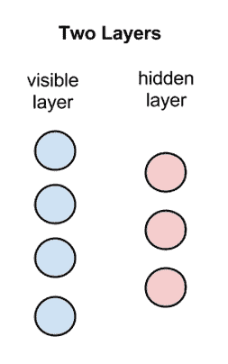

限制性玻尔兹曼机的设置。圆圈代表图中的节点

就像任何神经网络一样，我们的两个层中都有节点。网络的第一层可见层与输入特征维度一样多。在我们即将到来的例子中，我们将处理 28 x 28 的图像，这需要输入层中有 784（28 x 28）个节点。隐藏层中的节点数是一个人为选择的数字，代表我们希望学习的特征数量。

# 不一定是降维

在主成分分析（PCA）和线性判别分析（LDA）中，我们提取的组件数量受到了严格的限制。对于 PCA，我们受限于原始特征的数量（我们只能使用原始列数或更少的数量），而 LDA 则实施了更为严格的限制，即提取的特征数量不得超过真实数据集中类别数减一。

RBM 允许学习的特征数量的唯一限制是，它们受限于运行网络的计算机的计算能力和人类的解释。RBM 可以学习比我们最初开始时更多的或更少的特征。要学习的确切特征数量取决于问题，并且可以通过网格搜索来确定。

# 限制性玻尔兹曼机（RBM）的图

到目前为止，我们已经看到了 RBM 的可见层和隐藏层，但我们还没有看到它们是如何学习特征的。可见层中的每个节点都从要学习的数据集中接收一个特征。然后，通过权重和偏置，这些数据从可见层传递到隐藏层：

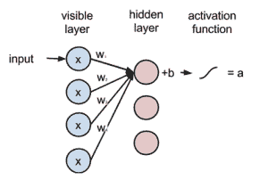

这个 RBM 的可视化显示了单个数据点通过单个隐藏节点在图中的移动

前面的 RBM 可视化显示了单个数据点通过图和单个隐藏节点的移动。可见层有四个节点，代表原始数据的四列。每条箭头代表数据点的单个特征通过 RBM 第一层的四个可见节点移动。每个特征值都乘以与该特征关联的权重，并加在一起。这个计算也可以通过输入数据向量和权重向量之间的点积来总结。数据的结果加权总和加到一个偏置变量上，并通过一个激活函数（如 Sigmoid 函数）传递。结果存储在一个名为`a`的变量中。

以 Python 为例，以下代码展示了单个数据点（`inputs`）是如何乘以我们的`weights`向量，并与`bias`变量结合以创建激活变量`a`：

```py
import numpy as np
import math

# sigmoidal function
def activation(x):
    return 1 / (1 + math.exp(-x))

inputs = np.array([1, 2, 3, 4])
weights = np.array([0.2, 0.324, 0.1, .001])
bias = 1.5

a = activation(np.dot(inputs.T, weights) + bias)

print a
0.9341341524806636
```

在真实的 RBM 中，每个可见节点都与每个隐藏节点相连，其结构看起来像这样：

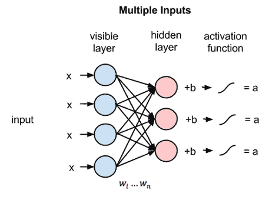

由于每个可见节点的输入都传递给每个隐藏节点，因此 RBM 可以被定义为一种**对称的二分图**。对称性源于可见节点与每个隐藏节点都相连。二分图意味着它由两部分（层）组成。

# 玻尔兹曼机的限制

我们已经看到了两个可见和隐藏节点层的层间连接（层间连接），但我们还没有看到同一层中节点之间的连接（层内连接）。这是因为没有这样的连接。RBM 的限制是我们不允许任何层内通信。这允许节点独立创建权重和偏置，最终成为（希望是）我们数据独立的特征。

# 数据重建

在这个网络的前向传递中，我们可以看到数据是如何通过网络（从可见层到隐藏层）前向传递的，但这并不能解释 RBM 是如何从我们的数据中学习新特征的，而没有地面实况。这是通过在可见层和隐藏层之间通过网络进行多次正向和反向传递来实现的。

在重建阶段，我们改变网络的结构，让隐藏层成为输入层，并让它使用相同的权重但新的偏置将激活变量（`a`）反向传递到可见层。在正向传递过程中计算出的激活变量随后被用来重建原始输入向量。以下可视化展示了如何使用相同的权重和不同的偏置将激活信号反向传递通过我们的图：

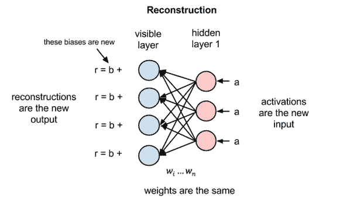

这成为了网络自我评估的方式。通过将激活信号反向传递通过网络并获得原始输入的近似值，网络可以调整权重以使近似值更接近原始输入。在训练的初期，由于权重是随机初始化的（这是标准做法），近似值可能会非常不准确。反向传播通过网络，与我们的正向传递方向相同（我们知道这很令人困惑），然后调整权重以最小化原始输入和近似值之间的距离。这个过程然后重复进行，直到近似值尽可能接近原始输入。这种来回传递过程发生的次数被称为迭代次数。

这个过程的最终结果是，网络为每个数据点都有一个“替身”。要转换数据，我们只需将其通过网络，检索激活变量，并将这些称为新特征。这个过程是一种类型的生成学习，它试图学习生成原始数据的概率分布，并利用知识来为我们提供原始数据的新的特征集。

例如，如果我们被给了一个数字的图片并要求我们分类这个图片是哪个数字（0-9），网络的正向传播会问这样的问题：给定这些像素，我应该期望哪个数字？在反向传播中，网络会问给定一个数字，我应该期望哪些像素？这被称为**联合概率**，它是给定*x*时*y*的概率和给定*y*时*x*的概率的联合，它通过我们网络中两层之间的共享权重来表示。

让我们引入我们的新数据集，并让它阐明 RBM 在特征学习中的有用性。

# MNIST 数据集

`MNIST`数据集包含 6000 张 0 到 9 的手写数字图片以及一个用于学习的真实标签。它与其他我们一直在使用的其他数据集类似，我们试图将机器学习模型拟合到响应变量，给定一组数据点。这里的主要区别在于我们处理的是非常低级的特征，而不是更可解释的特征。每个数据点将包含 784 个特征（灰度图像中的像素值）。

1.  让我们从导入开始：

```py
# import numpy and matplotlib
import numpy as np
import matplotlib.pyplot as plt
%matplotlib inline

from sklearn import linear_model, datasets, metrics
# scikit-learn implementation of RBM
from sklearn.neural_network import BernoulliRBM
from sklearn.pipeline import Pipeline
```

1.  新的导入是 BernoulliRBM，这是目前 scikit-learn 中唯一的 RBM 实现。正如其名所示，我们将需要进行一些预处理以确保我们的数据符合所需的假设。让我们直接将我们的数据集导入到 NumPy 数组中：

```py
# create numpy array from csv
images = np.genfromtxt('../data/mnist_train.csv', delimiter=',')
```

1.  我们可以验证我们正在处理的行数和列数：

```py
# 6000 images and 785 columns, 28X28 pixels + 1 response
images.shape

(6000, 785)
```

1.  785 由 784 个像素和一个起始处的单个响应列组成。除了响应列之外，每一列都持有介于 0 到 255 之间的值，代表像素强度，其中 0 表示白色背景，255 表示全黑像素。我们可以通过将第一列与其他数据分开来从数据中提取`X`和`y`变量：

```py
# extract the X and y variable
images_X, images_y = images[:,1:], images[:,0]

# values are much larger than 0-1 but scikit-learn RBM version assumes 0-1 scaling
np.min(images_X), np.max(images_X)
(0.0, 255.0)
```

1.  如果我们看一下第一张图片，我们会看到我们正在处理的内容：

```py
plt.imshow(images_X[0].reshape(28, 28), cmap=plt.cm.gray_r)

images_y[0]
```

图表如下：

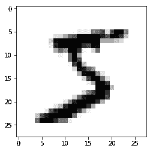

看起来不错。因为 scikit-learn 对受限玻尔兹曼机的实现不允许值超出 0-1 的范围，我们不得不做一些预处理工作。

# BernoulliRBM

限制玻尔兹曼机（RBM）的唯一 scikit-learn 实现版本被称为**BernoulliRBM**，因为它对其可以学习的概率分布类型施加了约束。伯努利分布允许数据值在零到一之间。scikit-learn 文档指出，该模型*假设输入是二进制值或零到一之间的值*。这是为了表示节点值代表节点被激活或未激活的概率。这允许更快地学习特征集。为了解决这个问题，我们将调整我们的数据集，只考虑硬编码的白色/黑色像素强度。通过这样做，每个单元格的值要么是零要么是一（白色或黑色），以使学习更加稳健。我们将通过以下两个步骤来完成这项工作：

1.  我们将把像素值的范围缩放到零到一之间

1.  我们将就地更改像素值，如果值超过`0.5`则为真，否则为假

让我们先对像素值进行缩放，使其介于 0 和 1 之间：

```py
# scale images_X to be between 0 and 1
 images_X = images_X / 255.

 # make pixels binary (either white or black)
 images_X = (images_X > 0.5).astype(float)

 np.min(images_X), np.max(images_X)
 (0.0, 1.0)
```

让我们看看之前看到的相同的数字 5，用我们新更改的像素：

```py
plt.imshow(images_X[0].reshape(28, 28), cmap=plt.cm.gray_r)

 images_y[0]
```

图如下：

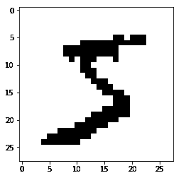

我们可以看到图像的模糊性已经消失，我们剩下的是一个非常清晰的数字来进行分类。现在让我们尝试从我们的数字数据集中提取特征。

# 从 MNIST 中提取 PCA 组件

在我们转向我们的 RBM 之前，让我们看看当我们对数据集应用 PCA 时会发生什么。就像我们在上一章做的那样，我们将取我们的特征（784 个像素，要么开启要么关闭）并对矩阵进行特征值分解，从数据集中提取*特征数字*。

让我们从可能的 784 个组件中取出 100 个，并绘制这些组件以查看提取的特征是什么样的。我们将通过导入我们的 PCA 模块，用 100 个组件拟合我们的数据，并创建一个 matplotlib 图库来显示我们可用的前 100 个组件：

```py
# import Principal Components Analysis module
 from sklearn.decomposition import PCA

 # extract 100 "eigen-digits"
 pca = PCA(n_components=100)
 pca.fit(images_X)

 # graph the 100 components
 plt.figure(figsize=(10, 10))
 for i, comp in enumerate(pca.components_):
 plt.subplot(10, 10, i + 1)
 plt.imshow(comp.reshape((28, 28)), cmap=plt.cm.gray_r)
 plt.xticks(())
 plt.yticks(())
 plt.suptitle('100 components extracted by PCA')

 plt.show()
```

下面的图是前面代码块的图：


这个图像图库向我们展示了协方差矩阵的特征值在重塑为与原始图像相同维度时的样子。这是当我们将算法集中在图像数据集上时，提取的组件的一个例子。窥视 PCA 组件如何尝试从数据集中获取线性变换是非常有趣的。每个组件都试图理解图像的某个“方面”，这将转化为可解释的知识。例如，第一个（也是最重要的）特征图像很可能是捕捉到图像的 0 质量，即数字看起来像 0 的程度。

同时，很明显，前十个组件似乎保留了一些数字的形状，之后，它们似乎开始退化成看似无意义的图像。到画廊结束时，我们似乎在观察黑白像素的随机组合旋转。这可能是由于 PCA（以及 LDA）是参数化变换，它们在从复杂的数据集（如图像）中提取信息的能力上有限。

如果我们查看前 30 个组件解释了多少方差，我们会发现它们能够捕捉到大部分信息：

```py
# first 30 components explain 64% of the variance

 pca.explained_variance_ratio_[:30].sum()
 .637414
```

这告诉我们，前几十个组件在捕捉数据的本质方面做得很好，但之后，组件可能没有增加太多。

这可以通过一个显示我们 PCA 组件累积解释方差的 scree 图进一步看出：

```py
# Scree Plot

 # extract all "eigen-digits"
 full_pca = PCA(n_components=784)
 full_pca.fit(images_X)

 plt.plot(np.cumsum(full_pca.explained_variance_ratio_))

 # 100 components captures about 90% of the variance
```

下图是特征值累积图，其中 PCA 组件的数量位于*x*轴上，而解释的累积方差则位于*y*轴上：

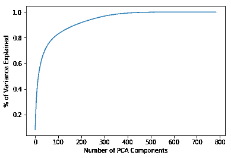

正如我们在上一章中看到的，PCA 所做的变换是通过乘以 PCA 模块的组件属性与数据来通过单个线性矩阵操作完成的。我们将通过使用拟合到 100 个特征的 scikit-learn PCA 对象并使用它来转换单个 MNIST 图像来再次展示这一点。我们将取那个转换后的图像，并将其与原始图像乘以 PCA 模块的`components_`属性的结果进行比较：

```py
# Use the pca object, that we have already fitted, to transform the first image in order to pull out the 100 new features
pca.transform(images_X[:1])

array([[ 0.61090568, 1.36377972, 0.42170385, -2.19662828, -0.45181077, -1.320495 , 0.79434677, 0.30551126, 1.22978985, -0.72096767, ...

# reminder that transformation is a matrix multiplication away
np.dot(images_X[:1]-images_X.mean(axis=0), pca.components_.T)

array([[ 0.61090568, 1.36377972, 0.42170385, -2.19662828, -0.45181077, -1.320495 , 0.79434677, 0.30551126, 1.22978985, -0.72096767,
```

# 从 MNIST 中提取 RBM 组件

现在我们将在 scikit-learn 中创建我们的第一个 RBM。我们将首先实例化一个模块，从我们的`MNIST`数据集中提取 100 个组件。

我们还将设置`verbose`参数为`True`，以便我们可以看到训练过程，以及将`random_state`参数设置为`0`。`random_state`参数是一个整数，它允许代码的可重复性。它固定了随机数生成器，并在每次同时随机设置权重和偏差。我们最后将`n_iter`设置为`20`。这是我们希望进行的迭代次数，即网络的来回传递次数：

```py
# instantiate our BernoulliRBM
 # we set a random_state to initialize our weights and biases to the same starting point
 # verbose is set to True to see the fitting period
 # n_iter is the number of back and forth passes
 # n_components (like PCA and LDA) represent the number of features to create
 # n_components can be any integer, less than , equal to, or greater than the original number of features

 rbm = BernoulliRBM(random_state=0, verbose=True, n_iter=20, n_components=100)

 rbm.fit(images_X)

 [BernoulliRBM] Iteration 1, pseudo-likelihood = -138.59, time = 0.80s
 [BernoulliRBM] Iteration 2, pseudo-likelihood = -120.25, time = 0.85s [BernoulliRBM] Iteration 3, pseudo-likelihood = -116.46, time = 0.85s ... [BernoulliRBM] Iteration 18, pseudo-likelihood = -101.90, time = 0.96s [BernoulliRBM] Iteration 19, pseudo-likelihood = -109.99, time = 0.89s [BernoulliRBM] Iteration 20, pseudo-likelihood = -103.00, time = 0.89s
```

一旦训练完成，我们可以探索过程的最终结果。RBM 也有一个`components`模块，就像 PCA 一样：

```py
# RBM also has components_ attribute
 len(rbm.components_)

 100
```

我们还可以绘制模块学习到的 RBM 组件，以查看它们与我们自己的特征数字有何不同：

```py
# plot the RBM components (representations of the new feature sets)
 plt.figure(figsize=(10, 10))
 for i, comp in enumerate(rbm.components_):
 plt.subplot(10, 10, i + 1)
 plt.imshow(comp.reshape((28, 28)), cmap=plt.cm.gray_r)
 plt.xticks(())
 plt.yticks(())
 plt.suptitle('100 components extracted by RBM', fontsize=16)

 plt.show()
```

下面的代码是上述代码的结果：

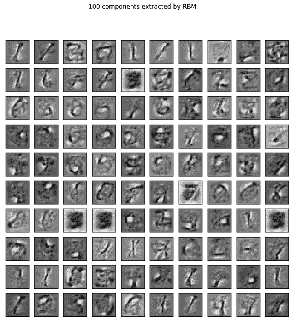

这些特征看起来非常有趣。PCA 组件在一段时间后变成了视觉扭曲，而 RBM 组件似乎每个组件都在提取不同的形状和笔触。乍一看，我们似乎有重复的特征（例如，特征 15、63、64 和 70）。我们可以快速使用 NumPy 检查是否有任何组件实际上是重复的，或者它们只是非常相似。

这段代码将检查`rbm.components_`中存在多少唯一元素。如果结果形状中有 100 个元素，这意味着 RBM 的每个组件实际上都是不同的：

```py
# It looks like many of these components are exactly the same but

 # this shows that all components are actually different (albiet some very slightly) from one another
 np.unique(rbm.components_.mean(axis=1)).shape

 (100,)
```

这验证了我们的组件彼此之间都是独特的。我们可以使用 RBM 来转换数据，就像我们可以使用 PCA 一样，通过在模块中使用`transform`方法：

```py
# Use our Boltzman Machine to transform a single image of a 5
 image_new_features = rbm.transform(images_X[:1]).reshape(100,)

 image_new_features

 array([ 2.50169424e-16, 7.19295737e-16, 2.45862898e-09, 4.48783657e-01, 1.64530318e-16, 5.96184335e-15, 4.60051698e-20, 1.78646959e-08, 2.78104276e-23, ...
```

我们还可以看到，这些组件并不是像 PCA 那样被使用的，这意味着简单的矩阵乘法不会产生与调用模块内嵌入的`transform`方法相同的转换：

```py
# not the same as a simple matrix multiplication anymore
 # uses neural architecture (several matrix operations) to transform features
 np.dot(images_X[:1]-images_X.mean(axis=0), rbm.components_.T)

 array([[ -3.60557365, -10.30403384, -6.94375031, 14.10772267, -6.68343281, -5.72754674, -7.26618457, -26.32300164, ...
```

现在我们知道了我们有 100 个新特征可以工作，并且我们已经看到了它们，让我们看看它们如何与我们的数据互动。

让我们先从抓取数据集中第一张图像，即数字 5 的图像中，最常出现的 20 个特征开始：

```py
# get the most represented features
 top_features = image_new_features.argsort()[-20:][::-1]

 print top_features

 [56 63 62 14 69 83 82 49 92 29 21 45 15 34 28 94 18 3 79 58]

 print image_new_features[top_features]

 array([ 1\. , 1\. , 1\. , 1\. , 1\. , 1\. , 1\. , 0.99999999, 0.99999996, 0.99999981, 0.99996997, 0.99994894, 0.99990515, 0.9996504 , 0.91615702, 0.86480507, 0.80646422, 0.44878366, 0.02906352, 0.01457827])
```

在这种情况下，我们实际上有七个特征，其中 RBM 有 100%的覆盖率。在我们的图表中，这意味着将这些 784 个像素输入到可见层时，节点 56、63、62、14、69、83 和 82 会完全点亮。让我们隔离这些特征：

```py
# plot the RBM components (representations of the new feature sets) for the most represented features
 plt.figure(figsize=(25, 25))
 for i, comp in enumerate(top_features):
 plt.subplot(5, 4, i + 1)
 plt.imshow(rbm.components_[comp].reshape((28, 28)), cmap=plt.cm.gray_r)
 plt.title("Component {}, feature value: {}".format(comp, round(image_new_features[comp], 2)), fontsize=20)
 plt.suptitle('Top 20 components extracted by RBM for first digit', fontsize=30)

 plt.show()
```

我们得到了前面代码的以下结果：

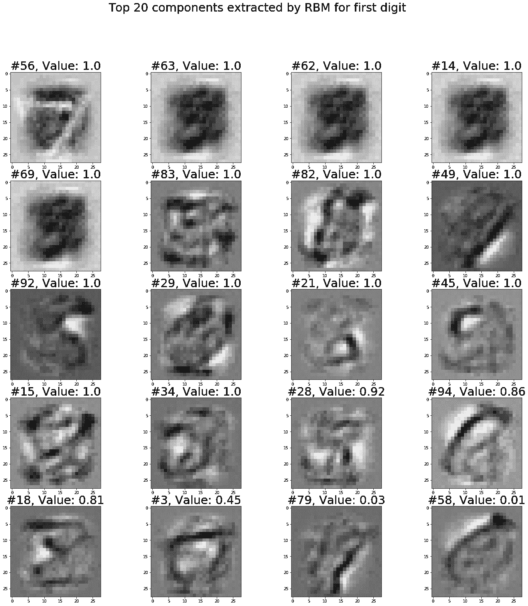

看一下这些图表中的一些，它们非常有道理。**组件 45**似乎隔离了数字**5**的左上角，而**组件 21**似乎抓取了数字的底部环。**组件 82**和**组件 34**似乎一次性抓取了几乎整个数字 5。让我们通过隔离这些像素通过 RBM 图时亮起的底部 20 个特征，来看看数字 5 的底部桶状部分是什么样子：

```py
# grab the least represented features
 bottom_features = image_new_features.argsort()[:20]

 plt.figure(figsize=(25, 25))
 for i, comp in enumerate(bottom_features):
 plt.subplot(5, 4, i + 1)
 plt.imshow(rbm.components_[comp].reshape((28, 28)), cmap=plt.cm.gray_r)
 plt.title("Component {}, feature value: {}".format(comp, round(image_new_features[comp], 2)), fontsize=20)
 plt.suptitle('Bottom 20 components extracted by RBM for first digit', fontsize=30)

 plt.show()
```

我们得到了前面代码的以下图表：

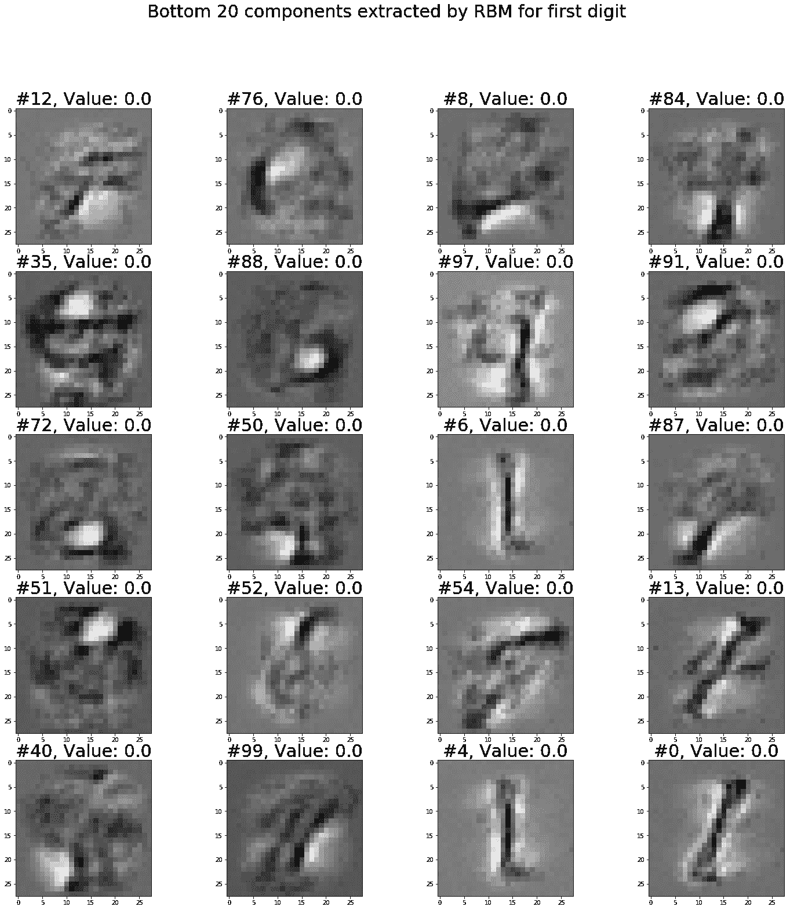

**组件 13**、**组件 4**、**组件 97**以及其他组件似乎试图揭示不同的数字而不是 5，因此这些组件没有被这种像素强度的组合点亮是有道理的。

# 在机器学习管道中使用 RBM

当然，我们想看看 RBM 在我们的机器学习管道中的表现，不仅是为了可视化模型的工作原理，还要看到特征学习的具体结果。为此，我们将创建并运行三个管道：

+   仅在原始像素强度上运行的逻辑回归模型

+   在提取的 PCA 组件上运行的逻辑回归

+   在提取的 RBM 组件上运行的逻辑回归

这些管道将跨多个组件（对于 PCA 和 RBM）以及逻辑回归的`C`参数进行网格搜索。让我们从最简单的管道开始。我们将运行原始像素值通过逻辑回归，看看线性模型是否足以分离出数字。

# 在原始像素值上使用线性模型

首先，我们将运行原始像素值通过逻辑回归模型，以获得某种基准模型。我们想看看利用 PCA 或 RBM 组件是否能让相同的线性分类器表现更好或更差。如果我们能发现提取的潜在特征表现更好（就线性模型的准确率而言），那么我们可以确信是我们在管道中使用的特征工程增强了我们的管道，而不是其他因素。

首先，我们将创建我们的实例化模块：

```py
# import logistic regression and gridsearch module for some machine learning

 from sklearn.linear_model import LogisticRegression
 from sklearn.model_selection import GridSearchCV

 # create our logistic regression
 lr = LogisticRegression()
 params = {'C':[1e-2, 1e-1, 1e0, 1e1, 1e2]}

 # instantiate a gridsearch class
 grid = GridSearchCV(lr, params)
```

一旦我们完成这个步骤，我们就可以将我们的模块拟合到我们的原始图像数据中。这将给我们一个大致的了解，原始像素数据在机器学习管道中的表现：

```py
 # fit to our data
 grid.fit(images_X, images_y)

 # check the best params
 grid.best_params_, grid.best_score_

 ({'C': 0.1}, 0.88749999999999996)
```

仅凭逻辑回归本身就能相当好地使用原始像素值来识别数字，给出了大约**88.75%的交叉验证准确率**。

# 在提取的 PCA 组件上使用线性模型

让我们看看我们是否可以在管道中添加一个 PCA 组件来提高这个准确性。我们将再次开始，设置我们的变量。这次我们需要创建一个 scikit-learn 管道对象，以容纳 PCA 模块以及我们的线性模型。我们将保持与线性分类器相同的参数，并为我们的 PCA 添加新参数。我们将尝试在 10、100 和 200 个组件之间找到最佳组件数量。试着花点时间，猜测这三个中哪一个最终会是最好的（提示：回想一下之前的 scree 图和解释方差）：

```py
# Use PCA to extract new features

lr = LogisticRegression()
pca = PCA()

# set the params for the pipeline
params = {'clf__C':[1e-1, 1e0, 1e1],
'pca__n_components': [10, 100, 200]}

# create our pipeline
pipeline = Pipeline([('pca', pca), ('clf', lr)])

# instantiate a gridsearh class
grid = GridSearchCV(pipeline, params)
```

现在我们可以将 gridsearch 对象拟合到我们的原始图像数据中。请注意，管道将自动提取并转换我们的原始像素数据：

```py
 # fit to our data
grid.fit(images_X, images_y)

# check the best params
grid.best_params_, grid.best_score_

({'clf__C': 1.0, 'pca__n_components': 100}, 0.88949999999999996)
```

我们最终得到了（略微更好的）**88.95%交叉验证准确率**。如果我们仔细想想，我们不应该对 100 是 10、100 和 200 中的最佳选择感到惊讶。从我们之前章节中的 scree 图简短分析中，我们发现 64%的数据仅由 30 个组件解释，所以 10 个组件肯定不足以很好地解释图像。scree 图也大约在 100 个组件时开始平缓，这意味着在 100 个组件之后，解释方差实际上并没有增加多少，所以 200 个组件太多，会导致一些过拟合。这使我们得出结论，100 个 PCA 组件是使用最佳的数量。应该注意的是，我们可以进一步尝试一些超参数调整，以找到更优的组件数量，但就目前而言，我们将保持我们的管道不变，并转向使用 RBM 组件。

# 在提取的 RBM 组件上使用线性模型

即使是最佳数量的 PCA 组件也无法在准确率方面大幅超越单独的逻辑回归。让我们看看我们的 RBM 表现如何。为了构建以下管道，我们将保持逻辑回归模型的相同参数，并在 10、100 和 200（就像我们在 PCA 管道中所做的那样）之间找到最佳组件数量。请注意，我们可以尝试将特征数量扩展到原始像素数（784）以上，但我们不会尝试这样做。

我们以同样的方式开始，设置我们的变量：

```py
# Use the RBM to learn new features

rbm = BernoulliRBM(random_state=0)

# set up the params for our pipeline.
params = {'clf__C':[1e-1, 1e0, 1e1],
'rbm__n_components': [10, 100, 200]
}

# create our pipeline
pipeline = Pipeline([('rbm', rbm), ('clf', lr)])

# instantiate a gridsearch class
grid = GridSearchCV(pipeline, params)
```

将这个网格搜索拟合到我们的原始像素上，将揭示最佳组件数量：

```py
# fit to our data
grid.fit(images_X, images_y)

# check the best params
grid.best_params_, grid.best_score_

({'clf__C': 1.0, 'rbm__n_components': 200}, 0.91766666666666663)
```

我们的 RBM 模块，具有**91.75%的交叉验证准确率**，能够从我们的数字中提取 200 个新特征，并通过在我们的管道中添加 BernoulliRBM 模块，在不做任何其他事情的情况下，将准确率提高了三个百分点（这是一个很大的提升！）。

200 是最佳组件数量的事实表明，我们甚至可以通过尝试提取超过 200 个组件来获得更高的性能。我们将把这个留作读者的练习。

这证明了特征学习算法在处理非常复杂任务（如图像识别、音频处理和自然语言处理）时工作得非常好。这些大型且有趣的数据集具有隐藏的组件，这些组件对于 PCA 或 LDA 等线性变换来说很难提取，但对于 RBM 等非参数算法来说却可以。

# 学习文本特征 – 词向量化

我们的第二个特征学习示例将远离图像，转向文本和自然语言处理。当机器学习读写时，它们面临一个非常大的问题，即上下文。在前面的章节中，我们已经能够通过计算每个文档中出现的单词数量来向量化文档，并将这些向量输入到机器学习管道中。通过构建新的基于计数的特征，我们能够在我们的监督机器学习管道中使用文本。这非常有效，直到某个点。我们局限于只能将文本理解为一个**词袋模型（BOW**）。这意味着我们将文档视为仅仅是无序单词的集合。

更重要的是，每个单词本身并没有意义。只有在一个由其他单词组成的集合中，文档在使用`CountVectorizer`和`TfidfVectorizer`等模块时才能具有意义。正因为如此，我们将把注意力从 scikit-learn 转向一个名为`gensim`的模块，用于计算词嵌入。

# 词嵌入

到目前为止，我们使用 scikit-learn 将文档（推文、评论、URL 等）嵌入到向量格式中，将标记（单词、n-gram）视为特征，并将文档视为具有一定数量的这些标记。例如，如果我们有 1,583 个文档，并告诉我们的`CountVectorizer`从`ngram_range`的一到五学习前 1,000 个标记，我们最终会得到一个形状为（1583, 1000）的矩阵，其中每一行代表一个单独的文档，而 1,000 列代表在语料库中找到的原始 n-gram。但如何达到更低的理解层次？我们如何开始教机器在上下文中理解单词的含义？

例如，如果我们问你以下问题，你可能会给出以下答案：

*问：如果我们取一个国王，去掉它的男性特征，并用女性来替换，我们会得到什么？*

***答：王后***

*问：伦敦对英格兰就像巴黎对 ____*。

***答：法国***

你，作为一个人类，可能会觉得这些问题很简单，但如果没有知道单词在上下文中的含义，机器如何解决这个问题呢？这实际上是我们面临的最大挑战之一，在**自然语言处理**（**NLP**）任务中。

词嵌入是帮助机器理解上下文的一种方法。**词嵌入**是将单个词在 n 维特征空间中的向量表示，其中*n*代表一个词可能具有的潜在特征数量。这意味着我们词汇表中的每个词不再仅仅是字符串，而本身就是一个向量。例如，如果我们从每个词中提取了 n=5 个特征，那么我们词汇表中的每个词就会对应一个 1 x 5 的向量。例如，我们可能会有以下向量表示：

```py
# set some fake word embeddings
king = np.array([.2, -.5, .7, .2, -.9])
man = np.array([-.5, .2, -.2, .3, 0.])
woman = np.array([.7, -.3, .3, .6, .1])

queen = np.array([ 1.4, -1\. , 1.2, 0.5, -0.8])
```

利用这些向量表示，我们可以通过以下操作来处理问题“如果我们取一个国王，去掉它的男性特征，并用女性来替换，我们会得到什么？”：

*king - man + woman*

在代码中，这看起来会是这样：

```py
np.array_equal((king - man + woman), queen)

True
```

这看起来很简单，但有一些注意事项：

+   上下文（以词嵌入的形式）和词义一样，从语料库到语料库都在变化。这意味着静态的词嵌入本身并不总是最有用的

+   词嵌入依赖于它们从中学习到的语料库

词嵌入允许我们对单个词进行非常精确的计算，以达到我们可能认为的上下文。

# 两种词嵌入方法 - Word2vec 和 GloVe

有两种算法家族主导着词嵌入的空间。它们被称为 **Word2vec** 和 **GloVe**。这两种方法都通过从非常大的语料库（文本文档集合）中学习来生成词嵌入。这两种算法之间的主要区别是，GloVe 算法（来自斯坦福大学）通过一系列矩阵统计来学习词嵌入，而 Word2vec（来自谷歌）通过深度学习方法来学习。这两种算法都有其优点，我们的文本将专注于使用 Word2vec 算法来学习词嵌入。

# Word2Vec - 另一个浅层神经网络

为了学习和提取词嵌入，Word2vec 将实现另一个浅层神经网络。这次，我们不会将新数据通用地投入可见层，而是会故意放入正确数据以获得正确的词嵌入。不深入细节的话，想象一个具有以下结构的神经网络架构：

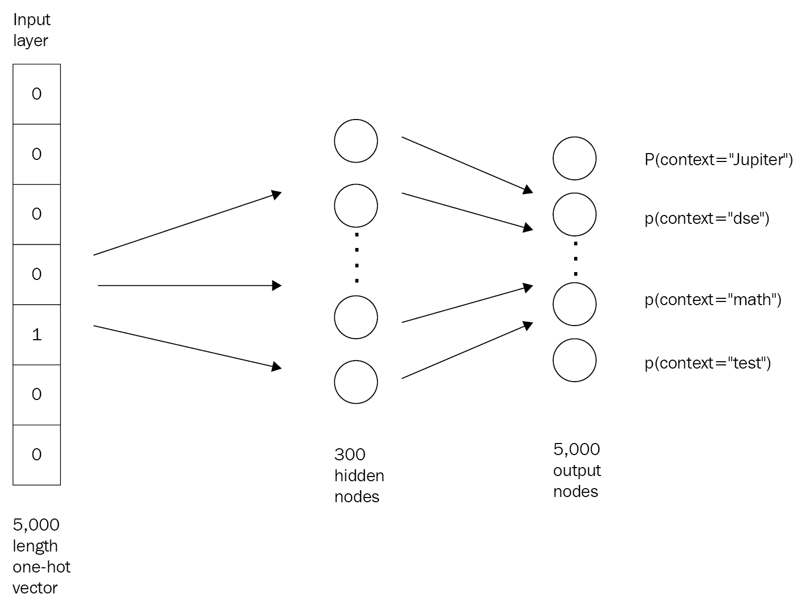

与 RBM 类似，我们有一个可见输入层和一个隐藏层。在这种情况下，我们的输入层节点数量与我们要学习的词汇长度相同。如果我们有一个包含数百万词汇的语料库，但只想学习其中的一小部分，这会非常有用。在前面的图中，我们将学习 5,000 个词汇的上下文。这个图中的隐藏层代表我们希望了解的每个词汇的特征数量。在这种情况下，我们将词汇嵌入到 300 维的空间中。

与我们用于 RBM 的神经网络相比，这个神经网络的主要区别在于存在一个输出层。请注意，在我们的图中，输出层的节点数量与输入层相同。这并非巧合。词嵌入模型通过基于参考词的存在来*预测*附近的词汇。例如，如果我们想要预测单词 *calculus*，我们希望最终的 `math` 节点被点亮得最亮。这给人一种监督机器学习算法的表象。

我们随后在这个结构上训练图，并最终通过输入单词的单热向量并提取隐藏层的输出向量来学习 300 维的词表示。在生产环境中，由于输出节点数量非常大，之前的图示非常低效。为了使这个过程在计算上更加高效，利用文本结构的不同损失函数。

# 用于创建 Word2vec 嵌入的 gensim 包

我们不会实现一个完整的、执行词嵌入过程的神经网络，然而我们将使用一个名为 `gensim` 的 Python 包来为我们完成这项工作：

```py
# import the gensim package
 import gensim
```

`gensim`可以接受一个文本语料库，并为我们运行前面的神经网络结构，仅用几行代码就获得单词嵌入。为了看到这个动作，让我们导入一个标准语料库以开始。让我们在我们的笔记本中设置一个记录器，以便我们可以更详细地看到训练过程：

```py
import logging

 logging.basicConfig(format='%(asctime)s : %(levelname)s : %(message)s', level=logging.INFO)
```

现在，让我们创建我们的语料库：

```py
from gensim.models import word2vec, Word2Vec

sentences = word2vec.Text8Corpus('../data/text8')
```

注意术语`word2vec`。这是一个用于计算单词嵌入的特定算法，也是`gensim`使用的主要算法。它是单词嵌入的标准之一。

为了让`gensim`完成其工作，句子需要是任何可迭代的（列表、生成器、元组等），它包含已经分词的句子。一旦我们有了这样的变量，我们就可以通过学习单词嵌入来使用`gensim`：

```py
# instantiate a gensim module on the sentences from above
 # min_count allows us to ignore words that occur strictly less than this value
 # size is the dimension of words we wish to learn
 model = gensim.models.Word2Vec(sentences, min_count=1, size=20)

 2017-12-29 16:43:25,133 : INFO : collecting all words and their counts
 2017-12-29 16:43:25,136 : INFO : PROGRESS: at sentence #0, processed 0 words, keeping 0 word types
 2017-12-29 16:43:31,074 : INFO : collected 253854 word types from a corpus of 17005207 raw words and 1701 sentences
 2017-12-29 16:43:31,075 : INFO : Loading a fresh vocabulary
 2017-12-29 16:43:31,990 : INFO : min_count=1 retains 253854 unique words (100% of original 253854, drops 0)
 2017-12-29 16:43:31,991 : INFO : min_count=1 leaves 17005207 word corpus (100% of original 17005207, drops 0)
 2017-12-29 16:43:32,668 : INFO : deleting the raw counts dictionary of 253854 items
 2017-12-29 16:43:32,676 : INFO : sample=0.001 downsamples 36 most-common words
 2017-12-29 16:43:32,678 : INFO : downsampling leaves estimated 12819131 word corpus (75.4% of prior 17005207)
 2017-12-29 16:43:32,679 : INFO : estimated required memory for 253854 words and 20 dimensions: 167543640 bytes
 2017-12-29 16:43:33,431 : INFO : resetting layer weights
 2017-12-29 16:43:36,097 : INFO : training model with 3 workers on 253854 vocabulary and 20 features, using sg=0 hs=0 sample=0.001 negative=5 window=5
 2017-12-29 16:43:37,102 : INFO : PROGRESS: at 1.32% examples, 837067 words/s, in_qsize 5, out_qsize 0
 2017-12-29 16:43:38,107 : INFO : PROGRESS: at 2.61% examples, 828701 words/s,
 ... 2017-12-29 16:44:53,508 : INFO : PROGRESS: at 98.21% examples, 813353 words/s, in_qsize 6, out_qsize 0 2017-12-29 16:44:54,513 : INFO : PROGRESS: at 99.58% examples, 813962 words/s, in_qsize 4, out_qsize 0
 ... 2017-12-29 16:44:54,829 : INFO : training on 85026035 raw words (64096185 effective words) took 78.7s, 814121 effective words/s
```

这行代码将启动学习过程。如果你传递了一个大的语料库，这可能需要一段时间。现在`gensim`模块已经完成拟合，我们可以使用它。我们可以通过将字符串传递给`word2vec`对象来获取单个嵌入：

```py
# get the vectorization of a word
 model.wv['king']

 array([-0.48768288, 0.66667134, 2.33743191, 2.71835423, 4.17330408, 2.30985498, 1.92848825, 1.43448424, 3.91518641, -0.01281452, 3.82612252, 0.60087812, 6.15167284, 4.70150518, -1.65476751, 4.85853577, 3.45778084, 5.02583361, -2.98040175, 2.37563372], dtype=float32)
```

`gensim`内置了获取我们单词嵌入最大价值的方法。例如，为了回答关于`king`的问题，我们可以使用`most_similar`方法：

```py
# woman + king - man = queen
 model.wv.most_similar(positive=['woman', 'king'], negative=['man'], topn=10)

 [(u'emperor', 0.8988120555877686), (u'prince', 0.87584388256073), (u'consul', 0.8575721979141235), (u'tsar', 0.8558996319770813), (u'constantine', 0.8515684604644775), (u'pope', 0.8496872782707214), (u'throne', 0.8495982885360718), (u'elector', 0.8379884362220764), (u'judah', 0.8376096487045288), (u'emperors', 0.8356839418411255)]
```

嗯，不幸的是，这并没有给出我们预期的答案：`queen`。让我们尝试`Paris`单词联想：

```py
# London is to England as Paris is to ____
 model.wv.most_similar(positive=['Paris', 'England'], negative=['London'], topn=1)

 KeyError: "word 'Paris' not in vocabulary"
```

看起来单词`Paris`甚至没有被学习过，因为它没有出现在我们的语料库中。我们可以开始看到这个过程的局限性。我们的嵌入将与我们选择的语料库和用于计算这些嵌入的机器一样好。在我们的数据目录中，我们提供了一个包含 300 维的预训练词汇表，它跨越了在 Google 索引的网站上找到的 3,000,000 个单词。

让我们继续导入这些预训练的嵌入。我们可以通过使用`gensim`中的内置导入工具来完成这项工作：

```py
# use a pretrained vocabulary with 3,000,000 words
 import gensim

 model = gensim.models.KeyedVectors.load_word2vec_format('../data/GoogleNews-vectors-negative300.bin', binary=True)

 # 3,000,000 words in our vocab
 len(model.wv.vocab)

 3000000
```

这些嵌入是通过比我们家里任何机器都强大的机器训练的，并且持续了更长的时间。现在让我们尝试我们的单词问题：

```py
# woman + king - man = queen
 model.wv.most_similar(positive=['woman', 'king'], negative=['man'], topn=1)

 [(u'queen', 0.7118192911148071)]

 # London is to England as Paris is to ____
 model.wv.most_similar(positive=['Paris', 'England'], negative=['London'], topn=1)

 [(u'France', 0.6676377654075623)]
```

太棒了！看起来这些单词嵌入已经训练得足够好，可以让我们回答这些复杂的单词谜题。正如之前使用的那样，`most_similar`方法将返回词汇表中与提供的单词最相似的标记。`positive`列表中的单词是相互添加的向量，而`negative`列表中的单词是从结果向量中减去的。以下图表提供了我们如何使用单词向量提取意义的视觉表示：

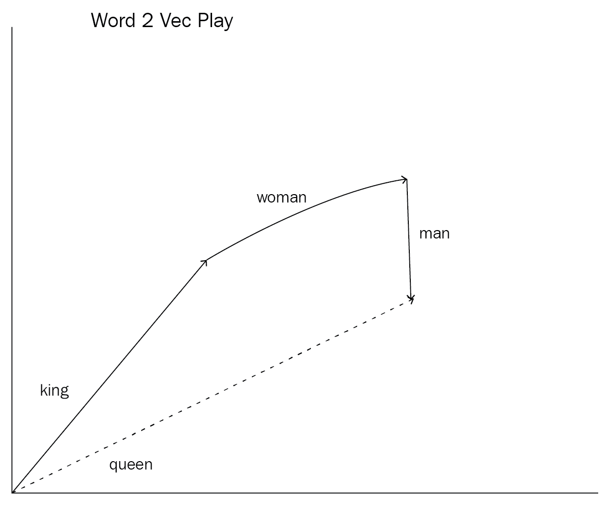

在这里，我们以“king”的向量表示开始，并添加“woman”的概念（向量）。从那里，我们通过添加向量的负值来减去“man”向量，以获得点向量。这个向量与“queen”的向量表示最相似。这就是我们获得公式的途径：

*king + woman - man = queen*

`gensim`还有其他我们可以利用的方法，例如`doesnt_match`。这种方法会找出不属于单词列表的单词。它是通过隔离平均与其他单词最不相似的单词来做到这一点的。例如，如果我们给这个方法四个单词，其中三个是动物，另一个是植物，我们希望它能找出哪个不属于：

```py
# Pick out the oddball word in a sentence
model.wv.doesnt_match("duck bear cat tree".split())

'tree'
```

该包还包括计算单个单词之间 0-1 相似度分数的方法，这些分数可以用来即时比较单词：

```py
# grab a similarity score between 0 and 1

# the similarity between the words woman and man, pretty similar
model.wv.similarity('woman', 'man')
0.766401223

# similarity between the words tree and man, not very similar
model.wv.similarity('tree', 'man')
0.229374587
```

在这里，我们可以看到`man`比`man`与`tree`更相似。我们可以使用这些有用的方法来实现一些其他情况下无法实现的有用应用，例如单词嵌入：

# 单词嵌入的应用 - 信息检索

单词嵌入有无数的应用，其中之一是信息检索领域。当人类在搜索引擎中输入关键词和短语时，搜索引擎能够召回并展示与这些关键词完全匹配的特定文章/故事。例如，如果我们搜索关于狗的文章，我们会得到提到狗这个词的文章。但如果我们搜索“canine”这个词呢？基于 canines 是狗的事实，我们仍然应该期望看到关于狗的文章。让我们实现一个简单的信息检索系统来展示单词嵌入的力量。

让我们创建一个函数，尝试从我们的 gensim 包中提取单个单词的嵌入，如果这个查找失败则返回 None：

```py
# helper function to try to grab embeddings for a word and returns None if that word is not found
def get_embedding(string):
    try:
        return model.wv[string]
    except:
        return None
```

现在，让我们创建三个文章标题，一个关于`dog`，一个关于`cat`，还有一个关于绝对`nothing`的干扰项：

```py
# very original article titles
 sentences = [
 "this is about a dog",
 "this is about a cat",
 "this is about nothing"
]
```

目标是输入一个与`dog`或`cat`相似的参考词，并能够抓取更相关的标题。为此，我们首先将为每个句子创建一个 3 x 300 的向量矩阵。我们将通过取句子中每个单词的平均值，并使用得到的平均值向量作为整个句子向量化的估计。一旦我们有了每个句子的向量化，我们就可以通过取它们之间的点积来比较这些向量。最接近的向量是点积最大的那个：

```py
# Zero matrix of shape (3,300)
vectorized_sentences = np.zeros((len(sentences),300))
# for every sentence
for i, sentence in enumerate(sentences):
    # tokenize sentence into words
    words = sentence.split(' ')
    # embed whichever words that we can
    embedded_words = [get_embedding(w) for w in words]
    embedded_words = filter(lambda x:x is not None, embedded_words)
    # Take a mean of the vectors to get an estimate vectorization of the sentence
    vectorized_sentence = reduce(lambda x,y:x+y, embedded_words)/len(embedded_words)
    # change the ith row (in place) to be the ith vectorization
    vectorized_sentences[i:] = vectorized_sentence

vectorized_sentences.shape
(3, 300)
```

这里需要注意的一点是，我们正在创建文档（单词集合）的向量化，而不是考虑单词的顺序。这与使用`CountVectorizer`或`TfidfVectorizer`来获取基于计数的文本向量化相比有什么好处？gensim 方法试图将我们的文本投影到由单个单词的上下文学习到的潜在结构上，而 scikit-learn 向量器只能使用我们可用的词汇来创建我们的向量化。在这三个句子中，只有七个独特的单词：

`this`, `is`, `about`, `a`, `dog`, `cat`, `nothing`

因此，我们的 `CountVectorizer` 或 `TfidfVectorizer` 可以投射的最大形状是 (3, 7)。让我们尝试找到与单词 `dog` 最相关的句子：

```py
# we want articles most similar to the reference word "dog"
reference_word = 'dog'

# take a dot product between the embedding of dof and our vectorized matrix
best_sentence_idx = np.dot(vectorized_sentences, get_embedding(reference_word)).argsort()[-1]

# output the most relevant sentence
sentences[best_sentence_idx]

'this is about a dog'
```

那个很简单。给定单词 `dog`，我们应该能够检索到关于 `dog` 的句子。如果我们输入单词 `cat`，这也应该是正确的：

```py
reference_word = 'cat'
best_sentence_idx = np.dot(vectorized_sentences, get_embedding(reference_word)).argsort()[-1]

sentences[best_sentence_idx]

'this is about a cat'
```

现在，让我们尝试一个更难的例子。让我们输入单词 `canine` 和 `tiger`，看看我们是否能分别得到 `dog` 和 `cat` 的句子：

```py
reference_word = 'canine'
best_sentence_idx = np.dot(vectorized_sentences, get_embedding(reference_word)).argsort()[-1]

print sentences[best_sentence_idx]

'this is about a dog'

reference_word = 'tiger'
best_sentence_idx = np.dot(vectorized_sentences, get_embedding(reference_word)).argsort()[-1]

print sentences[best_sentence_idx]

'this is about a cat'
```

让我们尝试一个稍微有趣一点的例子。以下是从 Sinan 的第一本书，《数据科学原理》中的章节标题：

```py
# Chapter titles from Sinan's first book, "The Principles of Data Science

 sentences = """How to Sound Like a Data Scientist
 Types of Data
 The Five Steps of Data Science
 Basic Mathematics
 A Gentle Introduction to Probability
 Advanced Probability
 Basic Statistics
 Advanced Statistics
 Communicating Data
 Machine Learning Essentials
 Beyond the Essentials
 Case Studies """.split('\n')
```

这将给我们一个包含 12 个不同章节标题的列表，以便检索。那么目标将是使用参考词对章节进行排序并提供最相关的三个章节标题来阅读，给定主题。例如，如果我们要求我们的算法给我们与 *math* 相关的章节，我们可能会期望推荐关于基础数学、统计学和概率的章节。

让我们尝试看看哪些章节最适合阅读，给定人类输入。在我们这样做之前，让我们计算一个向量化的文档矩阵，就像我们之前对前三个句子所做的那样：

```py
# Zero matrix of shape (3,300)
vectorized_sentences = np.zeros((len(sentences),300))
# for every sentence
for i, sentence in enumerate(sentences):
    # tokenize sentence into words
    words = sentence.split(' ')
    # embed whichever words that we can
    embedded_words = [get_embedding(w) for w in words]
    embedded_words = filter(lambda x:x is not None, embedded_words)
    # Take a mean of the vectors to get an estimate vectorization of the sentence
    vectorized_sentence = reduce(lambda x,y:x+y, embedded_words)/len(embedded_words)
    # change the ith row (in place) to be the ith vectorization
    vectorized_sentences[i:] = vectorized_sentence

vectorized_sentences.shape
(12, 300)
```

现在，让我们找到与 `math` 最相关的章节：

```py
# find chapters about math
reference_word = 'math'
best_sentence_idx = np.dot(vectorized_sentences, get_embedding(reference_word)).argsort()[-3:][::-1]

[sentences[b] for b in best_sentence_idx]

['Basic Mathematics', 'Basic Statistics', 'Advanced Probability ']
```

现在，假设我们正在做一个关于数据的演讲，并想知道哪些章节在这个领域最有帮助：

```py
# which chapters are about giving talks about data
reference_word = 'talk'
best_sentence_idx = np.dot(vectorized_sentences, get_embedding(reference_word)).argsort()[-3:][::-1]

[sentences[b] for b in best_sentence_idx]

['Communicating Data ', 'How to Sound Like a Data Scientist', 'Case Studies ']
```

最后，哪些章节是关于 `AI` 的：

```py
# which chapters are about AI
reference_word = 'AI'
best_sentence_idx = np.dot(vectorized_sentences, get_embedding(reference_word)).argsort()[-3:][::-1]

[sentences[b] for b in best_sentence_idx]

['Advanced Probability ', 'Advanced Statistics', 'Machine Learning Essentials']
```

我们可以看到如何使用词嵌入根据从文本宇宙中学习到的上下文检索文本形式的信息。

# 摘要

本章重点介绍了两种特征学习工具：RBM 和词嵌入过程。

这两个过程都利用了深度学习架构，基于原始数据学习新的特征集。这两种技术都利用了浅层网络来优化训练时间，并使用在拟合阶段学习到的权重和偏差来提取数据的潜在结构。

我们下一章将展示四个在公开互联网上收集的实时数据特征工程的例子，以及我们在这本书中学到的工具将如何帮助我们创建最佳的机器学习管道。
