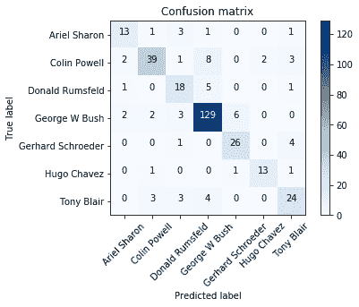
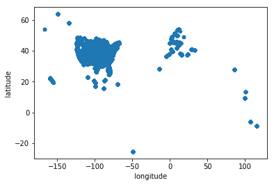

# 第八章：案例研究

本书已经经过了几种不同的特征工程算法，并且我们与许多不同的数据集进行了合作。在本章中，我们将通过几个案例研究来帮助你加深对书中所涵盖主题的理解。我们将从头到尾完成两个完整的案例研究，以进一步了解特征工程任务如何帮助我们为实际应用创建机器学习流程。对于每个案例研究，我们将进行以下步骤：

+   我们正在努力实现的应用

+   我们正在使用的数据

+   简要的探索性数据分析

+   设置我们的机器学习流程并收集指标

此外，我们还将探讨以下案例：

+   面部识别

+   预测酒店评论数据

让我们开始吧！

# 案例研究 1 - 面部识别

我们的第一项案例研究将是使用名为 scikit-learn 库中`Wild`数据集的**Labeled Faces**的流行数据集来预测图像数据的标签。该数据集被称为`Olivetti Face`数据集，它包含了名人的面部照片，并附有相应的标签。我们的任务是**面部识别**，这是一个监督机器学习模型，能够根据人脸图像预测人的名字。

# 面部识别的应用

图像处理和面部识别具有广泛的应用。从人群中的视频/图像中快速识别人的面部对于物理安全和大型社交媒体公司至关重要。像 Google 这样的搜索引擎，凭借其图像搜索功能，正在使用图像识别算法来匹配图像并量化相似度，直到我们可以上传某人的照片来获取该人的所有其他图像。

# 数据

让我们从加载我们的数据集和我们将用于绘制数据的几个其他导入语句开始。在 Jupyter 笔记本（iPython）中开始使用所有你将使用的导入语句是一种良好的做法。显然，你可能在进行工作的中途意识到你需要导入一个新的包；同样，为了保持组织有序，将它们放在你工作的开头是一个好主意。

以下代码块包含了我们将用于本案例研究的`import`语句。我们将利用示例中的每个导入，随着我们例子的展开，它们各自的作用将变得对你来说很清晰：

```py
# the olivetti face dataset
from sklearn.datasets import fetch_lfw_people

# feature extraction modules
from sklearn.decomposition import PCA
from sklearn.discriminant_analysis import LinearDiscriminantAnalysis

# feature scaling module
from sklearn.preprocessing import StandardScaler 

# standard python modules
from time import time 
import numpy as np 
import matplotlib.pyplot as plt

%matplotlib inline # this ensures that your plotting will show directly in your jupyter notebook

# scikit-learn model selection modules from sklearn.model_selection import train_test_split, GridSearchCV, cross_val_score

# metrics
from sklearn.metrics import classification_report, confusion_matrix, accuracy_score 

# machine learning modules
from sklearn.linear_model import LogisticRegression
from sklearn.pipeline import Pipeline 

```

现在，我们可以开始了！我们按以下步骤进行：

1.  首先，让我们加载我们的数据集，看看我们正在处理什么。我们将使用 scikit-learn 内置的`fetch_flw_people`函数：

```py
lfw_people = fetch_lfw_people(min_faces_per_person=70, resize=0.4)
```

如您所见，我们有一些可选参数已经调用，特别是`min_faces_per_person`和`resize`。第一个参数将仅保留我们指定的人的最小数量的不同图片。我们将此设置为每人至少`70`张不同图片。`resize`参数是用于调整每个面部图片的缩放比例。

1.  让我们检查图像数组以找到用于绘制图像的形状。我们可以使用以下代码来完成：

```py
n_samples, h, w = lfw_people.images.shape
n_samples, h, w

(1288, 50, 37) 
```

我们看到我们有`1288`个样本（图像），每个图像的高度为`50`像素，宽度为`37`像素。

1.  现在，让我们设置我们的机器学习流程中的`X`和`y`。我们将获取`lfw_people`对象的`data`属性：

```py
# for machine learning we use the data directly (as relative pixel positions info is ignored by this model)

X = lfw_people.data
y = lfw_people.target
n_features = X.shape[1]

n_features
1850 
```

`n_features`最终有`1,850`列的事实源于以下事实：


现在，我们可以看到我们数据的完整形状，如下所示：

```py
X.shape

(1288, 1850)
```

# 一些数据探索

我们有 1,288 行和 1,850 列。为了进行一些简要的探索性分析，我们可以使用以下代码绘制其中一张图像：

```py
# plot one of the faces
plt.imshow(X[0].reshape((h, w)), cmap=plt.cm.gray)
lfw_people.target_names[y[0]]
```

这将给我们以下标签：

```py
'Hugo Chavez'
```

图像如下所示：


现在，让我们绘制应用缩放模块后的相同图像，如下所示：

```py
plt.imshow(StandardScaler().fit_transform(X)[0].reshape((h, w)), cmap=plt.cm.gray)
lfw_people.target_names[y[0]]
```

这给我们以下输出：

```py
'Hugo Chavez'
```

以下代码给出了以下图像：


在这里，您可以看到图像略有不同，面部周围有较暗的像素。现在，让我们设置预测的标签：

```py
# the label to predict is the id of the person
target_names = lfw_people.target_names
n_classes = target_names.shape[0]

print "Total dataset size:"
print "n_samples: %d" % n_samples
print "n_features: %d" % n_features
print "n_classes: %d" % n_classes
```

这给我们以下输出：

```py
Total dataset size:
n_samples: 1288
n_features: 1850
n_classes: 7
```

# 应用面部识别

现在，我们可以继续到将用于创建我们的面部识别模型的机器学习流程：

1.  我们可以开始创建数据集中的`train`、`test`和`split`，如下所示：

```py
# let's split our dataset into training and testing
X_train, X_test, y_train, y_test = train_test_split(X, y, test_size=0.25, random_state=1)
```

1.  我们准备好对我们的数据集执行**主成分分析**（**PCA**）。我们首先需要实例化一个`PCA`，并在流程中应用 PCA 之前确保我们`scale`我们的数据。这可以按以下方式完成：

```py
# instantiate the PCA module
pca = PCA(n_components=200, whiten=True)

# create a pipeline called preprocessing that will scale data and then apply PCA
preprocessing = Pipeline([('scale', StandardScaler()), ('pca', pca)])
```

1.  现在，我们可以`fit`我们的流程：

```py
print "Extracting the top %d eigenfaces from %d faces" % (200, X_train.shape[0])

# fit the pipeline to the training set
preprocessing.fit(X_train)

# grab the PCA from the pipeline
extracted_pca = preprocessing.steps[1][1]
```

1.  输出将是我们的打印语句：

```py
Extracting the top 200 eigenfaces from 966 faces
```

1.  让我们看看散点图：

```py
# Scree Plot

plt.plot(np.cumsum(extracted_pca.explained_variance_ratio_))
```

我们可以看到，从 100 个组件开始，可以捕捉到超过 90%的方差，与原始的 1,850 个特征相比。

1.  我们可以创建一个函数来绘制我们的 PCA 组件，如下所示：

```py
comp = extracted_pca.components_
image_shape = (h, w)
def plot_gallery(title, images, n_col, n_row):
    plt.figure(figsize=(2\. * n_col, 2.26 * n_row))
    plt.suptitle(title, size=16)
    for i, comp in enumerate(images):
        plt.subplot(n_row, n_col, i + 1)
        vmax = max(comp.max(), -comp.min())
        plt.imshow(comp.reshape(image_shape), cmap=plt.cm.gray,            
                   vmin=-vmax, vmax=vmax)
        plt.xticks(())
        plt.yticks(())
    plt.subplots_adjust(0.01, 0.05, 0.99, 0.93, 0.04, 0.)
    plt.show()    
```

1.  我们现在可以调用我们的`plot_gallery`函数，如下所示：

```py
plot_gallery('PCA components', comp[:16], 4,4)
```

输出给我们以下图像：


这让我们可以看到特定行和列的 PCA 组件！这些**主成分脸**是 PCA 模块找到的人类提取特征。与我们在第七章，“特征学习”中使用 PCA 提取**主成分数字**的结果进行比较。每个组件都旨在存储有关面部的重要信息，这些信息可以用来区分不同的人。例如：

+   第三行，第四列的主成分似乎在突出显示胡须和 beard 区域，以量化面部毛发在区分我们的类别中能起到多大帮助

+   第一行，第四列的主成分似乎显示了背景和面部之间的对比，给图像的照明情况赋予了一个数值

当然，这些都是我们的解读，对于不同的面部数据集，不同的主成分将输出不同的图像/组件。我们将继续创建一个函数，使我们能够清晰地打印出带有热标签和归一化选项的更易读的混淆矩阵：

```py
import itertools
def plot_confusion_matrix(cm, classes,
                          normalize=False,
                          title='Confusion matrix',
                          cmap=plt.cm.Blues):
    plt.imshow(cm, interpolation='nearest', cmap=cmap)
    plt.title(title)
    plt.colorbar()
    tick_marks = np.arange(len(classes))
    plt.xticks(tick_marks, classes, rotation=45)
    plt.yticks(tick_marks, classes)

    thresh = cm.max() / 2.
    for i, j in itertools.product(range(cm.shape[0]), range(cm.shape[1])):
        plt.text(j, i, cm[i, j],
                 horizontalalignment="center",
                 color="white" if cm[i, j] > thresh else "black")
    plt.ylabel('True label')
    plt.xlabel('Predicted label')
```

现在，我们可以不使用 PCA 进行拟合，看看会有什么不同。我们将调用我们的`plot_confusion_matrix`函数，以便我们可以可视化我们模型的准确率：

```py
# fit without using PCA to see what the difference will be
t0 = time()

param_grid = {'C': [1e-2, 1e-1,1e0,1e1, 1e2]}
clf = GridSearchCV(logreg, param_grid)
clf = clf.fit(X_train, y_train)
best_clf = clf.best_estimator_

# Predicting people's names on the test set
y_pred = best_clf.predict(X_test)

print accuracy_score(y_pred, y_test), "Accuracy score for best estimator"
print(classification_report(y_test, y_pred, target_names=target_names))
print plot_confusion_matrix(confusion_matrix(y_test, y_pred, labels=range(n_classes)), target_names)
print round((time() - t0), 1), "seconds to grid search and predict the test set"
```

输出如下：

```py
0.813664596273 Accuracy score for best estimator
                   precision    recall  f1-score   support

     Ariel Sharon       0.72      0.68      0.70        19
     Colin Powell       0.85      0.71      0.77        55
  Donald Rumsfeld       0.62      0.72      0.67        25
    George W Bush       0.88      0.91      0.89       142
Gerhard Schroeder       0.79      0.84      0.81        31
      Hugo Chavez       0.87      0.81      0.84        16
       Tony Blair       0.71      0.71      0.71        34

      avg / total       0.82      0.81      0.81       322

None
39.9 seconds to grid search and predict the test set
```

我们得到的图如下：



仅使用原始像素，我们的线性模型能够达到**81.3**%的准确率。这次，让我们应用 PCA 来看看会有什么不同。我们将硬编码要提取的组件数量为 200：

```py
t0 = time()

face_pipeline = Pipeline(steps=[('PCA', PCA(n_components=200)), ('logistic', logreg)])

pipe_param_grid = {'logistic__C': [1e-2, 1e-1,1e0,1e1, 1e2]}
clf = GridSearchCV(face_pipeline, pipe_param_grid)
clf = clf.fit(X_train, y_train)
best_clf = clf.best_estimator_

# Predicting people's names on the test set
y_pred = best_clf.predict(X_test)

print accuracy_score(y_pred, y_test), "Accuracy score for best estimator"
print(classification_report(y_test, y_pred, target_names=target_names))
print plot_confusion_matrix(confusion_matrix(y_test, y_pred, labels=range(n_classes)), target_names)
print round((time() - t0), 1), "seconds to grid search and predict the test set"
```

使用 PCA 的输出看起来如下：

```py
0.739130434783 Accuracy score for best estimator
                   precision    recall  f1-score   support

     Ariel Sharon       0.67      0.63      0.65        19
     Colin Powell       0.69      0.60      0.64        55
  Donald Rumsfeld       0.74      0.68      0.71        25
    George W Bush       0.76      0.88      0.82       142
Gerhard Schroeder       0.77      0.77      0.77        31
      Hugo Chavez       0.62      0.62      0.62        16
       Tony Blair       0.77      0.50      0.61        34

      avg / total       0.74      0.74      0.73       322

None
74.5 seconds to grid search and predict the test set
```

我们得到的图如下：


真是令人惊讶！我们可以看到，通过应用主成分分析（PCA），我们的准确率下降到了**73.9**%，而预测时间有所增加。然而，我们不应该气馁；这很可能意味着我们还没有找到使用最佳组件数量的方法。

让我们绘制测试集中一些预测名称与真实名称的对比图，以查看我们模型产生的某些错误/正确标签：


这是在处理图像时可视化结果的一个很好的方法。

现在，让我们实现一个网格搜索来找到我们数据最佳模型和准确率。首先，我们将创建一个函数，该函数将为我们执行网格搜索并清晰地打印出准确率、参数、平均拟合时间和平均评分时间。这个函数创建如下：

```py
def get_best_model_and_accuracy(model, params, X, y):
    grid = GridSearchCV(model,           # the model to grid search
                        params,          # the parameter set to try 
                        error_score=0.)  # if a parameter set raises an error, continue and set the performance as a big, fat 0
    grid.fit(X, y)           # fit the model and parameters
    # our classical metric for performance
    print "Best Accuracy: {}".format(grid.best_score_)
    # the best parameters that caused the best accuracy
    print "Best Parameters: {}".format(grid.best_params_)
    # the average time it took a model to fit to the data (in seconds)
    print "Average Time to Fit (s): {}".format(round(grid.cv_results_['mean_fit_time'].mean(), 3))
    # the average time it took a model to predict out of sample data (in seconds)
    # this metric gives us insight into how this model will perform in real-time analysis
    print "Average Time to Score (s): {}".format(round(grid.cv_results_['mean_score_time'].mean(), 3))
```

现在，我们可以创建一个更大的网格搜索管道，包括许多更多的组件，具体如下：

+   一个缩放模块

+   一个 PCA 模块，用于提取捕捉数据变异性最佳的特征

+   一个**线性判别分析（LDA**）模块，用于创建最佳特征，以区分彼此的面部

+   我们的线性分类器，将利用我们三个特征工程模块的优势，并尝试区分我们的面部

创建大型网格搜索管道的代码如下：

```py
# Create a larger pipeline to gridsearch
face_params = {'logistic__C':[1e-2, 1e-1, 1e0, 1e1, 1e2], 
               'preprocessing__pca__n_components':[100, 150, 200, 250, 300],
               'preprocessing__pca__whiten':[True, False],
               'preprocessing__lda__n_components':range(1, 7)  
               # [1, 2, 3, 4, 5, 6] recall the max allowed is n_classes-1
              }

pca = PCA()
lda = LinearDiscriminantAnalysis()

preprocessing = Pipeline([('scale', StandardScaler()), ('pca', pca), ('lda', lda)])

logreg = LogisticRegression()
face_pipeline = Pipeline(steps=[('preprocessing', preprocessing), ('logistic', logreg)])

get_best_model_and_accuracy(face_pipeline, face_params, X, y)
```

这里是结果：

```py
Best Accuracy: 0.840062111801
Best Parameters: {'logistic__C': 0.1, 'preprocessing__pca__n_components': 150, 'preprocessing__lda__n_components': 5, 'preprocessing__pca__whiten': False}
Average Time to Fit (s): 0.214
Average Time to Score (s): 0.009
```

我们可以看到，我们的模型准确率有显著提高，而且预测和训练时间非常快！

# 案例研究 2 - 预测酒店评论数据的主题

我们的第二个案例研究将研究酒店评论数据，并尝试将评论聚类到主题中。我们将使用**潜在语义分析**（**LSA**），这是一种在稀疏文本文档—词矩阵上应用 PCA 的过程。这是为了在文本中找到潜在结构，以便进行分类和聚类。

# 文本聚类的应用

文本**聚类**是将不同的主题分配给文本片段的行为，目的是为了理解文档的内容。想象一下，一家大型酒店连锁店每周都会收到来自世界各地的数千条评论。酒店的员工希望了解人们都在说什么，以便更好地了解他们做得好的地方和需要改进的地方。

当然，这里的限制因素是人类快速且正确地阅读所有这些文本的能力。我们可以训练机器识别人们谈论的事物类型，然后预测新评论和即将到来的评论的主题，以自动化这一过程。

# 酒店评论数据

我们将使用来自 Kaggle 的数据集来实现这一结果，可以在以下链接找到：[`www.kaggle.com/datafiniti/hotel-reviews`](https://www.kaggle.com/datafiniti/hotel-reviews)。它包含来自世界各地 1,000 家不同酒店的超过 35,000 条独特的评论。我们的工作将是隔离评论的文本，并识别*主题*（人们谈论的内容）。然后，我们将创建一个机器学习模型，可以预测/识别即将到来的评论的主题：

首先，让我们组织我们的导入语句，如下所示：

```py
# used for row normalization
from sklearn.preprocessing import Normalizer

# scikit-learn's KMeans clustering module
from sklearn.cluster import KMeans

# data manipulation tool
import pandas as pd

# import a sentence tokenizer from nltk
from nltk.tokenize import sent_tokenize

# feature extraction module (TruncatedSVD will be explained soon)
from sklearn.decomposition import PCA from sklearn.decomposition import TruncatedSVD
```

现在，让我们加载我们的数据，如下面的代码片段所示：

```py
hotel_reviews = pd.read_csv('../data/7282_1.csv')
```

一旦我们导入了数据，让我们来看看我们的原始文本数据是什么样的。

# 数据探索

让我们看看我们数据集的`shape`：

```py
hotel_reviews.shape

(35912, 19)
```

这表明我们正在处理 35,912 行和 19 列的数据。最终，我们只会关注包含文本数据的列，但就目前而言，让我们看看前几行看起来是什么样子，以便更好地了解我们的数据中包含的内容：

```py
hotel_reviews.head()
```

这给我们以下表格：

|  | **地址** | **类别** | **城市** | **国家** | **纬度** | **经度** | **名称** | **邮政编码** | **省份** | **评论日期** | **评论添加日期** | **推荐** | **评论 ID** | **评分** | **评论内容** | **评论标题** | **评论者城市** | **评论者用户名** | **评论者省份** |
| --- | --- | --- | --- | --- | --- | --- | --- | --- | --- | --- | --- | --- | --- | --- | --- | --- | --- | --- | --- |
| **0** | Riviera San Nicol 11/a | 酒店 | Mableton | 美国 | 45.421611 | 12.376187 | Hotel Russo Palace | 30126 | GA | 2013-09-22T00:00:00Z | 2016-10-24T00:00:25Z | NaN | NaN | 4.0 | 沿着海边的愉快 10 分钟步行 | 离人群远的好位置 | NaN | Russ (kent) | NaN |
| **1** | Riviera San Nicol 11/a | 酒店 | Mableton | 美国 | 45.421611 | 12.376187 | Hotel Russo Palace | 30126 | GA | 2015-04-03T00:00:00Z | 2016-10-24T00:00:25Z | NaN | NaN | 5.0 | 真的很棒的一家酒店。我们住在顶楼。… | 有按摩浴缸的酒店太棒了！ | NaN | A Traveler | NaN |
| **2** | Riviera San Nicol 11/a | 酒店 | Mableton | 美国 | 45.421611 | 12.376187 | Hotel Russo Palace | 30126 | GA | 2014-05-13T00:00:00Z | 2016-10-24T00:00:25Z | NaN | NaN | 5.0 | 非常好的酒店。唯一降低评分的是… | 地点安静。 | NaN | Maud | NaN |
| **3** | Riviera San Nicol 11/a | 酒店 | Mableton | 美国 | 45.421611 | 12.376187 | Hotel Russo Palace | 30126 | GA | 2013-10-27T00:00:00Z | 2016-10-24T00:00:25Z | NaN | NaN | 5.0 | 我们在十月份在这里住了四晚。… | 位置很好，在 Lido 上。 | NaN | Julie | NaN |
| **4** | Riviera San Nicol 11/a | 酒店 | Mableton | 美国 | 45.421611 | 12.376187 | Hotel Russo Palace | 30126 | GA | 2015-03-05T00:00:00Z | 2016-10-24T00:00:25Z | NaN | NaN | 5.0 | 我们在十月份在这里住了四晚。… | ������ ��������������� | NaN | sungchul | NaN |

为了尝试只包括英语评论，让我们只包括来自美国的评论。首先，让我们像这样绘制我们的数据：

```py
# plot the lats and longs of reviews
hotel_reviews.plot.scatter(x='longitude', y='latitude')
```

输出看起来像这样：



为了使我们的数据集更容易处理，让我们使用 pandas 来对评论进行子集化，只包括来自美国的评论：

```py
# Filter to only include reviews within the US
hotel_reviews = hotel_reviews[((hotel_reviews['latitude']<=50.0) & (hotel_reviews['latitude']>=24.0)) & ((hotel_reviews['longitude']<=-65.0) & (hotel_reviews['longitude']>=-122.0))]

# Plot the lats and longs again
hotel_reviews.plot.scatter(x='longitude', y='latitude')
# Only looking at reviews that are coming from the US
```

输出如下：


它看起来像是美国的地图！现在让我们`shape`我们的过滤数据集：

```py
hotel_reviews.shape
```

我们有 30,692 行和 19 列。当我们为酒店写评论时，我们通常在同一个评论中写关于不同的事情。因此，我们将尝试将主题分配给单个句子，而不是整个评论。

要做到这一点，让我们从我们的数据中获取文本列，像这样：

```py
texts = hotel_reviews['reviews.text']
```

# 聚类模型

我们可以将文本分词成句子，这样就可以扩展我们的数据集。我们从 `nltk`（自然语言工具包）包中导入了一个名为 `sent_tokenize` 的函数。此函数将接受一个字符串并输出句子，作为由标点符号分隔的有序句子列表。例如：

```py
sent_tokenize("hello! I am Sinan. How are you??? I am fine")

['hello!', 'I am Sinan.', 'How are you???', 'I am fine']
```

我们将使用 Python 中的某些 reduce 逻辑将此函数应用于整个语料库。本质上，我们正在将 `sent_tokenize` 函数应用于每个评论，创建一个名为 `sentences` 的单个列表，该列表将包含我们所有的句子：

```py
sentences = reduce(lambda x, y:x+y, texts.apply(lambda x: sent_tokenize(str(x).decode('utf-8'))))
```

我们现在可以看到我们有多少句子：

```py
# the number of sentences
len(sentences)

118151
```

这给我们带来了 118,151 — 我们要处理的句子数量。为了创建一个文档-词矩阵，让我们在我们的句子中使用 `TfidfVectorizer`：

```py
from sklearn.feature_extraction.text import TfidfVectorizer

tfidf = TfidfVectorizer(ngram_range=(1, 2), stop_words='english')

tfidf_transformed = tfidf.fit_transform(sentences)

tfidf_transformed
```

我们得到以下结果：

```py
<118151x280901 sparse matrix of type '<type 'numpy.float64'>'
        with 1180273 stored elements in Compressed Sparse Row format>
```

现在，让我们尝试将 PCA 应用于这些数据，像这样：

```py
# try to fit PCA

PCA(n_components=1000).fit(tfidf_transformed)
```

运行此代码后，我们得到以下错误：

```py
TypeError: PCA does not support sparse input. See TruncatedSVD for a possible alternative.
```

这个错误告诉我们，对于 PCA，我们不能有稀疏的输入，并建议我们使用 **TruncatedSVD**。**奇异值分解**（**SVD**）是一个矩阵 *技巧*，用于计算（当数据居中时）与 PCA 相同的成分，使我们能够处理稀疏矩阵。让我们接受这个建议并使用 `TruncatedSVD` 模块。

# SVD 与 PCA 成分比较

在我们继续使用我们的酒店数据之前，让我们对我们的 `iris` 数据进行一个快速实验，看看我们的 SVD 和 PCA 是否真的给出了相同的成分：

1.  让我们从获取我们的 iris 数据并创建一个居中和缩放版本开始：

```py
# import the Iris dataset from scikit-learn
from sklearn.datasets import load_iris

# load the Iris dataset
iris = load_iris()

# seperate the features and response variable
iris_X, iris_y = iris.data, iris.target

X_centered = StandardScaler(with_std=False).fit_transform(iris_X)
X_scaled = StandardScaler().fit_transform(iris_X)
```

1.  让我们通过实例化一个 `SVD` 和一个 `PCA` 对象来继续：

```py
# test if we get the same components by using PCA and SVD
svd = TruncatedSVD(n_components=2)
pca = PCA(n_components=2)
```

1.  现在，让我们将 `SVD` 和 `PCA` 都应用于我们的原始 `iris` 数据、居中版本和缩放版本以进行比较：

```py
# check if components of PCA and TruncatedSVD are same for a dataset
# by substracting the two matricies and seeing if, on average, the elements are very close to 0
print (pca.fit(iris_X).components_ - svd.fit(iris_X).components_).mean() 

0.130183123094  # not close to 0
# matrices are NOT the same

# check if components of PCA and TruncatedSVD are same for a centered dataset
print (pca.fit(X_centered).components_ - svd.fit(X_centered).components_).mean() 

1.73472347598e-18  # close to 0
# matrices ARE the same

# check if components of PCA and TruncatedSVD are same for a scaled dataset
print (pca.fit(X_scaled).components_ - svd.fit(X_scaled).components_).mean() 

-1.59160878921e-16  # close to 0
# matrices ARE the same
```

1.  这表明，如果我们的数据是缩放的，SVD 模块将返回与 PCA 相同的成分，但在使用原始未缩放数据时，成分将不同。让我们继续使用我们的酒店数据：

```py
svd = TruncatedSVD(n_components=1000)
svd.fit(tfidf_transformed)
```

输出如下：

```py
TruncatedSVD(algorithm='randomized', n_components=1000, n_iter=5,
       random_state=None, tol=0.0)
```

1.  让我们制作一个类似于我们 PCA 模块的 scree 图，以查看我们的 SVD 成分的解释方差：

```py
# Scree Plot

plt.plot(np.cumsum(svd.explained_variance_ratio_))
```

这给我们以下图表：


我们可以看到，1000 个成分捕捉了大约 30% 的方差。现在，让我们设置我们的 LSA 管道。

# 潜在语义分析

**潜在语义分析**（**LSA**）是一个特征提取工具。它对于文本是一系列这三个步骤的情况很有帮助，这些步骤我们已经在本书中学过了：

+   tfidf 向量化

+   PCA（在这种情况下使用 SVD 以处理文本的稀疏性）

+   行归一化

我们可以创建一个 scikit-learn 管道来执行 LSA：

```py
tfidf = TfidfVectorizer(ngram_range=(1, 2), stop_words='english')
svd = TruncatedSVD(n_components=10)  # will extract 10 "topics"
normalizer = Normalizer() # will give each document a unit norm

lsa = Pipeline(steps=[('tfidf', tfidf), ('svd', svd), ('normalizer', normalizer)])
```

现在，我们可以拟合和转换我们的句子数据，如下所示：

```py
lsa_sentences = lsa.fit_transform(sentences)

lsa_sentences.shape

(118151, 10)
```

我们有 `118151` 行和 `10` 列。这 10 列来自 10 个提取的 PCA/SVD 成分。我们现在可以对我们的 `lsa_sentences` 应用 `KMeans` 聚类，如下所示：

```py
cluster = KMeans(n_clusters=10)

cluster.fit(lsa_sentences)
```

我们假设读者对聚类有基本的了解。有关聚类和聚类如何工作的更多信息，请参阅 Packt 的《数据科学原理》：[`www.packtpub.com/big-data-and-business-intelligence/principles-data-science`](https://www.packtpub.com/big-data-and-business-intelligence/principles-data-science)

应该注意的是，我们选择了 `KMeans` 和我们的 PCA 中的 `10`。这不是必要的。通常，你可能在 SVD 模块中提取更多的列。有了这 `10` 个簇，我们在这里基本上是在说，*我认为有 10 个主题是人们正在讨论的。请将每个句子分配给这些主题之一*。

输出如下：

```py
KMeans(algorithm='auto', copy_x=True, init='k-means++', max_iter=300,
    n_clusters=10, n_init=10, n_jobs=1, precompute_distances='auto',
    random_state=None, tol=0.0001, verbose=0)
```

让我们为我们的原始文档-词矩阵（形状为 `118151, 280901`）和我们的潜在语义分析（形状为 `118151, 10`）计时，以查看差异：

1.  首先，原始数据集：

```py
%%timeit
# time it takes to cluster on the original document-term matrix of shape (118151, 280901)
cluster.fit(tfidf_transformed)
```

这给我们：

```py
1 loop, best of 3: 4min 15s per loop
```

1.  我们还将计时 `Kmeans` 的预测：

```py
%%timeit
# also time the prediction phase of the Kmeans clustering
cluster.predict(tfidf_transformed)
```

这给我们：

```py
10 loops, best of 3: 120 ms per loop
```

1.  现在，LSA：

```py
%%timeit
# time the time to cluster after latent semantic analysis of shape (118151, 10)
cluster.fit(lsa_sentences)
```

这给我们：

```py
1 loop, best of 3: 3.6 s per loop
```

1.  我们可以看到，LSA 在拟合原始 tfidf 数据集上比原来快了 80 多倍。假设我们用 LSA 来预测聚类的耗时，如下所示：

```py
%%timeit
# also time the prediction phase of the Kmeans clustering after LSA was performed
cluster.predict(lsa_sentences)
```

这给我们：

```py
10 loops, best of 3: 34 ms per loop
```

我们可以看到，LSA 数据集在预测上比在原始 `tfidf` 数据集上快了四倍以上。

1.  现在，让我们将文本转换为一个聚类距离空间，其中每一行代表一个观察结果，如下所示：

```py
cluster.transform(lsa_sentences).shape
(118151, 10)
predicted_cluster = cluster.predict(lsa_sentences)
predicted_cluster
```

输出给我们：

```py
array([2, 2, 2, ..., 2, 2, 6], dtype=int32)
```

1.  现在，我们可以得到主题的分布，如下所示：

```py
# Distribution of "topics"
pd.Series(predicted_cluster).value_counts(normalize=True)# create DataFrame of texts and predicted topics
texts_df = pd.DataFrame({'text':sentences, 'topic':predicted_cluster})

texts_df.head()

print "Top terms per cluster:"
original_space_centroids = svd.inverse_transform(cluster.cluster_centers_)
order_centroids = original_space_centroids.argsort()[:, ::-1]
terms = lsa.steps[0][1].get_feature_names()
for i in range(10):
    print "Cluster %d:" % i
    print ', '.join([terms[ind] for ind in order_centroids[i, :5]])
    print 

lsa.steps[0][1]
```

1.  这给我们每个主题一个包含最*有趣*短语（根据我们的 `TfidfVectorizer`）的列表：

```py
Top terms per cluster:
Cluster 0:
good, breakfast, breakfast good, room, great

Cluster 1:
hotel, recommend, good, recommend hotel, nice hotel

Cluster 2:
clean, room clean, rooms, clean comfortable, comfortable

Cluster 3:
room, room clean, hotel, nice, good

Cluster 4:
great, location, breakfast, hotel, stay

Cluster 5:
stay, hotel, good, enjoyed stay, enjoyed

Cluster 6:
comfortable, bed, clean comfortable, bed comfortable, room

Cluster 7:
nice, room, hotel, staff, nice hotel

Cluster 8:
hotel, room, good, great, stay

Cluster 9:
staff, friendly, staff friendly, helpful, friendly helpful
```

我们可以看到每个聚类的顶级术语，其中一些非常有意义。例如，聚类 1 似乎是在讨论人们如何向家人和朋友推荐这家酒店，而聚类 9 则是关于员工以及他们如何友好和乐于助人。为了完成这个应用，我们希望能够用主题来预测新的评论。

现在，我们可以尝试预测一条新评论的聚类，如下所示：

```py
# topic prediction 
print cluster.predict(lsa.transform(['I definitely recommend this hotel']))

print cluster.predict(lsa.transform(['super friendly staff. Love it!']))
```

输出给我们第一个预测的聚类 1 和第二个预测的聚类 9，如下所示：

```py
[1]
[9]
```

太棒了！`Cluster 1` 对应以下内容：

```py
Cluster 1:
hotel, recommend, good, recommend hotel, nice hotel
```

`Cluster 9` 对应以下内容：

```py
Cluster 9:
staff, friendly, staff friendly, helpful, friendly helpful
```

看起来 `Cluster 1` 是在推荐酒店，而 `Cluster 9` 则更侧重于员工。我们的预测似乎相当准确！

# 摘要

在本章中，我们看到了两个来自截然不同领域的不同案例研究，使用了本书中学到的许多特征工程方法。

我们确实希望您觉得这本书的内容有趣，并且会继续您的学习！我们将探索特征工程、机器学习和数据科学的世界留给您。希望这本书能成为您进一步学习的催化剂，去学习更多关于这个主题的知识。

在阅读完这本书之后，我强烈推荐查阅一些知名的数据科学书籍和博客，例如：

+   Sinan Ozdemir 著的*数据科学原理*，可在 Packt 购买：[`www.packtpub.com/big-data-and-business-intelligence/principles-data-science`](https://www.packtpub.com/big-data-and-business-intelligence/principles-data-science)

+   *机器学习*和*人工智能*博客，KD-nuggets ([`www.kdnuggets.com/`](https://www.kdnuggets.com/))
