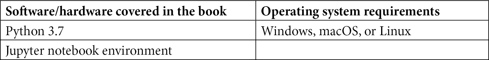

# 前言

数据驱动的决策一直是任何企业成功的关键，**机器学习**（**ML**）在实现这一点和帮助企业保持竞争优势中发挥着关键作用。尽管机器学习有助于释放企业的真正潜力，但在路上有许多障碍。根据一项研究，90%的机器学习模型从未进入生产阶段。模型开发与产业化之间的脱节以及不良或平庸的机器学习实践是导致这种情况的许多原因之一。这就是为什么有那么多端到端机器学习平台提供简化机器学习开发的解决方案。这些平台的主要目标之一是鼓励数据科学家/机器学习工程师遵循**机器学习操作**（**MLOps**）标准，这些标准有助于加快模型的生产化。近年来，特征管理已成为机器学习平台的一个目标——无论是内部构建还是作为**平台即服务**（**PaaS**）提供。能够创建、共享和发现精选机器学习特征的特征存储已成为大多数这些机器学习平台的一个基本组成部分。

本书的目标是讨论特征存储在机器学习管道中的重要性。因此，我们将从一个机器学习问题开始，尝试在没有特征存储的情况下开发模型。然后，我们将讨论哪些机器学习的方面可以从特征存储中受益，以及特征存储的一些功能不仅有助于创建更好的机器学习实践，而且有助于模型更快、更经济高效地开发。随着我们从“为什么”使用特征存储过渡到“是什么”和“如何”这两个方面，我们将通过实际案例研究，探讨特征工程、模型训练、推理以及批量在线模型的产业化。在本书的第一和第二部分，我们将使用开源特征存储 Feast。在最后一部分，我们将寻找市场上可用的替代方案，并尝试使用托管特征存储进行端到端用例的测试。

# 本书面向对象

这本书面向数据/机器学习/平台工程师、数据科学家，以及想要了解特征管理、如何在 AWS 云上部署 Feast、如何创建精选机器学习特征、以及如何在模型构建中使用和协作其他数据科学家进行批量在线模型预测，以及将模型从开发转移到生产的特征科学爱好者。这本书将对从小型大学项目到企业级机器学习应用的各种机器学习项目有益。

# 本书涵盖内容

*第一章*, *机器学习生命周期概述*，首先对机器学习进行了简要介绍，然后深入探讨了机器学习的一个用例——客户终身价值模型。本章概述了机器学习开发的各个阶段，最后讨论了机器学习中最耗时的部分，以及理想世界和现实世界在机器学习开发中的样子。

*第二章*, *特征存储解决的问题是什么？*，介绍了本书的主要焦点，即特征管理和特征存储。它讨论了特征在生产系统中的重要性，将特征引入生产的不同方法，以及这些方法的常见问题，随后讨论了特征存储如何克服这些常见问题。

*第三章*, *特征存储基础、术语和用法*，首先介绍了开源特征存储——Feast，然后是安装过程、特征存储领域使用的不同术语以及基本 API 使用。最后，简要介绍了在 Feast 中协同工作的不同组件。

*第四章*, *将特征存储添加到机器学习模型中*，将帮助读者在 AWS 上安装 Feast，逐步通过截图介绍不同的资源创建，如 S3 存储桶、Redshift 集群和 Glue 目录。最后，它回顾了在第一章*机器学习生命周期概述*中开发的客户终身价值模型的特征工程方面，并在 Feast 中创建和摄取了精选特征。

*第五章*, *模型训练和推理*，从第四章*将特征存储添加到机器学习模型中*的结尾继续，讨论了特征存储如何帮助数据科学家和机器学习工程师在机器学习模型的开发中进行协作。它讨论了如何使用 Feast 进行批量模型推理，以及如何构建用于在线模型推理的 REST API。

*第六章*, *模型到生产及之后*，讨论了使用 Amazon **管理 Apache Airflow 工作流**（**MWAA**）创建编排环境，使用前几章中构建的特征工程、模型训练和推理代码/笔记本，并将批量和在线模型管道部署到生产环境中。最后，讨论了生产之外的方面，如特征监控、特征定义的更改，以及构建下一个机器学习模型。

*第七章*，*Feast 替代方案和机器学习最佳实践*，介绍了其他特征存储，如 Tecton、Databricks Feature Store、Google Cloud 的 Vertex AI、Hopsworks Feature Store 和 Amazon SageMaker Feature Store。它还介绍了后者的基本用法，以便用户了解使用托管特征存储的感觉。最后，它简要讨论了机器学习最佳实践。

*第八章*，*用例 - 客户流失预测*，使用 Amazon SageMaker 的托管特征存储服务，通过一个端到端用例在电信数据集上预测客户流失。它还涵盖了特征漂移监控和模型性能监控的示例。

# 为了最大限度地利用本书

本书使用 AWS 服务进行 Feast 部署、管道编排，以及一些 SageMaker 产品。如果您创建了一个新的 AWS 账户，所有使用的服务都在免费层或特色产品中，除了 Apache Airflow（MWAA）环境。然而，我们已经列出了一些替代方案，可用于运行示例。

所有示例都是使用 Python 3.7 – `feast==0.19.3`运行的。适当的库版本也在笔记本中提及，如有必要。要运行示例，您只需要一个 Jupyter 笔记本环境（本地、Google Colab、SageMaker 或您选择的任何其他环境）以及每个章节或部分所需的 AWS 资源和权限。



**如果您使用的是本书的数字版，我们建议您亲自输入代码或从本书的 GitHub 仓库（下一节中有一个链接）获取代码。这样做将帮助您避免与代码复制粘贴相关的任何潜在错误。**

为了最大限度地利用本书，您应该具备 Python 编程经验，并对笔记本、Python 环境、以及机器学习和 Python 机器学习库（如 XGBoost 和 scikit-learn）有基本了解。

# 下载示例代码文件

您可以从 GitHub（https://github.com/PacktPublishing/Feature-Store-for-Machine-Learning）下载本书的示例代码文件。如果代码有更新，它将在 GitHub 仓库中更新。

我们还提供了其他来自我们丰富图书和视频目录的代码包，可在[`github.com/PacktPublishing/`](https://github.com/PacktPublishing/)找到。查看它们吧！

# 下载颜色图像

我们还提供了一份 PDF 文件，其中包含本书中使用的截图和图表的颜色图像。您可以从这里下载：https://static.packt-cdn.com/downloads/9781803230061_ColorImages.pdf。

# 使用的约定

本书使用了一些文本约定。

`文本中的代码`: 表示文本中的代码单词、数据库表名、文件夹名、文件名、文件扩展名、路径名、虚拟 URL、用户输入和 Twitter 昵称。以下是一个示例：“前面的代码块调整了数值列：`tenure`、`MonthlyCharges`和`TotalCharges`。”

代码块应如下设置：

```py
le = LabelEncoder()
```

```py
for i in bin_cols:
```

```py
    churn_data[i] = le.fit_transform(churn_data[i])
```

当我们希望您注意代码块中的特定部分时，相关的行或项目将以粗体显示：

```py
project: customer_segmentation
```

```py
registry: data/registry.db
```

```py
provider: aws
```

```py
online_store:
```

```py
  type: dynamodb
```

```py
  region: us-east-1
```

任何命令行输入或输出都应如下编写：

```py
$ docker build -t customer-segmentation .
```

**粗体**: 表示新术语、重要单词或您在屏幕上看到的单词。例如，菜单或对话框中的单词以粗体显示。以下是一个示例：“在集群主页上，选择**属性**选项卡，然后向下滚动到**关联的 IAM 角色**。”

小贴士或重要提示

看起来像这样。

# 联系我们

我们欢迎读者的反馈。

**一般反馈**: 如果您对本书的任何方面有疑问，请通过 customercare@packtpub.com 给我们发邮件，并在邮件主题中提及书名。

**勘误表**: 尽管我们已经尽一切努力确保内容的准确性，但错误仍然可能发生。如果您在这本书中发现了错误，我们将不胜感激，如果您能向我们报告，我们将不胜感激。请访问[www.packtpub.com/support/errata](http://www.packtpub.com/support/errata)并填写表格。

**盗版**: 如果您在互联网上以任何形式发现我们作品的非法副本，如果您能提供位置地址或网站名称，我们将不胜感激。请通过版权@packt.com 与我们联系，并提供材料的链接。

**如果您有兴趣成为作者**: 如果您在某个领域有专业知识，并且您有兴趣撰写或为书籍做出贡献，请访问[authors.packtpub.com](http://authors.packtpub.com)。

# 分享您的想法

一旦您阅读了《机器学习特征存储》，我们很乐意听听您的想法！请点击此处直接进入此书的亚马逊评论页面并分享您的反馈。

您的评论对我们和科技社区都很重要，并将帮助我们确保我们提供高质量的内容。
