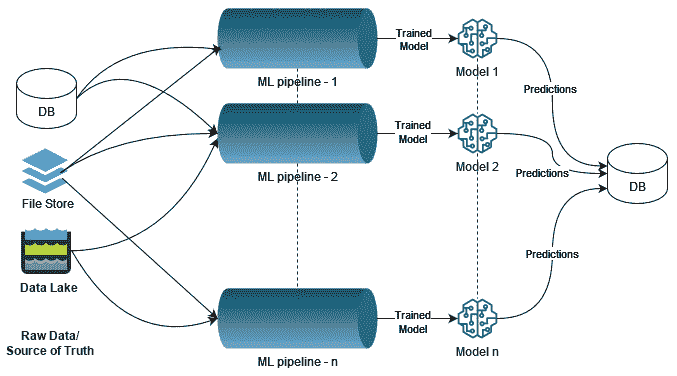
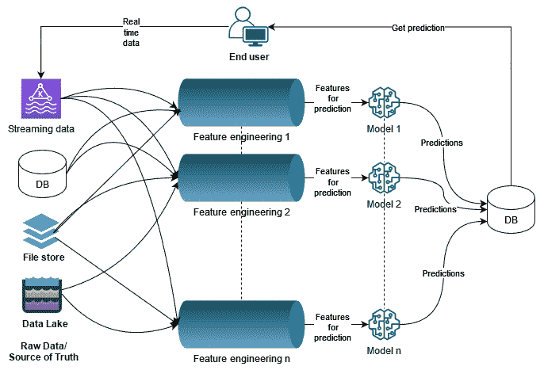
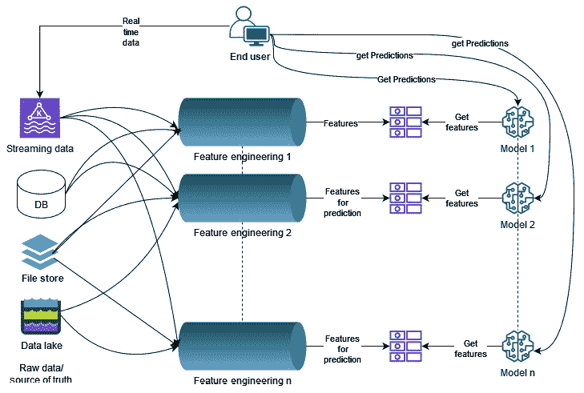
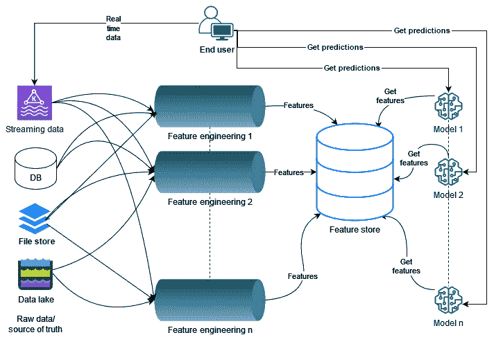

# 第三章：功能存储解决了哪些问题？

在上一章中，我们讨论了机器学习（ML）生命周期中的不同阶段，ML 的困难和耗时阶段，以及我们离理想世界还有多远。在本章中，我们将探讨 ML 的一个领域，即 ML 特征管理。ML 特征管理是创建特征、将它们存储在持久存储中，并在模型训练和推理中大规模提供它们的过程。它是 ML 最重要的阶段之一，尽管它通常被忽视。在 ML 的早期阶段，数据科学/工程团队缺乏特征管理一直是将他们的 ML 模型投入生产的主要障碍。

作为数据科学家/ML 工程师，您可能已经找到了存储和检索 ML 模型特征的创新方法。但大多数情况下，我们构建的解决方案是不可重用的，每个解决方案都有局限性。例如，我们中的一些人可能正在使用 S3 存储桶来存储特征，而团队中的其他数据科学家可能正在使用事务数据库。一个人可能更习惯于使用 CSV 文件，而另一个人可能更喜欢使用 Avro 或 Parquet 文件。由于个人偏好和缺乏标准化，每个模型可能都有不同的管理特征的方式。另一方面，良好的特征管理应该做到以下几方面：

+   使特征可发现

+   导致模型易于复现

+   加速模型开发和生产化

+   在团队内部和团队之间促进特征的重复使用

+   使特征监控变得简单

本章的目的是解释数据科学家和工程师如何努力实现更好的特征管理，但往往无法达到预期。我们将回顾团队采用的不同方法来将特征投入生产，这些方法中常见的常见问题，以及如何通过功能存储做得更好。到本章结束时，您将了解功能存储如何满足之前提到的目标，并在团队间提供标准化。

在本章中，我们将涵盖以下主题：

+   特征在生产中的重要性

+   将特征投入生产的方法

+   将特征投入生产的方法中常见的常见问题

+   功能存储的救星

+   功能存储背后的哲学

# 特征在生产中的重要性

在讨论如何将特征投入生产之前，让我们了解为什么在生产中需要特征。让我们通过一个例子来了解。

我们经常使用出租车和外卖服务。这些服务的一个好处是它们会告诉我们出租车或食物到达需要多长时间。大多数时候，这个预测是大约正确的。它是如何准确预测的呢？当然，它使用机器学习。机器学习模型预测出租车或食物到达所需的时间。为了使这样的模型成功，不仅需要良好的特征工程和机器学习算法，还需要最新的特征。尽管我们不知道模型使用的确切特征集，但让我们看看一些动态变化且非常重要的特征。

在使用外卖服务时，影响配送时间的最主要因素包括餐厅、司机、交通和顾客。模型可能使用一组缓慢变化的特征，这些特征会定期更新，可能是每天或每周更新一次，以及一组每几分钟就会变化的动态特征。缓慢变化的特征可能包括餐厅在不同时间通过应用程序和亲自接收的平均订单数量、订单准备的平均时间等。这些特征可能看起来并不是缓慢变化的，但如果你仔细想想，平均订单数量可能会根据餐厅位置、季节性、一天中的时间、一周中的某一天等因素而有所不同。动态特征包括最后五笔订单所需的时间、过去 30 分钟内的取消订单数量，以及餐厅当前的订单数量。同样，司机特征可能包括与距离相关的平均订单配送时间、司机取消订单的频率，以及司机是否在取多个订单。除了这些特征之外，还会有交通特征，这些特征的变化更为动态。

由于存在许多动态特征，即使其中之一已经有一小时的历史，模型的预测也可能超出图表范围。例如，如果配送路线上发生车祸，交通特征没有捕捉到并用于推理，模型将预测食物会比实际到达得更快。同样，如果模型无法获取餐厅当前的订单数量，它将使用旧值并预测一个可能远离真相的值。因此，模型获取的越新特征，预测将越好。另外，还有一个需要注意的事情是，应用程序不会提供特征；应用程序只能提供诸如餐厅 ID 和顾客 ID 等信息。模型将不得不从不同的位置获取特征和事实，理想情况下是从特征存储库中获取。无论特征是从哪里获取的，为其服务的基础设施必须根据流量进行扩展和缩减，以有效地使用资源，并能够以非常低的延迟率处理请求，错误率极低，如果有的话。

就像外卖服务一样，我们在第一章中构建的模型需要推理过程中的特征，并且特征越新，客户的**终身价值**（**LTV**）预测就会越好。良好的预测将导致更好的行动，从而带来卓越的客户体验，进而提高客户亲和力和更好的业务。

# 将特征引入生产的方法

既然我们了解了在生产中需要特征，那么让我们看看一些传统的将特征引入生产的方法。让我们考虑两种类型的管道：批量模型管道和在线/事务模型管道：

+   **批量模型**：这些是在预定时间运行的模型，例如每小时、每天、每周等。两种常见的批量模型是预测和客户细分。批量推理比其对应物更容易和更简单，因为它没有延迟要求；推理可以运行几分钟或几小时。批量模型可以使用如 Spark 这样的分布式计算框架。此外，它们可以用简单的基础设施运行。大多数机器学习模型最初是批量模型，随着时间的推移，根据可用的基础设施和需求，它们最终成为在线/事务模型。

虽然批量模型的架构简单易建和管理，但这些模型存在一些缺点，例如预测并不总是最新的。由于预测存在时间滞后，可能会给业务带来成本。例如，假设一家制造厂使用订单预测模型来获取原材料。根据批量预测模型的时间滞后，企业可能需要承担原材料短缺的成本，或者在仓库中过度储备原材料。

+   **在线/事务模型**：在线模型遵循拉取范式；预测将在需求时生成。在线模型利用当前现实情况并用于预测。在线模型是事务性的，需要低延迟的服务，并且应根据流量进行扩展。一个典型的在线模型是推荐模型，这可能包括产品推荐、设计推荐等等。

虽然实时预测听起来很吸引人，但在线模型面临不同的挑战。构建一个延迟为 8 小时的程序比构建一个延迟为 100 毫秒的程序要容易。在线模型的延迟通常在毫秒级别。这意味着模型有几分钟的时间来确定最新的值（这意味着为模型生成或获取最新的特征）并预测结果。为了实现这一点，模型需要一个支持基础设施来提供预测所需的数据。在线模型通常作为 REST API 端点托管，这也需要扩展、监控等。

既然我们了解了批量模型和在线模型之间的区别，让我们看看批量模型管道是如何工作的。

## 批量模型管道

如前所述，批处理模型管道的延迟要求可以从几分钟到几小时不等。批处理模型通常按计划运行，因此它们将使用 Airflow 或 AWS Step Functions 等工具进行编排。让我们看看一个典型的批处理模型管道以及如何将特征带入生产。

*图 2.1* 描述了典型的批处理模型管道：



图 2.1 – 批处理模型管道

如*第一章*《机器学习生命周期概述》中所述，一旦模型开发完成并准备投入生产，笔记本将被重构以删除不需要的代码。一些数据工程师还将单个笔记本分解成多个逻辑步骤，例如特征工程、模型训练和模型预测。重构的笔记本或从笔记本生成的重构 Python 脚本使用 Airflow 等编排框架进行调度。在一个典型的管道中，第一阶段将从不同的数据源读取原始数据，执行数据清洗，并执行特征工程，这些特征将被管道的后续阶段使用。一旦模型预测阶段完成，预测输出将被写入持久存储，可能是数据库或 S3 存储桶。结果将在需要时从持久存储中访问。如果管道中的某个阶段由于任何原因（例如数据可访问性问题或代码错误）失败，管道将被设置为触发警报并停止进一步执行。

如果你还没有注意到，在批处理模型管道中，特征是在管道运行时生成的。在某些情况下，它还会使用最新数据重新训练一个新模型，而在其他情况下，它使用之前训练的模型，并使用在管道运行时可用数据生成的特征进行预测。如图*图 2.1*所示，每个新构建的模型都是从原始数据源开始，重复相同的步骤，并加入生产管道列表。我们将在后面的部分讨论这种方法中存在的问题。接下来，让我们看看在线模型中如何将特征带入生产的不同方法。

## 在线模型管道

在线模型有在近实时服务特征的特殊要求，因为这些模型是面向客户的或需要在实时做出业务决策。在线模型将特征带入生产的方法有很多。让我们在本节中逐一讨论它们。需要注意的是，这些方法并不完全符合每个人的做法；它们只是群体方法的表示。不同的团队使用这些方法的不同的版本。

### 将特征与模型打包

要部署在线模型，首先必须将其打包。同样，团队根据他们使用的工具遵循不同的标准。有些人可能会使用打包库，如 MLflow、joblib 或 ONNX。其他人可能会直接将模型打包为 REST API Docker 镜像。如*第一章*中的*图 1.1*所述，数据科学家和数据工程师具有不同的技能集，理想的方法是向数据科学家提供使用 MLflow、joblib 和 ONNX 等库打包模型的工具，并将模型保存到模型注册表中。然后，数据工程师可以使用注册的模型构建 REST API 并部署它。还有现成的支持，可以使用简单的**命令行界面**（**CLI**）命令将 MLflow 打包的模型部署为 AWS SageMaker 端点。它还支持使用 CLI 命令构建 REST API Docker 镜像，然后可以在任何容器环境中部署。

虽然如 MLflow 和 joblib 之类的库提供了一种打包 Python 对象的方法，但它们也支持在需要时添加额外的依赖项。例如，MLflow 提供了一套内置风味，以支持使用 scikit-learn、PyTorch、Keras 和 TensorFlow 等 ML 库打包模型。它为 ML 库添加了所有必需的依赖项。使用内置风味打包模型与以下代码一样简单：

```py
mlflow.<MLlib>.save_model(model_object)
```

```py
## example scikit-learn
```

```py
mlflow.sklearn.save_model(model_object)
```

除了所需的依赖项外，您还可以打包`features.csv`文件，并在模型的`predict`方法中加载它。尽管这可能听起来像是一个简单的部署选项，但这种方法的结果并不远逊于批处理模型。由于特征与模型一起打包，因此它们是静态的。原始数据集的任何变化都不会影响模型，除非使用从最新数据生成的新特征集构建的新版本模型并将其打包。然而，这可能是从批处理模型到在线模型的一个很好的第一步。我之所以这么说，是因为您现在将其作为基于拉的推理来运行，而不是作为批处理模型。此外，您已经为模型的消费者定义了 REST 端点输入和输出格式。唯一待定的步骤是将最新特征传递给模型，而不是打包的静态特征。一旦实现这一点，模型的消费者就不需要做出任何更改，并且将使用最新可用数据进行预测。

### 基于推的推理

与需要时才评分的拉式推理不同，在基于推的推理模式中，预测是主动运行的，并保存在事务数据库或键值存储中，以便在请求到来时以低延迟提供服务。让我们看看使用基于推的推理的在线模型的典型架构：



图 2.2 – 基于推的推理

*图 2.2* 展示了基于推的推理架构。这里的想法与批量模型推理类似，但不同之处在于该管道还考虑了实时数据集，这些数据集是动态变化的。基于推的模型的工作方式如下：

+   实时数据（例如，用户与网站的交互）将被捕获并推送到队列，如 Kafka、Kinesis 或 Event Hubs。

+   特征工程管道根据需要生成模型特征的数据订阅特定的主题集或特定的队列集。这也取决于工具和架构。根据应用的大小/多样性，可能只有一个队列或多个队列。

+   每当队列中出现感兴趣的事件时，特征工程管道将选择此事件并使用其他数据集重新生成模型的特征。

    注意

    并非所有特征都是动态的。有些特征可能变化不大或不太频繁。例如，客户的地理位置可能不会经常改变。

+   新生成的特征用于运行数据点的预测。

+   结果存储在事务数据库或键值存储中。

+   当需要时，网站或应用将查询数据库以获取特定 ID（例如，当在网站上为顾客提供推荐时使用`CustomerId`）的新预测。

+   每当队列中出现新的感兴趣事件时，此过程会重复。

+   每个新的机器学习模型都将添加一个新的管道。

这种方法可能看起来简单直接，因为这里唯一的额外要求是实时流数据。然而，这也有局限性；整个管道必须在毫秒内运行，以便在应用进行下一次预测查询之前提供推荐。这是可行的，但可能涉及更高的运营成本，因为这不仅仅是一个管道：每个实时模型的管道都必须有类似的延迟要求。此外，这不会是一个复制粘贴的基础设施，因为每个模型在处理入站流量时都会有不同的要求。例如，处理订单特征的模型可能需要较少的处理实例，而处理点击流数据的模型可能需要更多的数据处理实例。还需要注意的是，尽管它们可能看起来像是在写入同一个数据库，但大多数情况下，涉及的是不同的数据库和不同的技术。

让我们看看下一个更好的解决方案。

### 基于拉的推理

与基于推的推理相反，在基于拉的推理中，预测是在请求时运行的。不是存储预测，而是将特定模型的特征集存储在事务数据库或键值存储中。在预测期间，特征集可以以低延迟访问。让我们看看基于拉推理模型的典型架构和涉及的组件：



图 2.3 – 使用事务/键值存储进行特征

*图 2.3* 展示了将特征引入生产的一种另一种方式：基于拉的机制。管道的一半工作方式与我们刚才讨论的基于推的推理相似。这里的区别在于，在特征工程之后，特征被写入事务数据库或键值存储。这些特征将由管道保持更新。一旦特征可用，模型的工作方式如下：

1.  模型的 `predict` API 将具有类似于以下提到的合同：

    ```py
    def predict(entity_id: str) -> dict
    ```

1.  当应用程序需要查询模型时，它将使用 `entity_id` 打击 REST 端点。

1.  模型将使用 `entity_id` 查询键值存储以获取评分模型所需的特征。

1.  这些特征用于评分模型并返回预测结果。

如果您没有特征存储基础设施，这种方法是理想的。我们将在下一章中详细讨论这一点。再次强调，这种方法涉及一些问题，包括工作重复、部署和扩展特征工程管道以及管理多个键值存储基础设施等。

### 按需计算特征

在我们继续讨论这些方法的缺点之前，让我们讨论一种最后的方法。在迄今为止讨论的方法中，数据管道在数据到达或管道运行时主动计算特征。然而，当有推理请求时，可以按需计算特征。这意味着当应用程序查询模型进行预测时，模型将请求另一个系统获取特征。该系统使用来自不同来源的原始数据，并按需计算特征。这可能是最难实现的架构，但我听说在 *TWIML AI 播客与 Sam Charrington* 中，*第 326 集：Metaflow，Ville Tuulos 的人中心数据科学框架*，Netflix 有一个可以在秒级延迟下按需生成特征的系统。

`predict` API 可能看起来与最后一种方法中的类似：

def predict(entity_id: str) -> dict

然后它调用系统为给定的实体获取特征，使用这些特征进行预测，并返回结果。正如你可以想象的那样，所有这些都必须在几秒钟内完成。在实时执行的需求特征工程可能需要一个巨大的基础设施，其中包含不同存储系统之间的多个缓存。保持这些系统同步并不是一个容易的架构设计。对我们大多数人来说，这只是一个梦想中的基础设施。我至今还没有看到过。希望我们很快就能实现。

在本节中，我们讨论了将特征引入生产进行推理的多种方法。可能还有许多其他实现这一目标的方法，但大多数解决方案都是围绕这些方法之一的变化。现在我们了解了为什么以及如何将特征引入生产，让我们来看看这些方法常见的常见问题以及如何克服它们。

# 用于将特征引入生产的常用方法的问题

上一节讨论的方法看起来像是好的解决方案。然而，每个方法不仅有其自身的技术难题，如基础设施规模、遵守服务级别协议（SLA）以及与不同系统的交互，而且它们还有一些共同的问题。在技术领域不断增长直到达到饱和水平之前，这是预料之中的。我想将本节专门用于讨论这些方法中存在的常见问题。

## 重新发明轮子

工程中常见的一个问题就是构建已经存在的东西。造成这种情况的原因可能有很多；例如，一个正在开发解决方案的人可能不知道它已经存在，或者现有的解决方案效率低下，或者有额外的功能需求。在这里我们也遇到了同样的问题。

在许多组织中，数据科学家在一个特定的领域内工作，并得到一个支持他们的团队的帮助，这个团队通常包括机器学习工程师、数据工程师和数据分析师。他们的目标是让他们的模型投入生产。尽管并行工作的其他团队也有让他们的模型投入生产的目标，但由于他们的日程安排和交付时间表，他们很少相互协作。正如第一章所讨论的，团队中的每个角色都有不同的技能组合，对现有工具的经验水平不同，偏好也不同。此外，不同团队的数据工程师很少有相同的偏好。这导致每个团队都寻找一种将他们的模型投入生产的解决方案，这涉及到构建特征工程管道、特征管理、模型管理和监控。

在提出一个成功的解决方案后，即使团队（我们称之为团队 A）与其他团队分享他们的知识和成功，你得到的回应也只会是“知道了”，“很有趣”，“可能对我们有用”。但这永远不会转化为其他团队的解决方案。原因并不是其他团队对团队 A 取得的成果漠不关心。除了知识之外，团队 A 在很多情况下所构建的很多东西是不可重用的。其他团队剩下的选择是复制代码并适应他们的需求，希望它能工作，或者实施一个看起来相似的流程。因此，大多数团队最终都会为模型构建自己的解决方案。有趣的是，即使在大多数情况下，团队 A 也会为下一个他们工作的模型重新构建相同的流程。

## 特征重新计算

让我们从一个问题开始。问问自己：*你的手机有多少内存？* 很可能你心里已经有了答案。如果你不确定，你可能会检查设置中的内存并回答。无论如何，如果我在一个小时后或其他人问你同样的问题，我非常确信你不会在回答之前再次进入手机的设置进行检查，除非你更换了手机。那么为什么我们在所有的机器学习流程中都要这样做特征？

当你回顾之前讨论的方法时，它们都存在一个共同的问题。假设团队 A 成功完成了一个客户 LTV 模型并将其投入生产。现在团队 A 被分配了另一个项目，即预测客户的下一个购买日。有很大可能性，在客户 LTV 模型中有效的特征在这里同样有效。尽管这些特征是定期计算以支持生产模型的，但团队 A 将重新从原始数据开始，从头计算这些特征，并用于模型开发。不仅如此，他们还会复制整个流程，尽管存在重叠。

由于这种重新计算，根据团队 A 的设置和使用的工具，他们将会浪费计算资源、存储空间和人力，而如果有了更好的特征管理，团队 A 本可以在新项目中取得领先，这同样是一个成本效益高的解决方案。

## 特征可发现性和共享

如前所述，一个问题是在同一团队内部进行重新计算。这个问题的另一部分甚至更大。那就是跨团队和领域的重新计算。就像在“重新发明轮子”部分中，团队试图弄清楚如何将机器学习特征带入生产一样，数据科学家在这里也在重新发现数据和特征。

这其中的一个主要驱动因素是缺乏信任和可发现性。我们先来谈谈可发现性。每当数据科学家在构建模型时，如果他们出色地完成了数据挖掘、探索和特征工程，那么分享这些成果的方式非常有限，正如我们在第一章中讨论的那样。数据科学家可以使用电子邮件和演示文稿来分享这些成果。然而，没有任何方式可以让任何人发现可用的资源，并选择性地构建尚未构建的内容，然后在模型中使用它们。即使有可能发现其他数据科学家的工作，但没有弄清楚数据访问和重新计算特征的情况下，也无法使用这些工作。

数据发现和特性工程中重新发明轮子的另一个驱动因素是信任。尽管有明确的证据表明有一个使用生成特征的生成模型在生产中运行，但数据科学家往往很难信任其他人为生成特性开发的程序。由于原始数据是可信的，因为它将具有服务等级协议和模式验证，数据科学家通常最终会重新发现并生成特性。

因此，这里所需的解决方案是一个可以使他人生成的特性可发现、可共享，最重要的是可信赖的应用程序，即拥有和管理他们生成的特性的人/团队。

## 训练与服务的偏差

机器学习中另一个常见问题是训练与服务的偏差。这种情况发生在用于为模型训练生成特征的特性工程代码与用于为模型预测/服务生成特征的代码不同时。这种情况可能由许多原因引起；例如，在模型训练期间，数据科学家可能使用了 PySpark 来生成特征，而在将管道投入生产时，接手该任务的 ML/数据工程师可能使用了生产基础设施所需的不同技术。这里有几个问题。一个是存在两个版本的特性工程代码，另一个问题是这可能导致训练与服务的偏差，因为两个版本的管道生成相同原始数据输入的数据可能不同。

## 模型可复现性

模型可复现性是机器学习中需要解决的常见问题之一。我听说过一个故事，一位数据科学家离职后，他正在工作的模型丢失了，他的团队多次无法复现该模型。其中一个主要原因是缺乏特性管理工具。当你拥有原始数据的历史时，你可能会问复现相同模型的问题在哪里。让我们来看看。

假设有一个数据科学家，名叫 Ram，他正在开发一个机器学习模型，用于向客户推荐产品。Ram 花了一个月的时间来开发这个模型，并提出了一个出色的模型。在团队中数据工程师的帮助下，该模型被部署到生产环境中。但是，Ram 在这个职位上没有得到足够的挑战，所以他辞职并跳槽到了另一家公司。不幸的是，生产系统崩溃了，Ram 没有遵循 MLOps 标准将模型保存到注册表中，因此模型丢失且无法恢复。

现在，重建模型的职责落到了团队中的另一位新数据科学家 Dee 身上，她聪明且使用了与 Ram 相同的 dataset，并进行了与 Ram 相同的数据清洗和特征工程，仿佛 Dee 是 Ram 的转世。不幸的是，Dee 的模型无法得到与 Ram 相同的结果。无论 Dee 尝试多少次，她都无法重现该模型。

造成这种情况的一个原因是数据随着时间的推移发生了变化，这反过来又影响了特征值，从而影响了模型。没有办法回到过去产生第一次使用时的相同特征。由于模型的可重现性/可重复性是机器学习的一个关键方面，我们需要进行时间旅行。这意味着数据科学家应该能够回到过去，从过去某个特定时间点获取特征，就像在*复仇者联盟：终局之战*中一样，这样模型就可以一致地重现。

## 低延迟

所有这些方法试图解决的问题之一是低延迟特征服务。提供低延迟特征的能力决定了模型能否作为在线模型或批量模型托管。这涉及到构建和管理基础设施以及保持特征更新等问题。由于没有必要将所有模型都设置为事务性的，同时也有很高的可能性，一个用于批量模型的特征可能对不同的在线模型非常有用。因此，能够开关低延迟服务将极大地便利数据科学家。

到目前为止，在本节中，我们已经讨论了上一节中讨论的方法的一些常见问题。仍然悬而未决的问题是，我们能做些什么来使情况变得更好？是否存在一个或一组现有的工具，可以帮助我们解决这些常见问题？事实证明，答案是*是的*，有一个工具可以解决我们迄今为止讨论的所有问题。它被称为*特征存储*。在下一节中，我们将看看什么是特征存储，它们如何解决问题，以及背后的哲学。

# 特征存储来拯救

让我们从特征存储的定义开始这一节。**特征存储**是一个用于管理和为生产中的模型提供机器学习特征的运营数据系统。它可以从低延迟的在线存储（用于实时预测）或离线存储（用于扩展批量评分或模型训练）向模型提供特征数据。正如定义所指出的，它是一个完整的包，帮助你创建和管理机器学习特征，并加速模型的运营化。在我们深入了解特征存储之前，让我们看看引入特征存储后机器学习管道架构如何变化：



图 2.4 – 带有特征存储的机器学习管道

*图 2.4* 展示了包含特征存储的机器学习管道架构。你可能觉得 *图 2.4* 和 *图 2.3* 看起来一样，我只是用一个更大的存储替换了一堆小数据存储，并称之为特征存储。是的，可能看起来是这样，但还有更多。与传统数据存储不同，特征存储有一套特殊的特性；它不是一个数据存储，而是一个数据系统（正如其定义所述），并且它能做比仅仅存储和检索更多的事情。

由于特征存储是机器学习管道的一部分，整个管道的工作方式如下：

1.  一旦数据科学家有了问题陈述，起点将不再是原始数据。它将是特征存储。

1.  数据科学家将连接到特征存储，浏览存储库，并使用感兴趣的特性。

1.  如果这是第一个模型，特征存储可能为空。从这里，数据科学家将进入发现阶段，确定数据集，构建特征工程管道，并将特征导入特征存储。特征存储将特征工程管道与机器学习中的其他阶段解耦。

1.  如果特征存储不为空，但特征存储中可用的特征不足，数据科学家将发现感兴趣的数据，并添加另一个特征工程管道将一组新特征导入特征存储。这种方法使得特征对数据科学家正在工作的模型以及其他发现这些特征对其模型有用的数据科学家可用。

1.  一旦数据科学家对特征集满意，模型将进行训练、验证和测试。如果模型性能不佳，数据科学家将返回去发现新的数据和特征。

1.  当模型准备好部署时，模型的 `predict` 方法将包含用于生成模型预测所需特征的代码。

1.  如果是在线模型，准备好的模型将以 REST 端点部署；否则，它将用于执行批量预测。

现在我们已经了解了管道的工作原理，让我们回顾上一节中讨论的问题，并了解特征存储是如何解决它们的。

## 使用特征存储标准化机器学习

一旦特征存储在团队层面得到标准化，尽管可能有不同的读取数据和构建特征工程管道的方式，但超出特征工程之外，管道的其余部分成为标准实现。机器学习工程师和数据科学家不必想出新方法将特征带到生产中。在特征工程之后，数据科学家和机器学习工程师将特征摄入特征存储。根据定义，特征存储可以以低延迟提供特征。在此之后，所有机器学习工程师需要做的就是更新他们的`predict`方法，从特征存储中获取所需特征并返回预测结果。这不仅使机器学习工程师的生活变得容易，有时也减轻了管理特征管理基础设施的负担。

## 特征存储避免了数据重新处理

如定义所述，特征存储有一个离线存储，离线存储中的数据可以用于模型训练或批量推理。这里的模型训练并不意味着训练相同的模型。输入到特征存储的特征可以用于训练另一个模型。

让我们以我们在讨论问题时使用的相同例子为例：团队-A 刚刚完成了客户 LTV 模型的投产部署。团队-A 接下来要开始工作的模型是预测下一次购买日期。当数据科学家开始工作在这个模型上时，他们不必回到原始数据并重新计算构建客户 LTV 模型所使用的特征。数据科学家可以连接到特征存储，该存储正在更新为前一个模型的最新特征，并获取训练新模型所需的特征。然而，数据科学家将不得不为从原始数据中找到的有用特征构建数据清洗和特征工程管道。再次强调，新添加的特征可以在下一个模型中重用。这使得模型开发既高效又经济。

## 特征可以通过特征存储进行发现和共享

在上一段中，我们讨论了团队内部特征的重用。特征存储帮助数据科学家实现这一点。另一个主要问题是由于缺乏特征可发现性，跨团队重新计算和重新发现有用的数据和特征。猜猜看？特征存储也能解决这个问题。数据科学家可以连接到特征存储，浏览现有的特征表和模式。如果他们发现任何现有特征有用，数据科学家可以在模型中使用它们，而无需重新发现或重新计算。

另一个与共享相关的问题是信任。尽管特征存储不能完全解决这个问题，但它在一定程度上解决了它。由于特征表是由团队创建和管理的，数据科学家可以随时联系所有者以获取访问权限，并讨论其他方面，如服务等级协议和监控。如果你还没有注意到，特征存储促进了团队之间的协作。这对双方都有益，不同团队的数据科学家和机器学习工程师可以一起工作，分享彼此的专业知识。

没有更多的训练与服务的偏差

使用特征存储，训练与服务的偏差将永远不会发生。一旦特征工程完成，特征将被摄入到特征存储中，特征存储是模型训练的来源。因此，数据科学家将使用特征存储中的特征来训练机器学习模型。一旦模型训练完成并部署到生产环境，生产模型将再次从在线存储或历史存储中获取数据以进行模型预测。由于这些特征同时被训练和预测使用，服务是通过相同的管道/代码生成的，我们永远不会在特征存储中遇到这个问题。

使用特征存储实现模型的可复现性

之前讨论的架构中另一个主要问题是模型的可复现性。这是一个问题：数据频繁变化，这反过来又导致特征变化，进而导致模型变化，尽管使用的是相同的特征集来构建模型。解决这个问题的唯一方法就是回到过去，获取产生旧模型的相同状态数据。这可能是一个非常复杂的问题，因为它将涉及多个数据存储。然而，可以以这种方式存储生成的特征，使得数据科学家能够进行时间旅行。

是的，这正是特征存储所做的事情。特征存储有一个离线存储，用于存储历史数据，并允许用户回到过去，在特定时间点获取特征的值。使用特征存储，数据科学家可以从历史中的特定时间点获取特征，因此可以一致地复现模型。模型的可复现性不再是特征存储的问题。

## 使用特征存储以低延迟提供特征

尽管所有解决方案都能以某种方式实现低延迟的服务，但解决方案并不统一。机器学习工程师必须想出一个解决方案来解决这个问题，并构建和管理基础设施。然而，在机器学习管道中拥有特征存储使得这变得简单，并且将基础设施管理卸载给其他团队，在平台团队管理特征存储的情况下。即使没有那样，能够运行几个命令并使低延迟服务上线也是机器学习工程师的一个实用工具。

# 特征存储背后的哲学

在本章中，我们讨论了与机器学习管道相关的问题，以及特征存储如何帮助数据科学家解决这些问题并加速机器学习的发展。在本节中，让我们尝试理解特征存储背后的哲学，并尝试弄清楚为什么在我们的机器学习管道中拥有特征存储可能是加速机器学习的理想方式。让我们从一个现实世界的例子开始，因为我们正在尝试通过机器学习建立现实世界的经验。你将得到两款手机的名称；你的任务是判断哪一款更好。名称是 iPhone 13 Pro 和 Google Pixel 6 Pro。你有无限的时间来找到答案；在你找到答案后继续阅读。

正如拉尔夫·瓦尔多·爱默生所说，*重要的不是目的地，而是旅程*。无论你的答案是什么，无论你花了多长时间到达那里，让我们看看你是如何到达那里的。有些人可能立刻就得到了答案，但如果你没有使用过这两款手机，你可能会在谷歌上搜索`iPhone 13 Pro 与 Google Pixel 6 Pro 对比`。你会浏览几个链接，这些链接会给你提供手机的比较：

![Figure 2.5 – iPhone 13 Pro versus Google Pixel 6 Pro]

![img/B18024_02_05.jpg]

图 2.5 – iPhone 13 Pro 与 Google Pixel 6 Pro 对比

这是一种很好的比较两款手机的方法。有些人可能为了得到答案做了更多的工作，但我相信我们中没有一个人去买了这两款手机，阅读了苹果和谷歌提供的规格，每个月都使用它们，并在回答问题之前成为每个手机的专家。

在这个任务中，我们足够聪明，能够利用他人的专业知识和工作成果。尽管互联网上有许多比较，但我们选择了对我们有效的那一个。不仅在这个任务中，而且在大多数任务中，从购买手机到购买房屋，我们都试图利用专家意见来做出决定。如果你从某个角度来看，这些就是我们的决策特征。除了专家意见外，我们还包括我们自己的限制和特征，例如预算、如果是手机，内存大小；如果是汽车，座位数；如果是房屋，房间数。我们使用这些组合来做出决定并采取行动。在大多数情况下，这种方法是有效的，在某些情况下，我们可能需要进行更多研究，甚至成为专家。

在机器学习中使用特征存储库是一种尝试实现类似目标的方法；它就像是数据科学家的 Google。与 Google 的通用搜索不同，数据科学家正在寻找特定的事物，并且也在与其他数据科学家分享他们的专业知识。如果特征存储库中可用的内容不适合数据科学家，他们就会转向原始数据，进行探索、理解，成为该领域的专家，并针对特定实体（如产品、客户等）提出区分性特征。这种结合特征存储库的机器学习工作流程不仅可以帮助数据科学家利用彼此的专业知识，还可以标准化并加速机器学习的发展。

# 摘要

在本章中，我们讨论了机器学习特征管理中的常见问题、生产化机器学习模型的多种架构以及将特征带入生产的方法。我们还探讨了这些方法中涉及的问题以及特征存储库如何通过标准化实践和提供传统数据存储库不具备的额外功能来解决这些问题。

现在我们已经了解了特征存储库能提供什么，在下一章中，我们将深入探讨特征存储库，并探索术语、特征、特征存储库的典型架构等内容。

# 进一步阅读

+   *Feast 文档*：[`docs.feast.dev/`](https://docs.feast.dev/)
