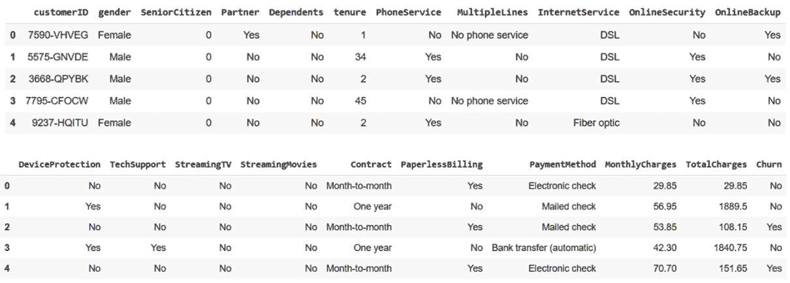
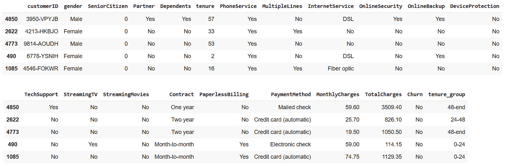
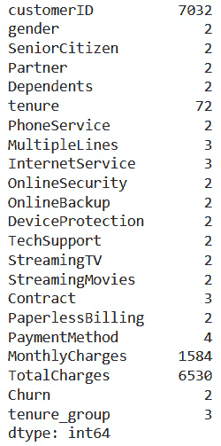
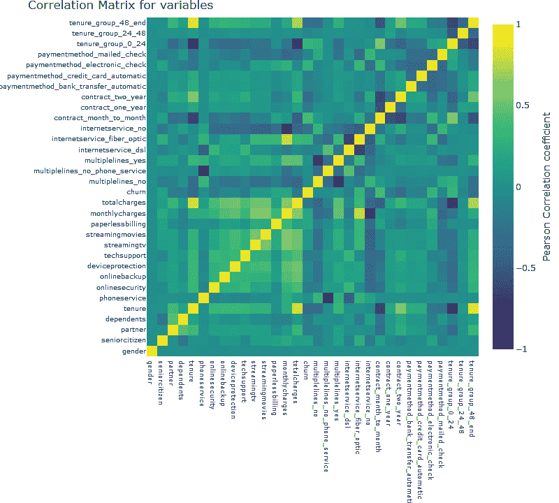
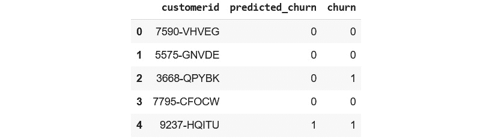
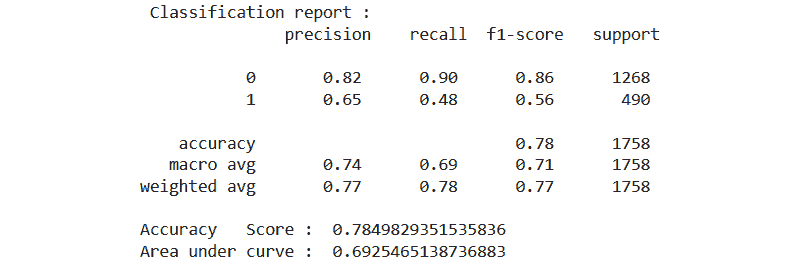

# 第九章：用例 - 客户流失预测

在上一章中，我们讨论了市场上可用的**Feast**特征存储的替代方案。我们查看了一些云提供商的特征存储产品，这些产品是**机器学习**（**ML**）平台产品的一部分，即 SageMaker、Vertex AI 和 Databricks。我们还查看了一些其他供应商，他们提供可以与您的云提供商一起使用的托管特征存储，例如 Tecton 和 Hopsworks，其中 Hopsworks 也是开源的。为了了解托管特征存储，我们尝试了 SageMaker 特征存储的练习，并简要讨论了 ML 最佳实践。

在本章中，我们将讨论使用电信数据集进行客户流失的端到端用例。我们将逐步介绍数据清洗、特征工程、特征摄取、模型训练、部署和监控。对于这个练习，我们将使用托管特征存储——Amazon SageMaker。选择 SageMaker 而不是上一章中讨论的其他替代方案的原因很简单，那就是软件试用版的易于访问。

本章的目标是逐步通过使用托管特征存储的客户流失预测 ML 用例。这应该能让你了解它与自管理特征存储的不同之处，以及特征存储帮助的基本特征监控和模型监控方面。

在本章中，我们将按以下顺序讨论以下主题：

+   基础设施设置

+   问题与数据集的介绍

+   数据处理和特征工程

+   特征组定义和摄取

+   模型训练

+   模型预测

+   特征监控

+   模型监控

# 技术要求

为了运行示例并更好地理解本章内容，了解前几章涵盖的主题将很有用，但不是必需的。为了跟随本章的代码示例，你需要熟悉笔记本环境，这可以是本地设置，如 Jupyter Notebook，或者在线笔记本环境，如 Google Colab、Kaggle 或 SageMaker。你还需要一个 AWS 账户，并完全访问 SageMaker 和 Glue 控制台。你可以在试用期间创建新账户并免费使用所有服务。你可以在以下 GitHub 链接找到本书的代码示例：

https://github.com/PacktPublishing/Feature-Store-for-Machine-Learning/tree/main/Chapter08

# 基础设施设置

在本章的练习中，我们需要一个 S3 存储桶来存储数据，一个 IAM 角色，以及一个可以访问 SageMaker Feature Store 和 S3 存储桶的 IAM 用户。由于我们已经完成了所有这些资源的创建，我将跳过这一部分。请参阅*第四章*，*将特征存储添加到机器学习模型*，了解 S3 存储桶的创建，以及*第七章*，*Feast 替代方案和机器学习最佳实践*，了解 IAM 角色和 IAM 用户的创建。这就是本章初始设置所需的所有内容。

重要提示

我尽量少使用 AWS SageMaker 的资源，因为如果你的免费试用已经结束，这将产生费用。你可以使用 SageMaker Studio 来获得更好的笔记本和特征存储的 UI 体验。

# 问题及数据集介绍

在这个练习中，我们将使用可在 Kaggle 的 URL https://www.kaggle.com/datasets/blastchar/telco-customer-churn 上找到的电信客户流失数据集。练习的目标是使用这个数据集，为模型训练准备数据，并训练一个 XGBoost 模型来预测客户流失。该数据集有 21 列，列名具有自解释性。以下是对数据集的预览：



图 8.1 – 电信数据集

*图 8.1* 展示了标记的电信客户流失数据集。`customerID` 列是客户的 ID。除了 `Churn` 列之外的所有列代表属性集，而 `Churn` 列是目标列。

让我们动手进行特征工程。

# 数据处理和特征工程

在本节中，我们将使用电信客户流失数据集，并生成可用于训练模型的特征。让我们创建一个笔记本，命名为 `feature-engineering.ipynb`，并安装所需的依赖项：

```py
!pip install pandas sklearn python-slugify s3fs sagemaker
```

完成库的安装后，读取数据。对于这个练习，我已经从 Kaggle 下载了数据，并将其保存在可以从笔记本访问的位置。

以下命令从 S3 读取数据：

```py
import os
```

```py
import numpy as np
```

```py
import pandas as pd
```

```py
from slugify import slugify
```

```py
from sklearn.preprocessing import LabelEncoder
```

```py
from sklearn.preprocessing import StandardScaler
```

```py
""" If you are executing the notebook outside AWS(Local jupyter lab, google collab or kaggle etc.), please uncomment the following 3 lines of code and set the AWS credentials """
```

```py
#os.environ["AWS_ACCESS_KEY_ID"] = "<aws_key>"
```

```py
#os.environ["AWS_SECRET_ACCESS_KEY"] = "<aws_secret>"
```

```py
#os.environ["AWS_DEFAULT_REGION"] = "us-east-1"
```

```py
telcom = pd.read_csv("s3://<bucket_name_path>/telco-customer-churn.csv")
```

重要提示

如果你在外部 AWS 中执行笔记本，则使用环境变量设置用户凭据。

如果你预览该数据集，有几个列需要重新格式化，转换为分类列，或删除空值。让我们依次执行这些转换。

`TotalCharges` 列包含一些空字符串。让我们删除包含空或 null 值 `TotalCharges` 的行：

```py
# Replace empty strings with nan
```

```py
churn_data['TotalCharges'] = churn_data["TotalCharges"].replace(" ",np.nan)
```

```py
# remove null values
```

```py
churn_data = churn_data[churn_data["TotalCharges"].notnull()]
```

```py
churn_data = churn_data.reset_index()[churn_data.columns]
```

```py
churn_data["TotalCharges"] = churn_data["TotalCharges"].astype(float)
```

上一段代码块将所有空字符串替换为 `np.nan`，并删除了 `TotalCharges` 列中包含空的行。

接下来，让我们看看`tenure`列。这个列有整数值，代表客户以月为单位的服务期限。除了值之外，我们还可以将客户分为三组：短期（0-24 个月）、中期（24-48 个月）和长期（大于 48 个月）。

以下代码添加了具有定义组的客户`tenure_group`列：

```py
# Create tenure_group columns using the tenure
```

```py
def tenure_label(churn_data) :
```

```py
    if churn_data["tenure"] <= 24 :
```

```py
        return "0-24"
```

```py
    elif (churn_data["tenure"] > 24) & (churn_data["tenure"] <= 48) :
```

```py
        return "24-48"
```

```py
    elif churn_data["tenure"] > 48:
```

```py
        return "48-end"
```

```py
churn_data["tenure_group"] = churn_data.apply(
```

```py
    lambda churn_data: tenure_label(churn_data), axis = 1)
```

上一代码块创建了一个分类列`tenure_group`，它将根据客户服务期限的长度具有三个值，`0-24`、`24-48`和`48-end`。

数据集中的一些列依赖于其他列。例如，`OnlineSecurity`依赖于客户是否有`InternetService`。因此，一些这些列，即`OnlineSecurity`、`OnlineBackup`、`DeviceProtection`、`TechSupport`、`StreamingTV`和`StreamingMovies`，其值用`No internet service`代替`No`。让我们将这些列中的`No internet service`替换为`No`。

以下代码块执行替换操作：

```py
# Replace 'No internet service' to No for the following columns
```

```py
replace_cols = ['OnlineSecurity', 'OnlineBackup', 
```

```py
                'DeviceProtection', 'TechSupport',
```

```py
                'StreamingTV', 'StreamingMovies']
```

```py
for i in replace_cols : 
```

```py
    churn_data[i] = churn_data[i].replace({'No internet service' : 'No'})
```

我们已经进行了一系列数据清洗操作。在继续进行进一步转换之前，让我们预览一次数据集。

以下代码块对`churn_data` DataFrame 进行采样：

```py
churn_data.sample(5)
```

以下代码输出一个样本预览，如图所示：



图 8.2 – Churn 数据集

如*图 8.2*所示，数据集是干净的，只包含分类或数值列。下一步是将这些分类值转换为数值编码。让我们查看数据集，看看哪些是分类的，哪些是数值的。

以下代码计算每个列的唯一值：

```py
churn_data.nunique()
```

上一代码块显示以下输出：



图 8.3 – 每个列的唯一值计数

如*图 8.3*所示，除了`MonthlyCharges`、`tenure`和`TotalCharges`之外，所有其他列都是分类列。

在数据集中，有二进制列和多值分类列。让我们找出哪些是二进制列，哪些是多值列。以下代码块检查列是否为二进制列：

```py
# filter all the col if unique values in the column is 2
```

```py
bin_cols = churn_data.nunique()[churn_data.nunique() == 2].keys().tolist()
```

现在我们有了二进制列的列表，让我们使用标签编码器将它们转换为 0 和 1。

以下代码使用标签编码器对二进制列进行转换：

```py
le = LabelEncoder()
```

```py
for i in bin_cols :
```

```py
    churn_data[i] = le.fit_transform(churn_data[i])
```

下一步是将多值分类列转换为 0 和 1。为此，让我们首先过滤出多值列名。

以下代码块选择多值列：

```py
all_categorical_cols = churn_data.nunique()[churn_data.nunique() <=4].keys().tolist()
```

```py
multi_value_cols = [col for col in all_categorical_cols if col not in bin_cols]
```

上一代码块首先过滤掉所有分类列，然后过滤掉二进制列，这样我们只剩下多值列。

以下代码块将多值列转换为二进制编码：

```py
churn_data = pd.get_dummies(data = churn_data, columns=multi_value_cols)
```

最后的部分是将数值转换为标准范围。由于数值列可能具有不同的范围，将列缩放到标准范围对于机器学习算法可能有益。这也有助于算法更快地收敛。因此，让我们将数值列缩放到标准范围。

下面的代码块使用 `StandardScaler` 将所有数值列缩放到标准范围：

```py
numerical_cols = ['tenure','MonthlyCharges','TotalCharges']
```

```py
std = StandardScaler()
```

```py
churn_data[numerical_cols] = std.fit_transform(churn_data[numerical_cols])
```

前面的代码块缩放了数值列：`tenure`、`MonthlyCharges` 和 `TotalCharges`。现在我们的特征工程已经完成，让我们预览最终的特性集并将其摄取到 SageMaker Feature Store 中。

下面的代码块显示了特征集预览：

```py
churn_data.columns = [slugify(col, lowercase=True, separator='_') for col in churn_data.columns]
```

```py
churn_data.head()
```

前面的代码块将列名格式化为小写，并将字符串中的所有分隔符（如空格和连字符）替换为下划线。最终的特征在下面的屏幕截图中显示：

![图 8.4 – 特征集]

![图片 B18024_08_004.jpg]

图 8.4 – 特征集

最终的特征集有 33 列，如 *图 8.4* 所示。如果你还记得在 *第四章* 中，*将特征存储添加到机器学习模型*，在创建特征定义时，我们根据实体或逻辑组对实体和特征进行了分组。尽管这些特征可以分成多个组，但我们将创建一个单独的特征组并将所有特征摄取到其中。

在下一节中，让我们创建特征定义并摄取数据。

# 特征组定义和特征摄取

现在我们已经准备好了用于摄取的特征集，让我们创建特征定义并将特征摄取到特征存储中。正如之前提到的，我们将使用 SageMaker Feature Store。如果你还记得前面的章节，我们总是将特征定义保存在一个单独的笔记本中，因为这是一个一次性活动。在这个练习中，我们将尝试一种不同的方法，即使用条件语句在不存在的情况下创建特征组。你可以使用这两种方法中的任何一种。

让我们在同一个笔记本中继续，初始化 boto3 会话并检查我们的特征组是否已经存在：

```py
import boto3
```

```py
FEATURE_GROUP_NAME = "telcom-customer-features"
```

```py
feature_group_exist = False
```

```py
client = boto3.client('sagemaker')
```

```py
response = client.list_feature_groups(
```

```py
    NameContains=FEATURE_GROUP_NAME)
```

```py
if FEATURE_GROUP_NAME in response["FeatureGroupSummaries"]:
```

```py
  feature_group_exist = True
```

前面的代码块查询 SageMaker 以检查名为 `telcom-customer-features` 的特征组是否存在，并根据该结果设置一个布尔值。我们将使用这个布尔值来创建特征组或跳过创建，直接将数据摄取到特征存储中。

下面的代码块初始化了与 SageMaker Feature Store 交互所需的对象：

```py
import sagemaker
```

```py
from sagemaker.session import Session
```

```py
import time
```

```py
from sagemaker.feature_store.feature_definition import FeatureDefinition, FeatureTypeEnum
```

```py
role = "arn:aws:iam::<account_number>:role/sagemaker-iam-role"
```

```py
sagemaker_session = sagemaker.Session()
```

```py
region = sagemaker_session.boto_region_name
```

```py
s3_bucket_name = "feast-demo-mar-2022"
```

重要提示

在前面的代码块中使用之前创建的 IAM 角色。IAM 角色应该具有 **AmazonSageMakerFullAccess** 和 **AmazonS3FullAccess**。

下一步是初始化 `FeatureGroup` 对象。下面的代码初始化了特征组对象：

```py
from sagemaker.feature_store.feature_group import FeatureGroup
```

```py
customers_feature_group = FeatureGroup(
```

```py
    name=FEATURE_GROUP_NAME, 
```

```py
    sagemaker_session=sagemaker_session
```

```py
)
```

现在我们将使用之前设置的布尔值来有条件地创建特征组，如果特征组不存在。以下代码块加载特征定义并调用 `create` 方法，如果特征组不存在：

```py
churn_data["event_timestamp"] = float(round(time.time()))
```

```py
if not feature_group_exist:
```

```py
  customers_feature_group.load_feature_definitions(
```

```py
      churn_data[[col 
```

```py
                  for col in churn_data.columns 
```

```py
                  if col not in ["customerid"]]]) 
```

```py
  customer_id_def = FeatureDefinition(
```

```py
      feature_name='customerid', 
```

```py
      feature_type=FeatureTypeEnum.STRING)
```

```py
  customers_feature_group.feature_definitions = [customer_id_def] + customers_feature_group.feature_definitions
```

```py
  customers_feature_group.create(
```

```py
    s3_uri=f"s3://{s3_bucket_name}/{FEATURE_GROUP_NAME}",
```

```py
    record_identifier_name="customerid",
```

```py
    event_time_feature_name="event_timestamp",
```

```py
    role_arn=role,
```

```py
    enable_online_store=False
```

```py
    )
```

重要提示

在 `load_feature_definitions` 调用中，如果你注意到，我正在加载所有特征定义列，除了 `customerid` 列，并在下一行手动将 `customerid` 列添加到特征定义列表中。这样做的原因是 `sagemaker` 库无法将 `string` 数据类型识别为 pandas `dtype` 中的 `object`。

`create` 特征组调用很简单。我通过传递 `enable_online_store` 为 `False` 来禁用在线存储，因为我们将会尝试批量管道，并将在线模型留作练习。一旦前面的代码块执行，根据条件语句，第一次将创建特征组，而对于后续的运行，将跳过特征组创建。

最后一步是摄取 DataFrame。以下代码块执行摄取并打印任何失败信息：

```py
ingestion_results = customers_feature_group.ingest(
```

```py
    churn_data, max_workers=1)
```

```py
ingestion_results.failed_rows
```

重要提示

如果你只有批量使用案例，SageMaker 有一个 Spark 库可以直接用于将数据导入离线存储，这也是一种经济高效的方法。

这完成了特征工程和摄取。在下一节中，让我们看看模型训练。

# 模型训练

与之前一样，对于模型训练，特征存储是源。因此，让我们创建我们的模型训练笔记本并安装和初始化查询特征存储所需的所需对象。以下是笔记本的链接：

[`github.com/PacktPublishing/Feature-Store-for-Machine-Learning/blob/main/Chapter08/Ch8_model_training.ipynb`](https://github.com/PacktPublishing/Feature-Store-for-Machine-Learning/blob/main/Chapter08/Ch8_model_training.ipynb)

以下代码块安装模型训练所需的库：

```py
!pip install sagemaker==2.88.0 s3fs joblib scikit-learn==1.0.2 xgboost
```

安装所需的库后，初始化 SageMaker 会话和所需的对象：

```py
import sagemaker
```

```py
from sagemaker.session import Session
```

```py
from sagemaker.feature_store.feature_group import FeatureGroup
```

```py
#import os
```

```py
#os.environ["AWS_ACCESS_KEY_ID"] = "<aws_key_id>"
```

```py
#os.environ["AWS_SECRET_ACCESS_KEY"] = "<aws_secret>"
```

```py
#os.environ["AWS_DEFAULT_REGION"] = "us-east-1"
```

```py
role = "arn:aws:iam::<account_number>:role/sagemaker-iam-role"
```

```py
FEATURE_GROUP_NAME = "telcom-customer-features"
```

```py
sagemaker_session = sagemaker.Session()
```

```py
region = sagemaker_session.boto_region_name
```

```py
s3_bucket_name = "feast-demo-mar-2022"
```

```py
customers_feature_group = FeatureGroup(
```

```py
    name=FEATURE_GROUP_NAME, 
```

```py
    sagemaker_session=sagemaker_session
```

```py
)
```

前面的代码块初始化了 SageMaker 会话并初始化了特征组对象。特征组的 `name` 应该与我们特征工程笔记本中创建的特征组 `name` 相同。

重要提示

将之前创建的 IAM 角色分配给 `role` 变量。另外，如果你在 AWS 之外运行笔记本，你需要取消注释并设置前面的代码块中的 AWS 凭据。

下一步是查询历史存储以生成训练数据。与 Feast 不同，我们在这里不需要实体 DataFrame。相反，我们使用 SQL 查询来获取历史数据。它具有与 Feast 相同的时间旅行功能。为此练习，让我们使用与上一章中在 SageMaker 概述部分使用的类似查询获取所有客户的最新特征：

```py
get_latest_snapshot_query = customers_feature_group.athena_query()
```

```py
query = f"""SELECT *
```

```py
FROM
```

```py
    (SELECT *,
```

```py
         row_number()
```

```py
        OVER (PARTITION BY customerid
```

```py
    ORDER BY  event_timestamp desc, Api_Invocation_Time DESC, write_time DESC) AS row_num
```

```py
    FROM "{get_latest_snapshot_query.table_name}")
```

```py
WHERE row_num = 1 and 
```

```py
NOT is_deleted;"""
```

```py
get_latest_snapshot_query.run(
```

```py
    query_string=query, 
```

```py
    output_location=f"s3://{s3_bucket_name}/output")
```

```py
get_latest_snapshot_query.wait()
```

如果你记得正确的话，我们在上一章中使用了类似的嵌套查询。前面的代码块获取了所有客户及其最新特征。查询的输出将被写入`run` API 调用中提到的特定 S3 位置。

一旦查询成功运行，可以使用以下代码块获取数据集：

```py
churn_data = get_latest_snapshot_query.as_dataframe()
```

```py
churn_data = churn_data.drop(columns=["event_timestamp", "write_time", "api_invocation_time", "is_deleted", "row_num"])
```

重要提示

请注意，我们将从本节（*模型训练*）开始，直到前面的代码块，执行相同的步骤进行模型预测和特征监控。

前面的代码块获取数据集并删除了不需要的列。获取的数据集类似于*图 8.4*中所示的数据，但增加了以下列：`write_time`、`api_invocation_time`、`is_deleted`和`row_num`。前三个是 SageMaker 在摄取过程中添加的额外元数据列，而`row_num`是我们为了获取每个客户的最新特征而在查询中创建的列。

现在我们有了数据集，让我们将其分为训练集和测试集。下面的代码块从数据集中删除了训练中不需要的列，并将数据分为训练集和测试集：

```py
from sklearn.model_selection import train_test_split
```

```py
from sklearn.linear_model import LogisticRegression
```

```py
from sklearn.metrics import confusion_matrix,accuracy_score,classification_report
```

```py
from sklearn.metrics import roc_auc_score,roc_curve
```

```py
from sklearn.metrics import precision_score,recall_score
```

```py
Id_col = ["customerid"]
```

```py
target_col = ["churn"]
```

```py
# Split into a train and test set
```

```py
train, test = train_test_split(churn_data,
```

```py
                               test_size = .25,
```

```py
                               random_state = 111)
```

```py
cols    = [i for i in churn_data.columns if i not in Id_col + target_col]
```

```py
training_x = train[cols]
```

```py
training_y = train[target_col]
```

```py
testing_x  = test[cols]
```

```py
testing_y  = test[target_col]
```

前面的代码块省略了 ID 列，并执行了 75/25 的训练和测试分割。

其余的都很直接，基本上是训练 XGBoost 模型、参数调整和比较性能。以下是一个用于训练、样本分析和记录模型的示例代码块：

```py
import joblib
```

```py
import boto3
```

```py
model = XGBClassifier(max_depth=7, 
```

```py
                      objective='binary:logistic')
```

```py
model.fit(training_x, training_y)
```

```py
predictions = model.predict(testing_x)
```

```py
probabilities = model.predict_proba(testing_x)
```

```py
print("\n Classification report : \n", 
```

```py
      classification_report(testing_y, predictions))
```

```py
print("Accuracy   Score : ", 
```

```py
      accuracy_score(testing_y, predictions))
```

```py
# confusion matrix
```

```py
conf_matrix = confusion_matrix(testing_y, predictions)
```

```py
model_roc_auc = roc_auc_score(testing_y, predictions)
```

```py
print("Area under curve : ", model_roc_auc, "\n")
```

```py
joblib.dump(model, '/content/customer-churn-v0.0')
```

```py
s3_client = boto3.client('s3')
```

```py
response = s3_client.upload_file('/content/customer-churn-v0.0', s3_bucket_name, "model-repo/customer-churn-v0.0")
```

前面的代码块还将模型记录到 S3 的特定位置。这是一种粗略的做法。始终最好使用实验训练工具来记录性能和模型。

现在模型训练已完成，让我们看看模型评分。

# 模型预测

如前一小节最后一条注释所述，由于这是一个批量模型，因此从离线存储中获取数据的模型评分步骤与之前相似。然而，根据需要评分的客户（可能是所有客户），您可能需要过滤数据集。一旦过滤了数据集，其余步骤再次直接，即加载模型、运行预测和存储结果。

以下是一个用于加载模型、运行预测并将结果存储回 S3 以供消费的示例代码块：

```py
import boto3
```

```py
from datetime import date
```

```py
s3 = boto3.client('s3')
```

```py
s3.download_file(s3_bucket_name, f"model-repo/customer-churn-v0.0", "customer-churn-v0.0")
```

```py
features = churn_data.drop(['customerid', 'churn'], axis=1)
```

```py
loaded_model = joblib.load('/content/customer-churn-v0.0')
```

```py
prediction = loaded_model.predict(features)
```

```py
prediction.tolist()
```

```py
file_name = f"customer_churn_prediction_{date.today()}.parquet"
```

```py
churn_data["predicted_churn"] = prediction.tolist()
```

```py
s3_url = f's3://{s3_bucket_name}/prediction_results/{file_name}'
```

```py
churn_data.to_parquet(s3_url)
```

前面的代码块从 S3 下载模型，加载模型，将其与从历史存储中获取的数据评分，并将结果存储在 S3 桶中以供消费。

注意

XGBoost、Joblib 和 scikit-learn 的库版本应与保存模型时使用的版本相同，否则加载模型可能会失败。

为了将此机器学习管道投入生产，我们可以使用与我们在*第六章*，“模型到生产及之后”中所做的类似的编排。我将将其留作练习，因为它是重复的内容。接下来，让我们看看特征监控的例子。

# 特征监控

我们在书中多次讨论了特征监控在机器学习系统中的重要性。我们还讨论了特征存储如何标准化特征监控。在本节中，让我们看看一个对任何模型都很有用的特征监控示例。由于特征监控是在特征数据上计算一组统计信息并通知数据科学家或数据工程师变化，因此它需要模型使用的最新特征。

在本节中，我们将计算特征数据的摘要统计和特征相关性，这些可以按计划运行并定期发送给相关人员，以便他们可以根据这些信息采取行动。如“模型训练”部分的最后一条注释中提到的，获取特征步骤与该部分所做的是相同的。一旦您拥有了所有特征，下一步就是计算所需的统计量。

重要提示

请注意，您可能需要安装额外的库。以下是笔记本的 URL：[`github.com/PacktPublishing/Feature-Store-for-Machine-Learning/blob/main/Chapter08/Ch8_feature_monitoring.ipynb`](https://github.com/PacktPublishing/Feature-Store-for-Machine-Learning/blob/main/Chapter08/Ch8_feature_monitoring.ipynb)。

以下代码块计算了特征数据的摘要统计并绘制了相关指标：

```py
import numpy as np
```

```py
import warnings
```

```py
warnings.filterwarnings("ignore")
```

```py
import plotly.offline as py
```

```py
import plotly.graph_objs as go
```

```py
churn_data.describe(include='all').T
```

上一行代码生成了数据集的描述性统计信息，包括最小值、最大值、计数、标准差等。

除了描述性统计之外，特征的相关矩阵对于所有机器学习模型来说也是非常有用的。以下代码块计算了特征的相关矩阵并绘制了热图：

```py
corr = churn_data.corr()
```

```py
cols = corr.columns.tolist()
```

```py
trace = go.Heatmap(z=np.array(corr),
```

```py
                   x=cols,
```

```py
                   y=cols,
```

```py
                   colorscale="Viridis",
```

```py
                   colorbar=dict(
```

```py
                       title="Pearson Coefficient",
```

```py
                       titleside="right"
```

```py
                       ),
```

```py
                   )
```

```py
layout = go.Layout(dict(title="Correlation Matrix",
```

```py
                        height=720,
```

```py
                        width=800,
```

```py
                        margin=dict(r=0, l=210,
```

```py
                                    t=25, b=210,
```

```py
                                    ),
```

```py
                        )
```

```py
                   )
```

```py
fig = go.Figure(data=[trace], layout=layout)
```

```py
py.iplot(fig)
```

前面的代码块输出了以下热图：



图 8.5 – 特征相关性

与之前的运行相比，您可以添加更多统计信息，通过电子邮件、Slack 通知等方式发出警报。这可以放在另一个笔记本/Python 脚本中，可以按与特征工程笔记本相同的频率或更低的频率进行调度，并将自动报告发送给您。以下是完整笔记本的链接：[`github.com/PacktPublishing/Feature-Store-for-Machine-Learning/blob/main/Chapter08/Ch8_feature_monitoring.ipynb`](https://github.com/PacktPublishing/Feature-Store-for-Machine-Learning/blob/main/Chapter08/Ch8_feature_monitoring.ipynb)。

重要提示

这只是一个特征监控的例子。还有更复杂的统计和指标可以用来确定特征的健康状况。

接下来，让我们看看模型监控。

# 模型监控

机器学习的另一个重要方面是模型监控。模型监控有不同的方面：对于在线模型，可能是系统监控，其中你监控延迟、CPU、内存利用率、每分钟模型请求等。另一个方面是模型性能监控。再次强调，有多种不同的方法来衡量性能。在这个例子中，我们将查看一个简单的分类报告和模型的准确率。

为了生成分类报告并计算实时模型的准确率，你需要预测数据和实时数据的真实值。对于这个例子，让我们假设流失率模型每周运行一次以生成流失预测，真实值将在模型运行后的每 4 周可用。这意味着如果模型预测客户 x 的流失为`True`，并且在接下来的 4 周内，如果我们因为任何原因失去了这个客户，那么模型预测正确；否则，预测是错误的。因此，对于每次模型预测的运行，我们需要等待 4 周才能获得真实值。

为了这个练习的简便性，让我们也假设每周将真实值填充回特征存储库。这意味着特征存储库总是包含最新的真实值。现在，我们的任务是获取特征存储库中最新特征对应的预测结果（4 周前运行的预测）并计算所需的指标。让我们接下来这么做。

如前所述，从特征存储库获取最新特征的步骤与我们在前三个部分中所做的是相同的。一旦从特征存储库获取了数据，下面的代码获取相应的预测结果并合并数据集：

```py
from datetime import date, timedelta
```

```py
import pandas as pd
```

```py
pred_date = date.today()-timedelta(weeks=4)
```

```py
file_name = f"customer_churn_prediction_{pred_date}.parquet"
```

```py
prediction_data = pd.read_parquet(f"s3://{s3_bucket_name}/prediction_results/{file_name}")
```

```py
prediction_y = prediction_data[["customerid", 
```

```py
                                "predicted_churn"]]
```

```py
acutal_y = churn_data[["customerid", "churn"]]
```

```py
merged_data = prediction_y.merge(acutal_y, on="customerid")
```

```py
merged_data.head()
```

之前的代码块应该产生类似于以下快照的输出。



图 8.6 – 模型监控合并数据

重要提示

由于我们假设预测值和真实值之间相隔 4 周，之前的代码块尝试获取今天起 4 周后的数据。对于这个练习，你可以将`file_name`变量替换为预测输出的 Parquet 文件。

一旦你有了*图 8.6*中的 DataFrame，下面的代码块使用`predicted_churn`和`churn`列来生成分类报告和准确率：

```py
testing_y = merged_data["churn"]
```

```py
predictions = merged_data["predicted_churn"]
```

```py
print("\n Classification report : \n", 
```

```py
      classification_report(testing_y, predictions))
```

```py
print("Accuracy   Score : ", 
```

```py
      accuracy_score(testing_y, predictions))
```

```py
# confusion matrix
```

```py
conf_matrix = confusion_matrix(testing_y, predictions)
```

```py
# roc_auc_score
```

```py
model_roc_auc = roc_auc_score(testing_y, predictions)
```

```py
print("Area under curve : ", model_roc_auc, "\n")
```

之前的代码块产生的输出类似于以下内容。



图 8.7 – 分类报告

如前所述，这是样本监控。它可以安排与特征工程笔记本相同的间隔进行，尽管由于预测数据的不可用，它会在前四次迭代中失败。同时，请确保根据您的需求适当地调整预测文件名。以下是完整笔记本的 URL：[`github.com/PacktPublishing/Feature-Store-for-Machine-Learning/blob/main/Chapter08/Ch8_model_monitoring.ipynb`](https://github.com/PacktPublishing/Feature-Store-for-Machine-Learning/blob/main/Chapter08/Ch8_model_monitoring.ipynb)。

带着这些，让我们总结一下本章所学的内容。

# 摘要

本章的目的是尝试一个用例，即使用从 Kaggle 可获得的数据库进行电信客户流失预测。为此用例，我们使用了在上章中介绍的管理 SageMaker 特征存储。在练习中，我们经历了机器学习的不同阶段，如数据处理、特征工程、模型训练和模型预测。我们还查看了一个特征监控和模型监控的示例。本章的目标不是构建模型，而是展示如何使用管理特征存储进行模型构建以及它为监控带来的机会。要了解更多关于特征存储的信息，apply 会议([`www.applyconf.com/`](https://www.applyconf.com/))和特征存储论坛([`www.featurestore.org/`](https://www.featurestore.org/))是很好的资源。为了跟上机器学习领域的新发展以及其他公司如何解决类似问题，有一些有趣的播客，例如 TWIML AI ([`twimlai.com/`](https://twimlai.com/))和数据怀疑论者(https://dataskeptic.com/)。这些资源应该能帮助你根据你对机器学习的兴趣领域找到更多资源。带着这些，让我们结束本章和本书。我希望我有效地传达了特征存储在机器学习过程中的重要性，并且这是对你和我的时间的良好利用。谢谢！
