# 第五章：与季节性一起工作

时间序列与其他数据集区别开来的一个特点是，数据往往具有某种节奏，但这种节奏并非总是存在的。这种节奏可能是年度的，可能由于地球围绕太阳旋转，或者是日度的，如果它根植于地球围绕其轴的旋转。潮汐周期遵循月球围绕地球的旋转。

交通拥堵遵循全天和 5 天工作周的人类活动周期，随后是 2 天的周末；金融活动遵循季度商业周期。你的身体由于心跳、呼吸速率和昼夜节律而遵循周期。在非常小的物理和非常短的时间尺度上，原子的振动是数据周期性的原因。Prophet 将这些周期称为 **季节性**。

在本章中，你将了解 Prophet 默认拟合的所有不同类型的季节性，如何添加新的季节性，以及如何控制它们。特别是，我们将涵盖以下主题：

+   理解加法与乘法季节性

+   使用傅里叶阶数控制季节性

+   添加自定义季节性

+   添加条件季节性

+   正则化季节性

# 技术要求

本章中示例的数据文件和代码可以在[`github.com/PacktPublishing/Forecasting-Time-Series-Data-with-Prophet-Second-Edition`](https://github.com/PacktPublishing/Forecasting-Time-Series-Data-with-Prophet-Second-Edition)找到。

# 理解加法与乘法季节性

在我们 *第二章* Mauna Loa 示例中，*使用 Prophet 入门*，年度季节性在趋势线上的所有值都是恒定的。我们将季节性曲线预测的值添加到趋势曲线预测的值中，以得出我们的预测。然而，还有一种季节性的替代模式，我们可以将趋势曲线乘以季节性。看看这个图：

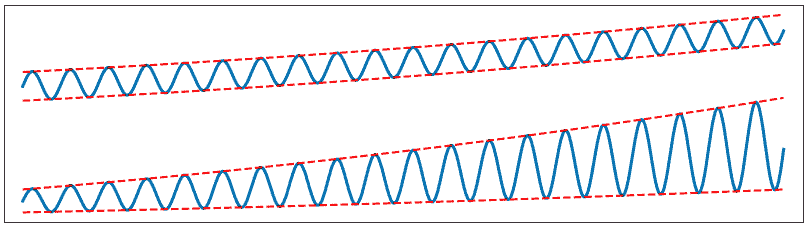

图 5.1 – 加法季节性与乘法季节性

上曲线展示了加法季节性——追踪季节性边界的虚线是平行的，因为季节性的幅度没有变化，只有趋势在变化。然而，在下曲线中，这两条虚线并不平行。当趋势低时，季节性引起的扩散低；但当趋势高时，季节性引起的扩散高。这可以用乘法季节性来建模。

让我们通过使用上一章中引入的 Air Passengers 数据集来具体看一下。这些数据记录了从 1949 年到 1960 年每月的商业航空公司乘客数量。我们首先将使用 Prophet 的默认 `seasonality_mode` 来建模它，即我们在 Mauna Loa 示例中使用的加法模式，然后将其与乘法模式进行对比。

我们将像上一章那样开始，导入必要的库并将数据加载到 DataFrame 中：

```py
import pandas as pd
import matplotlib.pyplot as plt
from prophet import Prophet
df = pd.read_csv('AirPassengers.csv')
df ['Month'] = pd.to_datetime(df['Month'])
df.columns = ['ds', 'y']
```

让我们继续构建我们的模型。我将这个命名为 `model_a` 以表明它是一个加法模型；下一个模型我将命名为 `model_m`，表示乘法模型：

```py
model_a = Prophet(seasonality_mode='additive',
                  yearly_seasonality=4)
model_a.fit(df)
forecast_a = model_a.predict()
fig_a = model_a.plot(forecast_a)
plt.show()
```

当我们实例化 Prophet 对象时，我们明确声明 `seasonality_mode` 为 `'additive'` 以便清晰。默认情况下，如果没有声明 `seasonality_mode`，Prophet 将自动选择 `'additive'`。此外，请注意我们设置了 `yearly_seasonality=4`。这仅仅设置了曲线的**傅里叶阶数**，但现在不用担心这个问题 – 我们将在下一节中讨论它。

在创建 Prophet 模型后，我们就像在 Mauna Loa 示例中那样拟合并预测它，然后绘制了预测图。注意，然而，在这个例子中，我们从未创建一个未来的 DataFrame – 如果没有将未来的 DataFrame 发送到 `predict` 方法，它将仅创建在 `fit` 方法中接收到的历史数据的预测值，但没有未来的预测值。由于我们只对查看 Prophet 如何处理季节性感兴趣，我们不需要未来的预测。

这里是我们刚刚创建的图：

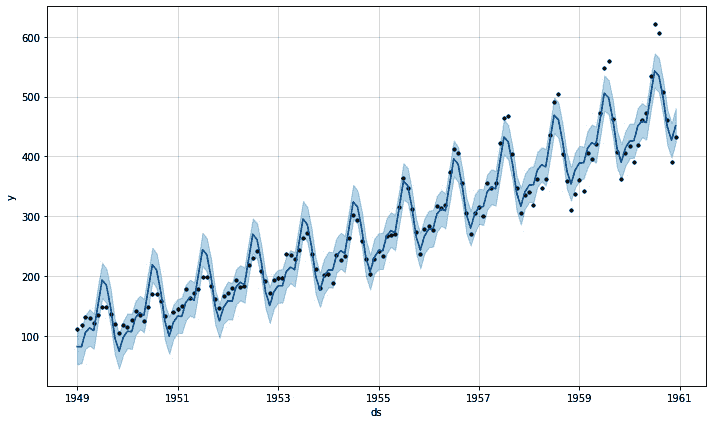

图 5.2 – 具有加法季节性的航空旅客

如您所见，在数据早期，在 **1949**、**1951** 和 **1952** 年，Prophet 的预测值（实线）具有比数据（点）指示更极端的季节性波动。在序列后期，在 **1958**、**1959** 和 **1960** 年，Prophet 的预测季节性比数据指示的更不极端。数据的季节性分布正在增加，但我们预测它将是恒定的。这就是在需要乘法季节性时选择加法季节性的错误。让我们再次运行模型，但这次我们将使用乘法季节性：

```py
model_m = Prophet(seasonality_mode='multiplicative',
                  yearly_seasonality=4)
model_m.fit(df)
forecast_m = model_m.predict()
fig_m = model_m.plot(forecast_m)
plt.show()
```

我们与上一个例子中的操作完全相同，只是这次我们将 `seasonality_mode` 设置为 `'multiplicative'`。我们可以在我们生成的图中看到这种变化：

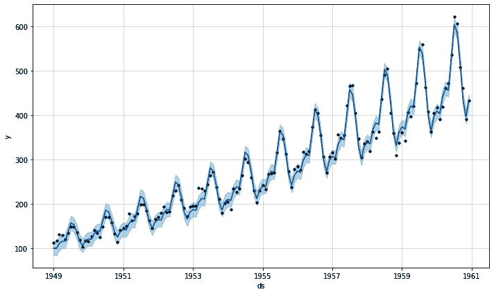

图 5.3 – 具有乘法季节性的航空旅客

这是一个更好的拟合！现在，Prophet 与整体趋势的增长匹配了季节性波动的增长。此外，比较 *图 5*.*2* 和 *图 5*.*3*（围绕实线的浅色区域）之间的误差估计。当 Prophet 尝试将加法季节性拟合到包含乘法季节性的数据序列时，它显示更宽的不确定性区间。Prophet 知道在先前的模型中拟合不佳，并且对其预测不太确定。

这里还有最后一件事我想让你注意。让我通过绘制成分来展示给你看：

```py
fig_a2 = model_a.plot_components(forecast_a)
plt.show()
```

这张图展示了 `model_a` 的加法季节性成分：

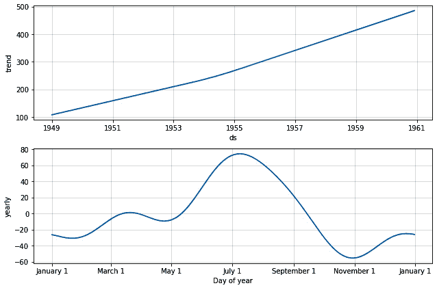

图 5.4 – 带有加法季节性的组件图

现在，让我们绘制`model_m`的组件图：

```py
fig_m2 = model_m.plot_components(forecast_m)
plt.show()
```

将以下图表与*图 5.4*中显示的图表进行比较：

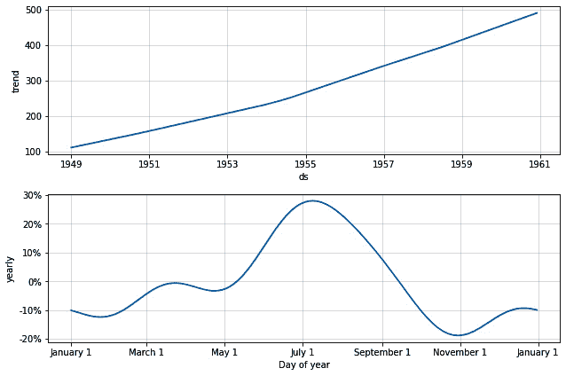

图 5.5 – 带有乘法季节性的组件图

它们看起来几乎完全相同。趋势相同，从**1949 年**开始略高于**100**，到**1961 年**时刚好低于**500**，在**1954 年**有一个轻微的转折点，趋势加速。年季节性表现正如我们所预期的那样，夏季乘客数量达到峰值，圣诞节假期和春季假期的局部峰值较小。两个图表之间的区别在于季节性曲线的*Y*轴。

在加法模型中，*Y*轴的值是绝对数值。在乘法模型中，它们是百分比。这是因为，在加法季节性模式中，季节性被建模为趋势的附加因素，值只是简单地加到或从它中减去。但在乘法季节性模式中，季节性代表相对于趋势的相对偏差，因此季节性效应的大小将取决于趋势在该点预测的值；季节性效应是趋势的百分比。

小贴士

当你的数据表示随时间变化的某种计数，例如每月的航空公司乘客计数时，你通常会使用乘法季节性来建模。使用加法季节性可能会导致预测出负值（例如，每月负 100 名乘客是不可能的），而乘法季节性只会将值缩小到接近零。

选择加法或乘法季节性可能一开始有点棘手，但如果你只是记住季节性可能是一个绝对因素或相对因素，并观察数据是否具有恒定的*分布*，你应该不会在模型上遇到任何麻烦。

现在你已经了解了这两种季节性模式之间的区别，让我们将其应用于一个新的数据集，Divvy 自行车共享，并继续在 Prophet 中学习季节性。

在本书的许多例子中，我们将使用芝加哥 Divvy 自行车共享计划的数据来创建示例。在前一章中，我们使用了 Divvy 的小时数据，但在这个部分，我们将使用每日数据。

小贴士

我们在*第四章*中使用了小时级的 Divvy 数据，*处理非每日数据*，以展示*每日*成分图以及如何处理数据中的常规间隔；在本章中，当我们查看条件季节性时，我们还将再次使用小时级数据。但除此之外，在本书的其余部分，我们将使用每日的 Divvy 数据，如下所示。在这些情况下，我们不需要小时级数据的额外粒度，改为每日数据可以将处理时间从分钟减少到秒。此外，每日数据集还包含相关的天气和温度列，这些列在小时级数据集中缺失，我们将在*第九章*中包括*额外的回归因子*。

下面是每日 Divvy 数据的样子：

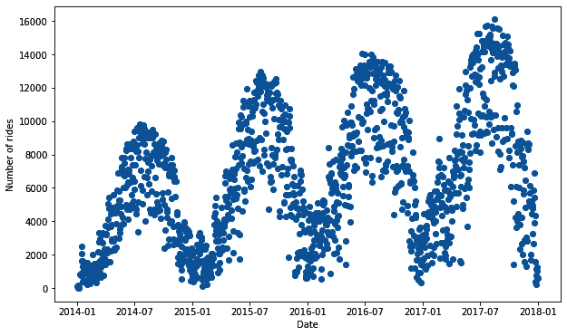

图 5.6 – Divvy 每日骑行次数

这是一种计数数据，因为它代表了每天的骑行次数，你也可以看到季节性的幅度随着趋势的增长而增长（如果我们从*图 5.1*中绘制那些虚线，追踪数据的上下界限，线条将会发散）。正如我们刚刚学到的，这些都是乘法季节性的指示，所以让我们确保在实例化我们的模型时设置这一点。在先前的例子中，我们已经导入了必要的 Python 库，因此我们可以从这个例子开始加载数据。

此数据集包含一些额外的天气和温度条件列，我们将使用这些列在*第九章*中丰富我们的预测，包括*额外的回归因子*。一旦我们加载了数据，我们就可以看到这些额外的列：

```py
df = pd.read_csv('divvy_daily.csv')
df.head()
```

在 Jupyter 笔记本或 IPython 实例中运行此命令将显示以下 DataFrame：

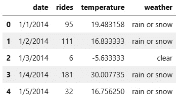

图 5.7 – Divvy DataFrame

目前，我们只需要`date`和`rides`列。让我们将这些列加载到我们的 Prophet DataFrame 中，并使用适当的列名。我们将在*第九章*中处理`weather`和`temperature`，包括*额外的回归因子*：

```py
df = df[['date', 'rides']]
df['date'] = pd.to_datetime(df['date'])
df.columns = ['ds', 'y']
```

如前所述，在调用`fit`方法之前，我们需要创建 Prophet 类的实例。请注意，我们将`seasonality_mode`设置为`'multiplicative'`，因为我们注意到在绘制原始数据时，季节性波动随着趋势的增加而增长。在拟合模型后，我们将再次创建一个包含 1 年预测的未来 DataFrame，然后调用`predict`来创建`forecast` DataFrame 并将其发送到`plot`方法：

```py
model = Prophet(seasonality_mode='multiplicative')
model.fit(df)
future = model.make_future_dataframe(periods=365)
forecast = model.predict(future)
fig = model.plot(forecast)
plt.show()
```

运行上述代码后，你应该会发现 Prophet 创建了以下图表：


图 5.8 – Divvy 预测

我们可以看到，预测趋势确实随着实际数据增加，年度季节性也与之匹配。现在，让我们绘制我们的组件图，看看它们揭示了什么：

```py
fig2 = model.plot_components(forecast)
plt.show()
```

如您在输出图中所见，Prophet 已将此数据集中的三个组件隔离出来：**趋势**、**每周**季节性和**年度**季节性：

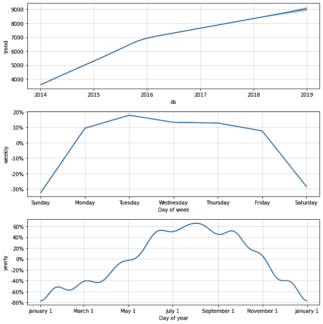

图 5.9 – Divvy 组件图

默认情况下，Prophet 会识别一个包含至少 2 年完整数据的`'ds'`列。`'ds'`列少于 1 天（在此情况下不适用）。

趋势在前两年内线性增长相对较快，但随后弯曲并略微放缓，剩余两年，预测年份继续遵循这一斜率。我们可以看到，Divvy 网络在此期间的平均使用量从 2014 年的每天约 3500 次增长到 2018 年底的每天约 8500 次。

每周的季节性表明，周末每天的骑行次数大约减少了 30%——也许所有这些骑行者都是上班族——而工作日的骑行次数比趋势高 10-20%。这符合我们的直觉，即工作日和周末可能表现出不同的模式。

现在，观察年度季节性可以发现，夏季的骑行次数比趋势高约 60%，而冬季的骑行次数低 80%。同样，这也符合直觉。那些上班族在天气寒冷和下雨时会开车或乘坐公共交通。

您会注意到这个年度季节性曲线相当**波动**，就像我们在上一章中注意到的小时 Divvy 数据一样。您可能期望得到一条更平滑的曲线，而不是有这么多拐点的曲线。这是由于我们的年度季节性过于灵活——它有太多的**自由度**或太多的数学参数控制曲线。在 Prophet 中，控制季节性曲线的参数数量称为**傅里叶阶数**。

# 使用傅里叶阶数控制季节性

季节性是 Prophet 工作原理的核心，傅里叶级数用于模拟季节性。为了理解傅里叶级数是什么，以及傅里叶阶数如何与之相关，我将使用线性回归的一个类比。

你可能知道，在线性回归中增加多项式方程的阶数总会提高你的拟合优度。例如，简单的线性回归方程是 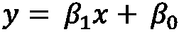 ，其中 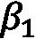 是直线的斜率， 是 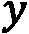 截距。将你的方程阶数增加到，比如说，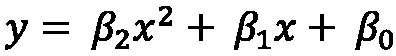 ，总会提高你的拟合，但风险是过拟合和捕捉噪声。你可以通过任意增加多项式方程的阶数来达到一个 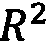 值为 1（完美拟合）。以下图示说明了高阶拟合开始变得相当不切实际和过拟合的情况：

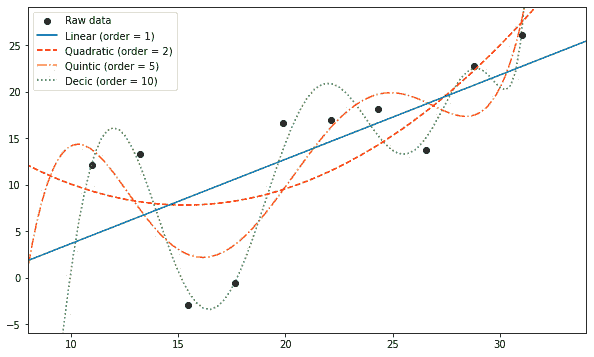

图 5.10 – 高阶多项式线性回归

**线性**实线确实正确地得到了数据的上升趋势，但它似乎遗漏了一些细微的细节。**二次**虚线是一个更好的拟合（实际上，这些数据是从具有随机噪声的二次方程中模拟出来的）。然而，**五次**和**十次**曲线正在对随机噪声进行过拟合。如果我们从这个分布中采样更多的数据点，它们很可能会使**五次**和**十次**曲线剧烈变化以适应新的数据，而**线性**和**二次**曲线只会略有偏移。我们可以说多项式的阶数与曲线可以有多少个弯曲来拟合数据成正比。

傅里叶级数简单地说就是正弦波的求和。通过改变这些单个正弦波的形状——振幅，即波的高度；周期，即从峰值到峰值的距离；以及相位，即波沿长度的哪个位置开始一个周期——我们可以创建一个新的非常复杂的波形。

在线性域中，我们改变多项式的阶数来控制曲线的灵活性，我们改变 *β* 系数来控制曲线的实际形状。同样，在周期域中，我们改变傅里叶级数中的正弦波数量——这就是傅里叶阶数——来控制最终曲线的灵活性，而我们（或者更准确地说，Prophet 的拟合方程）改变单个波的振幅、周期和相位来控制我们最终曲线的实际形状。你可以在以下图中看到这个求和是如何工作的：

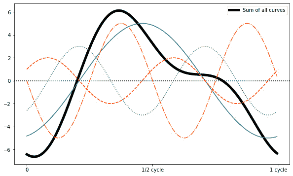

图 5.11 – 四阶傅里叶级数

实线简单地是四个正弦波各自的和。通过在模型中任意增加傅里叶阶数，我们总能达到任何一组数据的完美拟合。但就像在线性域中一样，这种方法不可避免地会导致过拟合。

记得在*图 5**.9*中，当我们绘制 Divvy 预测的组成部分时，年度季节性过于波动？这是傅里叶阶数过高造成的。默认情况下，Prophet 使用 10 阶数拟合年度季节性，3 阶数拟合周季节性，如果提供了子日数据，则使用 4 阶数拟合日季节性。通常，这些默认值工作得非常好，不需要调整。然而，在 Divvy 的情况下，我们需要降低年度季节性的傅里叶阶数以更好地拟合数据。让我们看看如何做到这一点。

我们已经从上一个示例中导入了必要的库并将数据加载到我们的`df` DataFrame 中，因此为了继续，我们需要实例化一个新的 Prophet 对象，并带有修改后的年度季节性。和之前一样，我们将季节性模式设置为乘法，但这次我们将包括`yearly_seasonality`参数并将其设置为`4`。这就是我们设置傅里叶阶数的地方。

您可以自己尝试不同的值；我发现`4`在大多数情况下提供了一个干净的曲线，没有太多的灵活性，这正是我所需要的。同样，如果我们想改变`weekly_seasonality`或`daily_seasonality`的傅里叶阶数，我们也会在这里进行。

在实例化我们的模型后，我们只需将其拟合到数据中即可绘制季节性。在这种情况下不需要预测：

```py
model = Prophet(seasonality_mode='multiplicative',
                yearly_seasonality=4)
model.fit(df)
```

我们将在这里使用一个新的函数来绘制仅包含年度成分的图表 – 来自 Prophet 的`plot`包中的`plot_yearly`函数。我们首先需要导入它：

```py
from prophet.plot import plot_yearly
```

注意，还有一个`plot_weekly`函数，它的工作方式几乎相同。这两个函数都需要第一个参数是模型；这里，我们还将包括可选的图形大小参数，以便它与*图 5**.9*中包含的我们之前的图表的刻度相匹配：

```py
fig3 = plot_yearly(model, figsize=(10.5, 3.25))
plt.show()
```

将此输出与*图 5**.9*中的年度季节性曲线进行比较。

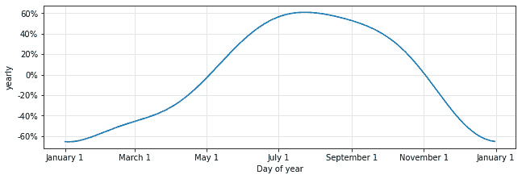

图 5.12 – 使用傅里叶阶数为 4 的 Divvy 年度季节性

我们成功消除了之前尝试中的波动，同时仍然保持了季节性的清晰形状。这似乎更加合理！

到目前为止，我们只使用过 Prophet 的默认季节性。然而，有许多周期性数据集的周期并不完美地落在年度、周或日季节性分类中。Prophet 正是为了这个目的支持自定义季节性的。让我们在下一节中查看它们。

# 添加自定义季节性

到目前为止，我们使用的唯一季节性是 Prophet 的默认值：年度、周和日。但没有任何理由限制我们自己只使用这些季节性。如果您的数据包含一个比 365.25 天的年度周期、7 天的周周期或 1 天的日周期更长或更短的周期，Prophet 可以让您轻松地自己建模这种季节性。

一个非标准季节性的好例子是太阳黑子的 11 年周期。太阳黑子是太阳表面暂时表现出大幅降低温度的区域，因此看起来比周围区域要暗得多。

大约从 1609 年开始，伽利略·伽利莱开始系统地观测太阳黑子，在过去的 400 多年里，这一现象一直被持续记录。太阳黑子代表了任何自然现象中连续记录时间最长的时序数据。通过这些观测，科学家们确定了一个 11 年的准周期循环，在此期间太阳黑子出现的频率会变化。他们称之为“准周期”是因为循环长度似乎在周期之间有所变化——并不是每次都是完美的 11 年。然而，平均周期长度是 11 年，因此我们将使用这个数字来建模。

**太阳影响数据分析中心**（**SIDC**），位于布鲁塞尔的比利时皇家天文台的部门，在其**世界数据中心——太阳黑子指数和长期太阳观测**（**WDC-SILSO**）项目中提供了从 1750 年到现在的太阳黑子活动数据集。这个数据集将很好地展示如何向 Prophet 添加新的季节性。我们将首先加载数据：

```py
df = pd.read_csv('sunspots.csv',\
                 usecols=['Date', 'Monthly Mean Total\
                          Sunspot Number'])
df['Date'] = pd.to_datetime(df['Date'])
df.columns = ['ds', 'y']
```

让我们可视化这些数据，看看它的样子：

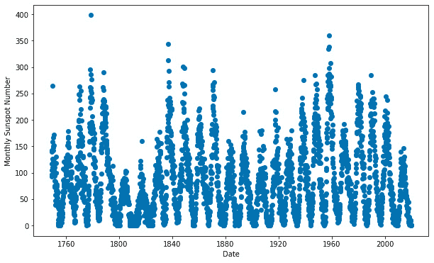

图 5.13 – 每月太阳黑子数量

数据看起来相当嘈杂；似乎有几个异常值，循环并不完全干净。每个周期的峰值变化很大。为了看看 Prophet 如何处理这些数据，我们首先需要实例化我们的模型。这是计数数据，因此我们将选择乘法季节性。

我们还将考虑的一个因素是，太阳如此之大，以至于在我们围绕我们的恒星轨道运行时几乎感觉不到地球引力的微小牵引；因此，太阳根本不会体验到我们所说的年季节性。我们将指示 Prophet 不要尝试拟合年季节性。由于我们提供的是月度数据，Prophet 不会尝试拟合周或日季节性。

在本章前面，我们学习了如何通过传递整数给`yearly_seasonality`参数来调整年季节性的傅里叶阶数。这是我们用来关闭默认季节性的参数；只需传递一个布尔值即可。我们传递`yearly_seasonality=False`来指示 Prophet 不要拟合年季节性：

```py
model = Prophet(seasonality_mode='multiplicative',
                yearly_seasonality=False)
```

一旦我们的模型被实例化，我们就可以添加季节性。我们可以使用`add_seasonality`方法来做这件事。此方法要求我们传递季节性的名称（我们将称之为`'11-year cycle'`），周期（11 年乘以 365.25 天，因为`period`是以天为单位的），以及傅里叶阶数（在这种情况下我们将使用`5`，但请随意实验）。这就是所有内容看起来是什么样的：

```py
model.add_seasonality(name='11-year cycle',
                      period=11 * 365.25,
                      fourier_order=5)
```

说明周期可能会有些棘手；只需记住，它总是按天数计算。因此，周期长于一天的季节性将具有大于 1 的数字，而周期短于一天的季节性将具有小于 1 的周期。

这个例子中的其余部分与之前的例子完全一样；我们在训练 DataFrame 上拟合，创建一个未来 DataFrame，然后对其进行预测：

```py
model.fit(df)
future = model.make_future_dataframe(periods=240, freq='M')
forecast = model.predict(future)
fig2 = model.plot_components(forecast)
plt.show()
```

让我们检查组件图，看看我们创建了什么：

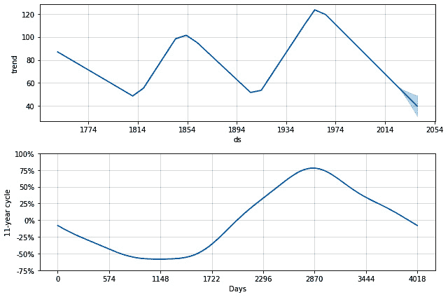

图 5.14 – 太阳黑子成分图

该图仅显示趋势和 11 年周期，这正是我们预期的。趋势呈锯齿状；事实上，科学家将**1814**年左右的低谷称为*达尔顿最小值*，以纪念英国气象学家约翰·达尔顿。20 世纪 50 年代的峰值被称为*现代最大值*。但我们对这里的 11 年周期感兴趣。

对于这个不规则周期，Prophet 以天为单位绘制*x*轴，因此每个刻度比前一个刻度晚约 1.5 年。整个周期确实是 11 年。我们可以看到，低点比高点略*平坦*，并且比平均值少约 60%的太阳黑子。高点比平均值多约 80%的太阳黑子。

要查看模型当前的所有季节性以及控制该季节性的参数，只需调用模型的`seasonalities`属性：

```py
model.seasonalities
```

这会输出一个字典，其中键是季节性的名称，值是参数。在这个例子中，我们只有一个季节性，这是输出字典：

```py
OrderedDict([('11-year cycle',
              {'period': 4017.75,
               'fourier_order': 5,
               'prior_scale': 10.0,
               'mode': 'multiplicative',
               'condition_name': None})])
```

重要提示

当指定季节性的周期时，它总是按天数指定。因此，10 年的季节性将具有 10（年）x 365.25（每年天数）= 3652.5 天的周期。如果数据按分钟测量，则每小时季节性将是 1（天）/ 24（每天小时数）= 0.04167 天。

注意不要将季节性的周期与`make_future_dataframe`中使用的周期混淆。季节性的周期总是按天数指定，而`make_future_dataframe`中的周期由`freq`参数指定。

如果 Prophet 中不存在数据中的季节性，则添加季节性可能会导致 Prophet 拟合速度非常慢，因为它在找不到模式的情况下会努力寻找模式。这可能会损害你的预测，因为 Prophet 最终会将不存在的季节性拟合到噪声中。然而，你可能经常添加的其他季节性包括如果数据按分钟测量，则添加每小时季节性，如下所示：

```py
model.add_seasonality(name='hourly',
                      # an hour is 0.04167 days
                      period=1 / 24,
                      # experiment with this value
                      fourier_order=5)
```

季节性业务周期将按以下方式创建：

```py
model.add_seasonality(name='quarterly',
                      # a quarter is 91.3125 days
                      period=365.25 / 4
                      # experiment with this value
                      fourier_order=5)
```

这就是如何添加自定义季节性的！在本章中，我们将更详细地使用这个`add_seasonality`方法，从下一节关于依赖于其他因素的季节性开始。

# 添加条件季节性

假设你在一个大学城的一家公用事业公司工作，并被要求预测下一年度的电力使用情况。电力使用在一定程度上将取决于城镇的人口，作为一个大学城，数千名学生只是临时居民！你如何设置 Prophet 来处理这种情况？条件季节性就是为了这个目的而存在的。

条件季节性是指仅在训练和未来 DataFrames 的部分日期中存在的那些。一个**条件季节性**必须有一个比其活跃周期更短的周期。所以，例如，如果只有几个月是活跃的，那么有一个只活跃几个月的年度季节性就没有意义。

在大学城预测电力使用需要你设置每日或每周季节性——甚至可能是两者；根据使用模式，在学生返回家乡的夏季月份设置一个每日/每周季节性，以及全年剩余时间的另一个每日/每周季节性。理想情况下，条件季节性在每次活跃时至少应有两个完整的周期。

要了解如何构建条件季节性，我们将回到我们在上一章中探索的小时 Divvy 数据。基于我们在那个例子中观察到的每周季节性，我们知道周末的乘客量比周中显著较低，这表明大多数乘客是在上下班途中。

我们在每日季节性图中看到，骑手在早上 8 点和晚上 6 点有使用高峰，这是在上下班高峰时段。这可能会让你怀疑，整个白天的使用模式在周中和周末可能会有不同的模式。也就是说，我们早上 8 点看到的高峰可能。

在周末，上午 6 点和下午 6 点以及中午的低谷都将消失，整个白天的活动水平更加均匀。为了测试这个假设，让我们使用周末和周中不同的每日季节性来构建一个预测模型。

添加这种条件季节性的基本步骤是在你的训练 DataFrame 中添加新的布尔列（稍后，在未来的 DataFrame 中添加匹配的列），表示该行是周末还是周中。然后，禁用默认的每周季节性，并添加两个新的每周季节性，指定那些新的布尔列作为条件。让我们看看如何做这件事。

我们已经加载了必要的库，所以首先，我们需要使用 Divvy 小时数据创建我们的 Prophet DataFrame：

```py
df = pd.read_csv('divvy_hourly.csv')
df['date'] = pd.to_datetime(df['date'])
df.columns = ['ds', 'y']
```

现在，这是我们确定季节性条件的地方。让我们创建一个函数，如果给定的日期是周末则输出`True`，否则输出`False`。然后，我们将使用`pandas`的`apply`方法创建一个表示周末的新列，并使用波浪号（`~`）运算符为另一个表示周中的新列取反。最后，让我们输出 DataFrame 的这一点的第一行，这样我们就可以看到我们得到了什么：

```py
def is_weekend(ds):
    date = pd.to_datetime(ds)
    return (date.dayofweek == 5 or date.dayofweek == 6)
df['weekend'] = df['ds'].apply(is_weekend)
df['weekday'] = ~df['ds'].apply(is_weekend)
df.head()
```

如果你的函数正确地识别了日期，你应该会看到这个输出：

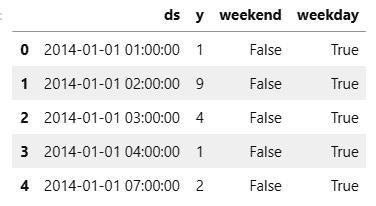

图 5.15 – Divvy 条件季节性数据框

2014 年 1 月 1 日是星期三，所以输出符合我们的预期。接下来，我们需要实例化我们的模型。利用本章前面学到的知识，我们将季节性模式设置为 `multiplicative`，因为 Divvy 数据代表计数值。我们还将年季节性和周季节性的傅里叶阶数都设置为 `6`；我的测试表明在这个数据集上这是一个很好的值。最后，因为我们正在添加条件每日季节性，所以我们将禁用默认的每日季节性：

```py
model = Prophet(seasonality_mode='multiplicative',
                yearly_seasonality=6,
                weekly_seasonality=6,
                daily_seasonality=False)
```

要创建条件季节性，我们将使用我们在模拟太阳黑子周期时学到的相同的 `add_seasonality` 方法，但在这个案例中，我们将使用可选的 `condition_name` 参数来指定新的季节性是条件性的。

`condition_name` 参数必须传递训练数据框中列的名称，并包含布尔值以标识要应用季节性的行 – 我们的 `weekend` 和 `weekday` 列。就像我们在太阳黑子示例中所做的那样，我们还需要命名季节性并标识周期和傅里叶阶数：

```py
model.add_seasonality(name='daily_weekend',
                      period=1,
                      fourier_order=3,
                      condition_name='weekend')
model.add_seasonality(name='daily_weekday',
                      period=1,
                      fourier_order=3,
                      condition_name='weekday')
```

模型设置到此为止！接下来，我们将像以前一样在训练数据上拟合模型并创建 `future` 数据框，现在我们使用的是每小时数据，所以要注意将频率设置为 *hourly*。设置条件季节性的最后一步是确定在 `future` 数据框中条件将应用在哪里。

我们已经创建了 `is_weekend` 函数并将其应用于我们的训练数据框 `df`。我们只需在调用 `predict` 之前重复该过程于 `future` 数据框上以创建我们的预测：

```py
model.fit(df)
future = model.make_future_dataframe(periods=365 * 24,
                                     freq='h')
future['weekend'] = future['ds'].apply(is_weekend)
future['weekday'] = ~future['ds'].apply(is_weekend)
forecast = model.predict(future)
```

我们将两个条件季节性命名为 `'daily_weekend'` 和 `'daily_weekday'`，所以让我们导入我们在上一章中发现的 `plot_seasonality` 函数，并绘制这两个季节性：

```py
from prophet.plot import plot_seasonality
fig3 = plot_seasonality(model, 'daily_weekday',
                        figsize=(10, 3))
plt.show()
fig4 = plot_seasonality(model, 'daily_weekend',
                        figsize=(10, 3))
plt.show()
```

如果一切运行正确，你应该会有两个新的图表：

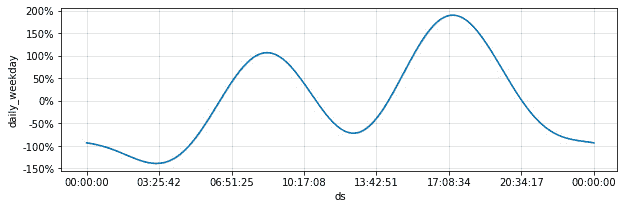

图 5.16 – 每日工作日成分图

在工作日，趋势与我们使用默认每日季节性时看到的情况非常相似 – 早上 8 点左右有一个峰值，下午 6 点左右另一个峰值，午夜过后有一个小峰。尽管如此，我们假设周末将看到一个非常不同的模式。让我们看看图表来了解：

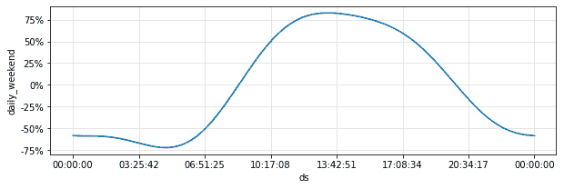

图 5.17 – 每日周末成分图

的确，我们看到了差异！正如你的直觉所暗示的，在周末，Divvy 骑行者比在工作日更晚开始，直到中午逐渐增加客流量，然后逐渐减少到午夜。在工作日我们没有看到中午的低谷。

到目前为止，在本章中，您使用了 Air Passengers 数据来学习加性和乘性季节性的区别。后来，您使用了 Divvy 数据来学习如何添加自定义季节性和条件季节性。您还使用了 Divvy 数据来发现傅里叶阶数，并学习了如何控制季节性曲线的灵活性。然而，Prophet 还为您提供了一个控制季节性的杠杆：正则化。

# 正则化季节性

通常，在用机器学习解决问题时，涉及的数据非常复杂，一个简单的模型往往不足以捕捉到要找到的模式的全部微妙之处。简单的模型往往会**欠拟合**数据。相比之下，一个更复杂的模型，具有许多参数和很大的灵活性，可能会倾向于**过拟合**数据。使用更简单的模型并不总是容易，或者可能。在这些情况下，**正则化**是一种很好的技术，可以用来控制过拟合。

Prophet 是一个非常强大的预测工具，如果不加注意，有时很容易过拟合数据。这就是为什么理解 Prophet 的正则化参数非常有用的原因。

小贴士

如果一个模型没有完全捕捉到输入特征和输出特征之间的真实关系，那么它就被说成是*欠拟合*。在训练数据和任何未见过的测试数据上的性能都较低。

如果一个模型超出了捕捉真实关系的范围，开始捕捉数据噪声中的随机趋势，那么它就被说成是*过拟合*。在训练数据上的性能可能非常高，但在未见过的测试数据上的性能可能很低。

一个拟合良好的模型将在训练数据和测试数据上表现同样好。

正则化是一种通过迫使模型变得不那么灵活来控制过拟合的技术。例如，在*图 5.18*中，我模拟了一组带有随机噪声的点（我使用的真实关系是![img/019630_05_F07.png]）并使用 8 次多项式回归拟合了两条线（实际上，你很少会选择如此高的阶数作为回归模型；我在这里只是为了夸张这个观点）。一条线完全没有正则化，而另一条线是：

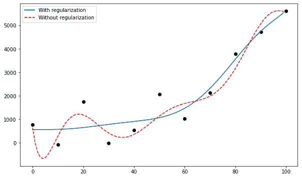

图 5.18 – 正则化效果

如您在图中所示，未正则化的线是过拟合的，它在尝试拟合噪声的同时围绕着真实关系摇摆。相比之下，通过正则化，线的灵活性受到限制，并被迫绘制出一条更加平滑的曲线。由于真实曲线基本上是![img/019630_05_F08.png]，很明显，正则化的线，尽管仍然不完美，但在近似关系方面做得更好，并且在新数据上表现会更好。

完整的 Prophet 包有多个可调整的正则化参数。对于季节性，该参数称为先验尺度。

在统计学中，你可能有一个不确定的量，你打算找到它的值。这个量的 **先验概率分布**，通常简称为先验，是在学习额外信息之前你期望的值的概率分布。

例如，假设我让你猜测一个特定男性的人类身高。在你的脑海中，你想象所有可能的男性身高。这个身高范围是先验概率分布。接下来，我告诉你这个男性是 NBA 篮球运动员。你知道篮球运动员通常比普通男性高得多，所以你更新这个分布，使其更偏向于高身高，因为我所提供的额外信息更好地帮助你猜测。

先验是你的起点，在你收到额外信息之前你相信是正确的。让我们学习如何将这个想法应用到 Prophet 的季节性中。

## 全局季节性正则化

应用季节性正则化的第一种方式是全局性的，这会影响模型中所有季节性的同等程度。`seasonality_prior_scale` 是你的 Prophet 模型实例的一个属性，并在你实例化模型时设置。如果你没有设置它，默认值将是 `10`。减少这个数值将应用更多的正则化，这将控制你的模型季节性。让我们看看实际效果。

在这个例子中，我们将使用 Divvy 每日数据，因此我们需要首先将其加载到我们的 Prophet DataFrame 中，因为必要的库应该已经从之前的例子中加载：

```py
df = pd.read_csv('divvy_daily.csv')
df = df[['date', 'rides']]
df['date'] = pd.to_datetime(df['date'])
df.columns = ['ds', 'y']
```

现在，我们需要实例化我们的模型，将季节性模式设置为 `multiplicative`。在了解傅里叶阶数时，你使用默认的 `seasonality_prior_scale` 值 `10` 对这个数据集进行了预测。所以，这次我们将先验尺度设置为 `0.01`。我们还发现，使用傅里叶阶数 `4` 更好地模拟了年度季节性，因此我们也将它设置为 `4`。你可以参考 *图 5.8* 和 *图 5.9* 来查看未正则化的模型以进行比较：

```py
model = Prophet(seasonality_mode='multiplicative',
                yearly_seasonality=4,
                seasonality_prior_scale=.01)
```

设置正则化后，剩下的工作就是完成模型，就像我们之前做的那样：

```py
model.fit(df)
future = model.make_future_dataframe(periods=365)
forecast = model.predict(future)
fig = model.plot(forecast)
plt.show()
fig2 = model.plot_components(forecast)
plt.show()
```

首先，我们将查看预测，然后是组件：

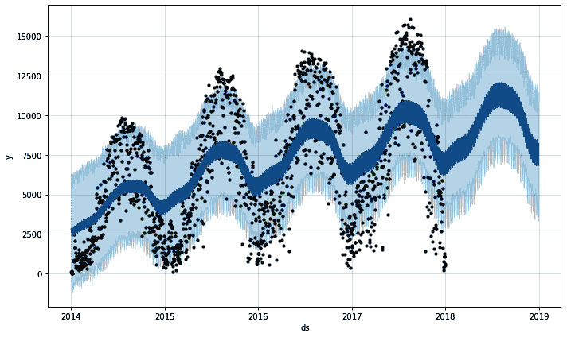

图 5.19 – 正则化预测

将 *图 5.19* 与 *图 5.8* 进行比较显示，我们的预测中的季节性波动确实已经减弱。年度季节性和周季节性都显示出更少的波动。不过，两个模型之间的不确定性区间大致相同，因为现在数据中的方差现在由 Prophet 模型的噪声项而不是季节性项来处理。

现在，让我们看看组件图：

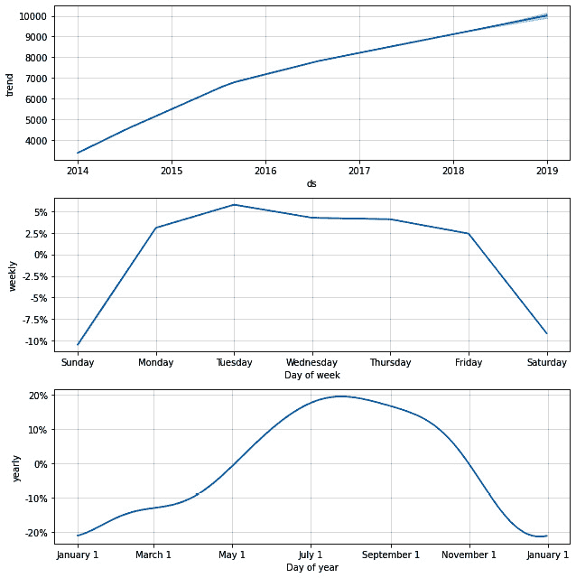

图 5.20 – 正则化组件图

将此图与*图 5.9*进行比较，我们可以看到趋势非常相似。我们只限制了季节性，而没有限制趋势。趋势确实有所变化（峰值略高），因为 Prophet 试图通过趋势捕捉一些季节性变化，但形状几乎相同。每周和年度季节性看起来相同，但它们的*y*轴显示，幅度已经减少到其正则化水平的三分之一到四分之一。这就是季节性正则化的效果：它减少了曲线值的幅度。

为了说明不同季节性先验尺度的效果，让我们比较使用不同先验尺度建模的此数据集的年度和每周季节性曲线。首先，这是年度季节性图：

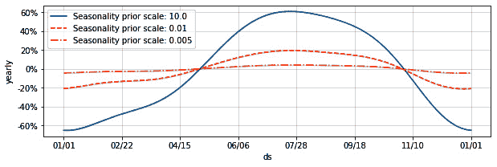

图 5.21 – 不同先验尺度的年度季节性

这是每周季节性图：

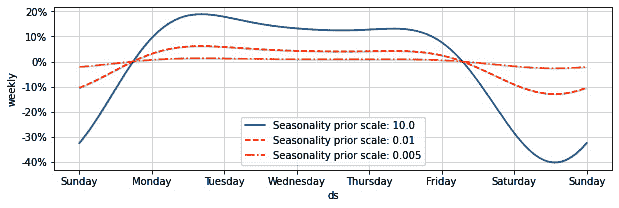

图 5.22 – 不同先验尺度的每周季节性

两个图中的实线是默认的`10`倍尺度；虚线和虚点线显示正则化量的增加。而修改傅里叶阶数有助于通过减少允许曲线弯曲的数量来控制季节性曲线，而修改季节性先验尺度有助于通过减少它可以实现的变化量来控制季节性。

在本节中，您学习了如何同时正则化所有季节性。接下来，您将学习如何单独正则化季节性。

## 本地季节性正则化

假设您对默认正则化设置下的年度季节性曲线感到满意，但您的每周曲线过于极端且过拟合。在这种情况下，您可以使用`add_seasonality`方法创建一个新的具有自定义先验尺度的每周季节性。

让我们继续并实例化一个新的模型，再次使用`乘法`季节性和应用于年度季节性的傅里叶阶数`4`。不过，这次我们将添加一个新的每周季节性，所以让我们在实例化时将其设置为`False`：

```py
model = Prophet(seasonality_mode='multiplicative',
                yearly_seasonality=4,
                weekly_seasonality=False)
```

如您在*添加自定义季节性*部分所学，我们现在将添加一个周期为`7`天的季节性，并将其命名为`'weekly'`。我们对默认的每周傅里叶阶数`4`感到满意，所以我们将再次使用它，但我们需要比默认值更多的正则化，因此我们将使用`prior_scale`参数将其设置为`0.01`：

```py
model.add_seasonality(name='weekly',
                      period=7,
                      fourier_order=4,
                      prior_scale=0.01)
```

现在，正如我希望这已经成为您的第二天性，我们将拟合模型并在未来的 DataFrame 上进行预测。这次我们只绘制组件：

```py
model.fit(df)
future = model.make_future_dataframe(periods=365)
forecast = model.predict(future)
fig2 = model.plot_components(forecast)
plt.show()
```

您应该看到这个图，它与*图 5.20*几乎相同：

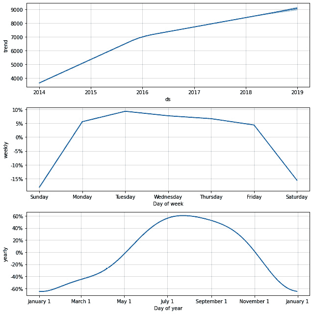

图 5.23 – 每周正则化成分图

你现在会看到未正则化的年季节性的幅度与*图 5**.9*的幅度相匹配，但正则化的周季节性减少了大约一半，正如预期的那样。你可以通过重复调用`add_seasonality`来为所有的季节性应用不同的正则化强度。这些先验尺度的合理值从大约 10 到大约 0.01 不等。

# 摘要

季节性确实是 Prophet 的核心。这一章涵盖了大量的内容；你在这里学到的基础知识将在本书剩余的章节中得到应用。实际上，你几乎在 Prophet 中构建的任何模型都将考虑季节性，而许多即将到来的章节涵盖了可能或可能不适用于你特定问题的特殊情况。

你通过学习加性和乘性季节性的区别，以及如何识别你的数据集特征是其中之一开始了这一章。然后我们简要讨论了傅里叶级数，并展示了如何通过允许更多的或更少的自由度在其路径上弯曲来控制季节性的傅里叶阶数，从而构建一个非常复杂的周期曲线。使用这些想法，你学习了如何通过允许更多的或更少的自由度在其路径上弯曲来控制季节性的形状。

接下来，你学习了太阳黑子 11 年周期的建模，并学会了如何添加自定义季节性。当你学习如何使用条件季节性来建模 Divvy 网络中骑手在不同工作日和周末的行为时，这些自定义季节性再次被使用。最后，我们探讨了正则化技术，包括全局正则化，即应用于所有季节性，以及局部正则化，再次使用自定义季节性课程来仅对周季节性进行正则化。

在下一章中，你将学习 Prophet 包中所有关于节假日的知识，其中还包括关于正则化的更多细节，正则化是应用于 Prophet 的。
