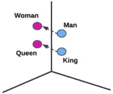
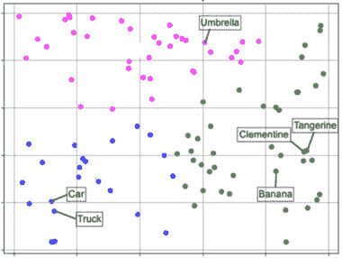
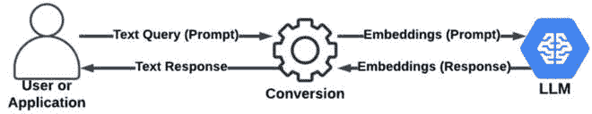
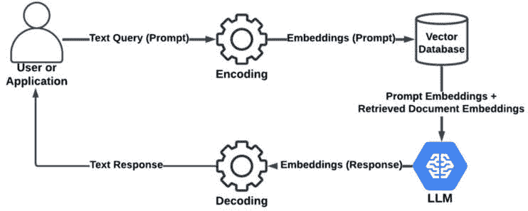

# 第十六章：高级生成式 AI 概念和应用案例

现在我们已经了解了生成式 AI（GenAI）的基础知识，是时候开始深入探讨了。在本章中，我们将介绍 GenAI 领域的更多高级主题。我们将从学习一些针对特定领域或任务的生成模型调优和优化技术开始。然后，我们将更详细地探讨嵌入和向量数据库的重要主题以及它们如何与使用**检索增强生成**（RAG）的新模式相关联，以将我们的**大型语言模型**（LLM）响应基于我们的数据。接下来，我们将讨论多模态模型，它们与基于文本的 LLM 有何不同，以及它们支持的使用案例。最后，我们将介绍 LangChain，这是一个流行的框架，使我们能够设计复杂的应用程序，这些应用程序可以建立在 LLM 提供的功能之上。具体来说，本章涵盖了以下主题：

+   高级调优和优化技术

+   嵌入和向量数据库

+   RAG

+   多模态模型

+   GenAI 模型评估

+   LangChain

让我们直接深入探讨，开始学习高级调优和优化技术！

注意

“*LLM*”这个术语在 GenAI 领域几乎成了同义词，但考虑到**LLM**代表**大型语言模型**，这个术语在技术上将其与语言处理联系起来。需要注意的是，还有其他类型的 GenAI 模型，例如一些图像生成和多模态模型，它们并不是严格意义上的语言模型。此外，一个更近的概念是**大型动作模型**或**大型代理模型**（**LAMs**）已经出现，它们结合了 LLM 的语言理解和生成能力，以及通过使用工具和代理与环境交互来执行动作（如规划和管理假期）的能力。然而，为了简单起见，在本书的其余部分，我将交替使用*LLM*和*GenAI* *模型*这两个术语。

# 高级调优和优化技术

在上一章的结尾，我们讨论了 LLM 以及它们的训练和调优。我提到了一些高级别的调优方法，在本节中，我们将深入探讨如何调优 LLM 以满足我们的特定需求。让我们首先概述我们如何与 LLM 互动，我们通常是通过**提示**来做到这一点的。

定义

提示是我们提供给 LLM 的一段文本或指令，以引导其响应或输出。它告诉 LLM 要做什么，在某些情况下，还提供了如何做的指导；例如，“**总结这份财务文件，特别关注** **2023 年第四季度** **与公司业绩相关的细节**。”

我们将要探索的第一个高级 LLM 调优技术是**提示工程**。

## 提示工程

提示是我们可以用来调整 LLM 输出以满足我们特定需求的最直接方法。事实上，在 2022 年底和 2023 年初 GenAI 流行爆炸的早期，您可能还记得看到关于一种新兴的极高需求角色的新闻标题，称为**提示工程师**。在本节中，我们将讨论提示工程是什么，以及它如何被用来改进 GenAI 模型的输出，这将有助于解释为什么对这一领域有如此突然的需求增加。

为了开始我们的讨论，考虑以下提示：

```py
Write a poem about nature.
```

这是一个非常简单的提示，它并没有向 LLM 提供很多关于我们希望它为我们写什么类型的诗的信息。如果我们想要特定的输出类型，我们可以在我们的提示中包含额外的指令，如下所示：

```py
Write a poem about nature with the following properties:
Format: sonnet
Theme: how the changing seasons affect human emotions
Primary emotion: the poem should focus particularly on the transition from summer to autumn and the sense of longing that some humans feel when summer is coming to an end.
```

后者提示将生成一首更具体的诗，它遵循我们概述的参数。您可以自由尝试，访问以下网址，输入每个提示，看看不同的响应：[`gemini.google.com`](https://gemini.google.com)。

注意

您可以使用上述网址测试本书中的所有提示。

这是一种基本的提示工程形式，它只是在提示中包含额外的指令，以帮助 LLM 更好地理解它应该如何响应我们的请求。我将在本节中解释额外的提示工程技术，首先概述一些制定有效提示的标准最佳实践。

### 核心提示设计原则

以下是我们创建提示时应记住的一些原则：

+   **清晰表达**：我们应该清楚地了解我们希望 LLM 做什么，并避免使用含糊的语言。

+   **具体明确**：使用具体指令可以帮助我们获得更好的结果。

+   **提供足够的上下文**：如果没有适当的上下文，LLM 的响应可能不会与我们试图实现的目标相关。

我在上一个示例提示中包含了一些这些原则，我将在这里更明确地概述它们。在大多数情况下，由于 LLM 的纯粹和不断增长的多样性，提示尽可能清晰和具体是很重要的。例如，如果我要求 LLM 写一个关于幸福的小说，几乎无法知道它会想出什么样的细节。虽然这是 LLM 的一个美妙特性，但当我们希望 LLM 在特定参数内提供结果时，这可能会很具挑战性。

在我提供关于清晰性和具体性的额外示例之前，考虑一下我们可能不希望清晰和具体的情况，例如当我们还不确定我们的确切需求时，我们希望 LLM 帮助我们探索各种潜在选项。在这种情况下，我们可以从向 LLM 发送一个广泛的提示开始，如下所示：

```py
Suggest ideas for a new business that will help me make money.
```

对于这样一个广泛的提示，LLM 可能会提出各种各样的随机想法，从烘焙蛋糕到开发帮助儿童学习数学的视频游戏。

在从 LLM 获得一些初步输出后，我们可以通过更具体地深入研究某些想法来迭代地改进这个过程。例如，如果我们非常喜欢为儿童开发视频游戏的想法，我们可以跟进一个更具体的提示，如下所示：

```py
I want to develop a video game that helps kids to learn mathematics. The target audience will be kids between ten and fifteen years old, and the game will focus on algebra and precalculus. List and explain the steps I need to take to start this business.
```

如我们所见，这个提示比之前的提示更具体，可能会提供更针对性和可操作性的回应。这个更新的提示遵循了我们概述的所有原则，因为它在确切想要实现的目标方面是具体的（即开始创建视频游戏业务），它提供了上下文，例如游戏的内容和目标受众，并且它在我们希望 LLM 如何回应方面是清晰的（即列出并解释步骤）。

有时，我们需要提供大量的上下文，我们将在本章的后面讨论如何做到这一点。然而，接下来，让我们探讨如何使用链接来细化我们从 LLM 获得的输出。

### 链接

我在上一个章节中描述的过程，即我们将第一个提示的输出作为后续提示的输入，这个过程被称为**提示链**。这可以通过交互式过程，如聊天界面，或者使用我稍后将要描述的工具（如 LangChain）以自动化的方式完成。还有一个名为 ReAct 的框架，我们可以将多个动作链接在一起以实现更广泛的目标，我将在下一节中描述。

#### ReAct 和代理

我在本章的开头简要提到了 LAMs 的概念，在这里我将更详细地介绍它。

**ReAct**代表**推理和行动**，它是一个将 LLM 的推理能力与采取行动和与外部工具或环境交互的能力相结合的框架，这有助于我们构建超越简单生成内容的解决方案，以实现更复杂的目标。外部工具的例子包括软件、API、代码解释器、搜索引擎或自定义扩展。

通过使用 ReAct 超越生成内容，我们可以构建被称为**代理**的东西。代理的作用是解释用户期望的结果，并决定使用哪些工具来实现既定目标。在这里，我再次强调规划并预订假期的例子，这可能包括预订航班、住宿、餐厅预订和远足等活动。

链接不应与另一种名为**思维链**（**CoT**）的提示工程方法混淆，我们可以使用它来帮助 LLM 处理复杂的推理任务，我将在下一节中描述。

#### 思维链提示

CoT 提示涉及以引导模型通过逐步推理过程到达最终答案的方式创建提示，这与人类在解决问题时可能采取的方式非常相似。有趣的是，仅仅在提示中添加“逐步”这个词就可以导致模型以不同的方式响应，并以逻辑方式处理问题，而如果没有这些词，它可能不会这样做。我们还可以通过以逐步的方式描述任务来帮助模型。例如，考虑以下作为基线的提示，它没有实现 CoT 提示：

```py
If an investor places $10,000 in a savings account with an annual interest rate of 5% and the interest is compounded annually, how much money will be in the account after 3 years?
```

我们知道 LLM 是大型语言模型，而不是大型数学模型，但我们可以通过教它逐步的过程来教 LLM 如何进行复杂的数学计算。如果 LLM 在提供准确答案时遇到困难，我们可以按以下步骤解释：

```py
Annually compounded interest means the interest is added to the principal amount at the end of each year, and in the next year, interest is earned on the new principal. Based on that information, work through the following process step by step: If an investor places $10,000 in a savings account with an annual interest rate of 5% and the interest is compounded annually, how much money will be in the account after 3 years?
```

虽然模型可能无法立即提供所需的答案，但我们可以通过教它每个步骤应该发生什么来帮助它达到目标，然后它可以依次连接这些步骤以得到最终结果。要了解更多关于这个有趣的主题，我建议阅读标题为《Chain-of-Thought Prompting Elicits Reasoning in Large Language Models》（Wei 等人，2022 年）的研究论文，该论文可在以下网址找到：

[`doi.org/10.48550/arXiv.2201.11903`](https://doi.org/10.48550/arXiv.2201.11903)

接下来，我将介绍另一种流行的提示工程技术，我在*第十五章*中简要提到了它，称为**少样本提示**。

### 少样本提示

本章中我包含的所有提示都是**零样本提示**的例子，因为我只是简单地要求 LLM（大型语言模型）做某事，而没有提供任何关于如何做那件事的可参考示例。

少样本提示是一个相当简单的概念，它仅仅意味着我们在提示中提供了一些示例，教 LLM 如何执行我们请求的任务。少样本提示的一个例子如下：

```py
The following are some examples of product reviews, as well as the categorized customer sentiment associated with those reviews:
Review: "Sending this back because the strap broke the first time I used it." Sentiment: Negative. Properties: construction.
Review: "Love the color! It's the perfect size and seems well-made." Sentiment: Positive. Properties: appearance, construction.
Review: "Disappointed. The zipper gets stuck constantly." Sentiment: Negative. Properties: construction.
Based on those reviews and their associated sentiment categorizations, categorize the sentiment of the following review:
"The fabric feels flimsy, and I'm worried it might tear easily."
```

正如我们在提示中看到的那样，我指导了 LLM 如何对评论的情感进行分类，并提供了我想要 LLM 以特定格式响应的详细示例，包括情感似乎参考的具体产品属性。

在少样本提示的情况下，我们在提示中为 LLM 提供了一个迷你“训练集”，它可以使用这些示例来理解输入和期望输出之间的预期映射。这有助于 LLM 理解它应该关注什么以及如何构建其响应，希望提供更符合我们特定用例需求的结果。

虽然这些例子可以被视为包含在我们提示中的小训练集，但重要的是要注意，我们提供的示例不会改变底层 LLM 的权重。这对于大多数提示工程技术都是正确的，其中响应可能会根据我们的输入而显著变化，但底层 LLM 的权重保持不变。

少样本提示和提示工程通常可以出奇地有效，但在某些情况下，我们需要向 LLM 提供许多示例，并且我们希望进行增量训练（即更新权重），尤其是在复杂任务中。我将在稍后概述我们如何处理这些场景，但首先，我将介绍一个重要的新兴领域——提示管理。

### 提示管理实践和工具

虽然新技术带来了新的功能和机会，但它们通常也会带来新的挑战。随着提示工程的不断发展，公司面临的一个常见挑战是需要有效地存储和管理他们的提示。例如，如果公司的员工提出了提供出色结果的出色提示，他们希望跟踪和重用这些提示。随着时间的推移，LLM 和其他解决方案组件的演变，他们可能还希望更新提示，在这种情况下，他们希望跟踪提示的不同版本及其结果。

在软件开发中，我们使用版本控制系统来跟踪和管理我们应用程序代码的更新。我们可以将这些原则应用于提示工程，使用版本控制系统和模板来帮助我们有效地开发、重用和共享提示。执行高级提示工程实践的公司可能会最终为这些目的整理提示库和存储库。

**提示模板**可以用来标准化有效提示的结构，这样我们就不需要继续使用试错和重新发明轮子来创建最适合特定用例的提示。例如，想象我们在市场营销部门工作，我们运行月度报告来衡量我们营销活动的成功。我们可能希望使用 LLM 来总结报告，并且很可能有一些特定信息是某些团队成员每次都希望审查的。我们可以创建以下提示模板来制定这些要求：

```py
Summarize the [Report Name] report for [Target Audience], considering that [Target Audience] is particularly interested in reviewing increases or decreases in [Metric 1] and [Metric 2].
```

现在，市场营销团队成员只需使用这个提示模板，并在模板中的每个占位符处填写他们希望使用的值。与个人提示一样，我们可以维护我们提示模板的不同版本，并评估每个版本的表现。

我们可能会在未来几年看到更多提示工程和提示管理方法的开发。除此之外，我们甚至可以将**机器学习**（**ML**）技术应用于寻找或建议最适合我们用例的最佳提示，无论是通过让 LLM 建议最佳提示，还是通过使用传统的 ML 优化方法，如分类和回归，来寻找或建议可能导致给定用例最佳结果的提示。预计在这个领域将继续出现有趣的方法。

超越提示工程和管理，下一节将描述更大规模的 LLM 调优技术，这些技术主要可以归类在**迁移学习**（**TL**）的范畴下。

## TL

在*第十五章*中，我简要提到 LLMs 通常经过一个无监督预训练阶段，随后是一个监督调优阶段。本节将更详细地描述一些用于微调 LLMs 的监督训练技术。让我们从 TL 的定义开始。

定义

TL 是一种机器学习方法，它使用一个已经在某个任务（或一系列任务）上训练好的模型作为新模型的起点，这个新模型将执行类似任务（或一系列任务），但参数或数据不同但有一定关联。

TL 的一个例子是，取一个在通用图像识别任务上预训练的模型，然后通过逐步在包含道路场景的数据集上训练，将其微调以识别与驾驶场景特别相关的对象。

TL 方法可以被看作是一种光谱，其中一些 TL 技术和用例只需要更新模型权重的一小部分，而其他则涉及更广泛的更新。光谱上的不同点代表了定制性和计算成本之间的权衡。例如，更新大量模型权重提供了更多的定制性，但计算成本更高，而更新少量模型权重提供了较少的定制性，但计算成本也更低。

让我们从光谱的一端开始讨论，在这一端我们将更新原始模型的所有或大部分权重，我们称之为**完全微调**。

### 完全微调

在完全微调 LLMs 的情况下，我们可以从一个在大量数据上预训练并学习了对训练概念广泛理解的模型开始。然后，我们将该模型引入一个针对当前任务特定的新数据集（例如，理解交通规则）。这个数据集通常比初始预训练阶段使用的数据集更小、更专注。在微调过程中，模型所有层的权重都会更新，以最小化与我们新任务相关的损失。

有几点需要注意，全微调可能需要大量的计算资源，而且还有风险，即模型可能会忘记它在预训练期间学习的一些有用的表示（有时被称为**灾难性遗忘**），尤其是如果新任务与预训练任务有相当大的不同。

记住，LLMs 很大——实际上，它们非常大！考虑到这一点，许多公司可能会因为数据量、计算资源以及通常所需的费用而发现全微调不可行。

而不是调整巨大 LLM 中的所有权重，研究已经发现，有时我们只需更改一些权重，就可以在某些特定任务上获得有效的改进。在这种情况下，我们可以“冻结”模型的一些权重（或参数），以确保它们在更新时不会改变，同时允许其他权重更新。这些方法可以更高效，因为它们需要更新的参数更少，因此被称为**参数高效微调**（PEFT），我将在以下小节中更详细地描述，从**适配器调整**开始。

### 适配器调整

在适配器调整的情况下，原始模型层保持不变，但我们添加**适配器层**或**适配器模块**，这些是插入到预训练模型层之间的小型**神经网络**（NNs），仅包含几个可学习的参数。当输入数据被输入到模型中时，它通过原始预训练层和新插入的适配器模块流动，适配器略微改变了数据处理流程，这导致某些层中引入了额外的转换步骤。

在数据通过网络后执行的计算损失步骤与我们关于 NNs 章节中学到的步骤相同，计算出的损失用于计算模型参数的梯度。然而，与传统全模型微调不同，梯度仅应用于更新适配器模块的权重，而预训练模型的权重本身保持冻结，并保持其初始值不变。

另一种流行的 PEFT 技术是**低秩调整**（LoRA），我将在下面进行描述。

### LoRA

LoRA 基于这样一个前提，即一个神经网络中的所有参数在将学习到的知识转移到新任务时并不同等重要，并且通过仅识别和改变模型参数的小子集，可以适应特定任务而无需完全重新训练模型。LoRA 不是直接修改原始权重矩阵，而是创建低秩矩阵，可以将其视为全矩阵的简化或压缩版本，它以更少的参数捕获最重要的属性。

这就是 LoRA 更参数高效的原因。与适配器微调类似，在反向传播过程中，只有低秩矩阵的参数被更新，原始模型参数保持不变。由于低秩矩阵比它们所代表的完整矩阵具有更少的参数，因此训练和更新过程可以更加高效。

除了提高模型在特定任务上的性能外，还有一些更微妙但同样重要的性能改进实践，例如与人类价值观和期望保持一致。让我们接下来更详细地探讨这个概念。

## 与人类价值观和期望保持一致

你有没有遇到过一些非常聪明和有才华的人，但沟通技巧却很差？例如，这样的人在解决和修复技术问题时可能表现得非常出色，但他们可能不适合主持客户会议。他们可能会说出一些可能被认为是不礼貌或不恰当的话，或者可能只是因为沟通技巧差而显得有些奇怪。这就是我喜欢用来解释调整 GenAI 模型以与人类价值观和期望保持一致的概念的类比，因为这样的价值观和期望往往比科学更微妙，因此需要定制的方法。例如，除了模型的输出要准确外，人类的期望可能还要求模型的输出要友好、安全、无偏见，以及其他微妙、细腻的品质。从现在起，我将把这个概念称为**一致性**，在本节中，我将描述两种今天常用于人类价值观一致性的方法，首先是**从人类反馈中进行强化学习**（**RLHF**）。

### RLHF

我们在本书的*第一章*中探讨了**强化学习**（**RL**）的概念，并解释说，在 RL 中，模型在追求特定目标的过程中，通过与环境的交互从奖励或惩罚中学习。RLHF 是那些技术名称高度描述性且准确捕捉技术内涵的例子之一。正如其名所示，RLHF 是 RL 的扩展，其中模型通过人类提供反馈。

在 RLHF 的情况下，我们从一个已经在大量数据集上预训练的 LLM 开始。该模型会对一个提示生成多个可能的响应，人类根据各种偏好评估这些响应。然后，人类反馈数据被用来训练一个名为**奖励模型**的独立模型，该模型学习根据反馈预测人类可能更喜欢的响应类型。这个过程旨在以可衡量的方式捕捉人类偏好。

LLM 随后使用这种反馈（如奖励信号）通过 RL 技术更新其参数，使其更有可能在将来生成人类认为理想的响应。

另一种可以用来与人类价值观和期望保持一致的技术是**直接偏好优化**（**DPO**）。让我们接下来讨论这个话题。

### DPO

DPO 也使用人类反馈来提高模型在符合人类价值观和期望方面的性能。在 DPO 的情况下，模型可能会对一个提示提供多个响应，而人类可以选择他们更喜欢的响应（类似于 RLHF）。然而，DPO 不涉及训练一个单独的奖励模型。相反，它使用成对比较作为优化信号，并直接根据用户偏好优化策略，而不是预定义的奖励函数，这在难以定义明确的奖励函数的情况下特别有用。

需要注意的是，虽然强化学习与人类反馈（RLHF）和直接偏好优化（DPO）是很有价值和重要的技术，但人类交互本身会带来一些挑战。例如，任何需要人类交互的过程都可能难以扩展。这意味着通过人类的反馈收集大量数据可能会很困难。此外，人类可能会犯错误，或者将主观或无意识的偏见引入结果中。如果你实施 RLHF 或 DPO 解决方案，这些是一些你需要监控和缓解的因素。

除了我在这里介绍的对齐方法之外，还有其他大型语言模型（LLM）调优技术正在出现，并且在这个领域投入了大量的研究。这又是一个你可以期待继续看到在开发方面取得突破性进展的空间。

接下来，让我们更深入地探讨嵌入和向量数据库在生成人工智能（GenAI）中的作用。

# 嵌入和向量数据库

在*第十五章*中，我们讨论了嵌入和潜在空间的重要性，并解释了它们可以通过不同的方式创建。一种方式是当生成模型在其训练过程中内在地学习它们时，另一种方式是我们使用特定类型的模型来明确地创建它们。

我还简要提到了我们为什么要明确创建它们，因为它们可以更有效地处理，并且更适合用于机器学习用例的格式。在这种情况下，当我们为某物创建嵌入时，我们只是在创建一个代表它的数值向量（我们实际上是如何做到这一点的是一个更高级的话题，我们将在稍后讨论）。

我还简要提到了嵌入在向量空间中关系的重要性。例如，嵌入在向量空间中的邻近性可以反映它们所代表的概念之间的相似性。让我们更详细地考察这种关系。

## 概念的嵌入和相似性

一个构建良好的嵌入包含描述和解释其所代表概念所需的一切——即，该概念的“意义”。这在我们看来可能有些抽象，因为我们不经常思考构成某物意义的一切。例如，当我提到“汽车”这个词时，你脑海中可能会浮现出一个特定的形象，并且许多其他信息也会立即由这个词所关联。你知道你可以驾驶汽车；你知道它们通常相对昂贵；你知道它们有轮子和窗户，而且它们传统上是由某种金属制成的。你对汽车这一概念的了解有很多，这有助于你理解它是什么。想象一下，所有构成汽车这一想法的信息都存储在你心中的一个向量中。现在，想象一下你以前从未听说过卡车，我突然给你展示一张卡车的图片。它有轮子和窗户；它是由钢制成的；它看起来像你可以驾驶的东西。尽管你以前从未见过类似的东西，但你能够理解这个新物体与汽车相似。这是因为与之相关的信息片段（即信息向量）与汽车非常相似。

我们如何建立这些类型的关联？这感觉有些直观，而且大多数普通人（包括我自己）都不理解这一切在我们大脑中是如何真正发生的。然而，在嵌入的情况下，理解要容易得多，因为我们的老朋友数学（计算机和机器学习模型都非常喜欢）来帮忙了。正如我之前提到的，我们可以通过在向量空间中计算它们之间的距离来数学地比较不同的向量，使用诸如欧几里得距离或余弦相似度等已建立的距离度量。

如果概念在向量空间中彼此接近，它们在意义上也可能接近，在这种情况下，我们可以说它们是**语义相似的**。例如，在一个基于文本的向量数据库中，“The cat sat on the mat”和“The feline rested on the rug”这两个短语会有非常相似的向量嵌入，尽管它们的精确单词不同。对这些向量之一进行查询很可能也会将另一个识别为高度相关的结果。这个概念的一个经典例子是“man”、“woman”、“king”和“queen”这些词的表示，如*图 16.1*所示：



图 16.1：嵌入和语义相似性

如*图 16**.1*所示，根据项目嵌入在向量空间中的方式，我们可能在向量表示和向量之间的距离中看到某种一致性投影。示例显示，二元性别（或某种一致的语义关系）在“男人”、“女人”、“国王”和“王后”这些词中得到了体现，而且从“男人”到“女人”的距离和方向与从“国王”到“王后”的距离和方向相似。此外，从“男人”到“国王”的距离和方向与从“女人”到“王后”的距离和方向相似。在这种情况下，假设你可以在向量空间中执行以下数学运算来推断值“王后”：

国王 – 男人 + 女人 = 王后

也就是说，如果你将“国王”的概念减去男性性别，并添加女性性别，你最终得到的是“王后”的概念。

我们还可以更广泛地应用这种方法。例如，在一个存储图像嵌入的向量数据库中，一个柚子的图片可能靠近一个金桔的图片。这些物体具有相似的性质，如大小、形状和颜色，而代表香蕉的向量可能不会像它们彼此之间那样接近，因为香蕉与它们共享的相似性较少。然而，从多模态的角度来看，我们将在本章后面描述，考虑到它们都是水果类型，香蕉向量可能仍然比代表汽车或雨伞的向量更接近它们。这个概念在*图 16**.2*中以简化的方式表示：



图 16.2：嵌入和语义相似性的详细示例

注意，在现实中，嵌入空间由许多抽象维度组成，通常无法可视化或直接对人类进行解释。嵌入可以被视为将现实世界的混乱复杂性转化为机器学习模型可以理解的数值语言的一种方式。

如果我们创建嵌入，我们可能希望有一个地方来存储它们，并在需要时轻松找到它们。这就是向量数据库发挥作用的地方。让我们更详细地探讨这个问题，并解释什么是向量数据库。

## 向量数据库

向量数据库是专门设计用于存储和管理向量嵌入的数据库。与关注精确匹配的传统数据库（例如，查找具有特定 ID 的客户）不同，向量数据库更适合用于**相似性搜索**等用例，它们使用距离度量来确定在潜在空间中两个向量嵌入的接近程度和相似程度。

这种方法显著改变了我们检索和分析数据的方式。虽然传统方法依赖于关键词或预定义的属性，但向量数据库允许我们执行语义搜索，其中我们可以根据意义进行查询，这开辟了新的应用。例如，如果我搜索“裤子”，响应也可以包括牛仔裤、休闲裤和卡其裤，因为这些都是在语义上相似的概念。大多数现代搜索引擎，例如谷歌，例如，使用复杂的机制，如语义搜索（以及其他技术的组合），而不是简单的关键词匹配。

语义搜索为用户提供更好的客户体验，同时也可能为公司带来潜在的收入增长。例如，如果你经营一个零售网站，请记住，如果客户找不到产品，他们就不会购买，他们的业务可能会转向你的竞争对手。通过实施语义搜索，我们可以理解用户的含义和意图，因此可以向他们展示最相关的产品。

这些新的搜索能力在 GenAI 的背景下也非常重要，原因我将在稍后解释。首先，让我们更深入地探讨向量数据库是如何工作的。

## 向量数据库是如何工作的

在解释向量数据库是如何工作的之前，让我们简要地谈谈数据库通常是如何工作的。任何数据库的主要目的是以使其尽可能快速找到的方式存储和组织数据。大多数数据库为了这个目的使用索引，我将在下面描述。

### 索引和邻近搜索

为了理解索引的作用，想象我给你一本书，并要求你尽可能快地在这本书中找到关于“拟人化”的信息。如果没有任何辅助机制，你就必须逐页阅读每个单词，直到找到那个词。这当然是一个非常低效的过程，除非信息恰好出现在书的开始附近，否则你很可能需要很长时间才能找到信息。这在数据库世界中被称为**全表扫描**，我们通常希望尽可能避免这种情况。这就是索引发挥作用的地方——如果我所给你的书包含索引，你可以在索引中查找包含“拟人化”引用的哪些页面，然后直接前往这些页面，从而避免大量的低效搜索。

关系型数据库通常使用树形（例如，B 树）或基于哈希的索引进行快速查找，但向量数据库的索引可能更复杂，因为嵌入空间和每个向量在可能的高维空间中的表示都很复杂。这样的索引可以类似于图结构，将嵌入之间的关系映射出来，以实现基于邻近度的搜索。

在向量数据库世界中，与全表扫描相当的操作被称为**暴力搜索**，这个名字借用了网络安全领域的术语，并涉及到尝试所有可能的输入组合以找到期望结果的做法。这是恶意行为者尝试猜测某人密码的常见方式——他们在一定参数内尝试所有可能的字符组合。密码越长，他们通过暴力猜测就越困难，因为每个额外的字符都会指数级增加可能的组合数量。

在向量数据库的情况下，我们的查询通常试图在向量空间中找到与查询项附近的项。如果我们数据库中有大量的向量，那么暴力搜索将是不切实际的，尤其是在高维空间中，**维度诅咒**（**CoD**）使得精确搜索的计算成本很高。幸运的是，通常不需要暴力搜索，因为它寻求精确地找到与查询向量最接近的向量（称为**精确最近邻**），但我们并不总是需要精确的最近邻。例如，像推荐引擎这样的用例，它推荐与特定项目相似的项，通常只需要找到与查询向量在附近区域的向量，但不必是查询向量的精确最近邻。这被称为**近似最近邻**（**ANN**）搜索，在向量数据库的上下文中非常有用，因为它允许在搜索结果的准确性和查询速度之间进行权衡——也就是说，对于这类用例，快速得到足够接近查询向量的结果比花费大量时间找到最佳结果更好。

注意 - CoD 和向量邻近度

在高维空间中，点变得越来越分散，随着维数的增加，最近点和最远点之间的距离变得稀释，这使得基于距离度量的真正相似和不同项的区分变得更加困难。

一些向量数据库实现了混合方法，将 ANN 与其他索引或搜索策略相结合，例如分层索引结构、多索引哈希和基于树的方法，以提高准确性、减少搜索延迟或优化资源使用。基于图的方法，如 **可导航小世界**（**NSW**）图、**分层可导航小世界**（**HNSW**）图等，创建了一个图，其中节点代表向量，查询随后遍历图以找到最近的邻居。一些向量数据库还使用分区或聚类算法将数据集划分为更小、更易于管理的块或簇，然后在这些分区或簇内进行索引，通常使用多种方法首先识别相关的分区，然后在其中执行 ANN 搜索。

此外，我们可以使用诸如乘积量化或标量量化等方法，通过将向量映射到有限个参考向量集来压缩向量，这减少了向量在索引前的维度和存储需求，并通过在压缩空间中近似距离来加速搜索。

在 *第十七章* 中，我们将介绍 Google Cloud 中提供的各种向量数据库产品，但到目前为止，让我们继续讨论我们如何首先创建嵌入。

## 创建嵌入

我们已经在 *第十五章* 中讨论了 **自编码器**（**AEs**），我们学习了它们如何被用来创建输入的潜在空间表示。我们可以以许多其他方式创建嵌入，我将在本节中描述一些更受欢迎的方法，从最著名的词嵌入模型 Word2Vec 开始。

### Word2Vec

Word2Vec（简称“词向量化”）是由谷歌（Mikolov 等人，2013 年）发明的一组算法，用于学习将单词表示为向量的表示。它通常被认为是词嵌入方法的鼻祖，尽管它不是第一个被发明的词嵌入技术，但它推广了将单词表示为密集向量，这些向量能够捕捉到高维空间中单词的语义意义和关系。它通过构建一个独特的单词词汇表，并为每个单词学习一个向量表示来实现，其中具有相似意义的单词具有相似的向量。

Word2Vec 中使用的两种主要方法是 **连续词袋**（**CBOW**）模型，它根据周围的单词预测目标词，以及 **跳字模型**（**skip-gram**），它根据给定的目标词预测周围的单词。

虽然 Word2Vec 已经是一种流行且有用的方法，但基于新近的、基于转换器的技术已经出现，提供了更高级的功能。让我们接下来看看那些方法。

### 转换器

我们已经在之前的章节中介绍了变压器，在本节中，我将简要描述基于变压器的创建嵌入的方法。虽然有很多选项可以选择，但我将重点关注著名的**双向编码器表示从变压器**（**BERT**）及其衍生版本。

#### BERT

在本书的早期，我提到，在 AI/ML 研究中，每隔一段时间就会有一个重大的进步，而谷歌在 2017 年（Vaswani 等人，2017）发明变压器架构已被确立为那些重大飞跃之一。BERT 是由谷歌在 2018 年（Devlin 等人，2018）发明的，这是另一个重大的进步。

正如其名称所示，BERT 基于变压器架构，并在大量文本和代码数据集上进行了预训练。在训练过程中，它学会了模拟单词之间的复杂模式和关系，并理解诸如上下文、语法以及句子不同部分之间如何相互关联等细微差别。

BERT 使用的两种主要方法是**掩码语言建模**（**MLM**），它根据周围上下文预测句子中的缺失单词，以及**下一句预测**（**NSP**），它试图确定两个句子是否在逻辑上相连。这些都是*第十五章*中描述的预训练阶段的例子。通过结合这两种方法，BERT 发展了对语言结构的理解。

BERT 的核心是变压器层，它接受我们给出的文本并产生词嵌入，这些嵌入根据周围的单词捕捉意义，这比静态嵌入（如 Word2Vec）是一个重大的改进。

BERT 是一个如此重要的突破，以至于自其最初发布以来已经创建了多种变体，如 DistilBERT 和 ALBERT，它们是 BERT 的较小、精简版本，参数更少（以一些准确性换取计算效率），以及特定领域的变体，如 SciBERT（在科学出版物上训练）和 FinBERT（针对金融行业用例微调）。

此外，还有一些更针对特定领域的模型建立在基于变压器的模型之上，如 BERT。例如，**句子变压器**不是关注单个单词，而是使用池化策略，如平均池化或最大池化，来创建整个句子的语义上有意义的嵌入。

对于图像嵌入，虽然我们在之前的章节中讨论了**卷积神经网络**（**CNNs**）在图像分类等用例中的应用，但需要注意的是，CNNs 也可以用于创建图像嵌入。

既然我们已经了解了创建嵌入的一些选项，以及将嵌入存储在向量数据库中的选项，让我们探索一个相对较新的模式，它在行业中越来越受欢迎，并且结合了这些主题，被称为 RAG。

# RAG

虽然 LLMs（大型语言模型）无疑是令人印象深刻且强大的技术，但它们也有一些局限性。首先，LLMs 的表现取决于它们训练时所使用的数据，而且训练它们可能既昂贵又耗时，因此对于大多数公司来说，每天用新信息重新训练它们并不可行。因此，在许多情况下，LLMs 的更新版本通常每隔几个月就会发布一次。这意味着它们提供的回答信息取决于它们最近的训练数据集。如果你想要询问昨天发生的事情，但 LLM 上次更新是一个月前，那么它将简单地没有关于这个主题的任何信息。这在当今快节奏的商业世界中可能相当受限，因为人们和应用程序需要随时掌握最新的知识。

其次，除非你是那些创建了今天广泛使用的流行 LLM 的大型企业之一，否则你很可能没有从头开始自己训练 LLM，因此它没有针对你的特定数据进行训练。想象一下，你是一家零售公司，想使用 LLM 通过聊天界面让客户了解你的产品。由于 LLM 没有针对你的产品目录进行专门训练，它将不熟悉你产品的细节。

为了应对这些挑战，我们不仅可以依赖用于训练 LLM 的数据，还可以将额外的数据插入到发送给 LLM 的提示上下文中。我们已经在本章的 *提示工程* 部分提到了这一点，我们在提示中提供了额外的信息，以便引导 LLM 的回答更准确地匹配我们所需的输出。这种方法对于少量数据非常有效，但如果考虑到上述 LLM 回答产品目录问题的用例，我们不可能在每次提示中都包含整个产品目录。这就是 RAG（Retrieval-Augmented Generation）能发挥作用的地方。

使用 RAG，我们可以在首先从数据存储中检索相关信息并将其包含在发送给 LLM 的提示中之后，*增强* LLM 生成的响应。这个数据存储可以包含我们想要的信息，例如我们产品目录的内容。让我们更详细地看看这个模式。

## RAG 的工作原理

为了解释 RAG 的工作原理，让我们通过回顾没有 RAG 的 LLM 交互通常是如何工作的来统一讨论的基准。这非常简单，如 *图 16.3* 所示：



图 16.3：LLM 提示和响应

如我们所见，典型的 LLM 交互简单地说就是发送一个提示并得到一个响应。请注意，LLM 只能理解数值，因此幕后，用户发送的文本提示被分解成标记，这些标记被编码成 LLM 可以理解的向量。当向用户发送响应时，执行反向过程。接下来，让我们看看 RAG 如何改变这个过程，如图 16.4 所示：



图 16.4：RAG

图 16.4 概述了 RAG 在高级别上是如何工作的。步骤如下：

1.  用户或客户端应用程序发送文本请求或提示。

1.  将提示内容转换为向量（嵌入）。

1.  在过程的“检索”部分，使用提示嵌入在向量数据库中查找相似的嵌入。这些嵌入代表我们想要用来增强提示的数据（例如，代表我们产品目录数据的嵌入）。

1.  将我们的向量数据库中的嵌入与用户提示的嵌入相结合，并发送到 LLM。

1.  LLM 使用用户提示和检索到的嵌入的组合来增强其响应，旨在提供不仅基于其最初训练的数据，而且在从我们的向量数据库检索到的数据上下文中也相关的响应。

1.  将响应嵌入解码以向用户或客户端应用程序提供文本响应。

我们将在本书的后续章节中实现 RAG。接下来，让我们开始探讨多模态模型的主题。

# 多模态模型

由于 LLM（语言模型）顾名思义，专注于语言，因此在 2024 年初撰写本文时，你很可能交互的许多流行 LLM 的主要模态可能是文本。然而，GenAI 的概念也超越了文本，扩展到其他模态，如图片、声音和视频。

“多模态”一词在 GenAI 领域变得越来越突出。在本节中，我们将探讨这意味着什么，从“模态”的定义开始。

定义

牛津高阶英汉双解大词典将模态定义为：

“*事物与它的模式、方式或状态有关的部分，与它的实质或身份不同；概念或实体的非本质方面或属性。也指表示某物存在模式或方式的特定品质或属性* *。”

“*牛津高阶英汉双解大词典*，*s.v. “modality (n.), sense 1.a,”* *2023 年 12 月*，[`doi.org/10.1093/OED/1055677936`](https://doi.org/10.1093/OED/1055677936)。”

考虑到这种模态的正式定义，与只关注单一数据类型的传统模型不同，多模态模型旨在处理来自多个模态或数据类型的信息。这是 AI 研究中的另一个重要飞跃，因为它为 AI 开辟了新的用例和应用。让我们更详细地探讨这一点。

## 为什么多模态很重要

在本章关于 RAG 的部分，我提到了一个公司使用 LLM 通过聊天界面帮助客户探索产品细节的例子，以及这需要与公司产品目录中的数据进行交互。更详细地探讨这个例子，考虑一下产品目录中的项目可以与许多不同类型的信息相关联。这可能包括具有标准化字段的结构化数据，如产品尺寸、颜色、价格和其他属性。它也可能与半结构化或非结构化数据相关联，如客户评论以及产品图片。想象一下，如果我们的模型能够摄取和理解所有这些数据模态，它将能够对我们的目录中的项目获得多么详细的理解。如果产品描述中缺少关于产品颜色的细节，模型可以从产品图片中学习这些信息。此外，除了书面客户评论外，一些网站允许客户在其评论中发布视频。模型可以从这些视频中学习更多信息。总的来说，这可以为最终用户提供更丰富的体验。这只是多模态力量的一例，当创建需要与物理世界交互的模型，如机器人和自动驾驶汽车时，这一概念变得更加重要。

多模态实现对于 AI 研究也很重要，因为在创建有用且强大的模型时，一个主要挑战是获取相关数据。考虑到世界上已经创作了有限数量的文本，如果文本是唯一模态，它最终将成为 AI 发展的限制因素。正如我们都可以在各种社交媒体平台和其他网站上清楚地看到，视频、音频和图片已经等同于或超过了文本，成为用户生成内容中的主要模态，我们可以预期这些趋势会继续。我们都听说过这句话，“一图胜千言”，当训练和与大型生成模型交互时，这一点（以及其他模态）变得更加真实！

表达了多模态模型实现的重要性和优势后，我将通过强调一些相关挑战来平衡讨论。

## 多模态挑战

我将从本节开始，介绍在本书中讨论的许多情境中反复出现的一个挑战。一般来说，创建更强大的模型需要更多的计算资源。多模态方法也不例外，训练多模态模型通常需要大量的计算资源。

另一个挑战是复杂性——结合来自不同模态的数据可能很复杂，需要仔细的预处理，特别是考虑到不同模态的特征表示通常具有非常不同的特征空间，一些模态的数据比其他模态更丰富或更稀疏。例如，文本通常是序列的，图像是空间的，而音频和视频具有时间属性，因此对于模型来说，将这些属性对齐以建立一个统一的理解可能很困难。

在前面的章节中，我们探讨了数据质量问题以及解决这些问题的数据准备步骤和管道。然而，棘手的是，不同模态的数据有不同的潜在质量问题、准备步骤和管道，这些是使数据准备好用于模型训练所必需的。

尽管存在挑战，但多模态是一个快速发展的领域，在可预见的未来将继续受到显著的关注。

尽管本节主要关注训练通用人工智能模型（特别是多模态方法），但在模型开发的生命周期中，其他部分也有独特的处理方法，当处理通用人工智能模型而不是传统人工智能模型时，必须考虑这些方法。接下来要强调的重要话题是如何评估通用人工智能模型，以及在某些情况下，这种评估可能与传统人工智能模型的评估有所不同。

# 通用人工智能模型评估

虽然评估传统人工智能模型通常涉及将模型的输出与一个真实数据集进行比较，并计算已建立的、客观的指标，如准确率、精确率、召回率、F1 分数、**均方误差**（**MSE**）以及本书中提到的其他指标，但评估生成模型并不总是那么直接。

当评估一个通用人工智能模型时，我们可能希望关注不同的因素，例如模型在保持与当前任务相关的同时，产生具有创造性和类似人类输出的能力。在这种情况下，一个额外的挑战是评估这些属性可能有些模糊和主观。例如，如果要求一个生成模型写一首诗或创建一幅草地上的猫的逼真图片，那么这首诗的质量或图片的真实性并不总是容易用数学计算出的数字来表示，尽管存在一些公式化的测量方法，我将在本节中描述。然而，让我们首先讨论人工评估。

## 人工评估

可能最直接但同时也缓慢、繁琐且可能昂贵的做法是让人类评估者评估生成输出的质量、创造力、连贯性以及它们与任务要求的匹配程度。有一些工具、框架、服务和整个公司致力于执行这类评估。这种方法的一些常见挑战是，评估的质量仅与提供给评估者的指示一样好，因此有必要清楚地理解和解释如何评估响应，并且评估可能是主观的，基于评估者的个人解释。

接下来，我将描述一些可以用于评估生成模型的正式化方法，从评估文本语言模型的指标开始，如**双向评估辅助者**（**BLEU**）和**基于回忆的摘要评估辅助者**（**ROUGE**）。

## BLEU

BLEU 主要用于评估机器翻译用例，它通过衡量生成文本与人工编写的文本的相似性来工作，因此当我们使用 BLEU 时，我们需要一组参考、人工编写的文本示例，这些示例与生成的文本进行比较。更具体地说，BLEU 衡量的是所谓的**n-gram 重叠**，即生成文本和参考文本之间单词序列的重叠。

## ROUGE

ROUGE 同样衡量生成文本与人工编写的参考示例之间的重叠，但它通过衡量**召回率**来专注于总结用例，召回率表示生成的摘要从参考摘要中捕获重要信息的程度。

除了基于重叠的评估之外，我们还可以使用诸如**困惑度**和**负对数似然**（**NLL**）等指标来评估文本生成性能，这些指标可以用来评估模型在预测单词序列方面的性能，例如预测句子中的下一个单词。

接下来，让我们考虑一些评估图像生成模型的方法，例如**Inception Score**（**IS**）和**Fréchet Inception Distance**（**FID**）。

## IS

IS 用于衡量生成图像的质量和**多样性**，一个好的图像生成模型应该能够生成各种各样的图像，而不仅仅是同一事物的变体，并且图像应该看起来清晰、逼真。我们可以通过使用预训练的图像分类模型来对生成模型生成的图像进行分类，从而计算 IS。

## FID

虽然 IS 独立评估生成图像，但 FID 旨在通过衡量生成图像的分布与真实图像分布的相似性来改进它（它得名于使用 Fréchet 距离来衡量两个分布之间的距离）。

为了本章的目的，我们主要需要意识到存在一些用于评估某些生成模型的特定指标，但深入探讨这些指标是如何计算的数学细节，在这个阶段将提供比所需更多的信息。除了我们在本节中介绍的方法和指标之外，还有其他的方法和指标。接下来，我将介绍一种评估生成模型的不同方法，即使用**自动评分器**。

## 自动评分器和并行评估

在高层次上，自动评分器是一个机器学习模型，用于评分或评估模型的输出。这可以通过不同的方式进行，我将在 Google Cloud Vertex AI 的背景下解释这个概念。

Google Cloud Vertex AI 最近推出了一项名为**自动并行**（**AutoSxS**）的服务，可用于评估 Vertex AI 模型注册表中的预生成预测或生成 AI 模型。这意味着，除了 Vertex AI 基础模型之外，我们还可以使用它来评估第三方语言模型。

为了比较两个模型的结果，它使用自动评分器来决定哪个模型对提示给出了更好的响应。相同的提示被发送到两个模型，自动评分器评估每个模型的响应，并针对各种标准进行评估，例如相关性、全面性、模型遵循指令的能力以及响应是否基于既定事实。

如我在本节开头所提到的，评估生成模型通常需要一定的主观性和比传统机器学习模型简单客观评估更多的灵活性。Google Cloud Vertex AI AutoSxS 支持的各项标准提供了这种额外的灵活性。

现在我们对生成 AI 模型的评估在某些方面与传统机器学习模型的评估有何不同有了高层次的理解，让我们继续介绍生成 AI 中的另一个重要主题——LangChain。

# LangChain

通过向 LLM 发送提示，我们可以实现惊人的成就并获得有用的信息。然而，我们可能希望构建比单个提示所能实现的更复杂的逻辑的应用程序，并且这些应用程序可能需要与 LLM 之外的多个系统进行交互。

LangChain 是一个流行的框架，用于使用大型语言模型（LLM）开发应用程序，它使我们能够将多个步骤组合成一个链，其中每个步骤实现一些逻辑，例如从数据存储中读取、向 LLM 发送提示、获取 LLM 的输出并在后续步骤中使用它们。

LangChain 的一个优点是它采用模块化方法，因此我们可以通过组合较小的、更简单的逻辑模块来构建复杂的流程。它提供了创建提示模板和管理与 LLM 交互集成上下文的工具，并且我们可以轻松地找到访问来自 Google 搜索、知识库或自定义数据存储等信息源的集成。

在本书的后面部分，我们将使用 LangChain 来编排工作流程中的多个不同步骤。现在，在我们继续下一章之前，让我们总结一下本章所涵盖的内容。

# 摘要

在本章关于高级通用人工智能（GenAI）概念和用例的章节中，我们首先深入探讨了调整和优化大型语言模型（LLMs）的技术。我们学习了提示工程实践如何影响模型输出，以及全微调、适配器调整和 LoRA 等调整方法如何使预训练模型能够适应特定领域或任务。

接下来，我们深入探讨了嵌入和向量数据库，包括它们如何表示概念的意义，并启用基于相似性的搜索。我们研究了特定的嵌入模型，如 Word2Vec 和基于 transformer 的编码。

然后，我们继续描述了如何使用 RAG（Retrieval-Augmented Generation）将来自自定义数据存储的信息结合到发送给 LLM 的提示中，从而使得 LLM 能够根据我们数据存储的内容调整其响应。

之后，我们讨论了多模态模型以及它们如何打开超越文本语言的额外用例。然后，我们继续讨论了 GenAI 模型的评估与传统机器学习（ML）模型评估在某些方面的不同，并介绍了一些新的评估 GenAI 模型的方法和指标。

最后，我们介绍了 LangChain 这个重要主题，以及它如何帮助我们通过连接简单的模块或构建块来构建实现复杂逻辑的应用程序。

在下一章中，我们将学习关于 Google Cloud 上提供的各种 GenAI 服务和实现。
