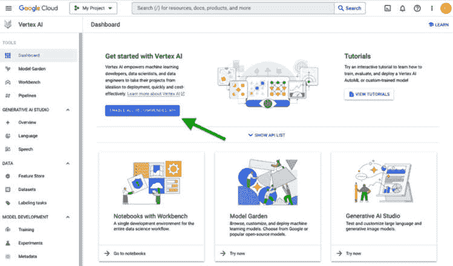
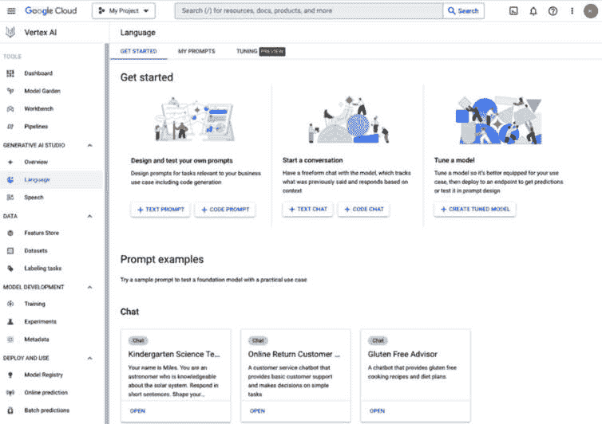
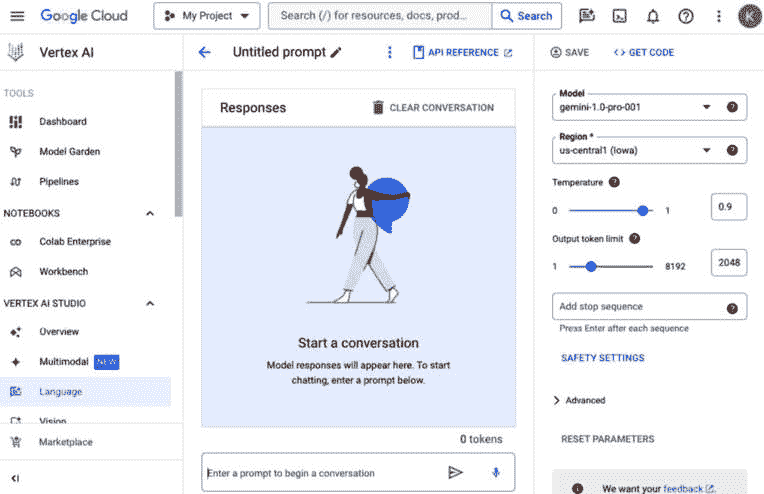
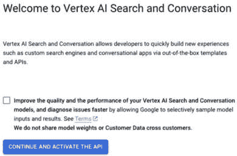
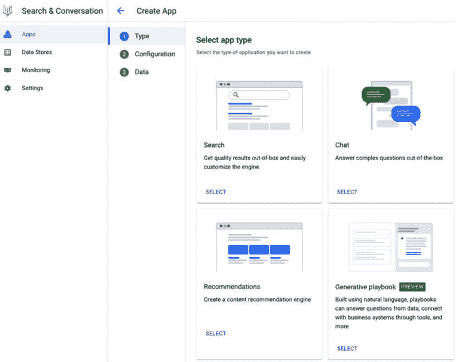
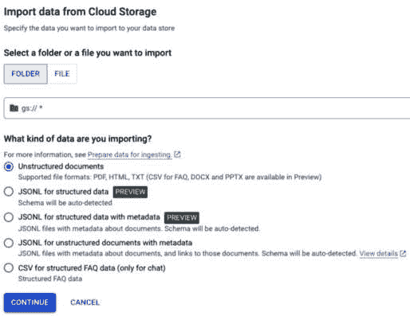
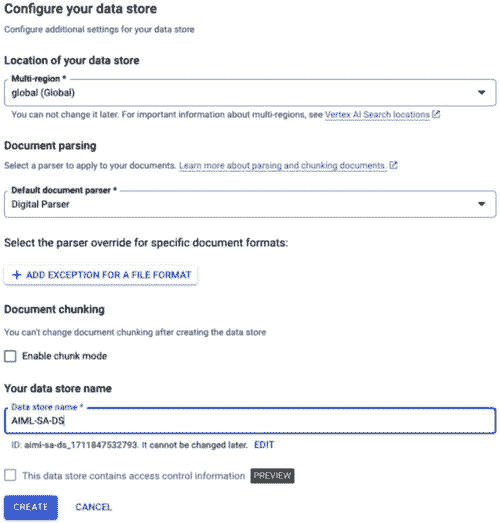
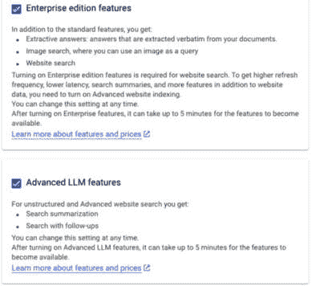
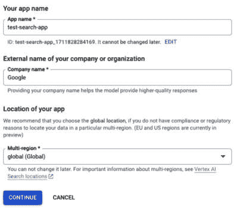

# 第十七章：谷歌云上的生成式 AI

既然我们已经涵盖了生成式 AI 世界中的许多重要主题，本章将专门探讨谷歌云中的生成式 AI。我们将讨论谷歌的专有模型，如 Gemini、PaLM、Codey、Imagen 和 MedLM API，这些模型各自针对不同类型的任务而设计，从语言处理到医学分析。

我们还将回顾谷歌云上通过 Vertex AI Model Garden 和 Hugging Face 等存储库提供的开源和第三方模型。

继续上一章关于向量数据库的讨论，我们将探索谷歌云中的各种向量数据库选项，以及每个选项的潜在用例。

最后，我们将利用本章所涵盖的信息开始构建谷歌云中的生成式 AI 解决方案。

具体来说，本章涵盖了以下主题：

+   谷歌云中生成式 AI 概述

+   对谷歌云生成式 AI 的详细探索

+   在谷歌云中实施生成式 AI 解决方案

让我们从对谷歌云中生成式 AI 的高层次概述开始。

# 谷歌云中生成式 AI 概述

谷歌云中生成式 AI 的发展速度令人惊叹。几乎每天都有新的模型版本、服务或功能被宣布。在本节中，我将从高层次介绍各种模型和产品，为本章后面的深入探讨奠定基础。

总体而言，模型和产品按模态分类，如文本、代码、图像和视频。让我们从讨论谷歌的各种生成式 AI 模型开始我们的旅程。

## 谷歌的生成式 AI 模型

在过去的几年里，谷歌创建了众多生成式 AI 模型，新模型和模型版本在去年推出的速度显著加快。本节讨论的是截至 2024 年初在谷歌云上可用的谷歌第一方基础模型，从相当著名的“Gemini”开始。

### Gemini API

截至 2024 年初，Gemini 是谷歌最大、功能最强大的 AI 模型系列。它包括三个模型系列：

+   **Gemini Ultra**：这是 Gemini 家族中最大的模型，旨在处理高度复杂任务。在 2023 年 12 月宣布推出时，它在 LLM 研究广泛使用的 32 个学术基准中的 30 个上超过了当前最先进的结果。

+   **Gemini Pro**：虽然这不是最大的模型，但它被认为是谷歌在广泛任务中扩展的最佳模型。截至 2024 年初撰写本文时，其最新版本为 1.5，引入了一百万个 token 的上下文窗口——在发布时是行业内最大的上下文窗口。这使得我们能够在单个提示中发送大量数据，开辟了新的用例，并解决了早期 LLM 的重大限制。

+   **Gemini Nano**: 这是 Google 最有效的 Gemini 模型系列，旨在加载到单个设备的内存中，以执行设备上的任务。它最初以两种略有不同大小的变体推出，即 Nano-1 和 Nano-2。

此外，还有多模态变体——例如，**Gemini Ultra Vision**和**Gemini Pro Vision**——这些变体在多种输入数据上进行了训练，包括文本、代码、图像、音频和视频。这意味着我们可以在与 Gemini 的交互中混合模态，例如在提示中发送图像，通过文本询问照片内容，并接收文本输出。

### PaLM API 模型

PaLM 是 Google 的**路径语言模型**，基于 Google 创建的“路径”系统，旨在构建能够执行多个任务（与传统单一用途模型相对）的模型。当前 PaLM 模型套件基于 PaLM 2 发布，并且在这个套件中有多个提供，例如 PaLM 2 for Text、PaLM 2 for Chat 和 Text 的嵌入，接下来我将描述这些变体。

#### PaLM 2 for Text

正如其名所示，这个模型系列是为文本用例设计的。目前这个模型系列有三个变体：

+   **text-bison**: 这可以用于多种基于文本的语言用例，如摘要、分类和提取。它可以处理最多 8,192 个标记的输入和最多 1,024 个标记的输出。

+   **text-unicorn**: PaLM 家族中最先进的模型，用于复杂自然语言任务。虽然它比 text-bison 更先进，但输入和输出标记限制相同。

+   **text-bison-32k**: 这个变体与上述 text-bison 类似，但可以处理最多 8,192 个标记的输出，以及总共最多 32,768 个标记（输入和输出总和）。

当我们向**PaLM 2 for Text**模型发送提示时，模型会生成文本作为响应，每次交互都是独立的。然而，我们可以构建外部逻辑来链接多个交互。接下来，我们将讨论一系列为交互式提示集成而设计的 Google Cloud 产品。

#### PaLM 2 for Chat

使用**PaLM 2 for Chat**，我们可以与 PaLM 模型进行**多轮**对话。这个产品系列包括两个变体：

+   **chat-bison**: 这个变体是为交互式对话用例设计的。它可以处理最多 8,192 个标记的输入和最多 2,048 个标记的输出。

+   **chat-bison-32k**: 这个变体与上述 chat-bison 类似，但可以处理最多 8,192 个标记的输出，以及总共最多 32,768 个标记（输入和输出总和）。

由于这些产品变体的特性，它们非常适合需要跨多个提示保持上下文，以提供自然、类似人类的对话体验的用例。我们还可以使用 PaLM 模型生成文本嵌入。我们将在下一节中查看这些模型。

#### PaLM 2 嵌入模型

我们已经泛泛地讨论了可以用来创建嵌入的模型。在本节中，我们将探讨谷歌的 PaLM 2 嵌入模型，这些模型也分为两种变体：

+   **textembedding-gecko**：名称“gecko”指的是较小的模型。考虑到我们使用这些模型来创建文本的嵌入，我们通常不需要一个非常大的模型来处理这种情况，因此在这些上下文中，这些较小且更高效的模型更有意义。这个特定的模型专注于英语单词。

+   **textembedding-gecko-multilingual**：这个变体与上述的 textembedding-gecko 类似，但这个模型可以支持超过 100 种语言。

到目前为止，我描述的所有 PaLM 2 模型都专注于自然人类语言。接下来，我们将讨论为涉及计算机编程语言用例而设计的模型。

### Codey API 模型

Codey 是一个为实施代码用例而设计的模型的有趣名称。Codey 模型可以根据自然语言请求生成代码，甚至可以将一种编程语言的代码转换为另一种语言。与基于文本的 PaLM 2 模型一样，Codey 模型根据我们是否只想让模型对独立提示生成不同的响应，或者我们想要实现一个交互式、基于聊天的用例而分为不同的变体。让我们更详细地探讨每一个。

#### Codey 用于代码生成

这套产品是为独立提示设计的（尽管，再次强调，如果我们愿意，我们可以构建逻辑将它们串联起来），并且它们也分为两种变体：

+   `编写一个 Java 函数，从'customer' MySQL 数据库中的'accounts'表中获取 customer_id 和 account_balance 字段。` 这个变体可以处理最大输入为 6,144 个标记和最大输出为 1,024 个标记。

+   **code-bison-32k**：这个变体与上述的 code-bison 类似，但它可以处理最大输出为 8,192 个标记，以及整体最大为 32,768 个标记（输入和输出总和）。

接下来，让我们讨论用于交互式编码用例的模型变体。

#### Codey 用于代码聊天

这个产品系列使我们能够参与关于代码的多轮对话。这些模型也分为两种变体：

+   **codechat-bison**：这个模型可以用来实现涉及代码相关问题的聊天机器人对话。与 code-bison 模型一样，它可以处理最大输入为 6,144 个标记和最大输出为 1,024 个标记。

+   **codechat-bison-32k**：这与上述的 codechat-bison 类似，但它可以处理最大输出为 8,192 个标记，以及整体最大为 32,768 个标记（输入和输出总和）。

除了代码生成和代码聊天模型之外，还有一个用于代码补全的 Codey 版本，我将在下面描述。

#### Codey 用于代码补全

Codey 的代码补全变体旨在用于 **集成开发环境**（**IDEs**）。这个模型有一个变体，称为 **code-gecko**，它被设计成作为有用的编码助手，帮助开发者实时编写有效的代码。这意味着它可以在开发者编写代码时在 IDE 中建议代码片段。我们都熟悉手机上的预测文本和自动纠错功能。这是一个类似的概念，但针对代码，它有助于开发者更快更有效地完成工作。

现在，让我们将讨论转向另一种模式：图像。

### Imagen API 模型

Imagen 是谷歌为处理图像而设计的模型套件的名字，其中套件中的每个模型都可以用于不同类型的图像相关用例，例如以下内容：

+   **图像生成**：正如其名称所示，**imagegeneration** 模型可以用于根据自然语言提示生成图像。例如，*图 17.1* 中的图像是通过提示“一个夏末傍晚，一位女士在小船上在平静的河流上钓鱼的印象派画作。”生成的。我们还可以交互式地编辑我们的图片，根据我们期望的结果进行细化：


图 17.1：由 Imagen 生成的图像

+   **图像标题生成**：我们可以将图像发送到我们的 **imagetext** 模型，它将根据该图像的内容生成描述性文本。这可以用于许多商业用例，例如根据零售网站上产品目录中的图像生成产品描述，为新闻文章中的图像生成标题，或为网站上的图像生成“alt 文本”。

+   **视觉问答（VQA）**：除了为我们的图片生成标题外，**imagetext** 模型还允许我们交互式地询问关于图像内容的问题。

+   **多模态嵌入**：虽然我们可以使用 **textembedding-gecko** 模型生成文本嵌入，但 **multimodalembedding** 模型可以生成图像和文本的嵌入。

除了我刚才描述的通用模型之外，谷歌还提供了专门针对医疗用例设计的模型。下一节将简要介绍这些模型。

### MedLM API 模型

在这个模型套件中有两种模型变体，**medlm-medium** 和 **medlm-large**，两者都符合 HIPAA 标准，可用于总结医疗文档并帮助医疗保健从业者解答医疗问题。

我们可以期待谷歌持续添加更多模型和变体，以支持不断增长的众多用例。除了上一小节中描述的谷歌的第一方模型之外，谷歌云支持并拥抱开源开发，这是我们接下来要探讨的。

## 谷歌云上的开源和第三方生成式 AI 模型

谷歌是开源社区的一个知名贡献者，它创造了和贡献了许多至关重要的发明，如 Android、Angular、Apache Beam、Go（编程语言）、Kubernetes、TensorFlow 等。在本节中，我们将探讨谷歌的开源生成式 AI 模型，以及我们可以在谷歌云上轻松使用的第三方（开源和专有）生成式 AI 模型。我们将首先讨论谷歌云 Vertex AI 模型园地，它使我们能够访问这些模型。

### Google Cloud Vertex AI 模型园地

Vertex AI 模型园地是一个集中式库，提供了一个“一站式商店”，使我们能够轻松找到、定制和部署预训练的 AI 模型。

在模型园地中，我们可以访问基础模型，如 Gemini 和 PaLM 2，以及开源模型，如即将描述的 Gemma 和 Llama 2，以及第三方模型，如 Anthropic 的 Claude 3。我们还可以访问针对特定任务的模型，例如内容分类和情感分析，以及其他许多用例。

Vertex AI 模型园地与谷歌云和 Vertex AI 生态系统紧密集成，使我们能够通过访问我们在前几章中讨论的所有数据处理和解决方案构建工具，以及许多超出本书范围的工具，轻松构建企业级解决方案。

除了通过 Vertex AI 模型园地使模型可访问外，谷歌云还与 Hugging Face 建立了战略合作伙伴关系，我将在下文中进行描述。

### Hugging Face

Hugging Face 是一家公司，也是一个社区，它使分享 ML 模型、工具和数据集变得容易。虽然它最初是一家聊天机器人公司，但由于其模型中心和 Transformer 库的流行，它迅速获得了广泛的社区贡献者，并使得访问和使用大型预训练模型变得容易。随着谷歌云和 Hugging Face 之间相对较新的直接合作伙伴关系的建立，谷歌云客户现在可以轻松地从运行在 Vertex AI 和**Google Kubernetes Engine**（**GKE**）等服务上的谷歌云环境中获得大量模型、工具和数据集。

考虑到这是一本关于谷歌机器学习和生成式 AI 的书，这里的描述性讨论将侧重于谷歌的模型；我将为您推荐外部文档来了解非谷歌开源和第三方模型。考虑到这一点，在下一节中，我将介绍谷歌的开源模型套件，命名为“Gemma”。

### Gemma

Gemma 是 Google 提供的一系列最先进和开源的轻量级模型（DOI 引用：10.34740/KAGGLE/M/3301），这些模型是从创建 Gemini 模型所使用的相同技术和研究中构建的。这些是仅具有解码器功能的文本到文本的 LLM，具有预训练的指令调整变体和开放权重，这些权重是在来自网页、文档、代码和数学文本等多种来源的数据上训练的。它们适用于许多不同类型的文本生成用例，如摘要或问答，它们的开放权重意味着它们可以根据特定用例进行定制。此外，由于它们相对较轻量，它们不需要专门的或大规模的计算资源来运行，因此我们可以在许多环境中使用它们，例如在本地笔记本电脑上，这使得开发者可以轻松地开始实验它们。

有趣的事实

Gemma 碰巧是我姐姐的名字，所以当这个名字被选用来命名这个模型系列时，我感到非常高兴，尽管我在这些模型的命名过程中没有任何参与。

我们将在稍后更详细地探讨 Gemma 模型。在第十五章中，我描述了嵌入和向量数据库在生成式 AI 中的重要性。现在我们已经探讨了 Google Cloud 中的各种生成式 AI 模型，让我们来讨论 Google Cloud 中的向量数据库。

## Google Cloud 中的向量数据库

本节简要介绍了 Google Cloud 中的向量数据库，我们将在本章的后续部分更详细地探讨它们。我将从这个简单的问题开始： “*Google Cloud 数据库服务中哪一个提供向量数据库功能？*” 简单来说，答案是，“*几乎所有的都提供，只有少数例外!*”

那么，下一个问题可能是，“*我应该使用哪一个？*” 这个问题的答案要复杂一些。我们将在本章中更详细地探讨这些选项，从几个简单的决定开始。首先，几乎所有 Google Cloud 数据库服务都提供向量数据库功能的原因是，Google 希望尽可能简化您访问此功能的过程。如果您已经使用 AlloyDB 来管理应用程序的操作数据，您可以轻松地继续使用 AlloyDB AI 来满足您的向量数据库需求。如果您使用 BigQuery 来满足您的分析需求，请继续使用 BigQuery Vector Search，但请注意，BigQuery 主要设计用于大规模数据处理，而不是优化延迟。如果您有严格的低延迟要求，您的负载可能更适合我们稍后将要介绍的 Google Cloud 的其他选项。

如果您是 Google Cloud 的新用户并想设置矢量数据库，请从 Vertex AI 下的产品开始您的旅程。如果您需要一个完全托管的平台，使开发者能够为网站、结构化和非结构化数据构建 Google 级别的搜索体验，或者将您的应用程序与基于企业数据的生成式 AI 和搜索功能集成，请从 Vertex AI Search 和 Conversation 开始。如果您想创建和存储您的矢量，并快速搜索数十亿语义相关的项目，请考虑 Vertex AI Vector Search。

在下一节中，我们将更深入地探讨 Google Cloud 的生成式 AI 产品，从对模型的动手探索开始，然后更详细地介绍各种矢量数据库产品。

# 对 Google Cloud 生成式 AI 的详细探索

在本节中，我们将开始与 Google Cloud 的生成式 AI 产品进行交互。为了设定场景，我将首先简要介绍 Google Cloud Vertex AI Studio。

## Google Cloud Vertex AI Studio

Vertex AI Studio 可以在 Google Cloud 控制台 UI 中访问，它提供了一个界面，可以轻松开始使用我在上一节中描述的所有生成式 AI 模型。

要访问 Google Cloud Vertex AI Studio 用户界面，请执行以下步骤：

1.  在 Google Cloud 控制台中，导航到 Google Cloud 服务菜单并选择 **Vertex AI**。

1.  在 **Get started with Vertex AI** 部分下，点击 *图 17.2* 中所示 **ENABLE ALL RECOMMENDED API**：



图 17.2：启用推荐 API

1.  等待几分钟以启用 API。一旦 API 已启用，您就可以开始使用它们。您可以通过点击屏幕左侧菜单中的每个模态（例如 **Language**、**Vision**、**Speech** 和 **Multimodal**）来与上一节中描述的每个模型进行交互。

1.  例如，如果我们点击 **Language**，将显示一个类似于 *图 17.3* 的屏幕：



图 17.3：语言部分

1.  从这里，我们可以点击各种链接和按钮来尝试不同的模型。例如，点击 **TEXT CHAT** 按钮将展示一个聊天界面，我们可以在其中输入提示，如图 *图 17.4* 所示：



图 17.4：文本聊天

我们可以配置的参数可以在屏幕右侧找到。让我们更仔细地看看：

+   **模型**：我们想要发送提示的模型。

+   **区域**：我们想要运行提示的区域。

+   **温度**：此参数配置模型响应中的创造性和随机性水平。这可以看作是我们希望模型在生成响应时使用的想象力水平。如果我们考虑 LLM 预测序列中下一个单词的使用案例，温度参数会影响下一个单词的整体概率分布，这样更高的温度可以导致更富有创造性的输出，而更低的温度则引导模型提供更保守和可预测的结果。如果我们希望模型创作富有想象力的艺术或文本，例如，我们可以配置一个高温度，而如果我们希望得到更正式、事实性的响应，我们就会配置一个低温度。

+   **输出标记限制**：我们希望模型在其响应中生成的最大标记数。

我们可以点击屏幕底部的**高级**部分来展开它。在这里，我们将看到额外的参数，例如**最大响应数**，它配置了我们希望模型返回的最大示例响应数量（请注意，此参数仅适用于某些类型的交互 – 例如，它不适用于聊天交互，因为聊天在对话的每一轮中总是会提供一个响应），以及**Top-K**和**Top-P**。与**温度**类似，**Top-K**和**Top-P**可以用来控制模型生成输出的创造性和随机性，但它们的工作方式略有不同。考虑一个 LLM 在生成响应时选择序列中的下一个单词（或标记）的情况。它是通过预测下一个单词在给定序列中最有可能发生的概率来做到这一点的。如果 LLM 总是只选择概率最高的单词，那么在生成响应时它不会提供太多的灵活性。然而，我们可以通过理解它们的工作方式来使用**Top-K**和**Top-P**来增加一层灵活性。所以，让我们更仔细地看看：

+   **Top-K**：这使用概率分布来预测基于当前提示和上下文的下一个可能单词的概率。K 是我们希望模型从中选择概率最高的单词的数量。例如，如果 K 的值为 3，那么模型将从最有可能的三个单词中选择下一个单词（即概率最高的三个单词）。如果 K 的值为 1，那么模型将只选择最有可能的（即概率最高的）单词。这是我们所说的**贪婪选择**的特定情况。

+   **Top-P**：这稍微有点复杂，但也不算太复杂。模型不会选择一个特定数量的最高概率词进行选择，而是计算所有可能下一个词的**累积**概率——也就是说，它会将最可能词的概率相加，直到概率总和达到指定的阈值（P），此时它将从低于概率阈值的词池中随机选择一个词。

对于**Top-K**和**Top-P**，较低的值会引导输出趋向于保守的响应，而较高的值则允许一些灵活性，以便产生更具创造性的响应，类似于（并且与）**温度**参数一起。

在**高级**部分，对于某些模型，我们还可以启用**基础**功能，在这种情况下，我们可以根据存储在 Vertex AI 搜索和对话中的数据进行响应。我们还有流式响应的选项，这指的是在生成时打印响应。

我鼓励您探索 Vertex AI Studio 中的不同模态和模型类型。如果您需要帮助思考创意提示来写作，您可以要求一个基于文本的模型为您建议一些示例供您使用！

除了通过 Vertex AI Studio UI 访问各种模型外，您还可以通过 REST API 和 SDK 以编程方式与模型交互。

接下来，让我们探索 Google Cloud 中可用的向量数据库选项。

## 对 Google Cloud 向量数据库选项的详细探讨

在本章的前面部分，我提到几乎所有的 Google Cloud 数据库服务都提供了向量数据库支持。在本节中，我们将更详细地查看每一个服务，从 Vertex AI 搜索和对话开始。

### Vertex AI 搜索和对话

虽然 Vertex AI 搜索和对话产品套件的主要目的是构建搜索和对话应用，正如其名称所暗示的，我们也可以将其用作向量数据库来实现**检索增强生成**（**RAG**）解决方案。正如我们在本章前面讨论的，如果您在 Google Cloud 上开始使用 RAG，除非您有特别需要控制分块、嵌入和索引过程，或者您有特别的需求需要将所有数据与另一个 Google Cloud 数据库服务链接起来，否则 Vertex AI 搜索和对话应该是您首先考虑的选择。这是因为它为您执行所有分块、嵌入和索引过程，并通过一个简单方便的编排界面抽象出所有这些步骤，为您节省了大量时间和精力。您还可以使用数据连接器从第三方应用程序，如 JIRA、Salesforce 和 Confluence 中摄取数据。

如果您需要特别控制分块、嵌入和索引过程，您可以选择其他 Google Cloud 数据库服务，如以下所述。

### Vertex AI 向量搜索

正如我们在整本书中看到的那样，Vertex AI 为我们提供了几乎在机器学习和人工智能领域所能做的一切的完整工具和服务生态系统。因此，它包括一个向量数据库是有意义的，而这个向量数据库被称为 Vertex AI 向量搜索。它使我们能够以高速和低延迟存储和搜索大量嵌入，以找到最相似或相关的项目。

虽然我们需要创建块、嵌入和索引（与使用 Vertex AI 搜索和对话不同），但它仍然提供了一个完全托管的服务，我们不需要担心基础设施或扩展，因为 Vertex AI 会为我们处理所有这些。我们需要创建块、嵌入和索引的事实意味着，如果需要的话，我们可以对这些过程实施更细粒度的控制，例如用于创建我们的嵌入的模型（请注意，这也适用于本章余下部分我们将讨论的所有其他向量数据库选项）。

Vertex AI 向量搜索还紧密集成了 Vertex AI 和 Google Cloud 生态系统中的其他部分，作为需要使用嵌入的大规模编排解决方案的一部分。在更广泛的生态系统话题上，让我们考虑 Vertex AI 之外的额外 Google Cloud 向量数据库，从 BigQuery 开始。

### BigQuery 向量搜索

BigQuery 向量搜索是 Google Cloud BigQuery 中的一个功能，允许我们存储和查找嵌入。我们可以通过使用 BigQuery 的 **VECTOR_SEARCH** 函数将查询嵌入发送到 BigQuery，该函数将快速在向量数据库中找到相似的嵌入。这对于熟悉 SQL 语法的人来说是一个主要的好处，它使得语义搜索和基于相似性的分析可以直接在您的 BigQuery 数据仓库中进行。

我们还可以选择创建一个向量索引来加速嵌入检索过程。当我们使用向量索引时，会使用**近似最近邻**（**ANN**）搜索来返回近似结果，这比进行暴力搜索以找到精确匹配要快得多。如果我们不创建向量索引，那么将执行暴力搜索。我们还有选择在存在向量索引的情况下显式实现暴力搜索的选项，如果我们想要得到精确结果的话。

BigQuery 向量搜索是数据科学团队的一个很好的选择，因为他们已经在 BigQuery 中存储了大量的数据，它还提供了 BigQuery 的自动和巨大可扩展性的好处。继续可扩展性的主题，Google Cloud 中另一个以其令人印象深刻的可扩展性而闻名的数据库服务是 Google Cloud Spanner。让我们更深入地了解一下。

### Spanner 向量搜索

Google Cloud Spanner 是一种完全托管且性能极高的数据库服务，能够实现全球规模。它通常被称为“NewSQL”数据库，因为它结合了非关系型（NoSQL）数据库的可扩展性和灵活性以及关系型数据库熟悉的 SQL 接口。它可以轻松处理 PB 级的数据，并且与许多 NoSQL 数据库不同，即使在分布式全球的情况下，它也可以保证事务的强一致性。

考虑到所有这些，Spanner 适用于需要高度分布式和强一致性数据的应用程序，例如在线银行用例。到 2024 年初，Spanner 还推出了对余弦距离和欧几里得距离比较的支持，我们可以使用这些向量距离函数来执行 **K-最近邻**（**KNN**）向量搜索，用于相似性搜索或 RAG 等用例。这意味着这种常用于企业级、业务关键工作负载的高度分布式数据库服务现在也支持向量数据库功能。

虽然 Spanner 结合了 NoSQL 和关系型数据库功能的最佳之处，但我将先描述关系型数据库选项，然后再明确介绍 NoSQL 选项。

### Cloud SQL 和 pgvector

Cloud SQL 是 Google Cloud 中的一项完全托管的关系型数据库服务，它支持 PostgreSQL、MySQL 和 SQL Server。根据 Google Cloud 文档，“*超过 95% 的 Google Cloud 前 100 名客户使用 Cloud SQL 来运营他们的业务。*”它通常被视为在 Google Cloud 中使用的默认关系型数据库服务，考虑到它是完全托管的，我们无需担心服务器配置、操作系统更新或数据库补丁，因为 Google 会为我们处理所有这些活动。

虽然 Cloud SQL 本身不支持向量数据库功能，但我们可以使用 `<->`) 来计算向量之间的距离度量，例如余弦相似度，以帮助我们找到最相似的嵌入。令人兴奋的是，它允许我们使用 SQL 来执行所有这些向量操作，这使得对于熟悉 PostgreSQL 的人来说使用起来非常方便。

除了在 Cloud SQL 中使用 `pgvector` 与 PostgreSQL 一起使用外，我们还可以将其与 AlloyDB 一起使用，我将在下面进行描述。

### AlloyDB AI 向量搜索

AlloyDB 是 Google Cloud 上的一种完全托管且兼容 PostgreSQL 的数据库服务，专为高性能企业级工作负载而设计。与标准 PostgreSQL 相比，它显著提高了性能和可扩展性，并提供了高级功能，如自动扩展、自动故障转移，以及内置的数据库备份和更新。它也适用于混合事务和分析工作负载，最近，它还增加了多个与机器学习相关的功能。

AlloyDB AI 现在也包含了向量相似性搜索功能，因为它在数据库中原生地使用了 `pgvector`。

接下来，我们将讨论在 Google Cloud 中用于向量相似性搜索的 NoSQL 数据库选项。

### Google Cloud 中用于向量相似搜索的 NoSQL 数据库选项

Firestore 是 Google Firebase 生态系统中的 NoSQL 数据库。Firebase 本身是一个 Google Cloud 框架，它提供了一系列工具和服务，用于开发移动和 Web 应用程序。除了 Firebase 提供的原始功能外，还有 **Firebase 扩展中心**，它为用户提供了一种向他们的解决方案添加更多功能的方式。虽然 Firestore 默认不提供向量数据库支持，但可以通过名为 **Vertex AI 的语义搜索** 的扩展来添加该功能，该扩展通过集成 Vertex AI 向量搜索将文本相似性搜索添加到 Firestore 应用程序中。

在 Google Cloud 中，另一个非常流行的 NoSQL 数据库是 Bigtable。与 Firestore 类似，Bigtable 目前不提供对向量相似搜索用例的原生支持，但它可以与 Vertex AI 向量搜索集成，以帮助构建该目的的解决方案。

现在我们已经介绍了在 Google Cloud 中提供向量数据库支持的数据库选项，包括关系型数据库和无数据库，现在重要的是要描述一种额外的数据存储类型，称为 **Memorystore**，它用于实现针对极低延迟工作负载的缓存解决方案。

### Redis 的 Memorystore

Redis 是一个开源的内存数据存储，这意味着与存储在磁盘上的传统数据库不同，Redis 主要在 RAM 中存储数据，从而提供超快的性能。Redis 的 Memorystore 是 Google Cloud 中的一项完全托管 Redis 服务，它提供可扩展的、高度可用和安全的 Redis 实例，而无需我们管理实例或相关基础设施。

Redis 的 Memorystore 现在也支持 ANN 和 KNN 向量搜索，使我们能够为需要极低延迟响应的应用程序实现内存中的向量存储缓存。

到目前为止，我们已经介绍了 Google Cloud 上大多数主要的生成式人工智能服务。现在，是我们将一些知识付诸实践的时候了，我们将开始在 Google Cloud 上实施生成式人工智能解决方案。

# 在 Google Cloud 上实施生成式人工智能解决方案

在本节中，我们将创建一个 Vertex AI 搜索和对话应用程序，这将使我们能够询问关于一组文档内容的问题。我们将使用一些公开可用的医学研究报告作为示例，但这种模式可以应用于许多不同的用例。以下是一些其他流行的应用模式：

+   通过问答界面让零售网站的用户获取有关网站上产品的信息，他们可以提出人类语言问题，并获得有关目录中产品的实际回答。

+   询问关于财务文件的问题。例如，公司财务部门的员工可以上传公司的财务文件，例如季度收益报告，并就报告内容提出自然语言问题，以识别趋势或其他重要信息。

+   在公司庞大的内部文档库上提供自然语言搜索。例如，给定一个简单的搜索界面，员工可以询问，“我如何修改我的退休贡献？”他们可以得到一个告诉他们如何操作的响应，以及一个链接到详细描述该过程的内部文档。

我们将使用 Vertex AI 搜索和对话 API 来构建此应用，具体内容将在以下小节中描述。

## 构建 Vertex AI 搜索和对话应用

在高层次上，我们将执行三个主要活动来构建我们的 Vertex AI 搜索和对话应用：

1.  启用 Vertex AI 搜索和对话 API。

1.  创建一个数据存储来存储我们在应用中将使用的数据。

1.  创建 Vertex AI 搜索和对话应用，以便它可以与我们的数据存储交互。

让我们从启用 Vertex AI 搜索和对话 API 开始。

### 启用 Vertex AI 搜索和对话 API

要启用 Vertex AI 搜索和对话 API，请执行以下步骤：

1.  在 Google Cloud 控制台中，在搜索框中输入`search`并选择**搜索和对话**。

1.  如果这是您第一次使用此服务，将显示一个类似于*图 17.5*的页面：



图 17.5：激活 Vertex AI 搜索和对话

1.  点击**继续并激活 API**（此复选框为可选 – 您可以选择它或将其留空）。

1.  几秒钟后，您的环境将被创建。将显示一个类似于*图 17.6*的页面：



图 17.6：Vertex AI 搜索和对话环境页面

现在我们已经启用了 API，我们可以开始设置应用的下一个先决步骤，即创建数据存储。

### 为 Vertex AI 搜索和对话创建数据存储

在撰写本文时，即 2024 年 3 月，Vertex AI 搜索和对话 API 可以支持以下数据存储源：

+   **网站 URL**：自动从您定义的域名列表中爬取网站内容

+   **BigQuery**：从您的 BigQuery 表中导入数据

+   **云存储**：从您的存储桶中导入数据

+   **API**：通过调用 API 手动导入数据

我们将使用 Google Cloud Storage 作为我们的数据存储，因此我们将首先设置一个位置并将我们的数据上传到那里。下一个小节将描述此过程。

注意

在本书的 *第四章* 中，我们在云壳环境中创建了一个本地目录，并将我们的 GitHub 仓库克隆到该目录中。如果您没有执行这些步骤，请现在参考这些说明。它们可以在 *创建目录和克隆我们的 GitHub 仓库* 部分找到。

确保本书的 GitHub 仓库已被克隆到您的云壳环境中的本地目录后，继续执行以下步骤。

#### 将我们的数据存储在 Google Cloud Storage 中

将我们的数据部署到云存储的最简单方法是使用 Google Cloud Shell。要设置我们的数据存储，请执行以下步骤：

1.  点击屏幕右上角的**云壳**符号，如图 17.7* 所示：


图 17.7：激活云壳

1.  这将激活云壳环境，它将出现在屏幕底部。激活环境需要几秒钟。一旦您的环境激活，您可以将以下步骤中提到的命令粘贴并运行到云壳中。

1.  运行以下命令以设置环境变量，以便您可以存储您首选的区域、云存储桶名称和数据路径（**将 YOUR-REGION 替换为您首选的区域，例如 us-central1，将 YOUR-BUCKET-NAME 替换为您** **的桶名称**）：

    ```py
    export REGION=YOUR-REGION
    export BUCKET=YOUR-BUCKET-NAME
    export BUCKET_PATH=${BUCKET}/data/Chapter-17/
    ```

1.  验证桶路径（您还应该复制此命令的响应内容，以备后续步骤参考）：

    ```py
    echo $BUCKET_PATH
    ```

1.  如果尚不存在，则创建桶：

    ```py
    gsutil mb -l $REGION gs://${BUCKET}
    ```

1.  切换到存储本章数据的目录：

    ```py
    cd ~/packt-ml-sa/Google-Machine-Learning-for-Solutions-Architects/Chapter-17/data
    ```

1.  将文件上传到桶中（这也会在桶内创建路径）：

    ```py
    for i in *; do gsutil cp $i gs://${BUCKET_PATH}; done
    ```

1.  验证文件是否已上传（以下命令应列出文件）：

    ```py
    gsutil ls gs://${BUCKET_PATH}
    ```

现在我们已经将文件上传到我们的云存储桶中，我们可以为我们的应用程序创建 Vertex AI 搜索和对话数据存储，具体步骤将在下一小节中描述。

注意

本练习中使用的文档的引用可以在本书 GitHub 仓库的 **Chapter-17** 目录中的 **document_citations.txt** 文件中找到：[`github.com/PacktPublishing/Google-Machine-Learning-for-Solutions-Architects/blob/main/Chapter-17/document_citations.txt`](https://github.com/PacktPublishing/Google-Machine-Learning-for-Solutions-Architects/blob/main/Chapter-17/document_citations.txt)。

#### 创建 Vertex AI 搜索和对话数据存储

在 Vertex AI 搜索和对话中，我们将定义一个与上传到云存储的文件关联的数据存储。为此，请执行以下步骤：

1.  在 Vertex AI 搜索和对话控制台 UI 中，选择 **数据存储** | **创建数据存储** | **云存储**。

1.  将显示与图 17.8* 类似的屏幕：



图 17.8：从云存储导入数据

1.  输入上传文件的路径（这是您在上一节中在 Cloud Shell 环境中为`BUCKET_PATH`环境变量指定的值）。

1.  在本例中，我们将使用非结构化文档，因此**非结构化文档**选项应保持选中状态。

1.  点击**继续**。将显示一个类似于*图 17.9*的屏幕：



图 17.9：配置您的数据存储

1.  在**多区域**下选择**全局（全球）**。

1.  在**默认文档解析器**下选择**数字解析器**。

1.  为数据存储输入一个名称，例如`AIML-SA-DS`，然后点击**创建**。

现在数据存储已创建，是时候创建 Vertex AI 搜索和对话应用了。

### 创建 Vertex AI 搜索和对话应用

要创建 Vertex AI 搜索和对话应用，请执行以下步骤：

1.  在 Vertex AI 搜索和对话控制台 UI 中，选择**应用** | **创建新应用** | **搜索**。

1.  在随后出现的屏幕上，确保**企业版功能**和**高级 LLM 功能**复选框已启用，如图 17.10 所示（阅读每个选项的描述以了解其功能）：



图 17.10：启用搜索和对话功能

1.  接下来，输入应用名称和公司名称，选择应用的位置，然后选择**继续**，如图 17.11 所示（注意，如果没有合规性或监管原因需要在特定多区域定位您的数据，请选择全局位置）：



图 17.11：应用详情

1.  接下来，选择您希望与我们的应用集成的数据存储，如图 17.12 所示：


图 17.12：选择数据存储

我们应用的数据处理需要一些时间。定期刷新页面以检查其状态。一旦完成，将显示文件列表。到那时，我们就准备好配置我们希望应用如何表现，如以下小节所述。

### 配置我们新创建的应用

我们的新搜索和对话应用有多种工作方式，我们可以通过修改其配置来指定我们希望它如何工作。为此，执行以下步骤：

1.  在 Vertex AI 搜索和对话控制台 UI 中，从页面左侧菜单中选择**应用**。

1.  点击我们新创建的应用。

1.  从页面左侧菜单中选择**配置**。

    对于**搜索类型**配置，有三个选项：

    1.  **搜索**：只需用相关结果列表响应搜索查询。

    1.  **使用答案搜索**：在搜索结果列表上方提供生成摘要。

    1.  **使用后续问题搜索**：提供具有生成摘要和后续问题支持的对话搜索。

1.  选择**使用后续问题搜索**选项。

1.  滚动到**用于摘要的大型语言模型**部分，并选择 Gemini 的最新版本。

1.  除非你有任何特定要求更改它们，否则你可以将所有其他选项保留在默认值。

1.  点击**保存并发布**。

到目前为止，我们已经准备好开始使用我们的应用程序，如下一个子节所述。

### 使用我们新创建的应用程序

现在我们已经创建了我们的应用程序，我们可以开始使用它。为此，执行以下步骤：

1.  在 Vertex AI 搜索和对话控制台 UI 中，选择我们新创建应用程序的**预览**部分。

1.  我们将看到一个搜索框，我们可以用它来询问我们数据存储中文档的内容。

1.  从以下问题开始：`肉桂对健康有什么影响？`

1.  点击`哪些特定的属性有助于其调节血糖水平的能力？`

    注意，后续问题只是简单地提到“它”，并没有直接提到肉桂。然而，模型使用前一个问题中的上下文来理解我们的意图。

    此外，请注意，生成的答案可能包含参考文献，用于生成答案的参考文献列在响应中。

1.  尝试以下附加问题：

    1.  `研究中使用的每日肉桂剂量与典型的饮食肉桂摄入量相比如何？`

    1.  `在 4 周试验期之后，是否有观察到肉桂补充剂的任何长期效果？`

    1.  `肉桂补充剂如何与其他饮食或生活方式干预措施相互作用以管理糖尿病前期？`

    1.  `该研究关于肉桂调节血糖作用的发现能否扩展到 1 型或 2 型糖尿病患者？`

1.  接下来，让我们提出一些问题，这些问题将使模型根据集合中的其他文档进行响应。尝试以下问题：

    1.  `FIM 项目在尝试使用 EHR 数据进行评估时面临的主要挑战是什么？`

    1.  `FIM 项目如何克服有效访问和利用 EHR 数据的障碍？`

    1.  `FIM 项目除了 EHR 数据之外，还可以使用哪些替代数据源来评估健康结果和医疗保健利用？`

    1.  `医疗保健合作伙伴的隐私和责任担忧如何影响与 FIM 项目共享 EHR 数据？`

    1.  `白蛋白在儿童的营养状况中扮演什么角色，红豆饼干如何有效改善它？`

    1.  `哪些具体的饮食干预措施已显示出在改善患有疾病的患者肠道微生物群方面的前景？`

    1.  `肠道微生物群与身体的相互作用如何影响心理健康障碍，以及涉及哪些机制？`

    1.  `肠道微生物组的改变能否作为慢性肾脏病发展的早期指标？`

这些只是其中的一些例子——请随意尝试使用额外的文档和问题，并思考这种模式如何因为这些奇妙模型的广泛知识而扩展到几乎任何用例。

就这些！你已经成功地在 Google Cloud 中构建了你的第一个生成式 AI 应用！正如你所见，Vertex AI 搜索和对话使我们能够非常容易地做到这一点。幕后，这可以被视为一个 RAG 解决方案，因为我们正在与 Gemini 模型交互，并使其生成基于我们上传到数据存储的文档内容的响应，尽管 Vertex AI 搜索和对话抽象并管理了实现解决方案所需的全部复杂性和步骤。

在下一章中，我们将构建一些额外的更复杂的用例。然而，首先，让我们总结一下本章所学的内容。

# 摘要

在本章中，我们深入探讨了 Google Cloud 中的生成式 AI，探索了 Google 的本地生成式 AI 模型，如 Gemini、PaLM、Codey、Imagen 和 MedLM API。我们讨论了每个模型的多个版本以及每个的一些示例用例。然后，我们介绍了 Vertex AI Studio，并讨论了通过如 Vertex AI 模型花园和 Hugging Face 等存储库在 Google Cloud 上可用的开源和第三方模型。

接下来，我们讨论了 Google Cloud 中的向量数据库，涵盖了各种可用的选项，例如 Vertex AI 搜索和对话、Vertex AI 向量搜索、BigQuery 向量搜索、Spanner 向量搜索、`pgvector`和 AlloyDB AI 向量搜索，包括一些在选择一种解决方案而不是另一种时的决策因素。这些决策点通常在解决方案架构师的角色中最为重要，并且决策将根据客户或项目的具体需求而变化，包括每种解决方案的成本。我建议始终咨询每个产品的最新定价信息，并将其纳入你的决策过程中。

最后，我们将本章的一些主题付诸实践，并在 Google Cloud 中构建了一个生成式 AI 应用——具体来说，我们构建了一个 Vertex AI 搜索和对话应用，使我们能够就文档集合的内容提出自然语言问题。

在下一章中，我们将继续使用本书中涵盖的主题，在 Google Cloud 中构建解决方案。请加入我，开始更深入地探索！
