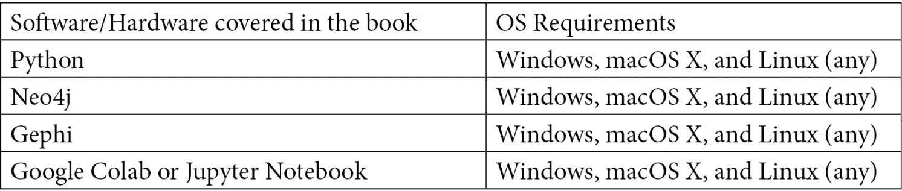

# 前言

图机器学习提供了一套新的工具，用于处理网络数据并利用实体之间关系的力量，这些工具可用于预测、建模和分析任务。

你将从图论和图机器学习的一个简要介绍开始，了解它们的潜力。随着你的深入，你将熟悉图表示学习的主要机器学习模型：它们的目的、工作原理以及如何在广泛的监督和非监督学习应用中实现。然后，你将构建一个完整的机器学习流程，包括数据处理、模型训练和预测，以充分利用图数据的潜力。接下来，你将涵盖现实世界场景，例如使用图从社交网络中提取数据、文本分析和自然语言处理，以及使用图上的金融交易系统。最后，你将学习如何构建和扩展用于图分析的基于数据的驱动应用，以存储、查询和处理网络信息，然后继续探索图上的最新趋势。

在本机器学习书籍结束时，你将学习图论的基本概念以及构建成功的机器学习应用所使用的所有算法和技术。

# 本书面向的对象

这本书是为想要利用数据点之间连接和关系中的信息、揭示隐藏结构并利用拓扑信息来提高分析和模型性能的数据分析师、图开发者、图分析师和图专业人士而写的。本书对数据科学家和机器学习开发者也很有用，他们想要构建由机器学习驱动的图数据库。需要具备对图数据库和图数据的基础理解。此外，还需要具备中级水平的 Python 编程和机器学习知识，以便充分利用本书。

# 本书涵盖的内容

*第一章*，*开始使用图*，使用 NetworkX Python 库介绍了图论的基本概念。

*第二章*，*图机器学习*，介绍了图机器学习的主要概念和图嵌入技术。

*第三章*，*无监督图学习*，涵盖了最近的无监督图嵌入方法。

*第四章*，*监督图学习*，涵盖了最近的监督图嵌入方法。

*第五章*，*图上机器学习的问题*，介绍了图上最常用的机器学习任务。

*第六章*，*社交网络分析*，展示了机器学习算法在社会网络数据中的应用。

*第七章*，*使用图进行文本分析和自然语言处理*，展示了机器学习算法在自然语言处理任务中的应用。

*第八章*，*信用卡交易图分析*，展示了机器学习算法在信用卡欺诈检测中的应用。

*第九章*，*构建数据驱动的图应用*，介绍了处理大型图的有用技术和方法。

*第十章*，*图机器学习中的新型趋势*，介绍了图机器学习中的某些新型趋势（算法和应用）。

# 要充分利用本书

Jupyter 或 Google Colab 笔记本足以涵盖所有示例。对于某些章节，还需要 Neo4j 和 Gephi。



**如果您正在使用本书的数字版，我们建议您亲自输入代码或通过 GitHub 仓库（下一节中提供链接）访问代码。这样做将有助于您避免与代码复制粘贴相关的任何潜在错误。**

# 下载示例代码文件

您可以从 GitHub 下载本书的示例代码文件[`github.com/PacktPublishing/Graph-Machine-Learning`](https://github.com/PacktPublishing/Graph-Machine-Learning)。如果代码有更新，它将在现有的 GitHub 仓库中更新。

我们还有其他来自我们丰富的图书和视频目录的代码包，可在[`github.com/PacktPublishing/`](https://github.com/PacktPublishing/)找到。查看它们吧！

# 下载彩色图像

我们还提供了一份包含本书中使用的截图/图表的彩色图像的 PDF 文件。您可以从这里下载：[`static.packt-cdn.com/downloads/9781800204492_ColorImages.pdf`](https://static.packt-cdn.com/downloads/9781800204492_ColorImages.pdf)。

# 使用的约定

本书中使用了多种文本约定。

`文本中的代码`: 表示文本中的代码单词、数据库表名、文件夹名、文件名、文件扩展名、路径名、虚拟 URL、用户输入和 Twitter 昵称。以下是一个示例：“将下载的`WebStorm-10*.dmg`磁盘映像文件作为系统中的另一个磁盘挂载。”

代码块设置如下：

```py
html, body, #map {
 height: 100%; 
 margin: 0;
 padding: 0
}
```

当我们希望将您的注意力引到代码块的一个特定部分时，相关的行或项目将被设置为粗体：

```py
Jupyter==1.0.0
networkx==2.5
matplotlib==3.2.2
node2vec==0.3.3
karateclub==1.0.19
scipy==1.6.2
```

任何命令行输入或输出都应如下编写：

```py
$ mkdir css
$ cd css
```

**粗体**：表示新术语、重要单词或屏幕上看到的单词。例如，菜单或对话框中的单词在文本中显示如下。以下是一个示例：“从**管理**面板中选择**系统信息**。”

小贴士或重要注意事项

看起来像这样。

# 联系我们

我们始终欢迎读者的反馈。

**一般反馈**：如果您对本书的任何方面有疑问，请在邮件主题中提及书名，并给我们发送电子邮件至 customercare@packtpub.com。

**勘误**: 尽管我们已经尽最大努力确保内容的准确性，但错误仍然可能发生。如果您在这本书中发现了错误，如果您能向我们报告，我们将不胜感激。请访问[www.packtpub.com/support/errata](http://www.packtpub.com/support/errata)，选择您的书籍，点击勘误提交表单链接，并输入详细信息。

**盗版**：如果您在互联网上发现我们作品的任何非法副本，如果您能提供位置地址或网站名称，我们将不胜感激。请通过 copyright@packtpub.com 与我们联系，并提供材料的链接。

**如果您有兴趣成为作者**：如果您在某个领域有专业知识，并且您有兴趣撰写或为书籍做出贡献，请访问[authors.packtpub.com](http://authors.packtpub.com)。

# 评论

请留下评论。一旦您阅读并使用了这本书，为何不在您购买它的网站上留下评论呢？潜在读者可以查看并使用您的客观意见来做出购买决定，Packt 公司可以了解您对我们产品的看法，我们的作者也可以看到他们对书籍的反馈。谢谢！

如需了解有关 Packt 的更多信息，请访问[packt.com](http://packt.com)。
