# 第二章：图机器学习

**机器学习**是人工智能的一个子集，旨在为系统提供从数据中*学习*和改进的能力。它在许多不同的应用中取得了令人印象深刻的成果，尤其是在难以或无法明确定义规则来解决特定任务的情况下。例如，我们可以训练算法来识别垃圾邮件，将句子翻译成其他语言，识别图像中的物体，等等。

近年来，应用机器学习到*图结构数据*的兴趣日益增加。在这里，主要目标是自动学习合适的表示，以便进行预测，发现新的模式，并更好地理解相对于“传统”机器学习方法的复杂动态。

本章将首先回顾一些基本的机器学习概念。然后，将提供关于图机器学习的介绍，特别关注**表示学习**。接着，我们将分析一个实际案例，以指导您理解理论概念。

本章将涵盖以下主题：

+   机器学习的复习

+   图上机器学习是什么，为什么它很重要？

+   在图机器学习算法之间导航的一般分类法

# 技术要求

我们将使用带有*Python 3.8*的 Jupyter 笔记本来完成所有练习。以下是需要使用`pip`安装的 Python 库列表，以便本章使用。例如，在命令行中运行`pip install networkx==2.5`，等等：

```py
Jupyter==1.0.0
networkx==2.5
matplotlib==3.2.2
node2vec==0.3.3
karateclub==1.0.19
scipy==1.6.2
```

本章所有相关的代码文件均可在[`github.com/PacktPublishing/Graph-Machine-Learning/tree/main/Chapter02`](https://github.com/PacktPublishing/Graph-Machine-Learning/tree/main/Chapter02)找到。

# 在图上理解机器学习

在人工智能的各个分支中，**机器学习**是近年来最受关注的领域之一。它指的是一类计算机算法，这些算法通过经验自动学习和改进其技能，而不需要明确编程。这种方法从自然界中汲取灵感。想象一下，一位运动员第一次面对一个新颖的动作：他们开始慢慢地、仔细地模仿教练的姿势，尝试、犯错，然后再次尝试。最终，他们会变得越来越好，越来越自信。

现在，这个概念如何转化为机器？这本质上是一个优化问题。目标是找到一个数学模型，能够在特定任务上实现最佳性能。性能可以使用特定的性能指标（也称为 **损失函数** 或 **成本函数**）来衡量。在常见的学习任务中，算法被提供数据，可能有很多数据。算法使用这些数据来对特定任务进行迭代决策或预测。在每次迭代中，决策使用损失函数进行评估。产生的 *误差* 用于以某种方式更新模型参数，希望模型将表现得更好。这个过程通常被称为 **训练**。

更正式地说，让我们考虑一个特定的任务 *T* 和一个性能指标 *P*，它允许我们量化算法在 *T* 上的表现有多好。根据 Mitchell（Mitchell et al., 1997）的说法，如果一个算法在经验 *E* 上，通过 *P* 衡量的任务 *T* 的性能随着经验 *E* 的增加而提高，那么这个算法就被说成是从经验中学习的。

## 机器学习的基本原理

机器学习算法分为三大类，称为 *监督学习*、*无监督学习* 和 *半监督学习*。这些学习范式取决于数据提供给算法的方式以及性能如何评估。

**监督学习**是在我们知道问题答案时使用的学习范式。在这种情况下，数据集由形式为 *<x,y>* 的样本对组成，其中 *x* 是输入（例如，图像或声音信号），而 *y* 是相应的期望输出（例如，图像所代表的内容或声音所表达的内容）。输入变量也被称为 *特征*，而输出通常被称为 *标签*、*目标*和*注释*。在监督学习设置中，性能通常使用 *距离函数* 来评估。此函数衡量预测与期望输出之间的差异。根据标签的类型，监督学习可以进一步分为以下几种：

+   **分类**：在这里，标签是离散的，指的是输入所属的“类别”。分类的例子包括确定照片中的物体或预测一封电子邮件是否为垃圾邮件。

+   **回归**：目标是连续的。回归问题的例子包括预测建筑中的温度或预测任何特定产品的销售价格。

**无监督学习**与监督学习不同，因为问题答案未知。在这种情况下，我们没有标签，只有输入 *<x>*。因此，目标是推断结构和模式，试图找到相似性。

发现相似示例的组（聚类）是这类问题之一，以及在高维空间中给出数据的新表示。

在**半监督学习**中，算法使用标记数据和未标记数据的组合进行训练。通常，为了指导未标记输入数据中存在的结构的研究，会使用有限数量的标记数据。

值得注意的是，**强化学习**用于训练机器学习模型以做出一系列决策。人工智能算法面临类似游戏的情境，根据执行的动作获得*惩罚*或*奖励*。算法的作用是理解如何行动以最大化奖励并最小化惩罚。

仅在训练数据上最小化错误是不够的。机器学习的关键词是*学习*。这意味着算法必须能够在未见过的数据上达到相同的性能水平。评估机器学习算法泛化能力的最常见方式是将数据集分为两部分：**训练集**和**测试集**。模型在训练集上训练，其中计算损失函数并用于更新参数。训练后，模型在测试集上的性能得到评估。此外，当有更多数据可用时，测试集可以进一步分为**验证集**和**测试集**。验证集通常用于评估训练期间模型的表现。

当训练机器学习算法时，可以观察到三种情况：

+   在第一种情况下，模型在训练集上的表现水平较低。这种情况通常被称为**欠拟合**，意味着模型没有足够的能力来处理任务。

+   在第二种情况下，模型在训练集上达到高水平的表现，但在测试数据的泛化上遇到困难。这种情况被称为**过拟合**。在这种情况下，模型只是简单地记忆训练数据，而没有真正理解它们之间的真实关系。

+   最后，理想的情况是模型能够在训练和测试数据上达到（可能）最高的性能水平。

过拟合和欠拟合的例子可以通过*图 2.1*中显示的风险曲线给出。从图中可以看出，训练集和测试集的性能如何根据模型的复杂性（要拟合的模型参数数量）而变化：

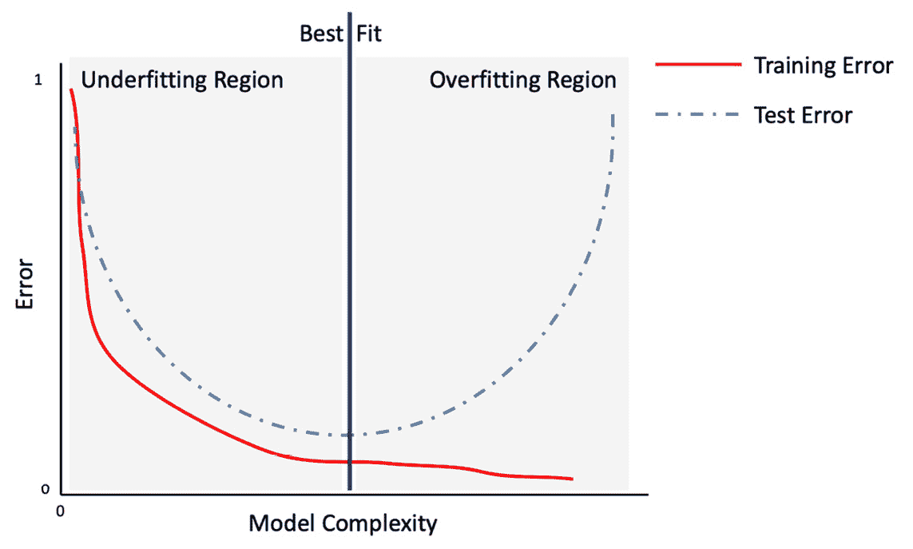

图 2.1 – 描述模型复杂度（模型参数数量）函数上的训练集和测试集预测错误的风险曲线

过拟合是影响机器学习实践者的主要问题之一。它可能由几个原因引起。以下是一些可能的原因：

+   数据集可能定义不明确或不足以代表任务。在这种情况下，添加更多数据可以帮助减轻问题。

+   用于解决问题的数学模型对于任务来说过于强大。在这种情况下，可以向损失函数中添加适当的约束来降低模型的力量。这些约束被称为**正则化**项。

机器学习在许多领域取得了令人印象深刻的成果，成为计算机视觉、模式识别和自然语言处理等领域中最广泛和最有效的途径之一。

## 图机器学习的益处

已经开发出多种机器学习算法，每种算法都有其自身的优点和局限性。其中，值得提及的是回归算法（例如，线性回归和逻辑回归）、基于实例的算法（例如，k 近邻或支持向量机）、决策树算法、贝叶斯算法（例如，朴素贝叶斯）、聚类算法（例如，k 均值）和人工神经网络。

但这一切成功的秘诀是什么？

实质上，只有一件事：机器学习可以自动处理人类容易完成的任务。这些任务可能过于复杂，无法用传统的计算机算法描述，在某些情况下，它们甚至显示出比人类更好的能力。这尤其适用于处理图——由于它们的复杂结构，它们可以以比图像或音频信号更多的方式有所不同。通过使用图机器学习，我们可以创建算法来自动检测和解释重复出现的潜在模式。

由于这些原因，对图结构数据的表示学习越来越感兴趣，并且已经开发出许多机器学习算法来处理图。例如，我们可能对确定蛋白质在生物相互作用图中的作用、预测合作网络的演变、向社交网络中的用户推荐新产品等感兴趣（我们将在*第十章*，*图的未来*)。

由于它们的本质，图可以在不同的粒度级别上进行分析：在节点、边和图级别（整个图），如图*图 2.2*所示。对于这些级别中的每一个，都可能遇到不同的问题，因此应该使用特定的算法：

![Figure 2.2 – 图的三种不同粒度级别的视觉表示

![img/B16069_02_02.jpg]

图 2.2 – 图的三种不同粒度级别的视觉表示

在以下的项目符号中，我们将给出一些针对这些级别的机器学习问题的例子：

+   **节点级别**：给定一个（可能很大的）图，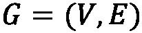，目标是将每个顶点，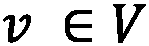，分类到正确的类别。在这种情况下，数据集包括*G*和一系列成对元素，*< vi,yi >*，其中*vi*是图*G*的一个节点，*yi*是该节点所属的类别。

+   **边级别**：给定一个（可能很大的）图，，目标是将每条边，，分类到正确的类别。在这种情况下，数据集包括*G*和一系列成对元素，*< ei,yi >*，其中*ei*是图*G*的一条边，*yi*是该边所属的类别。在这个粒度级别上，另一个典型任务是**链接预测**，即预测图中两个现有节点之间是否存在链接的问题。

+   **图级别**：给定一个包含*m*个不同图的数据库，任务是构建一个能够将图分类到正确类别的机器学习算法。然后我们可以将这个问题视为一个分类问题，其中数据集由一系列成对元素定义，*<Gi,yi**>，其中*Gi*是一个图，*yi*是该图所属的类别。

在本节中，我们讨论了机器学习的一些基本概念。此外，我们通过介绍处理图时的一些常见机器学习问题来丰富了我们的描述。有了这些理论原则作为基础，我们现在将介绍一些与图机器学习相关的更复杂的概念。

# 广义图嵌入问题

在经典的机器学习应用中，处理输入数据的一种常见方式是通过一组特征进行构建，这个过程称为**特征工程**，它能够为数据集中每个实例提供一个紧凑且具有意义的表示。

从特征工程步骤获得的数据库将作为机器学习算法的输入。如果这个过程通常对大量问题都有效，那么当我们处理图时，它可能不是最佳解决方案。确实，由于它们的结构定义良好，找到一个能够包含所有有用信息的适当表示可能并不容易。

第一种，也是最直接的方法，是创建能够从图中提取结构信息的特征，即*提取某些统计数据*。例如，一个图可以通过其度分布、效率和我们在上一章中描述的所有指标来表示。

一个更复杂的程序包括应用特定的核函数，或者在其他情况下，工程特定的特征，这些特征能够将所需属性纳入最终的机器学习模型中。然而，正如你可以想象的那样，这个过程可能非常耗时，并且在某些情况下，模型中使用的特征可能只代表所需信息的子集，以获得最终模型的最佳性能。

在过去十年中，为了定义创建有意义的紧凑图表示的新方法，已经做了大量工作。所有这些方法背后的通用思想是创建能够*学习*原始数据集良好表示的算法，使得新空间中的几何关系反映了原始图的结构。我们通常将学习给定图的良好表示的过程称为**表示学习**或**网络嵌入**。我们将在以下内容中提供更正式的定义。

**表示学习**（**网络嵌入**）的任务是学习从离散图到连续域的映射函数，。函数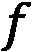将能够执行低维向量表示，使得图的属性（局部和全局）得到保留。

一旦学习到映射 ，它就可以应用于图，并且得到的映射可以用作机器学习算法的特征集。这个过程的一个图形示例可见于*图 2.3*：

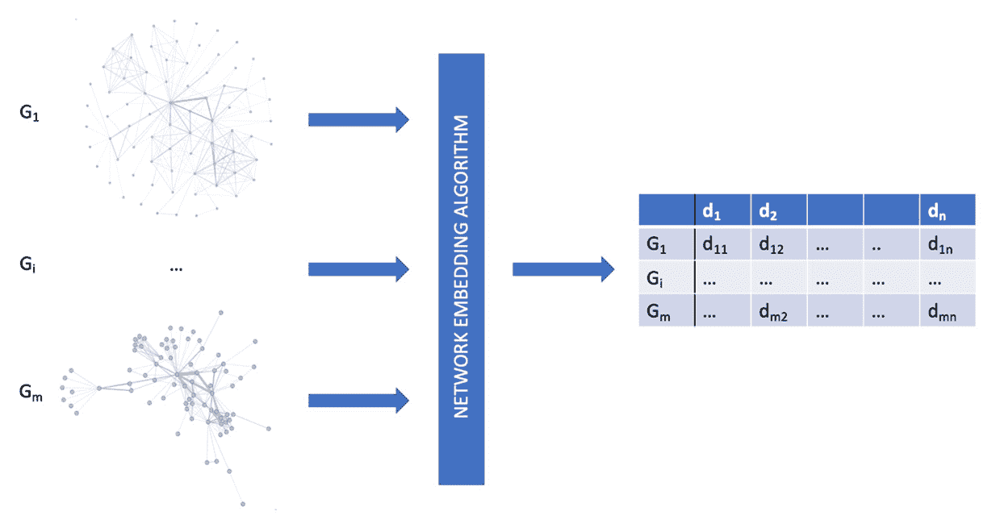

图 2.3 – 网络嵌入算法的工作流程示例

映射函数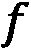也可以应用于学习节点和边的向量表示。正如我们之前提到的，图上的机器学习问题可能发生在不同的粒度级别。因此，已经开发了不同的嵌入算法来学习生成节点向量表示的函数（，也称为**节点嵌入**）或边的向量表示（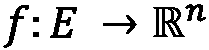，也称为**边嵌入**）。这些映射函数试图构建一个向量空间，使得新空间中的几何关系反映了原始图、节点或边的结构。因此，我们将看到，在原始空间中相似的结构在新空间中也将是相似的。

换句话说，在嵌入函数生成的空间中，相似的结构将具有*较小的欧几里得距离*，而不同的结构将具有*较大的欧几里得距离*。重要的是要强调，尽管大多数嵌入算法在欧几里得向量空间中生成映射，但最近对非欧几里得映射函数产生了兴趣。

现在我们来看一个嵌入空间的实际例子，以及如何在新的空间中看到相似性。在下面的代码块中，我们展示了使用一种称为**节点到向量**（**Node2Vec**）的特定嵌入算法的示例。我们将在下一章中描述其工作原理。目前，我们只需说该算法将图*G*中的每个节点映射到一个向量：

```py
import networkx as nx
from node2vec import Node2Vec
import matplotlib.pyplot as plt
G = nx.barbell_graph(m1=7, m2=4)
node2vec = Node2Vec(G, dimensions=2)
model = node2vec.fit(window=10)
fig, ax = plt.subplots()
for x in G.nodes():
    v = model.wv.get_vector(str(x))
    ax.scatter(v[0],v[1], s=1000)
    ax.annotate(str(x), (v[0],v[1]), fontsize=12)
```

在前面的代码中，我们已经做了以下工作：

1.  我们生成了一个哑铃图（在上一章中描述）。

1.  然后使用 Node2Vec 嵌入算法将图中的每个节点映射到二维向量。

1.  最后，嵌入算法生成的二维向量，代表原始图中的节点，被绘制出来。

结果如*图 2.4*所示：

![图 2.4 – 将 Node2Vec 算法应用于图（左）以生成其节点的嵌入向量（右）]

](img/B16069_02_04.jpg)

图 2.4 – 将 Node2Vec 算法应用于图（左）以生成其节点的嵌入向量（右）

从*图 2.4*中，很容易看出具有相似结构的节点彼此靠近，并且与具有不同结构的节点相距较远。观察 Node2Vec 如何很好地区分第 1 组和第 3 组也非常有趣。由于该算法使用每个节点的邻接信息来生成表示，因此这两个组之间的清晰区分是可能的。

在同一张图上，可以使用**边到向量**（**Edge2Vec**）算法进行另一个示例，以便为同一图*G*生成边的映射：

```py
from node2vec.edges import HadamardEmbedder
edges_embs = HadamardEmbedder(keyed_vectors=model.wv)
fig, ax = plt.subplots()
for x in G.edges():
    v = edges_embs[(str(x[0]), str(x[1]))]
    ax.scatter(v[0],v[1], s=1000)
    ax.annotate(str(x), (v[0],v[1]), fontsize=12)
```

在前面的代码中，我们已经做了以下工作：

1.  我们生成了一个哑铃图（在上一章中描述）。

1.  将`HadamardEmbedder`嵌入算法应用于 Node2Vec 算法的结果（`keyed_vectors=model.wv`），以便将图中的每个边映射到二维向量。

1.  最后，嵌入算法生成的二维向量，代表原始图中的节点，被绘制出来。

结果如*图 2.5*所示：

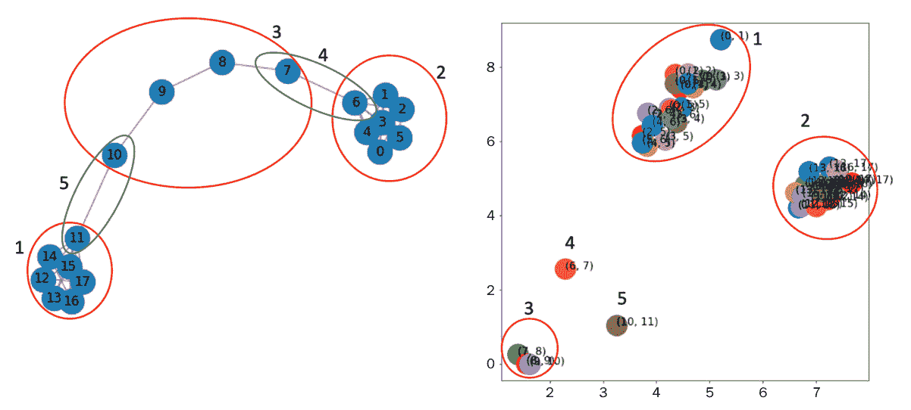

图 2.5 – 将 Hadamard 算法应用于图（左）以生成其边的嵌入向量（右）

关于节点嵌入，在*图 2.5*中，我们报告了边嵌入算法的结果。从图中可以看出，边嵌入算法清楚地识别了相似的边。正如预期的那样，属于第 1、2 和 3 组的边在定义良好且分组清晰的区域内聚集。此外，属于第 4 组的(6,7)边和属于第 5 组的(10,11)边在特定的组内很好地聚集。

最后，我们将提供一个**图到向量**（**Grap2Vec**）嵌入算法的示例。该算法将单个图映射到向量。至于另一个示例，我们将在下一章中更详细地讨论此算法。在下面的代码块中，我们提供了一个 Python 示例，说明如何使用 Graph2Vec 算法在图集上生成嵌入表示：

```py
import random
import matplotlib.pyplot as plt
from karateclub import Graph2Vec
n_graphs = 20
def generate_random():
    n = random.randint(5, 20)
    k = random.randint(5, n)
    p = random.uniform(0, 1)
    return nx.watts_strogatz_graph(n,k,p)
Gs = [generate_random() for x in range(n_graphs)]
model = Graph2Vec(dimensions=2)
model.fit(Gs)
embeddings = model.get_embedding()
fig, ax = plt.subplots(figsize=(10,10))
for i,vec in enumerate(embeddings):
    ax.scatter(vec[0],vec[1], s=1000)
    ax.annotate(str(i), (vec[0],vec[1]), fontsize=16)
```

在这个例子中，已经做了以下工作：

1.  20 个 Watts-Strogatz 图（在上一章中描述）已使用随机参数生成。

1.  我们已经执行了图嵌入算法，以生成每个图的二维向量表示。

1.  最后，生成的向量被绘制在其欧几里得空间中。

本例的结果在*图 2.6*中显示：

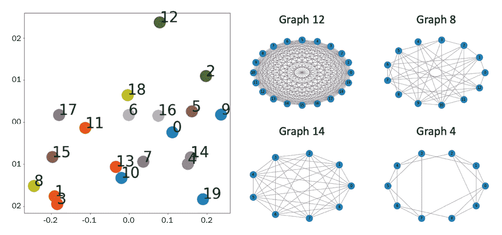

图 2.6 – 使用 Graph2Vec 算法应用于 20 个随机生成的 Watts-Strogatz 图生成的两个嵌入向量的图（左）。展示了两个具有较大欧几里得距离的图（图 12 和图 8 在右上角）以及两个具有较低欧几里得距离的图（图 14 和图 4 在右下角）

如*图 2.6*所示，具有较大欧几里得距离的图，例如图 12 和图 8，具有不同的结构。前者使用`nx.watts_strogatz_graph(20,20,0.2857)`参数生成，后者使用`nx.watts_strogatz_graph(13,6,0.8621)`参数生成。相比之下，具有较低欧几里得距离的图，例如图 14 和图 8，具有相似的结构。图 14 使用`nx.watts_strogatz_graph(9,9,0.5091)`命令生成，而图 4 使用`nx.watts_strogatz_graph(10,5,0.5659)`生成。

在科学文献中，已经开发出大量的嵌入方法。我们将在本书的下一节中详细描述并使用其中的一些方法。这些方法通常分为两大类：*归纳*和*演绎*，这取决于在添加新样本时函数的更新过程。如果提供了新节点，归纳方法会更新模型（例如，重新训练）以推断有关节点的信息，而在归纳方法中，模型预期可以推广到训练期间未观察到的新的节点、边或图。

# 图嵌入机器学习算法的分类

已经开发出多种方法来为图表示生成紧凑的空间。近年来，研究人员和机器学习从业者趋向于统一符号，以提供一个共同的定义来描述此类算法。在本节中，我们将介绍论文《图上的机器学习：一个模型和综合分类》中定义的分类的简化版本（[`arxiv.org/abs/2005.03675`](https://arxiv.org/abs/2005.03675)）。

在这种形式表示中，每个图、节点或边嵌入方法都可以用两个基本组件来描述，称为编码器和解码器。**编码器**（**ENC**）将输入映射到嵌入空间，而**解码器**（**DEC**）从学习到的嵌入中解码关于图的结构信息（*图 2.7*）。

论文中描述的框架遵循一个直观的想法：如果我们能够将一个图编码，使得解码器能够检索所有必要的信息，那么嵌入必须包含所有这些信息的压缩版本，并且可以用于下游机器学习任务：

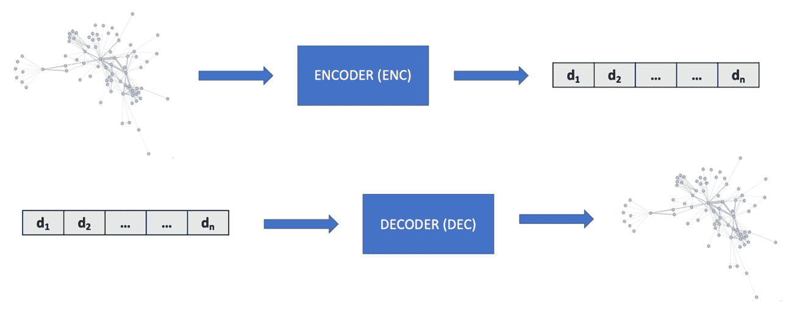

图 2.7 – 嵌入算法的通用编码器（ENC）和解码器（DEC）架构

在许多基于图的机器学习算法中，用于表示学习，解码器通常被设计为将节点嵌入对映射到实值，通常表示原始图中节点的邻近度（距离）。例如，可以实现解码器，给定两个节点的嵌入表示，和，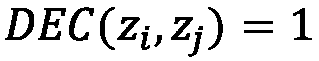如果输入图中存在连接两个节点的边，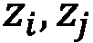。在实践中，更有效的*邻近度函数*可以用来衡量节点之间的相似性。

## 嵌入算法的分类

受到*图 2.7*中描述的通用框架的启发，我们现在将对各种嵌入算法进行分类，分为四大主要类别。此外，为了帮助您更好地理解这种分类，我们将提供简单的伪代码代码片段。在我们的伪代码形式中，我们用`G`表示一个通用的`networkx`图，`graphs_list`表示`networkx`图的列表，`model`表示一个通用的嵌入算法：

+   `graphs_list`（第 2 行）。无监督和监督浅层嵌入方法将分别在*第三章*，“无监督图学习”和*第四章*，“监督图学习”中描述。

+   `graphs_list`（第 1 行）。一旦模型在输入训练集上拟合，就可以用它来生成一个未见过的图`G`的嵌入向量。图自动编码方法将在*第三章*，“无监督图学习”中描述。

+   **邻域聚合方法**：这些算法可以用于在图级别提取嵌入，其中节点被标记为某些属性。此外，对于图自动编码方法，属于此类别的算法能够学习一个通用的映射函数，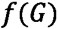，也能够为未见实例生成嵌入向量。

    这些算法的一个良好特性是能够构建一个嵌入空间，不仅考虑了图的内部结构，还考虑了一些外部信息，定义为节点属性。例如，使用这种方法，我们可以有一个能够同时识别具有相似结构和节点上不同属性的图的嵌入空间。无监督和监督的邻域聚合方法将分别在*第三章* *无监督图学习*和*第四章* *监督图学习*中描述。

+   **图正则化方法**：基于图正则化的方法与前面列出的方法略有不同。在这里，我们没有图作为输入。相反，目标是通过对特征集的“交互”来学习，从而正则化过程。更详细地说，可以通过考虑特征相似性从特征构建一个图。主要思想基于这样的假设：图中相邻的节点很可能具有相同的标签。因此，损失函数被设计成约束标签与图结构的一致性。例如，正则化可能约束相邻节点在 L2 范数距离上共享相似的嵌入。因此，编码器只使用*X*节点特征作为输入。

    属于这个家族的算法学习一个函数，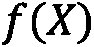，它将一组特定的特征()映射到一个嵌入向量。至于图自动编码和邻域聚合方法，这个算法也能够将学习到的函数应用于新的、未见过的特征。图正则化方法将在*第四章* *监督图学习*中描述。

对于属于浅层嵌入方法和邻域聚合方法的算法，可以定义一个*无监督*和*监督*版本。属于图自动编码方法的算法适用于无监督任务，而属于图正则化方法的算法用于半监督/监督设置。

对于无监督算法，特定数据集的嵌入仅使用输入数据集中包含的信息执行，例如节点、边或图。对于监督设置，使用外部信息来指导嵌入过程。这些信息通常被归类为标签，例如一对*<Gi,yi>*)，将每个图分配给一个特定的类别。这个过程比无监督过程更复杂，因为模型试图找到最佳的向量表示，以便找到对实例的最佳标签分配。为了阐明这个概念，我们可以以图像分类中的*卷积神经网络*为例。在它们的训练过程中，神经网络试图通过同时拟合各种卷积滤波器来将每个图像分类到正确的类别。这些卷积滤波器的目标是找到输入数据的紧凑表示，以最大化预测性能。同样的概念也适用于监督图嵌入，其中算法试图找到最佳的图表示，以最大化类别分配任务的性能。

从更数学的角度来看，所有这些模型都是通过适当的损失函数进行训练的。这个函数可以使用两个术语进行泛化：

+   第一个用于监督设置中，以最小化预测值与目标值之间的差异。

+   第二个用于评估输入图与经过 ENC + DEC 步骤后重建的图之间的相似性（即结构重建误差）。

正式来说，它可以定义为以下内容：

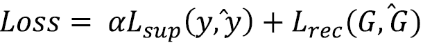

在这里，是监督设置中的损失函数。模型被优化以最小化每个实例中正确值(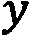)与预测类别(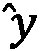)之间的误差。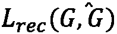是表示输入图()与经过 ENC + DEC 过程后获得的图(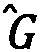)之间重建误差的损失函数。对于无监督设置，我们有相同的损失函数，但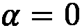，因为我们没有目标变量可以使用。

当我们试图在图上解决机器学习问题时，这些算法扮演着非常重要的角色。它们可以被*被动地*使用，以便将图转换为适合经典机器学习算法或数据可视化任务的特性向量。但它们也可以在学习过程中*主动地*使用，此时机器学习算法会找到一个紧凑且具有意义的解决方案来解决特定问题。

# 摘要

在本章中，我们刷新了一些基本的机器学习概念，并探讨了它们如何应用于图。我们定义了基本的*图机器学习*术语，特别关注*图表示学习*。为了阐明多年来开发的各个解决方案的不同之处，我们提出了主要图机器学习算法的分类。最后，提供了实际例子，以开始理解理论如何应用于实际问题。

在下一章中，我们将回顾主要的基于图的机器学习算法。我们将分析它们的行为，并了解它们在实际中的应用方式。
