# 第四章：监督图学习

**监督学习（Supervised learning**）（SL）很可能是大多数实际**机器学习（ML**）任务的代表。多亏了越来越活跃和有效的数据收集活动，如今处理带标签的数据集是非常常见的。

这也适用于图数据，其中标签可以分配给节点、社区，甚至整个结构。那么，任务就是学习一个从输入到标签的映射函数（也称为目标或注释）。

例如，给定一个表示社交网络的图，我们可能会被要求猜测哪个用户（节点）会关闭他们的账户。我们可以通过在**历史数据**上训练图机器学习来学习这个预测函数，其中每个用户根据他们在几个月后是否关闭账户被标记为“忠诚”或“退出”。

在本章中，我们将探讨监督学习（SL）的概念以及它如何在图上应用。因此，我们还将提供主要监督图嵌入方法的概述。以下主题将涵盖：

+   监督图嵌入路线图

+   基于特征的方法

+   浅层嵌入方法

+   图正则化方法

+   图**卷积神经网络（CNNs**）

# 技术要求

我们将使用带有 *Python* 3.8 的 *Jupyter* 笔记本来进行所有练习。在下面的代码块中，你可以看到使用 `pip` 安装本章所需库的列表（例如，在命令行中运行 `pip install networkx==2.5`）：

```py
Jupyter==1.0.0
networkx==2.5
matplotlib==3.2.2
node2vec==0.3.3
karateclub==1.0.19
scikit-learn==0.24.0
pandas==1.1.3
numpy==1.19.2
tensorflow==2.4.1
neural-structured-learning==1.3.1
stellargraph==1.2.1
```

在本书的其余部分，除非明确说明，否则我们将把 `nx` 作为 `import networkx as nx` Python 命令的结果来引用。

本章相关的所有代码文件均可在[`github.com/PacktPublishing/Graph-Machine-Learning/tree/main/Chapter04`](https://github.com/PacktPublishing/Graph-Machine-Learning/tree/main/Chapter04)找到。

# 监督图嵌入路线图

在监督学习（SL）中，训练集由一系列有序对 (*x*, *y*) 组成，其中 *x* 是一组输入特征（通常是定义在图上的信号），而 *y* 是分配给它的输出标签。因此，机器学习模型的目标是学习将每个 *x* 值映射到每个 *y* 值的函数。常见的监督任务包括预测大型社交网络中的用户属性或预测分子的属性，其中每个分子都是一个图。

有时，然而，并非所有实例都能提供标签。在这种情况下，一个典型的数据集由一小部分带标签的实例和一大部分未带标签的实例组成。对于这种情况，提出了**半监督学习（semi-SL**）（也称为**SSL**），其中算法旨在利用可用标签信息反映的标签依赖信息，以便学习对未标记样本的预测函数。

关于监督图机器学习技术，已经开发了许多算法。然而，正如不同科学论文之前所报告的（[`arxiv.org/abs/2005.03675`](https://arxiv.org/abs/2005.03675)），它们可以被分组为如**基于特征的方法**、**浅层嵌入方法**、**正则化方法**和**图神经网络**（**GNNs**）等宏观组，如下面的图中所示：

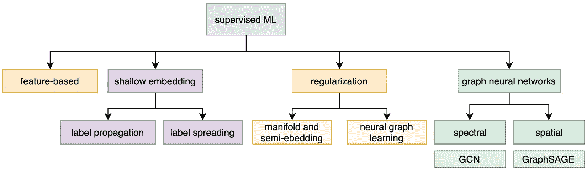

图 4.1 – 本书中描述的不同监督嵌入算法的层次结构

在接下来的章节中，你将学习到每组算法背后的主要原理。我们还将尝试对领域内最著名的算法提供洞察，因为这些算法可以用来解决现实世界的问题。

# 基于特征的方法

在图上应用机器学习的一个非常简单（但强大）的方法是将编码函数视为一个简单的嵌入查找。在处理监督任务时，实现这一点的简单方法之一是利用图属性。在*第一章*《开始使用图》中，我们学习了如何通过结构属性来描述图（或图中的节点），每个“编码”都从图中本身提取了重要信息。

让我们暂时忘记图上的机器学习：在经典监督机器学习中，任务是找到一个函数，将实例的（描述性）特征集合映射到特定的输出。这些特征应该精心设计，以便它们足够具有代表性，可以学习该概念。因此，当花瓣数量和萼片长度可能是一个花的良好描述符时，在描述图时，我们可能依赖于其平均度、全局效率和其特征路径长度。

这种浅层方法分为两个步骤，具体如下：

1.  选择一组*良好*的描述性图属性。

1.  使用这些属性作为传统机器学习算法的输入。

不幸的是，没有关于*良好*描述性属性的通用定义，它们的选择严格依赖于要解决的问题的具体性。然而，你仍然可以计算大量的图属性，然后进行*特征选择*来选择最有信息量的那些。**特征选择**是机器学习中的一个广泛研究的话题，但提供关于各种方法的详细信息超出了本书的范围。不过，我们建议你参考 Packt Publishing 出版的《机器学习算法——第二版》（[`subscription.packtpub.com/book/big_data_and_business_intelligence/9781789347999`](https://subscription.packtpub.com/book/big_data_and_business_intelligence/9781789347999)），以进一步了解这个主题。

现在让我们看看如何将这样一个基本方法应用到实际例子中。我们将通过使用`PROTEINS`数据集来执行一个监督图分类任务。`PROTEINS`数据集包含表示蛋白质结构的几个图。每个图都有标签，定义蛋白质是否是酶。我们将遵循以下步骤：

1.  首先，让我们通过`stellargraph` Python 库加载数据集，如下所示：

    ```py
    from stellargraph import datasets
    from IPython.display import display, HTML
    dataset = datasets.PROTEINS()
    graphs, graph_labels = dataset.load()
    ```

1.  为了计算图属性，我们将使用`networkx`，如*第一章*中所述，*开始使用图*。为此，我们需要将图从`stellargraph`格式转换为`networkx`格式。这可以通过两个步骤完成：首先，将图从`stellargraph`表示转换为`numpy`邻接矩阵。然后，使用邻接矩阵检索`networkx`表示。此外，我们还将标签（存储为`pandas` Series）转换为`numpy`数组，这样评价函数可以更好地利用它，正如我们将在下一步中看到的。代码如下所示：

    ```py
    # convert from StellarGraph format to numpy adj matrices
    adjs = [graph.to_adjacency_matrix().A for graph in graphs]
    # convert labels from Pandas.Series to numpy array
    labels = graph_labels.to_numpy(dtype=int)
    ```

1.  然后，对于每个图，我们计算全局指标来描述它。在这个例子中，我们选择了边的数量、平均聚类系数和全局效率。然而，我们建议您计算其他您可能认为值得探索的属性。我们可以使用`networkx`提取图指标，如下所示：

    ```py
    import numpy as np
    import networkx as nx
    metrics = []
    for adj in adjs:
      G = nx.from_numpy_matrix(adj)
      # basic properties
      num_edges = G.number_of_edges()
      # clustering measures
      cc = nx.average_clustering(G)
      # measure of efficiency
      eff = nx.global_efficiency(G)
      metrics.append([num_edges, cc, eff]) 
    ```

1.  现在，我们可以利用`scikit-learn`工具来创建训练集和测试集。在我们的实验中，我们将使用 70%的数据集作为训练集，其余的作为测试集。我们可以通过使用`scikit-learn`提供的`train_test_split`函数来实现这一点，如下所示：

    ```py
    from sklearn.model_selection import train_test_split
    X_train, X_test, y_train, y_test = train_test_split(metrics, labels, test_size=0.3, random_state=42)
    ```

1.  现在是时候训练一个合适的机器学习算法了。我们选择了`scikit-learn`的`SVC`模块，如下所示：

    ```py
    from sklearn import svm
    from sklearn.metrics import accuracy_score, precision_score, recall_score, f1_score
    clf = svm.SVC()
    clf.fit(X_train, y_train)
     y_pred = clf.predict(X_test)
    print('Accuracy', accuracy_score(y_test,y_pred))
     print('Precision', precision_score(y_test,y_pred))
     print('Recall', recall_score(y_test,y_pred))
     print('F1-score', f1_score(y_test,y_pred))
    ```

    这应该是之前代码片段的输出：

    ```py
    Accuracy 0.7455
    Precision 0.7709
    Recall 0.8413
    F1-score 0.8045
    ```

我们使用`Accuracy`、`Precision`、`Recall`和`F1-score`来评估算法在测试集上的表现效果。我们达到了大约 80%的 F1 分数，对于这样一个简单任务来说已经相当不错了。

# 浅层嵌入方法

正如我们在*第三章*中描述的，*无监督图学习*，浅层嵌入方法是图嵌入方法的一个子集，它只为有限的数据集学习节点、边或图表示。它们不能应用于与训练模型所用的实例不同的其他实例。在我们开始讨论之前，定义监督和无监督浅层嵌入算法之间的区别是很重要的。

无监督嵌入方法和监督嵌入方法之间的主要区别本质上在于它们试图解决的任务。确实，如果无监督浅层嵌入算法试图学习一个好的图、节点或边表示以构建定义良好的聚类，那么监督算法则试图找到预测任务（如节点、标签或图分类）的最佳解决方案。

在本节中，我们将详细解释一些这些监督浅层嵌入算法。此外，我们将通过提供如何在 Python 中使用这些算法的几个示例来丰富我们的描述。在本节中描述的所有算法，我们将使用 `scikit-learn` 库中可用的基类提供一个自定义实现。

## 标签传播算法

标签传播算法是一种广为人知的半监督算法，在数据科学中得到广泛应用，用于解决节点分类任务。更确切地说，该算法会将给定节点的标签传播到其邻居或具有从该节点到达的高概率的节点。

这种方法背后的基本思想相当简单：给定一个具有一组标记和未标记节点的图，标记节点会将它们的标签传播到具有最高到达概率的节点。在下面的图中，我们可以看到一个具有标记和未标记节点的图的示例：

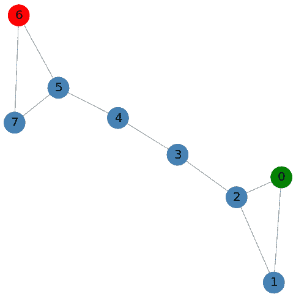

图 4.2 – 具有两个标记节点（红色表示类别 0，绿色表示类别 1）和六个未标记节点的图示例

根据 *图 4.2*，使用标记节点的信息（节点 **0** 和 **6**），算法将计算移动到另一个未标记节点的概率。从标记节点具有最高概率的节点将获得该节点的标签。

形式上，设  为一个图，设 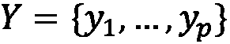 为一组标签。由于该算法是半监督的，只有一部分节点会被分配标签。此外，设 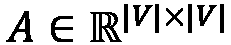 为输入图 G 的邻接矩阵，设  为对角度矩阵，其中每个元素 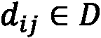 定义如下：

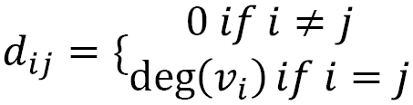

换句话说，度矩阵中唯一的非零元素是对角元素，其值由表示该行的节点的度数给出。在下面的图中，我们可以看到 *图 4.2* 中表示的图的对角度矩阵：

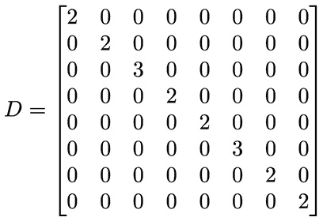

图 4.3 – 图 4.2 中图的对角度矩阵

从*图 4.3*中，我们可以看到矩阵的对角线元素包含非零值，这些值代表特定节点的度数。我们还需要引入转移矩阵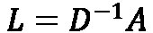。这个矩阵定义了从另一个节点到达节点的概率。更确切地说，是从节点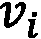到达节点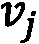的概率。以下图显示了*图 4.2*中描述的图的转移矩阵：

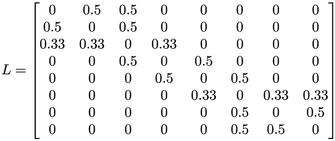

图 4.4 – 图 4.2 中图的转移矩阵

在*图 4.4*中，矩阵显示了给定起始节点达到终止节点的概率。例如，从矩阵的第一行，我们可以看到从节点 0 出发，以 0.5 的概率仅能到达节点 1 和 2。如果我们用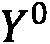定义初始标签分配，使用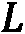矩阵获得的每个节点的标签分配概率可以计算为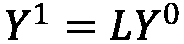。*图 4.2*中图的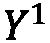矩阵在以下图中显示：

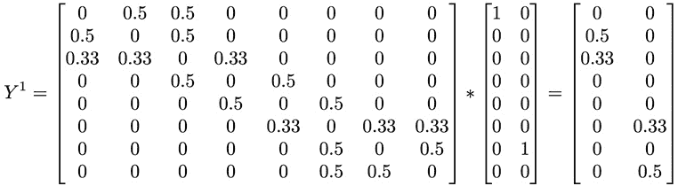

图 4.5 – 使用图 4.2 中图的矩阵得到的解

从*图 4.5*中，我们可以看到，使用转移矩阵，节点 1 和节点 2 被分配到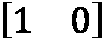标签的概率分别为 0.5 和 0.33，而节点 5 和节点 6 被分配到标签的概率分别为 0.33 和 0.5。

此外，如果我们更好地分析*图 4.5*，我们可以看到两个主要问题，如下所示：

+   使用这个解决方案，可以将概率仅分配给节点[1 2]和[5 7]与一个标签相关联。

+   节点 0 和 6 的初始标签与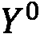中定义的不同。

为了解决第一个问题，算法将执行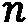次不同的迭代；在每次迭代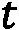中，算法将计算该迭代的解，如下所示：

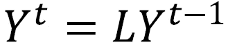

算法在满足一定条件时停止迭代。第二个问题通过在给定迭代的解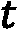中强制标签节点具有初始类值来解决。例如，在计算*图 4.5*中可见的结果后，算法将强制结果矩阵的第一行是，矩阵的第七行是。

在这里，我们提出了`scikit-learn`库中`LabelPropagation`类的修改版。选择这个方案的主要原因是`LabelPropagation`类接受一个表示数据集的矩阵作为输入。矩阵的每一行代表一个样本，每一列代表一个特征。

在执行`fit`操作之前，`LabelPropagation`类内部执行`_build_graph`函数。此函数将使用参数化核（`_get_kernel`函数）构建一个描述输入数据集的图。因此，原始数据集被转换为一个图（其邻接矩阵表示），其中每个节点是一个样本（输入数据集的行），每条边是样本之间的*交互*。

在我们的特定情况下，输入数据集已经是一个图，因此我们需要定义一个新的类，能够处理`networkx`图并在原始图上执行计算操作。通过创建一个新的类——即`GraphLabelPropagation`，通过扩展`ClassifierMixin`、`BaseEstimator`和`ABCMeta`基类来实现这一目标。这里提出的算法主要用于帮助您理解算法背后的概念。整个算法在本书 GitHub 仓库的`04_supervised_graph_machine_learning/02_Shallow_embeddings.ipynb`笔记本中提供。为了描述算法，我们将仅使用`fit(X,y)`函数作为参考。代码如下所示：

```py
class GraphLabelPropagation(ClassifierMixin, BaseEstimator, metaclass=ABCMeta):

     def fit(self, X, y):
        X, y = self._validate_data(X, y)
        self.X_ = X
        check_classification_targets(y)
        D = [X.degree(n) for n in X.nodes()]
        D = np.diag(D)
        # label construction
        # construct a categorical distribution for classification only
       unlabeled_index = np.where(y==-1)[0]
       labeled_index = np.where(y!=-1)[0]
       unique_classes = np.unique(y[labeled_index])
       self.classes_ = unique_classes
       Y0 = np.array([self.build_label(y[x], len(unique_classes)) if x in labeled_index else np.zeros(len(unique_classes)) for x in range(len(y))])

       A = inv(D)*nx.to_numpy_matrix(G)
       Y_prev = Y0
       it = 0
       c_tool = 10
       while it < self.max_iter & c_tool > self.tol:
           Y = A*Y_prev
           #force labeled nodes
           Y[labeled_index] = Y0[labeled_index]
           it +=1
           c_tol = np.sum(np.abs(Y-Y_prev))
           Y_prev = Y
       self.label_distributions_ = Y
       return self
```

`fit(X,y)`函数接受一个`networkx`图和一个表示分配给每个节点的标签的数组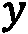。没有标签的节点应有一个代表值-1。`while`循环执行实际计算。更确切地说，它在每次迭代中计算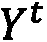的值，并强制将标记节点在解中的值等于其原始输入值。算法执行计算直到满足两个停止条件。在此实现中，使用了以下两个标准：

+   **迭代次数**：算法运行计算直到完成指定的迭代次数。

+   **解的容差误差**：算法运行计算直到连续两次迭代获得的解的绝对差值，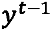和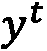，低于给定的阈值值。

该算法可以使用以下代码应用于*图 4.2*所示的示例图：

```py
glp = GraphLabelPropagation()
y = np.array([-1 for x in range(len(G.nodes()))])
y[0] = 0
y[6] = 1
glp.fit(G,y)
 glp.predict_proba(G)
```

算法得到的结果如下所示：

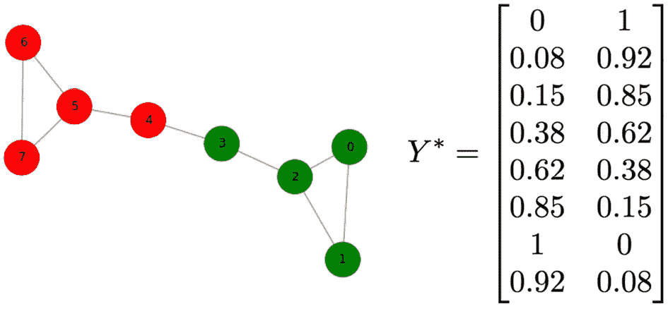

图 4.6 – 标签传播算法在图 4.2 上的结果：左侧为最终标记图；右侧为最终概率分配矩阵

在 *图 4.6* 中，我们可以看到算法应用于 *图 4.2* 中示例的结果。从最终的概率分配矩阵中，我们可以看到由于算法的约束，初始标记节点的概率为 1，以及“靠近”标记节点的节点如何获得它们的标签。

## 标签传播算法

标签传播算法是另一种半监督浅嵌入算法。它是为了克服标签传播方法的一个大限制：**初始标记**。确实，根据标签传播算法，初始标签在训练过程中不能修改，并且在每次迭代中，它们被迫等于其原始值。这种约束可能会在初始标记受到错误或噪声影响时产生错误的结果。因此，错误将传播到输入图的所有节点。

为了解决这一限制，标签传播算法试图放松原始标记数据的约束，允许标记输入节点在训练过程中改变其标签。

形式上，设 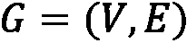 为一个图，设 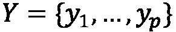 为一组标签（由于算法是半监督的，只有一部分节点会被分配标签），设 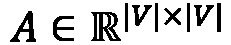 和 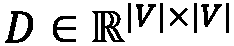 分别为图 G 的邻接矩阵对角度矩阵。标签传播算法不是计算概率转移矩阵，而是使用以下定义的归一化图拉普拉斯矩阵：

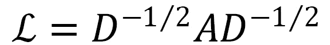

与标签传播一样，这个矩阵可以看作是整个图中定义的连接的某种紧凑的低维表示。这个矩阵可以使用以下代码通过 `networkx` 容易地计算：

```py
from scipy.linalg import fractional_matrix_power
D_inv = fractional_matrix_power(D, -0.5)
 L = D_inv*nx.to_numpy_matrix(G)*D_inv
```

结果如下：

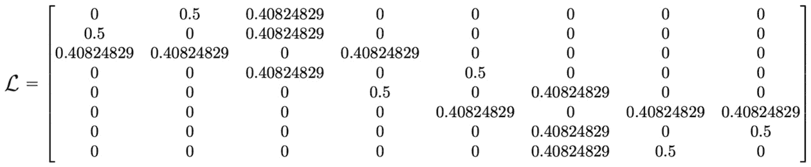

图 4.7 – 归一化图拉普拉斯矩阵

标签传播算法与标签传播算法之间最重要的区别与用于提取标签的函数有关。如果我们用 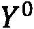 定义初始标签分配，使用  矩阵获得的每个节点的标签分配概率可以按以下方式计算：

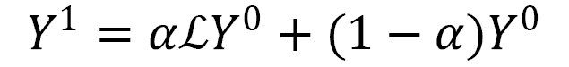

与标签传播一样，标签传播有一个迭代过程来计算最终解。算法将执行 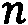 次不同的迭代；在每次迭代 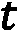 中，算法将计算该迭代的解，如下所示：

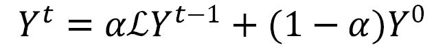

算法在满足一定条件时停止迭代。重要的是要强调方程中的术语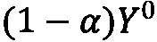。实际上，正如我们所说，标签传播并不强制解的标记元素等于其原始值。相反，算法使用正则化参数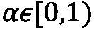在每个迭代中对原始解的影响进行加权。这允许我们明确地强制原始解的“质量”及其在最终解中的影响。

与标签传播算法一样，在以下代码片段中，我们提出了由于我们在上一节中提到的动机而修改的`LabelSpreading`类，该类可在`scikit-learn`库中找到。我们通过扩展我们的`GraphLabelPropagation`类提出了`GraphLabelSpreading`类，因为唯一的区别将在于类的`fit()`方法。整个算法在本书 GitHub 仓库中的`04_supervised_graph_machine_learning/02_Shallow_embeddings.ipynb`笔记本中提供：

```py
class GraphLabelSpreading(GraphLabelPropagation):
    def fit(self, X, y):
        X, y = self._validate_data(X, y)
        self.X_ = X
        check_classification_targets(y)
        D = [X.degree(n) for n in X.nodes()]
        D = np.diag(D)
        D_inv = np.matrix(fractional_matrix_power(D,-0.5))
        L = D_inv*nx.to_numpy_matrix(G)*D_inv
        # label construction
        # construct a categorical distribution for classification only
        labeled_index = np.where(y!=-1)[0]
        unique_classes = np.unique(y[labeled_index])
        self.classes_ = unique_classes
         Y0 = np.array([self.build_label(y[x], len(unique_classes)) if x in labeled_index else np.zeros(len(unique_classes)) for x in range(len(y))])

        Y_prev = Y0
        it = 0
        c_tool = 10
        while it < self.max_iter & c_tool > self.tol:
           Y = (self.alpha*(L*Y_prev))+((1-self.alpha)*Y0)
            it +=1
            c_tol = np.sum(np.abs(Y-Y_prev))
            Y_prev = Y
        self.label_distributions_ = Y
        return self
```

在这个类中，`fit()`函数是焦点。该函数接受一个`networkx`图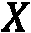和一个表示每个节点分配的标签的数组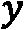。没有标签的节点应有一个代表值-1。`while`循环在每个迭代中计算值，通过参数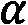加权初始标记的影响。此外，对于这个算法，迭代次数和连续两个解之间的差异被用作停止标准。

该算法可以使用*图 4.2*中描述的示例图，以下代码实现：

```py
gls = GraphLabelSpreading()
y = np.array([-1 for x in range(len(G.nodes()))])
y[0] = 0
y[6] = 1
gls.fit(G,y)
 gls.predict_proba(G)
```

在以下图中，展示了算法得到的结果：

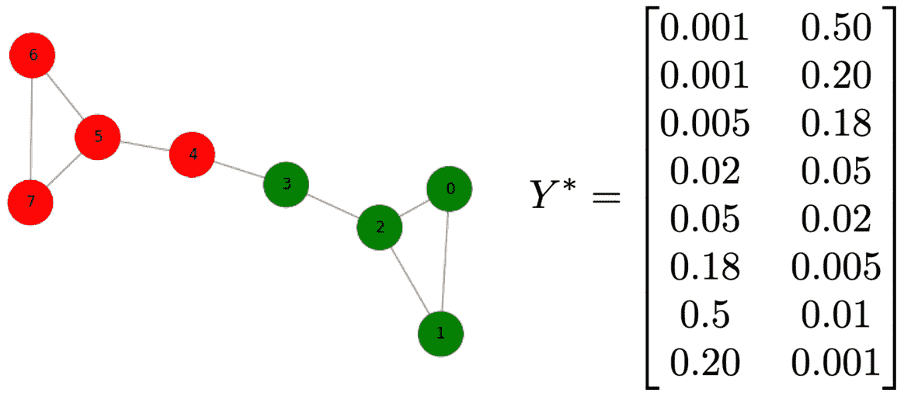

图 4.8 – 标签传播算法在图 4.2 中的结果：左侧为最终标记的图；右侧为最终概率分配矩阵

在*图 4.8*中显示的结果看起来与使用标签传播算法获得的结果相似。主要区别与标签分配的概率有关。实际上，在这种情况下，我们可以看到节点 0 和 6（具有初始标签的节点）的概率为 0.5，这比使用标签传播算法获得的概率 1 显著低。这种行为是预期的，因为初始标签分配的影响是通过正则化参数加权的。

在下一节中，我们将继续描述监督图嵌入方法。我们将描述基于网络的信息如何帮助正则化训练并创建更鲁棒的模型。

# 图正则化方法

在上一节中描述的浅层嵌入方法展示了如何将拓扑信息和数据点之间的关系编码并利用，以构建更鲁棒的分类器并解决半监督任务。一般来说，网络信息在约束模型和确保输出在相邻节点内平滑时可以非常有用。正如我们在前面的章节中已经看到的，这个想法可以有效地用于半监督任务，在传播邻居无标记节点的信息时。

另一方面，这也可以用来正则化学习阶段，以创建更鲁棒且倾向于更好地泛化到未见示例的模型。我们之前看到的标签传播和标签扩散算法可以作为成本函数实现，当添加一个额外的正则化项时进行最小化。通常，在监督任务中，我们可以将最小化的成本函数写成以下形式：

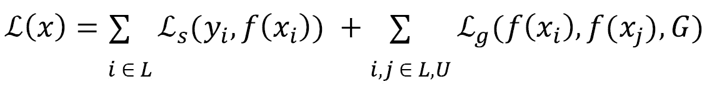

在这里， 和 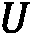 分别代表标记和无标记的样本，第二个项作为一个正则化项，它依赖于图  的拓扑信息。

在本节中，我们将进一步描述这样一个想法，并看看它如何非常强大，尤其是在正则化神经网络训练时，如您所知，神经网络自然倾向于过拟合，并且/或者需要大量的数据才能有效地进行训练。

## 流形正则化和半监督嵌入

**流形正则化**（Belkin 等人，2006 年）通过在**再生核希尔伯特空间**（**RKHS**）中对模型函数进行参数化，并使用**均方误差**（**MSE**）或**折损损失**作为监督损失函数（前一个方程中的第一个项），扩展了标签传播框架。换句话说，当训练支持向量机或最小二乘拟合时，它们会基于拉普拉斯矩阵 *L* 应用图正则化项，如下所示：


因此，这些方法通常被标记为**拉普拉斯正则化**，这样的公式导致了**拉普拉斯正则化最小二乘法**（**LapRLS**）和**LapSVM**分类。标签传播和标签扩散可以看作是流形正则化的一个特例。此外，这些算法也可以在没有标记数据的情况下使用（方程中的第一个项消失），这会简化为**拉普拉斯特征映射**。

另一方面，它们也可以用于完全标记的数据集的情况，在这种情况下，前面的术语将约束训练阶段以正则化训练并实现更鲁棒的模型。此外，由于模型是在 RKHS 中参数化的分类器，因此它可以用于未观察到的样本，并且不需要测试样本属于输入图。从这个意义上说，它因此是一个*归纳*模型。

**流形学习**仍然代表一种浅层学习形式，其中参数化的函数不利用任何形式的中间嵌入。**半监督嵌入**（Weston 等人，2012 年）通过在神经网络的中间层上施加函数的约束和光滑性，将图正则化的概念扩展到更深的架构。让我们将 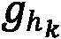 定义为第 *k* 个隐藏层的中间输出。半监督嵌入框架中提出的正则化项如下所示：

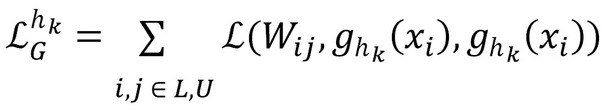

根据正则化施加的位置，可以实现三种不同的配置（如图 *4.9* 所示），如下所示：

+   正则化应用于网络的最终输出。这对应于将流形学习技术泛化到多层神经网络。

+   正则化应用于网络的中间层，从而正则化嵌入表示。

+   正则化应用于共享前 k-1 层的辅助网络。这基本上对应于在同时训练监督网络的同时训练无监督嵌入网络。这种技术基本上对受无监督网络约束的前 k-1 层施加了派生的正则化，并同时促进了网络节点的嵌入。

以下图表展示了使用半监督嵌入框架可以实现的三个不同配置的示意图——它们的相似之处和不同之处：

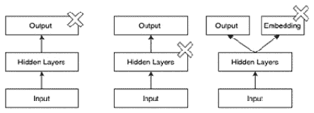

图 4.9 – 半监督嵌入正则化配置：用交叉表示的图正则化可以应用于输出（左）、中间层（中）或辅助网络（右）

在其原始公式中，用于嵌入的损失函数是从 Siamese 网络公式推导出来的，如下所示：

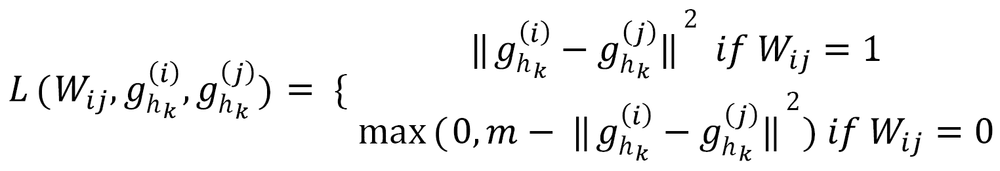

从这个方程可以看出，损失函数确保相邻节点的嵌入保持接近。另一方面，非相邻节点被拉远到由阈值！[](img/B16069__04_056.png)指定的距离（至少）。与基于拉普拉斯算子！[](img/B16069__04_057.png)的正则化（尽管对于相邻点，惩罚因子实际上得到了恢复）相比，这里展示的通常更容易通过梯度下降进行优化。

在*图 4.9*中展示的三种配置中，最佳选择在很大程度上受到可用数据以及特定用例的影响——也就是说，您是否需要一个正则化模型输出或学习高级数据表示。然而，您应该始终记住，当使用 softmax 层（通常在输出层进行）时，基于 hinge 损失的正则化可能不太合适或适合对数概率。在这种情况下，应该在中间层引入正则化嵌入和相对损失。然而，请注意，位于深层层的嵌入通常更难训练，需要仔细调整学习率和边界以使用。

## 神经图学习

**神经图学习**（**NGL**）基本上推广了之前的公式，并且正如我们将看到的，使得将图正则化无缝应用于任何形式的神经网络成为可能，包括 CNN 和**循环神经网络**（**RNN**）。特别是，存在一个名为**神经结构学习**（**NSL**）的极其强大的框架，它允许我们通过非常少的代码行将 TensorFlow 中实现的神经网络扩展到图正则化。网络可以是任何类型：自然或合成。

当是合成的，图可以通过不同的方式生成，例如使用无监督方式学习的嵌入和/或使用样本特征之间的相似性/距离度量。您还可以使用对抗性示例生成合成图。对抗性示例是通过以某种方式扰动实际（真实）示例而人工生成的样本，以混淆网络，试图强制预测错误。这些精心设计的样本（通过在梯度下降方向上扰动给定样本以最大化错误而获得）可以与其相关样本连接，从而生成图。然后可以使用这些连接来训练网络的图正则化版本，使我们能够获得对对抗性生成的示例更具鲁棒性的模型。

NGL 通过增强神经网络中图正则化的调整参数来扩展正则化，分别使用三个参数！[](img/B16069__04_058.png)、！[](img/B16069__04_059.png)和！[](img/B16069__04_060.png)分解标签-标签、标签-未标记和未标记-未标记关系的贡献，如下所示：


函数代表两个向量之间的通用距离——例如，L2 范数。通过改变系数和的定义，我们可以得到之前作为极限行为的不同算法，如下所示：

+   当时，我们检索到神经网络的非正则化版本。

+   当只有时，我们恢复了一个完全监督的公式，其中节点之间的关系起到正则化训练的作用。

+   当我们将由一组α系数参数化的（要学习的值映射到每个样本的实例类别时），我们恢复了标签传播公式。

通俗地说，NGL 公式可以看作是标签传播和标签扩散算法的非线性版本，或者是一种图正则化神经网络，其中可以获取流形学习或半监督嵌入。

现在，我们将 NGL 应用于一个实际示例，你将学习如何在神经网络中应用图正则化。为此，我们将使用 NLS 框架([`github.com/tensorflow/neural-structured-learning`](https://github.com/tensorflow/neural-structured-learning))，这是一个建立在 TensorFlow 之上的库，它使得在标准神经网络上仅用几行代码即可实现图正则化。

对于我们的示例，我们将使用`Cora`数据集，这是一个包含 2,708 篇计算机科学论文的有标签数据集，这些论文被分为七个类别。每篇论文代表一个节点，该节点根据引用与其他节点相连。网络中总共有 5,429 个链接。

此外，每个节点还由一个 1,433 个二进制值（0 或 1）的向量进一步描述，这些值代表一个二分`Cora`数据集，可以直接从`stellargraph`库中用几行代码下载，如下所示：

```py
from stellargraph import datasets
dataset = datasets.Cora()
dataset.download()
G, labels = dataset.load()
```

这返回两个输出，如下所述：

+   `G`是包含网络节点、边和描述 BOW 表示的特征的引用网络。

+   `labels`是一个`pandas` Series，它提供了论文 ID 与一个类别之间的映射，如下所示：

    ```py
    ['Neural_Networks', 'Rule_Learning', 'Reinforcement_Learning', 
    'Probabilistic_Methods', 'Theory', 'Genetic_Algorithms', 'Case_Based']
    ```

从这些信息开始，我们创建一个训练集和一个验证集。在训练样本中，我们将包括与邻居相关的信息（这些邻居可能属于也可能不属于训练集，因此可能有标签），这将用于正则化训练。

另一方面，验证样本将没有邻域信息，预测标签将仅取决于节点特征——即词袋（BOW）表示。因此，我们将利用标记和无标记样本（半监督任务）来生成一个可以用于未观察样本的归纳模型。

首先，我们将节点特征方便地结构化为一个 DataFrame，而将图存储为邻接矩阵，如下所示：

```py
adjMatrix = pd.DataFrame.sparse.from_spmatrix(
        G.to_adjacency_matrix(), 
        index=G.nodes(), columns=G.nodes()
)
features = pd.DataFrame(G.node_features(), index=G.nodes())
```

使用 `adjMatrix`，我们实现了一个辅助函数，能够检索节点的最接近的 `topn` 邻居，返回节点 ID 和边权重，如下面的代码片段所示：

```py
def getNeighbors(idx, adjMatrix, topn=5):
    weights = adjMatrix.loc[idx]
    neighbors = weights[weights>0]\
         .sort_values(ascending=False)\
         .head(topn)
    return [(k, v) for k, v in neighbors.iteritems()]
```

使用前面的信息和辅助函数，我们可以将信息合并到一个单独的 DataFrame 中，如下所示：

```py
dataset = {
    index: {
        "id": index,
        "words": [float(x) 
                  for x in features.loc[index].values], 
        "label": label_index[label],
        "neighbors": getNeighbors(index, adjMatrix, topn)
    }
    for index, label in labels.items()
}
df = pd.DataFrame.from_dict(dataset, orient="index")
```

这个 DataFrame 代表了以节点为中心的特征空间。如果我们使用一个不利用节点间关系信息的常规分类器，这将足够了。然而，为了允许计算图正则化项，我们需要将前面的 DataFrame 与与每个节点的邻域相关的信息连接起来。然后我们定义一个函数，能够检索并连接邻域信息，如下所示：

```py
def getFeatureOrDefault(ith, row):
    try:
        nodeId, value = row["neighbors"][ith]
        return {
            f"{GRAPH_PREFIX}_{ith}_weight": value,
            f"{GRAPH_PREFIX}_{ith}_words": df.loc[nodeId]["words"]
        } 
     except:
        return {
            f"{GRAPH_PREFIX}_{ith}_weight": 0.0,
            f"{GRAPH_PREFIX}_{ith}_words": [float(x) for x in np.zeros(1433)]
        } 
def neighborsFeatures(row):
    featureList = [getFeatureOrDefault(ith, row) for ith in range(topn)]
    return pd.Series(
        {k: v 
         for feat in featureList for k, v in feat.items()}
    )
```

如前面的代码片段所示，当邻居数量少于 `topn` 时，我们将权重和单词的 one-hot 编码设置为 `0`。`GRAPH_PREFIX` 常量是一个前缀，它将被添加到所有将后来由 `nsl` 库用于正则化的特征之前。尽管它可以更改，但在下面的代码片段中，我们将保持其默认值：`"NL_nbr"`。

这个函数可以应用于 DataFrame，以计算完整的特征空间，如下所示：

```py
neighbors = df.apply(neighborsFeatures, axis=1)
allFeatures = pd.concat([df, neighbors], axis=1)
```

现在，`allFeatures` 中包含了我们实现图正则化模型所需的所有成分。

我们首先将数据集分为训练集和验证集，如下所示：

```py
n = int(np.round(len(labels)*ratio))  
labelled, unlabelled = model_selection.train_test_split(
    allFeatures, train_size=n, test_size=None, stratify=labels
)
```

通过改变比率，我们可以改变标记数据点与无标记数据点的数量。随着比率的降低，我们预计标准非正则化分类器的性能会降低。然而，这种降低可以通过利用无标记数据提供的网络信息来补偿。因此，我们预计图正则化神经网络将提供更好的性能，因为它们利用了增强的信息。对于下面的代码片段，我们将假设 `ratio` 值等于 `0.2`。

在将此数据输入到我们的神经网络之前，我们将 DataFrame 转换为 TensorFlow 张量和数据集，这是一个方便的表示，将允许模型在其输入层中引用特征名称。

由于输入特征具有不同的数据类型，最好分别处理 `weights`、`words` 和 `labels` 值的数据集创建，如下所示：

```py
train_base = {
    "words": tf.constant([
         tuple(x) for x in labelled["words"].values
    ]),
    "label": tf.constant([
         x for x in labelled["label"].values
    ])
 }
train_neighbor_words = {
    k: tf.constant([tuple(x) for x in labelled[k].values])
    for k in neighbors if "words" in k
}
train_neighbor_weights = {
^    k: tf.constant([tuple([x]) for x in labelled[k].values])
    for k in neighbors if "weight" in k
} 
```

现在我们有了张量，我们可以将所有这些信息合并到一个 TensorFlow 数据集中，如下所示：

```py
trainSet = tf.data.Dataset.from_tensor_slices({
    k: v
    for feature in [train_base, train_neighbor_words,
                    train_neighbor_weights]
    for k, v in feature.items()
})
```

我们可以类似地创建一个验证集。如前所述，由于我们想要设计一个归纳算法，验证数据集不需要任何邻域信息。代码如下所示：

```py
validSet = tf.data.Dataset.from_tensor_slices({
    "words": tf.constant([
       tuple(x) for x in unlabelled["words"].values
    ]),
    "label": tf.constant([
       x for x in unlabelled["label"].values
    ])
 })
```

在将数据集输入模型之前，我们需要将特征与标签分开，如下所示：

```py
def split(features):
    labels=features.pop("label")
    return features, labels
trainSet = trainSet.map(f)
 validSet = validSet.map(f)
```

就这样！我们已经生成了我们模型的输入。我们还可以通过打印特征和标签的值来检查我们数据集的一个样本批次，如下面的代码块所示：

```py
for features, labels in trainSet.batch(2).take(1):
    print(features)
    print(labels)
```

现在是时候创建我们的第一个模型了。为此，我们从简单的架构开始，该架构以单热表示作为输入，并有两个隐藏层，每个隐藏层由一个`Dense`层和一个具有 50 个单位的`Dropout`层组成，如下所示：

```py
inputs = tf.keras.Input(
    shape=(vocabularySize,), dtype='float32', name='words'
)
cur_layer = inputs
for num_units in [50, 50]:
    cur_layer = tf.keras.layers.Dense(
        num_units, activation='relu'
    )(cur_layer)
    cur_layer = tf.keras.layers.Dropout(0.8)(cur_layer)
outputs = tf.keras.layers.Dense(
    len(label_index), activation='softmax',
    name="label"
)(cur_layer)
model = tf.keras.Model(inputs, outputs=outputs)
```

事实上，我们也可以通过简单地编译模型以创建计算图来训练这个模型而不使用图正则化，如下所示：

```py
model.compile(
    optimizer='adam',
    loss='sparse_categorical_crossentropy',
    metrics=['accuracy']
)
```

然后，我们可以像往常一样运行它，同时允许将历史文件写入磁盘，以便使用`TensorBoard`进行监控，如下面的代码片段所示：

```py
from tensorflow.keras.callbacks import TensorBoard
model.fit(
    trainSet.batch(128), epochs=200, verbose=1,
    validation_data=validSet.batch(128),
    callbacks=[TensorBoard(log_dir='/tmp/base)]
)
```

在处理过程的最后，我们应该得到以下类似的输出：

```py
Epoch 200/200
loss: 0.7798 – accuracy: 06795 – val_loss: 1.5948 – val_accuracy: 0.5873
```

在准确率大约为 0.6 的顶级性能下，我们现在需要创建前面模型的图正则化版本。首先，我们需要从头开始重新创建我们的模型。这在比较结果时很重要。如果我们使用之前模型中已经初始化并使用的层，则层权重将不会是随机的，而是会使用之前运行中已经优化的权重。一旦创建了一个新的模型，我们只需几行代码就可以在训练时添加图正则化技术，如下所示：

```py
import neural_structured_learning as nsl
graph_reg_config = nsl.configs.make_graph_reg_config(
    max_neighbors=2,
    multiplier=0.1,
    distance_type=nsl.configs.DistanceType.L2,
    sum_over_axis=-1)
graph_reg= nsl.keras.GraphRegularization(
     model, graph_reg_config)
```

让我们分析正则化的不同超参数，如下所示：

+   `max_neighbors` 调整用于计算每个节点正则化损失的邻居数量。

+   `multiplier` 对应于调整正则化损失重要性的系数。由于我们只考虑有标签-有标签和有标签-无标签，这实际上对应于  和 。

+   `distance_type` 表示要使用的成对距离 。

+   `sum_over_axis` 设置是否应该根据特征（当设置为`None`时）或样本（当设置为-1 时）计算加权平均和。

图正则化模型可以使用以下命令以与之前相同的方式进行编译和运行：

```py
graph_reg.compile(
    optimizer='adam',
    loss='sparse_categorical_crossentropy',    metrics=['accuracy']
)
model.fit(
    trainSet.batch(128), epochs=200, verbose=1,
    validation_data=validSet.batch(128),
    callbacks=[TensorBoard(log_dir='/tmp/nsl)]
)
```

注意，现在的损失函数现在也考虑了之前定义的图正则化项。因此，我们现在还引入了来自相邻节点的信息，以正则化我们神经网络的训练。前面的代码在大约 200 次迭代后提供了以下输出：

```py
Epoch 200/200
loss: 0.9136 – accuracy: 06405 – scaled_graph_loss: 0.0328 - val_loss: 1.2526 – val_accuracy: 0.6320
```

如你所见，与原始版本相比，图正则化使我们能够在准确率方面提升大约 5%。这绝对不错！

你可以进行多个实验，改变标记/未标记样本的比例、要使用的邻居数量、正则化系数、距离等。我们鼓励你使用本书提供的笔记本进行探索，以自己研究不同参数的影响。

在以下截图的右侧面板中，我们展示了随着监督比率的增加，通过准确率测量的性能依赖关系。正如预期的那样，随着比率的增加，性能也会提高。在左侧面板中，我们展示了不同邻居配置和监督比率在验证集上的准确率提升。


:

.jpg)

图 4.10 – (左) 邻居数为 2 和各种监督比率的图正则化神经网络在验证集上的准确率；(右) 与原始版本相比，图正则化神经网络在验证集上的准确率提升

如 *图 4.10* 所示，几乎所有图正则化版本都优于原始模型。唯一的例外是邻居数为 2 和比率为 0.5 的配置，这两个模型的表现非常相似。然而，曲线有明显的上升趋势，我们有理由期待图正则化版本在更多轮次中优于原始模型。

注意，在笔记本中，我们还使用了 TensorFlow 的另一个有趣特性来创建数据集。与之前使用 `pandas` DataFrame 不同，我们将使用 TensorFlow 的 `Example`、`Features` 和 `Feature` 类来创建数据集，这些类不仅提供了样本的高级描述，还允许我们使用 `protobuf` 序列化输入数据，使其在不同平台和编程语言之间兼容。

如果你对进一步使用 `TensorFlow` 进行模型原型设计和通过数据驱动应用（可能用其他语言编写）将其部署到生产环境中感兴趣，我们强烈建议你深入研究这些概念。

## Planetoid

到目前为止讨论的方法提供了基于拉普拉斯矩阵的图正则化。如我们在前面的章节中看到的，基于  的约束确保了第一阶邻近性的保留。Yang 等人（2016）提出了一种扩展图正则化的方法，以便也考虑高阶邻近性。他们的方法，他们命名为 **Planetoid**（代表 **从数据中通过归纳或演绎预测标签和邻居**），扩展了用于计算节点嵌入的 skip-gram 方法，以包含节点标签信息。

如我们在上一章所见，skip-gram 方法基于在图中生成随机游走，然后使用生成的序列通过 skip-gram 模型学习嵌入。以下图表展示了如何修改无监督版本以考虑监督损失：


图 4.11 – Planetoid 架构草图：虚线表示一个参数化函数，允许方法从归纳扩展到演绎

如 *图 4.11* 所示，嵌入被输入到以下两个部分：

+   一个 softmax 层来预测采样随机游走序列的图上下文

+   一组隐藏层，它们与从节点特征中导出的隐藏层结合在一起，以预测类别标签

训练组合网络的成本函数由监督损失和无监督损失组成——分别表示为  和 。无监督损失类似于与负采样一起使用的 skip-gram，而监督损失最小化条件概率，可以表示如下：


前面的公式是 *归纳* 的，因为它要求样本属于图才能应用。在半监督任务中，这种方法可以有效地用于预测未标记样本的标签。然而，它不能用于未观察到的样本。如图 4.11 中的虚线所示，通过将嵌入参数化为节点特征的函数，通过专用连接层，可以获得 Planetoid 算法的归纳版本。

# 图卷积网络（Graph CNNs）

在 *第三章* *无监督图学习* 中，我们学习了 GNN 和 **图卷积网络**（**GCNs**）背后的主要概念。我们还学习了频谱图卷积和空间图卷积之间的区别。更确切地说，我们进一步看到 GCN 层可以在无监督设置下使用，通过学习如何保留图属性（如节点相似性）来编码图或节点。

在本章中，我们将探讨在监督设置下的此类方法。这次，我们的目标是学习能够准确预测节点或图标签的图或节点表示。确实值得指出的是，编码函数保持不变。将发生变化的是目标函数！

## 使用 GCN 进行图分类

让我们再次考虑我们的`PROTEINS`数据集。让我们按照以下方式加载数据集：

```py
import pandas as pd
from stellargraph import datasets
dataset = datasets.PROTEINS()
graphs, graph_labels = dataset.load()
# necessary for converting default string labels to int
labels = pd.get_dummies(graph_labels, drop_first=True)
```

在以下示例中，我们将使用（并比较）最广泛使用的 GCN 算法之一进行图分类：Kipf 和 Welling 的*GCN*：

1.  我们使用的`stellargraph`在构建模型时使用`tf.Keras`作为后端。根据其特定标准，我们需要一个数据生成器来为模型提供数据。更确切地说，由于我们正在解决一个监督图分类问题，我们可以使用`stellar``graph`的`PaddedGraphGenerator`类的实例，它通过填充自动解决节点数量差异。以下是这一步骤所需的代码：

    ```py
    from stellargraph.mapper import PaddedGraphGenerator
    generator = PaddedGraphGenerator(graphs=graphs)
    ```

1.  我们现在准备好实际创建我们的第一个模型了。我们将通过`stellargraph`的`utility`函数创建并堆叠四个 GCN 层，如下所示：

    ```py
    from stellargraph.layer import DeepGraphCNN
    from tensorflow.keras import Model
    from tensorflow.keras.optimizers import Adam
    from tensorflow.keras.layers import Dense, Conv1D, MaxPool1D, Dropout, Flatten
    from tensorflow.keras.losses import binary_crossentropy
    import tensorflow as tf
    nrows = 35  # the number of rows for the output tensor
    layer_dims = [32, 32, 32, 1]
    # backbone part of the model (Encoder)
     dgcnn_model = DeepGraphCNN(
        layer_sizes=layer_dims,
        activations=["tanh", "tanh", "tanh", "tanh"],
        k=nrows,
        bias=False,
        generator=generator,
    )
    ```

1.  这个*骨干*将被连接到`tf.Keras`，如下所示：

    ```py
    # necessary for connecting the backbone to the head
    gnn_inp, gnn_out = dgcnn_model.in_out_tensors()
    # head part of the model (classification)
     x_out = Conv1D(filters=16, kernel_size=sum(layer_dims), strides=sum(layer_dims))(gnn_out)
    x_out = MaxPool1D(pool_size=2)(x_out)
     x_out = Conv1D(filters=32, kernel_size=5, strides=1)(x_out)
    x_out = Flatten()(x_out)
     x_out = Dense(units=128, activation="relu")(x_out)
     x_out = Dropout(rate=0.5)(x_out)
    predictions = Dense(units=1, activation="sigmoid")(x_out)
    ```

1.  让我们使用`tf.Keras`工具创建和编译一个模型。我们将使用`binary_crossentropy`损失函数（用于衡量预测标签和真实标签之间的差异）以及`Adam`优化器和 0.0001 的*学习率*来训练模型。我们还将监控训练过程中的准确率指标。以下代码片段展示了这一过程：

    ```py
    model = Model(inputs=gnn_inp, outputs=predictions)
    model.compile(optimizer=Adam(lr=0.0001), loss=binary_crossentropy, metrics=["acc"])
    ```

1.  我们现在可以利用`scikit-learn`工具创建训练集和测试集。在我们的实验中，我们将使用数据集的 70%作为训练集，其余部分作为测试集。此外，我们需要使用生成器的`flow`方法将它们提供给模型。以下代码片段展示了如何实现这一点：

    ```py
    from sklearn.model_selection import train_test_split
    train_graphs, test_graphs = train_test_split(
    graph_labels, test_size=.3, stratify=labels,)
    gen = PaddedGraphGenerator(graphs=graphs)
    train_gen = gen.flow(
        list(train_graphs.index - 1),
        targets=train_graphs.values,
        symmetric_normalization=False,
        batch_size=50,
    )
    test_gen = gen.flow(
        list(test_graphs.index - 1),
        targets=test_graphs.values,
        symmetric_normalization=False,
        batch_size=1,
    )
    ```

1.  现在是进行训练的时候了。我们将模型训练 100 个 epoch。然而，你可以随意调整超参数以获得更好的性能。以下是相应的代码：

    ```py
    epochs = 100
    history = model.fit(train_gen, epochs=epochs, verbose=1,
     validation_data=test_gen, shuffle=True,)
    ```

    经过 100 个 epoch 后，应该得到以下输出：

    ```py
    Epoch 100/100
    loss: 0.5121 – acc: 0.7636 – val_loss: 0.5636 – val_acc: 0.7305
    ```

在这里，我们在训练集上达到了大约 76%的准确率，在测试集上达到了大约 73%的准确率。

## 使用 GraphSAGE 进行节点分类

在下一个示例中，我们将训练`GraphSAGE`以对`Cora`数据集的节点进行分类。

首先，让我们使用`stellargraph`工具来加载数据集，如下所示：

```py
dataset = datasets.Cora()
G, nodes = dataset.load()
```

按照以下步骤来训练`GraphSAGE`以对`Cora`数据集的节点进行分类：

1.  如前一个示例，第一步是分割数据集。我们将使用数据集的 90%作为训练集，其余部分用于测试。以下是这一步骤的代码：

    ```py
    train_nodes, test_nodes = train_test_split(nodes, train_size=0.1,test_size=None, stratify=nodes)
    ```

1.  这次，我们将使用`c`表示可能的靶标数量（在`Cora`数据集中为七个），每个标签将被转换为一个大小为`c`的向量，其中所有元素都是`0`，除了对应于目标类别的那个元素。代码在下面的代码片段中展示：

    ```py
    from sklearn import preprocessing
    label_encoding = preprocessing.LabelBinarizer()
    train_labels = label_encoding.fit_transform(train_nodes)
     test_labels = label_encoding.transform(test_nodes)
    ```

1.  让我们创建一个生成器来将数据输入到模型中。我们将使用`stellargraph`的`GraphSAGENodeGenerator`类的实例。我们将使用`flow`方法将训练集和测试集输入到模型中，如下所示：

    ```py
    from stellargraph.mapper import GraphSAGENodeGenerator
    batchsize = 50
    n_samples = [10, 5, 7]
     generator = GraphSAGENodeGenerator(G, batchsize, n_samples)
    train_gen = generator.flow(train_nodes.index, train_labels, shuffle=True)
     test_gen = generator.flow(test_labels.index, test_labels)
    ```

1.  最后，让我们创建模型并编译它。在这个练习中，我们将使用一个具有 32、32 和 16 维度的三层`GraphSAGE`编码器。编码器随后将连接到一个具有*softmax*激活函数的密集层以执行分类。我们将使用*学习率*为 0.03 的`Adam`优化器，并将`categorical_crossentropy`作为损失函数。代码在下面的代码片段中展示：

    ```py
    from stellargraph.layer import GraphSAGE
    from tensorflow.keras.losses import categorical_crossentropy
    graphsage_model = GraphSAGE(layer_sizes=[32, 32, 16], generator=generator, bias=True, dropout=0.6,)
    gnn_inp, gnn_out = graphsage_model.in_out_tensors()
    outputs = Dense(units=train_labels.shape[1], activation="softmax")(gnn_out)
    # create the model and compile
    model = Model(inputs=gnn_inp, outputs=outputs)
    model.compile(optimizer=Adam(lr=0.003), loss=categorical_crossentropy, metrics=["acc"],)
    ```

1.  现在是时候训练模型了。我们将训练模型 20 个周期，如下所示：

    ```py
    model.fit(train_gen, epochs=20, validation_data=test_gen, verbose=2, shuffle=False)
    ```

1.  这应该是输出：

    ```py
    Epoch 20/20
    loss: 0.8252 – acc: 0.8889 – val_loss: 0.9070 – val_acc: 0.8011
    ```

我们在训练集上达到了大约 89%的准确率，在测试集上达到了大约 80%的准确率。

# 摘要

在本章中，我们学习了如何有效地将监督机器学习应用于图来解决节点和图分类等实际问题。

尤其是首先，我们分析了如何直接使用图和节点属性作为特征来训练经典的机器学习算法。我们已经看到了针对有限输入数据集的节点、边或图表示的浅层方法和简单学习方法。

我们还学习了如何在学习阶段使用正则化技术来创建更鲁棒且泛化能力更强的模型。

最后，我们已经看到了图神经网络（GNNs）如何应用于解决图上的监督机器学习问题。

但这些算法有什么用途呢？在下一章中，我们将探讨需要通过机器学习技术解决的问题的常见图问题。
