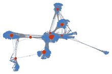
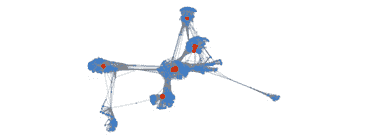
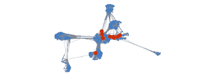
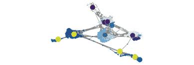
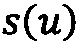
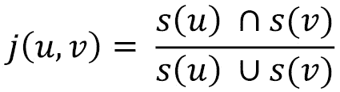
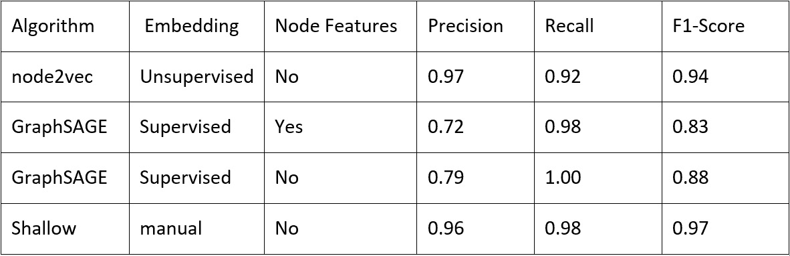

# 第六章：社交网络图

社交网络网站的增长一直是数字媒体中最活跃的趋势之一。自 20 世纪 90 年代末第一批社交应用发布以来，它们吸引了数十亿活跃用户，其中许多人已经将数字社交互动融入他们的日常生活中。Facebook、Twitter、Instagram 等社交网络正在推动新的沟通方式。用户可以在社交网络上分享想法、发布更新和反馈，或在活动中参与并分享他们的更广泛兴趣。

此外，社交网络构成了研究用户行为、解释人与人之间的互动以及预测他们兴趣的巨大信息来源。将它们结构化为图，其中顶点对应于一个人，边代表他们之间的连接，这使得一个强大的工具来提取有用的知识。

然而，由于变量参数众多，理解驱动社交网络演变的动态是一个复杂的问题。

在本章中，我们将讨论如何使用图论分析 Facebook 社交网络，以及如何使用机器学习解决诸如链接预测和社区检测等有用的问题。

本章将涵盖以下主题：

+   数据集概述

+   网络拓扑和社区检测

+   用于监督和无监督任务的嵌入

# 技术要求

我们将使用带有*Python* 3.8 的*Jupyter*笔记本进行所有练习。以下是需要使用`pip`安装的 Python 库列表，以便本章使用：例如，在命令行中运行`pip install networkx==2.5`：

```py
Jupyter==1.0.0
networkx==2.5
scikit-learn==0.24.0 
numpy==1.19.2 
node2vec==0.3.3 
tensorflow==2.4.1 
stellargraph==1.2.1
communities==2.2.0 
git+https://github.com/palash1992/GEM.git
```

在本章的其余部分，除非明确说明，否则我们将使用以下 Python 命令的结果来指代`nx`、`pd`和`np`：`import networkx` as `nx`、`import pandas` as `pd`和`import numpy` as `np`。

所有与本章相关的代码文件均可在[`github.com/PacktPublishing/Graph-Machine-Learning/tree/main/Chapter06`](https://github.com/PacktPublishing/Graph-Machine-Learning/tree/main/Chapter06)找到。

# 数据集概述

我们将使用**社交圈子 SNAP Facebook 公共数据集**，来自斯坦福大学([`snap.stanford.edu/data/ego-Facebook.html`](https://snap.stanford.edu/data/ego-Facebook.html))。

数据集是通过从调查参与者收集 Facebook 用户信息创建的。从 10 个用户中创建了自我网络。每个用户被要求识别所有他们朋友所属的**圈子**（朋友列表）。平均而言，每个用户在他们的**自我网络**中识别了 19 个圈子，其中每个圈子平均有 22 个朋友。

对于每个用户，收集了以下信息：

+   **边**：如果两个用户在 Facebook 上是朋友，则存在边。

+   如果用户在其个人资料中具有此属性则为`1`，否则为`0`。由于特征名称会泄露私人数据，因此已对特征进行匿名化。

然后将 10 个 ego 网络统一到一个我们将要研究的单个图中。

## 数据集下载

可以使用以下 URL 检索数据集：[`snap.stanford.edu/data/ego-Facebook.html`](https://snap.stanford.edu/data/ego-Facebook.html)。特别是，可以下载三个文件：`facebook.tar.gz`、`facebook_combined.txt.gz`和`readme-Ego.txt`。让我们分别检查每个文件：

+   `facebook.tar.gz`：这是一个包含四个文件的存档，每个`nodeId.extension`对应一个文件，其中`nodeId`是 ego 用户的节点 ID，`extension`可以是`edges`、`circles`、`feat`、`egofeat`或`featnames`。以下提供更多详细信息：

    a. `nodeId.edges`：这包含`nodeId`节点网络的边列表。

    b. `nodeId.circles`：这包含多个行（每个圈一行）。每行包含一个名称（圈名称）后跟一系列节点 ID。

    c. `nodeId.feat`：这包含 ego 网络中每个节点的特征（如果`nodeId`具有该特征则为`0`，否则为`1`）。

    d. `nodeId.egofeat`：这包含 ego 用户的特征。

    e. `nodeId.featname`：这包含特征名称。

+   `facebook_combined.txt.gz`：这是一个包含单个文件`facebook_combined.txt`的存档，它是所有 ego 网络合并后的边列表。

+   `readme-Ego.txt`：这包含之前提到的文件的描述。

请自行查看这些文件。强烈建议在开始任何机器学习任务之前探索并尽可能熟悉数据集。

## 使用 networkx 加载数据集

我们分析的第一步将是使用`networkx`加载聚合 ego 网络。正如我们在前面的章节中所见，`networkx`在图分析方面非常强大，并且鉴于数据集的大小，它将是我们在本章中进行分析的完美工具。然而，对于具有数十亿节点和边的更大社交网络图，可能需要更具体的工具来加载和处理它们。我们将在*第九章*中介绍用于扩展分析的工具和技术，*构建数据驱动的图应用*。

正如我们所见，组合 ego 网络表示为边列表。我们可以使用`networkx`从边列表创建一个无向图，如下所示：

```py
G = nx.read_edgelist("facebook_combined.txt", create_using=nx.Graph(), nodetype=int)
```

让我们打印一些关于图的基本信息：

```py
print(nx.info(G))
```

输出应该如下所示：

```py
Name: 
Type: Graph
Number of nodes: 4039
Number of edges: 88234
Average degree:  43.6910
```

如我们所见，聚合网络包含`4039`个节点和`88234`条边。这是一个相当紧密连接的网络，边的数量比节点多 20 多倍。实际上，聚合网络中应该存在多个簇（可能是每个 ego 用户的小世界）。

绘制网络也将帮助我们更好地理解我们将要分析的内容。我们可以使用 `networkx` 如下绘制图：

```py
nx.draw_networkx(G, pos=spring_pos, with_labels=False, node_size=35)
```

输出结果应如下所示：


图 6.1 – Facebook 自我网络聚合

我们可以观察到高度互联的中心节点。从社会网络分析的角度来看，这很有趣，因为它们可能是可以进一步研究以更好地理解个人与其世界关系结构的潜在社会机制的结果。

在继续我们的分析之前，让我们保存网络中自我用户节点的 ID。我们可以从包含在 `facebook.tar.gz` 存档中的文件中检索它们。

首先，解压存档。提取的文件夹将被命名为 `facebook`。让我们运行以下 Python 代码，通过取每个文件名的第一部分来检索 ID：

```py
ego_nodes = set([int(name.split('.')[0]) for name in os.listdir("facebook/")])
```

我们现在已准备好分析图。特别是，在下一节中，我们将通过检查其属性来更好地理解图的结构。这将帮助我们更清晰地了解其拓扑及其相关特征。

# 网络拓扑和社区检测

理解网络的拓扑以及其节点的角色是分析社交网络的关键步骤。重要的是要记住，在这种情况下，节点实际上是用户，每个用户都有自己的兴趣、习惯和行为。这种知识在执行预测和/或寻找洞察时将非常有用。

我们将使用 `networkx` 来计算我们在 *第一章*，*图形入门* 中看到的大部分有用度量。我们将尝试对它们进行解释，以收集关于图的信息。让我们像往常一样开始，导入所需的库并定义一些我们将贯穿整个代码的变量：

```py
import os
import math
import numpy as np
import networkx as nx
import matplotlib.pyplot as plt
default_edge_color = 'gray'
default_node_color = '#407cc9'
enhanced_node_color = '#f5b042'
enhanced_edge_color = '#cc2f04'
```

我们现在可以继续分析。

## 拓扑概述

正如我们之前所见，我们的组合网络有 4,039 个节点和超过 80,000 条边。我们将计算的下一个度量是配对性。它将揭示用户倾向于与具有相似度数用户连接的趋势。我们可以这样做：

```py
assortativity = nx.degree_pearson_correlation_coefficient(G)
```

输出结果应如下所示：

```py
0.06357722918564912
```

在这里，我们可以观察到正配对性，这很可能表明联系紧密的个人会与其他联系紧密的个人联系（正如我们在 *第一章*，*图形入门* 中所见）。这是预期的，因为每个圈内的用户可能倾向于彼此高度连接。

传递性也有助于更好地理解个人是如何连接的。回想一下，传递性表示两个有共同朋友的人成为朋友的平均概率：

```py
t = nx.transitivity(G)
```

输出结果应如下所示：

```py
0.5191742775433075
```

这里我们有大约 50%的概率，两个朋友可以或不可以有共同的朋友。

通过计算平均聚类系数，这一观察也得到了证实。确实，它可以被认为是传递性的另一种定义：

```py
aC = nx.average_clustering(G)
```

输出应该是这样的：

```py
0.6055467186200876
```

注意到聚类系数往往高于传递性。实际上，根据定义，它对度数低的顶点赋予更多的权重，因为它们有有限的可能邻居对（局部聚类系数的分母）。

## 节点中心性

一旦我们对整体拓扑有了更清晰的认识，我们就可以通过调查网络中每个个体的重要性来继续。正如我们在*第一章*，“开始使用图”中看到的，重要性的第一个定义可以通过介数中心性指标给出。它衡量有多少最短路径穿过一个给定的节点，从而给出一个关于该节点在信息在网络中传播中的*中心性*的印象。我们可以使用以下方法来计算它：

```py
bC = nx.betweenness_centrality(G)
 np.mean(list(bC.values()))
```

输出应该是这样的：

```py
0.0006669573568730229
```

平均介数中心性相当低，考虑到网络中大量非桥接节点，这是可以理解的。然而，通过图形的视觉检查，我们可以收集更好的见解。特别是，我们将通过增强具有最高介数中心性的节点来绘制组合自我网络。让我们为此定义一个适当的函数：

```py
def draw_metric(G, dct, spring_pos):
  top = 10
  max_nodes =  sorted(dct.items(), key=lambda v: -v[1])[:top]
  max_keys = [key for key,_ in max_nodes]
  max_vals = [val*300 for _, val in max_nodes]
  plt.axis("off")
  nx.draw_networkx(G,
                   pos=spring_pos,
                   cmap='Blues',
                   edge_color=default_edge_color,
                   node_color=default_node_color,
                   node_size=3,
                   alpha=0.4,
                   with_labels=False)
  nx.draw_networkx_nodes(G,
                         pos=spring_pos,
                         nodelist=max_keys,
                         node_color=enhanced_edge_color,
                         node_size=max_vals)
```

现在我们按照以下方式调用它：

```py
draw_metric(G,bC,spring_pos)
```

输出应该是这样的：



图 6.2 – 介数中心性

让我们也检查每个节点的度中心性。由于这个指标与节点的邻居数量相关，我们将更清楚地了解节点之间是如何相互连接的：

```py
deg_C = nx.degree_centrality(G)
 np.mean(list(deg_C.values()))
draw_metric(G,deg_C,spring_pos)
```

输出应该是这样的：

```py
0.010819963503439287
```

这里是度中心性的表示：



图 6.3 – 度中心性

最后，让我们也看看亲近中心性。这将帮助我们理解节点之间在最短路径意义上的接近程度：

```py
clos_C = nx.closeness_centrality(G)
 np.mean(list(clos_C.values()))
draw_metric(G,clos_C,spring_pos)
```

输出应该是这样的：

```py
0.2761677635668376
```

这里是亲近中心性的表示：



图 6.4 – 亲近中心性

从中心性分析中，有趣的是观察到每个中心节点似乎都是某种社区的一部分（这是合理的，因为中心节点可能对应于网络的自我节点）。同样有趣的是注意到存在大量高度相互连接的节点（特别是从亲近中心性分析中）。因此，让我们在分析的下个部分中识别这些社区。

## 社区检测

由于我们正在进行社会网络分析，探索社交网络中最有趣的图结构之一：社区，是值得的。如果你使用 Facebook，你的朋友很可能反映了你生活的不同方面：来自教育环境的朋友（高中、大学等），来自你每周足球比赛的朋友，你在派对上遇到的朋友等等。

社会网络分析的一个有趣方面是自动识别这样的群体。这可以通过自动推断其拓扑属性或半自动地利用一些先验洞察来完成。

一个好的标准是尽量减少社区内边缘（连接不同社区成员的边缘）的数量，同时最大化社区间边缘（连接同一社区成员的边缘）的数量。

我们可以在`networkx`中这样做：

```py
import community
parts = community.best_partition(G)
 values = [parts.get(node) for node in G.nodes()]
n_sizes = [5]*len(G.nodes())
plt.axis("off")
nx.draw_networkx(G, pos=spring_pos, cmap=plt.get_cmap("Blues"), edge_color=default_edge_color, node_color=values, node_size=n_sizes, with_labels=False)
```

输出应该是这样的：


图 6.5 – 使用 networkx 检测到的社区

在这个背景下，研究 ego 用户是否在检测到的社区中占据某些角色也是有趣的。让我们按照以下方式增强 ego 用户节点的大小和颜色：

```py
for node in ego_nodes:
   n_sizes[node] = 250
nodes = nx.draw_networkx_nodes(G,spring_pos,ego_nodes,node_color=[parts.get(node) for node in ego_nodes])
 nodes.set_edgecolor(enhanced_node_color)
```

输出应该是这样的：



图 6.6 – 使用 networkx 检测到的社区，增强 ego 用户节点大小

有趣的是注意到一些 ego 用户属于同一个社区。可能的情况是 ego 用户是 Facebook 上的实际朋友，因此他们的 ego 网络部分是共享的。

我们现在已经完成了对图结构的基本理解。我们知道网络中可以识别出一些重要的节点。我们也看到了这些节点所属的明确社区的存在。在进行下一部分分析时，即应用机器学习方法进行监督和非监督任务时，请记住这些观察结果。

# 监督和非监督任务的嵌入

现在，社交媒体是信息来源中最有趣和最丰富的之一。每天都有成千上万的新连接出现，新用户加入社区，数十亿条帖子被分享。图从数学上表示了所有这些互动，有助于对这种自发和无结构的流量进行排序。

当处理社交图时，有许多有趣的问题可以使用机器学习来解决。在正确的设置下，可以从这些大量数据中提取有用的见解，以改进您的营销策略，识别具有危险行为的用户（例如，恐怖分子网络），以及预测用户阅读您的新帖子的可能性。

具体来说，链接预测是这个领域中最有趣和最重要的研究课题之一。根据你在社交图中的“连接”代表什么，通过预测未来的边，你将能够预测你的下一个建议的朋友、下一个建议的电影以及你可能会购买的产品。

如我们已在*第五章*中看到的，“图上机器学习的问题”，链接预测任务旨在预测两个节点之间未来连接的可能性，并且可以使用多种机器学习算法来解决。

在接下来的示例中，我们将应用监督和无监督的机器学习图嵌入算法来预测 SNAP Facebook 社交图上的未来连接。此外，我们还将评估节点特征在预测任务中的贡献。

## 任务准备

为了执行链接预测任务，有必要准备我们的数据集。这个问题将被视为一个监督任务。节点对将被提供给每个算法作为输入，而目标将是二进制，即如果两个节点在网络中实际上连接，则为*连接*，否则为*不连接*。

由于我们旨在将此问题作为监督学习任务，我们需要创建一个训练和测试数据集。因此，我们将创建两个具有相同节点数但边数不同的新子图（因为一些边将被移除并作为训练/测试算法的正样本处理）。

`stellargraph`库提供了一个有用的工具来分割数据并创建训练和测试简化的子图。这个过程与我们已在*第五章*中看到的类似，“图上机器学习的问题”：

```py
from sklearn.model_selection import train_test_split
from stellargraph.data import EdgeSplitter
from stellargraph import StellarGraph
edgeSplitter = EdgeSplitter(G) 
graph_test, samples_test, labels_test = edgeSplitter.train_test_split(p=0.1, method="global", seed=24)
edgeSplitter = EdgeSplitter(graph_test, G)
 graph_train, samples_train, labels_train = edgeSplitter.train_test_split(p=0.1, method="global", seed=24)
```

我们使用`EdgeSplitter`类从`G`中提取所有边的部分（`p`=10%），以及相同数量的负边，以获得一个简化的图`graph_test`。`train_test_split`方法还会返回一个节点对列表`samples_test`（其中每个对对应于图中存在或不存在的边），以及与`samples_test`列表长度相同的二进制目标列表`labels_test`。然后，从这样一个简化的图中，我们重复操作以获得另一个简化的图`graph_train`，以及相应的`samples_train`和`labels_train`列表。

我们将比较三种预测缺失边的不同方法：

+   **方法 1**：将使用 node2vec 来学习一个无监督的节点嵌入。学到的嵌入将被用作监督分类算法的输入，以确定输入对是否实际上连接。

+   **方法 2**：将使用基于图神经网络的算法 GraphSAGE 来联合学习嵌入并执行分类任务。

+   **方法 3**：将从图中提取手工特征，并将其与节点 ID 一起用作监督分类器的输入。

让我们更详细地分析它们。

## 基于 node2vec 的链接预测

这里提出的方法分为几个步骤：

1.  我们使用 node2vec 从训练图中生成节点嵌入，而不需要监督。这可以通过`node2vec` Python 实现来完成，正如我们在*第五章**,* *图上机器学习的问题*中已经看到的：

    ```py
    from node2vec import Node2Vec
    node2vec = Node2Vec(graph_train) 
    model = node2vec.fit()
    ```

1.  然后，我们使用`HadamardEmbedder`为每个嵌入节点的对生成嵌入。这些特征向量将被用作训练分类器的输入：

    ```py
    from node2vec.edges import HadamardEmbedder
    edges_embs = HadamardEmbedder(keyed_vectors=model.wv)
     train_embeddings = [edges_embs[str(x[0]),str(x[1])] for x in samples_train]
    ```

1.  是时候训练我们的监督分类器了。我们将使用 RandomForest 分类器，这是一种基于决策树的强大集成算法：

    ```py
    from sklearn.ensemble import RandomForestClassifier 
    from sklearn import metrics 
    rf = RandomForestClassifier(n_estimators=10)
     rf.fit(train_embeddings, labels_train);
    ```

1.  最后，让我们应用训练好的模型来创建测试集的嵌入：

    ```py
    edges_embs = HadamardEmbedder(keyed_vectors=model.wv) test_embeddings = [edges_embs[str(x[0]),str(x[1])] for x in samples_test]
    ```

1.  现在，我们已经准备好使用训练好的模型在测试集上进行预测：

    ```py
    y_pred = rf.predict(test_embeddings) 
    print('Precision:', metrics.precision_score(labels_test, y_pred)) 
    print('Recall:', metrics.recall_score(labels_test, y_pred)) 
    print('F1-Score:', metrics.f1_score(labels_test, y_pred)) 
    ```

1.  输出应该是这样的：

    ```py
    Precision: 0.9701333333333333
    Recall: 0.9162573983125551
    F1-Score: 0.9424260086781945
    ```

完全不错！我们可以观察到，基于 node2vec 的嵌入已经为在结合的 Facebook ego 网络上预测链接提供了一个强大的表示。

## 基于 GraphSAGE 的链接预测

接下来，我们将使用 GraphSAGE 来学习节点嵌入并分类边。我们将构建一个两层 GraphSAGE 架构，它给定标记的节点对，输出一对节点嵌入。然后，将使用全连接神经网络来处理这些嵌入并产生链接预测。请注意，GraphSAGE 模型和全连接网络将连接并端到端训练，以便嵌入学习阶段受到预测的影响。

### 无特征方法

在开始之前，我们可以回顾一下*第四章，监督图学习*和*第五章*，*图上机器学习的问题*，其中 GraphSAGE 需要节点描述符（特征）。这些特征可能在你的数据集中可用，也可能不可用。让我们从不考虑可用的节点特征开始我们的分析。在这种情况下，一个常见的方法是为图中的每个节点分配一个长度为|*V*|（图中节点的数量）的 one-hot 特征向量，其中只有对应给定节点的单元格为 1，而其余单元格为 0。

这可以在 Python 和`networkx`中完成如下：

```py
eye = np.eye(graph_train.number_of_nodes())
fake_features = {n:eye[n] for n in G.nodes()}
nx.set_node_attributes(graph_train, fake_features, "fake")
eye = np.eye(graph_test.number_of_nodes())
fake_features = {n:eye[n] for n in G.nodes()}
nx.set_node_attributes(graph_test, fake_features, "fake")
```

在前面的代码片段中，我们做了以下操作：

1.  我们创建了一个大小为|*V*|的标识矩阵。矩阵的每一行是我们为图中每个节点所需的 one-hot 向量。

1.  然后，我们创建了一个 Python 字典，其中对于每个`nodeID`（用作键），我们分配之前创建的标识矩阵的对应行。

1.  最后，将字典传递给`networkx`的`set_node_attributes`函数，以将“假”特征分配给`networkx`图中的每个节点。

注意，这个过程在训练图和测试图上都会重复。

下一步将是定义用于向模型提供数据的生成器。我们将使用 `stellargraph` 的 `GraphSAGELinkGenerator` 来完成这项工作，它本质上向模型提供节点对作为输入：

```py
from stellargraph.mapper import GraphSAGELinkGenerator
batch_size = 64
num_samples = [4, 4]
# convert graph_train and graph_test for stellargraph
sg_graph_train = StellarGraph.from_networkx(graph_train, node_features="fake")
sg_graph_test = StellarGraph.from_networkx(graph_test, node_features="fake")
train_gen = GraphSAGELinkGenerator(sg_graph_train, batch_size, num_samples)
 train_flow = train_gen.flow(samples_train, labels_train, shuffle=True, seed=24)
test_gen = GraphSAGELinkGenerator(sg_graph_test, batch_size, num_samples)
 test_flow = test_gen.flow(samples_test, labels_test, seed=24)
```

注意，我们还需要定义 `batch_size`（每个 minibatch 的输入数量）以及 GraphSAGE 应考虑的第一跳和第二跳邻居样本的数量。

最后，我们准备好创建模型：

```py
from stellargraph.layer import GraphSAGE, link_classification
from tensorflow import keras
layer_sizes = [20, 20]
graphsage = GraphSAGE(layer_sizes=layer_sizes, generator=train_gen, bias=True, dropout=0.3)
x_inp, x_out = graphsage.in_out_tensors()
# define the link classifier
prediction = link_classification(output_dim=1, output_act="sigmoid", edge_embedding_method="ip")(x_out)
model = keras.Model(inputs=x_inp, outputs=prediction)
model.compile(
    optimizer=keras.optimizers.Adam(lr=1e-3),
    loss=keras.losses.mse,
    metrics=["acc"],
)
```

在前面的代码片段中，我们创建了一个具有两个大小为 20 的隐藏层（每个层都有一个偏置项和用于减少过拟合的 dropout 层）的 GraphSAGE 模型。然后，模块中 GraphSAGE 部分的输出与一个 `link_classification` 层连接，该层使用节点嵌入对（GraphSAGE 的输出）使用二元运算符（内积；在我们的例子中是 `ip`）来产生边嵌入，并最终通过一个全连接神经网络进行分类。

该模型通过 Adam 优化器（学习率 = `1e-3`）使用均方误差作为损失函数进行优化。

让我们训练模型 10 个 epoch：

```py
epochs = 10
history = model.fit(train_flow, epochs=epochs, validation_data=test_flow)
```

输出应该如下所示：

```py
Epoch 18/20
loss: 0.4921 - acc: 0.8476 - val_loss: 0.5251 - val_acc: 0.7884
Epoch 19/20
loss: 0.4935 - acc: 0.8446 - val_loss: 0.5247 - val_acc: 0.7922
Epoch 20/20
loss: 0.4922 - acc: 0.8476 - val_loss: 0.5242 - val_acc: 0.7913
```

训练完成后，让我们在测试集上计算性能指标：

```py
from sklearn import metrics 
y_pred = np.round(model.predict(train_flow)).flatten()
print('Precision:', metrics.precision_score(labels_train, y_pred)) 
print('Recall:', metrics.recall_score(labels_train, y_pred))  print('F1-Score:', metrics.f1_score(labels_train, y_pred)) 
```

输出应该如下所示：

```py
Precision: 0.7156476303969199
Recall: 0.983125550938169
F1-Score: 0.8283289124668435
```

如我们所观察到的，性能低于基于 node2vec 的方法。然而，我们还没有考虑真实的节点特征，这可能会是一个巨大的信息来源。让我们在接下来的测试中这样做。

### 引入节点特征

提取组合自我网络的节点特征的过程相当冗长。这是因为，正如我们在本章的第一部分所解释的，每个自我网络都是使用几个文件以及所有特征名称和值来描述的。我们已经编写了有用的函数来解析所有自我网络以提取节点特征。你可以在 GitHub 仓库提供的 Python 笔记本中找到它们的实现。在这里，我们只需简要总结一下它们是如何工作的：

+   `load_features` 函数解析每个自我网络并创建两个字典：

    a. `feature_index`，将数值索引映射到特征名称

    b. `inverted_feature_indexes`，将名称映射到数值索引

+   `parse_nodes` 函数接收组合自我网络 `G` 和自我节点 ID。然后，网络中的每个自我节点都被分配了之前使用 `load_features` 函数加载的相应特征。

让我们按顺序调用它们来加载组合自我网络中每个节点的特征向量：

```py
load_features()
parse_nodes(G, ego_nodes)
```

我们可以通过打印网络中一个节点的信息（例如，ID 为`0`的节点）来轻松检查结果：

```py
print(G.nodes[0])
```

输出应该如下所示：

```py
{'features': array([1., 1., 1., ..., 0., 0., 0.])}
```

如我们所观察到的，节点包含一个包含名为 `features` 的键的字典。相应的值是分配给该节点的特征向量。

现在我们准备重复之前用于训练 GraphSAGE 模型的相同步骤，这次在将`networkx`图转换为`StellarGraph`格式时使用`features`作为键：

```py
sg_graph_train = StellarGraph.from_networkx(graph_train, node_features="features")
sg_graph_test = StellarGraph.from_networkx(graph_test, node_features="features")
```

最后，就像我们之前做的那样，我们创建生成器，编译模型，并对其进行 10 个 epoch 的训练：

```py
train_gen = GraphSAGELinkGenerator(sg_graph_train, batch_size, num_samples)
train_flow = train_gen.flow(samples_train, labels_train, shuffle=True, seed=24)
test_gen = GraphSAGELinkGenerator(sg_graph_test, batch_size, num_samples)
test_flow = test_gen.flow(samples_test, labels_test, seed=24)
layer_sizes = [20, 20]
graphsage = GraphSAGE(layer_sizes=layer_sizes, generator=train_gen, bias=True, dropout=0.3)
x_inp, x_out = graphsage.in_out_tensors()
prediction = link_classification(output_dim=1, output_act="sigmoid", edge_embedding_method="ip")(x_out)
model = keras.Model(inputs=x_inp, outputs=prediction)
model.compile(
    optimizer=keras.optimizers.Adam(lr=1e-3),
    loss=keras.losses.mse,
    metrics=["acc"],
)
epochs = 10
history = model.fit(train_flow, epochs=epochs, validation_data=test_flow)
```

注意，我们正在使用相同的超参数（包括层数、批量大小和学习率）以及随机种子，以确保模型之间公平的比较。

输出应该如下所示：

```py
Epoch 18/20
loss: 0.1337 - acc: 0.9564 - val_loss: 0.1872 - val_acc: 0.9387
Epoch 19/20
loss: 0.1324 - acc: 0.9560 - val_loss: 0.1880 - val_acc: 0.9340
Epoch 20/20
loss: 0.1310 - acc: 0.9585 - val_loss: 0.1869 - val_acc: 0.9365
```

让我们评估模型性能：

```py
from sklearn import metrics 
y_pred = np.round(model.predict(train_flow)).flatten()
print('Precision:', metrics.precision_score(labels_train, y_pred)) 
print('Recall:', metrics.recall_score(labels_train, y_pred)) 
print('F1-Score:', metrics.f1_score(labels_train, y_pred))
```

我们可以检查输出：

```py
Precision: 0.7895418326693228
Recall: 0.9982369978592117
F1-Score: 0.8817084700517213
```

如我们所见，引入真实节点特征带来了良好的改进，即使最佳性能仍然是使用 node2vec 方法实现的。

最后，我们将评估一个浅层嵌入方法，其中将使用手工特征来训练一个监督分类器。

## 用于链接预测的手工特征

正如我们在*第四章*，“监督图学习”中已经看到的，浅层嵌入方法代表了一种简单而强大的处理监督任务的方法。基本上，对于每个输入边，我们将计算一组指标，这些指标将被作为输入提供给分类器。

在这个例子中，对于每个表示为节点对 (*u*,*v*) 的输入边，将考虑四个指标，即以下指标：

+   如果 *u* 无法从 *v* 达到，则使用`0`。

+   **Jaccard 系数**：给定一对节点 (*u*,*v*)，定义为节点 *u* 和 *v* 的邻居集合的交集与并集的比值。形式上，设  为节点 *u* 的邻居集合， 为节点 *v* 的邻居集合：



+   **u 中心性**：为节点 *v* 计算的度中心性。

+   **v 中心性**：为节点 *u* 计算的度中心性。

+   **u 社区**：使用 Louvain 启发式算法分配给节点 *u* 的社区 ID。

+   **v 社区**：使用 Louvain 启发式算法分配给节点 *v* 的社区 ID。

我们已经编写了一个有用的函数，使用 Python 和`networkx`来计算这些指标。你可以在 GitHub 仓库提供的 Python 笔记本中找到实现。

让我们计算训练集和测试集中每个边的特征：

```py
feat_train = get_hc_features(graph_train, samples_train, labels_train)
feat_test = get_hc_features(graph_test, samples_test, labels_test)
```

在提出的浅层方法中，这些特征将直接用作`Random Forest`分类器的输入。我们将使用其`scikit-learn`实现如下：

```py
from sklearn.ensemble import RandomForestClassifier 
from sklearn import metrics 
rf = RandomForestClassifier(n_estimators=10) 
rf.fit(feat_train, labels_train); 
```

前面的行自动实例化和训练了一个使用我们之前计算过的边缘特征的 RandomForest 分类器。我们现在可以按照以下方式计算性能：

```py
y_pred = rf.predict(feat_test)
print('Precision:', metrics.precision_score(labels_test, y_pred))
 print('Recall:', metrics.recall_score(labels_test, y_pred)) print('F1-Score:', metrics.f1_score(labels_test, y_pred)) 
```

输出将如下所示：

```py
Precision: 0.9636952636282395
Recall: 0.9777853337866939
F1-Score: 0.9706891701828411
```

意想不到的是，基于手工特征的浅层方法比其他方法表现更好。

## 结果总结

在前面的例子中，我们在有监督和无监督的情况下，对学习算法进行了训练，用于链接预测的有用嵌入。在下表中，我们总结了结果：



表 6.1 – 链接预测任务所取得的结果总结

如*表 6.1*所示，基于 node2vec 的方法已经能够在没有监督和每个节点信息的情况下实现高水平的表现。这样的高结果可能与组合自我网络的特定结构有关。由于网络的高次模量（因为它由多个自我网络组成），预测两个用户是否会连接可能高度相关于两个候选节点在网络上连接的方式。例如，可能存在一种系统性的情况，其中两个用户，都连接到同一自我网络中的几个用户，有很高的可能性也会连接。另一方面，属于不同自我网络或*非常遥远*的用户不太可能连接，这使得预测任务变得更容易。这也得到了使用浅层方法获得的高结果的支持。

这种情况可能会令人困惑，相反，对于像 GraphSAGE 这样的更复杂算法，尤其是当涉及到节点特征时。例如，两个用户可能拥有相似的兴趣，使他们非常相似。然而，他们可能属于不同的自我网络，其中相应的自我用户生活在世界上的两个非常不同的部分。因此，在原则上应该连接的相似用户并没有连接。然而，也有可能这样的算法正在预测未来的某些东西。回想一下，组合自我网络是特定时间段内特定情况的标记。谁知道它现在可能如何演变呢！

解释机器学习算法可能是机器学习本身最有趣的挑战。因此，我们应该始终谨慎地解释结果。我们的建议是始终深入数据集，并尝试解释你的结果。

最后，重要的是要指出，每个算法都不是为了这次演示而调整的。通过适当调整每个超参数，可以获得不同的结果，我们强烈建议你尝试这样做。

# 总结

在本章中，我们看到了机器学习如何有助于解决社交网络图上的实际机器学习任务。此外，我们还看到了如何在 SNAP Facebook 组合自我网络上预测未来的连接。

我们回顾了图分析概念，并使用图衍生指标来收集关于社交图的洞察。然后，我们在链接预测任务上对几个机器学习算法进行了基准测试，评估了它们的性能，并试图对它们进行解释。

在下一章中，我们将关注如何使用类似的方法通过文本分析和自然语言处理来分析文档集合。
