# 第八章：信用卡交易图分析

财务数据分析是大数据和数据分析中最常见和最重要的领域之一。确实，由于移动设备的数量不断增加以及在线支付标准的引入，银行产生的交易数据量呈指数级增长。

因此，需要新的工具和技术来充分利用这些大量信息，以便更好地理解客户行为并支持业务流程中的数据驱动决策。数据还可以用来构建更好的机制，以改善在线支付过程中的安全性。确实，由于电子商务平台的普及，在线支付系统越来越受欢迎，同时，欺诈案件也在增加。一个欺诈交易的例子是使用被盗信用卡进行的交易。确实，在这种情况下，欺诈交易将与信用卡原始持卡人进行的交易不同。

然而，由于涉及大量变量，构建自动检测欺诈交易的程序可能是一个复杂问题。

在本章中，我们将描述如何将信用卡交易数据表示为图，以便使用机器学习算法自动检测欺诈交易。我们将通过应用之前章节中描述的一些技术和算法来处理数据集，从而构建一个欺诈检测算法。

本章将涵盖以下主题：

+   从信用卡交易生成图

+   从图中提取属性和社区

+   将监督和无监督机器学习算法应用于欺诈分类

# 技术要求

我们将使用带有 Python 3.8 的*Jupyter*笔记本进行所有练习。以下是本章将使用`pip`安装的 Python 库列表。例如，在命令行中运行`pip install networkx==2.5`：

```py
Jupyter==1.0.0
networkx==2.5
scikit-learn==0.24.0
pandas==1.1.3
node2vec==0.3.3
numpy==1.19.2
communities==2.2.0
```

在本书的其余部分，除非明确指出相反，我们将把`nx`称为 Python `import networkx as nx`命令的结果。

本章相关的所有代码文件可在以下网址找到：[`github.com/PacktPublishing/Graph-Machine-Learning/tree/main/Chapter08`](https://github.com/PacktPublishing/Graph-Machine-Learning/tree/main/Chapter08)。

# 数据集概述

本章使用的数据集是可在*Kaggle*上找到的*Credit Card Transactions Fraud Detection Dataset*，以下为 URL：[`www.kaggle.com/kartik2112/fraud-detection?select=fraudTrain.csv`](https://www.kaggle.com/kartik2112/fraud-detection?select=fraudTrain.csv)。

该数据集由 2019 年 1 月 1 日至 2020 年 12 月 31 日期间的合法和欺诈性信用卡交易组成。它包括 1,000 名客户与 800 家商户的交易池进行的交易。该数据集使用*Sparkov 数据生成*生成。有关生成算法的更多信息，请访问以下网址：[`github.com/namebrandon/Sparkov_Data_Generation`](https://github.com/namebrandon/Sparkov_Data_Generation)。

对于每笔交易，数据集包含 23 个不同的特征。在以下表中，我们将仅展示本章将使用的信息：

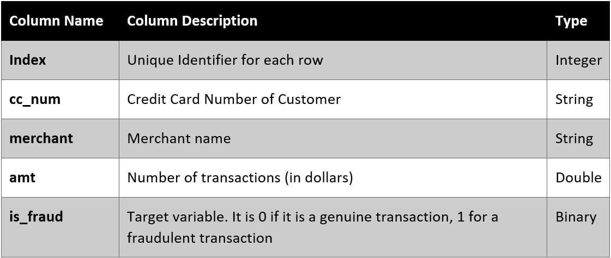

表 8.1 – 数据集中使用的变量列表

为了我们的分析目的，我们将使用`fraudTrain.csv`文件。正如之前所建议的，请自己查看数据集。强烈建议在开始任何机器学习任务之前，探索并尽可能熟悉数据集。我们还建议您调查本章未涵盖的两个其他数据集。第一个是捷克银行金融分析数据集，可在 https://github.com/Kusainov/czech-banking-fin-analysis 找到。该数据集来自 1999 年的一家实际捷克银行，涵盖 1993 年至 1998 年的时期。关于客户及其账户的数据包括有向关系。不幸的是，交易上没有标签，这使得无法使用机器学习技术训练欺诈检测引擎。第二个数据集是 paysim1 数据集，可在[`www.kaggle.com/ntnu-testimon/paysim1`](https://www.kaggle.com/ntnu-testimon/paysim1)找到。该数据集基于从非洲国家实施的一个移动货币服务的一个月财务日志中提取的真实交易样本模拟的移动货币交易。原始日志由一家跨国公司提供，该公司是移动金融服务提供商，目前在全球 14 多个国家运营。该数据集还包含欺诈/真实交易的标签。

## 使用 networkx 加载数据集和构建图

我们分析的第一步将是加载数据集并构建一个图。由于数据集代表的是一个简单的交易列表，我们需要执行几个操作来构建最终的信用卡交易图。数据集是一个简单的 CSV 文件；我们可以使用`pandas`如下加载数据：

```py
import pandas as pd
df = df[df["is_fraud"]==0].sample(frac=0.20, random_state=42).append(df[df["is_fraud"] == 1])
```

为了帮助读者处理数据集，我们选择了 20%的真实交易和所有的欺诈交易。因此，从总共 1,296,675 笔交易中，我们只将使用 265,342 笔交易。此外，我们还可以调查数据集中欺诈和真实交易的数量如下：

```py
df["is_fraud"].value_counts()
```

作为结果，我们得到以下内容：

```py
0    257834
1      7506
```

换句话说，从总共 265,342 笔交易中，只有 `7506` 笔（2.83%）是欺诈交易，其余都是真实的。

使用 `networkx` 库可以将数据集表示为图。在开始技术描述之前，我们将首先指定如何从数据构建图。我们使用了两种不同的方法来构建图，即二分法和三分法，如论文 *APATE：使用基于网络的扩展的自动信用卡交易欺诈检测的新方法* 所述，该论文可在 https://www.scinapse.io/papers/614715210 找到。

对于**二分法**，我们构建了一个加权二分图 ![img/B16069_08_001.png]，其中 ![img/B16069_08_002.png]，其中每个节点 ![img/B16069_08_003.png] 代表一个客户，每个节点 ![img/B16069_08_004.png] 代表一个商家。如果存在从客户 ![img/B16069_08_006.png]，到商家 ![img/B16069_08_007.png] 的交易，则创建一条边 ![img/B16069_08_005.png]。最后，我们为图中的每条边分配一个（始终为正的）权重，表示交易的金额（以美元计）。在我们的形式化中，我们允许使用有向和无向图。

由于数据集表示时间序列交易，客户和商家之间可能发生多次交互。在我们的两种形式化中，我们都决定将所有这些信息合并到一个图中。换句话说，如果客户和商家之间存在多笔交易，我们将在这两个节点之间构建一条单边，其权重为所有交易金额的总和。直接二分图的图形表示可见于 *图 8.1*：

![图 8.1 – 从输入数据集生成的二分图

![img/B16069_08_011.jpg]

图 8.1 – 从输入数据集生成的二分图

我们定义的二分图可以使用以下代码构建：

```py
def build_graph_bipartite(df_input, graph_type=nx.Graph()):
    df = df_input.copy()
    mapping = {x:node_id for node_id,x in enumerate(set(df["cc_num"].values.tolist() + df["merchant"].values.tolist()))}
    df["from"] = df["cc_num"].apply(lambda x: mapping[x])
    df["to"] = df["merchant"].apply(lambda x: mapping[x])
    df = df[['from', 'to', "amt", "is_fraud"]].groupby(['from', 'to']).agg({"is_fraud": "sum", "amt": "sum"}).reset_index()
    df["is_fraud"] = df["is_fraud"].apply(lambda x: 1 if x>0 else 0)
    G = nx.from_edgelist(df[["from", "to"]].values, create_using=graph_type)
    nx.set_edge_attributes(G, {(int(x["from"]), int(x["to"])):x["is_fraud"] for idx, x in df[["from","to","is_fraud"]].iterrows()}, "label")
    nx.set_edge_attributes(G,{(int(x["from"]), int(x["to"])):x["amt"] for idx, x in df[["from","to","amt"]].iterrows()}, "weight")
    return G
```

代码相当简单。为了构建二分信用卡交易图，我们使用了不同的 `networkx` 函数。要深入了解，我们在代码中执行的操作如下：

1.  我们构建了一个映射，为每个商家或客户分配一个 `node_id`。

1.  多笔交易被汇总为单笔交易。

1.  使用 `networkx` 函数 `nx.from_edgelist` 来构建 networkx 图。

1.  每条边分配了两个属性，即 `weight` 和 `label`。前者表示两个节点之间的交易总数，而后者表示交易是真实的还是欺诈的。

如代码所示，我们可以选择是否构建有向或无向图。我们可以通过调用以下函数来构建无向图：

```py
G_bu = build_graph_bipartite(df, nx.Graph(name="Bipartite Undirect"))))
```

我们也可以通过调用以下函数来构建直接图：

```py
G_bd = build_graph_bipartite(df, nx.DiGraph(name="Bipartite Direct"))))
```

唯一的区别在于我们传递给构造函数的第二个参数。

**三分法**是之前方法的扩展，也允许将交易表示为顶点。一方面，这种方法大大增加了网络复杂性，另一方面，它允许为商家和持卡人以及每笔交易构建额外的节点嵌入。正式来说，对于这种方法，我们构建一个加权三分图，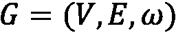，其中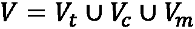，其中每个节点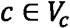代表一个客户，每个节点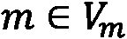代表一个商家，每个节点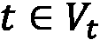代表一笔交易。对于每笔交易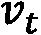，创建两个边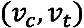和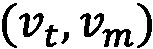，从客户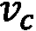到商家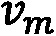。

最后，我们为图中的每条边分配一个（始终为正的）权重，表示交易金额（以美元计）。由于在这种情况下，我们为每笔交易创建一个节点，因此我们不需要从客户到商家的多笔交易的聚合。此外，与其他方法相比，在我们的形式化中，我们允许使用有向和无向图。直接二分图的图形表示可见于*图 8.2*：

![Figure 8.2 – 从输入数据集生成的三分图]

![img/B16069_08_02.jpg]

Figure 8.2 – 从输入数据集生成的三分图

我们定义的三分图可以使用以下代码构建：

```py
def build_graph_tripartite(df_input, graph_type=nx.Graph()):
    df = df_input.copy()
    mapping = {x:node_id for node_id,x in enumerate(set(df.index.values.tolist() + df["cc_num"].values.tolist() + df["merchant"].values.tolist()))}
    df["in_node"] = df["cc_num"].apply(lambda x: mapping[x])
    df["out_node"] = df["merchant"].apply(lambda x: mapping[x])
    G = nx.from_edgelist([(x["in_node"], mapping[idx]) for idx, x in df.iterrows()] + [(x["out_node"], mapping[idx]) for idx, x in df.iterrows()], create_using=graph_type)
    nx.set_edge_attributes(G,{(x["in_node"], mapping[idx]):x["is_fraud"] for idx, x in df.iterrows()}, "label")
    nx.set_edge_attributes(G,{(x["out_node"], mapping[idx]):x["is_fraud"] for idx, x in df.iterrows()}, "label")
    nx.set_edge_attributes(G,{(x["in_node"], mapping[idx]):x["amt"] for idx, x in df.iterrows()}, "weight")
    nx.set_edge_attributes(G,{(x["out_node"], mapping[idx]):x["amt"] for idx, x in df.iterrows()}, "weight")
    return G
```

代码相当简单。为了构建三分信用卡交易图，我们使用不同的`networkx`函数。要深入了解，我们在代码中执行的操作如下：

1.  我们构建了一个映射，为每个商家、客户和交易分配一个`node_id`。

1.  `networkx`函数`nx.from_edgelist`用于构建 networkx 图，

1.  每条边分配了两个属性，即`weight`和`label`。前者表示两个节点之间的总交易次数，而后者表示交易是否为真实或欺诈。

如我们从代码中也可以看到，我们可以选择是否要构建有向图或无向图。我们可以通过调用以下函数来构建一个无向图：

```py
G_tu = build_graph_tripartite(df, nx.Graph(name="Tripartite Undirect"))
```

我们可以通过调用以下函数来构建一个直接图：

```py
G_td = build_graph_tripartite(df, nx.DiGraph(name="Tripartite Direct"))
```

唯一的区别在于我们传递给构造函数的第二个参数。

在我们引入的形式化图表示中，实际交易被表示为边。根据这种结构，对于二分图和三分图，欺诈/真实交易的分类被描述为边分类任务。在这个任务中，目标是给定的边分配一个标签（`0`表示真实，`1`表示欺诈），描述该边所代表的交易是欺诈还是真实。

在本章的其余部分，我们使用二部图和三部图的无向图进行分析，分别用 Python 变量`G_bu`和`G_tu`表示。我们将把本章提出的分析扩展到有向图的练习留给你们。

我们首先通过以下行进行简单检查，以验证我们的图是否为真正的二部图：

```py
from networkx.algorithms import bipartite
all([bipartite.is_bipartite(G) for G in [G_bu,G_tu]]
```

结果，我们得到`True`。这个检查让我们确信这两个图实际上是二部图/三部图。

此外，使用以下命令，我们可以得到一些基本统计信息：

```py
for G in [G_bu, G_tu]:
 print(nx.info(G))
```

通过一个结果，我们得到以下：

```py
Name: Bipartite Undirect
Type: Graph
Number of nodes: 1676
Number of edges: 201725
Average degree: 240.7220
Name: Tripartite Undirect
Type: Graph
Number of nodes: 267016
Number of edges: 530680
Average degree:   3.9749
```

如我们所见，两个图在节点数量和边数量上都有所不同。二部图无向图有 1,676 个节点，等于客户数量加上拥有大量边（201,725）的商家数量。三部图无向图有 267,016 个节点，等于客户数量加上商家数量加上所有交易。

在这个图中，正如预期的那样，节点的数量（530,680）比二部图要高。在这个比较中，有趣的不同之处在于两个图的平均度。确实，正如预期的那样，二部图的平均度比三部图要高。实际上，由于在三部图中，交易节点的存在将连接“分割”开来，因此平均度较低。

在下一节中，我们将描述如何现在可以使用生成的交易图进行更完整的统计分析。

# 网络拓扑和社区检测

在本节中，我们将分析一些图度量子，以便对图的一般结构有一个清晰的了解。我们将使用`networkx`来计算我们在*第一章*，“开始使用图”中看到的大部分有用度量子。我们将尝试解释这些度量子，以获得对图的洞察。

## 网络拓扑

我们分析的一个好的起点是提取简单的图度量子，以便对二部图和三部交易图的主要属性有一个一般性的了解。

我们首先通过以下代码查看二部图和三部图的度分布：

```py
for G in [G_bu, G_tu]:
  plt.figure(figsize=(10,10))
  degrees = pd.Series({k: v for k, v in nx.degree(G)})
  degrees.plot.hist()
  plt.yscale("log")
```

通过一个结果，我们得到了以下图表：

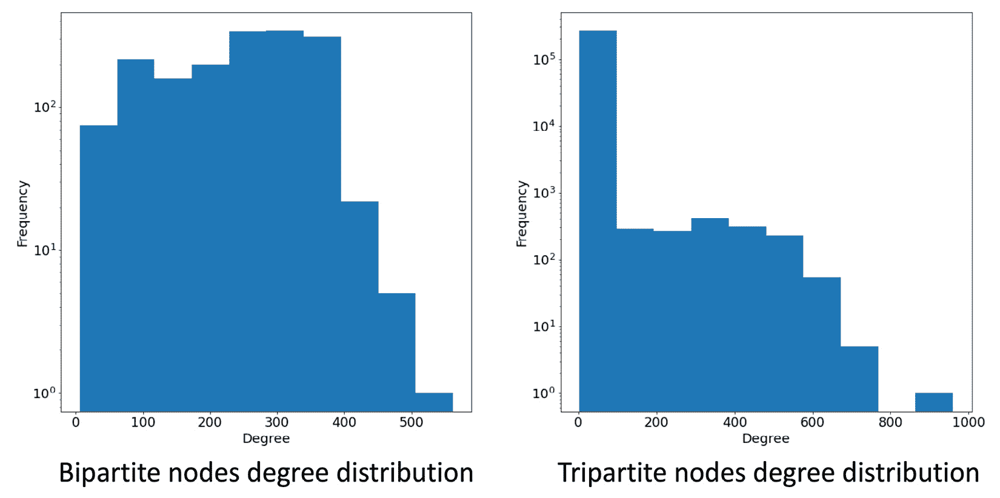

图 8.3 – 二部图（左）和三部图（右）的度分布

从*图 8.3*中，我们可以看到节点分布如何反映了我们之前看到的平均度。更详细地说，二部图有一个更多样化的分布，峰值约为 300。对于三部图，分布有一个 2 度的峰值，而三部图度分布的其他部分与二部图分布相似。这些分布完全反映了两个图定义方式的不同。实际上，如果二部图是通过客户到商家的连接来构建的，那么在三部图中，所有连接都通过交易节点。这些节点是图中的大多数，它们都具有 2 度（一个来自客户的边和一个指向商家的边）。因此，代表 2 度频率的箱子的频率等于交易节点的数量。

我们将继续通过分析`边权重`分布来继续我们的研究：

1.  我们首先计算分位数分布：

    ```py
    for G in [G_bu, G_tu]:
      allEdgesWeights = pd.Series({(d[0], d[1]): d[2]["weight"] for d in G.edges(data=True)})
      np.quantile(allEdgesWeights.values,[0.10,0.50,0.70,0.9])
    ```

1.  作为结果，我们得到以下：

    ```py
    array([  5.03 ,  58.25 ,  98.44 , 215.656])
     array([  4.21,  48.51,  76.4 , 147.1 ])
    ```

1.  使用之前的相同命令，我们也可以绘制（对数尺度）`边权重`的分布，切割到 90 百分位数。结果在以下图表中可见：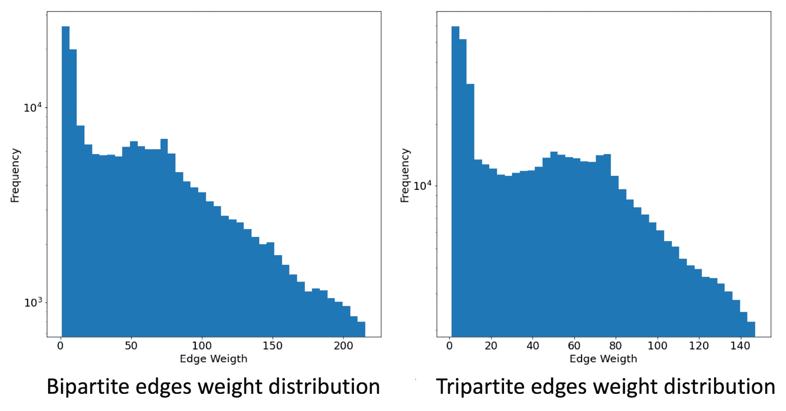

    图 8.4 – 二部图（左侧）和三部图（右侧）的边权重分布

    我们可以看到，由于具有相同客户和商家的交易聚合，与没有计算边权重、聚合多个交易的三部图相比，二部图的分布向右（高值）偏移。 

1.  我们现在将研究`介数中心性`指标。它衡量有多少最短路径通过一个给定的节点，从而给出了该节点在信息在网络内部传播中的*中心性*。我们可以通过以下命令计算节点中心性的分布：

    ```py
    for G in [G_bu, G_tu]:
      plt.figure(figsize=(10,10))
      bc_distr = pd.Series(nx.betweenness_centrality(G))
      bc_distr.plot.hist()
      plt.yscale("log")
    ```

1.  作为结果，我们得到以下分布：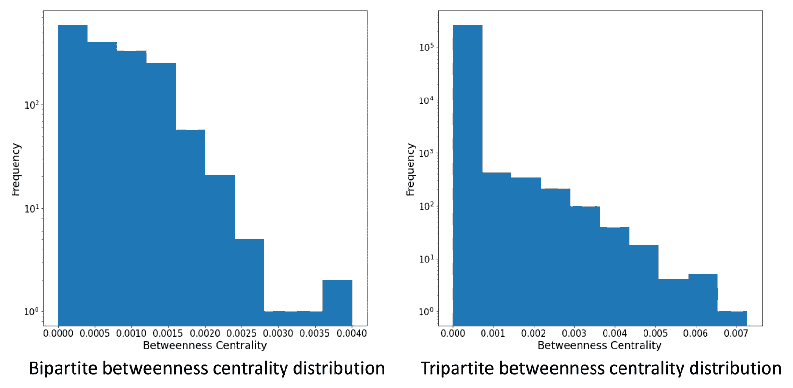

    图 8.5 – 二部图（左侧）和三部图（右侧）的介数中心性分布

    如预期，对于两个图，中间中心性都较低。这可以通过网络内部大量非桥接节点来理解。与我们所看到的度分布类似，中间中心性值的分布在这两个图中是不同的。实际上，如果二分图有一个更分散的分布，平均值为 0.00072，那么在三分图中，交易节点是主要移动分布值并降低平均值到 1.38e-05 的节点。在这种情况下，我们还可以看到三分图的分布有一个大峰值，代表交易节点，其余的分布与二分图分布相当相似。

1.  我们终于可以使用以下代码来计算两个图的相似性：

    ```py
    for G in [G_bu, G_tu]:
       print(nx.degree_pearson_correlation_coefficient(G)) 
    ```

1.  通过这种方式，我们得到以下结果：

    ```py
    -0.1377432041049189
    -0.8079472914876812
    ```

在这里，我们可以观察到两个图都具有负相似性，这很可能表明联系紧密的人与联系较差的人联系在一起。对于二分图，由于低度数的客户仅与高度数的商家相连，因为交易数量众多，所以值较低（-0.14）。对于三分图，相似性甚至更低（-0.81）。由于存在交易节点，这种表现是可以预期的。实际上，这些节点总是具有 2 度，并且与代表高度连接节点的客户和商家相连。

## 社区检测

另一个我们可以进行的有趣分析是社区检测。这种分析有助于识别特定的欺诈模式：

1.  执行社区提取的代码如下：

    ```py
    import community
    for G in [G_bu, G_tu]:
       parts = community.best_partition(G, random_state=42, weight='weight')
       communities = pd.Series(parts)   print(communities.value_counts().sort_values(ascending=False))
    ```

    在此代码中，我们简单地使用`community`库从输入图中提取社区。然后我们按包含的节点数量对算法检测到的社区进行排序并打印出来。

1.  对于二分图，我们得到以下输出：

    ```py
    5     546
    0     335
    7     139
    2     136
    4     123
    3     111
    8      83
    9      59
    10     57
    6      48
    11     26
    1      13
    ```

1.  对于三分图，我们得到以下输出：

    ```py
    11     4828
    3      4493
    26     4313
    94     4115
    8      4036
        ... 47     1160
    103    1132
    95      954
    85      845
    102     561
    ```

1.  由于三分图中有大量节点，我们发现了 106 个社区（我们只报告了其中的一部分），而对于二分图，只发现了 12 个社区。因此，为了有一个清晰的图像，对于三分图，最好使用以下命令绘制不同社区中包含的节点分布：

    ```py
    communities.value_counts().plot.hist(bins=20)
    ```

1.  通过这种方式，我们得到以下结果：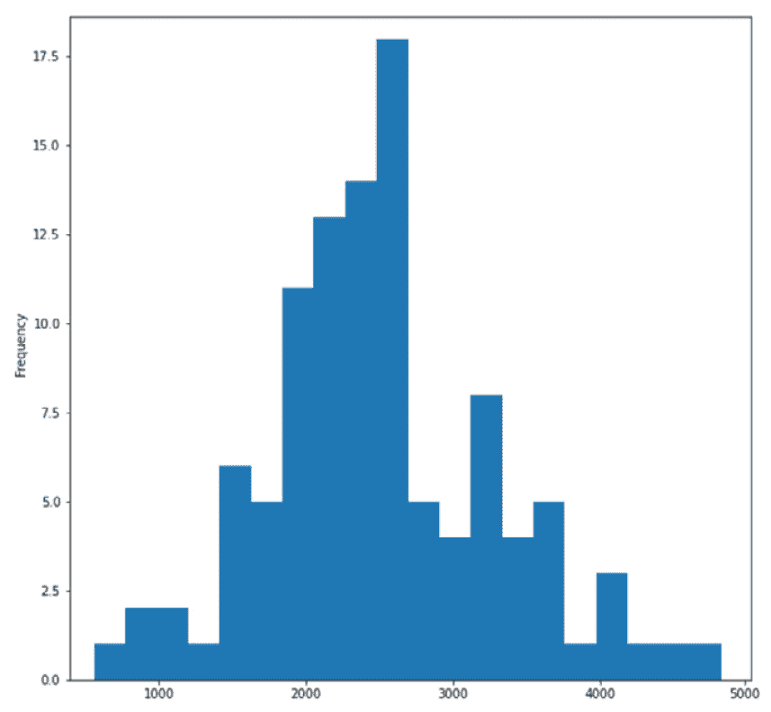

    图 8.6 – 社区节点大小的分布

    从图中可以看到，峰值在约 2,500 处。这意味着有 30 多个大型社区拥有超过 2,000 个节点。从图中还可以看到，一些社区拥有少于 1,000 个节点和超过 3,000 个节点。

1.  对于算法检测到的每一组社区，我们可以计算欺诈交易的百分比。分析的目标是识别欺诈交易高度集中的特定子图：

    ```py
    graphs = []
    d = {}
    for x in communities.unique():
        tmp = nx.subgraph(G, communities[communities==x].index)
        fraud_edges = sum(nx.get_edge_attributes(tmp, "label").values())
        ratio = 0 if fraud_edges == 0 else (fraud_edges/tmp.number_of_edges())*100
        d[x] = ratio
        graphs += [tmp]
    print(pd.Series(d).sort_values(ascending=False))
    ```

1.  代码简单地通过使用特定社区中的节点生成节点诱导子图。该图用于计算欺诈交易的百分比，即欺诈边数与图中所有边数的比率。我们还可以使用以下代码绘制社区检测算法检测到的节点诱导子图：

    ```py
    gId = 10
    spring_pos = nx.spring_layout(graphs[gId])
     edge_colors = ["r" if x == 1 else "g" for x in nx.get_edge_attributes(graphs[gId], 'label').values()]
    nx.draw_networkx(graphs[gId], pos=spring_pos, node_color=default_node_color, edge_color=edge_colors, with_labels=False, node_size=15)
    ```

    给定特定的社区索引`gId`，代码提取包含在`gId`社区索引中的节点，并绘制得到的图。

1.  在二分图上运行两个算法，我们将得到以下结果：

    ```py
    9     26.905830
    10    25.482625
    6     22.751323
    2     21.993834
    11    21.333333
    3     20.470263
    8     18.072289
    4     16.218905
    7      6.588580
    0      4.963345
    5      1.304983
    1      0.000000
    ```

1.  对于每个社区，我们都有其欺诈边的百分比。为了更好地描述子图，我们可以通过执行上一行代码并使用`gId=10`来绘制社区 10。结果如下：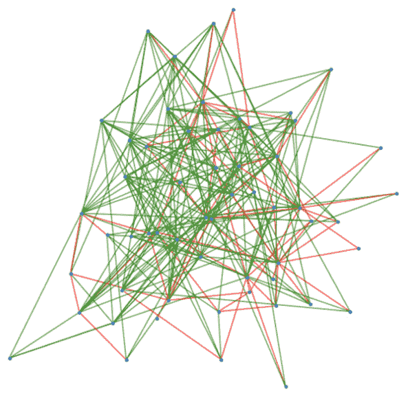

    图 8.7 – 二分图中社区 10 的诱导子图

1.  诱导子图的图像使我们能够更好地理解数据中是否存在特定模式。在三分图上运行相同的算法，我们得到以下输出：

    ```py
    6      6.857728
    94     6.551151
    8      5.966981
    1      5.870918
    89     5.760271
          ...   
    102    0.889680
    72     0.836013
    85     0.708383
    60     0.503461
    46     0.205170
    ```

1.  由于社区数量众多，我们可以使用以下命令绘制欺诈与真实比率分布图：

    ```py
    pd.Series(d).plot.hist(bins=20)
    ```

1.  结果如下：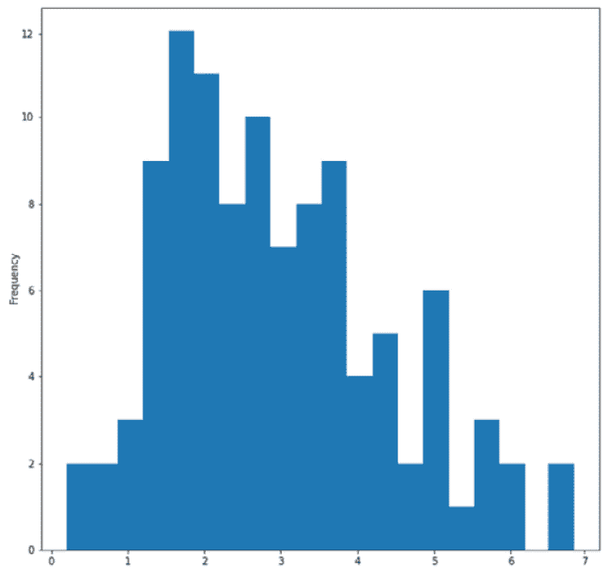

    图 8.8 – 社区欺诈/真实边比率分布

    从图中，我们可以观察到大部分分布集中在比率为 2 到 4 之间的社区。有几个社区比率较低（<1）和比率较高（>5）。

1.  此外，对于三分图，我们可以通过执行上一行代码并使用`gId=6`来绘制由 1,935 个节点组成的社区 6（比率为 6.86）：

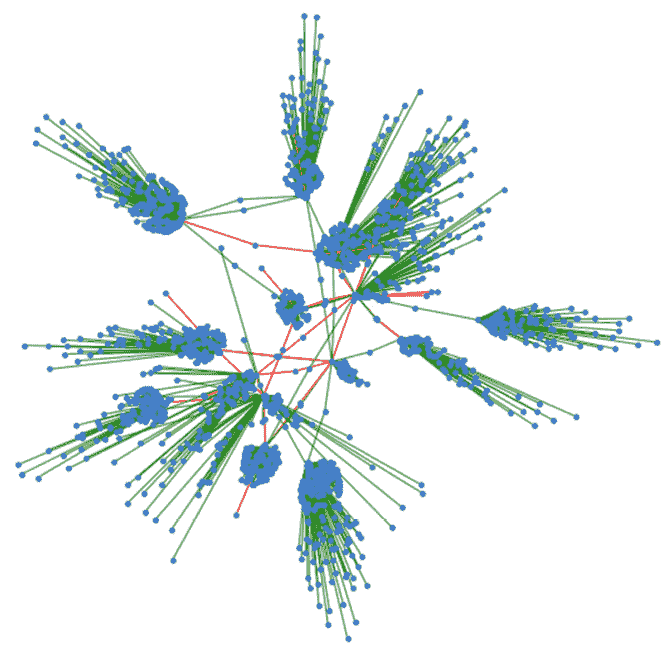

图 8.9 – 三分图中社区 6 的诱导子图

对于二分图用例，在这张图像中，我们可以看到一个有趣的模式，可以用来深入探索一些重要的图子区域。

在本节中，我们执行一些探索性任务，以更好地理解图及其属性。我们还提供了一个示例，说明如何使用社区检测算法来发现数据中的模式。在下一节中，我们将描述如何使用机器学习自动检测欺诈交易。

# 监督和无监督欺诈检测嵌入

在本节中，我们将描述如何使用之前描述的二分图和三分图，通过图机器学习算法利用监督和无监督方法构建自动的欺诈检测程序。正如我们在本章开头所讨论的，交易由边表示，我们接下来想要将每个边分类到正确的类别：欺诈或真实。

我们将用于执行分类任务的流程如下：

+   不平衡任务的采样程序

+   使用无监督嵌入算法为每个边缘创建特征向量

+   将监督和无监督机器学习算法应用于前一点定义的特征空间

## 监督方法用于欺诈交易识别

由于我们的数据集高度不平衡，欺诈交易占总交易的 2.83%，我们需要应用一些技术来处理不平衡数据。在这个用例中，我们将应用简单的随机欠采样策略。更深入地说，我们将从多数类（真实交易）中抽取子样本以匹配少数类（欺诈交易）的样本数量。这只是文献中许多技术中的一种。也有可能使用异常检测算法，如隔离森林，将欺诈交易检测为数据中的异常。我们将这个任务留给你作为练习，使用其他技术来处理不平衡数据，例如随机过采样或使用成本敏感分类器进行分类任务。可以直接应用于图的节点和边缘采样的特定技术将在*第十章*中描述，*图的新趋势*：

1.  我们用于随机欠采样的代码如下：

    ```py
    from sklearn.utils import resample
    df_majority = df[df.is_fraud==0]
     df_minority = df[df.is_fraud==1]
    df_maj_dowsampled = resample(df_majority, n_samples=len(df_minority), random_state=42)
    df_downsampled = pd.concat([df_minority, df_maj_dowsampled])
     G_down = build_graph_bipartite(df_downsampled, nx.Graph())
    ```

1.  代码很简单。我们应用了 `sklearn` 包中的 `resample` 函数来过滤原始数据框中的 `downsample` 函数。然后，我们使用本章开头定义的函数构建一个图。为了创建三分图，应使用 `build_graph_tripartite` 函数。作为下一步，我们将数据集分为训练集和验证集，比例为 80/20：

    ```py
    from sklearn.model_selection import train_test_split
    train_edges, val_edges, train_labels, val_labels = train_test_split(list(range(len(G_down.edges))), list(nx.get_edge_attributes(G_down, "label").values()), test_size=0.20, random_state=42)
     edgs = list(G_down.edges)
    train_graph = G_down.edge_subgraph([edgs[x] for x in train_edges]).copy()
    train_graph.add_nodes_from(list(set(G_down.nodes) - set(train_graph.nodes)))
    ```

    与之前一样，在这种情况下，代码也很简单，因为我们只是应用了 `sklearn` 包中的 `train_test_split` 函数。

1.  我们现在可以使用 `Node2Vec` 算法如下构建特征空间：

    ```py
    from node2vec import Node2Vec
    node2vec = Node2Vec(train_graph, weight_key='weight')
     model = node2vec_train.fit(window=10)
    ```

    如*第三章*中所述，使用 `node2vec` 结果构建边缘嵌入，这将生成分类器使用的最终特征空间，该嵌入属于*无监督图学习*。

1.  执行此任务的代码如下：

    ```py
    from sklearn import metrics
    from sklearn.ensemble import RandomForestClassifier 
    from node2vec.edges import HadamardEmbedder, AverageEmbedder, WeightedL1Embedder, WeightedL2Embedder
    classes = [HadamardEmbedder, AverageEmbedder, WeightedL1Embedder, WeightedL2Embedder]
    for cl in classes:
        embeddings = cl(keyed_vectors=model.wv)
        train_embeddings = [embeddings[str(edgs[x][0]), str(edgs[x][1])] for x in train_edges]
        val_embeddings = [embeddings[str(edgs[x][0]), str(edgs[x][1])] for x in val_edges]
        rf = RandomForestClassifier(n_estimators=1000, random_state=42)
        rf.fit(train_embeddings, train_labels)
        y_pred = rf.predict(val_embeddings)
        print(cl)
        print('Precision:', metrics.precision_score(val_labels, y_pred))
        print('Recall:', metrics.recall_score(val_labels, y_pred))
        print('F1-Score:', metrics.f1_score(val_labels, y_pred))
    ```

与之前的代码相比，执行了不同的步骤：

1.  对于每个 `Edge2Vec` 算法，都使用先前计算出的 `Node2Vec` 算法来生成特征空间。

1.  在上一步生成的特征集上，使用`sklearn` Python 库中的`RandomForestClassifier`进行训练。

1.  在验证测试上计算了不同的性能指标，即精确度、召回率和 F1 分数。

我们可以将之前描述的代码应用于二分图和三分图来解决欺诈检测任务。在下面的表中，我们报告了二分图的性能：

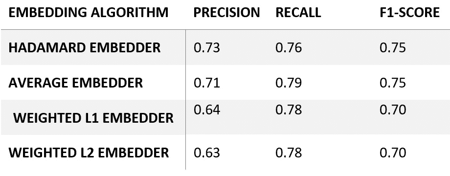

表 8.2 – 二分图的监督欺诈边缘分类性能

在下面的表中，我们报告了三分图的性能：

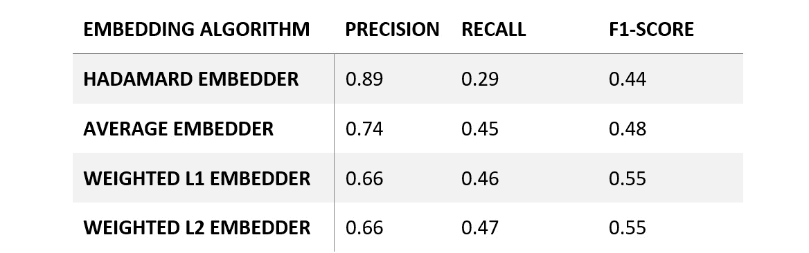

表 8.3 – 三分图的监督欺诈边缘分类性能

在*表 8.2*和*表 8.3*中，我们报告了使用二分图和三分图获得的分类性能。从结果中可以看出，这两种方法在 F1 分数、精确度和召回率方面存在显著差异。由于对于两种图类型，Hadamard 和平均边嵌入算法给出了最有趣的结果，我们将重点关注这两个算法。更详细地说，三分图的精确度比二分图更好（三分图的精确度为 0.89 和 0.74，而二分图的精确度为 0.73 和 0.71）。

相比之下，二分图的召回率比三分图更好（二分图的召回率为 0.76 和 0.79，而三分图的召回率为 0.29 和 0.45）。因此，我们可以得出结论，在这种情况下，使用二分图可能是一个更好的选择，因为它在 F1 分数方面实现了较高的性能，并且与三分图相比，图的大小（节点和边）更小。

## 无监督欺诈交易识别方法

同样的方法也可以应用于使用 k-means 的无监督任务。主要区别在于生成的特征空间将不会经历训练-验证分割。实际上，在下面的代码中，我们将对按照下采样过程生成的整个图上的`Node2Vec`算法进行计算：

```py
nod2vec_unsup = Node2Vec(G_down, weight_key='weight')
 unsup_vals = nod2vec_unsup.fit(window=10)
```

如前所述，在构建节点特征向量时，我们可以使用不同的`Egde2Vec`算法来运行 k-means 算法，如下所示：

```py
from sklearn.cluster import KMeans
classes = [HadamardEmbedder, AverageEmbedder, WeightedL1Embedder, WeightedL2Embedder]
 true_labels = [x for x in nx.get_edge_attributes(G_down, "label").values()]
for cl in classes:
    embedding_edge = cl(keyed_vectors=unsup_vals.wv)
    embedding = [embedding_edge[str(x[0]), str(x[1])] for x in G_down.edges()]
    kmeans = KMeans(2, random_state=42).fit(embedding)
    nmi = metrics.adjusted_mutual_info_score(true_labels, kmeans.labels_)
    ho = metrics.homogeneity_score(true_labels, kmeans.labels_)
    co = metrics.completeness_score(true_labels, kmeans.labels_
    vmeasure = metrics.v_measure_score(true_labels, kmeans.labels_)
    print(cl)
    print('NMI:', nmi)
    print('Homogeneity:', ho)
    print('Completeness:', co)
    print('V-Measure:', vmeasure)
```

在前面的代码中执行了不同的步骤：

1.  对于每个`Edge2Vec`算法，使用之前在训练和验证集上计算的`Node2Vec`算法来生成特征空间。

1.  在上一步生成的特征集上，使用`sklearn` Python 库中的`KMeans`聚类算法进行拟合。

1.  不同的性能指标，即调整后的**互信息**（**MNI**）、同质性、完整性和 v-measure 分数。

我们可以将之前描述的代码应用于二分图和三分图，以使用无监督算法解决欺诈检测任务。在下表中，我们报告了二分图的性能：

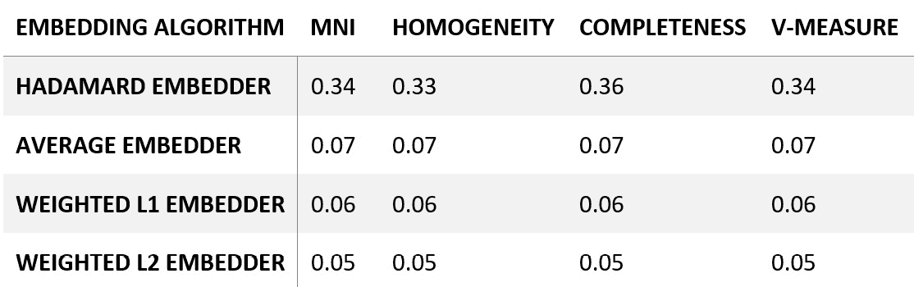

**表 8.4** – 二分图的无监督欺诈边缘分类性能

在下表中，我们报告了三分图的性能：

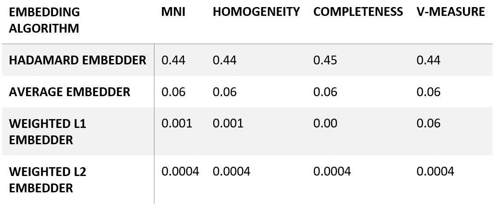

**表 8.5** – 三分图的无监督欺诈边缘分类性能

在**表 8.4**和**表 8.5**中，我们报告了使用二分图和三分图以及无监督算法获得的分类性能。从结果中我们可以看出，两种方法显示出显著差异。也值得注意，在这种情况下，使用 Hadamard 嵌入算法获得的表现明显优于所有其他方法。

如**表 8.4**和**表 8.5**所示，对于这个任务，使用三分图获得的表现优于使用二分图获得的表现。在无监督的情况下，我们可以看到引入交易节点如何提高整体性能。我们可以断言，在无监督设置中，对于这个特定用例，并以**表 8.4**和**表 8.5**中获得的结果为参考，使用三分图可能是一个更好的选择，因为它能够实现比二分图更优越的性能。

# 摘要

在本章中，我们描述了如何将经典的欺诈检测任务描述为图问题，以及如何使用前一章中描述的技术来解决这个问题。更详细地说，我们介绍了我们使用的数据集，并描述了将交易数据转换为两种类型的图的步骤，即二分图和三分图无向图。然后，我们计算了两个图的局部（及其分布）和全局指标，并比较了结果。

此外，为了发现并绘制交易图中欺诈交易密度高于其他社区的特定区域，我们对图应用了社区检测算法。

最后，我们使用监督和无监督算法解决了欺诈检测问题，比较了二分图和三分图的性能。首先，由于问题是不平衡的，真实交易的存在更高，我们进行了简单的下采样。然后，对于监督任务，我们将不同的 Edge2Vec 算法与随机森林结合使用，对于无监督任务，使用 k-means，实现了良好的分类性能。

本章总结了用于展示图机器学习算法如何应用于不同领域问题的示例系列，例如社交网络分析、文本分析和信用卡交易分析。

在下一章中，我们将描述一些图数据库和图处理引擎的实际应用，这些工具对于将分析扩展到大型图非常有用。
