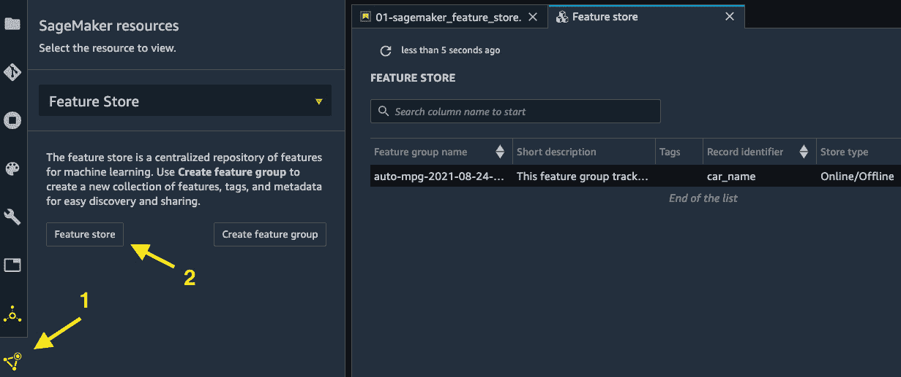
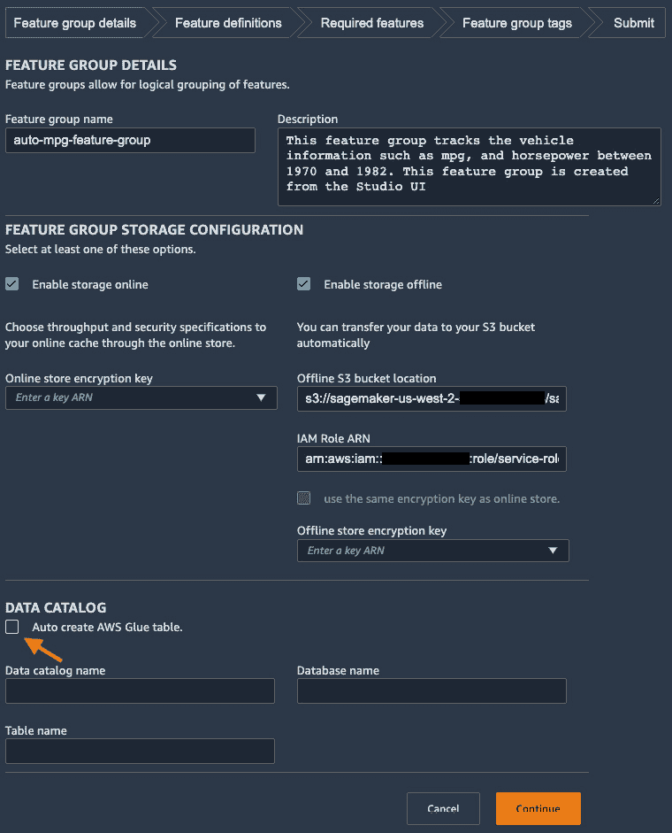
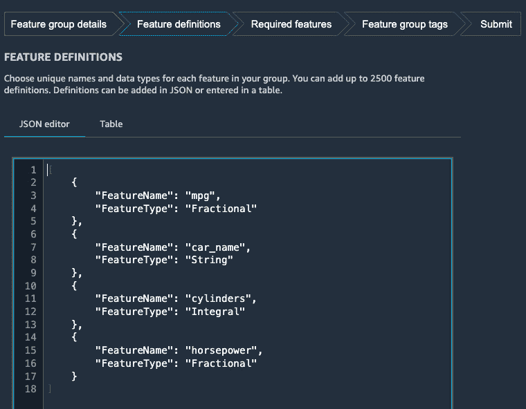
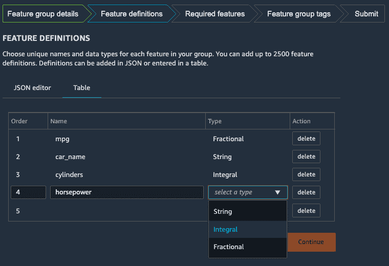
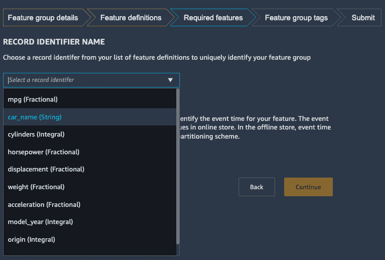
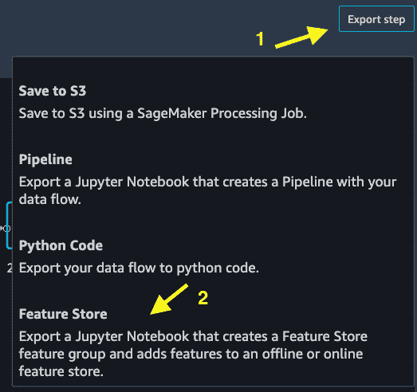
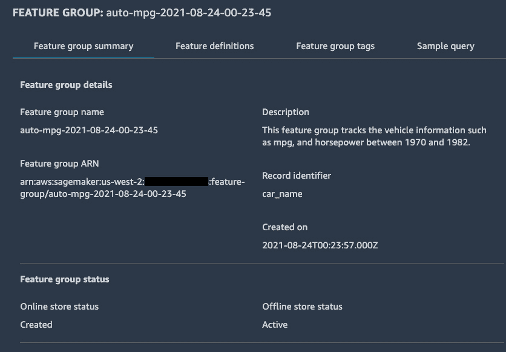
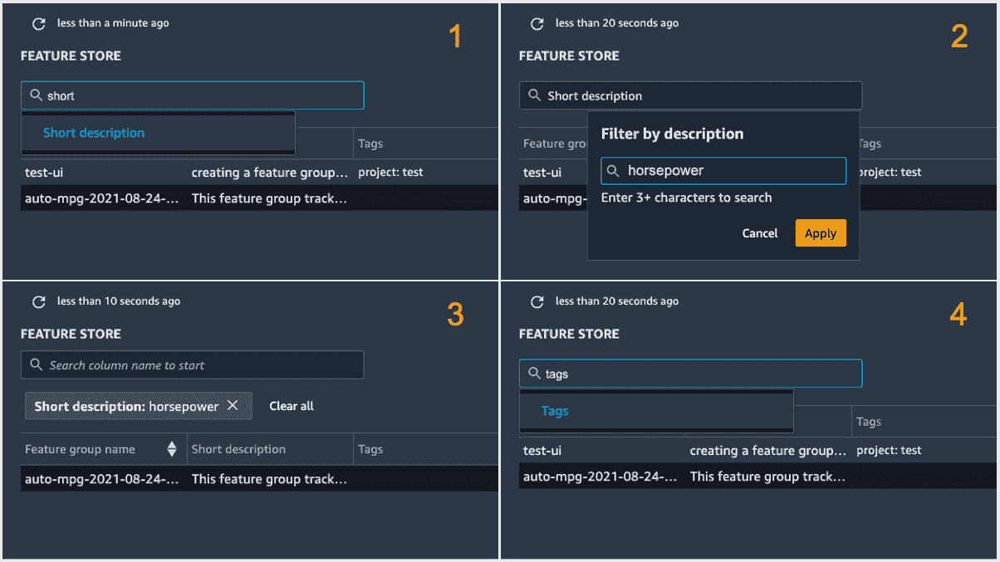
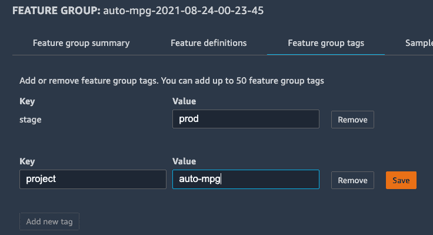
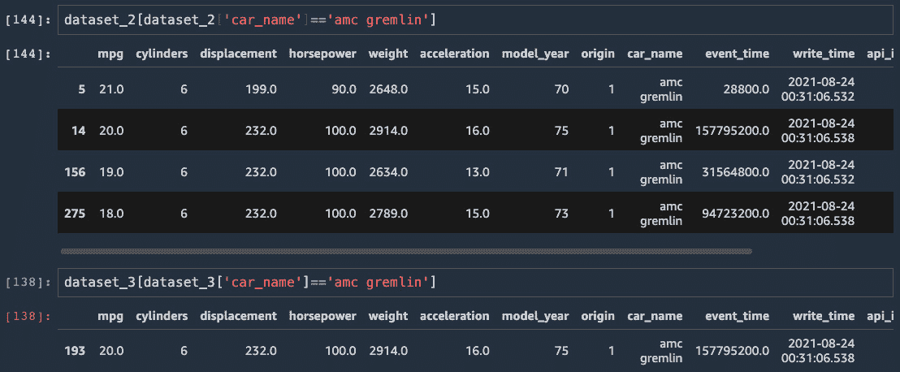

# 第四章：使用 SageMaker Feature Store 构建特征存储库

特征存储允许您存储用于**机器学习**（**ML**）训练和推理的特征。它作为协作团队在 ML 用例中创建特征时的中央存储库，以防止重复和混淆的努力。Amazon SageMaker Feature Store 使在云中存储和访问训练和推理数据变得更加容易、快速且可重复。通过为您的 ML 生命周期构建的 SageMaker Feature Store 实例，您将能够管理始终在演变的特征，并使用它们进行训练和推理，从而有信心使用正确的特征。您还将能够通过拥有关于 ML 特征的单一事实来源，与您的同事更有效地协作。

在本章中，我们将涵盖以下主题：

+   理解特征存储的概念

+   开始使用 SageMaker Feature Store

+   从 SageMaker Feature Store 访问特征

# 技术要求

对于本章，您需要访问[`github.com/PacktPublishing/Getting-Started-with-Amazon-SageMaker-Studio/tree/main/chapter04`](https://github.com/PacktPublishing/Getting-Started-with-Amazon-SageMaker-Studio/tree/main/chapter04)中的代码。您需要确保您的 IAM 执行角色具有`AmazonSageMakerFeatureStoreAccess`策略。

# 理解特征存储的概念

考虑以下场景：您是一位在汽车行业从事 ML 项目的数据科学家，与另一位数据科学家和几位数据工程师一起工作。您负责建模车辆燃油效率，而您的同事负责建模车辆性能。你们两人都使用来自汽车制造商的数据，这些数据由团队中的数据工程师在云中预处理并存储，作为模型的输入。

数据存储在不同的来源，例如 Amazon S3、Amazon **关系数据库服务**（**RDS**）以及建立在 AWS 上的数据湖，具体取决于源数据的性质。您和您的数据科学家同事分别联系数据工程团队，以获取以最适合您各自建模练习的方式处理的数据。您没有意识到您的数据科学家同事的模型实际上共享一些共同的特征，但在您和您的工作空间中都创建并维护了一套新的特征。

随着项目的进行，数据工程团队报告称，管理不断增长的数据和特征足迹已成为一项挑战。当数据处理管道发生变化，或者汽车制造商修改和更新目录时，跟踪特征版本也变得繁琐。你发现自己一直在努力追踪哪些模型使用了哪些特征集或版本，这些特征来自众多表格和文件，用于你的代码和笔记。

这里是对团队面临挑战的总结：

+   尽管有一个中央数据工程团队，但数据和特征并没有集中存储。

+   数据科学家没有看到彼此创建和使用的特征，因此默认情况下是创建自己的。

+   因此，数据和特征被重复，给数据工程团队带来了负担。

+   特征的更新意味着需要有人管理的数据的另一个副本。

+   在机器学习生命周期的迭代中，模型和数据血缘难以维护。

特征存储是机器学习生命周期中的一个相对较新的概念，它旨在解决前述场景中观察到的挑战。特征存储的目标是拥有一个集中存储所有特征的存储库，用于所有模型，用于训练和推理，以及用于所有时间。*所有特征*意味着我们希望将来自不同来源的特征汇集到一个中心位置，并能够轻松找到它们。*所有模型*意味着我们希望构建各种模型的团队只从一个中心位置使用特征。*训练和推理*意味着我们希望在训练和托管目的时检索相同的特征，同时满足训练和推理应用中不同的运行时要求。*所有时间*意味着我们希望保留特征的整个生命周期版本，无论单个特征存储库中单个特征的更新和变化如何，以便数据科学家可以访问不同时间段的特征版本。

让我们来看看 SageMaker 特征存储中的关键组件和概念，这些组件和概念使其成为可能。

## 理解在线商店

在 SageMaker 特征存储中，在线商店是一种特征存储选项，旨在始终处于*在线*状态。*在线*意味着该存储库应该表现得像一个在线应用程序，能够立即响应用户的数据读写访问请求。"立即"可能具有主观性，但在技术术语中，这意味着低响应延迟，以便用户不会感到延迟。除了低延迟之外，另一个使在线商店"在线"的方面是它可以同时处理的交易高吞吐量。想象一下，有数十万用户访问你的应用程序；你不想让你的优秀客户失望。你希望你的在线应用程序能够以高吞吐量和低延迟处理流量。

为什么我们需要一个低延迟的在线商店？在许多机器学习用例中，机器学习推理需要立即响应用户在系统上的操作，并将推理结果返回给用户。推理过程通常包括查询特定数据点的特征，并将特征作为有效载荷发送到机器学习模型。例如，一个在线汽车保险报价应用程序有一个机器学习模型，它接受驾驶员信息来预测他们的风险水平并提出报价。该应用程序需要根据用户提供的汽车制造商从特征商店中提取与车辆相关的特征。您期望现代应用程序能够立即返回报价。因此，理想的架构应该将从特征商店提取特征和进行机器学习推理的延迟都保持得非常低。我们不能有一个机器学习模型可以立即响应，但需要几秒钟或几分钟来从各种数据库和位置收集特征的系统。

## 理解离线商店

SageMaker Feature Store 中的离线商店旨在通过保留所有记录以供使用来提供更灵活的功能。您将能够根据各种用例在任何给定条件和时间访问特征。但这也带来了对离线商店请求的更高延迟响应时间，因为离线商店使用较慢且成本较低的存储。

离线商店补充了在线商店，对于不需要低延迟的机器学习用例非常有用。例如，当构建用于合规目的的机器学习训练数据集以重现特定模型时，您需要访问历史特征以构建过去创建的模型。通常，机器学习训练并不期望在几秒钟内完成，因此在查询特征商店以获取训练数据时，您不一定需要亚秒级性能。

现在我们已经对 SageMaker Feature Store 中的关键组件和概念有了很好的理解，让我们通过一个用例来实际操作一下。

# 开始使用 SageMaker Feature Store

按照我们之前描述的场景，我们是一家汽车行业公司的数据科学团队。我们正在处理一个燃油效率数据集以创建机器学习模型。让我们使用 UCI 的 Auto MPG 数据集（[`archive.ics.uci.edu/ml/datasets/Auto+MPG`](https://archive.ics.uci.edu/ml/datasets/Auto+MPG)），这是一个从 1970 年到 1982 年按制造商收集的车辆数据和燃油效率（以每加仑英里数衡量）的集合，来演示以下内容：

+   如何将特征摄入到特征商店

+   如何从在线商店和离线商店访问特征

+   如何逐年更新功能并使用版本控制（时间旅行）访问功能

作为先决条件，请导航到代码仓库并打开 `chapter04/01-sagemaker_feature_store.ipynb` 笔记本。首先，执行笔记本直到以下代码，从源数据读取到 pandas DataFrame：

```py
data_url='https://archive.ics.uci.edu/ml/machine-learning-databases/auto-mpg/auto-mpg.data'
col_names=['mpg','cylinders', 'displacement', 'horsepower', 'weight', 'acceleration', 'model_year', 'origin', 'car_name']
df=pd.read_csv(data_url, delimiter='\s+', header=None, names=col_names, na_values='?')
df['car_name']=df['car_name'].astype('string')
```

此外，我们还将 `car_name` 列的数据类型转换为 `string`，这是 SageMaker Feature Store 所要求的。我们将在 *创建特征组* 部分稍后描述这意味着什么。

我们将按年份拆分 DataFrame，以便稍后模拟特征随年份的更新。因此，现在转换一个 DataFrame 的类型会更简单。以下单元格创建一个字典来保存按年份的 DataFrame，并添加一个新的 `event_time` 列来编码特征创建的时间。我们通过在每个相应的年份使用 Python 的 `datetime` 库在上午 8:00 添加 Unix 纪元时间来模拟它：

```py
d_df = {}
for yr in df['model_year'].unique():
    print(yr)
    d_df[str(yr)]=df[df['model_year']==yr]
    d_df[str(yr)]['event_time']=datetime.datetime(1900+yr, 1, 1, 8, 0, 0).timestamp()
```

重要提示

任何要进入 SageMaker Feature Store 中特征组的特征表都需要一个表示事件时间的特征，例如本例中的 `event_time`。这允许我们通过时间进行特征的时间旅行和版本控制。

接下来，我们将开始与 SageMaker Feature Store 交互。

## 创建特征组

在 SageMaker Feature Store 中的 **特征组** 定义了元数据、特征定义、数据条目的唯一标识符以及其他 SageMaker Feature Store 配置。

创建特征组有两种方式 - 使用 SageMaker Python SDK 或 Studio UI。

通过遵循这些步骤（也在笔记本中），我们可以使用 SageMaker Python SDK 在 SageMaker Feature Store 中创建一个特征组：

1.  首先，我们使用 `FeatureGroup` 类创建一个名为 `auto-mpg-<timestamp>` 的 SageMaker 特征组：

    ```py
    from sagemaker.feature_store.feature_group import FeatureGroup
    feature_group = FeatureGroup(name=feature_group_name, sagemaker_session=sess)
    ```

1.  接下来，我们需要让 SageMaker 特征组了解数据架构和定义。`feature_group.load_feature_definitions()` 是一个 API，用于从 pandas DataFrame 中加载架构和定义。API 会自动检测数据类型。我们还需要确保 DataFrame 中的特征配置为具有 SageMaker Feature Store 支持的数据类型。

    重要提示

    SageMaker Feature Store 支持的数据类型是 `data` 列，其中字符串作为 `object` 类型，这是为了向后兼容。从 pandas 1.0 版本开始，您可以明确请求使用 `string` 类型来表示包含字符串的列。SageMaker Feature Store 与 pandas 的 `string` 类型一起工作，而不是 `object` 类型。对于 `event_time` 列，可接受的数据类型是 `string` 或 `fractional`。对于 `string` 类型，事件时间必须以 ISO-8601 格式在 UTC 时间中，格式为 *yyyy-MM-dd'T'HH:mm:ssZ* 或 *yyyy-MM-dd'T'HH:mm:ss.SSSZ*。对于 `fractional` 类型，值应从 Unix 纪元时间开始，以毫秒精度表示。在我们的示例中，我们使用了 `datetime` 库返回的 Unix 纪元时间。

我们从第一个 DataFrame 中加载特征定义。您将在输出中看到加载到 `feature_group` 中的定义和数据类型：

```py
feature_group.load_feature_definitions(data_frame=d_df['70'])
[FeatureDefinition(feature_name='mpg', feature_type=<FeatureTypeEnum.FRACTIONAL: 'Fractional'>),
 FeatureDefinition(feature_name='cylinders', feature_type=<FeatureTypeEnum.INTEGRAL: 'Integral'>),
 FeatureDefinition(feature_name='displacement', feature_type=<FeatureTypeEnum.FRACTIONAL: 'Fractional'>),
 FeatureDefinition(feature_name='horsepower', feature_type=<FeatureTypeEnum.FRACTIONAL: 'Fractional'>),
 FeatureDefinition(feature_name='weight', feature_type=<FeatureTypeEnum.FRACTIONAL: 'Fractional'>),
 FeatureDefinition(feature_name='acceleration', feature_type=<FeatureTypeEnum.FRACTIONAL: 'Fractional'>),
 FeatureDefinition(feature_name='model_year', feature_type=<FeatureTypeEnum.INTEGRAL: 'Integral'>),
 FeatureDefinition(feature_name='origin', feature_type=<FeatureTypeEnum.INTEGRAL: 'Integral'>),
 FeatureDefinition(feature_name='car_name', feature_type=<FeatureTypeEnum.STRING: 'String'>),
 FeatureDefinition(feature_name='event_time', feature_type=<FeatureTypeEnum.FRACTIONAL: 'Fractional'>)]
```

1.  定义加载后，我们可以在系统中创建 `feature group`：

    ```py
    record_identifier_feature_name = 'car_name'
    event_time_feature_name = 'event_time'
    feature_group.create(
        s3_uri=f's3://{bucket}/{prefix}',
        record_identifier_name=record_identifier_feature_name,
        event_time_feature_name=event_time_feature_name,
        role_arn=role,
        enable_online_store=True,
        description=description
    )
    ```

在 `create()` 函数中，为特征组配置以下内容：

+   我们将 S3 存储桶位置指定给`s3_uri`参数，以表示我们想在当前位置为特征组设置离线存储。我们可以将其设置为`False`以禁用离线存储。

+   我们将`enable_online_store`设置为`True`以为特征组创建在线存储。如果您不需要在线存储，请将其设置为`False`以避免不必要的费用。

+   我们指出记录标识符是特征组中的`car_name`列，而`event_time`特征是`event_time`列。

这个创建操作是一个异步操作，需要几秒钟。下一个单元格中的`check_feature_group_status()`函数每 5 秒检查一次状态，并在特征组成功创建后返回单元格。您还可以在左侧侧边栏的**SageMaker 组件**和**注册**选项卡中查看 Studio UI 中的特征组列表，如图*图 4.1*所示。如果您点击列表中的特征组，您可以看到与特征组相关的所有信息，包括描述、特征定义和示例查询：



图 4.1 – 在 SageMaker Studio UI 中查看特征组

或者，您也可以从 UI 创建特征组。因为我们已经有数据在 pandas DataFrame 中，所以使用 SDK 加载定义非常直接。以下步骤演示了如何在 Studio UI 中创建特征组：

1.  点击**创建特征组**，如图*图 4.1*所示。

1.  在第一步，如图*图 4.2*所示，输入特征组名称、描述以及在线和离线存储的配置。对于离线存储，我们输入一个 S3 存储桶位置以存储离线存储数据，以及一个具有访问存储桶权限的 IAM 角色 ARN。在这个例子中，我们将使用也附加到 SageMaker Studio 用户配置文件的 SageMaker 执行角色。您可以从笔记本中的`role`变量中看到完整的 ARN。对于**数据目录**选项，让我们勾选**自动创建 AWS Glue 表**复选框，或者让 SageMaker 在三个字段中分配名称，或者我们自己分配名称。点击**继续**：



图 4.2 – 在 Studio UI 中配置特征组

1.  在第二步中，我们需要创建特征定义。我们可以使用**JSON 编辑器**批量粘贴定义，如图*图 4.3:*所示。



图 4.3 – 在 JSON 编辑器中编辑特征定义

1.  或者，我们可以使用**表格**选项卡通过易于使用的下拉列表编辑特征，如图*图 4.4*所示。完成编辑后，点击**继续**：



图 4.4 – 在表格中编辑特征定义

1.  在第三步，如图*图 4.5*所示，我们需要选择一个特征作为记录标识符（`car_name`）和另一个特征来标识事件时间（`event_time`）。点击**继续**以进行下一步：



图 4.5 – 选择记录标识符和事件时间特征

1.  然后，我们可以选择性地为特征组添加标签。点击**创建特征组**以继续。

    重要提示

    我演示了创建特征组的两种方法。我们只需要其中一种即可继续。让我们回到笔记本，并使用从 SageMaker Python SDK 创建的特征组。

一旦创建了特征组，我们就可以继续将数据摄取到特征组中。

## 将数据摄取到 SageMaker Feature Store

你可以以批量或流式方式将数据摄取到 SageMaker Feature Store 特征组中。`sagemaker.feature_store` SDK 中有一个 API，允许我们以异步和批量方式摄取 pandas DataFrame。对于流式摄取，`sagemaker-featurestore-runtime` API 使得将单个记录以低延迟放入特征组变得简单。这两种使特征摄取灵活的方法可以在 ML 生命周期的不同部分实现。

数据工程师或科学家可以使用批量摄取创建特征组并摄取第一批数据，这在探索阶段通常是这种情况。一旦构建了模型并准备提供服务，就必须考虑捕获新数据并将其摄取到特征存储中，以便可以使用丰富数据集迭代模型重新训练。如果你的数据以批量形式到来，你可以使用允许高效摄取大量数据的批量摄取。或者，如果你的模型作为实时应用程序的一部分部署，你可以使用流式摄取方法。在本节中，我们将了解批量摄取和流式摄取是如何工作的。

在我们的示例中，我们模拟了每年数据更新的情况，因为我们已经将数据集按年份切割成多个 DataFrame，每个年份的数据都有不同的`event_time`值。我们可以使用以下代码批量摄取每个 DataFrame：

```py
for yr, df_auto in d_df.items():
    print(yr)
    print(df_auto.shape)
    feature_group.ingest(data_frame=df_auto, max_workers=1, max_processes = 1, wait=True)
```

我们将遍历`d_df`字典中的所有 DataFrame，并调用`feature_group.ingest()`方法来摄取每个 DataFrame。你可以使用`max_workers`和`max_processes`参数来控制摄取运行时间，其中`max_processes`数量的进程将并行创建以摄取 DataFrame 的不同分区，每个分区使用`max_worker`线程。`.ingest()`中的`wait=True`参数在继续之前等待 DataFrame 的摄取完成。

重要提示

虽然 SageMaker Python SDK 允许你创建特征组，处理特征定义，导入数据，并从离线存储查询数据，但`sagemaker-featurestore-runtime` `boto3` SDK 允许你与在线存储进行交互（`Get`和`Put`）。特征在导入后立即在在线存储中可用，而在离线存储中使特征可用需要一些时间。

导入后，我们可以通过从在线存储中拉取一个样本记录来快速验证它，如下面的代码块所示，使用来自`sagemaker-featurestore-runtime` `boto3` API 的`get_record`函数：

```py
car_name = 'amc concord'
featurestore_runtime =  sess.boto_session.client(service_name='sagemaker-featurestore-runtime', 
                                                 region_name=region)
sample_record = featurestore_runtime.get_record(
    FeatureGroupName=feature_group_name, RecordIdentifierValueAsString=car_name
) 
sample_record
```

要以流式处理方式导入记录中的特征，我们可以使用`sagemaker-featurestore-runtime` `boto3` API 中的`put_record` API 来导入单个数据记录，如下面的代码片段所示。此 API 提供了流式应用程序通常所需的低延迟。请注意，`record`是一个字典列表，其中每个特征都有一个`FeatureName`和`ValueAsString`对的`FeatureName`：

```py
record = [{'FeatureName': 'mpg', 
           'ValueAsString': str(mpg)},
          {'FeatureName':'cylinders', 
           'ValueAsString': str(cylinders)},
          {'FeatureName':'displacement', 
           'ValueAsString': str(displacement)}, 
          {'FeatureName': 'horsepower', 
           'ValueAsString': str(horsepower)},
          {'FeatureName': 'weight', 
           'ValueAsString': str(weight)},
          {'FeatureName': 'acceleration', 
           'ValueAsString': str(acceleration)},
          {'FeatureName': 'model_year', 
           'ValueAsString': str(model_year)},
          {'FeatureName': 'origin', 
           'ValueAsString': str(origin)},
           'ValueAsString': str(car_name)},
          {'FeatureName': 'event_time', 
           'ValueAsString': str(int(round(time.time())))}]
featurestore_runtime.put_record(FeatureGroupName=feature_group_name, 
                                Record=record)
```

如果你已经启用了在线和离线存储，如我们的示例所示，SageMaker 会自动将在线存储中的特征同步到离线存储。当我们用年度数据更新特征组时，SageMaker 会将最新值追加到离线存储，以提供随时间变化的值的完整历史记录。

我们已经介绍了如何使用 SageMaker Python SDK 和`sagemaker-featurestore-runtime` `boto3` API 分别以批量和流式处理方式将特征导入到 SageMaker 特征存储中的特征组。现在让我们看看将特征导入到 SageMaker 特征存储的另一种方式 – 从**SageMaker Data Wrangler**。

## 从 SageMaker Data Wrangler 导入

如果你已经阅读了*第三章*中的*使用 SageMaker Data Wrangler 进行数据准备*，你可能还记得，在使用 SageMaker Data Wrangler 的旅程结束时，有一个选项可以将数据导出到 SageMaker 特征存储。SageMaker Data Wrangler 会自动创建一个笔记本，其中包含所有代码，这样你就可以简单地执行单元格来将数据导入到特征组中。在笔记本中，它展示了 SageMaker 如何通过应用**Amazon SageMaker Processing**来启用导入，该应用将 SageMaker 特征存储作为输出目的地进行集成。要执行此操作，请按照以下步骤进行：

1.  打开在*第三章*中创建的`flow`文件，*使用 SageMaker Data Wrangler 进行数据准备*。

1.  前往**导出**选项卡以选择流程中的最后一个转换步骤。

1.  点击右上角的**导出步骤**按钮，如图 4.6 所示，并选择**特征存储**：



图 4.6 – 从 SageMaker Data Wrangler 将转换后的数据导出到 SageMaker 特征存储

1.  将弹出一个新的笔记本。遵循并执行单元格以启动 SageMaker Processing 作业。

处理结束后，将创建一个新的功能组，并在 SageMaker 功能存储中可用。

在我们创建功能组并将功能导入其中之后，我们可以继续了解我们如何与功能存储进行交互。

# 从 SageMaker 功能存储中访问功能

当您构建用于机器学习建模的训练数据集时，以及当您的应用程序对模型进行推理并需要与数据点相关的功能时，可以在功能存储中通过编程方式访问功能。我们将通过这些场景向您展示如何从 SageMaker 功能存储中访问功能。

## 在 Studio UI 中访问功能组

在 Studio UI 中，您可以在功能存储页面快速浏览账户中的功能组。在*图 4.1*中，您可以看到功能组的列表。您可以通过双击行来访问更多详细信息，例如**功能组摘要**、**描述**、**功能定义**和**功能组标签**，如图*图 4.7*所示：



图 4.7 – Studio UI 中功能组的详细信息

一旦您和您的团队开始在更多项目中使用 SageMaker 功能存储，您将在账户中拥有许多功能组。您可以使用功能组列表中的搜索栏搜索感兴趣的功能组：



图 4.8 – 在 Studio UI 中搜索功能组

要使用搜索栏，如图*图 4.8*所示，请执行以下操作：

1.  输入您要搜索的列名，例如，`简短描述`。

1.  输入搜索关键词；例如，我想找出哪个功能组的描述包含单词`马力`。

1.  然后应用过滤器，结果只显示满足搜索条件的一个功能组。

1.  您可以通过**标签**或**功能组名称**进行搜索。

通过标签搜索是一种灵活且强大的工具。在**功能组标签**选项卡中，您可以即时添加带有附加信息的标签，这将帮助您识别功能组。例如，在*图 4.9*中，我可以为功能组添加多达 50 个标签，以帮助我组织和搜索：



图 4.9 – 在 Studio UI 中为功能组添加标签

在 Studio 中的功能存储页面帮助我们识别正确的功能组，并在我们以编程方式访问功能之前了解更多关于功能定义和其他配置的信息。在下一节中，我们将学习如何访问功能。

## 访问离线存储 – 为分析和训练构建数据集

在构建训练数据集时，我们通常需要能够访问大量特征，访问特定时间或版本的特性，以及从多个特征组中组合信息。离线存储旨在支持此类活动。

在将特征添加到特征组后，SageMaker Feature Store 会将数据存入一个 S3 桶中，在**AWS Glue Catalog**中创建一个数据目录，在**Amazon Athena**中注册该目录，提供一个基于 SQL 的简单 API 进行查询，并返回一个 pandas DataFrame。我们可以使用以下代码片段将查询转换为 pandas DataFrame：

```py
query = feature_group.athena_query()
table_name = query.table_name
query_string = ('SELECT * FROM "%s"' % table_name)
query.run(
        query_string=query_string,
        output_location=f's3://{bucket}/{prefix}/query_results/')
query.wait()
dataset = query.as_DataFrame()
```

在此代码片段中，我们使用特征组的`athena_query()`方法创建一个`AthenaQuery`类实例，这允许我们运行查询，将查询输出保存到 S3 位置，并返回一个 pandas DataFrame。`table_name`指的是我们可以在查询字符串中使用的 Athena 表名。在这里，我们的查询选择了特征表中的所有行和列。您可以查看返回的`dataset`，它包含 398 个条目，并注意除了我们定义的特征外，还有三个额外的列 – `write_time`、`api_invocation_time`和`is_deleted`。这三个在`featurestore_runtime.get_record()`的输出中也没有看到。它们是专门为离线存储创建的，以实现更好的特征管理和版本控制。我们将在稍后看到它们如何被使用。

现在我们已经了解了如何与特征存储进行交互和查询。让我们考虑这个用例：我们希望使用 1979 年之前所有制造的车辆来构建训练数据。我们的查询将如下所示：

```py
query_string_2 = '''
SELECT * FROM "%s" WHERE model_year < 79
''' % table_name
```

如果我们运行查询，我们将得到一个包含 280 个条目的 DataFrame（`dataset_2`），这是完整表（398）的一个子集。

考虑另一种场景：我们希望使用 1979 年之前所有制造的车辆来构建训练数据，但只考虑最新型号年的规格。我们可以构建一个点时间查询，如下面的代码块所示。这也被称为时间旅行（回到过去获取该点的特征）：

```py
query_string_3 = '''
SELECT *
FROM
    (SELECT *,
         row_number()
        OVER (PARTITION BY car_name
    ORDER BY  event_time desc, Api_Invocation_Time DESC, write_time DESC) AS row_number
    FROM "%s"
    where event_time < %.f)
WHERE row_number = 1 and
NOT is_deleted
''' % (table_name, datetime.datetime(1979, 1, 1, 8, 0, 0).timestamp())
```

使用此查询，我们得到一个包含 212 个条目（`dataset_3`）的 DataFrame。我们可以比较最后两个 DataFrame 中`amc gremlin`汽车的条目，如图 4.10 所示：



图 4.10 – 点时间查询（dataset_3）返回了截至 1979 年的车辆最新数据，而不是 1979 年之前的所有条目（dataset_2）

多亏了存储在 SageMaker Feature Store 中的详细时间属性以及特征，我们可以对特征组执行复杂的版本控制和点时间查询。我们可以看到`dataset_3`只包含一个车辆的条目，而`dataset_2`包含了该车辆的所有历史条目：

![图 4.11 – 帮助您使用特征组离线商店执行常见任务的示例查询

![img/B17447_05_011.jpg]

图 4.11 – 帮助您使用特征组离线商店执行常见任务的示例查询

SageMaker Feature Store 中的离线商店可以非常灵活。在特征商店 UI 中，您可以在*样本查询*标签页上找到针对离线商店的几个查询示例，如图*4.11*所示。

现在，让我们将注意力转向从在线商店访问功能。

## 访问在线商店 – 低延迟特征检索

SageMaker Feature Store 的在线商店功能提供低至个位数的毫秒延迟和高吞吐量。这适用于将特征以流式架构摄入云中，并且模型推理具有实时和流式特性的用例。通过`sagemaker-featurestore-runtime` `boto3` API 可以访问特征组的在线商店，这也是我们在*将数据摄入 SageMaker Feature Store*部分所使用的：

```py
car_name = 'amc gremlin'
featurestore_runtime =  sess.boto_session.client(service_name='sagemaker-featurestore-runtime', region_name=region)
amc_gremlin = featurestore_runtime.get_record(
    FeatureGroupName=feature_group_name, 
    RecordIdentifierValueAsString=car_name
)
amc_gremlin['Record']
[{'FeatureName': 'mpg', 'ValueAsString': '20.0'},
 {'FeatureName': 'cylinders', 'ValueAsString': '6'},
 {'FeatureName': 'displacement', 'ValueAsString': '232.0'},
 {'FeatureName': 'horsepower', 'ValueAsString': '100.0'},
 {'FeatureName': 'weight', 'ValueAsString': '2914.0'},
 {'FeatureName': 'acceleration', 'ValueAsString': '16.0'},
 {'FeatureName': 'model_year', 'ValueAsString': '75'},
 {'FeatureName': 'origin', 'ValueAsString': '1'},
 {'FeatureName': 'car_name', 'ValueAsString': 'amc gremlin'},
 {'FeatureName': 'event_time', 'ValueAsString': '157795200.0'}]
```

我们以`amc gremlin`作为示例车辆来检索特征。我们使用`boto3`的`get_record` API 来访问车辆的特性。API 的输出（`amc_gremlin`）是一个 Python 字典。特征值在`Record`字段中返回。如果您仔细观察，您会注意到车辆的`model_year`值为`75`。这表明在线商店只保留最新的条目。

我们还可以使用`batch_get_record` API 批量检索多个记录和特征。我们可以通过一个车辆名称列表检索多个记录，并通过一个所需特征的列表选择特征子集。如果不提供`FeatureNames`，则返回所有特征：

```py
car_names = ['amc gremlin', 'amc concord', 'dodge colt']
feature_names = ['cylinders', 'displacement', 'horsepower'] 
sample_batch_records=featurestore_runtime.batch_get_record(
   Identifiers=[
     {'FeatureGroupName': feature_group_name,
       'RecordIdentifiersValueAsString': car_names,
       'FeatureNames': feature_names},
   ]
)
sample_batch_records['Records'][0]['Record'] # indexing first record
[{'FeatureName': 'cylinders', 'ValueAsString': '4'},
 {'FeatureName': 'displacement', 'ValueAsString': '151.0'},
 {'FeatureName': 'horsepower', 'ValueAsString': '90.0'}]
```

您可以在您的 Web 应用程序中运行这些代码行以以个位数的毫秒延迟检索特征，用于 ML 推理。使用 SageMaker Feature Store，您可以快速检索给定数据索引的特征，并在云中进行 ML 推理。

# 摘要

在本章中，我们从 ML 的角度学习了特征存储的概念。我们描述了 Amazon SageMaker Feature Store 的功能，并介绍了在开发 ML 模型时使用公共汽车用数据集的几个特征存储用例。在示例代码中，我们向您展示了如何在 SageMaker Feature Store 中创建特征组，以及如何将特征和数据摄入特征组。我们还向您展示了如何为模型训练目的从离线商店访问特征，以及如何执行点时间（时间旅行）特征查询，这在需要访问过去特征时非常有用。最后，我们向您展示了如何为 ML 推理目的从在线商店访问特征。

在下一章中，我们将进入使用 SageMaker Studio IDE 构建和训练机器学习模型的主题。在典型的机器学习生命周期中，构建和训练机器学习模型可能会具有挑战性，因为它耗时且计算资源密集。您将学习如何使用 SageMaker Studio IDE 轻松构建和训练机器学习模型。
