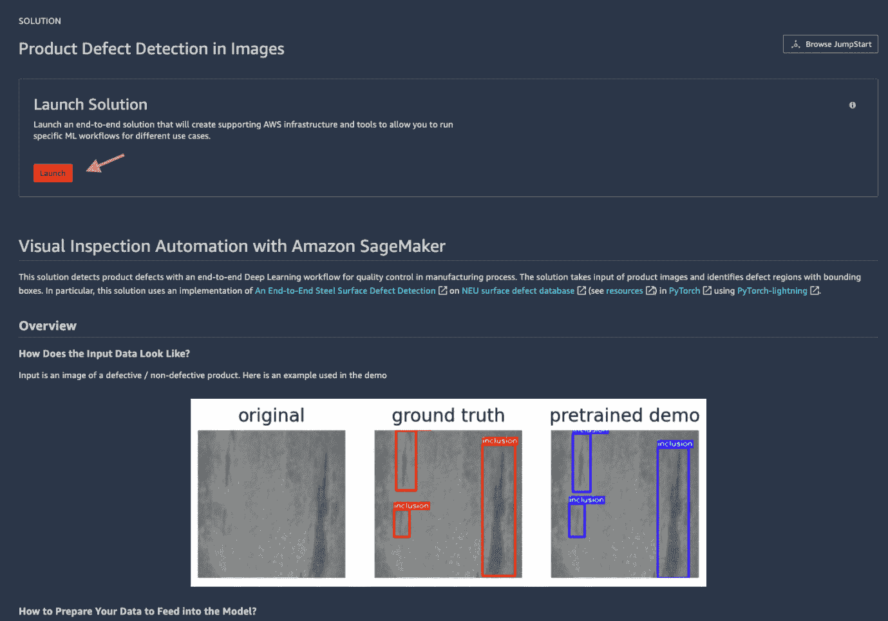

# 第八章：使用 SageMaker JumpStart 和 Autopilot 快速启动机器学习

**SageMaker JumpStart** 作为 Amazon SageMaker 机器学习（**ML**）世界入门套件，为选定的用例提供完整解决方案，无需任何代码开发。SageMaker JumpStart 还为您整理了流行的预训练 **计算机视觉**（**CV**）和 **自然语言处理**（**NLP**）模型，以便您轻松部署或微调到您的数据集。**SageMaker Autopilot** 是一种 AutoML 解决方案，它探索您的数据，代表您构建特征，并从各种算法和超参数中训练最优模型。您无需编写任何代码：Autopilot 会为您完成，并返回笔记本以展示它是如何做到的。

在本章中，我们将涵盖以下主题：

+   启动 SageMaker JumpStart 解决方案

+   从 SageMaker JumpStart 模型库部署和微调模型

+   使用 SageMaker Autopilot 创建高质量模型

# 技术要求

对于本章，您需要拥有使用 JumpStart 模板的权利。您可以从您的域和用户配置文件中确认。本章使用的代码可以在 [`github.com/PacktPublishing/Getting-Started-with-Amazon-SageMaker-Studio/tree/main/chapter08`](https://github.com/PacktPublishing/Getting-Started-with-Amazon-SageMaker-Studio/tree/main/chapter08) 找到。

# 启动 SageMaker JumpStart 解决方案

如果您想学习一套 AWS 服务如何一起使用以创建 ML 解决方案的最佳实践，SageMaker JumpStart 特别有用。您也可以这样做。让我们打开 JumpStart 浏览器。打开它的方式有多种，如图 *图 8.1* 所示。您可以从右侧的 SageMaker Studio 启动器或左侧的 JumpStart 资产浏览器打开它。


图 8.1 – 从启动器或左侧侧边栏打开 JumpStart 浏览器

在主工作区域将弹出一个名为 **SageMaker JumpStart** 的新标签页。转到 **解决方案** 部分，点击 **查看所有**，如图 *图 8.2* 所示。


图 8.2 – 在 JumpStart 中查看所有解决方案

接下来，让我们转向行业解决方案目录。

## 行业解决方案目录

如 *图 8.3* 所示，JumpStart 中有十多种解决方案可供选择。这些解决方案基于涵盖多个行业的用例，包括制造、零售和金融。


图 8.3 – JumpStart 解决方案目录 – 点击每张卡片查看更多信息

它是由了解该行业和用例的 AWS 开发人员和架构师创建的。您可以通过点击卡片了解更多关于每个用例的信息。您将看到一个欢迎页面，描述用例、方法、数据集、解决方案架构以及任何其他外部资源。在每个解决方案页面上，您还应该看到一个**启动**按钮，该按钮将从 CloudFormation 模板部署解决方案和所有云资源到您的 AWS 账户。

让我们以目录中的**产品缺陷检测**解决方案为例，我们将一起了解部署和笔记本。

## 部署产品缺陷检测解决方案

视觉检查在制造过程中被广泛采用作为一种质量控制措施。质量控制过去是一个手动过程，员工会在生产线或通过相机捕获的图像上对产品进行视觉检查。然而，对于今天工厂中生产的大量产品，手动检查无法扩展。机器学习是一个强大的工具，可以以可能比经过适当训练的人类检查员更低的错误率识别产品缺陷。**产品缺陷检测** SageMaker JumpStart 解决方案是一个很好的起点，可以帮助您启动 CV 项目，使用最先进的深度学习模型检测图像中的缺陷。您将了解 SageMaker 如何使用 PyTorch 脚本进行训练管理，以及如何使用模型托管。您还将学习如何对托管端点进行推理。数据集是一个平衡的数据集，包含六种表面缺陷的类型，并包含分类和绘制边界框的地面真实值。请按照以下步骤阅读笔记本的内容：

1.  从**解决方案**目录中，请选择**产品缺陷检测图像**。如图 8.4 所示，您可以在主页上了解解决方案。您可以了解样本数据、算法和云解决方案架构。



图 8.4 – 产品缺陷检测图像解决方案的主页

1.  点击如图 8.4 所示的**启动**按钮开始部署。您应该在屏幕上看到部署进度。正在发生的事情是我们刚刚在后台使用**AWS CloudFormation**启动了一个资源部署。AWS CloudFormation 是一种服务，它通过 JSON 或 YAML 声明性代码中的模板，以有序的方式帮助创建、配置和管理 AWS 资源。此部署需要几分钟。

1.  一旦解决方案变为 `0_demo.ipynb`，从解决方案中运行。这个笔记本是四个笔记本中的第一个，作为 CloudFormation 设置的一部分部署到你的家目录 `S3Downloads/jumpstart-prod-dfd_xxxxxxx/notebooks/` 中。该笔记本需要 **SageMaker JumpStart PyTorch 1.0** 内核，因为我们将要构建一个基于 PyTorch 的解决方案。如果这是第一次使用内核，内核启动可能需要一两分钟。

1.  运行 `0_demo.ipynb` 笔记本中的所有单元格。该笔记本将 `NEU-DET` 检测数据集下载到文件系统，并使用 SageMaker SDK 的 `sagemaker.pytorch.PyTorchModel` 类创建一个用于预训练 PyTorch 模型的 SageMaker 托管端点。在笔记本末尾，你应该看到一个显示预训练模型检测到的补丁与真实值相比的图像，如图 *图 8.5* 所示。


图 8.5 – 0_demo.ipynb 笔记本最终输出，展示了一个钢表面示例、真实值和预训练模型进行的模型预测

该笔记本演示了 SageMaker 提供的关键灵活性，即你可以将 SageMaker 外部训练的模型带到 SageMaker 中托管。要从 PyTorch 模型创建 SageMaker 模型，你需要将模型文件 `.pt`/`.pth` 存档在 `model.tar.gz` 归档中，并有一个入口点，在这个例子中是 `detector.py` 脚本，该脚本指示如何进行推理。我们可以查看 `detector.py` 脚本来了解更多信息。

1.  （可选）添加一个新的单元格并填写以下命令：

    ```py
    !aws s3 cp {sources}source_dir.tar.gz .
    !tar zxvf source_dir.tar.gz
    ```

这将获取整个代码库到本地。请打开 `detector.py` 文件，找到 SageMaker 用于进行推理的部分：

```py
def model_fn(model_dir):
    backbone = "resnet34"
    num_classes = 7  # including the background
    mfn = load_checkpoint(Classification(backbone, num_classes - 1).mfn, model_dir, "mfn")
    rpn = load_checkpoint(RPN(), model_dir, "rpn")
    roi = load_checkpoint(RoI(num_classes), model_dir, "roi")
    model = Detection(mfn, rpn, roi)
    model = model.eval()
    freeze(model)
    return model
```

当导入 PyTorch 模型时，SageMaker 至少需要一个 `model_fn(model_dir)` 函数来指示模型是如何定义的。在这个例子中，`Detection()` 类是一个在 `S3Downloads/jumpstart-prod-dfd_xxxxxx/notebooks/sagemaker_defect_detection/models/ddn.py` 中定义的 `GeneralizedRCNN` 模型，其权重是从提供的模型中加载的。

注意

你可以实现的其它相关推理函数包括以下内容：

将调用请求体反序列化为我们可以对其执行预测的对象：

`input_object = input_fn(request_body, request_content_type)`

使用加载的模型对反序列化的对象进行预测：

`prediction = predict_fn(input_object, model)`

将预测结果序列化为所需的响应内容类型：

`output = output_fn(prediction, response_content_type)`

如果你没有覆盖这些函数，SageMaker 为这三个函数提供了默认实现。如果你有自定义的推理方法，你可以覆盖这些函数。

1.  继续到笔记本的末尾并点击 `1_retrain_from_checkpoint.ipynb`。

1.  运行 `1_retrain_from_checkpoint.ipynb` 笔记本中的所有单元格。这个笔记本使用下载的数据集对预训练模型进行了额外的几个周期的微调。解决方案包括 `detector.py` 文件中的训练代码，该文件位于 `osp.join(sources, "source_dir.tar.gz")`。解决方案使用 SageMaker SDK 的 PyTorch 估算器创建一个训练作业，该作业启动一个按需计算资源，即一个 `ml.g4dn.2xlarge` 实例，并从提供的预训练检查点开始训练。训练大约需要 10 分钟。以下代码行显示了如何将训练数据和预训练检查点输入到 SageMaker PyTorch 估算器以执行模型微调作业：

    ```py
    finetuned_model.fit(
        {
            "training": neu_det_prepared_s3,
            "pretrained_checkpoint": osp.join(s3_pretrained, "epoch=294-loss=0.654-main_score=0.349.ckpt"),
        }
    )
    ```

    注意

    `.fit()` 调用的字典键的命名是经过设计的。这些键在训练容器内部注册为带有 SM_CHANNEL_ 前缀的环境变量，可以在训练脚本中访问。键需要与 `detector.py` 文件中写入的内容匹配，以便使这个 `.fit()` 训练调用生效。例如，请参阅 `detector.py` 中的第 310 行和第 349 行：

    `aa("--data-path", metavar="DIR", type=str, default=os.environ["SM_CHANNEL_TRAINING"])`

    `aa("--resume-sagemaker-from-checkpoint", type=str, default=os.getenv("SM_CHANNEL_PRETRAINED_CHECKPOINT", None))`

训练完成后，模型作为 SageMaker 主机端点部署，如 `0_demo.ipynb` 笔记本中所示。最后，将真实值、从 `0_demo.ipynb` 预训练模型得到的推理结果以及微调模型的推理结果进行了可视化比较。我们可以看到，微调模型的推理结果少了一个误报，但仍然无法识别样本图像右侧的补丁。这应该被视为一个漏报。

1.  点击 `2_detection_from_scratch.ipynb`。

1.  运行 `2_detection_from_scratch.ipynb` 笔记本中的所有单元格。我们不是从检查点开始训练，而是使用相同的训练数据集从头开始训练一个模型，使用 10 个周期，并将推理结果与预训练模型的推理结果进行比较。由于使用了较小的周期数，模型训练不足，这是预期的。我们鼓励您将周期数（`EPOCHS` 变量）增加到 300 以获得更好的性能。然而，这将需要超过 10 分钟的时间。

    注意

    我们通过是否在字典中包含 `pretrained_checkpoint` 键来控制是否从检查点或从头开始训练。

1.  点击 `3_classification_from_scratch.ipynb`。

在这个笔记本中，我们使用`classifier.py`训练了一个分类模型，共进行了 50 个 epoch，而不是从头开始训练一个目标检测模型，使用了 NEU-CLS 分类数据集。分类模型与之前的目标检测模型不同。图像分类可以识别整个图像中的缺陷类型，而目标检测模型还可以定位缺陷的位置。如果你不需要知道缺陷的位置，图像分类非常有用，并且可以作为产品缺陷的分级模型使用。

从作业中可以看出，训练分类模型更快。正如训练作业的单元格输出所示，验证集上的分类准确率达到了`0.99`，这是一个非常准确的值：

```py
Epoch 00016: val_acc reached 0.99219 (best 0.99219), saving model to /opt/ml/model/epoch=16-val_loss=0.028-val_acc=0.992.ckpt as top 1
```

1.  这就是解决方案的结束。请确保在每个笔记本中执行最后一个单元格以删除模型和端点，特别是`0_demo.ipynb`笔记本中的最后一个单元格，其中删除操作被注释掉了。请取消注释并执行它以删除预训练模型和端点。

使用这个 SageMaker JumpStart 解决方案，你基于 Faster RCNN 的 PyTorch 实现构建并训练了四个深度学习模型，以最小的编码工作量检测和分类钢图像中的六种缺陷类型。你还将它们作为 SageMaker 端点托管以进行实时预测。你可以期待在 SageMaker JumpStart 的其他解决方案中体验到类似的效果，以学习在解决常见用例时使用的 SageMaker 功能的各个方面。

现在，让我们转换到 SageMaker JumpStart 模型库。

# SageMaker JumpStart 模型库

在 SageMaker JumpStart 中，有超过 200 个流行的预构建和预训练模型供你直接使用或继续训练以适应你的用例。它们有什么好处？训练一个准确的深度学习模型既耗时又复杂，即使是最强大的 GPU 机器也是如此。它还需要大量的训练和标记数据。现在，有了这些由社区开发、在大数据集上预训练的模型，你不必重新发明轮子。

## 模型集合

在 SageMaker JumpStart 模型库中有两组模型：**文本模型**和**视觉模型**。这些模型在机器学习社区中非常受欢迎。你可以快速浏览 SageMaker JumpStart 中的模型，并选择满足你需求的模型。在每一个模型页面上，你将看到该模型的介绍、用法以及如何为微调准备数据集。你可以将模型部署到 AWS 作为你的用例的托管端点，或者使用自己的数据集进一步微调模型。

文本模型来源于以下三个中心：TensorFlow Hub、PyTorch Hub 和 Hugging Face。每个模型都是针对特定类型的 NLP 任务使用如文本分类、问答或文本生成等数据集进行专门训练的。值得注意的是，有许多版本的**双向编码器表示从 Transformer**（**BERT**）、**跨语言语言模型**（**XLM**）、**ELECTRA**和**生成预训练 Transformer**（**GPT**）可供选择。

视觉模型来源于 TensorFlow Hub、PyTorch Hub 和 Gluon CV。这里有执行图像分类、图像特征向量提取和目标检测的模型。**Inception**、**SSD**、**ResNet**和**Faster R-CNN**模型是该领域最著名和最广泛使用的模型。

## 部署模型

让我们找到一个问答模型，看看我们如何将其部署到我们的 AWS 账户。在搜索栏中输入`问答`并按**回车键**，你应该会看到返回一个执行此类任务的模型列表，如图*图 8.6*所示。


图 8.6 – 搜索问答模型

让我们找到并双击`OpenWebTextCorpus`，它是由 RoBERTa 模型检查点提取的。它有 6 层，768 个隐藏单元，12 个头，和 8200 万个参数。8200 万个！训练这样一个大型模型当然不容易。幸运的是，有了 SageMaker JumpStart，我们可以直接部署一个模型。如图*图 8.7*所示，请展开**部署配置**部分，选择**Ml.M5.Xlarge**作为机器类型，将端点名称保留为默认值，然后点击**部署**。Ml.M5.Xlarge 是一种通用实例类型，具有 4 个 vCPU 和 16GB 的内存，这对于本例来说已经足够了。部署将需要几分钟。


图 8.7 – 部署 JumpStart DistilRoBERTa Base 模型

一旦模型部署完成，将提供一个笔记本，展示如何向托管端点发出 API 调用（如图*图 8.8*）。你可以在 JumpStart 的左侧侧边栏中找到模型列表。


图 8.8 – 部署模型后打开一个示例推理笔记本

在示例笔记本中，提供了来自**SQuAD v2**数据集的两个问题，这是最广泛使用的问答数据集之一，用于评估。让我们也根据以下段落（你能猜到你以前在哪里读过吗？是的，这是本章的开篇陈述！）向我们的模型提出其他问题：

上下文：

SageMaker JumpStart 作为入门套件，为世界各地的机器学习（ML）爱好者提供 Amazon SageMaker 的完整解决方案，无需任何代码开发。SageMaker JumpStart 还为您整理了流行的预训练计算机视觉（CV）和自然语言处理（NLP）模型，以便您轻松部署或微调到您的数据集。SageMaker Autopilot 是一个 AutoML 解决方案，它探索您的数据，代表您构建特征，并从各种算法和超参数中训练最优模型。您无需编写任何代码：Autopilot 会为您完成，并返回笔记本以展示它是如何做到的。

问题：

+   *SageMaker JumpStart 做什么？*

+   *什么是自然语言处理（NLP）？*

在笔记本中，我们应该在第二个单元格中添加以下内容：

```py
question_context3 = ["What does SageMaker JumpStart do?", "SageMaker JumpStart offers complete solutions for select use cases as a starter kit to the world of machine learning (ML) with Amazon SageMaker without any code development. SageMaker JumpStart also catalogs popular pretrained computer vision (CV) and natural language processing (NLP) models for you to easily deploy or fine-tune to your dataset. SageMaker Autopilot is an AutoML solution that explores your data, engineers features on your behalf and trains an optimal model from various algorithms and hyperparameters. You don't have to write any code: Autopilot does it for you and returns notebooks to show how it does it."]
question_context4 = ["What is NLP?", question_context3[-1]]
```

在第三个单元格中，将两个新的问题上下文对添加到 `for` 循环中的列表中，并执行笔记本中的所有单元格：

```py
for question_context in [question_context1, question_context2, question_context3, question_context4]:
```

哇！我们从模型那里得到了回答，这些问题是关于 SageMaker JumpStart 的功能和自然语言处理（NLP）的全称。

## 微调模型

当您从架子上取下一个预训练模型，将其暴露于您的数据集，以便它在您的数据集上表现优于未暴露时的性能时，进行模型微调是典型的。此外，与从头开始训练模型相比，模型微调所需的时间更少，并且需要的标记数据量更小。要微调 SageMaker JumpStart 中的预训练模型，首先我们需要确保您想使用的模型支持微调。您可以在概述卡中找到此属性。其次，您需要将数据集指向模型。以 DistilRoBERTa Base 模型为例，SageMaker JumpStart 提供了默认的 **SQuAD-v2** 数据集，这允许您快速开始训练作业。您也可以按照 JumpStart 模型页面上的说明创建自己的数据集。我们就是要这样做。

让我们用关于佛教的一些问题和答案来微调基础 DistilRoBERTa Base 模型，佛教是 `SQuAD-v2` 数据集中的一个主题。请按照以下步骤操作：

1.  在存储库中打开 `chapter08/1-prep_data_for_finetune.ipynb` 笔记本，执行所有单元格以下载数据集，提取与佛教相关的段落，并按照微调训练器期望的方式组织它们。这在 `data.csv` 文件中的描述页上有详细说明：

    +   `data.csv` 的第一列应该有一个问题。

    +   第二列应该有相应的上下文。

    +   第三列应该有答案在上下文中的整数字符起始位置。

    +   第四列应该有答案在上下文中的整数字符结束位置。

1.  **输出**：一个可以部署进行推理的训练模型。

1.  笔记本末尾，`data.csv` 文件将被上传到您的 SageMaker 默认存储桶：`s3://sagemaker-<region>-<accountID>/chapter08/buddhism/data.csv`。

1.  完成此操作后，让我们切换回模型页面并配置微调作业。如图 8.9 所示，将 `-buddhism` 添加到模型名称中，保留机器类型和超参数为默认值，然后点击 **训练**。默认的 **Ml.P3.2xlarge** 实例类型，配备一个 NVIDIA Tesla V100 GPU，是快速模型微调的一个很好的选择。默认的超参数设置使用 **批量大小为 4**、**学习率为 2e-5** 和 **3 个训练轮数** 进行微调。这对于我们演示微调的工作原理是足够的。您可以随意更改这里的值以反映您的实际使用情况。


图 8.9 – 为自定义数据集配置微调作业

使用 **Ml.P3.2xlarge** 实例，训练作业应该大约需要 6 分钟。

1.  作业完成后，您可以将模型部署到具有 **Ml.M5.Xlarge** 实例的端点，如图 8.10 所示。Ml.M5.Xlarge 是一种通用 CPU 实例，是模型托管的一个良好起点。


图 8.10 – 部署微调后的模型

当然，我们现在需要测试微调后的模型在涉及佛陀和佛教的问题上的表现。一旦部署完成，您将收到一个选项，可以打开一个预构建的笔记本来使用端点，类似于图 8.8 所示。

1.  我们可以将第二个单元格中的问题-上下文对替换为以下来自 [`www.history.com/topics/religion/buddhism`](https://www.history.com/topics/religion/buddhism) 的片段：

    ```py
    question_context1 = ["When was Buddhism founded?", "Buddhism is a faith that was founded by Siddhartha Gautama ("the Buddha") more than 2,500 years ago in India. With about 470 million followers, scholars consider Buddhism one of the major world religions. Its practice has historically been most prominent in East and Southeast Asia, but its influence is growing in the West. Many Buddhist ideas and philosophies overlap with those of other faiths."]
    question_context2 = ["Where is Buddhism popular among?", question_context1[-1]]
    ```

然后，执行笔记本中的单元格，您将看到我们的新模型表现如何。

这并不是我们希望模型达到的效果。这是由于使用了非常小的训练轮数，以及可能未优化的批量大小和学习率。由于我们为模型提供了新的数据点，网络中的权重再次更新，需要经过足够多的训练轮数以收敛到更低的损失，从而创建一个更准确的模型。这些超参数通常需要调整，以便即使在微调的情况下也能获得一个好的模型。我们鼓励您进一步实验不同的超参数，看看模型是否能够更好地回答问题。

我们刚刚创建了三个机器学习模型，这些模型应该是复杂且难以训练的，但几乎不需要编写任何代码。现在我们将学习如何使用 SageMaker Autopilot 自动创建一个高质量的模型，而无需任何代码。

# 使用 SageMaker Autopilot 创建高质量模型

你是否曾想过在没有数据预处理、特征工程、探索算法和优化超参数的麻烦的情况下构建机器学习模型？你是否曾想过，对于某些用例，你只是想快速看看机器学习是否是某个特定商业用例的可行方法？Amazon SageMaker Autopilot 使你能够轻松地为表格数据集构建机器学习模型，而无需任何代码。

## 葡萄酒质量预测

为了演示 SageMaker Autopilot，让我们使用葡萄酒质量预测用例。葡萄酒行业一直在寻找一种可以帮助酿酒师和市场更快、更标准地评估葡萄酒质量的技术。葡萄酒质量评估和认证是葡萄酒市场生产和销售的关键部分，并防止葡萄酒的非法掺假。葡萄酒评估由专家品酒师根据物理化学和感官测试进行，产生如密度、酒精水平和 pH 值等特征。然而，当涉及人类时，标准可能在品酒师之间或测试试验之间有所不同。因此，拥有一种机器学习方法来支持品酒师提供分析信息，在葡萄酒行业中成为一项重要任务。

我们将训练一个机器学习模型，根据 2004 年至 2007 年间在葡萄牙生产的 4,898 种白葡萄酒的物理化学感官值来预测葡萄酒质量。数据集可在 UCI 的 https://archive.ics.uci.edu/ml/datasets/Wine+Quality 处获得。

## 设置 Autopilot 作业

让我们开始吧：

1.  请打开存储库中的[chapter08/2-prep_data_for_sm_autopilot.ipynb](http://chapter08/2-prep_data_for_sm_autopilot.ipynb)笔记本，并执行所有单元格以从源下载数据，保留测试集，并将训练数据上传到 S3 存储桶。请注意训练数据的路径。

1.  接下来，打开启动器并选择**新建 Autopilot 实验**，如*图 8.11*所示。


图 8.11 – 创建新的 Autopilot 实验

将弹出一个新窗口，供我们配置 Autopilot 作业。

1.  如*图 8.12*所示，提供`white-wine-predict-quality`。


图 8.12 – 配置 Autopilot 作业

1.  如*图 8.12*所示，从**数据集文件名**下拉菜单中选择`sagemaker-<region>-<accountID>`中的训练数据。将**目标**设置为**quality**，使用 CSV 文件中的其余属性来预测葡萄酒的质量。

1.  在配置页面的下半部分，如图 8.13 所示，提供保存输出数据的路径，将`sagemaker-<region>-<accountID>`从`/sagemaker-studio-book/chapter08/winequality/`路径检查到**数据集目录名称**字段中，作为输出位置。这个路径是我们训练 CSV 文件所在的位置。


Figure 8.13 – 配置 Autopilot 作业

1.  如图 8.13 所示，从**选择机器学习问题类型**下拉菜单中选择**多类分类**。然后从**目标指标**下拉菜单中选择**F1macro**，以便在数据偏向某个质量等级时，我们可以期望得到一个更平衡的模型。

1.  如图 8.13 所示，对于**您想运行完整实验吗？**选择**是**。然后切换**自动部署**选项为**关闭**，因为我们希望在 SageMaker Studio 中走完评估过程后再部署我们的最佳模型。

1.  如图 8.13 所示，展开**最大候选数**字段中的`100`。默认情况下，Autopilot 运行 250 个具有不同预处理步骤、训练算法和超参数的训练作业。通过使用有限数量的候选者，我们应该期望完整实验比默认设置更快完成。

1.  点击**创建实验**以启动 Autopilot 作业。

您将看到一个新窗口，显示 Autopilot 作业的进度。请让它处理一下数字，过几分钟再回来。您将在进度标签中看到更多的进度和输出，如图 8.14 所示。


Figure 8.14 – 查看 Autopilot 实验的进度

这里有很多事情在进行中。让我们深入了解一下。

## 理解 Autopilot 作业

Amazon SageMaker Autopilot 自动执行端到端的机器学习模型构建练习。它执行**探索性数据分析**（**EDA**），进行数据预处理，并创建特征工程和模型训练配方。然后按照配方执行，以找到给定条件下的最佳模型。您可以在图 8.14 的中间部分查看进度。

使 Autopilot 独特的是它提供的全面可见性。Autopilot 通过提供 EDA 结果和 Autopilot 执行特征工程和机器学习建模的代码（以 Jupyter 笔记本的形式）来解包典型的 AutoML 黑盒。您可以通过点击**打开数据探索笔记本**按钮来访问 EDA 结果，以及点击**打开候选生成笔记本**按钮来访问配方。

数据探索笔记本有助于理解数据、分布以及 Autopilot 如何根据数据的特征构建食谱。例如，Autopilot 会在数据集中寻找缺失值、数值特征的分布以及分类特征的基数。这些信息为数据科学家提供了对数据的基准理解，以及关于输入数据是否包含合理条目的可操作见解。如果你看到许多特征具有高比例的缺失值（**缺失值百分比**部分），你可以采取建议的行动从数据创建的角度调查问题，并对特征进行一些预处理，要么删除特征，要么应用特定领域的插补。你可能想知道，“*Autopilot 不是应用数据预处理和特征工程到数据上吗？*”是的，它确实如此。然而，Autopilot 并不具备你数据的特定领域知识。你应该期待 Autopilot 对提出的问题采取更通用的、以数据科学为导向的方法，这可能不会那么有效。

候选生成笔记本规定了基于数据的 EDA（探索性数据分析）如何构建和训练模型的方法。代码的数量可能看起来令人畏惧，但如果你仔细阅读，你可以看到，例如，Autopilot 正在尝试的数据预处理步骤和建模方法，如**候选管道**部分所示。以下是一个例子：

```py
The SageMaker Autopilot Job has analyzed the dataset and has generated 9 machine learning pipeline(s) that use 3 algorithm(s).
```

Autopilot 基于三种算法构建管道：**XGBoost**、**线性学习器**和**多层感知器**（**MLP**）。XGBoost 是一种流行的梯度提升树算法，以高效和灵活的方式结合了一组弱预测器来形成最终的预测器。XGBoost 是 SageMaker 内置算法之一。线性学习器也是一种 SageMaker 内置算法，它使用不同的超参数训练多个线性模型，并通过分布式随机梯度下降优化找到最佳模型。MLP 是一种基于神经网络的监督学习算法，它可以有多个隐藏层，以创建非线性模型。

你还可以看到 Autopilot 正在探索的超参数和范围列表（**多算法超参数调整**部分）。Autopilot 不仅提供了可见性，还给了你对实验的完全控制权。你可以点击右上角的**导入笔记本**按钮来获取一个你可以自定义并执行以获得下一个最佳模型的笔记本副本。

## 评估 Autopilot 模型

如果您在标签页中看到的工作状态，如图 8.14 所示，已更改为**完成**，那么就是时候评估自动驾驶仪生成的模型了。如您在试验列表中所见，自动驾驶仪已使用各种特征工程、算法和超参数的组合训练了 100 个模型。排行榜还显示了用于评估模型的性能指标，即随机验证分割上的 F1 分数。您可以通过点击**目标：F1**来按分数排序模型。

让我们更仔细地看看最佳模型，即具有最高 F1 分数且试验名称旁边有星号的模型。右键单击试验并选择**在模型详情中打开**以查看更多信息。


图 8.15 – 在 SageMaker Studio 中查看自动驾驶仪模型详情

自动驾驶仪在本页上报告了很多细节，如图 8.15 所示。首先，我们可以看到这个模型是基于**XGBoost**算法构建的。我们还看到了自动驾驶仪为我们生成的特征重要性图表。这个图表告诉我们模型如何考虑输入特征的重要性或贡献。自动驾驶仪使用**SageMaker Clarify**为这个 XGBoost 模型和数据集计算**SHapley Additive exPlanations**（**SHAP**）值。SHAP 值解释了特征如何根据博弈论对模型形成决策做出贡献。

注意

您可以将鼠标悬停在条形上以查看实际值。SageMaker 提供了更多细节，以便您可以在**想了解更多？**部分的白皮书中了解这些 SHAP 值是如何计算的。

返回图表，您还可以下载一个自动生成的包含此图表的 PDF 报告，以便审阅和分发（**导出 PDF 报告**）。如果您想以 JSON 格式处理原始数据以便在其他应用程序中集成 SHAP 值，您可以下载数据（**下载原始数据**）。通过点击这两个按钮，您将被重定向到如图 8.16 所示的 S3 控制台。您可以通过点击**下载**按钮从控制台上的 S3 存储桶下载文件。


图 8.16 – 在 S3 控制台中下载特征重要性 PDF 报告

除了特征重要性之外，模型在训练集和验证集上的表现对于理解模型在实际生活中的表现同样非常重要。您可以在用于在排行榜上对模型进行排名的`ObjectiveMetric`中看到训练运行期间捕获的指标，我们看到了以下指标：

+   `train:f1`

+   `train:merror`

+   `validation:f1`

+   `validation:merror`

它们是多类 F1 宏度量以及数据训练和验证分割的多类错误。正如你可以通过相同的值所知，`ObjectiveMetric`基本上等同于`validation:f1`。由于`train:f1`远高于`validation:f1`，我们可能会得出结论，该模型过度拟合了训练数据集。但为什么会这样呢？

我们可以使用我们在一开始就保留的测试数据进一步详细验证模型性能。请从存储库中打开`chapter08/3-evaluate_autopilot_models.ipynb`笔记本，并执行所有单元格。在这个笔记本中，你将根据`ObjectiveMetric`从 Autopilot 作业中检索顶级模型，使用`TOP_N_CANDIDATES`在云中进行推理，针对不同的数量。你应该会看到计算出的 F1 分数，包括宏度量、未加权平均值、加权方法、分类报告（来自 sklearn 函数）和测试数据上的混淆矩阵，这是最后一个单元格的输出。

使用顶级模型时，这里有几个方面让我印象深刻。数据在本质上是不平衡的。分数为`5`、`6`和`7`的葡萄酒数量较多。很少有葡萄酒得到`3`、`4`或`8`的分数。混淆矩阵还显示，得到`3`分的葡萄酒都被错误分类了。在这种情况下，由于对少数类的错误分类不成比例，`f1`宏度量将大幅降低。如果我们查看`f1`得分的加权版本，我们会得到一个显著更高的分数，因为评分更重视主导类：

```py
Candidate name:  white-wine-predict-qualitysZ1CBE-003-1a47413b
Objective metric name:  validation:f1
Objective metric value:  0.4073199927806854
f1 = 0.51, Precision = 0.59 (macro)
f1 = 0.67, Precision = 0.68 (weighted)
              precision    recall  f1-score   support
           3       0.00      0.00      0.00         3
           4       0.70      0.39      0.50        18
           5       0.63      0.67      0.65       144
           6       0.67      0.77      0.72       215
           7       0.76      0.57      0.65        94
           8       0.78      0.44      0.56        16
    accuracy                           0.67       490
   macro avg       0.59      0.47      0.51       490
weighted avg       0.68      0.67      0.67       490
[[  0   0   3   0   0   0]
 [  0   7   8   3   0   0]
 [  0   2  96  45   1   0]
 [  0   1  37 166  10   1]
 [  0   0   8  31  54   1]
 [  0   0   0   3   6   7]]
```

使用对用例最重要的度量来衡量模型性能也很重要。正如被引用研究的作者关于精确度度量重要性的陈述：

"这个统计量在实践中很重要，因为在实际的部署设置中，实际值是未知的，并且给定列内的所有预测都会被同等对待。"

我们应该比较原始研究研究中使用的精确度度量（在研究中的*表 3*，在*进一步阅读*部分中链接），其中个体精确度如下：

+   4: 63.3%

+   5: 72.6%

+   6: 60.3%

+   7: 67.8%

+   8: 85.5%

当对白葡萄酒的容忍度`T = 0.5`时。我们的第一个 Autopilot 模型在某些类别中精确度表现优异，而在其他类别中表现不佳。

另一种找到更适合业务问题的模型的方法是评估更多模型，而不仅仅是 Autopilot 建议的最佳模型。我们可以看到另外两个（或更多，取决于您对 `TOP_N_CANDIDATES` 的设置）的评估。我们发现，尽管第二和第三个模型的 `validation:f1`（宏）分数低于第一个模型，但它们在保留的测试集上的 F1 分数实际上更高。第三个模型的个别精确度分数都优于原始研究中的模型，除了第 5 类，高出 2.6%。多么迷人！排行榜中的第三个模型在测试数据上的表现（按精确度指标衡量）实际上更好，这对于用例来说最有意义。

评估后，我们可以将最佳模型部署到端点进行实时推理。Autopilot 使得部署模型变得简单。在排行榜中，选择您想要部署的项目，然后点击**部署模型**按钮。将弹出一个新页面，供您配置端点。对于经验丰富的 SageMaker Studio 用户来说，大多数选项都是直观且不言自明的。有两点需要注意：您可以选择启用数据捕获，这在您想设置 SageMaker 模型监控器时很有用。如果您希望模型返回的不仅仅是**预测标签**，例如在多类用例中获胜类的硬标签，您可以选择返回获胜标签的**概率**、所有类的**标签**和所有类的**概率**。选择顺序也将决定输出顺序。

# 摘要

在本章中，我们介绍了集成到 SageMaker Studio 的两个功能——JumpStart 和 Autopilot，以及三个机器学习用例，以展示为机器学习开发者提供的低代码到无代码的机器学习选项。我们学习了如何在目录中浏览 JumpStart 解决方案，以及如何从 JumpStart 部署端到端的计算机视觉解决方案以检测产品缺陷。我们还使用 JumpStart 模型动物园中的 DistilRoBERTa Base 模型部署并微调了一个问答模型，而无需任何机器学习编码。使用 Autopilot，我们只需将 Autopilot 指向存储在 S3 中的数据集并启动一个 Autopilot 作业，就可以简单地构建一个白葡萄酒质量预测模型——无需编写代码。结果证明，Autopilot 的表现甚至超过了原始研究人员可能花费数月时间创建的模型。

在下一章中，我们开始本书的下一部分：*使用 SageMaker Studio 的机器学习生产与操作*。我们将学习如何通过 SageMaker 的分布式训练从原型设计过渡到大规模的机器学习训练，如何使用 SageMaker Debugger 轻松监控模型训练，以及如何通过托管 Spot 训练节省训练成本。

# 进一步阅读

想要了解更多信息，请查看以下资源：

+   P. Cortez, A. Cerdeira, F. Almeida, T. Matos 和 J. Reis. *通过数据挖掘物理化学性质建模葡萄酒偏好*。载于《决策支持系统》，Elsevier，第 47 卷第 4 期，第 547-553 页，2009 年。[`bit.ly/3enCZUz`](https://bit.ly/3enCZUz)
