# 第十一章：使用 SageMaker 项目、管道和模型注册实现机器学习项目的运营化

数据科学家过去花费太多时间和精力维护和手动管理机器学习管道，这个过程从数据、处理、训练和评估开始，以模型托管和持续维护结束。SageMaker Studio 提供了旨在通过**持续集成和持续交付**（**CI/CD**）最佳实践简化这些操作的功能。您将学习如何实现 SageMaker 项目、管道和模型注册，以帮助通过 CI/CD 实现机器学习生命周期的运营化。

在本章中，我们将学习以下内容：

+   理解机器学习操作和 CI/CD

+   创建 SageMaker 项目

+   使用 SageMaker 管道编排机器学习管道

+   在 SageMaker Studio 中运行 CI/CD

# 技术要求

对于本章，您需要确保在工作室设置中启用了 SageMaker 项目模板权限。如果您已经完成了*第八章*，*使用 SageMaker JumpStart 和 Autopilot 快速启动机器学习*，您应该拥有这些权限。您可以在工作室**域名**视图中通过以下步骤进行验证：

1.  如果如*图 11.1*所示，任一权限被禁用，您可以点击**编辑设置**来更改此设置。

![图 11.1 – 检查和编辑 SageMaker 项目权限

]

图 11.1 – 检查和编辑 SageMaker 项目权限

1.  前往**步骤 2 工作室设置**，如图*图 11.2*所示，切换 SageMaker 项目和 JumpStart 权限。

![图 11.2 – 为账户和用户启用 SageMaker 项目模板

]

图 11.2 – 为账户和用户启用 SageMaker 项目模板

1.  然后点击**下一步**进入下一页，并点击**提交**。

这确保了 SageMaker 项目模板权限为您启用。

# 理解机器学习操作和 CI/CD

在机器学习生命周期中，有许多步骤需要数据科学家全程动手操作，例如处理数据集、训练和评估模型。这些手动步骤可能会影响机器学习团队的运营和将模型部署到生产中的速度。想象一下，您的模型训练作业耗时很长，并在半夜完成。您要么必须等到白天第一个数据科学家到来评估模型并将模型部署到生产中，要么必须安排值班轮换，让有人在任何时候都待命以监控模型训练和部署。但这两个选项都不理想，如果您希望有一个有效且高效的机器学习生命周期。

**机器学习运维**（**MLOps**）对于想要保持精简并良好扩展的团队至关重要。MLOps 帮助你尽可能简化并减少人工干预。它帮助你将 ML 生命周期转变为企业级。它帮助你扩展并维护投入生产中的模型的质量，同时也有助于通过自动化提高模型交付的时间。

那么，MLOps 究竟是什么呢？

MLOps 指的是一种将 DevOps 最佳实践应用于机器学习生命周期的方法论。**DevOps**代表软件**开发**（**Dev**）和 IT**运维**（**Ops**）。DevOps 旨在通过一套工程、实践和模式，提高团队快速、高质量交付应用程序的能力。它还促进了一个组织中的新文化和行为范式。MLOps 推荐以下实践，这些实践基于 DevOps 最佳实践，并针对 ML 的特性进行了一些修改：

+   **持续集成**（**CI**）：在 DevOps 中，开发者不断提交并合并他们的代码更改到中央仓库，之后自动运行测试以验证代码。在机器学习（ML）中，不仅代码需要集成和验证，训练数据和 ML 模型也是如此。训练数据需要版本控制，模型血缘需要追踪以实现可追溯性，除了代码之外，数据和模型的测试也需要实施。

+   **持续交付**（**CD**）：在 DevOps 中，这是一种自动构建、测试和发布生产代码的实践。在 MLOps 中，与持续集成讨论的内容类似，操作包括除了 ML 源代码之外的数据和模型。

+   **一切皆代码**：为了使持续集成和持续部署（CI/CD，简称 CI/CD）流程简化和自动化，一切都需要以代码的形式实现：流程、基础设施和配置，而不是在屏幕上任何手动设置和点击操作。这种做法也使得你的流程、基础设施和配置能够实现版本控制和可重复性。

+   **监控和日志记录**：这种实践鼓励你记录与你的软件/ML 系统相关的所有内容，以实现可见性和可审计性。你不仅记录 ML 指标、数据血缘、数据版本和模型版本，还记录 CI/CD 流程以及任何错误，用于调试和监控目的。这为下一个实践提供了支持。

+   **沟通与协作**：因为一切皆代码，一切皆自动化并记录，你拥有一个透明的工作环境，这鼓励协作和沟通。而不是在孤岛中手动交接，这会导致摩擦和透明度降低，你的整个团队能够更紧密地在系统上协作工作。

MLOps 带来的关键益处如下：

+   **更快的上市时间**：因为现在你的模型部署是作为 CI/CD 流程的一部分自动创建和部署的，所以你的模型训练和部署流程得到了简化，没有任何交接或手动流程。你可以在相同的时间内期待更多的迭代优化，并且成熟产品的周转时间会更快。

+   **生产力**：许多手动流程从数据科学家和 ML 开发人员那里移除，使他们能够专注于无法自动化的 ML 模型构建。

+   **可重复性**：此外，由于一切都是代码并且是自动化的，你的 ML 生命周期可以由任何人在任何时候以完全相同的结果执行。

+   **可靠性**：在 CI/CD 流程中进行的测试和验证，让你知道你的模型质量很高。由于 CI/CD 提供的可重复性，你还可以持续地生产高质量的模型。

+   **可审计性**：由于代码、数据和模型都有版本控制，并且记录了血缘和流程，你可以确切地知道模型是如何被训练和部署的。

+   **更好的质量**：结合上述所有优点，MLOps 使我们能够花更多的时间创建更好的模型，并让系统快速、可靠、可重复地处理集成和交付。

你可能会想：*MLOps 看起来太完美了，难以轻易采用*。是的，你确实需要在你的 ML 生命周期中整合额外的技术来启用 CI/CD 流程。是的，你需要实施许多细节来启用日志记录和监控。同样，为了采用“一切皆代码”的实践，在开始时确实需要对基础设施代码和配置进行许多迭代测试。好消息是，在 SageMaker Studio 中，为你的 ML 项目采用 MLOps 实践变得很容易。SageMaker Studio 为许多用例模板化了 CI/CD 流程，这样你就可以轻松选择一个，并从模板化的 ML 用例中采用 MLOps 最佳实践和技术，以适应你的用例。使 MLOps 和 CI/CD 成为可能的特性包括 **SageMaker 项目**、**SageMaker 流程**和**SageMaker 模型注册**。

首先，让我们通过创建一个 SageMaker 项目来开始。

# 创建一个 SageMaker 项目

**SageMaker 项目**使你能够通过 SageMaker 提供的模板和自己的自定义模板，使用 MLOps 和 CI/CD 自动化模型构建和部署流程。使用 SageMaker 提供的模板，所有初始设置和资源分配都由 SageMaker 处理，因此你可以快速将其应用于你的用例。

在本章中，我们将使用 SageMaker Studio 中的 MLOps 和 CI/CD 运行一个 ML 示例。由于本章我们专注于 MLOps 和 CI/CD，我们使用来自鲍鱼数据集（[`archive.ics.uci.edu/ml/datasets/abalone`](https://archive.ics.uci.edu/ml/datasets/abalone)）的简单回归问题来预测鲍鱼的年龄。我将向您展示如何从 SageMaker 项目创建项目，以及 MLOps 系统的每个部分是如何工作的。从 SageMaker 项目创建的 MLOps 系统可以通过简单的代码提交触发器自动化数据验证、模型构建、模型评估、部署和监控。这意味着每当我们对代码库进行任何更改时，整个系统将自动运行我们在这本书中学到的 SageMaker 的完整 ML 生命周期。您将看到 SageMaker 为您简化了多少 MLOps。让我们打开 SageMaker Studio 并遵循这里给出的步骤：

1.  在**启动器**页面，点击**新建项目**卡片上的*加号*，如图*图 11.3*所示。

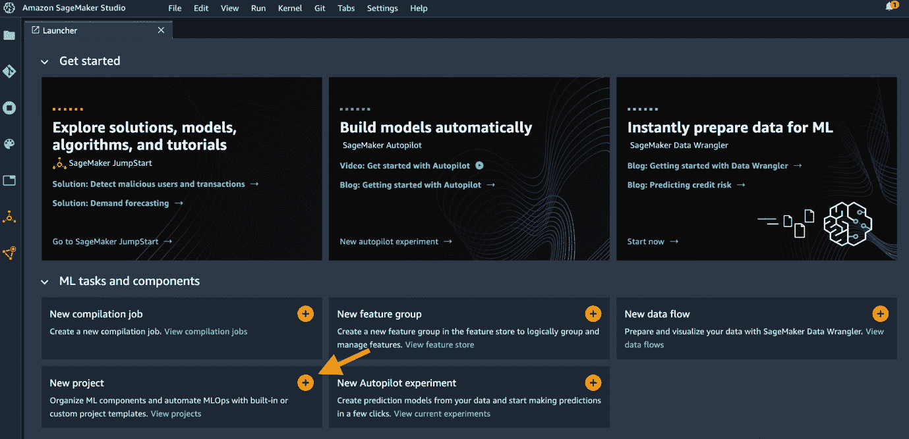

图 11.3 – 在启动器中打开新项目

1.  SageMaker（在**SageMaker 模板**下）为我们创建了各种用例的 MLOps 模板，如图*图 11.4*所示。让我们选择**用于模型构建、训练、部署和监控的 MLOps 模板**。此模板自动化整个模型生命周期，包括模型构建、部署和监控工作流程。点击**选择项目模板**。

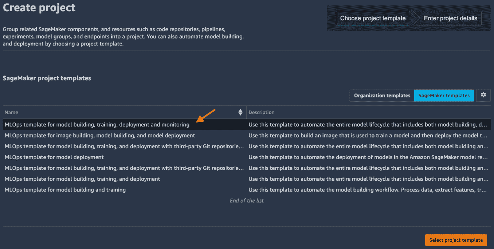

图 11.4 – 选择 SageMaker 托管模板

注意

模板名称包含**与第三方 Git 仓库**的模板旨在与您的外部 Git 仓库或 CI/CD 软件（如**Jenkins**）一起使用。您需要在下一步提供更多信息。

1.  在**项目详情**页面为项目提供名称、描述和标签。点击**创建项目**。

使用此项目模板，SageMaker Studio 现在正在为 MLOps 配置云资源并部署示例代码。让我们用图*图 11.5*所示的图表来展示 MLOps 架构：

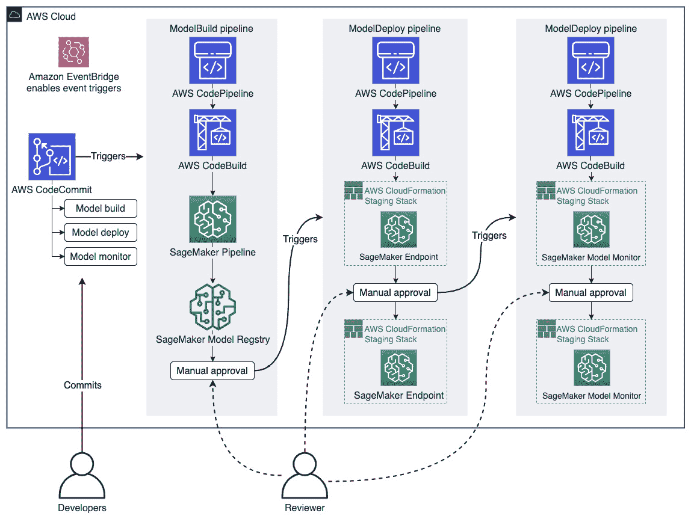

图 11.5 – 使用 SageMaker 项目模板的 MLOps 设置架构图

创建的云资源包括以下内容：

+   在**AWS CodeCommit**中有三个代码仓库，这是一个托管私有 Git 仓库的托管源代码管理服务。它们也可以在 AWS CodeCommit 控制台中找到：[`console.aws.amazon.com/codesuite/codecommit/repositories`](https://console.aws.amazon.com/codesuite/codecommit/repositories)。请记住从 URL 切换到您自己的 AWS 区域。

+   在**AWS CodePipeline**中，一个帮助自动化构建、测试和发布管道的托管服务，有三个持续交付管道可以在 AWS CodePipeline 控制台中找到：[`console.aws.amazon.com/codesuite/codepipeline/pipelines`](https://console.aws.amazon.com/codesuite/codepipeline/pipelines)。请记住从 URL 切换到您自己的 AWS 区域。

+   在**Amazon EventBridge**中，一个使构建事件驱动应用程序更容易的托管服务，可以在 Amazon EventBridge 控制台中找到五个事件触发规则：[`console.aws.amazon.com/events/home#/rules`](https://console.aws.amazon.com/events/home#/rules)。请记住从 URL 切换到您自己的 AWS 区域。

这些基本上是支持 SageMaker Studio 中 MLOps 的 CI/CD 框架的骨干。CodeCommit 中的仓库是我们存储、开发和提交代码的地方。对 CodeCommit 中代码仓库的每次提交都将触发，由 EventBridge 中的规则管理，在 CodePipeline 中运行相应的管道以构建、测试和部署资源。

一旦项目创建完成，您可以在主工作区域中看到项目门户，如图 11.6 所示。

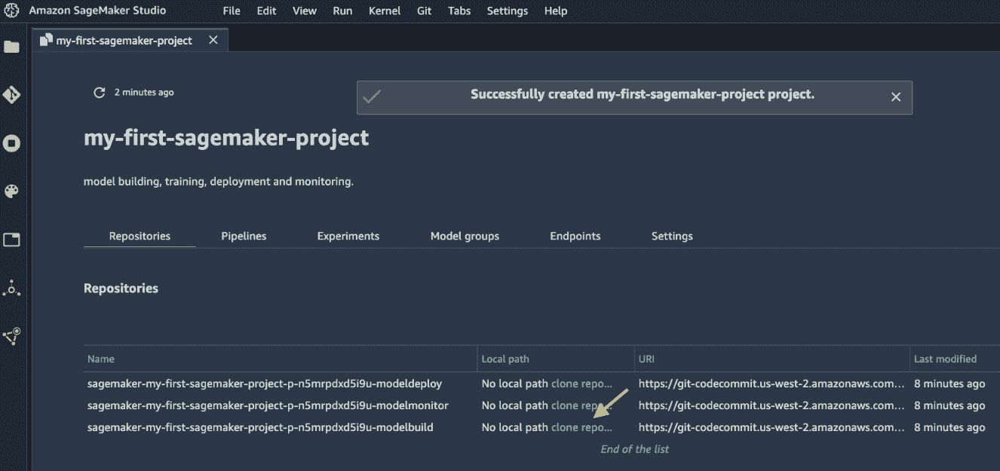

图 11.6 – SageMaker 项目详情门户

此门户包含与项目相关联的所有重要资源和信息——CodeCommit 中的代码仓库、SageMaker Pipelines 中的 ML 管道（我们很快会讨论到），使用 SageMaker Experiments 跟踪的实验、模型、托管端点和其他设置。

1.  我们可以从 CodeCommit 克隆仓库到本地 SageMaker Studio 目录。在我们开始描述 ML 管道之前，作为最后一步，让我们克隆`<项目名称前缀>-modelbuild`仓库，该仓库包含使用鲍鱼数据集构建、训练和评估 ML 模型的 ML 管道。点击如图 11.6 中用箭头突出显示的`<项目名称前缀>-modelbuild`仓库。

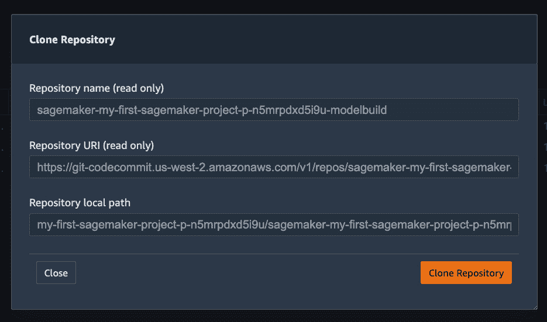

图 11.7 – 从 CodeCommit 克隆仓库到本地 SageMaker Studio 目录

1.  在如图 11.7 所示的弹出窗口中，点击`~/<项目名称前缀>/<项目名称前缀>-modelbuild/`。

在我们深入 CI/CD 部分之前，让我们首先看看这个鲍鱼示例中定义的 ML 管道。

# 使用 SageMaker Pipelines 编排 ML 管道

我们使用的模板包含一个机器学习生命周期管道，该管道执行数据预处理、数据质量检查、模型训练、模型评估步骤，最终进行模型注册。该管道是 MLOps 流程中的核心部分，其中正在创建模型。该管道使用 SageMaker Pipelines 定义在`<project-name-prefix>-modelbuild`中。**SageMaker Pipelines**是 SageMaker 中机器学习工作流程的编排工具。SageMaker Pipelines 与 SageMaker Processing、训练、实验、托管和模型注册集成。它提供了可重复性、可重复性和审计的可追溯性。最重要的是，您可以在 SageMaker Studio 中可视化工作流程图和实时运行状态。该管道可以在详情门户的**管道**选项卡下找到，如图 11.8 所示。

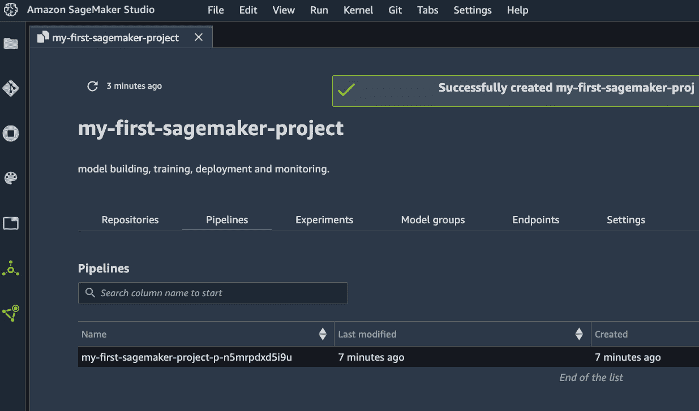

图 11.8 – 项目中的管道列表

注意

在本章中，我多次使用了**管道**这个术语。让我们一次性解决这个问题。我指的是图 11.8 和图 11.9 中显示的 SageMaker Pipelines 的管道，即**ML 管道**。请勿将 ML 管道与 AWS CodePipeline 的 CI/CD 管道混淆，后者在上一个部分中简要提及，将在*在 SageMaker Studio 中运行 CI/CD*部分中进一步讨论。

双击管道后，我们可以看到完整的执行图和管道的实时状态，如图 11.9 所示。相应的管道代码位于`~/<project-name-prefix>/<project-name-prefix>-modelbuild/pipelines/abalone/pipeline.py`。

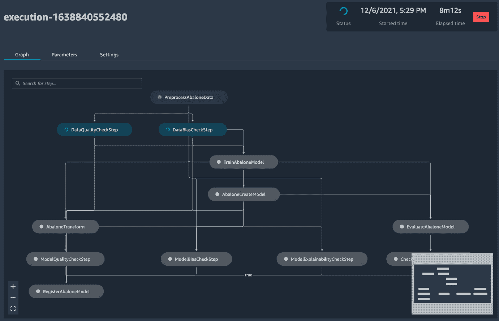

图 11.9 – 管道工作流程和实时状态

让我们遍历管道以及它在代码中的设置。管道包含以下步骤（从图中自上而下）：

1.  首先，使用 SageMaker Processing（`pipeline.py`文件，我们在`sagemaker.workflow`模块中使用类和函数，以及其他`sagemaker`类，定义了一个 scikit-learn 处理器来运行同一目录下的`preprocess.py`脚本。此外，`ProcessingStep`是`sagemaker.workflow.steps`模块中的一个类：

    ```py
    # Line 209 in pipeline.py
    step_process = ProcessingStep(
        name="PreprocessAbaloneData",
        processor=sklearn_processor,
        outputs=[
            ProcessingOutput(output_name="train", source="/opt/ml/processing/train"),
            ProcessingOutput(output_name="validation", source="/opt/ml/processing/validation"),
            ProcessingOutput(output_name="test", source="/opt/ml/processing/test"),
        ],
        code=os.path.join(BASE_DIR, "preprocess.py"),
        job_arguments=["--input-data", input_data],
    )
    ```

1.  数据预处理完成后，管道将检查之前注册的数据质量偏差指标，并/或使用 SageMaker Clarify 计算数据质量和偏差。在这里，前一步骤`step_process.properties.ProcessingOutputConfig.Outputs["train"]`的输出被用作输入基线数据。在这里实例化了一个`QualityCheckStep()`步骤对象。此步骤从基线训练数据中计算数据质量统计信息，并在模型创建结束时将统计信息注册到模型注册表中：

    ```py
    # Line 238
    data_quality_check_config = DataQualityCheckConfig(
    baseline_dataset=step_process.properties.ProcessingOutputConfig.Outputs["train"].S3Output.S3Uri,
        dataset_format=DatasetFormat.csv(header=False, output_columns_position="START"),
        output_s3_uri=Join(on='/', values=['s3:/', default_bucket, base_job_prefix, ExecutionVariables.PIPELINE_EXECUTION_ID, 'dataqualitycheckstep'])
    )
    data_quality_check_step = QualityCheckStep(
        name="DataQualityCheckStep",
        skip_check=skip_check_data_quality,
        register_new_baseline=register_new_baseline_data_quality,
        quality_check_config=data_quality_check_config,
        check_job_config=check_job_config,
    supplied_baseline_statistics=supplied_baseline_statistics_data_quality,
    supplied_baseline_constraints=supplied_baseline_constraints_data_quality,
        model_package_group_name=model_package_group_name
    )
    ```

1.  同时，该管道还使用从`ClarifyCheckStep()`类实例化的步骤来计算数据偏差：

    ```py
    data_bias_check_config = DataBiasCheckConfig(
        data_config=data_bias_data_config,
        data_bias_config=data_bias_config,
    )
    data_bias_check_step = ClarifyCheckStep(
        name="DataBiasCheckStep",
        clarify_check_config=data_bias_check_config,
        check_job_config=check_job_config,
        skip_check=skip_check_data_bias,
        register_new_baseline=register_new_baseline_data_bias,
        model_package_group_name=model_package_group_name
    )
    ```

这两个检查步骤基于 `skip_check` 参数是条件性的。`skip_check_data_quality` 和 `skip_check_data_bias` 是管道输入参数，并且可以为每次运行进行配置。对于第一次运行，你可能可以跳过检查，因为没有基线统计数据可供比较。`register_new_baseline` 也是从管道输入参数中条件性的，但大多数情况下，当你有一个新的数据集时，你会注册新的基线统计数据，除非你有不更新统计数据的特定原因。

1.  在数据质量和偏差检查之后，从 SageMaker 估算器创建一个训练作业。在这个例子中，使用了内置的 XGBoost 算法。`TrainingStep` 依赖于 `DataQualityCheckStep` 和 `DataBiasCheckStep`，这意味着训练步骤在开始之前等待两个检查步骤完成，并从预处理步骤的输出 `step_process` 中获取：

    ```py
    # Line 326
    step_train = TrainingStep(
        name="TrainAbaloneModel",
        depends_on=["DataQualityCheckStep", "DataBiasCheckStep"],
        estimator=xgb_train,
        inputs={
            "train": TrainingInput(
    s3_data=step_process.properties.ProcessingOutputConfig.Outputs["train"].S3Output.S3Uri,
                content_type="text/csv",
            ),
            "validation": TrainingInput(
    s3_data=step_process.properties.ProcessingOutputConfig.Outputs["validation"].S3Output.S3Uri,
                content_type="text/csv",
            ),
        },
    )
    ```

1.  接下来是使用 `CreateModelStep()` 从训练作业创建 SageMaker 模型。`CreateModelInput()` 接收用于托管目的的实例类型：

    ```py
    # Line 346
    model = Model(
        image_uri=image_uri,
    model_data=step_train.properties.ModelArtifacts.S3ModelArtifacts,
        sagemaker_session=sagemaker_session,
        role=role,
    )
    inputs = CreateModelInput(
        instance_type="ml.m5.large",
        accelerator_type="ml.eia1.medium",
    )
    step_create_model = CreateModelStep(
        name="AbaloneCreateModel",
        model=model,
        inputs=inputs,
    )
    ```

1.  一旦创建了 SageMaker 模型，就会执行两个模型评估分支。一个是使用 SageMaker 批量转换 `Transformer` 在保留的测试集上进行的评估：

    ```py
    # Line 364
    transformer = Transformer(
        model_name=step_create_model.properties.ModelName,
        instance_type="ml.m5.xlarge",
        instance_count=1,
        accept="text/csv",
        assemble_with="Line",
        output_path=f"s3://{default_bucket}/AbaloneTransform",
    )
    step_transform = TransformStep(
        name="AbaloneTransform",
        transformer=transformer,
        inputs=TransformInput(       data=step_process.properties.ProcessingOutputConfig.Outputs["test"].S3Output.S3Uri,
        ...)
    )
    ```

    注意

    在这里文本中省略的 `TransformInput()` 类的附加参数，但在 `pipeline.py` 中可用，是为了配置批量转换的输入/输出，并将输出结果与输入记录关联。更多信息，请参阅 [`docs.aws.amazon.com/sagemaker/latest/dg/batch-transform-data-processing.html`](https://docs.aws.amazon.com/sagemaker/latest/dg/batch-transform-data-processing.html)。

批量转换的输出，即预测，然后用于计算模型质量指标，如平均绝对误差、均方根误差和 r 平方值：

```py
model_quality_check_config = ModelQualityCheckConfig(
    baseline_dataset=step_transform.properties.TransformOutput.S3OutputPath,
    dataset_format=DatasetFormat.csv(header=False),
    output_s3_uri=Join(on='/', values=['s3:/', default_bucket, base_job_prefix, ExecutionVariables.PIPELINE_EXECUTION_ID, 'modelqualitycheckstep']),
    problem_type='Regression',
    inference_attribute='_c0',
    ground_truth_attribute='_c1'
)
model_quality_check_step = QualityCheckStep(
    name="ModelQualityCheckStep",
    skip_check=skip_check_model_quality,
    register_new_baseline=register_new_baseline_model_quality,
    quality_check_config=model_quality_check_config,
    check_job_config=check_job_config,
supplied_baseline_statistics=supplied_baseline_statistics_model_quality,
supplied_baseline_constraints=supplied_baseline_constraints_model_quality,
    model_package_group_name=model_package_group_name
)
```

1.  另一个评估路线 `EvaluateAbaloneModel` 和 `CheckMSEAbaloneEvalution` 的目的是评估测试数据集，并将性能指标作为 ML 管道中的条件，只有当均方误差小于或等于 `6.0` 时才继续注册模型到模型注册表中：

    ```py
    # Line 650
    cond_lte = ConditionLessThanOrEqualTo(
        left=JsonGet(
            step=step_eval,
            property_file=evaluation_report,
            json_path="regression_metrics.mse.value"
        ),
        right=6.0,
    )
    step_cond = ConditionStep(
        name="CheckMSEAbaloneEvaluation",
        conditions=[cond_lte],
        if_steps=[step_register],
        else_steps=[],
    )
    ```

1.  在 `ModelBiasCheckStep` 和 `ModelExplainabilityCheckStep` 中也对模型应用了其他检查。它们都使用 SageMaker Clarify 来计算模型偏差和模型可解释性：

    ```py
    # Line 450
    model_bias_check_step = ClarifyCheckStep(
        name="ModelBiasCheckStep",
        clarify_check_config=model_bias_check_config,
        check_job_config=check_job_config,
        skip_check=skip_check_model_bias,
        register_new_baseline=register_new_baseline_model_bias,
    supplied_baseline_constraints=supplied_baseline_constraints_model_bias,
        model_package_group_name=model_package_group_name
    ) 
    # Line 494
    model_explainability_check_step = ClarifyCheckStep(
        name="ModelExplainabilityCheckStep",
        clarify_check_config=model_explainability_check_config,
        check_job_config=check_job_config,
        skip_check=skip_check_model_explainability,
    register_new_baseline=register_new_baseline_model_explainability,
    supplied_baseline_constraints=supplied_baseline_constraints_model_explainability,
        model_package_group_name=model_package_group_name
    )
    ```

1.  在确认模型性能的检查之后，模型连同评估指标一起注册到 SageMaker 模型注册表中，这些指标存储在 `model_metrics` 变量中，并在过程中捕获，包括测试数据上的性能指标、数据偏差和模型偏差：

    ```py
    # Line 635
    step_register = RegisterModel(
        name="RegisterAbaloneModel",
        estimator=xgb_train,
    model_data=step_train.properties.ModelArtifacts.S3ModelArtifacts,
        content_types=["text/csv"],
        response_types=["text/csv"],
        inference_instances=["ml.t2.medium", "ml.m5.large"],
        transform_instances=["ml.m5.large"],
        model_package_group_name=model_package_group_name,
        approval_status=model_approval_status,
        model_metrics=model_metrics,
        drift_check_baselines=drift_check_baselines
    )
    ```

1.  定义步骤后，它们被放入 `Pipeline` 对象的 `steps` 参数中。暴露给用户的参数放在 `parameters` 参数中：

    ```py
    # Line 666
    pipeline = Pipeline(
        name=pipeline_name,
        parameters=[
            processing_instance_type,
            processing_instance_count,
            ...],
        steps=[step_process, data_quality_check_step, data_bias_check_step, step_train, step_create_model, step_transform, model_quality_check_step, model_bias_check_step, model_explainability_check_step, step_eval, step_cond],
        sagemaker_session=sagemaker_session,
    )
    ```

您可能会想知道 SageMaker 如何确定步骤的顺序。SageMaker 根据数据依赖关系和任何显式或自定义依赖关系来确定顺序。我们将步骤放入 `steps` 参数的列表中，SageMaker 会处理其余部分。

注意

项目创建后，三个 CodePipeline 管道将自动运行。只有第一个管道 `<project-name-prefix>-modelbuild` 将正确执行。其他两个管道 `<project-name-prefix>-modeldeploy` 和 `<project-name-prefix>-modelmonitor` 依赖于第一个管道的输出，因此它们在第一次运行中将会失败。现在不用担心失败状态。

1.  最后，成功执行的管道将在 SageMaker 模型注册表中创建和注册一个模型。您可以在左侧侧边栏中看到该模型，如图 *图 11.10* 所示。我们将在后面的章节中了解更多关于模型注册表的信息。

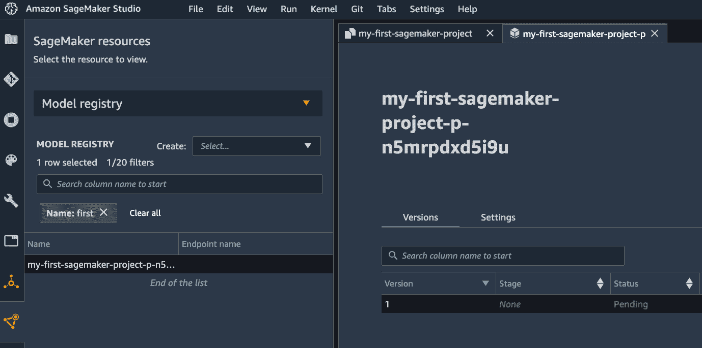

图 11.10 – 在 SageMaker 模型注册表中生成的模型

运行管道有多种方式。一种是通过 CI/CD 流程，这是从模板部署后管道最初运行的方式。我们将在下一节 *在 SageMaker Studio 中运行 CI/CD* 中更多地讨论 CI/CD 流程。以下是如何手动触发管道的示例：

1.  您可以从 SageMaker Studio UI 中点击 **启动执行**，如图 *图 11.11* 所示。

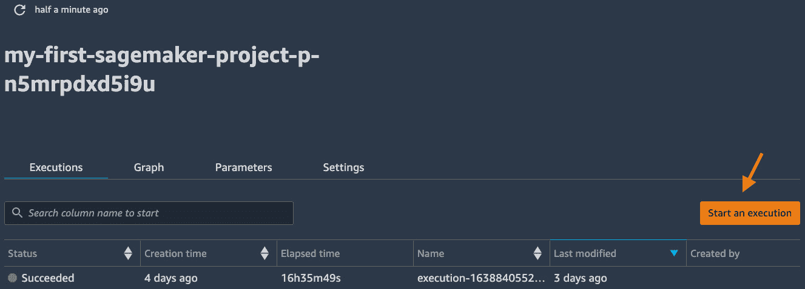

图 11.11 – 在管道列表中启动管道执行

1.  您可以指定用户输入，例如实例类型、训练数据位置和其他检查条件，如图 *图 11.12* 所示。点击 **启动** 以单独为新的数据集启动工作流程。

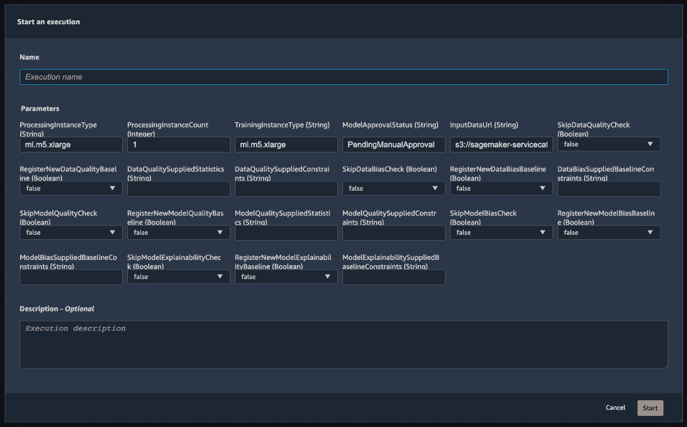

图 11.12 – 使用用户输入启动管道执行

1.  您还可以使用 SageMaker Python SDK 运行管道。模板化的代码存储库 `~/<project-name-prefix>/<project-name-prefix>-modelbuild/` 中有一个示例笔记本 `sagemaker-pipelines-project.ipynb`，它更详细地解释了代码结构，并展示了如何程序化运行管道。您可以根据 *图 11.13* 中的说明打开笔记本，并作为替代方案运行它。

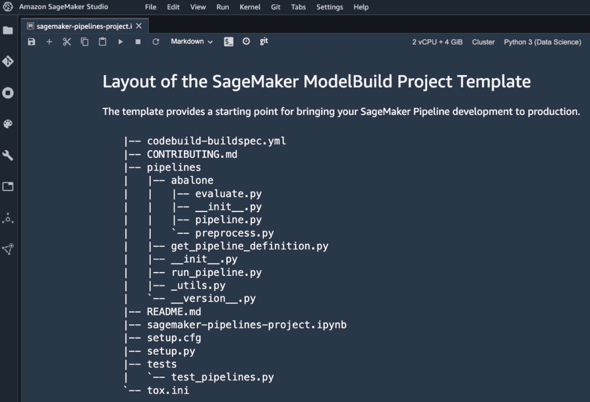

图 11.13 – 显示存储库中代码结构等详细信息的 sagemaker-pipelines-project.ipynb 笔记本截图，并程序化运行管道

使用 SageMaker 管道，我们可以编排使用 SageMaker 托管功能运行的机器学习（ML）生命周期中的步骤。在下一节中，我们将看到模板创建的 CI/CD 系统是如何使用 SageMaker 管道进行 MLOps 的。

# 在 SageMaker Studio 中运行 CI/CD

我们之前看到的机器学习（ML）管道只是我们 CI/CD 系统中正在运行的一部分。机器学习（ML）管道是由 AWS CodePipeline 中的 CI/CD 管道触发的。让我们深入了解 SageMaker 项目模板为我们设置的三个 CI/CD 管道。

有三个 CodePipeline 管道：

+   `<project-name-prefix>-modelbuild`：这个管道的目的是运行机器学习（ML）管道并在 SageMaker 模型注册表中创建一个机器学习模型。当仓库中提交触发时，这个 CI/CD 管道将机器学习（ML）管道作为构建步骤运行。SageMaker 模型注册表中的机器学习（ML）模型需要获得批准才能触发下一个管道`modeldeploy`。

+   `<project-name-prefix>-modeldeploy`：这个管道的目的是将 SageMaker 模型注册表中最新的批准的机器学习（ML）模型部署为一个 SageMaker 端点。构建过程首先部署一个预发布端点，并在将模型部署到生产之前请求手动批准。这确保了在部署到生产之前模型和端点配置是正常工作的。一旦预发布端点部署并处于`InService`状态，它将触发下一个管道`modelmonitor`。

+   `<project-name-prefix>-modelmonitor`：这个管道的目的是将 SageMaker 模型监控器部署到`modeldeploy`管道中创建的两个 SageMaker 端点。每当预发布端点上线时，这个管道都会触发，并在将模型监控器部署到生产端点之前对预发布端点的模型监控部署进行手动批准。

回到我们之前提到的机器学习（ML）管道执行过程，这是`modelbuild`构建过程的一部分，我们已经创建并注册了一个模型到**模型注册表**中。这是 CI/CD 系统的第一个检查点：*手动验证模型性能指标*。为了继续进行，我们需要像*图 11.10*所示的那样访问模型注册表来审查结果。

1.  从*图 11.10*的视图中，双击模型版本条目在模型注册表中查看关于这个模型版本的更多详细信息，如图*图 11.14*所示。

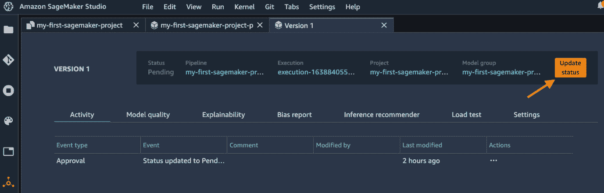

图 11.14 – 模型版本详情页

1.  我们可以在**模型质量**标签页中查看模型性能，在**可解释性**标签页中查看模型可解释性，以及在**偏差报告**标签页中查看数据偏差。这些都是帮助我们决定这个模型是否可接受的相关信息。

1.  点击右上角的 **更新状态** 按钮在审查后批准或拒绝此模型。为了演示目的，我们批准模型以继续 MLOps 系统，如图 *图 11.15* 所示。如果我们拒绝模型，从这一点开始将不会发生任何事情。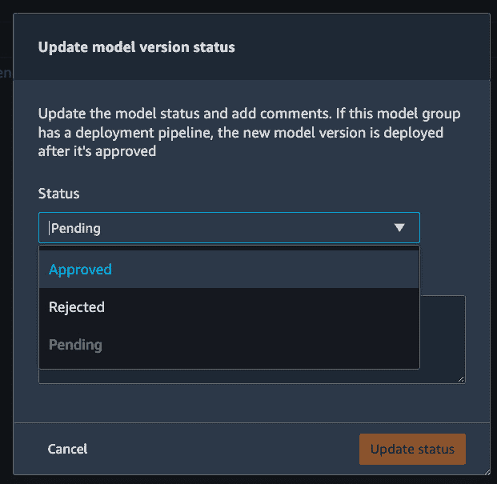

图 11.15 – 批准或拒绝模型版本。你还可以在框中添加注释

1.  模型批准会自动触发 `modeldeploy` 管道的执行。如果你进入 CodePipeline 控制台，你可以看到它处于 **进行中** 状态，如图 *图 11.16* 所示。


图 11.16 – 模型批准自动触发 modeldeploy 管道

1.  如前所述，`modeldeploy` 管道首先部署一个用于审查的预发布 SageMaker 端点。一旦端点创建完成（5-7 分钟），你可以在模型版本页面上看到一个新事件，如图 *图 11.17* 所示。点击 **Endpoint: <project-name-prefix>-staging** 以获取有关端点的更多信息。你可以测试端点。


图 11.17 – 显示预发布端点部署最新事件的模型版本

1.  确认端点状态后，我们可以在 CodePipeline 控制台中批准预发布端点部署。点击 *图 11.16* 中的管道名称。我们可以看到管道当前进度在 **DeployStaging** 阶段处于待定状态，如图 *图 11.18* 所示。在 **ApproveDeployment** 步骤中点击 **Review** 按钮以批准/拒绝部署。

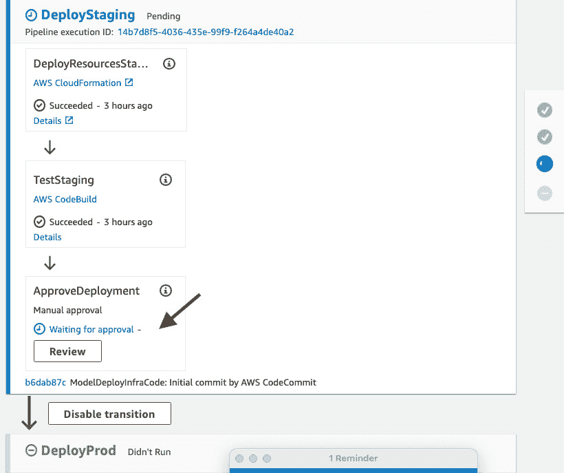

图 11.18 – modeldeploy 管道需要手动批准

1.  在弹出窗口中批准或拒绝部署，并添加任何注释，如图 *图 11.19* 所示。由于端点是实时且正在工作的，让我们批准预发布部署。

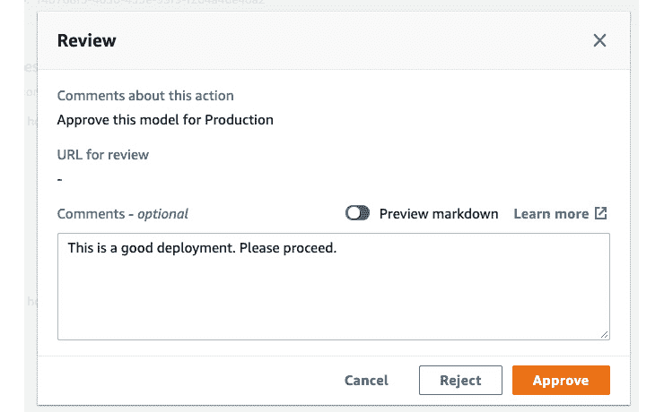

图 11.19 – 批准/拒绝预发布部署

1.  `modeldeploy` 管道继续进入最终阶段，**DeployProd**，将模型部署到生产端点。一旦部署完成，管道状态更新为 **成功**。你可以在模型版本页面上看到一个新事件，如图 *图 11.20* 所示。同时注意 **最后阶段** 现在是 **prod**。

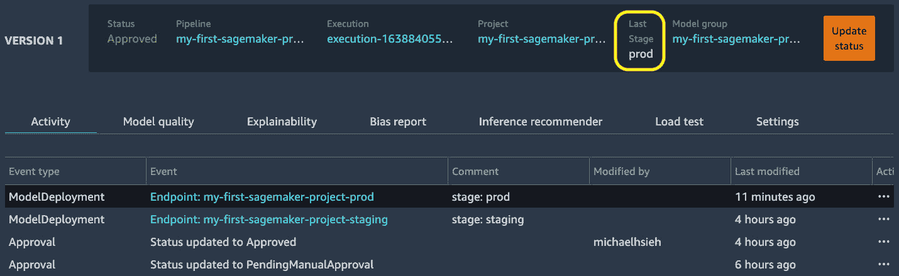

图 11.20 – 模型版本现在更新到 prod

1.  当我们批准预发布部署时，`modelmonitor` 管道被触发以将 SageMaker Model Monitor 部署到预发布端点。我们可以在 CodePipeline 控制台中看到 `modelmonitor` 管道处于 **进行中** 状态，如图 *图 11.21* 所示。

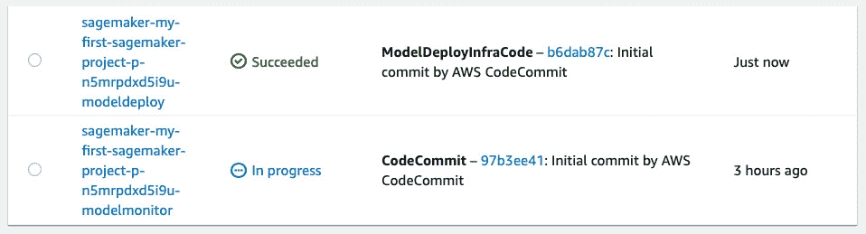

图 11.21 – 阶段端点部署触发模型监控器管道

1.  `modelmonitor`管道在 DeployStaging 阶段也需要手动批准。我们应该检查端点以查看是否启用了模型监控器。如图*图 11.22*所示，我们可以在**数据质量**选项卡中看到模型监控器确实已启用并已安排。我们尚未为端点设置实时流量，监控计划将在每小时开始时启动，因此让我们在 CodePipeline 控制台中继续并批准 DeployStaging，类似于*步骤 6*和*步骤 7*。

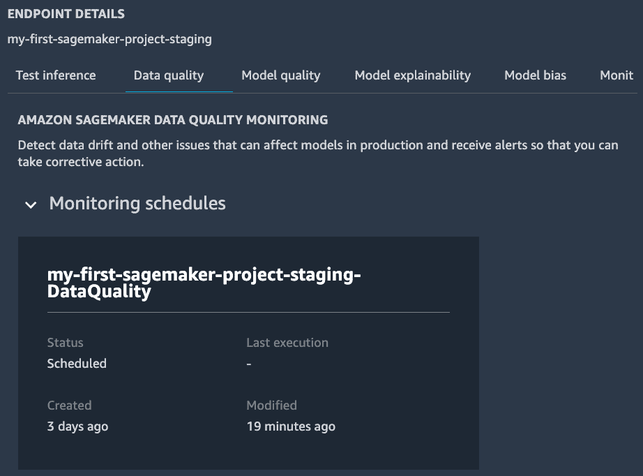

图 11.22 – 检查模型监控器阶段端点的计划

1.  最后，DeployProd 阶段还将 SageMaker Model Monitor 部署到生产端点。这标志着完整的 MLOps 和 CI/CD 系统的结束。

CodePipeline 中的三个 CI/CD 管道构成了一个通用的 MLOps 系统，该系统可以响应对`modelbuild`仓库的任何代码更改以及任何手动 ML 管道运行，实现 ML 模型的持续集成和持续交付。您不必担心复杂的实现，因为这些步骤都是自动进行的，多亏了 SageMaker 项目模板。

SageMaker Projects 通过模板化的代码和仓库，使您能够轻松地将强大的 MLOps 系统带入自己的 ML 用例。您不必构建复杂的系统。您只需选择 SageMaker 项目提供的适合您用例的模板，并遵循 CodeCommit 中仓库中的 README 文件来自定义配置和代码以适应您的用例。例如，我们可以更新`pipeline.py`中的模型训练以使用不同的超参数集，如下面的代码块所示，并将更改提交到`modelbuild`仓库：

```py
# Line 315 in pipeline.py
xgb_train.set_hyperparameters(
    objective="reg:linear",
    num_round=70, # was 50
    max_depth=7, # was 7
    eta=0.2,
    gamma=4,
    min_child_weight=6,
    subsample=0.7,
    silent=0)
```

您可以从`modelbuild`管道中看到最新的提交消息，从而看到一个新的执行情况，如图*图 11.23*所示。

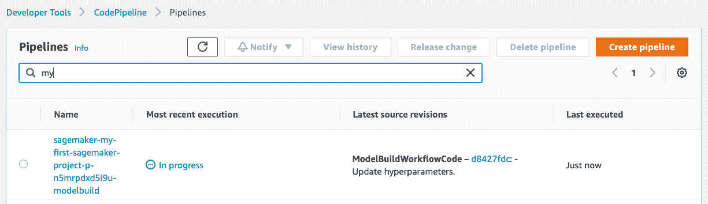

图 11.23 – 通过对仓库的提交触发新的模型构建执行

CI/CD 管道将再次按照本章所述运行，以便在更新核心训练算法版本后自动交付新的模型/端点（除了手动批准步骤）。您可以将此应用于 ML 管道的任何更改、`modelbuild`管道中的配置或其他两个 CI/CD 管道中的配置。

# 摘要

在本章中，我们描述了 MLOps 是什么以及它在 ML 生命周期中扮演的角色。我们讨论了 MLOps 带来的好处。我们展示了如何通过 SageMaker Studio IDE 中的 SageMaker 项目轻松启动一个复杂的 MLOps 系统。我们从 SageMaker 项目中部署了一个模型构建/部署/监控模板，并体验了“一切皆代码”的真正含义。

我们对 CI/CD 流程进行了全面运行，以了解这个 MLOps 系统中的工作原理。我们详细学习了如何使用 SageMaker Pipelines 和其他 SageMaker 管理功能实现 ML 流程。我们还学习了 SageMaker 模型注册如何用于版本控制 ML 模型。

此外，我们还展示了如何监控 CI/CD 流程并在 CodePipeline 中批准部署，这为你提供了对模型和部署质量的严格控制。有了 MLOps 系统，你可以享受到我们讨论的好处：更快的上市时间、生产力、可重复性、可靠性、可审计性和高质量的模型。

这个例子也完美地总结了我们在整本书中学到的关于 Amazon SageMaker Studio 的内容。Amazon SageMaker Studio 是一个专门为机器学习（ML）构建的集成开发环境（IDE），它通过丰富的用户界面，使得使用端到端 ML 生命周期构建 ML 模型变得简单易行。在这本书的 11 章节中，代码示例和实际的 ML 应用案例中，你学习了如何使用 SageMaker Studio 以及许多 SageMaker 功能来准备数据、构建、训练、部署 ML 模型，以及运行一个适用于生产级 ML 项目的 MLOps 系统。现在，你可以在 Amazon SageMaker Studio 中开始构建自己的 ML 项目了。
