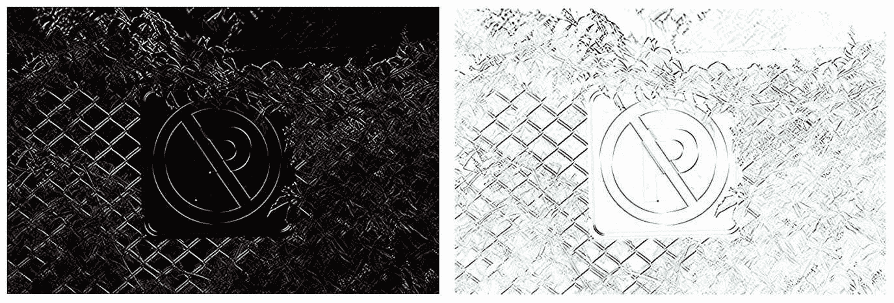

# 第四章：绘图、过滤和变换

我们在前一章中从计算机视觉的基本和基本概念开始，最终学习了用于在矩阵和图像上执行广泛操作的许多算法和函数。首先，我们学习了嵌入到`Mat`类中以方便使用的各种函数，例如克隆（或获取完整且独立的副本）一个矩阵，计算两个矩阵的叉积和点积，获取矩阵的转置或逆，以及生成单位矩阵。然后我们转向学习 OpenCV 中的各种逐元素操作。正如我们所知，逐元素操作是可并行化的算法，它们对图像的所有单个像素（或元素）执行相同的过程。在这个过程中，我们还实验了这些操作对实际图像文件的影响。我们通过学习将图像视为整体的操作和函数来完成前一章，这些操作与逐元素操作不同，但在计算机视觉中它们仍然被视为矩阵操作。

现在，我们已经准备好深入挖掘，学习在计算机视觉应用中用于绘图、过滤和图像变换等任务的众多强大算法。正如前几章所述，这些算法类别整体上被认为是图像处理算法。在本章中，我们将从学习如何在空图像（类似于画布）或现有图像和视频帧上绘制形状和文本开始。本章第一部分中的示例还将包括一个关于如何向 OpenCV 窗口添加滑块条的教程，以便轻松调整所需参数。之后，我们将继续学习图像过滤技术，例如模糊图像、膨胀和腐蚀。本章我们将学习到的过滤算法和函数包括许多流行且广泛使用的算法，尤其是被专业照片编辑应用所采用。本章将包括一个关于图像变换算法的全面部分，包括如简单调整照片大小或复杂如像素重新映射的算法。我们将通过学习如何将色图应用于图像以变换其颜色来结束本章。

在本章中，我们将学习以下内容：

+   在图像上绘制形状和文本

+   将平滑滤波器应用于图像

+   将膨胀、腐蚀以及其他各种过滤器应用于图像

+   在图像上重新映射像素并执行几何变换算法

+   将色图应用于图像

# 技术要求

+   用于开发 C++或 Python 应用程序的 IDE

+   OpenCV 库

有关如何设置个人计算机并使其准备好使用 OpenCV 库开发计算机视觉应用程序的更多信息，请参阅第二章，*开始使用 OpenCV*。

你可以使用以下网址下载本章的源代码和示例：

[`github.com/PacktPublishing/Hands-On-Algorithms-for-Computer-Vision/tree/master/Chapter04`](https://github.com/PacktPublishing/Hands-On-Algorithms-for-Computer-Vision/tree/master/Chapter04)

# 利用图像

毫无疑问，在开发计算机视觉应用时，最重要的任务之一就是在图像上绘制。想象一下，你想要在图片上打印时间戳，或者在图像的某些区域绘制矩形或椭圆，以及许多需要你在图像或形状（如矩形）上绘制文本和数字的类似例子。正如你所看到的，可以指出的例子非常明显且数量众多，因此，我们不妨直接从 OpenCV 中用于绘制的函数和算法开始。

# 在图像上打印文本

OpenCV 包含一个名为 `putText` 的非常易于使用的函数，用于在图像上绘制或打印文本。此函数需要一个图像作为输入/输出参数，这意味着源图像本身将被更新。因此，在调用此函数之前，务必在内存中制作原始图像的副本。你还需要为此函数提供一个起点，这仅仅是文本将被打印的点。文本的字体必须是 `HersheyFonts` 枚举中的一个条目，它可以取以下值之一（或它们的组合）：

+   `FONT_HERSHEY_SIMPLEX`

+   `FONT_HERSHEY_PLAIN`

+   `FONT_HERSHEY_DUPLEX`

+   `FONT_HERSHEY_COMPLEX`

+   `FONT_HERSHEY_TRIPLEX`

+   `FONT_HERSHEY_COMPLEX_SMALL`

+   `FONT_HERSHEY_SCRIPT_SIMPLEX`

+   `FONT_HERSHEY_SCRIPT_COMPLEX`

+   `FONT_ITALIC`

关于每个条目打印时的详细情况，你可以查看 OpenCV 或简单地在网上搜索有关 Hershey 字体的更多信息。

除了我们刚才提到的参数之外，你还需要一些额外的参数，例如文本的缩放、颜色、粗细和线型。让我们用一个简单的例子来逐一解释它们。

下面是一个演示 `putText` 函数用法的示例代码：

```py
string text = "www.amin-ahmadi.com"; 
int offset = 25; 
Point origin(offset, image.rows - offset); 
HersheyFonts fontFace = FONT_HERSHEY_COMPLEX; 
double fontScale = 1.5; 
Scalar color(0, 242, 255); 
int thickness = 2; 
LineTypes lineType = LINE_AA; 
bool bottomLeftOrigin = false; 

putText(image, 
        text, 
        origin, 
        fontFace, 
        fontScale, 
        color, 
        thickness, 
        lineType, 
        bottomLeftOrigin); 
```

当在上一章的示例图片上执行时，将创建以下结果：


显然，增加或减少 `scale` 将导致文本大小的增加或减少。`thickness` 参数对应于打印文本的粗细，等等。唯一值得讨论的参数是 `lineType`，在我们的示例中它是 **LINE_AA**，但它可以取 `LineTypes` 枚举中的任何值。以下是重要的线型及其差异，通过在白色背景上打印 `W` 字符来演示：


**LINE_4** 表示四连接线型，**LINE_8** 表示八连接线型。然而，**LINE_AA**，即抗锯齿线型，比其他两种线型绘制速度慢，但如图所示，它也提供了更好的质量。

`LineTypes` 枚举还包括一个 `FILLED` 条目，它用于用给定的颜色填充图像上绘制的形状。需要注意的是，OpenCV 中几乎所有绘图函数（不仅仅是 `putText`）都需要一个线型参数。

OpenCV 提供了两个与处理文本相关的函数，但不是用于绘制文本。第一个函数名为 `getFontScaleFromHeight`，它用于根据字体类型、高度（以像素为单位）和粗细获取所需的缩放值。以下是一个示例：

```py
double fontScale = getFontScaleFromHeight(fontFace, 
                           50, // pixels for height 
                           thickness); 
```

我们可以使用前面的代码代替在之前 `putText` 函数的示例使用中为 `scale` 提供一个常量值。显然，我们需要将 `50` 替换为我们文本所需的任何像素高度值。

除了 `getFontScaleFromHeight`，OpenCV 还包括一个名为 `getTextSize` 的函数，可以用来检索打印特定文本所需的宽度和高度。以下是一个示例代码，展示了我们如何使用 `getTextSize` 函数找出打印 ``"Example"`` 单词所需的像素宽度和高度，使用 `FONT_HERSHEY_PLAIN` 字体类型，缩放为 `3.2`，粗细为 `2`：

```py
int baseLine; 
Size size = getTextSize("Example", 
                        FONT_HERSHEY_PLAIN, 
                        3.2, 
                        2, 
                        &baseLine); 

cout << "Size = " << size.width << " , " << size.height << endl; 
cout << "Baseline = " << baseLine << endl; 
```

结果应该看起来像以下这样：

```py
Size = 216 , 30 
Baseline = 17 
```

这意味着文本需要 `216` by `30` 像素的空间来打印，基线将比文本底部远 `17` 像素。

# 绘制形状

您可以使用一组非常简单的 OpenCV 函数在图像上绘制各种类型的形状。这些函数都包含在 `imgproc` 模块中，就像 `putText` 函数一样，并且可以用来在给定点绘制标记、线条、箭头线条、矩形、椭圆、圆、多边形等。

让我们从 `drawMarker` 函数开始，该函数用于在图像上绘制给定类型的标记。以下是该函数如何用于在给定图像的中心打印标记的示例：

```py
Point position(image.cols/2, 
               image.rows/2); 
Scalar color = Scalar::all(0); 
MarkerTypes markerType = MARKER_CROSS; 
int markerSize = 25; 
int thickness = 2; 
int lineType = LINE_AA; 
drawMarker(image, 
           position, 
           color, 
           markerType, 
           markerSize, 
           thickness, 
           lineType); 
```

`position` 是标记的中心点，其余的参数几乎与我们之前在 `putText` 函数中看到的是一样的。这是 OpenCV 中大多数（如果不是所有）绘图函数的参数模式。唯一特定于 `drawMarker` 函数的参数是 `markerSize`，它只是标记的大小，以及 `markerType`，它可以取 `MarkerTypes` 枚举中的以下值之一：

+   `MARKER_CROSS`

+   `MARKER_TILTED_CROSS`

+   `MARKER_STAR`

+   `MARKER_DIAMOND`

+   `MARKER_SQUARE`

+   `MARKER_TRIANGLE_UP`

+   `MARKER_TRIANGLE_DOWN`

以下图表展示了之前列表中提到的所有可能的标记类型，当它们打印在白色背景上时，从左到右排列：


在 OpenCV 中使用 `line` 函数可以绘制线条。此函数需要两个点，并将绘制连接给定点的线条。以下是一个示例：

```py
Point pt1(25, image.rows/2); 
Point pt2(image.cols/2 - 25, image.rows/2); 
Scalar color = Scalar(0,255,0); 
int thickness = 5; 
int lineType = LINE_AA; 
int shift = 0; 

line(image, 
     pt1, 
     pt2, 
     color, 
     thickness, 
     lineType, 
     shift); 
```

`shift`参数对应于给定点的分数位数。您可以省略或简单地传递零以确保它对您的结果没有影响。

与`line`函数类似，`arrowedLine`也可以用来绘制带箭头的线。显然，给定点的顺序决定了箭头的方向。这个函数唯一需要的参数是`tipLength`参数，它对应于用于创建箭头尖端的线长百分比。以下是一个示例：

```py
double tipLength = 0.2; 

arrowedLine(image, 
            pt1, 
            pt2, 
            color, 
            thickness, 
            lineType, 
            shift, 
            tipLength); 
```

要在图像上绘制一个圆，我们可以使用`circle`函数。以下是这个函数如何用来在图像中心绘制一个圆的示例：

```py
Point center(image.cols/2, 
             image.rows/2); 
int radius = 200; 
circle(image, 
       center, 
       radius, 
       color, 
       thickness, 
       lineType, 
       shift); 
```

除了`center`和`radius`，它们显然是圆的中心点和半径之外，其余参数与我们在本节中学到的函数和示例相同。

使用`rectangle`函数可以在图像上绘制矩形或正方形。这个函数与`line`函数非常相似，因为它只需要两个点。不同之处在于，提供给`rectangle`函数的点对应于矩形或正方形的左上角和右下角点。以下是一个示例：

```py
rectangle(image, 
          pt1, 
          pt2, 
          color, 
          thickness, 
          lineType, 
          shift); 
```

除了两个单独的`Point`对象外，这个函数还可以提供一个单一的`Rect`对象。以下是这样做的方法：

```py
Rect rect(pt1,pt2); 
rectangle(image, 
          color, 
          thickness, 
          lineType, 
          shift); 
```

类似地，可以使用`ellipse`函数绘制椭圆。这个函数需要提供轴的大小以及椭圆的角度。此外，您可以使用起始和结束角度来绘制椭圆的全部或部分，或者，在其他情况下，绘制一个圆弧而不是椭圆。您可以猜测，将`0`和`360`作为起始和结束角度将导致绘制一个完整的椭圆。以下是一个示例：

```py
Size axes(200, 100); 
double angle = 20.0; 
double startAngle = 0.0; 
double endAngle = 360.0; 
ellipse(image, 
        center, 
        axes, 
        angle, 
        startAngle, 
        endAngle, 
        color, 
        thickness, 
        lineType, 
        shift);
```

另一种调用`ellipse`函数的方法是使用`RotatedRect`对象。在这个函数的版本中，您必须首先创建一个具有给定宽度和高度（或者说大小）以及一个`angle`的`RotatedRect`，然后像下面这样调用`ellipse`函数：

```py
Size size(150, 300); 
double angle = 45.0; 
RotatedRect rotRect(center, 
                    axes, 
                    angle); 
ellipse(image, 
        rotRect, 
        color, 
        thickness, 
        lineType); 
```

注意，使用这种方法，您不能绘制圆弧，这仅用于绘制完整的椭圆。

我们已经到了可以使用 OpenCV 绘图函数绘制的最后一种形状类型，那就是多边形形状。您可以通过使用`polylines`函数来绘制多边形形状。您必须确保创建一个点向量，它对应于绘制多边形所需的顶点。以下是一个示例：

```py
vector<Point> pts; 
pts.push_back(Point(100, 100)); 
pts.push_back(Point(50, 150)); 
pts.push_back(Point(50, 200)); 
pts.push_back(Point(150, 200)); 
pts.push_back(Point(150, 150)); 
bool isClosed = true; 
polylines(image, 
          pts, 
          isClosed, 
          color, 
          thickness, 
          lineType, 
          shift); 
```

`isClosed`参数用于确定多边形线是否必须闭合，即是否通过将最后一个顶点连接到第一个顶点。

以下图像展示了我们在前面的代码片段中使用的`arrowedLine`、`circle`、`rectangle`和`polylines`函数在绘制示例图像时的结果：


在继续下一节并学习用于图像过滤的算法之前，我们将学习如何通过在 OpenCV 显示窗口中添加滑块来在运行时调整参数。当你实验不同的值以查看它们的效果时，这是一个非常有用的方法，以便在运行时尝试大量不同的参数，并且它允许通过简单地调整滑块（或滑块）的位置来改变变量的值。

首先，让我们看一个例子，然后进一步分解代码，学习如何使用 OpenCV 函数处理滑块。以下完整的例子展示了我们如何使用滑块在运行时调整图像上绘制的圆的半径：

```py
string window = "Image"; // Title of the image output window
string trackbar = "Radius"; // Label of the trackbar
Mat image = imread("Test.png"); 
Point center(image.cols/2, image.rows/2); // A Point object that points to the center of the image
int radius = 25;
Scalar color = Scalar(0, 255, 0); // Green color in BGR (OpenCV default) color space
int thickness = 2; LineTypes lineType = LINE_AA; int shift = 0; 

// Actual callback function where drawing and displaying happens
void drawCircle(int, void*) 
{ 
    Mat temp = image.clone(); 

    circle(temp, 
           center, 
           radius, 
           color, 
           thickness, 
           lineType, 
           shift); 

    imshow(window, temp); 
} 

int main() 
{     
    namedWindow(window); // create a window titled "Image" (see above)

    createTrackbar(trackbar, // label of the trackbar
                   window, // label of the window of the trackbar
                   &radius, // the value that'll be changed by the trackbar
                   min(image.rows, image.cols) / 2, // maximum accepted value
                   drawCircle); 

    setTrackbarMin(trackbar, window, 25); // set min accespted value by trackbar
    setTrackbarMax(trackbar, window, min(image.rows, image.cols) / 2); // set max again

    drawCircle(0,0); // call the callback function and wait
    waitKey(); 

    return 0; 
} 
```

在前面的代码中，`window` 和 `trackbar` 是 `string` 对象，用于识别和访问特定窗口上的特定滑块。`image` 是包含源图像的 `Mat` 对象。`center`、`radius`、`color`、`thickness`、`lineType` 和 `shift` 是绘制圆所需的参数，正如我们在本章前面所学。`drawCircle` 是当使用滑块更新我们想要绘制的圆的 `radius` 值时将被调用的函数（确切地说，是回调函数）。这个函数必须具有示例中使用的签名，它有一个 `int` 和一个 `void` 指针作为其参数。这个函数相当简单；它只是克隆原始图像，在其上绘制一个圆，然后显示它。

`main` 函数是我们实际创建窗口和滑块的地方。首先，必须调用 `namedWindow` 函数来创建一个具有我们想要的窗口名称的窗口。然后，可以像示例中那样调用 `createTrackbar` 函数，在该窗口上创建一个滑块。请注意，滑块本身有一个名称，用于访问它。当应用程序运行时，这个名称也将打印在滑块旁边，以向用户显示其目的。调用 `setTrackbarMin` 和 `setTrackbarMax` 确保我们的滑块不允许 `radius` 值小于 25 或大于图像的宽度或高度（取较小者），然后除以 2（因为我们谈论的是半径，而不是直径）。

以下是一个截图，展示了我们的 `window` 以及其上的 `trackbar`，可以用来调整圆的 `radius`：


尝试调整以亲自看到圆的半径是如何根据滑块的位置变化的。确保在你想实验这本书中学到的函数或算法的参数时使用这种方法。请注意，你可以添加你需要的任意数量的滑块。然而，添加更多的滑块会在你的窗口上使用更多的空间，这可能会导致用户界面和体验不佳，从而使得程序难以使用，而不是简化，所以尽量明智地使用滑块。

# 图像过滤

无论你是在尝试构建一个执行高度复杂任务的计算机视觉应用程序，比如实时目标检测，还是简单地以某种方式修改输入图像，这真的并不重要。几乎不可避免的是，你将不得不应用某种类型的滤波器到你的输入或输出图像上。原因很简单——并不是所有的图片都准备好直接进行处理，大多数时候，应用滤波器使图像更平滑是确保它们可以被我们的算法处理的一种方式。

在计算机视觉中，你可以应用到图像上的滤波器种类繁多，但在这个章节中，我们将学习一些最重要的滤波器，特别是那些在 OpenCV 库中有实现，我们可以使用的滤波器。

# 模糊/平滑滤波器

模糊图像是图像滤波任务中最重要的一项，有许多算法可以执行这项任务，每个算法都有其自身的优缺点，我们将在本节中讨论这些内容。

让我们从用于平滑图像的最简单的滤波器开始，这个滤波器被称为中值滤波器，可以通过使用`medianBlur`函数来实现，如下面的示例所示：

```py
int ksize = 5; // must be odd 
medianBlur(image, result, ksize); 
```

此滤波器简单地找到图像中每个像素的邻近像素的中值。`ksize`，或核大小参数，决定了用于模糊的核的大小，换句话说，决定了在模糊算法中考虑邻近像素的距离。以下图像展示了从 1 到 7 增加核大小的结果：


注意，核大小必须是奇数，核大小为 1 将产生与输入图像完全相同的图像。因此，在之前的图像中，你可以看到从原始图像（最左侧）到核大小为 7 的模糊级别的增加。

注意，如果你需要，可以使用非常高的核大小，但这通常是不必要的，通常只有在需要去除极其嘈杂的图像的噪声时才需要。以下是一个核大小为 21 的示例图像，展示了其结果：


另一种模糊图像的方法是使用`boxFilter`函数。让我们通过一个示例代码来看看它是如何实现的，然后进一步分解以更好地理解其行为：

```py
int ddepth = -1; 
Size ksize(7,7); 
Point anchor(-1, -1); 
bool normalize = true; 
BorderTypes borderType = BORDER_DEFAULT; 

boxFilter(image, 
          result, 
          ddepth, 
          ksize, 
          anchor, 
          normalize, 
          borderType); 
```

箱形滤波器被称为一种模糊方法，其中使用给定 `ksize` 和 `anchor` 点的 1 的矩阵进行图像模糊。与 `medianBlur` 函数相比，主要区别在于您实际上可以定义 `anchor` 点为任何非中心点的任何邻域。您还可以定义在此函数中使用的边界类型，而在 `medianBlur` 函数中，内部使用 `BORDER_REPLICATE` 并不能更改。有关边界类型的更多信息，您可能需要参考第三章，*数组和矩阵操作*。最后，`normalize` 参数允许我们将结果归一化到可显示的结果。

可以使用 `ddepth` 参数来更改结果的深度。然而，您可以使用 -1 来确保结果具有与源相同的深度。同样，可以提供 -1 值给 `anchor` 以确保使用默认的锚点。

下面的图像展示了前面示例代码的结果。右侧图像是左侧图像经过箱形滤波后的结果：


我们可以通过使用 `blur` 函数执行完全相同的任务，换句话说，就是归一化箱形滤波器，如下面的示例代码所示：

```py
Size ksize(7,7); 
Point anchor(-1, -1); 
BorderTypes borderType = BORDER_DEFAULT; 

blur(image, 
     result, 
     ksize, 
     anchor, 
     borderType); 
```

此示例代码的结果与之前看到的调用 `boxFilter` 的结果完全相同。这里明显的区别是，此函数不允许我们更改结果的深度，并且默认应用归一化。

除了标准的箱形滤波器外，您还可以使用 `sqrBoxFilter` 函数应用平方箱形滤波器。在此方法中，不是计算邻近像素的总和，而是计算它们平方的总和。以下是一个示例，与调用 `boxFilter` 函数非常相似：

```py
int ddepth = -1; 
Size ksize(7,7); 
Point anchor(-1, -1); 
bool normalize = true; 
BorderTypes borderType = BORDER_DEFAULT; 

sqrBoxFilter(image, 
             result, 
             ddepth, 
             ksize, 
             anchor, 
             normalize, 
             borderType); 
```

`boxFilter` 和 `sqrBoxFilter` 函数的非归一化版本也可以用来获取图像中所有像素邻近区域的统计信息，它们的使用场景并不仅限于图像模糊。

计算机视觉中最受欢迎的模糊方法之一是 **高斯模糊** 算法，在 OpenCV 中可以通过使用 `GaussianBlur` 函数来实现。这个函数与之前我们了解过的模糊函数类似，需要指定核大小，以及 *X* 和 *Y* 方向上的标准差值，分别称为 `sigmaX` 和 `sigmaY`。以下是如何使用此函数的示例：

```py
Size ksize(7,7); 
double sigmaX = 1.25; 
double sigmaY = 0.0; 
BorderTypes borderType = BORDER_DEFAULT; 

GaussianBlur(image, 
             result, 
             ksize, 
             sigmaX, 
             sigmaY, 
             borderType); 
```

注意，`sigmaY` 的值为零意味着 `sigmaX` 的值也将用于 *Y* 方向。有关高斯模糊的更多信息，您可以阅读关于高斯函数的一般信息和 OpenCV 文档页面中的 `GaussianBlur` 函数。

在本节中我们将学习的最后一个平滑滤波器称为**双边滤波器**，可以通过使用`bilateralFilter`函数实现。双边滤波是一种强大的去噪和图像平滑方法，同时保留边缘。与之前看到的模糊算法相比，此函数也慢得多，CPU 密集度更高。让我们通过一个例子来看看如何使用`bilateralFilter`，然后分解所需的参数：

```py
int d = 9; 
double sigmaColor = 250.0; 
double sigmaSpace = 200.0; 
BorderTypes borderType = BORDER_DEFAULT; 

bilateralFilter(image, 
                result, 
                d, 
                sigmaColor, 
                sigmaSpace, 
                borderType); 
```

`d`，或过滤器大小，是参与过滤的像素邻域的直径。`sigmaColor`和`sigmaSpace`值都用于定义颜色效果并协调计算过滤值像素的颜色和坐标。以下是演示`bilateralFilter`函数在我们示例图像上执行效果的截图：


# 形态学滤波器

与平滑滤波器类似，形态学滤波器是改变每个像素值基于相邻像素值的算法，尽管明显的区别是它们没有模糊效果，并且主要用于在图像上产生某种形式的侵蚀或膨胀效果。这将在本节后面的几个动手示例中进一步阐明，但现在，让我们看看如何使用 OpenCV 函数执行形态学操作（也称为**变换**）。

您可以使用`morphologyEx`函数对图像执行形态学操作。此函数可以提供一个来自`MorphTypes`枚举的条目来指定形态学操作。以下是可用的值：

+   `MORPH_ERODE`：用于侵蚀操作

+   `MORPH_DILATE`：用于膨胀操作

+   `MORPH_OPEN`：用于开运算，或侵蚀图像的膨胀

+   `MORPH_CLOSE`：用于闭运算，或从膨胀图像中侵蚀

+   `MORPH_GRADIENT`：用于形态学梯度操作，或从膨胀图像中减去侵蚀图像

+   `MORPH_TOPHAT`：用于顶帽操作，或从源图像中减去开运算的结果

+   `MORPH_BLACKHAT`：用于黑帽操作，或从闭运算的结果中减去源图像

要理解前面列表中提到的所有可能的形态学操作，首先理解侵蚀和膨胀（列表中的前两项）的效果是很重要的，因为其余的只是这两种形态学操作的组合。让我们先通过一个例子来尝试侵蚀，同时学习如何使用`morphologyEx`函数：

```py
MorphTypes op = MORPH_ERODE; 
MorphShapes shape = MORPH_RECT; 
Size ksize(3,3); 
Point anchor(-1, -1); 
Mat kernel = getStructuringElement(shape, 
                                   ksize, 
                                   anchor); 
int iterations = 3; 
BorderTypes borderType = BORDER_CONSTANT; 
Scalar borderValue = morphologyDefaultBorderValue(); 
morphologyEx(image, 
             result, 
             op, 
             kernel, 
             anchor, 
             iterations, 
             borderType, 
             borderValue); 
```

`op`，或操作，是前面提到的`MorphTypes`枚举中的一个条目。`kernel`，或结构元素，是用于形态学操作的核矩阵，它可以是手动创建的，也可以通过使用`getStructuringElement`函数创建。你必须为`getStructuringElement`提供`shape`形态、核大小（`ksize`）和`anchor`。`shape`可以是矩形、十字或椭圆，它只是`MorphShapes`枚举中的一个条目。`iterations`变量指的是形态学操作在图像上执行次数。`borderType`的解释方式与迄今为止我们看到的用于像素外推的所有函数完全相同。如果使用常量边界类型值，则`morphologyEx`函数还必须提供边界值，该值可以通过使用`morphologyDefaultBorderValue`函数检索，或手动指定。

以下是我们的先前代码（用于腐蚀）在示例图像上执行的结果：


另一方面，膨胀操作是通过在前面示例中将`op`值替换为`MORPH_DILATE`来执行的。以下是膨胀操作的结果：


对腐蚀和膨胀操作的高度简化描述是，它们会导致较暗像素的邻近像素变得更暗（在腐蚀的情况下）或较亮像素的邻近像素变得更亮（在膨胀的情况下），经过更多迭代后，这将导致更强烈且易于观察的效果。

如前所述，所有其他形态学操作都是腐蚀和膨胀的组合。以下是当我们对示例图像执行开闭操作时的结果：


确保你自己尝试其余的形态学操作，以查看它们的效果。创建具有滑块的图形用户界面，并尝试更改`iteration`和其他参数的值，以查看它们如何影响形态学操作的结果。如果使用得当，形态学操作可以产生非常有趣的结果，并进一步简化你想要在图像上执行的操作。

在进入下一节之前，值得注意的是，你也可以使用`erode`和`dilate`函数执行完全相同的操作。尽管这些函数不需要操作参数（因为操作已经在它们的名称中），但其余的参数与`morphologyEx`函数完全相同。

# 基于导数的过滤器

在本节中，我们将学习基于计算和使用图像导数的滤波算法。为了理解图像中导数的概念，您可以回忆一下事实，即图像是矩阵，因此您可以在`X`或`Y`方向上计算（任何阶数）的导数，例如，在最简单的情况下，这相当于在某个方向上寻找像素的变化。

让我们从`Sobel`函数开始，该函数用于通过`Sobel`算子计算图像的导数。以下是这个函数在实际中的应用方法：

```py
int ddepth = -1; 
int dx = 1; 
int dy = 1; 
int ksize = 5; 
double scale = 0.3; 
double delta = 0.0; 

BorderTypes borderType = BORDER_DEFAULT; 
Sobel(image, 
      result, 
      ddepth, 
      dx, 
      dy, 
      ksize, 
      scale, 
      delta, 
      borderType); 
```

`ddepth`，类似于在本章中之前示例中看到的，用于定义输出深度，使用`-1`确保结果具有与输入相同的深度。`dx`和`dy`用于设置`X`和`Y`方向上导数的阶数。`ksize`是`Sobel`算子的大小，可以是 1、3、5 或 7。`scale`用作结果的缩放因子，`delta`被加到结果上。

以下图像显示了使用前一个示例代码中的参数值调用`Sobel`函数的结果，但`delta`值为零（左侧）和 255（右侧）：



尝试设置不同的`delta`和`scale`值，并实验结果。还可以尝试不同的导数阶数，亲自看看效果。正如您从前面的输出图像中可以看到，计算图像的导数是计算图像边缘的一种方法。

您还可以使用`spatialGradient`函数，同时使用`Sobel`算子，在`X`和`Y`方向上计算图像的一阶导数。换句话说，调用一次`spatialGradient`相当于调用两次`Sobel`函数，用于两个方向的一阶导数。以下是一个示例：

```py
Mat resultDX, resultDY; 
int ksize = 3; 
BorderTypes borderType = BORDER_DEFAULT; 
spatialGradient(image, 
                resultDX, 
                resultDY, 
                ksize, 
                borderType); 
```

注意，`ksize`参数必须是`3`，输入图像类型必须是灰度图，否则此函数将无法执行，尽管这可能在即将到来的 OpenCV 版本中有所改变。

与我们使用`Sobel`函数的方式类似，您可以使用`Laplacian`函数来计算图像的拉普拉斯。重要的是要注意，此函数本质上是对使用`Sobel`算子计算的`X`和`Y`方向的二阶导数求和。以下是一个演示`Laplacian`函数用法的示例：

```py
int ddepth = -1; 
int ksize = 3; 
double scale = 1.0; 
double delta = 0.0; 
BorderTypes borderType = BORDER_DEFAULT; 
Laplacian(image, 
          result, 
          ddepth, 
          ksize, 
          scale, 
          delta, 
          borderType); 
```

在`Laplacian`函数中使用的所有参数已在之前的示例中描述，特别是`Sobel`函数。

# 任意滤波

OpenCV 通过使用`filter2D`函数支持在图像上应用任意滤波器。此函数能够创建我们之前学习到的许多算法的结果，但它需要一个`kernel`矩阵来提供。此函数只是将整个图像与给定的`kernel`矩阵进行卷积。以下是在图像上应用任意滤波器的示例：

```py
int ddepth = -1; 
Mat kernel{+1, -1, +1, 
           -1, +2, -1, 
           +1, -1, +1}; 
Point anchor(-1, -1); 
double delta = 0.0; 
BorderTypes borderType = BORDER_DEFAULT; 
filter2D(image, 
         result, 
         ddepth, 
         kernel, 
         anchor, 
         delta, 
         borderType); 
```

下面是这种任意滤波器的结果。你可以看到左侧的原始图像和右侧的滤波操作结果：


使用`filter2D`函数可以创建和使用的可能过滤器数量绝对没有限制。确保你尝试不同的核矩阵，并使用`filter2D`函数进行实验。你还可以在网上搜索流行的滤波核矩阵，并使用`filter2D`函数应用它们。

# 图像变换

在本节中，我们将学习用于以某种方式变换图像的计算机视觉算法。本节中我们将学习的算法包括改变图像内容或其内容解释方式的算法。

# 阈值算法

阈值算法用于将阈值值应用于图像的像素。这些算法可以用来有效地从包含可能区域或感兴趣像素且通过一定阈值值的图像中创建掩码。

你可以使用`threshold`函数将阈值值应用于图像的所有像素。`threshold`函数必须提供所需的阈值类型，并且它可以是`ThresholdTypes`枚举中的一个条目。以下是一个示例，说明如何使用`threshold`函数找到图像中最亮的部分：

```py
double thresh = 175.0; 
double maxval = 255.0; 
ThresholdTypes type = THRESH_BINARY; 
threshold(image, 
          result, 
          thresh, 
          maxval, 
          type); 
```

`thresh`是最低阈值值，而`maxval`是允许的最大值。简单来说，介于`thresh`和`maxval`之间的所有像素值都被允许通过，从而创建出`result`。以下是一个使用示例图像演示的先前`threshold`操作的结果：


增加阈值参数（或阈值值），你会注意到允许通过的像素更少。设置正确的阈值值需要经验和关于场景的知识。然而，在某些情况下，你可以开发出自动设置阈值或自适应阈值的程序。请注意，阈值类型完全影响`threshold`函数的结果。例如，`THRESH_BINARY_INV`将产生`THRESH_BINARY`的逆结果，依此类推。确保尝试不同的阈值类型，并亲自实验这个有趣且强大的函数。

另一种更复杂地将阈值应用于图像的方法是使用`adaptiveThreshold`函数，该函数与灰度图像一起工作。此函数将给定的`maxValue`参数分配给通过阈值标准的像素。除此之外，你必须提供一个阈值类型、自适应的阈值方法、定义像素邻域直径的块大小，以及从平均值中减去的常数值（取决于自适应阈值方法）。以下是一个示例：

```py
double maxValue = 255.0; 
AdaptiveThresholdTypes adaptiveMethod =  
                             ADAPTIVE_THRESH_GAUSSIAN_C; 
ThresholdTypes thresholdType = THRESH_BINARY; 
int blockSize = 5; 
double c = 0.0; 
adaptiveThreshold(image, 
                  result, 
                  maxValue, 
                  adaptiveMethod, 
                  thresholdType, 
                  blockSize, 
                  c); 
```

注意`adaptiveMethod`可以采用以下任何示例：

+   `ADAPTIVE_THRESH_MEAN_C`

+   `ADAPTIVE_THRESH_GAUSSIAN_C`

`blockSize`参数值越高，自适应`threshold`方法中使用的像素就越多。以下是一个示例图像，展示了使用前面示例代码中的值调用`adaptiveThreshold`方法的结果：


# 颜色空间和类型转换

将各种颜色空间和类型相互转换非常重要，尤其是在处理来自不同设备类型或打算在不同设备和格式上显示的图像时。让我们用一个非常简单的例子来看看这意味着什么。您将需要用于各种 OpenCV 函数和计算机视觉算法的灰度图像，而有些则需要 RGB 颜色图像。在这种情况下，您可以使用`cvtColor`函数在各个颜色空间和格式之间进行转换。

以下是将彩色图像转换为灰度的示例：

```py
ColorConversionCodes code = COLOR_RGB2GRAY; 
cvtColor(image, 
         result, 
         code); 
```

`code`可以接受一个转换代码，该代码必须是`ColorConversionCodes`枚举中的一个条目。以下是一些最流行的颜色转换代码的示例，这些代码可以与`cvtColor`函数一起使用：

+   `COLOR_BGR2RGB`

+   `COLOR_RGB2GRAY`

+   `COLOR_BGR2HSV`

列表可以一直继续。请确保查看`ColorConversionCodes`枚举以获取所有可能的颜色转换代码。

# 几何变换

本节专门介绍几何变换算法和 OpenCV 函数。需要注意的是，几何变换这一名称是基于以下事实：属于这一类别的算法不会改变图像的内容，它们只是变形现有的像素，同时使用外推和内插方法来计算位于现有像素区域之外或重叠的像素。

让我们从最简单的几何变换算法开始，该算法用于调整图像大小。您可以使用`resize`函数调整图像大小。以下是此函数的使用方法：

```py
Size dsize(0, 0); 
double fx = 1.8; 
double fy = 0.3; 
InterpolationFlags interpolation = INTER_CUBIC; 
resize(image, 
       result, 
       dsize, 
       fx, 
       fy, 
       interpolation); 
```

如果`dsize`参数设置为非零大小，则`fx`和`fy`参数用于缩放输入图像。否则，如果`fx`和`fy`都为零，则输入图像的大小调整为给定的`dsize`。另一方面，`interpolation`参数用于设置用于缩放算法的`interpolation`方法，并且它必须是`InterpolationFlags`枚举中的条目之一。以下是`interpolation`参数的一些可能值：

+   `INTER_NEAREST`

+   `INTER_LINEAR`

+   `INTER_CUBIC`

+   `INTER_AREA`

+   `INTER_LANCZOS4`

请确保查看 OpenCV 文档中的`InterpolationFlags`页面，以了解每种可能方法的详细信息。

以下图像展示了用于调整图像大小的先前示例代码的结果：


可能是最重要的几何变换算法，它能够执行大多数其他几何变换，这就是重映射算法，可以通过调用`remap`函数来实现。

`remap`函数必须提供两个映射矩阵，一个用于*X*方向，另一个用于*Y*方向。除此之外，还必须向`remap`函数提供一种插值和外推（边界类型）方法，以及在恒定边界类型的情况下，提供一个边界值。让我们首先看看这个函数是如何调用的，然后尝试几种不同的映射。以下是一个示例，展示了如何调用`remap`函数：

```py
Mat mapX(image.size(), CV_32FC1); 
Mat mapY(image.size(), CV_32FC1); 
// Create maps here... 
InterpolationFlags interpolation = INTER_CUBIC; 
BorderTypes borderMode = BORDER_CONSTANT; 
Scalar borderValue = Scalar(0, 0, 0); 
remap(image, 
      result, 
      mapX, 
      mapY, 
      interpolation, 
      borderMode, 
      borderValue); 
```

你可以创建无限数量的不同映射，并使用`remap`函数来调整图像大小、翻转、扭曲以及进行许多其他变换。例如，以下代码可以用来创建一个映射，这将导致输出图像进行垂直翻转：

```py
for(int i=0; i<image.rows; i++) 
    for(int j=0; j<image.cols; j++) 
    { 
        mapX.at<float>(i,j) = j; 
        mapY.at<float>(i,j) = image.rows-i; 
    } 
```

将前一个`for`循环中的代码替换为以下代码，`remap`函数调用的结果将是一个水平翻转的图像：

```py
mapX.at<float>(i,j) = image.cols - j; 
mapY.at<float>(i,j) = i; 
```

除了简单的翻转之外，你还可以使用`remap`函数执行许多有趣的像素变形。以下是一个示例：

```py
Point2f center(image.cols/2,image.rows/2); 
for(int i=0; i<image.rows; i++) 
    for(int j=0; j<image.cols; j++) 
    { 
        // find i,j in the standard coordinates 
        double x = j - center.x; 
        double y = i - center.y; 

        // Perform any mapping for X and Y 
        x = x*x/750; 
        y = y; 

        // convert back to image coordinates 
        mapX.at<float>(i,j) = x + center.x; 
        mapY.at<float>(i,j) = y + center.y; 
    } 
```

如前一个示例代码的行内注释所示，将 OpenCV 的`i`和`j`值（行和列号）转换为标准坐标系，并使用*X*和*Y*与已知的数学和几何函数一起使用，然后再将它们转换回 OpenCV 图像坐标，这是常见的做法。以下图像展示了前一个示例代码的结果：


只要`mapX`和`mapY`的计算效率高，`remap`函数就非常强大且高效。请确保尝试这个函数，以了解更多的映射可能性。

计算机视觉和 OpenCV 库中有大量的几何变换算法，要涵盖所有这些算法需要一本自己的书。因此，我们将剩下的几何变换算法留给你去探索和尝试。请参考 OpenCV `imgproc`（图像处理）模块文档中的*几何图像变换*部分，以获取更多几何变换算法和函数。特别是，请确保了解包括`getPerspectiveTransform`和`getAffineTransform`在内的函数，这些函数用于找到两组点之间的透视和仿射变换。这些函数返回的变换矩阵可以用于通过使用`warpPerspective`和`warpAffine`函数来应用透视和仿射变换到图像上。

# 应用颜色图

我们将通过学习将色图应用于图像来结束本章。这是一个相当简单但功能强大的方法，可以用来修改图像的颜色或其总体色调。该算法简单地使用色图替换输入图像的颜色并创建一个结果。**色图**是一个包含 256 个颜色值的数组，其中每个元素代表源图像中相应像素值必须使用的颜色。我们将通过几个示例进一步解释，但在那之前，让我们看看色图是如何应用于图像的。

OpenCV 包含一个名为`applyColorMap`的函数，可以用来应用预定义的色图或用户创建的自定义色图。如果使用预定义的色图，`applyColorMap`必须提供一个色图类型，这必须是`ColormapTypes`枚举中的一个条目。以下是一个示例：

```py
ColormapTypes colormap = COLORMAP_JET; 
applyColorMap(image, 
              result, 
              colormap); 
```

下面的图像展示了可以使用`applyColorMap`函数应用的各种预定义色图的结果：


如前所述，你还可以创建自己的自定义色图。你只需确保遵循创建色图的说明。你的色图必须包含 256 个元素的大小（一个具有 256 行和 1 列的`Mat`对象）并且它必须包含颜色或灰度值，具体取决于你打算将色图应用于哪种类型的图像。以下是一个示例，展示了如何通过简单地反转绿色通道颜色来创建自定义色图：

```py
Mat userColor(256, 1, CV_8UC3); 
for(int i=0; i<=255; i++) 
    userColor.at<Vec3b>(i,0) = Vec3b(i, 255-i, i); 
applyColorMap(image, 
              result, 
              userColor); 
```

下面是前面示例代码的结果：


# 概述

尽管我们试图涵盖计算机视觉中图像处理算法的最重要主题，但我们还有很长的路要走，还有更多的算法要学习。原因很简单，那就是这些算法可以用于各种应用。在本章中，我们学习了大量的广泛使用的计算机视觉算法，但还应注意的是，本章中我们所学的内容也是为了在你开始自己探索其他图像处理算法时能更容易一些。

我们从学习可以用于在图像上绘制形状和文本的绘图函数开始本章。然后我们转向学习最重要的计算机视觉主题之一：图像滤波。我们学习了如何使用平滑算法，实验了形态学滤波器，并了解了腐蚀、膨胀、开运算和闭运算。我们还尝试了一些简单的边缘检测算法，换句话说，基于导数的滤波器。我们学习了图像阈值处理和改变它们的颜色空间和类型。本章的最后部分介绍了几何变换和将颜色图应用于图像。我们甚至创建了自己的自定义颜色图。你可以在许多专业照片编辑或社交网络和照片共享应用中轻松找到我们在这章中学到的算法的痕迹。

在下一章中，我们将学习所有关于直方图的内容，包括它们的计算方式以及它们在计算机视觉中的应用。我们将涵盖在即将到来的章节中探索的某些对象检测和跟踪算法中至关重要的算法。

# 问题

1.  编写一个程序，在整张图像上绘制一个红色、3 像素粗的十字标记。

1.  创建一个带有滑块的窗口，用于更改`medianBlur`函数的`ksize`值。`kszise`值的可能范围应在 3 到 99 之间。

1.  对图像执行梯度形态学操作，考虑结构元素的核大小为 7，矩形形态学形状。

1.  使用`cvtColor`将彩色图像转换为灰度图，并确保使用`threshold`函数过滤掉最暗的 100 种灰色调。确保过滤后的像素在结果图像中设置为白色，其余像素设置为黑色。

1.  使用`remap`函数将图像调整为其原始宽度和高度的一半，从而保留原始图像的宽高比。使用默认的边界类型进行外推。

1.  a) 使用颜色图将图像转换为灰度图。b) 将图像转换为灰度图并同时反转其像素。

1.  你读过关于透视变换函数的内容吗？哪个 OpenCV 函数覆盖了所有类似的变换在一个单一函数中？
