# 第一章：入门

由于这本书将涉及与代码相关的内容和您需要获取的示例数据，让我先向您展示在哪里获取这些内容，然后我们就可以开始了。我们首先需要做一些设置。首先，让我们获取本书所需的代码和数据，这样您就可以跟着操作，并且有一些代码可以进行实际操作。最简单的方法是直接转到 *入门*。

在本章中，我们将首先安装并准备好一个可用的 Python 环境：

+   安装 Enthought Canopy

+   安装 Python 库

+   如何使用 IPython/Jupyter Notebook

+   如何使用、阅读和运行本书的代码文件

+   然后我们将进行一个快速课程，了解 Python 代码：

+   Python 基础知识 - 第一部分

+   理解 Python 代码

+   导入模块

+   尝试使用列表

+   元组

+   Python 基础知识 - 第二部分

+   运行 Python 脚本

一旦我们设置好您的环境并在本章中让您熟悉 Python，您就会拥有一切进行 Python 数据科学的绝妙旅程所需的一切。

# 安装 Enthought Canopy

让我们立即开始，安装您在桌面上实际开发 Python 数据科学所需的内容。我将带您完成安装一个名为 Enthought Canopy 的软件包，它已经预先安装了开发环境和所有 Python 软件包。这将使生活变得非常容易，但如果您已经了解 Python，可能已经在您的 PC 上有现有的 Python 环境，如果您想继续使用它，也许您可以。 

最重要的是，您的 Python 环境必须具有 Python 3.5 或更新版本，支持 Jupyter Notebook（因为这是我们在本课程中要使用的），并且您的环境中已安装了本书所需的关键软件包。我将详细解释如何通过几个简单的步骤实现完整安装 - 这将非常容易。

让我们首先概述这些关键软件包，其中大部分 Canopy 将自动为我们安装。Canopy 将为我们安装 Python 3.5，以及我们需要的一些其他软件包，包括：`scikit_learn`、`xlrd` 和 `statsmodels`。我们需要手动使用 `pip` 命令来安装一个名为 `pydot2plus` 的软件包。就是这样 - 使用 Canopy 非常容易！

一旦完成以下安装步骤，我们将拥有一切需要的内容来真正开始运行，然后我们将打开一个小样本文件，进行一些真正的数据科学。现在让我们尽快为您设置好一切所需的内容：

1.  您首先需要的是一个称为 IDE 的 Python 代码开发环境。我们将在本书中使用的是 Enthought Canopy。这是一个科学计算环境，将与本书很好地配合使用：


1.  要安装 Canopy，只需转到 [www.enthought.com](http://www.enthought.com)，然后点击下载：Canopy：


1.  Enthought Canopy 是免费的，适用于 Canopy Express 版本 - 这是您在本书中需要的版本。然后您必须选择您的操作系统和架构。对我来说，这是 Windows 64 位，但您需要点击相应的下载按钮，选择适用于您操作系统的 Python 3.5 选项：

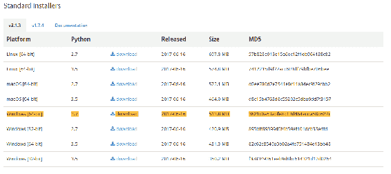

1.  在这一步我们不需要提供任何个人信息。这是一个相当标准的 Windows 安装程序，所以只需让它下载：

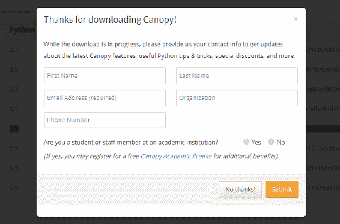

1.  下载完成后，我们继续打开 Canopy 安装程序，并运行它！您可能想在同意之前阅读许可协议，这取决于您，然后只需等待安装完成。

1.  一旦您在安装过程的最后点击完成按钮，允许它自动启动 Canopy。您会看到 Canopy 自动设置 Python 环境，这很好，但这将需要一两分钟的时间。

1.  安装程序设置完成您的 Python 环境后，您应该会看到下面的屏幕。它会显示欢迎来到 Canopy 和一堆友好的大按钮：

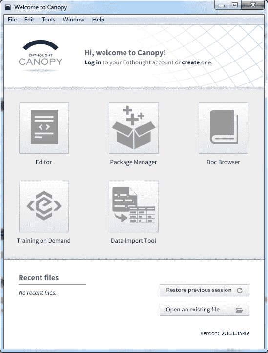

1.  美妙的事情是，几乎您在本书中所需的一切都已经预先安装在 Enthought Canopy 中，这就是为什么我建议使用它！

1.  我们只需要设置最后一件事，所以请点击 Canopy 欢迎屏幕上的编辑器按钮。然后您会看到编辑器屏幕出现，如果您在底部的窗口中点击，我希望您只是输入：

```py
!pip install pydotplus 

```

1.  当您在 Canopy 编辑器窗口底部输入上述行时，屏幕会显示如下；当然不要忘记按回车键：

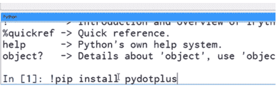

1.  按下回车键后，这将安装我们在本书后面需要的一个额外模块，当我们开始讨论决策树和渲染决策树时。

1.  一旦安装完成**pydotplus**，它应该会回来并说它已成功安装，您现在已经拥有了开始的一切！此时安装已经完成-但让我们再走几步来确认我们的安装是否正常运行。

# 对安装进行测试

1.  现在让我们对您的安装进行测试。首先要做的事情是完全关闭 Canopy 窗口！这是因为我们实际上不会在这个 Canopy 编辑器中编辑和使用我们的代码。相反，我们将使用一个称为 IPython 笔记本的东西，现在也被称为 Jupyter 笔记本。

1.  让我向您展示一下它是如何工作的。如果您现在在操作系统中打开一个窗口，查看您下载的附带书籍文件，就像本书的前言中描述的那样。它应该看起来像这样，带有您为本书下载的一组`.ipynb`代码文件：

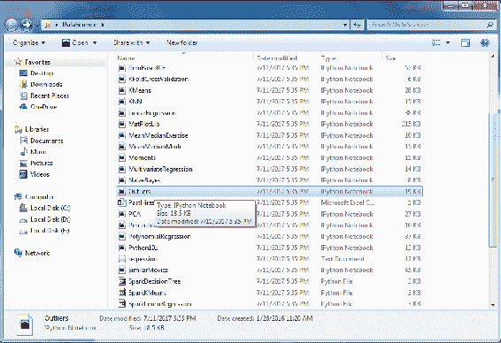

现在在列表中找到异常值文件，即`Outliers.ipynb`文件，双击它，应该会启动 Canopy，然后启动您的网络浏览器！这是因为 IPython/Jupyter 笔记本实际上存在于您的网络浏览器中。一开始可能会有一小段暂停，第一次可能会有点混乱，但您很快就会习惯的。

您很快就会看到 Canopy 出现，对我来说，我的默认网络浏览器 Chrome 会出现。您应该会看到以下 Jupyter 笔记本页面，因为我们双击了`Outliers.ipynb`文件：

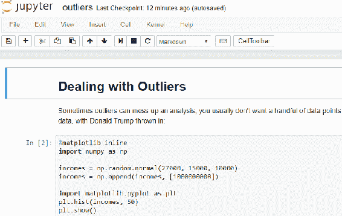

如果您看到这个屏幕，这意味着您的安装工作得很好，您已经准备好继续阅读本书的其余部分了！

# 如果您偶尔遇到打开 IPNYB 文件的问题

偶尔，我注意到当您双击`.ipynb`文件时，有时会出现一些小问题。不要惊慌！有时，Canopy 可能会有点不稳定，您可能会看到一个寻找密码或令牌的屏幕，或者偶尔会看到一个完全无法连接的屏幕。

如果您遇到这些情况，不要惊慌，它们只是偶然的怪癖，有时事情就是不按正确的顺序启动，或者它们在您的 PC 上没有及时启动，没关系。

您只需返回并尝试第二次打开该文件。有时需要两三次尝试才能正确加载它，但如果您多试几次，最终它应该会弹出，并且您应该会看到一个 Jupyter 笔记本屏幕，就像我们之前看到的关于处理异常值的那个。

# 使用和理解 IPython（Jupyter）笔记本

恭喜您的安装！现在让我们探索使用 Jupyter 笔记本，也称为 IPython 笔记本。如今，更现代的名称是 Jupyter 笔记本，但很多人仍然称其为 IPython 笔记本，因此我认为这两个名称对于工作开发人员来说是可以互换的。我也发现 IPython 笔记本这个名称有助于我记住笔记本文件的后缀名是`.ipynb`，在本书中您将非常熟悉这个后缀名！

好的，现在让我们从头开始 - 首先探索 IPython/Jupyter 笔记本。如果您还没有这样做，请导航到我们为本书下载的`DataScience`文件夹。对我来说，那是`E:DataScience`，如果您在前面的安装部分中没有这样做，请现在双击并打开`Outliers.ipynb`文件。

现在，当我们双击此 IPython `.`**`ipynb`**文件时，首先会启动 Canopy，然后会启动一个 Web 浏览器。这是完整的`Outliers`笔记本网页在我的浏览器中的样子：

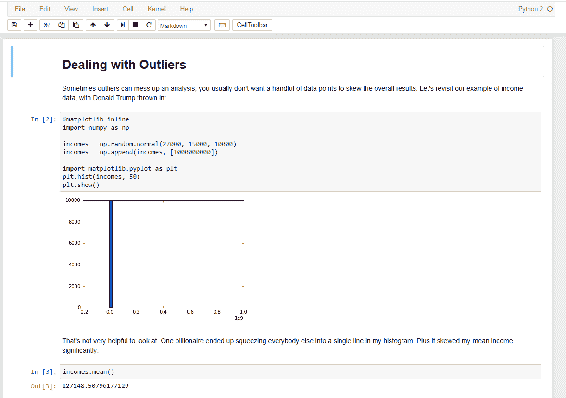

正如您在这里看到的，笔记本的结构使我可以在实际代码中穿插一些关于您在这里看到的内容的小注释和评论，您实际上可以在 Web 浏览器中运行此代码！因此，对我来说，这是一个非常方便的格式，可以为您提供一些参考，以便以后在生活中去回顾这些我们将要讨论的算法是如何工作的，并且实际上可以自己尝试和玩耍。

IPython/Jupyter 笔记本文件的工作方式是它们实际上是在您的浏览器中运行的，就像一个网页，但它们由您安装的 Python 引擎支持。因此，您应该看到与前一个屏幕截图中显示的类似的屏幕。

当您在浏览器中向下滚动笔记本时，您会注意到有代码块。它们很容易识别，因为它们包含我们的实际代码。请在异常值笔记本中找到此代码的代码框，它就在顶部附近：

```py
%matplotlib inline 
import numpy as np 

incomes = np.random.normal(27000, 15000, 10000) 
incomes = np.append(incomes, [1000000000]) 

import matplotlib.pyplot as plt 
plt.hist(incomes, 50) 
plt.show() 

```

让我们在这里快速看一下这段代码。在这段代码中，我们设置了一些收入分布。我们模拟了人口中的收入分布，并且为了说明异常值对该分布的影响，我们模拟了唐纳德·特朗普加入并扰乱了收入分布的平均值。顺便说一句，我并不是在发表政治言论，这都是在特朗普成为政治人物之前完成的。所以，您知道，完全披露在这里。

我们可以通过单击来选择笔记本中的任何代码块。因此，如果您现在点击包含我们刚才查看的代码的代码块，然后点击顶部的运行按钮来运行它。这是屏幕顶部的区域，您将在其中找到运行按钮：

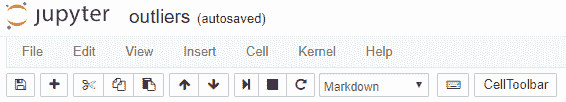

选择代码块并点击运行按钮，将导致重新生成此图：

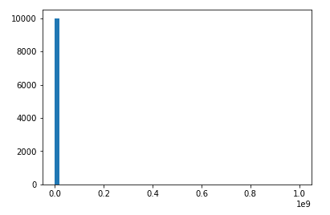

同样，我们可以点击稍微向下的下一个代码块，您会看到其中有以下一行代码：

```py
incomes.mean() 

```

如果您选择包含此行的代码块，并点击运行按钮运行代码，您将在其下看到输出，由于异常值的影响，输出将是一个非常大的值，类似于这样：

```py
127148.50796177129

```

让我们继续并且玩得开心。在下面的下一个代码块中，您将看到以下代码，它尝试检测像唐纳德·特朗普这样的异常值，并将它们从数据集中删除：

```py
def reject_outliers(data): 
    u = np.median(data) 
    s = np.std(data) 
    filtered = [e for e in data if (u - 2 * s < e < u + 2 * s)] 
    return filtered 

filtered = reject_outliers(incomes) 
plt.hist(filtered, 50) 
plt.show() 

```

因此，请在笔记本中选择相应的代码块，然后再次按运行按钮。当您这样做时，您将看到这张图：

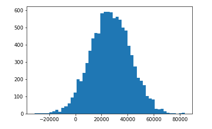

现在我们看到了一个更好的直方图，代表了更典型的美国人-现在我们已经去掉了混乱的异常值。

所以，此时，您已经具备了开始本课程所需的一切。我们拥有您需要的所有数据，所有脚本，以及 Python 和 Python 笔记本的开发环境。所以，让我们开始吧。接下来，我们将进行一些关于 Python 本身的速成课程，即使您熟悉 Python，这也可能是一个不错的温习，所以您可能还是想观看一下。让我们深入学习 Python。

# Python 基础-第一部分

如果您已经了解 Python，您可能可以跳过接下来的两个部分。但是，如果您需要温习，或者以前没有接触过 Python，您可能需要浏览一下。关于 Python 脚本语言有一些古怪的地方，您需要知道，所以让我们深入学习一下，通过编写一些实际代码来学习一些 Python。

就像我之前说的，在本书的要求中，您应该具备某种编程背景才能成功。您已经在某种语言中编写过代码，即使是脚本语言，JavaScript，我不在乎它是 C++，Java，还是其他什么，但如果您是 Python 的新手，我将在这里给您一个速成课程。我将直接开始并在本节中给出一些示例。

Python 有一些与您可能见过的其他语言有些不同的地方；所以我只是想通过查看一些真实的例子来介绍 Python 与其他脚本语言的不同之处。让我们直接开始，看一些 Python 代码：

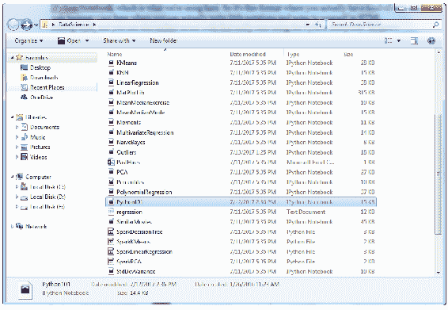

如果您打开了在之前部分中下载的`DataScience`文件夹，您应该会找到一个`Python101.ipynb`文件；请双击打开。如果您已经正确安装了所有内容，它应该会在 Canopy 中立即打开，并且应该看起来有点像以下的截图：


新版本的 Canopy 将在您的网络浏览器中打开代码，而不是 Canopy 编辑器！这没问题！

Python 的一个很酷的地方是，有几种运行 Python 代码的方式。您可以将其作为脚本运行，就像您使用普通编程语言一样。您还可以在这个叫做*IPython Notebook*的东西中编写代码，这就是我们在这里使用的东西。因此，这是一种格式，您实际上可以在其中以类似网络浏览器的视图中编写一些小注释和 HTML 标记的笔记，还可以嵌入实际使用 Python 解释器运行的代码。

# 理解 Python 代码

我想给您展示一些 Python 代码的第一个例子就在这里。以下代码块代表了一些真正的 Python 代码，我们实际上可以在整个笔记本页面的视图中运行，但现在让我们放大一下，看看那段代码：

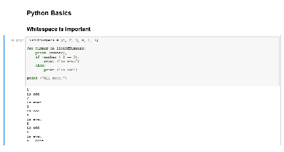

让我们看看发生了什么。我们有一个数字列表和 Python 中的一个列表，类似于其他语言中的数组。它由这些方括号指定：

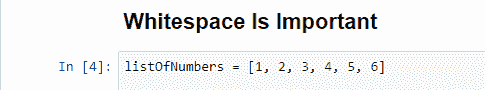

我们有一个包含 1 到 6 的数字列表的数据结构，然后要遍历该列表中的每个数字，我们将说`for number in listOfNumbers:`，这是 Python 遍历一系列东西的语法，后面跟着一个冒号。

在 Python 中，制表符和空格是有实际意义的，所以您不能随意格式化。您必须注意它们。

我想要表达的观点是，在其他语言中，通常会有括号或大括号来表示我在`for`循环、`if`块或某种代码块中，但在 Python 中，这一切都是由空格来指定的。制表符实际上在告诉 Python 哪些代码块中有什么：

```py
for number in listOfNumbers: 
    print number, 
    if (number % 2 == 0): 
        print ("is even")
    else: 
        print ("is odd") 

print ("Hooray! We're all done.")

```

你会注意到，在这个`for`块中，我们有一个制表符，对于`listOfNumbers`中的每个`number`，我们将执行所有这些代码，这些代码都是通过一个*Tab*进行缩进的。我们将打印出这个数字，逗号只是表示我们不会在后面换行。我们将在后面打印其他东西，如果`(number % 2 = 0)`，我们将说它是`even`。否则，我们将说它是`odd`，当我们完成时，我们将打印出`All done`：

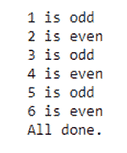

你可以在代码下方看到输出。我之前已经运行了输出，因为我已经将它保存在我的笔记本中，但如果你想自己运行它，你只需点击该块并点击播放按钮，我们将实际执行它并再次运行。为了让自己确信它确实做了一些事情，让我们把`print`语句改成其他的，比如说，`Hooray! We're all done. Let's party!`如果我现在运行这个，你会看到，我的消息确实改变了：

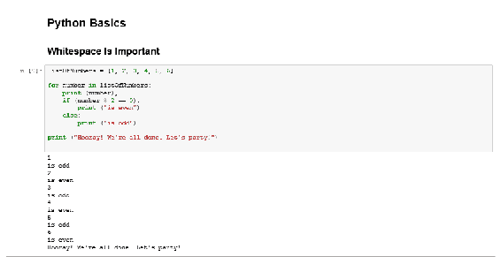

所以，我想要表达的观点是空格很重要。你会使用缩进或制表符来指定一起运行的代码块，比如`for`循环或`if then`语句，所以记住这一点。还要注意冒号。你会注意到很多从句都是以冒号开始的。

# 导入模块

Python 本身，就像任何语言一样，其功能是相当有限的。使用 Python 进行机器学习、数据挖掘和数据科学的真正力量在于为此目的提供的所有外部库的强大功能。其中一个库叫做`NumPy`，或者叫做数值 Python，例如，我们可以`import` `Numpy`包，它包含在 Canopy 中，名称为`np`。

这意味着我将把`NumPy`包称为`np`，我可以随意更改它的名称。我可以称它为`Fred`或`Tim`，但最好还是使用有意义的名称；现在我把`NumPy`包称为`np`，我可以使用`np`来引用它了：

```py
import numpy as np

```

在这个例子中，我将调用`NumPy`包提供的`random`函数，并调用其正态函数来生成一组随机数的正态分布，并将其打印出来。由于它是随机的，每次我应该得到不同的结果：

```py
import numpy as np
A = np.random.normal(25.0, 5.0, 10)
print (A)

```

输出应该是这样的：

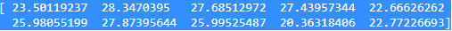

果然，我得到了不同的结果。这很酷。

# 数据结构

让我们继续讨论数据结构。如果你需要暂停一下，让事情沉淀一下，或者你想更多地玩弄一下这些，随时都可以这样做。学习这些东西的最好方法就是投入其中，实际进行实验，所以我绝对鼓励这样做，这也是为什么我给你们提供了可工作的 IPython/Jupyter 笔记本，这样你们就可以真正进入其中，改变代码，做不同的事情。

举个例子，这里我们有一个围绕`25.0`的分布，但让我们把它围绕`55.0`：

```py
import numpy as np
A = np.random.normal(55.0, 5.0, 10)
print (A)

```

嘿，我的所有数字都变了，它们现在更接近 55 了，怎么样？

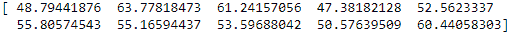

好的，让我们来谈谈数据结构。就像我们在第一个例子中看到的那样，你可以有一个列表，语法看起来是这样的。

# 列表实验

```py
x = [1, 2, 3, 4, 5, 6]
print (len(x))

```

你可以说，比如，调用一个名为`x`的列表，并将其赋值为数字`1`到`6`，这些方括号表示我们使用的是 Python 列表，它们是不可变的对象，我可以随意添加和重新排列。有一个用于确定列表长度的内置函数叫做`len`，如果我输入`len(x)`，那么会返回数字`6`，因为我的列表中有 6 个数字。

只是为了确保，再次强调这实际上是在运行真正的代码，让我们在那里再添加一个数字，比如`4545`。如果你运行这个，你会得到`7`，因为现在列表中有 7 个数字：

```py
x = [1, 2, 3, 4, 5, 6, 4545]
print (len(x))

```

前面代码示例的输出如下：

```py
7

```

回到原来的例子。现在你也可以对列表进行切片。如果你想要取列表的一个子集，有一个非常简单的语法可以做到：

```py
x[3:]

```

上面代码示例的输出如下：

```py
[1, 2, 3]

```

# 冒号之前

例如，如果你想要取列表的前三个元素，即第 3 个元素之前的所有东西，我们可以说`:3`来获取前三个元素，`1`，`2`和`3`，如果你想想那里发生了什么，就是索引方面的事情，就像大多数语言一样，我们从 0 开始计数。所以第 0 个元素是`1`，第 1 个元素是`2`，第 2 个元素是`3`。因为我们说我们想要在第 3 个元素之前的所有东西，这就是我们得到的。

所以，你知道，在大多数语言中，你从 0 开始计数，而不是 1。

现在这可能会让事情变得混乱，但在这种情况下，它确实是直观的。你可以把冒号理解为我想要所有东西，我想要前三个元素，我可以再次将其更改为四，以再次说明我们实际上正在做一些真实的事情：

```py
x[:4]

```

上面代码示例的输出如下：

```py
[1, 2, 3, 4]

```

# 冒号之后

现在如果我把冒号放在`3`的另一侧，那就表示我想要`3`之后的所有东西，所以`3`和之后的。如果我说`x[3:]`，那就是给我第三个元素，0，1，2，3，以及之后的所有东西。所以在这个例子中会返回 4，5 和 6，明白吗？

```py
x[3:]

```

输出如下：

```py
[4, 5, 6]

```

你可能想要保留这个 IPython/Jupyter Notebook 文件。这是一个很好的参考，因为有时候会让人困惑，不知道切片操作符是否包括该元素，或者是到或包括它，还是不包括。所以最好的方法就是在这里玩一下，提醒自己。

# 负数语法

你还可以使用这种负数语法：

```py
x[-2:]

```

上面代码的输出如下：

```py
[5, 6]

```

通过说`x[-2:]`，这意味着我想要列表中的最后两个元素。这意味着从末尾向后退两个，这将给我`5`和`6`，因为这些是列表中的最后两个元素。

# 添加列表到列表

你还可以改变列表。比如说我想要把一个列表添加到另一个列表中。我可以使用`extend`函数来做到这一点，如下面的代码块所示：

```py
x.extend([7,8])
x

```

上面代码的输出如下：

```py
[1, 2, 3, 4, 5, 6, 7, 8]

```

我有一个列表`1`，`2`，`3`，`4`，`5`，`6`。如果我想要扩展它，我可以说我有一个新列表在这里，`[7, 8]`，那个方括号表示这本身就是一个新列表。这可能是一个隐式的列表，在那里，它可以被另一个变量引用。你可以看到，一旦我这样做了，我得到的新列表实际上是在原来的列表上附加了`7`，`8`的列表。所以我通过扩展另一个列表来得到一个新列表。

# 添加函数

如果你只想在列表中再添加一些东西，你可以使用`append`函数。所以我只想在末尾加上数字`9`，就这样：

```py
x.append(9)
x

```

上面代码的输出如下：

```py
[1, 2, 3, 4, 5, 6, 7, 8, 9]

```

# 复杂的数据结构

你还可以使用列表创建复杂的数据结构。所以你不只是可以把数字放进去；你实际上可以把字符串放进去。你可以把数字放进去。你可以把其他列表放进去。都没关系。Python 是一种弱类型语言，所以你基本上可以把任何类型的数据放到任何地方，通常都是可以的：

```py
y = [10, 11, 12]
listOfLists = [x, y]
listOfLists

```

在上面的例子中，我有一个包含`10`，`11`，`12`的第二个列表，我称之为`y`。我将创建一个包含两个列表的新列表。这对你来说是不是很惊人？我们的`listofLists`列表将包含`x`列表和`y`列表，这是完全有效的。你可以看到这里有一个括号表示`listofLists`列表，而在其中，我们有另一组括号表示该列表中的每个单独的列表：

```py
[[ 1, 2, 3, 4, 5, 6, 7, 8, 9 ], [10, 11, 12]]

```

所以，有时这样的东西会派上用场。

# 取消引用单个元素

如果你想取消引用列表的单个元素，你可以像这样使用括号：

```py
y[1]

```

上面代码的输出如下：

```py
11

```

所以`y[1]`将返回元素`1`。记住`y`中有`10`，`11`，`12` - 观察上面的例子，我们从 0 开始计数，所以元素 1 实际上是列表中的第二个元素，或者在这种情况下是数字`11`，好吗？

# 排序函数

最后，让我们来看一个内置的排序函数，你可以使用它：

```py
z = [3, 2, 1]
z.sort()
z

```

所以如果我从列表`z`开始，它是`3`，`2`和`1`，我可以在该列表上调用排序，然后`z`现在将按顺序排序。上面代码的输出如下：

```py
[1, 2, 3]

```

# 反向排序

```py
z.sort(reverse=True)
z

```

上面代码的输出如下：

```py
[3, 2, 1]

```

如果你需要进行反向排序，你可以在`sort`函数中添加一个参数`reverse=True`，这将使它恢复到`3`，`2`，`1`。

如果你需要让这个概念沉淀一下，可以随意回去再读一下。

# 元组

元组就像列表一样，只是它们是不可变的，所以你实际上不能扩展、追加或排序它们。它们就是它们，除了你不能改变它们，并且你用括号而不是方括号表示它们是不可变的元组，它们的行为就像列表一样。所以你可以看到它们在其他方面基本上是一样的：

```py
#Tuples are just immutable lists. Use () instead of []
x = (1, 2, 3)
len(x)

```

上面代码的输出如下：

```py
3

```

我们可以说`x=(1,2,3)`。我仍然可以在上面使用`length - len`来说这个元组中有三个元素，即使，如果你不熟悉术语`元组`，一个`元组`实际上可以包含任意多个元素。尽管它听起来像是基于数字三的拉丁语，但这并不意味着你在其中有三个东西。通常，它只有两个东西。它们可以有任意多个，真的。

# 取消引用一个元素

我们还可以对元组的元素进行取消引用，所以第 2 个元素再次是第三个元素，因为我们从 0 开始计数，这将在下面的截图中给我返回数字`6`：

```py
y = (4, 5, 6)
y[2]

```

上面代码的输出如下：

```py
6

```

# 元组列表

我们也可以像对待列表一样，使用元组作为列表的元素。

```py
listOfTuples = [x, y]
listOfTuples

```

上面代码的输出如下：

```py
[(1, 2, 3), (4, 5, 6)]

```

我们可以创建一个包含两个元组的新列表。所以在上面的例子中，我们有我们的`x`元组`(1,2,3)`和我们的`y`元组`(4,5,6)`；然后我们将这两个元组放入一个列表中，我们得到了这样的结构，其中我们有方括号表示包含两个由括号表示的元组的列表，元组在我们进行数据科学或任何数据管理或处理时通常用于将变量分配给输入数据。我想向你解释一下下面例子中发生了什么：

```py
(age, income) = "32,120000".split(',')
print (age)
print (income)

```

上面代码的输出如下：

```py
32
120000

```

假设我们有一行输入数据进来，它是一个逗号分隔的值文件，其中包含年龄，比如`32`，用逗号分隔的收入，比如`120000`，只是为了举个例子。当每行数据进来时，我可以调用`split`函数来将其分隔成由逗号分隔的一对值，并将`split`的结果元组一次性分配给两个变量-`age`和`income`，通过定义一个年龄、收入的元组，并说我想将其设置为`split`函数的结果元组。

所以这基本上是你会看到的一种常见的简写，用于一次性为多个变量分配多个字段。如果我运行它，你会看到`age`变量实际上被分配为`32`，`income`被分配为`120,000`，因为有这个小技巧。当你这样做的时候，你需要小心，因为如果你没有预期的字段数量或者结果元组中的预期元素数量，如果你尝试分配更多或更少的东西，你会得到一个异常。

# 字典

最后，我们将在 Python 中经常看到的最后一个数据结构是字典，你可以把它看作是其他语言中的映射或哈希表。这基本上是一种在 Python 中内置的一种方式，可以有一种类似于键/值数据存储的迷你数据库。所以假设我想建立一个小小的星际迷航飞船和他们的船长的字典：

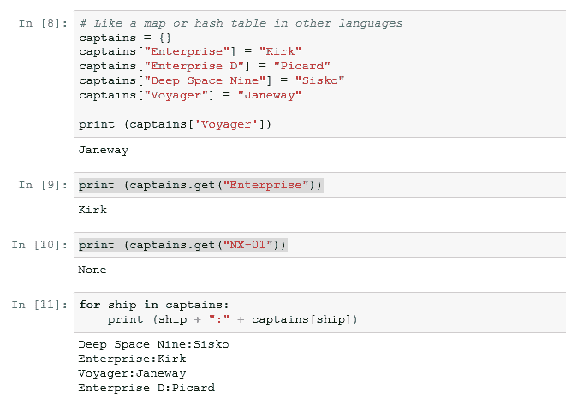

我可以设置`captains = {}`，花括号表示一个空字典。现在我可以使用这种语法来为字典中的条目赋值，所以我可以说`captains`为`Enterprise`是`Kirk`，为`Enterprise D`是`Picard`，为`Deep Space Nine`是`Sisko`，为`Voyager`是`Janeway`。现在我基本上有了这个查找表，它将船名与船长关联起来，例如，我可以说`print captains["Voyager"]`，我会得到`Janeway`。

这基本上是一种非常有用的工具，可以用来做某种查找。假设你在数据集中有某种标识符，它映射到一些可读的名称。当你打印出来时，你可能会使用字典来进行实际的查找。

我们还可以看看如果尝试查找不存在的东西会发生什么。嗯，我们可以在字典上使用`get`函数来安全地返回一个条目。所以在这种情况下，`Enterprise`在我的字典中有一个条目，它只是给我`Kirk`，但如果我在字典上调用`NX-01`船，我从来没有定义过那个船的船长，所以在这个例子中它会返回一个`None`值，这比抛出异常要好，但你需要意识到这是可能的：

```py
print (captains.get("NX-01"))

```

上面代码的输出如下：

```py
None

```

船长是乔纳森·阿彻，但你知道，我现在有点太迷恋了。

# 遍历条目

```py
for ship in captains:
     print (ship + ": " + captains[ship])

```

上面代码的输出如下：

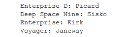

让我们来看一个遍历字典条目的小例子。如果我想要遍历我字典中的每艘船，并打印出`captains`，我可以输入`for ship in captains`，这将遍历字典中的每个键。然后我可以打印出每艘船船长的查找值，这就是我得到的输出。

就是这样。这基本上是你在 Python 中会遇到的主要数据结构。还有其他一些，比如集合，但我们在这本书中不会真正使用它们，所以我认为这已经足够让你开始了。让我们在下一节中深入了解一些 Python 的细微差别。

# Python 基础-第二部分

除了*Python 基础-第一部分*，现在让我们试着更详细地掌握更多 Python 概念。

# Python 中的函数

让我们谈谈 Python 中的函数。与其他语言一样，你可以有函数让你重复一组操作，只是参数不同。在 Python 中，做到这一点的语法看起来像这样：

```py
def SquareIt(x):
    return x * x
print (SquareIt(2))

```

上面代码的输出如下：

```py
4

```

你使用`def`关键字声明一个函数。它只是说这是一个函数，我们将称这个函数为`SquareIt`，然后在括号内跟着参数列表。这个特定的函数只接受一个我们将称为`x`的参数。再次记住，在 Python 中空白很重要。这个函数不会有任何花括号或者其他东西来包围它。它完全由空白定义。所以我们有一个冒号，它表示这个函数声明行结束了，但是它是通过一个或多个制表符来告诉解释器我们实际上在`SquareIt`函数内部。

所以`def SquareIt(x):` tab 返回`x * x`，这将返回这个函数中`x`的平方。我们可以试一下。`print squareIt(2)`就是我们调用这个函数的方式。它看起来就像在任何其他语言中一样。这应该返回数字`4`；我们运行代码，事实上确实是这样的。太棒了！这很简单，这就是函数的全部。显然，如果我愿意，我可以有多个参数，甚至需要多少个参数都可以。

现在在 Python 中有一些奇怪的事情你可以做，这些事情有点酷。你可以像传递参数一样传递函数。让我们仔细看看这个例子：

```py
#You can pass functions around as parameters
def DoSomething(f, x):
    return f(x)
print (DoSomething(SquareIt, 3))

```

前面代码的输出如下：

```py
9

```

现在我有一个名为`DoSomething`的函数，`def DoSomething`，它将接受两个参数，一个我将称为`f`，另一个我将称为`x`，如果我愿意，我实际上可以为其中一个参数传递一个函数。所以，请思考一分钟。看看这个例子，更有意义。在这里，`DoSomething(f,x):`将返回`f`的`x`；它基本上会调用 f 函数并将 x 作为参数传递进去，Python 中没有强类型，所以我们必须确保我们为第一个参数传递的是一个函数，这样才能正常工作。

例如，我们将打印`DoSomething`，并且对于第一个参数，我们将传入`SquareIt`，这实际上是另一个函数，以及数字`3`。这应该做的是使用`SquareIt`函数和`3`参数做一些事情，这将返回`(SquareIt, 3)`，我上次检查的时候，3 的平方是 9，确实是这样的。

这可能对你来说是一个新概念，将函数作为参数传递，所以如果你需要停下来一分钟，等一下，让它沉淀下来，玩弄一下，请随意这样做。再次，我鼓励你停下来，按照自己的步调学习。

# Lambda 函数 - 函数式编程

还有一件事，这是一种 Python 式的做法，你可能在其他语言中看不到，那就是 lambda 函数的概念，它有点叫做**函数式编程**。这个想法是你可以在一个函数中包含一个简单的函数。通过一个例子来解释会更有意义：

```py
#Lambda functions let you inline simple functions
print (DoSomething(lambda x: x * x * x, 3))

```

上面代码的输出如下：

```py
27

```

我们将打印`DoSomething`，记住我们的第一个参数是一个函数，所以我们可以使用`lambda`关键字内联声明这个函数，而不是传递一个命名函数。Lambda 基本上意味着我正在定义一个暂时存在的未命名函数。它是瞬时的，并且它接受一个参数`x`。在这里的语法中，`lambda`意味着我正在定义某种内联函数，后面跟着它的参数列表。它有一个参数`x`，然后是冒号，然后是这个函数实际上要做的事情。我将取`x`参数并将其自身乘以三次，基本上得到参数的立方。

在这个例子中，`DoSomething`将这个 lambda 函数作为第一个参数传递进去，它计算`x`的立方和`3`参数。那么在幕后这实际上是在做什么呢？这个`lambda`函数本身是一个函数，在前面的例子中被传递到`DoSomething`中的`f`，而这里的`x`将是`3`。这将返回`x`的`f`，最终执行我们的 lambda 函数在值`3`上。所以这个`3`进入我们的`x`参数，我们的 lambda 函数将其转换为`3`乘以`3`乘以`3`，当然是`27`。

当我们开始做 MapReduce 和 Spark 等工作时，这种情况经常出现。因此，如果以后要处理 Hadoop 等技术，这是一个非常重要的概念。再次，我鼓励您花点时间让它沉淀下来，理解发生了什么，如果需要的话。

# 理解布尔表达式

布尔表达式语法有点奇怪或不寻常，至少在 Python 中是这样：

```py
print (1 == 3)

```

上面代码的输出如下：

```py
False

```

像往常一样，我们有双等号符号，可以测试两个值之间的相等性。所以`1`等于`3`吗，不，因此`False`。值`False`是由 F 指定的特殊值。请记住，在测试时，当您在进行布尔运算时，相关的关键字是`True`和`False`。这与我之前使用过的其他语言有点不同，所以请记住这一点。

```py
print (True or False)

```

上面代码的输出如下：

```py
True

```

嗯，`True`或`False`是`True`，因为其中一个是`True`，你运行它，它会返回`True`。

# if 语句

```py
print (1 is 3)

```

上面代码的输出如下：

```py
False

```

我们还可以使用`is`，它与等号的作用类似。这是一种更 Python 风格的相等表示，所以`1 == 3`和`1 is 3`是一样的，但这被认为是更 Pythonic 的方式。因此`1 is 3`返回`False`，因为`1`不是`3`。

# if-else 循环

```py
if 1 is 3:
    print "How did that happen?"
elif 1 > 3:
    print ("Yikes")
else:
    print ("All is well with the world")

```

上面代码的输出如下：

```py
All is well with the world

```

我们还可以在这里使用`if-else`和`else-if`块。让我们在这里做一些更复杂的事情。如果`1 是 3`，我会打印`怎么会发生这种事？`但当然`1`不是`3`，所以我们将回到`else-if`块，否则，如果`1`不是`3`，我们将测试`1>3`。好吧，那也不对，但如果是的话，我们打印`天哪`，最后我们将进入这个万能的`else`子句，它将打印`世界一切安好`。

实际上，`1`不是`3`，`1`也不大于`3`，确实，`世界一切安好`。所以，你知道，其他语言有非常相似的语法，但这些是 Python 的特点，以及如何做`if-else`或`else-if`块。所以，随时保留这个笔记本。以后可能会成为一个很好的参考。

# 循环

我想在我们的 Python 基础知识中涵盖的最后一个概念是循环，我们已经看到了一些例子，但让我们再做一个：

```py
for x in range(10):
 print (x),

```

上面代码的输出如下：

```py
0 1 2 3 4 5 6 7 8 9

```

例如，我们可以使用这个范围运算符自动定义一个数字范围的列表。所以如果我们说`for x` in `range(10)`，`range 10`将产生一个`0`到`9`的列表，通过在该列表中说`for x`，我们将遍历该列表中的每个条目并打印出来。再次强调，`print`语句后的逗号表示不要给我一个新行，继续进行。因此，这样的输出最终是该列表的所有元素打印在一起。

要做一些更复杂的事情，我们将做类似的事情，但这次我们将展示`continue`和`break`的工作原理。与其他语言一样，您实际上可以选择跳过循环迭代的其余处理，或者提前停止循环的迭代：

```py
for x in range(10):
    if (x is 1):
 continue
 if (x > 5):
    break
 print (x),

```

上面代码的输出如下：

```py
0 2 3 4 5

```

在这个例子中，我们将遍历 0 到 9 的值，如果我们遇到数字 1，我们将在打印它之前继续。我们将跳过数字 1，基本上，如果数字大于`5`，我们将中断循环并完全停止处理。我们期望的输出是，我们将打印出数字`0`到`5`，除非是`1`，在这种情况下，我们将跳过数字`1`，确实，这就是它的作用。

# while 循环

另一种语法是 while 循环。这是大多数语言中都能看到的一种标准循环语法：

```py
x = 0
while (x < 10):
    print (x),
    x += 1

```

上述代码的输出如下：

```py
0 1 2 3 4 5 6 7 8 9

```

我们还可以说，从`x = 0`开始，然后`while (x < 10):`，打印它，然后将`x`增加`1`。这将一遍又一遍地进行，递增 x 直到小于 10 为止，此时我们跳出`while`循环并完成。所以它和这里的第一个例子做的事情是一样的，只是以不同的风格。它使用`while`循环打印出数字`0`到`9`。只是一些例子，没有太复杂的东西。再次，如果你之前做过任何编程或脚本，这应该很简单。

现在为了让这个概念真正深入人心，我一直在整个章节中说，去尝试，动手去做，玩一下。所以我要让你这样做。

# 探索活动

这里有一个活动，对你来说有点挑战：

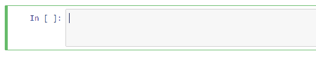

这是一个很好的代码块，你可以开始编写你自己的 Python 代码，运行它，并玩耍，所以请这样做。你的挑战是编写一些代码，创建一个整数列表，循环遍历该列表的每个元素，到目前为止都很容易，然后只打印出偶数。

现在这不应该太难。这本笔记本中有做所有这些事情的例子；你所要做的就是把它们放在一起并让它们运行起来。所以，重点不是给你一些难的东西。我只是想让你真的对编写自己的 Python 代码并实际运行它并看到它运行有信心，所以请这样做。我绝对鼓励你在这里进行互动。所以加油，祝你好运，欢迎来到 Python。

所以这就是你的 Python 速成课程，显然，只是一些非常基本的东西。随着我们在整本书中越来越多的例子，它会变得越来越有意义，因为你有更多的例子可以参考，但如果你现在感到有点害怕，也许你对编程或脚本有点太新了，那么在继续之前可能最好先进行一次 Python 复习，但如果你对到目前为止看到的东西感到相当满意，让我们继续前进，我们将继续前进。

# 运行 Python 脚本

在整本书中，我们将使用 IPython/Jupyter 笔记本格式（即`.ipynb`文件），这是一个很好的格式，因为它让我可以在里面放一些代码块，并加一些文字和解释它在做什么，你可以实时尝试一些东西。

当然，从这个角度来看，这很棒，但在现实世界中，你可能不会真的使用 IPython/Jupyter 笔记本来在生产中运行你的 Python 脚本，所以让我简要地介绍一下你可以运行 Python 代码的其他方式，以及其他交互式运行 Python 代码的方式。所以这是一个相当灵活的系统。让我们来看看。

# 不仅仅是 IPython/Jupyter 笔记本

我想确保你知道有多种运行 Python 代码的方式。现在，在整本书中，我们将使用 IPython/Jupyter 笔记本格式，但在现实世界中，你不会将你的代码作为笔记本来运行。你将把它作为一个独立的 Python 脚本来运行。所以我只是想确保你知道如何做到这一点并看看它是如何工作的。

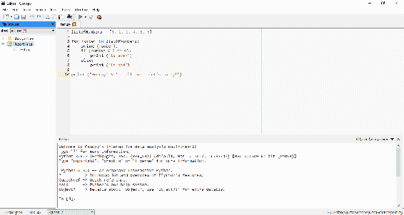

所以让我们回到我们在书中运行的第一个例子，只是为了说明空格的重要性。我们可以从笔记本格式中选择并复制代码，然后粘贴到一个新文件中。

这可以通过点击最左边的“新建”按钮来完成。所以让我们创建一个新文件，粘贴进去，然后保存这个文件，命名为`test.py`，其中`py`是我们给 Python 脚本通常使用的扩展名。现在，我可以以几种不同的方式运行它。

# 在命令提示符中运行 Python 脚本

我实际上可以在命令提示符中运行脚本。如果我去工具，我可以选择 Canopy 命令提示符，这将打开一个命令窗口，其中已经设置好了运行 Python 所需的所有必要的环境变量。我只需输入`python test.py`并运行脚本，结果就出来了：

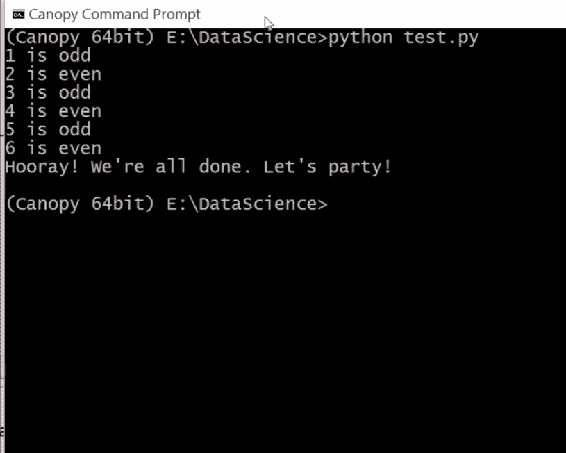

所以在现实世界中，你可能会做类似的事情。可能是在 Crontab 上或其他地方，谁知道呢？但在生产中运行一个真正的脚本就是这么简单。现在你可以关闭命令提示符。

# 使用 Canopy IDE

回到 IDE，我也可以在 IDE 中运行脚本。所以在 Canopy 中，我可以去运行菜单。我可以选择运行文件，或者点击小播放图标，这也会执行我的脚本，并在输出窗口底部看到结果，如下图所示：

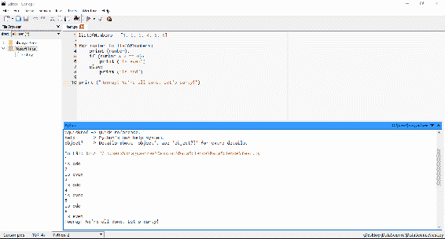

这是另一种方法，最后，你也可以在底部的交互式提示符中运行脚本。我实际上可以逐个输入 Python 命令，并让它们在环境中执行并保留在那里：

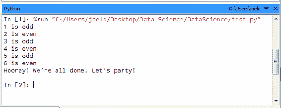

例如，我可以说`stuff`，将其作为`list`调用，并有`1`，`2`，`3`，`4`，现在我可以说`len(stuff)`，这将给我`4`：

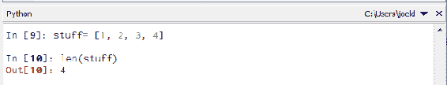

我可以说，`for x in stuff:print x`，我们得到的输出是`1 2 3 4`：

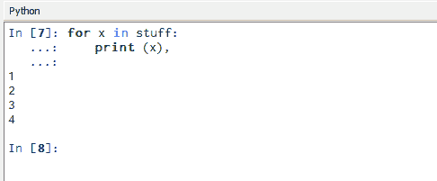

所以你可以看到，你可以在底部的交互式提示符中逐步制作脚本并逐个执行。在这个例子中，`stuff`是我们创建的一个变量，一个保留在内存中的列表，它有点像其他语言中的全局变量在这个环境中。

现在如果我想要重置这个环境，如果我想要摆脱`stuff`并重新开始，你可以这样做，你可以在这里点击运行菜单，然后选择重新启动内核，这将给你一个空白的状态：

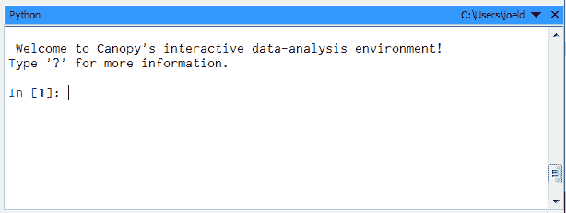

所以现在我有一个新的 Python 环境，是一个干净的状态，这种情况下，我叫它什么来着？输入`stuff`，`stuff`还不存在，因为我有一个新的环境，但我可以把它变成其他东西，比如`[4, 5, 6]`；运行它，就是这样：

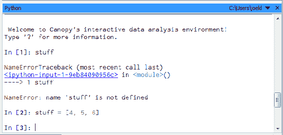

所以你看到了，有三种运行 Python 代码的方式：IPython/Jupyter Notebook，我们将在本书中使用它，因为它是一个很好的学习工具，你也可以作为独立的脚本文件运行脚本，也可以在交互式命令提示符中执行 Python 代码。

所以你看到了，你有三种不同的方式来运行 Python 代码和在生产中进行实验和运行。记住这一点。在本书的其余部分中，我们将使用笔记本，但当时机到来时，你还有其他选择。

# 总结

在本章中，我们开始了我们的旅程，建立了本书最重要的基石 - 安装 Enthought Canopy。然后我们继续安装其他库和不同类型的软件包。我们还借助各种 Python 代码掌握了一些 Python 的基础知识。我们涵盖了模块、列表以及元组等基本概念，最终更深入地了解了 Python 的基础知识，包括函数和循环。最后，我们开始运行一些简单的 Python 脚本。

在下一章中，我们将继续了解统计和概率的概念。
