# 第二章：统计和概率复习，以及 Python 实践

在本章中，我们将介绍一些统计和概率的概念，这对于一些人来说可能是复习。如果您想成为一名数据科学家，这些概念很重要。我们将看到一些示例，以更好地理解这些概念。我们还将看看如何使用实际的 Python 代码来实现这些示例。

本章我们将涵盖以下主题：

+   您可能会遇到的数据类型以及如何相应处理它们

+   统计概念的均值、中位数、众数、标准差和方差

+   概率密度函数和概率质量函数

+   数据分布类型及如何绘制它们

+   理解百分位数和矩

# 数据类型

好了，如果您想成为一名数据科学家，我们需要讨论您可能会遇到的数据类型，如何对其进行分类以及如何可能以不同方式对待它们。让我们深入了解您可能会遇到的不同类型的数据：


这似乎很基础，但我们必须从简单的东西开始，然后逐步深入研究更复杂的数据挖掘和机器学习内容。了解您正在处理的数据类型非常重要，因为不同的技术可能会根据您处理的数据类型有不同的细微差别。因此，可以说数据有几种不同的类型，我们将主要关注其中的三种。它们是：

+   数值数据

+   分类数据

+   有序数据

同样，对于不同类型的数据，可能会使用不同的技术变体，因此在分析数据时，您始终需要牢记您正在处理的数据类型。

# 数值数据

让我们从数值数据开始。这可能是最常见的数据类型。基本上，它代表一些可以测量的可量化的东西。一些例子是人的身高、页面加载时间、股票价格等。变化的东西，您可以测量的东西，具有广泛可能性的东西。现在基本上有两种数值数据，所以可以说是一种变体的变体。

# 离散数据

有离散数据，基于整数，例如某种事件的计数。一些例子是客户一年内购买了多少次。这只能是离散值。他们买了一件东西，或者他们买了两件东西，或者他们买了三件东西。他们不可能买了 2.25 件或三个四分之三的东西。这是一个具有整数限制的离散值。

# 连续数据

另一种数值数据是连续数据，这是一种具有无限可能性范围的数据，可以进入分数。例如，回到人的身高，有无限可能的身高。您可能身高五英尺十点三七六二五英寸，或者做某事的时间，例如在网站上结账可能有任意巨大范围的可能性，可能是 10.7625 秒，或者一天内的降雨量。同样，这里有无限的精度。这就是连续数据的一个例子。

总之，数值数据是您可以用数字量化地测量的东西，它可以是离散的，例如基于事件计数的整数，也可以是连续的，其中您可以对该数据有无限范围的精度。

# 分类数据

我们将讨论的第二种数据类型是分类数据，这是没有固有数值含义的数据。

大多数时候，您实际上无法直接比较一个类别和另一个类别。例如性别、是/否问题、种族、居住州、产品类别、政党；您可以为这些类别分配数字，通常您会这样做，但这些数字没有固有含义。

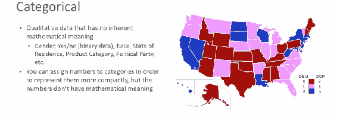

所以，例如，我可以说德克萨斯的面积大于佛罗里达的面积，但我不能只是说德克萨斯大于佛罗里达，它们只是类别。它们没有真正的数值可量化的意义，只是我们根据类别对不同的事物进行分类的方式。

再次，我可能对每个州有某种数值的指定。我的意思是，我可以说佛罗里达是第 3 州，德克萨斯是第 4 州，但 3 和 4 之间没有真正的关系，对吧，这只是更紧凑地表示这些类别的一种简便方法。所以，分类数据没有任何固有的数值意义；它只是一种你选择根据类别来分割数据集的方式。

# 有序数据

你通常听到的最后一种数据类型是有序数据，它是数值和分类数据的一种混合。一个常见的例子是电影或音乐的星级评价，或其他什么的。

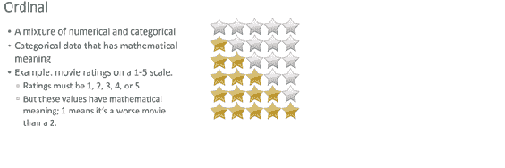

在这种情况下，我们有分类数据，可以是 1 到 5 颗星，其中 1 可能代表差，5 可能代表优秀，但它们确实有数学意义。我们知道 5 意味着比 1 好，所以这是一种数据，其中不同的类别之间有数值关系。所以，我可以说 1 颗星小于 5 颗星，我可以说 2 颗星小于 3 颗星，我可以说 4 颗星在质量上大于 2 颗星。现在你也可以把实际的星数看作是离散数值数据。所以，这些类别之间的界限确实很微妙，在很多情况下你实际上可以互换对待它们。

所以，这就是三种不同类型。有数值、分类和有序数据。让我们看看它是否已经深入人心。别担心，我不会让你交作业或者什么的。

**快速测验：**对于这些例子中的每一个，数据是数值的、分类的还是有序的？

1.  让我们从你的油箱里有多少汽油开始。你觉得呢？嗯，正确的答案是数字。这是一个连续的数值，因为你的油箱里可能有无限的汽油可能性。我的意思是，是的，你可能有多少汽油可以装进去，但是你有多少汽油的可能值是没有尽头的。它可能是油箱的四分之三，可能是油箱的十六分之七，可能是油箱的*1/π*，谁知道呢？

1.  如果你在 1 到 4 的范围内评估你的整体健康状况，其中这些选择对应于差、中等、良好和优秀的类别，你觉得呢？这是有序数据的一个很好的例子。这非常类似于我们的电影评分数据，再次取决于你如何对待它，你可能也可以把它当作离散数值数据，但从技术上讲，我们将把它称为有序数据。

1.  你的同学的种族呢？这是一个很明显的分类数据的例子。你不能真正比较紫色的人和绿色的人，对吧，他们只是紫色和绿色，但它们是你可能想要研究和了解在某些其他维度上的差异的类别。

1.  你的同学的年龄呢？这有点是个陷阱问题；如果我说它必须是整数年龄，比如 40、50 或 55 岁，那就是离散数值数据，但如果我有更多的精度，比如 40 年 3 个月 2.67 天，那就是连续数值数据，但无论如何，它都是数值数据类型。

1.  最后，商店里花费的钱。同样，这可能是连续数值数据的一个例子。所以，这只是重要的原因是你可能会对不同类型的数据应用不同的技术。

也许有一些概念，我们对分类数据和数值数据采用不同类型的实现，例如。

这就是你需要了解的关于你通常会发现的不同类型的数据，以及我们在本书中将重点关注的内容。它们都是非常简单的概念：你有数值、分类和顺序数据，数值数据可以是连续的或离散的。根据你处理的数据类型，可能会有不同的技术应用到数据中，我们将在本书中看到这一点。让我们继续。

# 均值、中位数和众数

让我们来进行一次统计学 101 的复习。这就像小学的东西，但是再次经历一遍并看看这些不同的技术是如何使用的是很好的：均值、中位数和众数。我相信你以前听过这些术语，但看看它们是如何不同地使用是很好的，所以让我们深入研究一下。

这对大多数人来说应该是一个复习，一个快速的复习，现在我们开始真正地深入一些实际的统计数据。让我们看看一些实际的数据，然后找出如何测量这些数据。

# 均值

均值，你可能知道，只是平均值的另一个名称。要计算数据集的均值，你所要做的就是把所有值加起来，然后除以你拥有的值的数量。

*样本总和/样本数量*

让我们以同样的数据集来计算我社区每个房子的平均孩子数量。

假设我在我的社区挨家挨户地问每个人，他们家有多少孩子。 （顺便说一句，这是离散数值数据的一个很好的例子；还记得前一节吗？）假设我四处走动，发现第一家没有孩子，第二家有两个孩子，第三家有三个孩子，依此类推。我积累了这些离散数值数据的小数据集，为了计算均值，我所要做的就是把它们全部加起来，然后除以我去过的房子的数量。

我街上每个房子的孩子数量：

*0, 2, 3, 2, 1, 0, 0, 2, 0*

均值是*(0+2+3+2+1+0+0+2+0)/9 = 1.11*

结果是 0 加 2 加 3 加所有其他数字除以我看过的房子的总数，即 9，我样本中每个房子的平均孩子数量是 1.11。所以，这就是均值。

# 中位数

中位数有点不同。计算数据集的中位数的方法是通过对所有值进行排序（无论是升序还是降序），并取中间的那个值。

因此，例如，让我们使用我社区孩子的相同数据集

*0, 2, 3, 2, 1, 0, 0, 2, 0*

我会按数字顺序排列，然后取出数据中间的数字，结果是 1。

*0, 0, 0, 0, 1, 2, 2, 2, 3*

同样，我所要做的就是取数据，按数字顺序排列，然后取中间的点。

如果数据点的数量是偶数，那么中位数可能会落在两个数据点之间。不清楚哪一个实际上是中间的。在这种情况下，你所要做的就是取两个中间的数的平均值，并将该数字视为中位数。

# 异常值的因素

现在，在前面的例子中，每个家庭的孩子数量，中位数和均值非常接近，因为没有太多的异常值。我们有 0、1、2 或 3 个孩子，但我们没有一些有 100 个孩子的疯狂家庭。那会使均值受到很大的影响，但可能不会太大地改变中位数。这就是为什么中位数通常是一个非常有用的东西，经常被忽视。

中位数比均值更不容易受到异常值的影响。

有时人们倾向于用统计数据误导人。我会在整本书中尽可能地指出这一点。

例如，你可以谈论美国的平均家庭收入，去年我查到的实际数字大约是 72000 美元，但这并不能真正准确地反映出典型的美国人的收入。这是因为，如果你看中位数收入，它要低得多，只有 51939 美元。为什么呢？因为收入不平等。美国有一些非常富有的人，其他很多国家也是如此。美国甚至不是最糟糕的，但你知道那些亿万富翁，那些住在华尔街或硅谷或其他一些非常富有的地方的超级富人，他们会使平均值偏离。但他们数量很少，所以他们并不会对中位数产生太大影响。

这是一个很好的例子，中位数比平均数更好地反映了这个例子中典型的人或数据点的情况。每当有人谈论平均数时，你必须考虑数据分布是什么样子。是否有可能会使平均数偏离的异常值？如果答案可能是肯定的，你也应该要求中位数，因为通常情况下，中位数提供的洞察力比平均数更多。

# 众数

最后，我们将讨论众数。实际上在实践中这并不经常出现，但你不能谈论均值和中位数而不谈论众数。众数的意思就是数据集中最常见的值。

让我们回到我关于每个房子中孩子数量的例子。

0、2、3、2、1、0、0、2、0

每个值有多少个：

0: 4, 1: 1, 2: 3, 3: 1

众数是 0

如果我只看最频繁出现的数字，结果是 0，因此这组数据的众数是 0。在这个社区中，一个房子里孩子的最常见数量是没有孩子，这就是它的含义。

现在这实际上是一个很好的连续与离散数据的例子，因为这只适用于离散数据。如果我有一系列连续的数据，那么我就无法谈论最常出现的值，除非我以某种方式将其量化为离散值。所以我们已经遇到了一个数据类型很重要的例子。

众数通常只与离散数值数据相关，而不与连续数据相关。

很多现实世界的数据往往是连续的，所以也许这就是为什么我不太听到关于众数的事情，但我们在这里看到了它的完整性。

就是这样：均值、中位数和众数的概要。这可能是你能做的最基本的统计工作，但我希望你在选择中位数和均值的重要性上得到了一点复习。它们可以讲述非常不同的故事，但人们往往在头脑中将它们等同起来，所以确保你是一个负责任的数据科学家，并以传达你试图代表的含义的方式代表数据。如果你试图显示一个典型值，通常中位数比平均数更好，因为异常值，所以记住这一点。让我们继续。

# 在 Python 中使用均值、中位数和众数

让我们开始在 Python 中进行一些真正的编码，看看如何使用 Python 在 IPython Notebook 文件中计算均值、中位数和众数。

所以，如果你想跟着做的话，可以打开本节数据文件中的`MeanMedianMode.ipynb`文件，我绝对鼓励你这样做。如果你需要回到之前关于从哪里下载这些材料的部分，请去做，因为你将需要这些文件来完成本节。让我们开始吧！

# 使用 NumPy 包计算均值

我们要做的是创建一些虚假的收入数据，回到上一节的例子。在这个例子中，我们将创建一些虚假数据，其中典型的美国人在这个例子中每年赚大约$27,000，我们将说这是以正态分布和标准差为 15,000 分布的。所有的数字都是完全虚构的，如果你还不知道正态分布和标准差是什么意思，不用担心。我会在本章稍后介绍，但我只是想让你知道这个例子中这些不同参数代表什么。以后会有意义的。

在我们的 Python 笔记本中，记得将 NumPy 包导入 Python，这样计算平均值、中位数和众数就变得非常容易。我们将使用`import numpy as np`指令，这意味着我们可以使用`np`作为调用`numpy`的简写。

然后我们将使用`np.random.normal`函数创建一个名为`incomes`的数字列表。

```py
import numpy as np 

incomes = np.random.normal(27000, 15000, 10000) 
np.mean(incomes) 

```

`np.random.normal`函数的三个参数表示我希望数据以`27000`为中心，标准差为`15000`，并且我希望 Python 在这个列表中生成`10000`个数据点。

一旦我这样做了，我就可以通过在`incomes`上调用`np.mean`来计算这些数据点的平均值，或者说是平均值。就是这么简单。

让我们继续运行。确保你选择了那个代码块，然后你可以点击播放按钮来执行它，由于这些收入数字有一个随机成分，每次我运行它，我都会得到一个略微不同的结果，但它应该总是接近`27000`。

```py
Out[1]: 27173.098561362742

```

好的，这就是在 Python 中计算平均值的全部内容，只需使用 NumPy（`np.mean`）就可以轻松搞定。你不必写一堆代码，或者实际上把所有东西加起来，计算出你有多少项，然后做除法。NumPy mean，为你做了所有这些。

# 使用 matplotlib 可视化数据

让我们可视化这些数据，以使它更加有意义。还有另一个叫做`matplotlib`的包，我们以后也会更多地谈论它，但它是一个让我在 IPython 笔记本中制作漂亮图形的包，所以这是一种简单的方式来可视化你的数据并了解发生了什么。

在这个例子中，我们使用`matplotlib`创建了一个包含`50`个不同桶的收入数据的直方图。所以基本上，我们将我们的连续数据离散化，然后我们可以在`matplotlib.pyplot`上调用 show 来实际显示这个直方图。参考以下代码：

```py
%matplotlib inline 
import matplotlib.pyplot as plt 
plt.hist(incomes, 50) 
plt.show() 

```

继续选择代码块并点击播放。它将为我们创建一个新的图表。

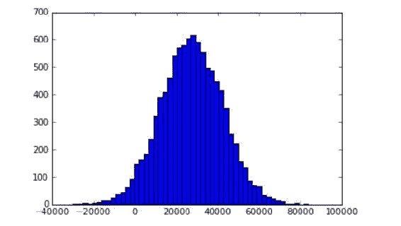

如果你不熟悉直方图或者需要复习一下，解释这个的方法是，我们将数据离散化为每个桶，显示了该数据的频率。

例如，大约在 27,000 左右，我们看到每个给定值范围内大约有**600**个数据点。在 27,000 左右有很多人，但当你到达**80,000**这样的异常值时，就没有那么多了，显然有一些可怜的人甚至负债**-40,000**，但是他们很少，不太可能，因为我们定义了一个正态分布，这就是正态概率曲线的样子。我们以后会更详细地谈论这个，但我只是想让你知道这个想法，如果你还不知道的话。

# 使用 NumPy 包计算中位数

好的，计算中位数就像计算平均值一样简单。就像我们有 NumPy 的`mean`一样，我们也有一个 NumPy 的`median`函数。

我们可以在我们的数据列表`incomes`上使用`median`函数，这将给我们中位数。在这种情况下，中位数是$26,911，与均值$26988\相差不大。同样，初始数据是随机的，所以你的值会略有不同。

```py
np.median(incomes) 

```

以下是前面代码的输出：

```py
Out[4]: 26911.948365056276 

```

我们不希望看到很多异常值，因为这是一个很好的正态分布。当你没有很多奇怪的异常值时，中位数和均值是可以比较的。

# 分析异常值的影响

为了证明一点，让我们加入一个异常值。我们来加入唐纳德·特朗普；我认为他算是一个异常值。让我们继续添加他的收入。所以我将手动使用`np.append`将这个数据添加到数据中，假设添加 10 亿美元（这显然不是唐纳德·特朗普的实际收入）到收入数据中。

```py
incomes = np.append(incomes, [1000000000]) 

```

我们将看到的是，这个异常值并没有真正改变中位数很多，你知道，它仍然会在大约相同的值$26,911 左右，因为我们实际上并没有改变中间点在哪里，只是在下面的例子中显示了一个值：

```py
np.median(incomes) 

```

这将输出以下内容：

```py
Out[5]: 26911.948365056276 

```

这给出了一个新的输出：

```py
np.mean(incomes) 

```

以下是前面代码的输出：

```py
Out[5]:127160.38252311043 

```

啊哈，就是这样！这是一个很好的例子，说明了中位数和均值，尽管人们在日常语言中倾向于将它们等同起来，但它们可能非常不同，并讲述了一个非常不同的故事。因此，这一个异常值导致了这个数据集中的平均收入超过了每年 12.7 万美元，但更准确的情况是这个数据集中典型人的年收入接近 2.7 万美元。我们只是因为一个大的异常值而使均值偏离了。

故事的寓意是：如果你怀疑可能存在异常值，那么对于谈论均值或平均数的人要持怀疑态度，而收入分布显然就是这种情况。

# 使用 SciPy 包计算众数

最后，让我们来看看众数。我们将生成一堆随机整数，精确地说是 500 个，范围在`18`到`90`之间。我们将为人们创建一堆虚假的年龄。

```py
ages = np.random.randint(18, high=90, size=500) 
ages 

```

你的输出将是随机的，但应该看起来像以下的截图：

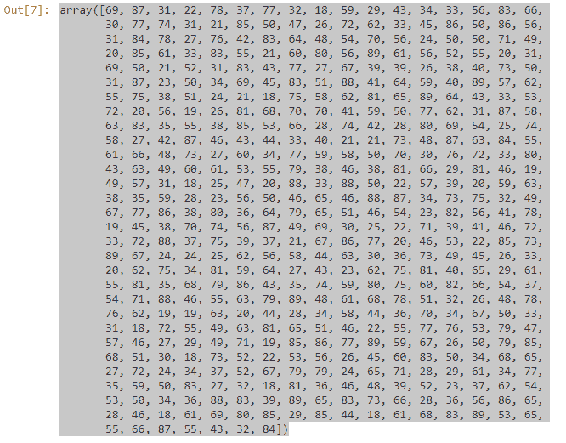

现在，SciPy，有点像 NumPy，是一堆方便的统计函数，所以我们可以使用以下语法从 SciPy 导入`stats`。这与我们之前看到的有点不同。

```py
from scipy import stats 
stats.mode(ages) 

```

这段代码的意思是，从`scipy`包中导入`stats`，我只是用`stats`来引用这个包，这意味着我不需要像之前使用 NumPy 那样使用别名，只是另一种做法。两种方法都可以。然后，我在`ages`上使用了`stats.mode`函数，这是我们的随机年龄列表。当我们执行上面的代码时，我们得到了以下输出：

```py
Out[11]: ModeResult(mode=array([39]), count=array([12])) 

```

所以在这种情况下，实际的众数是`39`，在数组中出现了`12`次。

现在，如果我真的创建一个新的分布，我会期望得到一个完全不同的答案，因为这些数据确实是完全随机的。让我们再次执行上面的代码块来创建一个新的分布。

```py
ages = np.random.randint(18, high=90, size=500) 
ages 

from scipy import stats 
stats.mode(ages) 

```

随机化方程的输出如下分布：

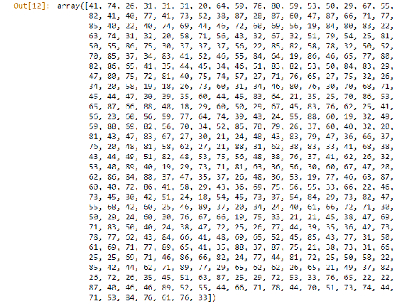

确保你选择了那个代码块，然后你可以点击播放按钮来执行它。

在这种情况下，众数最终是数字`29`，出现了`14`次。

```py
Out[11]: ModeResult(mode=array([29]), count=array([14])) 

```

所以，这是一个非常简单的概念。你可以再做几次，只是为了好玩。这有点像转动轮盘。我们将再次创建一个新的分布。

就是这样，均值、中位数和众数就是这样。使用 SciPy 和 NumPy 包非常简单。

# 一些练习

我将在本节中给你一个小作业。如果你打开`MeanMedianExercise.ipynb`文件，里面有一些你可以玩的东西。我希望你能动手尝试一下。

在文件中，我们有一些随机的电子商务数据。这些数据代表的是每笔交易的总金额，就像我们之前的例子一样，这只是一组数据的正态分布。我们可以运行它，你的作业是使用 NumPy 包找出这些数据的平均值和中位数。这几乎是你能想象到的最简单的作业。你需要的所有技巧都在我们之前使用的`MeanMedianMode.ipynb`文件中。

这里的重点并不是真的要挑战你，而是让你真正写一些 Python 代码，并让自己相信你实际上可以得到一个结果并让事情发生。所以，继续玩吧。如果你想再玩一会儿，可以随意玩一下这里的数据分布，看看你对数字有什么影响。尝试添加一些异常值，就像我们在收入数据中所做的那样。这是学习这些东西的方法：掌握基础知识，高级知识就会随之而来。尽情享受吧。

一旦你准备好了，让我们继续前进到我们的下一个概念，标准差和方差。

# 标准差和方差

让我们谈谈标准差和方差。这些概念和术语你可能以前听过，但让我们更深入地了解一下它们的真正含义以及如何计算它们。这是数据分布的分散程度的一种度量，几分钟后你就会更清楚了。

标准差和方差是数据分布的两个基本量，你将在本书中一遍又一遍地看到它们。所以，如果你需要温习一下，让我们看看它们是什么。

# 方差

让我们来看一个直方图，因为方差和标准差都与数据的分散程度、数据集的分布形状有关。看一下下面的直方图：

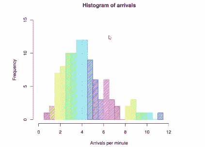

假设我们有一些关于飞机在机场到达频率的数据，例如，这个直方图表明我们大约每分钟有 4 次到达，我们观察到的数据中大约有 12 天出现了这种情况。然而，我们也有一些异常值。有一天到达速度非常慢，每分钟只有一次到达，还有一天到达速度非常快，几乎每分钟有 12 次到达。因此，读取直方图的方法是查找给定值的桶，并告诉您该值在数据中出现的频率，直方图的形状可以告诉您很多关于给定数据集的概率分布的信息。

我们从这些数据中知道，我们的机场很可能每分钟有大约 4 次到达，但很不可能有 1 次或 12 次到达，我们还可以具体讨论中间所有数字的概率。因此，不仅每分钟有 12 次到达的可能性很小，每分钟有 9 次到达的可能性也很小，但一旦我们开始接近 8 左右，事情就开始有点起色了。从直方图中可以得到很多信息。

方差衡量数据的*分散程度*。

# 测量方差

我们通常将方差称为 sigma 平方，你马上就会知道为什么，但现在，只需知道方差是平均值与平方差的差值。

1.  要计算数据集的方差，首先要找出它的平均值。假设我有一些数据，可以代表任何东西。比如说某个小时排队的最大人数。在第一个小时，我观察到有 1 个人在排队，然后是 4 个，然后是 5 个，然后是 4 个，然后是 8 个。

1.  计算方差的第一步就是找到这些数据的均值或平均值。我把它们全部加起来，将总和除以数据点的数量，结果是 4.4，这是排队人数的平均数*(1+4+5+4+8)/5=4.4*。

1.  现在下一步是找到每个数据点与均值的差异。我知道均值是 4.4。所以对于我的第一个数据点，我有 1，所以*1-4.4=-3.4*，下一个数据点是 4，所以 4-4.4=-0.4*4-4.4=-0.4*，依此类推。所以我得到这些正负数，代表每个数据点与均值的方差*(-3.4，-0.4，0.6，-0.4，3.6)*。

1.  现在我需要一个单一的数字来代表整个数据集的方差。因此，我接下来要做的是找到这些差异的平方。我将逐个计算这些与均值的原始差异的平方。这是出于几个不同的原因：

+   +   首先，我要确保负方差和正方差一样重要。否则，它们将互相抵消。那就不好了。

+   其次，我还想给异常值更多的权重，因此这会放大与均值非常不同的事物的影响，同时确保负数和正数是可比较的*(11.56，0.16，0.36，0.16，12.96)*。

让我们看看那里发生了什么，所以(-3.4)²是一个正数 11.56，(-0.4)²最终是一个更小的数字，即 0.16，因为它更接近均值 4.4。同样(0.6)²结果接近均值，只有 0.36。但是当我们到达正的异常值时，(3.6)²最终是 12.96。这给了我们：*(11.56，0.16，0.36，0.16，12.96)*。

要找到实际的方差值，我们只需取所有这些平方差的平均值。因此，我们将所有这些平方差相加，将总和除以 5，也就是我们拥有的值的数量，最终得到方差为 5.04。

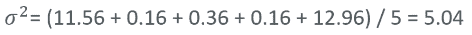

好的，这就是方差的全部内容。

# 标准差

通常，我们谈论标准差比方差更多，结果标准差只是方差的平方根。就是这么简单。

因此，如果我有这个方差*5.04*，标准差就是*2.24*。所以你现在明白为什么我们说方差=(σ)²。因为σ本身代表标准差。因此，如果我取(σ)²的平方根，我得到σ。在这个例子中，结果是 2.24。

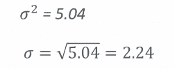

# 使用标准差识别异常值

这是我们在前面的示例中查看的实际数据的直方图，用于计算方差。

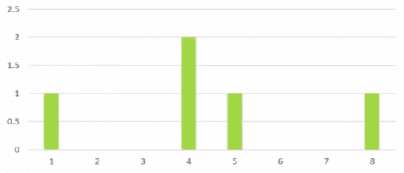

现在我们看到数字**4**在我们的数据集中出现了两次，然后我们有一个**1**，一个**5**，和一个**8**。

标准差通常用作一种思考如何识别数据集中的异常值的方法。如果我说如果我在均值 4.4 的标准差内，那在正态分布中被认为是一种典型值。然而，你可以看到在前面的图表中，数字**1**和**8**实际上位于该范围之外。因此，如果我取 4.4 加减 2.24，我们得到大约**7**和**2**，而**1**和**8**都落在标准差范围之外。因此我们可以数学上说，1 和 8 是异常值。我们不必猜测和凭眼测量。现在仍然需要判断一个数据点与均值相比是多少标准差的异常值。

通常可以通过一个数据点与均值相差多少标准差（有时也可以是多少西格玛）来谈论一个数据点有多少异常值。

这就是标准差在现实世界中使用的一些情况。

# 总体方差与样本方差

标准差和方差有一点微妙之处，就是当你谈论总体与样本方差时。如果你在处理完整的数据集，一组完整的观察数据，那么你就按照我告诉你的做。你只需取平均值，从均值开始所有平方差的平均值就是你的方差。

然而，如果你在对数据进行抽样，也就是说，如果你只是取数据的一个子集来简化计算，你就要做一些不同的事情。你不是除以样本数，而是除以样本数减 1。让我们看一个例子。

我们将使用刚刚研究的排队人员的样本数据。我们将平方差的总和除以 5，也就是我们有的数据点的数量，得到 5.04。

*σ² = (11.56 + 0.16 + 0.36 + 0.16 + 12.96) / 5 = 5.04*

如果我们看样本方差，用 S²表示，它是由平方差的总和除以 4 得到的，也就是*(n - 1)*。这给我们了样本方差，结果是 6.3。

*S² = (11.56 + 0.16 + 0.36 + 0.16 + 12.96) / 4 = 6.3*

所以，如果这是我们从一个更大的数据集中取出的样本，那就是你要做的。如果这是一个完整的数据集，你就除以实际的数量。好的，这就是我们计算总体和样本方差的方法，但背后的实际逻辑是什么呢？

# 数学解释

至于为什么总体和样本方差之间有差异，这涉及到概率的一些非常奇怪的东西，你可能不想太多地去思考，而且需要一些复杂的数学符号，我尽量避免在这本书中使用符号，因为我认为概念更重要，但这是非常基础的东西，你会一遍又一遍地看到它。

正如我们所见，总体方差通常被表示为 sigma squared (σ²)，其中 sigma (σ)是标准差，我们可以说这是每个数据点 X 减去均值 mu 的平方的总和，这是每个样本平方的方差除以数据点的数量 N，我们可以用以下方程表示：

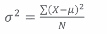

+   X 表示每个数据点

+   µ表示均值

+   N 表示数据点的数量

样本方差同样被表示为 S²，用以下方程表示：

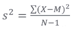

+   X 表示每个数据点

+   M 表示均值

+   N-1 表示数据点的数量减 1

就是这样。

# 在直方图上分析标准差和方差

让我们在这里写一些代码，玩一些标准差和方差。所以如果你打开`StdDevVariance.ipynb`文件的 IPython 笔记本，并跟着我一起做。请这样做，因为最后有一个我想让你尝试的活动。我们要做的就像前面的例子一样，从以下代码开始：

```py
%matplotlib inline 
import numpy as np 
import matplotlib.pyplot as plt 
incomes = np.random.normal(100.0, 20.0, 10000) 
plt.hist(incomes, 50) 
plt.show() 

```

我们使用`matplotlib`来绘制一些正态分布的随机数据的直方图，并将其命名为`incomes`。我们说它将以`100`为中心（希望这是小时工资之类的，而不是年薪，或者其他奇怪的单位），标准差为`20`，有`10,000`个数据点。

让我们继续执行上面的代码块，并按照下图所示绘制出来：

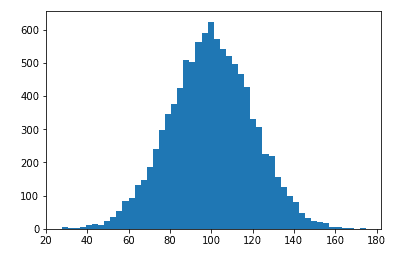

我们有 10,000 个以 100 为中心的数据点。通过正态分布和标准差为 20，这是数据的扩展度量，你可以看到最常见的情况是在 100 左右，随着我们离这个点越来越远，事情变得越来越不太可能。我们指定的标准差点 20 在 80 左右和 120 左右。你可以在直方图中看到，这是事情开始急剧下降的点，所以我们可以说在那个标准差边界之外的事情是不寻常的。

# 使用 Python 计算标准差和方差

现在，NumPy 也使计算标准差和方差变得非常容易。如果你想计算我们生成的数据集的实际标准差，你只需在数据集本身上调用`std`函数。因此，当 NumPy 创建列表时，它不仅仅是一个普通的 Python 列表，它实际上附加了一些额外的东西，所以你可以在上面调用函数，比如标准差的`std`。现在让我们来做一下：

```py
incomes.std() 

```

这给我们一些类似以下输出（记住我们使用了随机数据，所以你的图形可能与我的不完全相同）：

```py
20.024538249134373 

```

当我们执行时，得到的数字非常接近 20，因为这是我们在创建随机数据时指定的。我们想要一个标准差为 20。果然，20.02，非常接近。

方差只是一个调用`var`的问题。

```py
incomes.var() 

```

这给了我以下结果：

```py
400.98213209104557 

```

结果非常接近 400，这是 20²。对，世界是有道理的！标准差只是方差的平方根，或者你可以说方差是标准差的平方。果然，这是成立的，所以世界是按照应有的方式运行的。

# 自己试试

我希望你能深入研究并实际尝试一下，让它变得真实，尝试使用不同的参数来生成正态数据。记住，这是对数据分布形状的度量，所以如果我改变中心点会发生什么？这重要吗？它实际上会影响形状吗？为什么不试一下，找出答案呢？

尝试改变我们指定的实际标准差，看看对图形形状有什么影响。也许尝试一个标准差为 30，然后你知道，你可以看看它实际上如何影响事物。让我们更夸张一点，比如 50。试试 50。你会看到图形开始变得有点胖。尝试不同的值，感受一下这些值是如何起作用的。这是真正获得标准差和方差直观感觉的唯一方法。尝试一些不同的例子，看看它的影响。

这就是实践中的标准差和方差。你已经亲自体验了一些，我希望你能稍微玩弄一下，以便更熟悉。这些是非常重要的概念，我们将在整本书中经常谈论标准差，毫无疑问，在你的数据科学职业生涯中也会经常谈论，所以确保你已经掌握了这些。让我们继续。

# 概率密度函数和概率质量函数

因此，我们已经在本书的一些例子中看到了正态分布函数。这是概率密度函数的一个例子，还有其他类型的概率密度函数。所以让我们深入了解一下，看看它实际上意味着什么，还有一些其他例子。

# 概率密度函数和概率质量函数

我们已经在本书中看到了一些正态分布函数的例子。这是概率密度函数的一个例子，还有其他类型的概率密度函数。让我们深入了解一下，看看这实际上意味着什么，还有一些其他例子。

# 概率密度函数

让我们谈谈概率密度函数，我们在书中已经使用过其中之一。我们只是没有这样称呼它。让我们正式化一些我们谈论过的东西。例如，我们已经多次看到正态分布，这是概率密度函数的一个例子。以下图是正态分布曲线的一个例子

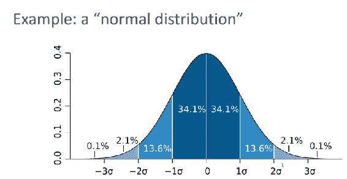

在概念上，试图将这个图形看作给定值发生的概率是很容易的，但是当你谈论连续数据时，这有点误导。因为在连续数据分布中，实际可能的数据点有无限多个。可能是 0 或 0.001 或 0.00001，所以一个非常具体的值发生的实际概率是非常非常小的，无限小。概率密度函数实际上告诉了给定值范围发生的概率。所以这就是你必须考虑的方式。

例如，在上图中显示的正态分布中，均值（**0**）和均值的一个标准差（**1σ**）之间，有 34.1%的机会出现在这个范围内。你可以收紧或扩展这个范围，找出实际值，但这就是概率密度函数的思考方式。对于给定值范围，它给出了发生该范围的概率的方法。

+   你可以看到在图中，当你接近均值（**0**）时，在一个标准差（**-1σ**和**1σ**）内，你很可能会落在这个范围内。我的意思是，如果你把 34.1 和 34.1 相加，等于 68.2%，你就得到了落在均值一个标准差范围内的概率。

+   然而，当你处于两个到三个标准差之间（**-3σ**到**-2σ**和**2σ**到**3σ**），我们只剩下略微超过 4%（确切地说是 4.2%）。

+   当你超出三个标准差（**-3σ**和**3σ**）时，概率远远小于 1%。

因此，图表只是一种可视化和讨论给定数据点发生概率的方式。再次强调，概率分布函数给出了数据点落在给定值范围内的概率，正态函数只是概率密度函数的一个例子。我们稍后会看一些更多的例子。

# 概率质量函数

现在，当你处理离散数据时，关于有无限多个可能值的微妙之处就消失了，我们称之为另一种东西。这就是概率质量函数。如果你处理离散数据，你可以谈论概率质量函数。这里有一个图表来帮助可视化这一点：

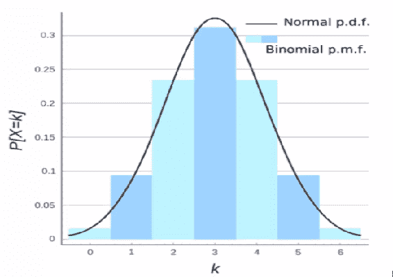

例如，你可以在图中显示连续数据的正态概率密度函数，但如果我们将其量化为离散数据集，就像我们在直方图中所做的那样，我们可以说数字 3 出现了一定次数，你实际上可以说数字 3 有超过 30%的机会出现。因此，概率质量函数是我们可视化离散数据发生概率的方式，它看起来很像直方图，因为它基本上就是一个直方图。

术语差异：概率密度函数是描述连续数据发生范围的实心曲线。概率质量函数是数据集中给定离散值发生的概率。

# 数据分布类型

让我们看一些概率分布函数和数据分布的真实例子，更全面地理解数据分布以及如何在 Python 中可视化和使用它们。

继续打开书中的`Distributions.ipynb`，如果你愿意，你可以跟着我一起学习。

# 均匀分布

让我们从一个非常简单的例子开始：均匀分布。均匀分布意味着在给定范围内，一个值发生的概率是平坦的常数。

```py
import numpy as np 
Import matplotlib.pyplot as plt 

values = np.random.uniform(-10.0, 10.0, 100000) 
plt.hist(values, 50) 
plt.show() 

```

所以我们可以使用 NumPy 的`random.uniform`函数创建一个均匀分布。前面的代码表示，我想要一个在`-10`和`10`之间范围的均匀分布的随机值，并且我想要`100000`个。如果我然后创建这些值的直方图，你会看到它看起来像下面这样。

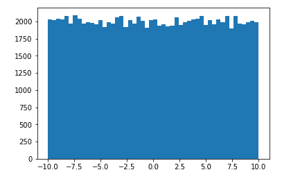

在这些数据中，任何给定值或值范围发生的概率几乎是相等的。因此，与正态分布不同，我们在均匀分布中看到的是在你定义的范围内任何给定值都有相等的概率。

那么这个的概率分布函数会是什么样子呢？嗯，我期望在**-10**或**10**之外基本上看不到任何东西。但当我在**-10**和**10**之间时，我会看到一条平直的线，因为任何一个这些值范围发生的概率是恒定的。因此在均匀分布中，你会看到概率分布函数上的一条平直线，因为每个值，每个值范围出现的概率都是相等的。

# 正态或高斯分布

现在我们已经在本书中看到了正态分布，也称为高斯分布函数。你实际上可以在 Python 中可视化这些。`scipy.stats.norm`包函数中有一个名为`pdf`（概率密度函数）的函数。

所以，让我们看下面的例子：

```py
from scipy.stats import norm 
import matplotlib.pyplot as plt 

x = np.arange(-3, 3, 0.001) 
plt.plot(x, norm.pdf(x)) 

```

在上面的例子中，我们通过使用`arange`函数创建了一个在-3 和 3 之间以 0.001 为间隔的 x 值列表用于绘图。所以这些是图表上的 x 值，我们将使用这些值绘制*x*轴。*y*轴将是正态函数`norm.pdf`，即正态分布的概率密度函数，对这些 x 值。我们得到了下面的输出：

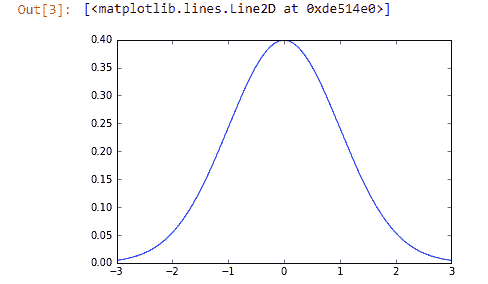

正态分布的概率密度函数看起来就像我们上一节中的样子，也就是说，对于我们提供的给定数字，0 代表均值，而数字**-3**、**-2**、**-1**、**1**、**2**和**3**代表标准差。

现在，我们将使用正态分布生成随机数。我们已经做过几次了；把它当作一个复习。参考下面的代码块：

```py
import numpy as np 
import matplotlib.pyplot as plt 

mu = 5.0 
sigma = 2.0 
values = np.random.normal(mu, sigma, 10000) 
plt.hist(values, 50) 
plt.show() 

```

在上面的代码中，我们使用了 NumPy 包的`random.normal`函数，第一个参数`mu`代表你想要将数据围绕其均值中心化的均值。`sigma`是数据的标准差，基本上是数据的扩散。然后，我们使用正态概率分布函数指定我们想要的数据点的数量，这里是`10000`。这是使用概率分布函数的一种方式，在这种情况下是正态分布函数，用来生成一组随机数据。然后我们可以绘制一个直方图，分成`50`个桶并显示出来。下面的输出就是我们得到的结果：

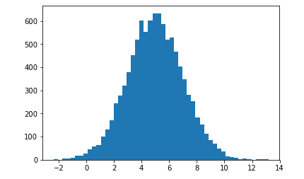

它看起来更像是一个正态分布，但由于有一个随机元素，它不会是一个完美的曲线。我们在谈论概率；有一些事情不太可能是我们期望的样子。

# 指数概率分布或幂律

你经常看到的另一个分布函数是指数概率分布函数，其中事物以指数方式下降。

当你谈论指数下降时，你期望看到一个曲线，在接近零时很可能发生某些事情，但随着你离开它越远，它会迅速下降。自然界中有很多事物都是以这种方式行为的。

在 Python 中，就像我们在`scipy.stats`中有一个`norm.pdf`函数一样，我们也有一个`expon.pdf`，或者指数概率分布函数来做这个。在 Python 中，我们可以使用与正态分布相同的语法来处理指数分布，如下面的代码块所示：

```py
from scipy.stats import expon 
import matplotlib.pyplot as plt 

x = np.arange(0, 10, 0.001) 
plt.plot(x, expon.pdf(x)) 

```

所以在上面的代码中，我们只是使用 NumPy 的`arange`函数创建我们的 x 值，以便在`0`到`10`之间创建一堆值，步长为`0.001`。然后，我们将这些 x 值绘制在 y 轴上，y 轴定义为函数`expon.pdf(x)`。输出看起来像是指数下降。如下截图所示：

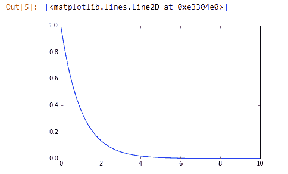

# 二项概率质量函数

我们也可以可视化概率质量函数。这被称为二项概率质量函数。我们将使用与之前相同的语法，如下面的代码所示：

```py
from scipy.stats import expon 
import matplotlib.pyplot as plt 

x = np.arange(0, 10, 0.001) 
plt.plot(x, expon.pdf(x)) 

```

所以我们不再使用`expon`或`norm`，而是使用`binom`。提醒一下：概率质量函数处理离散数据。实际上，一直以来我们一直在处理离散数据，只是你要如何思考它。

回到我们的代码，我们正在创建一些在`0`到`10`之间的离散`x`值，间隔为`0.01`，并且我要绘制一个使用这些数据的二项概率质量函数。使用`binom.pmf`函数，我实际上可以使用两个形状参数`n`和`p`来指定数据的形状。在这种情况下，它们分别是`10`和`0.5`。输出如下图所示：

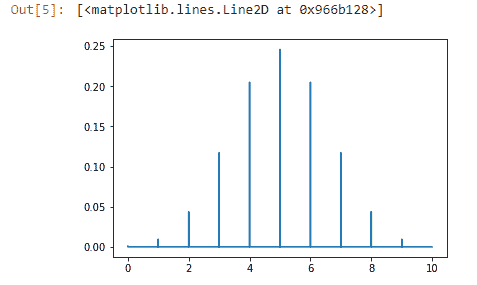

如果你想尝试不同的值来看看它的影响，这是一个直观了解这些形状参数如何影响概率质量函数的好方法。

# 泊松概率质量函数

最后，你可能听说的另一个分布函数是泊松概率质量函数，它有一个非常特定的应用。它看起来很像正态分布，但有点不同。

这里的想法是，如果你有关于在给定时间段内发生的事情的平均数量的一些信息，这个概率质量函数可以让你预测在未来的某一天获得其他值的几率。

举个例子，假设我有一个网站，平均每天有 500 位访客。我可以使用泊松概率质量函数来估计在特定一天看到其他数值的概率。例如，以我平均每天 500 位访客为例，看到在某一天有 550 位访客的几率是多少？这就是泊松概率质量函数可以给你的，看看下面的代码：

```py
from scipy.stats import poisson 
import matplotlib.pyplot as plt 

mu = 500 
x = np.arange(400, 600, 0.5) 
plt.plot(x, poisson.pmf(x, mu)) 

```

在这个代码示例中，我说我的平均值是 500 mu。我将设置一些 x 值，范围在`400`到`600`之间，间隔为`0.5`。我将使用`poisson.pmf`函数来绘制图表。我可以使用该图表来查找在正态分布情况下获得任何特定值的几率：

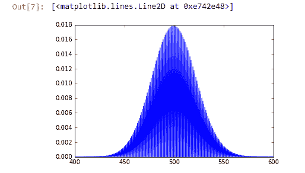

在特定一天看到 550 位访客的几率，结果是大约 0.002 或 0.2%的概率。非常有趣。

好的，这些是你在现实世界中可能遇到的一些常见数据分布。

记住，我们使用概率分布函数处理连续数据，但当我们处理离散数据时，我们使用概率质量函数。

所以这就是概率密度函数和概率质量函数。基本上，这是一种可视化和测量数据集中出现的一定范围数值的实际机会的方法。这是非常重要的信息，也是非常重要的理解的事情。我们将一遍又一遍地使用这个概念。好的，让我们继续。

# 百分位数和矩

接下来，我们将讨论百分位数和矩。你经常在新闻中听到百分位数。收入排在前 1%的人：这是百分位数的一个例子。我们将解释这一点，并举一些例子。然后，我们将讨论矩，这是一个非常复杂的数学概念，但事实证明，在概念上非常容易理解。让我们深入讨论百分位数和矩，这是统计学中的一些基本概念，但是，我们正在逐步解决困难的问题，所以请耐心等待我们复习一些内容。

# 百分位数

让我们看看百分位数的意思。基本上，如果你要对数据集中的所有数据进行排序，给定的百分位数是数据小于你所在位置的百分比。

一个常见的例子是收入分布。当我们谈论第 99 百分位数，或者百分之一的人，想象一下，你要把这个国家，这里是美国，所有人的收入按收入排序。第 99 百分位数将是收入的金额，99%的人收入低于这个金额。这是一个非常容易理解的方法。

在数据集中，百分位数是数值小于该点的值的*x%*。

下图是收入分布的一个例子：

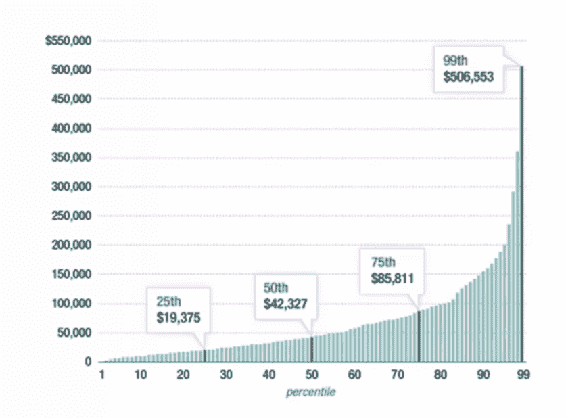

上图显示了一个收入分布数据的例子。例如，在第 99 百分位数，我们可以说 99%的数据点，代表美国人，年收入低于 50,6553 美元，而 1%的人年收入高于这个数。相反，如果你是百分之一的人，你的年收入超过 50,6553 美元。恭喜！但如果你是一个更典型的中位数人，第 50 百分位数定义了一半的人收入低于你，一半的人收入高于你，这就是中位数的定义。第 50 百分位数和中位数是一回事，在这个数据集中是 42,327 美元。所以，如果你在美国年收入 42,327 美元，你的收入正好是全国的中位数。

你可以从上面的图表中看到收入分布的问题。事物往往非常集中在图表的高端，这是目前在国家中一个非常大的政治问题。我们将看看发生了什么，但这超出了本书的范围。这就是百分位数的要点。

# 四分位数

百分位数也用于讨论分布中的四分位数。让我们看一个正态分布，以更好地理解这一点。

这是一个例子，说明正态分布中的百分位数：

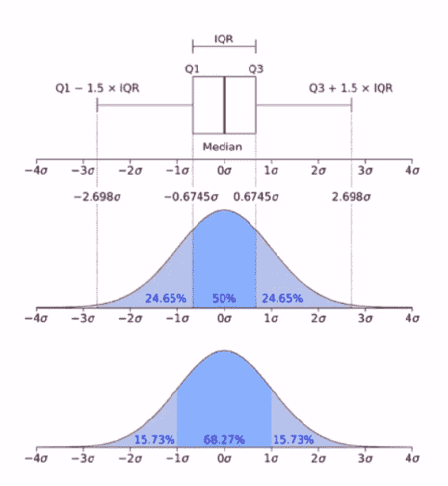

看看上图中的正态分布，我们可以谈论四分位数。中间的四分位数 1（Q1）和四分位数 3（Q3）只是包含 50%数据的点，所以 25%在中位数的左侧，25%在中位数的右侧。

在这个例子中，中位数恰好接近平均值。例如，**四分位距**（**IQR**），当我们谈论一个分布时，是分布中包含 50%数值的中间区域。

图像的最上部是我们所谓的箱线图的一个例子。暂时不要担心箱子边缘的东西。那有点混乱，我们稍后会讨论。即使它们被称为四分位数 1（Q1）和四分位数 3（Q1），它们并不真正代表 25%的数据，但暂时不要纠结在这一点上。重点是中间的四分位数代表数据分布的 25%。

# 在 Python 中计算百分位数

让我们看一些使用 Python 的百分位数的更多例子，并更深入地理解它。如果你愿意跟着做，可以打开`Percentiles.ipynb`文件，我鼓励你这样做，因为我希望你稍后能够玩一下这个。

让我们首先生成一些随机分布的正态数据，或者说是正态分布的随机数据，请参考以下代码块：

```py
%matplotlib inline 
import numpy as np 
import matplotlib.pyplot as plt 

vals = np.random.normal(0, 0.5, 10000) 

plt.hist(vals, 50) 
plt.show() 

```

在这个例子中，我们要做的是生成一些以零为中心的数据，也就是均值为零，标准差为`0.5`，我将用这个分布生成`10000`个数据点。然后，我们将绘制一个直方图，看看我们得到了什么。

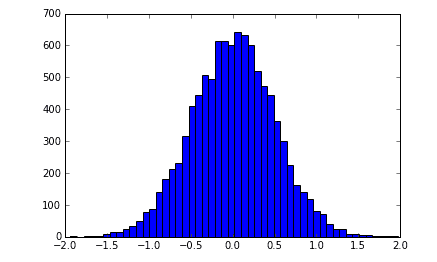

生成的直方图看起来非常像正态分布，但由于存在随机因素，我们在这个例子中有一个偏离值接近-2。在均值处有一点点的倾斜，一点点的随机变化使事情变得有趣。

NumPy 提供了一个非常方便的百分位数函数，可以为您计算这个分布的百分位数值。因此，我们使用`np.random.normal`创建了我们的`vals`数据列表，我可以调用`np.percentile`函数来计算第 50 个百分位数值，使用以下代码：

```py
np.percentile(vals, 50) 

```

以下是前面代码的输出：

```py
0.0053397035195310248

```

输出结果为 0.005。所以记住，第 50 个百分位数其实就是中位数的另一个名称，而在这个数据中，中位数非常接近零。你可以在图表中看到我们稍微向右倾斜，所以这并不太令人惊讶。

我想计算第 90 个百分位数，这将给我一个数，这个数小于它的值占总数的 90%。我们可以很容易地用以下代码来实现：

```py
np.percentile(vals, 90) 

```

以下是该代码的输出：

```py
Out[4]: 0.64099069837340827 

```

这些数据的第 90 个百分位数值是 0.64，所以大约在这里，基本上，在这个值以下的数据不到 90%。我可以相信这个结果。10%的数据大于 0.64，90%的数据小于 0.65。

让我们计算第 20 个百分位数值，这将给我一个数，这个数小于它的值占总数的 20%。同样，我们只需要对代码进行一个非常简单的修改：

```py
np.percentile(vals, 20) 

```

这给出了以下输出：

```py
Out[5]:-0.41810340026619164 

```

第 20 个百分位数值大约是-0.4，我相信这个结果。它表示 20%的数据位于-0.4 的左侧，相反，80%的数据大于-0.4。

如果你想了解数据集中的分界点在哪里，百分位数函数是一个简单的方法来计算它们。如果这是一个代表收入分布的数据集，我们可以调用`np.percentile(vals, 99)`来计算第 99 个百分位数。你可以找出人们一直在谈论的那些百分之一的人到底是谁，以及你是否是其中之一。

好了，现在让我们动手。我希望你能玩弄这些数据。这是一个 IPython Notebook，所以你可以随意修改它，尝试不同的标准差值，看看它对数据形状和百分位数的影响，例如。尝试使用更小的数据集大小，并在其中增加一点随机变化。只要熟悉一下，玩弄一下，你会发现你实际上可以做这些事情，并编写一些真正有效的代码。

# 矩

接下来，让我们谈谈矩。矩是一个花哨的数学术语，但实际上你并不需要数学学位来理解它。直观地说，它比听起来要简单得多。

这是统计学和数据科学领域的一个例子，人们喜欢使用大而花哨的术语来使自己听起来很聪明，但实际上这些概念非常容易理解，这也是你将在本书中一再听到的主题。

基本上，时刻是衡量数据分布形状的方式，概率密度函数的方式，或者任何东西的方式。从数学上讲，我们有一些非常花哨的符号来定义它们：

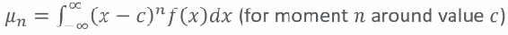

如果你懂微积分，实际上这并不是一个很复杂的概念。我们正在计算每个值与某个值的差的 n 次方，其中 n 是时刻数，并在整个函数从负无穷到正无穷的范围内进行积分。但直观上，它比微积分容易得多。

时刻可以被定义为概率密度函数形状的定量度量。

准备好了吗？我们开始吧！

1.  第一时刻实际上就是你所看到的数据的平均值。就是这样。第一时刻就是平均值，就是平均数。就是这么简单。

1.  第二时刻是方差。就是这样。数据集的第二时刻就是方差值。这些东西似乎自然而然地从数学中产生出来有点吓人，但是想一想。方差实际上是基于与平均值的差的平方，所以找到一个数学方式来说方差与平均值相关并不是那么难以理解，对吧。就是这么简单。

1.  现在当我们到达第三和第四时刻时，事情变得有点棘手，但它们仍然是容易理解的概念。第三时刻被称为偏度，它基本上是一个度量分布有多倾斜的度量。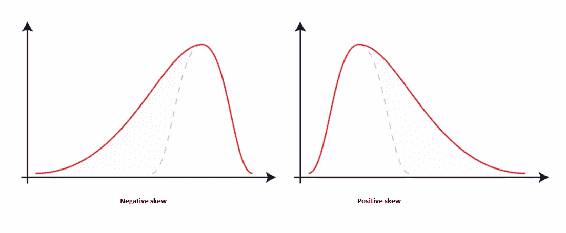

+   你可以在上面的这两个例子中看到，如果我左边有一个更长的尾部，那么这是一个负偏态，如果我右边有一个更长的尾部，那么这是一个正偏态。虚线显示了没有偏态的正态分布的形状。在左边的虚线上，我最终得到了一个负偏态，或者在另一边，这个例子中的正偏态。好的，这就是偏态。基本上就是拉长一侧的尾部，它是一个度量数据分布有多倾斜的度量。

1.  第四时刻被称为峰度。哇，这是一个花哨的词！实际上，它就是尾部有多厚，峰有多尖。所以，它是数据分布形状的一种度量。这里有一个例子：

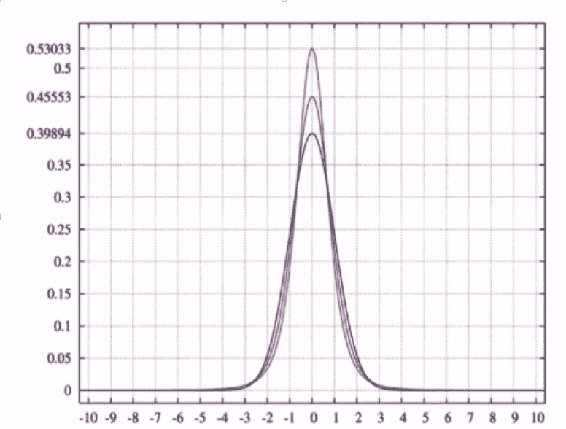

+   你可以看到更高的峰值具有更高的峰度值。最顶部的曲线比最底部的曲线具有更高的峰度。这是一个非常微妙的差异，但仍然是一个差异。它基本上衡量了你的数据有多尖。

让我们回顾一下：第一时刻是平均值，第二时刻是方差，第三时刻是偏度，第四时刻是峰度。我们已经知道平均值和方差是什么。偏度是数据有多倾斜，一个尾部有多伸展。峰度是数据分布有多尖，有多挤在一起。

# 在 Python 中计算时刻

让我们在 Python 中玩耍并实际计算这些时刻，看看你如何做到这一点。要玩弄这个，请打开`Moments.ipynb`，你可以跟着我在这里一起进行。

让我们再次创建相同的随机数据的正态分布。再次，我们将使其以零为中心，标准差为 0.5，有 10,000 个数据点，并绘制出来：

```py
import numpy as np 
import matplotlib.pyplot as plt 

vals = np.random.normal(0, 0.5, 10000) 

plt.hist(vals, 50) 
plt.show() 

```

所以，我们再次得到一个围绕零的正态分布的随机生成的数据集。

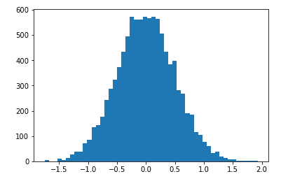

现在，我们找到了平均值和方差。我们以前做过这个；NumPy 只是给你一个`mean`和`var`函数来计算。所以，我们只需调用`np.mean`来找到第一时刻，这只是一个对平均值的花哨的说法，如下面的代码所示：

```py
np.mean(vals)

```

这是我们示例中的输出：

```py
Out [2]:-0.0012769999428169742

```

结果非常接近零，就像我们期望的那样，对于以零为中心的正态分布的数据。到目前为止，世界是有道理的。

现在我们找到了第二个矩，这只是方差的另一个名称。我们可以用以下代码来做到这一点，就像我们之前看到的那样：

```py
np.var(vals)

```

提供以下输出：

```py
Out[3]:0.25221246428323563

```

结果约为 0.25，这再次符合一个很好的检查。记住标准差是方差的平方根。如果你对 0.25 取平方根，结果是 0.5，这是我们在创建这个数据时指定的标准差，所以这也是正确的。

第三个矩是偏度，为了做到这一点，我们需要使用 SciPy 包而不是 NumPy。但这又是内置在任何科学计算包中的，比如 Enthought Canopy 或 Anaconda。一旦我们有了 SciPy，函数调用就像我们之前的两个一样简单：

```py
import scipy.stats as sp
sp.skew(vals)

```

这显示了以下输出：

```py
Out[4]: 0.020055795996111746

```

我们可以在`vals`列表上调用`sp.skew`，这将给我们一个偏度值。由于这是以零为中心的，它应该几乎没有偏度。结果是，随机变化确实有一点向左偏，实际上这与我们在图表中看到的形状是一致的。看起来我们确实把它拉向了负数。

第四个矩是峰度，描述了尾部的形状。同样，对于正态分布，这个值应该约为零。SciPy 为我们提供了另一个简单的函数调用

```py
sp.kurtosis(vals)

```

以下是输出：

```py
Out [5]:0.059954502386585506

```

事实上，结果确实是零。峰度以两种相关的方式显示我们的数据分布：尾部的形状，或者峰值有多尖。如果我把尾部压扁，峰值就会变得更尖，同样，如果我把分布压下去，你可以想象这样会把事情扩散开一点，使尾部变得更厚，峰值变得更低。这就是峰度的意思，在这个例子中，峰度接近零，因为它只是一个普通的正态分布。

如果你想玩一下，继续，再试着修改分布。使它以 0 以外的某个值为中心，看看是否真的会改变什么。应该吗？嗯，实际上不应该，因为这些都是关于分布形状的度量，它并不真的说出这个分布究竟在哪里。这是对形状的度量。这就是矩的全部意义。继续玩，尝试不同的中心值，尝试不同的标准差值，看看它对这些值有什么影响，它并没有改变。当然，你会期望像均值这样的东西会改变，因为你改变了均值，但方差、偏度，也许不会。玩一下，找出来。

这里有百分位数和矩。百分位数是一个相当简单的概念。矩听起来很难，但实际上很容易理解如何做，而且在 Python 中也很容易。现在你已经掌握了这个。是时候继续前进了。

# 总结

在本章中，我们看到了你可能会遇到的数据类型（数值、分类和有序数据），以及如何对它们进行分类，以及根据你处理的数据类型的不同对待它们。我们还介绍了统计概念的均值、中位数和众数，我们也看到了在中位数和均值之间进行选择的重要性，通常中位数比均值更好，因为存在离群值。

接下来，我们分析了如何在 IPython Notebook 文件中使用 Python 计算均值、中位数和众数。我们深入了解了标准差和方差的概念以及如何在 Python 中计算它们。我们看到它们是数据分布的扩展度量。我们还看到了一种可视化和测量数据集中给定范围的值发生的实际机会的方法，使用概率密度函数和概率质量函数。

我们总体上看了数据分布的类型（均匀分布、正态或高斯分布、指数概率分布、二项概率质量函数、泊松概率质量函数）以及如何使用 Python 对其进行可视化。我们分析了百分位数和矩的概念，并看到如何使用 Python 计算它们。

在下一章中，我们将更深入地研究使用`matplotlib`库，并深入探讨协方差和相关性等更高级的主题。
