# 第三章：Matplotlib 和高级概率概念

在上一章中，我们已经介绍了一些统计学和概率的简单概念，现在我们将把注意力转向一些更高级的主题，这些主题是你需要熟悉的，以便充分利用本书的剩余部分。别担心，它们并不太复杂。首先，让我们来玩一玩，看看`matplotlib`库的一些惊人的绘图能力。

在本章中，我们将涵盖以下主题：

+   使用`matplotlib`包绘制图表

+   理解协方差和相关性以确定数据之间的关系

+   理解条件概率及其示例

+   理解贝叶斯定理及其重要性

# Matplotlib 的速成课程

你的数据只有你能向他人呈现得好，所以让我们谈谈如何绘制和展示你的数据，以及如何向他人呈现你的图表并使其看起来漂亮。我们将更全面地介绍 Matplotlib，并对其进行全面测试。

我会向你展示一些技巧，让你的图表尽可能漂亮。让我们用图表玩一玩。将你的工作做成漂亮的图片总是很好的。这将为你提供更多的工具，用不同类型的图表来可视化不同类型的数据，并使其看起来漂亮。我们将使用不同的颜色、不同的线条样式、不同的坐标轴等等。重要的不仅是使用图表和数据可视化来尝试在数据中找到有趣的模式，而且还要有趣地向非技术人员展示你的发现。话不多说，让我们开始学习 Matplotlib 吧。

继续打开`MatPlotLib.ipynb`文件，你可以和我一起玩弄这些东西。我们将从绘制一个简单的折线图开始。

```py
%matplotlib inline 

from scipy.stats import norm 
import matplotlib.pyplot as plt 
import numpy as np 

x = np.arange(-3, 3, 0.001) 

plt.plot(x, norm.pdf(x)) 
plt.show() 

```

所以在这个例子中，我导入`matplotlib.pyplot`作为`plt`，然后我们可以在笔记本中从现在开始将其称为`plt`。然后，我使用`np.arange(-3, 3, 0.001)`创建一个 x 轴，其中填充了在`-3`和`3`之间以 0.001 增量的值，并使用`pyplot`的`plot()`函数来绘制`x`。y 函数将是`norm.pdf(x)`。所以我将根据`x`值创建一个正态分布的概率密度函数，并使用`scipy.stats norm`包来实现。

所以将其与上一章关于概率密度函数的内容联系起来，这里我们使用`matplotlib`绘制正态概率密度函数。我们只需调用`pyplot`的`plot()`方法来设置我们的图表，然后使用`plt.show()`显示它。当我们运行前面的代码时，我们得到以下输出：

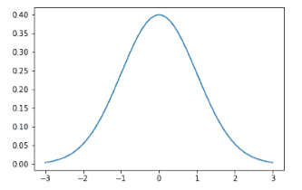

这就是我们得到的：一个漂亮的小图表，带有所有默认格式。

# 在一个图表上生成多个图表

假设我想一次绘制多个图表。在调用 show 之前，你实际上可以多次调用 plot 来添加多个函数到你的图表中。让我们看看下面的代码：

```py
plt.plot(x, norm.pdf(x)) 
plt.plot(x, norm.pdf(x, 1.0, 0.5)) 
plt.show() 

```

在这个例子中，我调用了我的原始函数，只是一个正态分布，但我还要渲染另一个正态分布，均值约为`1.0`，标准差为`0.5`。然后，我会把这两个一起显示出来，这样你就可以看到它们彼此之间的比较。

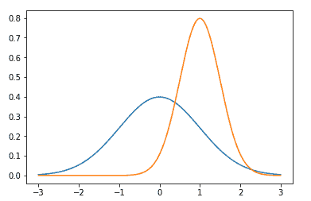

你可以看到，默认情况下，`matplotlib`会自动为每个图形选择不同的颜色，这对你来说非常好和方便。

# 将图表保存为图像

如果我想把这个图表保存到文件中，也许我想把它包含在文档中，我可以像下面的代码一样做：

```py
plt.plot(x, norm.pdf(x)) 
plt.plot(x, norm.pdf(x, 1.0, 0.5)) 
plt.savefig('C:\\Users\\Frank\\MyPlot.png', format='png') 

```

不仅仅调用`plt.show()`，我可以调用`plt.savefig()`并指定我想要保存这个文件的路径以及我想要的格式。

如果你在跟着做的话，你会想把它改成你的机器上实际存在的路径。你可能没有一个`Users\Frank`文件夹。还要记住，如果你在 Linux 或 macOS 上，你将使用正斜杠而不是反斜杠，并且你不会有一个驱动器号。对于所有这些 Python 笔记本，每当你看到这样的路径时，确保你将它改为在你的系统上有效的路径。我在 Windows 上，我有一个`Users\Frank`文件夹，所以我可以继续运行。如果我在`Users\Frank`下检查我的文件系统，我有一个`MyPlot.png`文件，我可以打开并查看，并且我可以在任何我想要的文档中使用它。


这很酷。还有一件要注意的事情是，根据你的设置，当你保存文件时可能会遇到权限问题。你只需要找到适合你的文件夹。在 Windows 上，你的`Users\Name`文件夹通常是一个安全的选择。好了，让我们继续。

# 调整坐标轴

假设我不喜欢上一个图表中的轴的默认选择。它自动调整到你可以找到的最紧凑的轴值集，这通常是一个好事，但有时你希望按绝对比例来做。看看下面的代码：

```py
axes = plt.axes() 
axes.set_xlim([-5, 5]) 
axes.set_ylim([0, 1.0]) 
axes.set_xticks([-5, -4, -3, -2, -1, 0, 1, 2, 3, 4, 5]) 
axes.set_yticks([0, 0.1, 0.2, 0.3, 0.4, 0.5, 0.6, 0.7, 0.8, 0.9, 1.0]) 
plt.plot(x, norm.pdf(x)) 
plt.plot(x, norm.pdf(x, 1.0, 0.5)) 
plt.show() 

```

在这个例子中，首先我使用`plt.axes`获取坐标轴。一旦我有了这些坐标轴对象，我就可以调整它们。通过调用`set_xlim`，我可以将 x 范围设置为-5 到 5，通过`set_ylim`，我将 y 范围设置为 0 到 1。你可以在下面的输出中看到，我的 x 值范围从`-5`到`5`，y 值从 0 到 1。我还可以明确控制坐标轴上的刻度标记的位置。因此，在上面的代码中，我说我希望 x 刻度在`-5`，`-4`，`-3`等处，y 刻度从 0 到 1，间隔为 0.1，使用`set_xticks()`和`set_yticks()`函数。现在我可以使用`arange`函数更紧凑地做到这一点，但关键是你可以明确控制这些刻度标记的位置，也可以跳过一些。你可以按照你想要的增量或分布来设置它们。除此之外，其他都是一样的。

一旦我调整了我的坐标轴，我只需调用`plot()`和我想要绘制的函数，并调用`show()`来显示它。确实，你可以看到结果。

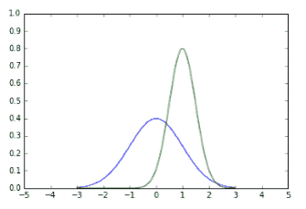

# 添加网格

如果我想在图表中添加网格线呢？嗯，同样的道理。我只需要在从`plt.axes()`获取的坐标轴上调用`grid()`。

```py
axes = plt.axes() 
axes.set_xlim([-5, 5]) 
axes.set_ylim([0, 1.0]) 
axes.set_xticks([-5, -4, -3, -2, -1, 0, 1, 2, 3, 4, 5]) 
axes.set_yticks([0, 0.1, 0.2, 0.3, 0.4, 0.5, 0.6, 0.7, 0.8, 0.9, 1.0]) 
axes.grid() 
plt.plot(x, norm.pdf(x)) 
plt.plot(x, norm.pdf(x, 1.0, 0.5)) 
plt.show() 

```

通过执行上面的代码，我得到了漂亮的小网格线。这样可以更容易看到特定点在哪里，尽管会使事情有点凌乱。这是一个小小的风格选择。

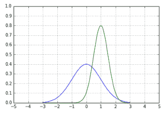

# 更改线型和颜色

如果我想要玩线型和颜色的游戏呢？你也可以这样做。

```py
axes = plt.axes() 
axes.set_xlim([-5, 5]) 
axes.set_ylim([0, 1.0]) 
axes.set_xticks([-5, -4, -3, -2, -1, 0, 1, 2, 3, 4, 5]) 
axes.set_yticks([0, 0.1, 0.2, 0.3, 0.4, 0.5, 0.6, 0.7, 0.8, 0.9, 1.0]) 
axes.grid() 
plt.plot(x, norm.pdf(x), 'b-') 
plt.plot(x, norm.pdf(x, 1.0, 0.5), 'r:') 
plt.show() 

```

所以你可以看到在上面的代码中，`plot()`函数的末尾实际上有一个额外的参数，我可以传递一个描述线条样式的小字符串。在第一个例子中，`b-`表示我想要一个蓝色的实线。`b`代表蓝色，短线表示实线。对于我的第二个`plot()`函数，我将以红色绘制，这就是`r`的含义，冒号表示我将以虚线绘制。

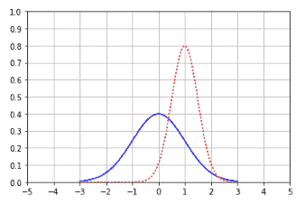

如果我运行它，你可以在上面的图表中看到它的效果，并且你可以改变不同类型的线型。

此外，你可以做一个双虚线(`--`)。

```py
axes = plt.axes() 
axes.set_xlim([-5, 5]) 
axes.set_ylim([0, 1.0]) 
axes.set_xticks([-5, -4, -3, -2, -1, 0, 1, 2, 3, 4, 5]) 
axes.set_yticks([0, 0.1, 0.2, 0.3, 0.4, 0.5, 0.6, 0.7, 0.8, 0.9, 1.0]) 
axes.grid() 
plt.plot(x, norm.pdf(x), 'b-') 
plt.plot(x, norm.pdf(x, 1.0, 0.5), 'r--') 
plt.show() 

```

上面的代码给出了虚线红线作为线型，如下图所示：

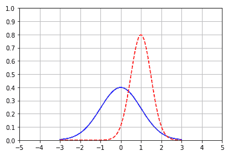

我还可以做一个点划线组合(`-.`)。

```py
axes = plt.axes() 
axes.set_xlim([-5, 5]) 
axes.set_ylim([0, 1.0]) 
axes.set_xticks([-5, -4, -3, -2, -1, 0, 1, 2, 3, 4, 5]) 
axes.set_yticks([0, 0.1, 0.2, 0.3, 0.4, 0.5, 0.6, 0.7, 0.8, 0.9, 1.0]) 
axes.grid() 
plt.plot(x, norm.pdf(x), 'b-') 
plt.plot(x, norm.pdf(x, 1.0, 0.5), 'r-.') 
plt.show() 

```

你会得到一个看起来像下面的图表图像的输出：

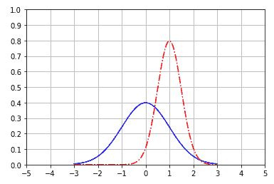

所以，这些就是不同的选择。我甚至可以让它变成绿色并带有垂直斜杠（`g:`）。

```py
axes = plt.axes() 
axes.set_xlim([-5, 5]) 
axes.set_ylim([0, 1.0]) 
axes.set_xticks([-5, -4, -3, -2, -1, 0, 1, 2, 3, 4, 5]) 
axes.set_yticks([0, 0.1, 0.2, 0.3, 0.4, 0.5, 0.6, 0.7, 0.8, 0.9, 1.0]) 
axes.grid() 
plt.plot(x, norm.pdf(x), 'b-') 
plt.plot(x, norm.pdf(x, 1.0, 0.5), ' g:') 
plt.show() 

```

我将得到以下输出：

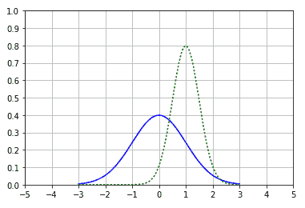

如果你愿意，可以尝试一些有趣的东西，尝试不同的值，你可以得到不同的线条样式。

# 给坐标轴加标签和添加图例

你经常会做的一件事是给你的坐标轴加上标签。你绝对不想孤立地呈现数据。你肯定想告诉人们它代表什么。为了做到这一点，你可以使用`plt`上的`xlabel()`和`ylabel()`函数来实际在你的坐标轴上放置标签。我将 x 轴标记为 Greebles，y 轴标记为 Probability。你还可以添加一个图例插图。通常情况下，这将是相同的事情，但为了显示它是独立设置的，我也在以下代码中设置了一个图例：

```py
axes = plt.axes() 
axes.set_xlim([-5, 5]) 
axes.set_ylim([0, 1.0]) 
axes.set_xticks([-5, -4, -3, -2, -1, 0, 1, 2, 3, 4, 5]) 
axes.set_yticks([0, 0.1, 0.2, 0.3, 0.4, 0.5, 0.6, 0.7, 0.8, 0.9, 1.0]) 
axes.grid() 
plt.xlabel('Greebles') 
plt.ylabel('Probability') 
plt.plot(x, norm.pdf(x), 'b-') 
plt.plot(x, norm.pdf(x, 1.0, 0.5), 'r:') 
plt.legend(['Sneetches', 'Gacks'], loc=4) 
plt.show() 

```

在图例中，你基本上传入了一个你想要为每个图表命名的列表。所以，我的第一个图表将被称为 Sneetches，我的第二个图表将被称为 Gacks，而`loc`参数表示你想要的位置，其中`4`代表右下角。让我们运行一下代码，你应该会看到以下内容：

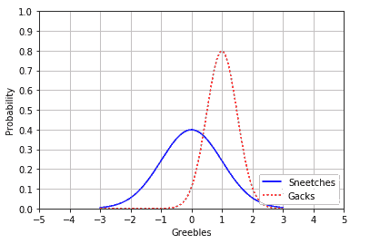

你可以看到我正在为 Sneetches 和 Gacks 绘制 Greebles 与 Probability 的图表。这是一个小的苏斯博士的参考。这就是你设置坐标轴标签和图例的方法。

# 一个有趣的例子

这里有一个小有趣的例子。如果你熟悉网络漫画 XKCD，Matplotlib 中有一个小彩蛋，你可以以 XKCD 风格绘制图表。以下代码显示了你可以这样做。

```py
plt.xkcd() 

fig = plt.figure() 
ax = fig.add_subplot(1, 1, 1) 
ax.spines['right'].set_color('none') 
ax.spines['top'].set_color('none') 
plt.xticks([]) 
plt.yticks([]) 
ax.set_ylim([-30, 10]) 

data = np.ones(100) 
data[70:] -= np.arange(30) 

plt.annotate( 
    'THE DAY I REALIZED\nI COULD COOK BACON\nWHENEVER I WANTED', 
    xy=(70, 1), arrowprops=dict(arrowstyle='->'), xytext=(15, -10)) 

plt.plot(data) 

plt.xlabel('time') 
plt.ylabel('my overall health') 

```

在这个例子中，你调用了`plt.xkcd()`，这将 Matplotlib 置于 XKCD 模式。在这之后，事情将自动以一种漫画书字体和波浪线的风格呈现。这个简单的例子将展示一个有趣的小图表，其中我们绘制了你的健康与时间的关系，当你意识到你可以随时煮培根时，你的健康状况急剧下降。我们所做的就是使用`xkcd()`方法进入那种模式。你可以在下面看到结果：

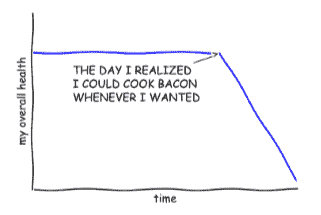

这里有一点有趣的 Python，我们实际上是如何将这个图表放在一起的。我们首先制作了一个数据线，它只是在 100 个数据点上的值为 1。然后我们使用旧的 Python 列表切片运算符来取出值为 70 之后的所有内容，并从这个 30 个项目的子列表中减去 0 到 30 的范围。这样做的效果是，随着超过 70，线性地减去一个更大的值，导致该线在 70 之后向下倾斜到 0。

所以，这是 Python 列表切片的一个小例子，以及`arange`函数的一点创造性用法来修改你的数据。

# 生成饼图

现在，回到现实世界，我们可以通过在 Matplotlib 上调用`rcdefaults()`来移除 XKCD 模式，并在这里回到正常模式。

如果你想要一个饼图，你只需要调用`plt.pie`并给它一个包含你的值、颜色、标签以及是否要爆炸的数组，如果是的话，爆炸多少。以下是代码：

```py
# Remove XKCD mode: 
plt.rcdefaults() 

values = [12, 55, 4, 32, 14] 
colors = ['r', 'g', 'b', 'c', 'm'] 
explode = [0, 0, 0.2, 0, 0] 
labels = ['India', 'United States', 'Russia', 'China', 'Europe'] 
plt.pie(values, colors= colors, labels=labels, explode = explode) 
plt.title('Student Locations') 
plt.show() 

```

在这段代码中，你可以看到我正在创建一个饼图，其中包含值`12`、`55`、`4`、`32`和`14`。我为每个值分配了明确的颜色，并为每个值分配了明确的标签。我将饼图中的俄罗斯部分扩大了 20%，并给这个图表加上了一个标题“学生位置”并显示出来。以下是你应该看到的输出：

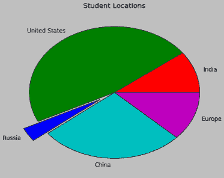

就是这样。

# 生成条形图

如果我想生成一个条形图，也是非常简单的。这是一种类似于饼图的想法。让我们看看以下代码。

```py
values = [12, 55, 4, 32, 14] 
colors = ['r', 'g', 'b', 'c', 'm'] 
plt.bar(range(0,5), values, color= colors) 
plt.show() 

```

我定义了一个值数组和一个颜色数组，然后绘制数据。上面的代码从 0 到 5 的范围绘制，使用`values`数组中的 y 值，并使用`colors`数组中列出的显式颜色列表。继续展示，你就会得到你的条形图：

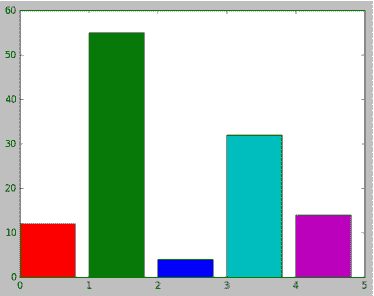

# 生成散点图

散点图是我们在本书中经常看到的东西。所以，假设你有一些不同的属性，你想为同一组人或物体绘制图表。例如，也许我们正在为每个人绘制年龄与收入的散点图，其中每个点代表一个人，轴代表这些人的不同属性。

使用散点图的方法是调用`plt.scatter()`，使用包含你想要绘制的数据的两个轴，也就是包含你想要相互绘制的数据的两个属性。

假设我在`X`和`Y`中有一个随机分布，我把它们散点图上，然后展示出来：

```py
from pylab import randn 

X = randn(500) 
Y = randn(500) 
plt.scatter(X,Y) 
plt.show() 

```

你会得到以下散点图作为输出：

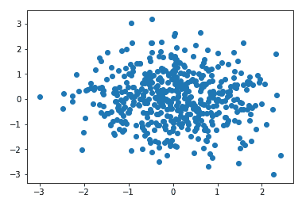

这就是它的样子，非常酷。你可以看到中心的一种集中，因为在两个轴上都使用了正态分布，但由于它是随机的，所以这两者之间没有真正的相关性。

# 生成直方图

最后，我们会回顾一下直方图是如何工作的。我们在书中已经看到了很多次。让我们看看以下代码：

```py
incomes = np.random.normal(27000, 15000, 10000) 
plt.hist(incomes, 50) 
plt.show() 

```

在这个例子中，我调用了一个以 27000 为中心，标准差为 15000 的正态分布，有 10000 个数据点。然后，我只是调用了`pyplot`的直方图函数，也就是`hist()`，并指定了输入数据和我们想要将事物分组到直方图中的桶的数量。然后我调用`show()`，剩下的就是魔术。

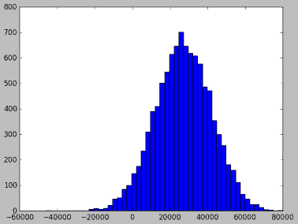

# 生成盒须图

最后，让我们看看盒须图。还记得在上一章中，当我们谈到百分位数时，我稍微提到了这一点。

同样，使用盒须图，盒子代表了 50%的数据所在的两个内四分位数。相反，另外 25%分布在盒子的两侧；盒须（在我们的例子中是虚线）代表了除异常值外的数据范围。

我们在盒须图中将异常值定义为超出 1.5 倍四分位距或盒子大小的任何值。因此，我们将盒子的大小乘以 1.5，然后在虚线盒须上到那一点，我们称这些部分为外四分位数。但是在外四分位数之外的任何值都被视为异常值，这就是超出外四分位数的线所代表的。这就是我们根据盒须图的定义来定义异常值的地方。

关于盒须图的一些要点：

+   它们用于可视化数据的分布和偏斜

+   盒子中间的线代表数据的中位数，盒子代表第 1 和第 3 四分位数的范围

+   数据的一半存在于盒子中

+   “盒须”表示数据的范围，异常值除外，异常值绘制在盒须之外。

+   异常值是四分位距的 1.5 倍或更多。

现在，为了给你一个例子，我们创建了一个虚假数据集。以下示例创建了在-40 和 60 之间均匀分布的随机数，再加上一些在`100`以上和`-100`以下的异常值：

```py
uniformSkewed = np.random.rand(100) * 100 - 40 
high_outliers = np.random.rand(10) * 50 + 100 
low_outliers = np.random.rand(10) * -50 - 100 
data = np.concatenate((uniformSkewed, high_outliers, low_outliers)) 
plt.boxplot(data) 
plt.show() 

```

在代码中，我们有一个均匀随机分布的数据（`uniformSkewed`）。然后我们在高端添加了一些异常值（`high_outliers`），也添加了一些负异常值（`low_outliers`）。然后我们将这些列表连接在一起，并使用 NumPy 从这三个不同的集合创建了一个单一的数据集。然后我们拿到了这个组合数据集，其中包括均匀数据和一些异常值，我们使用`plt.boxplot()`进行了绘制，这就是如何得到箱线图的。调用`show()`进行可视化，就完成了。

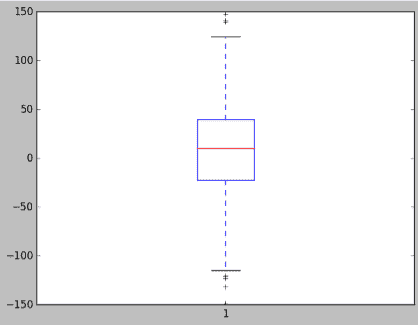

你可以看到图表显示了代表所有数据内部 50%的箱子，然后我们有这些异常值线，我们可以看到每个在该范围内的个体异常值的小叉（在你的版本中可能是圆圈）。

# 自己试试

好了，这就是 Matplotlib 的速成课程。是时候动手操作了，在这里实际做一些练习。

作为挑战，我希望你创建一个散点图，代表你编造的年龄与看电视时间的随机数据，你可以随意制造任何你想要的东西。如果你脑海中有一个不同的虚构数据集，你想要玩玩，那就尽情玩吧。创建一个散点图，将两组随机数据相互绘制，并标记你的坐标轴。让它看起来漂亮一些，尝试一下，玩得开心一些。你需要的所有参考和示例都应该在这个 IPython 笔记本中。这是一种速查表，如果你愿意的话，可以用来生成不同类型的图表和不同风格的图表。希望它能够有所帮助。现在是时候回到统计学了。

# 协方差和相关性

接下来，我们将讨论协方差和相关性。假设我有某个东西的两个不同属性，我想看看它们是否实际上与彼此相关。这一部分将为你提供你需要的数学工具，以便这样做，我们将深入一些示例，并使用 Python 实际计算协方差和相关性。这些是衡量两个不同属性在一组数据中是否相关的方法，这可能是一个非常有用的发现。

# 定义概念

想象我们有一个散点图，每个数据点代表我们测量的一个人，我们在一个轴上绘制他们的年龄，另一个轴上绘制他们的收入。每一个点代表一个人，例如他们的 x 值代表他们的年龄，y 值代表他们的收入。我完全是在编造，这是虚假数据。

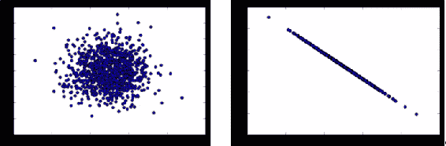

现在，如果我有一个散点图，看起来像前面图片中的左边那个，你会发现这些值倾向于分散在各个地方，这会告诉你基于这些数据，年龄和收入之间没有真正的相关性。对于任何给定的年龄，收入可能有很大的范围，它们倾向于聚集在中间，但我们并没有真正看到年龄和收入这两个不同属性之间非常明显的关系。相比之下，在右边的散点图中，你可以看到年龄和收入之间有一个非常明显的线性关系。

因此，协方差和相关性给了我们一种衡量这些关系有多紧密的方法。我期望左边散点图中的数据具有非常低的相关性或协方差，但右边散点图中的数据具有非常高的协方差和相关性。这就是协方差和相关性的概念。它衡量了我正在测量的这两个属性似乎彼此依赖的程度。

# 测量协方差

数学上测量协方差有点困难，但我会尝试解释一下。以下是步骤：

+   将两个变量的数据集想象成高维向量

+   将这些转换为与均值的方差向量。

+   取两个向量的点积（它们之间的余弦值）

+   除以样本大小

更重要的是你理解如何使用它以及它的含义。实际上，想象数据的属性是高维向量。我们要做的是对每个数据点的每个属性计算均值的方差。现在我有了这些高维向量，其中每个数据点，每个人，对应不同的维度。

在这个高维空间中，我有一个向量代表了所有属性（比如年龄）的方差与均值的差值。然后我有另一个向量代表了另一个属性（比如收入）的方差与均值的差值。然后我对这些测量每个属性的方差的向量进行点积。从数学上讲，这是一种衡量这些高维向量之间角度的方法。所以如果它们非常接近，那告诉我这些方差在不同属性上几乎是同步变化的。如果我将最终的点积除以样本大小，那就是协方差的量。

现在你永远不需要自己从头计算这个。我们将看到如何在 Python 中以简单的方式做到这一点，但从概念上讲，就是这样工作的。

现在协方差的问题在于它很难解释。如果我有一个接近零的协方差，那么我知道这告诉我这些变量之间几乎没有相关性，但是一个大的协方差意味着存在关系。但大到什么程度？根据我使用的单位不同，可能有非常不同的解释方式。这是相关性解决的问题。

# 相关性

相关性通过每个属性的标准差进行归一化（只需将协方差除以两个变量的标准差即可实现归一化）。通过这样做，我可以非常清楚地说，相关性为-1 意味着完全的反向相关，因此一个值增加，另一个值减少，反之亦然。相关性为 0 意味着这两组属性之间根本没有相关性。相关性为 1 意味着完美的相关性，这两个属性在查看不同数据点时以完全相同的方式移动。

记住，相关性并不意味着因果关系。仅仅因为你找到了一个非常高的相关性值，并不意味着其中一个属性导致了另一个属性。它只是意味着两者之间存在关系，而这种关系可能是由完全不同的东西引起的。真正确定因果关系的唯一方法是通过控制实验，我们稍后会更多地讨论。

# 在 Python 中计算协方差和相关性

好了，让我们用一些实际的 Python 代码来深入了解协方差和相关性。所以你可以从概念上将协方差看作是对每个属性的均值方差的多维向量，并计算它们之间的角度作为协方差的度量。做这件事的数学比听起来简单得多。我们谈论的是高维向量。听起来像是史蒂芬·霍金的东西，但从数学的角度来看，它非常直接。

# 计算相关性 - 最困难的方式

我将从最困难的方式开始。NumPy 确实有一个方法可以直接为你计算协方差，我们稍后会讨论，但现在我想展示你实际上可以从头原理开始做到这一点：

```py
%matplotlib inline 

import numpy as np 
from pylab import * 

def de_mean(x): 
    xmean = mean(x) 
    return [xi - xmean for xi in x] 

def covariance(x, y): 
    n = len(x) 
    return dot(de_mean(x), de_mean(y)) / (n-1) 

```

协方差再次被定义为点积，这是两个向量之间的角度的度量，对于给定数据集的偏差向量和另一个给定数据集的偏差向量，我们将其除以 n-1，在这种情况下，因为我们实际上处理的是一个样本。

所以`de_mean()`，我们的偏差函数接收一组数据`x`，实际上是一个列表，并计算该数据集的平均值。`return`行包含一些 Python 的技巧。语法是说，我将创建一个新的列表，并遍历`x`中的每个元素，称之为`xi`，然后返回整个数据集中`xi`和平均值`xmean`之间的差异。这个函数返回一个新的数据列表，表示每个数据点相对于平均值的偏差。

我的`covariance()`函数将对进入的两组数据进行散点图绘制，除以数据点的数量减 1。还记得上一章关于样本与总体的事情吗？嗯，这在这里起作用。然后我们可以使用这些函数，看看会发生什么。

为了扩展这个例子，我将捏造一些数据，试图找到页面速度和人们花费的金额之间的关系。例如，在亚马逊，我们非常关心页面渲染速度和用户在体验之后实际花费的金额之间的关系。我们想知道网站速度和用户在网站上实际花费的金额之间是否存在实际关系。这是你可能会去解决这个问题的一种方式。让我们为页面速度和购买金额生成一些正态分布的随机数据，由于它是随机的，所以它们之间不会有真正的相关性。

```py
pageSpeeds = np.random.normal(3.0, 1.0, 1000) 
purchaseAmount = np.random.normal(50.0, 10.0, 1000) 

scatter(pageSpeeds, purchaseAmount) 

covariance (pageSpeeds, purchaseAmount) 

```

所以，作为一个理智的检查，我们将从散点图开始：

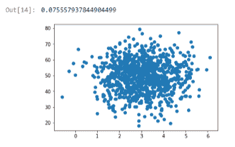

你会看到它倾向于围绕中间聚集，因为每个属性上的正态分布，但两者之间没有真正的关系。对于任何给定的页面速度，花费的金额有很大的变化，对于任何给定的花费金额，页面速度也有很大的变化，所以除了通过随机性或正态分布的性质产生的相关性之外，没有真正的相关性。果然，如果我们计算这两组属性的协方差，我们最终得到一个非常小的值，-0.07。所以这是一个非常小的协方差值，接近于零。这意味着这两件事之间没有真正的关系。

现在让我们让生活变得更有趣一点。让我们实际上使购买金额成为页面速度的一个真实函数。

```py
purchaseAmount = np.random.normal(50.0, 10.0, 1000) / pageSpeeds 

scatter(pageSpeeds, purchaseAmount) 

covariance (pageSpeeds, purchaseAmount) 

```

在这里，我们保持事情有点随机，但我们在这两组值之间建立了一个真实的关系。对于给定的用户，他们遇到的页面速度和他们花费的金额之间存在着真实的关系。如果我们绘制出来，我们可以看到以下输出：

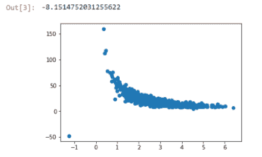

你可以看到实际上有一个小曲线，事物倾向于紧密排列。在底部附近会有一些混乱，只是因为随机性的工作方式。如果我们计算协方差，我们最终得到一个更大的值，-8，这个数字的大小很重要。符号，正或负，只是意味着正相关或负相关，但 8 这个值表示比零大得多。所以有一些事情发生了，但是再次很难解释 8 实际上意味着什么。

这就是相关性的作用，我们通过以下代码将一切标准化：

```py
def correlation(x, y): 
stddevx = x.std() 
stddevy = y.std() 
return covariance(x,y) / stddevx / stddevy  #In real life you'd check for divide by zero here 

correlation(pageSpeeds, purchaseAmount) 

```

再次，从第一原则出发，我们可以计算两组属性之间的相关性，计算每个属性的标准差，然后计算这两个属性之间的协方差，并除以每个数据集的标准差。这给我们提供了归一化到-1 到 1 的相关值。我们得到了一个值为-0.4，这告诉我们这两个属性之间存在一些负相关的关系：

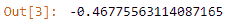

这不是一个完美的线性关系，那将是-1，但其中有一些有趣的东西。

-1 的相关系数意味着完美的负相关，0 表示没有相关性，1 表示完美的正相关。

# 计算相关性-NumPy 的方式

现在，NumPy 实际上可以使用`corrcoef()`函数为您计算相关性。让我们看一下以下代码：

```py
np.corrcoef(pageseeds, purchaseAmount) 

```

这一行代码给出了以下输出：

```py
array([(1\.         ,-046728788], 
      [-0.46728788], 1\.       ]) 

```

所以，如果我们想简单地做到这一点，我们可以使用`np.corrcoef(pageSpeeds, purchaseAmount)`，它会给你一个数组，其中包含了你传入的数据集的每一种可能的组合之间的相关性。输出的方式是：1 表示在比较`pageSpeeds`和`purchaseAmount`自身时有完美的相关性，这是预期的。但当你开始比较`pageSpeeds`和`purchaseAmount`或`purchaseAmount`和`pageSpeeds`时，你得到了-0.4672 的值，这大致是我们用较困难的方法得到的结果。会有一些精度误差，但这并不重要。

现在我们可以通过制造一个完全线性的关系来强制产生完美的相关性，所以让我们看一个例子：

```py
purchaseAmount = 100 - pageSpeeds * 3 

scatter(pageSpeeds, purchaseAmount) 

correlation (pageSpeeds, purchaseAmount) 

```

再次，我们期望相关性的结果为-1，表示完美的负相关，事实上，这就是我们得到的结果：

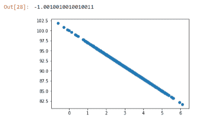

再次提醒：相关性并不意味着因果关系。只是因为人们可能会在页面速度更快时花费更多，也许这只是意味着他们能负担得起更好的互联网连接。也许这并不意味着页面渲染速度和人们花费的金额之间实际上存在因果关系，但它告诉你有一个值得进一步调查的有趣关系。你不能在没有进行实验的情况下说任何关于因果关系的事情，但相关性可以告诉你你可能想要进行的实验。

# 相关性活动

所以动手做，卷起袖子，我希望你使用`numpy.cov()`函数。这实际上是让 NumPy 为你计算协方差的一种方法。我们看到了如何使用`corrcoef()`函数计算相关性。所以回去重新运行这些例子，只使用`numpy.cov()`函数，看看你是否得到了相同的结果。它应该非常接近，所以不要用我从头开始编写的协方差函数的较困难的方法，只需使用 NumPy，看看你是否能得到相同的结果。再次强调，这个练习的目的是让你熟悉使用 NumPy 并将其应用到实际数据中。所以试试看，看看你能得到什么结果。

这就是协方差和相关性的理论和实践。这是一个非常有用的技术，所以一定要记住这一部分。让我们继续。

# 条件概率

接下来，我们将讨论条件概率。这是一个非常简单的概念。它试图找出在发生某事的情况下另一件事发生的概率。尽管听起来很简单，但实际上理解其中的一些细微差别可能会非常困难。所以多倒一杯咖啡，确保你的思维帽戴好了，如果你准备好接受一些更具挑战性的概念。让我们开始吧。

条件概率是衡量两件事相互发生关系的一种方法。假设我想找出在另一件事已经发生的情况下某个事件发生的概率。条件概率可以帮助你找出这个概率。

我试图通过条件概率找出的是两个事件是否相互依赖。也就是说，两者都发生的概率是多少？

在数学表示法中，我们表示这些事情的方式是 *P(A,B)* 表示 A 和 B 同时发生的概率，而与其他事情无关。也就是说，这两件事情发生的概率是多少，与其他一切无关。

而这种表示法 *P(B|A)*，读作给定 A 的情况下 B 的概率。那么，在事件 A 已经发生的情况下，B 发生的概率是多少？这有点不同，但这些事情是相关的，就像这样：

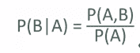

给定 A 的情况下 B 的概率等于 A 和 B 同时发生的概率除以 A 单独发生的概率，这就揭示了 B 的概率依赖于 A 的概率。

这里举个例子会更容易理解，所以请耐心等待。

假设我给你们读者两个测试，60%的人都通过了两个测试。现在第一个测试比较容易，80%的人通过了。我可以利用这些信息来计算通过第一个测试的读者中有多少人也通过了第二个测试。这是一个真实的例子，说明了给定 A 的情况下 B 的概率和 A 和 B 的概率之间的差异。

我将把 A 表示为通过第一个测试的概率，B 表示通过第二个测试的概率。我要找的是在通过第一个测试的情况下通过第二个测试的概率，即 *P(B|A)*。

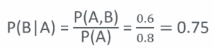

因此，给定通过第一个测试的情况下通过第二个测试的概率等于通过两个测试的概率 *P(A,B)*（我知道 60%的人通过了两个测试，而不考虑彼此的影响），除以通过第一个测试的概率 *P(A)*，即 80%。计算结果是通过了两个测试的概率为 60%，通过了第一个测试的概率为 80%，因此给定通过第一个测试的情况下通过第二个测试的概率为 75%。

好的，这个概念有点难以理解。我花了一点时间才真正理解了给定某事物的概率和两件事情发生的概率之间的差异。在继续之前，请确保你理解了这个例子以及它是如何运作的。

# Python 中的条件概率练习

好的，让我们继续，用一些真实的 Python 代码来做另一个更复杂的例子。然后我们可以看看如何实际使用 Python 来实现这些想法。

让我们在这里把条件概率付诸实践，并使用一些想法来找出年龄和购买商品之间是否存在关系，使用一些虚构的数据。如果你愿意，可以打开`ConditionalProbabilityExercise.ipynb`并跟着我一起做。

我要做的是写一些 Python 代码，创建一些虚假数据：

```py
from numpy import random 
random.seed(0) 

totals = {20:0, 30:0, 40:0, 50:0, 60:0, 70:0} 
purchases = {20:0, 30:0, 40:0, 50:0, 60:0, 70:0} 
totalPurchases = 0 
for _ in range(100000): 
    ageDecade = random.choice([20, 30, 40, 50, 60, 70]) 
    purchaseProbability = float(ageDecade) / 100.0 
    totals[ageDecade] += 1 
    if (random.random() < purchaseProbability): 
        totalPurchases += 1 
        purchases[ageDecade] += 1 

```

我要做的是取 10 万个虚拟人，随机分配到一个年龄段。他们可以是 20 多岁、30 多岁、40 多岁、50 多岁、60 多岁或 70 多岁。我还要给他们分配一些在某段时间内购买的东西的数量，并根据他们的年龄来加权购买某物的概率。

这段代码最终的作用是使用 NumPy 的`random.choice()`函数随机将每个人分配到一个年龄组。然后我将分配购买东西的概率，并且我已经加权，使得年轻人购买东西的可能性小于老年人。我将遍历 10 万人，并在遍历过程中将所有东西加起来，最终得到两个 Python 字典：一个给出了每个年龄组的总人数，另一个给出了每个年龄组内购买的总数。我还将跟踪总体购买的总数。让我们运行这段代码。

如果你想花点时间在脑海中思考并弄清楚代码是如何工作的，你可以使用 IPython Notebook。你以后也可以回头看。让我们看看我们最终得到了什么。

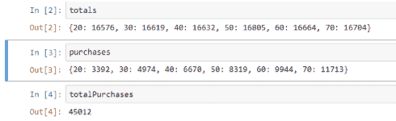

我们的`totals`字典告诉我们每个年龄段有多少人，这与我们预期的一样是相当均匀的。每个年龄组购买的数量实际上是随年龄增长而增加的，所以 20 岁的人只购买了大约 3000 件东西，70 岁的人购买了大约 11000 件东西，总体上整个人口购买了大约 45000 件东西。

让我们使用这些数据来玩玩条件概率的概念。首先让我们弄清楚在你 30 岁时购买东西的概率是多少。如果我们将购买表示为 E，将你 30 岁的事件表示为 F，那么表示为*P(E|F)*。

现在我们有了这个复杂的方程，它给出了一种计算*P(E|F)*给定*P(E,F)*和*P(E)*的方法，但我们不需要那个。你不能只是盲目地应用方程。你必须直观地思考你的数据。它告诉我们什么？我想要计算在你 30 岁时购买东西的概率。我有计算它所需的所有数据。

```py
PEF = float(purchases[30]) / float(totals[30]) 

```

我知道 30 岁的人购买的东西在购买[30]桶中有多少，我也知道有多少 30 岁的人。所以我可以将这两个数字相除，得到 30 岁购买的比例与 30 岁人数的比率。然后我可以使用 print 命令输出这个比例：

```py
print ("P(purchase | 30s): ", PEF) 

```

最终我得到了在你 30 岁时购买东西的概率大约为 30%。

```py
P(purchase | 30s): 0.2992959865211 

```

请注意，如果你使用的是 Python 2，print 命令没有周围的括号，所以应该是：

```py
print "p(purchase | 30s): ", PEF 

```

如果我想找到*P(F)*，那就是总体 30 岁的概率，我可以将 30 岁的总人数除以我的数据集中的人数，即 10 万：

```py
PF = float(totals[30]) / 100000.0 
print ("P(30's): ", PF) 

```

如果你使用的是 Python 2，再次删除 print 语句周围的括号。这应该得到以下输出：

```py
P(30's): 0.16619 

```

我知道在你`30 岁`的概率大约是 16%。

我们现在要找出*P(E)*，这只是代表不考虑年龄的总体购买概率：

```py
PE = float(totalPurchases) / 100000.0 
print ("P(Purchase):", PE) 

P(Purchase): 0.45012 

```

在这个例子中，这大约是 45%。我只需将所有人购买的东西的总数除以总人数，就可以得到总体购买的概率。

好了，那么我有什么？我有在你 30 岁时购买东西的概率大约为 30%，然后我有总体购买东西的概率大约为 45%。

现在如果 E 和 F 是独立的，如果年龄不重要，那么我期望*P(E|F)*大约等于*P(E)*。我期望在你 30 岁时购买东西的概率大约等于总体购买东西的概率，但事实并非如此，对吧？因为它们不同，这告诉我它们实际上是有依赖关系的。所以这是一种使用条件概率来揭示数据中这些依赖关系的方法。

让我们在这里做一些更多的符号表示。如果你看到像*P(E)P(F)*这样的东西在一起，那意味着将这些概率相乘在一起。我可以简单地取购买的总体概率乘以在你`30 岁`的总体概率：

```py
print ("P(30's)P(Purchase)", PE * PF) 

P(30's)P(Purchase) 0.07480544280000001 

```

这大约是 7.5%。

仅仅从概率的工作方式来看，我知道如果我想要得到两件事情同时发生的概率，那就等同于将它们各自的概率相乘。所以结果是*P(E,F)*发生，就等同于*P(E)P(F)*。

```py
print ("P(30's, Purchase)", float(purchases[30]) / 100000.0) 
P(30's, Purchase) 0.04974 

```

现在由于数据的随机分布，它并不完全相同。记住，我们在谈论概率，但它们大致相同，这是有道理的，大约 5%与 7%，足够接近。

现在这又不同于*P(E|F)*，所以在你`30 岁`和购买某物的概率与在你`30 岁`的情况下购买某物的概率是不同的。

现在让我们做一个小小的检查。我们可以检查我们在之前的条件概率部分看到的方程式，即购买某物的概率，假设你是`30 岁`，等同于在你`30 岁`和购买某物的概率除以购买某物的概率。也就是说，我们检查*P(E|F)=P(E,F)/P(F)*。

```py
(float(purchases[30]) / 100000.0) / PF  

```

这给了我们：

```py
Out []:0.29929598652145134 

```

果然，它起作用了。如果我取购买某物的概率，假设你是`30 岁`，除以总体概率，我们最终得到大约 30%，这几乎就是我们最初得出的*P(E|F)*。所以这个方程式是有效的，耶！

好了，有些东西确实很难理解。我知道有点令人困惑，但如果需要的话，再看一遍，研究一下，确保你理解这里发生了什么。我尽量在这里放了足够的例子来说明不同的思考方式。一旦你内化了它，我要挑战你实际上在这里做一些工作。

# 条件概率作业

我希望你修改以下 Python 代码，这些代码在前面的部分中使用过。

```py
from numpy import random 
random.seed(0) 

totals = {20:0, 30:0, 40:0, 50:0, 60:0, 70:0} 
purchases = {20:0, 30:0, 40:0, 50:0, 60:0, 70:0} 
totalPurchases = 0 
for _ in range(100000): 
ageDecade = random.choice([20, 30, 40, 50, 60, 70]) 
purchaseProbability = 0.4 
totals[ageDecade] += 1 
if (random.random() < purchaseProbability): 
totalPurchases += 1 
purchases[ageDecade] += 1 

```

修改它以实际上不让购买和年龄之间存在依赖关系。同样让它成为均匀分布的机会。看看这对你的结果有什么影响。你最终得到了非常不同的在你`30 岁`购买东西的条件概率和总体购买东西的概率吗？这告诉了你关于你的数据和这两个不同属性之间关系的什么？继续尝试一下，确保你实际上可以从这些数据中得到一些结果并理解发生了什么，我马上就会运行我的解决方案来解决这个问题。

所以这就是条件概率，无论是在理论上还是在实践中。你可以看到它有很多微妙之处，还有很多令人困惑的符号表示。如果需要，回过头再看一遍这一节。我给了你一个作业，所以现在去做吧，看看你是否真的可以修改我的代码在那个 IPython 笔记本中为不同年龄组产生一个恒定的购买概率。然后回来，我们将看看我是如何解决这个问题以及我的结果是什么。

# 我的作业解决方案

你做完作业了吗？希望如此。让我们来看看我对在一个虚假数据集中如何使用条件概率来告诉我们年龄和购买概率之间是否存在关系的问题的解决方案。

提醒一下，我们试图做的是消除年龄和购买概率之间的依赖关系，并看看我们是否能够在我们的条件概率值中实际反映出来。这是我得到的：

```py
from numpy import random 
random.seed(0) 

totals = {20:0, 30:0, 40:0, 50:0, 60:0, 70:0} 
purchases = {20:0, 30:0, 40:0, 50:0, 60:0, 70:0} 
totalPurchases = 0 
for _ in range(100000): 
    ageDecade = random.choice([20, 30, 40, 50, 60, 70]) 
    purchaseProbability = 0.4 
    totals[ageDecade] += 1 
    if (random.random() < purchaseProbability): 
        totalPurchases += 1 
        purchases[ageDecade] += 1 

```

我在这里所做的是，我拿了原始的代码片段，用于创建我们的年龄组字典以及每个年龄组购买了多少，针对 10 万个随机人。我没有让购买概率依赖于年龄，而是让它成为 40%的常数概率。现在我们只是随机地将人分配到一个年龄组，他们都有相同的购买某物的概率。让我们继续运行。

现在，这一次，如果我计算*P(E|F)*，也就是，给定你处于`30 岁`的情况下购买某物的概率，我得到的结果大约是 40%。

```py
PEF = float(purchases[30]) / float(totals[30]) 
print ("P(purchase | 30s): ", PEF) 

P(purchase | 30s):  0.398760454901 

```

如果我将其与总体购买概率进行比较，那也是大约 40%。

```py
PE = float(totalPurchases) / 100000.0 
print ("P(Purchase):", PE) 

P(Purchase): 0.4003 

```

我可以看到，如果你处于`30 岁`，购买某物的概率与不考虑你的年龄而言购买某物的概率大致相同（也就是，*P(E|F)*与*P(E)*非常接近）。这表明这两件事之间没有真正的关系，实际上，我知道从这些数据中并没有关系。

现在在实践中，你可能只是看到了随机的机会，所以你会想要观察不止一个年龄组。你会想要观察不止一个数据点，以查看是否真的存在关系，但这表明在我们修改的这个样本数据中，年龄和购买概率之间没有关系。

所以，这就是条件概率的作用。希望你的解决方案相当接近并且有类似的结果。如果不是，回去研究我的解决方案。这就在这本书的数据文件中，ConditionalProbabilitySolution.ipynb，如果你需要打开它并研究它并进行试验。显然，数据的随机性会使你的结果有些不同，并且会取决于你对总体购买概率的选择，但这就是这个想法。

有了这个背景，让我们继续讲贝叶斯定理。

# 贝叶斯定理

现在你了解了条件概率，你就能理解如何应用贝叶斯定理，这是基于条件概率的。这是一个非常重要的概念，特别是如果你要进入医学领域，但它也是广泛适用的，你马上就会明白为什么。

你会经常听到这个，但并不是很多人真正理解它的意义。有时它可以非常定量地告诉你，当人们用统计数据误导你时，所以让我们看看它是如何起作用的。

首先，让我们从高层次来谈谈贝叶斯定理。贝叶斯定理就是：给定 B 的情况下 A 的概率等于 A 的概率乘以给定 A 的情况下 B 的概率除以 B 的概率。所以你可以用任何你想要的东西来替换 A 和 B。

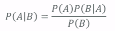

关键的见解是，依赖于 B 的某事的概率很大程度上取决于 B 和 A 的基本概率。人们经常忽视这一点。

一个常见的例子是药物测试。我们可能会说，如果你对某种药物测试呈阳性，那么你是实际使用该药物的概率是多少。贝叶斯定理之所以重要，是因为它指出这在很大程度上取决于 A 和 B 的概率。在整个人群中，对于药物测试呈阳性的概率，实际上很大程度上取决于整体使用该药物的概率和整体测试呈阳性的概率。药物测试的准确性很大程度上取决于整体人群中使用该药物的概率，而不仅仅是测试的准确性。

这也意味着在给定 A 的情况下 B 的概率并不等同于在给定 B 的情况下 A 的概率。也就是说，在测试呈阳性的情况下成为药物用户的概率可能与在成为药物用户的情况下测试呈阳性的概率非常不同。您可以看到这是一个非常现实的问题，在医学诊断测试或药物测试中会产生很多假阳性。您仍然可以说测试检测用户的概率可能非常高，但这并不一定意味着在测试呈阳性的情况下成为用户的概率很高。这是两回事，而贝叶斯定理允许您量化这种差异。

让我们举一个例子来更好地理解。

再次，药物测试可以是应用贝叶斯定理证明观点的常见例子。即使高度准确的药物测试也可能产生比真阳性更多的假阳性。因此，在我们的例子中，我们将提出一种药物测试，该测试可以在 99%的时间内准确识别药物用户，并且对非用户有 99%的准确的阴性结果，但是实际上只有 0.3%的总体人口实际使用该药物。因此，我们实际上成为药物用户的概率非常小。看起来非常高的 99%的准确性实际上还不够高，对吧？

我们可以通过以下方式计算出概率：

+   事件 A = 使用该药物的用户

+   事件 B = 测试呈阳性

事件 A 表示您使用某种药物，事件 B 表示您使用此药物测试呈阳性。

我们需要计算总体测试呈阳性的概率。我们可以通过计算用户测试呈阳性的概率和非用户测试呈阳性的概率的总和来计算出来。因此，在这个例子中，P(B)计算为 1.3%（0.99*0.003+0.01*0.997）。因此，我们有了 B 的概率，即在不了解您的其他情况下，总体上测试呈阳性的概率。

让我们来计算一下，在测试呈阳性的情况下实际成为药物用户的概率。

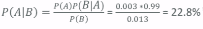

因此，在实际成为药物用户的情况下测试呈阳性的概率计算为总体上成为药物用户的概率*(P(A))*，即 3%（您知道 3%的人口是药物用户），乘以*P(B|A)*，即在成为用户的情况下测试呈阳性的概率，除以总体上测试呈阳性的概率，即 1.3%。再次，这个测试听起来非常准确，准确率为 99%。我们有 0.3%的人口使用药物，乘以 99%的准确性，除以总体上测试呈阳性的概率，即 1.3%。因此，您在测试呈阳性的情况下实际成为该药物用户的概率只有 22.8%。因此，即使这种药物测试在 99%的时间内准确，它仍然在大多数情况下提供了错误的结果。

即使*P(B|A)*很高（99%），也不意味着*P(A|B)*很高。

人们经常忽视这一点，因此如果有一件事可以从贝叶斯定理中学到的，那就是始终要持怀疑态度。将贝叶斯定理应用于这些实际问题，您经常会发现，听起来高准确率实际上可能会产生非常误导性的结果，如果您处理的是某个问题的总体发生率很低的情况。我们在癌症筛查和其他类型的医学筛查中也看到了同样的情况。这是一个非常现实的问题；有很多人因为不理解贝叶斯定理而接受了非常真实且不必要的手术。如果您要从事医学行业的大数据工作，请，请，请记住这个定理。

这就是贝叶斯定理。永远记住，给定某事物的概率并不等同于反过来，它实际上很大程度上取决于你正在测量的这两件事物的基本概率。这是一件非常重要的事情要牢记，并且始终要以此为依据来查看你的结果。贝叶斯定理为你提供了量化这种影响的工具。我希望它能够证明有用。

# 总结

在本章中，我们讨论了如何绘制和图形化你的数据，以及如何使用 Python 中的`matplotlib`库使你的图形看起来漂亮。我们还介绍了协方差和相关性的概念。我们看了一些例子，并使用 Python 计算了协方差和相关性。我们分析了条件概率的概念，并看了一些例子以更好地理解它。最后，我们看到了贝叶斯定理及其重要性，特别是在医学领域。

在下一章中，我们将讨论预测模型。
