# 第四章：预测模型

在本章中，我们将探讨预测建模是什么，以及它如何使用统计数据来预测现有数据的结果。我们将涵盖现实世界的例子，以更好地理解这些概念。我们将了解回归分析的含义，并详细分析其中的一些形式。我们还将看一个预测汽车价格的例子。

这些是本章中我们将涵盖的主题：

+   线性回归及其在 Python 中的实现方式

+   多项式回归，其应用和示例

+   多元回归及其在 Python 中的实现方式

+   我们将构建一个使用 Python 预测汽车价格的示例

+   多层模型的概念和一些需要了解的内容

# 线性回归

让我们谈谈回归分析，这是数据科学和统计学中非常流行的话题。它的核心是试图将曲线或某种函数拟合到一组观察结果中，然后使用该函数来预测你尚未见过的新值。这就是线性回归的全部内容！

因此，线性回归是将一条直线拟合到一组观察结果中。例如，假设我测量了一群人，我测量的两个特征是他们的体重和身高：

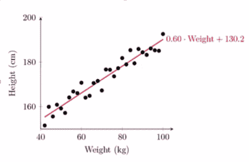

我在*x*轴上显示了体重，*y*轴上显示了身高，我可以绘制所有这些数据点，就像人们的体重与身高一样，我可以说，“嗯，这看起来像是一个线性关系，不是吗？也许我可以拟合一条直线并用它来预测新值”，这就是线性回归的作用。在这个例子中，我得到了斜率为 0.6 和*y*截距为 130.2，这定义了一条直线（一条直线的方程是*y=mx+b*，其中 m 是斜率，b 是*y*截距）。给定一个斜率和一个*y*截距，最能适应我拥有的数据，我可以使用这条线来预测新值。

你可以看到我观察到的重量只涵盖了重 100 公斤的人。如果我有一个重 120 公斤的人怎么办？嗯，我可以使用这条线来计算基于先前数据的 120 公斤的人的身高。

我不知道为什么他们称之为回归。回归有点意味着你在做一些事情。我猜你可以把它看作是在根据你过去的观察结果创建一条线来预测新值，时间上倒退，但这似乎有点牵强。说实话，这只是一个令人困惑的术语，我们用非常花哨的术语来掩盖我们用非常简单的概念做的事情的一种方式。它只是将一条直线拟合到一组数据点。

# 普通最小二乘法技术

线性回归是如何工作的？在内部，它使用一种称为普通最小二乘法的技术；它也被称为 OLS。你可能也会看到这个术语被提及。它的工作方式是试图最小化每个点与直线之间的平方误差，其中误差只是每个点与你所拥有的直线之间的距离。

因此，我们总结了所有这些错误的平方和，这听起来很像我们计算方差时的情况，对吧，只是不是相对于均值，而是相对于我们定义的直线。我们可以测量数据点相对于该直线的方差，并通过最小化该方差，我们可以找到最适合的直线：

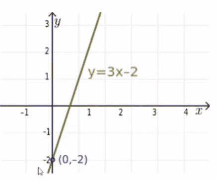

现在你永远不必自己费力去做这件事，但如果你因某种原因不得不这样做，或者如果你只是好奇发生了什么，我现在会为你描述整体算法，以及如果有一天你需要自己费力计算斜率和*y*截距，你将如何去做。这真的并不复杂。

还记得线的斜率截距方程吗？它是*y=mx+c*。斜率实际上就是两个变量之间的相关性乘以*Y*的标准差除以*X*的标准差。标准差在数学中自然地出现可能看起来有点奇怪，但是记住相关性也包含了标准差，所以不太奇怪你必须重新引入这个术语。

然后，截距可以计算为*Y*的平均值减去斜率乘以*X*的平均值。再次强调，尽管这并不是非常困难，Python 会为你完成所有计算，但重点是这些并不是难以运行的复杂事情。它们实际上可以非常高效地完成。

记住，最小二乘法最小化了每个点到线的平方误差的总和。另一种思考线性回归的方式是，你正在定义一条代表观察线的最大可能性的线；也就是说，*y*值在给定*x*值时的最大概率。

有时人们称线性回归为最大似然估计，这只是人们给一个非常简单的东西起了一个花哨的名字的又一个例子，所以如果你听到有人谈论最大似然估计，他们实际上是在谈论回归。他们只是试图显得很聪明。但现在你也知道了这个术语，所以你也可以显得很聪明。

# 梯度下降技术

进行线性回归有多种方法。我们已经谈到了普通最小二乘法是拟合一组数据的简单方法，但也有其他技术，梯度下降就是其中之一，它在三维数据中效果最好。因此，它试图为你跟随数据的轮廓。这非常高级，显然计算成本更高一些，但是 Python 确实让你很容易地尝试它，如果你想将其与普通最小二乘法进行比较。

使用梯度下降技术在处理三维数据时是有意义的。

通常情况下，最小二乘法是进行线性回归的一个完全合理的选择，它总是一个合法的事情，但是如果你遇到梯度下降，你会知道那只是进行线性回归的另一种方式，通常在更高维度的数据中看到。

# 确定系数或 R 平方

那么，我如何知道我的回归有多好？我的线对数据的拟合程度如何？这就是 R 平方的作用，R 平方也被称为确定系数。虽然有人可能会试图显得聪明一点，称其为确定系数，但通常被称为 R 平方。

它是你的模型捕捉到的 Y 的总变化的分数。你的线有多好地跟随了发生的变化？我们在你的线的两侧是否得到了相等数量的变化？这就是 R 平方在衡量的。

# 计算 R 平方

要实际计算该值，取 1 减去平方误差的总和除以平方变化的总和：

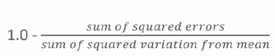

因此，计算起来并不是很困难，但是 Python 会为你提供函数，可以帮你计算，所以你实际上不需要自己进行数学计算。

# 解释 R 平方

对于 R 平方，你将得到一个从 0 到 1 的值。0 意味着你的拟合很糟糕。它没有捕捉到数据的任何变化。而 1 是完美的拟合，数据的所有变化都被这条线捕捉到，你在线的两侧看到的所有变化应该是相同的。所以 0 是糟糕的，1 是好的。这就是你真正需要知道的。介于两者之间的值就是介于两者之间的值。低 R 平方值意味着拟合很差，高 R 平方值意味着拟合很好。

正如你将在接下来的部分中看到的，有多种方法可以进行回归。线性回归是其中之一。这是一种非常简单的技术，但也有其他技术，你可以使用 R 平方作为一个定量的度量来衡量给定回归对一组数据点的拟合程度，然后使用它来选择最适合你的数据的模型。

# 使用 Python 计算线性回归和 R 平方

现在让我们来玩一下线性回归，实际计算一些线性回归和 R 平方。我们可以从这里创建一些 Python 代码，生成一些*随机的*数据，实际上是线性相关的。

在这个例子中，我将捏造一些关于页面渲染速度和人们购买金额的数据，就像之前的例子一样。我们将捏造网站加载所需时间和人们在该网站上花费的金额之间的线性关系：

```py
%matplotlib inline
import numpy as np
from pylab import *
pageSpeeds = np.random.normal(3.0, 1.0, 1000)
purchaseAmount = 100 - (pageSpeeds + np.random.normal(0, 0.1,
1000)) * 3
scatter(pageSpeeds, purchaseAmount) 

```

我在这里所做的只是制作了一个随机的、以 3 秒为中心的页面速度的正态分布，标准差为 1 秒。我将购买金额设为它的线性函数。因此，我将它设为 100 减去页面速度加上一些围绕它的正态随机分布，乘以 3。如果我们散点图，我们可以看到数据最终看起来是这样的：

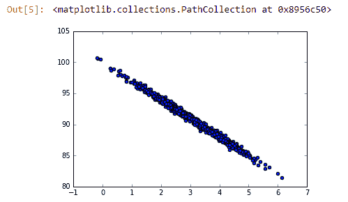

你可以通过肉眼观察到确实存在线性关系，这是因为我们在源数据中硬编码了一个真正的线性关系。

现在让我们看看是否可以通过最小二乘法找出最佳拟合线。我们讨论了如何进行最小二乘法和线性回归，但你不必自己进行任何数学计算，因为 SciPy 包有一个`stats`包，你可以导入：

```py
from scipy import stats

slope, intercept, r_value, p_value, std_err =     
stats.linregress(pageSpeeds, purchaseAmount) 

```

你可以从`scipy`中导入`stats`，然后你可以在你的两个特征上调用`stats.linregress()`。因此，我们有一个页面速度（`pageSpeeds`）的列表和一个相应的购买金额（`purchaseAmount`）的列表。`linregress()`函数将给我们一堆东西，包括斜率、截距，这是我需要定义最佳拟合线的东西。它还给我们`r_value`，从中我们可以得到 R 平方来衡量拟合的质量，以及一些我们稍后会讨论的东西。现在，我们只需要斜率、截距和`r_value`，所以让我们继续运行这些。我们将从找到线性回归的最佳拟合开始：

```py
r_value ** 2

```

你的输出应该是这样的：

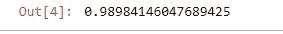

现在我们得到的线的 R 平方值是 0.99，几乎是 1.0。这意味着我们有一个非常好的拟合，这并不太令人惊讶，因为我们确保这些数据之间存在真正的线性关系。即使在该线周围存在一些方差，我们的线也捕捉到了这些方差。我们在线的两侧大致有相同数量的方差，这是一件好事。这告诉我们我们确实有线性关系，我们的模型很适合我们的数据。

让我们画出那条线：

```py
import matplotlib.pyplot as plt
def predict(x):
return slope * x + intercept
fitLine = predict(pageSpeeds)
plt.scatter(pageSpeeds, purchaseAmount)
plt.plot(pageSpeeds, fitLine, c='r')
plt.show()

```

以下是前面代码的输出：

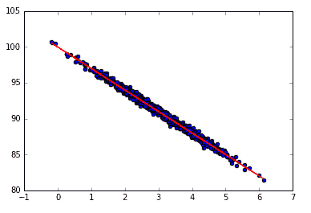

这段代码将创建一个函数来绘制最佳拟合线与数据一起。这里有一些 Matplotlib 的魔法。我们将创建一个`fitLine`列表，并使用我们编写的`predict()`函数来获取`pageSpeeds`（我们的*x*轴），并从中创建 Y 函数。因此，我们不是使用花费金额的观察值，而是使用`linregress()`调用返回的`斜率`乘以`x`加上`截距`。基本上在这里，我们将做一个散点图，就像我们以前做的那样，来显示原始数据点，即观察值。

然后我们还将在同一个`pyplot`实例上调用`plot`，使用我们得到的线方程创建的`fitLine`，并将它们一起显示出来。当我们这样做时，图表看起来像下面这样：

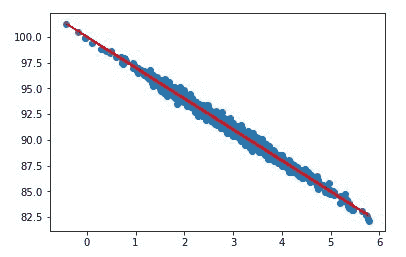

你可以看到我们的直线实际上非常适合我们的数据！它正好位于中间，你只需要使用这个预测函数来预测新值。给定一个新的之前未见过的页面速度，我们可以使用斜率乘以页面速度加上截距来预测花费的金额。就是这么简单，我觉得很棒！

# 线性回归的活动

现在是时候动手了。尝试增加测试数据中的随机变化，并查看是否会产生影响。记住，R 平方是拟合程度的一个度量，我们捕捉了多少方差，所以方差的数量，嗯...你看看它是否真的有影响。

这就是线性回归，一个非常简单的概念。我们所做的就是将一条直线拟合到一组观察结果，然后我们可以使用这条直线来预测新值。就是这么简单。但是为什么要限制自己只使用一条直线呢？我们可以做其他更复杂的回归。我们接下来会探讨这些。

# 多项式回归

我们已经讨论了线性回归，其中我们将一条直线拟合到一组观察结果。多项式回归是我们接下来要讨论的话题，它使用更高阶的多项式来拟合你的数据。有时候你的数据可能并不适合一条直线。这就是多项式回归的用武之地。

多项式回归是回归的更一般情况。那么为什么要限制自己只使用一条直线呢？也许你的数据实际上并没有线性关系，或者可能有某种曲线关系，对吧？这种情况经常发生。

并非所有的关系都是线性的，但线性回归只是我们可以做的整个回归类别中的一个例子。如果你还记得我们最终得到的线性回归线的形式是*y = mx + b*，其中 m 和 b 是我们从普通最小二乘法线性回归分析中得到的值，或者你选择的任何方法。现在这只是一个一次多项式。阶数或度数就是你看到的 x 的幂。所以这是一个一次多项式。

现在如果我们想的话，我们也可以使用二次多项式，它看起来像*y = ax² + bx + c*。如果我们使用二次多项式进行回归，我们会得到 a、b 和 c 的值。或者我们可以使用三次多项式，它的形式是*ax³ + bx² + cx + d*。阶数越高，你可以表示的曲线就越复杂。所以，你将 x 的更多次幂混合在一起，你就可以得到更复杂的形状和关系。

但并不是阶数越高越好。通常你的数据中有一些自然关系并不是那么复杂，如果你发现自己在拟合数据时使用了非常大的阶数，你可能是在过度拟合！

注意过度拟合！

+   不要使用比你需要的更多的度数

+   首先可视化你的数据，看看可能存在多复杂的曲线

+   可视化拟合并检查你的曲线是否在努力适应异常值

+   高 R 平方仅意味着你的曲线很好地拟合了训练数据；它可能是一个好的预测器，也可能不是

如果你的数据有点乱七八糟，方差很大，你可以疯狂地创建一条上下波动的直线，试图尽可能地拟合数据，但实际上这并不代表数据的内在关系。它不能很好地预测新值。

所以，始终从可视化你的数据开始，考虑曲线实际上需要多复杂。现在你可以使用 R 平方来衡量你的拟合有多好，但要记住，这只是衡量这条曲线有多好地拟合了你的训练数据——也就是说，你用来实际进行预测的数据。它并不衡量你准确预测未来的能力。

稍后，我们将讨论一些防止过拟合的技术，称为**训练/测试**，但现在你只需要用眼睛来确保你没有过拟合，并且不要给函数添加比你需要的更多的度数。当我们探索一个例子时，这将更有意义，所以让我们接着做。

# 使用 NumPy 实现多项式回归

幸运的是，NumPy 有一个`polyfit`函数，可以让你轻松地玩弄这个并尝试不同的结果，所以让我们去看看。多项式回归的乐趣时刻到了。顺便说一下，我真的觉得这很有趣。实际上看到所有那些高中数学实际上应用到一些实际的场景中，这有点酷。打开`PolynomialRegression.ipynb`，让我们玩得开心一点。

让我们在页面速度和我们的购买金额虚假数据之间创建一个新的关系，这一次我们将创建一个不是线性的更复杂的关系。我们将把页面速度作为购买金额的除法函数的一部分：

```py
%matplotlib inline
from pylab import *
np.random.seed(2)
pageSpeeds = np.random.normal(3.0, 1.0, 1000)
purchaseAmount = np.random.normal(50.0, 10.0, 1000) / pageSpeeds
scatter(pageSpeeds, purchaseAmount)

```

如果我们做一个散点图，我们得到以下结果：

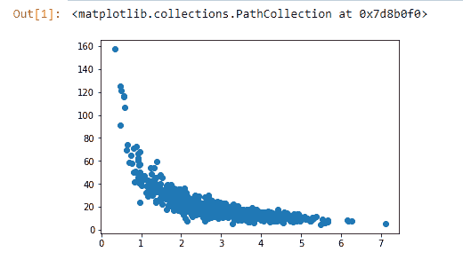

顺便说一下，如果你想知道`np.random.seed`这一行是做什么的，它创建一个随机种子值，这意味着当我们进行后续的随机操作时，它们将是确定性的。通过这样做，我们可以确保每次运行这段代码时，我们都得到完全相同的结果。这将在以后变得重要，因为我将建议你回来实际尝试不同的拟合来比较你得到的拟合。所以，重要的是你从相同的初始点开始。

你可以看到这并不是一个线性关系。我们可以尝试对其进行拟合，对于大部分数据来说可能还可以，也许在图表右侧的下方，但在左侧就不太行了。我们实际上更多的是一个指数曲线。

现在碰巧 NumPy 有一个`polyfit()`函数，允许你对这些数据进行任意次数的多项式拟合。所以，例如，我们可以说我们的*x*轴是我们拥有的页面速度（`pageSpeeds`）的数组，我们的*y*轴是我们拥有的购买金额（`purchaseAmount`）的数组。然后我们只需要调用`np.polyfit(x, y, 4)`，意思是我们想要一个四次多项式拟合这些数据。

```py
x = np.array(pageSpeeds)
y = np.array(purchaseAmount)
p4 = np.poly1d(np.polyfit(x, y, 4))

```

让我们继续运行。它运行得相当快，然后我们可以绘制出来。所以，我们将在这里创建一个小图表，绘制我们原始点与预测点的散点图。

```py
import matplotlib.pyplot as plt

xp = np.linspace(0, 7, 100)
plt.scatter(x, y)
plt.plot(xp, p4(xp), c='r')
plt.show()

```

输出看起来像下面的图表：

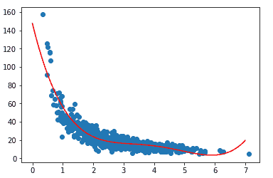

目前看起来是一个相当好的拟合。不过你要问自己的是，“我是不是过度拟合了？我的曲线看起来是不是真的在努力适应异常值？”我发现实际上并没有发生这种情况。我并没有看到太多疯狂的事情发生。

如果我有一个非常高阶的多项式，它可能会在顶部上升以捕捉那个异常值，然后向下下降以捕捉那里的异常值，并且在我们有很多密度的地方会变得更加稳定，也许它最终可能会到处尝试适应最后一组异常值。如果你看到这种无稽之谈，你就知道你的多项式阶数太多了，你应该把它降下来，因为虽然它适合你观察到的数据，但对于预测你没有看到的数据是没有用的。

想象一下，我有一条曲线，它向上飞起，然后又回到原点以适应异常值。我对中间的某些值的预测不会准确。曲线实际上应该在中间。在本书的后面，我们将讨论检测这种过拟合的主要方法，但现在，请只是观察它，并知道我们以后会更深入地讨论。

# 计算 r 平方误差

现在我们可以测量 r 平方误差。通过在`sklearn.metrics`中的`r2_score()`函数中取`y`和预测值（`p4(x)`），我们可以计算出来。

```py
from sklearn.metrics import r2_score
r2 = r2_score(y, p4(x))

print r2

```

输出如下：

！[](img/a18ffeef-c620-42d8-8fea-a2e3b60a3e1d.png)

我们的代码将一组观察结果与一组预测进行比较，并为你计算 r 平方，只需一行代码！我们的 r 平方结果为 0.829，这还不错。记住，零是不好的，一是好的。0.82 接近一，不完美，直观上是有道理的。你可以看到我们的线在数据的中间部分非常好，但在极端左侧和极端右侧并不那么好。所以，0.82 听起来是合理的。

# 多项式回归的活动

我建议你深入研究这些东西。尝试不同阶数的多项式。回到我们运行`polyfit()`函数的地方，尝试除了 4 之外的不同值。你可以使用 1，那就会回到线性回归，或者你可以尝试一些非常高的值，比如 8，也许你会开始看到过拟合。看看它的影响。你会想要改变它。例如，让我们来看一个三次多项式。

```py
x = np.array(pageSpeeds)
y = np.array(purchaseAmount)

p4 = np.poly1d(np.polyfit(x, y, 3))  

```

只需不断运行每一步，你就可以看到它的影响...

！[](img/208e9b74-bc29-443a-91b3-88f04c1deff8.png)

我们的三次多项式显然不如四次多项式拟合得好。如果你实际测量 r 平方误差，定量上会更糟，但如果我太高，你可能会开始看到过拟合。所以，只是玩一下，尝试不同的值，了解不同阶数的多项式对回归的影响。去动手尝试学习一些东西。

这就是多项式回归。再次强调，你需要确保你不会给问题增加比你需要的更多的度数。使用恰到好处的数量来找到看起来符合你的数据的直观拟合。太多可能导致过拟合，而太少可能导致拟合不足...所以你现在可以同时使用你的眼睛和 r 平方指标来找出你的数据的正确度数。让我们继续。

# 多元回归和预测汽车价格

那么，如果我们试图预测基于多于一个其他属性的值会发生什么？假设人的身高不仅取决于他们的体重，还取决于他们的遗传或其他一些可能影响它的因素。那么，多元分析就派上用场了。你实际上可以构建同时考虑多个因素的回归模型。用 Python 做起来实际上非常容易。

让我们谈谈多元回归，这有点复杂。多元回归的想法是：如果有多个因素影响你要预测的事物会怎么样？

在我们之前的例子中，我们看了线性回归。例如，我们讨论了基于体重预测人的身高。我们假设体重是影响身高的唯一因素，但也许还有其他因素。我们还研究了页面速度对购买金额的影响。也许影响购买金额的因素不仅仅是页面速度，我们想要找出这些不同因素如何结合在一起影响价值。这就是多元回归的作用。

我们现在要看的示例是这样的。假设您试图预测汽车的售价。它可能基于该汽车的许多不同特征，例如车身风格、品牌、里程数；谁知道，甚至还取决于轮胎的好坏。其中一些特征对于预测汽车价格更为重要，但您希望一次考虑所有这些特征。

因此，我们在这里前进的方式仍然是使用最小二乘法来拟合模型到您的一组观察结果。不同之处在于，我们将为您拥有的每个不同特征有一堆系数。

因此，例如，我们最终得到的价格模型可能是 alpha 的线性关系，一些常数，有点像您的 y 截距，再加上里程的一些系数，再加上年龄的一些系数，再加上它有多少个门的一些系数：

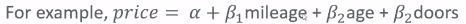

一旦您得到了那些最小二乘分析的系数，我们可以利用这些信息来弄清楚，每个特征对我的模型有多重要。因此，如果我得到了某些东西的系数非常小，比如车门数量，那就意味着车门数量并不重要，也许我应该完全将其从我的模型中移除，以使其更简单。

这是我在这本书中应该更经常说的一件事。在数据科学中，您总是希望做最简单有效的事情。不要过于复杂化事情，因为通常简单的模型效果最好。如果您能找到恰到好处的复杂度，但不要过多，那通常就是正确的模型。无论如何，这些系数给了您一种实际的方式，“嘿，有些因素比其他因素更重要。也许我可以丢弃其中一些因素。”

现在我们仍然可以使用 r-squared 来衡量多元回归的拟合质量。它的工作方式相同，尽管在进行多元回归时，您需要假设因素本身不相互依赖...而这并不总是正确的。因此，有时您需要将这个小小的警告放在脑后。例如，在这个模型中，我们将假设汽车的里程和年龄不相关；但实际上，它们可能非常紧密相关！这是这种技术的局限性，它可能根本没有捕捉到某种效应。

# 使用 Python 进行多元回归

幸运的是，Python 有一个名为`statsmodel`的包，可以很容易地进行多元回归。让我们深入了解一下它的工作原理。让我们使用 Python 进行一些多元回归。我们将使用一些关于凯利蓝皮书中汽车价值的真实数据。

```py
import pandas as pd
df = pd.read_excel('http://cdn.sundog-soft.com/Udemy/DataScience/cars.xls')

```

我们要在这里介绍一个名为`pandas`的新包，它让我们非常容易地处理表格数据。它让我们能够轻松读取表格数据，并以不同的方式重新排列、修改、切片和切块它们。我们将在未来经常使用它。

我们将导入`pandas`作为`pd`，`pd`有一个`read_Excel()`函数，我们可以使用它来从 Web 通过 HTTP 读取 Microsoft Excel 电子表格。因此，pandas 有非常棒的功能。 

我已经提前为您在我的域上托管了该文件，如果我们运行它，它将加载到我们称之为`df`的`DataFrame`对象中。现在我可以在这个`DataFrame`上调用`head()`，只显示它的前几行：

```py
df.head()

```

以下是前面代码的输出：

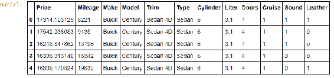

实际数据集要大得多。这只是前几个样本。因此，这是关于里程、制造商、型号、修剪、类型、车门、巡航、音响和皮革的真实数据。

好的，现在我们要使用`pandas`将其拆分为我们关心的特征。我们将创建一个模型，试图仅基于里程、型号和车门数量来预测价格，没有其他因素。

```py
import statsmodels.api as sm

df['Model_ord'] = pd.Categorical(df.Model).codes
X = df[['Mileage', 'Model_ord', 'Doors']]
y = df[['Price']]

X1 = sm.add_constant(X)
est = sm.OLS(y, X1).fit()

est.summary() 

```

现在我遇到的问题是，模型是一个文本，比如 Buick 的世纪，正如您所记得的，当我进行这种分析时，一切都需要是数字。在代码中，我使用`pandas`中的`Categorical()函数`来将`DataFrame`中看到的模型名称转换为一组数字；也就是一组代码。我将说我的模型的 x 轴输入是里程（`Mileage`），转换为序数值的模型（`Model_ord`），和车门数量（`Doors`）。我试图在 y 轴上预测的是价格（`Price`）。

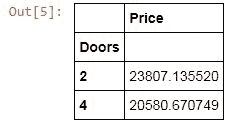

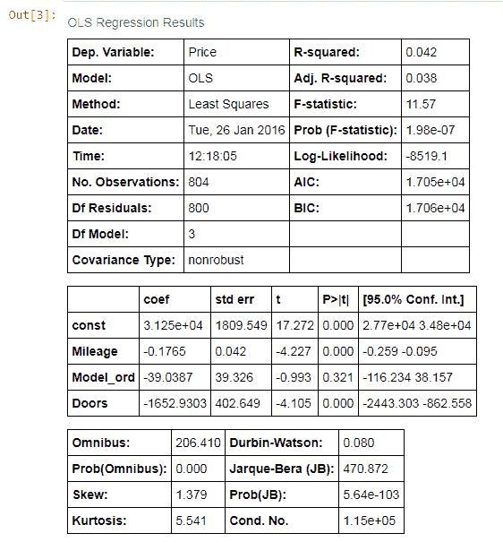

您可以看到这里的 R 平方值非常低。实际上，这不是一个很好的模型，但我们可以了解各种错误的一些见解，有趣的是，最低的标准误差与里程相关联。

现在我之前说过，系数是一种确定哪些项目重要的方法，但前提是您的输入数据已经标准化。也就是说，如果所有数据都在 0 到 1 的相同尺度上。如果不是，那么这些系数在一定程度上是在补偿它所看到的数据的尺度。如果您处理的不是标准化数据，就像在这种情况下一样，查看标准误差更有用。在这种情况下，我们可以看到里程实际上是这个特定模型的最大因素。我们早些时候能否已经想到这一点呢？嗯，我们只需稍微切片和切块就能发现车门数量实际上并不会对价格产生太大影响。让我们运行以下小行：

```py
y.groupby(df.Doors).mean()

```

这里有一点`pandas`的语法。在 Python 中只需一行代码就能做到这一点，这很酷！这将打印出一个新的`DataFrame`，显示给定车门数量的平均价格：

接下来的两行代码只是创建了一个我称之为`est`的模型，它使用普通最小二乘法（OLS），并使用我给它的列`Mileage`，`Model_ord`和`Doors`进行拟合。然后我可以使用 summary 调用来打印出我的模型是什么样子的：

我可以看到平均两门车的售价实际上比平均四门车的售价更高。如果有的话，车门数量和价格之间存在负相关，这有点令人惊讶。不过，这是一个小数据集，所以我们当然不能从中得出太多意义。

# 多元回归的活动

作为一个活动，请随意修改假输入数据。您可以下载数据并在电子表格中进行修改。从本地硬盘读取数据，而不是从 HTTP 读取，看看您可以有什么样的不同。也许您可以制作一个行为不同且拥有更好适合的模型的数据集。也许您可以更明智地选择特征来构建您的模型。所以，请随意尝试一下，然后我们继续。

这就是多元分析和其运行示例。和我们探索的多元分析概念一样重要的是我们在 Python 笔记本中所做的一些事情。所以，您可能需要回到那里，确切地研究发生了什么。

我们介绍了 pandas 和处理 pandas 和 DataFrame 对象的方法。pandas 是一个非常强大的工具。我们将在未来的章节中更多地使用它，但请确保您开始注意这些事情，因为这些将是您在 Python 技能中处理大量数据和组织数据的重要技术。

# 多级模型

现在谈论多层次模型是有意义的。这绝对是一个高级话题，我不会在这里详细讨论。我现在的目标是向你介绍多层次模型的概念，并让你了解一些挑战以及在组合它们时如何思考。就是这样。

多层次模型的概念是，一些影响发生在层次结构中的各个层次。例如，你的健康。你的健康可能取决于你的个体细胞的健康程度，而这些细胞可能取决于它们所在的器官的健康程度，而你的器官的健康可能取决于你整体的健康。你的健康可能部分取决于你家庭的健康和你家庭给予你的环境。而你家庭的健康反过来可能取决于你所在城市的一些因素，比如犯罪率、压力和污染程度。甚至超越这些，它可能取决于我们所生活的整个世界的因素。也许世界上医疗技术的状况是一个因素，对吧？

另一个例子：你的财富。你赚多少钱？这取决于你个人的努力，但也取决于你父母的努力，他们能够为你的教育投入多少钱以及你成长的环境，反过来，你的祖父母呢？他们能够创造什么样的环境，能够为你的父母提供什么样的教育，进而影响他们为你的教育和成长提供的资源。

这些都是多层次模型的例子，其中存在一个影响彼此的层次结构。现在多层次模型的挑战是要尝试弄清楚，“我该如何建模这些相互依赖关系？我该如何建模所有这些不同的影响以及它们如何相互影响？”

这里的挑战是识别每个层次中实际影响你试图预测的事物的因素。例如，如果我试图预测整体 SAT 成绩，我知道这部分取决于参加考试的个体孩子，但是孩子的哪些方面很重要呢？可能是基因，可能是他们的个体健康，他们的个体大脑大小。你可以想到任何可能影响个体的因素，可能会影响他们的 SAT 成绩。然后，如果你再往上看，看看他们的家庭环境，看看他们的家庭。家庭的哪些方面可能会影响他们的 SAT 成绩？他们能提供多少教育？父母是否能够辅导孩子学习 SAT 考试中的主题？这些都是第二层次的重要因素。那么他们的社区呢？社区的犯罪率可能很重要。他们为青少年提供的设施以及让他们远离街头的措施等等。

关键是你想要继续关注这些更高的层次，但在每个层次上识别影响你试图预测的事物的因素。我可以继续上升到学校老师的素质、学区的资金、州级的教育政策。你可以看到不同层次的不同因素都会影响你试图预测的事物，而其中一些因素可能存在于多个层次。例如，犯罪率存在于地方和州级。在进行多层次建模时，你需要弄清楚它们如何相互作用。

正如你可以想象的那样，这很快变得非常困难和复杂。这确实远远超出了本书的范围，也超出了任何数据科学入门书籍的范围。这是困难的东西。有整整厚厚的书籍讨论它，你可以写一本完整的书籍，这将是一个非常高级的话题。

那么为什么我要提到多层模型呢？因为我在一些工作描述中看到它被提到，在一些情况下，作为他们希望你了解的内容。我在实践中从未使用过它，但我认为在数据科学职业中重要的是，你至少要熟悉这个概念，知道它的含义以及创建多层模型所涉及的一些挑战。我希望我已经向你介绍了这些概念。有了这些，我们可以继续下一节了。

这就是多层模型的概念。这是一个非常高级的话题，但你至少需要了解这个概念，而这个概念本身是相当简单的。当你试图做出预测时，你只是在不同层次、不同层次之间寻找影响。所以也许有不同层次的影响相互影响，而这些不同层次可能有相互关联的因素。多层建模试图考虑所有这些不同的层次和因素以及它们如何相互作用。放心，这就是你现在需要知道的全部。

# 总结

在本章中，我们谈到了回归分析，即试图将曲线拟合到一组训练数据，然后使用它来预测新值。我们看到了它的不同形式。我们看了线性回归的概念及其在 Python 中的实现。

我们学习了多项式回归是什么，也就是使用更高次的多项式来为多维数据创建更好、更复杂的曲线。我们还看到了它在 Python 中的实现。

然后我们谈到了多元回归，这是一个稍微复杂一点的概念。我们看到了当有多个因素影响我们要预测的数据时，多元回归是如何使用的。我们看了一个有趣的例子，使用 Python 和一个非常强大的工具 pandas 来预测汽车的价格。

最后，我们看了多层模型的概念。我们了解了一些挑战，以及在将它们组合在一起时如何考虑它们。在下一章中，我们将学习一些使用 Python 的机器学习技术。
