# 第五章：使用 Python 进行机器学习

在本章中，我们将介绍机器学习以及如何在 Python 中实际实现机器学习模型。

我们将研究监督学习和无监督学习的含义，以及它们之间的区别。我们将看到防止过拟合的技术，然后看一个有趣的示例，我们在其中实现了一个垃圾邮件分类器。我们将分析 K 均值聚类是什么，并使用 scikit-learn 对基于收入和年龄的人群进行聚类的工作示例！

我们还将介绍一种非常有趣的机器学习应用，称为**决策树**，并且我们将在 Python 中构建一个工作示例，用于预测公司的招聘决策。最后，我们将深入探讨集成学习和 SVM 的迷人概念，这些是我最喜欢的机器学习领域之一！

更具体地说，我们将涵盖以下主题：

+   监督和无监督学习

+   通过使用训练/测试来避免过拟合

+   贝叶斯方法

+   使用朴素贝叶斯实现电子邮件垃圾邮件分类器

+   K 均值聚类的概念

+   Python 中聚类的示例

+   熵及其测量方法

+   决策树的概念及其在 Python 中的示例

+   什么是集成学习

+   **支持向量机**（**SVM**）及其在 scikit-learn 中的示例

# 机器学习和训练/测试

那么什么是机器学习？如果您在维基百科或其他地方查找，它会说这是一种可以从观测数据中学习并基于此进行预测的算法。听起来很花哨，对吧？就像人工智能一样，就像您的计算机内部有一个跳动的大脑。但实际上，这些技术通常非常简单。

我们已经看过回归，我们从中获取了一组观测数据，我们对其进行了拟合，并使用该线进行预测。所以按照我们的新定义，那就是机器学习！您的大脑也是这样工作的。

机器学习中的另一个基本概念是称为**训练**/**测试**的东西，它让我们非常聪明地评估我们制作的机器学习模型有多好。当我们现在看无监督和监督学习时，您将看到为什么训练/测试对机器学习如此重要。

# 无监督学习

现在让我们详细讨论两种不同类型的机器学习：监督学习和无监督学习。有时两者之间可能存在一种模糊的界限，但无监督学习的基本定义是，您不会给模型任何答案来学习。您只是向其提供一组数据，您的机器学习算法会尝试在没有额外信息的情况下理解它：


假设我给它一堆不同的对象，比如这些球和立方体以及一些骰子之类的东西。然后让我们假设有一些算法，它将根据某种相似性度量将这些对象聚类成相互相似的东西。

现在我没有提前告诉机器学习算法，某些对象属于哪些类别。我没有一个可以从中学习的作弊表，其中有一组现有对象和我对其正确分类的信息。机器学习算法必须自行推断这些类别。这是无监督学习的一个例子，我没有一组答案可以让它学习。我只是试图让算法根据所呈现给它的数据自行收集答案。

问题在于我们不一定知道算法会得出什么结果！如果我给它前面图像中显示的一堆物体，它会将物品分成圆形的，大的与小的，红色的与蓝色的吗，我不知道。这将取决于我为物品之间的相似性给出的度量标准。但有时您会发现令人惊讶的聚类，并且会出现您没有预料到的结果。

所以这确实是无监督学习的重点：如果你不知道你在寻找什么，它可以成为一个强大的工具，用来发现你甚至不知道存在的分类。我们称之为**潜在变量**。你最初甚至不知道的数据属性，可以通过无监督学习来挖掘出来。

让我们来看一个无监督学习的例子。假设我是在对人群进行聚类而不是对球和骰子进行聚类。我正在写一个约会网站，我想看看哪些类型的人倾向于聚集在一起。人们倾向于围绕一些属性进行聚类，这些属性决定了他们是否倾向于彼此喜欢和约会。现在你可能会发现出现的聚类并不符合你的先入为主的刻板印象。也许这与大学生与中年人、离婚者等无关，或者他们的宗教信仰。也许如果你看看实际从分析中出现的聚类，你会对你的用户学到一些新东西，并且真正发现有些东西比你的人群的任何现有特征更重要，以决定他们是否喜欢彼此。这就是监督学习提供有用结果的一个例子。

另一个例子可能是根据电影的属性对电影进行聚类。如果你对像 IMDb 这样的一组电影运行聚类，也许结果会让你惊讶。也许这不仅仅是关于电影的类型。也许还有其他属性，比如电影的年龄或播放时长或上映国家，更重要。你永远不知道。或者我们可以分析产品描述的文本，尝试找出对某个类别具有最重要意义的术语。同样，我们可能并不一定知道哪些术语或词语最能表明产品属于某个类别；但通过无监督学习，我们可以挖掘出这些潜在信息。

# 监督学习

相比之下，监督学习是一种模型可以从一组答案中学习的情况。我们给它一组训练数据，模型从中学习。然后它可以推断我们想要的特征和类别之间的关系，并将其应用于未见过的新值，并预测有关它们的信息。

回到我们之前的例子，我们试图根据这些汽车的属性来预测汽车价格。这是一个我们使用实际答案来训练模型的例子。所以我有一组已知的汽车及其实际售价。我在这组完整答案上训练模型，然后我可以创建一个能够预测我以前没有见过的新车价格的模型。这是一个监督学习的例子，你给它一组答案来学习。你已经给一组数据分配了类别或一些组织标准，然后你的算法使用这些标准来建立一个模型，从中可以预测新的数值。

# 评估监督学习

那么如何评估监督学习呢？监督学习的美妙之处在于我们可以使用一个称为训练/测试的技巧。这里的想法是将我希望我的模型学习的观察数据分成两组，一个训练集和一个测试集。所以当我基于我拥有的数据来训练/构建我的模型时，我只使用我称之为训练集的部分数据，然后我保留另一部分数据，我将用于测试目的。

我可以使用我的数据子集来构建我的模型作为训练数据，然后我可以评估从中得出的模型，并看看它是否能成功地预测我的测试数据的正确答案。

所以你看到我在这里做了什么？我有一组数据，我已经有了可以训练模型的答案，但我将保留一部分数据，实际上用它来测试使用训练集生成的模型！这让我有一个非常具体的方法来测试我的模型在未知数据上的表现，因为我实际上有一些数据被我留出来可以用来测试。

然后你可以定量地测量它的表现如何，使用 R 平方或其他指标，比如均方根误差。你可以用它来测试一个模型与另一个模型，看看对于给定问题哪个是最好的模型。你可以调整该模型的参数，并使用训练/测试来最大化该模型在测试数据上的准确性。这是防止过拟合的一个很好的方法。

有一些监督学习的注意事项。需要确保你的训练和测试数据集足够大，能够真正代表你的数据。你还需要确保你在训练和测试中捕捉到所有你关心的不同类别和异常值，以便对其成功进行良好的衡量和建立一个好的模型。

你必须确保你从这些数据集中随机选择，并且不是只将你的数据集分成两部分，说这里左边的是训练，右边的是测试。你想要随机抽样，因为你的数据中可能有一些你不知道的顺序模式。

现在，如果你的模型过拟合，并且只是竭尽全力接受训练数据中的异常值，那么当你将其放在未见过的测试数据中时，这将会显露出来。这是因为所有为了异常值而进行的旋转对于它以前没有见过的异常值是没有帮助的。

让我们清楚地说一下，训练/测试并不完美，有可能会得到误导性的结果。也许你的样本量太小，就像我们已经讨论过的那样，或者可能仅仅由于随机机会，你的训练数据和测试数据看起来非常相似，它们实际上确实有一组相似的异常值-你仍然可能会过拟合。正如你在下面的例子中所看到的，这确实可能发生：

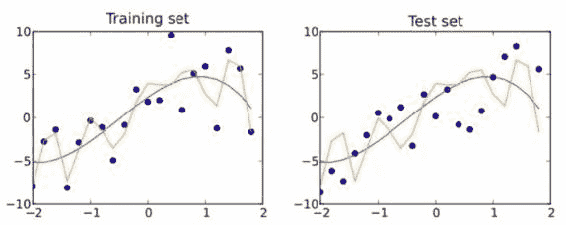

# K-fold 交叉验证

现在有一种解决这个问题的方法，叫做 k-fold 交叉验证，我们将在本书的后面看一个例子，但基本概念是你要多次进行训练/测试。所以你实际上不是将数据分成一个训练集和一个测试集，而是分成多个随机分配的段，k 个段。这就是 k 的含义。然后你保留其中一个段作为测试数据，然后开始在剩余的段上训练模型，并测量它们对测试数据集的表现。然后你取每个训练集模型结果的平均表现，并取它们的 R 平方平均分数。

这样，你实际上是在不同的数据片段上进行训练，将它们与相同的测试集进行比较，如果你的模型对训练数据的特定部分过拟合，那么它将被 k-fold 交叉验证中其他部分的平均值抵消。

以下是 K-fold 交叉验证的步骤：

1.  将数据分成 K 个随机分配的段

1.  将一个段保留为测试数据

1.  在剩余的 K-1 个段上进行训练，并测量它们对测试集的表现

1.  计算 K-1 个 R 平方分数的平均值

这在本书的后面会更有意义，现在我只是想让你知道这个工具实际上可以使训练/测试比它已经是更加健壮。所以让我们去实际玩一些数据，并使用训练/测试来评估它。

# 使用训练/测试来防止多项式回归的过拟合

让我们把训练/测试付诸实践。你可能记得回归可以被看作是一种监督式机器学习。让我们尝试一下多项式回归，我们之前介绍过，使用训练/测试来尝试找到适合给定数据集的正确次数的多项式。

就像我们之前的例子一样，我们将建立一个小的虚拟数据集，其中包括随机生成的页面速度和购买金额，我将在它们之间创建一个怪异的指数关系。

```py
%matplotlib inline 
import numpy as np 
from pylab import * 

np.random.seed(2) 

pageSpeeds = np.random.normal(3.0, 1.0, 100) 
purchaseAmount = np.random.normal(50.0, 30.0, 100) / pageSpeeds 

scatter(pageSpeeds, purchaseAmount) 

```

让我们继续生成这些数据。我们将使用页面速度和购买金额的正态分布的随机数据，使用如下截图中所示的关系：

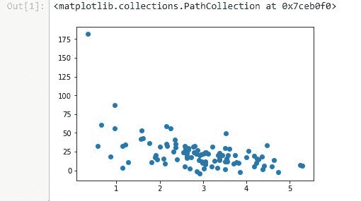

接下来，我们将拆分数据。我们将取 80%的数据，保留给训练数据。所以这些点中只有 80%会用于训练模型，然后我们将保留另外的 20%用于测试模型对未知数据的预测。

我们将使用 Python 的语法来拆分列表。前 80 个点将用于训练集，最后的 20 个点将用于测试集。你可能还记得我们在之前的 Python 基础章节中介绍过这个语法，我们将在购买金额中也做同样的事情：

```py
trainX = pageSpeeds[:80] 
testX = pageSpeeds[80:] 

trainY = purchaseAmount[:80] 
testY = purchaseAmount[80:] 

```

在我们之前的章节中，我说过你不应该像这样简单地将数据集分成两部分，而是应该随机抽样进行训练和测试。但在这种情况下，它是有效的，因为我的原始数据本来就是随机生成的，所以没有任何规律可循。但在现实世界的数据中，你会希望在拆分之前对数据进行洗牌。

现在我们将看一下一个方便的方法，你可以用它来洗牌你的数据。另外，如果你使用 pandas 包，那里有一些方便的函数可以自动为你创建训练和测试数据集。但我们将在这里使用 Python 列表来做。所以让我们来可视化我们最终得到的训练数据集。我们将绘制我们的训练页面速度和购买金额的散点图。

```py
scatter(trainX, trainY) 

```

这是你的输出现在应该看起来的样子：


基本上，从原始完整数据集中随机选择的 80 个点已经被绘制出来。它基本上具有相同的形状，这是一个好事。它代表了我们的数据。这很重要！

现在让我们绘制剩下的 20 个点，作为测试数据。

```py
scatter(testX, testY) 

```

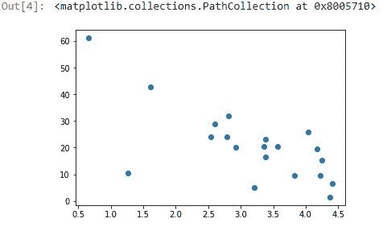

在这里，我们看到我们剩下的 20 个测试点也与我们原始数据的形状相同。所以我认为这也是一个代表性的测试集。当然，它比你在现实世界中想看到的要小一点。例如，如果你有 1000 个点而不是 100 个点可以选择，并且保留 200 个点而不是 20 个点，你可能会得到更好的结果。

现在我们将尝试对这些数据拟合一个 8 次多项式，我们只是随机选择了数字`8`，因为我知道这是一个非常高的阶数，可能会导致过拟合。

让我们继续使用`np.poly1d(np.polyfit(x, y, 8)`来拟合我们的 8 次多项式，其中*x*是仅包含训练数据的数组，*y*也是仅包含训练数据的数组。我们只使用了那 80 个保留用于训练的点来找到我们的模型。现在我们有了这个`p4`函数，可以用它来预测新的值：

```py
x = np.array(trainX) 
y = np.array(trainY) 

p4 = np.poly1d(np.polyfit(x, y, 8)) 

```

现在我们将绘制这个多项式与训练数据的关系。我们可以散点绘制我们的原始训练数据，然后我们可以绘制我们的预测值：

```py
import matplotlib.pyplot as plt 

xp = np.linspace(0, 7, 100) 
axes = plt.axes() 
axes.set_xlim([0,7]) 
axes.set_ylim([0, 200]) 
plt.scatter(x, y) 
plt.plot(xp, p4(xp), c='r') 
plt.show() 

```

你可以在下图中看到，它看起来非常匹配，但你知道显然它有一些过拟合：

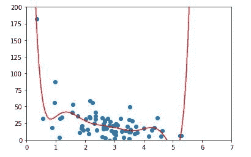

右边的这种疯狂是什么？我非常确定，如果我们真的有真实数据，它不会像这个函数所暗示的那样疯狂高。所以这是一个很好的过拟合数据的例子。它非常适合你提供的数据，但是在图表右侧疯狂高的点之后，它会对预测新值做出糟糕的预测。所以让我们试着揭示这一点。让我们给它我们的测试数据集：

```py
testx = np.array(testX) 
testy = np.array(testY) 

axes = plt.axes() 
axes.set_xlim([0,7]) 
axes.set_ylim([0, 200]) 
plt.scatter(testx, testy) 
plt.plot(xp, p4(xp), c='r') 
plt.show() 

```

实际上，如果我们将我们的测试数据绘制到同样的函数上，嗯，它看起来并不那么糟糕。

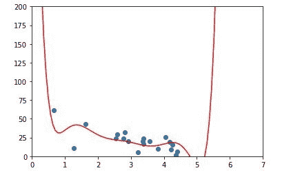

我们很幸运，我们的测试数据实际上并不在这里开始，但你可以看到这是一个合理的拟合，但远非完美。事实上，如果你实际测量 R 平方分数，它比你想象的要糟糕。我们可以使用`sklearn.metrics`中的`r2_score()`函数来测量。我们只需给它我们的原始数据和我们预测的值，它就会测量所有预测值的方差并为你平方：

```py
from sklearn.metrics import r2_score  
r2 = r2_score(testy, p4(testx))  
print r2 

```

我们最终得到的 R 平方分数只有`0.3`。所以并不是很高！你可以看到它更适合训练数据：

```py
from sklearn.metrics import r2_score  
r2 = r2_score(np.array(trainY), p4(np.array(trainX))) 
print r2 

```

R 平方值结果为`0.6`，这并不令人意外，因为它是在训练数据上训练的。测试数据是它的未知，它的测试，而它确实没有通过测试。30%，这是 F！

这是一个例子，我们使用训练/测试来评估监督学习算法，就像我之前说的那样，pandas 有一些方法可以使这变得更容易。我们稍后会看一下，我们还将在本书的后面看到更多关于训练/测试的例子，包括 k 折交叉验证。

# 活动

你可能能猜到你的作业是什么。所以我们知道 8 次多项式并不是很有用。你能做得更好吗？所以我希望你回到我们的例子中，使用不同的多项式阶数来拟合。将 8 更改为不同的值，看看你能否找出使用训练/测试作为度量标准的最佳多项式阶数。你的测试数据在哪里得到最好的 R 平方分数？哪个阶数更适合？去尝试一下。这应该是一个相当简单的练习，对你来说也是一个非常有启发性的练习。

所以这就是训练/测试的实际应用，这是一个非常重要的技术，你将一遍又一遍地使用它，以确保你的结果与你拥有的模型非常匹配，并且你的结果对未知值有很好的预测能力。这是在进行建模时防止过拟合的好方法。

# 贝叶斯方法-概念

你是否曾经想过你的电子邮件中的垃圾邮件分类器是如何工作的？它是如何知道一封电子邮件可能是垃圾邮件还是不是？嗯，一个流行的技术是一种称为朴素贝叶斯的技术，这是贝叶斯方法的一个例子。让我们更多地了解它是如何工作的。让我们讨论贝叶斯方法。

我们在本书的早些时候讨论了贝叶斯定理，讨论了像药物测试这样的事情在结果上可能非常误导。但你实际上可以将相同的贝叶斯定理应用到更大的问题，比如垃圾邮件分类器。所以让我们深入了解一下它可能是如何工作的，这就是所谓的贝叶斯方法。

所以对贝叶斯定理的一个复习-记住，给定 B 的 A 的概率等于 A 的整体概率乘以给定 A 的 B 的概率除以 B 的整体概率：

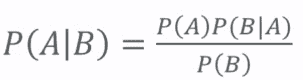

我们如何在机器学习中使用它？我实际上可以为此构建一个垃圾邮件分类器：一个可以分析一组已知的垃圾邮件和一组已知的非垃圾邮件，并训练一个模型来预测新邮件是否为垃圾邮件的算法。这是实际世界中实际使用的垃圾邮件分类器的真正技术。

作为一个例子，让我们来计算一下包含单词“free”的电子邮件被认为是垃圾邮件的概率。如果有人向你承诺免费的东西，那很可能是垃圾邮件！所以让我们来计算一下。在电子邮件中包含单词“free”时，电子邮件被认为是垃圾邮件的概率等于它是垃圾邮件的总体概率乘以包含单词“free”的概率，假设它是垃圾邮件，除以总体概率是免费的概率：

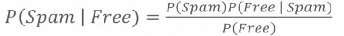

分子可以被认为是消息是“垃圾邮件”并包含单词“免费”的概率。但这与我们要寻找的有点不同，因为这是完整数据集中的几率，而不仅仅是包含单词“免费”的几率。分母只是包含单词“免费”的总体概率。有时，这可能不会立即从您拥有的数据中获得。如果没有，如果需要推导出来，可以将其扩展为以下表达式：

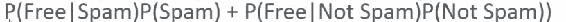

这给出了包含单词“free”的电子邮件中是垃圾邮件的百分比，这在您试图确定它是否是垃圾邮件时是一个有用的信息。

但是英语中的所有其他单词呢？所以我们的垃圾邮件分类器应该知道的不仅仅是单词“free”。理想情况下，它应该自动选择消息中的每个单词，并弄清楚每个单词对特定电子邮件被认为是垃圾邮件的可能性有多大的贡献。所以我们可以在训练时对我们遇到的每个单词进行训练，丢弃像“a”、“the”和“and”这样的东西以及无意义的单词。然后当我们浏览新电子邮件中的所有单词时，我们可以将每个单词的垃圾邮件概率相乘在一起，然后得到该电子邮件是垃圾邮件的总体概率。

现在它被称为朴素贝叶斯是有原因的。它是朴素的，因为我们假设单词之间没有关系。我们只是独立地查看消息中的每个单词，并基本上结合每个单词对其是否是垃圾邮件的概率。我们不考虑单词之间的关系。因此，更好的垃圾邮件分类器会这样做，但显然这要困难得多。

听起来好像是很多工作。但总体想法并不难，而且 Python 中的 scikit-learn 使得实际上很容易做到。它提供了一个名为 CountVectorizer 的功能，可以非常简单地将电子邮件拆分为其所有组成单词，并逐个处理这些单词。然后它有一个 MultinomialNB 函数，其中 NB 代表朴素贝叶斯，它将为我们完成所有朴素贝叶斯的繁重工作。

# 使用朴素贝叶斯实现垃圾邮件分类器

让我们使用朴素贝叶斯编写一个垃圾邮件分类器。你会惊讶地发现这是多么容易。实际上，大部分工作最终都是读取我们将要训练的所有输入数据，并实际解析这些数据。实际的垃圾邮件分类部分，机器学习部分，本身只是几行代码。所以通常情况下是这样的：当你在做数据科学时，读取和整理数据通常是大部分工作，所以要习惯这个想法！

```py
import os 
import io 
import numpy 
from pandas import DataFrame 
from sklearn.feature_extraction.text import CountVectorizer 
from sklearn.naive_bayes import MultinomialNB 

def readFiles(path): 
    for root, dirnames, filenames in os.walk(path): 
        for filename in filenames: 
            path = os.path.join(root, filename) 

            inBody = False 
            lines = [] 
            f = io.open(path, 'r', encoding='latin1') 
            for line in f: 
                if inBody: 
                    lines.append(line) 
                elif line == '\n': 
                    inBody = True 
            f.close() 
            message = '\n'.join(lines) 
            yield path, message 

def dataFrameFromDirectory(path, classification): 
    rows = [] 
    index = [] 
    for filename, message in readFiles(path): 
        rows.append({'message': message, 'class': classification}) 
        index.append(filename) 

    return DataFrame(rows, index=index) 

data = DataFrame({'message': [], 'class': []}) 

data = data.append(dataFrameFromDirectory(
                   'e:/sundog-consult/Udemy/DataScience/emails/spam',
                   'spam')) 
data = data.append(dataFrameFromDirectory(
                   'e:/sundog-consult/Udemy/DataScience/emails/ham',
                   'ham')) 

```

所以我们需要做的第一件事是以某种方式读取所有这些电子邮件，我们将再次使用 pandas 使这变得更容易一些。再次，pandas 是处理表格数据的有用工具。我们在这里的示例中导入了我们将在其中使用的所有不同包，包括 os 库、io 库、numpy、pandas，以及 scikit-learn 中的 CountVectorizer 和 MultinomialNB。

现在让我们详细地看一下这段代码。我们现在可以跳过`readFiles()`和`dataFrameFromDirectory()`函数的定义，然后继续到我们的代码实际上要做的第一件事，那就是创建一个 pandas DataFrame 对象。

我们将从一个最初包含消息的空列表和一个空类列表的字典中构建这个 DataFrame。这个语法是在说：“我想要一个 DataFrame，它有两列：一个包含消息，即每封电子邮件的实际文本；另一个包含每封电子邮件的类别，也就是它是垃圾邮件还是正常邮件”。所以它是在说我想要创建一个电子邮件的小数据库，这个数据库有两列：电子邮件的实际文本和它是否是垃圾邮件。

现在我们需要向数据库中添加一些内容，也就是说，向那个 DataFrame 中添加内容，使用 Python 语法。所以我们调用了`append()`和`dataFrameFromDirectory()`两个方法，实际上将来自我的`spam`文件夹的所有垃圾邮件和来自`ham`文件夹的所有正常邮件都放入了 DataFrame 中。

如果你在这里跟着做，请确保修改传递给`dataFrameFromDirectory()`函数的路径，以匹配你在系统中安装书籍材料的位置！再次强调，如果你使用的是 Mac 或 Linux，请注意反斜杠和正斜杠等等。在这种情况下，这并不重要，但如果你不是在 Windows 上，你就不会有一个驱动器号。所以请确保这些路径实际上指向你的`spam`和`ham`文件夹，以便进行本示例。

接下来，`dataFrameFromDirectory()`是我写的一个函数，基本上它说我有一个目录的路径，并且我知道它给定了分类，垃圾邮件或正常邮件，然后它使用了我也写的`readFiles()`函数，它会遍历目录中的每一个文件。所以`readFiles()`使用`os.walk()`函数来查找目录中的所有文件。然后它会为该目录中的每个单独的文件构建完整的路径名，然后读取它。在读取时，它实际上会跳过每封电子邮件的标题，直接进入文本，它是通过查找第一个空行来实现的。

它知道第一个空行之后的所有内容实际上是消息正文，而在第一个空行之前的所有内容只是一堆我实际上不想让我的垃圾邮件分类器进行训练的头部信息。所以它会把每个文件的完整路径和消息正文都返回给我。这就是我们读取所有数据的方式，也是代码的大部分内容！

所以，最终我得到的是一个 DataFrame 对象，基本上是一个有两列的数据库，包含了消息正文，以及是否是垃圾邮件。我们可以继续运行，并且可以使用 DataFrame 的`head`命令来预览一下它的样子：

```py
data.head() 

```

我们 DataFrame 中的前几个条目看起来是这样的：对于给定文件中的每个电子邮件的路径，我们有一个分类和消息正文：

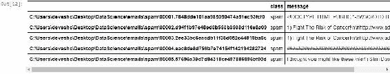

好了，现在到了有趣的部分，我们将使用 scikit-learn 中的`MultinomialNB()`函数来对我们的数据执行朴素贝叶斯。

```py
vectorizer = CountVectorizer() 
counts = vectorizer.fit_transform(data['message'].values) 

classifier = MultinomialNB() 
targets = data['class'].values 
classifier.fit(counts, targets) 

```

现在你的输出应该是这样的：

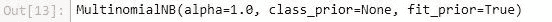

一旦我们构建了`MultinomialNB`分类器，它需要两个输入。它需要我们正在训练的实际数据（`counts`），以及每个数据的目标（`targets`）。所以`counts`基本上是每封电子邮件中所有单词的列表，以及该单词出现的次数。

所以`CountVectorizer()`的作用是：它从 DataFrame 中取出`message`列并获取其中的所有值。我将调用`vectorizer.fit_transform`，它基本上是将我数据中出现的所有单词进行标记或转换为数字，为其赋予数值。然后它会计算每个单词出现的次数。

这是一种更紧凑的方式来表示每个单词在电子邮件中出现的次数。我不是保留单词本身，而是将这些单词表示为稀疏矩阵中的不同值，这基本上是说我将每个单词视为一个数字，作为一个数值索引，进入一个数组。它所做的是，用简单的英语说，将每个消息拆分成其中包含的单词列表，并计算每个单词出现的次数。所以我们称之为`counts`。它基本上是每个单词在每个单独消息中出现的次数的信息。同时，`targets`是我遇到的每封电子邮件的实际分类数据。所以我可以使用我的 MultinomialNB()函数调用 classifier.fit()来实际使用朴素贝叶斯创建一个模型，该模型将根据我们提供的信息预测新的电子邮件是否是垃圾邮件。

让我们继续运行。它运行得相当快！我将在这里使用几个例子。让我们尝试一个只说“现在免费赚钱！”的消息正文，这显然是垃圾邮件，还有一个更无辜的消息，只是说“嗨鲍勃，明天打一场高尔夫怎么样？”所以我们要传递这些消息。

```py
examples = ['Free Money now!!!', "Hi Bob, how about a game of golf tomorrow?"] 
example_counts = vectorizer.transform(examples) 
predictions = classifier.predict(example_counts) 
predictions 

```

我们要做的第一件事是将消息转换为我训练模型的相同格式。所以我使用了创建模型时创建的相同的向量化器，将每条消息转换为一个单词和它们的频率的列表，其中单词由数组中的位置表示。一旦我完成了这个转换，我实际上可以在我的分类器上使用 predict()函数，对已经转换成单词列表的示例数组进行预测，看看我们得到了什么：

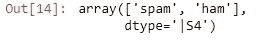

```py
array(['spam', 'ham'], dtype='|S4') 

```

当然，它有效！所以，给定这两个输入消息的数组，“现在免费赚钱！”和“嗨鲍勃”，它告诉我第一个结果是垃圾邮件，第二个结果是正常邮件，这正是我所期望的。这很酷。就是这样。

# 活动

我们这里有一个相当小的数据集，所以如果你愿意，你可以尝试通过一些不同的电子邮件，并查看是否会得到不同的结果。如果你真的想挑战自己，尝试将训练/测试应用到这个例子中。所以是否我的垃圾邮件分类器好不好的真正衡量标准不仅仅是它是否能直观地判断“现在免费赚钱！”是垃圾邮件。你想要定量地衡量它。

所以如果你想挑战一下，尝试将这些数据分成一个训练集和一个测试数据集。你实际上可以在网上查找如何使用 pandas 很容易地将数据分成训练集和测试集，或者你可以手动操作。无论哪种方式都可以。看看你是否能够将你的 MultinomialNB 分类器应用到一个测试数据集上，并衡量其性能。所以，如果你想要一点挑战，一点挑战，那就试试看吧。

这有多酷？我们只是用几行 Python 代码编写了自己的垃圾邮件分类器。使用 scikit-learn 和 Python 非常容易。这就是朴素贝叶斯的实际应用，现在你可以去分类一些垃圾邮件或正常邮件了。非常酷。接下来让我们谈谈聚类。

# K-Means 聚类

接下来，我们将讨论 K 均值聚类，这是一种无监督学习技术，你有一堆东西想要分成各种不同的簇。也许是电影类型或人口统计学，谁知道呢？但这实际上是一个相当简单的想法，所以让我们看看它是如何工作的。

K-means 聚类是机器学习中非常常见的技术，您只需尝试获取一堆数据，并根据数据本身的属性找到有趣的集群。听起来很花哨，但实际上非常简单。在 k-means 聚类中，我们所做的就是尝试将我们的数据分成 K 组-这就是 K 的含义，它是您尝试将数据分成多少不同组的数量-它通过找到 K 个质心来实现这一点。

所以，基本上，给定数据点属于哪个组是由散点图中它最接近的质心点来定义的。您可以在以下图像中可视化这一点：

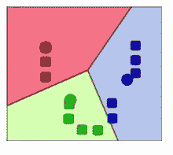

这是一个 K 为三的 k-means 聚类的示例，方块代表散点图中的数据点。圆圈代表 k-means 聚类算法得出的质心，并且每个点根据它最接近的质心被分配到一个集群中。所以，这就是全部内容，真的。这是无监督学习的一个例子。这不是一个情况，我们有一堆数据，我们已经知道给定一组训练数据的正确集群；相反，你只是给出了数据本身，它试图仅基于数据的属性自然地收敛到这些集群。这也是一个例子，您正在尝试找到甚至您自己都不知道存在的集群或分类。与大多数无监督学习技术一样，重点是找到潜在价值，直到算法向您展示它们之前，您并没有真正意识到它们的存在。

例如，百万富翁住在哪里？我不知道，也许有一些有趣的地理集群，富人倾向于居住在那里，k-means 聚类可以帮助您找出答案。也许我真的不知道今天的音乐流派是否有意义。现在成为另类是什么意思？不多，对吧？但是通过对歌曲属性进行 k-means 聚类，也许我可以找到相关的歌曲集群，并为这些集群代表的内容想出新的名称。或者我可以查看人口统计数据，也许现有的刻板印象已经不再有用。也许西班牙裔已经失去了意义，实际上有其他属性可以定义人群，例如，我可以通过聚类发现。听起来很花哨，不是吗？真的很复杂。具有 K 个集群的无监督机器学习，听起来很花哨，但与数据科学中的大多数技术一样，实际上是一个非常简单的想法。

以下是我们用简单英语的算法：

1.  **随机选择 K 个质心（k-means）：**我们从一组随机选择的质心开始。所以如果我们有三个 K，我们将在我们的组中寻找三个集群，并且我们将在我们的散点图中分配三个随机位置的质心。

1.  **将每个数据点分配给最接近的质心点：**然后我们将每个数据点分配给它最接近的随机分配的质心点。

1.  **根据每个质心点的平均位置重新计算质心：**然后重新计算我们得出的每个集群的质心。也就是说，对于我们最终得到的给定集群，我们将移动该质心以成为所有这些点的实际中心。

1.  **迭代直到点停止改变分配到质心：**我们将一直重复这个过程，直到这些质心停止移动，我们达到了一些阈值值，表示我们已经收敛到了某些东西。

1.  **预测新点的集群：**要预测我以前没有见过的新点的集群，我们只需通过我们的质心位置并找出它最接近的质心来预测其集群。

让我们看一个图形示例，以便更容易理解。我们将以下图像中的第一个图形称为 A，第二个称为 B，第三个称为 C，第四个称为 D。

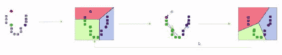

图 A 中的灰色方块代表我们散点图中的数据点。坐标轴代表某些不同特征。也许是年龄和收入；这是我一直在使用的一个例子，但它可以是任何东西。灰色方块可能代表个体人员、个体歌曲或我想要找到它们之间关系的任何东西。

因此，我首先随机在我的散点图上选择了三个点。可以是任何地方。总得从某个地方开始，对吧？我选择的三个点（质心）在图 A 中被表示为圆圈。接下来，我要做的是对于每个质心，计算它最接近的灰色点是哪一个。通过这样做，图中蓝色阴影的点与蓝色质心相关联。绿色点最接近绿色质心，而这个单独的红点最接近我选择的那个红色随机点。

当然，你可以看到这并不真正反映实际聚类的情况。因此，我要做的是取出每个聚类中的点，并计算这些点的实际中心。例如，在绿色聚类中，所有数据的实际中心实际上要低一点。我们会将质心向下移动一点。红色聚类只有一个点，所以它的中心移动到那个单个点的位置。而蓝色点实际上离中心相当近，所以只是移动了一点。在下一次迭代中，我们得到了类似图 D 的结果。现在你可以看到我们红色聚类的范围有所增加，事物也有所移动，也就是说，它们被从绿色聚类中取走了。

如果我们再次这样做，你可能可以预测接下来会发生什么。绿色的质心会移动一点，蓝色的质心仍然会保持在原来的位置。但最终你会得到你可能期望看到的聚类。这就是 k-means 的工作原理。因此，它会不断迭代，试图找到正确的质心，直到事物开始移动并收敛于一个解决方案。

# k-means 聚类的局限性

因此，k-means 聚类存在一些局限性。以下是其中一些：

1.  **选择 K：**首先，我们需要选择正确的 K 值，这并不是一件简单的事情。选择 K 的主要方法是从较低的值开始，根据你想要的群组数量不断增加 K 的值，直到停止获得平方误差的大幅减少。如果你观察每个点到它们的质心的距离，你可以将其视为一个误差度量。当你停止减少这个误差度量时，你就知道你可能有太多的聚类。因此，在那一点上，通过添加额外的聚类，你实际上并没有获得更多的信息。

1.  **避免局部最小值：**此外，还存在局部最小值的问题。你可能会因为初始质心的选择而非常不幸，它们最终可能只会收敛于局部现象，而不是更全局的聚类，因此通常情况下，你需要多次运行这个过程，然后将结果进行平均。我们称之为集成学习。我们稍后会更详细地讨论这个问题，但多次运行 k-means 并使用不同的随机初始值是一个很好的主意，看看你最终是否得到了相同的结果。

1.  **标记聚类：**最后，k-means 聚类的主要问题是得到的聚类没有标签。它只会告诉你这组数据点在某种程度上是相关的，但你无法给它们贴上名字。它无法告诉你该聚类的实际含义。假设我有一堆电影，我正在观看，k-means 聚类告诉我一堆科幻电影在这里，但它不会为我称它们为“科幻”电影。我需要深入数据并弄清楚，这些东西真正有什么共同点？我如何用英语描述它们？这是困难的部分，k-means 不会帮助你。所以再次，scikit-learn 使这变得非常容易。

现在，让我们举个例子，让 k-means 聚类付诸实践。

# 基于收入和年龄对人进行聚类

让我们看看使用 scikit-learn 和 Python 进行 k-means 聚类有多容易。

我们要做的第一件事是创建一些我们想要尝试进行聚类的随机数据。为了简化，我们实际上会在我们的假测试数据中构建一些聚类。所以假设这些数据之间存在一些真实的基本关系，并且其中存在一些真实的自然聚类。

为了做到这一点，我们可以使用 Python 中的`createClusteredData()`函数：

```py
from numpy import random, array 

#Create fake income/age clusters for N people in k clusters 
def createClusteredData(N, k): 
    random.seed(10) 
    pointsPerCluster = float(N)/k 
    X = [] 
    for i in range (k): 
        incomeCentroid = random.uniform(20000.0, 200000.0) 
        ageCentroid = random.uniform(20.0, 70.0) 
        for j in range(int(pointsPerCluster)): 
            X.append([random.normal(incomeCentroid, 10000.0), 
            random.normal(ageCentroid, 2.0)]) 
    X = array(X) 
    return X 

```

该函数从一致的随机种子开始，因此每次都会得到相同的结果。我们想要在 k 个聚类中创建 N 个人的聚类。所以我们将`N`和`k`传递给`createClusteredData()`。

我们的代码首先计算出每个聚类的点数，并将其存储在`pointsPerCluster`中。然后，它构建了一个起始为空的列表`X`。对于每个聚类，我们将创建一些收入的随机中心（`incomeCentroid`），介于 20,000 到 200,000 美元之间，以及一些年龄的随机中心（`ageCentroid`），介于 20 到 70 岁之间。

我们在这里所做的是创建一个假的散点图，显示了`N`个人和`k`个聚类的收入与年龄。所以对于我们创建的每个随机中心，我将创建一组正态分布的随机数据，收入的标准差为 10,000，年龄的标准差为 2。这将给我们一堆年龄收入数据，它们被聚类到一些我们可以随机选择的预先存在的聚类中。好的，让我们继续运行。

现在，要实际进行 k-means，你会看到它有多容易。

```py
from sklearn.cluster import KMeans 
import matplotlib.pyplot as plt 
from sklearn.preprocessing import scale 
from numpy import random, float 

data = createClusteredData(100, 5) 

model = KMeans(n_clusters=5) 

# Note I'm scaling the data to normalize it! Important for good results. 
model = model.fit(scale(data)) 

# We can look at the clusters each data point was assigned to 
print model.labels_  

# And we'll visualize it: 
plt.figure(figsize=(8, 6)) 
plt.scatter(data[:,0], data[:,1], c=model.labels_.astype(float)) 
plt.show() 

```

你所需要做的就是从 scikit-learn 的 cluster 包中导入`KMeans`。我们还要导入`matplotlib`，这样我们就可以可视化数据，还要导入`scale`，这样我们就可以看看它是如何工作的。

所以我们使用我们的`createClusteredData()`函数来说有 100 个随机人分布在 5 个聚类中。所以对于我创建的数据，有 5 个自然的聚类。然后我们创建一个模型，一个 k 为 5 的 KMeans 模型，所以我们选择 5 个聚类，因为我们知道这是正确的答案。但是在无监督学习中，你不一定知道`k`的真实值。你需要自己迭代和收敛到它。然后我们只需使用我们的 KMeans 模型使用我们的数据来调用`model.fit`。

现在我之前提到的规模，那是对数据进行归一化。k-means 的一个重要问题是，如果你的数据都归一化，它的效果会更好。这意味着一切都在相同的尺度上。所以我在这里遇到的问题是，我的年龄范围是 20 到 70 岁，但我的收入范围高达 20 万美元。所以这些值并不真正可比。收入远远大于年龄值。`Scale`将把所有数据一起缩放到一个一致的尺度，这样我就可以将这些数据进行比较，这将有助于你的 k-means 结果。

所以，一旦我们在我们的模型上调用了`fit`，我们实际上可以查看我们得到的结果标签。然后我们可以使用一点`matplotlib`的魔法来可视化它。你可以在代码中看到我们有一个小技巧，我们将颜色分配给了我们最终得到的标签，转换为一些浮点数。这只是一个小技巧，你可以用来为给定的值分配任意颜色。所以让我们看看我们最终得到了什么：

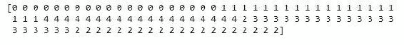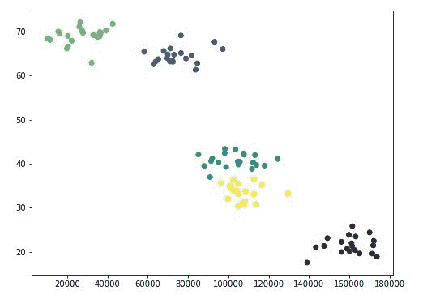

这并没有花太长时间。你可以看到结果基本上是我分配给每个东西的聚类。我们知道我们的假数据已经被预先聚类，所以它似乎很容易地识别了第一和第二个聚类。然而，在那之后它有点困惑了，因为我们中间的聚类实际上有点混在一起。它们并不是真的那么明显，所以这对 k 均值来说是一个挑战。但无论如何，它确实对聚类提出了一些合理的猜测。这可能是四个聚类更自然地适应数据的一个例子。

# 活动

所以我想让你做的一个活动是尝试不同的 k 值，看看你最终得到了什么。仅仅凭眼前的图表，看起来四个可能效果很好。真的吗？如果我把 k 增加得太大会发生什么？我的结果会怎样？它会尝试将事物分成什么，这甚至有意义吗？所以，玩一下，尝试不同的`k`值。所以在`n_clusters()`函数中，将 5 改为其他值。再次运行一遍，看看你最终得到了什么。

这就是 k 均值聚类的全部内容。就是这么简单。你可以使用 scikit-learn 的`KMeans`从`cluster`中的东西。唯一真正需要注意的是：确保你对数据进行缩放，归一化。你希望确保你用 k 均值进行处理的东西是可比较的，`scale()`函数会为你做到这一点。所以这些是 k 均值聚类的主要内容。非常简单的概念，使用 scikit-learn 更简单。

就是这样。这就是 k 均值聚类。所以如果你有一堆未分类的数据，而且你事先并没有正确的答案，这是一个很好的方法来自然地找到数据的有趣分组，也许这可以让你对数据有一些见解。这是一个很好的工具。我以前在现实世界中使用过它，而且真的并不难使用，所以记住它。

# 测量熵

很快我们就要进入机器学习中更酷的部分之一，至少我认为是，叫做决策树。但在我们谈论那之前，理解数据科学中熵的概念是必要的。

所以熵，就像在物理学和热力学中一样，是数据集的混乱程度的度量，数据集的相同或不同程度。所以想象一下，我们有一个不同分类的数据集，例如动物。比如说我有一堆我已经按物种分类的动物。现在，如果我的数据集中的所有动物都是鬣蜥，我就有很低的熵，因为它们都是一样的。但如果我的数据集中的每个动物都是不同的动物，我有鬣蜥和猪和树懒和谁知道还有什么，那么我就会有更高的熵，因为我的数据集中有更多的混乱。事物之间的不同性大于相同性。

熵只是一种量化我的数据中相同或不同的方式。所以，熵为 0 意味着数据中的所有类别都是相同的，而如果一切都不同，我就会有很高的熵，而介于两者之间的情况将是介于两者之间的数字。熵只是描述数据集中的事物是相同还是不同的方式。

现在从数学上讲，它比那复杂一点，所以当我实际计算熵的数值时，它是使用以下表达式计算的：

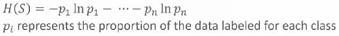

所以对于我数据中的每个不同类，我将有一个这样的 p 项，p[1]，p[2]，等等，直到 p[n]，对于我可能有的 n 个不同类。p 只是表示数据中是那个类的比例。如果你实际上绘制出每个项的样子- `pi* ln * pi`，它看起来会有点像下面的图表：

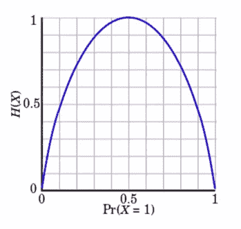

你为每个单独的类加起来。例如，如果数据的比例，也就是说，对于给定的类是 0，那么对总熵的贡献就是 0。如果一切都是这个类，那么对总熵的贡献也是 0，因为在任何一种情况下，如果没有任何东西是这个类或者一切都是这个类，那实际上并没有对总熵做出任何贡献。

中间的事物会为类的熵做出贡献，那里有一些这种分类和其他东西的混合。当你把所有这些项加在一起时，你就得到了整个数据集的总熵。所以从数学上讲，就是这样运作的，但是，这个概念非常简单。它只是衡量你的数据集有多无序，你的数据中的事物有多相同或不同。

# 决策树-概念

信不信由你，给定一组训练数据，你实际上可以让 Python 为你生成一个流程图来做出决定。所以如果你有一些你想要在某些分类上进行预测的东西，你可以使用决策树来实际查看流程图中每个级别上可以决定的多个属性。你可以打印出一个实际的流程图供你使用，以便基于实际的机器学习做出决定。这有多酷？让我们看看它是如何运作的。

我个人认为决策树是机器学习中最有趣的应用之一。决策树基本上给出了如何做出某些决定的流程图。你有一些依赖变量，比如今天是否应该根据天气出去玩。当你有一个依赖于多个属性或多个变量的决定时，决策树可能是一个不错的选择。

天气的许多不同方面可能会影响我是否应该出去玩的决定。这可能与湿度、温度、是否晴天等有关。决策树可以查看天气的所有这些不同属性，或者其他任何东西，并决定什么是阈值？在每个属性上我需要做出什么决定，然后才能决定我是否应该出去玩？这就是决策树的全部内容。所以它是一种监督学习。

在这个例子中，它的工作方式如下。我会有一些关于历史天气的数据集，以及关于人们在特定一天是否出去玩的数据。我会向模型提供这些数据，比如每天是否晴天，湿度是多少，是否刮风，以及那天是否适合出去玩。在给定这些训练数据的情况下，决策树算法可以得出一棵树，给我们一个流程图，我们可以打印出来。它看起来就像下面的流程图。你可以浏览并根据当前属性来判断是否适合出去玩。你可以用它来预测新一组值的决定：

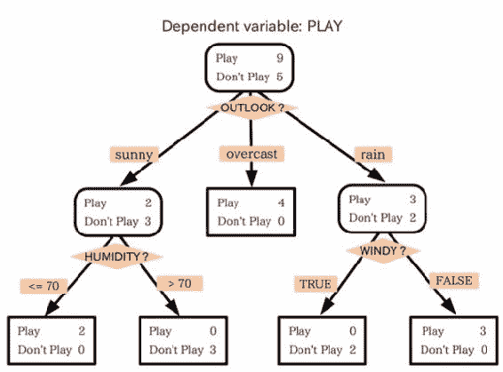

这有多酷？我们有一个算法，可以根据观测数据自动生成流程图。更酷的是，一旦你学会了它的工作原理，它的一切都是如此简单。

# 决策树示例

假设我想建立一个系统，根据其中的信息自动筛选简历。技术公司面临的一个大问题是，我们为我们的职位收到了大量的简历。我们必须决定我们实际上要邀请谁来面试，因为飞某人出来并且实际上花时间进行面试可能是很昂贵的。那么，如果有一种方法可以将实际上被雇佣的人的历史数据与他们简历中的信息相匹配，那会怎么样呢？

我们可以构建一个决策树，让我们可以浏览个人简历，并说，“好的，这个人实际上有很高的被雇佣可能性，或者没有”。我们可以根据历史数据训练一个决策树，并为未来的候选人走过这个流程。那不是一件很美好的事情吗？

所以让我们制作一些完全捏造的雇佣数据，我们将在这个例子中使用。

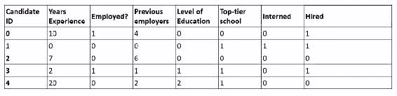

在前面的表中，我们有一些只用数字标识的候选人。我将挑选一些我认为可能有趣或有助于预测他们是否是一个好的雇佣者的属性。他们有多少年的工作经验？他们目前有工作吗？他们之前有多少雇主？他们的教育水平是多少？他们有什么学位？他们是否上过我们分类为顶尖学校？他们在大学期间是否做过实习？我们可以看一下这些历史数据，这里的因变量是“被雇佣”。这个人实际上是否根据这些信息得到了工作机会？

现在，显然这个模型中没有的很多信息可能非常重要，但是我们从这些数据中训练出来的决策树实际上可能有助于在初步筛选一些候选人时使用。我们最终得到的可能是一个看起来像下面这样的树：

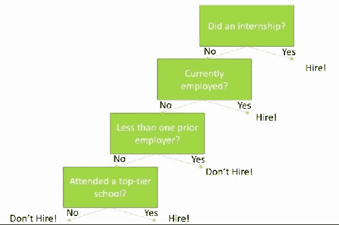

+   所以事实证明，在我完全捏造的数据中，任何在大学实习的人最终都得到了工作机会。所以我的第一个决策点是“这个人是否做过实习？”如果是，那就让他们进来吧。根据我的经验，实习实际上是一个相当好的人才预测指标。如果他们有主动性去实习，并且在实习中真正学到了东西，那是一个好迹象。

+   他们目前有工作吗？嗯，如果他们目前有工作，那么在我的非常小的虚拟数据集中，结果表明他们值得雇佣，只是因为其他人也认为他们值得雇佣。显然，在现实世界中，这将是一个更微妙的决定。

+   如果他们目前没有工作，他们之前的雇主少于一个吗？如果是，这个人以前从未工作过，他们也没有做过实习。可能不是一个好的雇佣决定。不要雇佣这个人。

+   但是如果他们之前有过雇主，他们是否至少上过一所顶尖学校？如果没有，那就有点靠不住。如果是，那么是的，我们应该根据我们训练的数据来雇佣这个人。

# 浏览决策树

这就是你如何浏览决策树的结果。就像浏览流程图一样，算法可以为你产生这样的结果，这真是太棒了。算法本身实际上非常简单。让我解释一下算法是如何工作的。

在决策树流程图的每一步，我们找到可以将我们的数据分区的属性，以最小化下一步数据的熵。所以我们得到了一组分类：在这种情况下是雇佣或不雇佣，我们希望选择在下一步最小化熵的属性决策。

在每一步，我们希望所有剩下的选择都导致尽可能多的不录用或尽可能多的录用决定。我们希望使数据变得越来越统一，因此当我们沿着流程图向下工作时，最终我们最终得到一组候选人，要么全部录用，要么全部不录用，这样我们就可以在决策树上对是/否做出分类。因此，我们只需沿着树走，通过选择正确的属性来最小化每一步的熵，直到我们用完为止。

这种算法有一个花哨的名字。它被称为**ID3**（**迭代二分器 3**）。这是一个贪婪算法。因此，当它沿着树走时，它只选择在那一点上最小化熵的属性。现在，这可能实际上不会导致最小化你必须做出的选择的最佳树，但它将会得到一个树，鉴于你给它的数据。

# 随机森林技术

现在决策树的一个问题是它们很容易过拟合，所以你可能会得到一个对训练数据非常有效的决策树，但对于那些它以前没有见过的新人的正确分类预测可能并不那么好。决策树的核心是为你提供的训练数据做出正确的决策，但也许你并没有真正考虑到正确的属性，也许你没有给它足够代表性的人员样本来学习。这可能会导致真正的问题。

为了解决这个问题，我们使用一种称为随机森林的技术，其思想是我们以不同的方式对我们进行训练的数据进行采样，用于多个不同的决策树。每棵决策树从我们的训练数据集中随机选择不同的样本，并从中构建一棵树。然后每棵树都可以对正确的结果进行投票。

现在我们使用相同模型对我们的数据进行随机重采样的技术被称为自举聚合，或者称为装袋。这是一种我们称之为集成学习的形式，我们很快会更详细地介绍。但基本思想是我们有多个树，如果你愿意的话，可以称之为树的森林，每个树都使用我们要训练的数据的随机子样本。然后每棵树都可以对最终结果进行投票，这将帮助我们对给定的训练数据进行过拟合。

随机森林可以做的另一件事是在它尝试最小化熵的同时，实际上限制它可以在每个阶段选择的属性数量。我们可以在每个级别随机选择它可以选择的属性。因此，这也使我们的树与树之间更加多样化，因此我们得到了更多可以相互竞争的算法的变化。它们可以使用略有不同的方法对最终结果进行投票，以达到相同的答案。

这就是随机森林的工作原理。基本上，它是一组决策树的森林，它们从不同的样本和不同的属性集中进行选择。

因此，有了这一切，让我们去做一些决策树。当我们完成后，我们也将使用随机森林，因为 scikit-learn 使得这变得非常容易，很快你就会看到。

# 决策树 - 使用 Python 预测招聘决策

事实证明，制作决策树很容易；事实上，只需几行 Python 代码就可以做到这一点。所以让我们试一试。

我已经在你的书材料中包含了一个`PastHires.csv`文件，里面只包含了一些虚构的数据，是我根据候选人的属性编造的，这些候选人要么得到了工作机会，要么没有。

```py
import numpy as np 
import pandas as pd 
from sklearn import tree 

input_file = "c:/spark/DataScience/PastHires.csv" 
df = pd.read_csv(input_file, header = 0) 

```

请立即更改我在这里使用的路径，用于我的系统（`c:/spark/DataScience/PastHires.csv`），改为你安装本书材料的位置。我不确定你把它放在哪里，但几乎肯定不是那里。

我们将使用`pandas`读取我们的 CSV 文件，并将其创建为一个 DataFrame 对象。让我们继续运行我们的代码，并可以使用 DataFrame 的`head()`函数打印出前几行，确保它看起来是有意义的。

```py
df.head() 

```

确实，我们在输出中有一些有效的数据：

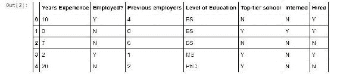

因此，对于每个候选人 ID，我们有他们的过去工作经验年限，是否就业，以前的雇主数量，他们的最高教育水平，是否就读顶级学校，是否做过实习；最后，在 Hired 列中，答案-我们知道我们是否向这个人提供了工作机会。

通常情况下，大部分工作只是在处理数据，准备数据，然后才实际运行算法，这就是我们需要在这里做的。现在 scikit-learn 要求一切都是数字，所以我们不能有 Y 和 N 和 BS 和 MS 和 PhD。我们必须将所有这些东西转换为数字，以便决策树模型能够工作。在 pandas 中使用一些简写可以使这些事情变得容易。例如：

```py
d = {'Y': 1, 'N': 0} 
df['Hired'] = df['Hired'].map(d) 
df['Employed?'] = df['Employed?'].map(d) 
df['Top-tier school'] = df['Top-tier school'].map(d) 
df['Interned'] = df['Interned'].map(d) 
d = {'BS': 0, 'MS': 1, 'PhD': 2} 
df['Level of Education'] = df['Level of Education'].map(d) 
df.head() 

```

基本上，我们在 Python 中创建一个字典，将字母 Y 映射为数字 1，将字母 N 映射为值 0。因此，我们想将所有的 Y 转换为 1，将所有的 N 转换为 0。因此 1 表示是，0 表示否。我们只需从 DataFrame 中取出 Hired 列，并在其上调用`map()`，使用一个字典。这将遍历整个 DataFrame 中的 Hired 列，并使用该字典查找来转换该列中的所有条目。它返回一个新的 DataFrame 列，我将其放回到 Hired 列中。这将用 1 和 0 映射的列替换 Hired 列。

我们对就业，顶级学校和实习做同样的处理，所以所有这些都使用是/否字典进行映射。因此，Y 和 N 变成了 1 和 0。对于教育水平，我们也使用同样的技巧，创建一个将 BS 分配为 0，MS 分配为 1，PhD 分配为 2 的字典，并使用它来重新映射这些学位名称为实际的数值。所以如果我继续运行并再次使用`head()`，你会看到它起作用了：

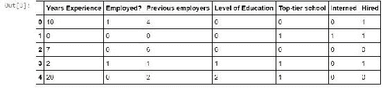

我的所有是 1，我的所有否是 0，我的教育水平现在由具有实际含义的数值表示。

接下来，我们需要准备一切以实际进入我们的决策树分类器，这并不难。为此，我们需要分离我们的特征信息，即我们试图预测的属性，以及我们的目标列，其中包含我们试图预测的东西。为了提取特征名称列的列表，我们只需创建一个列的列表，直到第 6 列。我们继续打印出来。

```py
features = list(df.columns[:6]) 
features 

```

我们得到以下输出：

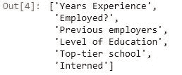

上面是包含我们特征信息的列名：工作经验年限，是否就业，以前的雇主，教育水平，顶级学校和实习。这些是我们想要预测雇佣的候选人的属性。

接下来，我们构建我们的*y*向量，它被分配为我们要预测的内容，也就是我们的 Hired 列：

```py
y = df["Hired"] 
X = df[features] 
clf = tree.DecisionTreeClassifier() 
clf = clf.fit(X,y) 

```

这段代码提取整个 Hired 列并将其命名为`y`。然后它将所有特征数据的列放入一个名为`X`的对象中。这是所有数据和所有特征列的集合，`X`和`y`是我们的决策树分类器需要的两个东西。

要实际创建分类器本身，只需两行代码：我们调用`tree.DecisionTreeClassifier()`来创建我们的分类器，然后将其拟合到我们的特征数据(`X`)和答案(`y`) - 是否雇佣了人。所以，让我们继续运行。

显示图形数据有点棘手，我不想在这里分散我们太多的注意力，所以请只考虑以下样板代码。你不需要深入了解 Graph viz 在这里的工作方式 - 以及 dot 文件和所有这些东西：这对我们的旅程现在不重要。你需要实际显示决策树最终结果的代码只是：

```py
from IPython.display import Image   
from sklearn.externals.six import StringIO   
import pydot  

dot_data = StringIO()   
tree.export_graphviz(clf, out_file=dot_data,   
                         feature_names=features)   
graph = pydot.graph_from_dot_data(dot_data.getvalue())   
Image(graph.create_png()) 

```

所以让我们继续运行这个。

你的输出现在应该是这样的：

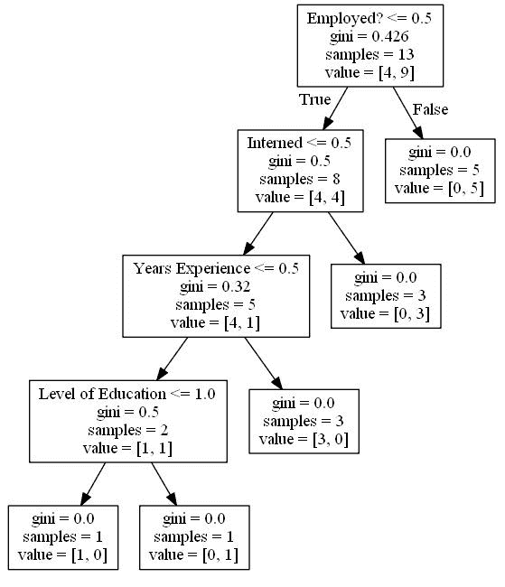

我们有了！这有多酷！我们这里有一个实际的流程图。

现在，让我告诉你如何阅读它。在每个阶段，我们都有一个决定。记住，我们的大多数数据是是或否，将是 0 或 1。所以，第一个决定点是：就业？小于 0.5 吗？这意味着如果我们有一个就业价值为 0，那就是不，我们将向左走。如果就业是 1，也就是是，我们将向右走。

那么，他们以前受雇吗？如果没有，向左走，如果是，向右走。结果是，在我的样本数据中，每个目前受雇的人实际上都得到了一个工作机会，所以我可以非常快速地说，如果你目前受雇，是的，你值得被带进来，我们将继续到第二个层级。

那么，你如何解释这个呢？基尼分数基本上是在每一步使用的熵的度量。记住，当我们进行算法时，它试图最小化熵的量。样本是之前的决定没有分割的剩余样本数量。

所以说这个人以前是受雇的。阅读右叶节点的方法是值列，告诉你在这一点上，我们有 0 个候选人是不被雇佣的，有 5 个是被雇佣的。所以，解释第一个决定点的方法是，如果就业？是 1，我会向右走，这意味着他们目前是受雇的，这让我进入了一个每个人都得到了工作机会的世界。所以，这意味着我应该雇佣这个人。

现在假设这个人目前没有工作。我接下来要看的是，他们有实习吗。如果是，那么在我们的训练数据中，每个人都得到了一个工作机会。所以，在那一点上，我们可以说我们的熵现在是 0（`gini=0.0000`），因为每个人都一样，在那一点上他们都得到了一个工作机会。然而，你知道，如果我们继续下去（在这个人没有做实习的情况下），我们将到达一个熵为 0.32 的点。它越来越低，这是一件好事。

接下来我们要看的是他们有多少经验，他们有不到一年的经验吗？如果情况是他们确实有一些经验，并且他们已经走到了这一步，他们是一个相当好的不被雇佣的决定。我们最终到达了熵为零的点，但是，在我们的训练集中剩下的三个样本都是不被雇佣的。我们有 3 个不被雇佣和 0 个被雇佣。但是，如果他们经验较少，那么他们可能刚刚从大学毕业，他们仍然值得一看。

我们要看的最后一件事是他们是否上了一所顶尖学校，如果是的话，他们最终会成为一个好的预测被雇佣。如果不是，他们最终会成为一个不被雇佣。我们最终有一个候选人属于这个类别，是一个不被雇佣，还有 0 个被雇佣。而在候选人确实上了一所顶尖学校的情况下，我们有 0 个不被雇佣和 1 个被雇佣。

所以，你可以看到，我们一直走下去，直到我们达到熵为 0，如果可能的话，对于每种情况。

# 集成学习 - 使用随机森林

现在，假设我们想使用随机森林，你知道，我们担心我们可能过度拟合我们的训练数据。实际上，很容易创建一个多个决策树的随机森林分类器。

所以，为了做到这一点，我们可以使用之前创建的相同数据。你只需要你的`*X*`和`*y*`向量，也就是特征集和你试图预测的列：

```py
from sklearn.ensemble import RandomForestClassifier 

clf = RandomForestClassifier(n_estimators=10) 
clf = clf.fit(X, y) 

#Predict employment of an employed 10-year veteran 
print clf.predict([[10, 1, 4, 0, 0, 0]]) 
#...and an unemployed 10-year veteran 
print clf.predict([[10, 0, 4, 0, 0, 0]]) 

```

我们制作了一个随机森林分类器，也可以从 scikit-learn 中获得，并传递给它我们想要在我们的森林中的树的数量。所以，在上面的代码中，我们的随机森林中有十棵树。然后我们将其适配到模型上。

你不必手动遍历树，而且当你处理随机森林时，你也不能真正这样做。所以，我们在模型上使用`predict()`函数，也就是我们制作的分类器上。我们传入一个给定候选人的所有不同特征的列表，我们想要预测他们的就业情况。

如果你记得，这些映射到这些列：工作经验，就业情况，以前的雇主，教育水平，顶级学校和实习；被解释为数值。我们预测一个有工作的 10 年经验的老手的就业情况。我们还预测一个失业的 10 年经验的老手的就业情况。果然，我们得到了一个结果：

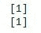

在这种情况下，我们最终都做出了雇佣决定。但有趣的是，这其中有一个随机因素。你实际上并不会每次都得到相同的结果！往往情况下，失业者并不会得到工作机会，如果你继续运行这个过程，你会发现通常情况下都是这样。但是，bagging 的随机性，每棵树的自助聚合的随机性，意味着你不会每次都得到相同的结果。所以，也许 10 棵树还不够。总之，这是一个很好的教训！

# 活动

作为一个活动，如果你想回去玩一下，可以玩弄我的输入数据。随意编辑我们一直在探索的代码，并创建一个颠倒世界的替代宇宙；例如，我给工作机会的每个人现在都不再得到工作机会，反之亦然。看看这对你的决策树有什么影响。只是随意玩弄一下，看看你能做什么，并尝试解释结果。

所以，那就是决策树和随机森林，我认为这是机器学习中更有趣的部分之一。我总是觉得能够从空中生成一个流程图非常酷。所以，希望你会觉得这很有用。

# 集成学习

当我们谈论随机森林时，那是集成学习的一个例子，我们实际上将多个模型组合在一起，以得到比任何单个模型更好的结果。所以，让我们更深入地了解一下。让我们更多地谈谈集成学习。

所以，还记得随机森林吗？我们有一堆使用输入数据的不同子样本和不同属性集的决策树，当你试图在最后对某些东西进行分类时，它们都对最终结果进行投票。这就是集成学习的一个例子。另一个例子：当我们谈论 k 均值聚类时，我们有一个想法，也许使用不同的 k 均值模型和不同的初始随机质心，让它们都对最终结果进行投票。这也是集成学习的一个例子。

基本上，这个想法是你有不止一个模型，它们可能是相同类型的模型，也可能是不同类型的模型，但你在你的训练数据集上运行它们所有，并且它们都对你试图预测的最终结果进行投票。往往情况下，你会发现这个不同模型的集合产生比任何单个模型本身更好的结果。

几年前的一个很好的例子是 Netflix 奖。Netflix 举办了一项比赛，他们提供了我认为是一百万美元的奖金，给任何研究人员，如果他们能够超越现有的电影推荐算法。获胜的方法是集成方法，他们实际上同时运行多个推荐算法，并让它们都对最终结果进行投票。因此，集成学习可以是一种非常强大而简单的工具，用于提高机器学习中最终结果的质量。现在让我们尝试探索各种类型的集成学习：

+   **自举聚合或装袋：**现在，随机森林使用一种称为装袋的技术，简称自举聚合。这意味着我们从训练数据中随机抽取子样本，并将它们馈送到同一模型的不同版本中，让它们都对最终结果进行投票。如果你还记得，随机森林采用许多不同的决策树，这些决策树使用训练数据的不同随机样本进行训练，然后它们最终汇聚在一起对最终结果进行投票。这就是装袋。

+   **提升：**提升是一种替代模型，其思想是你从一个模型开始，但每个后续模型都增强了前一个模型误分类的属性。因此，你在一个模型上进行训练/测试，找出它基本上搞错了什么属性，然后在后续模型中增强这些属性 - 希望后续模型会更加关注它们，并且把它们搞对。这就是提升的一般思想。你运行一个模型，找出它的弱点，随着你的进行，增强对这些弱点的关注，并且不断构建更多的模型，这些模型根据前一个模型的弱点进行改进。

+   **模型桶：**另一种技术，这就是 Netflix 奖的获奖者所做的，称为模型桶，你可能有完全不同的模型来尝试预测某些东西。也许我正在使用 k-means、决策树和回归。我可以同时在一组训练数据上运行这三个模型，并让它们都对在预测时的最终分类结果进行投票。也许这比单独使用其中任何一个模型要好。

+   **堆叠：**堆叠有相同的思想。因此，你在数据上运行多个模型，以某种方式将结果组合在一起。桶模型和堆叠之间的微妙差异在于你选择获胜的模型。因此，你运行训练/测试，找出最适合你的数据的模型，并使用该模型。相比之下，堆叠将所有这些模型的结果组合在一起，得出最终结果。

现在，有一个关于集成学习的研究领域，试图找到最佳的集成学习方法，如果你想显得聪明，通常这涉及大量使用贝叶斯这个词。因此，有一些非常先进的集成学习方法，但它们都有弱点，我认为这又是一个教训，即我们应该始终使用对我们有效的最简单的技术。

现在，这些都是非常复杂的技术，在本书的范围内我无法深入讨论，但归根结底，很难超越我们已经讨论过的简单技术。以下列出了一些复杂的技术：

+   **贝叶斯最优分类器：**理论上，有一种称为贝叶斯最优分类器，它将始终是最好的，但这是不切实际的，因为计算上是禁止的。

+   贝叶斯参数平均化：许多人尝试对贝叶斯最优分类器进行变化，使其更实用，比如贝叶斯参数平均化变化。但它仍然容易过拟合，通常被随机森林背包法超越；你只需多次重新采样数据，运行不同模型，让它们投票决定最终结果。结果表明这样做同样有效，而且简单得多！

+   贝叶斯模型组合：最后，有一种称为贝叶斯模型组合的东西，试图解决贝叶斯最优分类器和贝叶斯参数平均化的所有缺点。但是，归根结底，它并没有比只是交叉验证组合模型做得更好。

再次强调，这些都是非常复杂的技术，非常难以使用。在实践中，我们最好使用我们更详细讨论过的更简单的技术。但是，如果你想显得聪明并经常使用贝叶斯这个词，熟悉这些技术并知道它们是什么是很好的。

因此，这就是集成学习。再次强调的是，像自助聚合、背包法、提升法、堆叠法或模型桶之类的简单技术通常是正确的选择。还有一些更花哨的技术，但它们在很大程度上是理论性的。但是，至少现在你知道它们了。

尝试集成学习总是一个好主意。一次又一次地证明，它将产生比任何单一模型更好的结果，因此一定要考虑它！

# 支持向量机概述

最后，我们将讨论支持向量机（SVM），这是一种非常先进的方法，用于聚类或分类高维数据。

那么，如果你有多个要预测的特征呢？支持向量机可能是一个非常强大的工具，结果可能非常好！它在内部非常复杂，但重要的是要理解何时使用它，以及它在更高层次上是如何工作的。所以，现在让我们来讨论支持向量机。

支持向量机是一个花哨的名字，实际上是一个花哨的概念。但幸运的是，它非常容易使用。重要的是要知道它的作用和用途。因此，支持向量机对于分类高维数据效果很好，我指的是许多不同的特征。因此，使用 k 均值聚类之类的东西很容易对具有两个维度的数据进行聚类，也许一个维度是年龄，另一个维度是收入。但是，如果我有许多不同的特征要预测，那么支持向量机可能是一个不错的选择。

支持向量机找到高维支持向量，用于划分数据（数学上，这些支持向量定义超平面）。也就是说，数学上，支持向量机可以找到高维支持向量（这就是它得名的地方），这些支持向量定义了将数据分成不同簇的高维平面。

显然，所有这些都很快变得非常奇怪。幸运的是，scikit-learn 软件包将为您完成所有这些，而无需您实际参与其中。在内部，您需要理解它使用一种称为核技巧的东西来实际找到那些在较低维度中可能不明显的支持向量或超平面。您可以使用不同的核来以不同的方式执行此操作。主要问题是，如果您有具有许多不同特征的高维数据，支持向量机是一个不错的选择，您可以使用不同的核，其计算成本不同，并且可能更适合手头的问题。

重要的一点是 SVM 使用一些高级数学技巧来对数据进行聚类，并且可以处理具有许多特征的数据集。它也相当昂贵 - "核技巧"是唯一使其可能的东西。

我想指出 SVM 是一种监督学习技术。因此，我们实际上要在一组训练数据上对其进行训练，并且我们可以使用它来对未来未见数据或测试数据进行预测。这与 k 均值聚类有点不同，k 均值是完全无监督的；相比之下，支持向量机是基于实际训练数据进行训练的，其中你有一些数据集的正确分类答案可以学习。因此，如果你愿意的话，SVM 对于分类和聚类是有用的 - 但这是一种监督技术！

SVM 经常使用的一个例子是使用称为支持向量分类的东西。典型的例子使用了 Iris 数据集，这是 scikit-learn 附带的样本数据集之一。这个数据集是对不同的鸢尾花进行分类，不同的鸢尾花的不同观察和它们的种类。这个想法是使用关于每朵花瓣的长度和宽度以及每朵花萼的长度和宽度的信息来对这些进行分类。 （萼片显然是花瓣下面的一个小支撑结构。我直到现在也不知道。）你有四个属性的维度；你有花瓣的长度和宽度，以及萼片的长度和宽度。你可以使用这些信息来预测给定信息的鸢尾花的种类。

这是使用 SVC 进行的一个例子：基本上，我们将萼片宽度和萼片长度投影到二维，这样我们就可以实际可视化它：

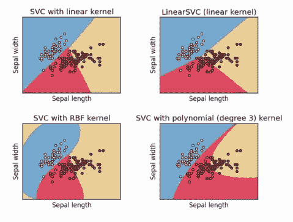

使用不同的核心可能会得到不同的结果。具有线性核心的 SVC 将产生与前面图像中看到的非常相似的东西。你可以使用多项式核心或更复杂的核心，可能会在图像中显示为二维曲线。你可以通过这种方式进行一些相当花哨的分类。

这些都会增加计算成本，并且可以产生更复杂的关系。但同样，这是一种情况，过于复杂可能会产生误导性的结果，因此你需要小心，并在适当的时候使用训练/测试。由于我们正在进行监督学习，你实际上可以进行训练/测试，并找到适合的模型，或者使用集成方法。

你需要找到适合当前任务的正确核心。对于多项式 SVC 之类的东西，使用什么程度的多项式才是正确的？即使是线性 SVC 也会有与之相关的不同参数，你可能需要进行优化。这将在一个真实的例子中更有意义，所以让我们深入一些实际的 Python 代码，看看它是如何工作的！

# 使用 SVM 通过 scikit-learn 对人进行聚类

让我们在这里尝试一些支持向量机。幸运的是，使用起来比理解起来要容易得多。我们将回到我用于 k 均值聚类的相同示例，我将创建一些关于一百个随机人的年龄和收入的虚构集群数据。

如果你想回到 k 均值聚类部分，你可以了解更多关于生成虚假数据的代码背后的想法。如果你准备好了，请考虑以下代码：

```py
import numpy as np 

#Create fake income/age clusters for N people in k clusters 
def createClusteredData(N, k): 
    pointsPerCluster = float(N)/k 
    X = [] 
    y = [] 
    for i in range (k): 
        incomeCentroid = np.random.uniform(20000.0, 200000.0) 
        ageCentroid = np.random.uniform(20.0, 70.0) 
        for j in range(int(pointsPerCluster)): 
            X.append([np.random.normal(incomeCentroid, 10000.0),  
            np.random.normal(ageCentroid, 2.0)]) 
            y.append(i) 
    X = np.array(X) 
    y = np.array(y) 
    return X, y 

```

请注意，因为我们在这里使用的是监督学习，我们不仅需要再次使用特征数据，还需要我们训练数据集的实际答案。

这里的`createClusteredData（）`函数的作用是根据年龄和收入创建一堆围绕`k`点聚集的随机数据，并返回两个数组。第一个数组是我们称之为`X`的特征数组，然后我们有我们试图预测的东西的数组，我们称之为`y`。在 scikit-learn 中，当你创建一个可以进行预测的模型时，这些是它将接受的两个输入，特征向量的列表和你试图预测的东西，它可以从中学习。所以，我们将继续运行。

所以现在我们将使用`createClusteredData（）`函数创建 100 个随机人，分为 5 个不同的集群。我们将创建一个散点图来说明这些人的情况，并看看他们最终落在哪里：

```py
%matplotlib inline 
from pylab import * 

(X, y) = createClusteredData(100, 5) 

plt.figure(figsize=(8, 6)) 
plt.scatter(X[:,0], X[:,1], c=y.astype(np.float)) 
plt.show() 

```

下图显示了我们正在处理的数据。每次运行这个程序，你都会得到一组不同的集群。所以，你知道，我实际上没有使用随机种子...让生活变得有趣。

这里有几个新东西 - 我在`plt.figure（）`上使用了`figsize`参数来实际上制作一个更大的图。所以，如果你需要在`matplotlib`中调整大小，就是这样做的。我使用了相同的技巧，将颜色作为我最终得到的分类号。所以我开始的集群号被绘制为这些数据点的颜色。你可以看到，这是一个相当具有挑战性的问题，这里肯定有一些集群的交错：

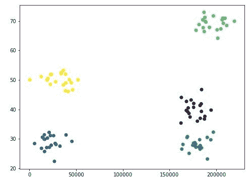

现在我们可以使用线性 SVC（SVC 是 SVM 的一种形式）来将其分成集群。我们将使用具有线性核的 SVM，并且 C 值为`1.0`。C 只是一个可以调整的错误惩罚项；默认为`1`。通常情况下，你不会想去改变它，但如果你正在使用集成学习或训练/测试对正确模型进行一些收敛，那就是你可以玩耍的东西之一。然后，我们将将该模型拟合到我们的特征数据和我们的训练数据集的实际分类。

```py
from sklearn import svm, datasets 

C = 1.0 
svc = svm.SVC(kernel='linear', C=C).fit(X, y) 

```

所以，让我们继续运行。我不想过多地讨论我们实际上将如何可视化结果，只是相信`plotPredictions（）`是一个可以绘制分类范围和 SVC 的函数。

它帮助我们可视化不同分类的位置。基本上，它在整个网格上创建一个网格，并且会将来自 SVC 模型的不同分类作为网格上的不同颜色进行绘制，然后我们将在其上绘制我们的原始数据：

```py
def plotPredictions(clf): 
    xx, yy = np.meshgrid(np.arange(0, 250000, 10), 
                     np.arange(10, 70, 0.5)) 
    Z = clf.predict(np.c_[xx.ravel(), yy.ravel()]) 

    plt.figure(figsize=(8, 6)) 
    Z = Z.reshape(xx.shape) 
    plt.contourf(xx, yy, Z, cmap=plt.cm.Paired, alpha=0.8) 
    plt.scatter(X[:,0], X[:,1], c=y.astype(np.float)) 
    plt.show() 

plotPredictions(svc) 

```

所以，让我们看看它是如何工作的。SVC 的计算成本很高，所以运行时间很长：

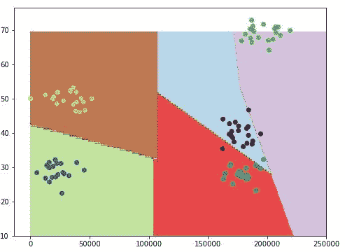

你可以在这里看到它尽了最大努力。考虑到它必须绘制直线和多边形形状，它做了不错的工作来适应我们的数据。所以，你知道，它错过了一些 - 但总体上，结果还是相当不错的。

SVC 实际上是一种非常强大的技术；它的真正优势在于更高维度的特征数据。继续玩耍吧。顺便说一句，如果你不仅想可视化结果，你可以像在 scikit-learn 中的几乎任何模型一样使用`predict（）`函数在 SVC 模型上，传入你感兴趣的特征数组。如果我想预测一个年收入为 20 万美元，年龄为 40 岁的人的分类，我将使用以下代码：

```py
svc.predict([[200000, 40]])

```

这将把这个人放在我们的情况下，集群编号 1 中：

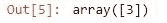

如果我在这里有一个年收入为 50,000 美元，年龄为 65 岁的人，我将使用以下代码：

```py
svc.predict([[50000, 65]])

```

这是你的输出现在应该看起来的样子：

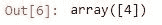

这个人最终会进入集群编号 2，无论在这个例子中代表什么。所以，继续玩耍吧。

# 活动

现在，线性只是你可以使用的许多内核之一，就像我说的，你可以使用许多不同的内核。其中之一是多项式模型，所以你可能想试试。请继续查阅文档。查看文档对你来说是一个很好的练习。如果你要深入使用 scikit-learn，你有很多不同的功能和选项可供选择。所以，去在线查找 scikit-learn，找出 SVC 方法的其他内核是什么，然后尝试它们，看看你是否真的得到了更好的结果。

这不仅是一个关于玩 SVM 和不同类型的 SVC 的练习，还是一个让你熟悉如何自己学习更多关于 SVC 的内容的练习。而且，老实说，任何数据科学家或工程师的一个非常重要的特质将是在你不知道答案时自己去查找信息的能力。

所以，你知道，我没有懒惰，没有告诉你那些其他内核是什么，我希望你习惯于自己查找这些东西的想法，因为如果你总是不得不问别人这些事情，你在工作中会变得非常烦人，非常快。所以，去查一下，玩一下，看看你能得到什么。

所以，这就是 SVM/SVC，一种非常强大的技术，你可以用它来对数据进行分类，在监督学习中。现在你知道它是如何工作的，以及如何使用它，所以记住它吧！

# 总结

在本章中，我们看到了一些有趣的机器学习技术。我们涵盖了机器学习背后的一个基本概念，称为训练/测试。我们看到如何使用训练/测试来尝试找到合适的多项式度数来适应给定的数据集。然后我们分析了监督学习和无监督学习之间的区别。

我们看到了如何实现一个垃圾邮件分类器，并使其能够使用朴素贝叶斯技术确定一封电子邮件是否是垃圾邮件。我们讨论了 k 均值聚类，一种无监督学习技术，它有助于将数据分组成簇。我们还看了一个使用 scikit-learn 的例子，根据他们的收入和年龄对人进行了聚类。

然后我们继续讨论了熵的概念以及如何衡量它。我们深入讨论了决策树的概念，以及如何在给定一组训练数据的情况下，实际上可以让 Python 为您生成一个流程图来做出决策。我们还建立了一个系统，根据简历中的信息自动过滤简历，并预测一个人的招聘决定。

我们沿途学到了集成学习的概念，并最后谈到了支持向量机，这是一种非常先进的聚类或分类高维数据的方法。然后我们继续使用 SVM 来使用 scikit-learn 对人进行聚类。在下一章中，我们将讨论推荐系统。
