# 第六章：推荐系统

让我们谈谈我个人的专业领域——推荐系统，即可以根据其他人的行为向人们推荐东西的系统。我们将看一些例子以及几种方法。具体来说，两种叫做基于用户和基于物品的协同过滤技术。所以，让我们深入了解一下。

我在[amazon.com](http://amazon.com)和[imdb.com](http://imdb.com)大部分职业生涯都在那里度过，我在那里做的很多工作都是开发推荐系统；比如*购买这个的人也购买了*，或者*为你推荐*，以及为人们推荐电影的东西。所以，这是我个人非常了解的东西，我希望能与你们分享一些这方面的知识。我们将逐步讲解以下主题：

+   什么是推荐系统？

+   基于用户的协同过滤

+   基于物品的协同过滤

+   寻找电影的相似之处

+   向人们推荐电影

+   改进推荐系统的结果

# 什么是推荐系统？

嗯，就像我说的，亚马逊是一个很好的例子，我对此非常熟悉。所以，如果你去他们的推荐部分，就像下面的图片所示，你会看到它会根据你在网站上的过去行为推荐你可能感兴趣的购买物品。


推荐系统可能包括你评价过的东西，或者你购买过的东西，以及其他数据。我不能详细说明，因为他们会追捕我，你知道，对我做坏事。但是，这很酷。你也可以把亚马逊上的*购买这个的人也购买了*功能看作是一种推荐系统。

不同之处在于你在亚马逊推荐页面上看到的推荐是基于你的所有过去行为，而*购买这个的人也购买了*或*浏览这个的人也浏览了*之类的东西，只是基于你现在正在看的东西，向你展示与之相似的东西，你可能也会感兴趣。而且，结果表明，你现在正在做的事情可能是你兴趣最强烈的信号。

另一个例子来自 Netflix，就像下面的图片所示（下面的图片是 Netflix 的截图）：


他们有各种功能，试图根据你以前喜欢或观看的电影来推荐新电影或其他你还没有看过的电影，并且他们会按类型进行分类。他们有一种不同的方式，他们试图确定你最喜欢的电影类型，然后向你展示更多来自这些类型的结果。所以，这是推荐系统在行动中的另一个例子。

它的整个目的是帮助你发现以前可能不知道的东西，所以这很酷。你知道，它给了个别电影、书籍、音乐或其他东西一个被那些以前可能没有听说过的人发现的机会。所以，你知道，它不仅是很酷的技术，它也在某种程度上平衡了竞争，帮助新物品被大众发现。所以，它在当今社会扮演着非常重要的角色，至少我是这么认为的！有几种方法可以做到这一点，我们将在本章中看到主要的方法。

# 基于用户的协同过滤

首先，让我们谈谈基于你过去行为推荐东西的方法。一种技术叫做基于用户的协同过滤，它是这样工作的：

顺便说一句，协同过滤只是一个花哨的说法，意思是根据你的行为和其他人的行为的组合来推荐东西，好吗？所以，它是在研究你的行为并将其与其他人的行为进行比较，以得出可能对你感兴趣但你还没有听说过的东西。

1.  这里的想法是我们建立一个矩阵，记录每个用户曾经购买、查看、评分或者其他你想要基于的兴趣信号的一切。所以基本上，我们的系统中有一个用户的行，该行包含了他们可能对某个产品感兴趣的所有事情。所以，想象一张表，我有用户的行，每一列是一个项目，好吗？这可能是一部电影，一个产品，一个网页，无论什么；你可以用这个做很多不同的事情。

1.  然后我使用该矩阵来计算不同用户之间的相似性。所以，我基本上将这个矩阵的每一行都视为一个向量，我可以根据他们的行为计算用户之间的相似性。

1.  大部分喜欢相同东西的两个用户会非常相似，然后我可以根据这些相似性分数进行排序。如果我可以找到所有与你相似的用户，基于他们的过去行为，我就可以找到与我最相似的用户，并推荐他们喜欢但我还没看过的东西。

让我们看一个真实的例子，这样可能会更有意义：

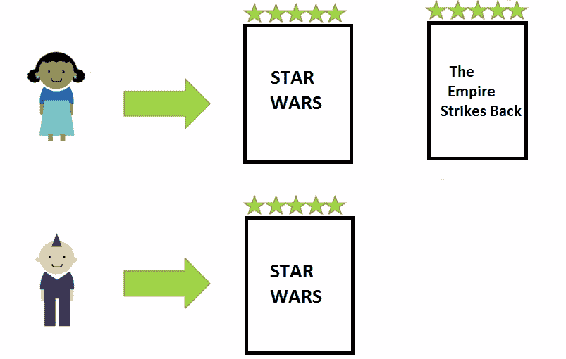

假设在前面的例子中，这位可爱的女士看了《星球大战》和《帝国反击战》，她都很喜欢。所以，我们有一个用户向量，这位女士给《星球大战》和《帝国反击战》都打了 5 星的评分。

假设 Edgy Mohawk 先生来了，他只看了《星球大战》。这是他唯一看过的东西，他不知道《帝国反击战》还没有看过，不知何故，他生活在一个奇怪的宇宙里，他不知道实际上有很多很多《星球大战》电影，事实上每年都在增加。

当然，我们可以说这个家伙实际上与另一个女士相似，因为他们都非常喜欢《星球大战》，所以他们的相似性分数可能相当高，我们可以说，好吧，这位女士喜欢的他还没看过什么？《帝国反击战》就是其中之一，所以我们可以根据他们对《星球大战》的喜爱找到这位女士也喜欢《帝国反击战》，然后将其作为对 Edgy Mohawk 先生的良好推荐。

然后我们可以向他推荐《帝国反击战》，他可能会喜欢，因为在我看来，这实际上是一部更好的电影！但我不打算在这里和你进行极客之争。

# 基于用户的协同过滤的限制

不幸的是，基于用户的协同过滤有一些限制。当我们考虑基于物品和人之间的关系来推荐东西时，我们的思维往往会转向人与人之间的关系。所以，我们想要找到与你相似的人，并推荐他们喜欢的东西。这似乎是直观的做法，但并不是最好的做法！以下是基于用户的协同过滤的一些限制：

+   一个问题是人们喜新厌旧；他们的口味总是在变化。所以，也许在前面的例子中，这位可爱的女士经历了一段短暂的科幻动作电影阶段，然后她克服了这一阶段，也许后来她开始更喜欢戏剧或者浪漫电影或者爱情喜剧。所以，如果我的 Edgy Mohawk 先生基于她早期的科幻时期与她有很高的相似性，然后我们因此向他推荐了浪漫喜剧，那将是糟糕的。我的意思是，在我们计算相似性分数的方式上，对此有一些保护，但人们的口味随时间变化仍然会污染我们的数据。所以，比较人与人之间并不总是一件简单的事情，因为人们会改变。

+   另一个问题是在你的系统中通常会有比物品更多的人，全球有 70 亿人口，而且还在增加，世界上可能并不会有 70 亿部电影，或者你的目录中可能不会有 70 亿个物品需要推荐。在你的系统中找到所有用户之间的相似性可能比找到物品之间的相似性更困难。因此，通过将系统重点放在用户上，你让计算问题变得更加困难，因为你有很多用户，至少希望如此，如果你在一家成功的公司工作的话。

+   最后一个问题是人们会做坏事。确保你的产品、电影或其他任何东西被推荐给人们有着非常现实的经济激励，有些人会试图操纵系统，让他们的新电影、新产品或新书等被推荐。

在系统中制造假身份非常容易，只需创建一个新用户，让他们执行一系列喜欢很多流行物品的事件，然后也喜欢你的物品。这被称为**炒作攻击**，我们希望能够拥有一个能够处理这种情况的系统。

关于如何检测和避免基于用户的协同过滤中的炒作攻击有研究，但更好的方法是使用一种完全不容易被操纵系统的全新方法。

这就是基于用户的协同过滤。再次强调，这是一个简单的概念-你根据用户的行为相似性来推荐东西，推荐那些你还没有看过但与你喜欢的东西相似的东西。正如我们所讨论的，这也有其局限性。因此，让我们来谈谈用一种称为基于物品的协同过滤的技术来颠覆整个概念。

# 基于物品的协同过滤

现在让我们尝试用一种称为基于物品的协同过滤的技术来解决基于用户的协同过滤的一些缺点，我们将看到这种技术是如何更加强大的。实际上，这是亚马逊在幕后使用的技术之一，他们公开谈论过这一点，所以我可以告诉你这么多，但让我们看看为什么这是一个如此好的主意。基于用户的协同过滤是基于人与人之间的关系来进行推荐的，但如果我们将其转变为基于物品之间的关系呢？这就是基于物品的协同过滤。

# 理解基于物品的协同过滤

这将涉及到一些见解。首先，我们谈到人们喜新厌旧，他们的口味会随时间改变，因此基于他们的过去行为来比较一个人和另一个人变得非常复杂。人们有不同的阶段，他们有不同的兴趣，你可能不会将处于相同阶段的人进行比较。但是，物品永远是什么它是的。一部电影永远是一部电影，它永远不会改变。星球大战永远是星球大战，至少在乔治·卢卡斯稍微改动一下之前是这样的，但总的来说，物品不会像人一样改变。因此，我们知道这些关系更加持久，而且在计算物品之间的相似性时可以进行更直接的比较，因为它们随时间不会改变。

另一个优势是，通常你要推荐的东西比你要推荐给的人要少。所以，全世界有 70 亿人，你的网站上可能并不会有 70 亿个推荐的东西，所以通过评估物品之间的关系而不是用户之间的关系，你可以节省大量的计算资源，因为你的系统中物品的数量可能比用户的数量要少。这意味着你可以更频繁地运行推荐，使它们更加及时、更加更新、更好！你可以使用更复杂的算法，因为你需要计算的关系更少，这是一件好事！

操纵系统也更难。我们谈到了通过创建一些喜欢流行东西的假用户然后推广你想要推广的东西来操纵基于用户的协同过滤方法是多么容易。但是基于物品的协同过滤变得更加困难。你必须让系统相信物品之间存在关系，而且由于你可能没有能力根据许多其他用户创建假物品并与其他物品建立虚假关系，操纵基于物品的协同过滤系统就变得更加困难，这是一件好事。

当我谈到操纵系统时，另一件重要的事情是确保人们用自己的钱投票。避免刷单攻击或人们试图操纵你的推荐系统的一般技术是确保信号行为是基于人们实际花钱的。因此，当你基于人们实际购买的东西而不是他们浏览或点击的东西进行推荐时，你总是会得到更好、更可靠的结果，明白吗？

# 基于物品的协同过滤是如何工作的？

好了，让我们来谈谈基于物品的协同过滤是如何工作的。它与基于用户的协同过滤非常相似，但我们不是看用户，而是看物品。

所以，让我们回到电影推荐的例子。我们首先要做的是找到每一对被同一个人观看的电影。然后，我们测量所有观看过这部电影的人之间的相似性。通过这种方式，我们可以根据观看过这两部电影的人的评分来计算两部不同电影之间的相似性。

所以，假设我有一对电影，好吧？也许是《星球大战》和《帝国反击战》。我找到了所有观看过这两部电影的人的名单，然后我比较他们对这两部电影的评分，如果他们相似，那么我可以说这两部电影是相似的，因为观看过它们的人对它们的评分相似。这是这里的一般想法。这是一种方法，有多种方法可以做到！

然后我可以按电影对一切进行排序，然后按相似电影的相似度强度进行排序，这就是我得到的*喜欢这个也喜欢那个*或*给这个高评分的人也给这个高评分*等等的结果。就像我说的，这只是一种方法。

这是基于物品的协同过滤的第一步-首先我根据观看每一对电影的人之间的关系来找到电影之间的关系。当我们通过以下示例时，这将更加清晰：

（图片）

例如，让我们假设在上图中的这位年轻女士观看了《星球大战》和《帝国反击战》，并且喜欢这两部电影，所以给了它们五星或者其他什么评分。现在，又来了一个叫 Edgy Mohawk Man 的人，他也观看了《星球大战》和《帝国反击战》，并且也喜欢这两部电影。所以，此时我们可以说这两部电影之间存在关系，基于这两位喜欢这两部电影的用户。

我们要做的是查看每一对电影。我们有一对《星球大战》和《帝国反击战》，然后我们查看所有观看这两部电影的用户，这两个人，如果他们都喜欢这两部电影，那么我们可以说它们彼此相似。或者，如果他们都不喜欢，我们也可以说它们彼此相似，对吧？所以，我们只是在查看这两个用户与这对电影的相似度得分。

然后来了一个留着小胡子的伐木工艺师，他看了《帝国反击战》，他生活在一个奇怪的世界，他看了《帝国反击战》，但不知道《星球大战》这部第一部电影的存在。

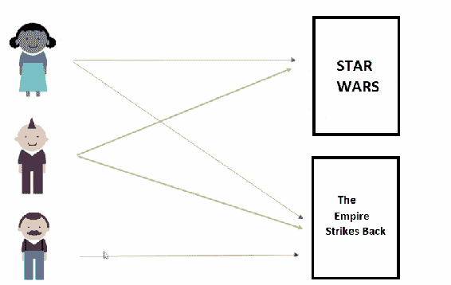

好吧，我们根据这两个人的行为计算了《帝国反击战》和《星球大战》之间的关系，所以我们知道这两部电影彼此相似。因此，鉴于小胡子先生喜欢《帝国反击战》，我们可以有信心地说他也会喜欢《星球大战》，然后我们可以将这部电影推荐给他作为他的首选电影推荐。就像下面的插图一样：

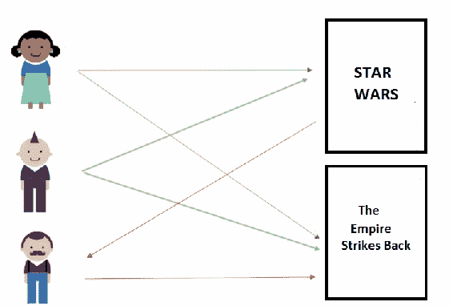

你可以看到最终结果非常相似，但我们已经颠覆了整个事情的本质。所以，我们不再把系统的重点放在人与人之间的关系上，而是放在物品之间的关系上，而这些关系仍然是基于所有观看它们的人的集体行为。但从根本上讲，我们正在研究物品之间的关系，而不是人与人之间的关系。明白了吗？

# 使用 Python 进行协同过滤

好了，让我们开始吧！我们有一些 Python 代码，将使用 Pandas 和我们可以使用的各种其他工具，用非常少的代码创建电影推荐。

我们要做的第一件事是向你展示基于物品的协同过滤的实践。所以，我们将建立“看过这个电影的人也看过”的关系，基本上就是“喜欢某些东西的人也喜欢这个东西”，所以我们将基于我们从 MovieLens 项目中获得的真实数据来构建这些电影之间的关系。所以，如果你去 MovieLens.org，那里实际上有一个开放的电影推荐系统，人们可以对电影进行评分，并获得新电影的推荐。

他们将所有的基础数据公开供研究人员使用。因此，我们将使用一些真实的电影评分数据-它有点过时，大约是 10 年前的，所以请记住这一点，但这是我们最终要使用的真实行为数据。我们将使用这些数据来计算电影之间的相似性。这些数据本身就很有用。你可以使用这些数据来说“喜欢这部电影的人也喜欢……”。所以，假设我正在查看一部电影的网页。系统可以说：“如果你喜欢这部电影，并且考虑到你正在查看它，你可能也会喜欢这些电影。”即使我们不知道你是谁，这就是一种推荐系统的形式。

现在，这是真实世界的数据，所以我们将遇到一些真实世界的问题。我们最初的结果看起来不太好，所以我们将花一点额外的时间来尝试弄清楚原因，这正是作为数据科学家所花费时间的很大一部分-纠正这些问题，然后重新运行，直到得到有意义的结果。

最后，我们将完全进行基于物品的协同过滤，根据个人的行为向他们推荐电影。所以，让我们开始吧！

# 寻找电影的相似性

让我们应用基于物品的协同过滤的概念。首先，找出电影之间的相似性-找出哪些电影与其他电影相似。特别是，我们将尝试找出哪些电影与星球大战相似，基于用户评分数据，我们将看看我们得到了什么。让我们深入研究一下！

好的，让我们继续计算基于物品的协同过滤的前半部分，即找到物品之间的相似性。下载并打开`SimilarMovies.ipynb`文件。

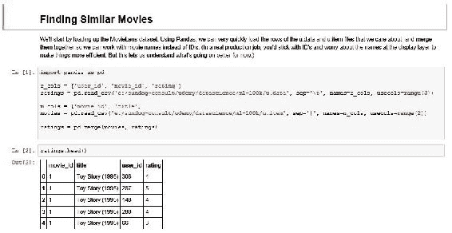

在这种情况下，我们将根据用户行为来查看电影之间的相似性。我们将使用 GroupLens 项目的一些真实电影评分数据。GroupLens.org 提供了真实的电影评分数据，由真正使用[MovieLens.org](http://MovieLens.org)网站给电影评分并获得推荐的人提供。

我们已经在课程资料中包含了您需要的 GroupLens 数据集的数据文件，我们需要做的第一件事是将其导入 Pandas DataFrame 中，我们将在这个示例中真正看到 Pandas 的全部功能。这很酷！

# 理解代码

我们要做的第一件事是导入 MovieLens 数据集中的`u.data`文件，这是一个包含数据集中每个评分的制表符分隔文件。

```py
import pandas as pd 

r_cols = ['user_id', 'movie_id', 'rating'] 
ratings = pd.read_csv('e:/sundog-consult/packt/datascience/ml-100k/u.data',  
                      sep='\\t', names=r_cols, usecols=range(3)) 

```

请注意，您需要在这里添加路径，指向您在计算机上存储下载的 MovieLens 文件的位置。因此，即使我们在 Pandas 上调用`read_csv`，我们也可以指定一个不同于逗号的分隔符。在这种情况下，它是一个制表符。

我们基本上是在说，从`u.data`文件中取前三列，并将其导入一个新的 DataFrame，有三列：`user_id`，`movie_id`和`rating`。

我们最终得到的是一个 DataFrame，对于每个`user_id`，都有一行，用于标识某个人，然后，对于他们评价的每部电影，我们有`movie_id`，这是给定电影的一些数字缩写，因此星球大战可能是第 53 部电影之类的，以及他们的评分，1 到 5 星。因此，我们在这里有一个数据库，一个 DataFrame，包含每个用户和他们评价的每部电影，好吗？

现在，我们希望能够使用电影标题，这样我们可以更直观地解释这些结果，所以我们将使用它们的可读名称。

如果您使用的是真正庞大的数据集，您会将其保存到最后，因为您希望尽可能长时间地使用数字，它们更紧凑。不过，出于示例和教学的目的，我们将保留标题，这样您就可以看到发生了什么。

```py
m_cols = ['movie_id', 'title'] 
movies = pd.read_csv('e:/sundog-consult/packt/datascience/ml-100k/u.item', 
                     sep='|', names=m_cols, usecols=range(2)) 

```

MovieLens 数据集中有一个名为`u.item`的单独数据文件，它是以管道分隔的，我们导入的前两列将是`movie_id`和该电影的`title`。因此，现在我们有两个 DataFrame：`r_cols`包含所有用户评分，`m_cols`包含每个`movie_id`的所有标题。然后，我们可以使用 Pandas 中神奇的`merge`函数将它们全部合并在一起。

```py
ratings = pd.merge(movies, ratings) 

```

让我们添加一个`ratings.head()`命令，然后运行这些单元格。我们最终得到的是类似以下表格的东西。那很快！

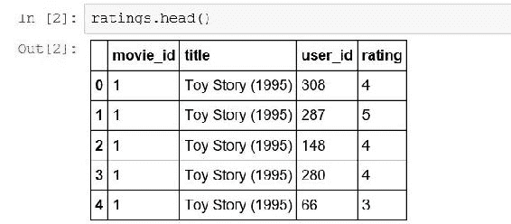

我们最终得到了一个新的 DataFrame，其中包含每个用户评价的`user_id`和电影评分，并且我们既有`movie_id`又有`title`，可以阅读并了解它是什么。因此，读取这个数据的方式是`user_id`号`308`给`Toy Story (1995)`电影评了`4`星，`user_id`号`287`给`Toy Story (1995)`电影评了`5`星，依此类推。如果我们继续查看更多的这个 DataFrame，我们会看到不同的电影的不同评分。

现在 Pandas 的真正魔力显现出来了。因此，我们真正想要的是根据观看每对电影的所有用户之间的关系来查看电影之间的关系，因此最终我们需要一个包含每部电影、每个用户以及每个用户对每部电影的所有评分的矩阵。Pandas 中的`pivot_table`命令可以为我们做到这一点。它基本上可以根据给定的 DataFrame 构建一个新表，几乎任何你想要的方式。为此，我们可以使用以下代码：

```py
movieRatings = ratings.pivot_table(index=['user_id'],
                                   columns=['title'],values='rating') 
movieRatings.head() 

```

所以，这段代码的意思是-取出我们的评分 DataFrame 并创建一个名为`movieRatings`的新 DataFrame，我们希望它的索引是用户 ID，所以我们将为每个`user_id`有一行，并且我们将每一列都是电影标题。因此，我们将为在该 DataFrame 中遇到的每个标题都有一列，并且如果存在的话，每个单元格将包含`rating`值。让我们继续运行它。

然后，我们得到了一个新的 DataFrame，看起来像下表：

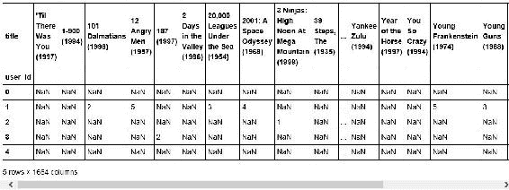

这真是太神奇了，现在你会看到一些`NaN`值，代表**不是一个数字**，这就是 Pandas 表示缺失值的方式。因此，解释这个的方法是，例如，`user_id`编号`1`没有观看电影`1-900（1994）`，但`user_id`编号`1`观看了《101 斑点狗》（1996）并给了它`2`星的评价。`user_id`编号`1`还观看了《愤怒的公牛》（1957）并给了它`5`星的评价，但没有观看电影《2 天在山谷（1996）》，例如，明白了吗？因此，我们最终得到的是一个稀疏矩阵，其中包含了每个用户和每部电影，以及每个用户对每部电影的评分值。

所以，现在你可以看到，我们可以非常容易地提取出用户观看的每部电影的向量，也可以提取出每个评价了给定电影的用户的向量，这正是我们想要的。所以，这对基于用户和基于物品的协同过滤都很有用，对吧？如果我想要找到用户之间的关系，我可以查看这些用户行之间的相关性，但如果我想要找到电影之间的相关性，对于基于物品的协同过滤，我可以根据用户行为查看列之间的相关性。这就是真正*颠覆用户与基于物品相似性的*实现的地方。

现在，我们要进行基于物品的协同过滤，所以我们要提取列，为此让我们运行以下代码：

```py
starWarsRatings = movieRatings['Star Wars (1977)'] 
starWarsRatings.head() 

```

现在，借助这个，让我们继续提取所有评价了《星球大战（1977）》的用户：

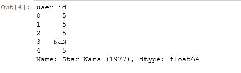

我们可以看到大多数人实际上都观看并评价了《星球大战（1977）》，并且每个人都喜欢它，至少在我们从 DataFrame 的开头取出的这个小样本中是这样。因此，我们得到了一组用户 ID 及其对《星球大战（1977）》的评分。用户 ID`3`没有对《星球大战（1977）》进行评分，因此我们有一个`NaN`值，表示那里有一个缺失值，但没关系。我们希望确保保留这些缺失值，以便我们可以直接比较不同电影的列。那么我们该如何做呢？

# corrwith 函数

好吧，Pandas 一直让我们很容易，它有一个`corrwith`函数，你可以在下面的代码中看到，我们可以使用它：

```py
similarMovies = movieRatings.corrwith(starWarsRatings) 
similarMovies = similarMovies.dropna() 
df = pd.DataFrame(similarMovies) 
df.head(10) 

```

该代码将对给定的列与 DataFrame 中的每一列进行相关性计算，并计算相关性得分并将其返回给我们。所以，我们在这里做的是在整个`movieRatings` DataFrame 上使用`corrwith`，这是用户电影评分的整个矩阵，将其与`starWarsRatings`列进行相关性计算，然后使用`dropna`删除所有缺失的结果。这样我们就只剩下了有相关性的项目，有多于一个人观看的项目，然后我们基于这些结果创建一个新的 DataFrame，然后显示前 10 个结果。所以，再次回顾一下：

1.  我们将建立《星球大战》与每部其他电影之间的相关性得分。

1.  删除所有的`NaN`值，这样我们只有实际存在的电影相似性，有多于一个人对其进行了评分。

1.  然后，我们将从结果中构建一个新的 DataFrame，并查看前 10 个结果。

在下面的截图中，我们看到了结果：

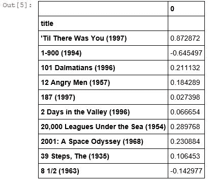

我们得到了《星球大战》与每部电影之间的相关性得分结果，例如，与电影《直到有了你（1997）》有惊人的高相关性得分，与电影《1-900（1994）》有负相关性，与《101 斑点狗（1996）》有非常弱的相关性。

现在，我们只需要按相似性得分排序，我们就可以得到《星球大战》的前十个电影相似性了，对吧？让我们继续做吧。

```py
similarMovies.sort_values(ascending=False) 

```

只需在生成的 DataFrame 上调用`sort_values`，Pandas 使这变得非常容易，我们可以说`ascending=False`，实际上按相关性得分的倒序排序。所以，让我们这样做：

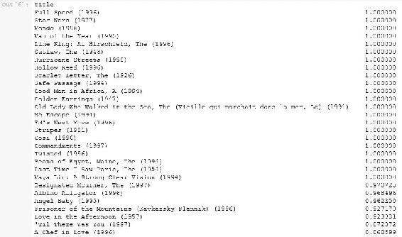

好吧，《星球大战（1977）》排名靠前，因为它与自身相似，但其他的是什么？这是怎么回事？我们可以在前面的输出中看到一些电影，比如：《全速前进（1996）》、《年度人物（1995）》、《亡命之徒（1943）》。这些都是，你知道的，相当晦涩的电影，其中大多数我甚至从未听说过，但它们与《星球大战》有完美的相关性。这有点奇怪！显然我们在这里做错了什么。可能是什么呢？

事实证明，有一个完全合理的解释，这是一个很好的教训，为什么你在完成任何数据科学任务时总是需要检查你的结果-质疑结果，因为通常会有一些你忽略的东西，可能需要清理数据，可能你做错了什么。但你也应该怀疑地看待你的结果，不要只是盲目接受，好吗？如果你这样做，你会惹麻烦的，因为如果我真的把这些作为喜欢《星球大战》的人的推荐，我会被解雇的。不要被解雇！注意你的结果！所以，让我们深入研究下一节中出现的问题。

# 改进电影相似性的结果

让我们弄清楚我们的电影相似性出了什么问题。我们经历了所有这些令人兴奋的工作，计算了基于用户评分向量的电影之间的相关性得分，但我们得到的结果有点糟糕。只是为了提醒你，我们使用了这种技术寻找与《星球大战》相似的电影，结果我们得到了一堆怪异的推荐，排在前面的电影与《星球大战》有完美的相关性。

大多数都是非常晦涩的电影。那么，你认为可能发生了什么？嗯，可能有一个讲得通的解释，假设我们有很多人观看了《星球大战》和其他一些晦涩的电影。我们最终会得到这两部电影之间的很好的相关性，因为它们都与《星球大战》联系在一起，但归根结底，我们真的想要基于观看某些晦涩电影的一两个人的行为来做推荐吗？

可能不是！我的意思是，是的，世界上的两个人，或者无论是什么，看了电影《全速前进》，并且都喜欢它，除了《星球大战》，也许这对他们来说是一个很好的推荐，但对世界其他人来说可能不是一个很好的推荐。我们需要对相似性有一定的信心水平，通过强制执行观看给定电影的人数的最低限制来实现。我们不能仅仅基于一两个人的行为来判断一部电影是否好看。

因此，让我们尝试将这一见解付诸行动，使用以下代码：

```py
import numpy as np 
movieStats = ratings.groupby('title').agg({'rating': [np.size, np.mean]}) 
movieStats.head() 

```

我们要做的是尝试识别那些实际上没有被很多人评价的电影，然后我们将它们排除，看看我们会得到什么。因此，为了做到这一点，我们将取得我们原始的评分 DataFrame，并且我们将说`groupby('title')`，同样 Pandas 在其中有各种魔法。这将基本上构建一个新的 DataFrame，将给定标题的所有行聚合成一行。

我们可以说，我们想要特别聚合评分，并且我们想要显示每部电影的大小，即每部电影的评分人数，以及平均平均分数，即该电影的平均评分。因此，当我们这样做时，我们最终得到类似以下的东西：

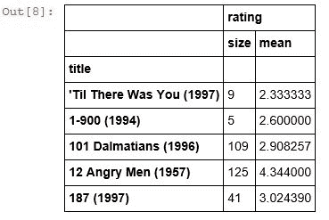

例如，这告诉我们电影《101 斑点狗（1996 年）》有 109 人评价了这部电影，他们的平均评分是 2.9 颗星，所以实际上并不是很高的分数！因此，如果我们仅凭眼力观察这些数据，我们可以说好吧，我认为比较不知名的电影，比如《187（1997 年）》，有 41 个评分，但《101 斑点狗（1996 年）》，我听说过，你知道《愤怒的公牛（1957 年）》，我也听说过。似乎在大约 100 个评分处有一种自然的截止值，也许这是一个魔法值，事情开始变得有意义。

让我们继续摆脱少于 100 人评分的电影，是的，你知道我在这一点上有点凭直觉。正如我们稍后将讨论的，有更有原则的方法来做到这一点，你实际上可以进行实验，并在不同的阈值上进行训练/测试实验，找到实际表现最好的那个。但最初，让我们只是用常识来过滤掉少于 100 人评分的电影。同样，Pandas 使这变得非常容易。让我们通过以下示例来弄清楚：

```py
popularMovies = movieStats['rating']['size'] >= 100 
movieStats[popularMovies].sort_values([('rating', 'mean')], ascending=False)[:15] 

```

我们可以说`popularMovies`，一个新的 DataFrame，将通过查看`movieStats`构建，我们只会取评分大小大于或等于 100 的行，然后我将按`mean`评分排序，只是为了好玩，看看最受欢迎的广泛观看的电影。

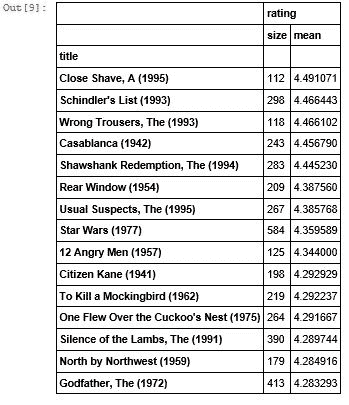

我们这里有一份由 100 多人评分的电影列表，按其平均评分分数排序，这本身就是一个推荐系统。这些都是受欢迎的高评分电影。《剃须刀奇遇记（1995 年）》，显然是一部非常好的电影，很多人看过并且非常喜欢。

因此，这是一个非常古老的数据集，来自 90 年代末，所以即使你可能不熟悉电影《剃须刀奇遇记（1995 年）》，回头去重新发现它可能是值得的；把它加入你的 Netflix！《辛德勒的名单（1993 年）》并不是一个大惊喜，在大多数顶级电影列表中都会出现。《错误的裤子（1993 年）》，另一个例子，是一部不知名的电影，显然非常好看，也很受欢迎。因此，通过这样做，已经有一些有趣的发现了。

现在情况看起来好多了，所以让我们继续制作我们的新 DataFrame，其中包含与《星球大战》相似的电影，我们只基于出现在这个新 DataFrame 中的电影。所以，我们将使用`join`操作，将我们原始的`similarMovies` DataFrame 与这个只有超过 100 个评分的电影的新 DataFrame 进行连接，好吗？

```py
df = movieStats[popularMovies].join(pd.DataFrame(similarMovies, columns=['similarity'])) 
df.head() 

```

在这段代码中，我们基于`similarMovies`创建了一个新的 DataFrame，从中提取了`similarity`列，将其与我们的`movieStats` DataFrame（即我们的`popularMovies` DataFrame）进行了连接，并查看了合并的结果。然后，我们就有了输出！

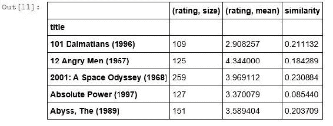

现在，我们只限制了那些被 100 多人评价的电影，与《星球大战》的相似度得分。所以，现在我们需要做的就是使用以下代码对其进行排序：

```py
df.sort_values(['similarity'], ascending=False)[:15] 

```

在这里，我们将对其进行逆向排序，并只查看前 15 个结果。如果你现在运行它，你应该会看到以下内容：

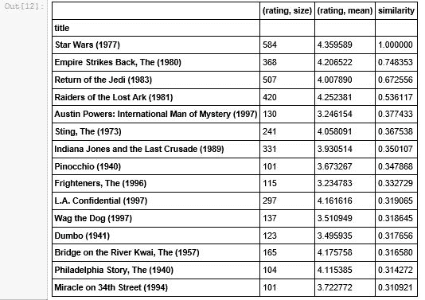

情况开始好转了！《星球大战》（1977）因为与自己相似，所以排在第一位，《帝国反击战》（1980）排在第二位，《绝地归来》（1983）排在第三位，《夺宝奇兵》（1981）排在第四位。你知道，它还不完美，但这些更有意义，对吧？所以，你会期望原始三部曲的三部《星球大战》电影相互之间相似，这些数据还是在下一部三部曲之前，而《夺宝奇兵》（1981）也是一部风格非常相似的电影，排在第四位。所以，我对这些结果开始感到有点满意。还有改进的空间，但嘿！我们得到了一些有意义的结果，哇呜！

现在，理想情况下，我们还应该过滤掉《星球大战》，你不想看到与你开始的电影本身的相似性，但我们以后再担心这个！所以，如果你想再玩一下，就像我说的，100 是最低评分的一个任意截止点。如果你确实想尝试不同的截止值，我鼓励你回去尝试一下。看看它对结果有什么影响。你知道，在前面的表中，我们真正喜欢的结果实际上有更多的共同评分超过 100。所以，我们最终得到了《奥斯汀·鲍尔的国际人质》（1997）的评分相当高，只有 130 个评分，所以也许 100 还不够高！《木偶奇遇记》（1940）以 101 分进入，与《星球大战》不太相似，所以，你可能需要考虑更高的阈值，看看它会有什么影响。

请记住，这是一个非常小的、用于实验目的的有限数据集，它基于非常旧的数据，所以你只会看到较旧的电影。因此，从直觉上解释这些结果可能会有点具有挑战性，但结果并不差。

现在让我们继续，实际上进行全面的基于物品的协同过滤，通过使用更完整的系统向人们推荐电影，我们将在下一步中进行。

# 向人们推荐电影

好的，让我们实际构建一个完整的推荐系统，它可以查看系统中每个人的所有行为信息，以及他们评价的电影，并利用这些信息为数据集中的任何用户实际生成最佳推荐电影。这有点令人惊讶，你会对它有多简单感到惊讶。让我们开始吧！

让我们开始使用`ItemBasedCF.ipynb`文件，首先导入我们拥有的 MovieLens 数据集。同样，我们现在只使用其中包含 10 万个评分的子集。但是，你可以从 GroupLens.org 获得更大的数据集-高达数百万个评分；如果你愿意的话。但是请记住，当你开始处理真正大的数据时，你将会推动单台机器和 Pandas 所能处理的极限。话不多说，这是第一段代码：

```py
import pandas as pd 

r_cols = ['user_id', 'movie_id', 'rating'] 
ratings = pd.read_csv('e:/sundog-consult/packt/datascience/ml-100k/u.data',      
                      sep='\t', names=r_cols, usecols=range(3)) 

m_cols = ['movie_id', 'title'] 
movies = pd.read_csv('e:/sundog-consult/packt/datascience/ml-100k/u.item', 
                     sep='|', names=m_cols, usecols=range(2)) 

ratings = pd.merge(movies, ratings) 

ratings.head() 

```

就像之前一样，我们将导入包含每个用户的所有个人评分以及他们评分的电影的`u.data`文件，然后将其与电影标题联系起来，这样我们就不必只使用数字电影 ID。点击运行单元格按钮，我们得到以下 DataFrame。

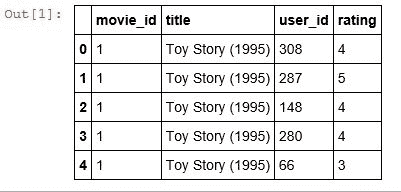

例如，`user_id`编号`308`给`玩具总动员（1995）`评了 4 星，`user_id`编号`66`给`玩具总动员（1995）`评了 3 星。而且，这将包含每个用户对每部电影的每个评分。

然后，就像之前一样，我们使用 Pandas 中的`pivot_table`命令来基于信息构建一个新的 DataFrame：

```py
userRatings = ratings.pivot_table(index=['user_id'],
                                  columns=['title'],values='rating') 
userRatings.head() 

```

在这里，每行是`user_id`，列由数据集中所有独特的电影标题组成，每个单元格包含一个评分：

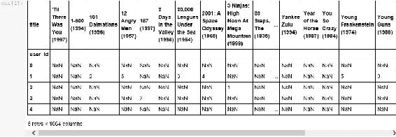

我们得到的是前面输出中显示的非常有用的矩阵，其中每行都有用户，每列都有电影。而且我们在这个矩阵中基本上有每部电影的每个用户评分。例如，`user_id`编号`1`给`101 斑点狗（1996）`评了 2 星。而且，所有这些`NaN`值代表缺失的数据。这只是表示，例如，`user_id`编号`1`没有对电影`1-900（1994）`进行评分。

这是一个非常有用的矩阵。如果我们正在进行基于用户的协同过滤，我们可以计算每个单独用户评分向量之间的相关性以找到相似的用户。由于我们正在进行基于物品的协同过滤，我们更感兴趣的是列之间的关系。因此，例如，计算任意两列之间的相关性分数，这将为给定电影对给出相关性分数。那么，我们该如何做呢？事实证明，Pandas 也使这变得非常容易。

它有一个内置的`corr`函数，实际上会计算整个矩阵中找到的每一对列的相关性分数-这几乎就像它们在为我们考虑。

```py
corrMatrix = userRatings.corr() 
corrMatrix.head() 

```

让我们继续运行前面的代码。这是一个计算量相当大的事情，所以实际上需要一些时间才能得出结果。但是，我们得到了！

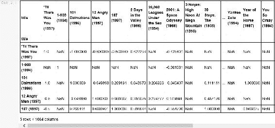

那么，在前面的输出中我们有什么？我们在这里有一个新的 DataFrame，其中每部电影都在行上，列中。因此，我们可以查看任意两部电影的交集，并根据我们最初拥有的`userRatings`数据找到它们之间的相关性分数。这有多酷呢？例如，电影`101 斑点狗（1996）`与自己完全相关，因为它具有相同的用户评分向量。但是，如果你看看`101 斑点狗（1996）`电影与`十二怒汉（1957）`电影的关系，它的相关性分数要低得多，因为这些电影相当不相似，这是有道理的，对吧？

现在我有了一个很棒的矩阵，可以给出任意两部电影之间的相似度分数。这有点令人惊讶，并且对我们即将要做的事情非常有用。就像之前一样，我们必须处理虚假的结果。所以，我不想看到基于少量行为信息的关系。

原来 Pandas 的`corr`函数实际上有一些参数可以给它。其中一个是你想要使用的实际相关性评分方法，所以我要说使用`pearson`相关性。

```py
corrMatrix = userRatings.corr(method='pearson', min_periods=100) 
corrMatrix.head() 

```

你会注意到它还有一个`min_periods`参数，你可以给它，基本上是说我只想要你考虑至少，例如在这个例子中，有 100 人评分过两部电影的相关性评分。运行这个将消除那些只基于少数人的虚假关系。运行代码后得到的矩阵如下：


这与我们在项目相似性练习中所做的有点不同，那里我们只是扔掉了少于 100 人评分的任何电影。我们在这里所做的是，扔掉了少于 100 人评分两部电影的电影相似性，好吗？所以，你可以看到在前面的矩阵中我们有更多的`NaN`值。

实际上，甚至与自己相似的电影也被排除了，所以例如，电影`1-900 (1994)`，据推测，被少于 100 人观看，所以它被完全抛弃了。然而，电影`101 斑点狗 (1996)`以相关性评分`1`幸存下来，而在这个数据集的这个小样本中，没有一部电影与另一部有 100 个共同观看的人不同。但是，有足够多的电影幸存下来以获得有意义的结果。

# 通过示例了解电影推荐

那么，我们用这些数据做什么呢？嗯，我们想要为人们推荐电影。我们这样做的方式是，我们查看给定人的所有评分，找到与他们评分相似的电影，这些电影就是向该人推荐的候选电影。

让我们从创建一个虚拟人来为其创建推荐开始。我实际上已经手动添加了一个虚拟用户，ID 号为`0`，到我们正在处理的 MovieLens 数据集中。你可以用以下代码看到该用户：

```py
myRatings = userRatings.loc[0].dropna() 
myRatings 

```

这给出了以下输出：

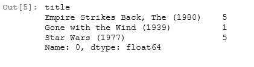

这有点像我这样的人，我喜欢《星球大战》和《帝国反击战》，但讨厌《飘》。所以，这代表着一个真正喜欢《星球大战》的人，但不喜欢老式的浪漫戏剧，好吗？所以，我给《帝国反击战 (1980)》和《星球大战 (1977)》评了`5`星，给《飘 (1939)》评了`1`星。所以，我要为这个虚构的用户找到推荐。

那么，我怎么做呢？嗯，让我们从创建一个名为`simCandidates`的系列开始，我将浏览我评分的每一部电影。

```py
simCandidates = pd.Series() 
for i in range(0, len(myRatings.index)): 
    print "Adding sims for " + myRatings.index[i] + "..." 
    # Retrieve similar movies to this one that I rated 
    sims = corrMatrix[myRatings.index[i]].dropna() 
    # Now scale its similarity by how well I rated this movie 
    sims = sims.map(lambda x: x * myRatings[i]) 
    # Add the score to the list of similarity candidates 
    simCandidates = simCandidates.append(sims) 

#Glance at our results so far: 
print "sorting..." 
simCandidates.sort_values(inplace = True, ascending = False) 
print simCandidates.head(10) 

```

对于`i`在范围`0`到我在`myRatings`中拥有的评分数量，我将把我评分的相似电影加起来。所以，我将拿那个`corrMatrix` DataFrame，那个神奇的包含所有电影相似性的，然后我将用`myRatings`创建一个相关性矩阵，删除任何缺失值，然后我将按我对那部电影的评分来缩放结果的相关性评分。

这里的想法是，我将浏览例如《帝国反击战》的所有相似之处，然后将其全部缩放 5 倍，因为我真的很喜欢《帝国反击战》。但是，当我浏览《飘》的相似之处时，我只会将其缩放 1 倍，因为我不喜欢《飘》。所以，这将使与我喜欢的电影相似的电影更有力量，而与我不喜欢的电影相似的电影则更弱一些，好吗？

所以，我只是浏览并建立了这个相似候选列表，如果你愿意的话，就是推荐候选，对结果进行排序并打印出来。让我们看看我们得到了什么：

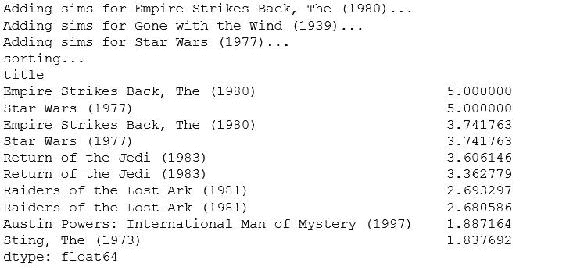

嘿，这些看起来不错，对吧？显然，《帝国反击战》（1980）和《星球大战》（1977）排在前面，因为我明确喜欢这些电影，我已经看过并评分了。但是，排在榜单前列的还有《绝地归来》（1983），这是我们预料到的，《亚马逊探险记》（1981）也是。

让我们开始进一步完善这些结果。我们发现我们得到了重复的值。如果有一部电影与我评分的多部电影相似，它将在结果中出现多次，所以我们希望将它们合并在一起。如果我确实有相同的电影，也许应该将它们加在一起，形成一个更强大的推荐分数。例如，《绝地归来》实际上与《星球大战》和《帝国反击战》都很相似。我们该怎么做呢？

# 使用 groupby 命令来合并行

我们将继续探索。我们将再次使用`groupby`命令来将所有属于同一部电影的行分组在一起。接下来，我们将总结它们的相关分数并查看结果：

```py
simCandidates = simCandidates.groupby(simCandidates.index).sum() 
simCandidates.sort_values(inplace = True, ascending = False) 
simCandidates.head(10) 

```

以下是结果：

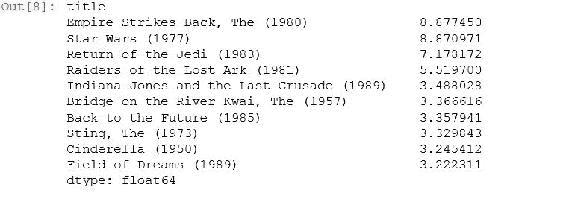

嘿，这看起来真的很不错！

所以，《绝地归来》（1983）得分最高，得分为 7，紧随其后的是《亚马逊探险记》（1981），得分为 5，然后我们开始看到《印第安纳琼斯：最后的十字军东征》（1989）和一些其他电影，《桂河大桥》（1957），《回到未来》（1985），《刺激》（1973）。这些都是我真的会喜欢看的电影！你知道，我其实也喜欢老式的迪士尼电影，所以《灰姑娘》（1950）并不像看起来那么疯狂。

我们需要做的最后一件事是过滤掉我已经评分过的电影，因为推荐你已经看过的电影是没有意义的。

# 使用删除命令删除条目

所以，我可以使用以下代码快速删除任何出现在我的原始评分系列中的行：

```py
filteredSims = simCandidates.drop(myRatings.index) 
filteredSims.head(10) 

```

运行这个命令让我看到最终的前 10 个结果：

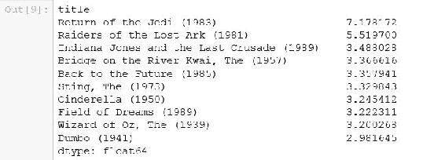

就是这样！《绝地归来》（1983），《亚马逊探险记》（1981），《印第安纳琼斯：最后的十字军东征》（1989），这些都是我虚构用户的前几个推荐结果，而且都很合理。我看到了一些适合家庭观看的电影，你知道，《灰姑娘》（1950），《绿野仙踪》（1939），《小飞象》（1941），可能是因为《飘》的存在，即使它的权重被降低了，但它仍然在其中，仍然被计算在内。所以，这就是我们的结果。就是这样！挺酷的！

实际上我们已经为特定用户生成了推荐，我们可以为数据框中的任何用户这样做。所以，如果你愿意的话，可以尝试一下。我还想谈谈你如何更深入地参与其中，玩弄这些结果；试着改进它们。

这其实是一门艺术，你知道，你需要不断迭代，尝试不同的想法和不同的技术，直到你得到越来越好的结果，你可以一直这样做。我的意思是，我把整个职业都建立在这个基础上。所以，我不指望你像我一样花 10 年的时间来完善这个，但是有一些简单的事情你可以做，所以让我们谈谈这个。

# 改进推荐结果

作为一个练习，我想挑战你去让这些推荐变得更好。所以，让我们谈谈我有的一些想法，也许你也有一些自己的想法，可以尝试和实验一下；动手尝试，努力做出更好的电影推荐。

好吧，这些推荐结果仍然有很大的改进空间。我们在如何根据你对物品的评分来权衡不同的推荐结果，或者你想要为两部给定电影评分的人数选择最低阈值等方面做出了很多决定。所以，有很多事情你可以调整，很多不同的算法你可以尝试，你可以尝试通过系统来做出更好的电影推荐。所以，如果你感兴趣，我挑战你去做到这一点！

以下是一些关于如何实际上尝试改进本章结果的想法。首先，你可以直接去玩`ItembasedCF.ipynb`文件并对其进行调整。例如，我们发现相关性方法实际上有一些相关性计算的参数，我们在示例中使用了 Pearson，但还有其他方法可以查找和尝试，看看它对你的结果有什么影响。我们使用了最小周期值为 100，也许这个值太高了，也许太低了；我们只是随意选择的。如果你调整这个值会发生什么？例如，如果你将它降低，我预计你会看到一些你从未听说过的新电影，但可能仍然是对那个人的一个很好的推荐。或者，如果你将它提高，你会看到，你知道，只有大片。

有时候你必须考虑一下你想从推荐系统中得到什么结果。在向人们展示他们听说过的电影和他们没听说过的电影之间，是否有一个很好的平衡？对于这些人来说，发现新电影有多重要，与通过看到许多他们听说过的电影来对推荐系统产生信心有多重要？所以，这确实是一种艺术。

我们还可以改进一下，因为我们在结果中看到了很多与《飘》相似的电影，尽管我不喜欢《飘》。你知道，我们将这些结果的权重低于我喜欢的电影的相似性，但也许这些电影实际上应该受到惩罚。如果我那么讨厌《飘》，也许与《飘》相似的电影，比如《绿野仙踪》，实际上应该受到惩罚，你知道，它们的得分应该降低而不是提高。

这是另一个简单的修改，你可以尝试一下。我们的用户评分数据集中可能有一些异常值，如果我把那些评价了大量电影的人排除掉会怎么样？也许他们在影响一切。你实际上可以尝试识别这些用户并将他们排除在外，这是另一个想法。而且，如果你真的想要一个大项目，如果你真的想要深入研究这些东西，你实际上可以通过使用训练/测试的技术来评估这个推荐引擎的结果。所以，如果不是使用每部电影的相关性得分的任意推荐得分，而是将其缩小到每部电影的预测评分，会怎么样呢？

如果我的推荐系统的输出是一部电影和我对那部电影的预测评分，在一个训练/测试系统中，我实际上可以尝试弄清楚我有多好地预测了用户实际上观看并评价过的电影？好吗？所以，我可以留出一些评分数据，看看我的推荐系统能够多好地预测用户对这些电影的评分。这将是一种定量和有原则的方法来衡量这个推荐引擎的误差。但是，这里比科学更多一点艺术。即使 Netflix 奖实际上使用了那个误差度量，称为均方根误差，这是他们特别使用的，但这真的是一个好的推荐系统的衡量标准吗？

基本上，你正在衡量你的推荐系统预测一个人已经观看的电影的能力。但是推荐引擎的目的不是推荐一个人尚未观看但可能会喜欢的电影吗？这是两回事。所以不幸的是，很难衡量你真正想要衡量的东西。有时，你确实必须凭直觉行事。而且，衡量推荐引擎结果的正确方式是衡量你试图通过它来推广的结果。

也许我试图让人们观看更多电影，或者更高评价新电影，或者购买更多东西。在真实网站上运行实际的控制实验将是优化的正确方式，而不是使用训练/测试。所以，你知道，我在那里详细介绍了一点，但教训是，你不能总是以黑白思维来考虑这些事情。有时，你不能直接和定量地衡量事物，你必须运用一点常识，这就是一个例子。

无论如何，这些是一些关于如何回头改进我们编写的推荐引擎结果的想法。所以，请随意尝试一下，看看你是否可以按照自己的意愿改进它，并且玩得开心。这实际上是书中非常有趣的部分，所以我希望你会喜欢它！

# 总结

所以，去尝试一下吧！看看你是否可以改进我们的初始结果。有一些简单的想法可以尝试使这些推荐更好，还有一些更复杂的想法。现在，没有对错答案；我不会要求你交作业，也不会审查你的工作。你知道，你决定玩弄它并熟悉一下，进行实验，看看你得到什么结果。这就是整个目的-只是让你更熟悉使用 Python 进行这种工作，并更熟悉基于物品的协同过滤背后的概念。

在本章中，我们看了不同的推荐系统-我们排除了基于用户的协同过滤系统，直接进入了基于物品的系统。然后，我们使用了 pandas 的各种函数来生成和完善我们的结果，我希望你在这里看到了 pandas 的强大之处。

在下一章中，我们将深入研究更高级的数据挖掘和机器学习技术，包括 K 最近邻算法。我期待着向你解释这些内容，并看看它们如何有用。
