# 第七章：更多数据挖掘和机器学习技术

在这一章中，我们将讨论更多的数据挖掘和机器学习技术。我们将讨论一个称为**k 最近邻居**（**KNN**）的非常简单的技术。然后，我们将使用 KNN 来预测电影的评级。之后，我们将继续讨论降维和主成分分析。我们还将看一个 PCA 的例子，其中我们将 4D 数据降低到两个维度，同时仍保留其方差。

然后，我们将介绍数据仓库的概念，并了解新的 ELT 过程相对于 ETL 过程的优势。我们将学习强化学习的有趣概念，并了解智能吃豆人游戏的背后使用的技术。最后，我们将看到一些用于强化学习的花哨术语。

我们将涵盖以下主题：

+   K 最近邻居的概念

+   KNN 的实施以预测电影的评级

+   降维和主成分分析

+   鸢尾花数据集的 PCA 示例

+   数据仓库和 ETL 与 ELT

+   什么是强化学习

+   智能吃豆人游戏背后的工作

+   用于强化学习的花哨术语

# K 最近邻居 - 概念

让我们谈谈雇主希望您了解的一些数据挖掘和机器学习技术。我们将从一个称为 KNN 的非常简单的技术开始。您会对一个好的监督式机器学习技术有多简单感到惊讶。让我们来看看！

KNN 听起来很花哨，但实际上是最简单的技术之一！假设您有一个散点图，并且可以计算该散点图上任意两点之间的距离。假设您已经对一堆数据进行了分类，可以从中训练系统。如果我有一个新的数据点，我只需根据该距离度量查看 KNN，并让它们全部对新点的分类进行投票。

让我们想象以下散点图正在绘制电影。方块代表科幻电影，三角形代表戏剧电影。我们将说这是根据评分与受欢迎程度绘制的，或者您可以想象其他任何东西：

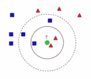

在这里，我们有一种基于散点图上任意两点之间的评分和受欢迎程度计算的某种距离。假设有一个新点进来，一个我们不知道流派的新电影。我们可以将*K*设置为*3*，并取散点图上这一点的*3*个最近邻居；然后它们可以就新点/电影的分类进行投票。

您可以看到，如果我选择三个最近的邻居（*K=3*），我有 2 部戏剧电影和 1 部科幻电影。然后我会让它们全部投票，我们将根据这 3 个最近的邻居选择这个新点的戏剧分类。现在，如果我将这个圈扩大到包括 5 个最近的邻居，即*K=5*，我会得到一个不同的答案。在这种情况下，我挑选了 3 部科幻电影和 2 部戏剧电影。如果我让它们全部投票，我最终会得到一个新电影的科幻分类。

我们选择 K 可能非常重要。您要确保它足够小，以免走得太远并开始挑选无关的邻居，但它必须足够大，以包含足够的数据点以获得有意义的样本。因此，通常您将不得不使用训练/测试或类似的技术来实际确定给定数据集的*K*的正确值。但是，最终，您必须从直觉开始并从那里开始工作。

就是这么简单，就是这么简单。因此，这是一种非常简单的技术。您所做的就是在散点图上找到 k 个最近邻，让它们全部对分类进行投票。它确实符合监督学习，因为它使用一组已知点的训练数据，即已知的分类，来指导新点的分类。

但让我们对此做一些更复杂的事情，并且实际上根据它们的元数据玩弄电影。让我们看看是否可以实际上根据这些电影的内在值，例如其评分、类型信息，找出电影的最近邻：

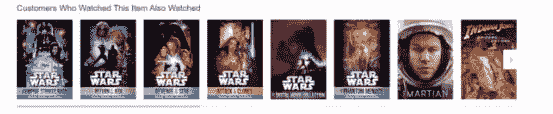

理论上，我们可以使用 k 最近邻算法重新创建类似于*观看此商品的客户还观看了*（上图是亚马逊的截图）的东西。而且，我可以再进一步：一旦我根据 k 最近邻算法确定了与给定电影相似的电影，我可以让它们全部对预测的电影评分进行投票。

这就是我们下一个示例要做的。所以现在您已经了解了 KNN，k 最近邻的概念。让我们继续并将其应用于实际找到彼此相似的电影，并使用这些最近邻的电影来预测我们以前没有看过的电影的评分。

# 使用 KNN 来预测电影的评分

好了，我们将实际上采用 KNN 的简单思想，并将其应用于一个更复杂的问题，即仅根据其类型和评分信息预测电影的评分。因此，让我们深入研究并尝试仅基于 KNN 算法来预测电影评分，看看我们能得到什么。因此，如果您想跟着做，请打开`KNN.ipynb`，您可以和我一起玩。

我们要做的是定义基于电影元数据的距离度量。通过元数据，我指的是仅与电影相关的信息，即与电影相关联的信息。具体来说，我们将查看电影的类型分类。

我们的`MovieLens`数据集中的每部电影都有关于它所属类型的附加信息。一部电影可以属于多种类型，比如科幻、戏剧、喜剧或动画。我们还将查看电影的整体受欢迎程度，由评分人数给出，并且我们还知道每部电影的平均评分。我可以将所有这些信息结合在一起，基本上创建一个基于评分信息和类型信息的两部电影之间的距离度量。让我们看看我们得到了什么。

我们将再次使用 pandas 来简化生活，如果您跟着做，请确保将`MovieLens`数据集的路径更改为您安装它的位置，这几乎肯定不是这个 Python 笔记本中的位置。

请继续进行更改，如果您想跟着做。与以前一样，我们将只导入实际的评分数据文件`u.data`，使用 pandas 中的`read_csv()`函数。我们将告诉它实际上是一个制表符分隔符而不是逗号。我们将导入前 3 列，这些列代表`user_id`，`movie_id`和评分，对于数据集中每个电影的评分：

```py
import pandas as pd 

r_cols = ['user_id', 'movie_id', 'rating'] 
ratings = pd.read_csv('C:\DataScience\ml-100k\u.data', sep='\t', names=r_cols, usecols=range(3)) 
ratings.head()ratings.head() 

```

如果我们继续运行并查看顶部，我们可以看到它正在工作，输出应该如下所示：

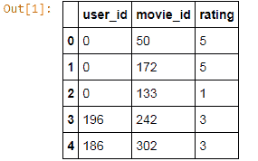

我们最终得到一个具有`user_id`，`movie_id`和`rating`的`DataFrame`。例如，`user_id 0`对`movie_id 50`进行了评分，我相信这是《星球大战》，给了 5 颗星，依此类推。

我们接下来要做的是，为每部电影聚合评分信息。我们使用 pandas 中的`groupby()`函数，实际上按`movie_id`对所有内容进行分组。我们将合并每部电影的所有评分，并输出每部电影的评分数量和平均评分分数，即平均值：

```py
movieProperties = ratings.groupby('movie_id').agg({'rating': 
 [np.size, np.mean]}) 
movieProperties.head() 

```

让我们继续做这个 - 很快就会回来，以下是输出的样子：

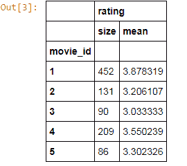

这给我们另一个`DataFrame`，告诉我们，例如，`movie_id 1`有**452**个评分（这是它受欢迎程度的衡量，即有多少人实际观看并评分），以及平均评分为 3.8。因此，有**452**人观看了`movie_id 1`，他们给出了平均评分为 3.87，这相当不错。

现在，评分的原始数量对我们来说并不那么有用。我的意思是，我不知道**452**是否意味着它受欢迎与否。因此，为了使其标准化，我们将基本上根据每部电影的最大和最小评分数量来衡量。我们可以使用`lambda`函数来做到这一点。因此，我们可以以这种方式将函数应用于整个`DataFrame`。

我们要做的是使用`np.min()`和`np.max()`函数来找到整个数据集中发现的最大评分数量和最小评分数量。因此，我们将找到最受欢迎的电影和最不受欢迎的电影，并将一切标准化到这个范围内：

```py
movieNumRatings = pd.DataFrame(movieProperties['rating']['size']) 
movieNormalizedNumRatings = movieNumRatings.apply(lambda x: (x - np.min(x)) / (np.max(x) - np.min(x))) 
movieNormalizedNumRatings.head() 

```

当我们运行它时，它给我们的是以下内容：

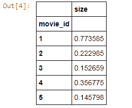

这基本上是每部电影的受欢迎程度的衡量，范围是 0 到 1。因此，这里的得分为 0 意味着没有人观看，这是最不受欢迎的电影，得分为`1`意味着每个人都观看了，这是最受欢迎的电影，或者更具体地说，是最多人观看的电影。因此，我们现在有了一个可以用于我们的距离度量的电影受欢迎程度的衡量。

接下来，让我们提取一些一般信息。原来有一个`u.item`文件，不仅包含电影名称，还包含每部电影所属的所有流派：

```py
movieDict = {} 
with open(r'c:/DataScience/ml-100k/u.item') as f: 
    temp = '' 
    for line in f: 
        fields = line.rstrip('\n').split('|') 
        movieID = int(fields[0]) 
        name = fields[1] 
        genres = fields[5:25] 
        genres = map(int, genres) 
        movieDict[movieID] = (name, genres,      
        movieNormalizedNumRatings.loc[movieID].get('size'),movieProperties.loc[movieID].rating.get('mean')) 

```

上面的代码实际上会遍历`u.item`的每一行。我们正在以困难的方式做这个；我们没有使用任何 pandas 函数；这次我们将直接使用 Python。再次确保将路径更改为您安装此信息的位置。

接下来，我们打开我们的`u.item`文件，然后逐行遍历文件中的每一行。我们去掉末尾的换行符，并根据该文件中的管道分隔符进行拆分。然后，我们提取`movieID`，电影名称和所有单独的流派字段。因此，基本上在这个源数据中有 19 个不同字段中的一堆 0 和 1，其中每个字段代表一个给定的流派。最后，我们构建一个 Python 字典，将电影 ID 映射到它们的名称、流派，然后我们还将我们的评分信息折叠回去。因此，我们将得到名称、流派、受欢迎程度（在 0 到 1 的范围内）、以及平均评分。这段代码就是做这个的。让我们运行一下！并且，为了看看我们最终得到了什么，我们可以提取`movie_id 1`的值：

```py
movieDict[1] 

```

以下是上述代码的输出：

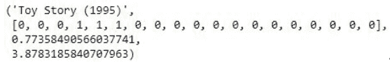

我们字典中`movie_id 1`的第一个条目恰好是《玩具总动员》，这是一部你可能听说过的 1995 年的皮克斯老电影。接下来是所有流派的列表，其中 0 表示它不属于该流派，1 表示它属于该流派。在`MovieLens`数据集中有一个数据文件，可以告诉你这些流派字段实际对应的是什么。

对于我们的目的来说，这实际上并不重要，对吧？我们只是试图根据它们的流派来衡量电影之间的距离。数学上重要的是这个流派向量与另一部电影有多相似，好吗？实际的流派本身并不重要！我们只想看看两部电影在它们的流派分类上有多相同或不同。所以我们有那个流派列表，我们有我们计算的受欢迎程度分数，还有 Toy Story 的平均评分。好了，让我们继续想办法将所有这些信息结合到一个距离度量中，这样我们就可以找到 Toy Story 的 k 个最近邻居了。

我已经相当随意地计算了这个`ComputeDistance()`函数，它接受两个电影 ID 并计算两者之间的距离分数。首先，我们将基于两个流派向量之间的相似性，使用余弦相似度度量来计算。就像我说的，我们将只是拿出每部电影的流派列表，看看它们彼此有多相似。再次强调，`0`表示它不属于该流派，`1`表示它属于该流派。

然后，我们将比较受欢迎程度分数，只取原始差异，这两个受欢迎程度分数之间的绝对值差异，并将其用于距离度量。然后，我们将仅使用这些信息来定义两部电影之间的距离。所以，例如，如果我们计算电影 ID 2 和 4 之间的距离，这个函数将返回一些仅基于该电影的受欢迎程度和这些电影的流派的距离函数。

现在，想象一下一个散点图，就像我们在前面的章节中看到的那样，其中一个轴可能是基于余弦度量的流派相似性的度量，另一个轴可能是受欢迎程度，好吗？我们只是在这两个事物之间找到距离：

```py
from scipy import spatial 

def ComputeDistance(a, b): 
    genresA = a[1] 
    genresB = b[1] 
    genreDistance = spatial.distance.cosine(genresA, genresB) 
    popularityA = a[2] 
    popularityB = b[2] 
    popularityDistance = abs(popularityA - popularityB) 
    return genreDistance + popularityDistance 

ComputeDistance(movieDict[2], movieDict[4]) 

```

在这个例子中，我们试图使用我们的距离度量来计算电影 2 和 4 之间的距离，我们得到了一个 0.8 的分数：

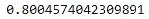

记住，远距离意味着不相似，对吧？我们想要最近的邻居，距离最小。所以，0.8 的分数在 0 到 1 的范围内是一个相当高的数字。这告诉我这些电影实际上并不相似。让我们快速进行一次理智检查，看看这些电影实际上是什么：

```py
print movieDict[2] 
print movieDict[4] 

```

结果是电影《黄金眼》和《短小的》这两部电影，它们是非常不同的电影：

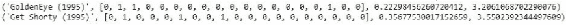

你知道，你有詹姆斯·邦德动作冒险片，还有一部喜剧电影 - 完全不相似！它们在受欢迎程度上实际上是可比较的，但是流派的差异让它们不同。好了！那么，让我们把它全部整合在一起吧！

接下来，我们将写一小段代码来实际获取一些给定的电影 ID 并找到 KNN。所以，我们所要做的就是计算 Toy Story 和我们电影字典中的所有其他电影之间的距离，并根据它们的距离分数对结果进行排序。以下的代码片段就是这样做的。如果你想花点时间来理解一下，它其实非常简单。

我们有一个小小的`getNeighbors()`函数，它将获取我们感兴趣的电影和我们想要找到的 K 个邻居。它将遍历我们拥有的每部电影；如果它实际上是一部不同于我们正在查看的电影，它将计算之前的距离分数，将其附加到我们的结果列表中，并对该结果进行排序。然后我们将挑选出前 K 个结果。

在这个例子中，我们将*K*设置为 10，找到 10 个最近的邻居。我们将使用`getNeighbors()`找到 10 个最近的邻居，然后遍历所有这 10 个最近的邻居，并计算每个邻居的平均评分。这个平均评分将告诉我们对于所讨论的电影的评分预测。

作为一个副作用，我们还根据我们的距离函数得到了 10 个最近的邻居，我们可以称之为相似的电影。所以，这个信息本身是有用的。回到那个“观看此影片的顾客还观看了”这个例子，如果你想做一个类似的功能，它只是基于这个距离度量而不是实际的行为数据，这可能是一个合理的起点，对吧？

```py
import operator 

def getNeighbors(movieID, K): 
    distances = [] 
    for movie in movieDict: 
        if (movie != movieID): 
            dist = ComputeDistance(movieDict[movieID], 
 movieDict[movie]) 
            distances.append((movie, dist)) 
    distances.sort(key=operator.itemgetter(1)) 
    neighbors = [] 
    for x in range(K): 
        neighbors.append(distances[x][0]) 
    return neighbors 

K = 10 
avgRating = 0 
neighbors = getNeighbors(1, K) 
for neighbor in neighbors: 
    avgRating += movieDict[neighbor][3] 
    print movieDict[neighbor][0] + " " + 
 str(movieDict[neighbor][3]) 
    avgRating /= float(K) 

```

所以，让我们继续运行这个，看看我们得到了什么。以下是上述代码的输出：

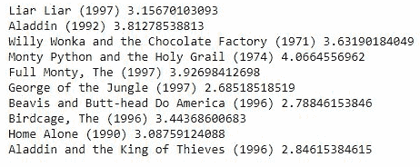

结果并不那么不合理。所以，我们以《玩具总动员》这部电影为例，它是电影 ID 1，我们得到的前 10 个最近邻居，是一些相当不错的喜剧和儿童电影。所以，鉴于《玩具总动员》是一部受欢迎的喜剧和儿童电影，我们得到了一堆其他受欢迎的喜剧和儿童电影；所以，似乎是有效的！我们并没有使用一堆花哨的协同过滤算法，这些结果并不那么糟糕。

接下来，让我们使用 KNN 来预测评分，这里我们将评分视为这个例子中的分类：

```py
avgRating 

```

以下是上述代码的输出：

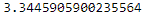

我们最终得到了一个预测评分为 3.34，实际上这与该电影的实际评分 3.87 并没有太大的不同。所以不是很好，但也不算太糟糕！我的意思是，实际上它的效果出奇的好，考虑到这个算法是多么简单！

# 活动

在这个例子中，大部分复杂性都在确定我们的距离度量上，你知道我们故意在那里搞了点花样，只是为了让它变得有趣，但你可以做任何其他你想做的事情。所以，如果你想玩弄一下这个，我绝对鼓励你这样做。我们选择 K 为 10 完全是凭空想象的，我就是编造出来的。这对不同的 K 值有什么影响？使用更高的 K 值会得到更好的结果吗？还是使用更低的 K 值？这有关系吗？

如果你真的想做一个更复杂的练习，你可以尝试将其应用到训练/测试中，实际上找到最能预测基于 KNN 的给定电影评分的 K 值。而且，你可以使用不同的距离度量，我也是凭空想象的！所以，玩一下距离度量，也许你可以使用不同的信息来源，或者以不同的方式权衡事物。这可能是一件有趣的事情。也许，流行度并不像流派信息那样重要，或者反过来也一样。看看这对你的结果有什么影响。所以，继续玩弄这些算法，玩弄代码并运行它，看看你能得到什么！如果你真的找到了一种显著的改进方法，那就和你的同学分享吧。

这就是 KNN 的实际运用！所以，这是一个非常简单的概念，但实际上它可能非常强大。所以，你看：仅仅基于流派和流行度就能找到相似的电影，没有别的。结果出奇的好！而且，我们使用了 KNN 的概念来实际使用那些最近的邻居来预测新电影的评分，这也实际上效果不错。所以，这就是 KNN 的实际运用，非常简单的技术，但通常效果相当不错！

# 降维和主成分分析

好了，是时候进入更高维度的世界了！我们要谈论更高维度和降维。听起来有点可怕！这里涉及到一些花哨的数学，但从概念上来说，它并不像你想象的那么难以理解。所以，让我们接下来谈谈降维和主成分分析。听起来非常戏剧化！通常当人们谈论这个时，他们谈论的是一种叫做主成分分析或 PCA 的技术，以及一种叫做奇异值分解或 SVD 的特定技术。所以 PCA 和 SVD 是本节的主题。让我们深入研究一下！

# 降维

那么，维度诅咒是什么？嗯，很多问题可以被认为有许多不同的维度。所以，例如，当我们在做电影推荐时，我们有各种电影的属性，每个单独的电影可以被认为是数据空间中的一个维度。

如果你有很多电影，那就有很多维度，你真的无法理解超过 3 个维度，因为这是我们成长演变的范围。你可能有一些你关心的许多不同特征的数据。你知道，在接下来的一刻，我们将看一个我们想要分类的花的例子，而且这个分类是基于花的 4 个不同的测量。这 4 个不同的特征，这 4 个不同的测量可以代表 4 个维度，再次，这是非常难以可视化的。

因此，降维技术存在是为了找到一种将更高维度信息降低到更低维度信息的方法。这不仅可以使它更容易查看和分类事物，而且还可以用于压缩数据。因此，通过保留最大方差，同时减少维度的数量，我们更紧凑地表示数据集。降维的一个非常常见的应用不仅仅是用于可视化，还用于压缩和特征提取。我们稍后会再谈一些。

降维的一个非常简单的例子可以被认为是 k 均值聚类：

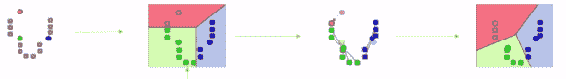

所以你知道，例如，我们可能从数据集中开始有许多点，代表数据集中许多不同的维度。但是，最终，我们可以将其归纳为 K 个不同的质心，以及你到这些质心的距离。这是将数据归纳为更低维度表示的一种方法。

# 主成分分析

通常，当人们谈论降维时，他们谈论的是一种称为主成分分析的技术。这是一种更加复杂的技术，它涉及到一些相当复杂的数学。但是，从高层次来看，你需要知道的是它将一个更高维度的数据空间，找到该数据空间和更高维度内的平面。

这些更高维度的平面被称为超平面，并且它们由称为特征向量的东西定义。你可以取尽可能多的平面，最终在那些超平面上投影数据，那些就成为你的低维数据空间中的新轴：

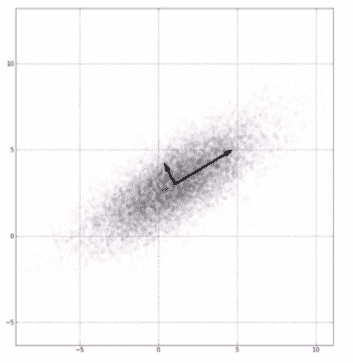

你知道，除非你熟悉更高维度的数学并且之前考虑过它，否则很难理解！但是，最终，这意味着我们选择更高维度空间中的平面，仍然保留我们数据中的最大方差，并将数据投影到这些更高维度的平面上，然后将其带入更低维度的空间，好吗？

你真的不需要理解所有的数学来使用它；重要的是，这是一种非常有原则的方法，可以将数据集降低到更低维度的空间，同时仍然保留其中的方差。我们谈到了图像压缩作为这一应用的一个例子。所以你知道，如果我想要在图像中减少维度，我可以使用主成分分析将其归纳到其本质。

面部识别是另一个例子。所以，如果我有一个面部数据集，也许每张脸代表 2D 图像的第三个维度，并且我想将其归纳，SVD 和主成分分析可以是识别真正重要的特征的一种方法。因此，它可能更多地关注眼睛和嘴巴，例如，那些在保留数据集内方差方面是必要的重要特征。因此，它可以产生一些非常有趣和非常有用的结果，这些结果只是自然地从数据中出现，这有点酷！

为了使其更真实，我们将使用一个更简单的例子，使用所谓的鸢尾花数据集。这是一个包含在 scikit-learn 中的数据集。它在示例中经常被使用，其背后的想法是：鸢尾花实际上有两种不同类型的花瓣。一种叫做花瓣，就是你熟悉的花瓣，还有一种叫做萼片，它是花朵下部的一组支持性较低的花瓣。

我们可以拿一堆不同种类的鸢尾花，测量花瓣的长度和宽度，以及萼片的长度和宽度。因此，花瓣的长度和宽度，以及萼片的长度和宽度，共有 4 个不同的测量值对应于我们数据集中的 4 个不同维度。我想用这些来分类鸢尾花可能属于哪个物种。现在，PCA 将让我们在 2 个维度上可视化这个数据，而仍然保留数据集中的方差。所以，让我们看看这个方法的效果如何，并实际编写一些 Python 代码来对鸢尾花数据集进行 PCA。

这些就是降维、主成分分析和奇异值分解的概念。所有这些都是很高级的词汇，是的，这确实是一件高级的事情。你知道，我们正在以一种保留它们的方差的方式将高维空间缩减到低维空间。幸运的是，scikit-learn 使这变得非常容易，只需要 3 行代码就可以应用 PCA。所以让我们开始吧！

# 鸢尾花数据集的 PCA 示例

让我们将主成分分析应用于鸢尾花数据集。这是一个 4D 数据集，我们将将其降低到 2 个维度。我们将看到，即使丢弃了一半的维度，我们仍然可以保留数据集中的大部分信息。这是相当酷的东西，而且也相当简单。让我们深入研究一下，进行一些主成分分析，并解决维度的诅咒。继续打开`PCA.ipynb`文件。

使用 scikit-learn 实际上非常容易！再次强调，PCA 是一种降维技术。所有这些关于高维度的讨论听起来非常科幻，但为了使其更具体和真实，一个常见的应用是图像压缩。你可以将一张黑白图片看作是 3 个维度，其中宽度是 x 轴，高度是 y 轴，每个单元格都有一个 0 到 1 的亮度值，即黑色或白色，或者介于两者之间的一些值。因此，这将是 3D 数据；你有 2 个空间维度，然后还有一个亮度和强度维度。

如果你将其精炼为仅有 2 个维度，那将是一个压缩图像，如果你以一种尽可能保留图像方差的技术来做到这一点，你仍然可以重构图像，理论上损失不会太大。所以，这就是降维，精炼为一个实际的例子。

现在，我们将使用鸢尾花数据集的另一个示例，scikit-learn 包含了这个数据集。它只是一个包含各种鸢尾花测量值和该数据集中每株鸢尾花物种分类的数据集。就像我之前说的，它还包括每株鸢尾花标本的花瓣和萼片的长度和宽度测量值。因此，在花瓣的长度和宽度以及萼片的长度和宽度之间，我们的数据集中有 4 个特征数据维度。

我们希望将其精炼为我们实际可以查看和理解的内容，因为你的大脑无法很好地处理 4 个维度，但你可以很容易地在纸上查看 2 个维度。让我们继续加载：

```py
from sklearn.datasets import load_iris 
from sklearn.decomposition import PCA 
import pylab as pl 
from itertools import cycle 

iris = load_iris() 

numSamples, numFeatures = iris.data.shape 
print numSamples 
print numFeatures 
print list(iris.target_names) 

```

scikit-learn 中有一个方便的`load_iris()`函数，它可以直接加载数据，无需额外的工作；所以你可以专注于有趣的部分。让我们来看看这个数据集是什么样子的，前面代码的输出如下：

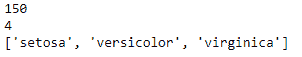

你可以看到我们正在提取数据集的形状，也就是我们有多少数据点，即`150`，以及数据集有多少特征，或者说有多少维度，即`4`。所以，我们的数据集中有`150`朵鸢尾花标本，有 4 个信息维度。再次强调，这是萼片的长度和宽度，以及花瓣的长度和宽度，总共有`4`个特征，我们可以将其视为`4`个维度。

我们还可以打印出这个数据集中目标名称的列表，即分类，我们可以看到每朵鸢尾花属于三种不同的物种之一：山鸢尾、变色鸢尾或者维吉尼亚鸢尾。这就是我们要处理的数据：150 朵鸢尾花标本，分为 3 种物种之一，并且每朵鸢尾花都有 4 个特征。

让我们看看 PCA 有多容易。尽管在底层它是一个非常复杂的技术，但实际操作只需要几行代码。我们将整个鸢尾花数据集分配给 X。然后我们将创建一个 PCA 模型，并保持`n_components=2`，因为我们想要 2 个维度，也就是说，我们要从 4 维降到 2 维。

我们将使用`whiten=True`，这意味着我们将对所有数据进行归一化，确保一切都很好地可比较。通常情况下，为了获得良好的结果，你会想要这样做。然后，我们将把 PCA 模型拟合到我们的鸢尾花数据集`X`上。然后我们可以使用该模型将数据集转换为 2 维。让我们来运行一下。这发生得非常快！

```py
X = iris.data 
pca = PCA(n_components=2, whiten=True).fit(X) 
X_pca = pca.transform(X) 

```

请思考刚才发生了什么。我们实际上创建了一个 PCA 模型，将 4 个维度降低到`2`，它通过选择 2 个 4D 向量来实现这一点，以创建超平面，将 4D 数据投影到 2 维。你实际上可以通过打印 PCA 的实际成分来看到这些 4D 向量，即特征向量。所以，**PCA**代表**主成分分析**，这些主成分就是我们选择来定义平面的特征向量：

```py
print pca.components_ 

```

前面代码的输出如下：

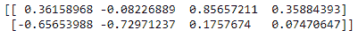

你实际上可以查看这些值，它们对你来说可能没有太多意义，因为你无法真正想象 4 个维度，但我们这样做是为了让你看到它实际上正在处理主成分。所以，让我们评估一下我们的结果：

```py
print pca.explained_variance_ratio_ 
print sum(pca.explained_variance_ratio_) 

```

PCA 模型给我们返回了一个叫做`explained_variance_ratio`的东西。基本上，这告诉你在将原始的 4D 数据降低到 2 维时，有多少方差得以保留。所以，让我们来看看：

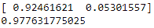

它实际上给出了一个包含 2 个项目的列表，用于我们保留的 2 个维度。这告诉我，在第一个维度中，我实际上可以保留数据中 92%的方差，而第二个维度只给了我额外的 5%方差。如果将它们加在一起，我将数据投影到的这 2 个维度中，仍然保留了源数据中超过 97%的方差。我们可以看到，其实并不需要 4 个维度来捕捉这个数据集中的所有信息，这是非常有趣的。这是相当酷的东西！

如果你仔细想想，你觉得可能是为什么呢？也许花的整体大小与其物种中心有一定的关系。也许是花瓣和萼片的长度与宽度之比。你知道，这些东西可能会随着给定物种或给定花的整体大小一起协调地移动。因此，也许这 4 个维度之间存在 PCA 自行提取的关系。这很酷，也很强大。让我们继续可视化这一点。

将这个数据降低到 2 个维度的整个目的是为了我们能够制作一个漂亮的 2D 散点图，至少这是我们在这个小例子中的目标。因此，我们将在这里做一些 Matplotlib 的魔术。这里有一些花里胡哨的东西，我至少应该提一下。所以，我们将创建一个颜色列表：红色、绿色和蓝色。我们将创建一个目标 ID 列表，使值 0、1 和 2 映射到我们拥有的不同的鸢尾花物种。

我们将把所有这些与每个物种的实际名称一起压缩。for 循环将遍历 3 种不同的鸢尾花物种，当它这样做时，我们将有该物种的索引，与之关联的颜色，以及该物种的实际可读名称。我们将一次处理一种物种，并在我们的散点图上用给定的颜色和标签绘制该物种的散点图。然后我们将添加我们的图例并显示结果：

```py
colors = cycle('rgb') 
target_ids = range(len(iris.target_names)) 
pl.figure() 
for i, c, label in zip(target_ids, colors, iris.target_names): 
    pl.scatter(X_pca[iris.target == i, 0], X_pca[iris.target == i, 1], 
        c=c, label=label) 
pl.legend() 
pl.show() 

```

以下是我们得到的结果：

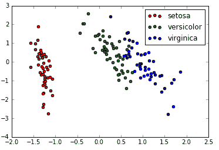

这是我们将 4D 鸢尾花数据投影到 2 个维度。非常有趣！你可以看到它们仍然相当好地聚集在一起。你知道，所有的维吉尼亚人坐在一起，所有的变色鸢尾坐在中间，而山鸢尾则远在左侧。真的很难想象这些实际值代表什么。但是，重要的是，我们将 4D 数据投影到 2D，并且以这样的方式保留了方差。我们仍然可以清楚地看到这 3 个物种之间的明显区分。在其中有一些交织，不是完美的，你知道。但总的来说，它非常有效。

# 活动

正如你从`explained_variance_ratio`中回忆起的那样，我们实际上在一个维度中捕获了大部分的方差。也许花的整体大小才是真正重要的分类因素；你可以用一个特征来指定这一点。所以，如果你感觉可以的话，继续修改结果。看看你是否可以用 2 个维度或者 1 个维度来完成！所以，把`n_components`改成`1`，看看你得到什么样的方差比率。

发生了什么？这有意义吗？玩弄一下，熟悉一下。这就是降维、主成分分析和奇异值分解的全部过程。非常、非常花哨的术语，你知道，在公平的情况下，在这些术语的背后是一些相当花哨的数学。但正如你所看到的，这是一种非常强大的技术，并且在 scikit-learn 中，应用起来并不难。因此，请将其放入你的工具箱中。

就是这样！一个关于花信息的 4D 数据集被简化为我们可以轻松可视化的 2 个维度，并且仍然可以清楚地看到我们感兴趣的分类之间的区分。因此，在这个例子中，PCA 的效果非常好。再次强调，这是一个用于压缩、特征提取或面部识别等方面的有用工具。因此，请将其放入你的工具箱中。

# 数据仓库概述

接下来，我们将稍微谈一下数据仓库。这是一个领域，最近被 Hadoop 的出现以及一些大数据技术和云计算所颠覆。所以，有很多大的关键词，但这些概念对你来说是重要的。

让我们深入探讨这些概念！让我们谈谈 ELT 和 ETL，以及数据仓库的一般情况。这更多是一个概念，而不是一个具体的实际技术，所以我们将从概念上来谈论它。但是，在工作面试中，这可能会出现。所以，让我们确保你理解这些概念。

我们将首先谈论一般的数据仓库。什么是数据仓库？嗯，它基本上是一个包含来自许多不同来源的信息的巨大数据库，并为你将它们联系在一起。例如，也许你在一家大型电子商务公司工作，他们可能有一个订单系统，将人们购买的商品的信息输入到你的数据仓库中。

你还可以从网络服务器日志中获取信息，将其注入到数据仓库中。这将使你能够将网站上的浏览信息与人们最终购买的商品联系起来。也许你还可以将来自客户服务系统的信息联系起来，并衡量浏览行为与客户最终的满意度之间是否存在关系。

数据仓库面临着从许多不同来源获取数据的挑战，将它们转换为某种模式，使我们能够同时查询这些不同的数据来源，并通过数据分析得出见解。因此，大型公司和组织通常会有这种情况。我们正在涉及大数据的概念。你可以有一个巨大的 Oracle 数据库，例如，其中包含所有这些东西，也许以某种方式进行了分区和复制，并且具有各种复杂性。你可以通过 SQL，结构化查询语言，或者通过图形工具，比如 Tableau，来查询它，这是目前非常流行的一种工具。这就是数据分析师的工作，他们使用诸如 Tableau 之类的工具查询大型数据集。

这就是数据分析师和数据科学家之间的区别。你可能实际上正在编写代码，对数据执行更高级的技术，涉及到人工智能，而不仅仅是使用工具从数据仓库中提取图表和关系。这是一个非常复杂的问题。在亚马逊，我们有一个专门负责数据仓库的部门，全职负责这些事情，他们从来没有足够的人手，我可以告诉你；这是一项重大工作！

你知道，做数据仓库有很多挑战。其中之一是数据规范化：因此，你必须弄清楚这些不同数据来源中的所有字段实际上是如何相互关联的？我如何确保一个数据源中的列可以与另一个数据源中的列进行比较，并具有相同的数据集、相同的规模和相同的术语？我如何处理缺失数据？我如何处理损坏的数据或来自异常值、机器人等的数据？这些都是非常大的挑战。维护这些数据源也是一个非常大的问题。

当你将所有这些信息导入数据仓库时，很多问题可能会出现，特别是当你需要进行非常大的转换，将从网络日志中保存的原始数据转换为实际的结构化数据库表，然后导入到你的数据仓库中。当你处理一个庞大的数据仓库时，扩展也可能会变得棘手。最终，你的数据会变得如此庞大，以至于这些转换本身开始成为一个问题。这开始涉及到 ELT 与 ETL 的整个话题。

# ETL 与 ELT

让我们首先谈谈 ETL。它是什么意思？它代表提取、转换和加载-这是做数据仓库的传统方式。

基本上，首先从你想要的操作系统中提取你想要的数据。例如，我可能每天从我们的 Web 服务器中提取所有的 Web 日志。然后，我需要将所有这些信息转换为一个实际的结构化数据库表，可以将其导入到我的数据仓库中。

这个转换阶段可能会遍历每一行 Web 服务器日志，将其转换为一个实际的表，从每个 Web 日志行中提取会话 ID、他们查看的页面、时间、引荐者等信息，并将其组织成一个表格结构，然后将其加载到数据仓库本身，作为数据库中的一个实际表。因此，随着数据变得越来越大，这个转换步骤可能会成为一个真正的问题。想想在 Google、Amazon 或任何大型网站上处理所有 Web 日志并将其转换为数据库可以摄取的内容需要多少处理工作。这本身就成为一个可扩展性挑战，并且可能会通过整个数据仓库管道引入稳定性问题。

这就是 ELT 概念的出现，并且它有点颠覆了一切。它说，“如果我们不使用一个庞大的 Oracle 实例会怎样？如果我们使用一些允许我们在 Hadoop 集群上拥有更分布式数据库的新技术，让我们利用 Hive、Spark 或 MapReduce 这些分布式数据库的能力，在加载后实际进行转换。”

这里的想法是，我们将提取我们想要的信息，就像以前一样，比如从一组 Web 服务器日志中。但是，我们将直接将其加载到我们的数据存储库中，并且我们将使用存储库本身的功能来实际进行转换。因此，这里的想法是，与其进行离线过程来转换我的 Web 日志，例如，将其作为原始文本文件导入并逐行处理，使用类似 Hadoop 的东西的功能，实际上将其转换为更结构化的格式，然后可以跨整个数据仓库解决方案进行查询。

像 Hive 这样的东西让你在 Hadoop 集群上托管一个庞大的数据库。还有像 Spark SQL 这样的东西，让你也可以以非常类似 SQL 的数据仓库方式进行查询，实际上是在 Hadoop 集群上分布的数据仓库上进行查询。还有一些分布式 NoSQL 数据存储，可以使用 Spark 和 MapReduce 进行查询。这个想法是，你不是使用单一的数据库作为数据仓库，而是使用建立在 Hadoop 或某种集群之上的东西，实际上不仅可以扩展数据的处理和查询，还可以扩展数据的转换。

再次强调，首先提取原始数据，然后将其加载到数据仓库系统本身。然后使用数据仓库的能力（可能建立在 Hadoop 上）作为第三步进行转换。然后我可以一起查询这些东西。这是一个非常庞大的项目，非常庞大的主题。你知道，数据仓库本身就是一个完整的学科。我们将很快在这本书中更多地讨论 Spark，这是处理这个问题的一种方式——特别是有一个叫做 Spark SQL 的东西是相关的。

总体概念是，如果你从建立在 Oracle 或 MySQL 上的单一数据库转移到建立在 Hadoop 之上的这些更现代的分布式数据库之一，你可以在加载原始数据后进行转换阶段。这可能会更简单、更可扩展，并且利用今天可用的大型计算集群的能力。

这是 ETL 与 ELT 的对比，云计算中的传统方式与当今有意义的方式，当我们有大规模的计算资源可用于转换大型数据集时。这就是概念。

ETL 是一种老派的做法，你在导入和加载到一个巨大的数据仓库、单片数据库之前，离线转换一堆数据。但是在今天的技术中，使用基于云的数据库、Hadoop、Hive、Spark 和 MapReduce，你实际上可以更有效地做到这一点，并利用集群的力量在将原始数据加载到数据仓库后执行转换步骤。

这真的改变了这个领域，你知道这一点很重要。再次强调，关于这个主题还有很多要学习，所以我鼓励你在这个主题上进行更多的探索。但是，这就是基本概念，现在你知道人们谈论 ETL 与 ELT 时在谈论什么了。

# 强化学习

我们下一个话题是一个有趣的话题：强化学习。我们可以用 Pac-Man 的例子来理解这个概念。我们实际上可以创建一个能够自己玩得很好的智能 Pac-Man 代理。你会惊讶于构建这个智能 Pac-Man 背后的技术是多么简单。让我们来看看！

因此，强化学习的理念是，你有某种代理，比如 Pac-Man，在我们的例子中，这个空间将是 Pac-Man 所在的迷宫。随着它的前进，它学会了在不同条件下不同状态变化的价值。

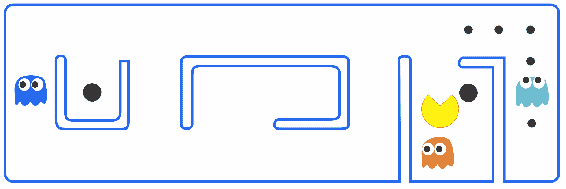

例如，在前面的图像中，Pac-Man 的状态可能是由它南边有一个幽灵，西边有一堵墙，北边和东边是空的空间来定义的，这可能定义了 Pac-Man 的当前状态。它可以进行的状态变化是朝特定方向移动。然后我可以学习朝某个方向前进的价值。例如，如果我向北移动，实际上不会发生什么，这并没有真正的奖励。但是，如果我向南移动，我会被幽灵摧毁，这将是一个负值。

当我去探索整个空间时，我可以建立起一组所有可能的 Pac-Man 可能处于的状态，并与在每个状态中朝特定方向移动相关联的值，这就是强化学习。随着它探索整个空间，它会为给定状态细化这些奖励值，然后可以使用存储的奖励值来选择在当前条件下做出最佳决策。除了 Pac-Man，还有一个叫做 Cat & Mouse 的游戏，这是一个常用的例子，我们稍后会看一下。

这种技术的好处在于，一旦你探索了你的代理可能处于的所有可能状态，你可以在运行不同迭代时非常快速地获得非常好的性能。所以，你可以通过运行强化学习来制作一个智能 Pac-Man，让它探索在不同状态下可以做出不同决策的价值，然后存储这些信息，以便在未知条件下看到未来状态时快速做出正确的决策。

# Q-learning

因此，强化学习的一个非常具体的实现被称为 Q-learning，这更加正式地阐述了我们刚刚谈到的内容：

+   因此，你从代理的一组环境状态开始（我旁边有幽灵吗？我前面有能量丸吗？诸如此类的事情。），我们将称之为 s。

+   我有一组可能在这些状态下采取的行动，我们将称之为 a。在 Pac-Man 的情况下，这些可能的行动是向上、向下、向左或向右移动。

+   然后我们有每个状态/行动对的一个值，我们将其称为 Q；这就是为什么我们称之为 Q 学习。因此，对于每个状态，Pac-Man 周围给定的一组条件，给定的行动将有一个值*Q*。因此，向上移动可能会有一个给定的值 Q，向下移动可能会有一个负的*Q*值，如果这意味着遇到幽灵，例如。

因此，我们从 Pac-Man 可能处于的每个可能状态开始，都有一个*Q*值为 0。随着 Pac-Man 探索迷宫，当 Pac-Man 遇到不好的事情时，我们会减少 Pac-Man 当时所处状态的*Q*值。因此，如果 Pac-Man 最终被幽灵吃掉，我们会惩罚他在当前状态所做的任何事情。当 Pac-Man 遇到好事时，当他吃到一个能量丸或吃掉一个幽灵时，我们将增加他所处状态的那个动作的*Q*值。然后，我们可以使用这些*Q*值来指导 Pac-Man 的未来选择，并构建一个可以表现最佳的小智能体，制作一个完美的小 Pac-Man。从我们刚才看到的 Pac-Man 的相同图像开始，我们可以通过定义他的西边有一堵墙，北边和东边有空地，南边有一个幽灵来进一步定义 Pac-Man 的当前状态。

我们可以看看他可以采取的行动：他实际上根本不能向左移动，但他可以向上、向下或向右移动，我们可以为所有这些行动分配一个值。向上或向右移动，实际上什么都不会发生，没有能量丸或点可以消耗。但如果他向左走，那肯定是一个负值。我们可以说对于由当前条件给出的状态，Pac-Man 所处的状态，向下移动将是一个非常糟糕的选择；对于那个给定状态的那些行动选择，应该有一个负的*Q*值。根本不能向左移动。向上或向右或保持中立，*Q*值对于那个给定状态的那些行动选择将保持为 0。

现在，你也可以向前看一点，使智能体变得更加智能。因此，实际上我离得到能量丸还有两步。因此，如果 Pac-Man 要探索这个状态，如果我在下一个状态吃到那个能量丸，我实际上可以将其纳入到先前状态的*Q*值中。如果你只有某种折扣因子，基于你在时间上有多远，你有多少步远，你可以将所有这些因素结合在一起。这是实际上在系统中建立一点记忆的方法。你可以使用折扣因子来计算 Q（这里*s*是先前的状态，*s'*是当前的状态）来向前看超过一步：

*Q(s,a) += 折扣 * (奖励(s,a) + max(Q(s')) - Q(s,a))*

因此，当我消耗那个能量丸时所体验到的*Q*值实际上可能会提升我沿途遇到的先前*Q*值。这是使 Q 学习变得更好的一种方法。

# 探索问题

在强化学习中我们面临的一个问题是探索问题。在探索阶段，我如何确保有效地覆盖所有不同的状态和这些状态中的行动？

# 简单的方法

一种简单的方法是始终选择具有迄今为止计算出的最高*Q*值的给定状态的动作，如果有平局，就随机选择。因此，最初我的所有*Q*值可能都是 0，我会首先随机选择动作。

当我开始获得关于给定动作和给定状态的更好*Q*值的信息时，我将开始在前进时使用它们。但是，这最终会变得非常低效，如果我只将自己固定在始终选择到目前为止计算出的最佳*Q*值的这种刚性算法中，我实际上可能会错过很多路径。

# 更好的方法

因此，更好的方法是在探索时引入一些随机变化到我的行动中。因此，我们称之为一个 epsilon 项。假设我们有某个值，我掷骰子，得到一个随机数。如果它小于这个 epsilon 值，我实际上不遵循最高的*Q*值；我不做有意义的事情，我只是随机选择一条路径来尝试一下，看看会发生什么。这实际上让我在探索阶段更有效地探索更广泛的可能性、更广泛的行动，更广泛的状态。

因此，我们刚刚做的事情可以用非常花哨的数学术语来描述，但你知道概念上它相当简单。

# 花哨的词

我探索一些我可以在给定状态下采取的行动，我用它来指导与给定状态相关的给定行动的奖励，探索结束后，我可以使用那些*Q*值的信息，来智能地穿越一个全新的迷宫，例如。

这也可以称为马尔可夫决策过程。因此，很多数据科学只是给简单的概念赋予花哨、令人生畏的名字，强化学习中也有很多这样的情况。

# 马尔可夫决策过程

因此，如果你查阅马尔可夫决策过程的定义，它是“一个数学框架，用于建模决策，其中结果部分是随机的，部分受决策者控制”。

+   **决策**: 在给定状态的一系列可能性中，我们采取什么行动？

+   **在结果部分是随机的情况下**: 嗯，有点像我们的随机探索。

+   **部分受决策者控制**: 决策者是我们计算出的*Q*值。

因此，MDPs，马尔可夫决策过程，是一种花哨的方式来描述我们刚刚为强化学习描述的探索算法。符号甚至相似，状态仍然被描述为 s，s'是我们遇到的下一个状态。我们有被定义为*P[a]*的状态转移函数，对于给定的 s 和 s'。我们有我们的*Q*值，它们基本上被表示为一个奖励函数，对于给定的 s 和 s'有一个*R[a]*值。因此，从一个状态转移到另一个状态有一个与之相关的奖励，从一个状态转移到另一个状态由一个状态转移函数定义：

+   状态仍然被描述为*s*和*s''*

+   状态转移函数被描述为*Pa(s,s')*

+   我们的*Q*值被描述为奖励函数*Ra(s,s')*

因此，再次描述我们刚刚做的事情，只是用数学符号和一个更花哨的词，马尔可夫决策过程。如果你想要听起来更聪明一点，你也可以用另一个名字来称呼马尔可夫决策过程：离散时间随机控制过程。听起来很聪明！但概念本身就是我们刚刚描述的东西。

# 动态规划

因此，更花哨的词：动态规划也可以用来描述我们刚刚做的事情。哇！听起来像是人工智能，计算机自我编程，《终结者 2》，天网之类的东西。但不，这只是我们刚刚做的事情。如果你查阅动态规划的定义，它是一种通过将复杂问题分解为一系列更简单的子问题来解决复杂问题的方法，每个子问题只解决一次，并理想地存储它们的解决方案，使用基于内存的数据结构。

下次出现相同的子问题时，不需要重新计算其解决方案，只需查找先前计算的解决方案，从而节省计算时间，但以（希望）在存储空间上进行适度的开销：

+   **解决复杂问题的方法**: 就像创造一个智能的吃豆人，这是一个相当复杂的最终结果。

+   通过将其分解为一系列更简单的子问题：例如，对于可能出现在 Pac-Man 中的给定状态，采取的最佳行动是什么。Pac-Man 可能会发现自己处于许多不同的状态，但每个状态都代表一个更简单的子问题，在这个子问题中，我可以做出有限的选择，并且有一个正确的答案来做出最佳的移动。

+   **存储它们的解决方案**：这些解决方案是我与每个可能的动作在每个状态关联的*Q*值。

+   **理想情况下，使用基于内存的数据结构**：当然，我需要以某种方式存储这些*Q*值并将它们与状态关联起来，对吧？

+   **下次出现相同的子问题**：下次 Pac-Man 处于我已经有一组*Q*值的给定状态时。

+   **而不是重新计算其解决方案，只需查找先前计算的解决方案**：我已经从探索阶段得到的*Q*值。

+   **从而节省计算时间，以牺牲存储空间的适度开支**：这正是我们刚刚用强化学习做的。

我们有一个复杂的探索阶段，找到与每个动作对应的给定状态的最佳奖励。一旦我们有了这个表格，我们就可以非常快速地使用它来使我们的 Pac-Man 在一个全新的迷宫中以最佳方式移动。因此，强化学习也是一种动态规划的形式。哇！

简而言之，你可以通过让它半随机地探索不同的移动选择来制作一个智能的 Pac-Man 代理，给定不同的条件，其中这些选择是动作，这些条件是状态。我们在进行时跟踪与每个动作或状态相关联的奖励或惩罚，我们实际上可以打折，回溯多步，如果你想让它变得更好。

然后我们存储这些*Q*值，我们可以使用它来指导其未来的选择。因此，我们可以进入一个全新的迷宫，并且有一个非常聪明的 Pac-Man，可以有效地避开幽灵并吃掉它们。这是一个非常简单但非常强大的概念。你也可以说你理解了一堆花哨的术语，因为它都是同一个东西。Q 学习，强化学习，马尔可夫决策过程，动态规划：都与同一个概念相关联。

我不知道，我觉得你实际上可以通过这样一个简单的技术制作出一种人工智能的 Pac-Man，这真的很酷！如果你想更详细地了解它，以下是一些示例，你可以查看其中一个实际的源代码，并且可能进行调试，**Python 马尔可夫决策过程工具包**：[`pymdptoolbox.readthedocs.org/en/latest/api/mdp.html`](http://pymdptoolbox.readthedocs.org/en/latest/api/mdp.html)。

有一个 Python 马尔可夫决策过程工具包，它用我们谈到的所有术语包装起来。有一个你可以查看的示例，一个关于猫和老鼠游戏的工作示例，类似的。实际上，还有一个你可以在线查看的 Pac-Man 示例，它更直接地与我们谈论的内容相关。请随意探索这些链接，并了解更多。

这就是强化学习。更一般地说，这是一种构建代理程序的有用技术，该代理程序可以在可能具有一组与每个状态相关联的动作的不同状态中导航。因此，我们大多数时候在迷宫游戏的背景下讨论它。但是，你可以更广泛地思考，你知道每当你需要根据一组当前条件和一组可以采取的行动来预测某物的行为时。强化学习和 Q 学习可能是一种方法。所以，请记住这一点！

# 总结

在本章中，我们看到了一种最简单的机器学习技术，称为 k 最近邻算法。我们还看了一个 KNN 的例子，它预测了一部电影的评分。我们分析了降维和主成分分析的概念，并看到了一个 PCA 的例子，它将 4D 数据降低到两个维度，同时保留了其方差。

接下来，我们学习了数据仓库的概念，并看到了如何在今天使用 ELT 过程而不是 ETL 更有意义。我们深入了解了强化学习的概念，并看到了它在 Pac-Man 游戏背后的应用。最后，我们看到了一些用于强化学习的花哨词汇（Q 学习，马尔可夫决策过程和动态学习）。在下一章中，我们将看到如何处理真实世界的数据。
