# 第八章：处理真实世界的数据

在本章中，我们将讨论处理真实世界数据的挑战，以及你可能遇到的一些怪癖。本章首先讨论了偏差-方差的权衡，这是一种更有原则的谈论你可能过拟合和欠拟合数据的不同方式的方式，以及它们如何相互关联。然后我们讨论了 k 折交叉验证技术，这是你用来对抗过拟合的重要工具，并看看如何使用 Python 实现它。

接下来，我们分析了在实际应用任何算法之前清理和归一化数据的重要性。我们看了一个示例来确定网站上最受欢迎的页面，这将展示清理数据的重要性。本章还涵盖了记住归一化数值数据的重要性。最后，我们看看如何检测异常值并处理它们。

具体来说，本章涵盖以下主题：

+   分析偏差/方差的权衡

+   k 折交叉验证的概念及其实现

+   清理和归一化数据的重要性

+   确定网站的热门页面的示例

+   归一化数值数据

+   检测异常值并处理它们

# 偏差/方差的权衡

在处理真实世界数据时面临的一个基本挑战是过拟合与欠拟合你的回归数据，或者你的模型，或者你的预测。当我们谈论欠拟合和过拟合时，我们经常可以在偏差和方差的背景下谈论这一点，以及偏差-方差的权衡。所以，让我们谈谈这意味着什么。

从概念上讲，偏差和方差非常简单。偏差就是你离正确值有多远，也就是说，你的预测在整体上预测正确的值有多好。如果你取所有预测的平均值，它们是否更多或更少在正确的位置上？或者你的错误是一直偏向某个方向？如果是这样，那么你的预测就有某个方向的偏差。

方差只是衡量你的预测有多分散、多散乱的一个指标。所以，如果你的预测到处都是，那就是高方差。但是，如果它们非常集中在正确的值上，甚至在高偏差的情况下也是如此，那么你的方差就很小。

让我们看一些例子。假设以下飞镖板代表我们正在做的一堆预测，我们试图预测的真实值在靶心的中心：

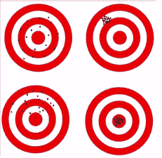

+   从左上角的飞镖板开始，你可以看到我们的点都散落在中心周围。所以总体上，你知道平均误差非常接近实际情况。我们的偏差实际上非常低，因为我们的预测都在同一个正确的点周围。然而，我们的方差非常高，因为这些点散布在各个地方。所以，这是一个低偏差和高方差的例子。

+   如果我们转移到右上角的飞镖板，我们会看到我们的点都一直偏离了正确的位置，向西北方向。所以这是我们预测中高偏差的一个例子，它们一直偏离了一定的距离。我们的方差很低，因为它们都紧密地聚集在错误的位置周围，但至少它们是紧密在一起的，所以我们在预测中是一致的。这是低方差。但是，偏差很高。所以再次，这是高偏差，低方差。

+   在左下角的飞镖板上，你可以看到我们的预测散布在错误的平均点周围。所以，我们有很高的偏差；一切都偏向了不应该去的地方。但我们的方差也很高。所以，这在这个例子中是最糟糕的情况；我们既有高偏差又有高方差。

+   最后，在一个完美的世界中，你会有一个像右下方飞镖板那样的例子，那里我们有低偏差，一切都集中在应该的位置，以及低方差，事物都紧密地聚集在应该的位置。所以，在一个完美的世界中，这就是你最终得到的结果。

实际上，你经常需要在偏差和方差之间做出选择。这归结为过拟合与欠拟合数据。让我们看看以下例子：

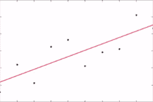 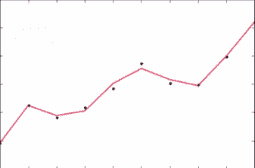

这是一种对偏差和方差的不同思考方式。所以，在左边的图表中，我们有一条直线，你可以认为相对于这些观察结果，它具有非常低的方差。所以，这条线的方差不大，也就是说，它具有低方差。但是偏差，每个单独点的误差，实际上是很高的。

现在，对比一下右边图表中过拟合的数据，我们已经努力去拟合这些观察结果。这条线具有高方差，但低偏差，因为每个单独的点都非常接近它应该在的位置。所以，这就是我们用方差换取偏差的一个例子。

最终，你不是为了只减少偏差或只减少方差，你想要减少错误。这才是真正重要的，结果表明你可以将错误表达为偏差和方差的函数：

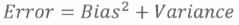

看这个，错误等于偏差的平方加上方差。所以，这两个因素都会对总体错误产生影响，实际上偏差的影响更大。但要记住，你真正想要最小化的是错误，而不是偏差或方差特别，一个过于复杂的模型最终可能会产生高方差和低偏差，而一个过于简单的模型会产生低方差和高偏差。然而，它们最终可能都会产生类似的错误项。当你试图拟合你的数据时，你只需要找到这两个因素的正确平衡点。我们将在接下来的部分讨论一些更有原则的方法来避免过拟合。但是，我只是想传达偏差和方差的概念，因为人们确实会谈论它，你会被期望知道它的含义。

现在让我们把它与本书中一些早期的概念联系起来。例如，在 K 最近邻中，如果我们增加 K 的值，我们开始扩大我们要平均的邻域到一个更大的区域。这会减少方差，因为我们在更大的空间上平滑了事物，但它可能会增加我们的偏差，因为我们可能会选择一个更大的人口，这个人口可能与我们起始的点越来越不相关。通过在更多的邻居上平滑 KNN，我们可以减少方差，因为我们在更多的值上平滑了事物。但是，我们可能会引入偏差，因为我们引入了越来越不相关于我们起始点的点。

决策树就是另一个例子。我们知道单个决策树容易过拟合，这可能意味着它具有高方差。但是，随机森林试图通过拥有多个随机变体的树并将它们的解决方案平均在一起来换取一些偏差减少的方差，就像我们通过增加 K 值来平均 KNN 的结果一样：我们可以通过使用多个决策树来平均决策树的结果，使用随机森林类似的想法。

这就是偏差-方差折衷。你知道你必须在整体准确度和散布程度或紧密聚集程度之间做出决定。这就是偏差-方差折衷，它们都对总体错误产生影响，而你真正关心的是最小化这个错误。所以，记住这些术语！

# K 折交叉验证以避免过拟合

在本书的前面，我们谈到了训练和测试作为防止过拟合并实际测量模型在从未见过的数据上的表现的好方法。我们可以通过一种称为 k 折交叉验证的技术将其提升到一个新的水平。因此，让我们谈谈这个强大的工具，用于对抗过拟合；k 折交叉验证，并了解它的工作原理。

回想一下训练/测试，其思想是我们将构建机器学习模型的所有数据分成两部分：一个训练数据集和一个测试数据集。我们只使用训练数据集来训练模型，然后使用我们保留的测试数据集来评估其性能。这样可以防止我们对已有数据过拟合，因为我们正在测试模型对其从未见过的数据的表现。

然而，训练/测试仍然有其局限性：你仍然可能会对特定的训练/测试分割过拟合。也许你的训练数据集并不真正代表整个数据集，太多的东西最终进入了你的训练数据集，导致了偏差。这就是 k 折交叉验证发挥作用的地方，它将训练/测试提升到一个新的水平。

尽管听起来很复杂，但其实思想相当简单：

1.  我们将数据分成 K 个桶，而不是两个桶，一个用于训练，一个用于测试。

1.  我们保留其中一个桶用于测试目的，用于评估我们模型的结果。

1.  我们对剩下的桶（K-1）进行模型训练，然后我们拿出我们的测试数据集，用它来评估我们的模型在所有这些不同的训练数据集中的表现如何。

1.  我们将这些结果的误差指标（即 R 平方值）进行平均，得到 k 折交叉验证的最终误差指标。

就是这样。这是一种更健壮的训练/测试方法，这是一种方法。

现在，你可能会想，如果我对我保留的那个测试数据集过拟合了怎么办？我仍然对每一个训练数据集使用相同的测试数据集。如果那个测试数据集也不真正代表实际情况呢？

还有一些 k 折交叉验证的变体，也会对此进行随机化。因此，你也可以每次随机选择训练数据集，并将不同的数据随机分配到不同的桶中进行测量。但通常，当人们谈论 k 折交叉验证时，他们指的是这种特定的技术，其中你保留一个桶用于测试，其余桶用于训练，并在构建每个模型时使用测试数据集评估所有训练数据集。

# 使用 scikit-learn 进行 k 折交叉验证的示例

幸运的是，scikit-learn 使这变得非常容易，甚至比普通的训练/测试更容易！进行 k 折交叉验证非常简单，所以你可能会选择这样做。

现在，在实践中，这一切是如何运作的是，你会有一个你想要调整的模型，以及该模型的不同变体，你可能想要对其进行微调的不同参数，对吧？

比如，多项式拟合的多项式程度。因此，想法是尝试模型的不同值，不同的变体，使用 k 折交叉验证对它们进行测量，并找到最小化与测试数据集的误差的值。这就是你的最佳选择。在实践中，你想使用 k 折交叉验证来衡量模型对测试数据集的准确性，并不断完善模型，尝试其中的不同值，尝试模型的不同变体，甚至可能是完全不同的模型，直到找到最大程度减少误差的技术，使用 k 折交叉验证。

让我们来看一个例子，看看它是如何工作的。我们将再次将其应用于我们的鸢尾花数据集，重新审视 SVC，并且我们将使用 k-fold 交叉验证来尝试一下，看看它是多么简单。实际上，让我们将 k-fold 交叉验证和训练/测试应用到实践中，使用一些真正的 Python 代码。你会发现它实际上非常容易使用，这是一件好事，因为这是一种你应该使用来衡量监督学习模型准确性和有效性的技术。

请继续打开`KFoldCrossValidation.ipynb`，如果愿意的话可以跟着做。我们将再次看看鸢尾花数据集；还记得我们在谈论降维时介绍过它吗？

为了让你记起来，鸢尾花数据集包含了 150 个鸢尾花的测量数据，每朵花都有其花瓣和萼片的长度和宽度。我们还知道每朵花属于 3 种不同的鸢尾花中的哪一种。这里的挑战是创建一个能够成功预测鸢尾花种类的模型，仅仅基于其花瓣和萼片的长度和宽度。所以，让我们继续做这件事。

我们将使用 SVC 模型。如果你还记得，这只是一种对数据进行分类的相当强大的方法。如果需要，可以查看相关部分来复习一下：

```py
import numpy as np 
from sklearn import cross_validation 
from sklearn import datasets 
from sklearn import svm 

iris = datasets.load_iris() 

# Split the iris data into train/test data sets with 
#40% reserved for testing 
X_train, X_test, y_train, y_test = cross_validation.train_test_split(iris.data, 
                                    iris.target, test_size=0.4, random_state=0) 

# Build an SVC model for predicting iris classifications 
#using training data 
clf = svm.SVC(kernel='linear', C=1).fit(X_train, y_train) 

# Now measure its performance with the test data 
clf.score(X_test, y_test) 

```

我们使用 scikit-learn 中的`cross_validation`库，首先进行传统的训练测试分割，只是一个单一的训练/测试分割，看看它的效果如何。

为此，我们有一个`train_test_split()`函数，使得这变得相当容易。这样的工作方式是，我们将一组特征数据输入到`train_test_split()`中。`iris.data`只包含每朵花的实际测量数据。`iris.target`基本上是我们要预测的东西。

在这种情况下，它包含了每朵花的所有种类。`test_size`表示我们想要训练与测试的百分比。因此，0.4 表示我们将随机提取 40%的数据进行测试，并使用 60%进行训练。这给我们带来的是 4 个数据集，基本上是一个用于训练的数据集和一个用于测试的数据集，分别用于特征数据和目标数据。因此，`X_train`最终包含了我们鸢尾花测量的 60%，而`X_test`包含了用于测试我们模型结果的测量的 40%。`y_train`和`y_test`包含了每个部分的实际种类。

然后我们继续构建一个 SVC 模型，用于预测鸢尾花的种类，只使用训练数据。我们使用线性核来拟合这个 SVC 模型，只使用训练的特征数据和训练的种类数据，也就是目标数据。我们将该模型称为`clf`。然后，我们在`clf`上调用`score()`函数，只是为了衡量它在我们的测试数据集上的表现。因此，我们将这个模型与我们为鸢尾花测量保留的测试数据集以及测试鸢尾花种类进行比分，看看它的表现如何：

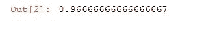

结果表明它表现得非常好！超过 96%的时间，我们的模型能够基于那些鸢尾花的测量结果，准确预测出它们的种类，即使是它之前从未见过的鸢尾花。所以这很酷！

但是，这是一个相当小的数据集，大约有 150 朵花，如果我没记错的话。因此，我们只使用 150 朵花的 60%进行训练，只使用 150 朵花的 40%进行测试。这些数字仍然相当小，所以我们仍然可能会过度拟合我们所做的特定训练/测试分割。因此，让我们使用 k-fold 交叉验证来防止这种情况发生。事实证明，使用 k-fold 交叉验证，即使它是一种更强大的技术，实际上比训练/测试更容易使用。所以，这很酷！那么，让我们看看它是如何工作的：

```py
# We give cross_val_score a model, the entire data set and its "real" values, and the number of folds: 
scores = cross_validation.cross_val_score(clf, iris.data, iris.target, cv=5) 

# Print the accuracy for each fold: 
print scores 

# And the mean accuracy of all 5 folds: 
print scores.mean() 

```

我们已经有了一个模型，即我们为这个预测定义的 SVC 模型，你所需要做的就是在`cross_validation`包上调用`cross_val_score()`。因此，您需要向这个函数传递一个给定类型的模型（`clf`），您拥有的所有测量数据集，也就是所有的特征数据（`iris.data`）和所有的目标数据（所有的物种），`iris.target`。

我想要 `cv=5`，这意味着它实际上会使用 5 个不同的训练数据集，同时保留 `1` 用于测试。基本上，它会运行 5 次，这就是我们需要做的全部。这将自动评估我们的模型针对整个数据集，分成五种不同的方式，并将结果返回给我们。

如果我们打印出来，它会给我们返回一个实际错误指标的列表，即每个迭代的错误指标，也就是每个折叠的错误指标。我们可以将这些平均起来，得到基于 k 折交叉验证的总体错误指标：

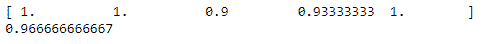

当我们在 5 个折叠上进行时，我们会发现我们的结果甚至比我们想象的要好！98%的准确率。这非常棒！事实上，在几次运行中我们都获得了完美的准确率。这真是令人惊讶的事情。

现在让我们看看是否可以做得更好。我们之前使用了线性核，如果我们使用多项式核并变得更加花哨会怎样呢？那会是过拟合还是实际上更好地拟合了我们的数据？这取决于这些花瓣测量和实际物种之间是否实际上存在线性关系或多项式关系。所以，让我们试一试：

```py
clf = svm.SVC(kernel='poly', C=1).fit(X_train, y_train)
scores = cross_validation.cross_val_score(clf, iris.data, iris.target, cv=5)
print scores
print scores.mean()

```

我们将再次运行所有这些，使用相同的技术。但这次，我们使用多项式核。我们将将其拟合到我们的训练数据集上，而在这种情况下，拟合到哪里并不重要，因为`cross_val_score()`会为您不断重新运行它：


事实证明，当我们使用多项式拟合时，最终得分甚至比我们原始运行的得分还要低。这告诉我们多项式核可能是过拟合的。当我们使用 k 折交叉验证时，它显示出的得分比线性核还要低。

这里的重要一点是，如果我们只使用了单一的训练/测试拆分，我们就不会意识到我们过拟合了。如果我们只是在这里进行了单一的训练/测试拆分，我们实际上会得到与线性核相同的结果。因此，我们可能会无意中过拟合我们的数据，并且甚至不知道我们没有使用 k 折交叉验证时。因此，这是 k 折交叉验证拯救的一个很好的例子，并警告您过拟合，而单一的训练/测试拆分可能无法发现。因此，请将其放入您的工具箱。

如果您想进一步尝试，可以尝试不同的次数。因此，您实际上可以指定不同的次数。多项式核的默认次数是 3 次，但您可以尝试不同的次数，可以尝试两次。

这样做会更好吗？如果你降到一次，基本上就会退化为线性核，对吧？所以，也许仍然存在多项式关系，也许只是二次多项式。试一试，看看你得到什么。这就是 k 折交叉验证。正如你所看到的，由于 scikit-learn 的便利性，它非常容易使用。这是衡量模型质量的重要方式。

# 数据清洗和归一化

现在，这是最简单的部分之一，但它可能是整本书中最重要的部分。我们将讨论清理输入数据，这将占用您大部分的时间。

您清理输入数据的程度以及了解原始输入数据将对您的结果质量产生巨大影响 - 甚至可能比您选择的模型或调整模型的效果更大。所以，请注意；这很重要！

清理原始输入数据通常是数据科学家工作中最重要且耗时的部分！

让我们谈谈数据科学的一个不便之真相，那就是你实际上大部分时间都在清理和准备数据，而相对较少的时间用于分析和尝试新的算法。这并不像人们经常说的那样光彩夺目。但是，这是一个非常重要的事情需要注意。

原始数据中可能会有很多不同的问题。送到你手上的原始数据会非常肮脏，以许多不同的方式被污染。如果你不处理它，它将会扭曲你的结果，并最终导致你的业务做出错误的决定。

如果最终发现你犯了一个错误，即摄入了大量错误数据却没有考虑清理它，然后基于这些结果告诉你的业务做一些后来被证明完全错误的事情，你将会陷入麻烦！所以，请注意！

有很多不同类型的问题和数据需要注意：

+   **异常值**：也许你的数据中有一些行为看起来有点奇怪，当你深入挖掘时，发现这些数据根本不应该被看到。一个很好的例子是，如果你在查看网络日志数据时，发现一个会话 ID 一次又一次地重复出现，并且以一个人类无法做到的速度进行某些操作。你可能看到的是一个机器人，一个在某处运行的脚本实际上在抓取你的网站。甚至可能是某种恶意攻击。但无论如何，你不希望这些行为数据影响你的模型，这些模型旨在预测真正使用你的网站的人类的行为。因此，观察异常值是一种识别在构建模型时可能需要剔除的数据类型的方法。

+   **缺失数据**：当数据不在那里时，你该怎么办？回到网络日志的例子，那一行可能有一个引荐者，也可能没有。如果没有怎么办？你是创建一个新的分类来表示缺失，还是完全丢弃那一行？你必须考虑在那里做什么才是正确的。

+   **恶意数据**：可能有人试图操纵你的系统，可能有人试图欺骗系统，你不希望这些人得逞。比如说你正在制作一个推荐系统。可能有人试图捏造行为数据以推广他们的新项目，对吧？因此，你需要警惕这种情况，并确保你能识别出操纵攻击或其他类型的攻击，过滤掉它们的结果，不让它们得逞。

+   **错误数据**：如果在某个系统中有软件错误，导致在某些情况下写入了错误的值，该怎么办？这种情况可能发生。不幸的是，你无法知道这一点。但是，如果你看到的数据看起来可疑，或者结果对你来说毫无意义，深入挖掘有时可以发现潜在的错误，导致错误数据首先被写入。也许在某个地方没有正确地组合事物。也许会话没有在整个会话期间保持。例如，人们可能在浏览网站时丢失他们的会话 ID，并获得新的会话 ID。

+   无关数据：这里有一个非常简单的例子。也许你只对来自纽约市的人的数据感兴趣，或者出于某种原因。在这种情况下，来自世界其他地方的人的所有数据对于你想要找出的内容都是无关的。你首先要做的就是抛弃所有这些数据，并限制你的数据，将其减少到你真正关心的数据。

+   不一致的数据：这是一个巨大的问题。例如，在地址中，人们可以用许多不同的方式写相同的地址：他们可能缩写街道，也可能不缩写街道，他们可能根本不在街道名称后面加上“街”。他们可能以不同的方式组合行，可能拼写不同的东西，可能在美国使用邮政编码或美国的邮政编码加 4 位，可能在上面有一个国家，也可能没有国家。你需要想办法弄清楚你看到的变化是什么，以及如何将它们全部规范化在一起。

+   也许我在研究有关电影的数据。一部电影在不同国家可能有不同的名称，或者一本书在不同国家可能有不同的名称，但它们意思相同。因此，你需要注意这些地方，需要对数据进行规范化处理，同样的数据可能以许多不同的方式表示，你需要将它们组合在一起以获得正确的结果。

+   格式化：这也可能是一个问题；事物可能格式不一致。以日期为例：在美国，我们总是按月、日、年（MM/DD/YY）的顺序，但在其他国家，他们可能按日、月、年（DD/MM/YY）的顺序，谁知道呢。你需要注意这些格式上的差异。也许电话号码的区号周围有括号，也许没有；也许数字的每个部分之间有破折号，也许没有；也许社会保障号码有破折号，也许没有。这些都是你需要注意的事情，你需要确保格式上的变化不会在处理过程中被视为不同的实体或不同的分类。

因此，有很多需要注意的事情，前面的列表只是需要注意的主要事项。记住：垃圾进，垃圾出。你的模型只有你给它的数据那么好，这是极其真实的！如果你给它大量干净的数据，甚至一个非常简单的模型也可以表现得非常好，而且实际上可能会胜过一个更复杂的模型在一个更脏的数据集上。

因此，确保你有足够的数据和高质量的数据通常是大部分工作。你会惊讶于现实世界中一些最成功的算法有多简单。它们之所以成功，仅仅是因为输入的数据质量和数量。你并不总是需要花哨的技术来获得好的结果。通常情况下，你的数据的质量和数量同其他任何因素一样重要。

始终质疑你的结果！你不希望在得到不喜欢的结果时才回头查看你的输入数据中的异常。这将在你的结果中引入一种无意识的偏见，你让你喜欢或期望的结果不经质疑地通过了，对吧？你需要一直质疑事物，以确保你一直留意这些事情，因为即使你找到了一个你喜欢的结果，如果结果是错误的，它仍然是错误的，它仍然会让你的公司朝错误的方向发展。这可能会在以后给你带来麻烦。

举个例子，我有一个名为 No-Hate News 的网站。这是一个非营利性网站，所以我并不是在告诉你它来赚钱。假设我只想找到我拥有的这个网站上最受欢迎的页面。这听起来是一个相当简单的问题，不是吗？我应该只需要浏览我的网络日志，计算每个页面的点击次数，并对它们进行排序，对吧？有多难呢？嗯，事实证明这真的很难！所以，让我们深入探讨这个例子，看看为什么它很困难，并看看一些必须进行的真实世界数据清理的例子。

# 清理网络日志数据

我们将展示清理数据的重要性。我有一些来自我拥有的小网站的网络日志数据。我们只是尝试找到该网站上最受欢迎的页面。听起来很简单，但正如您将看到的，实际上相当具有挑战性！所以，如果您想跟着做，`TopPages.ipynb`是我们在这里工作的笔记本。让我们开始吧！

我实际上有一个从我的实际网站中获取的访问日志。这是 Apache 的真实 HTTP 访问日志，包含在您的书籍材料中。所以，如果您想参与其中，请确保更新路径，将访问日志移动到您保存书籍材料的位置：

```py
logPath = "E:\\sundog-consult\\Packt\\DataScience\\access_log.txt" 

```

# 在网络日志上应用正则表达式

所以，我去网上找了下面的一小段代码，它可以将 Apache 访问日志行解析成一堆字段：

```py
format_pat= re.compile( 
    r"(?P<host>[\d\.]+)\s" 
    r"(?P<identity>\S*)\s" 
    r"(?P<user>\S*)\s" 
    r"\[(?P<time>.*?)\]\s" 
    r'"(?P<request>.*?)"\s' 
    r"(?P<status>\d+)\s" 
    r"(?P<bytes>\S*)\s" 
    r'"(?P<referer>.*?)"\s' 
    r'"(?P<user_agent>.*?)"\s*' 
) 

```

这段代码包含主机、用户、时间、实际页面请求、状态、引用者、`user_agent`（表示用于查看此页面的浏览器）。它构建了一个称为正则表达式的东西，我们使用`re`库来使用它。这基本上是一种在大字符串上进行模式匹配的非常强大的语言。因此，我们可以将这个正则表达式应用到我们访问日志的每一行上，并自动将访问日志行中的信息部分分组到这些不同的字段中。让我们继续运行这个。

在这里要做的明显的事情是，让我们编写一个小脚本，计算我们遇到的每个 URL 被请求的次数，并记录它被请求的次数。然后我们可以对列表进行排序，得到我们的热门页面，对吧？听起来足够简单！

因此，我们将构建一个名为`URLCounts`的小 Python 字典。我们将打开我们的日志文件，对于每一行，我们将应用我们的正则表达式。如果它实际上返回了成功匹配我们试图匹配的模式，我们会说，好的，这看起来像是我们访问日志中的一个不错的行。

让我们从中提取请求字段，也就是浏览器实际请求的实际 HTTP 请求的页面。我们将把它分成三个部分：它包括一个动作，比如 get 或 post；实际请求的 URL；以及使用的协议。在得到这些信息后，我们可以看看该 URL 是否已经存在于我的字典中。如果是，我将增加该 URL 已经被遇到的次数`1`；否则，我将为该 URL 引入一个新的字典条目，并将其初始化为值`1`。我对日志中的每一行都这样做，以数字逆序排序结果，并将其打印出来：

```py
URLCounts = {}
with open(logPath, "r") as f:
    for line in (l.rstrip() for l in f):
        match= format_pat.match(line)
        if match:
            access = match.groupdict()
            request = access['request']
            (action, URL, protocol) = request.split()
            if URLCounts.has_key(URL):
                URLCounts[URL] = URLCounts[URL] + 1
            else:
                URLCounts[URL] = 1
results = sorted(URLCounts, key=lambda i: int(URLCounts[i]), reverse=True)

for result in results[:20]:
    print result + ": " + str(URLCounts[result])

```

所以，让我们继续运行：

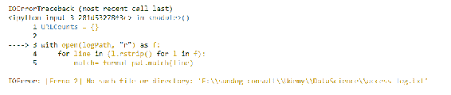

哎呀！我们遇到了一个大错误。它告诉我们，我们需要多于`1`个值来解包。所以显然，我们得到了一些不包含动作、URL 和协议的请求字段，而包含其他内容。

让我们看看那里发生了什么！所以，如果我们打印出所有不包含三个项目的请求，我们就会看到实际显示的内容。所以，我们要做的是一个类似的小代码片段，但我们要在请求字段上实际执行拆分，并打印出我们没有得到预期的三个字段的情况。

```py
URLCounts = {}

with open(logPath, "r") as f:
    for line in (l.rstrip() for l in f):
        match= format_pat.match(line)
        if match:
            access = match.groupdict()
            request = access['request']
            fields = request.split()
            if (len(fields) != 3):
                print fields

```

让我们看看实际上有什么：

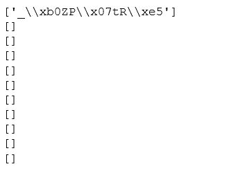

所以，我们有一堆空字段。这是我们的第一个问题。但是，然后我们有第一个字段是完全垃圾。谁知道那是从哪里来的，但显然是错误的数据。好吧，让我们修改我们的脚本。

# 修改一 - 过滤请求字段

我们实际上会丢弃任何没有预期的 3 个字段的行。这似乎是一个合理的做法，因为事实上这确实包含了完全无用的数据，这样做并不会让我们错过任何东西。所以，我们将修改我们的脚本来做到这一点。我们在实际尝试处理之前引入了一个`if (len(fields) == 3)`行。我们将运行它：

```py
URLCounts = {}

with open(logPath, "r") as f:
    for line in (l.rstrip() for l in f):
        match= format_pat.match(line)
        if match:
            access = match.groupdict()
            request = access['request']
            fields = request.split()
            if (len(fields) == 3):
                URL = fields[1]
                if URLCounts.has_key(URL):
                    URLCounts[URL] = URLCounts[URL] + 1
                else:
                    URLCounts[URL] = 1

results = sorted(URLCounts, key=lambda i: int(URLCounts[i]), reverse=True)

for result in results[:20]:
    print result + ": " + str(URLCounts[result])

```

嘿，我们得到了一个结果！

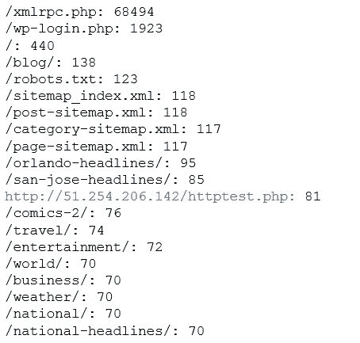

但这看起来并不像是我网站上的热门页面。记住，这是一个新闻网站。所以，我们得到了一堆 PHP 文件点击，那是 Perl 脚本。那是怎么回事？我们的最佳结果是这个`xmlrpc.php`脚本，然后是`WP_login.php`，然后是主页。所以，没有什么用。然后是`robots.txt`，然后是一堆 XML 文件。

你知道，当我后来调查这个问题时，结果发现我的网站实际上受到了恶意攻击；有人试图侵入。这个`xmlrpc.php`脚本是他们试图猜测我的密码的方式，他们试图使用登录脚本登录。幸运的是，在他们真正进入这个网站之前，我就把他们关掉了。

这是一个恶意数据被引入到我的数据流中，我必须过滤掉的例子。所以，通过观察，我们可以看到这次恶意攻击不仅查看了 PHP 文件，而且还试图执行一些东西。它不仅仅是一个 get 请求，它是对脚本的 post 请求，实际上试图在我的网站上执行代码。

# 修改二 - 过滤 post 请求

现在，我知道我关心的数据，你知道我试图弄清楚的事情的精神是，人们从我的网站获取网页。所以，我可以合理地做的一件事是，过滤掉这些日志中不是 get 请求的任何内容。所以，让我们接着做这个。我们将再次检查我们的请求字段中是否有三个字段，然后我们还将检查操作是否是 get。如果不是，我们将完全忽略该行：

```py
URLCounts = {}

with open(logPath, "r") as f:
    for line in (l.rstrip() for l in f):
        match= format_pat.match(line)
        if match:
            access = match.groupdict()
            request = access['request']
            fields = request.split()
            if (len(fields) == 3):
                (action, URL, protocol) = fields
                if (action == 'GET'):
                    if URLCounts.has_key(URL):
                        URLCounts[URL] = URLCounts[URL] + 1
                    else:
                        URLCounts[URL] = 1

results = sorted(URLCounts, key=lambda i: int(URLCounts[i]), reverse=True)

for result in results[:20]:
    print result + ": " + str(URLCounts[result])

```

现在我们应该更接近我们想要的东西了，以下是前面代码的输出：

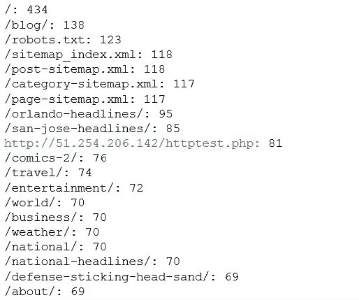

是的，这开始看起来更合理了。但是，它仍然没有真正通过合理性检查。这是一个新闻网站；人们去那里是为了阅读新闻。他们真的在看我那个只有几篇文章的小博客吗？我不这么认为！这似乎有点可疑。所以，让我们深入一点，看看到底是谁在看那些博客页面。如果你真的去查看那个文件并手动检查，你会发现很多这些博客请求实际上根本没有任何用户代理。它们只有一个用户代理是`-`，这是非常不寻常的：

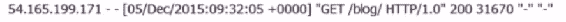

如果一个真正的人类和一个真正的浏览器试图获取这个页面，它会显示类似 Mozilla、Internet Explorer、Chrome 或其他类似的东西。所以，看起来这些请求来自某种刮取器。同样，可能是一种恶意流量，没有标识出是谁。

# 修改三 - 检查用户代理

也许，我们应该也看看用户代理，看看这些是不是真正的人在发出请求。让我们继续打印出我们遇到的所有不同的用户代理。所以，按照实际总结我们看到的不同 URL 的代码精神，我们可以查看我们看到的所有不同用户代理，并按照日志中最流行的`user_agent`字符串对它们进行排序：

```py
UserAgents = {}

with open(logPath, "r") as f:
    for line in (l.rstrip() for l in f):
        match= format_pat.match(line)
        if match:
            access = match.groupdict()
            agent = access['user_agent']
            if UserAgents.has_key(agent):
                UserAgents[agent] = UserAgents[agent] + 1
            else:
                UserAgents[agent] = 1

results = sorted(UserAgents, key=lambda i: int(UserAgents[i]), reverse=True)

for result in results:
    print result + ": " + str(UserAgents[result])

```

我们得到以下结果：

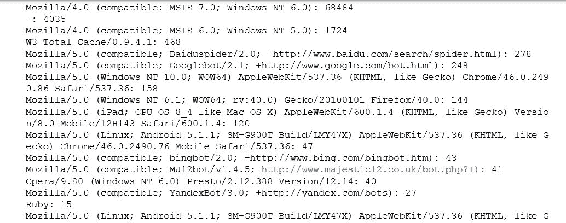

你可以看到大部分看起来都是合法的。所以，如果是一个刮取器，而在这种情况下实际上是一次恶意攻击，但他们实际上是在假装成一个合法的浏览器。但这个破折号`user_agent`也经常出现。所以，我不知道那是什么，但我知道那不是一个真正的浏览器。

我看到的另一件事是有很多来自蜘蛛、网络爬虫的流量。所以，有百度，这是中国的搜索引擎，有 Googlebot 在爬网页。我想我也在那里看到了 Yandex，一个俄罗斯的搜索引擎。所以，我们的数据被很多只是为了挖掘我们网站的搜索引擎目的而爬行的爬虫所污染。再次强调，这些流量不应计入我分析的预期目的，即查看实际人类在我的网站上查看的页面。这些都是自动脚本。

# 过滤蜘蛛/机器人的活动

好了，这变得有点棘手。仅仅根据用户字符串来识别蜘蛛或机器人没有真正好的方法。但我们至少可以试一试，过滤掉任何包含“bot”这个词的东西，或者来自我的缓存插件的可能提前请求页面的东西。我们还将去除我们的朋友单破折号。所以，我们将再次完善我们的脚本，除了其他一切，还要去除任何看起来可疑的 UserAgents：

```py
URLCounts = {}

with open(logPath, "r") as f:
    for line in (l.rstrip() for l in f):
        match= format_pat.match(line)
        if match:
            access = match.groupdict()
            agent = access['user_agent']
            if (not('bot' in agent or 'spider' in agent or 
                    'Bot' in agent or 'Spider' in agent or
                    'W3 Total Cache' in agent or agent =='-')):
                request = access['request']
                fields = request.split()
                if (len(fields) == 3):
                    (action, URL, protocol) = fields
                    if (action == 'GET'):
                        if URLCounts.has_key(URL):
                            URLCounts[URL] = URLCounts[URL] + 1
                        else:
                            URLCounts[URL] = 1

results = sorted(URLCounts, key=lambda i: int(URLCounts[i]), reverse=True)

for result in results[:20]:
    print result + ": " + str(URLCounts[result])

```

```py
URLCounts = {}

with open(logPath, "r") as f:
    for line in (l.rstrip() for l in f):
        match= format_pat.match(line)
        if match:
            access = match.groupdict()
            agent = access['user_agent']
            if (not('bot' in agent or 'spider' in agent or 
                    'Bot' in agent or 'Spider' in agent or
                    'W3 Total Cache' in agent or agent =='-')):
                request = access['request']
                fields = request.split()
                if (len(fields) == 3):
                    (action, URL, protocol) = fields
                    if (URL.endswith("/")):
                        if (action == 'GET'):
                            if URLCounts.has_key(URL):
                                URLCounts[URL] = URLCounts[URL] + 1
                            else:
                                URLCounts[URL] = 1

results = sorted(URLCounts, key=lambda i: int(URLCounts[i]), reverse=True)

for result in results[:20]:
    print result + ": " + str(URLCounts[result])

```

我们得到了什么？

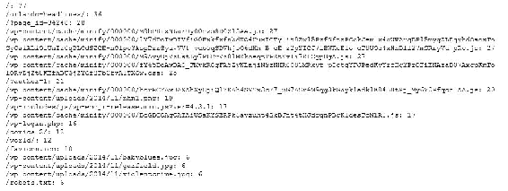

好了，我们开始了！前两个条目看起来更合理了，主页最受欢迎，这是预料之中的。奥兰多头条也很受欢迎，因为我比其他人更多地使用这个网站，而且我住在奥兰多。但之后，我们得到了一堆根本不是网页的东西：一堆脚本，一堆 CSS 文件。这些都不是网页。

# 修改四 - 应用特定于网站的过滤器

我只需应用一些关于我的网站的知识，我碰巧知道我的网站上所有合法的页面都以它们的 URL 结尾斜杠。所以，让我们继续修改一下，去掉任何不以斜杠结尾的东西：

```py
URLCounts = {}

with open (logPath, "r") as f:
    for line in (l.rstrip() for 1 in f):
        match= format_pat.match(line)
        if match:
            access = match.groupdict()
            agent = access['user_agent']
            if (not('bot' in agent or 'spider' in agent or
                    'Bot' in agent or 'Spider' in agent or
                    'W3 Total Cache' in agent or agent =='-')):
                request = access['request']
                fields = request.split()
                if (len(fields) == 3):
                    (action, URL, protocol) = fields
                    if (URL.endswith("/")):
                        if (action == 'GET'):
                            if URLCounts.has_key(URL):
                                URLCounts[URL] = URLCounts[URL] + 1
                            else:
                                URLCounts[URL] = 1

results = sorted(URLCounts, key=lambda i: int(URLCounts[i]), reverse=True)

for result in results[:20]:
    print result + ": " + str(URLCounts[result])

```

让我们运行一下！

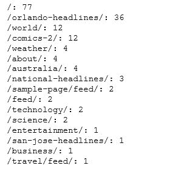

最后，我们得到了一些看起来合理的结果！看起来，从我小小的 No-Hate News 网站上实际人类请求的顶级页面是主页，然后是`orlando-headlines`，然后是世界新闻，然后是漫画，然后是天气，然后是关于页面。所以，这开始看起来更合理了。

如果你再深入一点，你会发现这个分析还存在问题。例如，那些 feed 页面仍然来自只是想从我的网站获取 RSS 数据的机器人。所以，这是一个很好的寓言，说明一个看似简单的分析需要大量的预处理和清理源数据，才能得到任何有意义的结果。

再次确保你在清理数据时所做的事情是有原则的，而不是只是挑选与你先入为主观念不符的问题。所以，始终质疑你的结果，始终查看你的源数据，并寻找其中的奇怪之处。

# 网络日志数据的活动

好了，如果你想再深入研究一下，你可以解决那个 feed 问题。继续去除包括 feed 的东西，因为我们知道那不是一个真正的网页，只是为了熟悉代码。或者，更仔细地查看日志，了解那些 feed 页面实际来自哪里。

也许有一种更好、更健壮的方法来识别那些流量作为一个更大的类别。所以，随意尝试一下。但我希望你已经学到了教训：数据清理 - 非常重要，而且会花费你大量的时间！

所以，令人惊讶的是，要在一个简单的问题上获得一些合理的结果，比如“我的网站上哪些页面被浏览次数最多？”竟然是多么困难。你可以想象，如果为了解决这样一个简单的问题需要做这么多工作，那么想想脏数据可能会如何影响更复杂问题和复杂算法的结果。

非常重要的是要了解你的数据源，查看它，查看它的代表样本，确保你了解数据输入系统。始终质疑你的结果，并将其与原始数据源联系起来，看看可疑的结果是从哪里来的。

# 数值数据的标准化

这是一个非常快速的部分：我只是想提醒你关于标准化数据的重要性，确保你的各种输入特征数据在同一尺度上，并且是可比较的。有时很重要，有时不重要。但是，你必须意识到什么时候重要。只要记住这一点，因为有时如果你不这样做，它会影响你的结果的质量。

有时候模型将基于几个不同的数值属性。如果你记得多变量模型，我们可能有不同的汽车属性，它们可能不是直接可比较的测量。或者，例如，如果我们正在研究年龄和收入之间的关系，年龄可能从 0 到 100 不等，但以美元计的收入可能从 0 到数十亿不等，根据货币的不同，范围可能更大！有些模型可以接受这种情况。

如果你在做回归，通常这不是什么大问题。但是，其他模型在这些值被缩放到一个公共尺度之前表现得不那么好。如果你不小心，你可能会发现一些属性比其他属性更重要。也许收入最终会比年龄更重要，如果你试图将这两个值作为模型中可比较的值来处理的话。

这也可能导致属性的偏差，这也可能是一个问题。也许你的数据集中的一组数据是倾斜的，你知道，有时你需要对事物进行标准化，而不仅仅是将其标准化到 0 到最大值的范围。没有固定的规则来决定何时应该做这种标准化。我只能说的是，无论你使用什么技术，都要始终阅读文档。

例如，在 scikit-learn 中，他们的 PCA 实现有一个`whiten`选项，它会自动为你标准化你的数据。你应该使用它。它还有一些预处理模块可用，可以自动为你标准化和缩放事物。

还要注意文本数据实际上应该以数字或顺序方式表示。如果你有`yes`或`no`的数据，你可能需要将其转换为`1`或`0`，并以一致的方式进行转换。所以再次，只需阅读文档。大多数技术在使用原始、未标准化的数据时都能很好地工作，但在第一次使用新技术之前，只需阅读文档，了解输入是否应该首先进行缩放、标准化或白化。如果是这样，scikit-learn 可能会让你很容易地做到，你只需要记得这样做！在完成后不要忘记重新缩放你的结果，如果你正在缩放输入数据的话。

如果你想要解释你得到的结果，有时你需要在完成后将它们重新缩放到原始范围。如果你在输入模型之前缩放事物，甚至可能使它们倾向于某个特定数量，确保在向某人呈现这些结果之前，你将它们重新缩放和去偏。否则它们就毫无意义了！还有一个小提醒，一个寓言，你应该始终检查是否应该在将数据传递到给定模型之前对其进行标准化或白化。

本节与运动无关；这只是我想让你记住的事情。我只是想强调一下。有些算法需要白化或标准化，有些则不需要。所以，请务必阅读文档！如果您确实需要对输入算法的数据进行标准化，它通常会告诉您如何做，而且会使这一过程变得非常容易。请注意这一点！

# 检测异常值

真实世界数据的一个常见问题是异常值。您总会有一些奇怪的用户，或者一些奇怪的代理，它们会污染您的数据，表现出与典型用户不同的异常和非典型行为。它们可能是合法的异常值；它们可能是由真实人员而不是某种恶意流量或虚假数据引起的。因此，有时候适当地将它们移除，有时候则不适当。确保您负责任地做出这个决定。因此，让我们深入一些处理异常值的示例。

例如，如果我正在进行协同过滤，并且试图进行电影推荐之类的事情，您可能会有一些超级用户，他们观看了每部电影，并对每部电影进行了评分。他们可能对每个人的推荐产生了不成比例的影响。

您真的不希望少数人在您的系统中拥有如此大的权力。因此，这可能是一个例子，您可以合理地过滤掉异常值，并通过他们实际放入系统的评分数量来识别它们。或者，异常值可能是那些没有足够评分的人。

我们可能正在查看网络日志数据，就像我们在之前的示例中看到的那样，当我们进行数据清理时，异常值可能会告诉您，从一开始您的数据就存在很大问题。这可能是恶意流量，可能是机器人，或者其他应该被丢弃的代理，它们并不代表您试图建模的实际人类。

如果有人真的想知道美国的平均收入（而不是中位数），您不应该仅仅因为您不喜欢他而丢弃唐纳德·特朗普。事实是，即使他的数十亿美元并没有改变中位数，但它们会推高平均数。因此，不要通过丢弃异常值来篡改您的数据。但如果它与您首先尝试建模的内容不一致，那么就丢弃异常值。

现在，我们如何识别异常值？嗯，还记得我们的老朋友标准差吗？我们在这本书的早期就讨论过这个问题。这是一个非常有用的工具，用于检测异常值。您可以以一种非常有原则的方式计算应该具有更或多或少正态分布的数据集的标准差。如果您看到一个数据点超出了一个或两个标准差，那么您就有一个异常值。

记住，我们之前也谈到了箱线图和须状图，它们也有一种内置的方法来检测和可视化异常值。这些图表将异常值定义为位于 1.5 倍四分位距之外的值。

您选择什么倍数？嗯，您必须运用常识，您知道，没有硬性规定什么是异常值。您必须查看您的数据，用眼睛观察，查看分布，查看直方图。看看是否有明显的异常值，并在丢弃它们之前了解它们是什么。

# 处理异常值

因此，让我们看一些示例代码，看看您如何在实践中处理异常值。让我们玩弄一些异常值。这是一个非常简单的部分。实际上是一点点复习。如果您想跟着做，我们在`Outliers.ipynb`中。所以，如果您愿意，请打开它：

```py
import numpy as np

incomes = np.random.normal(27000, 15000, 10000)
incomes = np.append(incomes, [1000000000])

import matplotlib.pyplot as plt
plt.hist(incomes, 50)
plt.show()

```

我们在书的早期做过非常类似的事情，那里我们创建了美国收入分布的假直方图。我们要做的是从这里开始，用一个年收入平均为 27000 美元，标准偏差为 15000 美元的正态分布收入。我将创建 10000 个在该分布中有收入的假美国人。顺便说一句，这完全是虚构的数据，尽管它与现实并不那么遥远。

然后，我要插入一个异常值 - 叫它唐纳德·特朗普，他有十亿美元。我们将把这个家伙插入到我们数据集的末尾。所以，我们有一个围绕着 27000 美元的正态分布数据集，然后我们要在最后插入唐纳德·特朗普。

我们将继续将其绘制为直方图：

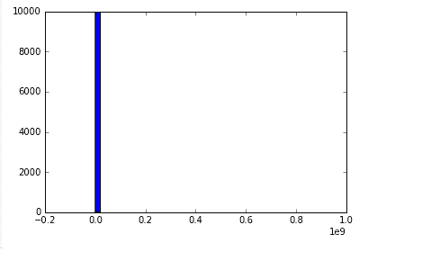

哇！这并不是很有帮助！我们把全国其他人的整个正态分布挤进了直方图的一个桶里。另一方面，我们把唐纳德·特朗普放在右边，以十亿美元搞乱了整个事情。

另一个问题是，如果我试图回答典型美国人赚多少钱这个问题。如果我用平均值来尝试弄清楚这个问题，那将不会是一个很好的、有用的数字：

```py
incomes.mean ()

```

前面代码的输出如下：

```py
126892.66469341301

```

唐纳德·特朗普独自把这个数字推高到了 126000 美元，而我知道，不包括唐纳德·特朗普的正态分布数据的真实均值只有 27000 美元。所以，在这种情况下，正确的做法是使用中位数而不是平均值。

但是，假设我们不得不出于某种原因使用平均值，正确的处理方式是排除像唐纳德·特朗普这样的异常值。所以，我们需要弄清楚如何识别这些人。嗯，你可以随意选择一个截断点，然后说，“我要抛弃所有亿万富翁”，但这不是一个很有原则的做法。10 亿是从哪里来的？

这只是我们如何计算数字的一些意外。所以，更好的做法是实际测量数据集的标准偏差，并将异常值定义为距离平均值的某个标准偏差的倍数。

接下来是我写的一个小函数，它就是`reject_outliers()`：

```py
def reject_outliers(data): 
    u = np.median(data) 
    s = np.std(data) 
    filtered = [e for e in data if (u - 2 * s < e < u + 2 * s)] 
    return filtered 

filtered = reject_outliers(incomes) 

plt.hist(filtered, 50) 
plt.show() 

```

它接收一个数据列表并找到中位数。它还找到该数据集的标准偏差。所以，我对此进行了过滤，只保留了在我的数据中距离中位数两个标准偏差之内的数据点。所以，我可以在我的收入数据上使用这个方便的`reject_outliers()`函数，自动剔除奇怪的异常值：

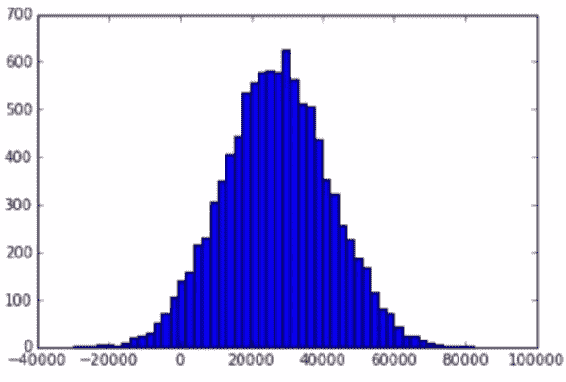

果然，它奏效了！现在我得到了一个更漂亮的图表，排除了唐纳德·特朗普，聚焦于中心的更典型的数据集。所以，非常酷！

所以，这是一个识别异常值并自动删除它们或以任何你认为合适的方式处理它们的例子。记住，一定要以原则的方式做这件事。不要只是因为它们不方便就抛弃异常值。要理解它们来自何处，以及它们实际上如何影响你试图在精神上衡量的事物。

顺便说一句，现在我们的平均值也更有意义了；现在我们已经摆脱了那个异常值，它更接近应该是的 27000。

# 异常值的活动

所以，如果你想玩玩这个，你知道，就像我通常要求你做的那样，试着用标准偏差的不同倍数，试着添加更多的异常值，试着添加不那么像唐纳德·特朗普那样的异常值。你知道，只是编造一些额外的假数据，然后玩弄一下，看看你是否能成功地识别出这些人。

就是这样！异常值；非常简单的概念。所以，这是一个通过查看标准偏差来识别异常值的示例，只需查看与平均值或中位数相差的标准偏差的数量。实际上，中位数可能是一个更好的选择，因为异常值可能会使平均值产生偏差，对吧？因此，使用标准偏差是一种比仅仅选择一些任意截断更有原则的识别异常值的方法。再次强调，您需要决定如何处理这些异常值。您实际上想要衡量什么？是否适合实际丢弃它们？所以，请记住这一点！

# 总结

在本章中，我们谈到了在偏差和方差之间取得平衡以及最小化误差的重要性。接下来，我们了解了 k 折交叉验证的概念以及如何在 Python 中实现它以防止过拟合。我们学到了在处理数据之前清洁数据和对数据进行归一化的重要性。然后我们看到了一个示例，用于确定网站的热门页面。在第九章中，《Apache Spark - 大数据上的机器学习》，我们将学习如何使用 Apache Spark 进行大数据上的机器学习。
