# 第九章：Apache Spark - 大数据上的机器学习

到目前为止，在这本书中，我们已经讨论了许多通用的数据挖掘和机器学习技术，你可以在数据科学职业中使用，但它们都在你的桌面上运行。因此，你只能使用诸如 Python 和 scikit-learn 等技术来处理单台机器可以处理的数据量。

现在，每个人都在谈论大数据，很可能你正在为一家实际上有大数据需要处理的公司工作。大数据意味着你实际上无法控制所有数据，你无法在一个系统上处理所有数据。你需要使用整个云、一组计算资源的集群来计算它。这就是 Apache Spark 的用武之地。Apache Spark 是一个非常强大的工具，用于管理大数据，并在大规模数据集上进行机器学习。到本章结束时，你将对以下主题有深入的了解：

+   安装和使用 Spark

+   **弹性分布式数据集**（**RDDs**）

+   **MLlib**（**机器学习库**）

+   Spark 中的决策树

+   Spark 中的 K 均值聚类

# 安装 Spark

在这一部分，我将帮助你使用 Apache Spark，并向你展示一些实际使用 Apache Spark 解决与本书中过去在单台计算机上解决的相同问题的示例。我们需要做的第一件事是在你的计算机上设置 Spark。因此，我们将在接下来的几节中为你介绍如何做到这一点。这是相当简单的事情，但有一些需要特别注意的地方。所以，不要只是跳过这些部分；有一些东西你需要特别注意，才能成功地运行 Spark，尤其是在 Windows 系统上。让我们在你的系统上设置 Apache Spark，这样你就可以真正地投入其中并开始尝试一些东西。

我们现在将在你自己的桌面上运行这个。但是，我们在本章中要编写的相同程序可以在实际的 Hadoop 集群上运行。因此，你可以将我们正在编写并在 Spark 独立模式下在你的桌面上运行的这些脚本，实际上从实际的 Hadoop 集群的主节点上运行它们，然后让它扩展到整个 Hadoop 集群的强大处理大规模数据集的能力。即使我们要在你自己的计算机上本地运行这些东西，也要记住这些相同的概念也可以扩展到在集群上运行。

# 在 Windows 上安装 Spark

在 Windows 上安装 Spark 涉及几个步骤，我们将在这里为你逐步介绍。我假设你在 Windows 上，因为大多数人在家里使用这本书。我们稍后会谈一下如何处理其他操作系统。如果你已经熟悉在计算机上安装东西和处理环境变量，那么你可以使用以下简短的提示表并开始操作。如果你对 Windows 内部不太熟悉，我将在接下来的几节中逐步为你介绍。以下是那些 Windows 专家的快速步骤：

1.  **安装 JDK**：你需要首先安装 JDK，即 Java 开发工具包。如果需要，你可以直接去 Sun 的网站下载并安装。我们需要 JDK，因为即使在这门课程中我们将使用 Python 进行开发，但在底层，它会被转换为 Scala 代码，而 Spark 就是用 Scala 原生开发的。而 Scala 又是在 Java 解释器之上运行的。因此，为了运行 Python 代码，你需要一个 Scala 系统，这将作为 Spark 的一部分默认安装。此外，我们需要 Java，或者更具体地说，需要 Java 的解释器来实际运行那些 Scala 代码。就像是一个技术层的蛋糕。

1.  **安装 Python**：显然，你需要 Python，但如果你已经阅读到这本书的这一部分，你应该已经设置好了 Python 环境，希望是 Enthought Canopy。所以，我们可以跳过这一步。

1.  **安装 Hadoop 的预编译版本的 Spark**：幸运的是，Apache 网站提供了预编译版本的 Spark，可以直接运行，已经为最新的 Hadoop 版本进行了预编译。您不需要构建任何东西，只需将其下载到计算机上并放在正确的位置，大部分情况下就可以使用了。

1.  **创建 conf/log4j.properties 文件**：我们有一些配置要处理。我们想要做的一件事是调整警告级别，以便在运行作业时不会收到大量警告信息。我们将介绍如何做到这一点。基本上，您需要重命名一个属性文件，然后在其中调整错误设置。

1.  **添加 SPARK_HOME 环境变量**：接下来，我们需要设置一些环境变量，以确保您可以从任何路径运行 Spark。我们将添加一个指向安装 Spark 的 SPARK_HOME 环境变量，然后将`%SPARK_HOME%\bin`添加到系统路径中，这样当您运行 Spark Submit、PySpark 或其他 Spark 命令时，Windows 就知道在哪里找到它。

1.  **设置 HADOOP_HOME 变量**：在 Windows 上，我们还需要做一件事，那就是设置`HADOOP_HOME`变量，因为即使在独立系统上不使用 Hadoop，它也会期望找到 Hadoop 的一小部分。

1.  **安装 winutils.exe**：最后，我们需要安装一个名为`winutils.exe`的文件。本书的资源中有`winutils.exe`的链接，您可以从那里获取。

如果您想更详细地了解步骤，可以参考接下来的部分。

# 在其他操作系统上安装 Spark

关于在其他操作系统上安装 Spark 的快速说明：基本上，这些步骤也适用于它们。主要区别在于如何在系统上设置环境变量，以便在您登录时自动应用。这将因操作系统而异。macOS 的做法与各种 Linux 的做法不同，因此您至少需要稍微熟悉使用 Unix 终端命令提示符，以及如何操纵您的环境来做到这一点。但是，大多数已经掌握这些基本原理的 macOS 或 Linux 用户都不需要`winutils.exe`。因此，这些是在不同操作系统上安装的主要区别。

# 安装 Java 开发工具包

要安装 Java 开发工具包，返回浏览器，打开一个新标签页，然后搜索`jdk`（Java 开发工具包的简称）。这将带您到 Oracle 网站，从那里您可以下载 Java。

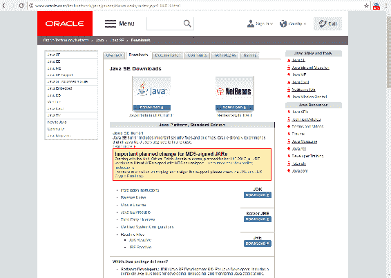

在 Oracle 网站上，点击 JDK DOWNLOAD。现在，点击 Accept License Agreement，然后您可以选择适用于您操作系统的下载选项：

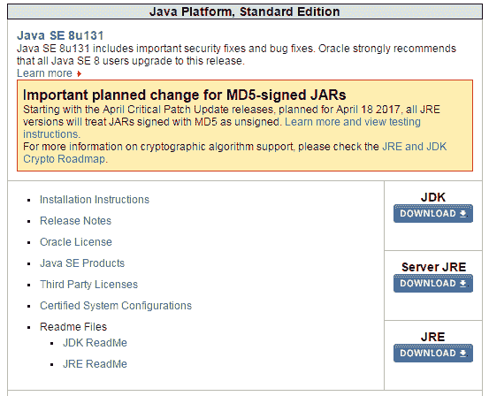

对我来说，这将是 Windows 64 位，等待 198MB 的好东西下载：

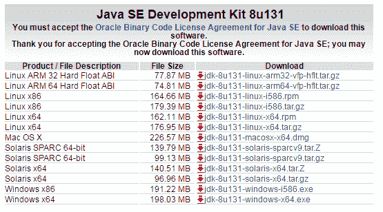

下载完成后，找到安装程序并运行它。请注意，我们不能在 Windows 安装程序中接受默认设置。因此，这是一个特定于 Windows 的解决方法，但在撰写本书时，当前版本的 Spark 是 2.1.1，结果表明 Spark 2.1.1 在 Windows 上与 Java 存在问题。问题在于，如果您将 Java 安装到带有空格的路径中，它将无法工作，因此我们需要确保 Java 安装到没有空格的路径中。这意味着即使您已经安装了 Java，也不能跳过此步骤，所以让我向您展示如何做到这一点。在安装程序上，点击下一步，您将看到如下屏幕，它默认要安装到`C:\Program Files\Java\jdk`路径，无论版本是什么：

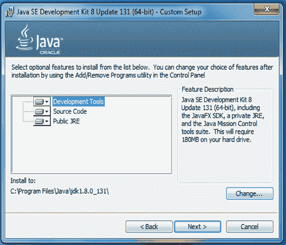

`Program Files`路径中的空格会引起麻烦，因此让我们单击“更改...”按钮并安装到`c:\jdk`，一个简单的路径，易于记忆，并且其中没有空格：

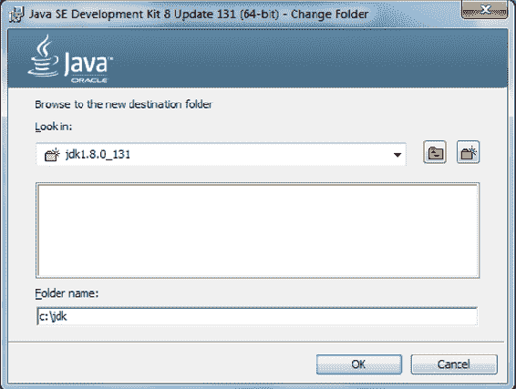

现在，它还希望安装 Java 运行时环境，因此为了安全起见，我也将其安装到没有空格的路径。

在 JDK 安装的第二步，我们应该在屏幕上看到这个：

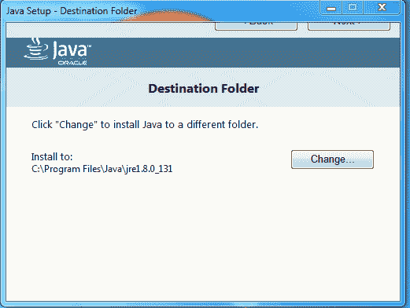

我也将更改目标文件夹，并为其创建一个名为`C:\jre`的新文件夹：

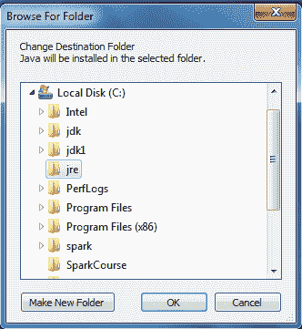

好了，安装成功。哇呼！

现在，您需要记住我们安装 JDK 的路径，我们的情况下是`C:\jdk`。我们还有一些步骤要走。接下来，我们需要安装 Spark 本身。

# 安装 Spark

让我们回到一个新的浏览器选项卡，转到[spark.apache.org](http://spark.apache.org)，并单击“下载 Spark”按钮：

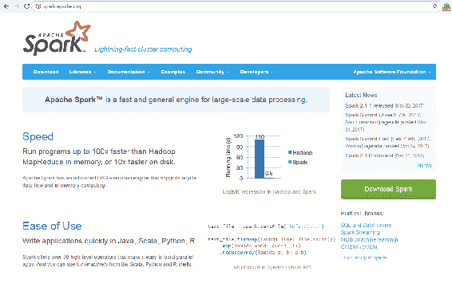

现在，我们在本书中使用的是 Spark 2.1.1，但超过 2.0 的任何版本都应该可以正常工作。

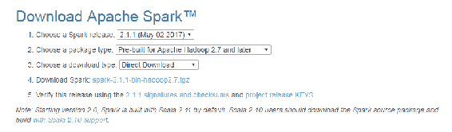

确保您获得了预构建版本，并选择直接下载选项，因此所有这些默认设置都非常好。继续并单击第 4 条指示旁边的链接以下载该软件包。

现在，它下载了一个**TGZ**（**Tar in GZip**）文件，您可能不熟悉。坦率地说，Windows 实际上对 Spark 来说有点事后诸葛亮，因为在 Windows 上，您将没有内置的实用程序来实际解压缩 TGZ 文件。这意味着您可能需要安装一个，如果您还没有的话。我使用的是 WinRAR，您可以从[www.rarlab.com](http://www.rarlab.com)获取。如果需要，转到下载页面，并下载 WinRAR 32 位或 64 位的安装程序，具体取决于您的操作系统。像平常一样安装 WinRAR，这将允许您在 Windows 上实际解压缩 TGZ 文件：

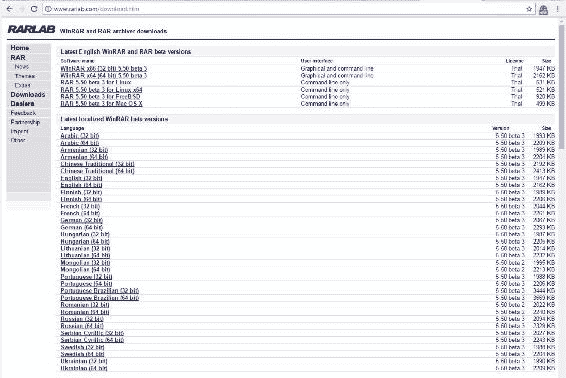

所以，让我们继续解压缩 TGZ 文件。我将打开我的“下载”文件夹，找到我们下载的 Spark 存档，然后右键单击该存档，并将其提取到我选择的文件夹中-我现在只是将其放在我的“下载”文件夹中。同样，此时 WinRAR 正在为我执行此操作：

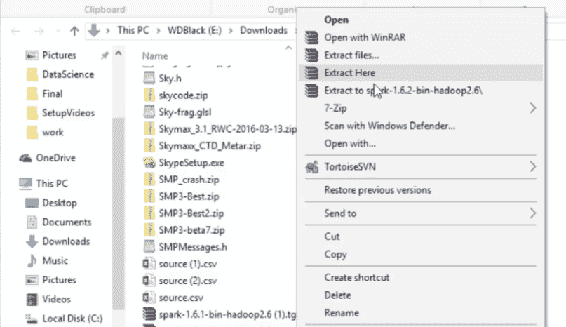

所以，我现在应该在我的“下载”文件夹中有一个与该软件包相关联的文件夹。让我们打开它，里面就是 Spark 本身。您应该看到类似下面显示的文件夹内容。因此，您需要将其安装在您可以记住的某个地方：

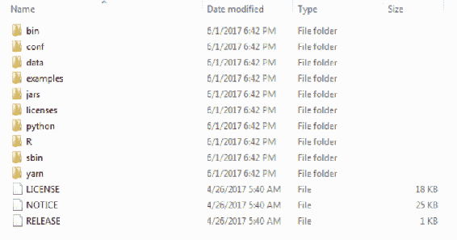

显然，您不希望将其留在“下载”文件夹中，所以让我们打开一个新的文件资源管理器窗口。我转到我的 C 驱动器并创建一个新文件夹，让我们称之为`spark`。所以，我的 Spark 安装将位于`C:\spark`中。再次，很容易记住。打开该文件夹。现在，我回到下载的`spark`文件夹，并使用*Ctrl* + *A*选择 Spark 分发中的所有内容，*Ctrl* + *C*将其复制，然后返回到`C:\spark`，*Ctrl* + *V*将其粘贴进去：

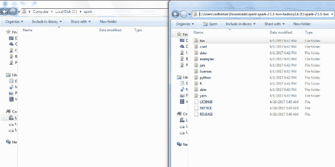

非常重要的是要记住粘贴`spark`文件夹的内容，而不是`spark`文件夹本身。因此，我现在应该有一个包含 Spark 分发中所有文件和文件夹的`C`驱动器中的`spark`文件夹。

好吧，还有一些东西我们需要配置。所以，当我们在`C:\spark`中时，让我们打开`conf`文件夹，为了确保我们不会被日志消息淹没，我们将在这里更改日志级别设置。因此，右键单击`log4j.properties.template`文件，然后选择重命名：

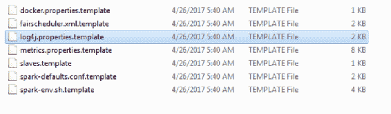

删除文件名中的`.template`部分，使其成为一个真正的`log4j.properties`文件。Spark 将使用这个文件来配置它的日志记录：

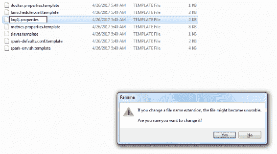

现在，用某种文本编辑器打开这个文件。在 Windows 上，你可能需要右键单击，然后选择“打开方式”，然后选择“WordPad”。在文件中，找到`log4j.rootCategory=INFO`：

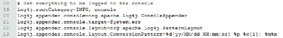

让我们把这个改成`log4j.rootCategory=ERROR`，这样就可以消除运行时打印出的所有日志垃圾。保存文件，然后退出编辑器。

到目前为止，我们安装了 Python、Java 和 Spark。现在我们需要做的下一件事是安装一些东西，让你的电脑认为 Hadoop 是存在的，这一步在 Windows 上是必要的。所以，如果你在 Mac 或 Linux 上，可以跳过这一步。

我有一个小文件可以解决问题。让我们去[`media.sundog-soft.com/winutils.exe`](http://media.sundog-soft.com/winutils.exe)。下载`winutils.exe`将给你一个可执行文件的一小部分副本，可以用来欺骗 Spark，让它认为你实际上安装了 Hadoop：


现在，因为我们将在我们的桌面上本地运行我们的脚本，这并不是什么大不了的事，我们不需要真正安装 Hadoop。这只是绕过在 Windows 上运行 Spark 的另一个怪癖。所以，现在我们有了这个，让我们在“下载”文件夹中找到它，*Ctrl* + *C*复制它，然后让我们去我们的`C`驱动器，为它创建一个位置。

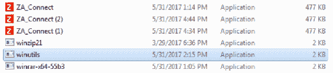

所以，在`C`驱动器的根目录中再次创建一个新文件夹，我们将称之为`winutils`：

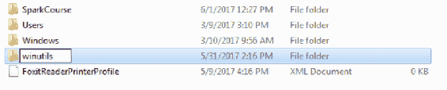

现在让我们打开这个`winutils`文件夹，并在其中创建一个`bin`文件夹：

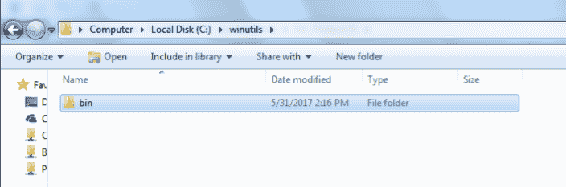

现在在这个`bin`文件夹中，我希望你把我们下载的`winutils.exe`文件粘贴进去。所以你应该有`C:\winutils\bin`，然后`winutils.exe`：

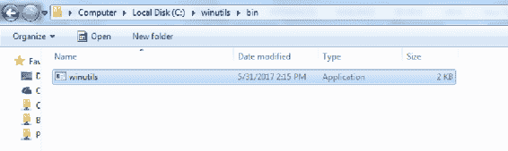

这个下一步只在一些系统上需要，但为了安全起见，在 Windows 上打开命令提示符。你可以通过转到开始菜单，然后转到 Windows 系统，然后点击命令提示符来做到这一点。在这里，我希望你输入`cd c:\winutils\bin`，这是我们放置`winutils.exe`文件的地方。现在如果你输入`dir`，你应该会看到那个文件。现在输入`winutils.exe chmod 777 \tmp\hive`。这只是确保你需要成功运行 Spark 的所有文件权限都已经放置好，没有任何错误。现在你可以关闭命令提示符了，因为你已经完成了这一步。哇，我们几乎完成了，信不信由你。

现在我们需要设置一些环境变量才能让事情正常运行。我将向你展示如何在 Windows 上做到这一点。在 Windows 10 上，你需要打开开始菜单，然后转到 Windows 系统 | 控制面板来打开控制面板：

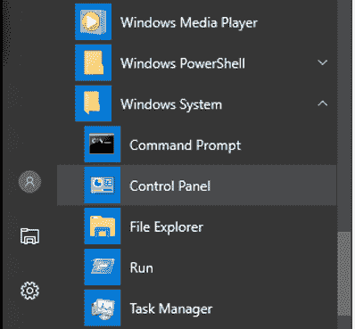

在控制面板中，点击系统和安全：

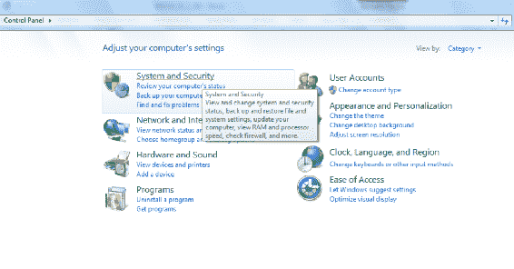

然后，点击系统：

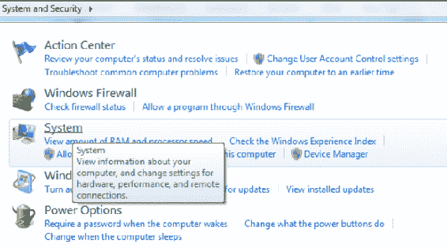

然后从左侧的列表中点击高级系统设置：

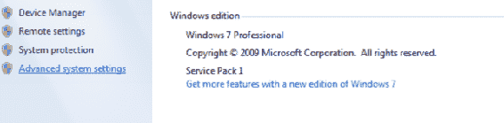

从这里，点击环境变量...：

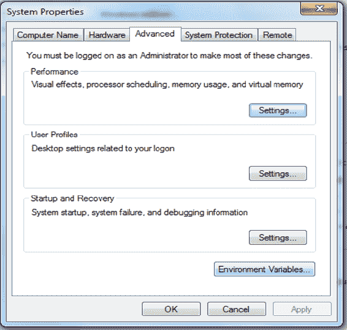

我们将得到这些选项：

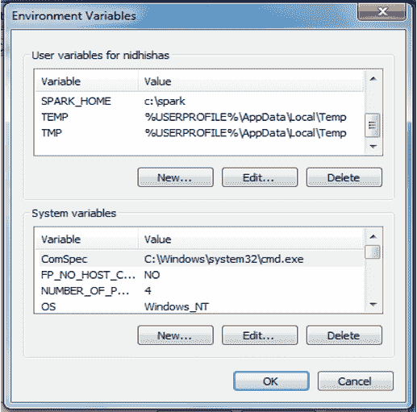

现在，这是一个非常特定于 Windows 的设置环境变量的方法。 在其他操作系统上，您将使用不同的进程，因此您需要查看如何在它们上安装 Spark。 在这里，我们将设置一些新的用户变量。 单击第一个 New...按钮以创建一个新的用户变量，并将其命名为`SPARK_HOME`，如下所示，全部大写。 这将指向我们安装 Spark 的位置，对我们来说是`c:\spark`，因此在变量值中键入它，然后单击确定：

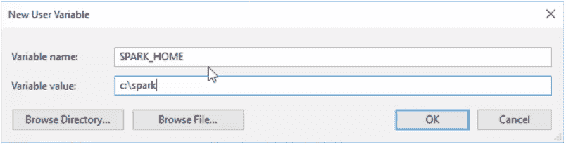

我们还需要设置`JAVA_HOME`，因此再次单击新建...，并键入`JAVA_HOME`作为变量名。 我们需要将其指向我们安装 Java 的位置，对我们来说是`c:\jdk`。

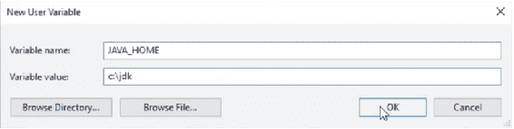

我们还需要设置`HADOOP_HOME`，这是我们安装`winutils`软件包的位置，因此我们将其指向`c:\winutils`：

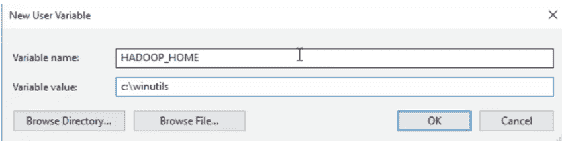

到目前为止，一切都很好。 我们需要做的最后一件事是修改我们的路径。 您应该在这里有一个 PATH 环境变量：

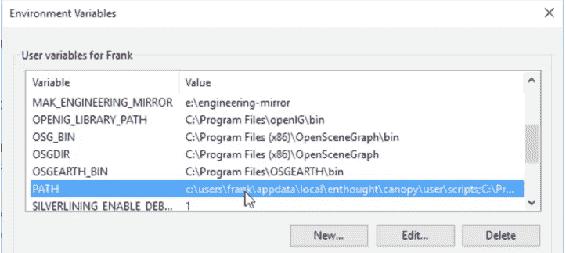

单击 PATH 环境变量，然后单击编辑...，并添加一个新路径。 这将是`%SPARK_HOME%\bin`，我将添加另一个，`%JAVA_HOME%\bin`：

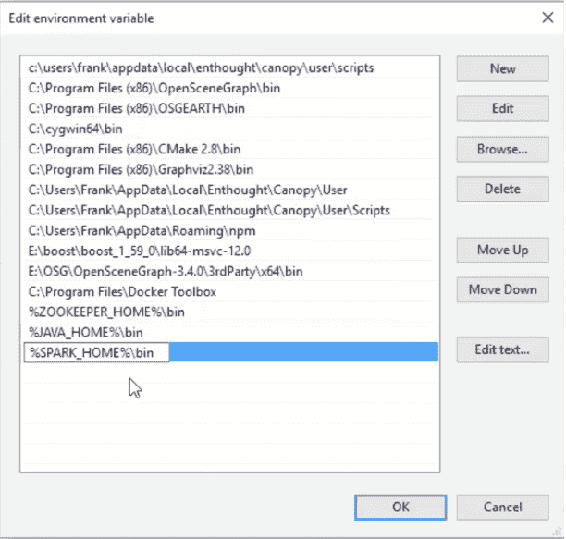

基本上，这使得 Spark 的所有二进制可执行文件都可以在 Windows 上运行。 单击此菜单上的确定以及前两个菜单上的确定。 我们最终设置好了一切。

# Spark 介绍

让我们从高层次概述 Apache Spark 开始，看看它是什么，它适用于什么，以及它是如何工作的。

什么是 Spark？嗯，如果你去 Spark 的网站，他们会给你一个非常高层次的，模糊的答案，“一个用于大规模数据处理的快速通用引擎。” 它切片，切块，它可以洗你的衣服。 嗯，不是真的。 但它是一个用于编写可以处理大量数据的作业或脚本的框架，并且它管理将该处理分布到计算集群中。 基本上，Spark 通过让你将数据加载到称为弹性分布式数据存储的大型对象中来工作，RDDs。 它可以自动执行转换和创建基于这些 RDD 的操作，你可以将其视为大型数据框架。

它的美妙之处在于，Spark 将自动地并且最优地将处理分布在整个计算机集群中，如果您有一个可用的话。 您不再受限于在单台计算机或单台计算机的内存上可以做什么。 您实际上可以将其扩展到整个机器集群可用的所有处理能力和内存，而且在今天这个时代，计算是相当便宜的。 您实际上可以通过像亚马逊的弹性 MapReduce 服务这样的服务租用集群上的时间，并且只需花费几美元就可以在整个计算机集群上租用一些时间，并运行您无法在自己的桌面上运行的作业。

# 它是可扩展的

Spark 如何实现可扩展性？ 好吧，让我们在这里更具体一点看看它是如何工作的。

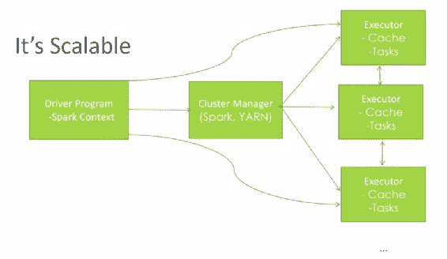

它的工作原理是，您编写一个驱动程序，它只是一个看起来与任何其他 Python 脚本非常相似的小脚本，并且它使用 Spark 库来实际编写您的脚本。 在该库中，您定义了所谓的 Spark 上下文，这在您在 Spark 中开发时是您要使用的根对象。

从那里开始，Spark 框架会接管并为您分配任务。因此，如果您在自己的计算机上以独立模式运行，就像我们将在接下来的部分中进行的那样，所有任务都会留在您的计算机上。然而，如果您在集群管理器上运行，Spark 可以识别并自动利用它。Spark 实际上有自己内置的集群管理器，您甚至可以在没有安装 Hadoop 的情况下单独使用它，但如果您有可用的 Hadoop 集群，它也可以使用。

Hadoop 不仅仅是 MapReduce；实际上，Hadoop 有一个名为 YARN 的组件，它将 Hadoop 的整个集群管理部分分离出来。Spark 可以与 YARN 接口，实际上使用它来在 Hadoop 集群中有效地分配处理组件的资源。

在集群中，您可能有正在运行的个别执行器任务。这些可能在不同的计算机上运行，也可能在同一台计算机的不同核心上运行。它们各自有自己的缓存和自己的任务。驱动程序、Spark Context 和集群管理器共同协调所有这些工作，并将最终结果返回给您。

它的美妙之处在于，您只需要编写最初的小脚本，即驱动程序，它使用 Spark Context 在高层次上描述您想要对这些数据进行的处理。Spark 与您使用的集群管理器一起工作，找出如何分散和分发，因此您不必担心所有这些细节。当然，如果不起作用，显然，您可能需要进行一些故障排除，以找出您手头的任务是否有足够的资源可用，但理论上，这都只是魔术。

# 它很快

Spark 有什么了不起的？我的意思是，有类似的技术，比如 MapReduce 已经存在很长时间了。不过，Spark 很快，网站上声称 Spark 在内存中运行作业时比 MapReduce 快 100 倍，或者在磁盘上快 10 倍。当然，这里的关键词是“最多”，您的情况可能有所不同。我从来没有见过任何东西实际上比 MapReduce 快那么多。一些精心设计的 MapReduce 代码实际上仍然可以非常高效。但我会说，Spark 确实使许多常见操作更容易。MapReduce 迫使您真正将事情分解为映射器和减速器，而 Spark 则更高级一些。您不必总是那么费心地使用 Spark 做正确的事情。

这部分原因之一是 Spark 为何如此快的原因。它有一个 DAG 引擎，即有向无环图。哇，这是另一个花哨的词。这是什么意思？Spark 的工作方式是，您编写一个描述如何处理数据的脚本，您可能有一个 RDD，基本上就像一个数据框架。您可能对其进行某种转换或某种操作。但直到您对该数据执行某种操作之前，实际上什么都不会发生。在那一点上发生的是，Spark 会说“嗯，好吧。所以，这是您在这些数据上想要的最终结果。我为了达到这一点必须做的所有其他事情是什么，以及达到这一点的最佳策略是什么？”因此，在幕后，它将找出最佳的方式来分割处理，并分发信息以获得您所寻找的最终结果。因此，这里的关键是，Spark 等到您告诉它实际产生结果，只有在那一点上它才会去找出如何产生那个结果。因此，这是一个很酷的概念，这是它效率的关键。

# 它很年轻

Spark 是一种非常炙手可热的技术，而且相对年轻，所以它仍然在不断发展和迅速变化，但很多大公司都在使用它。例如，亚马逊声称他们在使用它，eBay，NASA 的喷气推进实验室，Groupon，TripAdvisor，雅虎，还有许多其他公司也在使用。我相信有很多公司在使用它，但他们不会承认，但如果你去 Spark Apache Wiki 页面[`spark.apache.org/powered-by.html`](http://spark.apache.org/powered-by.html)。

实际上有一个你可以查阅的已知大公司使用 Spark 解决实际数据问题的列表。如果你担心自己正在接触最前沿的技术，不用担心，有一些非常大的公司正在使用 Spark 来解决实际问题，你是和一些非常重要的人一起使用 Spark 来解决实际问题。在这一点上，它是相当稳定的东西。

# 这并不困难

这也不难。你可以选择用 Python、Java 或 Scala 编程，它们都是围绕我之前描述的相同概念构建的，即弹性分布式数据集，简称 RDD。我们将在本章的后续部分详细讨论这一点。

# Spark 的组件

Spark 实际上有许多不同的组件构成。因此，有一个 Spark 核心，只需使用 Spark 核心功能就可以做出几乎任何你可以想象的事情，但还有其他一些构建在 Spark 之上的东西也很有用。

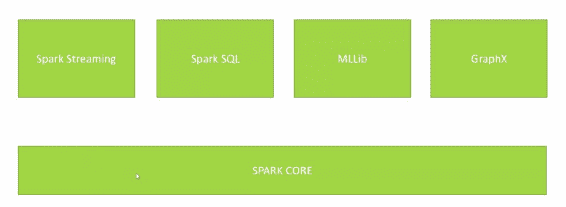

+   **Spark Streaming**：Spark Streaming 是一个库，它让你实际上可以实时处理数据。数据可以持续地流入服务器，比如来自网络日志，Spark Streaming 可以帮助你实时处理数据，一直进行下去。

+   **Spark SQL**：这让你实际上可以将数据视为 SQL 数据库，并在其上发出 SQL 查询，如果你已经熟悉 SQL，这是很酷的。

+   **MLlib**：这是我们在本节中要重点关注的内容。它实际上是一个机器学习库，让你可以执行常见的机器学习算法，底层使用 Spark 来实际分布式处理集群中的数据。你可以对比以前能处理的更大的数据集进行机器学习。

+   **GraphX**：这不是用来制作漂亮的图表和图形的。它是指网络理论意义上的图。想想一个社交网络；这就是图的一个例子。GraphX 只有一些函数，让你分析信息图的属性。

# Python 与 Scala 在 Spark 中的比较

有时候我在教授 Apache Spark 时会遇到一些批评，因为我使用 Python，但我的做法是有道理的。的确，很多人在编写 Spark 代码时使用 Scala，因为 Spark 是本地开发的。因此，通过强制 Spark 将你的 Python 代码转换为 Scala，然后在最后一天转换为 Java 解释器命令，你会增加一些开销。

然而，Python 要容易得多，而且你不需要编译东西。管理依赖项也要容易得多。你可以真正把时间集中在算法和你正在做的事情上，而不是在实际构建、运行、编译和所有那些废话上。此外，显然，这本书到目前为止一直都在关注 Python，继续使用我们学到的东西并在这些讲座中坚持使用 Python 是有意义的。以下是两种语言的优缺点的快速总结：

| **Python** | **Scala** |
| --- | --- |

|

+   无需编译、管理依赖等

+   编码开销更少

+   你已经了解 Python

+   让我们专注于概念而不是新语言

|

+   Scala 可能是 Spark 的更受欢迎的选择

+   Spark 是用 Scala 构建的，所以在 Scala 中编码对于 Spark 来说是“本地”的

+   新功能、库往往是首先使用 Scala

|

然而，我要说的是，如果您在现实世界中进行一些 Spark 编程，很有可能人们正在使用 Scala。不过不要太担心，因为在 Spark 中，Python 和 Scala 代码最终看起来非常相似，因为它们都围绕着相同的 RDD 概念。语法略有不同，但并不是很大的不同。如果您能够弄清楚如何使用 Python 进行 Spark 编程，学习如何在 Scala 中使用它并不是一个很大的飞跃。这里有两种语言中相同代码的快速示例：

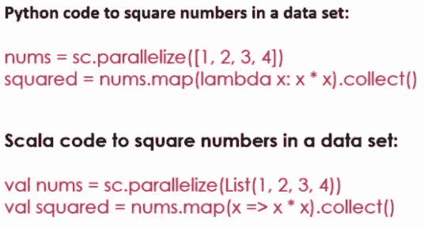

因此，这就是 Spark 本身的基本概念，为什么它如此重要，以及它如何在让您在非常大的数据集上运行机器学习算法或任何算法方面如此强大。现在让我们更详细地讨论一下它是如何做到这一点的，以及弹性分布式数据集的核心概念。

# Spark 和弹性分布式数据集（RDD）

让我们深入了解一下 Spark 的工作原理。我们将谈论弹性分布式数据集，即 RDD。这是您在 Spark 编程中使用的核心，我们将提供一些代码片段来尝试使其变得真实。我们将在这里为您提供 Apache Spark 的速成课程。比我们接下来要涵盖的内容更加深入，但我只会为您提供实际理解这些示例所需的基础知识，并希望能够让您开始并指向正确的方向。

如前所述，Spark 最基本的部分称为弹性分布式数据集，即 RDD，这将是您实际用来加载、转换和获取您想要的数据的对象。这是一个非常重要的理解。RDD 中的最后一个字母代表数据集，最终它只是一堆包含几乎任何内容的信息行。但关键是 R 和第一个 D。

+   **弹性**：它是弹性的，因为 Spark 确保如果您在集群上运行此任务并且其中一个集群出现故障，它可以自动从中恢复并重试。不过，请注意，这种弹性是有限的。如果您没有足够的资源可用于您要运行的作业，它仍然会失败，您将不得不为其添加更多资源。它只能从许多事情中恢复；它会尝试多少次重新尝试给定的任务是有限的。但它会尽最大努力确保在面对不稳定的集群或不稳定的网络时，仍然会继续尽最大努力运行到完成。

+   **分布式**：显然，它是分布式的。使用 Spark 的整个目的是，您可以将其用于可以横向分布到整个计算机集群的 CPU 和内存功率的大数据问题。这可以水平分布，因此您可以将尽可能多的计算机投入到给定的问题中。问题越大，使用的计算机就越多；在这方面真的没有上限。

# SparkContext 对象

您始终通过获取 SparkContext 对象来启动 Spark 脚本，这个对象体现了 Spark 的核心。它将为您提供要在其上处理的 RDD，因此它生成了您在处理中使用的对象。

你知道吗，当你实际编写 Spark 程序时，你并不会非常关注 SparkContext，但它实际上是在幕后为你运行它们的基础。如果你在 Spark shell 中交互式运行，它已经为你提供了一个`sc`对象，你可以用它来创建 RDD。然而，在独立脚本中，你将不得不显式创建 SparkContext，并且你将不得不注意你使用的参数，因为你实际上可以告诉 Spark 上下文你希望它如何分布。我应该利用我可用的每个核心吗？我应该在集群上运行还是只在我的本地计算机上独立运行？所以，这就是你设置 Spark 操作的基本设置的地方。

# 创建 RDD

让我们看一些实际创建 RDD 的小代码片段，我认为这一切都会开始变得更加清晰。

# 使用 Python 列表创建 RDD

以下是一个非常简单的例子：

```py
nums = parallelize([1, 2, 3, 4]) 

```

如果我只想从一个普通的 Python 列表中创建 RDD，我可以在 Spark 中调用`parallelize()`函数。这将把一系列东西，比如这里的数字 1、2、3、4，转换为一个名为`nums`的 RDD 对象。

这是创建 RDD 的最简单情况，只是从一个硬编码的列表中创建。该列表可以来自任何地方；它也不必是硬编码的，但这有点违背了大数据的目的。我的意思是，如果我必须在创建 RDD 之前将整个数据集加载到内存中，那还有什么意义呢？

# 从文本文件加载 RDD

我还可以从文本文件中加载 RDD，它可以是任何地方。

```py
sc.textFile("file:///c:/users/frank/gobs-o-text.txt")  

```

在这个例子中，我有一个巨大的文本文件，整个百科全书之类的东西。我正在从我的本地磁盘读取它，但如果我想要将这个文件托管在分布式的 AmazonS3 存储桶上，我也可以使用 s3n，或者如果我想引用存储在分布式 HDFS 集群上的数据，我可以使用 hdfs（如果您对 HDFS 不熟悉，它代表 Hadoop 分布式文件系统）。当你处理大数据并使用 Hadoop 集群时，通常你的数据会存储在那里。

这行代码实际上会将文本文件的每一行转换为 RDD 中的一行。所以，你可以把 RDD 看作是一行的数据库，在这个例子中，它将我的文本文件加载到一个 RDD 中，其中每一行，每一行，包含一行文本。然后我可以在那个 RDD 中进行进一步的处理，解析或分解数据中的分隔符。但这是我开始的地方。

还记得我们之前在书中讨论 ETL 和 ELT 吗？这是一个很好的例子，你可能实际上正在将原始数据加载到系统中，并在系统本身上进行转换，用于查询数据的系统。你可以拿未经任何处理的原始文本文件，并利用 Spark 的强大功能将其转换为更结构化的数据。

它还可以与 Hive 等东西通信，所以如果你的公司已经设置了现有的 Hive 数据库，你可以创建一个基于你的 Spark 上下文的 Hive 上下文。这是多么酷啊？看看这个例子代码：

```py
hiveCtx = HiveContext(sc)  rows = hiveCtx.sql("SELECT name, age FROM users")  

```

你实际上可以创建一个 RDD，这里称为 rows，它是通过在你的 Hive 数据库上实际执行 SQL 查询来生成的。

# 创建 RDD 的更多方法

还有更多创建 RDD 的方法。您可以从 JDBC 连接创建它们。基本上，任何支持 JDBC 的数据库也可以与 Spark 通信，并从中创建 RDD。Cassandra、HBase、Elasticsearch，还有 JSON 格式、CSV 格式、序列文件对象文件以及一堆其他压缩文件（如 ORC）都可以用来创建 RDD。我不想深入讨论所有这些细节，如果需要，您可以找一本书查看，但重点是很容易从数据中创建 RDD，无论数据是在本地文件系统还是分布式数据存储中。

再次强调，RDD 只是一种加载和维护大量数据并一次跟踪所有数据的方法。但是，在脚本中，概念上，RDD 只是包含大量数据的对象。您不必考虑规模，因为 Spark 会为您处理。

# RDD 操作

现在，一旦您拥有 RDD，您可以对其执行两种不同类型的操作，即转换和操作。

# 转换

让我们先谈谈转换。转换就是它听起来的样子。这是一种将 RDD 中的每一行根据您提供的函数转换为新值的方法。让我们看看其中一些函数：

+   **map() 和 flatmap()**: `map`和`flatmap`是您经常看到的函数。这两个函数都将接受您可以想象的任何函数，该函数将以 RDD 的一行作为输入，并输出一个转换后的行。例如，您可以从 CSV 文件中获取原始输入，您的`map`操作可能会将该输入根据逗号分隔符拆分为单独的字段，并返回一个包含以更结构化格式的数据的 Python 列表，以便您可以进行进一步的处理。您可以链接 map 操作，因此一个`map`的输出可能最终创建一个新的 RDD，然后您可以对其进行另一个转换，依此类推。再次强调，关键是，Spark 可以在集群上分发这些转换，因此它可能会在一台机器上转换 RDD 的一部分，然后在另一台机器上转换 RDD 的另一部分。

就像我说的，`map`和`flatmap`是您将看到的最常见的转换。唯一的区别是`map`只允许您为每一行输出一个值，而`flatmap`将允许您实际上为给定的行输出多个新行。因此，您实际上可以使用`flatmap`创建一个比您开始时更大或更小的 RDD。

+   **filter()**: 如果您只想创建一个布尔函数来判断“是否应该保留此行？是或否。”

+   **distinct()**: `distinct`是一个不太常用的转换，它将仅返回 RDD 中的不同值。

+   **sample()**: 此函数允许您从 RDD 中随机抽取样本

+   **union(), intersection(), subtract() 和 Cartesian()**: 您可以执行诸如并集、交集、差集，甚至生成 RDD 中存在的每个笛卡尔组合的操作。

# 使用 map()

以下是您如何在工作中使用 map 函数的一个小例子：

```py
rdd = sc.parallelize([1, 2, 3, 4]) 
rdd.map(lambda x: x*x) 

```

假设我只是从列表 1、2、3、4 创建了一个 RDD。然后我可以使用一个 lambda 函数 x 调用`rdd.map()`，该函数接受每一行，也就是 RDD 的每个值，将其称为 x，然后将函数 x 乘以 x 应用于平方。如果我然后收集此 RDD 的输出，它将是 1、4、9 和 16，因为它将获取该 RDD 的每个单独条目并对其进行平方，然后将其放入新的 RDD 中。

如果您不记得 lambda 函数是什么，我们在本书的前面稍微谈到过，但是作为提醒，lambda 函数只是定义一个内联函数的简写。因此，`rdd.map(lambda x: x*x)`与一个单独的函数`def squareIt(x): return x*x`是完全相同的，并且说`rdd.map(squareIt)`。

这只是一个非常简单的函数的简写，您希望将其作为转换传递。它消除了实际将其声明为自己的单独命名函数的需要。这就是函数式编程的整个理念。所以你现在可以说你理解函数式编程了！但实际上，这只是定义一个内联函数作为`map()`函数的参数之一，或者任何转换的简写符号。

# 行动

您还可以对 RDD 执行操作，当您真正想要获得结果时。以下是一些您可以执行的示例：

+   `collect()`: 您可以在 RDD 上调用 collect()，这将为您提供一个普通的 Python 对象，然后您可以遍历并打印结果，或将其保存到文件，或者您想做的任何其他事情。

+   `count()`: 您还可以调用`count()`，这将强制其实际上计算此时 RDD 中有多少条目。

+   `countByValue()`: 此函数将为您提供 RDD 中每个唯一值出现的次数的统计。

+   `take()`: 您还可以使用`take()`从 RDD 中进行抽样，它将从 RDD 中获取随机数量的条目。

+   `top()`: 如果您只想为了调试目的查看 RDD 中的前几个条目，`top()`将为您提供这些条目。

+   `reduce()`: 更强大的操作是`reduce()`，它实际上允许您将相同的公共键值的值组合在一起。您还可以在键-值数据的上下文中使用 RDD。`reduce()`函数允许您定义一种将给定键的所有值组合在一起的方式。它在精神上与 MapReduce 非常相似。`reduce()`基本上是 MapReduce 中`reducer()`的类似操作，而`map()`类似于`mapper()`。因此，通过使用这些函数，实际上很容易将 MapReduce 作业转换为 Spark。

还记得，在 Spark 中实际上什么都不会发生，直到您调用一个操作。一旦调用其中一个操作方法，Spark 就会出去并使用有向无环图进行其魔术，并实际计算获得所需答案的最佳方式。但请记住，直到发生那个操作，实际上什么都不会发生。因此，当您编写 Spark 脚本时，有时可能会遇到问题，因为您可能在其中有一个小的打印语句，并且您可能期望得到一个答案，但实际上直到执行操作时才会出现。

这就是 Spark 编程的基础。基本上，什么是 RDD 以及您可以对 RDD 执行哪些操作。一旦掌握了这些概念，您就可以编写一些 Spark 代码。现在让我们改变方向，谈谈 MLlib，以及 Spark 中一些特定的功能，让您可以使用 Spark 进行机器学习算法。

# 介绍 MLlib

幸运的是，在进行机器学习时，您不必在 Spark 中以困难的方式进行操作。它有一个名为 MLlib 的内置组件，它位于 Spark Core 之上，这使得使用大规模数据集执行复杂的机器学习算法变得非常容易，并将该处理分布到整个计算机集群中。非常令人兴奋的事情。让我们更多地了解它可以做什么。

# 一些 MLlib 功能

那么，MLlib 可以做些什么？其中之一是特征提取。

您可以在规模上执行词频和逆文档频率等操作，这对于创建搜索索引非常有用。我们稍后将实际上通过本章的一个示例来进行说明。关键是，它可以使用大规模数据集在整个集群中执行此操作，因此您可以使用它来为网络创建自己的搜索引擎。它还提供基本的统计函数，卡方检验，皮尔逊或斯皮尔曼相关性，以及一些更简单的东西，如最小值，最大值，平均值和方差。这些本身并不是非常令人兴奋，但令人兴奋的是，您实际上可以计算大规模数据集的方差或平均值，或者相关性得分，如果必要，它实际上会将该数据集分解成各种块，并在整个集群中运行。

因此，即使其中一些操作并不是非常有趣，有趣的是它可以操作的规模。它还支持诸如线性回归和逻辑回归之类的东西，因此如果您需要将函数拟合到大量数据集并用于预测，您也可以这样做。它还支持支持向量机。我们正在进入一些更高级的算法，一些更高级的东西，这也可以使用 Spark 的 MLlib 扩展到大规模数据集。MLlib 中内置了朴素贝叶斯分类器，因此，还记得我们在本书前面构建的垃圾邮件分类器吗？您实际上可以使用 Spark 为整个电子邮件系统执行此操作，并根据需要扩展。

决策树，机器学习中我最喜欢的东西之一，也受到 Spark 的支持，我们稍后在本章中将有一个示例。我们还将研究 K 均值聚类，您可以使用 Spark 和 MLlib 对大规模数据集进行聚类。甚至主成分分析和奇异值分解也可以使用 Spark 进行，我们也将有一个示例。最后，MLlib 中内置了一种名为交替最小二乘法的推荐算法。就我个人而言，我对它的效果有些参差不齐，您知道，对于我来说，它有点太神秘了，但我是一个推荐系统的挑剔者，所以请带着一颗谨慎的心来看待这一点！

# 特殊的 MLlib 数据类型

使用 MLlib 通常非常简单，只需要调用一些库函数。但是，它确实引入了一些新的数据类型，您需要了解一下，其中之一就是向量。

# 向量数据类型

还记得我们在本书前面做电影相似性和电影推荐时吗？向量的一个例子可能是给定用户评分的所有电影的列表。有两种类型的向量，稀疏和密集。让我们看看这两种的例子。世界上有很多很多电影，密集向量实际上会表示每部电影的数据，无论用户是否真的观看了它。所以，例如，假设我有一个用户观看了《玩具总动员》，显然我会存储他们对《玩具总动员》的评分，但如果他们没有观看电影《星球大战》，我实际上会存储没有《星球大战》的数字这一事实。因此，我们最终会占用所有这些缺失数据点的空间。稀疏向量只存储存在的数据，因此不会浪费任何内存空间在缺失数据上。因此，它是一种更紧凑的内部向量表示形式，但显然在处理时会引入一些复杂性。因此，如果您知道您的向量中将有很多缺失数据，这是一种节省内存的好方法。

# 带标签的点数据类型

还有一个`LabeledPoint`数据类型，它就像它听起来的那样，一个带有某种标签的点，以人类可读的方式传达这些数据的含义。

# 评级数据类型

最后，如果您在使用 MLlib 进行推荐，您将遇到`Rating`数据类型。这种数据类型可以接受代表 1-5 或 1-10 的评级，无论一个人可能有什么星级评价，并使用它来自动提供产品推荐。

因此，我认为您终于有了开始的一切，让我们深入实际查看一些真正的 MLlib 代码并运行它，然后它将变得更加清晰。

# 在 Spark 中使用 MLlib 的决策树

好了，让我们使用 Spark 和 MLlib 库实际构建一些决策树，这是非常酷的东西。无论你把这本书的课程材料放在哪里，我希望你现在就去那个文件夹。确保你完全关闭了 Canopy，或者你用于 Python 开发的任何环境，因为我想确保你是从这个目录开始的，好吗？然后找到`SparkDecisionTree`脚本，双击打开 Canopy：


现在，在这一点上，我们一直在使用 IPython 笔记本来编写我们的代码，但是你不能真正很好地使用它们与 Spark。对于 Spark 脚本，你需要实际将它们提交到 Spark 基础设施并以非常特殊的方式运行它们，我们很快就会看到它是如何工作的。

# 探索决策树代码

所以，现在我们只是看一个原始的 Python 脚本文件，没有 IPython 笔记本的通常修饰。让我们来看看脚本中发生了什么。

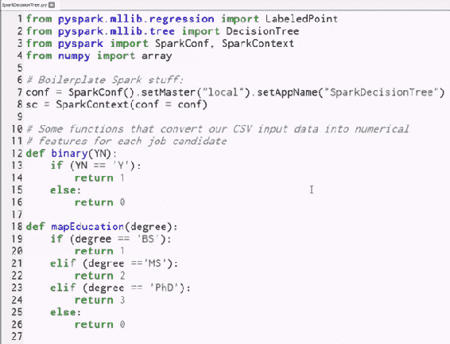

我们会慢慢来，因为这是你在本书中看到的第一个 Spark 脚本。

首先，我们将从`pyspark.mllib`中导入我们在 Spark 机器学习库中需要的部分。

```py
from pyspark.mllib.regression import LabeledPoint 
from pyspark.mllib.tree import DecisionTree 

```

我们需要`LabeledPoint`类，这是`DecisionTree`类所需的数据类型，以及从`mllib.tree`导入的`DecisionTree`类本身。

接下来，你会看到几乎每个 Spark 脚本都会包含这一行，我们在其中导入`SparkConf`和`SparkContext`：

```py
from pyspark import SparkConf, SparkContext 

```

这是创建`SparkContext`对象所需的，它是你在 Spark 中做任何事情的根本。

最后，我们将从`numpy`中导入数组库：

```py
from numpy import array 

```

是的，你仍然可以在 Spark 脚本中使用`NumPy`、`scikit-learn`或者任何你想要的东西。你只需要确保首先这些库在你打算在其上运行的每台机器上都已安装好。

如果你在集群上运行，你需要确保这些 Python 库已经以某种方式安装好了，并且你还需要明白，Spark 不会使 scikit-learn 的方法等变得可扩展。你仍然可以在给定 map 函数的上下文中调用这些函数，但它只会在那一个机器的一个进程中运行。不要过分依赖这些东西，但是对于像管理数组这样的简单事情，这是完全可以的。

# 创建 SparkContext

现在，我们将开始设置我们的`SparkContext`，并给它一个`SparkConf`，一个配置。

```py
conf = SparkConf().setMaster("local").setAppName("SparkDecisionTree") 

```

这个配置对象表示，我将把主节点设置为"`local`"，这意味着我只是在自己的本地桌面上运行，我实际上根本不是在集群上运行，我只会在一个进程中运行。我还会给它一个应用程序名称"`SparkDecisionTree`"，你可以随意命名它，Fred、Bob、Tim，随你喜欢。这只是当你稍后在 Spark 控制台中查看时，这个作业将显示为什么。

然后，我们将使用该配置创建我们的`SparkContext`对象：

```py
sc = SparkContext(conf = conf) 

```

这给了我们一个`sc`对象，我们可以用它来创建 RDDs。

接下来，我们有一堆函数：

```py
# Some functions that convert our CSV input data into numerical 
# features for each job candidate 
def binary(YN): 
    if (YN == 'Y'): 
        return 1 
    else: 
        return 0 

def mapEducation(degree): 
    if (degree == 'BS'): 
        return 1 
    elif (degree =='MS'): 
        return 2 
    elif (degree == 'PhD'): 
        return 3 
    else: 
        return 0 

# Convert a list of raw fields from our CSV file to a 
# LabeledPoint that MLLib can use. All data must be numerical... 
def createLabeledPoints(fields): 
    yearsExperience = int(fields[0]) 
    employed = binary(fields[1]) 
    previousEmployers = int(fields[2]) 
    educationLevel = mapEducation(fields[3]) 
    topTier = binary(fields[4]) 
    interned = binary(fields[5]) 
    hired = binary(fields[6]) 

    return LabeledPoint(hired, array([yearsExperience, employed, 
        previousEmployers, educationLevel, topTier, interned])) 

```

现在先记住这些函数，稍后我们会回来再讨论它们。

# 导入和清理我们的数据

让我们来看一下这个脚本中实际执行的第一部分 Python 代码。

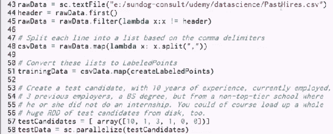

我们要做的第一件事是加载`PastHires.csv`文件，这是我们在本书早期做决策树练习时使用的同一个文件。

让我们暂停一下，回顾一下那个文件的内容。如果你记得的话，我们有一堆求职者的属性，还有一个字段，表示我们是否雇佣了这些人。我们要做的是建立一个决策树，来预测 - 根据这些属性，我们是否会雇佣这个人。

现在，让我们快速查看一下`PastHires.csv`，这将是一个 Excel 文件。

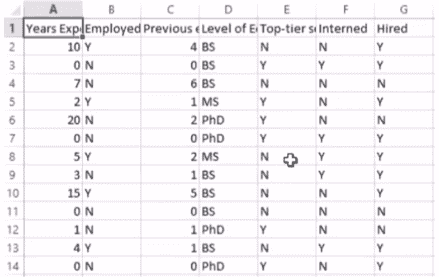

您可以看到 Excel 实际上将其导入为一个表，但如果您查看原始文本，您会发现它由逗号分隔的值组成。

第一行是每列的实际标题，所以上面的内容是先前经验年数，候选人当前是否在职，以及之前的雇主数量，教育水平，是否就读于顶尖学校，是否在学校期间有实习，最后，我们试图在最后一天预测的目标，即他们是否得到了工作机会。现在，我们需要将这些信息读入 RDD，以便我们可以对其进行处理。

让我们回到我们的脚本：

```py
rawData = sc.textFile("e:/sundog-consult/udemy/datascience/PastHires.csv") 
header = rawData.first() 
rawData = rawData.filter(lambda x:x != header) 

```

我们需要做的第一件事是读取 CSV 数据，并且我们将丢弃第一行，因为那是我们的标题信息，记住。这里有一个小技巧。我们首先从文件中导入每一行到一个原始数据 RDD 中，我可以随意命名它，但我们称它为`sc.textFile`。SparkContext 有一个`textFile`函数，它将获取一个文本文件并创建一个新的 RDD，其中每个条目，RDD 的每一行，都包含一个输入行。

确保将文件的路径更改为您实际安装的位置，否则它将无法工作。

现在，我将使用`first`函数从 RDD 中提取第一行，也就是第一行列标题。现在，头部 RDD 将包含一个条目，即列标题的那一行。现在，看看上面的代码，我在包含 CSV 文件中的原始数据上使用`filter`，并定义了一个`filter`函数，只有当该行不等于初始标题行的内容时，才允许该行通过。我在这里所做的是，我从我的原始 CSV 文件中剥离出了第一行，只允许不等于第一行的行通过，并将其返回给`rawData` RDD 变量。所以，我从`rawData`中过滤掉了第一行，并创建了一个只包含数据本身的新`rawData`。到目前为止明白了吗？并不复杂。

现在，我们要使用`map`函数。接下来，我们需要开始对这些信息进行更多的结构化处理。现在，我的 RDD 的每一行都只是一行文本，它是逗号分隔的文本，但它仍然只是一行巨大的文本，我想将逗号分隔的值列表实际分割成单独的字段。最终，我希望每个 RDD 都从一行文本转换为一个 Python 列表，其中包含我拥有的每个信息列的实际单独字段。这就是这个 lambda 函数的作用：

```py
csvData = rawData.map(lambda x: x.split(",")) 

```

它调用了内置的 Python 函数`split`，该函数将获取一行输入，并在逗号字符上进行拆分，并将其分成一个由逗号分隔的每个字段的列表。

这个`map`函数的输出，我传入了一个 lambda 函数，它只是根据逗号将每一行拆分成字段，得到了一个名为`csvData`的新 RDD。此时，`csvData`是一个 RDD，其中每一行都包含一个列表，其中每个元素都是源数据中的列。现在，我们接近了。

事实证明，为了在 MLlib 中使用决策树，需要满足一些条件。首先，输入必须是 LabeledPoint 数据类型，并且所有数据都必须是数字性质的。因此，我们需要将所有原始数据转换为实际可以被 MLlib 消耗的数据，这就是我们之前跳过的`createLabeledPoints`函数所做的事情。我们马上就会讲到，首先是对它的调用：

```py
trainingData = csvData.map(createLabeledPoints) 

```

我们将在`csvData`上调用 map，并将其传递给`createLabeledPoints`函数，该函数将将每个输入行转换为最终我们想要的东西。所以，让我们看看`createLabeledPoints`做了什么：

```py
def createLabeledPoints(fields): 
    yearsExperience = int(fields[0]) 
    employed = binary(fields[1]) 
    previousEmployers = int(fields[2]) 
    educationLevel = mapEducation(fields[3]) 
    topTier = binary(fields[4]) 
    interned = binary(fields[5]) 
    hired = binary(fields[6]) 

    return LabeledPoint(hired, array([yearsExperience, employed, 
        previousEmployers, educationLevel, topTier, interned])) 

```

它接受一个字段列表，再次提醒您一下它是什么样子，让我们再次打开那个`.csv`的 Excel 文件：

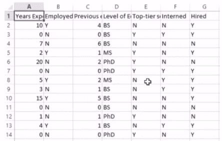

因此，此时每个 RDD 条目都有一个字段，它是一个 Python 列表，其中第一个元素是工作经验，第二个元素是就业情况，依此类推。问题在于我们希望将这些列表转换为 Labeled Points，并且我们希望将所有内容转换为数值数据。因此，所有这些 yes 和 no 答案都需要转换为 1 和 0。这些经验水平需要从学位名称转换为某些数值序数值。也许我们将值 0 分配给没有教育，1 表示学士学位，2 表示硕士学位，3 表示博士学位，例如。同样，所有这些 yes/no 值都需要转换为 0 和 1，因为归根结底，进入我们的决策树的一切都需要是数值的，这就是`createLabeledPoints`的作用。现在，让我们回到代码并运行它：

```py
def createLabeledPoints(fields): 
    yearsExperience = int(fields[0]) 
    employed = binary(fields[1]) 
    previousEmployers = int(fields[2]) 
    educationLevel = mapEducation(fields[3]) 
    topTier = binary(fields[4]) 
    interned = binary(fields[5]) 
    hired = binary(fields[6]) 

    return LabeledPoint(hired, array([yearsExperience, employed, 
        previousEmployers, educationLevel, topTier, interned])) 

```

首先，它接受我们的`StringFields`列表，准备将其转换为`LabeledPoints`，其中标签是目标值-这个人是否被雇佣？0 或 1-后面是由我们关心的所有其他字段组成的数组。因此，这就是您创建`DecisionTree MLlib`类可以使用的`LabeledPoint`的方式。因此，您可以在上面的代码中看到，我们将工作经验从字符串转换为整数值，并且对于所有的 yes/no 字段，我们调用了我在代码顶部定义的`binary`函数，但我们还没有讨论过：

```py
def binary(YN): 
    if (YN == 'Y'): 
        return 1 
    else: 
        return 0 

```

它只是将字符 yes 转换为 1，否则返回 0。所以，Y 将变为 1，N 将变为 0。同样，我有一个`mapEducation`函数：

```py
def mapEducation(degree): 
    if (degree == 'BS'): 
        return 1 
    elif (degree =='MS'): 
        return 2 
    elif (degree == 'PhD'): 
        return 3 
    else: 
        return 0 

```

正如我们之前讨论的，这只是将不同类型的学位转换为与我们的 yes/no 字段完全相同的序数数值。

作为提醒，这是让我们通过这些函数的代码行：

```py
trainingData = csvData.map(createLabeledPoints) 

```

在使用`createLabeledPoints`函数映射我们的 RDD 之后，我们现在有了一个`trainingData` RDD，这正是 MLlib 构建决策树所需要的。

# 创建测试候选人并构建我们的决策树

让我们创建一个小的测试候选人，这样我们就可以使用我们的模型来预测是否会雇佣某个新人。我们要做的是创建一个测试候选人，其中包含与 CSV 文件中每个字段相同的值的数组：

```py
testCandidates = [ array([10, 1, 3, 1, 0, 0])] 

```

让我们快速将该代码与 Excel 文档进行比较，以便您可以看到数组映射：

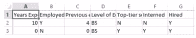

同样，我们需要将它们映射回它们的原始列表示，以便 10、1、3、1、0、0 表示 10 年的工作经验，目前就业，三个以前的雇主，学士学位，没有上过一流学校，也没有做实习。如果我们愿意，我们实际上可以创建一个完整的 RDD 候选人，但现在我们只做一个。

接下来，我们将使用 parallelize 将该列表转换为 RDD：

```py
testData = sc.parallelize(testCandidates) 

```

没有新东西。好了，现在让我们移动到下一个代码块：

```py
model = DecisionTree.trainClassifier(trainingData, numClasses=2, 
                    categoricalFeaturesInfo={1:2, 3:4, 4:2, 5:2}, 
                    impurity='gini', maxDepth=5, maxBins=32) 

```

我们将调用`DecisionTree.trainClassifier`，这将实际构建我们的决策树本身。我们传入我们的`trainingData`，这只是一个充满`LabeledPoint`数组的 RDD，`numClasses=2`，因为我们基本上是在做一个是或否的预测，这个人会被雇佣吗？下一个参数叫做`categoricalFeaturesInfo`，这是一个 Python 字典，将字段映射到每个字段中的类别数。因此，如果某个字段有一个连续的范围可用，比如工作经验的年数，你就不需要在这里指定它，但对于那些具有分类特性的字段，比如他们拥有什么学位，例如，那会说字段 ID3，映射到所获得的学位，有四种不同的可能性：没有教育、学士、硕士和博士。对于所有的是/否字段，我们将它们映射到 2 种可能的类别，是/否或 0/1 是我们将它们转换成的。

继续通过我们的`DecisionTree.trainClassifier`调用，我们将使用'gini'不纯度度量作为我们测量熵的指标。我们有一个最大深度为 5，这只是我们将要走多远的一个上限，如果你愿意，它可以更大。最后，`maxBins`只是一种权衡计算开销的方式，如果可以的话，它只需要至少是每个特征中你拥有的最大类别数。记住，直到我们调用一个操作之前，什么都不会发生，因此我们将实际使用这个模型来为我们的测试候选人做出预测。

我们使用我们的`DecisionTree`模型，其中包含了在我们的测试训练数据上训练的决策树，并告诉它对我们的测试数据进行预测：

```py
predictions = model.predict(testData) 
print ('Hire prediction:') 
results = predictions.collect() 
for result in results: 
     print (result) 

```

我们将得到一个预测列表，然后我们可以进行迭代。因此，`predict`返回一个普通的 Python 对象，是我可以`collect`的一个操作。让我稍微改一下：`collect`将返回我们预测的 Python 对象，然后我们可以迭代遍历列表中的每个项目并打印出预测的结果。

我们还可以通过使用`toDebugString`打印出决策树本身：

```py
print('Learned classification tree model:') 
print(model.toDebugString()) 

```

这将实际打印出它内部创建的决策树的一个小表示，你可以在自己的头脑中跟踪。所以，这也很酷。

# 运行脚本

好了，随意花点时间，多看一下这个脚本，消化一下正在发生的事情，但是，如果你准备好了，让我们继续并实际运行这个程序。因此，你不能直接从 Canopy 运行它。我们将转到工具菜单，打开 Canopy 命令提示符，这只是打开一个 Windows 命令提示符，其中包含运行 Canopy 中 Python 脚本所需的所有必要环境变量。确保工作目录是你安装所有课程材料的目录。

我们需要做的就是调用`spark-submit`，这是一个脚本，可以让你从 Python 运行 Spark 脚本，然后是脚本的名称`SparkDecisionTree.py`。这就是我需要做的全部。

```py
spark-submit SparkDecisionTree.py 

```

按回车键，然后它就会运行。再次强调，如果我在集群上进行操作，并且相应地创建了我的`SparkConf`，这实际上会分发到整个集群，但是现在，我们只是在我的电脑上运行它。完成后，你应该会看到下面的输出：

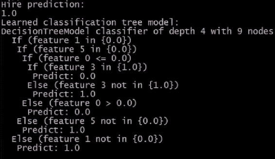

因此，在上面的图像中，你可以看到我们上面输入的测试人员的预测是这个人会被雇佣，我也打印出了决策树本身，所以这很酷。现在，让我们再次打开那个 Excel 文档，这样我们就可以将其与输出进行比较：

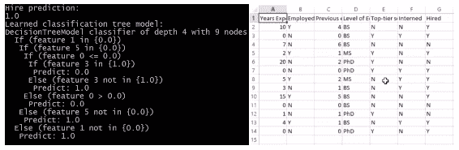

我们可以逐步进行并看看它的意思。所以，在我们的输出决策树中，实际上我们最终得到了一个深度为四的树，有九个不同的节点，再次提醒一下，这些不同的字段是如何相关的，阅读的方式是：如果（特征 1 为 0），这意味着如果受雇者为否，那么我们就会下降到特征 5。这个列表是从 0 开始的，所以在我们的 Excel 文档中，特征 5 是实习。我们可以像这样遍历整个树：这个人目前没有工作，没有做实习，没有工作经验，有学士学位，我们不会雇佣这个人。然后我们来到了 Else 子句。如果这个人有高级学位，我们会雇用他们，仅仅基于我们训练的数据。所以，你可以根据这些不同的特征 ID 回溯到你的原始数据源，记住，你总是从 0 开始计数，并据此进行解释。请注意，在这个可能的类别列表中，所有的分类特征都是用布尔值表示的，而连续数据则是用数字表示小于或大于的关系。

就是这样，使用 Spark 和 MLlib 构建的实际决策树确实有效且有意义。非常棒的东西。

# Spark 中的 K-Means 聚类

好了，让我们看看在 MLlib 中使用 Spark 的另一个例子，这一次我们将看看 k-means 聚类，就像我们使用决策树一样，我们将采用与使用 scikit-learn 相同的例子，但这次我们将在 Spark 中进行，这样它就可以扩展到大规模数据集。所以，我已经确保关闭了其他所有东西，然后我将进入我的书籍材料，打开`SparkKMeans`Python 脚本，让我们来研究一下其中的内容。

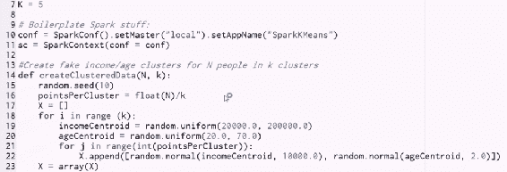

好了，再次开始一些样板文件。

```py
from pyspark.mllib.clustering import KMeans 
from numpy import array, random 
from math import sqrt 
from pyspark import SparkConf, SparkContext 
from sklearn.preprocessing import scale 

```

我们将从聚类`MLlib`包中导入`KMeans`包，我们将从`numpy`中导入数组和随机数，因为，再次强调，你可以自由使用任何你想要的东西，这是一个 Python 脚本，`MLlib`通常需要`numpy`数组作为输入。我们将导入`sqrt`函数和通常的样板文件，我们需要从`pyspark`中几乎每次都导入`SparkConf`和`SparkContext`。我们还将从`scikit-learn`中导入缩放函数。再次强调，只要确保在你要运行这个作业的每台机器上都安装了`scikit-learn`，并且不要假设`scikit-learn`会因为在 Spark 上运行就会自动扩展。但是，因为我只是用它来进行缩放函数，所以没问题。好了，让我们开始设置吧。

我将首先创建一个全局变量：

```py
 K=5 

```

在这个例子中，我将使用 K 为 5 来运行 k-means 聚类，意味着有五个不同的簇。然后我将设置一个本地的`SparkConf`，只在我的桌面上运行：

```py
conf = SparkConf().setMaster("local").setAppName("SparkKMeans") 
sc = SparkContext(conf = conf) 

```

我将把我的应用程序的名称设置为`SparkKMeans`，并创建一个`SparkContext`对象，然后我可以使用它来创建在我的本地机器上运行的 RDD。我们暂时跳过`createClusteredData`函数，直接到第一行被运行的代码。

```py
data = sc.parallelize(scale(createClusteredData(100, K)))  

```

1.  我们要做的第一件事是通过并行化一些我创建的假数据来创建一个 RDD，这就是`createClusteredData`函数所做的。基本上，我告诉你创建 100 个围绕 K 个质心聚集的数据点，这与我们在本书早期玩 k-means 聚类时看到的代码几乎完全相同。如果你需要复习，可以回头看看那一章。基本上，我们要做的是创建一堆随机的质心，围绕它们通常分布一些年龄和收入数据。所以，我们正在尝试根据他们的年龄和收入对人进行聚类，并且我们正在制造一些数据点来做到这一点。这将返回我们的假数据的`numpy`数组。

1.  一旦`createClusteredData`返回结果，我会在其上调用`scale`，这将确保我的年龄和收入在可比较的尺度上。现在，记住我们学过的关于数据归一化的部分吗？这是一个重要的例子，所以我们正在使用`scale`对数据进行归一化，以便我们从 k-means 中得到好的结果。

1.  最后，我们使用`parallelize`将结果数组列表并行化为 RDD。现在我们的数据 RDD 包含了所有的假数据。我们所要做的，甚至比决策树还要简单，就是在我们的训练数据上调用`KMeans.train`。

```py
clusters = KMeans.train(data, K, maxIterations=10, 
        initializationMode="random") 

```

我们传入我们想要的簇的数量，我们的 K 值，一个参数，它对它要处理的量设置了一个上限；然后告诉它使用 k-means 的默认初始化模式，在我们开始迭代之前，我们只是随机选择我们的簇的初始质心，然后我们可以使用返回的模型。我们将称之为`clusters`。

好了，现在我们可以玩玩那个簇。

让我们从打印出每一个点的簇分配开始。所以，我们将使用一个 lambda 函数来对我们的原始数据进行转换：

```py
resultRDD = data.map(lambda point: clusters.predict(point)).cache() 

```

这个函数只是将每个点转换为从我们的模型预测的簇编号。同样，我们只是拿着我们的数据点的 RDD。我们调用`clusters.predict`来找出我们的 k-means 模型分配给它们的簇，然后我们将结果放入我们的`resultRDD`中。现在，我想在上面的代码中指出的一件事是这个缓存调用。

在做 Spark 时一个重要的事情是，每当你要在 RDD 上调用多个操作时，首先将其缓存起来是很重要的，因为当你在 RDD 上调用一个操作时，Spark 会去计算它的 DAG，以及如何最优地得到结果。

它将去执行一切以得到结果。所以，如果我在同一个 RDD 上调用两个不同的操作，它实际上会评估那个 RDD 两次，如果你想避免所有这些额外的工作，你可以缓存你的 RDD，以确保它不会被计算超过一次。

通过这样做，我们确保这两个后续操作做了正确的事情：

```py
print ("Counts by value:") 
counts = resultRDD.countByValue() 
print (counts) 

print ("Cluster assignments:") 
results = resultRDD.collect() 
print (results) 

```

为了得到实际的结果，我们将使用`countByValue`，它将给我们一个包含每个簇中有多少点的 RDD。记住，`resultRDD`目前已经将每个单独的点映射到它最终所在的簇，所以现在我们可以使用`countByValue`来计算每个给定簇 ID 看到多少个值。然后我们可以轻松地打印出那个列表。我们也可以通过在其上调用`collect`来实际查看该 RDD 的原始结果，并打印出所有的结果。

# 在一组平方误差和（WSSSE）内

现在，我们如何衡量我们的簇有多好呢？嗯，其中一个度量标准就是被称为簇内平方和误差（WSSSE），哇，听起来很高级！这个术语如此之大，以至于我们需要一个缩写，WSSSE。它就是我们看每个点到它所在簇的质心的距离，每个簇的最终质心，取这个误差的平方并对整个数据集进行求和。它只是衡量每个点距离它所在簇的质心有多远。显然，如果我们的模型中有很多误差，那么它们很可能会远离可能适用的质心，因此我们需要更高的 K 值。我们可以继续计算这个值，并用以下代码打印出来：

```py
def error(point): 
    center = clusters.centers[clusters.predict(point)] 
    return sqrt(sum([x**2 for x in (point - center)])) 

WSSSE = data.map(lambda point: error(point)).reduce(lambda x, y: x + y) 
print("Within Set Sum of Squared Error = " + str(WSSSE)) 

```

首先，我们定义了这个`error`函数，它计算每个点的平方误差。它只是取每个点到每个簇的质心的距离，并将它们相加。为了做到这一点，我们取我们的源数据，在其上调用一个 lambda 函数，实际上计算每个质心中心点的误差，然后我们可以在这里链接不同的操作。

首先，我们调用`map`来计算每个点的误差。然后为了得到代表整个数据集的最终总和，我们对该结果调用`reduce`。所以，我们使用`data.map`来计算每个点的误差，然后使用`reduce`将所有这些误差相加在一起。这就是这个小 lambda 函数的作用。基本上就是一种高级的说法，即“我希望你把这个 RDD 中的所有东西加起来得到一个最终结果”。`reduce`会一次取整个 RDD 的两个元素，并使用你提供的任何函数将它们组合在一起。我上面提供的函数是“取我要组合在一起的两行，然后把它们加起来”。

如果我们在 RDD 的每个条目中都这样做，最终我们会得到一个总和的总数。这可能看起来有点绕，但通过这种方式做，我们能够确保如果需要的话，我们实际上可以分发这个操作。我们实际上可能会在一台机器上计算数据的总和，而在另一台机器上计算不同部分的总和，然后将这两个总和组合在一起得到最终结果。这个`reduce`函数是在问，我如何将这个操作的任何两个中间结果组合在一起？

同样，如果你想让它深入你的脑海中，可以随意花点时间盯着它看一会儿。这里没有什么特别复杂的东西，但有一些重要的要点：

+   我们介绍了缓存的使用，如果你想确保在一个你将要多次使用的 RDD 上不进行不必要的重新计算。

+   我们介绍了`reduce`函数的使用。

+   我们还有一些有趣的映射函数在这里，所以这个例子中有很多可以学习的地方。

最后，它只会执行 k 均值聚类，所以让我们继续运行它。

# 运行代码

转到工具菜单，Canopy 命令提示符，然后输入：

```py
spark-submit SparkKMeans.py  

```

按回车，然后它就会运行。在这种情况下，你可能需要等待一段时间才能看到输出，但你应该会看到类似这样的东西：

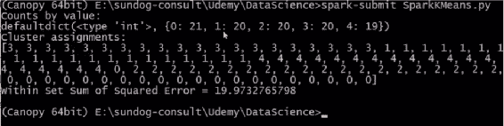

它起作用了，太棒了！所以记住，我们要求的输出首先是每个簇中有多少点的计数。这告诉我们，簇 0 中有 21 个点，簇 1 中有 20 个点，依此类推。它最终分布得相当均匀，这是一个好迹象。

接下来，我们打印出了每个点的聚类分配，如果你还记得，生成这些数据的原始数据是顺序的，所以看到所有的 3 都在一起，所有的 1 都在一起，所有的 4 都在一起，看起来它开始对 0 和 2 有点困惑，但总的来说，它似乎已经很好地揭示了我们最初创建数据的聚类。

最后，我们计算了 WSSSE 指标，在这个例子中为 19.97。所以，如果你想玩一下，我鼓励你这样做。你可以看到当你增加或减少 K 的值时，错误指标会发生什么变化，并思考为什么会这样。你也可以尝试一下如果不对所有数据进行归一化会发生什么，这实际上是否会以一种有意义的方式影响你的结果？这实际上是否是一件重要的事情？你还可以尝试一下在模型本身上调整`maxIterations`参数，了解它对最终结果的实际影响以及它的重要性。所以，随意尝试并进行实验。这是使用 MLlib 和 Spark 进行可扩展的 k 均值聚类。非常酷。

# TF-IDF

所以，我们 MLlib 的最后一个例子将使用一种称为词项频率逆文档频率（TF-IDF）的东西，这是许多搜索算法的基本构建块。像往常一样，听起来很复杂，但实际上并没有听起来那么糟糕。

所以，首先，让我们谈谈 TF-IDF 的概念，以及我们如何使用它来解决搜索问题。我们实际上要用 TF-IDF 来为维基百科创建一个基本的搜索引擎，使用 Apache Spark 中的 MLlib。多么棒啊？让我们开始吧。

TF-IDF 代表词项频率和逆文档频率，这基本上是两个密切相关的指标，用于进行搜索并确定给定单词与文档的相关性，给定更大的文档集。所以，例如，维基百科上的每篇文章可能都有与之关联的词项频率，互联网上的每个页面可能都有与之关联的词项频率，对于出现在该文档中的每个单词。听起来很花哨，但是，正如你将看到的那样，这是一个相当简单的概念。

+   **所有词项频率**的意思就是给定单词在给定文档中出现的频率。所以，在一个网页内，在一个维基百科文章内，在一个任何地方，给定单词在该文档内有多常见？你知道，该单词在该文档中所有单词中出现率的比率是多少？就是这样。这就是词项频率的全部。

+   **文档频率**，是相同的概念，但这次是该单词在整个文档语料库中的频率。所以，这个单词在我拥有的所有文档，所有网页，所有维基百科文章中出现的频率有多高。例如，像"a"或"the"这样的常见词汇会有很高的文档频率，我也期望它们在特定文档中也有很高的词项频率，但这并不一定意味着它们与给定文档相关。

你可以看出我们要做什么。所以，假设我们有一个给定单词的词项频率很高，文档频率很低。这两者的比率可以给我一个衡量该单词与文档相关性的指标。所以，如果我看到一个单词在给定文档中经常出现，但在整个文档空间中并不经常出现，那么我知道这个单词可能对这个特定文档传达了一些特殊的含义。它可能传达了这个文档实际上是关于什么。

所以，这就是 TF-IDF。它只是词频 x 逆文档频率的缩写，这只是一种说词频除以文档频率的花哨方式，这只是一种说这个词在这个文档中出现的频率与它在整个文档体中出现的频率相比有多频繁的花哨方式。就是这么简单。

# 实践中的 TF-IDF

在实践中，我们在使用这个方法时有一些小细节。例如，我们使用逆文档频率的实际对数值，而不是原始值，这是因为实际上单词频率往往呈指数分布。因此，通过取对数，我们最终得到了对单词的稍微更好的加权，考虑到它们的整体流行度。显然，这种方法也有一些局限性，其中之一是我们基本上假设一个文档只是一袋词，我们假设词之间没有关系。显然，这并不总是事实，实际上解析它们可能是工作的一大部分，因为你必须处理同义词和各种时态的词、缩写、大写、拼写错误等。这又回到了清理数据作为数据科学家工作的一个重要部分的想法，特别是当你处理自然语言处理的东西时。幸运的是，有一些库可以帮助你解决这个问题，但这确实是一个真正的问题，它会影响你的结果的质量。

我们在 TF-IDF 中使用的另一个实现技巧是，我们不是存储实际的字符串词及其词频和逆文档频率，为了节省空间并使事情更有效率，我们实际上将每个词映射到一个数值，我们称之为哈希值。这个想法是我们有一个函数，可以取任何词，查看它的字母，并以一种相当均匀分布的方式将其分配给一个数字范围内的一组数字。这样，我们可以用“10”来代表“represented”。现在，如果你的哈希值空间不够大，你可能会得到不同的词被同一个数字表示，这听起来比实际情况要糟糕。但是，你要确保你有一个相当大的哈希空间，这样才不太可能发生。这些被称为哈希冲突。它们可能会引起问题，但实际上，人们在英语中常用的词并不多。你可以用 10 万左右就可以了。

在规模上做到这一点是困难的。如果你想在整个维基百科上做到这一点，那么你将不得不在一个集群上运行这个。但是为了论证，我们现在只是在我们自己的桌面上运行这个，使用维基百科数据的一个小样本。

# 使用 TF-IDF

我们如何将这转化为一个实际的搜索问题？一旦我们有了 TF-IDF，我们就有了每个词对每个文档相关性的度量。我们该怎么处理呢？嗯，你可以做的一件事是为我们遇到的整个文档体中的每个词计算 TF-IDF，然后，假设我们想搜索一个给定的术语，一个给定的词。比如说我们想搜索“在我的维基百科文章集中，哪篇文章与葛底斯堡最相关？”我可以按照它们对葛底斯堡的 TF-IDF 得分对所有文档进行排序，然后只取前几个结果，这些就是我对葛底斯堡的搜索结果。就是这样。只需取你的搜索词，计算 TF-IDF，取前几个结果。就这样。

显然，在现实世界中，搜索的内容要比这多得多。谷歌有大批人在解决这个问题，实际上这个问题要复杂得多，但这实际上会给你一个能产生合理结果的工作搜索引擎算法。让我们继续深入了解它是如何工作的。

# 使用 Spark MLlib 搜索维基百科

我们将使用 Apache Spark 在 MLlib 中为维基百科的一部分构建一个实际工作的搜索算法，并且我们将在不到 50 行的代码中完成所有工作。这可能是我们在整本书中做的最酷的事情！

进入您的课程材料，打开`TF-IDF.py`脚本，这将打开 Canopy，并显示以下代码：

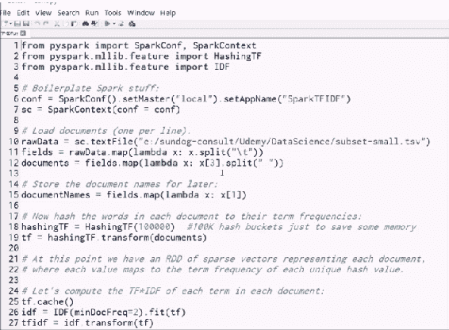

现在，暂停一下，让它沉淀下来，我们实际上正在创建一个工作的搜索算法，以及在不到 50 行的代码中使用它的一些示例，而且它是可扩展的。我可以在集群上运行这个。这有点令人惊讶。让我们逐步了解代码。

# 导入语句

我们将首先导入我们在 Python 中运行任何 Spark 脚本所需的`SparkConf`和`SparkContext`库，然后使用以下命令导入`HashingTF`和`IDF`。

```py
from pyspark import SparkConf, SparkContext 
from pyspark.mllib.feature import HashingTF 
from pyspark.mllib.feature import IDF 

```

所以，这就是计算我们文档中的词项频率（`TF`）和逆文档频率（`IDF`）的方法。

# 创建初始 RDD

我们将从创建本地`SparkConfiguration`和`SparkContext`的样板 Spark 内容开始，然后我们可以从中创建我们的初始 RDD。

```py
conf = SparkConf().setMaster("local").setAppName("SparkTFIDF") 
sc = SparkContext(conf = conf) 

```

接下来，我们将使用我们的`SparkContext`从`subset-small.tsv`创建一个 RDD。

```py
rawData = sc.textFile("e:/sundog-consult/Udemy/DataScience/subset-small.tsv") 

```

这是一个包含制表符分隔值的文件，它代表了维基百科文章的一个小样本。同样，您需要根据前面的代码所示更改路径，以适应您在本书课程材料安装的位置。

这给我返回了一个 RDD，其中每个文档都在 RDD 的每一行中。`tsv`文件中的每一行都包含一个完整的维基百科文档，我知道每个文档都分成了包含有关每篇文章的各种元数据的表字段。 

接下来我要做的是将它们分开：

```py
fields = rawData.map(lambda x: x.split("\t")) 

```

我将根据它们的制表符分隔符将每个文档分割成一个 Python 列表，并创建一个新的`fields` RDD，该 RDD 不再包含原始输入数据，而是包含该输入数据中每个字段的 Python 列表。

最后，我将映射这些数据，接收每个字段列表，提取字段编号三`x[3]`，我碰巧知道这是文章正文，实际的文章文本，然后我将根据空格拆分它：

```py
documents = fields.map(lambda x: x[3].split(" ")) 

```

`x[3]`的作用是从每篇维基百科文章中提取文本内容，并将其拆分成一个单词列表。我的新`documents` RDD 中每个文档都有一个条目，该 RDD 中的每个条目都包含该文档中出现的单词列表。现在，我们实际上知道在评估结果时如何称呼这些文档。

我还将创建一个新的 RDD 来存储文档名称：

```py
documentNames = fields.map(lambda x: x[1]) 

```

所有它做的就是使用这个`map`函数从相同的`fields` RDD 中提取文档名称，我碰巧知道它在字段编号一中。

所以，我现在有两个 RDD，`documents`，其中包含每个文档中出现的单词列表，以及`documentNames`，其中包含每个文档的名称。我也知道它们是按顺序排列的，所以我实际上可以稍后将它们组合在一起，以便查找给定文档的名称。

# 创建和转换 HashingTF 对象

现在，魔术发生了。我们要做的第一件事是创建一个`HashingTF`对象，并传入一个参数 100,000。这意味着我要将每个单词哈希成 100,000 个数字值中的一个：

```py
hashingTF = HashingTF(100000)  

```

它不是将单词内部表示为字符串，这样效率很低，而是尝试尽可能均匀地将每个单词分配给唯一的哈希值。我给了它多达 100,000 个哈希值可供选择。基本上，这是将单词映射到数字。

接下来，我将在实际的文档 RDD 上调用`hashingTF`的`transform`：

```py
tf = hashingTF.transform(documents) 

```

这将把每个文档中的单词列表转换为哈希值列表，代表每个单词的数字列表。

此时，实际上是以稀疏向量的形式表示，以节省更多的空间。因此，我们不仅将所有单词转换为数字，还剥离了任何缺失的数据。如果一个单词在文档中不存在，您不需要显式存储该单词不存在的事实，这样可以节省更多的空间。

# 计算 TF-IDF 分数

要计算每个文档中每个单词的 TF-IDF 分数，我们首先缓存这个`tf` RDD。

```py
tf.cache() 

```

我们这样做是因为我们将使用它不止一次。接下来，我们使用`IDF(minDocFreq=2)`，这意味着我们将忽略任何出现次数不到两次的单词：

```py
idf = IDF(minDocFreq=2).fit(tf) 

```

我们在`tf`上调用`fit`，然后在下一行上调用`transform`：

```py
tfidf = idf.transform(tf) 

```

我们最终得到的是每个文档中每个单词的 TF-IDF 分数的 RDD。

# 使用维基百科搜索引擎算法

让我们尝试并使用该算法。让我们尝试查找单词**Gettysburg**的最佳文章。如果您对美国历史不熟悉，那就是亚伯拉罕·林肯发表著名演讲的地方。因此，我们可以使用以下代码将单词 Gettysburg 转换为其哈希值：

```py
gettysburgTF = hashingTF.transform(["Gettysburg"]) 
gettysburgHashValue = int(gettysburgTF.indices[0]) 

```

然后，我们将从该哈希值中提取 TF-IDF 分数到每个文档的新 RDD 中：

```py
gettysburgRelevance = tfidf.map(lambda x: x[gettysburgHashValue])  

```

这样做的目的是从映射到每个文档的哈希值中提取 Gettysburg 的 TF-IDF 分数，并将其存储在`gettysburgRelevance` RDD 中。

然后，我们将其与`documentNames`结合起来，以便查看结果：

```py
zippedResults = gettysburgRelevance.zip(documentNames)  

```

最后，我们可以打印出答案：

```py
print ("Best document for Gettysburg is:") 
print (zippedResults.max()) 

```

# 运行算法

因此，让我们运行一下，看看会发生什么。通常情况下，要运行 Spark 脚本，我们不会只是点击播放图标。我们需要转到工具>Canopy 命令提示符。在打开的命令提示符中，我们将输入`spark-submit TF-IDF.py`，然后就可以运行了。

尽管这只是维基百科的一个小样本，但我们要求它处理相当多的数据，因此可能需要一些时间。让我们看看为 Gettysburg 找到的最佳文档匹配是什么，哪个文档具有最高的 TF-IDF 分数？

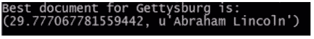

这是亚伯拉罕·林肯！这不是很棒吗？我们只需几行代码就制作了一个真正有效的搜索引擎。

这就是使用 Spark 在 MLlib 和 TF-IDF 中实际工作的搜索算法。美妙的是，如果我们有足够大的集群来运行它，我们实际上可以将其扩展到整个维基百科。

希望我们引起了您对 Spark 的兴趣，您可以看到它如何应用于以分布式方式解决相当复杂的机器学习问题。因此，这是一个非常重要的工具，我希望您在阅读本数据科学书籍时，至少要了解 Spark 如何应用于大数据问题的概念。因此，当您需要超越单台计算机的能力时，请记住，Spark 可以为您提供帮助。

# 使用 Spark 2.0 DataFrame API 进行 MLlib

本章最初是为 Spark 1 制作的，因此让我们谈谈 Spark 2 中的新功能以及 MLlib 现在存在的新功能。

因此，Spark 2 的主要特点是它越来越向 Dataframes 和 Datasets 迈进。有时 Datasets 和 Dataframes 有点交替使用。从技术上讲，Dataframe 是一组行对象的 Dataset，它们有点像 RDD，但唯一的区别在于，RDD 只包含非结构化数据，而 Dataset 具有定义的模式。

Dataset 提前知道每行中存在的信息列以及这些信息的类型。因为它提前知道该 Dataset 的实际结构，所以它可以更有效地优化事物。它还让我们将该 Dataset 的内容视为一个小型数据库，实际上，如果它在集群上，那就是一个非常大的数据库。这意味着我们可以对其执行 SQL 查询等操作。

这创建了一个更高级的 API，我们可以在 Spark 集群上查询和分析大型数据集。这是相当酷的东西。它更快，有更多的优化机会，并且有一个更高级的 API，通常更容易使用。

# Spark 2.0 MLlib 的工作原理

在 Spark 2.0 中，MLlib 正在将数据框架作为其主要 API。这是未来的发展方向，所以让我们看看它是如何工作的。我已经打开了 Canopy 中的`SparkLinearRegression.py`文件，如下图所示，让我们来看一下：

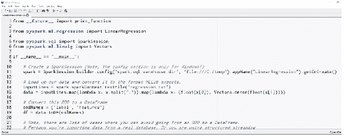

正如你所看到的，首先，我们使用`ml`而不是`MLlib`，这是因为新的基于数据框架的 API 在其中。

# 实施线性回归

在这个例子中，我们要做的是实现线性回归，线性回归只是一种将一条线拟合到一组数据的方法。在这个练习中，我们将使用两个维度中的一堆虚构数据，并尝试用线性模型拟合一条线。

我们将数据分成两组，一组用于构建模型，一组用于评估模型，并比较这个线性模型在实际预测真实值时的表现。首先，在 Spark 2 中，如果要使用`SparkSQL`接口并使用数据集，你必须使用`SparkSession`对象而不是`SparkContext`。要设置一个，你可以这样做：

```py
spark = SparkSession.builder.config("spark.sql.warehouse.dir", "file:///C:/temp").appName("LinearRegression").getOrCreate() 

```

请注意，中间部分只在 Windows 和 Spark 2.0 中才需要。说实话，这是为了解决一个小 bug。所以，如果你在 Windows 上，请确保你有一个`C:/temp`文件夹。如果你想运行这个程序，如果需要的话现在就创建它。如果你不在 Windows 上，你可以删除整个中间部分，留下：`spark = SparkSession.builder.appName("LinearRegression").getOrCreate()`。

好的，所以你可以说`spark`，给它一个`appName`和`getOrCreate()`。

这很有趣，因为一旦你创建了一个 Spark 会话，如果它意外终止，你实际上可以在下次运行时从中恢复。所以，如果我们有一个检查点目录，它可以使用`getOrCreate`在上次中断的地方重新启动。

现在，我们将使用我提供的`regression.txt`文件：

```py
inputLines = spark.sparkContext.textFile("regression.txt")  

```

这只是一个文本文件，其中有两列逗号分隔的值，它们只是两列，或多或少地，线性相关的数据。它可以代表任何你想要的东西。比如，我们可以想象它代表身高和体重。所以，第一列可能代表身高，第二列可能代表体重。

在机器学习的术语中，我们谈论标签和特征，其中标签通常是你要预测的东西，而特征是数据的一组已知属性，你用它来进行预测。

在这个例子中，也许身高是标签，体重是特征。也许我们试图根据你的体重来预测身高。它可以是任何东西，都无所谓。这一切都被归一化到-1 到 1 之间的数据。数据的规模没有真正的意义，你可以假装它代表任何你想要的东西。

要在 MLlib 中使用这个，我们需要将我们的数据转换成它期望的格式：

```py
data = inputLines.map(lambda x: x.split(",")).map(lambda x: (float(x[0]), Vectors.dense(float(x[1]))))  

```

我们要做的第一件事是使用`map`函数将数据拆分成两个不同的值列表，然后将其映射到 MLlib 期望的格式。这将是一个浮点标签，然后是特征数据的密集向量。

在这种情况下，我们只有一个特征数据，即重量，所以我们有一个只包含一个元素的向量，但即使只有一个元素，MLlib 线性回归模型也需要一个密集向量。这就像旧 API 中的`labeledPoint`，但我们必须用更麻烦的方式来做。

接下来，我们需要为这些列实际分配名称。以下是执行此操作的语法：

```py
colNames = ["label", "features"] 
df = data.toDF(colNames) 

```

我们将告诉 MLlib，结果 RDD 中的这两列实际上对应于标签和特征，然后我可以将该 RDD 转换为 DataFrame 对象。此时，我有一个实际的数据框，或者说，一个包含两列标签和特征的数据集，其中标签是浮点高度，特征列是浮点权重的密集向量。这是 MLlib 所需的格式，而 MLlib 对此可能会很挑剔，因此重要的是您注意这些格式。

现在，就像我说的，我们要把我们的数据分成两半。

```py
trainTest = df.randomSplit([0.5, 0.5]) 
trainingDF = trainTest[0] 
testDF = trainTest[1] 

```

我们将在训练数据和测试数据之间进行 50/50 的拆分。这将返回两个数据框，一个用于创建模型，一个用于评估模型。

接下来，我将使用一些标准参数创建我的实际线性回归模型。

```py
lir = LinearRegression(maxIter=10, regParam=0.3, elasticNetParam=0.8) 

```

我们将调用`lir = LinearRegression`，然后我将把该模型拟合到我留出用于训练的数据集上，即训练数据框：

```py
model = lir.fit(trainingDF) 

```

这将使我得到一个模型，我可以用它来进行预测。

让我们继续做吧。

```py
fullPredictions = model.transform(testDF).cache() 

```

我将调用`model.transform(testDF)`，这将根据我的测试数据集中的权重预测身高。我实际上有已知的标签，即实际的正确身高，这将在该数据框中添加一个名为预测的新列，其中包含基于该线性模型的预测值。

我将缓存这些结果，现在我可以提取它们并将它们进行比较。因此，让我们提取预测列，就像在 SQL 中使用`select`一样，然后我将实际转换该数据框并从中提取 RDD，并使用它将其映射到这种情况下的一组浮点高度：

```py
predictions = fullPredictions.select("prediction").rdd.map(lambda x: x[0]) 

```

这些是预测的身高。接下来，我们将从标签列中获取实际的身高：

```py
labels = fullPredictions.select("label").rdd.map(lambda x: x[0]) 

```

最后，我们可以将它们重新组合在一起，然后将它们并排打印出来，看看效果如何：

```py
predictionAndLabel = predictions.zip(labels).collect() 

for prediction in predictionAndLabel: 
    print(prediction) 

spark.stop() 

```

这种方法有点复杂；我之所以这样做是为了与之前的示例保持一致，但更简单的方法是实际上选择预测和标签，将它们合并成一个 RDD，将这两列一起映射出来，然后我就不必将它们合并在一起，但无论哪种方法都可以。您还会注意到，在最后，我们需要停止 Spark 会话。

让我们看看它是否有效。让我们转到工具，Canopy 命令提示符，然后输入`spark-submit SparkLinearRegression.py`，看看会发生什么。

实际上，使用数据集运行这些 API 需要更多的前期时间，但一旦开始，它们就非常快。好了，就是这样。

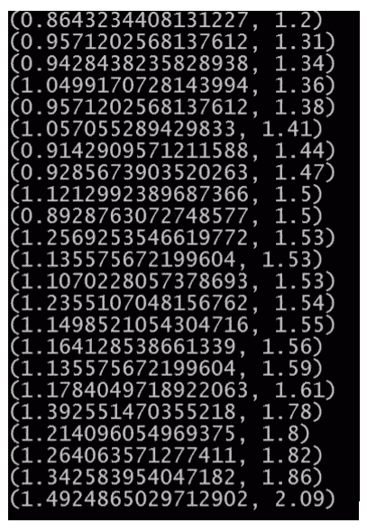

在这里，我们将实际值和预测值并排放在一起，您可以看到它们并不太糟糕。它们往往在同一范围内。就是这样，使用 Spark 2.0 进行线性回归模型，使用 MLlib 的基于新数据框的 API。今后，您将越来越多地使用这些 API 来进行 Spark 中的 MLlib，因此请尽量选择这些 API。好了，这就是 Spark 中的 MLlib，一种实际上可以在整个集群上分发大规模计算任务以处理大型数据集的机器学习方法。这是一个很好的技能。让我们继续。

# 总结

在本章中，我们从安装 Spark 开始，然后深入介绍了 Spark，同时了解了 Spark 与 RDD 的结合工作原理。我们还通过探索不同的操作方式，介绍了创建 RDD 的各种方法。然后我们介绍了 MLlib，并详细介绍了 Spark 中决策树和 K-Means 聚类的一些示例。然后我们通过使用 TF-IDF 仅需几行代码就创建了一个搜索引擎。最后，我们看了一下 Spark 2.0 的新功能。

在下一章中，我们将介绍 A/B 测试和实验设计。
