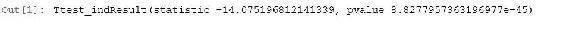
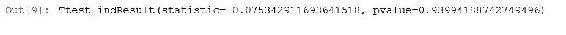
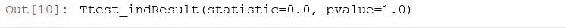

# 第十章：测试和实验设计

在本章中，我们将了解 A/B 测试的概念。我们将深入研究 t 检验、t 统计量和 p 值，这些都是用于确定结果是否真实或是随机变化结果的有用工具。我们将深入一些真实的例子，并用一些 Python 代码进行实践，并计算 t 统计量和 p 值。

接下来，我们将探讨在达成结论之前应该运行实验多长时间。最后，我们将讨论可能影响实验结果并导致您得出错误结论的潜在问题。

我们将涵盖以下主题：

+   A/B 测试概念

+   T 检验和 p 值

+   使用 Python 测量 t 统计量和 p 值

+   确定实验运行时间

+   A/B 测试的陷阱

# A/B 测试概念

如果您在一家网络公司担任数据科学家，您可能会被要求花一些时间分析 A/B 测试的结果。这些基本上是网站上的受控实验，用于衡量给定更改的影响。因此，让我们谈谈 A/B 测试是什么以及它们是如何工作的。

# A/B 测试

如果您将成为一家大型科技网络公司的数据科学家，这是您肯定会参与的事情，因为人们需要进行实验，尝试网站上的不同事物，并衡量其结果，这实际上并不像大多数人认为的那样简单。

什么是 A/B 测试？嗯，这是一个通常在网站上进行的受控实验，也可以应用于其他情境，但通常我们谈论的是网站，并且我们将测试对网站的某些更改的性能，与之前的方式进行比较。

基本上，您有一组*控制*看到旧网站的人，还有一组*测试*看到网站更改的人，这个想法是测量这两组人之间的行为差异，并使用这些数据来实际决定这个更改是否有益。

例如，我拥有一家有网站的企业，我们向人们许可软件，现在我有一个友好的橙色按钮，人们在想购买许可证时点击它，如下图左侧所示。但是，如果我将该按钮的颜色更改为蓝色，如右侧所示，会发生什么？


因此，在这个例子中，如果我想找出蓝色是否更好。我怎么知道呢？

我的意思是，直觉上，也许那可能更能吸引人们的注意，或者直觉上，也许人们更习惯于看到橙色的购买按钮，并更有可能点击它，我可以两种方式来解释，对吧？因此，我的内在偏见或先入之见并不重要。重要的是人们如何对我网站上的这种更改做出反应，这就是 A/B 测试的作用。

A/B 测试将人们分为看到橙色按钮的人和看到蓝色按钮的人，然后我可以测量这两组人之间的行为以及它们可能有何不同，并根据这些数据做出关于按钮颜色的决定。

您可以使用 A/B 测试测试各种事物。这些包括：

+   **设计更改**：这些可以是按钮颜色的更改、按钮的放置位置或页面的布局。

+   **用户界面流程**：因此，也许您实际上正在更改购买流程的方式以及人们在网站上结账的方式，您实际上可以衡量其影响。

+   **算法变更**：让我们考虑在第六章中讨论的电影推荐的例子，*推荐系统*。也许我想测试一个算法与另一个算法。我真正关心的不是依赖于错误指标和我的训练测试能力，而是关心如何在网站上推动购买或租赁或其他任何事情。

+   A/B 测试可以让我直接衡量这种算法对我真正关心的最终结果的影响，而不仅仅是我预测其他人已经看过的电影的能力。

+   还有其他任何您能想到的事情，任何影响用户与您的网站互动的变化都值得测试。也许甚至是使网站更快，或者任何其他事情。

+   **定价变化**：这个有点具有争议性。理论上，您可以使用 A/B 测试尝试不同的价格点，并查看它是否实际增加了销量以抵消价格差异，但是要谨慎使用这个方法。

+   如果顾客得知其他人因为没有好的原因而得到了更优惠的价格，他们就不会对您感到满意。请记住，进行定价实验可能会产生负面反弹，您不希望陷入这种情况。

# A/B 测试的转化测量

在设计网站实验时，您需要弄清楚的第一件事是，您试图优化什么？您真正想通过这个变化推动什么？这并不总是一个非常明显的事情。也许是人们的花费金额，收入的数量。我们已经讨论了使用花费金额的方差问题，但是如果您有足够的数据，很多时候您仍然可以收敛于这个指标。

然而，也许这并不是您真正想要优化的。也许您实际上是故意以亏损的价格销售某些商品，只是为了占领市场份额。您的定价策略比仅仅是顶线收入更加复杂。

也许您真正想要衡量的是利润，这可能是一个非常棘手的事情，因为许多因素会影响产品的盈利，而这些因素可能并不总是显而易见的。如果您有亏损产品，这个实验将忽略这些产品本应产生的效果。也许您只关心在网站上推动广告点击，或者订单数量以减少方差，也许人们对此无所谓。

最重要的是，您必须与正在进行测试的业务所有者交谈，并弄清楚他们试图优化什么。他们被衡量在什么上？他们的成功是如何衡量的？他们的关键绩效指标或者无论 NBAs 想称呼它什么？并确保我们正在衡量对他们来说最重要的事情。

您也可以同时测量多个指标，不必选择一个，实际上可以报告许多不同事物的影响：

+   收入

+   利润

+   点击

+   广告展示次数

如果所有这些事情都朝着正确的方向发展，那就是这种变化在多方面产生了积极影响的非常强有力的迹象。那么，为什么要限制自己只关注一个指标呢？只需确保您知道在实验成功的标准中哪个指标最重要。

# 如何归因转化

另一件需要注意的事情是将转化归因于下游的变化。如果您试图推动的行为不是用户立即在体验到您正在测试的事物后发生的，情况就会变得有些棘手。

假设我改变了 A 页面上按钮的颜色，用户然后转到 B 页面并做了其他事情，最终从 C 页面购买了东西。

那么，谁应该得到这次购买的功劳？是 A 页面，还是 B 页面，还是介于两者之间的某个页面？我是否应根据用户点击次数来折扣转化的功劳？我是否应该丢弃任何不是在看到变化后立即发生的转化行为？这些都是复杂的事情，通过调整您对转化和您正在测量的变化之间的不同距离的计算方式，很容易产生误导性的结果。

# 方差是您的敌人

另一件你需要真正内化的事情是，方差是你进行 A/B 测试时的敌人。

一个非常常见的错误是，那些不懂得如何运用数据科学的人会在网页上进行测试，比如蓝色按钮对比橙色按钮，然后运行一周，然后从每个组中得到平均花费金额。然后他们会说：“哦看！平均而言，点击蓝色按钮的人比点击橙色按钮的人多花了一美元；蓝色太棒了，我喜欢蓝色，我要在整个网站上都用蓝色了！”

但实际上，他们可能只是看到了购买的随机变化。他们没有足够大的样本，因为人们不倾向于购买很多。你的网站可能有很多浏览量，但与此相比，你可能没有很多购买量，而且这些购买金额可能有很大的差异，因为不同的产品成本不同。

因此，如果你不了解这些结果对方差的影响，你很容易做出错误的决定，最终会让你的公司损失金钱，而不是赚钱。我们将在本章后面讨论一些测量和考虑这一点的主要方法。

你需要确保你的业务所有者明白这是一个重要的影响，你需要在进行 A/B 测试或者在网站上进行的任何实验之后，做出商业决策之前，对其进行量化和理解。

有时候你需要选择一个方差较小的转化指标。可能是你网站上的数字意味着你必须运行多年的实验才能得到一个基于收入或花费金额的显著结果。

有时，如果你正在观察多个指标，比如订单金额或订单数量，它的方差较小，你可能会在订单数量上看到信号，而在收入上看不到信号，例如。最终，这取决于判断。如果你看到订单数量有显著增加，而收入增长不那么显著，那么你必须说：“嗯，我认为这里可能有一些真实和有益的事情发生。”

然而，统计和数据大小能告诉你的唯一的是，一个效应是真实的概率。最终，你必须决定它是否是真实的。所以，让我们更详细地讨论如何做到这一点。

这里的关键是，仅仅看平均值的差异是不够的。当你试图评估实验结果时，你需要考虑方差。

# t 检验和 p 值

A/B 测试产生的变化是否真的是你所改变的结果，还是只是随机变化？嗯，我们有一些统计工具可以使用，叫做 t 检验或 t 统计量，以及 p 值。让我们更多地了解一下它们是什么，以及它们如何帮助你确定一个实验是否有效。

目标是弄清楚一个结果是否是真实的。这只是数据本身固有的随机变化的结果，还是我们看到了控制组和测试组之间的实际、统计显著的行为变化？t 检验和 p 值是计算这一点的一种方法。

记住，“统计显著性”并没有一个具体的含义。最终，这必须是一个判断。你必须选择一个概率值，你会接受一个结果是真实的或不真实的。但仍然会有可能是随机变化的结果，你必须确保你的利益相关者明白这一点。

# t 统计量或 t 检验。

让我们从**t-统计**开始，也被称为 t-检验。它基本上是衡量这两组行为之间的差异的一种方式，即你的控制组和处理组之间的差异，以标准误差的单位表示。它基于标准误差，考虑了数据本身固有的方差，因此通过将一切都标准化为标准误差，我们得到了一些考虑到方差的这两组行为变化的度量。

解释 t-统计的方法是，高 t 值意味着这两组之间可能存在真正的差异，而低 t 值意味着差异不大。你必须决定你愿意接受的门槛是多少？t-统计的符号将告诉你这是一个正向还是负向的变化。

如果你将你的控制组与处理组进行比较，最终得到一个负的 t-统计，这意味着这是一个不好的改变。你最终希望 t-统计的绝对值很大。什么样的 t-统计值被认为是大的？这是有争议的。我们很快会看一些例子。

现在，这假设了你有一个正态分布的行为，当我们谈论人们在网站上的花费时，这通常是一个合理的假设。人们的花费往往有一个正态分布。

然而，还有更精细的 t-统计的版本，你可能想要针对其他特定情况进行研究。例如，当你谈论点击率时，有一种叫做**费舍尔精确检验**的东西，当你谈论每个用户的交易时，比如他们看了多少网页，有**E-检验**，还有**卡方检验**，通常与订单数量有关。有时你会想要查看给定实验的所有这些统计数据，并选择最适合你所尝试做的事情的那个。

# p 值

现在，谈论 p 值比 t-统计要容易得多，因为你不必考虑，我们谈论多少个标准偏差？实际值是什么意思？p 值对人们来说更容易理解，这使得它成为一个更好的工具，用来向你业务中的利益相关者传达实验结果。

p 值基本上是这个实验满足零假设的概率，也就是说，控制组和处理组的行为之间没有真正的差异的概率。低 p 值意味着它没有影响的概率很低，有点双重否定的意思，所以这有点反直觉，但最终你只需要明白，低 p 值意味着你的改变有真正的影响的概率很高。

你想要看到的是高 t-统计和低 p-值，这将意味着显著的结果。现在，在你开始实验之前，你需要决定你的成功门槛是多少，并且这意味着与业务负责人一起决定门槛。

那么，你愿意接受什么样的 p 值作为成功的衡量标准？是 1%？是 5%？再次强调，这基本上是没有真正效应的可能性，只是随机方差的结果。这最终是一个判断。很多时候人们使用 1%，有时如果他们感觉有点冒险，他们会使用 5%，但总会有那种可能性，你的结果只是偶然的，是随机数据。

然而，你可以选择愿意接受的概率，认为这是一个真正的效应，值得投入生产。

当你的实验结束时，我们稍后会讨论何时宣布实验结束，你需要测量你的 p 值。如果它小于你决定的阈值，那么你可以拒绝零假设，并且可以说“嗯，有很高的可能性，这种变化产生了真正的正面或负面结果。”

如果结果是正面的，那么你可以将这种变化推广到整个网站，它不再是一个实验，而是你网站的一部分，希望随着时间的推移能给你带来更多的收入，如果结果是负面的，你希望在它给你造成更多损失之前摆脱它。

记住，当你的实验结果是负面的时候，运行 A/B 测试是有真正成本的。所以，你不想运行太长时间，因为有可能会亏钱。

这就是为什么你要每天监控实验结果，所以如果有早期迹象表明这种变化对网站造成了可怕的影响，也许有 bug 或者其他可怕的东西，你可以在必要时提前终止它，并限制损失。

让我们看一个实际的例子，看看如何使用 Python 测量 t 统计量和 p 值。

# 使用 Python 测量 t 统计量和 p 值

让我们制造一些实验数据，并使用 t 统计量和 p 值来确定给定实验结果是否是真实效果。我们将实际制造一些假的实验数据，并对它们进行 t 统计量和 p 值的计算，看看它是如何工作的，以及如何在 Python 中计算它。

# 在一些实验数据上运行 A/B 测试

假设我们在一个网站上运行 A/B 测试，我们已经随机将用户分为两组，A 组和 B 组。A 组将成为我们的测试对象，我们的处理组，而 B 组将成为我们的对照组，基本上是网站以前的样子。我们将使用以下代码设置这个：

```py
import numpy as np 
from scipy import stats 

A = np.random.normal(25.0, 5.0, 10000) 
B = np.random.normal(26.0, 5.0, 10000) 

stats.ttest_ind(A, B) 

```

在这个代码示例中，我们的处理组（A）将具有随机分布的购买行为，他们平均每笔交易花费 25 美元，标准差为五，样本量为一万，而旧网站的平均每笔交易为 26 美元，标准差和样本量相同。我们基本上在看一个实验结果是负面的实验。要计算 t 统计量和 p 值，你只需要使用 `scipy` 中的 `stats.ttest_ind` 方法。你只需要将处理组和对照组传递给它，就会得到 t 统计量，如下图所示：



在这种情况下，我们有一个 t 统计量为 -14。负号表示这是一个负面的变化，这是一件坏事。而 p 值非常非常小。因此，这意味着这种变化是由随机机会产生的可能性极低。

记住，为了宣布显著性，我们需要看到一个高 t 值 t 统计量和一个低 p 值。

这正是我们在这里看到的，我们看到 -14，这是一个非常高的 t 统计量的绝对值，负号表示这是一件坏事，而极低的 P 值告诉我们，几乎没有可能这只是随机变化的结果。

如果你在现实世界中看到这些结果，你会尽快终止这个实验。

# 当两组之间没有真正的差异时

作为一个理智的检查，让我们改变一下，使得这两组之间没有真正的差异。所以，我要改变 B 组，在这种情况下是对照组，使其与处理组相同，其中均值为 25，标准差不变，样本量也不变，如下所示：

```py
B = np.random.normal(25.0, 5.0, 10000) 

stats.ttest_ind(A, B) 

```

如果我们继续运行这个实验，你会看到我们的 t 检验结果现在低于一： 


请记住，这是标准差的问题。因此，这意味着除非我们的 p 值更高，超过 30%，否则那里可能没有真正的变化。

现在，这些仍然是相对较高的数字。您可以看到随机变化可能是一种隐匿的东西。这就是为什么您需要提前决定 p 值的可接受限制。

您知道，您事后可能会看到这一点并说，“30%的几率，你知道，那还不错，我们可以接受”，但是，实际上，您希望看到的是低于 5%的 p 值，理想情况下是低于 1%，而 30%的值意味着实际上并不是一个强有力的结果。因此，不要在事后为其辩护，进入实验时要知道您的阈值是多少。

# 样本量是否有影响？

让我们对样本量进行一些更改。我们在相同条件下创建这些集合。让我们看看通过增加样本量是否实际上会在行为上产生差异。

# 样本量增加到六位数

所以，我们将从`10000`增加到`100000`个样本，如下所示：

```py
A = np.random.normal(25.0, 5.0, 100000) 
B = np.random.normal(25.0, 5.0, 100000) 

stats.ttest_ind(A, B) 

```

在以下输出中，您可以看到实际上 p 值略低，t 检验略高，但仍不足以宣布真正的差异。它实际上是朝着你不希望的方向发展的？挺有趣的！


但这些仍然是高值。再次强调，这只是随机变异的影响，它可能比您意识到的要大。特别是在网站上，当您谈论订单金额时。

# 样本量增加到七位数

让我们将样本量实际增加到`1000000`，如下所示：

```py
A = np.random.normal(25.0, 5.0, 1000000) 
B = np.random.normal(25.0, 5.0, 1000000) 

stats.ttest_ind(A, B) 

```

这是结果：



那会有什么影响呢？现在，我们的 t 统计量又低于 1，而我们的值约为 35%。

随着样本量的增加，我们会看到这种波动在某种程度上有所变化。这意味着从 10000 个样本增加到 100000 个样本再到 1000000 个样本，最终结果不会改变。进行这种实验是了解您可能需要运行实验的时间的一种好方法。需要多少样本才能得到显著结果？如果您事先了解数据的分布情况，您实际上可以运行这些模型。

# A/A 测试

如果我们将集合与自身进行比较，这被称为 A/A 测试，如下面的代码示例所示：

```py
stats.ttest_ind(A, A) 

```

我们可以在以下输出中看到，t 统计量为`0`，p 值为`1.0`，因为实际上这些集合之间根本没有任何差异。



现在，如果您使用真实的网站数据进行运行，您观察到相同的人群并且看到不同的值，这表明您运行测试的系统本身存在问题。归根结底，就像我说的，这都是一种判断。

继续尝试，看看不同标准差对初始数据集或均值差异以及不同样本量的影响。我只是希望您深入研究，尝试运行这些不同的数据集，看看它们对 t 统计量和 p 值的影响。希望这能让您更直观地理解如何解释这些结果。

再次强调的重要一点是，您要寻找一个较大的 t 统计量和一个较小的 p 值。P 值可能是您想要向业务传达的内容。记住，p 值越低越好，最好在单个数字以下，理想情况下在 1%以下，然后再宣布胜利。

我们将在本章的其余部分更多地讨论 A/B 测试。SciPy 使得计算给定数据集的 t 统计量和 p 值变得非常容易，因此你可以非常容易地比较控制组和处理组之间的行为，并测量这种效果是真实的概率还是仅仅是随机变化的结果。确保你关注这些指标，并且在进行比较时测量你关心的转化指标。

# 确定运行实验的时间长短

你运行实验多长时间？实际上要得到结果需要多长时间？在什么时候放弃？让我们更详细地讨论一下。

如果你公司的某人开发了一个新的实验，一个他们想要测试的新变化，那么他们对于看到它成功有着切身利益。他们投入了大量的工作和时间，他们希望它能够成功。也许你已经进行了几周的测试，但仍然没有在这个实验上取得显著的结果，无论是积极的还是消极的。你知道他们会希望继续无限期地运行它，希望最终能够显示出积极的结果。你需要决定你愿意运行这个实验多长时间。

我怎么知道何时结束 A/B 测试？我的意思是，预测在你能够取得显著结果之前需要多长时间并不总是直截了当的，但显然，如果你取得了显著结果，如果你的 p 值已经低于 1%或 5%或你选择的任何阈值，那么你就结束了。

在那一点上，你可以中止实验，要么更广泛地推出变化，要么移除它，因为它实际上产生了负面影响。你总是可以告诉人们重新尝试，利用他们从实验中学到的东西，也许做一些改变再试一次，减轻一点打击。

另一种可能发生的情况是根本没有收敛。如果你在 p 值上没有看到任何趋势，那可能是一个好迹象，表明你不会很快看到这种收敛。无论你运行多长时间，它都不会对行为产生足够的影响，甚至无法测量。

在这些情况下，你每天想做的是为给定实验绘制一个图表，显示 p 值、t 统计量，或者你用来衡量这个实验成功的任何东西，如果你看到一些有希望的东西，你会发现 p 值随着时间的推移而下降。因此，它获得的数据越多，你的结果就应该变得更加显著。

现在，如果你看到的是一条平直的线，或者一条到处都是的线，那就告诉你 p 值不会有任何变化，无论你运行这个实验多长时间，它都不会发生。你需要事先达成一致，即在你没有看到 p 值的任何趋势的情况下，你愿意运行这个实验多长时间？是两周？还是一个月？

另一件需要记住的事情是，同时在网站上运行多个实验可能会混淆你的结果。

实验所花费的时间是一种宝贵的资源，你无法在世界上创造更多的时间。在一年内，你只能运行尽可能多的实验。因此，如果你花费太多时间运行一个几乎没有机会收敛到结果的实验，那么你就错过了在这段时间内运行另一个潜在更有价值的实验的机会。

在实验链接上划清界限是很重要的，因为当你在网站上进行 A/B 测试时，时间是非常宝贵的，至少在你有更多的想法而没有时间的情况下，这种情况希望是存在的。确保你在进行给定实验测试的时间上设定了上限，如果你没有看到 p 值中令人鼓舞的趋势，那么就是时候停止实验了。

# A/B 测试的陷阱

我想要强调的一个重要观点是，即使你使用 p 值以一种合理的方式来衡量 A/B 测试的结果，这也不是绝对的。有很多因素实际上可能会扭曲你实验的结果，并导致你做出错误的决定。让我们来看看 A/B 测试中的一些陷阱，以及如何注意避免它们。让我们谈谈 A/B 测试的一些陷阱。

说一个实验的 p 值为 1%，听起来很正式，意味着某个实验结果是由偶然结果或随机变化引起的可能性只有 1%，但这仍然不是衡量实验成功的全部和终极标准。有很多因素可能会扭曲或混淆你的结果，你需要意识到这一点。所以，即使你看到一个非常令人鼓舞的 p 值，你的实验仍然可能在欺骗你，你需要了解可能导致这种情况发生的因素，以免做出错误的决定。

记住，相关性不意味着因果关系。

即使进行了精心设计的实验，你只能说这种效果有一定的概率是由你所做的改变引起的。

最终，总会有可能没有真正的效果，或者你甚至可能在测量错误的效果。这可能仍然是随机事件，可能还有其他事情发生，你有责任确保业主明白这些实验结果需要被解释，它们只是决策的一部分。

它们不能成为他们决策的全部和终极标准，因为结果中存在误差，并且有可能扭曲这些结果。如果这种改变还有一些更大的商业目标，而不仅仅是驱动短期收入，那么这也需要考虑在内。

# 新奇效应

一个问题是新奇效应。A/B 测试的一个主要弱点是它们倾向于运行的短时间范围，这会导致一些问题。首先，改变可能会产生长期效果，而你无法测量到这些效果，但也有一定效果，因为网站上的某些东西变得与众不同。

例如，也许你的客户习惯于在网站上一直看到橙色按钮，如果出现蓝色按钮，它会因为与众不同而吸引他们的注意。然而，随着新客户的到来，他们从未见过你的网站，他们不会注意到这种不同，随着时间的推移，即使是你的老客户也会习惯新的蓝色按钮。很可能，如果你在一年后进行同样的测试，结果可能没有任何差异，或者可能会相反。

我很容易能想象到这样一种情况：你测试橙色按钮和蓝色按钮，前两周蓝色按钮获胜。人们购买更多，因为他们更喜欢它，因为它与众不同。但一年过去了，我可能可以再次进行实验，将蓝色按钮与橙色按钮对比，橙色按钮会再次获胜，仅仅因为橙色按钮与众不同，新颖，吸引人们的注意力。

因此，如果你做出了一些有争议的改变，最好的办法是稍后重新运行实验，看看是否能够复制其结果。这实际上是我知道的唯一解决新奇效应的方法；当它不再新奇时再次进行测量，当它不再只是因为不同而吸引人们注意的改变时。

我真的无法低估理解这一点的重要性。这可能会扭曲很多结果，使你倾向于将积极的变化归因于那些实际上并不值得的事情。在这种情况下，仅仅因为与众不同并不是一种美德。

# 季节性影响

如果你在圣诞节期间进行实验，人们的行为不会像在其他时间一样。他们在那个季节的花钱方式肯定不同，他们在家里花更多时间，可能有点放松，所以人们的心态不同。

这甚至可能与天气有关，夏天人们的行为会有所不同，因为天气炎热，他们感到有点懒散，更经常度假。也许如果你碰巧在高人口密集地区的一次可怕风暴期间进行实验，这也可能会扭曲你的结果。

再次，只需注意潜在的季节性影响，节假日是需要注意的重要因素，如果实验是在已知具有季节性的时间段运行的，那么始终要以一颗谨慎的心对待你的经验。

你可以通过定量方法来确定这一点，实际上观察你试图衡量的指标作为成功指标的行为，无论你称之为什么，你的转化指标，然后观察它在去年同一时间段的行为。你是否看到每年都有季节性波动？如果是这样，你就要尽量避免在这些高峰或低谷期间进行实验。

# 选择偏差

另一个可能会扭曲你的结果的潜在问题是选择偏差。非常重要的是，顾客被随机分配到你的对照组或处理组，你的 A 组或 B 组。

然而，有微妙的方式使得那种随机分配实际上可能并不那么随机。例如，假设你正在对顾客 ID 进行哈希处理，以将它们放入一个桶中。也许在哈希函数如何影响较低顾客 ID 和较高顾客 ID 的人之间存在一些微妙的偏差。这可能导致将所有长期忠诚的顾客放入对照组，将那些不太了解你的新顾客放入处理组。

那时你所测量的只是老客户和新客户之间的行为差异。审计你的系统非常重要，以确保在将人们分配到对照组或处理组时没有选择偏差。

你还需要确保分配是固定的。如果你在整个会话期间测量了一项变化的影响，你需要测量他们是否在 A 页面看到了变化，但是在 C 页面上他们实际上进行了转化，你必须确保他们在这些点击之间没有切换组。因此，你需要确保在给定的会话中，人们保持在同一组中，而如何定义一个会话也可能变得有点模糊。

这些都是使用像 Google 实验、Optimizely 或类似公司的成熟现成框架可以帮助解决的问题，这样你就不必在所有这些问题上重新发明轮子。如果你的公司有自己开发的内部解决方案，因为他们不愿意与外部公司分享数据，那么审计是否存在选择偏差是值得的。

# 审计选择偏差问题

审计选择偏差问题的一种方法是运行所谓的 A/A 测试，就像我们之前看到的那样。因此，如果你实际上进行了一个实验，处理组和对照组之间没有差异，你不应该在最终结果中看到差异。当你比较这两个事物时，行为不应该有任何改变。

A/A 测试可以是测试你的 A/B 框架本身的好方法，并确保没有固有的偏见或其他问题，例如会话泄漏等，这些都需要解决。

# 数据污染

另一个大问题是数据污染。我们详细讨论了清理输入数据的重要性，尤其是在 A/B 测试的背景下。如果你的网站上有一个机器人，一个恶意的网络爬虫一直在爬取你的网站，进行不自然的交易量，会发生什么？如果那个机器人最终被分配到处理组或对照组呢？

一个机器人可能会扭曲你实验的结果。研究进入你的实验的输入非常重要，寻找异常值，然后分析这些异常值，以及它们是否应该被排除。你是否真的让一些机器人泄漏到你的测量中，并且它们是否扭曲了你实验的结果？这是一个非常常见的问题，你需要意识到这一点。

有恶意的机器人存在，有人试图入侵你的网站，也有善意的爬虫只是为了搜索引擎或其他目的爬取你的网站。网站上存在各种奇怪的行为，你需要过滤掉这些行为，找到真正的客户，而不是这些自动脚本。这实际上可能是一个非常具有挑战性的问题。这也是使用像 Google Analytics 这样的现成框架的另一个原因，如果你可以的话。

# 归因错误

我们之前简要谈到了归因错误。如果你实际上使用了变化的下游行为，那就会涉及到一个灰色地带。

你需要了解如何根据距离的函数来计算这些转化，并与你的业务利益相关者事先达成一致，以确定你将如何衡量这些影响。你还需要意识到，如果你同时运行多个实验，它们是否会相互冲突？是否存在页面流，使得某人可能在同一会话中遇到两个不同的实验？

如果是这样，那将是一个问题，你必须根据自己的判断力来判断这些变化是否会以某种有意义的方式相互干扰，并以某种有意义的方式影响客户的行为。同样，你需要对这些结果持保留态度。有很多因素可能会使结果产生偏差，你需要意识到这一点。只要意识到这一点，并确保你的业务所有者也意识到 A/B 测试的局限性，一切都会没问题的。

此外，如果你没有足够长的时间来进行实验，你需要对这些结果持保留态度，并在以后的不同时间段进行重新测试。

# 总结

在本章中，我们讨论了什么是 A/B 测试以及围绕它们的挑战。我们举了一些例子，说明了如何使用 t 统计量和 p 值指标来测量方差的影响，并介绍了使用 Python 进行 t 检验的编码和测量。然后我们讨论了 A/B 测试的短期性质及其局限性，例如新奇效应或季节效应。

这也是我们在这本书中的时间。恭喜你走到这一步，这是一个严肃的成就，你应该为自己感到自豪。我们在这里涵盖了很多材料，我希望你至少理解了这些概念，并且对今天数据科学中使用的大多数技术有一些实际经验。这是一个非常广泛的领域，所以我们触及了一点点所有的东西。所以，再次恭喜。

如果你想在这个领域进一步发展你的职业，我真的鼓励你和你的老板谈谈。如果你在一家公司工作，这家公司有自己的一些有趣的数据集，看看你能否玩弄一下。显然，在你使用公司拥有的任何数据之前，你需要先和老板谈一下，因为可能会有一些围绕它的隐私限制。你要确保你没有侵犯公司客户的隐私，这可能意味着你只能在工作场所的受控环境中使用或查看这些数据。所以，在你这样做的时候要小心。

如果你能得到实际在工作中加班几天，并且玩弄一些这些数据集，看看你能做些什么，这不仅表明你有主动性让自己成为一个更好的员工，你可能会发现一些对你的公司有价值的东西，这可能会让你看起来更好，甚至可能导致内部调动，也许是进入一个与你想要发展职业方向更直接相关的领域。

所以，如果你想从我这里得到一些职业建议，我经常被问到的一个常见问题是，“嘿，我是一名工程师，我想更多地涉足数据科学，我该怎么做？”最好的方法就是去做，你知道，实际做一些副业项目，并展示你能做到，并从中展示一些有意义的结果。向你的老板展示，并看看它会带你去哪里。祝你好运。
