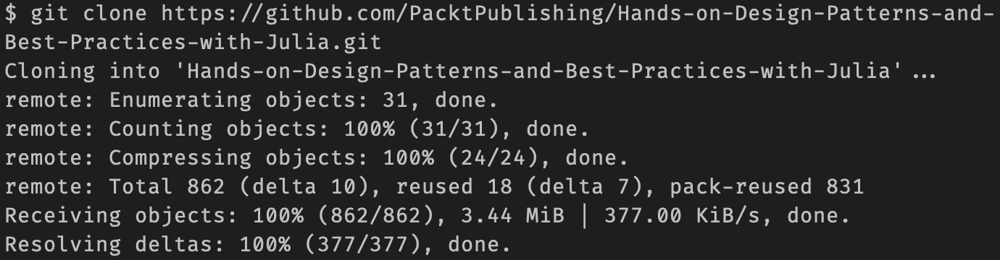
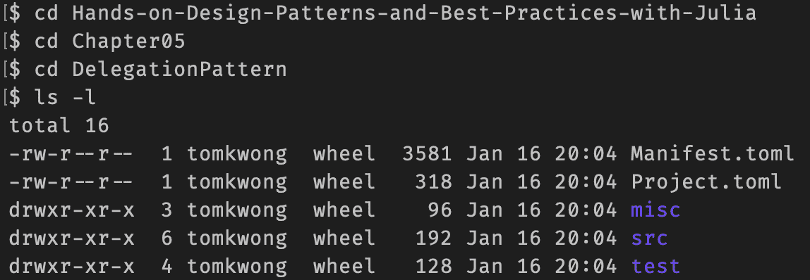
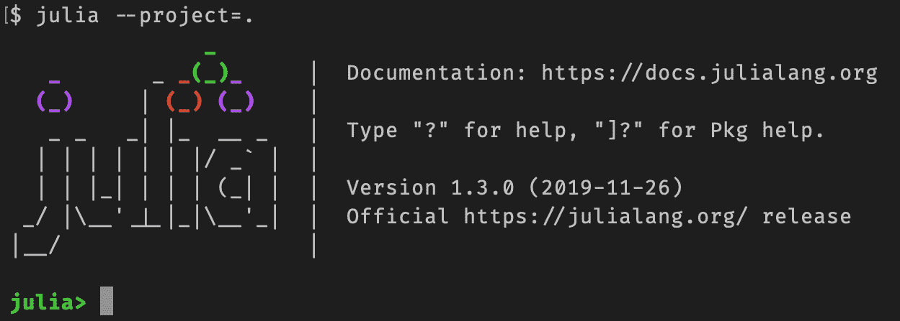
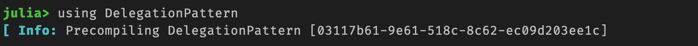
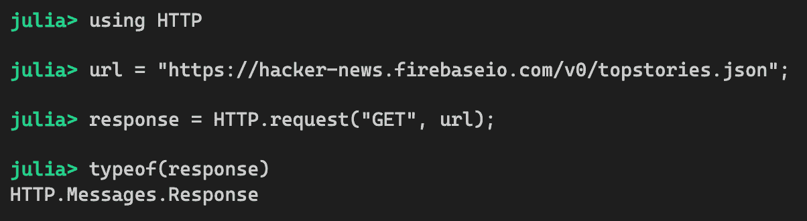

# 前言

Julia 是一种强大的编程语言，旨在通过考虑开发者的生产力来启用高性能应用。其动态特性允许你快速进行小规模实验，然后迁移到大型应用。其内省工具允许我们通过分析高级代码如何转换为低级指令和机器代码来优化性能。其元编程功能帮助更高级的程序员为特定领域使用构建自定义语法。其多分派和泛型函数特性使得通过扩展现有函数来构建新功能变得容易。由于这些以及其他许多原因，Julia 是开发跨多个行业应用的一个优秀工具。

本书满足了 Julia 开发者的一些需求。*希望编写更好的代码。希望提高系统性能。希望设计易于维护的软件。*从 Julia 语言诞生到 2018 年 8 月达到令人瞩目的 1.0 版本里程碑，许多设计模式已经从最聪明的大脑中涌现出来，从语言的核心开发者到语言的重度使用者。有时，这些模式在博客文章和会议上展示。有时，它们出现在 Julia Discourse 论坛的随机讨论线程中。有时，它们在社区成员在各种 Julia Slack 频道上的闲聊中出现。这本书是这些模式的集合，记录了设计高质量 Julia 应用程序的最佳方法。

本书的主要目标是将这些经过充分验证的模式组织成 Julia 开发者社区易于消费的格式。组织并命名这些模式有以下几个好处：

+   它使开发者之间更容易沟通。

+   它使开发者能够更好地理解使用这些模式的代码。

+   它使开发者能够更清晰地表达何时应该应用模式。

这本书的目标简单但强大——在阅读这本书之后，你应该对如何在 Julia 中设计和开发软件有更多的了解。此外，本书中介绍的材料可以作为任何关于 Julia 中设计模式的未来讨论的参考。正如我们从历史中得知的那样，随着 Julia 语言的持续发展，新的设计模式将继续出现。

希望你喜欢这本书。*祝您阅读愉快！*

# 本书面向的对象

这本书是为那些想要提高编写适用于大型应用的*惯用*Julia 代码的初学者到中级开发者而写的。这不是一本入门书，因此你应具备一些基本的编程知识。如果你熟悉面向对象编程范式，那么你可能会发现这本书很有帮助，因为它展示了在 Julia 中如何以不同的方式解决相同的问题，并且通常以更好的方式解决。

本书描述的许多模式适用于任何行业领域和用例。无论你是数据科学家、研究人员、系统程序员还是企业应用开发者，你都应该能够在你的项目中从使用这些模式中受益。

# 本书涵盖的内容

第一章，*设计模式及相关原则*，介绍了设计模式的历史以及它们在开发应用程序中的用途。它涵盖了适用于任何编程语言和范式的几个行业标准软件设计原则。

第二章，*模块、包和数据类型概念*，讨论了如何组织更大的程序以及如何管理依赖关系。然后，它解释了如何开发新的数据类型以及如何在自定义类型层次结构中表达它们之间的关系。

第三章，*设计和接口设计*，解释了函数是如何定义的以及多态是如何发挥作用的。它还讨论了参数方法和接口，不同的函数可以根据预先确定的合同相互正确地工作。

第四章，*宏和元编程技术*，介绍了宏编程功能以及如何将其用于将源代码转换为不同的形式。它描述了开发宏和调试宏的几种更有效的方法。

第五章，*可重用性模式*，涵盖了与代码重用相关的模式。这包括通过组合重用代码的委派模式，用于更正式接口合同的圣洁特质模式，以及用于从参数化数据结构创建新类型的参数类型模式。

第六章，*性能模式*，涵盖了与提高系统性能相关的模式。这包括用于提高类型稳定性的全局常量模式，用于缓存先前计算结果的记忆化模式，用于重新排列数据以实现更优布局的数组结构模式，用于通过并行计算优化内存使用的共享数组模式，以及通过函数专业化提高性能的屏障函数模式。

第七章，*可维护性模式*，涵盖了关于代码可维护性的设计模式。这包括用于更好地组织大型代码库的子模块模式，用于创建可以更轻松构建的数据类型的关键字定义模式，用于用更少的代码定义许多类似函数的代码生成模式，以及用于为特定领域创建新语法的领域特定语言模式。

第八章，*鲁棒性模式*，涵盖了帮助你编写更安全代码的设计模式。这包括提供对字段的标准访问的访问器模式，控制对字段访问的属性模式，限制变量作用域的 Let-Block 模式，以及处理错误的异常处理模式。

第九章，*杂项模式*，涵盖了不属于前面类别的几个设计模式。它包括用于动态分派的 Singleton Type 模式，用于构建隔离测试的 Mocking 模式，以及用于构建线性数据处理管道的 Functional Pipe 模式。

第十章，*反模式*，涵盖了应该避免的模式。主要反模式是盗版，它涉及为不属于你的数据类型定义或扩展函数。然后，它涵盖了窄参数和非具体类型字段模式，这些模式会阻碍系统性能。

第十一章，*传统面向对象模式*，涵盖了 Gang-of-Four 的*设计模式*书中描述的传统面向对象模式。它讨论了这些模式如何在 Julia 中简化或以不同的方式实现。

第十二章，*继承与变异性*，讨论了 Julia 如何支持继承以及为什么它被设计成这样，因为它的方法与主流面向对象编程语言截然不同。然后，它涵盖了类型变异性这一重要概念，这是在多分派使用的数据类型之间的子类型关系中的一个重要概念。

# 要充分利用本书

你应该从 Julia 语言网站（[`julialang.org/`](https://julialang.org/)）下载最新版本的 Julia。

代码示例可在 GitHub 上找到，如每章*技术要求*部分所述。在编写本文时，代码已用 Julia 版本 1.3.0 进行测试。要下载代码示例，请按以下步骤从 GitHub 克隆项目：



鼓励你运行并实验本书附带的代码示例。代码示例通常存储在以下格式之一中：

+   Julia 源文件中的代码片段。这些片段可以被复制并粘贴到 REPL 中。

+   存储在包目录中的代码。该包可以按以下方式实例化：

例如，在第五章，*重用模式*中，内容如下所示：



要使用`DelegationPattern`的代码，只需在该文件夹中启动 Julia REPL 并使用`--project=.`命令行参数：



然后，进入包模式，通过输入`] instantiate`命令实例化包：


之后，您可以使用包像平常一样：



如果有测试目录，则可以读取和运行提供的测试脚本。

# 下载示例代码文件

您可以从[www.packt.com](http://www.packt.com)的账户下载本书的示例代码文件。如果您在其他地方购买了本书，您可以访问[www.packtpub.com/support](https://www.packtpub.com/support)，并注册以将文件直接通过电子邮件发送给您。

您可以通过以下步骤下载代码文件：

1.  在[www.packt.com](http://www.packt.com)登录或注册。

1.  选择支持选项卡。

1.  点击代码下载。

1.  在搜索框中输入书籍名称，并遵循屏幕上的说明。

文件下载后，请确保使用最新版本的软件解压或提取文件夹：

+   Windows 系统上的 WinRAR/7-Zip

+   Mac 系统上的 Zipeg/iZip/UnRarX

+   Linux 系统上的 7-Zip/PeaZip

本书代码包也托管在 GitHub 上，地址为[`github.com/PacktPublishing/Hands-on-Design-Patterns-and-Best-Practices-with-Julia`](https://github.com/PacktPublishing/Hands-on-Design-Patterns-and-Best-Practices-with-Julia)。如果代码有更新，它将在现有的 GitHub 仓库中更新。

我们还有其他来自我们丰富图书和视频目录的代码包可供选择，请访问**[`github.com/PacktPublishing/`](https://github.com/PacktPublishing/)**。查看它们！

# 代码实战

访问以下链接查看代码实战视频：

[`bit.ly/36Z4oXs`](http://bit.ly/36Z4oXs)

# 使用的约定

本书使用了多种文本约定。

`CodeInText`：表示文本中的代码单词，如变量名、函数名、数据类型等。例如，“`format`函数接受一个`formatter`和一个数值`x`，并返回一个格式化的字符串。”

代码块设置如下：

```py
abstract type Formatter end
struct IntegerFormatter <: Formatter end
struct FloatFormatter <: Formatter end
```

任何实验或 REPL 的输出都作为截图展示：



**粗体**：表示一个重要的单词或概念。例如，“**桥接模式**用于将抽象与其实现解耦，以便它可以独立演变。”

*斜体*：强调将在文本中稍后解释的新概念。例如，“前几章中提出的案例包括我们可以通过编写*惯用*Julia 代码解决的问题。”

重要提示看起来像这样。

技巧和窍门看起来像这样。

# 联系我们

我们欢迎读者的反馈。

**一般反馈**：如果您对本书的任何方面有疑问，请在邮件主题中提及书籍标题，并通过`customercare@packtpub.com`给我们发邮件。

**勘误**：尽管我们已经尽最大努力确保内容的准确性，但错误仍然可能发生。如果您在这本书中发现了错误，我们将非常感激您能向我们报告。请访问[www.packtpub.com/support/errata](https://www.packtpub.com/support/errata)，选择您的书籍，点击勘误提交表单链接，并输入详细信息。

**盗版**：如果您在互联网上发现任何形式的我们作品的非法副本，如果您能提供位置地址或网站名称，我们将不胜感激。请通过`copyright@packt.com`与我们联系，并附上材料的链接。

**如果您有兴趣成为作者**：如果您在某个领域有专业知识，并且您有兴趣撰写或为书籍做出贡献，请访问[authors.packtpub.com](http://authors.packtpub.com/)。

# 评论

请留下评论。一旦您阅读并使用过这本书，为何不在购买它的网站上留下评论呢？潜在读者可以查看并使用您的客观意见来做出购买决定，我们 Packt 可以了解您对我们产品的看法，我们的作者也可以看到他们对书籍的反馈。谢谢！

想了解更多关于 Packt 的信息，请访问 [packt.com](http://www.packt.com/)。
