# 第二章：模块、包和数据类型概念

本章讨论了开发大型应用程序的几种组织技术。信不信由你，这通常是容易被忽视的事情。在开发应用程序时，我们通常专注于构建数据类型、函数、控制流等。然而，正确组织代码同样重要，以便它既干净又易于维护。

在本章的后期部分，我们将介绍 Julia 的类型系统。数据类型是任何应用程序最基本的建设模块。与其它编程语言相比，Julia 的类型系统是其最强大的特性之一。对类型系统的深入了解将使我们能够实现更好的设计。

本章将涵盖以下主题：

+   开发应用程序的成长之痛

+   与命名空间、模块和包一起工作

+   管理包依赖

+   设计抽象类型和具体类型

+   理解参数化类型

+   在数据类型之间进行转换

到本章结束时，你应该知道如何创建自己的包，将代码划分为独立的模块，并为你的应用程序开始创建新的数据类型。

让我们开始吧！

# 技术要求

本章的示例源代码位于 [`github.com/PacktPublishing/Hands-on-Design-Patterns-and-Best-Practices-with-Julia/tree/master/Chapter02`](https://github.com/PacktPublishing/Hands-on-Design-Patterns-and-Best-Practices-with-Julia/tree/master/Chapter02)。

代码在 Julia 1.3.0 环境中进行了测试。

# 开发应用程序的成长之痛

"从你所在之处开始。利用你所拥有的。做你能做的。"

- 亚瑟·阿什

每个人的旅程都是不同的。Julia 是一种多才多艺、动态的编程语言，可以用于许多有趣的用例。更具体地说，你可以用它轻松地编码和解决问题，而不必过多地考虑系统架构和设计。这对于小型研究项目通常是足够的；然而，当项目对业务变得更为关键，或者你必须将一个概念验证硬化为生产环境时，它需要更好的组织、架构和设计，以便项目或应用程序能够更长久地生存并更易于维护。

我们通常处理哪些类型的项目？让我们探索一些例子。

# 数据科学项目

典型的数据科学项目从从一组数据中学习并做出预测的想法开始。大量的前期工作都投入到数据收集、数据清洗、数据分析以及可视化中。然后，数据被进一步转化为特征，作为机器学习模型的输入。直到这一点的过程被称为*数据工程*。然后，数据科学家选择一个或多个机器学习模型，并不断优化和调整模型，以达到预测模型的良好准确度。这个过程被称为*模型开发*。当模型准备好投入生产时，它就会被部署，有时还会为最终用户创建一个前端。最后的过程被称为*模型部署*。

数据工程和模型开发过程在开始时可能是交互式的，但通常最终会自动化。这是因为过程需要可重复，结果必须一致。数据科学家在开发过程中可能会使用各种工具，从多个 Jupyter 笔记本到一系列相关的库和程序。

当一个预测模型准备好投入生产时，它可以作为一个网络服务部署，以便用于进行实时预测。在这个阶段，模型需要有一个生命周期并得到维护，就像任何其他生产软件一样。

# 企业应用程序

开发企业应用程序的人有不同的思维方式。与数据科学项目不同，软件工程师通常一开始就知道他们需要构建系统所需的内容。他们还知道是否必须接受某些假设和政策。例如，当项目开始时，技术栈可能已经确定。其他可能已经熟悉的因素包括将要使用的系统架构、将利用的云服务提供商、应用程序必须集成的数据库等。

企业应用程序通常需要一个丰富的业务领域对象模型。数据对象被创建、操作，并传输到应用程序的不同层。系统架构可能包括用户界面、中间层和数据库后端。

企业应用程序通常也需要与其他系统进行高度集成。例如，一家投资公司使用的交易系统通常连接到会计系统、交易结算系统、报告系统等。因此，这些应用程序通常被设计为处理静态数据（例如，存储在数据库中的数据）或动态数据（例如，被流式传输到另一个系统的数据）。此外，数据移动可能发生在实时或作为夜间批量处理。

# 适应增长

无论你开发什么类型的应用程序，都不应该难以识别成长的痛苦。

对于数据科学项目，以下迹象通常表明与增长相关的问题：

+   <q><q>"我的笔记本变得越来越长。我经常不得不上下滚动以理解我之前做了什么以及我现在在做什么。中间创建了太多的变量，我正在失去追踪它们的意义以及它们是如何被使用的。”</q></q>

+   <q>"数据结构太复杂了。我正在处理一个数据框，已经以十种不同的方式进行了转换。我现在已经失去了追踪哪种转换版本代表什么，以及为什么最初需要它们。”</q>

+   <q>"我在磁盘上保存了许多机器学习模型，但我正在失去追踪每个模型是如何训练的以及为每个模型所做出的假设。”</q>

+   <q>"我的代码散布在许多笔记本中。一些代码被重复或稍作修改用于不同的目的。我无法实现一致的结果。”</q>

对于企业应用程序，可能也会出现类似的症状：

+   <q>"应用程序逻辑太复杂了，有一个组件执行了太多的功能。”</q>

+   <q>"在不破坏现有功能的情况下添加新功能变得越来越困难。”</q>

+   <q>"新来的人理解这个模块中的代码需要花费很多时间，而且似乎同一个人每隔一段时间就必须重新学习它。”</q>

处理无组织代码和数据并不有趣。如果你发现自己正在说出前面的一些短语，那么可能是时候重新思考你的策略，并开始正确地组织你的程序了。

现在，让我们通过使用 Julia 更好地组织代码来开始我们的学习之旅。由于我们正在处理一个高层次的问题，我们将介绍命名空间的概念，并概述如何创建模块和包。

# 与命名空间、模块和包一起工作

Julia 生态系统生活在命名空间中；事实上，这是我们保持事物有序的唯一方式。为什么我会这么说呢？原因在于命名空间被用来逻辑上分离源代码的片段，这样它们就可以独立开发，而不会相互影响。如果我在一个命名空间中定义了一个函数，我仍然可以在不同的命名空间中定义另一个具有相同名称的函数。

在 Julia 中，命名空间是通过模块和子模块创建的。为了管理分布和依赖关系，模块通常被组织成包。Julia 包有一个标准的目录结构。尽管顶层目录结构定义得很好，但程序员在组织源文件方面仍有很大的自由度。

在本节中，我们将探讨以下主题：

+   理解和使用命名空间

+   如何创建模块和包

+   如何创建子模块

+   如何在模块中组织文件

在接下来的几节中，我们将详细学习每个主题。

# 理解命名空间

命名空间是什么？让我们通过一个现实生活中的例子来尝试理解。

每种语言都有其字典中定义的一组词汇。当来自不同文化的人互相交谈时，他们经常会陷入有趣的情况。考虑以下例子：

**对话 1**:

+   美国人：*你的裤子看起来很脏。你应该换一下。*

+   英国人：*你是说我裤子吗？我的内衣...相当干净和整洁！*

**对话 2**:

+   美国人：*这些饼干很美味！*

+   英国人：*在哪里？饼干在哪里...？*

**对话 3**:

+   美国人：*我想恢复体型，已经尝试过很多教练，但没有一个好的。*

+   英国人：*你试过耐克的新跑步鞋了吗？我觉得它们对我日常慢跑足够舒适。*

实际上，你甚至不需要来自不同的文化才能体验到这个问题。有时，同一个词在不同的语境中已经有了不同的含义。例如：

+   游泳池 - 游泳池还是一组东西？

+   南瓜 - 蔬菜还是运动？

+   电流 - 电流还是水流？

由于这些模糊性，我们无法在所有领域强制使用单一词汇表。幸运的是，计算机科学家很聪明，很久以前就解决了他们领域的问题：为了区分一个词的两个不同含义，我们只需在词前加上相应的上下文。使用前面列表中的例子，我们可以这样限定每个词：

+   `Facility.游泳池` 和 `Grouping.游泳池`

+   `Vegetable.南瓜` 和 `Sport.壁球`

+   `Electricity.电流` 和 `Liquid.水流`

前缀被称为**命名空间**。现在，这些词已经通过各自的命名空间进行了限定，它们不再模糊，具有明确的意义。

在 Julia 中，命名空间是通过模块创建的，我们将在下一节中学习。

# 创建模块和包

模块用于创建新的命名空间。在 Julia 中，创建模块就像将你的代码包裹在一个模块块中一样简单，如下所示：

```py
module X
 # your code
end
```

通常，模块是为了共享和重用而创建的，实现这一点的最佳方式是将代码组织在 Julia 包中。一个 Julia 包是一个用于维护模块定义、测试脚本、文档和相关数据的目录和文件结构。

Julia 包有一个标准的目录结构和约定；然而，每次手动配置相同结构的新程序都会很麻烦。幸运的是，有一些开源工具可以自动为新包创建结构。虽然不正式推荐任何特定的工具，但我选择了 `PkgTemplates` 包进行演示，如下所示。

如果你之前没有安装 `PkgTemplates` 包，可以按照以下方式安装：

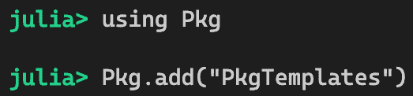

安装完成后，我们可以用它来创建我们的示例模块。第一步是创建一个 `Template` 对象，如下所示：


基本上，`template` 对象包含一些默认值，这些值将用于创建新包。然后，创建新包就像调用 `generate` 函数一样简单。

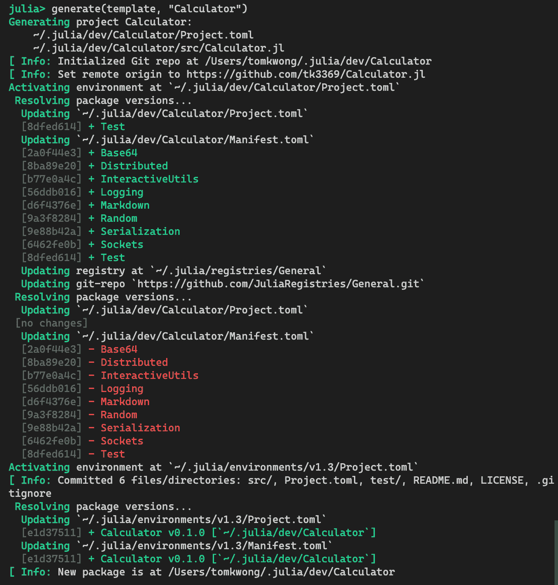

默认情况下，包生成器在 `~/.julia/dev` 文件夹中创建新目录，但可以使用 `Template` 对象的 `dir` 关键字参数进行自定义。

`generate` 命令用于创建一个名为 `Calculator` 的新包。它将自动创建一个具有以下包结构的目录：

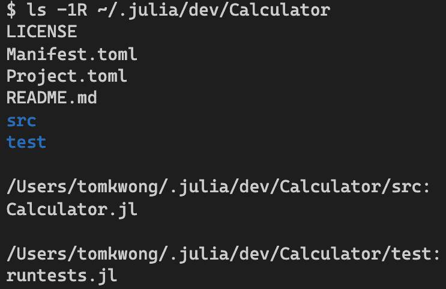

现在，你可以开始编辑 `Calculator.jl` 文件，并用你自己的源代码替换文件内容。

如果你刚接触 Julia，请确保查看 `Revise` 包，它允许你编辑源代码并自动更新工作环境。使用 Julia 的生产力将提高 10 倍，这是有保证的。

让我们通过实现一些财务计算来工作在 `Calculator` 模块上。在这个过程中，我们将学习如何管理外部客户端对变量和函数的可访问性。我们的初始代码设置如下：

```py
# Calculator.jl
module Calculator

export interest, rate

"""
 interest(amount, rate)

Calculate interest from an `amount` and interest rate of `rate`.
"""
function interest(amount, rate)
 return amount * (1 + rate)
end

"""
 rate(amount, interest)

Calculate interest rate based on an `amount` and `interest`.
"""
function rate(amount, interest)
 return interest / amount
end

end # module
```

这段代码应该保存到 `Calculator.jl` 文件中。

# 定义功能行为

我们的 `Calculator` 模块定义了两个函数：

+   `interest` 函数用于计算存款金额 `amount` 的利息，该利息具有指定的利率 `rate`，用于整个投资期。

+   `rate` 函数用于计算可以投资存款金额 `amount` 并获得利息金额 `interest` 的利率。

记住，在 `Calculator` 的上下文之外，*interest* 和 *rate* 可能意味着完全不同的事情。

# 导出函数

在模块内部定义的函数不会暴露给外部世界。为了暴露它们，可以使用 `export` 语句导出 `interest` 和 `rate` 函数，这样模块的使用者就可以轻松地将它们引入自己的命名空间：

```py
export interest, rate
```

一旦导出函数，它们将在使用 `using` 关键字加载模块的客户端作用域中可用。让我们在加载模块之前尝试从 Julia REPL 引用这些函数：

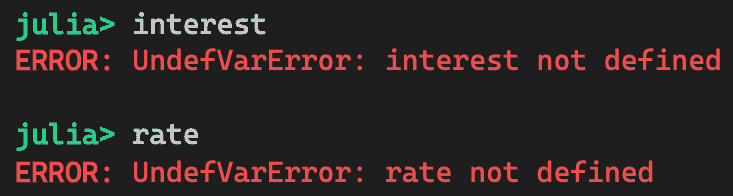

由于我们尚未加载 `Calculator` 包，因此 `interest` 和 `rate` 都未定义。现在让我们将它们引入：

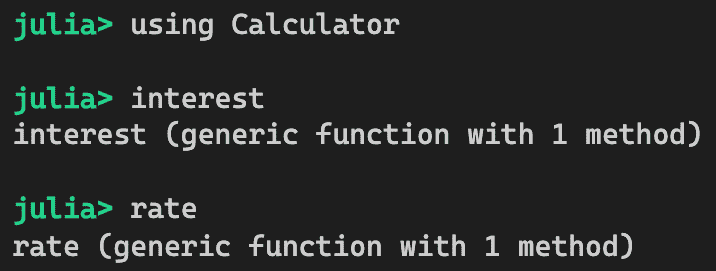

当执行 `using` 语句时，模块导出的所有符号都会被引入当前命名空间。从 Julia REPL 来看，当前模块被称为 `Main`，如下面的图所示：

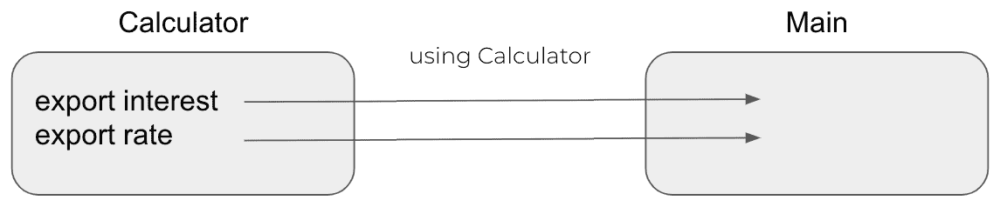

我们可以通过在 `using` 语句中指定特定名称来引入名称的子集。让我们重新启动 Julia REPL 并再次尝试：

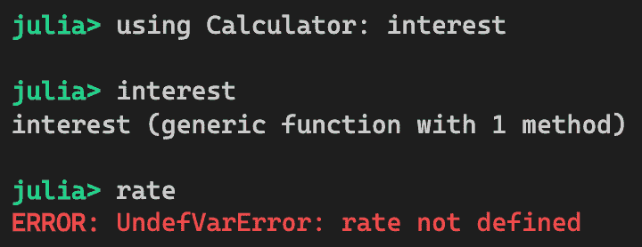

在这种情况下，只有`interest`函数被引入了`Main`模块：

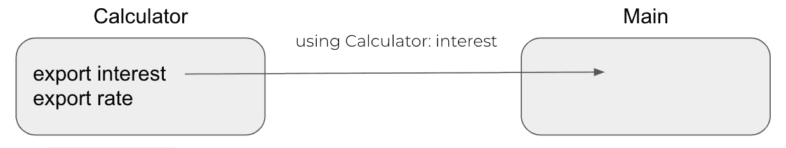

实际上，有几种方法可以将另一个模块中的名称导入当前命名空间。为了简化，我们可以总结如下：

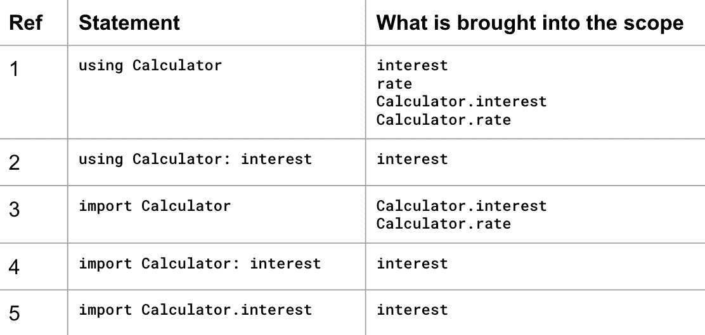

如你所见，有四种方法（即前表中的 1、2、4 和 5）可以将`interest`函数引入当前命名空间。在`using`和`import`语句之间进行选择有一些细微差别。一个好的经验法则是当你使用功能时使用`using`语句，但在需要从模块扩展功能时选择`import`语句。从另一个包扩展函数是 Julia 的关键语言特性之一，你将在本书的各种示例中了解更多关于这一点。

# 解决冲突

然而，情况并不总是如此美好。让我们想象一下，主程序需要使用另一个名为`Rater`的模块，该模块为在线书籍提供评级服务。在这种情况下，主程序可能会尝试从两个模块中获取函数，如下所示：

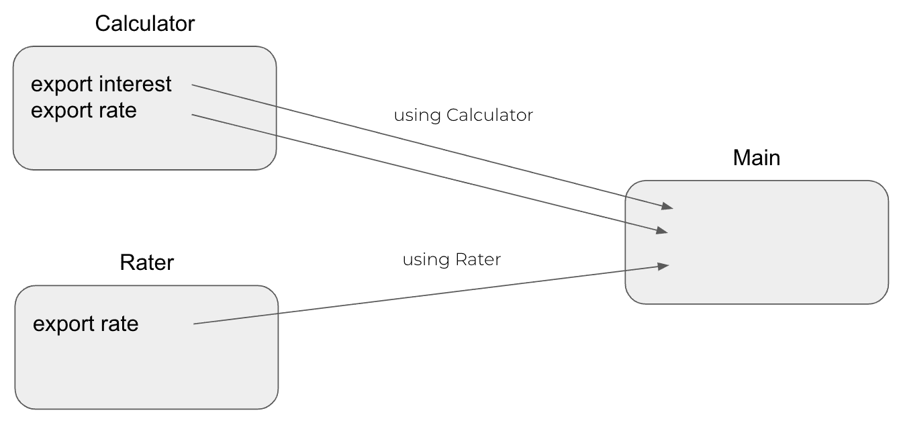

但是，*休斯顿，我们遇到麻烦了!* 从`Calculator`模块引入的`rate`函数与来自`Rater`模块的另一个函数发生了冲突。Julia 在首次使用时会自动检测这种冲突，打印警告，并且从那时起要求程序员使用它们的完全限定名称来访问任一函数：

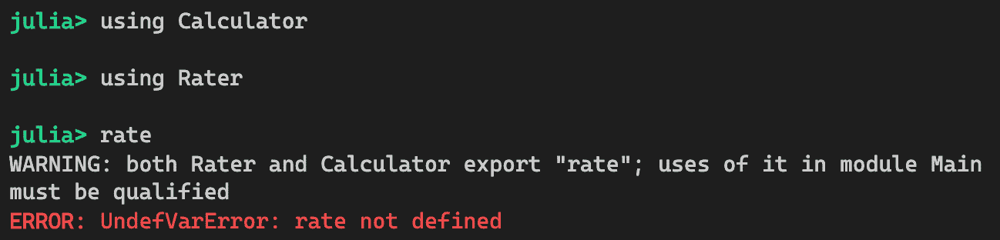

如果你对此不满意，特别是丑陋的警告，那么有一个替代方案。首先，你可以问问自己是否在主程序中真的需要两个`rate`函数。如果只需要一个`rate`函数，那么只需将其引入作用域，这样就不会再有冲突：

```py
using Calculator: interest
using Rater: rate

# Here, the rate function refers to the one defined in Rater module.
```

根据我的经验，将特定名称引入当前命名空间确实是大多数用例的最佳选择。原因在于这将立即清楚地表明你依赖哪些函数。这种依赖关系在代码中也是自我文档化的。

有时，你可能需要同时使用两个`rate`函数。在这种情况下，你可以通过使用常规的`import`语句来解决问题：

```py
import Calculator
import Rater

interest_rate = Calculator.rate(100.00, 3.5)
rating = Rater.rate("Hands-On Design Patterns with Julia")
```

这样，它只会加载包，而不会将任何名称引入当前命名空间。现在，你可以使用它们的完全限定名称来引用这两个`rate`函数——即`Calculator.rate`和`Rater.rate`。在创建这些模块之后，让我们继续看看如何创建子模块。

# 创建子模块

当一个模块变得太大时，将其拆分成更小的部分可能是有意义的，这样更容易开发和维护。解决这个问题的方法之一是创建子模块。

创建子模块很方便，因为它们只是在父模块的作用域内定义。假设我们使用两个子模块——`Mortgage`和`Banking`来组织`Calculator`模块。这些子模块可以在单独的文件中定义，并且可以直接包含到父模块中。考虑以下代码：

```py
# Calculator.jl
module Calculator

include("Mortgage.jl")
include("Banking.jl")

end # module
```

子模块，就像常规模块一样，也是使用模块块定义的。`Mortgage`的源代码看起来就像一个常规模块定义：

```py
# Mortgage.jl
module Mortgage

# mortgage related source code

end # module
```

由于`Calculator`模块块中包含了`Mortgage`的源代码，因此它形成了一个嵌套结构。子模块的使用与任何常规模块相同，只是你必须通过父模块来引用它们。在这种情况下，你会使用`Calculator.Mortgage`或`Calculator.Banking`。

使用子模块是分离大型代码库代码的有效方法。接下来，我们将介绍如何在模块中组织源代码。

# 在模块中组织文件

模块的源代码通常组织为多个源文件。尽管没有关于如何组织源文件的硬性规则，但以下是一些有用的指导原则：

+   **耦合度**：高度耦合的函数应放在同一个文件中。这样做可以在编辑源文件时减少上下文切换。例如，当你更改一个函数的签名时，该函数的所有调用者可能都需要更新。理想情况下，你希望最小化*影响范围*，并且不需要更改许多文件。

+   **文件大小**：一个文件中包含超过几百行代码可能是一个警告信号。如果文件内的代码都是紧密耦合的，那么可能最好重新设计系统以减少耦合度。

+   **排序**：Julia 按照你包含它们的顺序加载源文件。由于数据类型和实用函数通常是共享的，因此最好将它们分别保存在`types.jl`和`utils.jl`文件中，并在模块的开始处包含它们。

类似地，在组织测试脚本时，也应考虑相同的因素。

到目前为止，我们已经学会了如何使用模块和子模块创建新的命名空间。更方便的是，模块被组织在一个包中，这样它就可以在应用程序中被重用。一旦我们创建了多个包，它们之间相互依赖是不可避免的。了解如何正确处理这些依赖关系非常重要；这将是下一节的主要内容。

# 管理包依赖

Julia 生态系统有一套丰富的开源包。当包设计有一个单一目标时，它们可以更容易地被重用；然而，处理大型代码库并不是一件容易的事情，因为它更有可能依赖于第三方包。开发者需要花费相当多的时间和精力来维护和管理这些依赖关系，以避免*依赖地狱*。

重要的是要理解，依赖关系不仅存在于包之间，还存在于特定版本的包之间。幸运的是，Julia 语言对语义版本控制有很强的支持，这可以帮助解决很多问题。

在本节中，我们将涵盖以下主题：

+   理解语义版本控制方案

+   指定 Julia 包的依赖项

+   避免循环依赖

现在，让我们快速了解一下语义版本控制方案。

# 理解语义版本控制方案

语义版本控制([`semver.org/`](https://semver.org/))是由 Tom Preston-Werner 开发的方案，他最著名的是 GitHub 的联合创始人和 CTO。语义版本控制服务于一个非常具体的目的，即为版本号变化提供意义——即语义。

当我们使用第三方包并且它被升级时，我们如何知道我们的应用程序是否需要更新？如果我们只是升级依赖包而不对我们的应用程序进行任何测试，我们将承担什么样的风险？

在语义版本控制之前，几乎总是猜测。然而，一个更加勤奋且风险规避的开发者至少会检查依赖包的发布说明，试图找出是否有任何破坏性更改，然后采取适当的行动。

在这里，我们将简要总结语义版本控制是如何工作的。首先，版本号是由以下组件构成的：

```py
<major>.<minor>.<patch>
```

如果我们愿意，版本号可以在末尾后跟一个发布标签和一个构建号：

```py
<major>.<minor>.<patch>-<pre-release>+<build>
```

版本号的每一部分都揭示了其含义：

+   当`主要`版本号发生变化时，意味着在这个版本中引入了与上一个版本不兼容的重大更改。对于应用程序来说，引入新版本的风险非常高，因为现有的功能很可能会中断。

+   当`次要`版本号发生变化时，意味着在这个版本中有非破坏性的增强。对于应用程序来说，引入新版本的风险是适度的，因为之前的函数至少在理论上应该继续按原样工作。

+   当`补丁`版本号发生变化时，意味着在这个版本中有非破坏性的错误修复。对于应用程序来说，引入新版本的风险是低的。

+   当存在时，`预发布`标签表示预发布候选，如 alpha、beta 或**发布候选**（**RCs**）。该发布被视为不稳定，应用程序永远不应该在生产环境中使用它。

+   `构建`标签被视为元信息，可以忽略。

注意，只有当所有包都正确使用语义版本控制时，它才有用。语义版本控制就像是一种通用语言，包开发者可以使用它来轻松地表明他们在发布新版本时所做的更改的影响。

Julia 包生态系统鼓励使用语义版本控制。接下来，我们将看看 Julia 包管理器`Pkg`如何使用语义版本控制处理依赖项。

虽然 Julia 鼓励使用语义版本控制，但许多开源包仍然带有 1.0 之前的版本号，尽管它们在生产使用中可能相当稳定。零主版本号是特殊的——它基本上意味着每个新版本都是破坏性的。

随着 Julia 语言的成熟，越来越多的包作者将他们的包标记为 1.0，随着时间的推移，包兼容性问题将会得到改善。

# 为 Julia 包指定依赖项

我们可以通过检查源文件中的 `using` 或 `import` 关键字来判断一个包是否依赖于另一个包；然而，Julia 运行时环境被设计为更明确，通过跟踪依赖项。此类信息存储在包目录中的 `Project.toml` 文件中。此外，同一目录下的 `Manifest.toml` 文件包含了关于完整依赖树的更多信息。这些文件使用 TOML 文件格式编写。尽管手动编辑这些文件足够简单，但可以使用 `Pkg` 包管理器的**命令行界面**（**CLI**）更轻松地管理依赖项。

要添加一个新的依赖包，你只需要执行以下步骤：

1.  启动 Julia 交互式解释器。

1.  通过按 `]` 键进入 `Pkg` 模式。

1.  使用 `activate` 命令激活项目环境。

1.  使用 `add` 命令添加依赖包。

例如，让我们按照以下方式将 `SaferIntegers` 包添加到我们的 `Calculator` 包中：

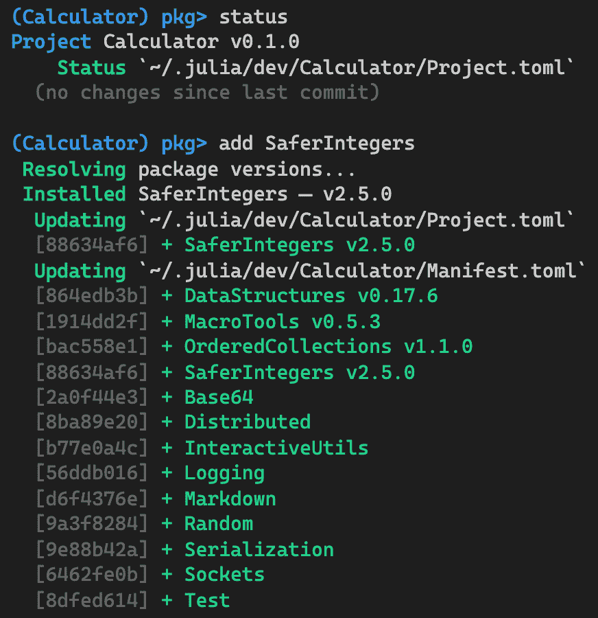

让我们先检查一下 `Project.toml` 文件的内容，如下所示截图所示。这个看起来很奇怪的哈希码 `88634af6-177f-5301-88b8-7819386cfa38` 代表了 `SaferIntegers` 包的**通用唯一标识符**（**UUID**）。请注意，`SaferIntegers` 包没有指定版本号，尽管我们知道从前面的输出中安装了版本 2.5.0：

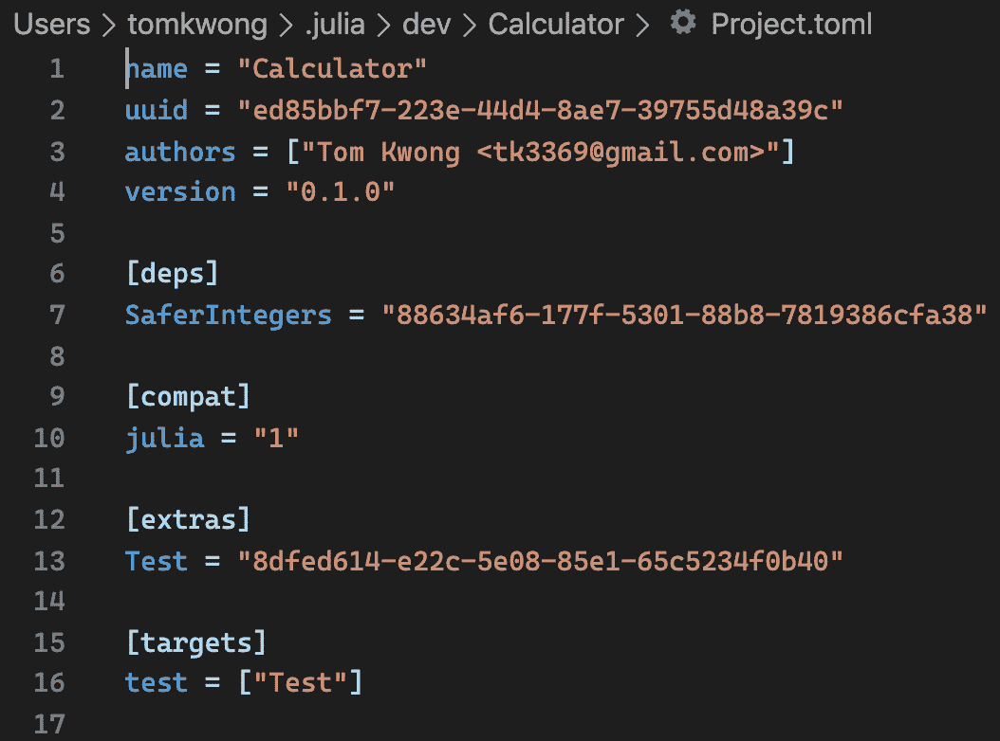

`Manifest.toml` 文件包含了该包的完整依赖树。首先，我们找到以下关于我们的 `SaferIntegers` 依赖项的部分：

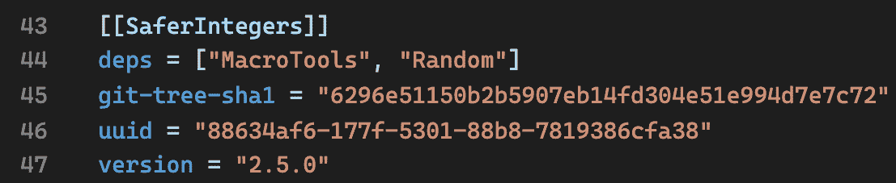

注意，`SaferIntegers` 包现在在清单文件中有特定的版本。`2.5.0`。为什么？这是因为清单被设计用来捕获所有直接依赖和间接依赖包的确切版本信息。第二个观察结果是，官方捆绑的包，如 `Serialization`、`Sockets` 和 `Test`，没有版本号：

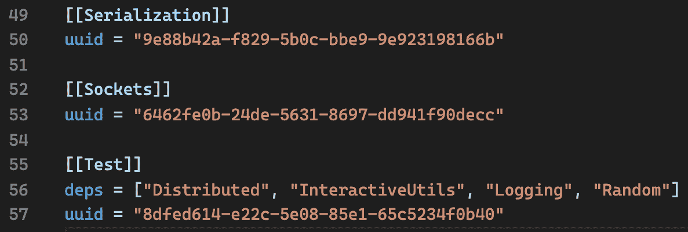

这些包没有版本号，因为它们总是与 Julia 二进制文件一起发布。它们的实际版本基本上由特定的 Julia 版本决定。

重要的是要认识到，尽管我们知道安装了`SaferInteger`的版本 2.5.0，但`Project.toml`和`Manifest.toml`文件中都不包含任何版本兼容性信息。为了指定兼容性约束，我们可以使用语义版本控制方案手动编辑`Project.toml`文件。例如，如果我们知道`Calculator`与`SaferIntegers`版本 1.1.1 及以后兼容，那么我们可以在`Project.toml`文件的`[compat]`部分添加此要求，如下所示：

```py
[compat]
SaferIntegers = "1.1.1"
```

此兼容性设置提供了 Julia 包管理器所需的信息，以确保至少安装了`SaferIntegers`版本 1.1.1，以便使用`Calculator`包。由于包管理器对语义版本控制敏感，前面的设置意味着`Calculator`可以与从 1.1.1 到最新 1.*x*.*y*版本的所有`SaferIntegers`版本一起工作，直到 2.0。在数学表示法中，兼容版本的范围是[1.1.1, 2.0.0)，其中 2.0.0 被排除。

现在，假设`SaferIntegers`得到了改进，并且包所有者决定发布 2.0.0 版本？嗯，因为主版本号从 1 提升到了 2，我们不得不期待会有破坏性变化。如果我们不采取任何行动，最新的版本 2.0.0 将永远不会安装到`Calculator`环境中，因为我们明确实现了 2.0.0 的排他性上限。

假设经过彻底的审查和测试，我们得出结论，`Calculator`不受`SaferIntegers` 2.0.0 的任何破坏性变化的影响。在这种情况下，我们只需对`Project.toml`文件进行微小修改，如下所示：

```py
[compat]
SaferIntegers = "1.1.1, 2"
```

这一行指定了这两个兼容版本范围的**并集**：

+   `1.1.1`指定表示该包与`SaferIntegers`版本[1.1.1, 2.0.0]兼容

+   `2.0`指定表示该包与`SaferIntegers`版本[2.0.0, 3.0.0]兼容

这样的信息很重要。如果有人使用`Calculator`包，并且其环境锁定在`SaferIntegers`版本 1.1.1，那么我们知道`Calculator`在该环境中仍然兼容，并且可以加载它。

包管理器实际上非常灵活，并实现了几种更多的版本指定格式。您可以参考`Pkg`参考手册了解更多信息（[`julialang.github.io/Pkg.jl/v1/compatibility/#Version-specifier-format-1`](https://julialang.github.io/Pkg.jl/v1/compatibility/#Version-specifier-format-1)）。

指定包之间的兼容性很重要。通过使用`Pkg`接口和手动编辑`Project.toml`文件，我们可以正确管理依赖关系，并且包管理器将帮助我们保持工作环境处于良好状态。

然而，有时我们可能会遇到棘手的依赖性问题——例如，循环依赖。我们将在下一节中探讨如何处理此类情况。

# 避免循环依赖

循环依赖是有问题的。为了理解为什么，考虑以下示例。

假设我们拥有五个包（A、B、C、D 和 E），它们具有以下依赖关系：

+   A 依赖于 B 和 C

+   C 依赖于 D 和 E

+   E 依赖于 A

为了图形化地说明这些，我们可以创建一个图表，其中我们可以使用箭头符号来表示组件之间的依赖关系。箭头的方向表示依赖的方向。

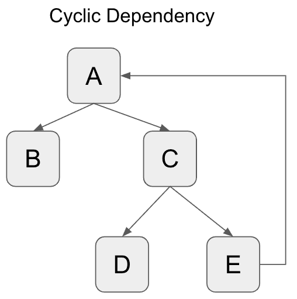

# 问题是什么？

很明显，存在一个循环，因为 A 依赖于 C，C 依赖于 E，而 E 又依赖于 A。这种循环有什么问题呢？假设你需要在包 C 中进行一个应该向后兼容的更改。为了正确测试这个更改后的系统，我们必须确保 C 在其依赖项的条件下继续具有适当的功能。现在，如果我们沿着依赖链追踪，我们必须用 D 和 E 测试 C，因为 E 依赖于 A，所以我们必须包括 A。现在 A 被包括在内，我们必须包括 B 和 C。由于循环的存在，我们现在必须测试所有包！

# 我们如何解决这个问题？

*无环依赖原则*指出，包之间的依赖必须是**有向无环图**（DAG）——也就是说，依赖图必须没有环。如果我们确实在图中看到了环，那么这是一个设计问题的迹象。

当我们遇到这样的问题时，我们必须重构代码，以便将特定的依赖函数移动到单独的包中。在这个例子中，假设包 A 中有些代码被包内部使用，同时也被包 E 使用。这种依赖基本上是 E -> A。

然后，我们可以将此代码移动到新的包 F 中。在此更改之后，包 A 和 E 都将依赖于包 F，从而有效地消除循环依赖：

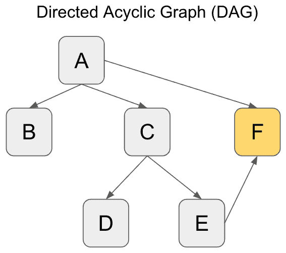

在此重构之后，当我们对 C 进行更改时，我们只需测试带有其依赖项的包，这将仅限于 D、E 和 F。包 A 和 B 都可以排除。

在本节中，我们学习了如何利用语义版本控制来清楚地传达包新版本的影响。我们可以使用`Project.toml`文件来指定当前包与其依赖包的兼容性。我们还回顾了解决循环依赖的技术。

现在我们知道了这个，我们将探讨如何在 Julia 中设计和开发数据类型。

# 设计抽象和具体类型

Julia 的类型系统是其许多语言特性的基础，例如多分派。在本节中，我们将了解抽象类型和具体类型，以及如何设计和使用它们，以及它们与其他主流面向对象编程语言的不同之处。

在本节中，我们将涵盖以下主题：

+   设计抽象类型

+   设计具体类型

+   理解`isa`和`<:`运算符

+   理解抽象类型和具体类型之间的区别

让我们先看看抽象类型。

# 设计抽象类型

与许多其他面向对象编程语言类似，Julia 支持抽象类型的层次结构。抽象类型通常用于建模现实世界的数据概念；例如，`Animal`可以是一个猫或狗的抽象类型，而`Vehicle`可以是一个汽车、卡车或公共汽车的抽象类型。能够将类型分组并给这个组一个单一的名字，使得 Julia 程序员可以应用适用于这些类型的通用代码。

抽象类型通常方便地定义在特定领域的类型层次结构中。我们可以将抽象类型之间的关系描述为“父-子”，或者更技术性地，一个“是子类型于”的关系。父类型和子类型的术语分别是“超类型”和“子类型”。

Julia 设计的一个独特特性，与大多数其他语言不同，是抽象类型在没有任何字段的情况下定义。因此，抽象类型不指定数据实际上是如何存储在内存中的。乍一看可能有些限制，但随着我们对 Julia 了解得更多，当用于这种设计时，它将显得更加自然。因此，抽象类型仅用于为对象集合建模行为，而不是指定数据是如何存储的。

矩形和正方形对象模型是当允许抽象类型定义数据字段时事物可能崩溃的一个经典例子。假设我们能够定义一个具有`width`和`height`字段的矩形。正方形是一种矩形，所以直观上，我们应该能够将正方形建模为矩形的子类型。但很快我们就遇到了麻烦，因为正方形不需要两个字段来存储其边的长度；我们更应该使用一个单独的`边长`字段。因此，在这种情况下从超类型继承字段是没有意义的。我们将在第十二章“继承和变异性”中更详细地讨论这个案例。

在接下来的章节中，我们将通过一个构建抽象类型层次结构的示例来进行分析。

# 一个个人资产类型层次结构的示例

假设我们正在构建一个财务应用程序，该程序跟踪用户的财富，这可能包括各种类型的资产。以下图表显示了抽象类型及其父-子关系层次结构。在这个设计中，资产可能是一个房产、一项投资，或者仅仅是现金类型。房产可以是房子或公寓。投资可能是固定收益或股票。作为一个惯例，为了表明它们是抽象类型而不是具体类型，我们在框中斜体化了它们的名称：

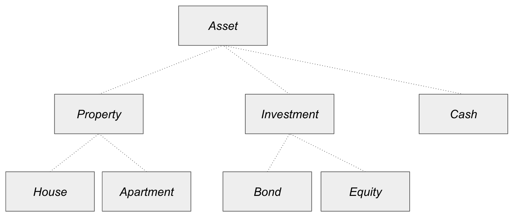

要创建一个抽象类型层次结构，我们可以使用以下代码：

```py
abstract type Asset end

abstract type Property <: Asset end
abstract type Investment <: Asset end
abstract type Cash <: Asset end

abstract type House <: Property end
abstract type Apartment <: Property end

abstract type FixedIncome <: Investment end
abstract type Equity <: Investment end
```

`<:`符号代表一个“是子类型于”的关系。所以，`Property`类型是`Asset`的子类型，`Equity`类型是`Investment`的子类型，等等。

虽然在现实中`Asset`抽象类型似乎位于层次结构的顶层，但它还有一个名为`Any`的超类型，当没有指定超类型且定义了抽象类型时是隐含的。`Any`是 Julia 中的顶级超类型。

# 导航类型层次结构

Julia 提供了一些方便的函数来导航类型层次结构。要找到现有类型的子类型，我们可以使用`subtypes`函数：

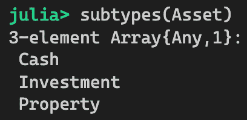

同样，要找到现有类型的超类型，我们可以使用`supertype`函数。

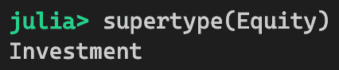

有时，以树形格式查看完整的层次结构很方便。Julia 没有提供标准函数供我们使用来实现这一点，但我们可以使用递归技术轻松地自己创建一个，如下所示：

```py
# Display the entire type hierarchy starting from the specified `roottype`
function subtypetree(roottype, level = 1, indent = 4)
    level == 1 && println(roottype)
    for s in subtypes(roottype)
       println(join(fill(" ", level * indent)) * string(s))
       subtypetree(s, level + 1, indent)
    end
end
```

这个函数对于新的 Julia 用户来说可能非常方便。实际上，我已经将代码保存在我的`startup.jl`文件中，以便它可以在 REPL 启动时自动加载。

`startup.jl`文件是一个用户自定义的脚本，位于`$HOME/.julia/config`目录中。它可以用来存储用户希望在 REPL 每次启动时运行的任何代码或函数。

我们现在可以轻松地显示个人资产类型层次结构，如下所示：

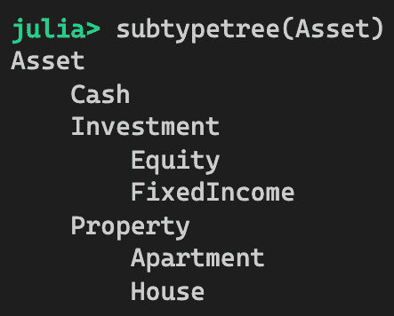

注意，此函数只能显示已加载到内存中的类型层次结构。现在我们已经定义了抽象类型，我们应该能够将函数与它们关联起来。让我们接下来这样做。

# 定义抽象类型的函数

到目前为止，我们所做的一切只是创建了一个相关概念层次结构。有了这些有限的知识，我们仍然可以定义一些函数来模拟行为。但是，当我们没有具体数据元素时，这有什么用呢？在处理抽象类型时，我们只需关注特定的行为以及它们之间可能存在的交互。让我们继续这个例子，看看我们可以添加哪些类型的函数。

# 描述函数

虽然这听起来可能不太有趣，但我们可以定义仅基于类型的函数：

```py
# simple functions on abstract types
describe(a::Asset) = "Something valuable"
describe(e::Investment) = "Financial investment"
describe(e::Property) = "Physical property"
```

现在，如果我们用具有`Property`超类型的数据元素调用`describe`，那么将相应地调用`Property`的描述方法。由于我们没有为`Cash`类型定义任何描述函数，当用`Cash`数据元素调用`describe`时，它将返回更高层次类型`Asset`的描述。

由于我们尚未定义任何具体类型，我们无法证明这里关于`Cash`对象的`describe`函数将回退到`describe(a::Asset)`方法的说法。尽管这是一个简单的事情，我鼓励读者在阅读本章后将其作为练习来做。

# 函数行为

有层次结构的原因是为了创建关于类型常见行为的抽象。例如，`Apartment`和`House`类型有相同的超类型`Property`。这是故意的，因为它们都代表在某个位置上的某种物理住宅。因此，我们可以为任何`Property`定义一个函数，如下所示：

```py
"""
 location(p::Property) 

Returns the location of the property as a tuple of (latitude, longitude).
"""
location(p::Property) = error("Location is not defined in the concrete type")
```

你可能会问，*我们做了什么？* 我们刚刚实现了一个什么也不做只是返回错误的函数！好吧，信不信由你，定义这个函数实际上有几个目的：

+   这清楚地表明，任何`Property`的具体子类型都必须实现`location`函数。

+   在运行时，如果相应的具体类型没有定义`location`函数，那么这个特定的函数将被调用，并抛出一个合理的错误，以便程序员可以纠正错误。

+   函数定义上方紧邻的文档字符串包含了一个有用的描述，说明`Property`的具体子类型应该实现什么。

或者，我们可以定义一个空函数：

```py
"""
 location(p::Property) 

Returns the location of the property as a tuple of (latitude, longitude).
"""
function location(p::Property) end
```

空函数和抛出错误的函数之间有什么区别？对于这个空函数，如果具体类型没有实现这个函数，则不会出现运行时错误。

# 对象之间的交互

定义抽象类型之间的交互也是有用的。既然我们知道每个`Property`都应该有一个位置，我们可以定义一个函数来计算任意两个属性之间的步行距离，如下所示：

```py
function walking_disance(p1::Property, p2::Property)
    loc1 = location(p1)
    loc2 = location(p2)
    return abs(loc1.x - loc2.x) + abs(loc1.y - loc2.y)
end
```

逻辑完全存在于抽象类型中！我们甚至还没有定义任何具体类型，但我们仍然能够开发出适用于`Property`任何具体子类型的通用代码。

Julia 语言的力量允许我们在这一抽象级别定义这些行为。让我们想象一下，如果我们不允许在这一级别定义函数，而只能使用特定的具体类型实现逻辑，我们会做什么。在这种情况下，我们必须为不同类型属性的每一种组合定义一个单独的`walking_distance`函数。这对程序员来说将是过于平凡和无聊的！

现在我们已经了解了抽象类型的工作原理，让我们继续我们的旅程，看看如何在 Julia 中创建具体类型。

# 设计具体类型

具体类型用于定义数据是如何组织的。在 Julia 中，有两种类型的具体类型：

+   原始类型

+   组合类型

基本类型携带纯比特。Julia 的`Base`包包含各种基本类型——8 位、16 位、32 位、64 位或 128 位的有符号/无符号整数。目前，Julia 只支持位数是 8 的倍数的基本类型。例如，如果我们有一个需要非常大的整数的用例，我们可以定义一个 256 位整数类型（32 字节）。如何做到这一点超出了本书的范围。如果你觉得这是一个有趣的项目，你可以查阅 GitHub 上的 Julia 源代码，看看现有的基本类型是如何实现的。事实上，Julia 语言的大部分代码是用 Julia 本身编写的！

复合类型由一组命名字段定义。将字段分组到单个类型中可以更容易地进行推理、共享和操作。复合类型可以指定一个特定的超类型或默认为`Any`。字段也可以根据需要注解其自己的类型，类型可以是抽象的或具体的。当字段的类型信息不存在时，它们默认为`Any`，这意味着该字段可以持有任何类型的对象。

我们将在本节中重点关注复合类型。

# 设计复合类型

复合类型使用`struct`关键字定义。让我们继续从上一个抽象类型部分中的例子，并继续构建我们的个人资产类型层次结构。现在，我们将创建一个名为`Stock`的具体类型，作为`Equity`的子类型。为了保持简单，我们只需将股票表示为交易符号和公司名称：

```py
struct Stock <: Equity
    symbol::String
    name::String
end
```

我们可以使用标准构造函数实例化复合类型，它只需将所有字段作为参数：

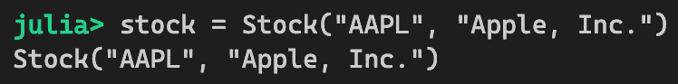

现在，由于`Stock`是`Equity`的子类型，而`Equity`又是`Investment`的子类型，`Investment`又是`Asset`的子类型，因此我们应该遵守我们之前提出的*契约*，通过定义`describe`函数：

```py
function describe(s::Stock)
    return s.symbol * "(" * s.name * ")"
end
```

`describe`函数只是返回股票的字符串表示，包括交易符号和公司名称。

# 不可变性

复合类型默认是不可变的。这意味着在对象创建后，它们的字段不可更改。不可变性是好事，因为它消除了由于数据修改而意外改变系统行为时的惊喜。我们可以轻松证明我们在上一节中创建的具体`Stock`类型是不可变的：

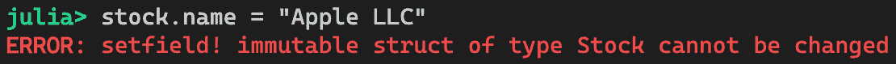

那太好了！现在，不可变性的保证实际上只到字段级别。如果一个类型包含一个字段，并且该字段的类型是可变的，那么改变底层数据是被允许的。让我们通过创建一个新的复合类型`BasketOfStocks`来尝试一个不同的例子，这个类型用于存储股票的向量（即一维数组）以及我们持有它们的原因：

```py
struct BasketOfStocks
    stocks::Vector{Stock}
    reason::String
end
```

让我们只创建一个对象进行测试：

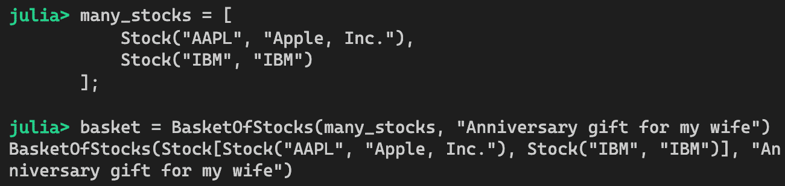

如我们所知，`BasketOfStocks`是一个不可变类型，所以我们不能改变它中的任何字段；然而，让我们看看我们是否可以从`stocks`字段中移除一支股票：

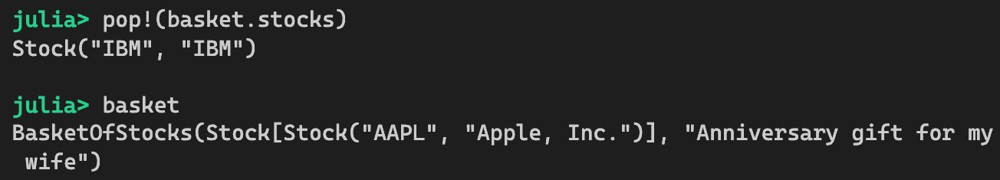

在这里，我们只是直接在`stocks`对象上调用`pop!`函数，它会愉快地拿走我妻子一半的礼物！让我重复一遍——不可变性保证对底层字段没有任何影响。

这种行为是按设计进行的。程序员应该谨慎对待对不可变性的任何假设。

# 可变性

在某些情况下，我们可能实际上希望对象是可变的。可以通过在类型定义前添加`mutable`关键字轻松地移除不可变性约束。为了使`Stock`类型可变，我们做以下操作：

```py
mutable struct Stock <: Equity
    symbol::String
    name::String
end
```

现在我们尝试在一个假设的情况下更新`name`字段，假设苹果公司更改了其公司名称：

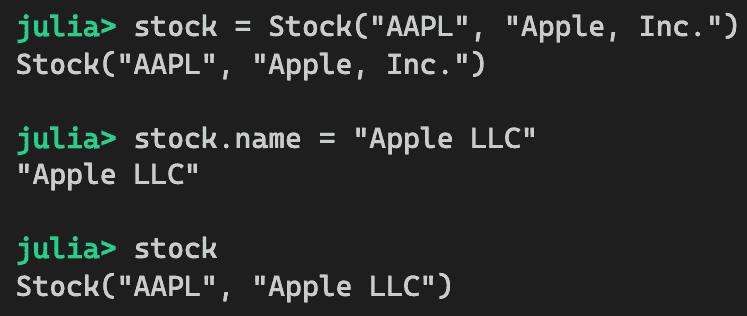

`name`字段已经按我们的意愿更新。请注意，当一个类型被声明为可变时，它的所有字段都变为可变。因此，在这种情况下，我们也可以更改符号。根据情况，这种行为可能是或可能不是期望的。在第八章，*鲁棒性模式*中，我们将讨论一些我们可以用来构建更稳健解决方案的设计模式。

# 可变或不可变？

如您所见，可变对象似乎更灵活，并且提供了良好的性能。但如果是这样，那么为什么我们不想让所有东西默认都是可变的呢？有几个原因：

+   不可变对象更容易处理。因为对象中的数据是固定的，永远不会改变，所以对这些对象进行操作的函数将始终返回一致的结果。这是一个非常好的特性，因为没有惊喜。如果我们为这样的对象构建一个缓存计算结果的函数，缓存将始终良好并返回一致的结果。

+   可变对象在多线程应用程序中更难处理。假设一个函数正在从可变对象中读取，但该对象的内容被来自不同线程的另一个函数修改。那么当前函数可能会产生错误的结果。为了确保一致性，程序员必须使用锁定技术来同步对对象的读写操作。必须处理这种并发情况使得代码更加复杂且难以测试。

另一方面，可变性对于高性能用例可能很有用，因为内存分配是一个相对昂贵的操作。我们可以通过反复重用分配的内存来减少系统开销。

考虑到所有因素，不可变对象通常是更好的选择。

# 使用联合类型支持多种类型

有时，我们需要在字段中支持多种类型。这可以通过使用`Union`类型来实现，它被定义为可以接受任何指定类型的类型。要定义一个`Union`类型，我们可以在`Union`关键字之后用花括号包围类型。例如，`Int64`和`BigInt`的`Union`类型可以定义如下：

```py
Union{Int64,BigInt}
```

当你需要整合来自不同数据类型层次的数据类型时，这些`Union`类型非常有用。让我们进一步扩展我们的个人资产示例。例如，假设我们需要将一些异国物品纳入我们的数据模型中，这可能包括艺术品、古董、绘画等等。这些新概念可能已经被不同的类型层次所建模，如下所示：

```py
abstract type Art end

struct Painting <: Art
    artist::String
    title::String
end
```

事实上，我的妻子喜欢收集绘画，所以我可以将`BasketOfStock`类型泛化为`BasketOfThings`，如下所示：

```py
struct BasketOfThings
 things::Vector{Union{Painting,Stock}}
 reason::String
end
```

向量中的物品可以是`Stock`或`Painting`。记住，Julia 是一种强类型语言，编译器知道哪些数据类型可以适合现有的字段是非常重要的。让我们看看它是如何工作的：

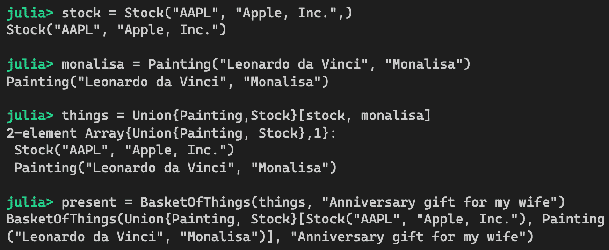

要创建一个包含`Painting`或`Stock`的向量，我们只需在方括号前指定数组的元素类型，如`Union{Painting,Stock}[stock, monalisa]`。

`Union`类型的语法可能非常冗长，尤其是当类型超过两个时，因此定义一个具有表示`Union`类型的有意义的名称的常量是很常见的：

```py
const Thing = Union{Painting,Stock}

struct BasketOfThings
    thing::Vector{Thing}
    reason::String
end
```

如你所见，`Thing`比`Union{Painting,Stock}`更容易阅读。另一个好处是`Union`类型可以在源代码的许多部分被引用。当我们需要稍后添加更多类型时——例如，一个`Antique`类型——我们只需要在一个地方更改它，即`Thing`的定义。这意味着代码可以更容易地维护。

在本节中，尽管我们选择了使用如`Stock`和`Painting`这样的具体类型作为示例，但我们没有理由不能使用如`Asset`和`Art`这样的抽象类型来定义`Union`类型。

`Union`类型的另一个常见用法是将`Nothing`作为字段的合法值。这可以通过声明一个具有`Union{T,Nothing}`类型的字段来实现，其中`T`是我们想要使用的实际数据类型。在这种情况下，该字段可以分配一个真实值或只是`Nothing`。

接下来，我们将继续学习如何使用类型运算符。

# 使用类型运算符

Julia 的数据类型本身就是一等公民。这意味着你可以将它们分配给变量，传递给函数，并以各种方式操作它们。在接下来的几节中，我们将探讨两个常用的运算符。

# `isa`运算符

`isa`运算符可以用来确定一个值是否是某个类型的子类型。例如，看看下面的代码：

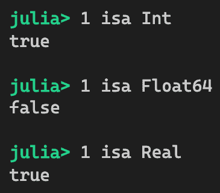

让我解释一下这些结果：

+   数字 `1` 是 `Int` 类型的实例，因此返回 `true`。

+   因为 `Float64` 是一个不同的具体类型，所以它返回 `false`。

+   因为 `Int` 是 `Signed` 的子类型，而 `Signed` 是 `Integer` 的子类型，`Integer` 是 `Real` 的子类型，所以它返回 `true`。

`isa` 操作符对于检查接受泛型类型参数的函数中的类型可能很有用。例如，如果函数只能处理 `Real` 数值，那么当意外传递一个 `Complex` 值时，它可能会抛出错误。

# `<:` 操作符

*is-a-subtype-of* 操作符 `<:` 用于确定一个类型是否是另一个类型的子类型。从上一节中的第三个例子来看，我们可以检查 `Int` 是否确实是 `Real` 的子类型，如下所示：

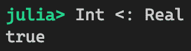

有时开发者可能会对 `isa` 和 `<:` 操作符的用法感到困惑，因为它们非常相似。我们可以记住，`isa` 检查一个 *值* 是否与一个类型匹配，而 `<:` 检查一个 *类型* 是否与另一个类型匹配。这些操作符的文档字符串实际上非常有帮助。从 Julia REPL 中，输入一个 `?` 字符并输入操作符以查找文档：

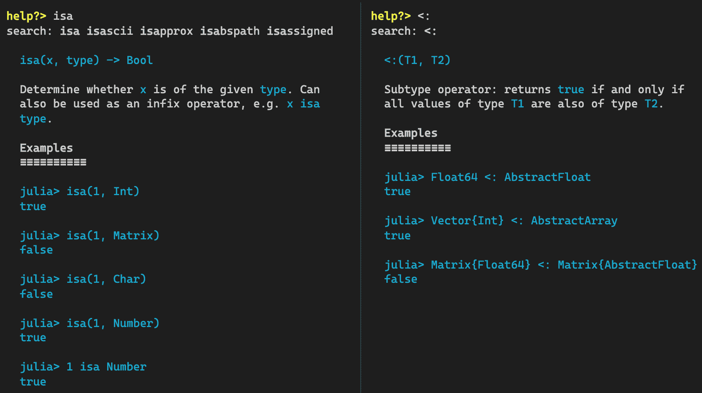

事实上，`isa` 和 `<:` 都是函数，但它们也可以用作中缀操作符。

这些操作符对于类型检查非常有用；例如，我们可以在构造函数中抛出异常，如果传递的参数没有正确的类型。它们还可以根据传递给函数的类型动态执行不同的逻辑。

抽象类型和具体类型是 Julia 中数据类型的根本构建块。快速了解它们之间的差异可能是有益的。接下来，我们将探讨具体细节。

# 抽象类型和具体类型的差异

讨论了抽象类型和具体类型之后，你可能想知道它们之间有什么不同。我们可以以下表总结它们的不同之处：

| **属性** | **抽象类型** | **具体类型** |
| --- | --- | --- |
| 有超类型？ | 是 | 是 |
| 允许子类型？ | 是 | 否 |
| 包含数据字段？ | 否 | 是 |
| 一等类型？ | 是 | 是 |
| 可以是 `Union` 类型的一部分？ | 是 | 是 |

对于抽象类型，我们可以构建一个类型层次结构。顶层类型只是 `Any`。抽象类型不能包含任何数据字段，因为它们是用来表示概念而不是数据存储的。抽象类型是一等类型，这意味着它们可以被存储和传递，并且有与它们一起工作的函数——例如，`isa` 和 `<:` 操作符。

具体类型与抽象类型相关联，作为超类型。如果没有指定超类型，则默认为 `Any`。具体类型不允许子类型。这意味着每个具体类型都必须是最终的，并且会在类型层次结构中成为叶节点。具体类型也是一等类型，就像抽象类型一样。

抽象类型和具体类型都可以在 `Union` 类型中引用。

我们刚才提到的内容可能会让来自面向对象编程背景的人感到惊讶。首先，你可能想知道为什么具体类型不允许子类型。其次，你可能想知道为什么抽象类型不能定义字段。这种设计实际上是故意的，并且核心 Julia 开发团队进行了激烈的辩论。辩论与行为继承与结构继承有关，这将在第十二章继承和变异性中讨论。

现在，让我们转换一下，来看看 Julia 语言的参数化类型特性。

# 与参数化类型一起工作

Julia 语言最强大的特性之一是能够参数化类型。实际上，很难找到不使用这个特性的任何 Julia 包。参数化类型允许软件设计者泛化类型，并让 Julia 运行时根据指定的参数自动编译到具体版本。

让我们看看复合类型和抽象类型是如何工作的。

# 与参数化复合类型一起工作

在设计复合类型时，我们应该为每个字段分配一个类型。通常，我们并不真的关心这些类型是什么，只要类型提供了我们想要的功能即可。

一个经典的例子是数值类型。数字的概念很简单：基本上就像我们在小学学的那样。在实践中，由于数据的不同物理存储和表示，许多数值类型在计算机系统中得到实现。

默认情况下，Julia 随带以下数值类型；具体类型较暗：

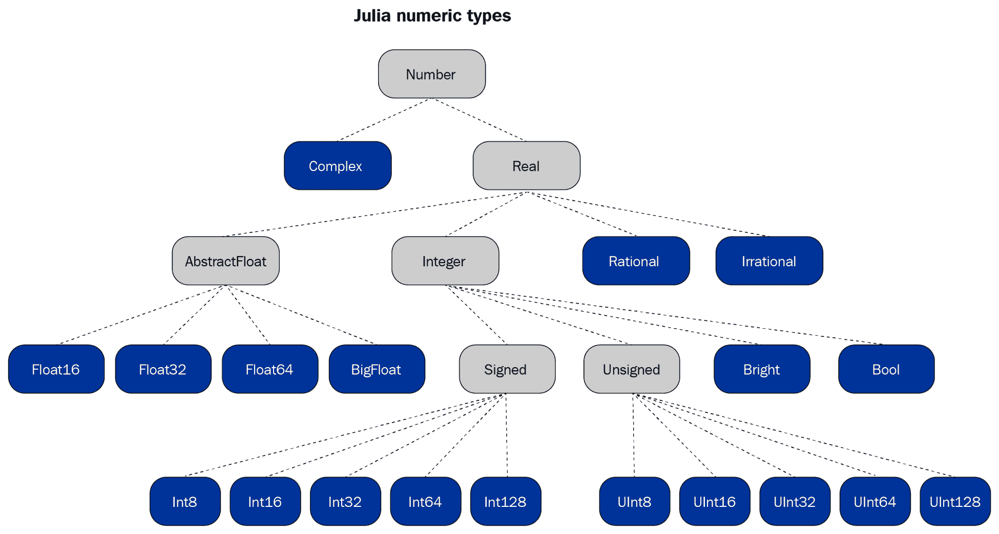

你还记得我们在本章前面设计了一个复合类型来表示投资组合中的股票吗？让我们在这里回顾一下这个例子：

```py
struct Stock <: Equity
    symbol::String
    name::String
end
```

如果我必须在我的经纪账户中持有一些股票，那么我也应该跟踪我拥有的股票数量。为此，我可以定义一个新的类型，称为 `StockHolding`，如下所示：

```py
struct StockHolding
    stock::Stock
    quantity::Int
end
```

默认情况下，`Int` 数据类型被别名到 `Int64` 或 `Int32`，这取决于你是否在使用 Julia 的 64 位或 32 位版本。这看起来只是为了开始而合理，但如果我们需要支持不同用例的分数份额怎么办？在这种情况下，我们只需将 `quantity` 的类型改为 `Float64`：

```py
struct StockHolding
    stock::Stock
    quantity::Float64
end
```

我们基本上将`quantity`字段的类型扩展到支持整数和浮点值的类型。这可能是一个合理的方法，但如果我们需要同时支持`Int`和`Float64`类型，那么我们就必须维护两种略有不同的类型。遗憾的是，如果我们创建了两种不同的类型，那么维护工作就会变得非常困难。

为了使其更加灵活，我们可以通过一个参数重新设计`StockHolding`类型：

```py
struct StockHolding{T} 
    stock::Stock
    quantity::T
end
```

花括号内的符号`T`被称为*类型参数*。它作为一个占位符，可以在任何字段中用作类型。

现在，我们拥有了两者之优。`StockHolding{Int}`类型指的是包含`Int`类型`quantity`字段的类型。同样，`StockHolding{Float64}`指的是包含`Float64`类型`quantity`字段的类型。

在实践中，`T`类型参数只能是一个数值类型，因此我们可以进一步将`T`限定为`Real`的任何子类型：

```py
struct StockHolding{T <: Real} 
    stock::Stock
    quantity::T
end
```

这样我们就可以理解了——*StockHolding*类型包含一个股票和一个类型为*`T`*的*子类型*`Real`的数量。句子的后半部分很重要；这意味着我们可以创建一个新类型的`StockHolding`，其`quantity`类型可以是`Float16`、`Float32`、`Float64`、`Int8`、`Int16`、`Int32`等等。

让我们尝试用不同的类型参数实例化`StockHolding`对象，例如`Int`、`Float64`和`Rational`：

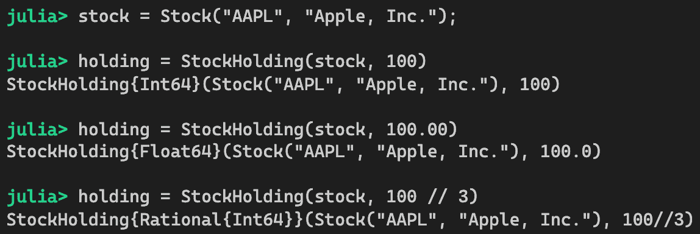

我们可以看到，根据传递给构造函数的参数，会自动创建不同的`StockHolding{T}`类型。

参数化类型的另一个用途是强制字段类型的统一性。假设我们想要设计另一种股票持有对象来跟踪持有物的价格和市场价值。让我们称它为`StockHolding2`以避免与前一个混淆。下面是它的样子：

```py
struct StockHolding2{T <: Real, P <: AbstractFloat} 
    stock::Stock
    quantity::T
    price::P
    marketvalue::P
end
```

知道`quantity`的类型可能不同于`price`和`marketvalue`的类型，我们添加了一个新的类型参数，`P`。现在，我们可以实例化一个包含整数数量的`StockHolding2`对象，而价格和市场价值字段为浮点值：

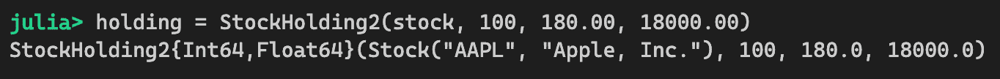

注意，类型是`StockHolding2{Int64, Float64}`，如前一个截图所示。在这种情况下，类型参数`T`是`Int64`，参数`P`是`Float64`。

由于我们声明了`price`和`marketvalue`字段必须具有相同的类型`P`，Julia 会为我们强制执行这条规则吗？让我们试一试：

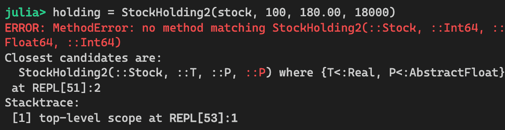

*是的，确实如此!* 我们正确地收到了一个错误，因为我们为 `price` 传递了一个 `Float64` 值，但为 `marketvalue` 传递了一个 `Int64`。让我们仔细看看错误信息，它揭示了系统期望的内容。对于 `StockHolding2` 的最接近的候选函数接受第三个和第四个参数的 `P` 类型，其中 `P` 是 `AbstractFloat` 的任何子类型。因为 `Int64` 不是 `AbstractFloat` 的子类型，所以没有匹配，因此抛出了错误。

参数化类型也可以是抽象的。我们将在下一节中讨论这一点。

# 与参数化抽象类型一起工作

抽象类型可以像复合类型一样被增强。让我们继续前面的例子。假设我们想要构建一个名为 `Holding` 的抽象类型，它跟踪其子类型使用的 `P` 类型。我们可以这样编写代码：

```py
abstract type Holding{P} end
```

然后，`Holding{P}` 的每个子类型也必须接受一个 `P` 类型参数。例如，我们可以创建两个新的类型——`StockHolding3{T,P}` 和 `CashHolding{P}`：

```py
struct StockHolding3{T, P} <: Holding{P}

 stock::Stock
 quantity::T
 price::P
 marketvalue::P
end

struct CashHolding{P} <: Holding{P}
 currency::String
 amount::P
 marketvalue::P
end
```

我们可以如下检查这些类型之间的关系：

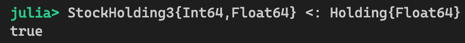

让我们创建一个新的 `StockHolding3` 对象：

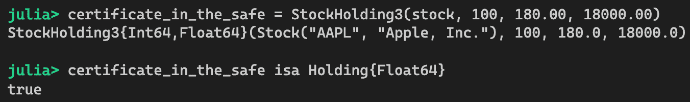

如预期的那样，`certificate_in_the_safe` 对象是 `Holding{Float64}` 的子类型。

注意，当一个类型被参数化时，每个变体都被视为一个独立的类型，它们之间没有关联，除了它们有一个共同的超类型。例如，`Holding{Int}` 和 `Holding{Float64}` 是不同的类型，但它们都是 `Holding` 的子类型。让我们快速证明这一点：

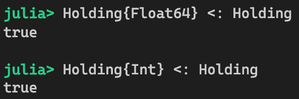

总结来说，Julia 提供了一个非常丰富的类型系统，程序员可以使用它来推理每个类型与其他类型之间的关系。抽象类型允许我们在关系层次结构中定义行为，而具体类型用于定义数据的存储方式。参数化类型用于将现有类型扩展到字段类型的变体。所有这些语言结构都允许程序员有效地建模数据和行为。

接下来，我们将探讨数据类型转换及其如何应用于函数。

# 数据类型之间的转换

我们经常需要将数据从一种类型转换为另一种类型，以便利用现有的库函数。一个很好的工作示例是标准的数值数据类型。在大多数数学函数中，将一个整数日期转换为浮点数是一个常见的用例。

在本节中，我们将学习如何在 Julia 中执行数据类型转换。实际上，数据类型转换预计将被显式实现；然而，已经实现了一套规则，以便某些转换可以自动调用。

# 执行简单的数据类型转换

将一个值从一种数据类型转换为另一种数据类型有两种方法。显然的选择是从现有值构造一个新对象。例如，我们可以如下从有理数构造一个`Float64`对象：

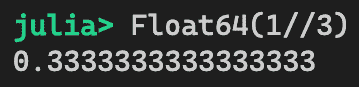

另一种方法是使用`convert`函数：

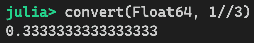

无论哪种方式都行得通。当考虑性能优化时，使用`convert`函数有一个优点，我们将在本节后面解释。

# 小心有损转换

当涉及到转换时，考虑转换是有损还是无损是很重要的。一般来说，数据类型转换是无损的，这意味着当你从一个类型转换到另一个类型，然后再转换回来时，你会得到相同的值。

由于浮点数的数值表示，这种完美的转换并不总是可能的。例如，让我们尝试将`1//3`转换为`Float64`，然后再将其转换回`Rational`：

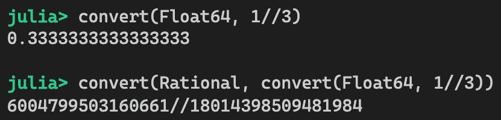

由于舍入误差，在将`1//3`转换为`Float64`类型后，无法重建它。这个问题不仅限于`Rational`类型。我们可以通过将值从`Int64`转换为`Float64`然后再转换回来，轻松地再次破坏它，如下所示：

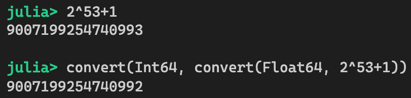

我们可以看到这里存在精度损失。虽然我们可能对这些结果不太满意，但只要我们使用`Float64`类型，实际上我们真的无能为力。`Float64`类型是根据 IEEE 754 浮点规范实现的，并且预期会存在精度误差。如果您需要更高的精度，可以使用`BigFloat`代替，这可以解决这个特定问题：

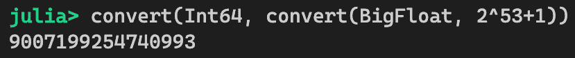

在处理浮点数时，我们应该小心精度问题。

# 理解数值类型转换

Julia 由于安全原因不会自动在数据类型上执行转换。每个转换都必须由程序员显式定义。

为了让每个人更容易理解，Julia 默认已经包含了用于数值类型的转换函数。例如，您可以从`Base`包中找到这段有趣的代码：

```py
convert(::Type{T}, x::T) where {T<:Number} = x
convert(::Type{T}, x::Number) where {T<:Number} = T(x)
```

这两个函数都接受`Type{T}`类型的第一个参数，其中`T`是`Number`的子类型。有效的值包括所有标准数值类型，如`Int64`、`Int32`、`Float64`、`Float32`等。

让我们进一步了解这两个函数：

+   第一个函数表示，当我们想要将`x`从`T`类型转换为`T`类型（相同的类型）时，只要`T`是`Number`的子类型，我们就可以简单地返回参数`x`本身。这可以被认为是一种性能优化，因为当目标类型与输入类型相同时，实际上没有必要进行任何转换。

+   第二个函数稍微有趣一些。为了将 `x`（它是 `Number` 的子类型）转换为类型 `T`（它也是 `Number` 的子类型），它只是调用 `T` 类型的构造函数并传递 `x`。换句话说，这个函数可以处理任何 `Number` 类型到 `Number` 子类型的转换。

你可能会想知道为什么我们一开始不直接使用构造函数。这是因为 `convert` 函数被设计为在多种常见用例中自动调用。正如我们之前所看到的，这种额外的间接性也允许我们在转换不必要时绕过构造函数。

`convert` 在何时被调用？答案是 Julia 不会自动这样做，除了少数几种情况。我们将在下一节中探讨这些情况。

# 检查自动转换的规则

由于数据类型转换是一个相当标准的操作，Julia 被设计为在以下场景中自动调用 `convert` 函数：

1.  将值赋给数组会将该值转换为数组的元素类型。

1.  将值赋给对象的字段会将值转换为该字段的声明类型。

1.  使用 `new` 构造对象会将值转换为对象的声明字段类型。

1.  将值赋给具有声明类型的变量会将该值转换为该类型

1.  声明返回类型的函数会将它的返回值转换为该类型。

1.  向 `ccall` 传递值会将该值转换为相应的参数类型。

让我们确认这些功能确实按预期工作。

# 情况 1：将值赋给数组

在以下示例中，将 `1` 值赋给 `Float64` 数组会将前者转换为浮点值，`1.0`：

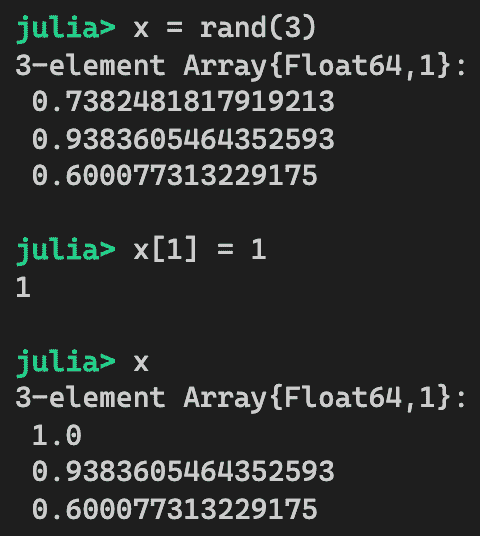

# 情况 2：将值赋给对象的字段

在以下示例中，`Foo` 结构体接受一个 `Float64` 字段。当字段被赋予 `2` 的值时，它会被转换为 `2.0`：

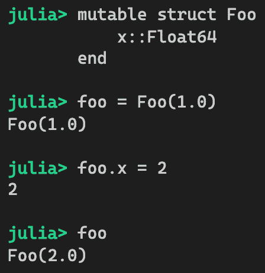

# 情况 3：使用 new 函数构造对象

在以下示例中，`Foo` 构造函数在创建 `Foo` 对象时会自动将 `1` 转换为 `1.0`：

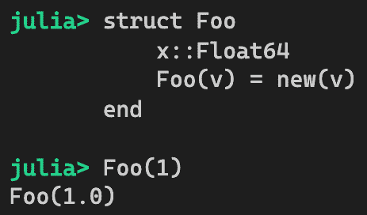

# 情况 4：将值赋给具有声明类型的变量

在以下示例中，局部变量 `x` 被声明为 `Float64` 类型。当它被赋予 `1` 值时，它会被转换为 `1.0`：

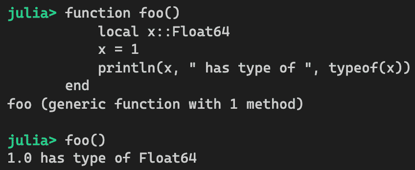

# 情况 5：函数具有声明返回类型

在以下示例中，`foo` 函数被声明为返回一个 `Float64` 值。尽管 `return` 语句说 `1`，但在返回之前它会被转换为 `1.0`：


# 情况 6：向 ccall 传递值

在下面的示例中，使用了 C 库中的`exp`函数来计算一个数的指数。它期望一个`Float64`值作为参数，因此当将值`2`传递给`ccall`时，它会在传递给 C 函数之前转换为`2.0`：

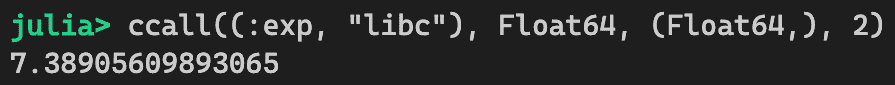

所有这些都很好，但似乎缺少了什么。最常见的情况：向函数传递一个参数怎么办？Julia 在自动转换参数时不会调用它吗？答案可能有点令人惊讶。让我们在接下来的章节中更详细地探讨这个问题。

# 理解函数分派规则

Julia 是一种强类型语言，这意味着程序员必须非常清楚正在传递的类型。只有当函数参数的类型匹配正确时，才能调用（也称为分派）函数。适当的匹配可以定义为完全匹配（相同类型）或当传递的参数是函数签名中期望的类型的一个子类型时。

为了说明这一点，让我们创建一个函数，该函数将其`AbstractFloat`类型的参数值加倍。我们将使用我们的`subtypetree`实用函数来快速找出其子类型：

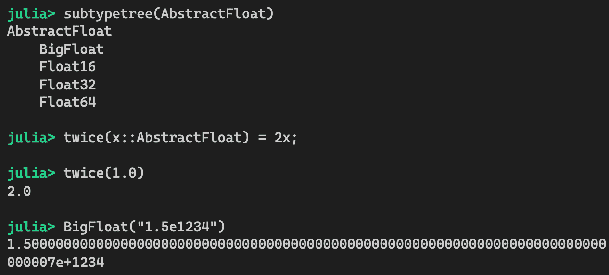

如果我们向函数传递一个整数会发生什么？嗯，它不太好用：

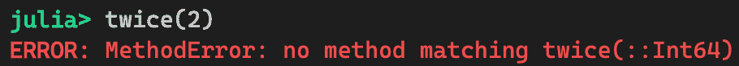

天真地，我们可能认为系统应该自动将参数转换为`Float64`然后加倍该值。但是，它并没有这样做。这不是一个转换问题。为了达到这个效果，我们可以显然地写另一个函数，它接受一个`Int`参数，然后将其转换为`Float64`，并调用原始函数。但是代码看起来完全一样，这是重复劳动。这个问题可以通过编写更通用的函数来解决：

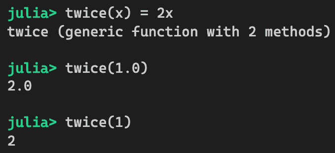

如果我们认为参数必须是`Number`，那么我们可以再次将其限制为这样的类型：

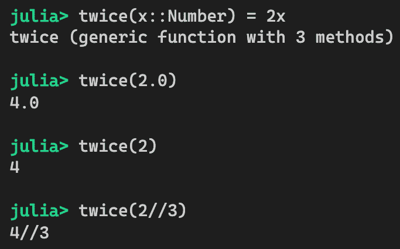

我们在这里选择做什么取决于我们希望函数有多灵活。指定一个抽象类型，如`Number`的好处是我们确信该函数将很好地适用于实现`Number`定义的行为的任何类型。另一方面，如果我们将函数定义中的它留为未指定类型，那么只要定义了`*`运算符，就可以将其他对象传递给函数。

在本节中，我们学习了如何在 Julia 中执行数据类型转换。在某些情况下，Julia 还可以自动转换数值类型。

# 摘要

在本章中，我们开始讨论了为大型应用程序组织源代码的重要性。我们详细探讨了如何建立命名空间以及如何使用模块和子模块来实现它们。为了管理包依赖，我们介绍了语义版本化的概念，并学习了如何使用 Julia 的包管理器正确地使用它。

然后，我们讨论了如何设计抽象类型层次结构并定义抽象类型的函数。我们还讨论了具体类型以及不可变性和可变性的概念。我们演示了在处理来自不同抽象类型层次结构的数据类型时如何使用联合类型。我们考察了两种常见的数据类型运算符（`isa`和*is-a-subtype-of*）。为了进一步重用数据类型，我们介绍了参数化类型，并探讨了它们如何应用于具体类型和抽象类型。

最后，我们研究了 Julia 中的`convert`函数及其在特定情况下自动调用的方式。我们学习了 Julia 的函数分派是如何工作的，以及如何通过接受更广泛的抽象类型作为参数来使函数更加灵活。

到目前为止，你应该对如何组织代码和设计自己的数据类型有了很好的理解。

在下一章中，我们将探讨如何使用函数和 Julia 的多重分派功能来定义应用程序的行为。

# 问题

通过以下问题来测试你对本章主题的理解。答案在书的后面提供：

1.  我们如何创建一个新的命名空间？

1.  我们如何将模块的函数暴露给外部世界？

1.  当同一个函数名从不同的包中导出时，我们如何引用正确的函数？

1.  我们应该在何时将代码分成多个模块？

1.  为什么语义版本化在管理包依赖时很重要？

1.  为抽象类型定义功能性行为有什么用？

1.  我们应该在何时使类型可变？

1.  参数化类型有什么用？
