# 第五章：可复用性模式

在本章中，我们将学习与软件可复用性相关的几种模式。如您从第一章，“设计模式及相关原则”中回忆起，可复用性是构建大型应用程序所需的四个软件质量目标之一。没有人愿意重新发明轮子。能够复用现有的软件组件可以节省时间和精力——这是一项整体的人类进步！本章中的模式是经过验证的技术，可以帮助我们改进应用程序设计，复用现有代码，并减少整体代码量。

在本章中，我们将涵盖以下主题：

+   委派模式

+   神圣特质模式

+   参数化类型模式

# 技术要求

本章的示例源代码位于[`github.com/PacktPublishing/Hands-on-Design-Patterns-and-Best-Practices-with-Julia/tree/master/Chapter05`](https://github.com/PacktPublishing/Hands-on-Design-Patterns-and-Best-Practices-with-Julia/tree/master/Chapter05)。

本章中的代码已在 Julia 1.3.0 环境中进行了测试。

# 委派模式

委派是一种在软件工程中常用的模式。其主要目标是利用现有组件的能力，通过“包含”关系对其进行包装。

委派模式在面向对象编程社区中得到广泛应用。在面向对象编程的早期，人们认为可以通过继承来实现代码复用。然而，人们逐渐意识到，由于继承存在各种问题，这一承诺无法完全实现。从那时起，许多软件工程师更倾向于使用组合而不是继承。组合的概念是将一个对象包装在另一个对象中。为了复用现有函数，我们必须将函数调用委托给包装对象。本节将解释如何在 Julia 中实现委派。

组合的概念是将一个对象包装在另一个对象中。为了复用现有函数，我们必须将函数调用委托给包装对象。

一种方法是通过添加新功能来增强现有组件。这听起来不错，但在实践中可能会具有挑战性。 考虑以下情况：

+   现有的组件来自供应商产品，源代码不可用。即使代码可用，供应商的许可证可能不允许我们进行自定义更改。

+   现有的组件是由另一个团队为关键任务系统开发和使用的，对该系统来说，更改既不受欢迎也不适用。

+   现有的组件包含大量遗留代码，新的更改可能会影响组件的稳定性，并需要大量的测试工作。

如果修改现有组件的源代码不是一个选择，那么我们至少应该能够通过其发布的编程接口使用该组件。这就是委托模式的价值所在。

# 将委托模式应用于银行用例

委托模式的想法是通过包装一个称为 *父对象* 的现有对象来创建一个新的对象。为了重用对象的功能，为新对象定义的函数可以被委托（也称为转发）到父对象。

假设我们有一个提供一些基本账户管理功能的银行库。为了理解它是如何工作的，让我们看看源代码。

银行账户已经设计了一个以下可变数据结构：

```py
mutable struct Account
    account_number::String
    balance::Float64
    date_opened::Date
end
```

作为编程接口的一部分，库还提供了字段访问器（见第八章，*鲁棒性模式*）以及进行存款、取款和转账的函数，如下所示：

```py
# Accessors

account_number(a::Account) = a.account_number
balance(a::Account) = a.balance
date_opened(a::Account) = a.date_opened

# Functions

function deposit!(a::Account, amount::Real)
    a.balance += amount
    return a.balance
end

function withdraw!(a::Account, amount::Real)
    a.balance -= amount
    return a.balance
end

function transfer!(from::Account, to::Account, amount::Real)
    withdraw!(from, amount)
    deposit!(to, amount)
    return amount
end
```

当然，在实际应用中，这样的银行库要比这里看到的复杂得多。我怀疑当钱进出银行账户时，会有许多下游影响，例如记录审计跟踪、在网站上提供新的余额、向客户发送电子邮件等等。

让我们继续学习如何利用委托模式。

# 组合一个包含现有类型的新类型

作为一项新举措的一部分，银行希望我们支持一种新的储蓄账户产品，该产品为顾客提供每日利息。由于现有的账户管理功能对银行业务至关重要，并且由不同的团队维护，我们决定在不修改任何现有源代码的情况下重用其功能。

首先，让我们创建自己的 `SavingsAccount` 数据类型，如下所示：

```py
struct SavingsAccount
    acct::Account
    interest_rate::Float64

    SavingsAccount(account_number, balance, date_opened, interest_rate) = new(
        Account(account_number, balance, date_opened),
        interest_rate
    )
end
```

第一个字段 `acct` 用于存储一个 `Account` 对象，而第二个字段 `interest_rate` 包含账户的年利率。还定义了一个构造函数来实例化对象。

为了使用底层的 `Account` 对象，我们可以使用一种称为 *委托* 或 *方法转发* 的技术。这就是我们在 `SavingsAccount` 中实现相同的 API，并在想要重用底层对象中现有函数时，将调用转发到底层 `Account` 对象。在这种情况下，我们可以简单地转发 `Account` 对象的所有字段访问器函数和修改函数，如下所示：

```py
# Forward assessors
account_number(sa::SavingsAccount) = account_number(sa.acct)
balance(sa::SavingsAccount) = balance(sa.acct)
date_opened(sa::SavingsAccount) = date_opened(sa.acct)

# Forward methods
deposit!(sa::SavingsAccount, amount::Real) = deposit!(sa.acct, amount)

withdraw!(sa::SavingsAccount, amount::Real) = withdraw!(sa.acct, amount)

transfer!(sa1::SavingsAccount, sa2::SavingsAccount, amount::Real) = transfer!(
    sa1.acct, sa2.acct, amount)
```

到目前为止，我们已经成功地重用了 `Account` 数据类型，但不要忘记我们最初实际上是想构建新的功能。储蓄账户应该每天基于每日利息进行过夜计息。因此，对于 `SavingsAccount` 对象，我们可以实现一个新的 `interest_rate` 字段访问器和一个名为 `accrue_daily_interest!` 的新修改函数：

```py
# new accessor
interest_rate(sa::SavingsAccount) = sa.interest_rate

# new behavior
function accrue_daily_interest!(sa::SavingsAccount) 
    interest = balance(sa.acct) * interest_rate(sa) / 365
    deposit!(sa.acct, interest)
end
```

在这个时候，我们已经创建了一个新的`SavingsAccount`对象，它的工作方式与原始的`Account`对象完全一样，除了它还具有累积利息的额外功能！

然而，这些转发方法的数量之多让我们感到有些不满意。如果我们可以不用手动编写所有这些代码，那就太好了。也许有更好的方法...

# 减少转发方法中的样板代码

你可能会想知道为什么写这么多代码仅仅是为了将方法调用转发到父对象。确实，转发方法除了将完全相同的参数传递给父对象外，没有其他作用。如果程序员按代码行数付费，那么这将会是一个非常昂贵的提议，不是吗？

幸运的是，这种样板代码可以通过宏大大减少。有几个开源解决方案可以帮助这种情况。为了演示目的，我们可以利用来自`Lazy.jl`包的`@forward`宏。让我们按照以下方式替换所有的转发方法：

```py
using Lazy: @forward

# Forward assessors and functions
@forward SavingsAccount.acct account_number, balance, date_opened
@forward SavingsAccount.acct deposit!, withdraw!

transfer!(from::SavingsAccount, to::SavingsAccount, amount::Real) = transfer!(
    from.acct, to.acct, amount)
```

`@forward`的使用相当直接。它接受两个表达式作为参数。第一个参数是你想要转发的`SavingsAccount.acct`对象，而第二个参数是你希望转发的函数名称的元组，例如`account_number`、`balance`和`date_opened`。

注意，我们能够转发像`deposit!`和`withdraw!`这样的可变函数，但对于`transfer!`则不能这样做。这是因为`transfer!`需要我们转发它的第一个和第二个参数。在这种情况下，我们只是保留了手动转发的方法。然而，我们仅用两行代码就成功转发了六个函数中的五个。这仍然是一个相当不错的交易！

实际上，我们可以创建更多接受两个或三个参数的转发宏。事实上，还有其他开源包支持这种场景，例如`TypedDelegation.jl`包。

那么，`@forward`宏是如何工作的呢？我们可以使用`@macroexpand`宏来检查代码是如何被展开的。以下是从行号节点中移除的结果。基本上，对于每个被转发的函数（`balance`和`deposit!`），它都会创建一个带有所有参数使用`args...`表示法展开的相应函数定义。它还加入了一个`@inline`节点，为编译器提供性能优化的提示：

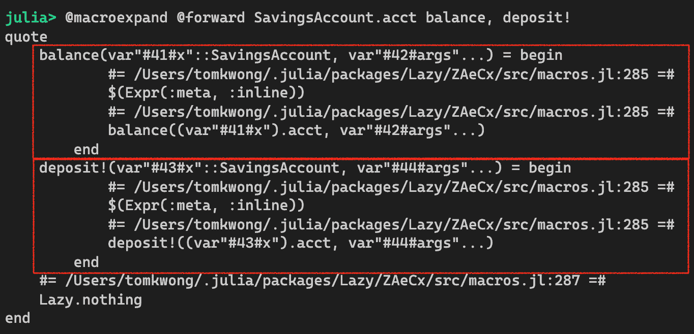

内联是编译器优化，其中函数调用被*内联*，就像代码被插入到当前代码中一样。它可能通过减少函数重复调用时分配调用栈的开销来提高性能。

`@forward`宏仅用几行代码就实现了。如果你对元编程感兴趣，鼓励你查看源代码。

你可能想知道为什么有几个有趣的变量名，如`#41#x`或`#42#args`。我们可以将它们视为普通变量。它们是由编译器自动生成的，并且选择了特殊的命名约定，以避免与当前作用域中的其他变量冲突。

最后，重要的是要理解我们可能并不总是希望将所有的函数调用转发到对象。如果我们不想使用底层功能的 100%呢？信不信由你，确实存在这样的情况。例如，让我们想象我们必须支持另一种类型的账户，比如定期存款单，也称为 CD。CD 是一种短期投资产品，其利率高于储蓄账户，但在投资期间资金不能提取。一般来说，CD 的期限可以是 3 个月、6 个月或更长。回到我们的代码，如果我们创建一个新的`CertificateOfDepositAccount`对象并再次重用`Account`对象，我们就不想转发`withdraw!`和`transfer!`方法，因为它们不是 CD 的功能。

你可能想知道委托在面向对象编程语言中与类继承有何不同。例如，在 Java 语言中，父类中的所有公共和受保护方法都会自动继承。这相当于自动转发父类中的所有方法。

无法选择要继承的内容实际上是为什么委托比继承更受欢迎的原因之一。对于更深入的讨论，请参阅第十二章，*继承和变异性*。

# 检查一些真实世界的例子

委托模式在开源包中得到了广泛的应用。例如，JuliaArrays GitHub 组织中的许多包实现了`AbstractArray`接口。特殊的数组类型通常包含一个常规的`AbstractArray`对象。

# 示例 1 – OffsetArrays.jl 包

`OffsetArrays.jl`包允许我们定义具有任意索引的数组，而不是标准的线性或笛卡尔风格索引。一个有趣的例子是使用基于零的数组，就像你可能在其他编程语言中找到的那样：

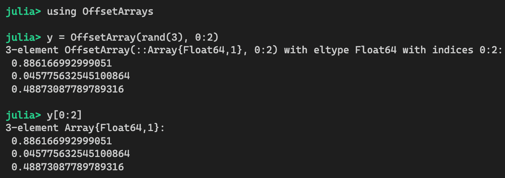

要理解这是如何工作的，我们需要深入研究源代码。让我们保持简洁，只审查代码的一部分：

```py
struct OffsetArray{T,N,AA<:AbstractArray} <: AbstractArray{T,N}
    parent::AA
    offsets::NTuple{N,Int}
end

Base.parent(A::OffsetArray) = A.parent

Base.size(A::OffsetArray) = size(parent(A))
Base.size(A::OffsetArray, d) = size(parent(A), d)

Base.eachindex(::IndexCartesian, A::OffsetArray) = CartesianIndices(axes(A))
Base.eachindex(::IndexLinear, A::OffsetVector) = axes(A, 1)
```

`OffsetArray`数据类型由`parent`和`offsets`字段组成。为了满足`AbstractArray`接口，它实现了某些基本功能，例如`Base.size`、`Base.eachindex`等。由于这些函数足够简单，代码只是手动将调用转发到父对象。

# 示例 2 – ScikitLearn.jl 包

让我们也看看`ScikitLearn.jl`包，它定义了一个一致的 API 来拟合机器学习模型和进行预测。

以下是如何定义`FitBit`类型的：

```py
""" `FitBit(model)` will behave just like `model`, but also supports
`isfit(fb)`, which returns true IFF `fit!(model, ...)` has been called """
mutable struct FitBit
    model
    isfit::Bool
    FitBit(model) = new(model, false)
end

function fit!(fb::FitBit, args...; kwargs...)
    fit!(fb.model, args...; kwargs...)
    fb.isfit = true
    fb
end

isfit(fb::FitBit) = fb.isfit
```

在这里，我们可以看到`FitBit`对象包含一个`model`对象，并且它添加了一个新功能，用于跟踪模型是否已被拟合：

```py

@forward FitBit.model transform, predict, predict_proba, predict_dist, get_classes
```

它使用`@forward`宏来代理所有主要功能，即`transform`、`predict`等。

# 考虑事项

你应该记住，代理模式引入了新的间接层次，这可能会增加代码复杂性，并使代码更难以理解。在决定是否使用代理模式时，我们应该考虑一些因素。

首先，你能从现有组件中重用多少代码？是 20%，50%，还是 80%？在你考虑重用现有组件之前，这应该是你最需要问的第一个问题。我们可以把重用量的比例称为利用率。显然，利用率越高，从重用角度来看就越好。

第二，通过重用现有组件可以节省多少开发工作量？如果开发相同功能性的成本很低，那么重用组件并增加额外间接的复杂性可能不值得。

从相反的角度来看，我们也应该审查现有组件中是否存在任何关键的业务逻辑。如果我们决定不重用组件，那么我们可能会再次实现相同的逻辑，违反了**不要重复自己**（**DRY**）原则。这意味着不重用组件可能会成为一个维护噩梦。

考虑到这些因素，我们应该对是否使用代理模式做出良好的判断。

接下来，我们将学习如何在 Julia 中实现特性。

# 神圣的特性模式

神圣的特性模式有一个有趣的名字。有些人也称它为**Tim Holy 特性技巧**（**THTT**）。正如你可能猜到的，这个模式是以 Tim Holy 的名字命名的，他是一位长期为 Julia 语言和生态系统做出贡献的贡献者。

特性是什么？简而言之，特性对应于对象的行为。例如，鸟儿和蝴蝶可以飞翔，因此它们都具有**CanFly**特性。海豚和乌龟可以游泳，因此它们都具有**CanSwim**特性。鸭子可以飞翔和游泳，因此它具有**CanFly**和**CanSwim**特性。特性通常是二元的——要么具有该特性，要么不具有——尽管这不是强制性的要求。

我们为什么想要特性？特性可以用作关于数据类型如何使用的正式合同。例如，如果一个对象具有**CanFly**特性，那么我们可以相当自信地认为该对象定义了某种**fly**方法。同样，如果一个对象具有**CanSwim**特性，那么我们可能可以调用某种**swim**函数。

让我们回到编程。Julia 语言没有内置对特性的支持。然而，该语言足够灵活，允许开发者通过多分派系统使用特性。在本节中，我们将探讨如何使用被称为神圣特性的特殊技术来实现这一点。

# 重新审视个人资产管理用例

当设计可重用软件时，我们经常创建抽象的数据类型并将行为与之关联。建模行为的一种方式是利用类型层次结构。遵循 Liskov 替换原则，当调用函数时，我们应该能够用子类型替换类型。

让我们回顾一下从第二章，*模块、包和类型概念*中管理个人资产的高级类型层次结构：


我们可以定义一个名为`value`的函数，用于确定任何资产的价值。如果我们假设所有资产类型都附带有某种货币价值，那么这个函数可以应用于`Asset`层次结构中的所有类型。沿着这条思路，我们可以说几乎每种资产都表现出*HasValue*特质。

有时，行为只能应用于层次结构中的某些类型。例如，如果我们想定义一个只与流动投资一起工作的`trade`函数怎么办？在这种情况下，我们会为`Investment`和`Cash`定义`trade`函数，但不会为`House`和`Apartments`定义。

流动投资是指可以在公开市场上轻松交易的证券工具。投资者可以快速将流动工具转换为现金，反之亦然。一般来说，大多数投资者在紧急情况下都希望他们的投资中有一部分是流动的。

非流动的投资被称为非流动资产。

编程上，我们如何知道哪些资产类型是流动的？一种方法是将对象类型与表示流动投资的类型列表进行比较。假设我们有一个资产数组，需要找出哪一个可以快速兑换成现金。在这种情况下，代码可能看起来像这样：

```py
function show_tradable_assets(assets::Vector{Asset})
    for asset in assets
        if asset isa Investment || asset isa Cash
            println("Yes, I can trade ", asset)
        else
            println("Sorry, ", asset, " is not tradable")
        end
    end
end
```

前面代码中的`if`条件有点丑陋，即使是这个玩具示例也是如此。如果我们有更多类型的条件，那么它会更糟。当然，我们可以创建一个联合类型来让它变得稍微好一些：

```py
const LiquidInvestments = Union{Investment, Cash}

function show_tradable_assets(assets::Vector{Asset})
    for asset in assets
        if asset isa LiquidInvestments
            println("Yes, I can trade ", asset)
        else
            println("Sorry, ", asset, " is not tradable")
        end
    end
end
```

这种方法有几个问题：

+   每当我们添加一个新的流动资产类型时，联合类型必须更新。从设计角度来看，这种维护是糟糕的，因为程序员必须记住在向系统中添加新类型时更新这个联合类型。

+   这个联合类型不可扩展。如果其他开发者想重用我们的交易库，他们可能想添加新的资产类型。然而，他们不能更改我们的联合类型定义，因为他们没有源代码。

+   如果-否则逻辑可能在我们的源代码的许多地方重复出现，每当我们需要对流动资产和非流动资产执行不同的操作时。

这些问题可以使用神圣特质模式来解决。

# 实现神圣特质模式

为了说明这种模式的概念，我们将实现一些函数，用于我们在第二章，*模块、包和数据类型概念*中开发的个人资产数据类型。如您所回忆的，资产类型层次结构的抽象类型定义如下：

```py
abstract type Asset end

abstract type Property <: Asset end
abstract type Investment <: Asset end
abstract type Cash <: Asset end

abstract type House <: Property end
abstract type Apartment <: Property end

abstract type FixedIncome <: Investment end
abstract type Equity <: Investment end
```

`Asset`类型位于层次结构的顶部，具有`Property`、`Investment`和`Cash`子类型。在下一级，`House`和`Apartment`是`Property`的子类型，而`FixedIncome`和`Equity`是`Investment`的子类型。

现在，让我们定义一些具体的类型：

```py
struct Residence <: House
    location
end

struct Stock <: Equity
    symbol
    name
end

struct TreasuryBill <: FixedIncome
    cusip
end

struct Money <: Cash
    currency
    amount
end
```

我们这里有什么？让我们更详细地看看这些概念：

+   一个`Residence`是某人居住的房屋，并且有一个位置。

+   一个`Stock`是股权投资，它通过交易符号和公司名称来识别。

+   `TreasuryBill`是美国政府发行的一种短期证券，它通过一个称为 CUSIP 的标准标识符来定义。

+   `Money`只是现金，但我们想在这里存储货币和相应的金额。

注意，我们没有注释字段的类型，因为它们在这里说明特性概念并不重要。

# 定义特性类型

当涉及到投资时，我们可以区分那些在公开市场上可以轻易换成现金的投资和那些需要相当多的努力和时间才能换成现金的投资。那些可以在几天内轻易换成现金的东西被称为是*流动的*，而难以出售的被称为是*非流动的*。例如，股票是流动的，而住宅则不是。

我们首先想定义特性本身：

```py
abstract type LiquidityStyle end
struct IsLiquid <: LiquidityStyle end
struct IsIlliquid <: LiquidityStyle end
```

特性在 Julia 中不过是数据类型！`LiquidityStyle`特性的整体概念是它是一个抽象类型。这里的具体特性，`IsLiquid`和`IsIlliquid`，已经被设置为没有字段的实体类型。

特性的命名没有标准约定，但我的研究似乎表明，包作者倾向于使用`Style`或`Trait`作为特性类型的后缀。

# 识别特性

下一步是为这些特性分配数据类型。方便的是，Julia 允许我们使用函数签名中的`<:`运算符批量分配特性到整个子类型树。

```py
# Default behavior is illiquid
LiquidityStyle(::Type) = IsIlliquid()

# Cash is always liquid
LiquidityStyle(::Type{<:Cash}) = IsLiquid()

# Any subtype of Investment is liquid
LiquidityStyle(::Type{<:Investment}) = IsLiquid()
```

让我们看看我们如何解释这三行代码：

+   我们选择默认将所有类型设置为非流动的。请注意，我们也可以反过来，默认将所有东西设置为流动的。这个决定是任意的，取决于特定的用例。

+   我们选择将所有`Cash`的子类型都做成流动的，这包括具体的`Money`类型。`::Type{<:Cash}`的表示法表明了`Cash`的所有子类型。

+   我们选择将所有`Investment`的子类型都做成流动的。这包括所有`FixedIncome`和`Equity`的子类型，在这个例子中涵盖了`Stock`。

你可能想知道为什么我们不将`::Type{<: Asset}`作为默认特性函数的参数。这样做使得它更加限制性，因为默认值只适用于在`Asset`类型层次结构下定义的类型。这可能是或可能不是所希望的，这取决于特性是如何使用的。无论如何都应该是可以的。

# 实现特性行为

现在我们能够判断哪些类型是流动的，哪些不是，我们可以定义接受具有这些特性的对象的方法。首先，让我们做一些非常简单的事情：

```py
# The thing is tradable if it is liquid
tradable(x::T) where {T} = tradable(LiquidityStyle(T), x)
tradable(::IsLiquid, x) = true
tradable(::IsIlliquid, x) = false
```

在 Julia 中，类型是一等公民。`tradable(x::T) where {T}`签名捕获了参数的类型作为`T`。由于我们已定义了`LiquidityStyle`函数，我们可以推导出传递的参数是否表现出`IsLiquid`或`IsIlliquid`特性。因此，第一个`tradable`方法只是接受`LiquidityStyle(T)`的返回值，并将其作为其他两个`tradable`方法的第一个参数传递。这个简单的例子展示了派发效应。

现在，让我们看看一个更有趣的函数，它利用了相同的特性。由于流动性资产在市场上很容易交易，我们应该能够快速发现它们的市场价格。对于股票，我们可以从证券交易所调用定价服务。对于现金，市场价格只是货币金额。让我们看看这是如何编码的：

```py
# The thing has a market price if it is liquid
marketprice(x::T) where {T} = marketprice(LiquidityStyle(T), x)
marketprice(::IsLiquid, x) = error("Please implement pricing function for ", typeof(x))
marketprice(::IsIlliquid, x) = error("Price for illiquid asset $x is not available.")
```

代码的结构与`tradable`函数相同。一个方法用于确定特性，而另外两个方法为流动性和非流动性工具实现不同的行为。在这里，两个`marketprice`函数只是通过调用错误函数来抛出异常。当然，这并不是我们真正想要的。我们真正想要的应该是一个针对`Stock`和`Money`类型的特定定价函数。好的；让我们就这样做：

```py
# Sample pricing functions for Money and Stock
marketprice(x::Money) = x.amount
marketprice(x::Stock) = rand(200:250)
```

在这里，`Money`类型的`marketprice`方法只是返回金额。这在实践中是一种相当简化的做法，因为我们可能需要从货币和金额中计算出当地货币（例如，美元）的金额。至于`Stock`，我们只是为了测试目的返回一个随机数。在现实中，我们会将这个函数附加到一个股票定价服务上。

为了说明目的，我们开发了以下测试函数：

```py
function trait_test_cash()
    cash = Money("USD", 100.00)
    @show tradable(cash)
    @show marketprice(cash)
end

function trait_test_stock()
    aapl = Stock("AAPL", "Apple, Inc.")
    @show tradable(aapl)
    @show marketprice(aapl)
end

function trait_test_residence()
    try 
        home = Residence("Los Angeles")
        @show tradable(home) # returns false
        @show marketprice(home) # exception is raised
    catch ex
        println(ex)
    end
    return true
end

function trait_test_bond()
    try
        bill = TreasuryBill("123456789")
        @show tradable(bill)
        @show marketprice(bill) # exception is raised
    catch ex
        println(ex)
    end
    return true
end

```

这是 Julia REPL 的结果：

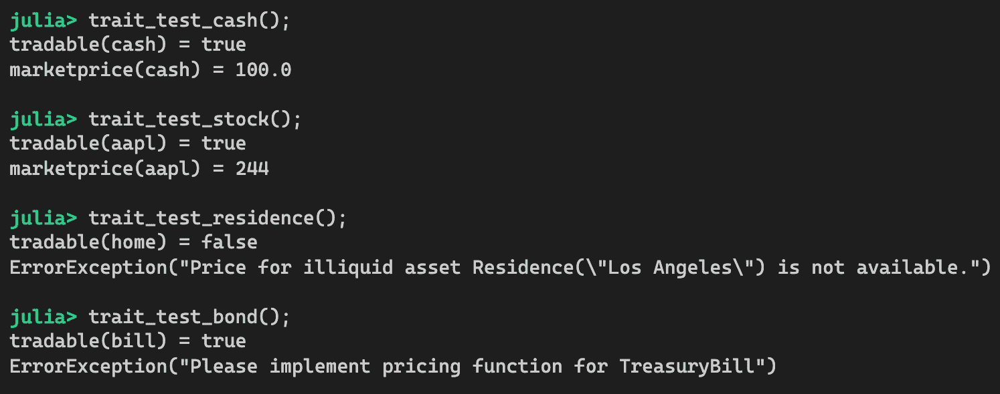

*完美！* `tradable`函数正确地识别出现金、股票和债券是流动的，而住宅是非流动的。对于现金和股票，`marketprice`函数能够返回预期的值。因为住宅不是流动的，所以抛出了一个错误。最后，虽然国库券是流动的，但由于`marketprice`函数尚未定义该工具，所以抛出了一个错误。

# 使用具有不同类型层次结构的特性

神圣特性模式的最佳部分在于我们可以用它来处理任何对象，即使它的类型属于不同的抽象类型层次结构。让我们看看文学案例，我们可能定义它自己的类型层次结构如下：

```py
abstract type Literature end

struct Book <: Literature
    name
end
```

现在，我们可以让它遵守 `LiquidityStyle` 特性，如下所示：

```py
# assign trait
LiquidityStyle(::Type{Book}) = IsLiquid()

# sample pricing function
marketprice(b::Book) = 10.0
```

现在，我们可以像其他可交易资产一样交易书籍。

# 审查一些常见用法

神圣特性模式在开源包中很常见。让我们看看一些例子。

# 示例 1 – Base.IteratorSize

Julia Base 库广泛使用特性。这样的特性之一是 `Base.IteratorSize`。它的定义可以通过 `generator.jl` 查找：

```py
abstract type IteratorSize end
struct SizeUnknown <: IteratorSize end
struct HasLength <: IteratorSize end
struct HasShape{N} <: IteratorSize end
struct IsInfinite <: IteratorSize end
```

这个特性与我们之前学到的略有不同，因为它不是二元的。`IteratorSize` 特性可以是 `SizeUnknown`、`HasLength`、`HasShape{N}` 或 `IsInfinite`。`IteratorSize` 函数定义如下：

```py
"""
    IteratorSize(itertype::Type) -> IteratorSize
"""
IteratorSize(x) = IteratorSize(typeof(x))
IteratorSize(::Type) = HasLength() # HasLength is the default

IteratorSize(::Type{<:AbstractArray{<:Any,N}}) where {N} = HasShape{N}()
IteratorSize(::Type{Generator{I,F}}) where {I,F} = IteratorSize(I)

IteratorSize(::Type{Any}) = SizeUnknown()
```

让我们专注于看起来相当有趣的 `IsInfinite` 特性。`Base.Iterators` 中定义了一些函数来生成无限序列。例如，`Iterators.repeated` 函数可以用来无限生成相同的值，我们可以使用 `Iterators.take` 函数从序列中选取值。让我们看看这是如何工作的：

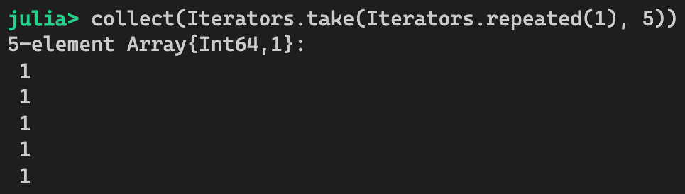

如果你查看源代码，你会看到 `Repeated` 是迭代器的类型，并且它被分配了 `IteratorSize` 特性 `IsInfinite`：

```py
IteratorSize(::Type{<:Repeated}) = IsInfinite()
```

我们可以快速测试它，如下所示：

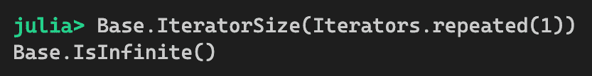

*Voila!* 它是无限的，正如我们所预期的！但是这个特性是如何被利用的呢？为了找出答案，我们可以查看 Base 库中的 `BitArray`，这是一个空间高效的布尔数组实现。它的构造函数可以接受任何可迭代对象，例如一个数组：

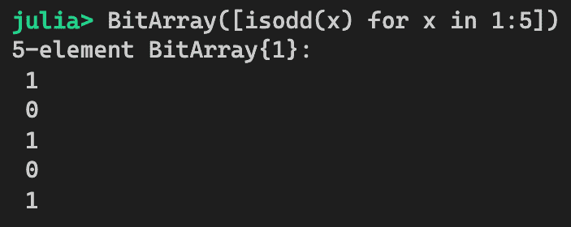

也许不难理解构造函数实际上无法处理本质上无限的事物！因此，`BitArray` 构造函数的实现必须考虑到这一点。因为我们可以根据 `IteratorSize` 特性进行分派，所以当传递这样的迭代器时，`BitArray` 的构造函数会愉快地抛出一个异常：

```py
BitArray(itr) = gen_bitarray(IteratorSize(itr), itr)

gen_bitarray(::IsInfinite, itr) = throw(ArgumentError("infinite-size iterable used in BitArray constructor"))
```

要看到它的实际应用，我们可以用 `Repeated` 迭代器调用 `BitArray` 构造函数，如下所示：

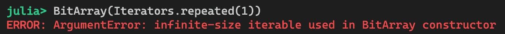

# 示例 2 – AbstractPlotting.jl ConversionTrait

`AbstractPlotting.jl` 是一个抽象绘图库，它是 Makie 绘图系统的一部分。这个库的源代码可以在 [`github.com/JuliaPlots/AbstractPlotting.jl`](https://github.com/JuliaPlots/AbstractPlotting.jl) 找到。

让我们看看一个与数据转换相关的特性：

```py
abstract type ConversionTrait end

struct NoConversion <: ConversionTrait end
struct PointBased <: ConversionTrait end
struct SurfaceLike <: ConversionTrait end

# By default, there is no conversion trait for any object
conversion_trait(::Type) = NoConversion()
conversion_trait(::Type{<: XYBased}) = PointBased()
conversion_trait(::Type{<: Union{Surface, Heatmap, Image}}) = SurfaceLike()
```

它定义了一个 `ConversionTrait`，可以用于 `convert_arguments` 函数。目前，转换逻辑可以应用于三种不同的场景：

1.  无转换。这由默认特质类型`NoConversion`处理。

1.  `PointBased`转换。

1.  `SurfaceLike`转换。

默认情况下，`convert_arguments`函数在不需要转换时仅返回未更改的参数：

```py
# Do not convert anything if there is no conversion trait
convert_arguments(::NoConversion, args...) = args
```

然后，定义了各种`convert_arguments`函数。以下是用于 2D 绘图的函数：

```py
*"""*
 *convert_arguments(P, x, y)::(Vector)*

*Takes vectors `x` and `y` and turns it into a vector of 2D points of the values*
*from `x` and `y`.*

*`P` is the plot Type (it is optional).*
*"""*
convert_arguments(::PointBased, x::RealVector, y::RealVector) = (Point2f0.(x, y),)
```

# 使用 SimpleTraits.jl 包

`SimpleTraits.jl`包([`github.com/mauro3/SimpleTraits.jl`](https://github.com/mauro3/SimpleTraits.jl))可能被用来使编程特质变得更容易。

让我们尝试使用 SimpleTraits 重新做`LiquidityStyle`的例子。首先，定义一个名为`IsLiquid`的特质，如下所示：

```py
@traitdef IsLiquid{T}
```

语法可能看起来有点不自然，因为`T`似乎没有做什么，但实际上它是必需的，因为特质适用于特定的类型`T`。接下来，我们需要为此特质分配类型：

```py
@traitimpl IsLiquid{Cash}
@traitimpl IsLiquid{Investment}
```

然后，可以使用带有四个冒号的特殊语法来定义具有特质的对象的功能：

```py
@traitfn marketprice(x::::IsLiquid) = error("Please implement pricing function for ", typeof(x))
@traitfn marketprice(x::::(!IsLiquid)) = error("Price for illiquid asset $x is not available.")
```

正例中，参数被注解为`x::::IsLiquid`，而负例中，参数被注解为`x::::(!IsLiquid)`。请注意，括号是必需的，这样代码才能被正确解析。现在，我们可以按照以下方式测试函数：

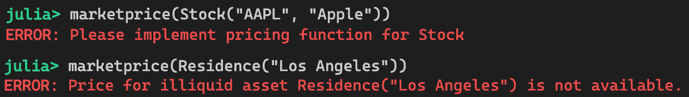

如预期的那样，两种默认实现都会抛出错误。现在，我们可以实现`Stock`的定价函数，并快速再次测试：

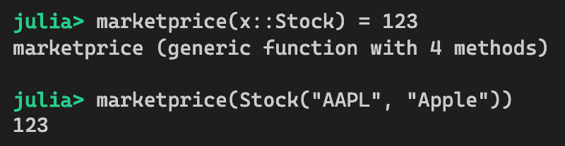

*看起来很棒!* 如我们所见，`SimpleTrait.jl`包简化了创建特质的流程。

使用特质可以使你的代码更具可扩展性。然而，我们必须记住，设计适当的特质需要一些努力。文档也同样重要，以便任何想要扩展代码的人都能理解如何利用预定义的特质。

接下来，我们将讨论参数化类型，这是一种常用于轻松扩展数据类型的常用技术。

# 参数化类型模式

参数化类型是核心语言特性，用于使用参数实现数据类型。这是一个非常强大的技术，因为相同的对象结构可以用于其字段中的不同数据类型。在本节中，我们将展示如何有效地应用参数化类型。

在设计应用时，我们经常创建复合类型以方便地持有多个字段元素。在其最简单形式中，复合类型仅作为字段的容器。随着我们创建越来越多的复合类型，可能会变得明显，其中一些类型看起来几乎相同。此外，操作这些类型的函数可能也非常相似。我们可能会产生大量的样板代码。如果有一个模板允许我们为特定用途自定义通用复合类型会怎么样？

考虑一个支持买卖股票的交易应用。在最初的版本中，我们可能有以下设计：

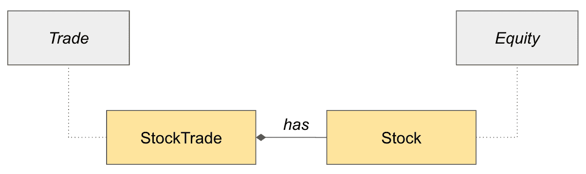

请注意，前面图表中的符号可能看起来非常像**统一建模语言**（**UML**）。然而，由于 Julia 不是面向对象的语言，我们在用这些图表说明设计概念时可能会做出某些例外。

相应的代码如下：

```py
# Abstract type hierarchy for personal assets
abstract type Asset end
abstract type Investment <: Asset end
abstract type Equity <: Investment end

# Equity Instruments Types 
struct Stock <: Equity
    symbol::String
    name::String
end

# Trading Types
abstract type Trade end

# Types (direction) of the trade
@enum LongShort Long Short

struct StockTrade <: Trade
    type::LongShort
    stock::Stock
    quantity::Int
    price::Float64
end
```

我们在前面代码中定义的数据类型相当直接。`LongShort`枚举类型用于指示交易方向——购买股票将是多头，而卖空股票将是空头。`@enum`宏方便地用于定义`Long`和`Short`常量。

现在，假设我们被要求在软件的下一个版本中支持股票期权。天真地，我们可以定义更多的数据类型，如下所示：

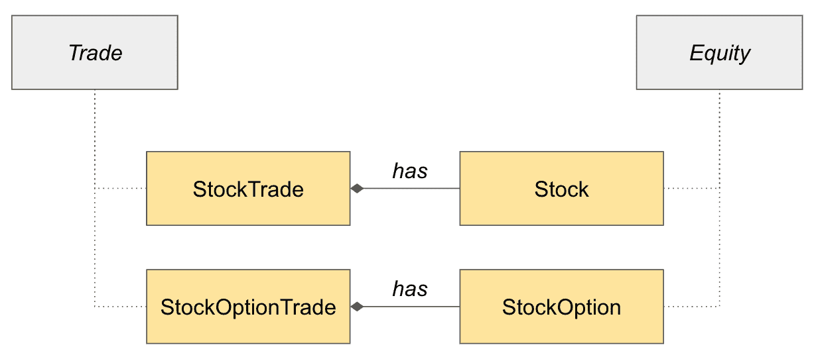

代码已更新，添加了额外的数据类型，如下所示：

```py
# Types of stock options
@enum CallPut Call Put

struct StockOption <: Equity
    symbol::String
    type::CallPut
    strike::Float64
    expiration::Date
end

struct StockOptionTrade <: Trade
    type::LongShort
    option::StockOption
    quantity::Int
    price::Float64
end
```

你可能已经注意到`StockTrade`和`StockOptionTrade`类型非常相似。这种重复多少有些令人不满意。当我们为这些数据类型定义函数时，看起来更糟糕，如下所示：

```py
# Regardless of the instrument being traded, the direction of 
# trade (long/buy or short/sell) determines the sign of the 
# payment amount.
sign(t::StockTrade) = t.type == Long ? 1 : -1
sign(t::StockOptionTrade) = t.type == Long ? 1 : -1

# market value of a trade is simply quantity times price
payment(t::StockTrade) = sign(t) * t.quantity * t.price
payment(t::StockOptionTrade) = sign(t) * t.quantity * t.price
```

对于`StockTrade`和`StockOptionTrade`类型，`sign`和`payment`方法非常相似。也许不难想象，当我们向应用中添加更多可交易类型时，这并不能很好地扩展。我们必须有更好的方法来做这件事。这正是参数类型发挥作用的地方！

# 利用去除文本参数类型为股票交易应用

在我们之前描述的交易应用中，我们可以利用参数类型简化代码，并在添加未来的交易工具时使其更具可重用性。

很明显，`SingleStockTrade`和`SingleStockOptionTrade`几乎相同。实际上，甚至`sign`和`payment`函数的定义也是相同的。在这个非常简单的例子中，我们只为每种类型有两个函数。在实践中，我们可能有更多的函数，这会变得相当混乱。

# 设计参数类型

为了简化这个设计，我们可以参数化所交易事物的类型。那是什么东西？我们可以在这里利用抽象类型。`Stock`的超类型是`Equity`，而`Equity`的超类型是`Investment`。由于我们希望保持代码通用，并且买卖投资产品是相似的，我们可以选择接受任何是`Investment`子类型的类型：

```py
struct SingleTrade{T <: Investment} <: Trade
    type::LongShort
    instrument::T
    quantity::Int
    price::Float64
end
```

现在，我们定义了一个新的类型，称为`SingleTrade`，其中基础工具的类型为`T`，`T`可以是`Investment`的任何子类型。在这个时候，我们可以创建不同种类的交易：

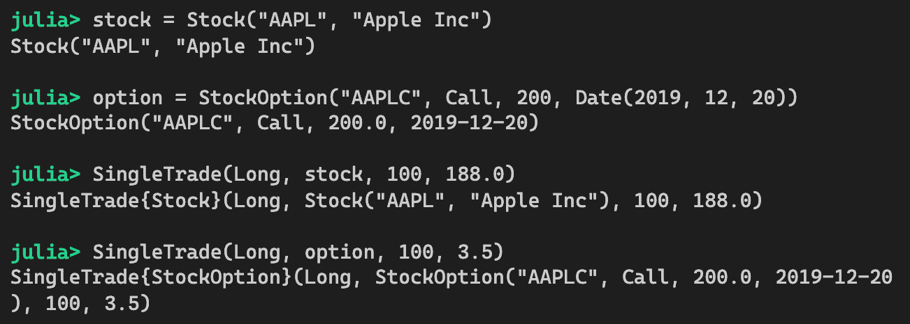

这些对象实际上有不同的类型——`SingleTrade{Stock}`和`SingleTrade{StockOption}`。它们之间是如何关联的呢？它们也是`SingleTrade`的子类型，如下面的截图所示：

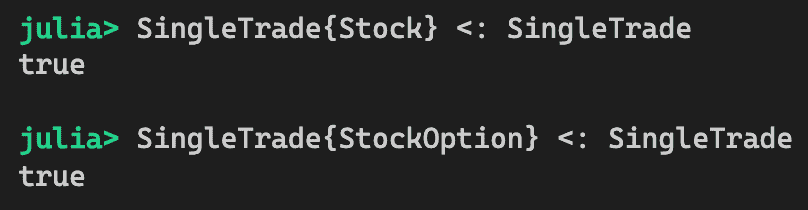

由于这两种类型都是`SingleTrade`的子类型，这允许我们定义适用于这两种类型的函数，正如我们将在下一节中看到的。

# 设计参数化方法

为了充分利用编译器的特化功能，我们应该定义同时使用参数化类型的参数化方法，如下所示：

```py
# Return + or - sign for the direction of trade
function sign(t::SingleTrade{T}) where {T} 
    return t.type == Long ? 1 : -1
end

# Calculate payment amount for the trade
function payment(t::SingleTrade{T}) where {T} 
    return sign(t) * t.quantity * t.price
end
```

让我们来测试一下：

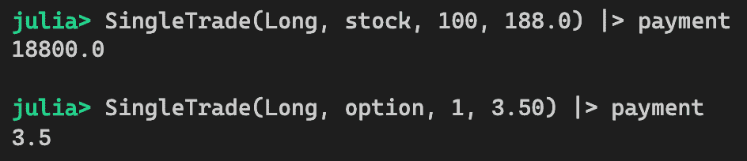

但是，嘿，我们刚刚发现了一个小错误。3.50 美元的期权看起来太好了，不像是真的！在查看买卖期权时，每个期权合约实际上代表 100 股基础股票。因此，股票期权交易的支付金额需要乘以 100。为了修复这个问题，我们可以简单地实现一个更具体的支付方法：

```py
# Calculate payment amount for option trades (100 shares per contract)
function payment(t::SingleTrade{StockOption})
    return sign(t) * t.quantity * 100 * t.price
end
```

现在，我们可以再次测试。因此，新方法仅针对期权交易进行分发：

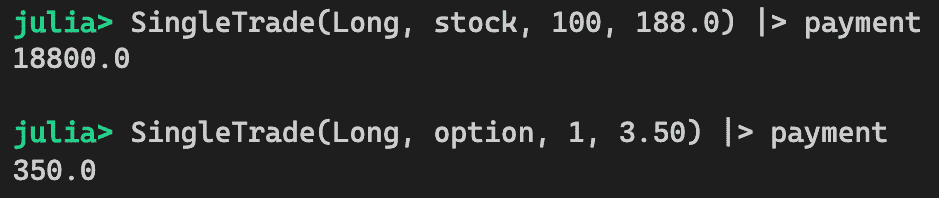

*哇！*这不是很美吗？我们将在下一节中看到一个更复杂的例子。

# 使用多个参数化类型参数

到目前为止，我们对重构相当满意。然而，我们的老板刚刚打电话来说，我们必须在下一个版本中支持*对冲交易*。这个新的请求又给我们的设计增添了另一个转折！

对冲交易可以用来实施特定的交易策略，例如市场中性交易或如保护性看涨期权等期权策略。

**市场中性**交易涉及同时买入一只股票和卖空另一只股票。其理念是抵消市场的影响，以便投资者可以专注于挑选相对于同行表现优异或表现不佳的股票。

**保护性看涨期权策略**涉及买入股票，但卖出执行价格更高的看涨期权。这允许投资者通过牺牲基础股票有限的上涨潜力来赚取额外的溢价。

这可以通过参数化类型轻松处理。让我们创建一个新的类型，称为`PairTrade`：

```py
struct PairTrade{T <: Investment, S <: Investment} <: Trade
    leg1::SingleTrade{T}
    leg2::SingleTrade{S}
end
```

注意，交易的两侧可以具有不同的类型，`T`和`S`，并且它们可以是`Investment`的任何子类型。因为我们期望每个`Trade`类型都支持`payment`函数，所以我们可以轻松实现，如下所示：

```py
payment(t::PairTrade) = payment(t.leg1) + payment(t.leg2)
```

我们可以重用前一个会话中的`stock`和`option`对象，创建一个对冲交易交易，其中我们买入 100 股股票并卖出 1 份期权合约。预期的支付金额是$18,800 - $350 = $18,450：

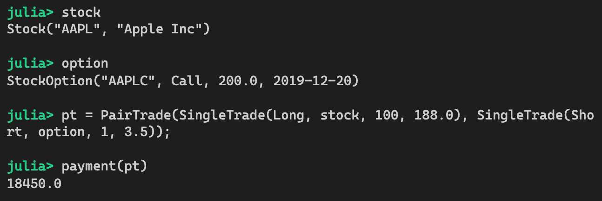

为了欣赏参数化类型如何简化我们的设计，想象一下，如果您必须创建单独的具体类型，您需要编写多少个函数。在这个例子中，由于对冲交易交易中存在两种可能的交易，并且每种交易可以是股票交易或期权交易，我们必须支持 2 x 2 = 4 种不同的场景：

+   `payment(PairTradeWithStockAndStock)`

+   `payment(PairTradeWithStockAndStockOption)`

+   `payment(PairTradeWithStockOptionAndStock)`

+   `payment(PairTradeWithStockOptionAndStockOption)`

使用参数化类型，我们只需要一个支付函数就可以涵盖所有场景。

# 现实生活中的例子

你几乎可以在任何开源包中找到参数化类型的使用。让我们来看一些例子。

# 示例 1 – ColorTypes.jl 包

`ColorTypes.jl` 是一个定义了表示颜色的各种数据类型的包。在实践中，定义颜色的方式有很多：**红-绿-蓝**（**RGB**）、**色调-饱和度-亮度**（**HSV**）等等。大多数情况下，可以使用三个实数来定义颜色。在灰度的情况下，只需要一个数字来表示暗度。为了支持透明颜色，可以使用额外的值来存储不透明度值。首先，让我们看看类型定义：

```py
*"""
`Colorant{T,N}` is the abstract super-type of all types in ColorTypes,
and refers to both (opaque) colors and colors-with-transparency (alpha
channel) information. `T` is the element type (extractable with
`eltype`) and `N` is the number of *meaningful* entries (extractable
with `length`), that is, the number of arguments you would supply to the
constructor.
"""*
abstract type Colorant{T,N} end

*# Colors (without transparency)
"""
`Color{T,N}` is the abstract supertype for a color (or
grayscale) with no transparency.
"""*
abstract type Color{T, N} <: Colorant{T,N} end

*"""
`AbstractRGB{T}` is an abstract supertype for red/green/blue color types that
can be constructed as `C(r, g, b)` and for which the elements can be
extracted as `red(c)`, `green(c)`, `blue(c)`. You should *not* make
assumptions about internal storage order, the number of fields, or the
representation. One `AbstractRGB` color-type, `RGB24`, is not
parametric and does not have fields named `r`, `g`, `b`.
"""*
abstract type AbstractRGB{T}      <: Color{T,3} end
```

`Color{T,N}` 类型可以表示所有种类的颜色，包括透明和不透明的。`T` 参数代表颜色定义中每个单独值的类型；例如，Int, Float64 等。`N` 参数代表颜色定义中的值数量，通常为三个。

`Color{T,N}` 是 `Colorant{T,N}` 的子类型，代表非透明颜色。最后，`AbstractRGB{T}` 是 `Color{T,N}` 的子类型。请注意，在 `AbstractRGB{T}` 中不再需要 `N` 参数，因为它已经定义为 N=3。现在，具体的参数化类型 `RGB{T}` 定义如下：

```py
const Fractional = Union{AbstractFloat, FixedPoint}

*"""
`RGB` is the standard Red-Green-Blue (sRGB) colorspace. Values of the
individual color channels range from 0 (black) to 1 (saturated). If
you want "Integer" storage types (for example, 255 for full color), use `N0f8(1)`
instead (see FixedPointNumbers).
"""*
struct RGB{T<:Fractional} <: AbstractRGB{T}
    r::T # Red [0,1]
    g::T # Green [0,1]
    b::T # Blue [0,1]
    RGB{T}(r::T, g::T, b::T) where {T} = new{T}(r, g, b)
end

```

`RGB{T <: Fractional}` 的定义相当直接。它包含三个类型为 `T` 的值，`T` 可以是 `Fractional` 的子类型。由于 `Fractional` 类型定义为 `AbstractFloat` 和 `FixedPoint` 的并集，因此 `r`、`g` 和 `b` 字段可以用任何 `AbstractFloat` 的子类型，如 `Float64` 和 `Float32`，或者任何 `FixedPoint` 数值类型。

`FixedPoint` 是在 `FixedPointNumbers.jl` 包中定义的类型。定点数是不同于浮点格式的表示实数的方式。更多信息可以在 [`github.com/JuliaMath/FixedPointNumbers.jl`](https://github.com/JuliaMath/FixedPointNumbers.jl) 找到。

如果你进一步检查源代码，你会发现许多类型是以类似的方式定义的。

# 示例 2 – NamedDims.jl 包

`NamedDims.jl` 包为多维数组的每个维度添加了名称。源代码可以在 [`github.com/invenia/NamedDims.jl`](https://github.com/invenia/NamedDims.jl) 找到。

让我们看看 `NamedDimsArray` 的定义：

```py
"""
The `NamedDimsArray` constructor takes a list of names as `Symbol`s,
one per dimension, and an array to wrap.
"""
struct NamedDimsArray{L, T, N, A<:AbstractArray{T, N}} <: AbstractArray{T, N}
    # `L` is for labels, it should be an `NTuple{N, Symbol}`
    data::A
end
```

不要被签名吓倒。实际上它相当直接。

`NamedDimsArray`是抽象数组类型`AbstractArray{T, N}`的子类型。它只包含一个字段，`data`，用于跟踪底层数据。因为`T`和`N`已经在`A`中作为参数，所以它们也需要在`NamedDimsArray`的签名中指定。`L`参数用于跟踪维度的名称。请注意，`L`在任何一个字段中都没有使用，但它方便地存储在类型签名本身中。

主要构造函数定义如下：

```py
function NamedDimsArray{L}(orig::AbstractArray{T, N}) where {L, T, N}
    if !(L isa NTuple{N, Symbol})
        throw(ArgumentError(
            "A $N dimensional array, needs a $N-tuple of dimension names. Got: $L"
        ))
    end
    return NamedDimsArray{L, T, N, typeof(orig)}(orig)
end
```

该函数只需要一个`AbstractArray{T,N}`，它是一个具有元素类型`T`的 N 维数组。首先，它检查`L`是否包含一个包含`N`个符号的元组。因为类型参数是一等公民，所以可以在函数体中检查它们。假设`L`包含正确的符号数量，它只需使用已知的参数`L`、`T`、`N`以及数组参数的类型来实例化一个`NamedDimsArray`。

可能更容易看到它是如何使用的，让我们看一下：


在输出中，我们可以看到类型签名是`NamedDimsArray{(:x, :y),Int64,2,Array{Int64,2}}`。将其与`NamedDimsArray`类型的签名匹配，我们可以看到`L`是两个符号的元组`(:x, :y)`，`T`是`Int64`，`N`是 2，底层数据是`Array{Int64, 2}`类型。

让我们看看`dimnames`函数，其定义如下：

```py
dimnames(::Type{<:NamedDimsArray{L}}) where L = L
```

此函数返回维度元组：

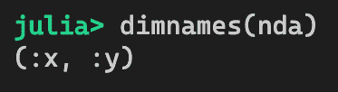

现在，事情变得有点更有趣了。`NamedDimsArray{L}`是什么？我们在这个类型中不是需要四个参数吗？值得注意的是，像`NamedDimsArray{L, T, N, A}`这样的类型实际上是`NamedDimsArray{L}`的子类型。我们可以如下证明这一点：

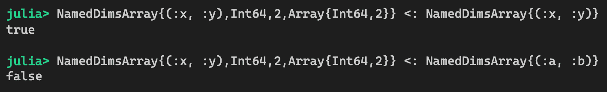

如果我们真的想了解`NamedDimsArray{L}`是什么，我们可以尝试以下方法：

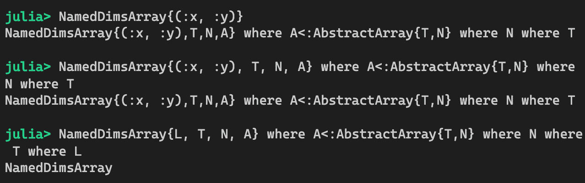

看起来正在发生的事情是`NamedDimsArray{(:x, :y)}`只是`NamedDimsArray{(:x, :y),T,N,A}`的简写，其中`A<:AbstractArray{T,N}`，`N`和`T`是未知的参数。因为这是一个具有三个未知参数的更一般类型，所以我们可以看到为什么`NamedDimsArray{(:x, :y),Int64,2,Array{Int64,2}}`是`NamedDimsArray{(:x, :y)}`的子类型。

如果我们希望重用功能，使用参数化类型是非常好的。我们可以几乎将每个类型参数视为一个"维度"。当一个参数化类型有两个类型参数时，我们会根据每个类型参数的各种组合有许多可能的子类型。

# 摘要

在本章中，我们探讨了与重用性相关的几个模式。这些模式非常有价值，可以在应用程序的许多地方使用。此外，来自面向对象背景的人可能会发现，在设计 Julia 应用程序时，这一章是不可或缺的。

首先，我们详细介绍了委派模式，它可以用来创建新的功能，并允许我们重用现有对象的功能。一般技术涉及定义一个新的数据类型，该类型包含一个父对象。然后，定义转发函数，以便我们可以重用父对象的功能。我们了解到通过使用由 `Lazy.jl` 包提供的 `@forward`，可以大大简化实现委派。

然后，我们研究了神圣的特质模式，这是一种正式定义对象行为的方式。其思路是将特质定义为原生类型，并利用 Julia 的内置调度机制来调用正确的方法实现。我们意识到特质在使代码更可扩展方面很有用。我们还了解到来自 `SimpleTraits.jl` 包的宏可以使特质编码更容易。

最后，我们探讨了参数化类型模式及其如何被用来简化代码的设计。我们了解到参数化类型可以减小我们代码的大小。我们还看到参数可以在参数化函数的主体中使用。

在下一章中，我们将讨论一个吸引许多人学习 Julia 编程语言的重要主题——性能模式！

# 问题

1.  委派模式是如何工作的？

1.  特质的目的是什么？

1.  特质总是二元的吗？

1.  特质能否用于不同类型层次的对象？

1.  参数化类型的优点是什么？

1.  我们如何存储参数化类型的信息？
