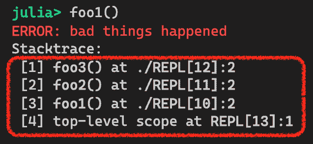

# 第八章：健壮性模式

本章将介绍几种可以提高软件健壮性的模式。当我们提到健壮性时，我们指的是质量方面，即软件能否正确执行其功能？是否妥善处理了所有可能的场景？这是在编写关键任务系统代码时需要考虑的一个极其重要的因素。

根据**最小权限原则**（**POLP**），我们会考虑隐藏不必要的实现细节给接口的客户端。然而，Julia 的数据结构是透明的——所有字段都自动暴露并可访问。这可能会带来潜在的问题，因为任何不当的使用或修改都可能破坏系统。此外，通过直接访问字段，代码与对象的底层实现耦合得更紧密。那么，如果需要更改字段名怎么办？如果需要用另一个字段替换它怎么办？因此，有必要应用抽象，将对象实现与其官方接口解耦。我们应该采用更通用的定义——不仅希望覆盖尽可能多的代码行，还希望涵盖所有可能的场景。代码覆盖率的提高将使我们更有信心地确保代码的正确性。

我们将这些技术分为以下几部分：

+   访问者模式

+   属性模式

+   代码块模式

+   异常处理模式

到本章结束时，你将能够通过开发自己的访问器函数和属性函数来封装数据访问。你还将能够隐藏模块外的意外访问的全局变量。最后，你还将了解各种异常处理技术，并理解如何重试失败的操作。

*让我们开始吧！*

# 技术要求

本章的示例源代码可以在[`github.com/PacktPublishing/Hands-on-Design-Patterns-and-Best-Practices-with-Julia/tree/master/Chapter08`](https://github.com/PacktPublishing/Hands-on-Design-Patterns-and-Best-Practices-with-Julia/tree/master/Chapter08)找到。

代码在 Julia 1.3.0 环境中进行了测试。

# 访问者模式

Julia 对象是透明的。这是什么意思呢？目前，Julia 语言没有能力对对象的字段应用访问控制。因此，来自 C++或 Java 背景的人可能会觉得有点不习惯。在本节中，我们将探讨多种方法，使语言更易于那些寻求更多访问控制的用户接受。

因此，我们可能首先应该定义我们的需求。在我们编写需求的同时，我们也会问自己为什么一开始就要有这些需求。让我们考虑一下 Julia 程序中的任何对象：

+   **一些字段需要对外界隐藏**：一些字段被认为是公共接口的一部分，因此它们被完全文档化和支持。其他字段被认为是实现细节，它们可能不会被使用，因为它们可能会在未来发生变化。

+   **一些字段在修改之前需要验证**：一些字段可能只能接受一定范围内的值。例如，一个 `Person` 对象的 `age` 字段可能会拒绝小于 0 或大于 120 的任何值！避免无效数据对于构建健壮的系统至关重要。

+   **一些字段在读取之前需要触发器**：一些字段可能是延迟加载的，这意味着它们只有在读取值时才会被加载。另一个原因是，一些字段可能包含敏感数据，并且为了审计目的，必须记录对这些字段的用途。

我们现在将讨论如何满足这些要求。

# 识别对象的隐含接口

在我们深入具体模式之前，让我们先快速地绕道一下，讨论一下我们最初是如何以及为什么会有这个问题。

假设我们已经定义了一个名为 `Simulation` 的数据类型，用于跟踪一些科学实验数据和相关的统计信息。它的语法如下：

```py
mutable struct Simulation{N}
    heatmap::Array{Float64, N}
    stats::NamedTuple{(:mean, :std)}
end
```

一个 `Simulation` 对象包含一个 N 维浮点值数组和统计值的命名元组。为了演示目的，我们将创建一个简单的函数来执行模拟并创建一个对象，如下所示：

```py
using Distributions

function simulate(distribution, dims, n) 
    tp = ntuple(i -> n, dims)
    heatmap = rand(distribution, tp...)
    return Simulation{dims}(heatmap, (mean = mean(heatmap), std = std(heatmap)))
end
```

使用用户提供的分布的 `rand` 函数生成的模拟数据称为 `heatmap`。`dims` 参数表示数组中的维度数，而 `n` 的值表示每个维度的尺寸。以下是如何模拟一个大小为 1000 x 1000 的正态分布二维热图的示例：

```py
sim = simulate(Normal(), 2, 1000);
```

在这一点上，我们可以轻松地访问对象的 `heatmap` 和 `stats` 字段，如下所示：


让我们暂停一下。直接访问字段是否可以？我们可以在这里争论说这不行。主要原因是存在一个隐含的假设，即字段名称代表对象的公共接口。

不幸的是，这样的假设在现实中可能有点脆弱。正如任何经验丰富的程序员都会指出的，软件总是需要改变。*总是需要*改变。世界不是静态的，需求也不是一成不变的。例如，以下是一些肯定会破坏我们的编程接口的可能变化：

+   将 `heatmap` 字段的名称更改为 `heatspace`，因为新的名称更适合三维或更高维度的数据

+   将 `stats` 字段的数据类型从命名元组更改为新的 `struct` 类型，因为它已经增长到包括更复杂的统计度量，并且我们希望随着它开发新的函数

+   完全移除 `stats` 字段，并在运行时计算它

如您所见，编程接口不能轻率对待。为了构建持久的软件，我们需要对每个接口都清楚，并了解如何在未来支持它们。

提供对象接口的一种方法是通过创建评估函数，在其他编程语言中有时称为获取器和设置器。因此，在接下来的几节中，让我们看看如何使用它们。

# 实现获取器函数

在主流面向对象的语言中，我们经常实现获取器来访问对象的字段。在 Julia 中，我们也可以创建获取器函数。在实现获取器函数时，我们可以选择哪些字段作为**应用程序编程接口**（**API**）的一部分进行暴露。在我们的示例中，我们将为两个字段都实现获取器函数，如下所示：

```py
get_heatmap(s::Simulation) = s.heatmap
get_stats(s::Simulation) = s.stats
```

在这里我们选择的函数名称对于 Julia 语言来说有些非习惯用法。更好的约定是直接使用名词：

```py
heatmap(s::Simulation) = s.heatmap
stats(s::Simulation) = s.stats
```

因此，当我们阅读使用`heatmap`函数的代码时，我们可以将其视为*模拟的热图*。同样，当使用`stats`函数时，我们可以将其视为*模拟的统计数据*。

这些获取器函数的目的是为对象定义一个正式的数据检索接口。如果我们需要更改底层字段的名称（甚至类型），只要公共接口不变，那就没问题。此外，我们甚至可以删除`stats`字段，并在`stats`函数中直接实现统计计算。现在，我们可以轻松地维护任何使用此对象的程序的向后兼容性。

接下来，我们将探讨对象的写访问权限。

# 实现设置器函数

对于可变类型，我们可能需要实现设置器。其范围包括只能被修改的字段。对于我们的模拟项目，假设我们希望允许客户端程序对热图进行一些转换并将其放回对象中。我们可以轻松地支持这个用例，如下面的代码片段所示：

```py
function heatmap!(
        s::Simulation{N}, 
        new_heatmap::AbstractArray{Float64, N}) where {N}
    s.heatmap = new_heatmap
    s.stats = (mean = mean(new_heatmap), std = std(new_heatmap))
    return nothing
end
```

设置器函数`heatmap!`接受一个`Simulation`对象和一个新的热图数组。因为`stats`字段包含底层热图的统计数据，我们必须通过重新计算统计数据并更新字段来在对象内部保持一致性。请注意，这种一致性的保证只有在提供设置器函数时才可能。否则，如果我们允许用户直接修改对象中的`heatmap`字段，对象就会处于不一致的状态。

另一个好处是，我们可以在设置器函数中执行数据验证。例如，我们可以控制地图的大小，并在热图的大小包含奇形状时抛出错误：

```py
function heatmap!(
            s::Simulation{N}, 
            new_heatmap::AbstractArray{Float64, N}) where {N}
    if length(unique(size(new_heatmap))) != 1
        error("All dimensions must have same size")
    end
    s.heatmap = new_heatmap
    s.stats = (mean = mean(new_heatmap), std = std(new_heatmap))
    return nothing
end
```

在这里，我们首先确定 `new_heatmap` 的大小，它应该作为一个元组返回。然后，我们找出这个元组中有多少唯一的值。如果元组中只有一个唯一的数字，那么我们知道数组是正方形、立方体等等。否则，我们只需将错误抛回调用者。

就像获取函数一样，设置函数充当一个公共接口，其中对象的数據可能会被修改。在我们有了获取和设置函数之后，我们可以期待调用者通过接口进行操作。但原始字段仍然可以直接访问。那么，我们如何阻止这种情况发生呢？让我们在下一节中探讨这个问题。

# 阻止直接访问字段

虽然获取和设置函数很方便，但很容易忘记这些函数，所以程序最终会直接访问字段。那会很糟糕，因为我们刚刚花费了所有这些努力创建获取和设置函数，但它们最终被绕过了。

一种可能的解决方案是通过对字段重命名，使其看起来显然是私有的，来阻止直接访问字段。一个常见的约定是在字段名前加上下划线。

对于我们的示例，我们可以将结构体重新定义为以下内容：

```py
mutable struct Simulation{N}
    _heatmap::Array{Float64, N}
    _stats::NamedTuple{(:mean, :std)}
end
```

这些奇特命名的字段将仅在 `Simulation` 类型的实现中使用，所有外部使用都将避免它们。这样的约定可以阻止程序员直接访问字段。

然而，我们中的一些人可能对这种解决方案不太满意，因为使用编码约定来强制正确使用编程接口是一种非常薄弱的方法。这种担忧是非常合理的，尤其是当我们对自己软件的鲁棒性有更高的标准时。因此，在下一节中，我们将探讨一种更强大的技术，这将使我们能够通过编程方式控制访问。

# 属性模式

在本节中，我们将深入探讨如何通过使用属性接口来对对象的字段实施更细粒度的控制。Julia 的属性接口允许你为字段访问中使用的点符号提供自定义实现。通过覆盖标准行为，我们可以对引用或分配的字段应用任何类型的访问控制和验证。为了说明这个概念，我们将在下面处理一个新的用例——实现懒文件加载器。

# 引入懒文件加载器

假设我们正在开发一个支持懒加载的文件加载功能。这里的“懒”指的是在需要内容之前不加载文件。让我们看看以下代码：

```py
mutable struct FileContent
    path
    loaded
    contents
end
```

`FileContent` 结构体包含三个字段：

+   `path`: 文件的位置

+   `loaded`: 一个布尔值，表示文件是否已被加载到内存中

+   `contents`: 包含文件内容的字节数组

这里是该结构体的构造函数：

```py
function FileContent(path) 
    ss = lstat(path)
    return FileContent(path, false, zeros(UInt8, ss.size))
end
```

就像我们的当前设计一样，我们预先为文件分配内存，但我们不会在之后读取文件内容。文件的大小由对 `lstat` 函数的调用确定。在创建 `FileContent` 对象时，我们将 `loaded` 字段初始化为 `false` 值——这表明文件尚未加载到内存中。

最终，我们必须加载文件内容，所以我们提供了一个单独的函数来读取文件到预先分配的字节缓冲区：

```py
function load_contents!(fc::FileContent)
    open(fc.path) do io
        readbytes!(io, fc.contents)
        fc.loaded = true
    end
    nothing
end
```

让我们运行一个快速测试来看看它的工作情况：


这里，我们刚刚创建了一个新的 `FileContent` 对象。显然，`loaded` 字段包含一个 `false` 值，因为我们还没有读取文件。`content` 字段也充满了零。

现在让我们加载文件内容：


现在，`contents` 字段包含了一些真实数据，而 `loaded` 字段具有 `true` 的值。当然，我们现在只是照看并手动运行代码。我们的想法是实现懒加载。我们需要一种方法来拦截对 `contents` 字段的任何 *读取* 操作，以便及时加载文件内容。理想情况下，这应该发生在有人使用 `fc.contents` 表达式时。为了 *劫持* 获取 `fc.contents` 的调用，我们首先必须理解 Julia 的点符号是如何工作的。让我们现在绕道而行，回顾一下。

# 理解字段访问的点符号

通常，当我们需要访问对象的特定字段时，我们可以方便地将其写成 `object.fieldname`。实际上，这种表示法是 `getproperty` 函数调用的 *语法糖*，即一些 *甜蜜* 的语法。为了清楚起见，每当我们在以下格式中编写代码：

```py
object.fieldname
```

它被转换为一个对 `getproperty` 的函数调用：

```py
getproperty(object, :fieldname)
```

对于我们的懒加载文件示例，`fc.path` 实际上与 `getproperty(fc, :path)` 相同。

所有这些魔法都是由 Julia 编译器自动执行的。关于 Julia 的一个好处是这种魔法相当透明。我们可以通过使用 `Meta.lower` 函数来实际看到编译器做了什么，如下所示：


类似地，当我们向对象的字段赋值时，也会发生类似的转换：


从前面的结果中，我们可以看到当代码将字符串赋值给 `fc.path` 时，它只是转换为一个 `setproperty!(fc, :path, "/etc/hosts")` 函数调用。

我们不要就此止步。`getproperty` 和 `setproperty!` 函数具体是做什么的呢？嗯，它们恰好是定义在 `Base` 模块中的普通 Julia 函数。理解它们是如何工作的最佳方式是检查 Julia 的源代码本身。从 Julia REPL 中，我们可以轻松地调出源代码，如下所示：


从前面的代码中，我们可以看到`@edit`宏用于定位被调用函数的源代码——在本例中是`getproperty`。从 REPL 终端，它应该打开你的编辑器并显示如下代码：


*啊哈!* 我们看到`getproperty`函数只是将调用转发到`getfield`，后者用于从对象中提取数据。同一源文件中的下一行显示了`setproperty!`的定义。`setproperty!`的实现稍微有趣一些。除了使用`setfield!`函数来修改对象中的字段外，它还将`v`值转换为对象`x`中字段的类型，这是通过调用`fieldtype`确定的。

`getfield`函数是一个用于从现有对象获取任何字段值的内置函数。它接受两个参数——一个对象和一个符号。例如，要从`FileContent`对象获取路径，我们可以使用`getfield(fc, :path)`。同样，`setfield!`函数用于更新现有对象的任何字段。`getfield`和`setfield!`都是 Julia 实现中的低级函数。

类型转换很方便，尤其是对于数值类型。例如，一个对象存储一个`Float64`字段，但代码恰好传递了一个整数。当然，转换逻辑比仅仅数值类型更通用。对于自定义类型，只要定义了一个`convert`函数，相同的自动转换过程就可以正常工作。

现在我们已经了解了点符号是如何转换为`getproperty`和`setproperty!`函数调用的，我们可以为我们的文件加载器开发懒加载功能。

# 实现读写访问和懒加载

为了实现懒加载，我们可以扩展`getproperty`函数。在调用过程中，我们可以检查文件内容是否已经加载。如果没有，我们就在返回数据给调用者之前加载文件内容。

扩展`getproperty`函数就像简单地使用`FileContent`类型和一个符号作为函数参数来定义它一样简单。以下代码展示了这一点：

```py
function Base.getproperty(fc::FileContent, s::Symbol)
    direct_passthrough_fields = (:path, )
    if s in direct_passthrough_fields
        return getfield(fc, s)
    end
    if s === :contents
        !getfield(fc, :loaded) && load_contents!(fc)
        return getfield(fc, :contents)
    end
    error("Unsupported property: $s")
end
```

重要的是我们定义了`Base.getproperty`函数而不是仅仅`getproperty`。这是因为编译器会将点符号转换为`Base.getproperty`而不是你自己的模块中的`getproperty`函数。如果这还不清楚，你被鼓励回顾第二章中“理解命名空间、模块和包”部分的*理解命名空间、模块和包*。

我们选择在函数名定义中使用`Base`作为前缀。这种编码风格更受欢迎，因为它从函数定义中可以清楚地看出，我们正在扩展`Base`包中的`getproperty`函数。

从另一个包扩展函数的另一种方法是首先导入第三方包。对于前面的例子，我们可以这样写。这种编码风格不推荐，因为它不太明显地表明正在定义的 `getproperty` 函数是 `Base` 函数的扩展：

`import Base: getproperty`

`function getproperty(fc::FileContent, s::Symbol)`

` ....`

`end`

与之相反，`getproperty` 函数必须处理所有可能的属性名称。让我们首先考虑以下代码段：


在这种情况下，我们必须支持 `:path` 和 `:contents`。如果 `s` 符号是我们想要直接传递的字段之一，那么我们只需将调用转发给 `getfield` 函数。

现在，让我们考虑下一段代码：


如果符号是 `:contents`，那么我们检查 `loaded` 字段的值。如果 `loaded` 字段包含 `false`，那么我们调用 `load_contents!` 函数将文件内容加载到内存中。

注意，我们在整个函数中到处都使用了 `getfield`。如果我们使用正常的点符号编写代码，例如 `fc.loaded`，那么它将开始调用 `getproperty` 函数，我们可能会陷入无限递归。

如果字段名称不是支持的名称之一，那么我们只需抛出一个异常，如下所示：


一个有趣的观察是，我们决定只支持两个属性名称——`path` 和 `contents`——并且我们放弃了 `loaded` 属性的支持。这样做的原因是 `loaded` 字段实际上被用作对象的内部状态。没有理由将其作为公共编程接口的一部分暴露出来。正如我们在本章讨论软件健壮性时，我们也可以欣赏只暴露必要信息的代码开发。

一个类比是数据总是 *分类* 的，但只能根据 *需要了解* 的原则释放，这是政府官员通常用来描述高度敏感数据的方式。

我们几乎完成了。唯一剩下的工作是将 `load_content!` 函数重构为使用 `getfield` 和 `setfield!` 而不是点符号：

```py
# lazy load
function load_contents!(fc::FileContent)
    open(getfield(fc, :path)) do io
        readbytes!(io, getfield(fc, :contents))
        setfield!(fc, :loaded, true)
    end
    nothing
end
```

我们现在可以测试懒加载功能：


对 `path` 和 `contents` 字段的两次引用都工作正常。特别是，对 `fc.contents` 的引用触发了文件加载，然后返回了正确的内容。那么 `loaded` 字段发生了什么？让我们试试：


*Voila!* 我们已经成功阻止了直接访问 `loaded` 字段。

属性接口使我们能够管理读访问并实现懒加载功能。接下来，我们将探讨如何管理写访问。

# 控制对象字段的写访问

为了管理对对象字段的写访问，我们可以像控制读访问一样扩展`setproperty!`函数。

让我们回顾一下`FileContent`数据类型是如何设计的：

```py
mutable struct FileContent
    path
    loaded
    contents
end
```

假设我们想要允许用户通过将`path`字段修改为新文件位置来切换到不同的文件。除此之外，我们还想防止直接使用点符号修改`loaded`和`contents`字段。为了实现这一点，我们可以扩展`setproperty!`函数，如下所示：

```py
function Base.setproperty!(fc::FileContent, s::Symbol, value)
    if s === :path
        ss = lstat(value)
        setfield!(fc, :path, value)
        setfield!(fc, :loaded, false)
        setfield!(fc, :contents, zeros(UInt8, ss.size))
        println("Object re-initialized for $value (size $(ss.size))")
        return nothing
    end
    error("Property $s cannot be changed.")
end
```

为了扩展`setproperty!`函数，我们必须在函数定义中每次需要更改对象中的任何字段时使用`setfield!`。

在这种情况下，当用户尝试将值赋给`path`字段时，我们只需像在构造函数中做的那样重新初始化对象。这涉及到设置`path`和`loaded`字段的值，以及为文件内容预分配内存空间。让我们现在就进行测试：


如果用户尝试将值赋给任何其他字段，将会抛出错误：


通过扩展`setproperty!`函数，我们已经成功控制了对任何对象的任何字段的写访问。

虽然可以控制对单个字段的访问，但我们无法防止对字段底层数据的额外更改。例如，`contents`属性只是一个字节数组，程序员应该能够更改数组中的元素。如果我们想保护数据不被修改，我们可以在`getproperty`调用中返回`contents`字节数组的副本。

到目前为止，我们已经知道如何实现`getproperty`和`setproperty!`函数，以便我们可以控制对对象各个字段的访问。接下来，我们将探讨如何记录可用的属性。

# 报告可访问字段

开发环境经常可以帮助程序员正确输入字段名。在 Julia 的 REPL 中，当我输入点字符后按两次*Tab*键，它将尝试自动完成并显示可用的字段名：


现在我们已经实现了`getproperty`和`setproperty!`函数，列表就不再准确了。更具体地说，`loaded`字段不应显示，因为它既不能被访问也不能被修改。为了修复这个问题，我们可以简单地扩展`propertynames`函数，如下所示：

```py
function Base.propertynames(fc::FileContent)
    return (:path, :contents)
end
```

`propertynames`函数只需返回一个有效符号的元组。函数定义后，REPL 将只显示有效的字段名，如下所示：


在本节中，我们学习了如何利用 Julia 的属性接口来控制对对象任何字段的读和写访问。这是一个编写健壮程序的基本技术。

虽然使用属性接口似乎满足了我们之前设定的要求的大部分，但它并不是万无一失的。

例如，没有任何东西阻止程序直接在任何对象上调用`getfield`和`setfield!`函数。除非语言更新以支持粒度字段访问控制，否则不可能完全从程序员那里隐藏这一点。这样的功能可能在将来可用。

接下来，我们将探讨一些与限制变量作用域相关的模式，这样我们就可以最小化私有变量对外界的暴露。

# 块模式

本章的反复主题是学习如何改进并更多地控制公共 API 中数据和函数的可见性和可访问性。通过强制编程接口的访问，我们可以保证程序的利用方式。此外，我们可以专注于测试*宣传*的接口。

目前，Julia 在模块内封装实现细节方面提供的帮助很少。虽然我们可以使用`export`关键字将某些函数和变量暴露给其他模块，但它并不是为了成为一个访问控制或数据封装功能。你总是可以*窥视*模块并访问任何变量或函数，即使它们没有被导出。

在本节中，我们将继续这一趋势，并介绍我们可以用来限制模块中变量或函数访问的一些策略。在这里，我们将使用网络爬虫用例来说明问题和可能的解决方案。

# 介绍网络爬虫用例

假设我们必须构建一个可以用于从各种网站索引内容的网络爬虫。这个过程涉及设置目标网站列表并启动爬虫。让我们创建一个具有以下结构的模块：

```py
module WebCrawler

using Dates

# public interface
export Target
export add_site!, crawl_sites!, current_sites, reset_crawler!

# == insert global variables and functions here ==

end # module
```

我们的编程接口相当简单。让我们看看如何做到这一点：

1.  `Target`是一种表示正在被爬取的网站的数据类型。然后，我们可以使用`add_site!`函数将新的目标网站添加到列表中。

1.  准备就绪后，我们只需调用`crawl_sites!`函数来访问所有网站。

1.  为了方便，可以使用`current_sites`函数来查看当前目标网站列表及其爬取状态。

1.  最后，可以使用`reset_crawler!`函数来重置网络爬虫的状态。

现在让我们看看数据结构。`Target`类型用于维护目标网站的 URL。它还包含一个关于状态和完成爬取时间的布尔变量。结构体定义如下：

```py
Base.@kwdef mutable struct Target
    url::String
    finished::Bool = false
    finish_time::Union{DateTime,Nothing} = nothing
end
```

为了跟踪当前的目标网站，使用了一个全局变量：

```py
const sites = Target[]
```

为了完成网络爬虫的实现，我们在模块中定义了以下函数：

```py
function add_site!(site::Target)
    push!(sites, site)
end

function crawl_sites!()
    for s in sites
        index_site!(s)
    end
end

function current_sites()
    copy(sites)
end

function index_site!(site::Target)
    site.finished = true
    site.finish_time = now()
    println("Site $(site.url) crawled.")
end

function reset_crawler!()
    empty!(sites)
end
```

要使用网络爬虫，首先，我们可以添加一些网站，如下所示：


然后，我们只需运行爬虫并在之后检索结果：


当前的实现并不糟糕，但它有两个与访问相关的问题：

1.  全局变量 `sites` 对外部世界可见，这意味着任何人都可以获取变量的控制权并破坏它，例如，通过插入恶意网站。

1.  `index_site!` 函数应被视为私有函数，不应包含在公共 API 中。

既然我们已经设定了场景，我们将在下一节中展示如何解决这些问题。

# 使用闭包隐藏私有变量和函数

我们的目标是隐藏全局常量 `sites` 和辅助函数 `index_site!`，以便它们在公共 API 中不可见。为了实现这一点，我们可以利用 `let` 块。

在模块的主体中，我们可以将所有函数包裹在一个 `let` 块中，如下所示：


现在，让我们看看都发生了哪些变化：

+   `sites` 常量在 `let` 块的开始处被替换为一个绑定变量。`let` 块中的变量仅在块的作用域内绑定，对外部世界不可见。

+   需要公开给 API 的函数以 `global` 关键字为前缀。这包括 `add_site!`、`crawl_sites!`、`current_sites` 和 `reset_crawler!`。`index_site!` 函数保持原样，以便它不会被公开。

`global` 关键字允许我们将函数名称暴露给模块的全局作用域，这样就可以导出并从公共 API 中访问。

重新加载模块后，我们可以确认 `sites` 和 `index_site!` 都不可从 API 中访问，如下面的输出所示：


如您所见，`let` 块是控制模块中全局变量或函数访问的有效方式。我们有封装函数或变量的能力，以防止它们从模块外部访问。

在 `let` 块中包装函数时可能会产生性能开销。在使用此模式之前，您可能想要在代码的任何性能关键部分运行性能测试。

由于 `let` 块在限制作用域方面非常有用，我们经常可以在较长的脚本和函数中使用它。接下来，我们将看看它在实际中的应用。

# 限制长脚本或函数的变量作用域

`let` 块的另一种用法是在长 Julia 脚本或函数中限制变量的作用域。在一个长脚本或函数中，如果我们声明一个变量在顶部并在整个主体中使用它，代码可能会难以跟踪。相反，我们可以编写一系列 `let` 块，它们独立操作并拥有自己的绑定变量。通过在较小的块中限制绑定变量，我们可以更容易地跟踪代码。

虽然编写长脚本/函数通常不是推荐的做法，但在测试代码中偶尔会遇到，这通常相当重复。在测试脚本中，我们可能有多个测试用例被分组在同一个测试集中。以下是从 `GtkUtilities` 包中的一个示例：

```py
# Source: GtkUtilities.jl/test/utils.jl

let c = Canvas(), win = Window(c, "Canvas1") 
    Gtk.draw(c) do widget
        fill!(widget, RGB(1,0,0))
    end
    showall(win)
end

let c = Canvas(), win = Window(c, "Canvas2")
    Gtk.draw(c) do widget
        w, h = Int(width(widget)), Int(height(widget))
        randcol = reshape(reinterpret(RGB{N0f8}, rand(0x00:0xff, 3, w*h)), w, h)
        copy!(widget, randcol)
    end
    showall(win)
end 

let c = Canvas(), win = Window(c, "Canvas3")
    Gtk.draw(c) do widget 
        w, h = Int(width(widget)), Int(height(widget))
        randnum = reshape(reinterpret(N0f8, rand(0x00:0xff, w*h)),w,h)
        copy!(widget, randnum)
    end
    showall(win)
end
```

从前面的代码中，我们有以下几点观察：

+   `c` 变量每次都会绑定到一个新的 `Canvas` 对象。

+   `win` 变量绑定到一个新的 `Window` 对象，每次都会有一个不同的标题。

+   `w`、`h`、`randcol` 和 `randnum` 变量是局部变量，它们不会从它们各自的 `let` 块中逃逸。

通过使用 `let` 块，测试脚本的长度并不重要。每个 `let` 块都维护自己的作用域，并且不应该有任何东西从一个块泄漏到下一个块。这种编程风格在测试代码的质量方面立即为程序员提供了一些安慰，因为每个测试单元都是相互独立的。

接下来，我们将介绍一些异常处理技术。虽然做编程项目更有趣，但异常处理并不是我们可以忽视的东西。所以，让我们接下来看看它。

# 异常处理模式

稳健的软件需要稳健的错误处理实践。事实上，错误可能在任何时候发生，有时甚至出人意料。作为一个负责任的程序员，我们需要确保计算过程中的每一条路径都得到妥善处理，包括**快乐路径**和**不快乐路径**。快乐路径指的是程序按预期正常运行的情况。不快乐路径则是指由于错误条件导致的意外结果。

在本节中，我们将探讨几种捕获异常和有效恢复失败的方法。

# 捕获和处理异常

捕获异常的一般技术是将任何逻辑包裹在 `try-catch` 块中。这是确保意外错误得到处理的最简单方法：

```py
try
    # do something that may possible raise an error
catch ex
    # recover from failure depending on the type of condition
end
```

然而，一个常见的问题是这个 `try-catch` 块应该放在哪里。当然，我们可以将每一行代码都包裹起来，但这并不实用。毕竟，并不是每一行代码都会抛出错误。

我们确实希望在选择捕获异常的位置时表现得聪明一些。我们知道添加异常处理会增加代码的大小。此外，每一行代码都需要维护。讽刺的是，我们写的代码越少，引入错误的机会就越小。毕竟，我们不应该通过尝试捕获问题来引入更多的问题，对吧？

接下来，我们将看看我们应该考虑进行错误处理的场景类型。

# 处理各种类型的异常

将 `try-catch` 块包裹起来的最明显的地方是在我们需要获取网络资源的代码块中，例如查询数据库或连接到网络服务器。每当涉及网络时，遇到问题的可能性比在相同计算机上本地执行某事要高得多。

理解可能抛出的错误类型很重要。假设我们继续从上一节开发网络爬虫用例。现在`index_sites!`函数是使用 HTTP 库实现的，如下所示：

```py
function index_site!(site::Target)
    response = HTTP.get(site.url)
    site.finished = true
    site.finish_time = now()
    println("Site $(site.url) crawled. Status=", response.status)
end
```

`HTTP.get`函数用于从网站检索内容。代码看起来很无辜，但它没有处理任何错误条件。例如，如果网站的 URL 错误或网站关闭，会发生什么？在这些情况下，我们会遇到运行时异常，如下所示：


因此，至少我们应该处理`IOError`。实际上，HTTP 库做得更多。如果远程网站返回 400 或 500 系列中的任何 HTTP 状态码，它也会包装错误码并抛出`StatusError`异常，如下所示：


那么，我们如何确定可能会抛出哪些类型的错误呢？嗯，我们总是可以*阅读详细手册*或所谓的 RTFM。从 HTTP 包的文档中，我们可以看到在发起 HTTP 请求时可能会抛出以下异常：

+   `HTTP.ExceptionRequest.StatusError`

+   `HTTP.Parsers.ParseError`

+   `HTTP.IOExtras.IOError`

+   `Sockets.DNSError`

在 Julia 中，try-catch 块会捕获所有异常，无论异常类型如何。因此，我们应该有能力处理任何其他异常，即使我们不知道它。以下是一个正确处理异常的函数示例：

```py
function try_index_site!(site::Target)
    try
        index_site!(site)
    catch ex
        println("Unable to index site: $site")
        if ex isa HTTP.ExceptionRequest.StatusError
            println("HTTP status error (code = ", ex.status, ")")
        elseif ex isa Sockets.DNSError
            println("DNS problem: ", ex)
        else
            println("Unknown error:", ex)
        end
    end
end
```

从前面的代码中我们可以看到，在`catch`块的主体中，我们可以检查异常类型并相应地处理它。块的`else`部分确保捕获所有类型的异常，无论我们是否了解它们。让我们将`crawl_site!`函数连接到这个新函数：

```py
global function crawl_sites!()
    for s in sites
        try_index_site!(s)
    end
end
```

我们现在可以测试错误处理代码了：


这效果很好！

因此，这是一个实例；我们还想在哪些地方注入异常处理逻辑？让我们接下来探索这个问题。

# 在顶层处理异常

另一个通常处理异常的地方是程序的最高层。为什么？一个原因是我们可能不想让程序因为未捕获的异常而崩溃。程序的最高层是最后一个捕获任何异常的地方，程序有从失败中恢复（例如进行*软重置*）或优雅地关闭所有资源并关闭的选项。

当计算机程序执行完毕时，它通常会返回一个退出状态给调用程序的那个 shell。在 Unix 中，通常的约定是用零状态表示成功终止，用非零状态表示不成功终止。

考虑以下伪代码：

```py
try
    # 1\. do some work related to reading writing files
    # 2\. invoke an HTTP request to a remote web service
    # 3\. create a status report in PDF and save in a network drive
catch ex
    if ex isa FileNotFoundError
        println("Having trouble with reading local file")
        exit(1)
    elseif ex isa HTTPRequestError
        println("Unable to communicate with web service")
        exit(2)
    elseif ex isa NetworkDriveNotReadyError
        println("All done, except that the report cannot be saved")
        exit(3)
    else
        println("An unknown error has occurred, please report. Error=", ex)
        exit(255)
    end
end
```

我们可以从之前的代码中看到，按照设计，我们可以为不同的错误条件退出程序并返回一个特定的状态码，这样调用程序就可以正确地处理异常。

接下来，我们将看看如何从深层嵌套的执行帧中确定异常最初是从哪里抛出的。

# 沿着堆栈帧前进

通常，异常是从一个函数中抛出的，但它没有被正确处理。然后异常会传播到父调用函数。如果那个函数也没有捕获异常，它又会传播到下一个父调用函数。这个过程会一直持续，直到一个`try-catch`块捕获了异常。在这个点上，程序当前的*堆栈帧*——即代码当前正在运行的执行上下文——处理了异常。

如果我们能看到异常最初是在哪里抛出的，那将非常有用。为了做到这一点，让我们首先尝试理解如何检索一个堆栈跟踪，它是一个堆栈帧数组。让我们创建一组简单的嵌套函数调用，这样它们在最后会抛出一个错误。考虑以下代码：

```py
function foo1()
    foo2()
end

function foo2()
    foo3()
end

function foo3()
    throw(ErrorException("bad things happened"))
end
```

现在，如果我们执行`foo1`函数，我们应该得到一个错误，如下所示：



如您所见，堆栈跟踪显示了执行序列的反向顺序。堆栈跟踪的顶部是`foo3`函数。因为我们是在 REPL 中做的，所以我们看不到源文件名；然而，数字 2，即`REPL[17]:2`，表示错误是从`foo3`函数的第 2 行抛出的。

现在，让我们介绍`stacktrace`函数。这个函数是`Base`包的一部分，它可以用来获取当前的堆栈跟踪。由于`stacktrace`函数返回一个`StackFrame`数组，如果能创建一个函数来优雅地显示它那就更好了。我们可以定义一个函数来打印堆栈跟踪，如下所示：

```py
function pretty_print_stacktrace(trace)
    for (i,v) in enumerate(trace)
        println(i, " => ", v)
    end
end
```

由于我们想要正确地处理异常，我们现在将更新`foo1`函数，通过将`foo2`的调用包裹在一个`try-catch`块中来实现。在`catch`块中，我们还将打印堆栈跟踪，这样我们可以进一步调试问题：

```py
function foo1()
    try
        foo2()
    catch
        println("handling error gracefully")
        pretty_print_stacktrace(stacktrace())
    end
end
```

现在，让我们运行`foo1`函数：


哎呀！`foo2`和`foo3`怎么了？异常是从`foo3`抛出的，但我们已经无法在堆栈跟踪中看到它们了。这是因为我们已经捕获了异常，从 Julia 的角度来看，它已经被处理，当前的执行上下文已经在`foo1`中。

为了解决这个问题，`Base`包中还有一个名为`catch_backtrace`的函数。它给我们提供了当前异常的堆栈跟踪，这样我们就能知道异常最初是在哪里抛出的。我们只需要更新`foo1`函数如下：

```py
function foo1()
    try
        foo2()
    catch
        println("handling error gracefully")
        pretty_print_stacktrace(stacktrace(catch_backtrace()))
    end
end
```

然后，如果我们再次运行`foo1`，我们会得到以下结果，其中`foo3`和`foo2`又回到了堆栈跟踪中：


注意，`catch_backtrace`的使用必须在`catch`块内。如果它被调用在`catch`块之外，它将返回一个空的回溯。

接下来，我们将探讨异常处理的不同方面——性能影响。

# 理解异常处理对性能的影响

实际上，使用 try-catch 块会有性能开销。特别是如果应用程序在一个紧密的循环中执行某些操作，那么在循环中捕获异常是一个坏主意。为了理解影响，让我们尝试一个简单的例子。

考虑以下代码，它简单地计算数组中每个数字的平方根之和：

```py
function sum_of_sqrt1(xs)
    total = zero(eltype(xs))
    for i in eachindex(xs)
        total += sqrt(xs[i])
    end
    return total
end
```

知道`sqrt`函数对于负数可能会抛出`DomainError`异常，我们的第一次尝试可能是尝试在循环中捕获这样的异常：

```py
function sum_of_sqrt2(xs)
    total = zero(eltype(xs))
    for i in eachindex(xs)
        try
            total += sqrt(xs[i])
        catch
            # ignore error intentionally
        end
    end
    return total
end
```

这样做会对性能产生什么影响？让我们使用`BenchmarkTools`包来测量这两个函数的性能：


结果表明，仅仅将代码包裹在 try-catch 块中已经使循环速度慢了 5 倍！也许这并不是一个好的交易。那么在这种情况下我们应该怎么做呢？嗯，我们总是可以在调用`sqrt`函数之前主动检查数字，避免负值的问题。让我们编写一个新的`sum_of_sqrt3`函数，如下所示：

```py
function sum_of_sqrt3(xs)
    total = zero(eltype(xs))
    for i in eachindex(xs)
        if xs[i] >= 0.0
            total += sqrt(xs[i])
        end
    end
    return total
end
```

让我们再次测量性能：


*太棒了!* 我们现在已经恢复了性能。这个故事的意义在于我们应该明智地使用 try-catch 块，尤其是在性能是一个关注点的时候。如果有可能避免 try-catch 块，那么在需要更高性能的情况下，这肯定是一个更好的选择。

接下来，我们将探讨如何执行重试，这是一种常用的从失败中恢复的策略。

# 重试操作

有时，异常是由于意外的中断或所谓的*嗝*而抛出的。对于高度集成其他系统或服务的系统来说，这不是一个不常见的场景。例如，证券交易所的交易系统可能需要将交易执行数据发布到消息系统进行下游处理。但如果消息系统只是短暂的中断，那么操作可能会失败。在这种情况下，最常见的方法是等待一段时间，然后回来再次尝试。如果重试再次失败，那么操作将在系统完全恢复后再次重试。

这样的重试逻辑并不难编写。在这里，我们将玩一个例子。假设我们有一个随机失败的功能：

```py
using Dates

function do_something(name::AbstractString)
    println(now(), " Let's do it")
    if rand() > 0.5
        println(now(), " Good job, $(name)!")
    else
        error(now(), " Too bad :-(")
    end
end
```

在一个美好的日子里，我们会看到这样一条可爱的消息：


在一个糟糕的日子里，我们可能会得到以下结果：


天真地，我们可以开发一个新的函数，它包含了重试逻辑：

```py
function do_something_more_robustly(name::AbstractString;
        max_retry_count = 3,
        retry_interval = 2)
    retry_count = 0
    while true
        try
            return do_something(name)
        catch ex
            sleep(retry_interval)
            retry_count += 1
            retry_count > max_retry_count && rethrow(ex)
        end
    end
end
```

这个函数只是调用`do_something`函数。如果遇到异常，它将等待 2 秒，如`retry_interval`关键字参数中指定的那样，然后再次尝试。它会在`retry_count`中跟踪一个计数器，因此默认情况下它将重试最多 3 次，如`max_retry_count`关键字参数所示：


当然，这段代码相当直接且易于编写。但如果我们要对许多函数重复这样做，很快就会感到无聊。结果发现，Julia 自带一个`retry`函数，可以很好地解决这个问题。我们可以用一行代码实现完全相同的功能：

```py
retry(do_something, delays=fill(2.0, 3))("John")
```

`retry`函数将一个函数作为第一个参数。`delays`关键字参数可以是任何支持迭代接口的对象。在这种情况下，我们提供了一个包含 3 个元素的数组，每个元素包含数字 2.0。`retry`函数的返回值是一个匿名函数，它接受任意数量的参数。这些参数将被*传递*到需要调用的原始函数中，在这种情况下是`do_something`。以下是使用`retry`函数的示例：


由于`delays`参数可以包含任何数字，我们可以利用不同的策略，以不同的等待时间返回。一种常见的用法是，我们希望在开始时快速重试（即睡眠时间短），但随着时间的推移逐渐减慢。在连接到远程系统时，远程系统可能只是出现短暂的故障，或者可能正在进行长时间的停机。在后一种情况下，向系统发送快速请求是没有意义的，因为这会浪费系统资源，并且当系统已经处于混乱状态时，会使问题更加复杂。

实际上，`delays`参数的默认值是`ExponentialBackOff`，它会通过指数增加延迟时间进行迭代。在非常不幸的一天，使用`ExponentialBackOff`会产生以下模式：


让我们关注重试之间的等待时间。结果应该与`ExponentialBackOff`的默认设置相匹配，正如其签名所示：

```py
ExponentialBackOff(; n=1, first_delay=0.05, max_delay=10.0, factor=5.0, jitter=0.1)
```

关键字参数`n`表示重试次数，在前面的代码中我们使用了 10 这个值。第一次重试在 0.05 秒后进行。然后，对于每次重试，延迟时间以 5 的倍数增长，直到达到最大值 10 秒。增长速率可能会有 10%的波动。

`retry`函数经常被忽视，但它是一种非常方便且强大的方法，可以使系统更加健壮。

当出现问题时很容易抛出异常。但这并不是处理错误条件的唯一方式。在下一节中，我们将讨论异常与正常负面条件的概念。

# 选择不抛出异常

考虑到 try-catch 块强大的功能，有时会诱使我们用`Exception`类型处理所有负面情况。在实践中，我们想要非常清楚什么是真正的异常，什么只是正常的负面情况。

我们可以将`match`函数作为一个例子。`Base`包中的`match`函数可以用来将正则表达式与字符串匹配。如果找到匹配项，则返回一个包含捕获结果的`RegexMatch`对象，否则返回`nothing`。以下示例说明了这种效果：


第一个`match`函数调用返回了一个`RegexMatch`对象，因为它发现`google.com`以`.com`结尾。第二个调用没有找到任何匹配项，因此返回了`nothing`。

按照设计，`match`函数不会抛出任何异常。为什么？一个原因是因为这个函数经常被用来检查一个字符串是否包含另一个字符串，然后程序决定如何处理。这样做需要一个简单的`if`语句；例如，参考以下代码：

```py
url = "http://google.com"
if match(r"\.com$", url) !== nothing
    # do something about .com sites
elseif match(r"\.org$", url) !== nothing
    # do something about .org sites
else 
    # do something different
end
```

如果它抛出一个异常，那么我们的代码将不得不有所不同，如下所示：

```py
url = "http://google.com"
try 
    match(r"\.com$", url)
    # do something about .com sites
catch ex1
    try
        match(r"\.org$", url)
        # do something about .org sites
    catch ex2 
        # do something different
    end
end
```

如您所见，使用 try-catch 块，代码可以很快变得非常丑陋。

在设计编程接口时，我们应始终考虑一个异常是否真的是一个异常，或者它是否可能只是负面状态。在匹配函数的情况下，负面情况有效地由`nothing`表示。

在本节中，我们学习了在代码中放置 try-catch 块的位置。现在我们应该能够正确地捕获异常并检查堆栈帧。

我们已经更好地理解了性能可能受到异常处理代码的影响。基于我们的理解，我们应该能够设计和开发出更健壮的软件。

# 摘要

在本章中，我们学习了构建健壮软件的各种模式和技巧。虽然 Julia 是一种非常适合快速原型和研发项目的语言，但它具有构建健壮、关键任务系统的所有功能。

我们开始我们的旅程，想法是将数据与访问器函数封装起来，这允许我们设计一个我们可以支持的正式 API。我们还讨论了一种命名约定，它鼓励人们不要访问对象的内部状态。

我们研究了 Julia 的属性接口，它允许我们在使用字段访问点符号时实现新的*含义*。通过扩展`getproperty`和`setproperty!`函数，我们能够控制对象字段的读写访问。

我们还学习了如何隐藏模块中定义的特定变量或函数。这种策略可以在我们想要更紧密地控制模块变量和函数可见性时使用。

最后，我们希望认真对待异常处理！我们知道健壮的软件需要能够处理各种异常。我们深入研究了 try-catch 过程，并学会了如何正确地确定堆栈跟踪。我们已经证明，性能可能会因使用 try-catch 块而受到负面影响，因此我们需要谨慎地考虑在哪里应用异常处理逻辑。我们还学会了如何使用标准的 `retry` 函数作为恢复策略。

在下一章中，我们将介绍一些在 Julia 程序中常用的更多杂项模式。

# 问题

1.  开发评估函数的好处是什么？

1.  有什么简单的方法可以阻止使用对象的内部字段？

1.  哪些函数可以作为属性接口的一部分进行扩展？

1.  我们如何捕获异常被捕获后的捕获块中的堆栈跟踪？

1.  对于需要最佳性能的系统，避免 try-catch 块对性能产生影响的最佳方式是什么？

1.  使用重试函数的好处是什么？

1.  我们如何隐藏模块内部使用的全局变量和函数？
