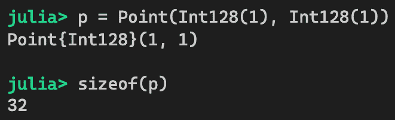

# 第十章：反模式

在过去的五章中，我们详细探讨了可重用性、性能、可维护性、安全性和一些杂项设计模式。这些模式非常有用，可以应用于各种不同类型的应用程序的不同场景。虽然了解最佳实践很重要，但了解要避免的陷阱也同样有益。为此，我们将在本章中介绍几个**反模式**。

反模式是程序员可能无意中采取的坏做法。有时，这些问题可能不够严重，不足以造成麻烦；然而，由于设计不当，应用程序可能会变得不稳定或性能下降。在本章中，我们将涵盖以下主题：

+   盗版反模式

+   窄参数类型反模式

+   非具体字段类型反模式

到本章结束时，您将学会如何避免开发盗版函数。您还将对指定函数参数类型时的抽象级别更加警觉和明智。最后，您将能够在设计自己的复合类型时利用更多的参数化类型，以实现高性能应用。

让我们从最有趣的话题——盗版！开始吧。

# 技术要求

示例源代码位于[`github.com/PacktPublishing/Hands-on-Design-Patterns-and-Best-Practices-with-Julia/tree/master/Chapter10`](https://github.com/PacktPublishing/Hands-on-Design-Patterns-and-Best-Practices-with-Julia/tree/master/Chapter10)[.](https://github.com/PacktPublishing/Hands-on-Design-Patterns-and-Best-Practices-with-Julia/tree/master/Chapter10)

代码在 Julia 1.3.0 环境中进行了测试。

# 盗版反模式

在第二章“模块、包和数据类型概念”中，我们学习了如何使用模块创建新的命名空间。如您所回忆的那样，模块用于定义函数，以便它们在逻辑上分离。因此，我们可以定义两个不同的函数——一个在模块 X 中，另一个在模块 Y 中，这两个函数具有完全相同的名称。实际上，这些函数甚至不需要具有相同的意义。例如，在一个数学包中，我们可以为矩阵定义一个`trace`函数。在计算机图形学包中，我们可以定义一个用于进行光线追踪工作的`trace`函数。这两个`trace`函数执行不同的操作，并且它们不会相互干扰。

另一方面，一个函数也可以设计成可以从另一个包扩展。例如，在`Base`包中，`AbstractArray`接口被设计成可以扩展。以下是一个例子：

```py
# My own array-like type for tracking scores
struct Scores <: AbstractVector{Float64}
    values::Vector{Float64}
end

# implement AbstractArray interface
Base.size(s::Scores) = (length(s.values),)
Base.getindex(s::Scores, i::Int) = s.values[i]
```

在这里，我们扩展了来自 `Base` 包的 `size` 和 `getindex` 函数，以便它们可以与我们的自定义数据类型一起工作。这是 Julia 语言的一个非常好的用法；然而，当我们没有正确扩展其他包的函数时，可能会出现问题。特别是，“盗版”指的是第三方函数被错误地替换或扩展的情况。这是一个反模式，因为它可能导致系统行为变得非确定性。为了方便起见，我们可以定义三种不同类型的盗版：

+   **类型 I 盗版行为**：功能被重新定义

+   **类型 II 盗版行为**：在没有任何参数中使用自己的类型扩展函数

+   **类型 III 盗版行为**：函数被扩展但用于不同的目的

我们现在将更详细地探讨每一个。

# 类型 I – 重新定义函数

类型 I 盗版行为指的是程序员在自己的模块中重新定义第三方函数的情况。也许你不喜欢第三方模块中的原始实现，并用你自己的实现替换了该函数。

类型 I 盗版行为最糟糕的形式是，在不遵守原始函数接口的情况下替换函数。让我们做一个实验看看会发生什么。我们将使用 `Base` 中的 `+` 函数作为例子。正如你所知，当 `+` 函数传递两个 `Int` 参数时，它应该返回一个 `Int` 类型的结果。如果我们替换函数使其返回一个字符串会发生什么？让我们打开一个 REPL 并试一试：


*砰！* Julia REPL 在定义函数的瞬间立即崩溃。这是因为这个 `+` 函数的返回值预期是一个整数。当我们返回一个字符串时，它违反了这个函数的契约，并且所有依赖于 `+` 函数的功能都会受到负面影响。鉴于 `+` 是一个常用的函数，它立即导致系统崩溃。

为什么 Julia 甚至允许我们这样做？在某些情况下，这种能力可能是有用的。比如说，你发现了一个第三方包中特定函数的 bug—you 可以立即注入修复，而不必等待上游的 bug 修复。同样，你可以用更高效的版本替换一个慢函数。理想情况下，这些更改应该发送到上游，但你也有立即实施更改的灵活性。

唯一的要求是，被替换的函数应该遵守最初打算的相同契约。因此，需要对第三方包的设计有深入的了解。实际上，如果你在应用盗版之前能联系到原始作者并讨论更改，那就更好了。

*权力越大，责任越大。*如果我们想利用类型 I 盗版行为，就必须非常小心。

接下来，我们将探讨类型 II 盗版行为，这在 Julia 生态系统中的包中更为常见。

# 类型 II 盗版 – 没有使用自己的类型进行扩展

类型 II 盗版在 Julia 开发者社区中通常被称为 *类型盗版*。它指的是在没有使用程序员自己的类型作为任何函数参数的情况下扩展第三方函数的情况。这通常发生在您想通过注入自己的代码来扩展第三方包时。让我们通过一个假设的例子来探讨。

假设您想在 JavaScript 中模拟将字符串和数字相加的行为，其中值像字符串一样连接：


要在 Julia 中实现这一点，我们可能会在 `MyModule` 中做以下操作：

```py
module MyModule
    import Base.+
    (+)(s::AbstractString, n::Number) = "$s$n"
end
```

我们可以在 REPL 中粘贴前面的代码并进行快速测试：


这看起来工作得很好！但是，这种方法还有一些隐藏的问题。让我们看看为什么这仍然是一个坏主意。

# 与另一个海盗冲突

现在我们正在使用 `+` 函数的增强版本，我们能依赖这个函数始终如我们所期望的那样工作吗？也许令人惊讶的是，答案是否定的。

假设我们找到一个名为 `AnotherModule` 的开源包，我们想在我们的 `MyModule` 模块中使用它。`AnotherModule` 模块恰好也做了同样的类型 II 盗版；然而，作者决定做正确的事情——不是像字符串一样连接参数，而是将字符串参数解析为数字，然后将两个数字相加。代码如下：

```py
module AnotherModule
    import Base: +, -, *, /
    (+)(s::AbstractString, n::T) where T <: Number = parse(T, s) + n
    (-)(s::AbstractString, n::T) where T <: Number = parse(T, s) - n
    (*)(s::AbstractString, n::T) where T <: Number = parse(T, s) * n
    (/)(s::AbstractString, n::T) where T <: Number = parse(T, s) / n
end
```

如果我们回到 REPL 并定义这个模块，那么我们会得到新的定义：


现在我们有两个具有完全相同签名的相同函数实现，但它们返回的结果不同。谁将获胜？是定义在 `MyModule` 中的那个还是定义在 `AnotherModule` 中的那个？只有一个可以生效。这意味着 `AnotherModule` 或 `MyModule` 中将有一个会出问题。这个问题可能导致灾难性的情况，并且难以发现的错误。

避免类型 II 盗版的另一个原因是未来兼容性问题。我们将在下一节讨论这个问题。

# 代码的未来兼容性

假设我们已经将 `Base` 中的 `+` 函数扩展如下：

```py
module MyModule
    import Base.+
    (+)(s::AbstractString, n::Number) = "$s$n"
end
```

今天这看起来可能是一个很好的补充；然而，并不能保证在未来的 Julia 版本中相同的函数不会被实现。可以想象（这并不意味着它可能或不可能）`+` 函数将来会被增强以支持字符串。

此外，这类更改将被视为非破坏性更改，这意味着 Julia 开发团队只需通过小版本发布即可添加此功能。不幸的是，现在您的应用程序因为非破坏性的 Julia 升级而崩溃。这不是我们通常期望的事情。

*如果您想使代码具有未来兼容性，那么请不要成为海盗！*

# 避免类型盗版

通过创建自己的类型并使用它们作为函数参数，可以减轻Ⅱ级海盗行为。在这种情况下，也许我们应该考虑创建一个包装类型来保存字符串，并使用这个新类型进行分发：

```py
module MyModule
    export @str_str
    import Base: +, show

    struct MyString
        value::AbstractString
    end 

    macro str_str(s::AbstractString) 
        MyString(s)
    end

    show(io::IO, s::MyString) = print(io, s.value)
    (+)(s::MyString, n::Number) = MyString(s.value * string(n))
    (+)(n::Number, s::MyString) = MyString(string(n) * s.value)
    (+)(s::MyString, t::MyString) = MyString(s.value * t.value)
end
```

在这里，我们重新定义了模块，使用新的 `MyString` 类型来保存字符串。然后，我们仍然可以扩展 `+` 函数以将 `MyString` 与任何数量的字符串连接起来。为了完整性，我们已定义了三个 `+` 函数变体，用于接受任意顺序的 `MyString` 和 `Number` 参数，以及另一个接受两个 `MyString` 参数的变体。我们还定义了一个 `str_str` 宏以方便使用。新的模块按如下方式正常工作：


通过在函数参数中使用自己的类型，我们可以避免与其他依赖包发生冲突，并为 Julia 升级提供未来保障。

最后一种海盗行为稍微轻微一些，但仍值得一看。让我们看看下一个。

# Ⅲ级海盗行为 – 使用你自己的类型，但用于不同的目的

Ⅲ级海盗行为指的是扩展了函数，但用于不同的目的的情况。这是扩展代码的正确程序，但以错误的方式执行。这种海盗行为也被 Julia 开发者称为 *pun*。为了理解它是什么，让我们在这里考虑一个有趣的例子。

假设我们正在开发一个简单的派对注册应用程序。类型定义和构造函数如下所示：

```py
# A Party just contains a title and guest names
struct Party
    title::String
    guests::Vector{String}
end

# constructor
Party(title) = Party(title, String[])
```

`Party` 类型仅包含一个标题和一组嘉宾名称。构造函数仅接受标题并将嘉宾数组初始化为空数组。现在，为了显得可爱，我们可以定义一个如下所示的参加派对的函数：

```py
Base.join(name::String, party::Party) = push!(party.guests, name)
```

这是 `Base` 中 `join` 方法的扩展。我们为什么要这样做呢？好吧，如果我们在我们自己的命名空间中创建 `join` 函数，那么我们可能会与标准 `join` 函数发生命名冲突。为了避免处理这种冲突，也许直接从 `Base` 扩展函数更容易。

初看起来，它应该按预期工作：


然而，这里有一个隐藏的陷阱。如果我们让多个人同时参加派对，那么我们很容易陷入麻烦：


发生了什么？让我们看看 `join` 函数的原始含义，如 `help` 屏幕所示：

```py
help?> join

  join([io::IO,] strings, delim, [last])
```

`join` 函数的目的是将多个字符串组合在一起，并用某种分隔符分隔。因此，前面代码中对 `join` 函数的调用最终使用了 `Party` 对象作为分隔符。

让我们稍微思考一下我们是如何陷入麻烦的。当我们使用自己的类型（`Party`）定义函数时，我们没有预料到我们的函数会被除我们自己的代码之外的任何代码使用。然而，这里并非如此。我们的函数显然被 `Base` 包中的字符串连接逻辑所使用。

结果表明，我们是不幸的*鸭子类型*的受害者。如果你查看 Julia 的源代码，你会发现一些`join`函数在参数中未指定任何类型。因此，当我们向`join`函数传递`Party`对象时，它就会泄露到原始的`join`逻辑中。更糟糕的是，没有抛出错误，因为一切只是*正常工作*。

最好完全避免类型 III 盗用。在前面的例子中，我们可以在自己的模块中定义`join`函数，而不是扩展`Base`中的函数。如果我们被名称冲突问题所困扰，我们也可以选择不同的函数名——例如，`register`。我们必须意识到，加入一个派对的意义并不等同于将字符串连接起来。

所有三种盗用类型都是不好的，它们可能导致难以找到或调试的 bug。我们应该尽可能地避免它们。

接下来，我们将讨论与函数定义中指定参数类型相关的另一种反模式。

# 狭义参数类型反模式

在 Julia 中设计函数时，我们有很多关于是否以及如何提供参数类型的选择。狭义参数类型反模式指的是参数类型被过于狭窄地指定，导致函数不必要的无用。

让我们考虑一个简单的示例函数，该函数用于计算两个向量的乘积之和：

```py
function sumprod(A::Vector{Float64}, B::Vector{Float64})
    return sum(A .* B)
end
```

这个设计没有问题，只是功能只能在参数是`Float64`值向量时使用。其他可能的选择有哪些？让我们接下来看看。

# 考虑参数类型的各种选项

Julia 的调度机制可以在传递的参数类型与函数签名匹配的情况下选择正确的函数来调用。基于类型层次结构，我们可以指定抽象类型，并且函数仍然会被正确选择。

这种灵活性给我们提供了很多选择。我们可以考虑以下任何一种：

+   `sumprod(A::Vector{Float64}, B::Vector{Float64})`

+   `sumprod(A::Vector{Number}, B::Vector{Number})`

+   `sumprod(A::Vector{T}, B::Vector{T}) where T <: Number`

+   `sumprod(A::Vector{S}, B::Vector{T}) where {S <: Number, T <: Number}`

+   `sumprod(A::Array{S,N}, B::Array{T,N}) where {N, S <: Number, T <: Number}`

+   `sumprod(A::AbstractArray{S,N}, B::AbstractArray{T,N}) where {N, S <: Number, T <: Number}`

+   `sumprod(A, B)`

我们的功能最合适的选项是哪一个？我们还没有确定，但我们可以始终回顾我们的需求，在得出结论之前进行一些测试。

让我们首先定义我们计划支持的场景。正如我们所期望的，这只是一个数值计算：我们希望支持任何支持广播的数值容器。广播是必需的，因为我们使用点符号来计算前面代码中 A 和 B 的乘积。

我们的测试场景涉及以下参数组合：

| **场景** | **参数 1** | **参数 2** |
| --- | --- | --- |
| 1 | `Array{Float64, 1}` | `Array{Float64, 1}` |
| 2 | `Array{Int64, 1}` | `Array{Int64, 1}` |
| 3 | `Array{Int, 1}` | `Array{Float64, 1}` |
| 4 | `Array{Float64, 2}` | `Array{Float64, 2}` |
| 5 | `Array{Number,1}` | `Array{Number,1}` |

为了测试各种函数签名选项的这些场景，我们可以构建一个测试框架函数，如下所示：

```py
function test_harness(f, scenario, args...)
    try 
        f(args...)
        println(f, " #$(scenario) success")
    catch ex
        if ex isa MethodError
            println(f, " #$(scenario) failure (method not selected)")
        else
            println(f, " #$(scenario) failure (unknown error $ex)")
        end
    end
end
```

测试框架将函数 `f` 与提供的参数 `args` 对特定 `scenario` 进行应用。如果函数被调度，它将在控制台显示成功消息；否则，它将显示失败消息。由于我们想要测试前面列出的场景，我们可以定义一个额外的函数，这样我们就可以轻松地执行我们的测试：

```py
function test_sumprod(f)
    test_harness(f, 1, [1.0,2.0], [3.0, 4.0]);
    test_harness(f, 2, [1,2], [3,4]);
    test_harness(f, 3, [1,2], [3.0,4.0]);
    test_harness(f, 4, rand(2,2), rand(2,2));
    test_harness(f, 5, Number[1,2.0], Number[3.0, 4]);
end
```

`test_sumprod` 函数接受一个函数并执行前五个测试用例。

现在我们已经准备好了。让我们分析每个选项，看看它们对我们有多有效。

# 选项 1 – `Float64` 值的向量

第一个选项是我们在这个部分开始时使用的。它具有最具体的参数类型。缺点是它只能与 `Float64` 值的向量一起工作。

让我们按照以下方式定义我们的函数，以便我们可以将其传递给测试函数：

```py
sumprod_1(A::Vector{Float64}, B::Vector{Float64}) = sum(A .* B)
```

我们现在可以尝试我们的测试框架了：


如预期的那样，这个函数可以在两个参数都是 `Float64` 值的向量时与第一个场景一起工作。因此，它并不满足我们的所有要求。让我们尝试下一个选项。

# 选项 2 – `Number` 实例的向量

第二个选项稍微有趣一些。我们将类型参数从 `Float64` 更改为 `Number`，这是数值类型层次结构中最顶层的抽象类型：

```py
sumprod_2(A::Vector{Number}, B::Vector{Number}) = sum(A .* B)
```

现在让我们测试一下：


初看之下，使用 `Number` 作为类型参数似乎会使它更通用。但实际上，它只能接受 `Number` 类型的数组，这意味着它必须是一个异构数组，其中每个元素可以是不同类型，只要所有元素类型都是 `Number` 的子类型。因此，`Float64` 值的向量不是 `Number` 值向量的子类型。请检查以下代码片段：


因此，除了最后一个选项之外，没有任何场景成功，最后一个选项接受 `Number` 类型的向量作为参数。所以这个选项也不是一个好的选择。让我们继续前进！

# 选项 3 – 类型为 T 的向量，其中 T 是 `Number` 的子类型

第三个选项是取类型为 `T` 的向量，其中 `T` 只是 `Number` 的子类型。

函数可以定义如下：

```py
sumprod_3(A::Vector{T}, B::Vector{T}) where T <: Number = sum(A .* B)
```

让我们先试一下：


由于类型参数 `T` 可以是 `Number` 的任何子类型，这个函数可以舒适地处理 `Float64`、`Int64` 以及甚至 `Number` 类型的向量。不幸的是，它不能处理不同类型的参数，但我们应该能够进一步改进它。让我们尝试下一个选项。

# 选项 4 – 类型为 S 和 T 的向量，其中 S 和 T 是 Number 的子类型

这个选项与选项 3 的区别仅在于参数类型是分别指定的。因此，函数可以接受第一和第二个参数的不同类型。函数定义如下：

```py
sumprod_4(A::Vector{S}, B::Vector{T}) where {S <: Number, T <: Number} = sum(A .* B)
```

我们现在可以尝试一下：


我们现在已经解决了混合参数类型的问题。我们越来越接近最终目标。场景 4 是参数是矩阵而不是向量的情况。我们当然知道如何解决这个问题，所以让我们接下来做。

# 选项 5 – 类型为 S 和 T 的数组，其中 S 和 T 是 Number 的子类型

由于 Julia 数组支持广播，我们可以将函数参数从 `Vector{T}` 通用化到 `Array{T,N}` 签名，以支持多维数组。现在让我们定义函数如下：

```py
sumprod_5(A::Array{S,N}, B::Array{T,N}) where {N, S <: Number, T <: Number} = 
    sum(A .* B)
```

我们相当有信心这会起作用。现在让我们测试它：


*太棒了!* 我们终于满足了测试场景中列出的所有要求。我们完成了吗？也许还没有。为了辩论，我们可能希望支持其他类型的容器，这些容器不一定是密集数组。如果输入是稀疏矩阵怎么办？让我们再次改进这个函数。

# 选项 6 – 抽象数组

`AbstractArray` 是所有 Julia 数组容器的抽象类型。许多 Julia 包实现了数组接口，并成为 `AbstractArray` 的子类型。如果我们把 `sumprod` 函数做得足够通用，却不能支持稀疏矩阵或其他类型的数组容器，那就太遗憾了。为了使其更通用，让我们将函数定义从 `Array` 转换为 `AbstractArray`，如下所示：

```py
sumprod_6(A::AbstractArray{S,N}, B::AbstractArray{T,N}) where 
    {N, S <: Number, T <: Number} = sum(A .* B)
```

签名与上一个选项相同，只是函数可以使用任何 `AbstractArray` 容器类型进行分发。让我们确保函数按预期工作：


函数在我们的现有案例中运行正常。让我们再次尝试使用稀疏矩阵类型来测试它：


*太棒了!* 现在它运行得很好，甚至是非密集数组类型。我们几乎完成了。让我们看看我们的最后一个选项——鸭式类型。

# 选项 7 – 鸭式类型

我们最后一个选项基本上跳过了函数参数中的类型。这也被称为鸭式类型，因为只要提供了两个参数，函数就会被分发。Julia 将针对不同参数类型的变体进行特化和编译新版本。函数简单地定义为如下：

```py
sumprod_7(A, B) = sum(A .* B)
```

为了完整性，我们将再次运行测试：


这个选项的好处是函数在签名中没有类型信息，看起来非常干净。然而，缺点是函数可以针对任何类型进行分发——甚至不是数组或数值。当垃圾数据传递给函数时，输出也是垃圾，或者当传递的对象没有定义`*`运算符函数时，函数会抛出错误。

现在我们已经考虑了所有选项并执行了相应的测试，让我们总结一下到目前为止我们已经做了什么，以及我们接下来想做什么。

# 总结所有选项

让我们现在总结一下到目前为止我们已经考虑的所有选项：

| **选项** | **签名** | **所有测试都通过吗？** |
| --- | --- | --- |
| 1 | `sumprod(A::Vector{Float64}, B::Vector{Float64})` | 否 |
| 2 | `sumprod(A::Vector{Number}, B::Vector{Number})` | 否 |
| 3 | `sumprod(A::Vector{T}, B::Vector{T}) where T <: Number` | 否 |
| 4 | `sumprod(A::Vector{S}, B::Vector{T}) where {S <: Number, T <: Number}` | 否 |
| 5 | `sumprod(A::Array{S,N}, B::Array{T,N}) where {N, S <: Number, T <: Number}` | 是 |
| 6 | `sumprod(A::AbstractArray{S,N}, B::AbstractArray{T,N}) where {N, S <: Number, T <: Number}` | 是 |
| 7 | `sumprod(A, B)` | 是 |

从技术上来说，选项 5、6 或 7 可以适用于所有数组类型。选项 6 和 7 支持其他数组容器，例如稀疏矩阵。选项 7 与非`AbstractArray`类型一起工作，只要类型支持广播乘法和加法。

在我们得出结论之前，让我们从性能的角度进行最后一次测试。你是否想知道让函数接受更通用的类型是否会牺牲性能？了解这一点唯一的方法是通过实际实验来证明。让我们接下来这么做。

# 评估性能

当我们在函数参数中接受更通用的类型时，我们会牺牲性能吗？让我们进行一些基准测试，看看它们的性能如何。

在这里，我们将使用完全相同的输入：两个包含 10,000 个元素的`Float64`向量，对选项 1、5、6 和 7 中的函数进行基准测试：

```py
using BenchmarkTools 

A = rand(10_000);
B = rand(10_000);

@btime sumprod_1($A, $B);
@btime sumprod_5($A, $B);
@btime sumprod_6($A, $B);
@btime sumprod_7($A, $B);
```

下面是测试结果：


如您所见，这些选项之间没有实质性的差异。如何指定参数类型不会影响函数的运行时性能。

总结来说，我们关于这种反模式学到的经验是，函数参数不应该无必要地设置得太窄。当范围广泛时，一个函数可以更加有用。一个可以接受和支持更多输入类型的函数自动具有更高的可重用性。

我们下一个反模式与设计数据类型时如何选择字段类型有关。这是一个极其重要的话题，因为它可以显著影响系统性能。

# 非具体字段类型反模式

非具体字段类型的反模式是一种结构字段不是具体类型的反模式。对于字段的非具体类型的主要问题是它们可能会引起重大的性能问题。为了理解为什么，让我们看看具有非具体类型与具体类型组合类型的内存布局，然后设计和比较这两个。

# 理解复合数据类型的内存布局

让我们先看看一个用于跟踪点坐标的复合类型的简单例子：

```py
struct Point
    x
    y
end
```

当字段类型未指定时，它隐式地解释为所有类型的超类型 `Any`，因此前面的代码在语法上等同于以下代码（除了我们将类型名称重命名为 `Point2` 以避免混淆）：

```py
struct Point2
    x::Any
    y::Any
end
```

字段 `x` 和 `y` 有 `Any` 类型，这意味着它们可以是任何东西：`Int64`、`Float64` 或任何其他数据类型。为了比较内存布局和利用率，值得创建一个新的点类型，它使用小的具体类型，如 `UInt8`：

```py
struct Point3
    x::UInt8
    y::UInt8
end
```

如我们所知，`UInt8` 应该占用单个字节的存储空间。`x` 和 `y` 字段同时存在应该只消耗两个字节的存储空间。也许我们应该亲自证明这一点。检查以下代码：


明显地，一个单独的 `Point3` 对象只占用两个字节。让我们用原始的 `Point` 对象做同样的操作：


`Point` 对象占用 16 字节，尽管我们只想存储两个字节。正如我们所知，`Point` 对象可以在 `x` 和 `y` 字段中存储任何数据类型。现在，让我们用更大的数据类型，如 `Int128`，来做同样的练习：


`Int128` 是一个 128 位整数，在内存中占用 16 字节。有趣的是，尽管我们在 `Point` 中携带了两个 `Int128` 字段，但对象的大小仍然保持在 16 字节。

为什么？这是因为 `Point` 实际上存储了两个 64 位指针，每个指针占用八字节的存储空间。我们可以这样可视化 `Point` 对象的内存：


当字段类型是具体的时，Julia 编译器确切地知道内存布局看起来像什么。对于两个 `UInt8` 字段，它以紧凑的方式用两个字节表示。对于两个 `Int128` 字段，它将占用 32 字节。让我们在 REPL 中尝试一下：


`Point4` 的内存布局紧凑，如下面的图所示：


现在我们知道了内存布局的差异，我们可以立即看到使用具体类型的优势。每次我们需要访问`x`或`y`字段时，如果它是具体类型，那么数据就在那里。如果字段只是指针，那么我们必须取消引用指针以找到数据。此外，`x`和`y`的物理内存位置可能甚至不相邻，这可能导致硬件缓存未命中，从而进一步影响性能。

那么，我们是否只是遵循在字段定义中直接使用具体类型的规则？不一定。我们还有其他可以考虑的选项，我们将在接下来的章节中讨论。

# 考虑具体类型设计复合类型

也许我们最初在字段中使用抽象类型的原因是为了支持字段中的不同类型数据。以上一节中的`Point`类型为例，我们可以看到这种类型在计算机游戏环境中非常有用，因为在游戏中坐标是通过屏幕上的整数像素位置来识别的。另一方面，我们也认为同样的类型可能对存储建筑图纸中形状的坐标也很有用，在这种情况下，我们可能需要使用浮点值。

如果我们想要更灵活，我们希望支持任何`Real`类型的子类型的`Point`字段。从概念上讲，我们希望得到如下所示的东西：

```py
struct Point
    x::Real
    y::Real
end
```

然而，由于`Real`是一个抽象类型，我们预计性能会较差，就像使用`Any`一样。为了在不牺牲支持其他数值类型灵活性的情况下利用具体类型，我们可以将`Point`转换为参数化类型。让我们重新启动 REPL 并定义新的`Point`类型，如下所示：

```py
struct Point{T <: Real}
    x::T
    y::T
end
```

将其设计为参数化类型的好处是它是具体的。我们可以很容易地从 REPL 中检查这一点。以下是一个基本的语法实现：


以下代码展示了另一个示例：



到目前为止，我们一直假设在`struct`字段中，具体类型会比非具体类型表现更好。了解这种差异有多大会有所帮助。现在让我们试试看。

# 比较混凝土与非混凝土字段类型之间的性能

我们可以使用这两种不同的类型进行性能测试，如下所示：

我们的基准测试函数将计算数组中所有点的中心，如下所示：

```py
using Statistics: mean

function center(points::AbstractVector{T}) where T
    return T(
        mean(p.x for p in points), 
        mean(p.y for p in points))
end
```

此外，我们还将定义一个函数，可以用于为任何我们想要的类型创建点的数组：

```py
make_points(T::Type, n) = [T(rand(), rand()) for _ in 1:n]
```

让我们从`PointAny`类型开始。

我们将生成 100,000 个点，并使用`BenchmarkTools`来测量时间：


接下来，我们将对`Point`类型进行性能测试：


如我们所见，两者之间存在着巨大的差异。使用参数化`Point`类型比使用`Any`作为字段类型的速度快约 25 倍。

从这个反模式中我们学到的经验是，我们应该为在复合类型中定义的字段使用具体类型。将我们想要的抽象类型**提取出来**作为一个类型参数是非常容易的。这样做可以让我们在不牺牲支持其他数据类型能力的情况下，从具体类型中获得性能上的好处。

# 摘要

在本章中，我们了解了 Julia 编程中的一些反模式。当我们详细研究每个反模式时，我们也找到了应用替代设计解决方案的方法。

我们从盗版反模式开始，它指的是与从第三方模块扩展函数相关的坏习惯。为了方便起见，我们将盗版反模式分为三种不同类型——I 型、II 型和 III 型。每种类型都会在导致系统不稳定或未来可能引起问题的过程中带来不同的问题。

接下来，我们研究了狭隘的参数类型反模式。当函数参数过于狭窄时，它们的可重用性会降低。因为 Julia 可以为各种参数类型对函数进行特殊化，所以尽可能使参数类型通用化，利用抽象类型，这样做更有益。我们详细探讨了几个设计选项，并得出结论：最通用的类型可以在不牺牲性能的情况下使用。

最后，我们回顾了非具体字段类型反模式。我们证明了由于产生的低效内存布局结构，拥有非具体类型会带来性能问题。我们推测，这个问题可以通过使用参数类型，将具体类型指定为类型参数的一部分来轻松解决。

在下一章中，我们将关注传统的面向对象设计模式，并探讨它们如何在 Julia 编程中应用。*系好安全带：如果你曾经是面向对象程序员，你的旅程可能会有些颠簸！*

# 问题

1.  类型 I 盗版的风险和潜在好处是什么？

1.  类型 II 盗版可能引发什么问题？

1.  类型 III 盗版是如何引起麻烦的？

1.  指定函数参数时我们应该注意什么？

1.  使用抽象函数参数会如何影响系统性能？

1.  使用抽象字段类型为复合类型时，系统性能会受到怎样的影响？
