# 第十二章：继承和可变性

如果我们不得不选择在 Julia 或任何编程语言中最重要的学习内容，那么它必定是数据类型的概念。抽象类型和具体类型协同工作，为程序员提供了一种强大的工具来模拟解决方案，以解决现实世界的问题。多重分派依赖于定义良好的数据类型来调用正确的函数。参数化类型被用来使我们能够重用具有特定物理数据表示的对象的基本结构。正如你所看到的，在软件工程实践中，对数据类型进行周密的设计至关重要。

在第二章，*模块、包和数据类型概念*中，我们学习了抽象类型和具体类型的基础知识以及如何基于类型之间的继承关系构建类型层次结构。在第三章*设计函数和接口*和第五章*重用模式*中，我们也简要提到了参数化类型和参数化方法。为了有效地利用这些概念和语言特性，我们需要很好地理解子类型是如何工作的。它听起来可能类似于继承，但它在本质上是有区别的。

在本章中，我们将更深入地探讨子类型及其相关主题的含义，包括以下主题：

+   实现继承和行为子类型

+   协方差、反协方差和不变性

+   参数化方法和对角线规则

到本章结束时，你将对 Julia 中的子类型有很好的理解。你将更有能力设计自己的数据类型层次结构，并更有效地利用多重分派。

# 技术要求

示例源代码位于[`github.com/PacktPublishing/Hands-on-Design-Patterns-and-Best-Practices-with-Julia/tree/master/Chapter12`](https://github.com/PacktPublishing/Hands-on-Design-Patterns-and-Best-Practices-with-Julia/tree/master/Chapter12)。

代码在 Julia 1.3.0 环境中进行了测试。

# 实现继承和行为子类型

当我们学习继承时，我们意识到抽象类型可以用来描述现实世界概念。我们可以相当自信地说，我们已经知道如何通过父子关系来分类概念。有了这些知识，我们可以在这些概念周围构建类型层次结构。例如，来自第二章，*模块、包和数据类型概念*的个人资产类型层次结构看起来如下：

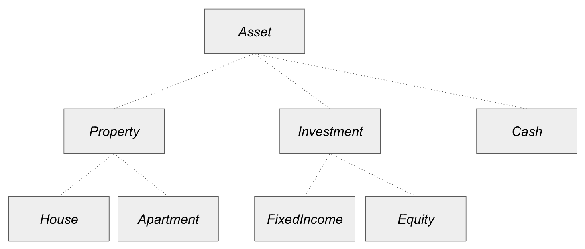

在前面的图中展示的所有数据类型都是抽象类型。从下往上，我们知道**House**和**Apartment**都是**Property**的子类型，我们也知道**Property**和**Investment**都是**Asset**的子类型。这些都是基于我们日常生活中对这些概念的讨论的合理解释。

我们还讨论了具体类型，它们是抽象概念的物理实现。对于这个相同的例子，我们最终得到`Stock`作为`Equity`的子类型，`Bond`作为`FixedIncome`的子类型。如您所回忆的那样，`Stock`类型可以定义为以下内容：

```py
struct Stock <: Equity
    symbol::String
    name::String
end

```

在那时，我们没有强调不能在抽象类型中声明任何字段的事实，这是某些面向对象编程（**OOP**）语言（如 Java）中固有的。如果您来自 OOP 背景，那么您可能会错误地感觉到这是 Julia 继承系统中的一个巨大限制。Julia 为什么被设计成这样？在本节中，我们将尝试更深入地分析继承并回答这个问题。

与继承相关联的两个重要概念非常相似，但本质上不同——实现继承和行为子类型。我们将在接下来的几节中讨论这两个概念。让我们从实现继承开始。

# 理解实现继承

实现继承允许子类从其超类继承**字段**和**方法**。由于 Julia 不支持实现继承，我们将暂时改变语言，以下是用 Java 提供的示例。这是一个提供容器以容纳任意数量对象的类：

```py
import java.util.ArrayList;

public class Bag
{
    ArrayList<Object> items = new ArrayList<Object>();

    public void add(final Object object) {
        this.items.add(object);
    }

    public void addMany(final Object[] objects) {
        for (Object obj : objects) {
            this.add(obj);
        }
    }
}
```

`Bag`类基本上维护了一个对象列表在`items`字段中，并提供两个方便的函数，`add`和`addMany`，用于向包中添加单个对象或对象数组。

为了展示代码重用，我们可以开发一个新的`CountingBag`类，它从`Bag`继承并提供了跟踪包中存储了多少项的附加功能：

```py
public class CountingBag extends Bag
{
    int count = 0;

    public void add(Object object) {
        super.add(object);
        this.count += 1;
    }

    public int size() {
        return count;
    }
}
```

在这个`CountingBag`类中，我们有一个新的字段`count`，用于跟踪包的大小。每当向包中添加新项目时，`count`变量就会增加。`size`函数用于报告包的大小。那么`CountingBag`的情况如何？让我们快速总结：

+   `count`字段在此处定义可用。

+   `items`字段作为从`Bag`继承而来是可用的。

+   `add`方法覆盖了父类的实现，但它也通过`super.add`重用了父类的方法。

+   `addMany`方法作为从`Bag`继承而来是可用的。

+   `size`方法在此处定义可用。

由于字段和方法都是继承的，这被称为实现继承。其效果几乎等同于将超类中的代码复制到子类中。

接下来，让我们谈谈行为子类型。

# 理解行为子类型

行为子类型有时被称为接口继承。为了避免与重载的单词*继承*混淆，我们在这里将避免使用接口继承这个术语。行为子类型表示子类型仅从超类型继承行为。

当我们将语言切换回 Julia 时，我们将引用*类型*而不是*类*。

Julia 支持行为子类型。每个数据类型都继承为其超类型定义的函数。让我们在 Julia 的 REPL 中进行一个快速有趣的练习：

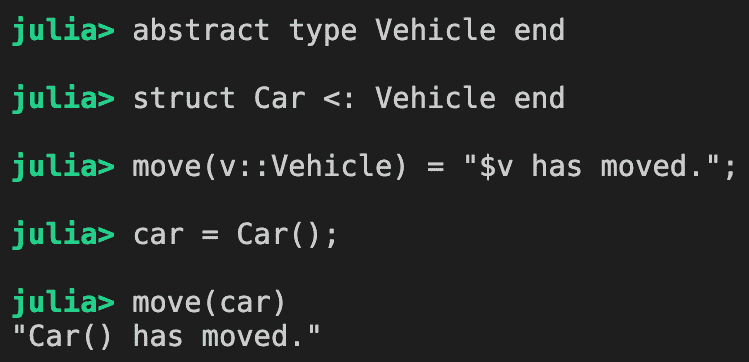

在这里，定义了一个抽象类型`Vehicle`及其子类型`Car`。我们还为`Vehicle`定义了一个`move`函数。当我们向`move`函数传递一个`Car`对象时，它仍然可以正常工作，因为`Car`是`Vehicle`的子类型。这与 Liskov 替换原则一致，该原则表示接受类型 T 的程序也可以接受 T 的任何子类型，并且可以继续正常工作，而不会出现任何意外的结果。

现在，方法的继承可以在多个级别上传播得很远。让我们创建另一个抽象级别：

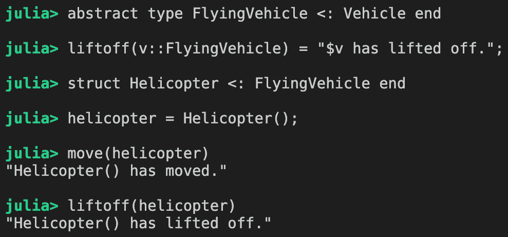

我们刚刚定义了一个新的`FlyingVehicle`抽象类型和一个`Helicopter`结构体。`move`函数可以通过从`Vehicle`继承而来在直升机中使用，`liftoff`函数也可以使用，因为它是从`FlyingVehicle`继承而来的。

可以为更具体的类型定义额外的方法，并且会选择最具体的方法进行调度。这样做本质上与实现继承中的方法覆盖具有相同的效果。以下是一个例子：


到目前为止，我们已经定义了两种`起飞`方法——一种接受`FlyingVehicle`，另一种用于`Helicopter`。当将`Helicopter`对象传递给函数时，它会被分配到为`Helicopter`定义的方法，因为它是最具体的方法，适用于直升机。

这种关系可以用以下图表来总结：

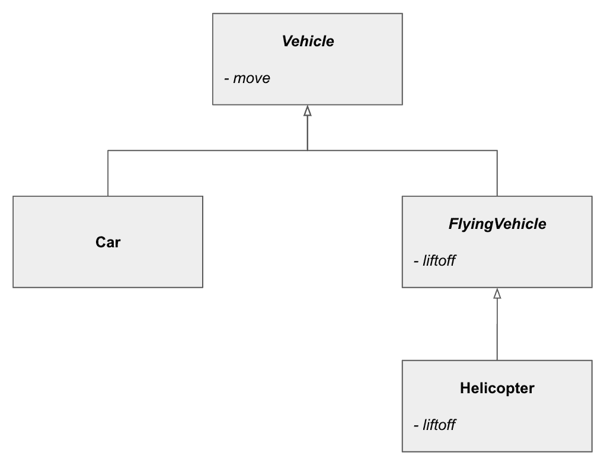

根据行为子类型，汽车应该像车辆一样行为，飞行车辆应该像车辆一样行为，直升机应该像飞行车辆一样行为，也像车辆一样行为。行为子类型允许我们重用为超类型已定义的行为。

在 Java 中，可以使用接口实现行为子类型。

现在我们已经了解了实现继承和行为子类型，我们可以回顾我们之前的问题：为什么 Julia 不支持实现继承？不遵循其他主流面向对象编程语言的原因是什么？为了理解这一点，我们可以回顾一些与实现继承相关的一些知名问题。让我们从正方形-矩形问题开始。

# 正方形-矩形问题

Julia 不支持实现继承。让我们列出不支持实现继承的原因：

+   所有具体类型都是最终的，因此无法从另一个具体类型创建新的子类型。因此，不可能从任何地方继承对象字段。

+   在抽象类型中，你不能声明任何字段，否则它将不再是抽象的，而是具体的。

Julia 编程语言的核心开发者出于多个原因，在早期设计决策中决定避免实现继承。其中之一就是所谓的*正方形-矩形问题*，有时也称为圆-椭圆问题。

正方形-矩形问题对实现继承提出了一个明显的挑战。正如常识所知，每个正方形都是一个矩形，它有一个额外的约束，即两边的长度相等。为了在面向对象的语言中通过类来建模这些概念，我们可能会尝试创建一个`Rectangle`类和一个`Square`子类：

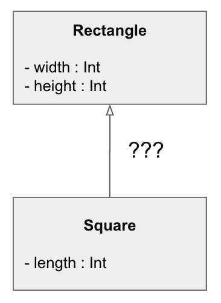

很快，我们就意识到我们已经使自己陷入了麻烦。如果`Square`必须从其父类继承所有字段，那么它就会继承`width`和`height`。但我们真正想要的是一个名为`length`的单个字段。

有时，完全相同的问题被表述为圆-椭圆问题。在这种情况下，圆是椭圆，但只有一个半径而不是主轴和副轴长度。

我们如何解决这个问题？好吧，一种方法是不理会这个问题，创建一个没有任何字段定义的`Square`子类。然后，当用特定的长度实例化`Square`时，`width`和`height`字段都填充了相同的值。这足够好吗？答案是不足够的。鉴于`Square`还继承了`Rectangle`的方法，我们可能需要提供覆盖方法，例如`setWidth`和`setHeight`，以便我们可以保持两个字段具有相同的值。最终，我们得到了一个似乎在功能上可行但性能和内存使用都很差的解决方案。

但我们最初是如何陷入麻烦的呢？为了进一步分析，我们应该意识到，虽然正方形可以被归类为矩形，但在本质上它是一个更严格的矩形版本。这已经开始听起来不太直观了——通常，当我们创建子类时，我们会扩展父类并*添加*更多的字段和功能。我们什么时候想在子类中删除字段或功能？这似乎在逻辑上是倒退的。也许我们应该让`Rectangle`成为`Square`的子类？这听起来也不太合理。

我们陷入了一个困境。一方面，我们希望在代码中正确地建模现实世界概念。另一方面，代码并不适合，不会引起维护或性能问题。到目前为止，我们不禁要问自己，我们是否真的想编写绕过实现继承问题的代码。我们不想。

也许你还没有 100%确信实现继承比抽象继承更糟糕。让我们看看另一个问题。

# 不稳定的基类问题

实现继承的另一个问题是，对基类（父类）的更改可能会破坏其子类的功能。从早期的 Java 示例中，我们有一个从`Bag`类扩展的`CountingBag`类。让我们看看完整的源代码，包括`main`函数：

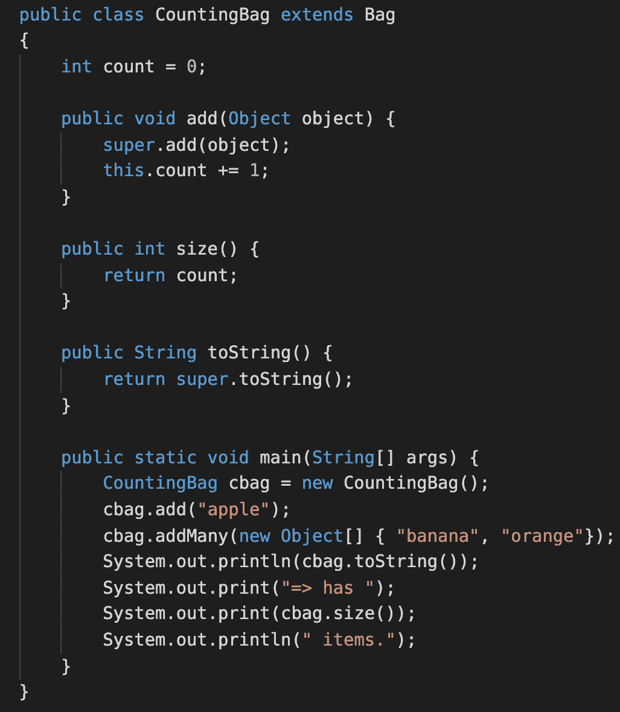

程序简单地创建了一个`CountingBag`对象。然后使用`add`方法添加`apple`，并使用`addMany`方法添加`banana`和`orange`。最后，它打印出包中的项目和包的大小。输出如下代码所示：

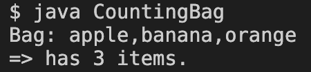

目前一切看起来都很正常。但假设`Bag`类的原始作者意识到可以通过直接向`items`数组列表中添加对象来改进`addMany`方法：

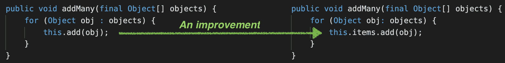

不幸的是，这个看似安全的父类更改最终导致了`CountingBag`的灾难：

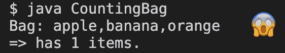

发生了什么？当设计`CountingBag`时，假设在向包中添加新项目时总是会调用`add`方法。当`addMany`方法停止调用`add`方法时，这个假设就不再适用了。

这是谁的错？当然，`Bag`类的开发者无法预见谁会继承这个类。`addMany`方法的变化并没有违反任何契约；提供的功能相同，只是在底层有不同的实现。`CountingBag`类的开发者认为跟随并利用`addMany`已经调用`add`方法的事实是明智的，因此只需要覆盖`add`方法以使计数工作。

这提出了实现继承的第二个问题。子类开发者对父类的实现了解得太多。覆盖父类`add`方法的能力也违反了封装原则。

面向对象编程是如何解决这个问题呢？在 Java 中，有多种设施可以防止前面示例中提出的问题：

+   可以使用`final`关键字注解方法以防止子类覆盖该方法。

+   可以使用`private`关键字注解字段以防止子类访问该字段。

问题在于，开发者必须*预测*类将如何在未来被继承。必须仔细检查方法，以确定是否允许子类访问或覆盖它。同样适用于字段。正如你所见，这个问题之所以被称为不稳定的基类问题，是有充分的理由的。

希望我们已经向您展示了实现继承弊大于利。为了参考，在 GoF 设计模式书中，也建议优先使用组合而非继承。Julia 采取了更为激进的策略，完全禁止了实现继承。

接下来，我们将进一步探讨一种特定的行为子类型，称为鸭子类型。

# 回顾鸭子类型

实现行为子类型有两种方式：**名义子类型**和**结构子类型**：

+   在名义子类型中，你必须明确定义类型与其超类型之间的关系。Julia 使用名义子类型，其中类型在函数参数中明确标注。这就是为什么需要构建类型层次结构来表达类型关系。

+   在结构子类型中，只要子类型实现了超类型所需的功能，关系就隐式地推导出来。当函数使用参数定义而没有标注任何类型时，Julia 支持结构子类型。

Julia 通过**鸭子类型**支持结构子类型。我们首次在第三章中提到了鸭子类型，*设计函数和接口*。说法如下：

“如果它走路像鸭子，叫起来也像鸭子，那么它就是一只鸭子。”

在动态类型语言中，我们有时更关注我们是否得到了想要的行为，而不是确切的类型。如果我们只想听到嘎嘎声，谁会在意我们得到的是青蛙？只要它能发出嘎嘎声，我们就会满意。

有时，我们出于良好原因想要使用鸭子类型。例如，我们通常不会把马视为交通工具；然而，想想过去马被用于运输的日子。在我们的定义中，任何实现了`move`函数的东西都可以被视为交通工具。所以，如果我们有任何需要移动对象的算法，就没有理由不能将`horse`对象传递给该算法：

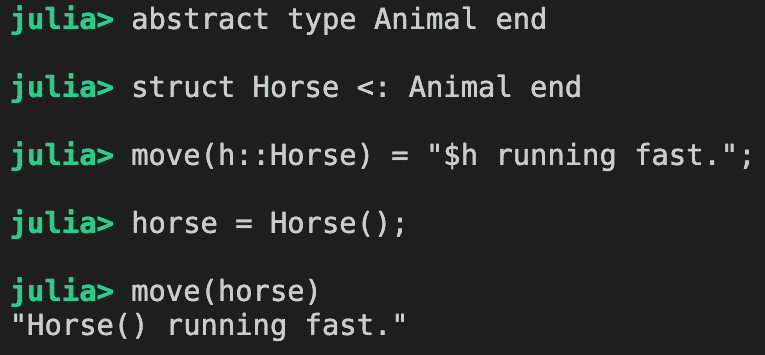

对于一些人来说，鸭子类型有点宽松，因为你不能轻易地判断一个类型是否支持接口（如`move`）。一般的补救方法是使用第五章中描述的圣物特质模式，*可重用性模式*。

接下来，我们将探讨一个重要的概念，称为可变性。

# 协变、不变性和逆变

实际上，子类型的规则并不非常直接。当你查看一个简单的类型层次结构时，你可以立即通过追踪层次结构中数据类型之间的关系来判断一个类型是否是另一个类型的子类型。当涉及到参数化类型时，情况变得更加复杂。在本节中，我们将探讨 Julia 是如何设计以**可变性**为依据的，这是一个解释参数化类型子类型关系的概念。

让我们先回顾一下不同类型的可变性。

# 理解不同类型的可变性

计算机科学文献中描述了四种不同的方差类型。我们首先将它们以正式的方式描述，然后回来进行更多的动手练习，以加强我们的理解。

假设 `S` 是 `T` 的子类型，那么有四种不同的方式来推理参数化类型 `P{S}` 和 `P{T}` 之间的关系：

+   协变：`P{S}` 是 `P{T}` 的子类型 (`co` 这里表示相同方向)

+   反协变：`P{T}` 是 `P{S}` 的子类型 (`contra` 这里表示相反方向)

+   不变量：既不是协变的也不是反协变的

+   双协变：既协变又反协变

我们在什么时候会发现方差有用？也许不会太令人惊讶，方差是当多态发生作用时的关键成分。根据 Liskov 替换原则，语言运行时必须在分派到方法之前确定传递的对象是否是方法参数的子类型。

有趣的是，方差是不同编程语言之间经常存在差异的东西。有时，这有历史原因，有时则取决于语言的目标用例。在接下来的几节中，我们将从几个角度探讨这个主题。我们将从参数化类型开始。

# 参数化类型是不变的

为了说明，我们将考虑一些面向对象文献中使用的流行类型层次结构——动物王国！每个人都喜欢猫和狗。我还包括鳄鱼来解释相关概念：

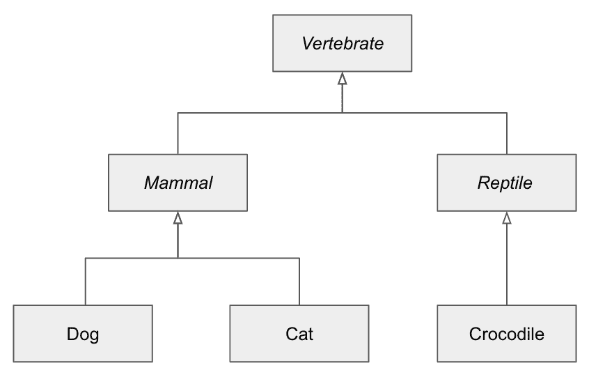

构建此类层次结构的相应代码如下：

```py
abstract type Vertebrate end
abstract type Mammal <: Vertebrate end
abstract type Reptile <: Vertebrate end

struct Cat <: Mammal 
    name
end

struct Dog <: Mammal
    name
end

struct Crocodile <: Reptile 
    name
end
```

为了方便起见，我们也可以为这些新类型定义 `show` 函数：

```py
Base.show(io::IO, cat::Cat) = print(io, "Cat ", cat.name)
Base.show(io::IO, dog::Dog) = print(io, "Dog ", dog.name)
Base.show(io::IO, croc::Crocodile) = print(io, "Crocodile ", croc.name)
```

给定这样的类型层次结构，我们可以通过以下 `adopt` 函数验证子类型是如何处理的。由于没有人想领养鳄鱼（至少我不这么认为），我们限制函数参数只接受 `Mammal` 的子类型：

```py
function adopt(m::Mammal)
    println(m, " is now adopted.")
    return m
end
```

如预期的那样，我们只能采用猫和狗，但不能采用鳄鱼：

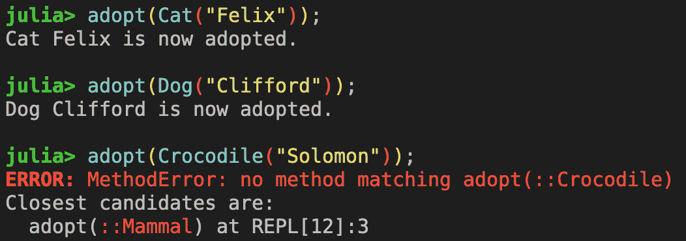

如果我们想同时采用许多宠物呢？直观上，我们可以定义一个新的函数，它接受一个哺乳动物数组，如下所示：

```py
adopt(ms::Array{Mammal,1}) = "adopted " * string(ms)
```

不幸的是，它已经未能通过我们为采用费利克斯和加菲尔德所做的第一次测试：

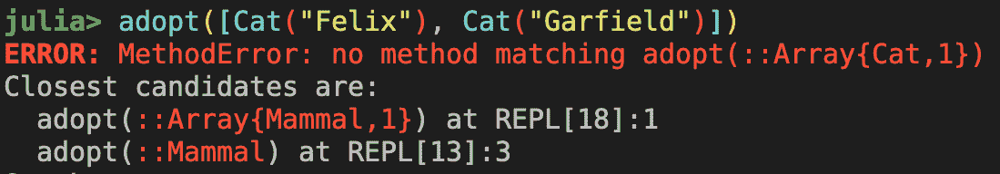

发生了什么事？我们知道猫是哺乳动物，那么为什么一个猫的数组不能传递给接受哺乳动物数组的函数呢？答案是简单的——参数化类型是不变的。这对于来自面向对象背景的人来说是一个非常大的惊喜，因为参数化类型通常是协变的。

通过不变性，尽管 `Cat` 是 `Mammal` 的子类型，但我们不能说 `Array{Cat,1}` 是 `Array{Mammal,1}` 的子类型。此外，`Array{Mammal,1}` 实际上代表一个 `Mammal` 对象的一维数组，其中每个对象可以是 `Mammal` 的任何子类型。由于每个具体类型可能有不同的内存布局要求，这个数组必须存储指针而不是实际值。另一种说法是，对象是 *装箱* 的。

为了调度到这个方法，我们必须创建一个 `Array{Mammal,1}`。这可以通过在数组构造函数前加上 `Mammal` 来实现，如下所示：

```py
adopt(Mammal[Cat("Felix"), Cat("Garfield")])
```

在实践中，当我们必须处理同一类型的对象数组时，这种情况更为常见。在 Julia 中，我们可以使用类型表达式 `Array{T,1} where T` 来表达这样的同质数组。这意味着我们可以定义一个新的 `adopt` 方法，只要它们是同一类型的哺乳动物，就可以接受多个哺乳动物：

```py
function adopt(ms::Array{T,1}) where {T <: Mammal}
    return "accepted same kind:" * string(ms)
end
```

现在让我们测试新的 `adopt` 方法。结果如下所示：


如预期的那样，新的 `adopt` 方法根据数组是否包含 `Mammal` 指针或猫或狗的实际值相应地调度。

在 Julia 中，选择使参数化类型不变是一个出于实际考虑的自觉设计决策。当一个数组包含具体的类型对象时，内存可以以非常紧凑的方式分配来存储这些对象。另一方面，当一个数组包含装箱对象时，每个元素的引用都会涉及解引用一个指向对象的指针，因此性能会受到影响。

确实有一个地方 Julia 使用了协变，那就是方法参数。我们将在下面讨论这些。

# 方法参数是协变的

方法参数是协变的应该是相当直观的，因为这就是今天多态工作的方式。考虑以下函数：

```py
friend(m::Mammal, f::Mammal) = "$m and $f become friends."
```

在 Julia 中，方法参数正式表示为一个元组。在上面的例子中，方法参数仅仅是 `Tuple{Mammal,Mammal}`。

当我们用类型为 `S` 和 `T` 的两个参数调用此函数时，它只有在 `S <: Mammal` 和 `T <: Mammal` 的情况下才会被调度。在这种情况下，我们应该能够传递任何哺乳动物的组合——狗/狗、狗/猫、猫/狗和猫/猫。以下截图证明了这一点：

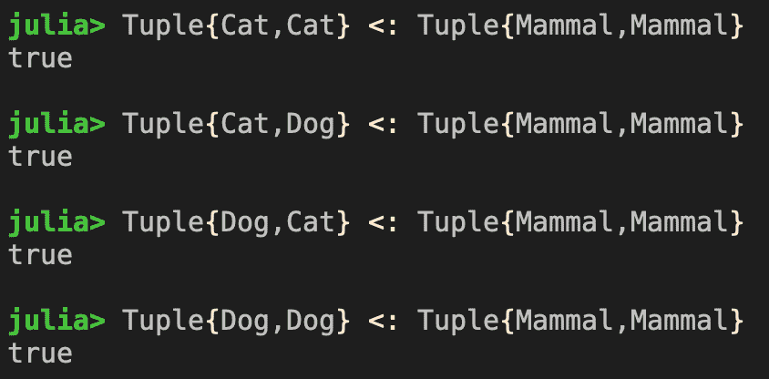

让我们也检查鳄鱼是否能参加派对：

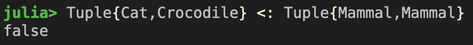

如预期的那样，`Tuple{Cat,Crocodile}` 不是 `Tuple{Mammal,Mammal}` 的子类型，因为 `Crocodile` 不是 `Mammal`。

接下来，让我们转向一个更复杂的场景。众所周知，函数是 Julia 中的第一公民。我们在调度期间如何确定一个函数是否是另一个函数的子类型？

# 函数类型的剖析

在 Julia 中，函数是一等公民。这意味着函数可以作为变量传递，并且可以出现在方法参数中。由于我们已经学习了方法参数的协变属性，那么当函数作为参数传递时，我们该如何处理这种情况呢？

理解这个问题的最好方法就是看看函数通常是如何传递的。让我们从一个简单的 Base 示例中挑选一个：

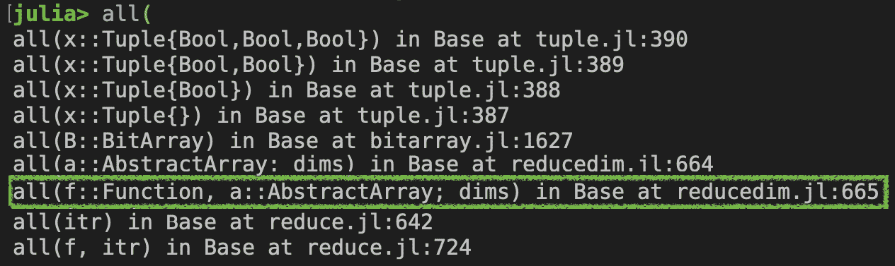

`all` 函数可以用来检查数组中所有元素是否都评估为 `true` 的条件。为了使其更加灵活，它可以接受一个自定义谓词函数。例如，我们可以检查数组中所有数字是否都是奇数，如下所示：

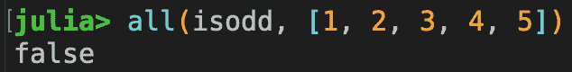

虽然我们知道它被正确调度了，但我们也可以确认 `isodd` 的类型是 `Function` 的子类型，如下所示：

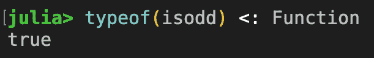

结果表明，所有 Julia 函数都有它们自己的唯一类型，如下面的代码中显示的 `typeof(isodd)`，并且它们都有一个超类型 `Function`：

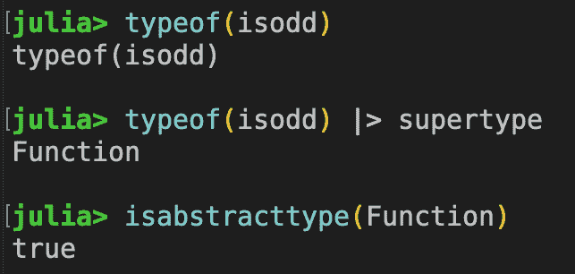

由于 `all` 方法被定义为接受任何 `Function` 对象，我们实际上可以传递任何函数，Julia 会乐意调度到该方法。不幸的是，这可能会导致不希望的结果，如下面的截图所示：

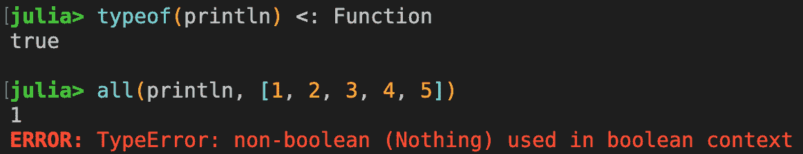

我们在这里遇到了错误，因为传递给 `all` 函数的函数应该接受一个元素并返回一个布尔值。由于 `println` 总是返回 `nothing`，所以 `all` 函数只是抛出了一个异常。

在需要更强类型的情况下，可以强制指定特定的函数类型。以下是如何创建一个更安全的 `all` 函数的方法：

```py
const SignFunctions = Union{typeof(isodd),typeof(iseven)};
myall(f::SignFunctions, a::AbstractArray) = all(f, a);
```

`SignFunctions` 常量是一个联合类型，仅由 `isodd` 和 `iseven` 函数的类型组成。因此，`myall` 方法只有在第一个参数是 `isodd` 或 `iseven` 时才会被调度；否则，将抛出一个方法错误，如下面的截图所示：

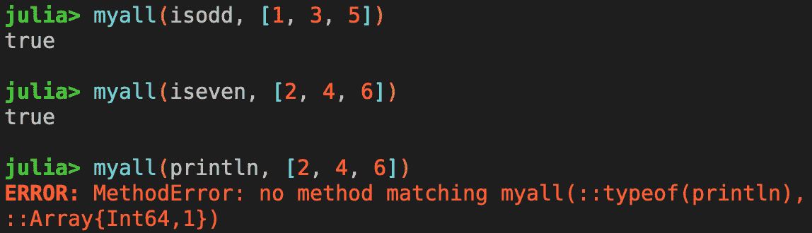

当然，这样做严重限制了函数的实用性。我们还必须枚举所有可能传递的函数，而这并不总是可行的。因此，处理函数参数的手段似乎有些有限。

回到方差的话题，当所有函数都是最终的，并且它们只有一个超类型时，实际上真的没有什么可说的。

在实践中，当我们设计软件时，我们确实关心函数的类型。正如前一个例子所示，`all`函数只能与接受单个参数并返回布尔值的函数一起工作。这应该是接口合同。然而，我们如何强制执行这个合同呢？最终，我们需要对函数和调用者与被调用者之间的合同有更好的理解。合同可以被视为方法参数和返回类型的组合。让我们在下一节中找出是否有更好的方法来处理这个问题。

# 确定函数类型的变异性

在本节中，我们将尝试理解如何推理函数类型。虽然 Julia 在形式化函数类型方面没有提供太多帮助，但它并没有阻止我们自行进行分析。在一些强类型、静态 OOP 语言中，函数类型被更正式地定义为方法参数和返回类型的组合。

假设一个函数接受三个参数并返回一个单一值。然后我们可以用以下符号来描述该函数：

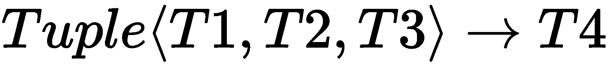

让我们继续动物王国的例子，并定义一些新的变量和函数，如下所示：

```py
female_dogs = [Dog("Pinky"), Dog("Pinny"), Dog("Moonie")]
female_cats = [Cat("Minnie"), Cat("Queenie"), Cat("Kittie")]

select(::Type{Dog}) = rand(female_dogs)
select(::Type{Cat}) = rand(female_cats)
```

在这里，我们定义了两个数组——一个用于母狗，另一个用于母猫。`select`函数可以用来随机选择一只狗或猫。接下来，让我们考虑以下函数：

```py
match(m::Mammal) = select(typeof(m))
```

`match`函数接受一个`Mammal`并返回相同类型的对象。这是它的工作方式：

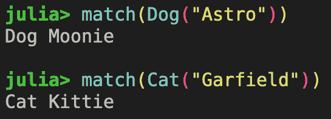

由于`match`函数只能返回`Dog`或`Cat`，我们可以这样推理函数类型：

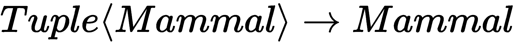

假设我们定义了两个额外的函数，如下所示：

```py
# It's ok to kiss mammals :-)
kiss(m::Mammal) = "$m kissed!"

# Meet a partner
function meet_partner(finder::Function, self::Mammal) 
    partner = finder(self)
    kiss(partner)
end
```

`meet_partner`函数接受一个`finder`函数作为第一个参数。然后，它调用`finder`函数来找到一个伴侣，并最终与伴侣`kiss`。按照设计，我们将传递之前代码中定义的`match`函数。让我们看看它是如何工作的：

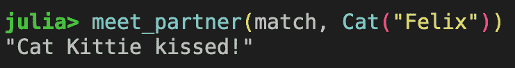

到目前为止，一切顺利。从`meet_partner`函数的角度来看，它期望`finder`函数接受一个`Mammal`参数并返回一个`Mammal`对象。这正是`match`函数的设计方式。现在，让我们看看我们能否通过定义一个不返回哺乳动物的函数来搞砸它：

```py
neighbor(m::Mammal) = Crocodile("Solomon")
```

尽管`neighbor`函数可以接受一个哺乳动物作为参数，但它返回的是鳄鱼，而鳄鱼是一种爬行动物，不是哺乳动物。如果我们尝试将其传递给`meet_partner`函数，我们就会遇到灾难：

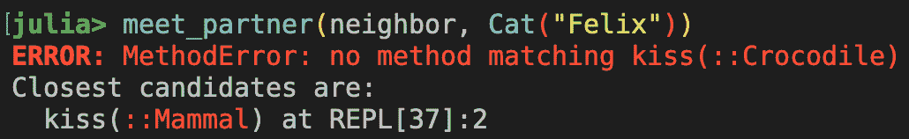

我们刚刚证明的内容相当直观。由于`finder`函数的返回类型预期为`Mammal`，任何返回`Mammal`任何子类型的其他`finder`函数也会起作用。因此，函数类型的返回类型是协变的。

现在，关于函数类型的参数是什么？再次，`meet_partner`函数预期将任何哺乳动物传递给`finder`函数。`finder`函数必须能够接受`dog`或`cat`对象。如果`finder`函数只接受猫或狗，那么它将不起作用。让我们看看如果有一个更限制性的`finder`函数会发生什么：

```py
buddy(cat::Cat) = rand([Dog("Astro"), Dog("Goofy"), Cat("Lucifer")])
```

在这里，`buddy`函数接受一只猫并返回一个哺乳动物。如果我们将其传递给`meet_partner`函数，那么当我们想要为我们的狗`Chef`找到一个伴侣时，它将不起作用：


因此，函数类型的参数不是协变的。它们可能是反协变的吗？嗯，为了是反协变的，`finder`函数必须接受`Mammal`的超类型。在我们的动物王国中，唯一的超类型是`Vertebrate`；然而，`Vertebrate`是一个抽象类型，不能被实例化。如果我们实例化任何其他是`Vertebrate`子类型的具体类型，它就不会是哺乳动物（否则，它已经被认为是哺乳动物了）。因此，函数参数是不变的。

更正式地说，这看起来如下所示：

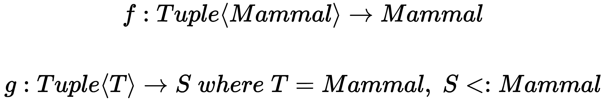

函数`g`是函数`f`的子类型，只要`T`是`Mammal`，且`S`是`Mammal`的子类型。关于这一点有一句话："在接受方面要宽容，在产生方面要保守。" 

虽然做这种分析很有趣，但考虑到 Julia 运行时不支持像我们所见的那样细粒度的函数类型，我们是否真的获得了什么？似乎我们可以自己模拟一个类型检查的效果，这是下一节的主题。

# 实现我们自己的函数类型分派

正如我们在本节前面所看到的，Julia 为每个函数创建一个唯一的函数类型，它们都是`Function`抽象类型的子类型。我们似乎错过了一个多态的机会。以`Base`中的`all`函数为例，如果我们能够设计一个表示谓词函数的类型，而不是让`all`在传递不兼容的函数时失败，那将会非常棒。

为了绕过这个限制，让我们定义一个名为`PredicateFunction`的参数化类型，如下所示：

```py
struct PredicateFunction{T,S}
    f::Function
end
```

`PredicateFunction`参数化类型只是包装了一个函数`f`。类型参数`T`和`S`用于表示函数参数的类型，并分别返回`f`的类型。例如，`iseven`函数可以被包装如下，因为我们知道该函数可以接受一个数字并返回一个布尔值：

```py
PredicateFunction{Number,Bool}(iseven)
```

便利的是，由于 Julia 支持可调用的结构体，我们可以使`PredicateFunction`结构体可以被调用，就像它本身是一个函数一样。为了实现这一点，我们可以定义以下函数：

```py
(pred::PredicateFunction{T,S})(x::T; kwargs...) where {T,S} = 
    pred.f(x; kwargs...)
```

如您所见，这个函数只是将调用转发到包装的`pred.f`函数。一旦定义了它，我们就可以做一些小实验来看看它是如何工作的：

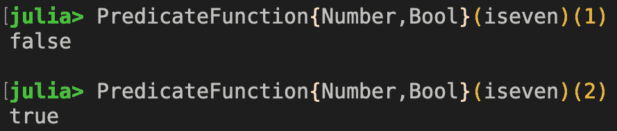

看起来相当不错。让我们定义我们自己的 *safe* 版本的 `all` 函数，如下所示：

```py
function safe_all(pred::PredicateFunction{T,S}, a::AbstractArray) where 
        {T <: Any, S <: Bool}
    all(pred, a)
end
```

`safe_all` 函数接受一个 `PredicteFunction{T,S}` 作为第一个参数，约束条件是 `T` 是 `Any` 的子类型，而 `S` 是 `Bool` 的子类型。这正是我们想要的谓词函数的类型签名。知道 `Number <: Any` 和 `Bool <: Bool`，我们可以肯定地将 `iseven` 函数传递给 `safe_all`。现在让我们测试一下：

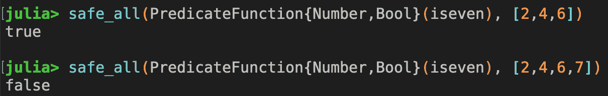

*Bravo!* 我们已经创建了一个安全的 `all` 函数版本。第一个参数必须是一个接受任何内容并返回布尔值的谓词函数。我们不再需要接受一个通用的 `Function` 参数，现在我们可以强制严格的类型匹配并参与多重分发。

关于变异性就讲这么多。接下来，我们将继续并重新审视参数化方法调用的规则。

# 参数化方法重新审视

根据子类型关系进行分发的功能是 Julia 语言的一个关键特性。我们最初在 第三章 *设计函数和接口* 中介绍了参数化方法的概念。在本节中，我们将更深入地探讨一些关于方法选择分发的微妙情况。

让我们从基础开始：我们如何为参数化方法指定类型变量？

# 指定类型变量

当我们定义一个参数化方法时，我们使用 `where` 子句来引入类型变量。让我们来看一个简单的例子：

```py
triple(x::Array{T,1}) where {T <: Real} = 3x
```

`triple` 函数接受一个 `Array{T}`，其中 `T` 是 `Real` 的任何子类型。这段代码非常易于阅读，这是大多数 Julia 开发者选择来指定类型参数的格式。那么 `T` 的值可能是什么？它可以是具体类型、抽象类型，或者两者都是？

为了回答这个问题，我们可以在 REPL 中测试它：

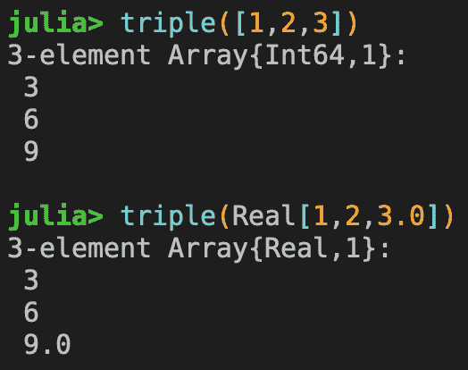

因此，该方法确实在抽象类型（`Real`）和具体类型（`Int64`）上进行了分发。值得一提的是，`where` 子句也可以放在方法参数旁边：

```py
triple(x::Array{T,1} where {T <: Real}) = 3x
```

从函数式编程的角度来看，无论 `where` 子句是放在内部还是外部，都是相同的。

然而，有一些细微的差别。当 `where` 子句放在外部时，你将获得两个额外的优势：

+   类型变量 `T` 在方法体内部是可访问的。

+   类型变量 `T` 可以用来强制多个方法参数具有相同的值。

结果表明，第二点导致了 Julia 分发系统中一个有趣的功能。我们将在下一节中介绍这一点。

# 匹配类型变量

当一个类型变量在方法签名中多次出现时，它被用来强制所有出现位置具有相同的类型。考虑以下函数：

```py
add(a::Array{T,1}, x::T) where {T <: Real} = (T, a .+ x)
```

`add` 函数接受一个 `Array{T}` 和一个类型为 `T` 的值。它返回一个包含 `T` 和将值添加到数组后的结果的元组。直观上，我们希望 `T` 在两个参数中保持一致。换句话说，我们希望函数在调用时针对 `T` 的每个实现进行特殊化。显然，当类型一致时，函数工作得很好：

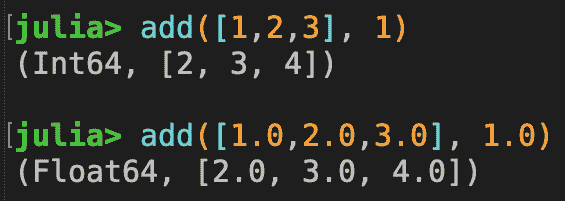

在第一种情况下，`T` 被确定为 `Int64`，而在第二种情况下，`T` 被确定为 `Float64`。也许并不令人意外，当类型不匹配时，我们可能会得到一个方法错误：

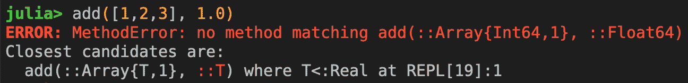

由于我们说 `T` 可以是一个抽象类型，我们能否将方法分派到这个方法上，因为 `T` 可以被认为是 `Real`？答案是不了，因为参数化类型是 *不变的*！一个 `Real` 对象的数组不等于一个 `Int64` 值的数组。更正式地说，`Array{Int}` 不是 `Array{Real}` 的子类型。

当 `T` 是数组中的抽象类型时，事情会变得更有趣。让我们试试这个：

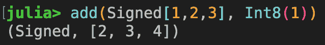

在这里，`T` 明确设置为 `Signed`，并且由于 `Int8` 是 `Signed` 的子类型，方法被正确分派。

接下来，我们将探讨另一个独特的类型特性，称为对角线规则。

# 理解对角线规则

如我们之前所学的，能够匹配类型变量并在方法参数中保持一致性是一个很好的特性。在实践中，有些情况下我们希望在确定每个类型变量的正确类型时更加具体。

考虑这个函数：

```py
diagonal(x::T, y::T) where {T <: Number} = T
```

`diagonal` 函数接受两个相同类型的参数，其中类型 `T` 必须是 `Number` 的子类型。类型变量 `T` 简单地返回给调用者。

当 `T` 是具体类型时，很容易推理出类型是一致的。例如，我们可以传递一对 `Int64` 值或一对 `Float64` 值给函数，并期望看到相应的具体类型返回：

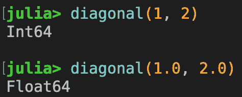

直观上，我们也期望当类型不一致时这会失败：

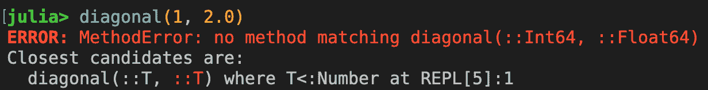

虽然看起来直观，但我们可能会争辩说类型变量 `T` 是一个抽象类型，比如 `Real`。由于 `1` 的值是 `Int64` 且 `Int64` 是 `Real` 的子类型，以及 `2.0` 的值是 `Float64` 且 `Float64` 是 `Real` 的子类型，那么方法是否仍然应该被分派？为了使这一点更加清晰，我们甚至可以在调用函数时将参数注释为如下：

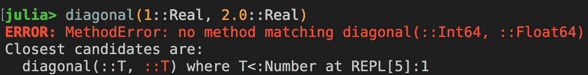

结果表明，Julia 被设计成给我们更直观的行为。这也是引入**对角线规则**的真正原因。对角线规则指出，当一个类型变量在协变位置（即方法参数）中多次出现时，该类型变量将被限制仅与具体类型匹配。

在这种情况下，类型变量`T`被视为对角线变量，因此`T`必须是一个具体类型。

尽管存在对角线规则的例外。我们将在下一节讨论这个问题。

# 对角线规则的例外

对角线规则指出，当一个类型变量在协变位置（即方法参数）中多次出现时，该类型变量将被限制仅与具体类型匹配；然而，该规则有一个例外——当类型变量可以从不变位置明确确定时，它允许是抽象类型而不是具体类型。

考虑以下例子：

```py
not_diagonal(A::Array{T,1}, x::T, y::T) where {T <: Number} = T
```

与上一节中的`diagonal`函数不同，这个函数允许`T`是抽象的。我们可以这样证明：

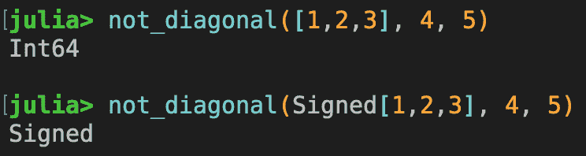

原因是`T`出现在参数类型的第一参数中。正如我们所知，参数类型是不变的，我们已经确定`T`是`Signed`。因为`Int64`是`Signed`的子类型，所以一切匹配。

在下一节中，我们将讨论类型变量的可用性。

# 类型变量的可用性

参数方法的一个重要特性是，`where`子句中指定的类型变量也可以从方法体中访问。与您可能认为的相反，这并不总是正确的。在这里，我们将展示一个类型变量在运行时不可用的例子。

考虑以下函数：

```py
mytypes1(a::Array{T,1}, x::S) where {S <: Number, T <: S} = T
mytypes2(a::Array{T,1}, x::S) where {S <: Number, T <: S} = S
```

我们可以使用`mytypes1`和`mytypes2`函数来实验 Julia 运行时推导出的类型变量。让我们从一个愉快的例子开始：

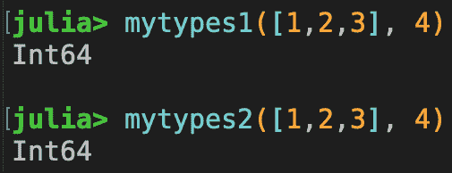

然而，情况并不总是如此美好。在其他情况下，它可能并不总是 100%有效。以下是一个例子：

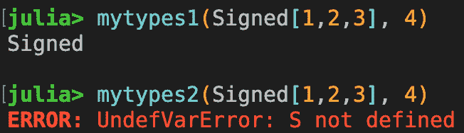

为什么`S`在这里没有定义？首先，我们已经知道`T`是`Signed`，因为参数类型是不变的。作为`where`子句的一部分，我们也知道`T`是`S`的子类型。因此，`S`可以是`Integer`、`Real`、`Number`甚至`Any`。由于可能的答案太多，Julia 运行时决定不对`S`分配任何值。

这个故事的意义是，不要假设类型变量总是被定义并且可以从方法中访问，尤其是在这种更复杂的情况下。

# 摘要

在本章中，我们学习了与子类型、变体和调度相关的各种主题。这些概念是创建更大、更复杂应用程序的基本构建块。

我们首先讨论了实现继承和行为子类型化以及它们之间的区别。我们推理出，由于各种问题，实现继承不是一个很好的设计模式。我们得出结论，Julia 的类型系统是为了避免我们在其他编程语言中看到的问题而设计的。

然后，我们回顾了不同种类的变异性，这些不过是解释参数化类型之间子类型关系的方法。我们详细地解释了参数化类型是如何不变的，方法参数是如何协变的。然后我们更进一步讨论了函数类型的变异性以及我们如何可以构建自己的数据类型来封装函数以实现分派目的。

最后，我们重新审视了参数化方法，并探讨了在分派过程中类型变量是如何指定和匹配的。我们了解了对角线规则，这是 Julia 语言中的一个关键设计特性，它允许我们以直观的方式强制方法参数的类型一致性。

我们现在已经完成了这一章节和整本书。感谢您阅读它！

# 问题

1.  实现继承和行为子类型化有何不同？

1.  实现继承有哪些主要问题？

1.  什么是鸭子类型？

1.  方法参数的变异性是什么，为什么？

1.  为什么在 Julia 中参数化类型是不变的？

1.  对角线规则何时适用？
