# 第一章：机器学习复习

机器学习是**人工智能**（**AI**）的一个子领域，致力于开发使计算机能够从海量数据中学习的算法和技术。随着数据产生速度的不断增加，机器学习在近年来在解决复杂问题中发挥了关键作用。这一成功是许多优秀机器学习库的资金支持和发展的主要推动力，这些库利用数据来构建预测模型。此外，企业也开始意识到机器学习的潜力，推动了对数据科学家和机器学习工程师的需求飙升，以设计性能更优的预测模型。

本章旨在复习主要概念和术语，并介绍将在本书中使用的框架，以便以扎实的基础接触集成学习。

本章覆盖的主要内容如下：

+   各种机器学习问题和数据集

+   如何评估预测模型的性能

+   机器学习算法

+   Python 环境设置及所需库

# 技术要求

你需要具备基本的机器学习技术和算法知识。此外，还需要了解 Python 语法和约定。最后，熟悉 NumPy 库将极大帮助读者理解一些自定义算法的实现。

本章的代码文件可以在 GitHub 上找到：

[`github.com/PacktPublishing/Hands-On-Ensemble-Learning-with-Python/tree/master/Chapter01`](https://github.com/PacktPublishing/Hands-On-Ensemble-Learning-with-Python/tree/master/Chapter01)

查看以下视频，观看代码实例：[`bit.ly/30u8sv8`](http://bit.ly/30u8sv8)。

# 从数据中学习

数据是机器学习的原材料。处理数据可以生成信息；例如，测量一部分学生的身高（数据），并计算他们的平均值（处理），可以帮助我们了解整个学校的身高（信息）。如果我们进一步处理数据，例如，将男性和女性分组并计算每个组的平均值，我们将获得更多信息，因为我们将能够知道学校男性和女性的平均身高。机器学习旨在从任何给定的数据中提取尽可能多的信息。在这个例子中，我们生成了一个非常基础的预测模型。通过计算两个平均值，我们只需知道学生是男性还是女性，就能预测任何学生的平均身高。

机器学习算法处理的数据集合被称为问题的数据集。在我们的例子中，数据集包括身高测量（单位为厘米）和孩子的性别（男性/女性）。在机器学习中，输入变量称为特征，输出变量称为目标。在这个数据集中，我们预测模型的特征仅由学生的性别组成，而我们的目标是学生的身高（以厘米为单位）。从现在开始，除非另有说明，否则生成的预测模型将简单地称为**模型**。每个数据点称为一个实例。在这个问题中，每个学生都是数据集的一个实例。

当目标是一个连续变量（即数字）时，问题是回归问题，因为目标是根据特征进行回归。当目标是一个类别集时，问题是分类问题，因为我们试图将每个实例分配到一个类别或类中。

在分类问题中，目标类可以用一个数字表示；这并不意味着它是回归问题。判断是否为回归问题的最有用的方法是思考是否可以通过目标对实例进行排序。在我们的例子中，目标是身高，因此我们可以将学生按身高从高到低排序，因为 100 厘米小于 110 厘米。举个反例，如果目标是他们最喜欢的颜色，我们可以用数字表示每种颜色，但无法对其进行排序。即使我们把红色表示为一，蓝色表示为二，我们也不能说红色是“在前”或“比”蓝色小。因此，这个反例是一个分类问题。

# 流行的机器学习数据集

机器学习依赖于数据来生成高性能模型。没有数据，甚至无法创建模型。在本节中，我们将介绍一些流行的机器学习数据集，我们将在本书中使用这些数据集。

# 糖尿病

糖尿病数据集涉及 442 名糖尿病患者及其在基准测量后一年内病情的进展。数据集包括 10 个特征，包括患者的年龄、性别、**体重指数**（**bmi**）、平均**血压**（**bp**）以及六个血清测量值。数据集的目标是基准测量后一年内病情的进展。这是一个回归数据集，因为目标是一个数字。

在本书中，数据集的**特征**已经进行了均值中心化和缩放处理，使得每个特征的数据集平方和等于 1。下表展示了糖尿病数据集的一个样本：

| **年龄** | **性别** | **bmi** | **血压** | **s1** | **s2** | **s3** | **s4** | **s5** | **s6** | **目标** |
| --- | --- | --- | --- | --- | --- | --- | --- | --- | --- | --- |
| 0.04 | 0.05 | 0.06 | 0.02 | -0.04 | -0.03 | -0.04 | 0.00 | 0.02 | -0.02 | 151 |
| 0.00 | -0.04 | -0.05 | -0.03 | -0.01 | -0.02 | 0.07 | -0.04 | -0.07 | -0.09 | 75 |
| 0.09 | 0.05 | 0.04 | -0.01 | -0.05 | -0.03 | -0.03 | 0.00 | 0.00 | -0.03 | 141 |
| -0.09 | -0.04 | -0.01 | -0.04 | 0.01 | 0.02 | -0.04 | 0.03 | 0.02 | -0.01 | 206 |

# 乳腺癌

乳腺癌数据集涉及 569 例恶性和良性肿瘤的活检。该数据集提供了从细针穿刺活检图像中提取的 30 个特征，这些特征描述了细胞核的形状、大小和纹理。此外，对于每个特征，还提供了三个不同的值：均值、标准误差以及最差或最大值。这确保了每个图像中的细胞群体得到充分描述。

数据集的目标是诊断，即肿瘤是恶性还是良性。因此，这是一个分类数据集。可用的特征如下所列：

+   平均半径

+   平均纹理

+   平均周长

+   平均面积

+   平均平滑度

+   平均紧密度

+   平均凹度

+   平均凹点

+   平均对称性

+   平均分形维度

+   半径误差

+   纹理误差

+   周长误差

+   面积误差

+   平滑度误差

+   紧密度误差

+   凹度误差

+   凹点误差

+   对称性误差

+   分形维度误差

+   最差半径

+   最差纹理

+   最差周长

+   最差面积

+   最差平滑度

+   最差紧密度

+   最差凹度

+   最差凹点

+   最差对称性

+   最差分形维度

# 手写数字

MNIST 手写数字数据集是最著名的图像识别数据集之一。它由 8 x 8 像素的方形图像组成，每个图像包含一个手写数字。因此，数据集的特征是一个 8 x 8 的矩阵，包含每个像素的灰度色值。目标包括 10 个类别，分别对应数字 0 到 9。这个数据集是一个分类数据集。下图是手写数字数据集中的一个样本：

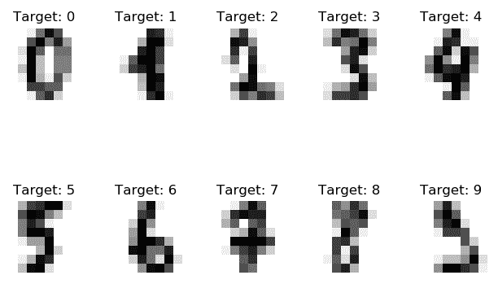

手写数字数据集样本

# 有监督学习与无监督学习

机器学习可以分为多个子类别；其中两个大类是有监督学习和无监督学习。这些类别包含了许多流行且广泛应用的机器学习方法。在本节中，我们将介绍这些方法，并给出一些有监督学习和无监督学习的小例子。

# 有监督学习

在上一节的例子中，数据包含了一些特征和一个目标；无论目标是定量的（回归）还是分类的（分类）。在这种情况下，我们将数据集称为标注数据集。当我们尝试从标注数据集中生成一个模型，以便对看不见的或未来的数据做出预测（例如，诊断新的肿瘤病例）时，我们使用有监督学习。在简单的情况下，有监督学习模型可以被视为一条线。这条线的目的是根据目标（分类）将数据分开，或者紧密跟随数据（回归）。

下图展示了一个简单的回归示例。在这里，*y*是目标，*x*是数据集特征。我们的模型由简单的方程*y*=2*x*-5 组成。显然，直线紧密地跟随数据。为了估算一个新的、未见过的点的*y*值，我们使用上述公式计算其值。下图显示了一个使用*y*=2*x*-5 作为预测模型的简单回归：

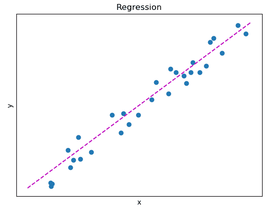

使用预测模型 y=2x-5 的简单回归

在下图中，展示了一个简单的分类问题。在这里，数据集特征是*x*和*y*，目标是实例的颜色。再次，虚线是*y*=2*x*-5，但这次我们测试点是位于线的上方还是下方。如果该点的*y*值低于预期（较小），我们期望它是橙色的。如果它较高（较大），我们期望它是蓝色的。下图是使用*y*=2*x*-5 作为边界的简单分类：

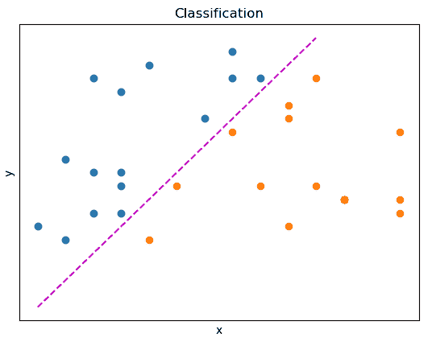

使用 y=2x-5 作为边界的简单分类

# 无监督学习

在回归和分类中，我们清楚地理解数据的结构或行为。我们的目标只是对该结构或行为进行建模。在某些情况下，我们不知道数据的结构。在这些情况下，我们可以利用无监督学习来发现数据中的结构，从而获得信息。无监督学习的最简单形式是聚类。顾名思义，聚类技术尝试将数据实例分组（或聚类）。因此，属于同一聚类的实例在特征上有很多相似之处，而与属于不同聚类的实例则有很大差异。下图展示了一个具有三个聚类的简单例子。在这里，数据集特征是*x*和*y*，没有目标。

聚类算法发现了三个不同的组，分别以点(0, 0)、(1, 1)和(2, 2)为中心：

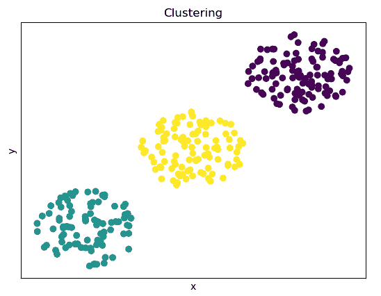

具有三个不同组的聚类

# 降维

另一种无监督学习的形式是降维。数据集中存在的特征数量等于数据集的维度。通常，许多特征可能是相关的、有噪声的，或者根本没有提供太多信息。然而，存储和处理数据的成本与数据集的维度是相关的。因此，通过减少数据集的维度，我们可以帮助算法更好地建模数据。

降维的另一个用途是高维数据集的可视化。例如，使用 t-分布随机邻居嵌入（t-SNE）算法，我们可以将乳腺癌数据集降至两个维度或组件。尽管可视化 30 个维度并不容易，但可视化两个维度却相当简单。

此外，我们还可以通过可视化测试数据集中包含的信息是否能够用来区分数据集的各个类别。下图展示了*y*轴和*x*轴上的两个组件，而颜色则代表实例的类别。尽管我们无法绘制所有维度，但通过绘制这两个组件，我们可以得出类之间存在一定可分性的结论：

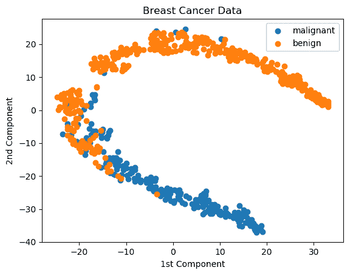

使用 t-SNE 降维乳腺癌数据集

# 性能指标

机器学习是一个高度定量的领域。虽然我们可以通过绘制模型如何区分类别以及它如何紧密地跟随数据来衡量模型的性能，但为了评估模型的表现，还需要更多的定量性能指标。在本节中，我们将介绍代价函数和评估指标。它们都用于评估模型的表现。

# 代价函数

机器学习模型的目标是对我们的数据集进行建模。为了评估每个模型的表现，我们定义了目标函数。这些函数通常表示一个代价，或者说是模型距离完美的程度。这些代价函数通常使用损失函数来评估模型在每个单独数据实例上的表现。

以下几节描述了一些最常用的代价函数，假设数据集有*n*个实例，实例*i*的目标真实值为*t[i]*，而模型的输出为*y[i]*。

# 平均绝对误差

**平均绝对误差**（**MAE**）或 L1 损失是目标真实值与模型输出之间的均绝对距离。它的计算公式如下：


# 均方误差

**均方误差**（**MSE**）或 L2 损失是目标真实值与模型输出之间的均方距离。它的计算公式如下：

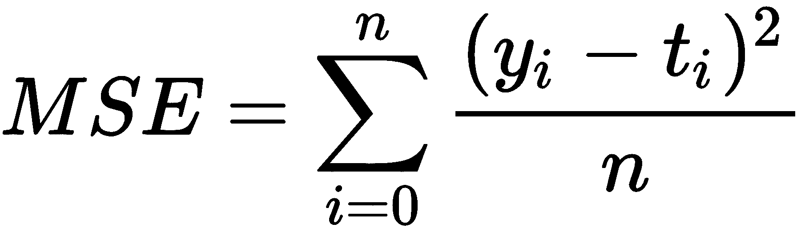

# 交叉熵损失

交叉熵损失用于输出介于 0 和 1 之间的概率的模型，通常用来表示一个实例属于特定类别的概率。当输出概率偏离实际标签时，损失值会增加。在一个简单的例子中，假设数据集由两个类别组成，计算方法如下：

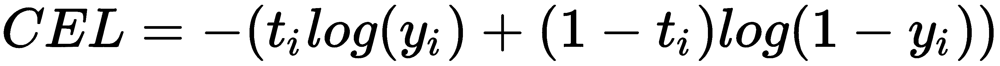

# 指标

代价函数在我们尝试通过数值优化模型时非常有用。但作为人类，我们需要一些既有用又直观的指标来理解和报告。因此，有许多可以提供模型性能洞察的指标。以下几节将介绍最常用的指标。

# 分类准确率

所有指标中最简单且最容易掌握的分类准确率，指的是正确预测的百分比。为了计算准确率，我们将正确预测的数量除以总实例数：

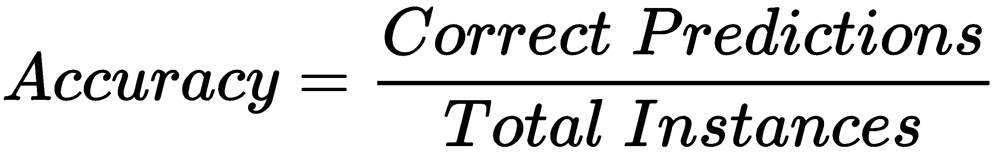

为了使准确率具有实质性的意义，数据集必须包含相等数量的属于每个类别的实例。如果数据集不平衡，准确率将受到影响。例如，如果一个数据集由 90%的 A 类和 10%的 B 类组成，那么一个将每个实例预测为 A 类的模型将有 90%的准确率，尽管它的预测能力为零。

# 混淆矩阵

为了解决前面的问题，可以使用混淆矩阵。混淆矩阵呈现正确或错误预测为每个可能类别的实例数量。在只有两个类别（“是”和“否”）的数据集中，混淆矩阵具有以下形式：

| **n = 200** | **预测: 是** | **预测: 否** |
| --- | --- | --- |
| **目标: 是** | 80 | 70 |
| **目标: 否** | 20 | 30 |

这里有四个单元格，每个对应以下之一：

+   **真正例** (**TP**): 当目标属于“是”类别且模型预测为“是”

+   **真负例** (**TN**): 当目标属于“否”类别且模型预测为“否”

+   **假正例** (**FP**): 当目标属于“否”类别且模型预测为“是”

+   **假负例** (**FN**): 当目标属于“是”类别且模型预测为“否”

混淆矩阵提供有关真实类别和预测类别平衡的信息。为了从混淆矩阵中计算准确率，我们将 TP 和 TN 的总和除以实例的总数：

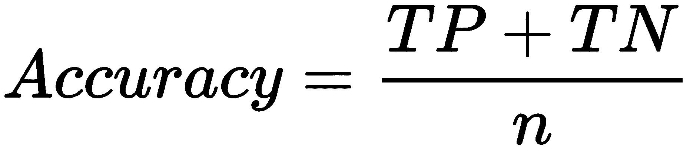

# 灵敏度、特异性和曲线下面积

曲线下面积（AUC）关注二分类数据集，它描述了模型正确排名任何给定实例的概率。为了定义 AUC，我们首先必须定义灵敏度和特异性：

+   **灵敏度** (**真正例率**): 灵敏度是指相对于所有正例，正确预测为正例的正例比例。其计算方法如下：

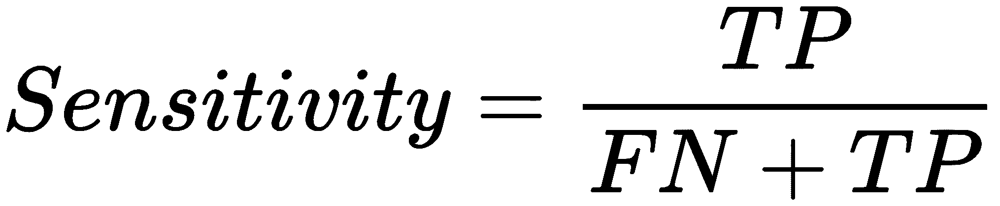

+   **特异性** (**假正例率**): 特异性是指相对于所有负例，错误预测为正例的负例比例。其计算方法如下：

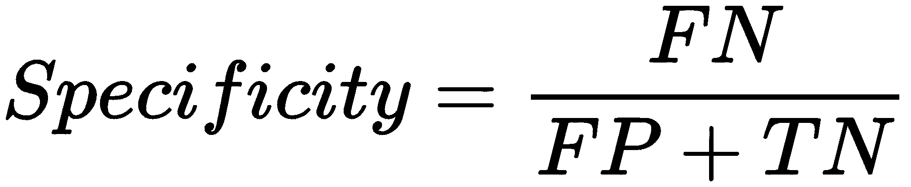

通过在特定的间隔（例如，每 0.05 增加一次）计算（1-特异性）和灵敏度，我们可以观察模型的表现。间隔与模型对每个实例的输出概率相关；例如，首先我们计算所有估计属于“是”类别的概率小于 0.05 的实例。然后，重新计算所有估计概率小于 0.1 的实例，以此类推。结果如下所示：

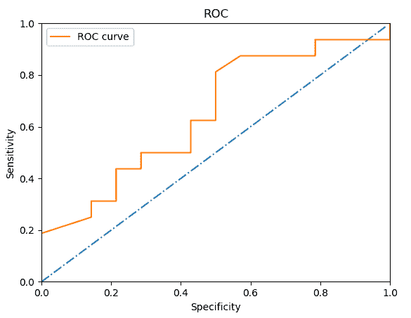

接收者操作特征曲线

直线表示正确或错误地对实例进行排名的概率相等：一个随机模型。橙色线（ROC 曲线）描绘了模型的概率。如果 ROC 曲线位于直线下方，意味着模型的表现比随机的、没有信息的模型差。

# 精确度、召回率和 F1 分数

精确度衡量模型的表现，通过量化正确分类为特定类别的实例的百分比，相对于所有预测为同一类别的实例。计算公式如下：

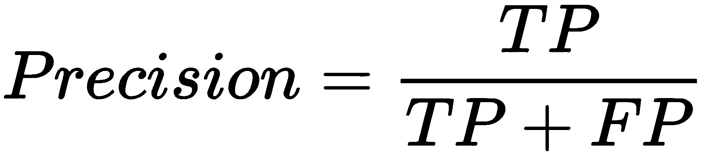

召回率也叫做敏感度。精确度和召回率的调和平均数称为 F1 分数，计算公式如下：

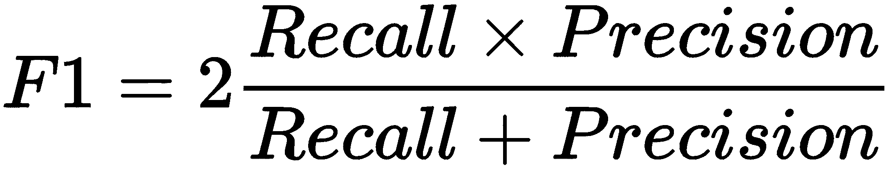

使用调和平均数而不是简单平均数的原因是，调和平均数受两者（精确度和召回率）之间不平衡的影响很大。因此，如果精确度或召回率显著小于另一个，F1 分数将反映这种不平衡。

# 评估模型

尽管有各种各样的指标来表明模型的表现，但仔细设置测试环境是非常重要的。最重要的事情之一是将数据集分成两部分。数据集的一部分将由算法用于生成模型；另一部分将用于评估模型。这通常被称为训练集和测试集。

训练集可以被算法用来生成和优化模型，使用任何代价函数。算法完成后，生成的模型将在测试集上进行测试，以评估其对未见数据的预测能力。虽然算法可能在训练集上生成表现良好的模型（样本内表现），但它可能无法泛化并在测试集上表现同样好（样本外表现）。这可以归因于许多因素——将在下一章中讨论。一些出现的问题可以通过使用集成方法来解决。然而，如果算法面对的是低质量的数据，几乎无法改进样本外的表现。

为了获得一个公正的估计，我们有时会将数据集的不同部分迭代地分成固定大小的训练集和测试集，比如 90%的训练集和 10%的测试集，直到对整个数据集进行了测试。这被称为 K 折交叉验证。在 90%与 10%的分割情况下，它被称为 10 折交叉验证，因为我们需要进行 10 次以便获得整个数据集的估计。

# 机器学习算法

有许多机器学习算法，适用于监督学习和无监督学习。在本书中，我们将介绍一些最受欢迎的算法，这些算法可以在集成方法中使用。本章将介绍每个算法背后的关键概念、基本算法以及实现这些算法的 Python 库。

# Python 包

为了充分发挥任何编程语言的强大功能，库是必不可少的。它们提供了许多算法的便捷且经过测试的实现。在本书中，我们将使用 Python 3.6，并结合以下库：NumPy，因其出色的数值运算符和矩阵实现；Pandas，因其便捷的数据操作方法；Matplotlib，用于可视化我们的数据；scikit-learn，因其出色的各种机器学习算法实现；Keras，用于构建神经网络，利用其 Pythonic、直观的接口。Keras 是其他框架的接口，如 TensorFlow、PyTorch 和 Theano。本书中使用的每个库的具体版本如下：

+   numpy==1.15.1

+   pandas==0.23.4

+   scikit-learn==0.19.1

+   matplotlib==2.2.2

+   Keras==2.2.4

# 监督学习算法

最常见的机器学习算法类别是监督学习算法。这类算法涉及数据具有已知结构的问题。这意味着每个数据点都有一个与之相关的特定值，我们希望对其进行建模或预测。

# 回归

回归是最简单的机器学习算法之一。**普通最小二乘法**（**OLS**）回归形式为 *y=ax+b*，旨在优化 *a* 和 *b* 参数，以便拟合数据。它使用均方误差（MSE）作为其代价函数。顾名思义，它能够解决回归问题。

我们可以使用 scikit-learn 实现的 OLS 来尝试建模糖尿病数据集（该数据集随库一起提供）：

```py
# --- SECTION 1 ---
# Libraries and data loading
from sklearn.datasets import load_diabetes
from sklearn.linear_model import LinearRegression
from sklearn import metrics
diabetes = load_diabetes()
```

第一部分处理导入库和加载数据。我们使用 `linear_model` 包中的 `LinearRegression` 实现：

```py
# --- SECTION 2 ---
# Split the data into train and test set
train_x, train_y = diabetes.data[:400], diabetes.target[:400]
test_x, test_y = diabetes.data[400:], diabetes.target[400:]
```

第二部分将数据划分为训练集和测试集。在这个示例中，我们使用前 400 个实例作为训练集，另外 42 个作为测试集：

```py
# --- SECTION 3 ---
# Instantiate, train and evaluate the model
ols = LinearRegression()
ols.fit(train_x, train_y)
err = metrics.mean_squared_error(test_y, ols.predict(test_x))
r2 = metrics.r2_score(test_y, ols.predict(test_x))
```

接下来的部分通过 `ols = LinearRegression()` 创建一个线性回归对象。然后，它通过使用 `ols.fit(train_x, train_y)` 在训练实例上优化参数，或者说拟合模型。最后，通过使用 `metrics` 包，我们使用第四部分中的测试数据计算模型的 MSE 和 *R²*：

```py
# --- SECTION 4 ---
# Print the model
print('---OLS on diabetes dataset.---')
print('Coefficients:')
print('Intercept (b): %.2f'%ols.intercept_)
for i in range(len(diabetes.feature_names)):
 print(diabetes.feature_names[i]+': %.2f'%ols.coef_[i])
print('-'*30)
print('R-squared: %.2f'%r2, ' MSE: %.2f \n'%err)
```

代码的输出如下：

```py
---OLS on diabetes dataset.---
Coefficients:
Intercept (b): 152.73
age: 5.03
sex: -238.41
bmi: 521.63
bp: 299.94
s1: -752.12
s2: 445.15
s3: 83.51
s4: 185.58
s5: 706.47
s6: 88.68
------------------------------
R-squared: 0.70 MSE: 1668.75
```

另一种回归形式，逻辑回归，试图建模一个实例属于两个类之一的概率。同样，它试图优化 *a* 和 *b* 参数，以便建模 *p=1/(1+e^(-(ax+b)))*。同样，使用 scikit-learn 和乳腺癌数据集，我们可以创建并评估一个简单的逻辑回归。以下代码部分与前面的类似，不过这次我们将使用分类准确率和混淆矩阵，而不是 *R²* 作为度量：

```py
# --- SECTION 1 ---
# Libraries and data loading
from sklearn.linear_model import LogisticRegression
from sklearn.datasets import load_breast_cancer
from sklearn import metrics
bc = load_breast_cancer()

# --- SECTION 2 ---
# Split the data into train and test set
train_x, train_y = bc.data[:400], bc.target[:400]
test_x, test_y = bc.data[400:], bc.target[400:]

# --- SECTION 3 ---
# Instantiate, train and evaluate the model
logit = LogisticRegression()
logit.fit(train_x, train_y)
acc = metrics.accuracy_score(test_y, logit.predict(test_x))

# --- SECTION 4 ---
# Print the model
print('---Logistic Regression on breast cancer dataset.---')
print('Coefficients:')
print('Intercept (b): %.2f'%logit.intercept_)
for i in range(len(bc.feature_names)):
 print(bc.feature_names[i]+': %.2f'%logit.coef_[0][i])
print('-'*30)
print('Accuracy: %.2f \n'%acc)
print(metrics.confusion_matrix(test_y, logit.predict(test_x)))
```

该模型实现的测试分类准确率为 95%，表现相当不错。此外，下面的混淆矩阵表明该模型并没有试图利用类别不平衡的问题。在本书的后续章节中，我们将学习如何通过集成方法进一步提高分类准确率。以下表格展示了逻辑回归模型的混淆矩阵：

| **n = 169** | **预测：恶性** | **预测：良性** |
| --- | --- | --- |
| **目标：恶性** | 38 | 1 |
| **目标：良性** | 8 | 122 |

# 支持向量机

支持向量机（SVM）使用训练数据的一个子集，特别是每个类别边缘附近的数据点，用以定义一个分隔超平面（在二维中为一条直线）。这些边缘数据点称为支持向量。SVM 的目标是找到一个最大化支持向量之间间距（距离）的超平面（如下图所示）。为了分类非线性可分的类别，SVM 使用核技巧将数据映射到更高维的空间，在该空间中数据可以变得线性可分：

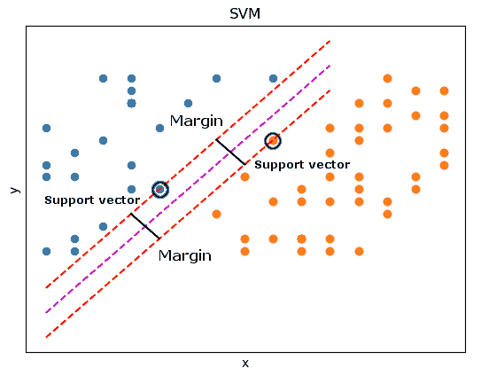

SVM 边界和支持向量

如果你想了解更多关于核技巧的内容，这是一个很好的起点：[`en.wikipedia.org/wiki/Kernel_method#Mathematics:_the_kernel_trick`](https://en.wikipedia.org/wiki/Kernel_method#Mathematics:_the_kernel_trick)。

在 scikit-learn 中，SVM 被实现为 `sklearn.svm`，支持回归（使用 `sklearn.svm.SVR`）和分类（使用 `sklearn.svm.SVC`）。我们将再次使用 scikit-learn 测试算法的潜力，并使用回归示例中的代码。使用带有线性核的 SVM 对乳腺癌数据集进行测试，结果为 95% 的准确率，混淆矩阵如下：

| **n = 169** | **预测：恶性** | **预测：良性** |
| --- | --- | --- |
| **目标：恶性** | 39 | 0 |
| **目标：良性** | 9 | 121 |

在糖尿病数据集上，通过在 `(svr = SVR(kernel='linear', C=1e3))` 对象实例化过程中将 *C* 参数调整为 1000，我们能够实现一个 R2 值为 0.71 和 MSE 值为 1622.36，略微优于逻辑回归模型。

# 神经网络

神经网络，灵感来自于生物大脑的连接方式，由许多神经元或计算模块组成，这些模块按层组织。数据从输入层提供，预测结果由输出层产生。所有中间层称为隐藏层。属于同一层的神经元之间没有直接连接，只与属于其他层的神经元连接。每个神经元可以有多个输入，每个输入都与特定权重相乘，乘积的和被传递到激活函数，激活函数决定神经元的输出。常见的激活函数包括以下几种：

| **Sigmoid** | **Tanh** | **ReLU** | **线性** |
| --- | --- | --- | --- |
|     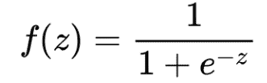 |        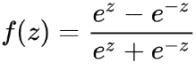 |        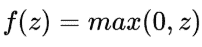 |           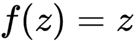 |

网络的目标是优化每个神经元的权重，以使成本函数最小化。神经网络可以用于回归问题，其中输出层由一个神经元组成，或者用于分类问题，其中输出层由多个神经元组成，通常与类别数相等。神经网络有多种优化算法或优化器可供选择，最常见的是随机梯度下降（**SGD**）。其基本思想是，根据误差梯度的方向和大小（即一阶导数），乘以一个称为学习率的因子来更新权重。

已提出了多种变体和扩展，考虑了二阶导数，调整了学习率，或利用前一个权重变化的动量来更新权重。

尽管神经网络的概念已经存在很长时间，但随着深度学习的出现，它们的受欢迎程度最近大大增加。现代架构由卷积层组成，每个层的权重是矩阵，输出通过将权重矩阵滑动到输入上来计算。另一种类型的层是最大池化层，它通过将固定大小的窗口滑动到输入上来计算输出，输出为最大输入元素。递归层则保留了关于前一个状态的信息。

最后，全连接层是传统神经元，如前所述。

Scikit-learn 实现了传统的神经网络，位于 `sklearn.neural_network` 包下。再次使用之前的示例，我们将尝试对糖尿病和乳腺癌数据集进行建模。在糖尿病数据集中，我们将使用 `MLPRegressor`，并选择**随机梯度下降**（**SGD**）作为优化器，代码为 `mlpr = MLPRegressor(solver='sgd')`。在没有进一步微调的情况下，我们达到了 0.64 的 R² 和 1977 的均方误差（MSE）。在乳腺癌数据集上，我们使用**有限记忆 Broyden–Fletcher–Goldfarb–Shanno**（**LBFGS**）优化器，代码为 `mlpc = MLPClassifier(solver='lbfgs')`，我们得到了 93% 的分类准确率，并得到了一个合格的混淆矩阵。下表展示了乳腺癌数据集的神经网络混淆矩阵：

| **n = 169** | **预测：恶性** | **预测：良性** |
| --- | --- | --- |
| **目标：恶性** | 35 | 4 |
| **目标：良性** | 8 | 122 |

关于神经网络的一个非常重要的说明：网络的初始权重是随机初始化的。因此，如果多次执行相同的代码，结果可能会不同。为了确保非随机（非随机性）执行，必须固定网络的初始随机状态。两个 scikit-learn 类通过对象构造器中的 `random_state` 参数实现了这一功能。为了将随机状态设置为特定的种子值，构造器应按以下方式调用：`mlpc = MLPClassifier(solver='lbfgs', random_state=12418)`。

# 决策树

决策树相比其他机器学习算法，更不具有黑箱性质。它们可以轻松解释如何产生预测，这被称为**可解释性**。其主要概念是通过使用提供的特征分割训练集来生成规则。通过迭代地分割数据，形成了一棵树，因此它们的名字由此而来。我们考虑一个数据集，其中的实例是每个个体在决定度假地点时的选择。

数据集的特征包括个人的年龄和可用资金，而目标是他们偏好的度假地点，可能的选择为 **夏令营**、**湖泊** 或 **巴哈马**。以下是一个可能的决策树模型：

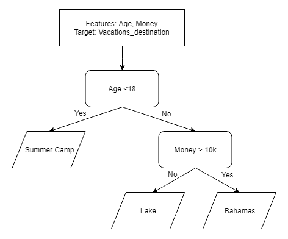

度假目的地问题的决策树模型

正如可以看到的，模型能够解释它是如何产生任何预测的。模型本身的构建方式是通过选择能够最大化信息量的特征和阈值。大致而言，这意味着模型会尝试通过迭代的方式分割数据集，从而最大程度地分离剩余的实例。

尽管决策树直观易懂，但它们也可能产生不合理的模型，极端情况下会生成过多的规则，最终每个规则组合都会指向一个单独的实例。为了避免此类模型，我们可以通过要求模型的深度不超过特定的最大值（即连续规则的最大数量），或者要求每个节点在进一步分裂之前，至少包含一定数量的实例来限制模型。

在 scikit-learn 中，决策树是通过 `sklearn.tree` 包实现的，包含 `DecisionTreeClassifier` 和 `DecisionTreeRegressor`。在我们的示例中，使用 `DecisionTreeRegressor` 和 `dtr = DecisionTreeRegressor(max_depth=2)`，我们得到了 R² 为 0.52，均方误差（MSE）为 2655。在乳腺癌数据集上，使用 `dtc = DecisionTreeClassifier(max_depth=2)`，我们得到了 89% 的准确率，并且得到了以下的混淆矩阵：

| **n = 169** | **预测: 恶性** | **预测: 良性** |
| --- | --- | --- |
| **目标: 恶性** | 37 | 2 |
| **目标: 良性** | 17 | 113 |

虽然这个算法迄今为止表现得不是最好，但我们可以清晰地看到每个个体是如何被分类的，通过将树导出为`graphviz`格式，使用`export_graphviz(dtc, feature_names=bc.feature_names, class_names=bc.target_names, impurity=False)`：

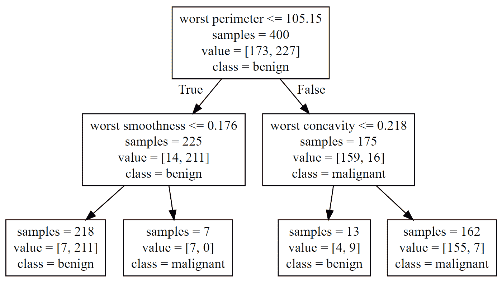

为乳腺癌数据集生成的决策树

# K-最近邻

**k-最近邻**（**k-NN**）是一个相对简单的机器学习算法。每个实例通过与其 K 个最近的样本进行比较来分类，采用多数类作为分类结果。在回归中，使用邻居的平均值。Scikit-learn 的实现位于库的`sklearn.neighbors`包中。根据库的命名规范，`KNeighborsClassifier`实现了分类版本，`KNeighborsRegressor`实现了回归版本。通过在我们的示例中使用它们，回归器生成的 R²为 0.58，均方误差（MSE）为 2342，而分类器达到了 93%的准确率。下表显示了乳腺癌数据集的 k-NN 混淆矩阵：

| **n = 169** | **预测：恶性** | **预测：良性** |
| --- | --- | --- |
| **目标：恶性** | 37 | 2 |
| **目标：良性** | 9 | 121 |

# K-means

K-means 是一种聚类算法，与 k-NN 有相似之处。它生成多个聚类中心，并将每个实例分配给其最近的聚类。所有实例分配到聚类后，聚类的中心点变成新的中心，直到算法收敛到稳定的解。在 scikit-learn 中，该算法通过`sklearn.cluster.KMeans`实现。我们可以尝试对乳腺癌数据集的前两个特征进行聚类：平均半径和 FNA 成像的纹理。

首先，我们加载所需的数据和库，同时只保留数据集的前两个特征：

```py
# --- SECTION 1 ---
# Libraries and data loading
import numpy as np
import matplotlib.pyplot as plt

from sklearn.datasets import load_breast_cancer
from sklearn.cluster import KMeans
bc = load_breast_cancer()
bc.data=bc.data[:,:2]
```

然后，我们将聚类拟合到数据上。注意，我们不需要将数据拆分为训练集和测试集：

```py
# --- SECTION 2 ---
# Instantiate and train
km = KMeans(n_clusters=3)
km.fit(bc.data)
```

接下来，我们创建一个二维网格并对每个点进行聚类，以便绘制聚类区域和边界：

```py
# --- SECTION 3 ---
# Create a point mesh to plot cluster areas
# Step size of the mesh. 
h = .02
# Plot the decision boundary. For that, we will assign a color to each
x_min, x_max = bc.data[:, 0].min() - 1, bc.data[:, 0].max() + 1
y_min, y_max = bc.data[:, 1].min() - 1, bc.data[:, 1].max() + 1
# Create the actual mesh and cluster it
xx, yy = np.meshgrid(np.arange(x_min, x_max, h), np.arange(y_min, y_max, h))
Z = km.predict(np.c_[xx.ravel(), yy.ravel()])
# Put the result into a color plot
Z = Z.reshape(xx.shape)
plt.figure(1)
plt.clf()
plt.imshow(Z, interpolation='nearest',
 extent=(xx.min(), xx.max(), yy.min(), yy.max()),
 aspect='auto', origin='lower',)
```

最后，我们绘制实际数据，并将其颜色映射到相应的聚类：

```py
 --- SECTION 4 ---
# Plot the actual data
c = km.predict(bc.data)
r = c == 0
b = c == 1
g = c == 2
plt.scatter(bc.data[r, 0], bc.data[r, 1], label='cluster 1')
plt.scatter(bc.data[b, 0], bc.data[b, 1], label='cluster 2')
plt.scatter(bc.data[g, 0], bc.data[g, 1], label='cluster 3')
plt.title('K-means')
plt.xlim(x_min, x_max)
plt.ylim(y_min, y_max)
plt.xticks(())
plt.yticks(())
plt.xlabel(bc.feature_names[0])
plt.ylabel(bc.feature_names[1])
`()
plt.show()
```

结果是一个二维图像，显示了每个聚类的彩色边界，以及各个实例：

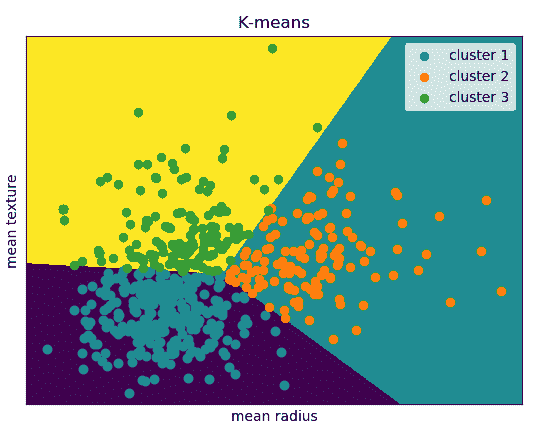

乳腺癌数据集前两个特征的 K-means 聚类

# 总结

在本章中，我们介绍了将在整本书中使用的基本数据集、算法和指标。我们讨论了回归和分类问题，其中数据集不仅包含特征，还包含目标。我们称这些为标注数据集。我们还讨论了无监督学习，包括聚类和降维。我们介绍了成本函数和模型指标，这些将用于评估我们生成的模型。此外，我们介绍了将在大多数示例中使用的基本学习算法和 Python 库。

在下一章中，我们将介绍偏差和方差的概念，以及集成学习的概念。以下是一些关键点：

+   当目标变量是一个连续数值且其值具有某种大小意义时，例如速度、成本、血压等，我们尝试解决回归问题。分类问题的目标可能会以数字编码，但我们不能将其视为数值来处理。在问题编码时，尝试根据所分配的数字对颜色或食物进行排序是没有意义的。

+   成本函数是一种量化预测模型与完美建模数据之间差距的方法。指标提供的信息更容易让人理解和报告。

+   本章中介绍的所有算法在 scikit-learn 中都有分类和回归问题的实现。有些算法更适合某些特定任务，至少在不调整其超参数的情况下，决策树生成的模型易于人类解释。
