# 第二章：开始使用集成学习

集成学习涉及将多种技术结合在一起，允许多个机器学习模型（称为基本学习器或有时称为弱学习器）整合它们的预测，并在给定各自的输入和输出的情况下输出一个单一的、最优的预测。

本章将概述集成学习尝试解决的主要问题，即偏差和方差，以及它们之间的关系。这将帮助我们理解识别表现不佳的模型的根本原因，并使用集成学习来解决该问题的动机。此外，我们还将介绍可用方法的基本类别，以及在实施集成学习时可能遇到的困难。

本章涵盖的主要主题如下：

+   偏差、方差以及两者之间的权衡

+   使用集成学习的动机

+   识别表现不佳的模型的根本原因

+   集成学习方法

+   成功应用集成学习的难点

# 技术要求

你需要具备基本的机器学习技术和算法知识。此外，还需要了解 Python 语言的约定和语法。最后，熟悉 NumPy 库将大大有助于读者理解一些自定义算法的实现。

本章的代码文件可以在 GitHub 上找到：

[`github.com/PacktPublishing/Hands-On-Ensemble-Learning-with-Python/tree/master/Chapter02`](https://github.com/PacktPublishing/Hands-On-Ensemble-Learning-with-Python/tree/master/Chapter02)

请查看以下视频，查看代码实践：[`bit.ly/2JKkWYS`](http://bit.ly/2JKkWYS)。

# 偏差、方差及其权衡

机器学习模型并不完美；它们容易出现许多错误。最常见的两种错误来源是偏差和方差。尽管这两者是不同的问题，但它们是相互关联的，并且与模型的自由度或复杂性有关。

# 什么是偏差？

偏差是指方法无法正确估计目标。这不仅仅适用于机器学习。例如，在统计学中，如果我们想要测量一个人群的平均值，但没有仔细采样，那么估算出的平均值就会存在偏差。简单来说，方法（采样）估算的结果与实际目标（平均值）之间存在差距。

在机器学习中，偏差指的是预期预测与目标之间的差异。偏差模型无法正确拟合训练数据，导致在样本内和样本外的表现都很差。一个偏差模型的经典例子是当我们尝试用简单的线性回归来拟合一个正弦函数时。该模型无法拟合正弦函数，因为它缺乏所需的复杂度。因此，它无法在样本内或样本外表现良好。这个问题被称为欠拟合。下图提供了一个图形示例：

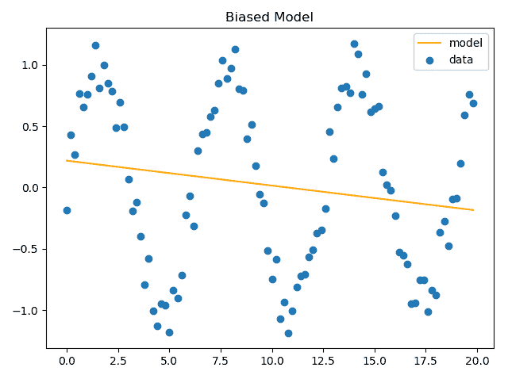

对正弦函数数据的有偏线性回归模型

偏差的数学公式是目标值与期望预测值之间的差异：

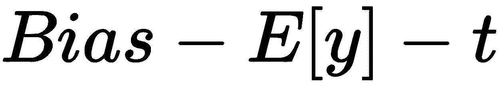

# 什么是方差？

方差指的是个体在一个群体中的差异程度。同样，方差是统计学中的一个概念。从一个群体中抽取样本时，方差表示每个个体的数值与平均值的偏差程度。

在机器学习中，方差指的是模型对数据变化的敏感性或变动性。这意味着，高方差模型通常能够很好地拟合训练数据，从而在训练集上取得较高的表现，但在测试集上表现较差。这是由于模型的复杂性。例如，如果决策树为训练数据集中的每一个实例都创建一条规则，那么该决策树可能会有较高的方差。这被称为**过拟合**。下图展示了在前述数据集上训练的决策树。蓝色点代表训练数据，橙色点代表测试数据。

如图所示，模型能够完美拟合训练数据，但在测试数据上表现较差：

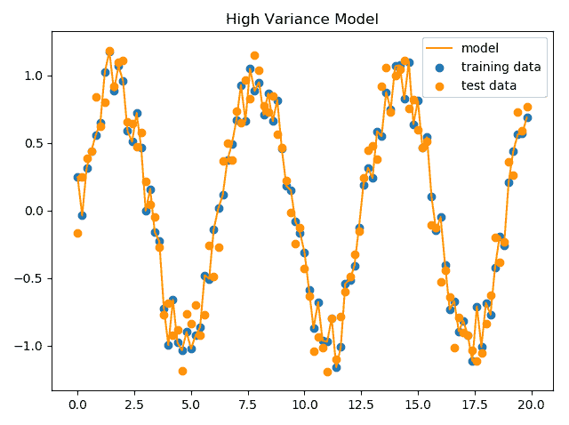

高方差的决策树模型在正弦函数上的表现

方差的数学公式如下所示：

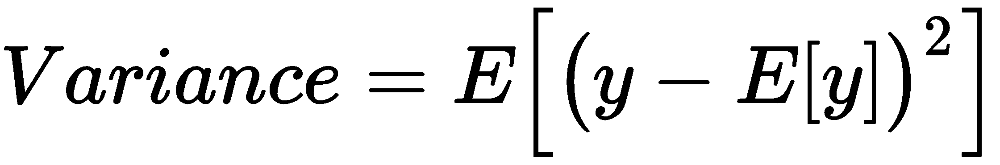

本质上，这就是人口方差的标准公式，假设我们的人口是由模型组成的，因为这些模型是由机器学习算法生成的。例如，正如我们在第一章《机器学习基础》中看到的，神经网络的训练结果可能不同，这取决于它们的初始权重。如果我们考虑所有具有相同架构但初始权重不同的神经网络，通过训练它们，我们将得到一组不同的模型。

# 权衡

偏差和方差是组成模型误差的三个主要组成部分中的两个。第三个是不可减少的误差，通常归因于数据中的固有随机性或变异性。模型的总误差可以分解如下：

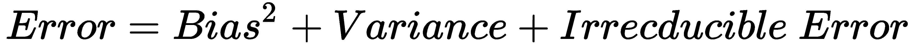

正如我们之前所见，偏差和方差都源自同一个因素：模型复杂度。偏差源于模型复杂度过低和自由度不足，而方差则在复杂模型中表现得更为突出。因此，不可能在不增加方差的情况下减少偏差，反之亦然。然而，存在一个复杂度的最优点，在这个点上，偏差和方差达到了最优的权衡，误差最小。当模型的复杂度达到这个最优点（下图中的红色虚线）时，模型在训练集和测试集上的表现都是最佳的。正如下图所示，误差永远不可能被减少到零。

此外，尽管有些人可能认为减少偏差，即使以增加方差为代价会更好，但显然即便模型没有偏差，由于方差不可避免地引起的误差，模型也不会表现得更好：

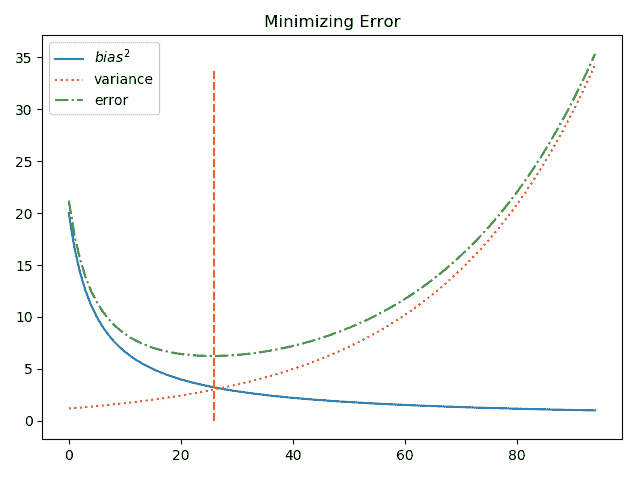

偏差-方差权衡及其对误差的影响

下图展示了完美模型，具有最小的偏差和方差的结合，或者说是可减少的误差。尽管该模型并没有完全拟合数据，但这是由于数据集中的噪声。如果我们尝试更好地拟合训练数据，将会引起过拟合（方差）。如果我们进一步简化模型，将会引起欠拟合（偏差）：

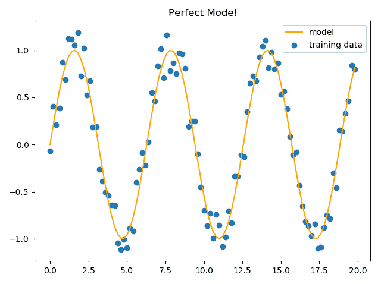

对于我们的数据，完美的模型是一个正弦函数

# 集成学习

集成学习涉及一组机器学习方法，旨在通过结合多个模型来提高算法的预测性能。我们将分析使用这些方法来解决高偏差和方差问题的动机。此外，我们还将介绍识别机器学习模型中偏差和方差的方法，以及集成学习方法的基本分类。

# 动机

集成学习旨在解决偏差和方差的问题。通过结合多个模型，我们可以减少集成的误差，同时保留各个独立模型的复杂性。如前所述，每个模型误差都有一定的下限，这与模型的复杂性有关。

此外，我们提到同一个算法由于初始条件、超参数和其他因素的不同，可能会产生不同的模型。通过结合不同且多样化的模型，我们可以减少群体的预期误差，同时每个独立的模型保持不变。这是由于统计学原理，而非纯粹的学习。

为了更好地展示这一点，假设我们有一个由 11 个基学习器组成的集成，用于分类，每个学习器的误分类（误差）概率为*err*=0.15 或 15%。现在，我们想要创建一个简单的集成。我们始终假设大多数基学习器的输出是正确的。假设它们是多样化的（在统计学中是无关的），那么大多数学习器出错的概率是 0.26%：

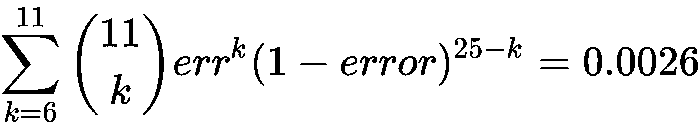

正如显而易见的，随着我们向集成中添加更多的基学习器，集成的准确度也会提高，前提是每个学习器之间彼此独立。当然，这一点越来越难以实现。此外，还存在递减收益法则。每增加一个不相关的基学习器，减少的整体误差会比之前添加的基学习器少。下图展示了多个不相关基学习器的集成误差百分比。显然，添加两个不相关基学习器时，误差的减少最大：

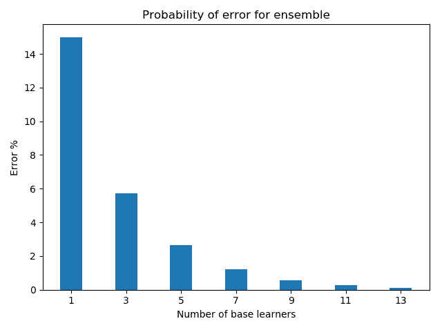

基学习器数量与集成误差之间的关系

# 识别偏差和方差

尽管偏差和方差有理论公式，但很难计算它们的实际值。估算它们的一个简单方法是使用学习曲线和验证曲线进行经验计算。

# 验证曲线

验证曲线指的是在不同超参数条件下，算法的实际表现。对于每个超参数值，我们执行 K 折交叉验证，并存储样本内表现和样本外表现。然后，我们计算并绘制每个超参数值的样本内和样本外表现的均值和标准差。通过检查相对和绝对表现，我们可以评估模型的偏差和方差水平。

借用来自[第一章](https://cdp.packtpub.com/hands_on_ensemble_learning_with_python/wp-admin/post.php?post=25&action=edit#post_24)的`KNeighborsClassifier`示例，*《机器学习复习》*中，我们对其进行了修改，以便尝试不同的邻居数。我们首先加载所需的库和数据。请注意，我们从`sklearn.model_selection`导入了`validation_curve`，这是 scikit-learn 自带的验证曲线实现：

```py
# --- SECTION 1 ---
# Libraries and data loading
import numpy as np
import matplotlib.pyplot as plt

from sklearn.datasets import load_breast_cancer
from sklearn.model_selection import validation_curve
from sklearn.neighbors import KNeighborsClassifier
bc = load_breast_cancer()
```

接下来，我们定义我们的特征和目标（`x`和`y`），以及我们的基学习器。此外，我们使用`param_range = [2,3,4,5]`定义参数搜索空间，并使用`validation_curve`。为了使用它，我们必须定义基学习器、特征、目标、我们希望测试的参数名称以及待测试的参数值。此外，我们还使用`cv=10`定义交叉验证的 K 折数，并设置我们希望计算的度量标准为`scoring="accuracy"`：

```py
# --- SECTION 2 ---
# Create in-sample and out-of-sample scores
x, y = bc.data, bc.target
learner = KNeighborsClassifier()
param_range = [2,3,4,5]
train_scores, test_scores = validation_curve(learner, x, y,
                                             param_name='n_neighbors',
                                             param_range=param_range,
                                             cv=10,
                                             scoring="accuracy")
```

然后，我们计算样本内表现（`train_scores`）和样本外表现（`test_scores`）的均值和标准差：

```py
# --- SECTION 3 ---
# Calculate the average and standard deviation for each hyperparameter
train_scores_mean = np.mean(train_scores, axis=1)
train_scores_std = np.std(train_scores, axis=1)
test_scores_mean = np.mean(test_scores, axis=1)
test_scores_std = np.std(test_scores, axis=1)
```

最后，我们绘制均值和标准差。我们使用`plt.plot`绘制均值曲线。为了绘制标准差，我们创建一个透明矩形，包围这些曲线，矩形的宽度等于每个超参数值点的标准差。这是通过使用`plt.fill_between`实现的，方法是将值点作为第一个参数，最低矩形点作为第二个参数，最高点作为第三个参数。此外，`alpha=0.1`指示`matplotlib`使矩形透明（将矩形的颜色与背景按照 10%-90%的比例进行混合）：

第 3 和第四部分改编自[`scikit-learn.org/stable/auto_examples/model_selection/plot_validation_curve.html`](https://scikit-learn.org/stable/auto_examples/model_selection/plot_validation_curve.html)中的 scikit-learn 示例。

```py
# --- SECTION 4 ---
# Plot the scores
plt.figure()
plt.title('Validation curves')
# Plot the standard deviations
plt.fill_between(param_range, train_scores_mean - train_scores_std,
                 train_scores_mean + train_scores_std, alpha=0.1,
                 color="C1")
plt.fill_between(param_range, test_scores_mean - test_scores_std,
                 test_scores_mean + test_scores_std, alpha=0.1, color="C0")

# Plot the means
plt.plot(param_range, train_scores_mean, 'o-', color="C1",
         label="Training score")
plt.plot(param_range, test_scores_mean, 'o-', color="C0",
         label="Cross-validation score")
plt.xticks(param_range)
plt.xlabel('Number of neighbors')
plt.ylabel('Accuracy')
plt.legend(loc="best")
plt.show()

```

脚本最终输出以下结果。当曲线之间的距离缩小时，方差通常会减少。当它们远离期望的准确度时（考虑到不可减少的误差），偏差增加。

此外，相对标准差也是方差的一个指标：

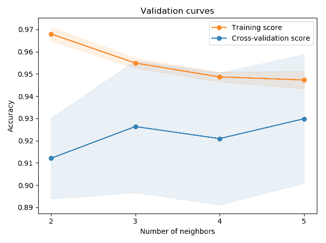

K-近邻算法的验证曲线，邻居数量从 2 到 5

以下表格展示了基于验证曲线的偏差和方差识别：

|  | **大** | **小** |
| --- | --- | --- |
| **曲线之间的距离** | 高方差 | 低方差 |
| **与期望准确度的距离** | 高偏差 | 低偏差 |
| **相对矩形面积比** | 高方差 | 低方差 |

基于验证曲线的偏差和方差识别

# 学习曲线

另一种识别偏差和方差的方法是生成学习曲线。与验证曲线类似，我们通过交叉验证生成一系列的样本内和样本外性能统计数据。我们不再尝试不同的超参数值，而是利用不同量的训练数据。通过检查样本内和样本外性能的均值和标准差，我们可以了解模型中固有的偏差和方差。

Scikit-learn 在`sklearn.model_selection`模块中实现了学习曲线，名为`learning_curve`。我们将再次使用第一章中*机器学习复习*的`KNeighborsClassifier`示例。首先，我们导入所需的库并加载乳腺癌数据集：

```py
# --- SECTION 1 ---
# Libraries and data loading
import numpy as np
import matplotlib.pyplot as plt

from sklearn.datasets import load_breast_cancer
from sklearn.neighbors import KNeighborsClassifier
from sklearn.model_selection import learning_curve
bc = load_breast_cancer()
```

接下来，我们定义每个交叉验证集将使用的训练实例数量为`train_sizes = [50, 100, 150, 200, 250, 300]`，实例化基础学习器，并调用`learning_curve`。该函数返回一个包含训练集大小、样本内性能得分和样本外性能得分的元组。该函数接受基础学习器、数据集特征和目标，以及训练集大小作为参数，其中`train_sizes=train_sizes`，并且交叉验证的折数为`cv=10`：

```py
# --- SECTION 2 ---
# Create in-sample and out-of-sample scores
x, y = bc.data, bc.target
learner = KNeighborsClassifier()
train_sizes = [50, 100, 150, 200, 250, 300]
train_sizes, train_scores, test_scores = learning_curve(learner, x,                                 y,  train_sizes=train_sizes, cv=10)
```

再次，我们计算样本内和样本外性能的均值和标准差：

```py
# --- SECTION 3 ---
# Calculate the average and standard deviation for each hyperparameter
train_scores_mean = np.mean(train_scores, axis=1)
train_scores_std = np.std(train_scores, axis=1)
test_scores_mean = np.mean(test_scores, axis=1)
test_scores_std = np.std(test_scores, axis=1)
```

最后，我们像之前一样，将均值和标准差绘制为曲线和矩形：

```py
# --- SECTION 4 ---
# Plot the scores
plt.figure()
plt.title('Learning curves')
# Plot the standard deviations
plt.fill_between(train_sizes, train_scores_mean - train_scores_std,
 train_scores_mean + train_scores_std, alpha=0.1,
 color="C1")
plt.fill_between(train_sizes, test_scores_mean - test_scores_std,
 test_scores_mean + test_scores_std, alpha=0.1, color="C0")

# Plot the means
plt.plot(train_sizes, train_scores_mean, 'o-', color="C1",
 label="Training score")
plt.plot(train_sizes, test_scores_mean, 'o-', color="C0",
 label="Cross-validation score")

plt.xticks(train_sizes)
plt.xlabel('Size of training set (instances)')
plt.ylabel('Accuracy')
plt.legend(loc="best")
plt.show()

```

最终输出如下图所示。模型似乎在前 200 个训练样本中降低了其方差。之后，均值似乎开始发散，同时交叉验证得分的标准差增加，从而表明方差的增加。

请注意，尽管两条曲线在训练集（至少包含 150 个实例）的准确率都超过 90%，但这并不意味着低偏差。高度可分的数据集（良好的质量数据，噪声低）往往会产生这样的曲线——无论我们选择什么样的算法组合和超参数。此外，噪声数据集（例如，具有相同特征但目标不同的实例）将无法生成高准确率的模型——无论我们使用什么技术。

因此，偏差应通过将学习曲线和验证曲线与期望的准确率（考虑到数据集质量认为可以达到的准确率）进行比较来衡量，而不是通过其绝对值：

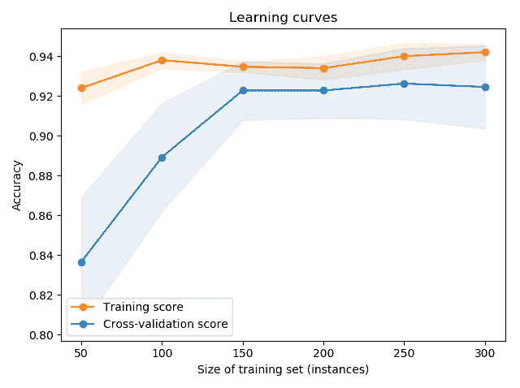

K 近邻的学习曲线，50 到 300 个训练实例

# 集成方法

集成方法分为两大类或分类法：生成方法和非生成方法。非生成方法侧重于组合一组预训练模型的预测。这些模型通常是独立训练的，集成算法决定如何组合它们的预测。基础分类器不受其存在于集成中的影响。

本书将涵盖两种主要的非生成方法：投票和堆叠。如其名所示（参见第三章，*投票*），投票指的是允许模型投票以产生单一答案的技术，类似于个人在国家选举中的投票方式。最受欢迎（投票最多）的答案被选为赢家。第四章，*堆叠*，则指的是利用一个模型（元学习器）来学习如何最好地组合基础学习器的预测。尽管堆叠涉及生成一个新模型，但它不影响基础学习器，因此它是一种非生成方法。

另一方面，生成方法能够生成并影响它们所使用的基本学习器。它们可以调整其学习算法或用于训练它们的数据集，以确保多样性和高模型性能。此外，一些算法可以在模型中引入随机性，从而进一步加强多样性。

本书中我们将介绍的主要生成方法包括袋装（bagging）、提升（boosting）和随机森林（random forests）。提升是一种主要针对偏差模型的技术，其基本思想是顺序生成模型，使得每个新模型都能解决前一个模型中的偏差。因此，通过迭代修正之前的错误，最终的集成模型偏差会显著降低。袋装旨在减少方差。袋装算法对训练数据集中的实例进行重采样，创建许多源自同一数据集的独立且多样化的数据集。随后，在每个采样的数据集上训练单独的模型，从而强制集成模型之间的多样性。最后，随机森林与袋装相似，都是对训练数据集进行重采样。不同的是，它采样的是特征，而不是实例，这样可以生成更多样化的树，因为与目标高度相关的特征可能在许多树中缺失。

# 集成学习中的难点

虽然集成学习可以显著提高机器学习模型的性能，但它也有成本。正确实现集成学习存在一些困难和缺点，接下来将讨论其中的一些困难和缺点。

# 弱数据或噪声数据

一个成功模型最重要的要素是数据集。如果数据中包含噪声或不完整信息，那么没有任何一种机器学习技术能够生成一个高性能的模型。

让我们通过一个简单的例子来说明这一点。假设我们研究的是汽车的种群（统计学意义上的），并收集了关于颜色、形状和制造商的数据。对于任一变量，生成非常准确的模型都是困难的，因为很多汽车颜色和形状相同，但制造商不同。以下表格展示了这个样本数据集。

任何模型能够做到的最好结果是达到 33%的分类准确率，因为对于任一给定的特征组合，都有三种可能的选择。向数据集添加更多特征可以显著提高模型的性能。而向集成中添加更多模型则无法提高性能：

| **颜色** | **形状** | **制造商** |
| --- | --- | --- |
| 黑色 | 轿车 | 宝马 |
| 黑色 | 轿车 | 奥迪 |
| 黑色 | 轿车 | 阿尔法·罗密欧 |
| 蓝色 | 两厢车 | 福特 |
| 蓝色 | 两厢车 | 欧宝 |
| 蓝色 | 两厢车 | 菲亚特 |

汽车数据集

# 理解可解释性

通过使用大量模型，模型的可解释性大大降低。例如，单个决策树可以通过简单地跟随每个节点的决策，轻松地解释它是如何产生预测的。另一方面，很难解释为什么一个由 1000 棵树组成的集成预测了一个单一的值。此外，根据集成方法的不同，可能需要解释的不仅仅是预测过程本身。集成是如何以及为什么选择训练这些特定的模型的？为什么它没有选择训练其他模型？为什么它没有选择训练更多的模型？

当模型的结果需要向观众呈现时，尤其是面对技术水平不高的观众时，简单且易于解释的模型可能是更好的解决方案。

此外，当预测结果还需要包括概率（或置信度）时，一些集成方法（如提升法）往往会给出较差的概率估计：

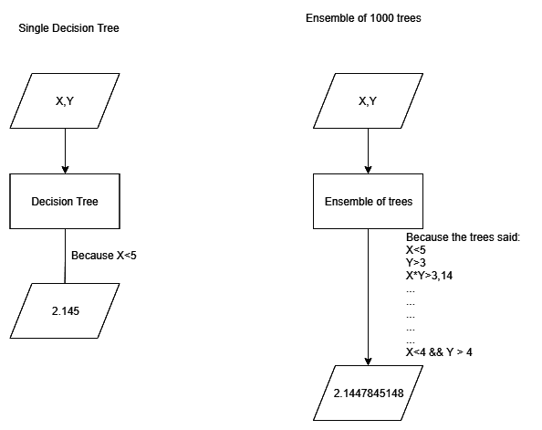

单棵树与 1000 棵树的可解释性

# 计算成本

集成模型的另一个缺点是它们带来的计算成本。训练单个神经网络的计算成本很高。训练 1000 个神经网络则需要 1000 倍的计算资源。此外，一些方法本质上是顺序的。这意味着无法利用分布式计算的优势。相反，每个新的模型必须在前一个模型完成后才开始训练。这不仅增加了计算成本，还对模型开发过程带来了时间上的惩罚。

计算成本不仅会阻碍开发过程；当集成模型投入生产时，推理时间也会受到影响。如果集成由 1000 个模型组成，那么所有这些模型必须输入新的数据，生成预测，然后将这些预测结合起来，才能产生集成输出。在延迟敏感的环境中（如金融交易、实时系统等），通常期望亚毫秒的执行时间，因此几微秒的延迟增加可能会造成巨大的差异。

# 选择合适的模型

最后，组成集成模型的模型必须具备一定的特征。没有意义从多个相同的模型中创建集成。生成方法可以生成自己的模型，但所使用的算法以及其初始超参数通常由分析师选择。此外，模型的可实现多样性取决于多个因素，例如数据集的大小和质量，以及学习算法本身。

一个与数据生成过程类似行为的单一模型通常会在准确性和延迟方面优于任何集成模型。在我们的偏差-方差示例中，简单的正弦函数始终会优于任何集成模型，因为数据是从同一个函数生成的，只是添加了一些噪声。许多线性回归的集成可能能够逼近正弦函数，但它们总是需要更多时间来训练和执行。此外，它们将无法像正弦函数那样很好地泛化（预测样本外数据）。

# 概要

在本章中，我们介绍了偏差和方差的概念及其之间的权衡。这些对于理解模型可能在样本内或样本外表现不佳的原因至关重要。然后，我们介绍了集成学习的概念和动机，以及如何在模型中识别偏差和方差，以及集成学习方法的基本类别。我们介绍了使用 scikit-learn 和 matplotlib 测量和绘制偏差和方差的方法。最后，我们讨论了实施集成学习方法的困难和缺点。记住的一些关键点如下。

高偏差模型通常在样本内表现不佳。这也被称为**欠拟合**。这是由于模型的简单性（或缺乏复杂性）导致的。高方差模型通常在样本内表现良好，但在样本外泛化或表现良好较难，这被称为**过拟合**。这通常是由于模型的不必要复杂性引起的。**偏差-方差权衡**指的是随着模型复杂性的增加，其偏差减少，而方差增加的事实。集成学习旨在通过结合许多不同模型的预测来解决高偏差或方差问题。这些模型通常被称为**基学习器**。对于模型选择，**验证曲线**指示了模型在给定一组超参数的情况下在样本内和样本外的表现。**学习曲线**与验证曲线相同，但它们使用不同的训练集大小而不是一组超参数。训练曲线和测试曲线之间的显著距离表示高方差。测试曲线周围的大矩形区域也表示高方差。两条曲线与目标准确率之间的显著距离表示高偏差。生成方法可以控制其基学习器的生成和训练；非生成方法则不能。当数据质量差或模型相关时，集成学习对性能可能会产生微乎其微或负面影响。它可能会对模型的解释能力和所需的计算资源产生负面影响。

在下一章中，我们将介绍投票集成，以及如何将其用于回归和分类问题。
