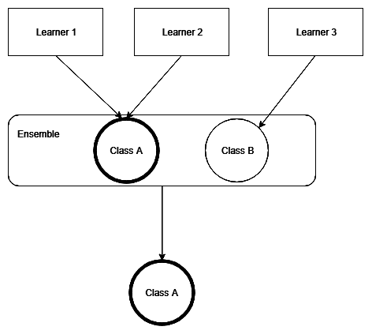
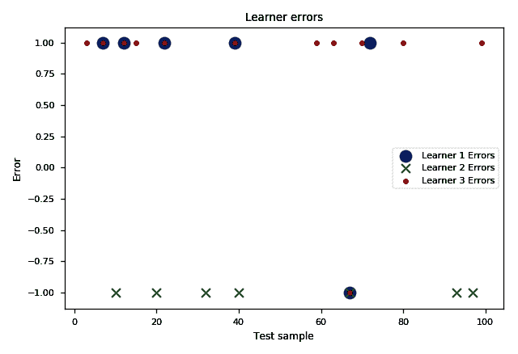
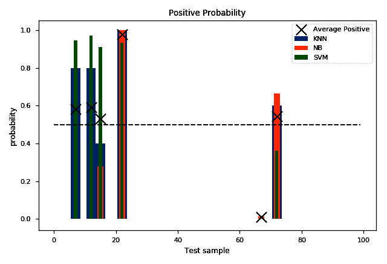
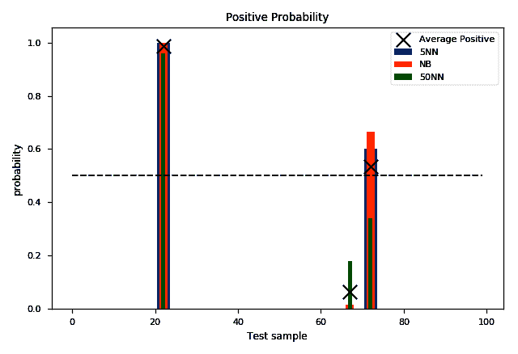

# 第三章：投票

所有集成学习方法中最直观的就是**多数投票**。它之所以直观，是因为其目标是输出基学习器预测中最流行（或得票最多）的结果。本章将介绍关于多数投票的基本理论及实际实现。通过本章学习后，你将能够做到以下几点：

+   理解多数投票

+   理解硬投票和软投票的区别，以及它们各自的优缺点

+   在 Python 中实现两种版本

+   使用投票技术来提高分类器在乳腺癌数据集上的表现

# 技术要求

你需要具备基本的机器学习技术和算法知识。此外，还要求了解 Python 语法规范，最后，熟悉 NumPy 库将大大帮助读者理解一些自定义算法的实现。

本章的代码文件可以在 GitHub 上找到：

[`github.com/PacktPublishing/Hands-On-Ensemble-Learning-with-Python/tree/master/Chapter03`](https://github.com/PacktPublishing/Hands-On-Ensemble-Learning-with-Python/tree/master/Chapter03)

查看以下视频以查看代码实例：[`bit.ly/2M52VY7`](http://bit.ly/2M52VY7)。

# 硬投票和软投票

多数投票是最简单的集成学习技术，它允许将多个基学习器的预测结果结合起来。类似于选举的工作原理，算法假设每个基学习器是一个选民，每个类别是一个竞争者。算法根据投票情况来选举获胜的竞争者。结合多个预测的投票方法主要有两种：一种是硬投票，另一种是软投票。我们在这里介绍这两种方法。

# 硬投票

硬投票通过假设得票最多的类别为胜者来结合多个预测。在一个简单的两类三基学习者的情况下，如果某个目标类别至少有两个投票，它就成为集成模型的输出，如下图所示。实现一个硬投票分类器就像是统计每个目标类别的投票数一样简单：



使用两类和三个基学习者进行投票

例如，假设有三个不同的基学习者，他们在预测一个样本是否属于三个类别中的某一个，并给出相应的概率（*表 1*）。

在下表中，每个学习者预测实例属于某个类别的概率：

|  | **类别 A** | **类别 B** | **类别 C** |
| --- | --- | --- | --- |
| **学习者 1** | 0.5 | 0.3 | 0.2 |
| **学习者 2** | 0 | 0.48 | 0.52 |
| **学习者 3** | 0.4 | 0.3 | 0.3 |

分配的类别概率

在此示例中，类别 A 有两个投票，而类别 C 只有一个投票。根据硬投票，类别 A 将成为集成的预测结果。这是一种非常稳健的基学习者合并方法，尽管它没有考虑到某些类别可能仅因略微优于其他类别而被某个基学习者选择。

# 软投票

软投票考虑了预测类别的概率。为了合并预测，软投票计算每个类别的平均概率，并假设胜者是具有最高平均概率的类别。在三个基学习者和两个类别的简单情况下，我们必须考虑每个类别的预测概率，并在三个学习者中求其平均：


软投票：两个类别和三个基学习者

使用我们之前的例子，并通过对*表 1*中每一列的平均值求平均，我们可以扩展该表，添加一行用于显示平均概率。

以下表格显示了每个学习者对每个类别的预测概率，以及平均概率：

|  | **类别 A** | **类别 B** | **类别 C** |
| --- | --- | --- | --- |
| **学习者 1** | 0.5 | 0.3 | 0.2 |
| **学习者 2** | 0 | 0.48 | 0.52 |
| **学习者 3** | 0.4 | 0.3 | 0.3 |
| **平均** | 0.3 | 0.36 | 0.34 |

每个学习者对每个类别的预测概率，以及平均概率

如我们所见，类别 A 的平均概率为 0.3，类别 B 的平均概率为 0.36，类别 C 的平均概率为 0.34，因此类别 B 获胜。注意，类别 B 并不是由任何基学习者选作预测类别，但通过合并预测概率，类别 B 成为预测中最好的折中选择。

为了让软投票比硬投票更有效，基分类器必须提供关于样本属于特定类别的概率的良好估计。如果这些概率没有意义（例如，如果它们总是对于某一类别为 100%，而对于所有其他类别为 0%），那么软投票可能会比硬投票更糟糕。

关于投票的说明：正如 Kenneth Arrow 博士通过其不可能性定理所证明的那样，完美的投票系统是不可实现的。然而，某些类型的投票系统能够更好地反映一个群体的偏好。软投票更能反映个体学习者的偏好，因为它考虑的是评分（概率），而不是排名（预测类别）。

有关不可能性定理的更多内容，请参见《社会福利概念中的困难》*Arrow, K.J., 1950*。*政治经济学杂志*，58(4)，第 328-346 页。

# ​Python 实现

在 Python 中实现硬投票的最简单方法是使用*scikit-learn*来创建基学习者，训练它们以适应某些数据，并将它们的预测结果结合起来应用于测试数据。为此，我们将按照以下步骤进行：

1.  加载数据并将其拆分为训练集和测试集

1.  创建一些基础学习器

1.  在训练数据上训练它们

1.  为测试数据生成预测

1.  使用硬投票合并预测结果

1.  将各个学习器的预测结果与合并后的预测结果与实际的正确类别（ground truth）进行比较

尽管 scikit-learn 提供了投票的实现，通过创建自定义实现，我们可以更容易理解算法的工作原理。此外，这还将帮助我们更好地理解如何处理和分析基础学习器的输出。

# 自定义硬投票实现

为了实现自定义硬投票解决方案，我们将使用三个基础学习器：**感知机**（一个单神经元的神经网络）、**支持向量机**（**SVM**）和**最近邻**。它们分别包含在`sklearn.linear_model`、`sklearn.svm`和`sklearn.neighbors`包中。此外，我们将使用 NumPy 的`argmax`函数。此函数返回数组（或类数组数据结构）中最大值元素的索引。最后，`accuracy_score`将计算每个分类器在我们测试数据上的准确性：

```py
# --- SECTION 1 ---
# Import the required libraries
from sklearn import datasets, linear_model, svm, neighbors
from sklearn.metrics import accuracy_score
from numpy import argmax
# Load the dataset
breast_cancer = datasets.load_breast_cancer()
x, y = breast_cancer.data, breast_cancer.target
```

然后，我们实例化我们的基础学习器。我们精心挑选了它们的超参数，以确保它们在多样性上有所体现，从而能够产生一个表现良好的集成模型。由于`breast_cancer`是一个分类数据集，我们使用`SVC`，即 SVM 的分类版本，以及`KNeighborsClassifier`和`Perceptron`。此外，我们将`Perceptron`的随机状态设置为 0，以确保示例的可复现性：

```py
# --- SECTION 2 ---
# Instantiate the learners (classifiers)
learner_1 = neighbors.KNeighborsClassifier(n_neighbors=5)
learner_2 = linear_model.Perceptron(tol=1e-2, random_state=0)
learner_3 = svm.SVC(gamma=0.001)
```

我们将数据拆分为训练集和测试集，使用 100 个实例作为测试集，并在训练集上训练我们的基础学习器：

```py
# --- SECTION 3 ---
# Split the train and test samples
test_samples = 100
x_train, y_train = x[:-test_samples], y[:-test_samples]
x_test, y_test = x[-test_samples:], y[-test_samples:]

# Fit learners with the train data
learner_1.fit(x_train, y_train)
learner_2.fit(x_train, y_train)
learner_3.fit(x_train, y_train)
```

通过将每个基础学习器的预测存储在`predictions_1`、`predictions_2`和`predictions_3`中，我们可以进一步分析并将它们合并成我们的集成模型。请注意，我们分别训练了每个分类器；此外，每个分类器都会独立地对测试数据进行预测。正如在第二章《集成学习入门》中提到的那样，*这是非生成性集成方法的主要特点*：

```py
#--- SECTION 4 ---
# Each learner predicts the classes of the test data
predictions_1 = learner_1.predict(x_test)
predictions_2 = learner_2.predict(x_test)
predictions_3 = learner_3.predict(x_test)
```

根据预测结果，我们将每个基学习器对每个测试实例的预测结果进行合并。`hard_predictions` 列表将包含集成模型的预测结果（输出）。通过 `for i in range(test_samples)` 遍历每个测试样本，我们统计每个类别从三个基学习器收到的投票总数。由于数据集仅包含两个类别，我们需要一个包含两个元素的列表：`counts = [0 for _ in range(2)]`。在 `# --- SECTION 3 ---` 中，我们将每个基学习器的预测结果存储在一个数组中。该数组的每个元素包含实例预测类别的索引（在我们这里是 0 和 1）。因此，我们通过将 `counts[predictions_1[i]]` 中相应元素的值加 1 来统计基学习器的投票数。接着，`argmax(counts)` 会返回获得最多投票的元素（类别）：

```py
# --- SECTION 5 ---
# We combine the predictions with hard voting
hard_predictions = []
# For each predicted sample
for i in range(test_samples):
    # Count the votes for each class
    counts = [0 for _ in range(2)]
    counts[predictions_1[i]] = counts[predictions_1[i]]+1
    counts[predictions_2[i]] = counts[predictions_2[i]]+1
    counts[predictions_3[i]] = counts[predictions_3[i]]+1
    # Find the class with most votes
    final = argmax(counts)
    # Add the class to the final predictions
    hard_predictions.append(final) 
```

最后，我们通过 `accuracy_score` 计算每个基学习器以及集成模型的准确度，并将结果打印在屏幕上：

```py
# --- SECTION 6 ---
# Accuracies of base learners
print('L1:', accuracy_score(y_test, predictions_1))
print('L2:', accuracy_score(y_test, predictions_2))
print('L3:', accuracy_score(y_test, predictions_3))
# Accuracy of hard voting
print('-'*30)
print('Hard Voting:', accuracy_score(y_test, hard_predictions))
```

最终输出如下：

```py
L1: 0.94
L2: 0.93
L3: 0.88
------------------------------
Hard Voting: 0.95
```

# 使用 Python 分析我们的结果

最终的准确度比三种分类器中最好的分类器（**k-最近邻** (**k-NN**) 分类器）高出 1%。我们可以通过可视化学习器的错误来分析集成模型为何以这种特定方式表现。

首先，我们 `import matplotlib` 并使用特定的 `seaborn-paper` 绘图风格，方法是 `mpl.style.use('seaborn-paper')`：

```py
# --- SECTION 1 ---
# Import the required libraries
import matplotlib as mpl
import matplotlib.pyplot as plt
mpl.style.use('seaborn-paper')
```

然后，我们通过从预测结果中减去实际目标值来计算错误。因此，每次学习器预测为正类（1），而真实类别为负类（0）时，我们得到 -1；每次学习器预测为负类（0），而真实类别为正类（1）时，我们得到 1。如果预测正确，我们得到 0：

```py
# --- SECTION 2 ---
# Calculate the errors 
errors_1 = y_test-predictions_1
errors_2 = y_test-predictions_2
errors_3 = y_test-predictions_3
```

对于每个基学习器，我们绘制其预测错误的实例。我们的目标是绘制 `x` 和 `y` 列表的散点图。这些列表将包含实例编号（`x` 列表）和错误类型（`y` 列表）。通过 `plt.scatter`，我们可以使用上述列表来指定点的坐标，并且可以指定这些点的表现方式。这一点非常重要，因为我们可以同时可视化所有分类器的错误及其相互关系。

每个点的默认形状是圆形。通过指定 `marker` 参数，我们可以改变这个形状。此外，通过 `s` 参数，我们可以指定标记的大小。因此，第一个学习器（k-NN）将具有大小为 120 的圆形，第二个学习器（感知器）将具有大小为 60 的 `x` 形状，而第三个学习器（SVM）将具有大小为 20 的圆形。`if not errors_*[i] == 0` 的保护条件确保我们不会存储正确分类的实例：

```py
# --- SECTION 3 ---
# Discard correct predictions and plot each learner's errors
x=[]
y=[]
for i in range(len(errors_1)):
    if not errors_1[i] == 0:
        x.append(i)
        y.append(errors_1[i])
plt.scatter(x, y, s=120, label='Learner 1 Errors')

x=[]
y=[]
for i in range(len(errors_2)):
     if not errors_2[i] == 0:
         x.append(i)
         y.append(errors_2[i])
plt.scatter(x, y, marker='x', s=60, label='Learner 2 Errors')

x=[]
y=[]
for i in range(len(errors_3)):
    if not errors_3[i] == 0:
        x.append(i)
        y.append(errors_3[i])
plt.scatter(x, y, s=20, label='Learner 3 Errors')
```

最后，我们指定图表的标题和标签，并绘制图例：

```py
plt.title('Learner errors')
plt.xlabel('Test sample')
plt.ylabel('Error')
plt.legend()
plt.show()
```

如下所示，有五个样本至少有两个学习器预测了错误的类别。这五个案例是 100 个样本中集成预测错误的 5 个，因为最投票的类别是错的，从而导致 95%的准确性。在所有其他情况下，三个学习器中有两个预测了正确的类别，因此集成模型预测了正确的类别，因为它是最投票的：



学习器在测试集上的错误

# 使用 scikit-learn

scikit-learn 库包含许多集成学习算法，包括投票。为了实现硬投票，我们将遵循与之前相同的程序，不过这次我们不再自己实现个别的拟合、预测和投票过程。而是使用提供的实现，这使得训练和测试变得快速而简单。

# 硬投票实现

与我们自定义实现类似，我们导入所需的库，划分训练和测试数据，并实例化我们的基础学习器。此外，我们从`sklearn.ensemble`包中导入 scikit-learn 的`VotingClassifier`投票实现，如下所示：

```py
# --- SECTION 1 ---
# Import the required libraries
from sklearn import datasets, linear_model, svm, neighbors
from sklearn.ensemble import VotingClassifier
from sklearn.metrics import accuracy_score
# Load the dataset
breast_cancer = datasets.load_breast_cancer()
x, y = breast_cancer.data, breast_cancer.target

# Split the train and test samples
test_samples = 100
x_train, y_train = x[:-test_samples], y[:-test_samples]
x_test, y_test = x[-test_samples:], y[-test_samples:]

# --- SECTION 2 ---
# Instantiate the learners (classifiers)
learner_1 = neighbors.KNeighborsClassifier(n_neighbors=5)
learner_2 = linear_model.Perceptron(tol=1e-2, random_state=0)
learner_3 = svm.SVC(gamma=0.001)
```

在上述代码之后，我们实例化`VotingClassifier`类，传入一个包含基础分类器名称和对象的元组列表作为参数。请注意，如果将参数传递在列表外部，将会导致错误：

```py
# --- SECTION 3 ---
# Instantiate the voting classifier
voting = VotingClassifier([('KNN', learner_1),
                           ('Prc', learner_2),
                           ('SVM', learner_3)])
```

现在，实例化了分类器后，我们可以像使用任何其他分类器一样使用它，而无需单独处理每个基础学习器。接下来的两部分执行了所有基础学习器的拟合和预测，以及为每个测试实例计算最投票的类别：

```py
# --- SECTION 4 ---
# Fit classifier with the training data
voting.fit(x_train, y_train)

# --- SECTION 5 ---
# Predict the most voted class
hard_predictions = voting.predict(x_test)
```

最后，我们可以打印集成模型的准确性：

```py
# --- SECTION 6 ---
# Accuracy of hard voting
print('-'*30)
print('Hard Voting:', accuracy_score(y_test, hard_predictions))
```

这与我们自定义实现相同：

```py
------------------------------
Hard Voting: 0.95
```

请注意，`VotingClassifier`不会拟合作为参数传入的对象，而是会克隆它们并拟合克隆的对象。因此，如果你尝试打印每个基础学习器在测试集上的准确性，你将得到`NotFittedError`，因为你访问的对象实际上并没有被拟合。这是使用 scikit-learn 的实现而非自定义实现的唯一缺点。

# 软投票实现

Scikit-learn 的实现也支持软投票。唯一的要求是基础学习器必须实现`predict_proba`函数。在我们的示例中，`Perceptron`完全没有实现该函数，而`SVC`仅在传递`probability=True`参数时才会生成概率。考虑到这些限制，我们将`Perceptron`替换为`sklearn.naive_bayes`包中实现的朴素贝叶斯分类器。

要实际使用软投票，`VotingClassifier`对象必须使用`voting='soft'`参数进行初始化。除了这里提到的更改外，大部分代码保持不变。加载库和数据集，并按如下方式进行训练/测试集划分：

```py
# --- SECTION 1 ---
# Import the required libraries
from sklearn import datasets, naive_bayes, svm, neighbors
from sklearn.ensemble import VotingClassifier
from sklearn.metrics import accuracy_score
# Load the dataset
breast_cancer = datasets.load_breast_cancer()
x, y = breast_cancer.data, breast_cancer.target

# Split the train and test samples
test_samples = 100
x_train, y_train = x[:-test_samples], y[:-test_samples]
x_test, y_test = x[-test_samples:], y[-test_samples:]
```

实例化基学习器和投票分类器。我们使用一个高斯朴素贝叶斯分类器，命名为`GaussianNB`。注意，我们使用`probability=True`，以便`GaussianNB`对象能够生成概率：

```py
# --- SECTION 2 ---
# Instantiate the learners (classifiers)
learner_1 = neighbors.KNeighborsClassifier(n_neighbors=5)
learner_2 = naive_bayes.GaussianNB()
learner_3 = svm.SVC(gamma=0.001, probability=True)

# --- SECTION 3 ---
# Instantiate the voting classifier
voting = VotingClassifier([('KNN', learner_1),
                           ('NB', learner_2),
                           ('SVM', learner_3)],
                            voting='soft')
```

我们拟合`VotingClassifier`和单独的学习器。我们希望分析我们的结果，正如前面提到的，分类器不会拟合我们传入的对象，而是会克隆它们。因此，我们需要手动拟合我们的学习器，如下所示：

```py
# --- SECTION 4 ---
# Fit classifier with the training data
voting.fit(x_train, y_train)
learner_1.fit(x_train, y_train)
learner_2.fit(x_train, y_train)
learner_3.fit(x_train, y_train)
```

我们使用投票集成和单独的学习器预测测试集的目标：

```py
# --- SECTION 5 ---
# Predict the most probable class
hard_predictions = voting.predict(x_test)

# --- SECTION 6 ---
# Get the base learner predictions
predictions_1 = learner_1.predict(x_test)
predictions_2 = learner_2.predict(x_test)
predictions_3 = learner_3.predict(x_test)
```

最后，我们打印每个基学习器的准确率以及软投票集成的准确率：

```py
# --- SECTION 7 ---
# Accuracies of base learners
print('L1:', accuracy_score(y_test, predictions_1))
print('L2:', accuracy_score(y_test, predictions_2))
print('L3:', accuracy_score(y_test, predictions_3))
# Accuracy of hard voting
print('-'*30)
print('Hard Voting:', accuracy_score(y_test, hard_predictions))
```

最终输出如下：

```py
L1: 0.94
L2: 0.96
L3: 0.88
------------------------------
Hard Voting: 0.94
```

# 分析我们的结果

如图所示，软投票的准确率比最佳学习器低 2%，并与第二最佳学习器持平。我们希望像分析硬投票自定义实现的性能一样分析我们的结果。但由于软投票考虑了预测的类别概率，我们不能使用相同的方法。相反，我们将绘制每个基学习器预测的每个实例作为正类的概率，以及集成模型的平均概率。

再次，我们`import matplotlib`并设置绘图样式：

```py
# --- SECTION 1 ---
# Import the required libraries
import matplotlib as mpl
import matplotlib.pyplot as plt
mpl.style.use('seaborn-paper')
```

我们通过`errors = y_test-hard_predictions`计算集成模型的误差，并使用`predict_proba(x_test)`函数获取每个基学习器的预测概率。所有基学习器都实现了这个函数，因为这是在软投票集成中使用它们的要求：

```py

# --- SECTION 2 ---
# Get the wrongly predicted instances
# and the predicted probabilities for the whole test set
errors = y_test-hard_predictions

probabilities_1 = learner_1.predict_proba(x_test)
probabilities_2 = learner_2.predict_proba(x_test)
probabilities_3 = learner_3.predict_proba(x_test)
```

之后，对于每个错误分类的实例，我们存储该实例属于类 0 的预测概率。我们也对每个基学习器以及它们的平均值实现此功能。每个`probabilities_*`数组是一个二维数组，每行包含对应实例属于类 0 或类 1 的预测概率。因此，存储其中一个就足够了。如果数据集有*N*个类别，我们至少需要存储*N*-1 个概率，才能获得清晰的视图：

```py
# --- SECTION 2 ---
# Store the predicted probability for 
# each wrongly predicted instance, for each base learner
# as well as the average predicted probability
#
x=[]
y_1=[]
y_2=[]
y_3=[]
y_avg=[]

for i in range(len(errors)):
    if not errors[i] == 0:
         x.append(i)
         y_1.append(probabilities_1[i][0])
         y_2.append(probabilities_2[i][0])
         y_3.append(probabilities_3[i][0])
         y_avg.append((probabilities_1[i][0]+
                       probabilities_2[i][0]+probabilities_3[i][0])/3)
```

最后，我们使用`plt.bar`将概率绘制为不同宽度的条形图。这确保了任何重叠的条形图仍然可以被看到。第三个`plt.bar`参数决定了条形图的宽度。我们使用散点图标记平均概率为黑色“X”，并确保它绘制在任何条形图之上，使用`zorder=10`。最后，我们绘制一条在 0.5 概率处的阈值线，使用`plt.plot(y, c='k', linestyle='--')`，确保它为黑色虚线，`c='k', linestyle='--'`。如果平均概率高于该线，样本将被分类为正类，如下所示：

```py

# --- SECTION 3 ---
# Plot the predicted probaiblity of each base learner as 
# a bar and the average probability as an X
plt.bar(x, y_1, 3, label='KNN')
plt.bar(x, y_2, 2, label='NB')
plt.bar(x, y_3, 1, label='SVM')
plt.scatter(x, y_avg, marker='x', c='k', s=150, 
            label='Average Positive', zorder=10)

y = [0.5 for x in range(len(errors))]
plt.plot(y, c='k', linestyle='--')

plt.title('Positive Probability')
plt.xlabel('Test sample')
plt.ylabel('probability')
plt.legend()
plt.show()
```

上述代码输出如下：



测试集的预测和平均概率

如我们所见，只有两个样本具有极端的平均概率（样本 22 的 p = 0.98 和样本 67 的 p = 0.001）。其余四个样本的概率接近 50%。在这四个样本中，有三个样本 SVM 似乎给出了一个错误类别的极高概率，从而大大影响了平均概率。如果 SVM 没有对这些样本的概率进行如此高估，集成模型可能会比每个单独的学习器表现得更好。对于这两个极端情况，无法采取任何措施，因为所有三个学习器都一致地将其分类错误。我们可以尝试用另一个邻居数显著更多的 k-NN 替换 SVM。在这种情况下，`(learner_3 = neighbors.KNeighborsClassifier(n_neighbors=50))`，我们可以看到集成模型的准确率大幅提高。集成模型的准确率和错误如下：

```py
L1: 0.94
L2: 0.96
L3: 0.95
------------------------------
Hard Voting: 0.97
```

看一下以下截图：



使用两个 k-NN 的测试集的预测值和平均概率

# 总结

在本章中，我们介绍了最基本的集成学习方法：投票法。虽然它相当简单，但它可以证明是有效的，并且是结合多个机器学习模型的一种简便方法。我们介绍了硬投票和软投票、硬投票的自定义实现，以及 scikit-learn 中硬投票和软投票的实现。最后，我们展示了通过使用`matplotlib`绘制每个基学习器的错误来分析集成模型性能的方法。以下是本章的关键点总结。

**硬投票**假设得票最多的类别是赢家。**软投票**假设具有最高平均概率的类别是赢家。**软投票**要求基学习器以较高的准确度预测每个实例的每个类别的**概率**。Scikit-learn 通过`VotingClassifier`类实现投票集成。一个元组数组，格式为`[(learner_name, learner_object), …]`，被传递给`VotingClassifier`。`VotingClassifier`并不直接训练作为参数传递的对象，而是生成并训练一个副本。`VotingClassifier`的默认模式实现硬投票。要使用软投票，可以将`voting='soft'`参数传递给构造函数。软投票要求基学习器返回每个预测的概率。如果基学习器大幅高估或低估了概率，集成模型的预测能力将受到影响。

在下一章中，我们将讨论另一种非生成方法——堆叠法（Stacking），以及它如何应用于回归和分类问题。
