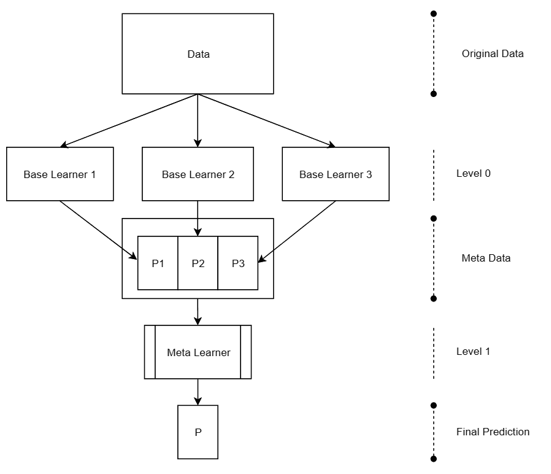
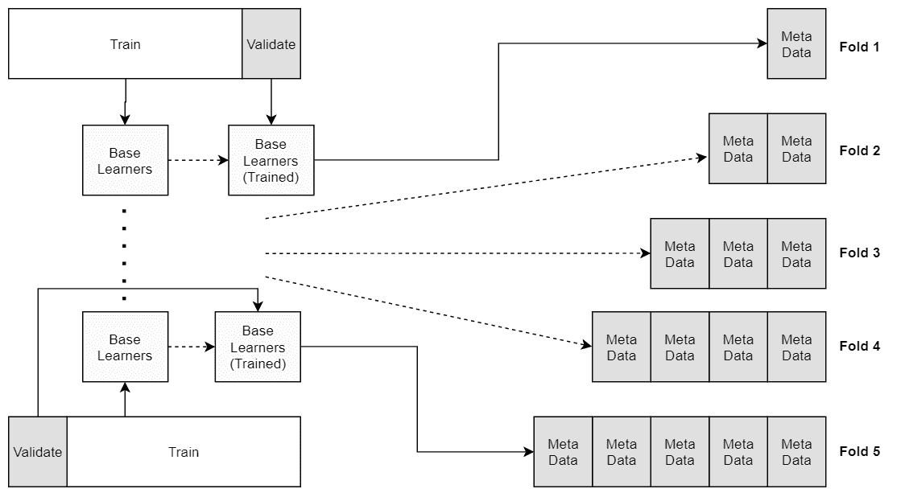
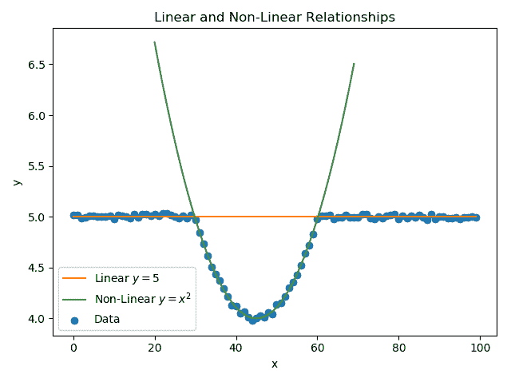
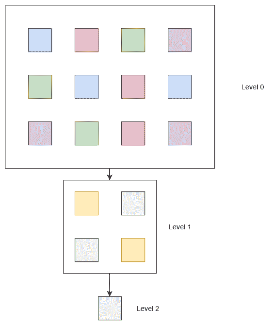
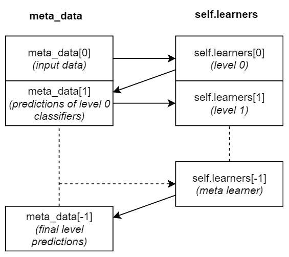

# 第四章：堆叠

**堆叠**是我们将要研究的第二种集成学习技术。与投票一起，它属于非生成方法类别，因为它们都使用单独训练的分类器作为基础学习器。

在本章中，我们将介绍堆叠的主要思想、优缺点，以及如何选择基础学习器。此外，我们还将介绍如何使用 scikit-learn 实现回归和分类问题的堆叠过程。

本章涵盖的主要主题如下：

+   堆叠的方法论及使用元学习器组合预测

+   使用堆叠的动机

+   堆叠的优缺点

+   选择集成的基础学习器

+   实现堆叠回归和分类问题

# 技术要求

你需要具备基本的机器学习技术和算法知识。此外，还需要了解 Python 的约定和语法。最后，熟悉 NumPy 库将大大帮助读者理解一些自定义算法的实现。

本章的代码文件可以在 GitHub 上找到：

[`github.com/PacktPublishing/Hands-On-Ensemble-Learning-with-Python/tree/master/Chapter04`](https://github.com/PacktPublishing/Hands-On-Ensemble-Learning-with-Python/tree/master/Chapter04)

查看以下视频，查看代码的实际应用：[`bit.ly/2XJgyD2`](http://bit.ly/2XJgyD2)。

# 元学习

**元学习**是一个广泛的机器学习术语。它有多重含义，但通常指的是利用特定问题的元数据来解决该问题。它的应用范围从更高效地解决问题，到设计全新的学习算法。它是一个日益发展的研究领域，最近通过设计新颖的深度学习架构取得了令人瞩目的成果。

# 堆叠

堆叠是一种元学习形式。其主要思想是，我们使用基础学习器生成问题数据集的元数据，然后利用另一种学习器——元学习器，来处理这些元数据。基础学习器被视为 0 级学习器，而元学习器则被视为 1 级学习器。换句话说，元学习器堆叠在基础学习器之上，因此得名堆叠。

一种更直观的集成描述方式是通过投票类比。在投票中，我们结合多个基础学习器的预测，以提高它们的性能。在堆叠中，我们不是明确地定义组合规则，而是训练一个模型，学习如何最好地结合基础学习器的预测。元学习器的输入数据集由基础学习器的预测（元数据）组成，如下图所示：



堆叠集成数据流，从原始数据到基础学习器，生成元学习器的元数据

# 创建元数据

如前所述，我们需要元数据来训练和操作我们的集成模型。在操作阶段，我们仅需传递基本学习器的数据。另一方面，训练阶段稍微复杂一些。我们希望元学习器能够发现基本学习器之间的优缺点。尽管有人认为我们可以在训练集上训练基本学习器，对其进行预测，并使用这些预测来训练我们的元学习器，但这会引入方差。我们的元学习器将发现已经被基本学习器“看到”的数据的优缺点。由于我们希望生成具有良好预测（样本外）性能的模型，而不是描述性（样本内）能力，因此必须采用另一种方法。

另一种方法是将训练集分为基本学习器训练集和元学习器训练（验证）集。这样，我们仍然可以保留一个真实的测试集，用于衡量集成模型的表现。此方法的缺点是我们必须将部分实例分配给验证集。此外，验证集的大小和训练集的大小都会小于原始训练集的大小。因此，首选方法是使用**K 折交叉验证**。对于每个*K*，基本学习器将在*K*-1 个折上进行训练，并在第*K*个折上进行预测，生成最终训练元数据的 100/*K*百分比。通过将该过程重复*K*次，每次针对一个折，我们将为整个训练数据集生成元数据。该过程在以下图表中有所展示。最终结果是为整个数据集生成的元数据，其中元数据是基于样本外数据生成的（从基本学习器的角度来看，对于每个折）：



使用五折交叉验证创建元数据

# 决定集成模型的组成

我们将堆叠描述为一种高级的投票形式。与投票（以及大多数集成学习技术）类似，堆叠依赖于基本学习器的多样性。如果基本学习器在问题的整个领域中表现相同，那么元学习器将很难显著提升它们的集体表现。此外，可能需要一个复杂的元学习器。如果基本学习器具有多样性，并且在问题的不同领域中表现出不同的性能特征，即使是一个简单的元学习器也能大大提升它们的集体表现。

# 选择基本学习器

通常，混合不同的学习算法是个好主意，以便捕捉特征之间以及特征与目标变量之间的线性和非线性关系。例如，考虑以下数据集，其中特征（*x*）与目标变量（*y*）之间既有线性关系也有非线性关系。显然，单一的线性回归或单一的非线性回归都无法完全建模数据。而使用线性和非线性回归的堆叠集成将大大超越这两种模型。即使不使用堆叠，通过手工制定一个简单的规则（例如“如果 x 在 [0, 30] 或 [60, 100] 区间内，使用线性模型，否则使用非线性模型”），我们也能大大超过这两个模型：



示例数据集中的 x=5 和 x 的平方的组合

# 选择元学习器

通常，元学习器应该是一个相对简单的机器学习算法，以避免过拟合。此外，还应采取额外的步骤来正则化元学习器。例如，如果使用决策树，则应限制树的最大深度。如果使用回归模型，应该首选正则化回归（如弹性网或岭回归）。如果需要更复杂的模型以提高集成的预测性能，可以使用多级堆叠，其中每个层级的模型数量和每个模型的复杂度会随着堆叠层级的增加而减少：



层级堆叠集成。每一层的模型比上一层更简单。

元学习器的另一个非常重要的特性是能够处理相关输入，特别是不能像朴素贝叶斯分类器那样对特征间的独立性做出假设。元学习器的输入（元数据）将高度相关。这是因为所有基学习器都被训练来预测相同的目标。因此，它们的预测将来自对相同函数的近似。尽管预测值会有所不同，但它们会非常接近。

# Python 实现

尽管 scikit-learn 实现了本书中涵盖的大多数集成方法，但堆叠（stacking）并不包括在内。在这一部分，我们将为回归和分类问题实现自定义的堆叠解决方案。

# 回归的堆叠

在这里，我们将尝试为糖尿病回归数据集创建一个堆叠集成。该集成将包含一个 5 邻居的**k-最近邻**（**k-NN**）、一个最大深度限制为四的决策树，以及一个岭回归（最小二乘回归的正则化形式）。元学习器将是一个简单的**普通最小二乘法**（**OLS**）线性回归。

首先，我们需要导入所需的库和数据。Scikit-learn 提供了一个便捷的方法，可以使用`sklearn.model_selection`模块中的`KFold`类将数据拆分为 K 个子集。与之前的章节一样，我们使用前 400 个实例进行训练，剩余的实例用于测试：

```py
# --- SECTION 1 ---
# Libraries and data loading
from sklearn.datasets import load_diabetes
from sklearn.neighbors import KNeighborsRegressor
from sklearn.tree import DecisionTreeRegressor
from sklearn.linear_model import LinearRegression, Ridge
from sklearn.model_selection import KFold
from sklearn import metrics
import numpy as np
diabetes = load_diabetes()

train_x, train_y = diabetes.data[:400], diabetes.target[:400]
test_x, test_y = diabetes.data[400:], diabetes.target[400:]
```

在以下代码中，我们实例化了基础学习器和元学习器。为了方便后续访问每个基础学习器，我们将每个基础学习器存储在一个名为`base_learners`的列表中：

```py
# --- SECTION 2 ---
# Create the ensemble's base learners and meta-learner
# Append base learners to a list for ease of access
base_learners = []
knn = KNeighborsRegressor(n_neighbors=5)

base_learners.append(knn)
dtr = DecisionTreeRegressor(max_depth=4 , random_state=123456)

base_learners.append(dtr)
ridge = Ridge()

base_learners.append(ridge)
meta_learner = LinearRegression()
```

在实例化我们的学习器之后，我们需要为训练集创建元数据。我们通过首先创建一个`KFold`对象，指定分割数（K），即`KFold(n_splits=5)`，然后调用`KF.split(train_x)`将训练集拆分成五个子集。这将返回一个生成器，用于获取这五个子集的训练集和测试集索引。对于每个拆分，我们使用`train_indices`（四个子集）对应的数据来训练我们的基础学习器，并为与`test_indices`对应的数据创建元数据。此外，我们将每个分类器的元数据存储在`meta_data`数组中，将相应的目标存储在`meta_targets`数组中。最后，我们转置`meta_data`，以获得一个（实例，特征）的形状：

```py
# --- SECTION 3 ---
# Create the training metadata

# Create variables to store metadata and their targets
meta_data = np.zeros((len(base_learners), len(train_x)))
meta_targets = np.zeros(len(train_x))

# Create the cross-validation folds
KF = KFold(n_splits=5)
meta_index = 0
for train_indices, test_indices in KF.split(train_x):
  # Train each learner on the K-1 folds 
  # and create metadata for the Kth fold
  for i in range(len(base_learners)):
    learner = base_learners[i]
    learner.fit(train_x[train_indices], train_y[train_indices])
    predictions = learner.predict(train_x[test_indices])
    meta_data[i][meta_index:meta_index+len(test_indices)] = \
                              predictions

  meta_targets[meta_index:meta_index+len(test_indices)] = \
                          train_y[test_indices]
  meta_index += len(test_indices)

# Transpose the metadata to be fed into the meta-learner
meta_data = meta_data.transpose()
```

对于测试集，我们不需要将其拆分成多个子集。我们仅需在整个训练集上训练基础学习器，并在测试集上进行预测。此外，我们会评估每个基础学习器并存储评估指标，以便与集成模型的表现进行比较。由于这是一个回归问题，我们使用 R 平方和**均方误差**（**MSE**）作为评估指标：

```py
# --- SECTION 4 ---
# Create the metadata for the test set and evaluate the base learners
test_meta_data = np.zeros((len(base_learners), len(test_x)))
base_errors = []
base_r2 = []
for i in range(len(base_learners)):
  learner = base_learners[i]
  learner.fit(train_x, train_y)
  predictions = learner.predict(test_x)
  test_meta_data[i] = predictions

  err = metrics.mean_squared_error(test_y, predictions)
  r2 = metrics.r2_score(test_y, predictions)

  base_errors.append(err)
  base_r2.append(r2)

test_meta_data = test_meta_data.transpose()
```

现在，既然我们已经获得了训练集和测试集的元数据，我们就可以在训练集上训练我们的元学习器，并在测试集上进行评估：

```py
# --- SECTION 5 ---
# Fit the meta-learner on the train set and evaluate it on the test set
meta_learner.fit(meta_data, meta_targets)
ensemble_predictions = meta_learner.predict(test_meta_data)

err = metrics.mean_squared_error(test_y, ensemble_predictions)
r2 = metrics.r2_score(test_y, ensemble_predictions)

# --- SECTION 6 ---
# Print the results 
print('ERROR R2 Name')
print('-'*20)
for i in range(len(base_learners)):
  learner = base_learners[i]
  print(f'{base_errors[i]:.1f} {base_r2[i]:.2f} {learner.__class__.__name__}')
print(f'{err:.1f} {r2:.2f} Ensemble')
```

我们得到如下输出：

```py
ERROR R2 Name
--------------------
2697.8 0.51 KNeighborsRegressor
3142.5 0.43 DecisionTreeRegressor
2564.8 0.54 Ridge
2066.6 0.63 Ensemble
```

如图所示，R 平方从最佳基础学习器（岭回归）提高了超过 16%，而 MSE 几乎提高了 20%。这是一个相当可观的改进。

# 分类任务的堆叠方法

堆叠方法既适用于回归问题，也适用于分类问题。在这一节中，我们将使用堆叠方法对乳腺癌数据集进行分类。我们依然会使用三个基础学习器：一个 5 邻居的 k-NN，一个最大深度为 4 的决策树，和一个带有 1 个隐藏层、100 个神经元的简单神经网络。对于元学习器，我们使用一个简单的逻辑回归模型。

再次加载所需的库，并将数据拆分为训练集和测试集：

```py
# --- SECTION 1 ---
# Libraries and data loading
from sklearn.datasets import load_breast_cancer
from sklearn.neighbors import KNeighborsClassifier
from sklearn.tree import DecisionTreeClassifier
from sklearn.neural_network import MLPClassifier
from sklearn.naive_bayes import GaussianNB
from sklearn.linear_model import LogisticRegression
from sklearn.model_selection import KFold
from sklearn import metrics
import numpy as np
bc = load_breast_cancer()

train_x, train_y = bc.data[:400], bc.target[:400]
test_x, test_y = bc.data[400:], bc.target[400:]
```

我们实例化了基础学习器和元学习器。请注意，`MLPClassifier`具有一个`hidden_layer_sizes =(100,)`参数，用来指定每个隐藏层的神经元数量。这里，我们只有一个隐藏层，包含 100 个神经元：

```py
# --- SECTION 2 ---
# Create the ensemble's base learners and meta-learner
# Append base learners to a list for ease of access
base_learners = []

knn = KNeighborsClassifier(n_neighbors=2)
base_learners.append(knn)

dtr = DecisionTreeClassifier(max_depth=4, random_state=123456)
base_learners.append(dtr)

mlpc = MLPClassifier(hidden_layer_sizes =(100, ), 
           solver='lbfgs', random_state=123456)
base_learners.append(mlpc)

meta_learner = LogisticRegression(solver='lbfgs')
```

同样，使用`KFolds`，我们将训练集拆分成五个折叠，以便在四个折叠上进行训练并为剩余的折叠生成元数据，重复五次。请注意，我们使用`learner.predict_proba(train_x[test_indices])[:,0]`来获取实例属于第一类的预测概率。鉴于我们只有两个类别，这已经足够了。如果是*N*个类别，我们必须保存*N*-1 个特征，或者简单地使用`learner.predict`，以便保存预测的类别：

```py
# --- SECTION 3 ---
# Create the training metadata

# Create variables to store metadata and their targets
meta_data = np.zeros((len(base_learners), len(train_x)))
meta_targets = np.zeros(len(train_x))

# Create the cross-validation folds
KF = KFold(n_splits=5)
meta_index = 0
for train_indices, test_indices in KF.split(train_x):
   # Train each learner on the K-1 folds and create 
   # metadata for the Kth fold
   for i in range(len(base_learners)):
   learner = base_learners[i]

   learner.fit(train_x[train_indices], train_y[train_indices])
   predictions = learner.predict_proba(train_x[test_indices])[:,0]

   meta_data[i][meta_index:meta_index+len(test_indices)] = predictions

   meta_targets[meta_index:meta_index+len(test_indices)] = \
                           train_y[test_indices]
   meta_index += len(test_indices)

# Transpose the metadata to be fed into the meta-learner
meta_data = meta_data.transpose()
```

然后，我们在训练集上训练基础分类器，并为测试集创建元数据，同时使用`metrics.accuracy_score(test_y, learner.predict(test_x))`评估它们的准确度：

```py
# --- SECTION 4 ---
# Create the metadata for the test set and evaluate the base learners
test_meta_data = np.zeros((len(base_learners), len(test_x)))
base_acc = []
for i in range(len(base_learners)):
  learner = base_learners[i]
  learner.fit(train_x, train_y)
  predictions = learner.predict_proba(test_x)[:,0]
  test_meta_data[i] = predictions

  acc = metrics.accuracy_score(test_y, learner.predict(test_x))
  base_acc.append(acc)
test_meta_data = test_meta_data.transpose()
```

最后，我们在训练元数据上拟合元学习器，评估其在测试数据上的表现，并打印出集成模型和单个学习器的准确度：

```py
# --- SECTION 5 ---
# Fit the meta-learner on the train set and evaluate it on the test set
meta_learner.fit(meta_data, meta_targets)
ensemble_predictions = meta_learner.predict(test_meta_data)

acc = metrics.accuracy_score(test_y, ensemble_predictions)

# --- SECTION 6 ---
# Print the results
print('Acc Name')
print('-'*20)
for i in range(len(base_learners)):
  learner = base_learners[i]
  print(f'{base_acc[i]:.2f} {learner.__class__.__name__}')
print(f'{acc:.2f} Ensemble')
```

最终输出如下：

```py
Acc Name
--------------------
0.86 KNeighborsClassifier
0.88 DecisionTreeClassifier
0.92 MLPClassifier  
0.93 Ensemble
```

在这里，我们可以看到，元学习器仅能将集成模型的表现提高 1%，与表现最好的基础学习器相比。如果我们尝试利用`learner.predict`方法生成元数据，我们会发现集成模型实际上表现不如神经网络：

```py
Acc Name
--------------------
0.86 KNeighborsClassifier
0.88 DecisionTreeClassifier
0.92 MLPClassifier
0.91 Ensemble
```

# 为 scikit-learn 创建一个堆叠回归器类

我们可以利用前面的代码来创建一个可重用的类，用于协调集成模型的训练和预测。所有 scikit-learn 分类器都使用标准的`fit(x, y)`和`predict(x)`方法，分别用于训练和预测。首先，我们导入所需的库，并声明类及其构造函数。构造函数的参数是一个包含 scikit-learn 分类器子列表的列表。每个子列表包含该层的学习器。因此，构建一个多层堆叠集成模型非常容易。例如，可以使用`StackingRegressor([ [l11, l12, l13], [ l21, l22], [l31] ])`来构建一个三层集成模型。我们创建一个包含每个堆叠层大小（学习器数量）的列表，并且还创建基础学习器的深拷贝。最后一个列表中的分类器被视为元学习器：

以下所有代码，直到（不包括）第五部分（注释标签），都是`StackingRegressor`类的一部分。如果将其复制到 Python 编辑器中，应正确缩进。

```py
# --- SECTION 1 ---
# Libraries
import numpy as np

from sklearn.model_selection import KFold
from copy import deepcopy

class StackingRegressor():
  # --- SECTION 2 ---
  # The constructor 
  def __init__(self, learners):
    # Create a list of sizes for each stacking level
    # And a list of deep copied learners 
    self.level_sizes = []
    self.learners = []
    for learning_level in learners:
      self.level_sizes.append(len(learning_level))
      level_learners = []
      for learner in learning_level:
        level_learners.append(deepcopy(learner))
      self.learners.append(level_learners)
```

在跟随构造函数定义的过程中，我们定义了`fit`函数。与我们在前一部分展示的简单堆叠脚本的唯一区别在于，我们不再为元学习器创建元数据，而是为每个堆叠层创建一个元数据列表。我们将元数据和目标保存到`meta_data, meta_targets`列表中，并使用`data_z, target_z`作为每个层的对应变量。此外，我们在上一层的元数据上训练该层的学习器。我们使用原始训练集和目标初始化元数据列表：

```py
  # --- SECTION 3 ---
  # The fit function. Creates training metadata for every level
  # and trains each level on the previous level's metadata
  def fit(self, x, y):
    # Create a list of training metadata, one for each stacking level
    # and another one for the targets. For the first level, 
    # the actual data is used.
    meta_data = [x]
    meta_targets = [y]
    for i in range(len(self.learners)):
      level_size = self.level_sizes[i]

      # Create the metadata and target variables for this level
      data_z = np.zeros((level_size, len(x)))
      target_z = np.zeros(len(x))

      train_x = meta_data[i]
      train_y = meta_targets[i]

      # Create the cross-validation folds
      KF = KFold(n_splits=5)
      meta_index = 0
      for train_indices, test_indices in KF.split(x):
        # Train each learner on the K-1 folds and create
        # metadata for the Kth fold
        for j in range(len(self.learners[i])):

          learner = self.learners[i][j]
          learner.fit(train_x[train_indices], 
                train_y[train_indices])
          predictions = learner.predict(train_x[test_indices])

          data_z[j][meta_index:meta_index+len(test_indices)] = \
                              predictions

        target_z[meta_index:meta_index+len(test_indices)] = \
                          train_y[test_indices]
        meta_index += len(test_indices)

      # Add the data and targets to the metadata lists
      data_z = data_z.transpose()
      meta_data.append(data_z)
      meta_targets.append(target_z)

      # Train the learner on the whole previous metadata
      for learner in self.learners[i]:
        learner.fit(train_x, train_y)
```

最后，我们定义了`predict`函数，该函数为提供的测试集创建每个层的元数据，使用与`fit`中相同的逻辑（存储每个层的元数据）。该函数返回每个层的元数据，因为它们也是每个层的预测结果。集成输出可以通过`meta_data[-1]`访问：

```py

  # --- SECTION 4 ---
  # The predict function. Creates metadata for the test data and returns
  # all of them. The actual predictions can be accessed with 
  # meta_data[-1]
  def predict(self, x):

    # Create a list of training metadata, one for each stacking level
    meta_data = [x]
    for i in range(len(self.learners)):
      level_size = self.level_sizes[i]

      data_z = np.zeros((level_size, len(x)))

      test_x = meta_data[i]

      # Create the cross-validation folds
      KF = KFold(n_splits=5)
      for train_indices, test_indices in KF.split(x):
        # Train each learner on the K-1 folds and create
        # metadata for the Kth fold
        for j in range(len(self.learners[i])):

          learner = self.learners[i][j]
          predictions = learner.predict(test_x)
          data_z[j] = predictions

      # Add the data and targets to the metadata lists
      data_z = data_z.transpose()
      meta_data.append(data_z)

    # Return the meta_data the final layer's prediction can be accessed
    # With meta_data[-1]
    return meta_data
```

如果我们用与回归示例中相同的元学习器和基础学习器实例化`StackingRegressor`，我们可以看到它的表现完全相同！为了访问中间预测，我们必须访问该层的索引加一，因为`meta_data[0]`中的数据是原始的测试数据：

```py
# --- SECTION 5 ---
# Use the classifier
from sklearn.datasets import load_diabetes
from sklearn.neighbors import KNeighborsRegressor
from sklearn.tree import DecisionTreeRegressor
from sklearn.linear_model import LinearRegression, Ridge
from sklearn import metrics
diabetes = load_diabetes()

train_x, train_y = diabetes.data[:400], diabetes.target[:400]
test_x, test_y = diabetes.data[400:], diabetes.target[400:]

base_learners = []

knn = KNeighborsRegressor(n_neighbors=5)
base_learners.append(knn)

dtr = DecisionTreeRegressor(max_depth=4, random_state=123456)
base_learners.append(dtr)

ridge = Ridge()
base_learners.append(ridge)

meta_learner = LinearRegression()

# Instantiate the stacking regressor
sc = StackingRegressor([[knn,dtr,ridge],[meta_learner]])

# Fit and predict
sc.fit(train_x, train_y)
meta_data = sc.predict(test_x)

# Evaluate base learners and meta-learner
base_errors = []
base_r2 = []
for i in range(len(base_learners)):
  learner = base_learners[i]
  predictions = meta_data[1][:,i]
  err = metrics.mean_squared_error(test_y, predictions)
  r2 = metrics.r2_score(test_y, predictions)
  base_errors.append(err)
  base_r2.append(r2)

err = metrics.mean_squared_error(test_y, meta_data[-1])
r2 = metrics.r2_score(test_y, meta_data[-1])

# Print the results
print('ERROR R2 Name')
print('-'*20)
for i in range(len(base_learners)):
  learner = base_learners[i]
  print(f'{base_errors[i]:.1f} {base_r2[i]:.2f} 
      {learner.__class__.__name__}')
print(f'{err:.1f} {r2:.2f} Ensemble')
```

结果与我们之前示例中的结果一致：

```py
ERROR R2 Name
--------------------
2697.8 0.51 KNeighborsRegressor
3142.5 0.43 DecisionTreeRegressor
2564.8 0.54 Ridge
2066.6 0.63 Ensemble
```

为了进一步澄清`meta_data`与`self.learners`列表之间的关系，我们通过图示方式展示它们的交互关系。为了代码简洁，我们初始化了`meta_data[0]`。虽然将实际输入数据存储在`meta_data`列表中可能会误导，但它避免了需要以不同于其他层的方式处理基础学习器第一层：



每一层`meta_data`与`self.learners`之间的关系

# 总结

本章介绍了一种名为堆叠（或堆叠泛化）的集成学习方法。它可以视为一种更高级的投票方法。我们首先介绍了堆叠的基本概念，如何正确创建元数据，以及如何决定集成的组成。我们为堆叠提供了回归和分类的实现。最后，我们展示了一个集成类的实现（类似于`scikit-learn`类的实现），使得多层堆叠集成更易于使用。以下是本章的一些关键要点：

**堆叠**可以由多个**层**组成。每一层都会为下一层生成**元数据**。你应该通过将训练集划分为**K 折**并迭代地**在 K-1 折上训练**，同时为**第 K 折**创建**元数据**来创建每一层的元数据。创建元数据后，你应该在整个训练集上训练当前层。基础学习器必须具有多样性。元学习器应该是一个相对简单的算法，并能抵抗过拟合。如果可能的话，尽量在元学习器中引入正则化。例如，如果使用决策树，则限制其最大深度，或使用正则化回归。元学习器应该能够相对较好地处理相关输入。你不应该害怕**将表现不佳的模型**添加到集成中，只要它们为元数据引入了新的信息（即，它们以不同于其他模型的方式处理数据集）。在下一章中，我们将介绍第一个生成式集成方法——袋装（Bagging）。
