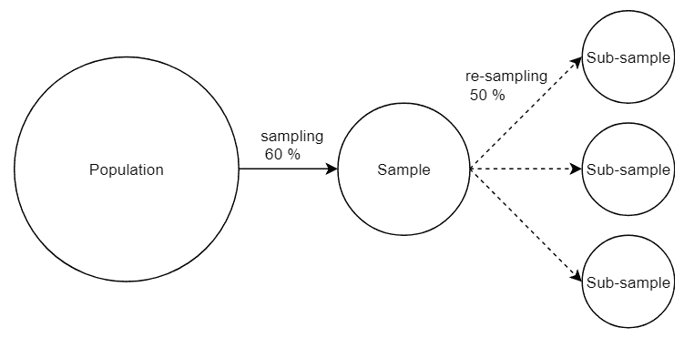
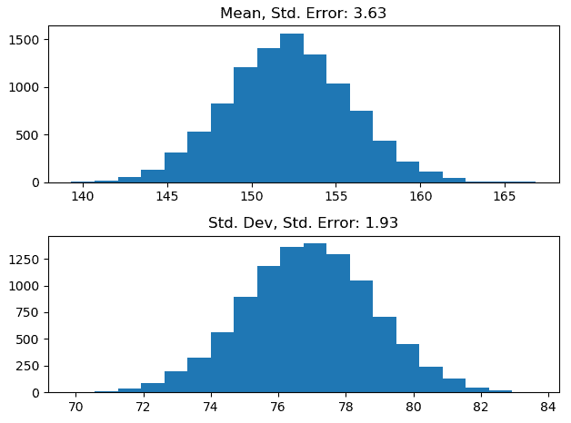
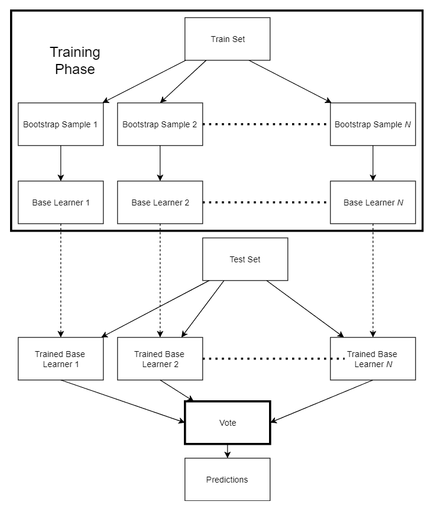
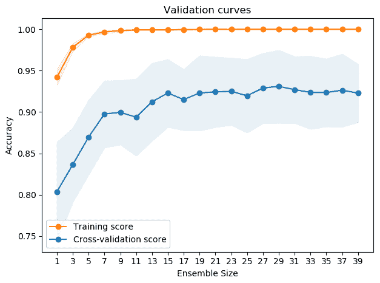

# 第五章：装袋法（Bagging）

装袋法，或称为自助聚合（Bootstrap Aggregating），是本书介绍的第一个生成性集成学习技术。它可以作为减少方差的有用工具，通过对原始训练集进行子抽样来创建多个基础学习器。在本章中，我们将讨论装袋法所基于的统计方法——自助法。接下来，我们将介绍装袋法的优缺点，并最终用 Python 实现该方法，同时使用 scikit-learn 实现解决回归和分类问题。

本章涵盖的主要内容如下：

+   计算统计学中的自助法方法

+   装袋法的工作原理

+   装袋法的优缺点

+   实现自定义的装袋集成方法

+   使用 scikit-learn 实现

# 技术要求

你需要具备基本的机器学习技术和算法知识。此外，还需要了解 Python 的规范和语法。最后，熟悉 NumPy 库将极大地帮助读者理解一些自定义算法实现。

本章的代码文件可以在 GitHub 上找到：

[`github.com/PacktPublishing/Hands-On-Ensemble-Learning-with-Python/tree/master/Chapter05`](https://github.com/PacktPublishing/Hands-On-Ensemble-Learning-with-Python/tree/master/Chapter05)

查看以下视频，查看代码的实际操作：[`bit.ly/2JKcokD`](http://bit.ly/2JKcokD)。

# 自助法（Bootstrapping）

自助法是一种重抽样方法。在统计学中，重抽样是指使用从原始样本生成的多个样本。在机器学习术语中，样本即为我们的训练数据。其主要思想是将原始样本视为总体（问题的整个领域），而将生成的子样本视为样本。

本质上，我们在模拟如果我们从原始总体中收集多个样本，统计量将如何表现，正如以下图示所示：



自助法如何工作的示意图

# 创建自助样本

为了创建自助样本，我们使用有放回抽样（每个实例可能被多次选择）从原始样本中抽取数据。这意味着一个实例可以被多次选择。假设我们有 100 个人的数据，数据中包含每个人的体重和身高。如果我们从 1 到 100 生成随机数字，并将对应的数据添加到一个新数据集中，那么我们基本上就创建了一个自助样本。

在 Python 中，我们可以使用 `numpy.random.choice` 来创建给定大小的子样本。我们可以尝试创建自助样本并估算糖尿病数据集的均值和标准差。首先，我们加载数据集和库，并打印样本的统计信息，如下例所示：

```py
# --- SECTION 1 ---
# Libraries and data loading
import numpy as np
import matplotlib.pyplot as plt
from sklearn.datasets import load_diabetes

diabetes = load_diabetes()

# --- SECTION 2 ---
# Print the original sample's statistics
target = diabetes.target

print(np.mean(target))
print(np.std(target))
```

接下来，我们创建自助样本和统计量，并将其存储在`bootstrap_stats`中。我们本可以存储整个自助样本，但这样做会消耗过多内存。而且，我们只关心统计量，因此只存储它们更有意义。在这里，我们创建了 10,000 个自助样本和统计量：

```py
# --- SECTION 3 ---
# Create the bootstrap samples and statistics
bootstrap_stats = []
for _ in range(10000):
    bootstrap_sample = np.random.choice(target, size=len(target))
    mean = np.mean(bootstrap_sample)
    std = np.std(bootstrap_sample)
    bootstrap_stats.append((mean, std))

bootstrap_stats = np.array(bootstrap_stats)
```

现在我们可以绘制平均值和标准差的直方图，并计算每个值的标准误差（即统计量分布的标准差）：

```py
# --- SECTION 4 ---
# plot the distributions
plt.figure()
plt.subplot(2,1,1)
std_err = np.std(bootstrap_stats[:,0])
plt.title('Mean, Std. Error: %.2f'%std_err)
plt.hist(bootstrap_stats[:,0], bins=20)

plt.subplot(2,1,2)
std_err = np.std(bootstrap_stats[:,1])
plt.title('Std. Dev, Std. Error: %.2f'%std_err)
plt.hist(bootstrap_stats[:,1], bins=20)
plt.show()
```

我们得到如下图所示的输出：



平均值和标准差的自助分布

注意，由于该过程的固有随机性（每个自助样本将选择哪些实例），每次执行时结果可能会有所不同。增加自助样本的数量有助于稳定结果。尽管如此，这仍然是一种非常有用的技术，可以在不做假设的情况下计算标准误差、置信区间和其他统计量，而无需假设底层分布。

# 集成法（Bagging）

集成法利用自助采样（bootstrap sampling）训练一系列基础学习器，然后通过投票方式合并它们的预测结果。这种方法的动机是通过多样化训练集，产生多样化的基础学习器。在本节中，我们讨论这种方法的动机、优势与劣势。

# 创建基础学习器

集成法对训练集应用自助采样，创建多个*N*个自助样本。接着，使用相同的机器学习算法创建相同数量*N*的基础学习器。每个基础学习器都在相应的训练集上进行训练，所有基础学习器通过投票合并（分类时使用硬投票，回归时使用平均值）。该过程如下所示：



通过集成法创建基础学习器

通过使用与原始训练集大小相同的自助样本，每个实例在任何给定的自助样本中出现的概率为 0.632。因此，在许多情况下，这种自助估计被称为 0.632 自助估计。在我们的案例中，这意味着我们可以使用原始训练集中剩余的 36.8%实例来估算单个基础学习器的性能。这被称为**袋外得分**（**out**-**of**-**bag score**），而这 36.8%的实例则被称为**袋外实例**（**out**-**of**-**bag instances**）。

# 优势与劣势

Bagging 通常使用决策树作为基本学习器，但它可以与任何机器学习算法一起使用。Bagging 大大减少了方差，并且已被证明在使用不稳定的基本学习器时最为有效。不稳定的学习器生成的模型具有较大的模型间方差，即使训练集仅略微变化。此外，随着基本学习器数量的增加，bagging 会收敛。类似于估计自助法统计量，通过增加基本学习器的数量，我们也增加了自助样本的数量。最后，bagging 允许轻松并行化，因为每个模型都是独立训练的。

Bagging 的主要缺点是模型的可解释性和透明度的丧失。例如，使用单个决策树可以提供很好的可解释性，因为每个节点的决策都是可直接获取的。使用 100 棵树的 bagging 集成模型会使得单个决策变得不那么重要，而是集体预测定义了集成模型的最终输出。

# Python 实现

为了更好地理解集成模型的创建过程及其优点，我们将使用决策树在 Python 中实现它。在这个示例中，我们将尝试对手写数字的 MNIST 数据集进行分类。虽然我们之前一直使用癌症数据集作为分类示例，但它只有两个类别，并且样本数量相对较少，不适合有效的自助法。数字数据集包含大量样本，且更加复杂，因为它总共有 10 个类别。

# 实现

在这个示例中，我们将使用 1500 个实例作为训练集，剩余的 297 个作为测试集。我们将生成 10 个自助样本，因此会得到 10 个决策树模型。接着，我们将通过硬投票将基本预测结果结合起来：

1.  我们加载库和数据，如下所示：

```py
# --- SECTION 1 ---
# Libraries and data loading
from sklearn.datasets import load_digits
from sklearn.tree import DecisionTreeClassifier
from sklearn import metrics
import numpy as np
digits = load_digits()

train_size = 1500
train_x, train_y = digits.data[:train_size], digits.target[:train_size]
test_x, test_y = digits.data[train_size:], digits.target[train_size:]
```

1.  然后我们创建自助样本并训练相应的模型。请注意，我们没有使用 `np.random.choice`，而是使用 `np.random.randint(0, train_size, size=train_size)` 生成一个索引数组，这样我们可以为每个自助样本选择特征和相应的目标。为了后续方便访问，我们将每个基本学习器存储在 `base_learners` 列表中：

```py
# --- SECTION 2 ---
# Create our bootstrap samples and train the classifiers

ensemble_size = 10
base_learners = []

for _ in range(ensemble_size):
 # We sample indices in order to access features and targets
 bootstrap_sample_indices = np.random.randint(0, train_size, size=train_size)
 bootstrap_x = train_x[bootstrap_sample_indices]
 bootstrap_y = train_y[bootstrap_sample_indices]
 dtree = DecisionTreeClassifier()
 dtree.fit(bootstrap_x, bootstrap_y)
 base_learners.append(dtree)
```

1.  接下来，我们使用每个基本学习器预测测试集的目标，并存储它们的预测结果以及评估后的准确性，如下方代码块所示：

```py
# --- SECTION 3 ---
# Predict with the base learners and evaluate them

base_predictions = []
base_accuracy = []
for learner in base_learners:
 predictions = learner.predict(test_x)
 base_predictions.append(predictions)
 acc = metrics.accuracy_score(test_y, predictions)
 base_accuracy.append(acc)
```

1.  现在我们已经在 `base_predictions` 中得到了每个基本学习器的预测，我们可以像在第三章中做的那样，使用硬投票将它们结合起来，*投票*，用于个体基本学习器的预测。此外，我们还评估了集成模型的准确性：

```py
# Combine the base learners' predictions 

ensemble_predictions = []
# Find the most voted class for each test instance
for i in range(len(test_y)):
    counts = [0 for _ in range(10)]
    for learner_predictions in base_predictions:
        counts[learner_predictions[i]] = counts[learner_predictions[i]]+1
    # Find the class with most votes 
    final = np.argmax(counts)
    # Add the class to the final predictions 
    ensemble_predictions.append(final)

ensemble_acc = metrics.accuracy_score(test_y, ensemble_predictions)
```

1.  最后，我们打印每个基本学习器的准确性以及集成模型的准确性，并按升序排序：

```py
# --- SECTION 5 ---
# Print the accuracies
print('Base Learners:')
print('-'*30)
for index, acc in enumerate(sorted(base_accuracy)):
 print(f'Learner {index+1}: %.2f' % acc)
print('-'*30)
print('Bagging: %.2f' % ensemble_acc)
```

最终输出如下所示：

```py

Base Learners:
------------------------------
Learner 1: 0.72
Learner 2: 0.72
Learner 3: 0.73
Learner 4: 0.73
Learner 5: 0.76
Learner 6: 0.76
Learner 7: 0.77
Learner 8: 0.77
Learner 9: 0.79
Learner 10: 0.79
------------------------------
Bagging: 0.88
```

显然，集成模型的准确率比表现最佳的基模型高出近 10%。这是一个相当大的改进，特别是如果我们考虑到该集成模型由相同的基学习器组成（考虑到所使用的机器学习方法）。

# 并行化实现

我们可以通过 `from concurrent.futures import ProcessPoolExecutor` 来轻松并行化我们的袋装实现。这个执行器允许用户生成多个任务并在并行进程中执行。它只需要传入一个目标函数及其参数。在我们的例子中，我们只需要将代码块（第 2 和第三部分）封装成函数：

```py
def create_learner(train_x, train_y):
 # We sample indices in order to access features and targets
 bootstrap_sample_indices = np.random.randint(0, train_size, size=train_size)
 bootstrap_x = train_x[bootstrap_sample_indices]
 bootstrap_y = train_y[bootstrap_sample_indices]
 dtree = DecisionTreeClassifier()
 dtree.fit(bootstrap_x, bootstrap_y)
 return dtree

def predict(learner, test_x):
 return learner.predict(test_x)
```

接着，在原始的第 2 和第三部分中，我们将代码修改如下：

```py
# Original Section 2
with ProcessPoolExecutor() as executor:
 futures = []
 for _ in range(ensemble_size):
 future = executor.submit(create_learner, train_x, train_y)
 futures.append(future)

for future in futures:
 base_learners.append(future.result())

# Original Section 3
base_predictions = []
 base_accuracy = []
 with ProcessPoolExecutor() as executor:
 futures = []
 for learner in base_learners:
 future = executor.submit(predict, learner, test_x)
 futures.append(future)

for future in futures:
 predictions = future.result()
 base_predictions.append(predictions)
 acc = metrics.accuracy_score(test_y, predictions)
 base_accuracy.append(acc)
```

`executor` 返回一个对象（在我们的例子中是 `future`），其中包含了我们函数的结果。其余代码保持不变，唯一的变化是它被封装在 `if __name__ == '__main__'` 的保护代码块中，因为每个新进程都会导入整个脚本。这个保护代码块防止它们重新执行其余的代码。由于我们的示例较小，且有六个进程可用，因此我们需要至少 1,000 个基学习器才能看到执行时间的显著加速。有关完整的工作版本，请参考提供的代码库中的 `'bagging_custom_parallel.py'`。

# 使用 scikit-learn

Scikit-learn 为回归和分类问题提供了出色的袋装（bagging）实现。在本节中，我们将通过使用提供的实现，创建数字和糖尿病数据集的集成模型。

# 分类问题的袋装（Bagging）

Scikit-learn 的袋装实现位于 `sklearn.ensemble` 包中。`BaggingClassifier` 是分类问题的相应类。它有许多有趣的参数，提供了更大的灵活性。通过指定 `base_estimator`，它可以使用任何 scikit-learn 估计器。此外，`n_estimators` 决定了集成模型的大小（也就是说，决定了生成的自助样本数量），而 `n_jobs` 则决定了在训练和预测每个基学习器时将使用多少个作业（进程）。最后，如果设置为 `True`，`oob_score` 会计算基学习器的袋外得分。

使用实际的分类器是非常简单的，与所有其他 scikit-learn 估计器类似。首先，我们加载所需的数据和库，如以下示例所示：

```py
# --- SECTION 1 ---
# Libraries and data loading
from sklearn.datasets import load_digits
from sklearn.tree import DecisionTreeClassifier
from sklearn.ensemble import BaggingClassifier
from sklearn import metrics

digits = load_digits()

train_size = 1500
train_x, train_y = digits.data[:train_size], digits.target[:train_size]
test_x, test_y = digits.data[train_size:], digits.target[train_size:]
```

然后，我们创建、训练并评估估计器：

```py
# --- SECTION 2 ---
# Create the ensemble
ensemble_size = 10
ensemble = BaggingClassifier(base_estimator=DecisionTreeClassifier(),
 n_estimators=ensemble_size,
 oob_score=True)

# --- SECTION 3 ---
# Train the ensemble
ensemble.fit(train_x, train_y)

# --- SECTION 4 ---
# Evaluate the ensemble
ensemble_predictions = ensemble.predict(test_x)

ensemble_acc = metrics.accuracy_score(test_y, ensemble_predictions)

# --- SECTION 5 ---
# Print the accuracy
print('Bagging: %.2f' % ensemble_acc)
```

最终的准确率为 88%，与我们自己的实现相同。此外，我们可以通过 `ensemble.oob_score_` 访问袋外得分，在我们的例子中，它等于 89.6%。通常情况下，袋外得分略微高估了集成模型的样本外预测能力，这在这个示例中得到了体现。

在我们的示例中，我们选择了`ensemble_size`为`10`。假设我们希望测试不同集成模型大小如何影响集成模型的表现。由于 bagging 分类器接受该大小作为构造函数的参数，我们可以使用第二章中的验证曲线，*开始使用集成学习*，来进行该测试。我们测试了 1 到 39 个基础学习器，步长为 2。我们观察到偏差和方差的初始下降。对于具有超过 20 个基础学习器的集成模型，似乎增加集成模型的大小并没有带来任何好处。结果在下图中显示：



1 到 39 个基础学习器的验证曲线

# 用于回归的 Bagging

对于回归目的，我们将使用来自相同`sklearn.ensemble`包的`BaggingRegressor`类。我们还将实例化一个单独的`DecisionTreeRegressor`以比较结果。我们按惯例开始加载库和数据：

```py
# --- SECTION 1 ---
 # Libraries and data loading
 from sklearn.datasets import load_diabetes
 from sklearn.tree import DecisionTreeRegressor
 from sklearn.ensemble import BaggingRegressor
 from sklearn import metrics
 import numpy as np
 diabetes = load_diabetes()

np.random.seed(1234)

train_x, train_y = diabetes.data[:400], diabetes.target[:400]
test_x, test_y = diabetes.data[400:], diabetes.target[400:]
```

我们实例化了单个决策树和集成模型。请注意，我们通过指定`max_depth=6`来允许相对较深的决策树。这允许创建多样化且不稳定的模型，极大地有利于 bagging。如果我们将最大深度限制为 2 或 3 层，我们会看到 bagging 的表现不比单一模型更好。训练和评估集成模型和单一模型的过程遵循标准程序：

```py
# --- SECTION 2 ---
# Create the ensemble and a single base learner for comparison
estimator = DecisionTreeRegressor(max_depth=6)
ensemble = BaggingRegressor(base_estimator=estimator,
n_estimators=10)

# --- SECTION 3 ---
# Train and evaluate both the ensemble and the base learner
ensemble.fit(train_x, train_y)
ensemble_predictions = ensemble.predict(test_x)

estimator.fit(train_x, train_y)
single_predictions = estimator.predict(test_x)

ensemble_r2 = metrics.r2_score(test_y, ensemble_predictions)
ensemble_mse = metrics.mean_squared_error(test_y, ensemble_predictions)

single_r2 = metrics.r2_score(test_y, single_predictions)
single_mse = metrics.mean_squared_error(test_y, single_predictions)

# --- SECTION 4 ---
# Print the metrics
print('Bagging r-squared: %.2f' % ensemble_r2)
print('Bagging MSE: %.2f' % ensemble_mse)
print('-'*30)
print('Decision Tree r-squared: %.2f' % single_r2)
print('Decision Tree MSE: %.2f' % single_mse)
```

集成模型可以显著优于单一模型，通过产生更高的 R 平方值和更低的**均方误差**（**MSE**）。如前所述，这是因为基础学习器可以创建深度和不稳定的模型。以下是两个模型的实际结果：

```py
 Bagging r-squared: 0.52
 Bagging MSE: 2679.12
 ------------------------------
 Decision Tree r-squared: 0.15
 Decision Tree MSE: 4733.35
```

# 摘要

本章介绍了创建自助法样本和估算自助法统计量的主要概念。在此基础上，我们介绍了自助法聚合（或称为 bagging），它使用多个自助法样本来训练许多基础学习器，这些学习器使用相同的机器学习算法。随后，我们提供了用于分类的自定义 bagging 实现，并介绍了如何并行化它。最后，我们展示了 scikit-learn 自身实现的 bagging 在回归和分类问题中的应用。

本章可以总结如下：**自助法样本**是通过从原始数据集进行有放回的重采样来创建的。其主要思想是将原始样本视为总体，将每个子样本视为原始样本。如果原始数据集和自助法数据集的大小相同，则每个实例有**63.2%**的概率被包含在自助法数据集中（样本）。自助法方法对于计算统计量（如置信区间和标准误差）非常有用，**无需对潜在的分布做假设**。**集成自助法（Bagging）**通过生成多个自助法样本来训练每个独立的基学习器。集成自助法对于**不稳定学习器**很有帮助，因为训练集中的小变化可能会导致生成的模型发生较大变化。集成自助法是减少**方差**的适合的集成学习方法。

集成自助法支持**并行化**，因为每个自助法样本和基学习器都可以独立生成、训练和测试。与所有集成学习方法一样，使用集成自助法会降低单个预测的**可解释性**和动机。

在下一章，我们将介绍第二种生成性方法——提升法（Boosting）。
