# 第六章：提升

我们将讨论的第二种生成方法是提升。提升旨在将多个弱学习器结合成一个强大的集成。它能够减少偏差，同时也能降低方差。在这里，弱学习器是指那些表现略好于随机预测的独立模型。例如，在一个包含两个类别且每个类别的实例数量相等的分类数据集上，弱学习器的准确率会稍微高于 50%。

在本章中，我们将介绍两种经典的提升算法：梯度提升（Gradient Boosting）和 AdaBoost。此外，我们还将探讨使用 scikit-learn 实现进行分类和回归。最后，我们将实验一种近期的提升算法及其实现——XGBoost。

本章涵盖的主要主题如下：

+   使用提升集成的动机

+   各种算法

+   利用 scikit-learn 在 Python 中创建提升集成

+   使用 XGBoost 库进行 Python 编程

# 技术要求

你需要具备基本的机器学习技术和算法知识。此外，还需要了解 Python 语法和约定。最后，熟悉 NumPy 库将有助于读者理解一些自定义算法实现。

本章的代码文件可以在 GitHub 上找到：

[`github.com/PacktPublishing/Hands-On-Ensemble-Learning-with-Python/tree/master/Chapter06`](https://github.com/PacktPublishing/Hands-On-Ensemble-Learning-with-Python/tree/master/Chapter06)

查看以下视频以观看代码演示：[`bit.ly/2ShWstT`](http://bit.ly/2ShWstT)。

# AdaBoost

AdaBoost 是最流行的提升算法之一。与袋装法类似，该算法的主要思想是创建若干个无关的弱学习器，然后将它们的预测结果结合起来。与袋装法的主要区别在于，算法不是创建多个独立的自助法训练集，而是顺序地训练每一个弱学习器，给所有实例分配权重，基于实例的权重采样下一组训练集，然后重复整个过程。作为基学习器算法，通常使用由单一节点构成的决策树。这些深度为一层的决策树被称为**决策桩**。

# 加权采样

加权采样是指每个候选者都有一个相应的权重，这个权重决定了该候选者被采样的概率。权重经过归一化处理，使得它们的总和为 1。然后，归一化后的权重对应每个候选者被选中的概率。以下表格展示了一个简单示例，其中有三个候选者，权重分别为 1、5 和 10，并展示了归一化权重以及相应的候选者被选中的概率。

| 候选者 | 权重 | 归一化权重 | 概率 |
| --- | --- | --- | --- |
| 1 | 1 | 0.0625 | 6.25% |
| 2 | 5 | 0.3125 | 31.25% |
| 3 | 10 | 0.625 | 62.50% |

实例权重转为概率

# 创建集成模型

假设是一个分类问题，AdaBoost 算法可以从其基本步骤高层次地描述。对于回归问题，步骤类似：

1.  初始化所有训练集实例的权重，使它们的总和等于 1。

1.  根据权重进行有放回的采样，生成一个新的数据集。

1.  在采样集上训练弱学习器。

1.  计算它在原始训练集上的错误率。

1.  将弱学习器添加到集成模型中并保存其错误率。

1.  调整权重，增加错误分类实例的权重，减少正确分类实例的权重。

1.  从 *步骤 2* 重复。

1.  弱学习器通过投票组合，每个学习器的投票按其错误率加权。

整个过程如下面的图所示：

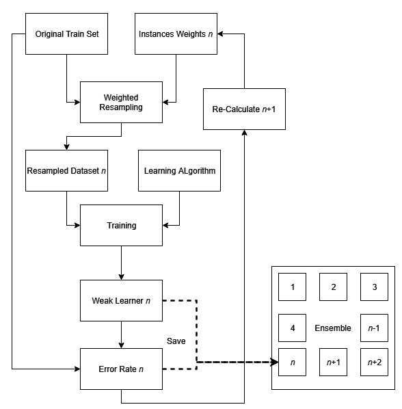

为第 n 个学习器创建集成模型的过程

本质上，这使得每个新的分类器都专注于前一个学习器无法正确处理的实例。假设是一个二分类问题，我们可以从如下图所示的数据集开始：

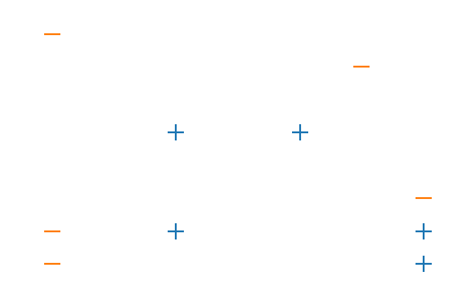

我们的初始数据集

这里，所有权重都相等。第一个决策树桩决定按如下方式划分问题空间。虚线代表决策边界。两个黑色的 **+** 和 **-** 符号表示决策树桩将每个实例分类为正类或负类的子空间。这留下了两个错误分类的实例。它们的实例权重将被增加，而其他所有权重将被减少：

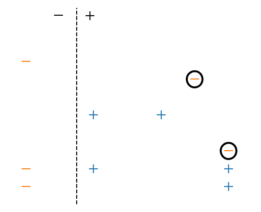

第一个决策树桩的空间划分和错误

通过创建另一个数据集，其中两个错误分类的实例占主导地位（由于我们进行有放回的采样并且它们的权重大于其他实例，它们可能会被多次包含），第二个决策树桩按如下方式划分空间：

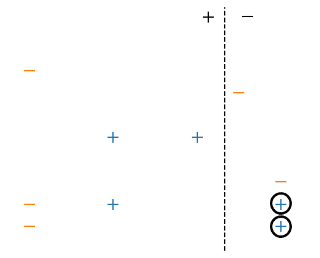

第二个决策树桩的空间划分和错误

最后，在重复第三个决策树桩的过程后，最终的集成模型按如下图所示划分了空间：

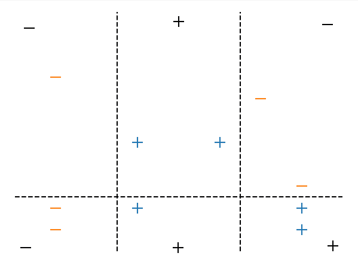

最终集成模型的空间划分

# 在 Python 中实现 AdaBoost

为了更好地理解 AdaBoost 是如何工作的，我们将展示一个基本的 Python 实现。我们将使用乳腺癌分类数据集作为示例。像往常一样，我们首先加载库和数据：

```py
# --- SECTION 1 ---
# Libraries and data loading
from copy import deepcopy
from sklearn.datasets import load_breast_cancer
from sklearn.tree import DecisionTreeClassifier
from sklearn import metrics
import numpy as np
bc = load_breast_cancer()
train_size = 400
train_x, train_y = bc.data[:train_size], bc.target[:train_size]
test_x, test_y = bc.data[train_size:], bc.target[train_size:]
np.random.seed(123456)
```

然后我们创建集成模型。首先，声明集成模型的大小和基础学习器类型。如前所述，我们使用决策树桩（决策树仅有一层）。

此外，我们为数据实例的权重、学习器的权重和学习器的错误创建了一个 NumPy 数组：

```py
# --- SECTION 2 ---
# Create the ensemble
ensemble_size = 3
base_classifier = DecisionTreeClassifier(max_depth=1)
# Create the initial weights
data_weights = np.zeros(train_size) + 1/train_size
# Create a list of indices for the train set
indices = [x for x in range(train_size)]
base_learners = []
learners_errors = np.zeros(ensemble_size)
learners_weights = np.zeros(ensemble_size)
```

对于每个基本学习器，我们将创建一个原始分类器的`deepcopy`，在一个样本数据集上训练它，并进行评估。首先，我们创建副本并根据实例的权重，从原始测试集中进行有放回的抽样：

```py

# Create each base learner
for i in range(ensemble_size):
    weak_learner = deepcopy(base_classifier)
    # Choose the samples by sampling with replacement.
    # Each instance's probability is dictated by its weight.
    data_indices = np.random.choice(indices, train_size, p=data_weights)
    sample_x, sample_y = train_x[data_indices], train_y[data_indices]
```

然后，我们在采样数据集上拟合学习器，并在原始训练集上进行预测。我们使用`predictions`来查看哪些实例被正确分类，哪些实例被误分类：

```py
    # Fit the weak learner and evaluate it
    weak_learner.fit(sample_x, sample_y)
    predictions = weak_learner.predict(train_x)
    errors = predictions != train_y
    corrects = predictions == train_y
```

在下面，权重误差被分类。`errors`和`corrects`都是布尔值列表（`True`或`False`），但 Python 将它们处理为 1 和 0。这使得我们可以与`data_weights`进行逐元素相乘。然后，学习器的误差通过加权误差的平均值计算得出：

```py

    # Calculate the weighted errors
    weighted_errors = data_weights*errors
    # The base learner's error is the average of the weighted errors
    learner_error = np.mean(weighted_errors)
    learners_errors[i] = learner_error
```

最后，学习器的权重可以通过加权准确率与加权误差的自然对数的一半来计算。接下来，我们可以使用学习器的权重来计算新的数据权重。对于误分类的实例，新权重等于旧权重乘以学习器权重的自然指数。对于正确分类的实例，则使用负倍数。最后，新的权重进行归一化，基本学习器被添加到`base_learners`列表中：

```py
    # The learner's weight
    learner_weight = np.log((1-learner_error)/learner_error)/2
    learners_weights[i] = learner_weight
    # Update the data weights
    data_weights[errors] = np.exp(data_weights[errors] * learner_weight)
    data_weights[corrects] = np.exp(-data_weights[corrects] * learner_weight)
    data_weights = data_weights/sum(data_weights)
    # Save the learner
    base_learners.append(weak_learner)
```

为了使用集成进行预测，我们通过加权多数投票将每个单独的预测结果结合起来。由于这是一个二分类问题，如果加权平均值大于`0.5`，则实例被分类为`0`；否则，它被分类为`1`：

```py
# --- SECTION 3 ---
# Evaluate the ensemble
ensemble_predictions = []
for learner, weight in zip(base_learners, learners_weights):
    # Calculate the weighted predictions
    prediction = learner.predict(test_x)
    ensemble_predictions.append(prediction*weight)
    # The final prediction is the weighted mean of the individual predictions
    ensemble_predictions = np.mean(ensemble_predictions, axis=0) >= 0.5
    ensemble_acc = metrics.accuracy_score(test_y, ensemble_predictions)

# --- SECTION 4 ---
# Print the accuracy
print('Boosting: %.2f' % ensemble_acc)
```

该集成方法最终实现的准确率为 95%。

# 优势与劣势

提升算法能够同时减少偏差和方差。长期以来，它们被认为能够免疫过拟合，但事实上，它们也有可能过拟合，尽管它们非常健壮。一种可能的解释是，基本学习器为了分类异常值，创建了非常强大且复杂的规则，这些规则很少能适应其他实例。在下面的图示中，给出了一个示例。集成方法生成了一组规则来正确分类异常值，但这些规则如此强大，以至于只有一个完全相同的例子（即，具有完全相同特征值）才能适应由规则定义的子空间：

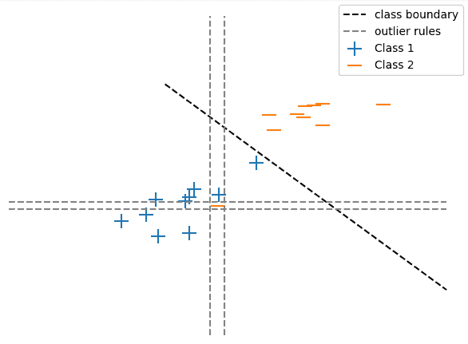

为异常值生成的规则

许多提升算法的一个缺点是它们难以并行化，因为模型是顺序生成的。此外，它们还存在集成学习技术的常见问题，例如可解释性的降低和额外的计算成本。

# 梯度提升

梯度提升是另一种提升算法。与 AdaBoost 相比，它是一个更广泛的提升框架，这也使得它更复杂且需要更多数学推导。梯度提升不是通过分配权重并重新采样数据集来强调有问题的实例，而是通过构建每个基本学习器来纠正前一个学习器的误差。此外，梯度提升使用不同深度的决策树。在这一部分，我们将介绍梯度提升，而不深入探讨其中的数学原理。相反，我们将介绍基本概念以及一个自定义的 Python 实现。

# 创建集成模型

梯度提升算法（用于回归目的）从计算训练集目标变量的均值开始，并将其作为初始预测值。然后，计算每个实例目标与预测值（均值）的差异，以便计算误差。这些误差也称为**伪残差**。

接下来，它创建一个决策树，尝试预测伪残差。通过重复这个过程若干次，整个集成模型被构建出来。类似于 AdaBoost，梯度提升为每棵树分配一个权重。与 AdaBoost 不同的是，这个权重并不依赖于树的表现，而是一个常数项，这个常数项称为**学习率**。它的目的是通过限制过拟合的能力来提高集成模型的泛化能力。算法的步骤如下：

1.  定义学习率（小于 1）和集成模型的大小。

1.  计算训练集的目标均值。

1.  使用均值作为非常简单的初始预测，计算每个实例目标与均值的差异。这些误差称为伪残差。

1.  使用原始训练集的特征和伪残差作为目标，构建决策树。

1.  使用决策树对训练集进行预测（我们尝试预测伪残差）。将预测值乘以学习率。

1.  将乘积值加到之前存储的预测值上，使用新计算的值作为新的预测。

1.  使用计算得到的预测值来计算新的伪残差。

1.  从*步骤 4*开始重复，直到达到所需的集成模型大小。

请注意，为了产生最终集成模型的预测，每个基本学习器的预测值会乘以学习率，并加到前一个学习器的预测上。计算出的均值可以视为第一个基本学习器的预测值。

在每一步 *s* 中，对于学习率 *lr*，预测值计算如下：

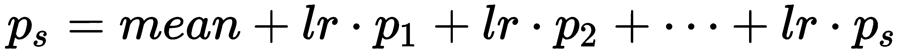

残差计算为实际目标值 *t* 与预测值的差异：

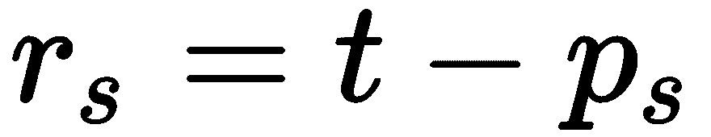

整个过程如下面的图所示：

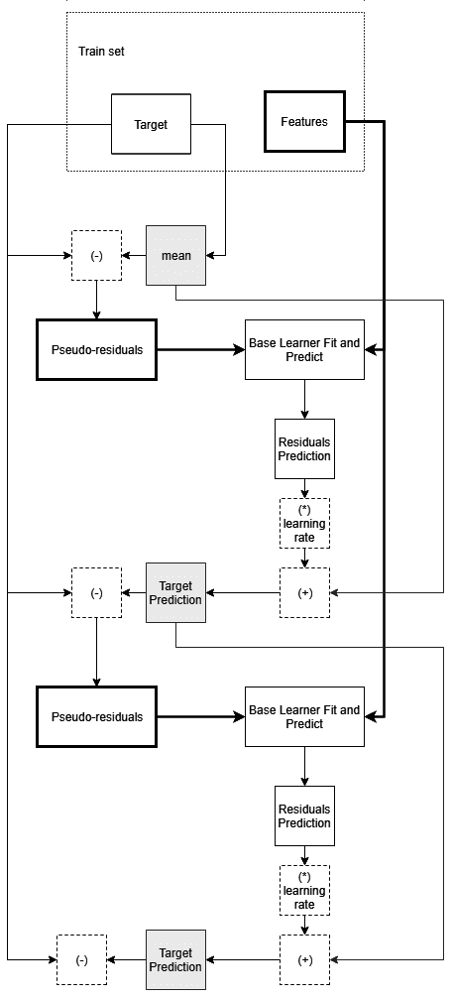

创建梯度提升集成模型的步骤

# 进一步阅读

由于这是一本实战书籍，我们不会深入探讨算法的数学方面。然而，对于数学上有兴趣的人，我们推荐以下论文。第一篇是更具体的回归框架，而第二篇则更加一般化：

+   Friedman, J.H., 2001\. 贪婪函数逼近：梯度提升机。《统计学年鉴》，pp.1189-1232。

+   Mason, L., Baxter, J., Bartlett, P.L. 和 Frean, M.R., 2000\. 提升算法作为梯度下降方法。在《神经信息处理系统进展》中（第 512-518 页）。

# 在 Python 中实现梯度提升

尽管梯度提升可能很复杂且需要数学知识，但如果我们专注于传统的回归问题，它可以变得非常简单。为了证明这一点，我们在 Python 中使用标准的 scikit-learn 决策树实现了一个自定义的例子。对于我们的实现，我们将使用糖尿病回归数据集。首先，加载库和数据，并设置 NumPy 的随机数生成器的种子：

```py

# --- SECTION 1 ---
# Libraries and data loading
from copy import deepcopy
from sklearn.datasets import load_diabetes
from sklearn.tree import DecisionTreeRegressor
from sklearn import metrics
import numpy as np
diabetes = load_diabetes()
train_size = 400
train_x, train_y = diabetes.data[:train_size], diabetes.target[:train_size]
test_x, test_y = diabetes.data[train_size:], diabetes.target[train_size:]
np.random.seed(123456)
```

接下来，我们定义集成模型的大小、学习率和决策树的最大深度。此外，我们创建一个列表来存储各个基础学习器，以及一个 NumPy 数组来存储之前的预测。

如前所述，我们的初始预测是训练集的目标均值。除了定义最大深度外，我们还可以通过将 `max_leaf_nodes=3` 参数传递给构造函数来定义最大叶节点数：

```py

# --- SECTION 2 ---
# Create the ensemble
# Define the ensemble's size, learning rate and decision tree depth
ensemble_size = 50
learning_rate = 0.1
base_classifier = DecisionTreeRegressor(max_depth=3)
# Create placeholders for the base learners and each step's prediction
base_learners = []
# Note that the initial prediction is the target variable's mean
previous_predictions = np.zeros(len(train_y)) + np.mean(train_y)
```

下一步是创建和训练集成模型。我们首先计算伪残差，使用之前的预测。然后我们创建基础学习器类的深层副本，并在训练集上使用伪残差作为目标进行训练：

```py
# Create the base learners
for _ in range(ensemble_size):
    # Start by calculating the pseudo-residuals
    errors = train_y - previous_predictions
    # Make a deep copy of the base classifier and train it on the
    # pseudo-residuals
    learner = deepcopy(base_classifier)
    learner.fit(train_x, errors)
    predictions = learner.predict(train_x) 

```

最后，我们使用训练好的基础学习器在训练集上预测伪残差。我们将预测乘以学习率，加到之前的预测上。最后，我们将基础学习器追加到 `base_learners` 列表中：

```py

    # Multiply the predictions with the learning rate and add the results
    # to the previous prediction
    previous_predictions = previous_predictions + learning_rate*predictions
    # Save the base learner
    base_learners.append(learner)
```

为了使用我们的集成模型进行预测和评估，我们使用测试集的特征来预测伪残差，将其乘以学习率，然后加到训练集的目标均值上。重要的是要使用原始训练集的均值作为起始点，因为每棵树都预测相对于那个原始均值的偏差：

```py

# --- SECTION 3 ---
# Evaluate the ensemble
# Start with the train set's mean
previous_predictions = np.zeros(len(test_y)) + np.mean(train_y)
# For each base learner predict the pseudo-residuals for the test set and
# add them to the previous prediction, 
# after multiplying with the learning rate
for learner in base_learners:
    predictions = learner.predict(test_x)
    previous_predictions = previous_predictions + learning_rate*predictions

# --- SECTION 4 ---
# Print the metrics
r2 = metrics.r2_score(test_y, previous_predictions)
mse = metrics.mean_squared_error(test_y, previous_predictions)
print('Gradient Boosting:')
print('R-squared: %.2f' % r2)
print('MSE: %.2f' % mse)
```

该算法能够通过这种特定设置实现 0.59 的 R 平方值和 2253.34 的均方误差。

# 使用 scikit-learn

尽管出于教育目的编写自己的算法很有用，但 scikit-learn 在分类和回归问题上有一些非常好的实现。在本节中，我们将介绍这些实现，并看看如何提取生成的集成模型的信息。

# 使用 AdaBoost

Scikit-learn 中的 AdaBoost 实现位于 `sklearn.ensemble` 包中的 `AdaBoostClassifier` 和 `AdaBoostRegressor` 类中。

与所有 scikit-learn 分类器一样，我们使用`fit`和`predict`函数来训练分类器并在测试集上进行预测。第一个参数是算法将使用的基本分类器。`algorithm="SAMME"`参数强制分类器使用离散提升算法。对于这个例子，我们使用手写数字识别问题：

```py
# --- SECTION 1 ---
# Libraries and data loading
import numpy as np

from sklearn.datasets import load_digits
from sklearn.tree import DecisionTreeClassifier
from sklearn.ensemble import AdaBoostClassifier
from sklearn import metrics

digits = load_digits()
train_size = 1500
train_x, train_y = digits.data[:train_size], digits.target[:train_size]
test_x, test_y = digits.data[train_size:], digits.target[train_size:]
np.random.seed(123456)

# --- SECTION 2 ---
# Create the ensemble
ensemble_size = 200
ensemble = AdaBoostClassifier(DecisionTreeClassifier(max_depth=1),
                              algorithm="SAMME",
                              n_estimators=ensemble_size)

# --- SECTION 3 ---
# Train the ensemble
ensemble.fit(train_x, train_y)

# --- SECTION 4 ---
# Evaluate the ensemble
ensemble_predictions = ensemble.predict(test_x)
ensemble_acc = metrics.accuracy_score(test_y, ensemble_predictions)

# --- SECTION 5 ---
# Print the accuracy
print('Boosting: %.2f' % ensemble_acc)
```

这导致了在测试集上准确率为 81% 的集成。使用提供的实现的一个优势是，我们可以访问并绘制每个单独的基本学习器的误差和权重。我们可以通过`ensemble.estimator_errors_`和`ensemble.estimator_weights_`分别访问它们。通过绘制权重，我们可以评估集成在哪些地方停止从额外的基本学习器中获益。通过创建一个由 1,000 个基本学习器组成的集成，我们可以看到大约从 200 个基本学习器开始，权重已经稳定。因此，再增加超过 200 个基本学习器几乎没有意义。通过事实也得到了进一步证实：1,000 个基本学习器的集成达到了 82% 的准确率，比使用 200 个基本学习器时提高了 1%。

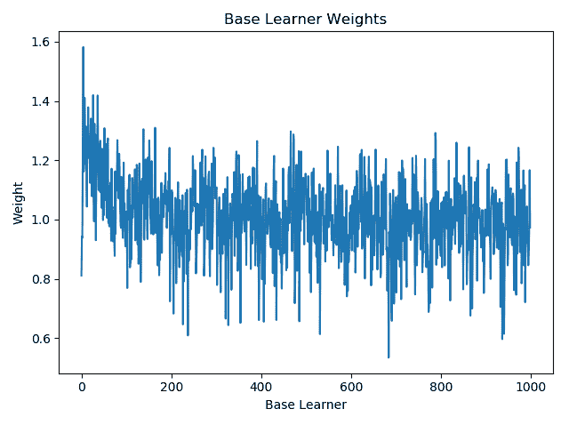

1,000 个基本学习器的集成基本学习器权重

回归实现遵循相同的原理。这里，我们在糖尿病数据集上测试该算法：

```py
# --- SECTION 1 ---
# Libraries and data loading
from copy import deepcopy
from sklearn.datasets import load_diabetes
from sklearn.ensemble import AdaBoostRegressor
from sklearn.tree import DecisionTreeRegressor
from sklearn import metrics

import numpy as np

diabetes = load_diabetes()

train_size = 400
train_x, train_y = diabetes.data[:train_size], diabetes.target[:train_size]
test_x, test_y = diabetes.data[train_size:], diabetes.target[train_size:]

np.random.seed(123456)

# --- SECTION 2 ---
# Create the ensemble
ensemble_size = 1000
ensemble = AdaBoostRegressor(n_estimators=ensemble_size)

# --- SECTION 3 ---
# Evaluate the ensemble
ensemble.fit(train_x, train_y)
predictions = ensemble.predict(test_x)

# --- SECTION 4 ---
# Print the metrics
r2 = metrics.r2_score(test_y, predictions)
mse = metrics.mean_squared_error(test_y, predictions)

print('Gradient Boosting:')
print('R-squared: %.2f' % r2)
print('MSE: %.2f' % mse)
```

集成生成的 R 平方为 0.59，均方误差（MSE）为 2256.5。通过绘制基本学习器的权重，我们可以看到算法由于预测能力的改进微不足道，在第 151 个基本学习器之后提前停止。这可以通过图中的零权重值看出。此外，通过打印`ensemble.estimators_`的长度，我们观察到它的长度仅为 151。这与我们实现中的`base_learners`列表等效：

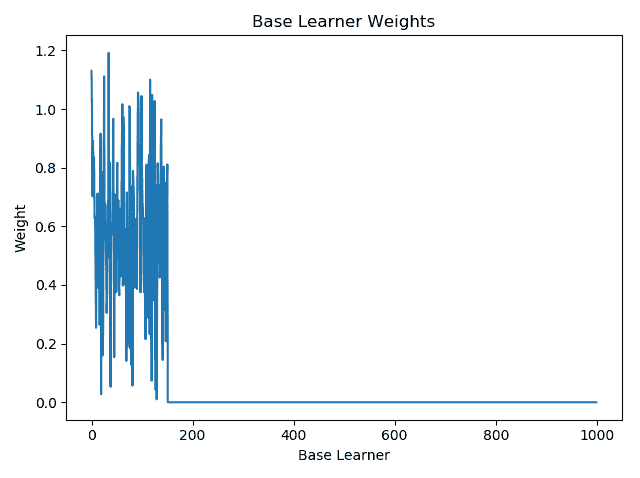

回归 Adaboost 的基本学习器权重

# 使用梯度提升

Scikit-learn 还实现了梯度提升回归和分类。这两者也被包含在`ensemble`包中，分别为`GradientBoostingRegressor`和`GradientBoostingClassifier`。这两个类在每一步存储误差，保存在对象的`train_score_`属性中。这里，我们展示了一个糖尿病回归数据集的例子。训练和验证过程遵循 scikit-learn 的标准，使用`fit`和`predict`函数。唯一需要指定的参数是学习率，它通过`learning_rate`参数传递给`GradientBoostingRegressor`构造函数：

```py
# --- SECTION 1 ---
# Libraries and data loading
from sklearn.datasets import load_diabetes
from sklearn.ensemble import GradientBoostingRegressor
from sklearn import metrics
import numpy as np
diabetes = load_diabetes()
train_size = 400
train_x, train_y = diabetes.data[:train_size], diabetes.target[:train_size]
test_x, test_y = diabetes.data[train_size:], diabetes.target[train_size:]
np.random.seed(123456)

# --- SECTION 2 ---
# Create the ensemble
ensemble_size = 200
learning_rate = 0.1
ensemble = GradientBoostingRegressor(n_estimators=ensemble_size,
 learning_rate=learning_rate)

# --- SECTION 3 ---
# Evaluate the ensemble
ensemble.fit(train_x, train_y)
predictions = ensemble.predict(test_x)

# --- SECTION 4 ---
# Print the metrics
r2 = metrics.r2_score(test_y, predictions)
mse = metrics.mean_squared_error(test_y, predictions)
print('Gradient Boosting:')
print('R-squared: %.2f' % r2)
print('MSE: %.2f' % mse)
```

集成模型达到了 0.44 的 R 平方值和 3092 的均方误差（MSE）。此外，如果我们使用 matplotlib 绘制`ensemble.train_score_`，可以看到大约在 20 个基学习器之后，收益递减现象出现。如果进一步分析误差，通过计算改进（基学习器之间的差异），我们发现，在 25 个基学习器之后，添加新的基学习器可能会导致性能下降。

尽管平均性能持续提高，但在使用 50 个基学习器后，性能没有显著改进。因此，我们重复实验，设定`ensemble_size = 50`，得到了 0.61 的 R 平方值和 2152 的均方误差（MSE）：

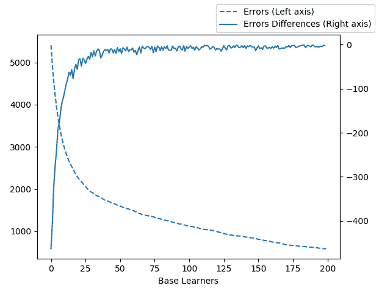

梯度提升回归的误差与差异

对于分类示例，我们使用手写数字分类数据集。同样，我们定义了`n_estimators`和`learning_rate`参数：

```py
# --- SECTION 1 ---
# Libraries and data loading
import numpy as np

from sklearn.datasets import load_digits
from sklearn.tree import DecisionTreeClassifier
from sklearn.ensemble import GradientBoostingClassifier
from sklearn import metrics

digits = load_digits()

train_size = 1500
train_x, train_y = digits.data[:train_size], digits.target[:train_size]
test_x, test_y = digits.data[train_size:], digits.target[train_size:]

np.random.seed(123456)
# --- SECTION 2 ---
# Create the ensemble
ensemble_size = 200
learning_rate = 0.1
ensemble = GradientBoostingClassifier(n_estimators=ensemble_size,
 learning_rate=learning_rate)

# --- SECTION 3 ---
# Train the ensemble
ensemble.fit(train_x, train_y)

# --- SECTION 4 ---
# Evaluate the ensemble
ensemble_predictions = ensemble.predict(test_x)

ensemble_acc = metrics.accuracy_score(test_y, ensemble_predictions)

# --- SECTION 5 ---
# Print the accuracy
print('Boosting: %.2f' % ensemble_acc)
```

使用特定集成大小达到的准确率为 89%。通过绘制误差及其差异，我们再次看到收益递减现象，但没有出现性能显著下降的情况。因此，我们不期待通过减少集成大小来提高预测性能。

# XGBoost

XGBoost 是一个支持并行、GPU 和分布式执行的提升库。它帮助许多机器学习工程师和数据科学家赢得了 Kaggle.com 的竞赛。此外，它提供了一个类似于 scikit-learn 接口的 API。因此，已经熟悉该接口的人可以快速利用这个库。此外，它允许对集成的创建进行非常精细的控制。它支持单调约束（即，预测值应当根据特定特征只增加或减少），以及特征交互约束（例如，如果一个决策树创建了一个按年龄分裂的节点，那么它不应当对该节点的所有子节点使用性别作为分裂特征）。最后，它增加了一个额外的正则化参数 gamma，进一步减少了生成集成模型的过拟合能力。相关论文为 Chen, T. 和 Guestrin, C., 2016 年 8 月，Xgboost: A scalable tree boosting system. 见《*第 22 届 ACM SIGKDD 国际知识发现与数据挖掘大会论文集*》，（第 785-794 页）。ACM。

# 使用 XGBoost 进行回归

我们将使用糖尿病数据集展示一个简单的回归示例。正如所示，其使用方法非常简单，类似于 scikit-learn 的分类器。XGBoost 通过`XGBRegressor`实现回归。该构造函数包含大量参数，并且在官方文档中有详细的说明。在我们的示例中，我们将使用`n_estimators`、`n_jobs`、`max_depth`和`learning_rate`参数。按照 scikit-learn 的约定，它们分别定义了集成的大小、并行处理的数量、树的最大深度以及学习率：

```py
# --- SECTION 1 ---
# Libraries and data loading
from sklearn.datasets import load_diabetes
from xgboost import XGBRegressor
from sklearn import metrics
import numpy as np
diabetes = load_diabetes()
train_size = 400
train_x, train_y = diabetes.data[:train_size], diabetes.target[:train_size]
test_x, test_y = diabetes.data[train_size:], diabetes.target[train_size:]
np.random.seed(123456)

# --- SECTION 2 ---
# Create the ensemble
ensemble_size = 200
ensemble = XGBRegressor(n_estimators=ensemble_size, n_jobs=4,
                        max_depth=1, learning_rate=0.1,
 objective ='reg:squarederror')
```

其余的代码评估生成的`ensemble`，与之前的任何示例类似：

```py

# --- SECTION 3 ---
# Evaluate the ensemble
ensemble.fit(train_x, train_y)
predictions = ensemble.predict(test_x)

# --- SECTION 4 ---
# Print the metrics
r2 = metrics.r2_score(test_y, predictions)
mse = metrics.mean_squared_error(test_y, predictions)
print('Gradient Boosting:')
print('R-squared: %.2f' % r2)
print('MSE: %.2f' % mse)
```

XGBoost 的 R-squared 为 0.65，MSE 为 1932.9，是我们在本章中测试和实现的所有提升方法中表现最好的。此外，我们并未对其任何参数进行微调，这进一步显示了它的建模能力。

# 使用 XGBoost 进行分类

对于分类任务，相应的类是 `XGBClassifier`。构造函数的参数与回归实现相同。以我们的示例为例，我们使用的是手写数字分类问题。我们将 `n_estimators` 参数设置为 `100`，`n_jobs` 设置为 `4`。其余的代码遵循常规模板：

```py
# --- SECTION 1 ---
# Libraries and data loading
from sklearn.datasets import load_digits
from xgboost import XGBClassifier
from sklearn import metrics
import numpy as np
digits = load_digits()
train_size = 1500
train_x, train_y = digits.data[:train_size], digits.target[:train_size]
test_x, test_y = digits.data[train_size:], digits.target[train_size:]
np.random.seed(123456)

# --- SECTION 2 ---
# Create the ensemble
ensemble_size = 100
ensemble = XGBClassifier(n_estimators=ensemble_size, n_jobs=4)

# --- SECTION 3 ---
# Train the ensemble
ensemble.fit(train_x, train_y)

# --- SECTION 4 ---
# Evaluate the ensemble
ensemble_predictions = ensemble.predict(test_x)
ensemble_acc = metrics.accuracy_score(test_y, ensemble_predictions)

# --- SECTION 5 ---
# Print the accuracy
print('Boosting: %.2f' % ensemble_acc)
```

该集成方法以 89% 的准确率正确分类了测试集，也是所有提升算法中表现最好的。

# 其他提升方法库

另外两个越来越流行的提升方法库是微软的 LightGBM 和 Yandex 的 CatBoost。在某些情况下，这两个库的性能可以与 XGBoost 相媲美（甚至超过）。尽管如此，XGBoost 在所有三者中仍然是最优秀的，无需微调和特殊的数据处理。

# 总结

本章介绍了最强大的集成学习技术之一——提升方法。我们介绍了两种流行的提升算法，AdaBoost 和梯度提升。我们提供了这两种算法的自定义实现，以及 scikit-learn 实现的使用示例。此外，我们还简要介绍了 XGBoost，这是一个专注于正则化和分布式提升的库。XGBoost 在回归和分类问题中都能超越所有其他方法和实现。

AdaBoost 通过使用弱学习器（略优于随机猜测）来创建多个基础学习器。每个新的基础学习器都在来自原始训练集的加权样本上进行训练。数据集的加权抽样为每个实例分配一个权重，然后根据这些权重从数据集中抽样，以计算每个实例被抽样的概率。

数据权重是基于前一个基础学习器的错误计算的。基础学习器的错误还用于计算学习器的权重。通过投票的方式结合基础学习器的预测结果，投票时使用每个学习器的权重。梯度提升通过训练每个新的基础学习器，使用前一次预测的错误作为目标，来构建其集成方法。初始预测是训练数据集的目标均值。与袋装方法相比，提升方法无法在相同程度上并行化。尽管提升方法对过拟合具有较强的鲁棒性，但它们仍然可能会过拟合。

在 scikit-learn 中，AdaBoost 的实现存储了各个学习器的权重，这些权重可以用来识别额外的基学习器不再对整体集成的预测能力有贡献的点。梯度提升实现在每一步（基学习器）都存储了集成的误差，这也有助于确定最佳的基学习器数量。XGBoost 是一个专注于提升（boosting）的库，具有正则化能力，进一步减少集成模型的过拟合能力。XGBoost 经常成为许多 Kaggle 竞赛中获胜的机器学习模型的一部分。
