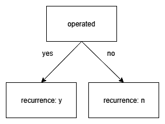
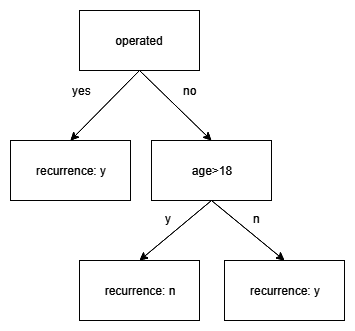
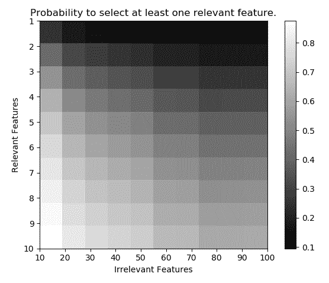
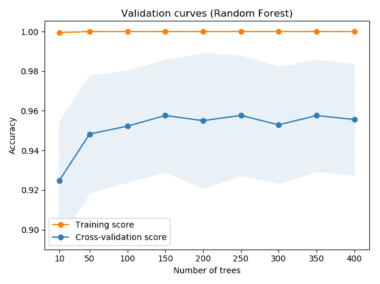
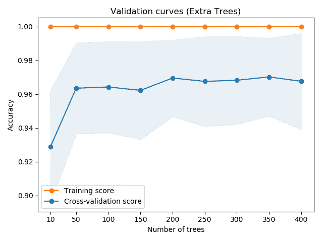

# 第七章：随机森林

Bagging 通常用于降低模型的方差。它通过创建一个基础学习器的集成，每个学习器都在原始训练集的独特自助样本上进行训练，从而实现这一目标。这迫使基础学习器之间保持多样性。随机森林在 Bagging 的基础上进行扩展，不仅在每个基础学习器的训练样本上引入随机性，还在特征选择上也引入了随机性。此外，随机森林的性能类似于提升方法，尽管它们不像提升方法那样需要进行大量的精调。

在本章中，我们将提供关于随机森林的基本背景，并讨论该方法的优缺点。最后，我们将展示使用 scikit-learn 实现的使用示例。本章涵盖的主要内容如下：

+   随机森林如何构建基础学习器

+   如何利用随机性来构建更好的随机森林集成模型

+   随机森林的优缺点

+   使用 scikit-learn 实现进行回归和分类

# 技术要求

你需要具备基本的机器学习技术和算法知识。此外，还需要了解 Python 的约定和语法。最后，熟悉 NumPy 库将极大地帮助读者理解一些自定义算法的实现。

本章的代码文件可以在 GitHub 上找到：

[`github.com/PacktPublishing/Hands-On-Ensemble-Learning-with-Python/tree/master/Chapter07`](https://github.com/PacktPublishing/Hands-On-Ensemble-Learning-with-Python/tree/master/Chapter07)

查看以下视频，查看代码的实际应用：[`bit.ly/2LY5OJR`](http://bit.ly/2LY5OJR)。

# 理解随机森林树

在本节中，我们将介绍构建基本随机森林树的方法论。虽然有其他方法可以使用，但它们的目标都是一致的：构建多样化的树，作为集成模型的基础学习器。

# 构建树

如第一章《*机器学习回顾*》所述，在每个节点选择一个特征和分割点来创建一棵树，以便最佳地划分训练集。当创建一个集成模型时，我们希望基础学习器尽可能地不相关（多样化）。

Bagging 通过引导采样使每棵树的训练集多样化，从而能够生成合理不相关的树。但 bagging 仅通过一个轴进行树的多样化：每个集合的实例。我们仍然可以在第二个轴上引入多样性，即特征。在训练过程中通过选择可用特征的子集，生成的基学习器可以更加多样化。在随机森林中，对于每棵树和每个节点，在选择最佳特征/分裂点组合时，仅考虑可用特征的一个子集。选择的特征数量可以通过手动优化，但回归问题通常选用所有特征的三分之一，而所有特征的平方根被认为是一个很好的起点。

算法的步骤如下：

1.  选择在每个节点上将要考虑的特征数量 *m*

1.  对于每个基学习器，执行以下操作：

    1.  创建引导训练样本

    1.  选择要拆分的节点

    1.  随机选择 *m* 个特征

    1.  从 *m* 中选择最佳特征和分裂点

    1.  将节点拆分为两个节点

    1.  从步骤 2-2 开始重复，直到满足停止准则，如最大树深度

# 示例说明

为了更好地展示过程，我们考虑以下数据集，表示第一次肩部脱位后是否发生了第二次肩部脱位（复发）：

| **年龄** | **手术** | **性别** | **复发** |
| --- | --- | --- | --- |
| 15 | y | m | y |
| 45 | n | f | n |
| 30 | y | m | y |
| 18 | n | m | n |
| 52 | n | f | y |

肩部脱位复发数据集

为了构建一个随机森林树，我们必须首先决定在每次分裂时将考虑的特征数量。由于我们有三个特征，我们将使用 3 的平方根，约为 1.7。通常，我们使用该数字的下取整（将其四舍五入到最接近的整数），但为了更好地展示过程，我们将使用两个特征。对于第一棵树，我们生成一个引导样本。第二行是从原始数据集中被选择了两次的实例：

| **年龄** | **手术** | **性别** | **复发** |
| --- | --- | --- | --- |
| 15 | y | m | y |
| 15 | y | m | y |
| 30 | y | m | y |
| 18 | n | m | n |
| 52 | n | f | y |

引导样本

接下来，我们创建根节点。首先，我们随机选择两个特征进行考虑。我们选择**手术**和**性别**。在**手术**特征上进行最佳分裂，结果得到一个准确率为 100%的叶子节点和一个准确率为 50%的节点。生成的树如下所示：



第一次分裂后的树

接下来，我们再次随机选择两个特征，并选择提供最佳分裂的特征。我们现在选择**手术**和**年龄**。由于两个误分类的实例均未进行手术，因此最佳分裂通过年龄特征来实现。

因此，最终的树是一个具有三个叶子节点的树，其中如果某人做了手术，他们会复发；如果他们没有做手术并且年龄超过 18 岁，则不会复发：

请注意，医学研究表明，年轻男性肩膀脱位复发的几率最高。这里的数据集是一个玩具示例，并不反映现实。



最终的决策树

# Extra Trees

创建随机森林集成中的另一种方法是 Extra Trees（极度随机化树）。与前一种方法的主要区别在于，特征和分割点的组合不需要是最优的。相反，多个分割点会被随机生成，每个可用特征生成一个。然后选择这些生成的分割点中的最佳点。该算法构造树的步骤如下：

1.  选择每个节点将要考虑的特征数*m*以及分割节点所需的最小样本数*n*

1.  对于每个基础学习器，执行以下操作：

    1.  创建一个自助法训练样本

    1.  选择要分割的节点（该节点必须至少包含*n*个样本）

    1.  随机选择*m*个特征

    1.  随机生成*m*个分割点，值介于每个特征的最小值和最大值之间

    1.  选择这些分割点中的最佳点

    1.  将节点分割成两个节点，并从步骤 2-2 开始重复，直到没有可用节点为止

# 创建森林

通过使用任何有效的随机化方法创建多棵树，我们基本上就创建了一个森林，这也是该算法名称的由来。在生成集成的树之后，必须将它们的预测结果结合起来，才能形成一个有效的集成。这通常通过分类问题的多数投票法和回归问题的平均法来实现。与随机森林相关的超参数有许多，例如每个节点分割时考虑的特征数、森林中的树木数量以及单棵树的大小。如前所述，考虑的特征数量的一个良好起始点如下：

+   对于分类问题，选择总特征数的平方根

+   对于回归问题，选择总特征数的三分之一

总树的数量可以手动微调，因为随着该数量的增加，集成的误差会收敛到一个极限。可以利用袋外误差来找到最佳值。最后，每棵树的大小可能是过拟合的决定性因素。因此，如果观察到过拟合，应减小树的大小。

# 分析森林

随机森林提供了许多其他方法无法轻易提供的关于底层数据集的信息。一个突出的例子是数据集中每个特征的重要性。估计特征重要性的一种方法是使用基尼指数计算每棵树的每个节点，并比较每个特征的累计值。另一种方法则使用袋外样本。首先，记录所有基学习器的袋外准确度。然后，选择一个特征，并在袋外样本中打乱该特征的值。这会导致袋外样本集具有与原始集相同的统计特性，但任何可能与目标相关的预测能力都会被移除（因为此时所选特征的值与目标之间的相关性为零）。通过比较原始数据集与部分随机化数据集之间的准确度差异，可以作为评估所选特征重要性的标准。

关于偏差与方差，尽管随机森林似乎能够很好地应对这两者，但它们显然并非完全免疫。当可用特征数量很大，但只有少数与目标相关时，可能会出现偏差。在使用推荐的每次划分时考虑的特征数量（例如，总特征数的平方根）时，相关特征被选中的概率可能较小。以下图表展示了作为相关特征和无关特征函数的情况下，至少选中一个相关特征的概率（当每次划分时考虑总特征数的平方根）：



选择至少一个相关特征的概率与相关特征和无关特征数量的关系

基尼指数衡量错误分类的频率，假设随机抽样的实例会根据特定节点所规定的标签分布进行分类。

方差在随机森林中也可能出现，尽管该方法对其有足够的抵抗力。通常，当允许单个树完全生长时，会出现方差。我们之前提到过，随着树木数量的增加，误差会接近某个极限。虽然这一说法依然成立，但该极限本身可能会过拟合数据。在这种情况下，限制树的大小（例如，通过增加每个叶节点的最小样本数或减少最大深度）可能会有所帮助。

# 优势与劣势

随机森林是一种非常强大的集成学习方法，能够减少偏差和方差，类似于提升方法。此外，该算法的性质使得它在训练和预测过程中都可以完全并行化。这相较于提升方法，尤其是在处理大数据集时，是一个显著的优势。此外，与提升技术（尤其是 XGBoost）相比，随机森林需要更少的超参数微调。

随机森林的主要弱点是它们对类别不平衡的敏感性，以及我们之前提到的问题，即训练集中相关特征和无关特征的比例较低。此外，当数据包含低级非线性模式（例如原始高分辨率图像识别）时，随机森林通常会被深度神经网络超越。最后，当使用非常大的数据集并且树深度没有限制时，随机森林的计算成本可能非常高。

# 使用 scikit-learn

scikit-learn 实现了传统的随机森林树和 Extra Trees。在本节中，我们将提供使用 scikit-learn 实现的两种算法的基本回归和分类示例。

# 随机森林分类

随机森林分类类在 `RandomForestClassifier` 中实现，位于 `sklearn.ensemble` 包下。它有许多参数，例如集成的大小、最大树深度、构建或拆分节点所需的样本数等。

在这个示例中，我们将尝试使用随机森林分类集成来对手写数字数据集进行分类。像往常一样，我们加载所需的类和数据，并为随机数生成器设置种子：

```py
# --- SECTION 1 ---
# Libraries and data loading
from sklearn.datasets import load_digits
from sklearn.ensemble import RandomForestClassifier
from sklearn import metrics
import numpy as np

digits = load_digits()

train_size = 1500
train_x, train_y = digits.data[:train_size], digits.target[:train_size]
test_x, test_y = digits.data[train_size:], digits.target[train_size:]

np.random.seed(123456)
```

接下来，我们通过设置 `n_estimators` 和 `n_jobs` 参数来创建集成模型。这些参数决定了将生成的树的数量和将要运行的并行作业数。我们使用 `fit` 函数训练集成，并通过测量其准确率在测试集上进行评估：

```py
# --- SECTION 2 ---
# Create the ensemble
ensemble_size = 500
ensemble = RandomForestClassifier(n_estimators=ensemble_size, n_jobs=4)

# --- SECTION 3 ---
# Train the ensemble
ensemble.fit(train_x, train_y)

# --- SECTION 4 ---
# Evaluate the ensemble
ensemble_predictions = ensemble.predict(test_x)

ensemble_acc = metrics.accuracy_score(test_y, ensemble_predictions)

# --- SECTION 5 ---
# Print the accuracy
print('Random Forest: %.2f' % ensemble_acc)
```

该分类器能够实现 93% 的准确率，甚至高于之前表现最好的方法 XGBoost（见第六章，*Boosting*）。我们可以通过绘制验证曲线（来自第二章，*Getting Started with Ensemble Learning*），来可视化我们之前提到的误差极限的近似值。我们测试了 10、50、100、150、200、250、300、350 和 400 棵树的集成大小。曲线如下图所示。我们可以看到，集成模型的 10 倍交叉验证误差接近 96%：



不同集成大小的验证曲线

# 随机森林回归

Scikit-learn 还在 `RandomForestRegressor` 类中实现了用于回归的随机森林。它也具有高度的可参数化性，具有与集成整体以及单个树相关的超参数。在这里，我们将生成一个集成模型来对糖尿病回归数据集进行建模。代码遵循加载库和数据、创建集成模型并调用 `fit` 和 `predict` 方法的标准过程，同时计算 MSE 和 R² 值：

```py
# --- SECTION 1 ---
# Libraries and data loading
from copy import deepcopy
from sklearn.datasets import load_diabetes
from sklearn.ensemble import RandomForestRegressor
from sklearn import metrics

import numpy as np

diabetes = load_diabetes()

train_size = 400
train_x, train_y = diabetes.data[:train_size], diabetes.target[:train_size]
test_x, test_y = diabetes.data[train_size:], diabetes.target[train_size:]

np.random.seed(123456)

# --- SECTION 2 ---
# Create the ensemble
ensemble_size = 100
ensemble = RandomForestRegressor(n_estimators=ensemble_size, n_jobs=4)

# --- SECTION 3 ---
# Evaluate the ensemble
ensemble.fit(train_x, train_y)
predictions = ensemble.predict(test_x)

# --- SECTION 4 ---
# Print the metrics
r2 = metrics.r2_score(test_y, predictions)
mse = metrics.mean_squared_error(test_y, predictions)

print('Random Forest:')
print('R-squared: %.2f' % r2)
print('MSE: %.2f' % mse)
```

该集成方法能够在测试集上实现 0.51 的 R 方和 2722.67 的 MSE。由于训练集上的 R 方和 MSE 分别为 0.92 和 468.13，因此可以合理推断该集成方法存在过拟合。这是一个误差限制过拟合的例子，因此我们需要调节单个树木以获得更好的结果。通过减少每个叶节点所需的最小样本数（将其从默认值 2 增加到 20）通过 `min_samples_leaf=20`，我们能够将 R 方提高到 0.6，并将 MSE 降低到 2206.6。此外，通过将集成大小增加到 1000，R 方进一步提高到 0.61，MSE 进一步降低到 2158.73。

# Extra Trees 用于分类

除了传统的随机森林，scikit-learn 还实现了 Extra Trees。分类实现位于 `ExtraTreesClassifier`，在 `sklearn.ensemble` 包中。这里，我们重复手写数字识别的例子，使用 Extra Trees 分类器：

```py

# --- SECTION 1 ---
# Libraries and data loading
from sklearn.datasets import load_digits
from sklearn.ensemble import ExtraTreesClassifier
from sklearn import metrics
import numpy as np

digits = load_digits()

train_size = 1500
train_x, train_y = digits.data[:train_size], digits.target[:train_size]
test_x, test_y = digits.data[train_size:], digits.target[train_size:]

np.random.seed(123456)
# --- SECTION 2 ---
# Create the ensemble
ensemble_size = 500
ensemble = ExtraTreesClassifier(n_estimators=ensemble_size, n_jobs=4)

# --- SECTION 3 ---
# Train the ensemble
ensemble.fit(train_x, train_y)

# --- SECTION 4 ---
# Evaluate the ensemble
ensemble_predictions = ensemble.predict(test_x)

ensemble_acc = metrics.accuracy_score(test_y, ensemble_predictions)

# --- SECTION 5 ---
# Print the accuracy
print('Extra Tree Forest: %.2f' % ensemble_acc)
```

如您所见，唯一的不同之处在于将 `RandomForestClassifier` 切换为 `ExtraTreesClassifier`。尽管如此，该集成方法仍然实现了更高的测试准确率，达到了 94%。我们再次为多个集成大小创建了验证曲线，结果如下所示。该集成方法的 10 折交叉验证误差限制大约为 97%，进一步确认了它优于传统的随机森林方法：



Extra Trees 在多个集成大小下的验证曲线

# Extra Trees 回归

最后，我们展示了 Extra Trees 的回归实现，位于 `ExtraTreesRegressor` 中。在以下代码中，我们重复之前展示的使用 Extra Trees 回归版本对糖尿病数据集建模的示例：

```py
# --- SECTION 1 ---
# Libraries and data loading
from copy import deepcopy
from sklearn.datasets import load_diabetes
from sklearn.ensemble import ExtraTreesRegressor
from sklearn import metrics

import numpy as np

diabetes = load_diabetes()

train_size = 400
train_x, train_y = diabetes.data[:train_size], diabetes.target[:train_size]
test_x, test_y = diabetes.data[train_size:], diabetes.target[train_size:]

np.random.seed(123456)

# --- SECTION 2 ---
# Create the ensemble
ensemble_size = 100
ensemble = ExtraTreesRegressor(n_estimators=ensemble_size, n_jobs=4)

# --- SECTION 3 ---
# Evaluate the ensemble
ensemble.fit(train_x, train_y)
predictions = ensemble.predict(test_x)

# --- SECTION 4 ---
# Print the metrics
r2 = metrics.r2_score(test_y, predictions)
mse = metrics.mean_squared_error(test_y, predictions)

print('Extra Trees:')
print('R-squared: %.2f' % r2)
print('MSE: %.2f' % mse)
```

与分类示例类似，Extra Trees 通过实现 0.55 的测试 R 方（比随机森林高 0.04）和 2479.18 的 MSE（差异为 243.49）来超越传统的随机森林。不过，集成方法似乎仍然出现过拟合，因为它能够完美预测样本内数据。通过设置 `min_samples_leaf=10` 和将集成大小设置为 1000，我们能够使 R 方达到 0.62，MSE 降低到 2114。

# 总结

在本章中，我们讨论了随机森林，这是一种利用决策树作为基本学习器的集成方法。我们介绍了两种构建树的基本方法：传统的随机森林方法，其中每次分裂时考虑特征的子集，以及 Extra Trees 方法，在该方法中，分裂点几乎是随机选择的。我们讨论了集成方法的基本特征。此外，我们还展示了使用 scikit-learn 实现的随机森林和 Extra Trees 的回归和分类示例。本章的关键点总结如下。

**随机森林**使用装袋技术来为其基学习器创建训练集。在每个节点，每棵树只考虑一部分可用特征，并计算最佳特征/分割点组合。每个点考虑的特征数量是一个必须调整的超参数。良好的起点如下：

+   分类问题的总参数平方根

+   回归问题的总参数的三分之一

**极端随机树**和随机森林对每个基学习器使用**整个数据集**。在极端随机树和随机森林中，每个特征子集的每个节点不再计算最佳特征/分割点组合，而是为子集中的每个特征生成一个随机分割点，并选择最佳的。随机森林可以提供关于每个特征重要性的信息。虽然相对抗过拟合，但随机森林并非免疫。当相关特征与不相关特征的比例较低时，随机森林可能表现出高偏差。随机森林可能表现出高方差，尽管集成规模并不会加剧问题。在下一章中，我们将介绍可以应用于无监督学习方法（聚类）的集成学习技术。
