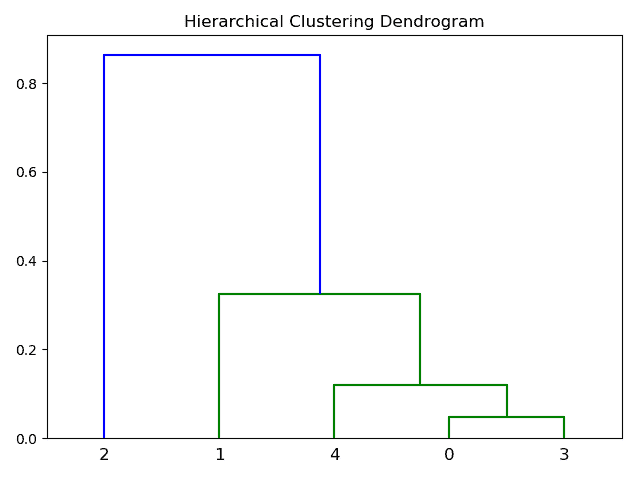
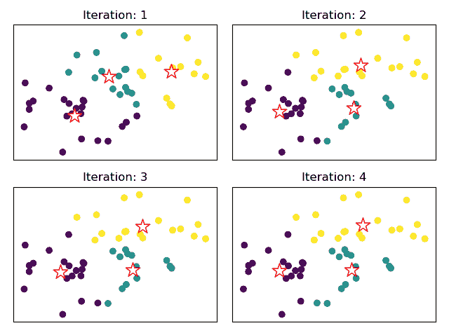
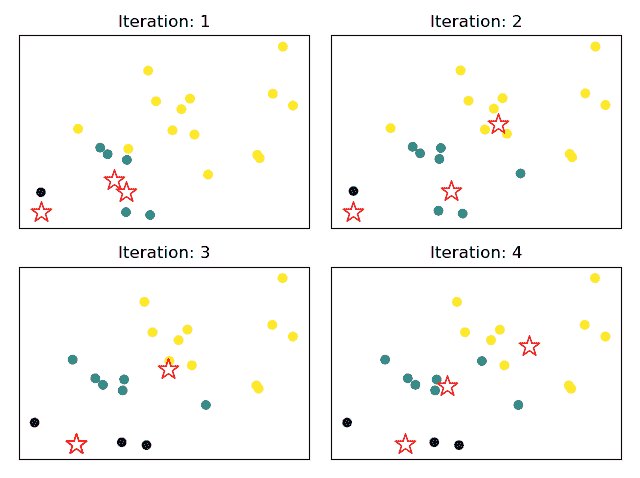
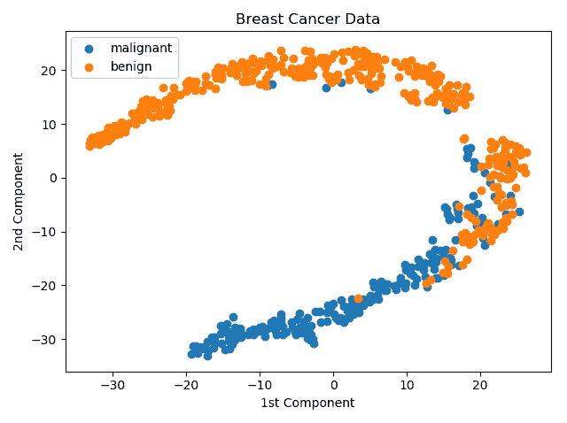
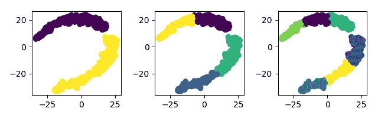
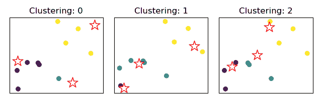
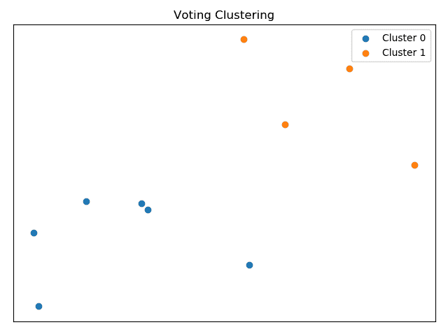

# 第八章：聚类

其中一种最广泛使用的无监督学习方法是聚类。聚类旨在揭示未标记数据中的结构。其目标是将数据实例分组，使得同一聚类中的实例之间相似度高，而不同聚类之间的实例相似度低。与有监督学习方法类似，聚类也能通过结合多个基本学习器来受益。在本章中，我们将介绍 K-means 聚类算法；这是一种简单且广泛使用的聚类算法。此外，我们还将讨论如何通过集成方法来提升该算法的性能。最后，我们将使用 OpenEnsembles，这是一个兼容 scikit-learn 的 Python 库，能够实现集成聚类。本章的主要内容如下：

+   K-means 算法的工作原理

+   优势与劣势

+   集成方法如何提升其性能

+   使用 OpenEnsembles 创建聚类集成方法

# 技术要求

你需要具备机器学习技术和算法的基础知识。此外，还需要了解 Python 的约定和语法。最后，熟悉 NumPy 库将极大帮助读者理解一些自定义算法实现。

本章的代码文件可以在 GitHub 上找到：

[`github.com/PacktPublishing/Hands-On-Ensemble-Learning-with-Python/tree/master/Chapter08`](https://github.com/PacktPublishing/Hands-On-Ensemble-Learning-with-Python/tree/master/Chapter08)

查看以下视频，了解代码的实际操作：[`bit.ly/2YYzniq`](http://bit.ly/2YYzniq)。

# 共识聚类

共识聚类是集成学习在聚类方法中应用时的别名。在聚类中，每个基本学习器都会为每个实例分配一个标签，尽管这个标签并不依赖于特定的目标。相反，基本学习器会生成多个聚类，并将每个实例分配到一个聚类中。标签就是聚类本身。如后面所示，由同一算法生成的两个基本学习器可能会生成不同的聚类。因此，将它们的聚类预测结果结合起来并不像回归或分类预测结果的结合那么直接。

# 层次聚类

层次聚类最初会根据数据集中实例的数量创建相同数量的聚类。每个聚类仅包含一个实例。之后，算法会反复找到两个距离最小的聚类（例如，欧几里得距离），并将它们合并为一个新的聚类。直到只剩下一个聚类时，过程结束。该方法的输出是一个树状图，展示了实例是如何按层次组织的。以下图示为例：



树状图示例

# K-means 聚类

K-means 是一种相对简单有效的聚类数据的方法。其主要思想是，从*K*个点开始作为初始聚类中心，然后将每个实例分配给最近的聚类中心。接着，重新计算这些中心，作为各自成员的均值。这个过程会重复，直到聚类中心不再变化。主要步骤如下：

1.  选择聚类的数量，*K*

1.  选择*K*个随机实例作为初始聚类中心

1.  将每个实例分配给最近的聚类中心

1.  重新计算聚类中心，作为每个聚类成员的均值

1.  如果新的中心与上一个不同，则返回到*步骤 3*

如下所示是一个图形示例。经过四次迭代，算法收敛：



对一个玩具数据集进行的前四次迭代。星号表示聚类中心

# 优势与劣势

K-means 是一个简单的算法，既容易理解，也容易实现。此外，它通常会比较快速地收敛，所需的计算资源较少。然而，它也有一些缺点。第一个缺点是对初始条件的敏感性。根据选择作为初始聚类中心的样本，可能需要更多的迭代才能收敛。例如，在以下图示中，我们呈现了三个初始点，它使得算法处于不利位置。事实上，在第三次迭代中，两个聚类中心恰好重合：



一个不幸的初始聚类中心的示例

因此，算法不会确定性地生成聚类。另一个主要问题是聚类的数量。这是一个需要数据分析师选择的参数。通常这个问题有三种不同的解决方案。第一种是针对一些有先验知识的问题。例如，数据集需要揭示一些已知事物的结构，比如，如何根据运动员的统计数据，找出哪些因素导致他们在一个赛季中表现的提高？在这个例子中，运动教练可能会建议，运动员的表现实际上要么大幅提升，要么保持不变，要么恶化。因此，分析师可以选择 3 作为聚类的数量。另一种可能的解决方案是通过实验不同的*K*值，并衡量每个值的适用性。这种方法不需要关于问题领域的任何先验知识，但引入了衡量每个解决方案适用性的问题。我们将在本章的其余部分看到如何解决这些问题。

# 使用 scikit-learn

scikit-learn 提供了多种可用的聚类技术。在这里，我们简要介绍如何使用 K-means 算法。该算法在 `KMeans` 类中实现，属于 `sklearn.cluster` 包。该包包含了 scikit-learn 中所有可用的聚类算法。在本章中，我们将主要使用 K-means，因为它是最直观的算法之一。此外，本章中使用的技术可以应用于几乎所有聚类算法。在本次实验中，我们将尝试对乳腺癌数据进行聚类，以探索区分恶性病例和良性病例的可能性。为了更好地可视化结果，我们将首先进行 **t-分布随机邻域嵌入**（**t-SNE**）分解，并使用二维嵌入作为特征。接下来，我们先加载所需的数据和库，并设置 NumPy 随机数生成器的种子：

你可以在 [`lvdmaaten.github.io/tsne/`](https://lvdmaaten.github.io/tsne/) 阅读更多关于 t-SNE 的内容。

```py
import matplotlib.pyplot as plt
import numpy as np

from sklearn.cluster import KMeans
from sklearn.datasets import load_breast_cancer
from sklearn.manifold import TSNE

np.random.seed(123456)

bc = load_breast_cancer()
```

接下来，我们实例化 t-SNE，并转换我们的数据。我们绘制数据，以便直观检查和审视数据结构：

```py
data = tsne.fit_transform(bc.dataa)
reds = bc.target == 0
blues = bc.target == 1
plt.scatter(data[reds, 0], data[reds, 1], label='malignant')
plt.scatter(data[blues, 0], data[blues, 1], label='benign')
plt.xlabel('1st Component')
plt.ylabel('2nd Component')
plt.title('Breast Cancer dataa')
plt.legend()
```

上述代码生成了以下图表。我们观察到两个不同的区域。蓝色点所代表的区域表示嵌入值，暗示着肿瘤是恶性的风险较高：



乳腺癌数据的两个嵌入（成分）图

由于我们已经识别出数据中存在某些结构，因此我们将尝试使用 K-means 聚类来进行建模。直觉上，我们假设两个簇就足够了，因为我们试图分离两个不同的区域，并且我们知道数据集有两个类别。尽管如此，我们还将尝试使用四个和六个簇，因为它们可能能提供更多的数据洞察。我们将通过衡量每个类别在每个簇中的分布比例来评估簇的质量。为此，我们通过填充 `classified` 字典来实现。每个键对应一个簇。每个键还指向一个二级字典，记录了特定簇中恶性和良性病例的数量。此外，我们还会绘制簇分配图，因为我们想看到数据在簇之间的分布情况：

```py
plt.figure()
plt.title('2, 4, and 6 clusters.')
for clusters in [2, 4, 6]:
 km = KMeans(n_clusters=clusters)
 preds = km.fit_predict(data)
 plt.subplot(1, 3, clusters/2)
 plt.scatter(*zip(*data), c=preds)

classified = {x: {'m': 0, 'b': 0} for x in range(clusters)}

for i in range(len(data)):
 cluster = preds[i]
 label = bc.target[i]
 label = 'm' if label == 0 else 'b'
 classified[cluster][label] = classified[cluster][label]+1

print('-'*40)
for c in classified:
 print('Cluster %d. Malignant percentage: ' % c, end=' ')
 print(classified[c], end=' ')
 print('%.3f' % (classified[c]['m'] /
 (classified[c]['m'] + classified[c]['b']))) 
```

结果显示在下表和图中：

| **簇** | **恶性** | **良性** | **恶性百分比** |
| --- | --- | --- | --- |
| **2 个簇** |  |  |  |
| **0** | 206 | 97 | 0.68 |
| **1** | 6 | 260 | 0.023 |
| **4 个簇** |  |  |  |
| **0** | 2 | 124 | 0.016 |
| **1** | 134 | 1 | 0.993 |
| **2** | 72 | 96 | 0.429 |
| **3** | 4 | 136 | 0.029 |
| **6 个簇** |  |  |  |
| **0** | 2 | 94 | 0.021 |
| **1** | 81 | 10 | 0.89 |
| **2** | 4 | 88 | 0.043 |
| **3** | 36 | 87 | 0.0293 |
| **4** | 0 | 78 | 0 |
| **5** | 89 | 0 | 1 |

恶性和良性病例在簇中的分布

我们观察到，尽管算法没有关于标签的信息，它仍然能够相当有效地分离属于每个类别的实例：



每个实例的簇分配；2、4 和 6 个簇

此外，我们看到，随着簇数的增加，分配到恶性或良性簇的实例数量没有增加，但这些区域的分离性更强。这使得粒度更细，可以更准确地预测所选实例属于哪个类别的概率。如果我们在不转换数据的情况下重复实验，得到以下结果：

| **簇** | **恶性** | **良性** | **恶性百分比** |
| --- | --- | --- | --- |
| **2 个簇** |  |  |  |
| **0** | 82 | 356 | 0.187 |
| **1** | 130 | 1 | 0.992 |
| **4 个簇** |  |  |  |
| **0** | 6 | 262 | 0.022 |
| **1** | 100 | 1 | 0.99 |
| **2** | 19 | 0 | 1 |
| **3** | 87 | 94 | 0.481 |
| **6 个簇** |  |  |  |
| **0** | 37 | 145 | 0.203 |
| **1** | 37 | 0 | 1 |
| **2** | 11 | 0 | 1 |
| **3** | 62 | 9 | 0.873 |
| **4** | 5 | 203 | 0.024 |
| **5** | 60 | 0 | 1 |

没有 t-SNE 转换的数据聚类结果

还有两种度量可以用来确定聚类质量。对于已知真实标签的数据（本质上是有标签的数据），同质性度量每个簇中由单一类别主导的比例。对于没有已知真实标签的数据，轮廓系数度量簇内的凝聚力和簇间的可分离性。这些度量在 scikit-learn 的 `metrics` 包中由 `silhouette_score` 和 `homogeneity_score` 函数实现。每种方法的两个度量如以下表格所示。同质性对于转换后的数据较高，但轮廓系数较低。

这是预期的，因为转换后的数据只有两个维度，因此实例之间的可能距离变小：

| **度量** | **簇** | **原始数据** | **转换后的数据** |
| --- | --- | --- | --- |
| **同质性** | 2 | 0.422 | 0.418 |
| 4 | 0.575 | 0.603 |  |
| 6 | 0.620 | 0.648 |  |
| **轮廓系数** | 2 | 0.697 | 0.500 |
| 4 | 0.533 | 0.577 |  |
| 6 | 0.481 | 0.555 |  |

原始数据和转换数据的同质性与轮廓系数

# 使用投票

投票可以用来结合同一数据集的不同聚类结果。这类似于监督学习中的投票，每个模型（基础学习器）通过投票对最终结果做出贡献。在此出现了一个问题：如何链接来自两个不同聚类的簇。由于每个模型会生成不同的簇和不同的中心，我们需要将来自不同模型的相似簇链接起来。通过将共享最多实例的簇链接在一起，可以实现这一点。例如，假设对于某个特定数据集，发生了以下的聚类表格和图形：



三种不同的聚类结果

下表展示了每个实例在三种不同聚类中的簇分配情况。

| **实例** | **1** | **2** | **3** | **4** | **5** | **6** | **7** | **8** | **9** | **10** |
| --- | --- | --- | --- | --- | --- | --- | --- | --- | --- | --- |
| **聚类 1** | 0 | 0 | 2 | 2 | 2 | 0 | 0 | 1 | 0 | 2 |
| **聚类 2** | 1 | 1 | 2 | 2 | 2 | 1 | 0 | 1 | 1 | 2 |
| **聚类 3** | 0 | 0 | 2 | 2 | 2 | 1 | 0 | 1 | 1 | 2 |

每个实例的簇成员资格

使用之前的映射，我们可以计算每个实例的共现矩阵。该矩阵表示一对实例被分配到同一个簇的次数：

| **实例** | **1** | **2** | **3** | **4** | **5** | **6** | **7** | **8** | **9** | **10** |
| --- | --- | --- | --- | --- | --- | --- | --- | --- | --- | --- |
| **1** | 3 | 3 | 0 | 0 | 0 | 2 | 2 | 1 | 2 | 0 |
| **2** | 3 | 3 | 0 | 0 | 0 | 2 | 2 | 1 | 2 | 0 |
| **3** | 0 | 0 | 3 | 3 | 3 | 0 | 0 | 0 | 0 | 3 |
| **4** | 0 | 0 | 3 | 3 | 3 | 0 | 0 | 0 | 0 | 3 |
| **5** | 0 | 0 | 3 | 3 | 3 | 0 | 0 | 0 | 0 | 3 |
| **6** | 2 | 2 | 0 | 0 | 0 | 3 | 1 | 0 | 3 | 0 |
| **7** | 2 | 2 | 0 | 0 | 0 | 1 | 3 | 0 | 1 | 0 |
| **8** | 1 | 1 | 0 | 0 | 0 | 0 | 0 | 3 | 2 | 0 |
| **9** | 2 | 2 | 0 | 0 | 0 | 3 | 1 | 2 | 3 | 0 |
| **10** | 0 | 0 | 3 | 3 | 3 | 0 | 0 | 0 | 0 | 3 |

上述示例的共现矩阵

通过将每个元素除以基础学习器的数量，并将值大于 0.5 的样本聚集在一起，我们得到了以下的簇分配：

| **实例** | **1** | **2** | **3** | **4** | **5** | **6** | **7** | **8** | **9** | **10** |
| --- | --- | --- | --- | --- | --- | --- | --- | --- | --- | --- |
| **投票聚类** | 0 | 0 | 1 | 1 | 1 | 0 | 0 | 0 | 0 | 1 |

投票聚类成员资格

如所示，聚类结果更为稳定。进一步观察可以发现，两个簇对于这个数据集来说是足够的。通过绘制数据及其簇成员资格，我们可以看到有两个明显的组别，这正是投票集成所能建模的，尽管每个基础学习器生成了三个不同的聚类中心：



投票集成的最终簇成员资格

# 使用 OpenEnsembles

OpenEnsembles 是一个专注于聚类集成方法的 Python 库。在本节中，我们将展示如何使用它并利用它对我们的示例数据集进行聚类。为了安装该库，必须在终端执行 `pip install openensembles` 命令。尽管它依赖于 scikit-learn，但其接口不同。一个主要的区别是数据必须作为 `data` 类传递，该类由 OpenEnsembles 实现。构造函数有两个输入参数：一个包含数据的 pandas `DataFrame` 和一个包含特征名称的列表：

```py
# --- SECTION 1 ---
# Libraries and data loading
import openensembles as oe
import pandas as pd
import sklearn.metrics

from sklearn.datasets import load_breast_cancer

bc = load_breast_cancer()

# --- SECTION 2 ---
# Create the data object
cluster_data = oe.data(pd.DataFrame(bc.data), bc.feature_names)
```

为了创建一个`cluster`集成，创建一个`cluster`类对象，并将数据作为参数传入：

```py
ensemble = oe.cluster(cluster_data)
```

在这个例子中，我们将计算多个*K*值和集成大小的同质性得分。为了将一个基学习器添加到集成中，必须调用`cluster`类的`cluster`方法。该方法接受以下参数：`source_name`，表示源数据矩阵的名称，`algorithm`，决定基学习器将使用的算法，`output_name`，将作为字典键来访问特定基学习器的结果，和`K`，表示特定基学习器的簇数。最后，为了通过多数投票计算最终的簇成员，必须调用`finish_majority_vote`方法。唯一必须指定的参数是`threshold`值：

```py
# --- SECTION 3 ---
# Create the ensembles and calculate the homogeneity score
for K in [2, 3, 4, 5, 6, 7]:
 for ensemble_size in [3, 4, 5]:
 ensemble = oe.cluster(cluster_data)
 for i in range(ensemble_size):
 name = f'kmeans_{ensemble_size}_{i}'
 ensemble.cluster('parent', 'kmeans', name, K)

preds = ensemble.finish_majority_vote(threshold=0.5)
print(f'K: {K}, size {ensemble_size}:', end=' ')
print('%.2f' % sklearn.metrics.homogeneity_score(
 bc.target, preds.labels['majority_vote']))
```

显然，五个簇对于所有三种集成大小来说都产生了最佳结果。结果总结如下表所示：

| **K** | **大小** | **同质性** |
| --- | --- | --- |
| 2 | 3 | 0.42 |
| 2 | 4 | 0.42 |
| 2 | 5 | 0.42 |
| 3 | 3 | 0.45 |
| 3 | 4 | 0.47 |
| 3 | 5 | 0.47 |
| 4 | 3 | 0.58 |
| 4 | 4 | 0.58 |
| 4 | 5 | 0.58 |
| 5 | 3 | 0.6 |
| 5 | 4 | 0.61 |
| 5 | 5 | 0.6 |
| 6 | 3 | 0.35 |
| 6 | 4 | 0.47 |
| 6 | 5 | 0.35 |
| 7 | 3 | 0.27 |
| 7 | 4 | 0.63 |
| 7 | 5 | 0.37 |

OpenEnsembles 胸癌数据集的多数投票簇同质性

如果我们将数据转换为两个 t-SNE 嵌入，并重复实验，则得到以下同质性得分：

| **K** | **大小** | **同质性** |
| --- | --- | --- |
| 2 | 3 | 0.42 |
| 2 | 4 | 0.42 |
| 2 | 5 | 0.42 |
| 3 | 3 | 0.59 |
| 3 | 4 | 0.59 |
| 3 | 5 | 0.59 |
| 4 | 3 | 0.61 |
| 4 | 4 | 0.61 |
| 4 | 5 | 0.61 |
| 5 | 3 | 0.61 |
| 5 | 4 | 0.61 |
| 5 | 5 | 0.61 |
| 6 | 3 | 0.65 |
| 6 | 4 | 0.65 |
| 6 | 5 | 0.65 |
| 7 | 3 | 0.66 |
| 7 | 4 | 0.66 |
| 7 | 5 | 0.66 |

转换后的胸癌数据集的多数投票簇同质性

# 使用图闭合和共现链路

还有两种可以用来组合簇结果的方法，分别是图闭合和共现链路。这里，我们展示了如何使用 OpenEnsembles 创建这两种类型的集成。

# 图闭合

图闭包通过共现矩阵创建图形。每个元素（实例对）都被视为一个节点。具有大于阈值的对将通过边连接。接下来，根据指定的大小（由团内节点的数量指定），会发生团的形成。团是图的节点的子集，每两个节点之间都有边连接。最后，团会组合成独特的聚类。在 OpenEnsembles 中，它通过`finish_graph_closure`函数在`cluster`类中实现。`clique_size`参数确定每个团中的节点数量。`threshold`参数确定一对实例必须具有的最小共现值，以便通过图中的边连接。与之前的示例类似，我们将使用图闭包来对乳腺癌数据集进行聚类。请注意，代码中唯一的变化是使用`finish_graph_closure`，而不是`finish_majority_vote`。首先，我们加载库和数据集，并创建 OpenEnsembles 数据对象：

```py
# --- SECTION 1 ---
# Libraries and data loading
import openensembles as oe
import pandas as pd
import sklearn.metrics

from sklearn.datasets import load_breast_cancer

bc = load_breast_cancer()

# --- SECTION 2 ---
# Create the data object
cluster_data = oe.data(pd.DataFrame(bc.data), bc.feature_names)
```

然后，我们创建集成并使用`graph_closure`来组合聚类结果。请注意，字典的键也更改为`'graph_closure'`：

```py
# --- SECTION 3 ---
# Create the ensembles and calculate the homogeneity score
for K in [2, 3, 4, 5, 6, 7]:
 for ensemble_size in [3, 4, 5]:
 ensemble = oe.cluster(cluster_data)
 for i in range(ensemble_size):
 name = f'kmeans_{ensemble_size}_{i}'
 ensemble.cluster('parent', 'kmeans', name, K)

preds = ensemble.finish_majority_vote(threshold=0.5)
print(f'K: {K}, size {ensemble_size}:', end=' ')
print('%.2f' % sklearn.metrics.homogeneity_score(
 bc.target, preds.labels['majority_vote']))
```

*K*和集成大小对聚类质量的影响类似于多数投票，尽管它没有达到相同的性能水平。结果如以下表所示：

| **K** | **大小** | **同质性** |
| --- | --- | --- |
| 2 | 3 | 0.42 |
| 2 | 4 | 0.42 |
| 2 | 5 | 0.42 |
| 3 | 3 | 0.47 |
| 3 | 4 | 0 |
| 3 | 5 | 0.47 |
| 4 | 3 | 0.58 |
| 4 | 4 | 0.58 |
| 4 | 5 | 0.58 |
| 5 | 3 | 0.6 |
| 5 | 4 | 0.5 |
| 5 | 5 | 0.5 |
| 6 | 3 | 0.6 |
| 6 | 4 | 0.03 |
| 6 | 5 | 0.62 |
| 7 | 3 | 0.63 |
| 7 | 4 | 0.27 |
| 7 | 5 | 0.27 |

图闭包聚类在原始乳腺癌数据上的同质性

# 共现矩阵连接

共现矩阵连接将共现矩阵视为实例之间的距离矩阵，并利用这些距离执行层次聚类。当矩阵中没有元素的值大于阈值时，聚类过程停止。再次，我们重复示例。我们使用`finish_co_occ_linkage`函数，利用`threshold=0.5`执行共现矩阵连接，并使用`'co_occ_linkage'`键来访问结果：

```py
# --- SECTION 1 ---
# Libraries and data loading
import openensembles as oe
import pandas as pd
import sklearn.metrics

from sklearn.datasets import load_breast_cancer

bc = load_breast_cancer()

# --- SECTION 2 ---
# Create the data object
cluster_data = oe.data(pd.DataFrame(bc.data), bc.feature_names)

# --- SECTION 3 ---
# Create the ensembles and calculate the homogeneity score
for K in [2, 3, 4, 5, 6, 7]:
 for ensemble_size in [3, 4, 5]:
  ensemble = oe.cluster(cluster_data)
  for i in range(ensemble_size):
  name = f'kmeans_{ensemble_size}_{i}'
  ensemble.cluster('parent', 'kmeans', name, K)
  preds = ensemble.finish_co_occ_linkage(threshold=0.5)
  print(f'K: {K}, size {ensemble_size}:', end=' ')
  print('%.2f' % sklearn.metrics.homogeneity_score(
        bc.target, preds.labels['co_occ_linkage']))
```

以下表总结了结果。请注意，它优于其他两种方法。此外，结果更加稳定，并且所需执行时间比其他两种方法少：

| **K** | **大小** | **同质性** |
| --- | --- | --- |
| 2 | 3 | 0.42 |
| 2 | 4 | 0.42 |
| 2 | 5 | 0.42 |
| 3 | 3 | 0.47 |
| 3 | 4 | 0.47 |
| 3 | 5 | 0.45 |
| 4 | 3 | 0.58 |
| 4 | 4 | 0.58 |
| 4 | 5 | 0.58 |
| 5 | 3 | 0.6 |
| 5 | 4 | 0.6 |
| 5 | 5 | 0.6 |
| 6 | 3 | 0.59 |
| 6 | 4 | 0.62 |
| 6 | 5 | 0.62 |
| 7 | 3 | 0.62 |
| 7 | 4 | 0.63 |
| 7 | 5 | 0.63 |

原始乳腺癌数据集上共现聚类连接的同质性结果

# 小结

本章介绍了 K-means 聚类算法和聚类集成方法。我们解释了如何使用多数投票方法来结合集成中的聚类分配，并如何使其超越单个基础学习器。此外，我们还介绍了专门用于聚类集成的 OpenEnsembles Python 库。本章可以总结如下。

**K-means** 创建 *K* 个聚类，并通过迭代地将每个实例分配到各个聚类中，使得每个聚类的中心成为其成员的均值。它对初始条件和选定的聚类数目敏感。多数投票可以帮助克服该算法的缺点。**多数投票** 将具有高共现的实例聚集在一起。**共现矩阵** 显示了一对实例被同一基础学习器分配到同一聚类的频率。**图闭包** 使用共现矩阵来创建图，并基于团簇对数据进行聚类。**共现连接** 使用一种特定的聚类算法——层次聚类（聚合型），将共现矩阵视为成对距离矩阵。在下一章中，我们将尝试利用本书中介绍的所有集成学习技术，以对欺诈信用卡交易进行分类。
