# 第九章：分类欺诈交易

在本章中，我们将尝试对 2013 年 9 月期间发生的欧洲信用卡持有者的信用卡交易数据集进行欺诈交易分类。该数据集的主要问题是，欺诈交易的数量非常少，相比数据集的规模几乎可以忽略不计。这类数据集被称为不平衡数据集，因为每个标签的百分比不相等。我们将尝试创建能够分类我们特定数据集的集成方法，该数据集包含极少数的欺诈交易。

本章将涵盖以下主题：

+   熟悉数据集

+   探索性分析

+   投票法

+   堆叠

+   自助法

+   提升法

+   使用随机森林

+   集成方法的比较分析

# 技术要求

你需要具备机器学习技术和算法的基础知识。此外，还需要了解 Python 的约定和语法。最后，熟悉 NumPy 库将有助于读者理解一些自定义算法的实现。

本章的代码文件可以在 GitHub 上找到：

[`github.com/PacktPublishing/Hands-On-Ensemble-Learning-with-Python/tree/master/Chapter09`](https://github.com/PacktPublishing/Hands-On-Ensemble-Learning-with-Python/tree/master/Chapter09)

请查看以下视频，了解代码的实际应用：[`bit.ly/2ShwarF`](http://bit.ly/2ShwarF)[.](http://bit.ly/2ShwarF)

# 熟悉数据集

该数据集最初在 Andrea Dal Pozzolo 的博士论文《[用于信用卡欺诈检测的自适应机器学习](http://di.ulb.ac.be/map/adalpozz/pdf/Dalpozzolo2015PhD.pdf)》中使用，现已由其作者公开发布供公众使用（[www.ulb.ac.be/di/map/adalpozz/data/creditcard.Rdata](http://www.ulb.ac.be/di/map/adalpozz/data/creditcard.Rdata)）。该数据集包含超过 284,000 个实例，但其中只有 492 个欺诈实例（几乎为 0.17%）。

目标类别值为 0 时表示交易不是欺诈，1 时表示交易是欺诈。该数据集的特征是一些主成分，因为数据集已通过**主成分分析**（**PCA**）进行转化，以保留数据的机密性。数据集的特征包含 28 个 PCA 组件，以及交易金额和从数据集中的第一次交易到当前交易的时间。以下是数据集的描述性统计：

| **特征** | **时间** | **V1** | **V2** | **V3** | **V4** |
| --- | --- | --- | --- | --- | --- |
| **计数** | 284,807 | 284,807 | 284,807 | 284,807 | 284,807 |
| **均值** | 94,813.86 | 1.17E-15 | 3.42E-16 | -1.37E-15 | 2.09E-15 |
| **标准差** | 47,488.15 | 1.96 | 1.65 | 1.52 | 1.42 |
| **最小值** | 0.00 | -56.41 | -72.72 | -48.33 | -5.68 |
| **最大值** | 172,792.00 | 2.45 | 22.06 | 9.38 | 16.88 |
| **特征** | **V5** | **V6** | **V7** | **V8** | **V9** |
| **计数** | 284,807 | 284,807 | 284,807 | 284,807 | 284,807 |
| **均值** | 9.60E-16 | 1.49E-15 | -5.56E-16 | 1.18E-16 | -2.41E-15 |
| **标准差** | 1.38 | 1.33 | 1.24 | 1.19 | 1.10 |
| **最小值** | -113.74 | -26.16 | -43.56 | -73.22 | -13.43 |
| **最大值** | 34.80 | 73.30 | 120.59 | 20.01 | 15.59 |
| **特征** | **V10** | **V11** | **V12** | **V13** | **V14** |
| **计数** | 284,807 | 284,807 | 284,807 | 284,807 | 284,807 |
| **均值** | 2.24E-15 | 1.67E-15 | -1.25E-15 | 8.18E-16 | 1.21E-15 |
| **标准差** | 1.09 | 1.02 | 1.00 | 1.00 | 0.96 |
| **最小值** | -24.59 | -4.80 | -18.68 | -5.79 | -19.21 |
| **最大值** | 23.75 | 12.02 | 7.85 | 7.13 | 10.53 |
| **特征** | **V15** | **V16** | **V17** | **V18** | **V19** |
| **计数** | 284,807 | 284,807 | 284,807 | 284,807 | 284,807 |
| **均值** | 4.91E-15 | 1.44E-15 | -3.80E-16 | 9.57E-16 | 1.04E-15 |
| **标准差** | 0.92 | 0.88 | 0.85 | 0.84 | 0.81 |
| **最小值** | -4.50 | -14.13 | -25.16 | -9.50 | -7.21 |
| **最大值** | 8.88 | 17.32 | 9.25 | 5.04 | 5.59 |
| **特征** | **V20** | **V21** | **V22** | **V23** | **V24** |
| **计数** | 284,807 | 284,807 | 284,807 | 284,807 | 284,807 |
| **均值** | 6.41E-16 | 1.66E-16 | -3.44E-16 | 2.58E-16 | 4.47E-15 |
| **标准差** | 0.77 | 0.73 | 0.73 | 0.62 | 0.61 |
| **最小值** | -54.50 | -34.83 | -10.93 | -44.81 | -2.84 |
| **最大值** | 39.42 | 27.20 | 10.50 | 22.53 | 4.58 |
| **特征** | **V25** | **V26** | **V27** | **V28** | **金额** |
| **计数** | 284,807 | 284,807 | 284,807 | 284,807 | 284,807 |
| **均值** | 5.34E-16 | 1.69E-15 | -3.67E-16 | -1.22E-16 | 88.34962 |
| **标准差** | 0.52 | 0.48 | 0.40 | 0.33 | 250.12 |
| **最小值** | -10.30 | -2.60 | -22.57 | -15.43 | 0.00 |
| **最大值** | 7.52 | 3.52 | 31.61 | 33.85 | 25,691.16 |

信用卡交易数据集的描述性统计

# 探索性分析

数据集的一个重要特点是没有缺失值，这一点可以从计数统计中看出。所有特征都有相同数量的值。另一个重要方面是大多数特征已经进行了归一化处理。这是因为数据应用了 PCA（主成分分析）。PCA 在将数据分解为主成分之前会先进行归一化处理。唯一两个没有进行归一化的特征是**时间**和**金额**。以下是每个特征的直方图：

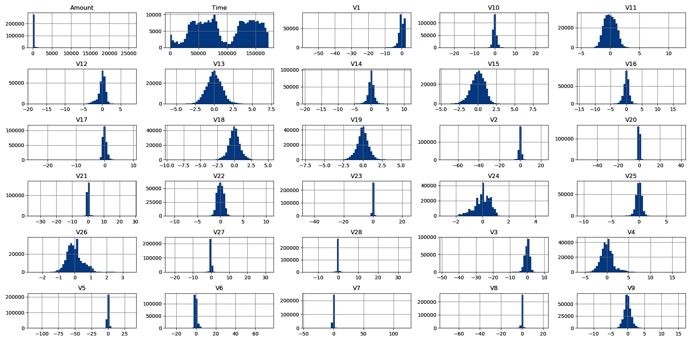

数据集特征的直方图

通过更加细致地观察每笔交易的**时间**和**金额**，我们发现，在第一次交易后的 75,000 秒到 125,000 秒之间，交易频率出现了突然下降（大约 13 小时）。这很可能是由于日常时间周期（例如，夜间大多数商店关闭）。每笔交易金额的直方图如下所示，采用对数尺度。可以明显看出，大部分交易金额较小，平均值接近 88.00 欧元：

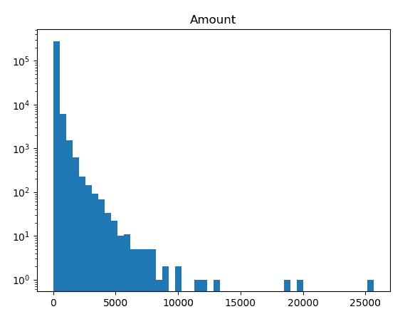

金额直方图，对数尺度的*y*-轴

为了避免特征之间的权重分布不均问题，我们将对**金额**和**时间**这两个特征进行标准化。比如使用距离度量的算法（如 K 最近邻算法）在特征未正确缩放时，性能可能会下降。以下是标准化特征的直方图。请注意，标准化将变量转换为均值接近 0，标准差为 1：

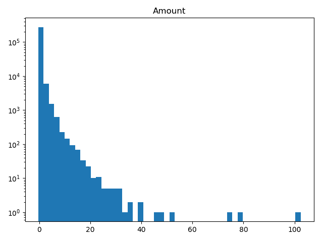

标准化金额直方图

以下图表显示了标准化时间的直方图。我们可以看到，它并未影响夜间交易量的下降：

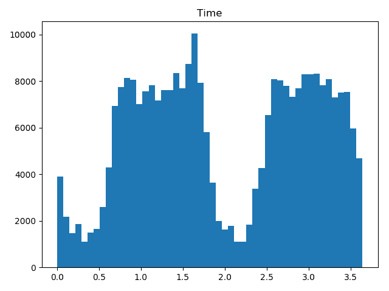

标准化时间直方图

# 评估方法

由于我们的数据集高度倾斜（即具有较高的类别不平衡），我们不能仅仅通过准确率来评估模型的表现。因为如果将所有实例都分类为非欺诈行为，我们的准确率可以达到 99.82%。显然，这个数字并不代表一个可接受的表现，因为我们根本无法检测到任何欺诈交易。因此，为了评估我们的模型，我们将使用召回率（即我们检测到的欺诈行为的百分比）和 F1 得分，后者是召回率和精确度的加权平均值（精确度衡量的是预测为欺诈的交易中，实际为欺诈的比例）。

# 投票

在这一部分，我们将尝试通过使用投票集成方法来对数据集进行分类。对于我们的初步集成方法，我们将利用朴素贝叶斯分类器、逻辑回归和决策树。这个过程将分为两部分，首先测试每个基础学习器本身，然后将这些基础学习器组合成一个集成模型。

# 测试基础学习器

为了测试基础学习器，我们将单独对基础学习器进行基准测试，这将帮助我们评估它们单独表现的好坏。为此，首先加载库和数据集，然后将数据划分为 70%的训练集和 30%的测试集。我们使用`pandas`来轻松导入 CSV 文件。我们的目标是在训练和评估整个集成模型之前，先训练和评估每个单独的基础学习器：

```py
# --- SECTION 1 ---
# Libraries and data loading
import numpy as np
import pandas as pd

from sklearn.tree import DecisionTreeClassifier
from sklearn.linear_model import LogisticRegression
from sklearn.naive_bayes import GaussianNB
from sklearn.model_selection import train_test_split
from sklearn import metrics

np.random.seed(123456)
data = pd.read_csv('creditcard.csv')
data.Time = (data.Time-data.Time.min())/data.Time.std()
data.Amount = (data.Amount-data.Amount.mean())/data.Amount.std()

# Train-Test slpit of 70%-30%
x_train, x_test, y_train, y_test = train_test_split(
data.drop('Class', axis=1).values, data.Class.values, test_size=0.3)
```

在加载库和数据后，我们训练每个分类器，并打印出来自`sklearn.metrics`包的必要指标。F1 得分通过`f1_score`函数实现，召回率通过`recall_score`函数实现。为了避免过拟合，决策树的最大深度被限制为三（`max_depth=3`）：

```py
# --- SECTION 2 ---
# Base learners evaluation
base_classifiers = [('DT', DecisionTreeClassifier(max_depth=3)),
                    ('NB', GaussianNB()),
                    ('LR', LogisticRegression())]

for bc in base_classifiers:
 lr = bc[1]
 lr.fit(x_train, y_train)

 predictions = lr.predict(x_test)
 print(bc[0]+' f1', metrics.f1_score(y_test, predictions))
 print(bc[0]+' recall', metrics.recall_score(y_test, predictions)) 
```

结果在以下表格中有所展示。显然，决策树的表现优于其他三个学习器。朴素贝叶斯的召回率较高，但其 F1 得分相较于决策树要差得多：

| **学习器** | **指标** | **值** |
| --- | --- | --- |
| **决策树** | F1 | 0.770 |
|  | 召回率 | 0.713 |
| **朴素贝叶斯** | F1 | 0.107 |
|  | 召回率 | 0.824 |
| **逻辑回归** | F1 | 0.751 |
|  | 召回率 | 0.632 |

我们还可以实验数据集中包含的特征数量。通过绘制它们与目标的相关性，我们可以过滤掉那些与目标相关性较低的特征。此表格展示了每个特征与目标的相关性：

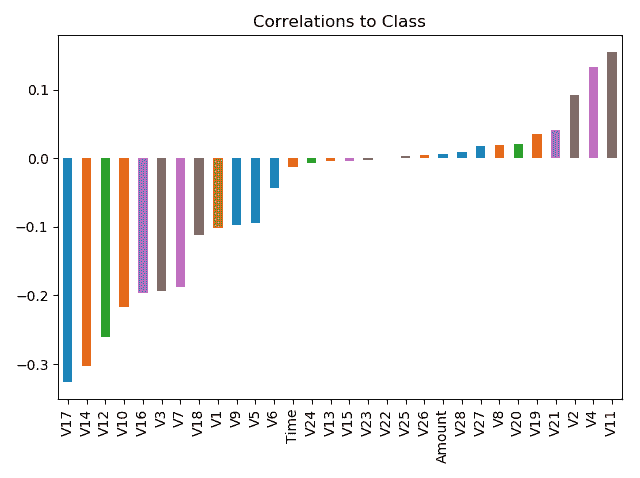

每个变量与目标之间的相关性

通过过滤掉任何绝对值小于 0.1 的特征，我们希望基本学习器能够更好地检测欺诈交易，因为数据集的噪声将会减少。

为了验证我们的理论，我们重复实验，但删除 DataFrame 中任何绝对相关性低于 0.1 的列，正如`fs = list(correlations[(abs(correlations)>threshold)].index.values)`所示。

在这里，`fs`包含了所有与指定阈值相关性大于的列名：

```py
# --- SECTION 3 ---
# Filter features according to their correlation to the target
np.random.seed(123456)
threshold = 0.1

correlations = data.corr()['Class'].drop('Class')
fs = list(correlations[(abs(correlations)>threshold)].index.values)
fs.append('Class')
data = data[fs]

x_train, x_test, y_train, y_test = train_test_split(data.drop('Class', axis=1).values, data.Class.values, test_size=0.3)

for bc in base_classifiers:
 lr = bc[1]
 lr.fit(x_train, y_train)

 predictions = lr.predict(x_test)
 print(bc[0]+' f1', metrics.f1_score(y_test, predictions))
 print(bc[0]+' recall', metrics.recall_score(y_test, predictions))
```

再次，我们展示了以下表格中的结果。正如我们所看到的，决策树提高了其 F1 得分，同时降低了召回率。朴素贝叶斯在两个指标上都有所提升，而逻辑回归模型的表现大幅下降：

| **学习器** | **指标** | **值** |
| --- | --- | --- |
| **决策树** | F1 | 0.785 |
|  | 召回率 | 0.699 |
| **朴素贝叶斯** | F1 | 0.208 |
|  | 召回率 | 0.846 |
| **逻辑回归** | F1 | 0.735 |
|  | 召回率 | 0.610 |

过滤数据集上三个基本学习器的性能指标

# 优化决策树

我们可以尝试优化树的深度，以最大化 F1 或召回率。为此，我们将在训练集上尝试深度范围为* [3, 11] *的不同深度。

以下图表展示了不同最大深度下的 F1 得分和召回率，包括原始数据集和过滤后的数据集：

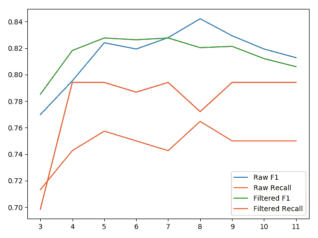

不同树深度的测试指标

在这里，我们观察到，对于最大深度为 5 的情况，F1 和召回率在过滤后的数据集上得到了优化。此外，召回率在原始数据集上也得到了优化。我们将继续使用最大深度为 5，因为进一步优化这些指标可能会导致过拟合，尤其是在与这些指标相关的实例数量极其少的情况下。此外，使用最大深度为 5 时，在使用过滤后的数据集时，F1 和召回率都有所提高。

# 创建集成模型

我们现在可以继续创建集成模型。再次，我们将首先在原始数据集上评估集成模型，然后在过滤后的数据集上进行测试。代码与之前的示例相似。首先，我们加载库和数据，并按以下方式创建训练集和测试集的划分：

```py
# --- SECTION 1 ---
# Libraries and data loading
import numpy as np
import pandas as pd

from sklearn.ensemble import VotingClassifier
from sklearn.tree import DecisionTreeClassifier
from sklearn.linear_model import LogisticRegression
from sklearn.naive_bayes import GaussianNB
from sklearn.model_selection import train_test_split
from sklearn import metrics

np.random.seed(123456)
data = pd.read_csv('creditcard.csv')
data.Time = (data.Time-data.Time.min())/data.Time.std()
data.Amount = (data.Amount-data.Amount.mean())/data.Amount.std()

# Train-Test slpit of 70%-30%
x_train, x_test, y_train, y_test = train_test_split(
 data.drop('Class', axis=1).values, data.Class.values, test_size=0.3)
```

在加载所需的库和数据后，我们创建集成模型，然后对其进行训练和评估。最后，我们按照以下方式通过过滤掉与目标变量相关性较低的特征来减少特征，从而重复实验：

```py

# --- SECTION 2 ---
# Ensemble evaluation
base_classifiers = [('DT', DecisionTreeClassifier(max_depth=5)),
 ('NB', GaussianNB()),
 ('ensemble', LogisticRegression())]

ensemble = VotingClassifier(base_classifiers)
ensemble.fit(x_train, y_train)

print('Voting f1', metrics.f1_score(y_test, ensemble.predict(x_test)))
print('Voting recall', metrics.recall_score(y_test, ensemble.predict(x_test)))

# --- SECTION 3 ---
# Filter features according to their correlation to the target
np.random.seed(123456)
threshold = 0.1

correlations = data.corr()['Class'].drop('Class')
fs = list(correlations[(abs(correlations)>threshold)].index.values)
fs.append('Class')
data = data[fs]

x_train, x_test, y_train, y_test = train_test_split(
 data.drop('Class', axis=1).values, data.Class.values, test_size=0.3)

ensemble = VotingClassifier(base_classifiers)
ensemble.fit(x_train, y_train)

print('Voting f1', metrics.f1_score(y_test, ensemble.predict(x_test)))
print('Voting recall', metrics.recall_score(y_test, ensemble.predict(x_test)))
```

以下表格总结了结果。对于原始数据集，投票模型提供了比任何单一分类器更好的 F1 和召回率的组合。

然而，最大深度为五的决策树在 F1 分数上稍微超越了它，而朴素贝叶斯能够回忆起更多的欺诈交易：

| **数据集** | **指标** | **值** |
| --- | --- | --- |
| **原始** | F1 | 0.822 |
|  | 召回率 | 0.779 |
| **过滤后** | F1 | 0.828 |
|  | 召回率 | 0.794 |

对两个数据集的投票结果

我们可以通过添加两个额外的决策树，分别具有最大深度为三和八，进一步多样化我们的集成模型。这将集成模型的性能提升至以下数值。

尽管在过滤数据集上的性能保持不变，但该集成模型在原始数据集上的表现有所提升。特别是在 F1 指标上，它能够超越所有其他数据集/模型组合：

| **数据集** | **指标** | **值** |
| --- | --- | --- |
| **原始** | F1 | 0.829 |
|  | 召回率 | 0.787 |
| **过滤后** | F1 | 0.828 |
|  | 召回率 | 0.794 |

对两个数据集使用额外两个决策树的投票结果

# 堆叠

我们也可以尝试将基本学习器堆叠，而不是使用投票。首先，我们将尝试堆叠一个深度为五的决策树，一个朴素贝叶斯分类器和一个逻辑回归模型。作为元学习器，我们将使用逻辑回归。

以下代码负责加载所需的库和数据、训练和评估原始数据集和过滤数据集上的集成模型。我们首先加载所需的库和数据，并创建训练集和测试集分割：

```py
# --- SECTION 1 ---
# Libraries and data loading
import numpy as np
import pandas as pd 

from stacking_classifier import Stacking
from sklearn.tree import DecisionTreeClassifier
from sklearn.linear_model import LogisticRegression
from sklearn.naive_bayes import GaussianNB
from sklearn.svm import LinearSVC
from sklearn.model_selection import train_test_split
from sklearn import metrics

np.random.seed(123456)
data = pd.read_csv('creditcard.csv')
data.Time = (data.Time-data.Time.min())/data.Time.std()
data.Amount = (data.Amount-data.Amount.mean())/data.Amount.std()

# Train-Test slpit of 70%-30%
x_train, x_test, y_train, y_test = train_test_split(
 data.drop('Class', axis=1).values, data.Class.values, test_size=0.3)
```

在创建训练集和测试集分割后，我们在原始数据集以及减少特征的数据集上训练并评估集成模型，如下所示：

```py
# --- SECTION 2 ---
# Ensemble evaluation
base_classifiers = [DecisionTreeClassifier(max_depth=5),
                    GaussianNB(),
                    LogisticRegression()]
ensemble = Stacking(learner_levels=[base_classifiers, 
                                   [LogisticRegression()]])

ensemble.fit(x_train, y_train)
print('Stacking f1', metrics.f1_score(y_test, ensemble.predict(x_test)))
print('Stacking recall', metrics.recall_score(y_test, ensemble.predict(x_test)))

# --- SECTION 3 ---
# Filter features according to their correlation to the target
np.random.seed(123456)
threshold = 0.1
correlations = data.corr()['Class'].drop('Class')
fs = list(correlations[(abs(correlations) > threshold)].index.values)
fs.append('Class')
data = data[fs]
x_train, x_test, y_train, y_test = train_test_split(data.drop('Class', axis=1).values, 
                                                    data.Class.values, test_size=0.3)
ensemble = Stacking(learner_levels=[base_classifiers,
                                   [LogisticRegression()]])
ensemble.fit(x_train, y_train)
print('Stacking f1', metrics.f1_score(y_test, ensemble.predict(x_test)))
print('Stacking recall', metrics.recall_score(y_test, ensemble.predict(x_test)))
```

如下表所示，该集成模型在原始数据集上取得了略高的 F1 分数，但召回率较差，相比之下，投票集成模型使用相同的基本学习器表现较好：

| **数据集** | **指标** | **值** |
| --- | --- | --- |
| **原始** | F1 | 0.823 |
|  | 召回率 | 0.750 |
| **过滤后** | F1 | 0.828 |
|  | 召回率 | 0.794 |

使用三个基本学习器的堆叠集成模型表现

我们可以进一步尝试不同的基本学习器。通过添加两个分别具有最大深度为三和八的决策树（与第二次投票配置相同），观察堆叠模型表现出相同的行为。在原始数据集上，堆叠模型在 F1 分数上超越了其他模型，但在召回率上表现较差。

在过滤数据集上，性能与投票模型持平。最后，我们尝试第二层次的基本学习器，由一个深度为二的决策树和一个线性支持向量机组成，其表现不如五个基本学习器的配置：

| **数据集** | **指标** | **值** |
| --- | --- | --- |
| **原始** | F1 | 0.844 |
|  | 召回率 | 0.757 |
| **过滤后** | F1 | 0.828 |
|  | 召回率 | 0.794 |

使用五个基本学习器的性能

下表展示了堆叠集成的结果，增加了一个基础学习器层次。显然，它的表现不如原始集成。

| **数据集** | **指标** | **值** |
| --- | --- | --- |
| **原始** | F1 | 0.827 |
|  | 召回率 | 0.757 |
| **过滤** | F1 | 0.827 |
|  | 召回率 | 0.772 |

五个基础学习器在第 0 层，两个基础学习器在第 1 层的表现

# 袋装法

在本节中，我们将使用袋装法对数据集进行分类。正如我们之前所示，最大深度为五的决策树是最优的，因此我们将使用这些树来进行袋装法示例。

我们希望优化集成的大小。我们将通过在*【5，30】*范围内测试不同大小来生成原始训练集的验证曲线。实际的曲线如下图所示：

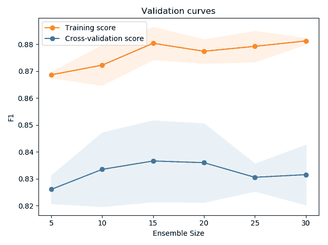

原始训练集的验证曲线，针对不同集成大小

我们观察到，集成大小为 10 时方差最小，因此我们将使用大小为 10 的集成。

以下代码加载数据和库（*第一部分*），将数据拆分为训练集和测试集，并在原始数据集（*第二部分*）和减少特征的数据集（*第三部分*）上拟合并评估集成：

```py
# --- SECTION 1 ---
# Libraries and data loading
import numpy as np
import pandas as pd

from sklearn.ensemble import BaggingClassifier
from sklearn.tree import DecisionTreeClassifier
from sklearn.model_selection import train_test_split
from sklearn import metrics

np.random.seed(123456)
data = pd.read_csv('creditcard.csv')
data.Time = (data.Time-data.Time.min())/data.Time.std()
data.Amount = (data.Amount-data.Amount.mean())/data.Amount.std()
# Train-Test slpit of 70%-30%
x_train, x_test, y_train, y_test = train_test_split(
                                   data.drop('Class', axis=1).values, data.Class.values, test_size=0.3)
```

在创建了训练集和测试集划分后，我们在原始数据集和减少特征的数据集上训练并评估我们的集成，如下所示：

```py
# --- SECTION 2 ---
# Ensemble evaluation
ensemble = BaggingClassifier(n_estimators=10,
base_estimator=DecisionTreeClassifier(max_depth=5))
ensemble.fit(x_train, y_train)
print('Bagging f1', metrics.f1_score(y_test, ensemble.predict(x_test)))
print('Bagging recall', metrics.recall_score(y_test, ensemble.predict(x_test)))
# --- SECTION 3 ---
# Filter features according to their correlation to the target
np.random.seed(123456)
threshold = 0.1
correlations = data.corr()['Class'].drop('Class')
fs = list(correlations[(abs(correlations)>threshold)].index.values)
fs.append('Class')
data = data[fs]
x_train, x_test, y_train, y_test = train_test_split(
                                    data.drop('Class', axis=1).values, data.Class.values, test_size=0.3)
ensemble = BaggingClassifier(n_estimators=10,
base_estimator=DecisionTreeClassifier(max_depth=5))
ensemble.fit(x_train, y_train)

print('Bagging f1', metrics.f1_score(y_test, ensemble.predict(x_test)))
print('Bagging recall', metrics.recall_score(y_test, ensemble.predict(x_test)))
```

使用最大深度为 5 且每个集成有 10 棵树的袋装法集成，我们能够在以下 F1 和召回率得分中取得较好成绩。在所有度量上，它在两个数据集上均优于堆叠法和投票法，唯一的例外是，原始数据集的 F1 分数略逊于堆叠法（0.843 对比 0.844）：

| **数据集** | **指标** | **值** |
| --- | --- | --- |
| **原始** | F1 | 0.843 |
|  | 召回率 | 0.787 |
| **过滤** | F1 | 0.831 |
|  | 召回率 | 0.794 |

原始数据集和过滤数据集的袋装性能

尽管我们已得出最大深度为 5 对于单一决策树是最优的结论，但这确实限制了每棵树的多样性。通过将最大深度增加到 8，我们能够在过滤数据集上获得 0.864 的 F1 分数和 0.816 的召回率，这也是迄今为止的最佳表现。

然而，原始数据集上的性能有所下降，这确认了我们移除的特征确实是噪声，因为现在决策树能够拟合样本内的噪声，因此它们的样本外表现下降：

| **数据集** | **指标** | **值** |
| --- | --- | --- |
| **原始** | F1 | 0.840 |
|  | 召回率 | 0.772 |
| **过滤** | F1 | 0.864 |
|  | 召回率 | 0.816 |

# 提升法

接下来，我们将开始使用生成方法。我们将实验的第一个生成方法是提升法。我们将首先尝试使用 AdaBoost 对数据集进行分类。由于 AdaBoost 根据误分类重新采样数据集，因此我们预期它能够相对较好地处理我们不平衡的数据集。

首先，我们必须决定集成的大小。我们生成了多个集成大小的验证曲线，具体如下所示：

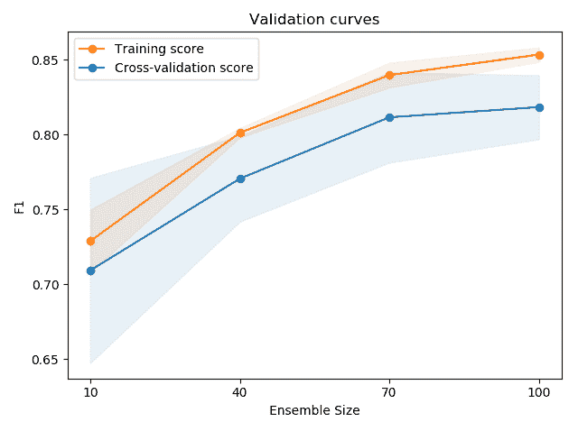

AdaBoost 的不同集成大小验证曲线

如我们所见，70 个基学习器提供了偏差与方差之间的最佳权衡。因此，我们将继续使用 70 个基学习器的集成。

以下代码实现了 AdaBoost 的训练和评估：

```py
# --- SECTION 1 ---
# Libraries and data loading
import numpy as np
import pandas as pd
from sklearn.ensemble import AdaBoostClassifier
from sklearn.model_selection import train_test_split
from sklearn.utils import shuffle
from sklearn import metrics

np.random.seed(123456)
data = pd.read_csv('creditcard.csv')
data.Time = (data.Time-data.Time.min())/data.Time.std()
data.Amount = (data.Amount-data.Amount.mean())/data.Amount.std()
# Train-Test slpit of 70%-30%
x_train, x_test, y_train, y_test = train_test_split(
 data.drop('Class', axis=1).values, data.Class.values, test_size=0.3)
```

然后我们使用 70 个基学习器和学习率 1.0 来训练和评估我们的集成方法：

```py
# --- SECTION 2 ---
# Ensemble evaluation
ensemble = AdaBoostClassifier(n_estimators=70, learning_rate=1.0)
ensemble.fit(x_train, y_train)
print('AdaBoost f1', metrics.f1_score(y_test, ensemble.predict(x_test)))
print('AdaBoost recall', metrics.recall_score(y_test, ensemble.predict(x_test)))
```

我们通过选择与目标高度相关的特征来减少特征数量。最后，我们重复训练和评估集成的方法：

```py
# --- SECTION 3 ---
# Filter features according to their correlation to the target
np.random.seed(123456)
threshold = 0.1
correlations = data.corr()['Class'].drop('Class')
fs = list(correlations[(abs(correlations)>threshold)].index.values)
fs.append('Class')
data = data[fs]
x_train, x_test, y_train, y_test = train_test_split(
 data.drop('Class', axis=1).values, data.Class.values, test_size=0.3)
ensemble = AdaBoostClassifier(n_estimators=70, learning_rate=1.0)
ensemble.fit(x_train, y_train)
print('AdaBoost f1', metrics.f1_score(y_test, ensemble.predict(x_test)))
print('AdaBoost recall', metrics.recall_score(y_test, ensemble.predict(x_test)))
```

结果如下表所示。显而易见，它的表现不如我们之前的模型：

| **数据集** | **指标** | **值** |
| --- | --- | --- |
| **原始数据** | F1 | 0.778 |
|  | 召回率 | 0.721 |
| **过滤后数据** | F1 | 0.794 |
|  | 召回率 | 0.721 |

AdaBoost 的表现

我们可以尝试将学习率增加到 1.3，这似乎能提高整体表现。如果我们再将其增加到 1.4，则会发现性能下降。如果我们将基学习器的数量增加到 80，过滤后的数据集性能有所提升，而原始数据集则似乎在召回率和 F1 表现之间做出了权衡：

| **数据集** | **指标** | **值** |
| --- | --- | --- |
| **原始数据** | F1 | 0.788 |
|  | 召回率 | 0.765 |
| **过滤后数据** | F1 | 0.815 |
|  | 召回率 | 0.743 |

AdaBoost 的表现，学习率=1.3

| **数据集** | **指标** | **值** |
| --- | --- | --- |
| 原始数据 | F1 | 0.800 |
|  | 召回率 | 0.765 |
| 过滤后数据 | F1 | 0.800 |
|  | 召回率 | 0.735 |

AdaBoost 的表现，学习率=1.4

| **数据集** | **指标** | **值** |
| --- | --- | --- |
| **原始数据** | F1 | 0.805 |
|  | 召回率 | 0.757 |
| **过滤后数据** | F1 | 0.805 |
|  | 召回率 | 0.743 |

AdaBoost 的表现，学习率=1.4，集成大小=80

事实上，我们可以观察到一个 F1 和召回率的帕累托前沿，它直接与学习率和基学习器数量相关。这个前沿如下图所示：

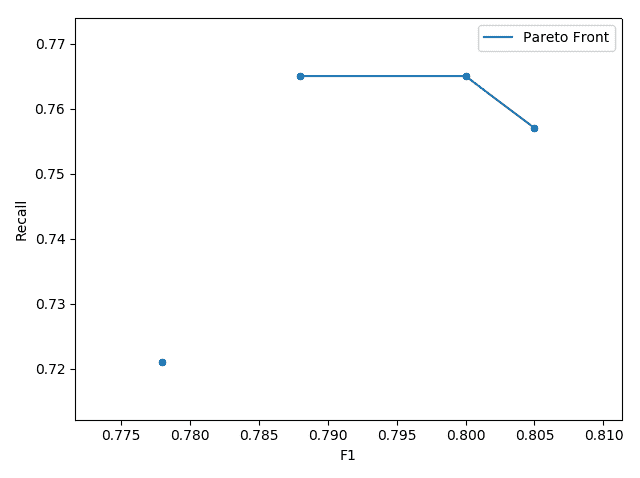

AdaBoost 的 F1 和召回率的帕累托前沿

# XGBoost

我们还将尝试使用 XGBoost 对数据集进行分类。由于 XGBoost 的树最大深度为三，我们预期它会在没有任何微调的情况下超越 AdaBoost。的确，XGBoost 在两个数据集上，以及所有指标方面（如下表所示），都能表现得比大多数先前的集成方法更好：

| **数据集** | **指标** | **值** |
| --- | --- | --- |
| **原始数据** | F1 | 0.846 |
|  | 召回率 | 0.787 |
| **过滤后数据** | F1 | 0.849 |
|  | 召回率 | 0.809 |

XGBoost 的开箱即用表现

通过将每棵树的最大深度增加到五，集成方法的表现得到了进一步提升，结果如下：

| **数据集** | **指标** | **值** |
| --- | --- | --- |
| **原始数据** | F1 | 0.862 |
|  | 召回率 | 0.801 |
| **过滤后** | F1 | 0.862 |
|  | 召回率 | 0.824 |

最大深度为 5 时的性能

# 使用随机森林

最后，我们将使用随机森林集成方法。再次通过验证曲线，我们确定最佳的集成大小。从下图可以看出，50 棵树提供了模型的最小方差，因此我们选择集成大小为 50：

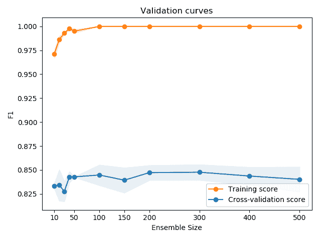

随机森林的验证曲线

我们提供以下训练和验证代码，并给出两个数据集的性能表现。以下代码负责加载所需的库和数据，并在原始数据集和过滤后的数据集上训练和评估集成模型。我们首先加载所需的库和数据，同时创建训练集和测试集：

```py
# --- SECTION 1 ---
# Libraries and data loading
import numpy as np
import pandas as pd

from sklearn.ensemble import RandomForestClassifier
from sklearn.model_selection import train_test_split
from sklearn.utils import shuffle
from sklearn import metrics

np.random.seed(123456)
data = pd.read_csv('creditcard.csv')
data.Time = (data.Time-data.Time.min())/data.Time.std()
data.Amount = (data.Amount-data.Amount.mean())/data.Amount.std()
np.random.seed(123456)
data = pd.read_csv('creditcard.csv')
data.Time = (data.Time-data.Time.min())/data.Time.std()
data.Amount = (data.Amount-data.Amount.mean())/data.Amount.std()
# Train-Test slpit of 70%-30%
x_train, x_test, y_train, y_test = train_test_split(
 data.drop('Class', axis=1).values, data.Class.values, test_size=0.3)
```

然后，我们在原始数据集和过滤后的数据集上训练和评估集成模型：

```py
# --- SECTION 2 ---
# Ensemble evaluation
ensemble = RandomForestClassifier(n_jobs=4)
ensemble.fit(x_train, y_train)
print('RF f1', metrics.f1_score(y_test, ensemble.predict(x_test)))
print('RF recall', metrics.recall_score(y_test, ensemble.predict(x_test)))

# --- SECTION 3 ---
# Filter features according to their correlation to the target
np.random.seed(123456)
threshold = 0.1
correlations = data.corr()['Class'].drop('Class')
fs = list(correlations[(abs(correlations)>threshold)].index.values)
fs.append('Class')
data = data[fs]
x_train, x_test, y_train, y_test = train_test_split(
 data.drop('Class', axis=1).values, data.Class.values, test_size=0.3)
ensemble = RandomForestClassifier(n_jobs=4)
ensemble.fit(x_train, y_train)
print('RF f1', metrics.f1_score(y_test, ensemble.predict(x_test)))
print('RF recall', metrics.recall_score(y_test, ensemble.predict(x_test)))
```

| **数据集** | **指标** | **值** |
| --- | --- | --- |
| **原始** | F1 | 0.845 |
|  | 召回率 | 0.743 |
| **过滤后** | F1 | 0.867 |
|  | 召回率 | 0.794 |

随机森林性能

由于我们的数据集高度偏斜，我们可以推测，改变树的分割标准为熵会对我们的模型有帮助。事实上，通过在构造函数中指定`criterion='entropy'`（`ensemble = RandomForestClassifier(n_jobs=4)`），我们能够将原始数据集的性能提高到**F1**得分为**0.859**和**召回率**得分为**0.786**，这是原始数据集的两个最高得分：

| **数据集** | **指标** | **值** |
| --- | --- | --- |
| **原始** | F1 | 0.859 |
|  | 召回率 | 0.787 |
| **过滤后** | F1 | 0.856 |
|  | 召回率 | 0.787 |

使用熵作为分割标准的性能

# 集成方法的对比分析

在实验中，我们使用了一个减少特征的数据集，其中去除了与目标变量相关性较弱的特征，我们希望提供每种方法最佳参数下的最终得分。在以下图表中，结果按升序排列。Bagging 在应用于过滤后的数据集时似乎是最稳健的方法。XGBoost 是第二好的选择，在应用于过滤后的数据集时也能提供不错的 F1 和召回率得分：

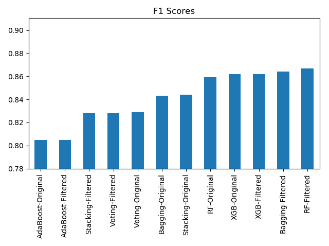

F1 得分

召回率得分，如下图所示，清楚地显示了 XGBoost 在该指标上相较于其他方法的明显优势，因为它能够在原始数据集和过滤后的数据集上都超过其他方法：

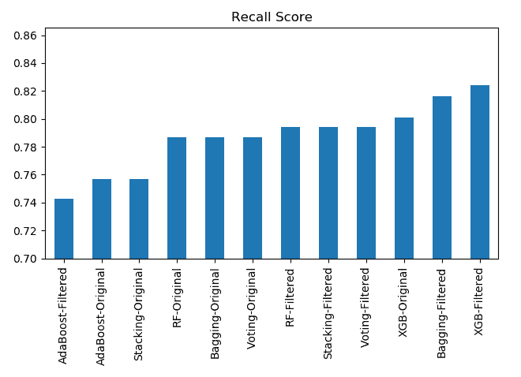

召回率得分

# 总结

在本章中，我们探讨了使用各种集成学习方法检测欺诈交易的可能性。虽然一些方法表现优于其他方法，但由于数据集的特点，在某种程度上对数据集进行重采样（过采样或欠采样）是很难得到好结果的。

我们展示了如何使用每种集成学习方法，以及如何探索调整其各自参数的可能性，以实现更好的性能。在下一章，我们将尝试利用集成学习技术来预测比特币价格。
