# 第十章：预测比特币价格

多年来，比特币和其他加密货币吸引了许多方的关注，主要是由于其价格水平的爆炸性增长以及区块链技术所提供的商业机会。在本章中，我们将尝试使用历史数据预测第二天的比特币（BTC）价格。有许多来源提供加密货币的历史价格数据。我们将使用来自雅虎财经的数据，地址为[`finance.yahoo.com/quote/BTC-USD/history/`](https://finance.yahoo.com/quote/BTC-USD/history/)。本章将重点预测未来价格，并利用这些知识进行比特币投资。

本章将涵盖以下主题：

+   时间序列数据

+   投票

+   堆叠

+   装袋法

+   提升法

+   随机森林

# 技术要求

你需要具备基本的机器学习技术和算法知识。此外，还需要了解 Python 的语法和惯例。最后，熟悉 NumPy 库将极大帮助读者理解一些自定义算法实现。

本章的代码文件可以在 GitHub 上找到：

[`github.com/PacktPublishing/Hands-On-Ensemble-Learning-with-Python/tree/master/Chapter10`](https://github.com/PacktPublishing/Hands-On-Ensemble-Learning-with-Python/tree/master/Chapter10)

查看以下视频，观看代码示例：[`bit.ly/2JOsR7d`](http://bit.ly/2JOsR7d)。

# 时间序列数据

时间序列数据关注的是每个实例与特定时间点或时间间隔相关的数据实例。我们选择测量变量的频率定义了时间序列的采样频率。例如，大气温度在一天中以及一整年中都有不同。我们可以选择每小时测量一次温度，从而得到每小时的频率，或者选择每天测量一次温度，从而得到每天的频率。在金融领域，采样频率介于主要时间间隔之间并不罕见；例如，可以是每 10 分钟一次（10 分钟频率）或每 4 小时一次（4 小时频率）。时间序列的另一个有趣特点是，通常相邻时间点之间的数据实例存在相关性。

这叫做**自相关**。例如，大气温度在连续的几分钟内不能发生很大的变化。此外，这使我们能够利用早期的数据点来预测未来的数据点。下面是 2016 年至 2019 年期间雅典和希腊的温度（3 小时平均）示例。请注意，尽管温度有所变化，但大多数温度都相对接近前一天的温度。此外，我们看到热月和冷月（季节）的重复模式，这就是所谓的季节性：

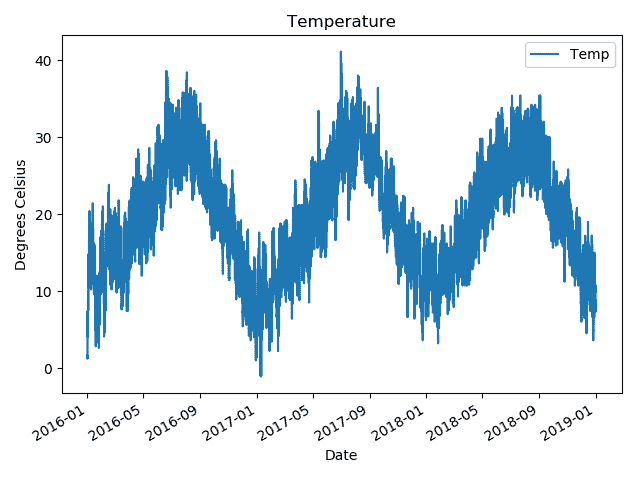

2016–2019 年雅典，希腊的温度

为了检查不同时间点之间的相关性水平，我们利用**自相关函数**（**ACF**）。ACF 衡量数据点与前一个数据点之间的线性相关性（称为**滞后**）。下图展示了温度数据（按月平均重新采样）的自相关函数（ACF）。它显示出与第一个滞后的强正相关性。这意味着一个月的温度不太可能与前一个月相差太大，这是合乎逻辑的。例如，12 月和 1 月是寒冷的月份，它们的平均温度通常比 12 月和 3 月更接近。此外，第 5 和第 6 滞后之间存在强烈的负相关性，表明寒冷的冬季导致炎热的夏季，反之亦然：

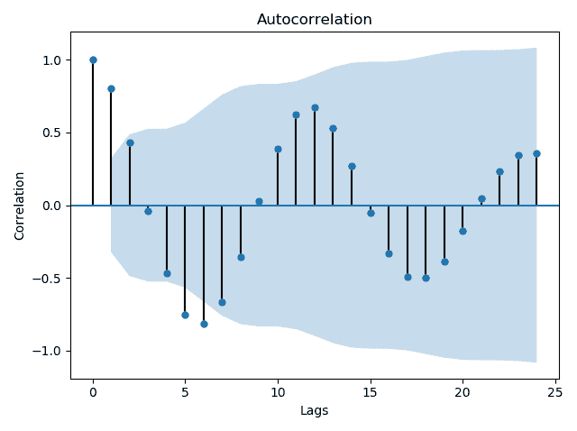

温度数据的自相关函数（ACF）

# 比特币数据分析

比特币数据与温度数据有很大不同。温度在每年的相同月份基本保持相似值。这表明温度的分布随着时间变化并未发生改变。表现出这种行为的时间序列被称为**平稳**时间序列。这使得使用时间序列分析工具，如**自回归**（**AR**）、**滑动平均**（**MA**）和**自回归积分滑动平均**（**ARIMA**）模型进行建模相对简单。财务数据通常是非平稳的，正如下图中所示的每日比特币收盘数据所示。这意味着数据在其历史的整个过程中并未表现出相同的行为，而是行为在变化。

财务数据通常提供开盘价（当天的第一笔价格）、最高价（当天的最高价格）、最低价（当天的最低价格）和收盘价（当天的最后一笔价格）。

数据中存在明显的趋势（价格在某些时间间隔内平均上升或下降），以及异方差性（随时间变化的可变方差）。识别平稳性的一种方法是研究自相关函数（ACF）。如果存在非常强的高阶滞后之间的相关性且不衰减，则该时间序列很可能是非平稳的。下图展示了比特币数据的自相关函数（ACF），显示出相关性衰减较弱：

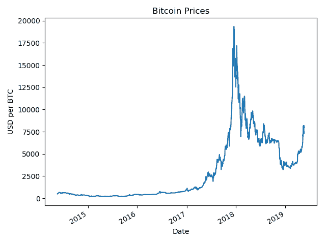

2014 年中期至今的比特币/USD 价格

下图展示了比特币的自相关函数（ACF）。我们可以清楚地看到，在非常高的滞后值下，相关性并没有显著下降：

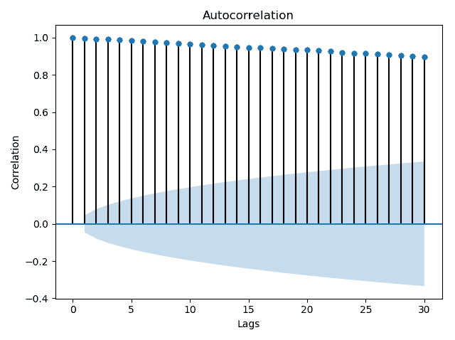

比特币数据的自相关函数（ACF）

请看以下公式：

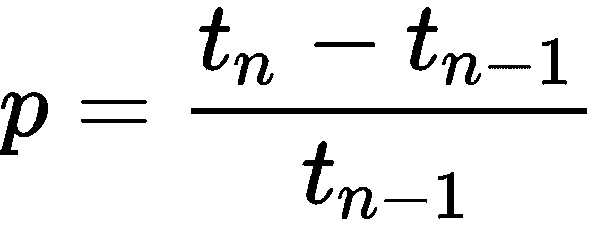

其中 *p* 是百分比变化，*t[n]* 是时间 *n* 时的价格，*tn-1* 是时间 *n-1* 时的价格。通过对数据进行转化，我们得到一个平稳但相关性较弱的时间序列。

下图展示了数据的图形，并提供了自相关函数（ACF）和平均 30 天标准差：

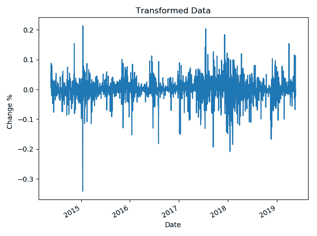

转换后的数据

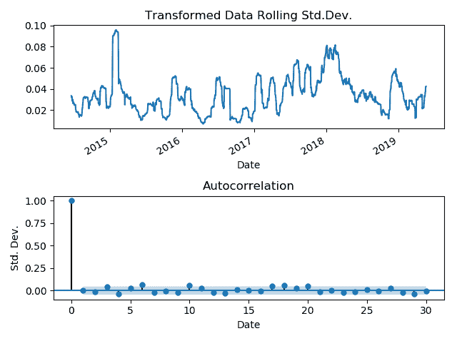

滚动 30 天标准差和转换数据的自相关函数（ACF）

# 建立基准

为了建立基准，我们将尝试使用线性回归建模数据。虽然这是一个时间序列，我们不会直接考虑时间。相反，我们将使用大小为*S*的滑动窗口在每个时间点生成特征，并利用这些特征预测下一个数据点。接下来，我们将时间窗口向前移动一步，以包含我们预测的真实数据点的值，并丢弃窗口中的最旧数据点。我们将继续这个过程，直到所有数据点都被预测。这叫做向前验证。一个缺点是我们无法预测前*S*个数据点，因为我们没有足够的数据来生成它们的特征。另一个问题是我们需要重新训练模型*L*-*S*次，其中*L*是时间序列中的数据点总数。以下图展示了前两个步骤的图示：

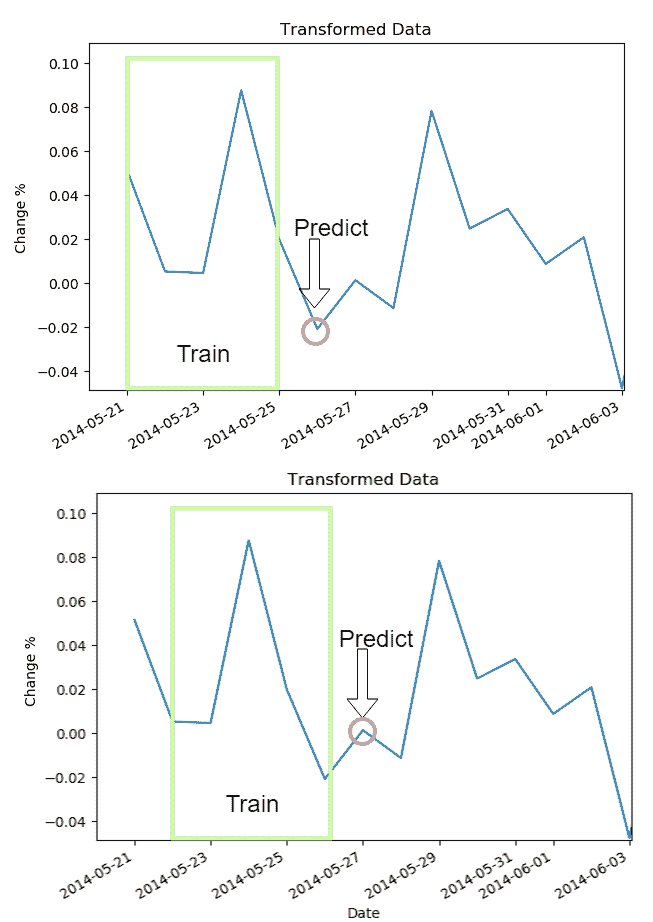

向前验证程序的前两个步骤。该程序会继续应用于整个时间序列。

首先，我们从`BTC-USD.csv`文件加载所需的库和数据。我们还设置了 NumPy 随机数生成器的种子：

```py
import numpy as np
import pandas as pd
from simulator import simulate
from sklearn import metrics
from sklearn.linear_model import LinearRegression
from sklearn.model_selection import train_test_split
np.random.seed(123456)
lr = LinearRegression()
data = pd.read_csv('BTC-USD.csv')
```

然后，我们通过使用`data.dropna()`删除包含 NaN 值的条目，使用`pd.to_datetime`解析日期，并将日期设置为索引，来清理数据。最后，我们计算`Close`值的百分比差异（并丢弃第一个值，因为它是 NaN），并保存 Pandas 系列的长度：

```py
data = data.dropna()
data.Date = pd.to_datetime(data.Date)
data.set_index('Date', drop=True, inplace=True)
diffs = (data.Close.diff()/data.Close).values[1:]

diff_len = len(diffs)
```

我们创建了一个函数，用于在每个数据点生成特征。特征本质上是前几个滞后的不同百分比。因此，为了用值填充数据集的特征，我们只需将数据向前移动滞后点数即可。任何没有可用数据计算滞后的特征，其值将为零。以下图示了一个包含数字 1、2、3 和 4 的时间序列的示例：

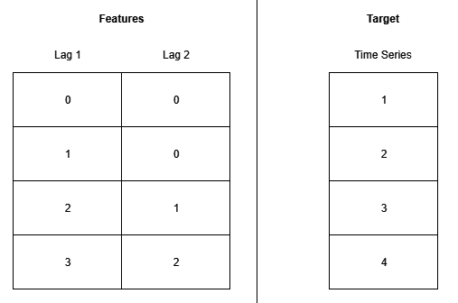

滞后特征的填充方式

实际的函数，填充滞后*t*，选择时间序列中的所有数据，除了最后的*t*，并将其放入相应的特征中，从索引*t*开始。我们选择使用过去 20 天的数据，因为在那之后似乎没有显著的线性相关性。此外，我们将特征和目标缩放 100 倍，并四舍五入到 8 位小数。这一点很重要，因为它确保了结果的可重复性。如果数据没有四舍五入，溢出错误会给结果带来随机性，如下所示：

```py
def create_x_data(lags=1):
 diff_data = np.zeros((diff_len, lags))

for lag in range(1, lags+1):
 this_data = diffs[:-lag]
 diff_data[lag:, lag-1] = this_data

return diff_data

# REPRODUCIBILITY
x_data = create_x_data(lags=20)*100
y_data = diffs*100
```

最后，我们执行前向验证。我们选择了 150 个点的训练窗口，大约相当于 5 个月。考虑到数据的特性和波动性，这提供了一个良好的折衷，既能保证训练集足够大，又能捕捉到近期的市场行为。更大的窗口将包括不再反映现实的市场条件。更短的窗口则提供的数据过少，容易导致过拟合。我们通过利用预测值与原始百分比差异之间的均方误差来衡量我们模型的预测质量：

```py
window = 150
preds = np.zeros(diff_len-window)
for i in range(diff_len-window-1):
 x_train = x_data[i:i+window, :]
 y_train = y_data[i:i+window]
 lr.fit(x_train, y_train)
 preds[i] = lr.predict(x_data[i+window+1, :].reshape(1, -1))

print('Percentages MSE: %.2f'%metrics.mean_absolute_error(y_data[window:], preds))
```

简单线性回归可能产生一个均方误差（MSE）为 18.41。我们还可以尝试通过将每个数据点乘以（1 + 预测值）来重建时间序列，以获得下一个预测值。此外，我们可以尝试利用数据集的特点来模拟交易活动。每次预测值大于+0.5%的变化时，我们投资 100 美元购买比特币。如果我们持有比特币并且预测值低于-0.5%，则在当前市场收盘时卖出比特币。为了评估我们模型作为交易策略的质量，我们使用简化的**夏普**比率，计算方式是将平均回报率（百分比利润）与回报的标准差之比。较高的夏普值表示更好的交易策略。这里使用的公式如下。通常，预期回报会减去一个替代的**安全**回报百分比，但由于我们仅希望比较我们将生成的模型，因此将其省略：

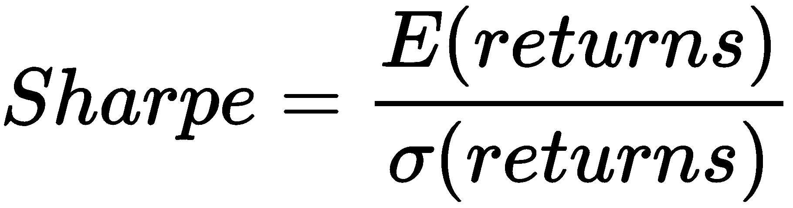

作为交易策略使用时，线性回归能够产生 0.19 的夏普值。下图显示了我们的模型生成的交易和利润。蓝色三角形表示策略购买 100 美元比特币的时间点，红色三角形表示策略卖出之前购买的比特币的时间点：

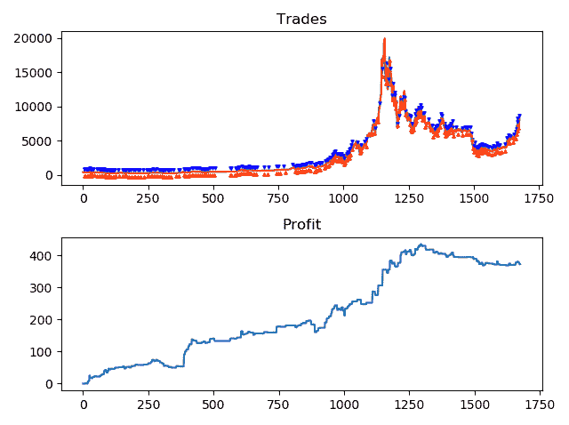

我们模型的利润和进出点

在本章的其余部分，我们将通过利用前几章介绍的集成方法来改进均方误差（MSE）和夏普值。

# 模拟器

在这里，我们将简要解释模拟器的工作原理。它作为一个函数实现，接受我们的标准 Pandas 数据框和模型预测作为输入。首先，我们将定义买入阈值和投资额度（我们在每次买入时投资的金额），以及占位符变量。这些变量将用于存储真实和预测的时间序列，以及我们模型的利润（`balances`）。此外，我们定义了`buy_price`变量，它存储我们购买比特币时的价格。如果价格为`0`，我们假设我们没有持有任何比特币。`buy_points`和`sell_points`列表表示我们买入或卖出比特币的时间点，仅用于绘图。此外，我们还存储了起始索引，这相当于滑动窗口的大小，如以下示例所示：

```py
import matplotlib.pyplot as plt
import numpy as np
import pandas as pd

from sklearn import metrics

def simulate(data, preds):
 # Constants and placeholders
 buy_threshold = 0.5
 stake = 100

true, pred, balances = [], [], []

buy_price = 0
 buy_points, sell_points = [], []
 balance = 0

start_index = len(data)-len(preds)-1
```

接下来，对于每个点，我们存储实际值和预测值。如果预测值大于 0.5 且我们没有持有任何比特币，我们将买入价值 100 美元的比特币。如果预测值小于-0.5 且我们已经购买了比特币，我们将以当前的收盘价将其卖出。我们将当前的利润（或亏损）添加到我们的余额中，将真实值和预测值转换为 NumPy 数组，并生成图表：

```py
# Calculate predicted values
 for i in range(len(preds)):

last_close = data.Close[i+start_index-1]
 current_close = data.Close[i+start_index]

# Save predicted values and true values
 true.append(current_close)
 pred.append(last_close*(1+preds[i]/100))

 # Buy/Sell according to signal
 if preds[i] > buy_threshold and buy_price == 0:
 buy_price = true[-1]
 buy_points.append(i)

elif preds[i] < -buy_threshold and not buy_price == 0:
 profit = (current_close - buy_price) * stake/buy_price
 balance += profit
 buy_price = 0
 sell_points.append(i)

balances.append(balance)
 true = np.array(true)
 pred = np.array(pred)

# Create plots
 plt.figure()

plt.subplot(2, 1, 1)
 plt.plot(true, label='True')
 plt.plot(pred, label='pred')
 plt.scatter(buy_points, true[buy_points]+500, marker='v',
 c='blue', s=5, zorder=10)
 plt.scatter(sell_points, true[sell_points]-500, marker='^'
 , c='red', s=5, zorder=10)
 plt.title('Trades')

plt.subplot(2, 1, 2)
 plt.plot(balances)
 plt.title('Profit')
 print('MSE: %.2f'%metrics.mean_squared_error(true, pred))
 balance_df = pd.DataFrame(balances)

pct_returns = balance_df.diff()/stake
 pct_returns = pct_returns[pct_returns != 0].dropna()

 print('Sharpe: %.2f'%(np.mean(pct_returns)/np.std(pct_returns)))
```

# 投票

我们将尝试通过投票将三种基本回归算法结合起来，以提高简单回归的 MSE。为了组合这些算法，我们将利用它们预测值的平均值。因此，我们编写了一个简单的类，用于创建基本学习器的字典，并处理它们的训练和预测平均。主要逻辑与我们在第三章实现的自定义投票分类器*Voting*相同：

```py
import numpy as np
from copy import deepcopy

class VotingRegressor():

# Accepts a list of (name, classifier) tuples
 def __init__(self, base_learners):
 self.base_learners = {}
 for name, learner in base_learners:
 self.base_learners[name] = deepcopy(learner)

 # Fits each individual base learner
 def fit(self, x_data, y_data):
 for name in self.base_learners:
 learner = self.base_learners[name]
 learner.fit(x_data, y_data)
```

预测结果存储在一个 NumPy 矩阵中，其中每一行对应一个实例，每一列对应一个基本学习器。行平均值即为集成的输出，如下所示：

```py
# Generates the predictions
 def predict(self, x_data):

# Create the predictions matrix
 predictions = np.zeros((len(x_data), len(self.base_learners)))

names = list(self.base_learners.keys())

# For each base learner
 for i in range(len(self.base_learners)):
 name = names[i]
 learner = self.base_learners[name]

# Store the predictions in a column
 preds = learner.predict(x_data)
 predictions[:,i] = preds

# Take the row-average
 predictions = np.mean(predictions, axis=1)
 return predictions
```

我们选择了支持向量机、K 近邻回归器和线性回归作为基本学习器，因为它们提供了多样的学习范式。为了使用这个集成，我们首先导入所需的模块：

```py
import numpy as np
import pandas as pd

from simulator import simulate
from sklearn import metrics
from sklearn.neighbors import KNeighborsRegressor
from sklearn.linear_model import LinearRegression
from sklearn.svm import SVR
from voting_regressor import VotingRegressor
```

接下来，在我们之前展示的代码中，我们将`lr = LinearRegression()`这一行替换为以下代码：

```py
base_learners = [('SVR', SVR()),
 ('LR', LinearRegression()),
 ('KNN', KNeighborsRegressor())]

lr = VotingRegressor(base_learners)
```

通过增加两个额外的回归器，我们能够将 MSE 减少到 16.22，并产生 0.22 的夏普值。

# 改进投票

尽管我们的结果优于线性回归，但我们仍然可以通过去除线性回归进一步改善结果，从而仅保留基本学习器，如下所示：

```py
base_learners = [('SVR', SVR()), ('KNN', KNeighborsRegressor())]
```

这进一步改善了 MSE，将其减少到 15.71。如果我们将这个模型作为交易策略使用，可以实现 0.21 的夏普值；比简单的线性回归要好得多。下表总结了我们的结果：

| **Metric** | **SVR-KNN** | **SVR-LR-KNN** |
| --- | --- | --- |
| **MSE** | 15.71 | 16.22 |
| **Sharpe** | 0.21 | 0.22 |

投票集成结果

# 堆叠

接下来，我们将使用堆叠法来更有效地结合基本回归器。使用第四章中的`StackingRegressor`，*堆叠*，我们将尝试与投票法一样组合相同的算法。首先，我们修改我们的集成的`predict`函数（以允许单实例预测），如下所示：

```py
 # Generates the predictions
 def predict(self, x_data):

# Create the predictions matrix
 predictions = np.zeros((len(x_data), len(self.base_learners)))

names = list(self.base_learners.keys())

# For each base learner
 for i in range(len(self.base_learners)):
 name = names[i]
 learner = self.base_learners[name]

# Store the predictions in a column
 preds = learner.predict(x_data)
 predictions[:,i] = preds

# Take the row-average
 predictions = np.mean(predictions, axis=1)
 return predictions
```

再次，我们修改代码以使用堆叠回归器，如下所示：

```py
base_learners = [[SVR(), LinearRegression(), KNeighborsRegressor()],
                [LinearRegression()]]
lr = StackingRegressor(base_learners)
```

在这种设置下，集成方法生成的模型具有 16.17 的均方误差（MSE）和 0.21 的夏普比率。

# 改进堆叠法

我们的结果略逊于最终的投票集成，因此我们将尝试通过去除线性回归来改进它，就像我们在投票集成中做的那样。通过这样做，我们可以稍微改善模型，达到 16.16 的均方误差（MSE）和 0.22 的夏普比率。与投票法相比，堆叠法作为一种投资策略略好一些（相同的夏普比率和略微更好的 MSE），尽管它无法达到相同水平的预测准确度。其结果总结在下表中：

| **指标** | **SVR-KNN** | **SVR-LR-KNN** |
| --- | --- | --- |
| **MSE** | 16.17 | 16.16 |
| **夏普比率** | 0.21 | 0.22 |

堆叠法结果

# 自助法（Bagging）

通常，在将预测模型拟合到金融数据时，方差是我们面临的主要问题。自助法是对抗方差的非常有用的工具；因此，我们希望它能够比简单的投票法和堆叠法生成表现更好的模型。为了利用自助法，我们将使用 scikit 的`BaggingRegressor`，该方法在第五章中介绍，*自助法*。为了在我们的实验中实现它，我们只需使用`lr = BaggingRegressor()`来替代之前的回归器。这样做的结果是均方误差（MSE）为 19.45，夏普比率为 0.09。下图展示了我们的模型所生成的利润和交易：

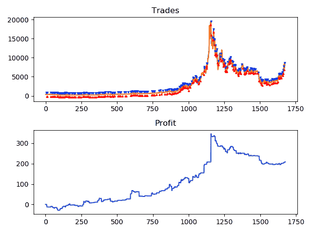

自助法的利润和交易

# 改进自助法

我们可以进一步改进自助法，因为它的表现比任何之前的模型都差。首先，我们可以尝试浅层决策树，这将进一步减少集成中的方差。通过使用最大深度为`3`的决策树，使用`lr = BaggingRegressor(base_estimator=DecisionTreeRegressor(max_depth=3))`，我们可以改进模型的性能，得到 16.17 的均方误差（MSE）和 0.15 的夏普比率。进一步将树的生长限制为`max_depth=1`，可以使模型达到 16.7 的 MSE 和 0.27 的夏普比率。如果我们检查模型的交易图，我们会观察到交易数量的减少，以及在比特币价格大幅下跌的时期性能的显著改善。这表明该模型能够更有效地*从实际信号中过滤噪声*。

方差的减少确实帮助了我们的模型提高了性能：

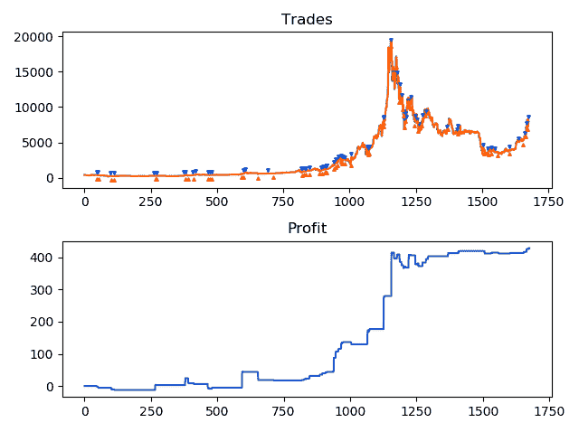

最终自助法的利润和交易

下表总结了我们测试的各种袋装模型的结果：

| **指标** | **DT_max_depth=1** | **DT_max_depth=3** | **DT** |
| --- | --- | --- | --- |
| **MSE** | 16.70 | 17.59 | 19.45 |
| **Sharpe** | 0.27 | 0.15 | 0.09 |

表 3：袋装结果

# 提升

最强大的集成学习技术之一是提升。它能够生成复杂的模型。在本节中，我们将利用 XGBoost 来建模我们的时间序列数据。由于在使用 XGBoost 建模时有许多自由度（超参数），我们预计需要一些微调才能取得令人满意的结果。通过将示例中的回归器替换为`lr = XGBRegressor()`，我们可以使用 XGBoost 并将其拟合到我们的数据上。这将产生一个 MSE 为 19.20，Sharpe 值为 0.13 的结果。

图表展示了模型生成的利润和交易。虽然 Sharpe 值低于其他模型，但我们可以看到，即使在比特币价格下跌的时期，它仍然能持续生成利润：

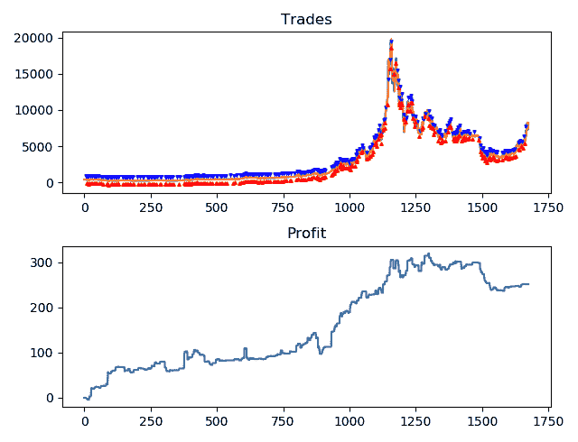

由提升模型生成的交易

# 改进提升方法

由于样本外的表现以及提升模型的买入和卖出频率，我们可以假设它在训练数据上发生了过拟合。因此，我们将尝试对其学习进行正则化。第一步是限制单个树的最大深度。我们首先施加一个上限为 2 的限制，使用`max_depth=2`。这略微改善了我们的模型，得到了一个 MSE 值为 19.14，Sharpe 值为 0.17。通过进一步限制模型的过拟合能力，仅使用 10 个基学习器（`n_estimators=10`），模型进一步得到了提升。

模型的 MSE 降低至 16.39，Sharpe 值提高至 0.21。添加一个 L1 正则化项 0.5（`reg_alpha=0.5`）只将 MSE 减少至 16.37。我们已经到了一个点，进一步的微调不会对模型性能贡献太大。在这个阶段，我们的回归模型如下所示：

```py
lr = XGBRegressor(max_depth=2, n_estimators=10, reg_alpha=0.5)
```

鉴于 XGBoost 的能力，我们将尝试增加模型可用的信息量。我们将把可用特征滞后增加到 30，并将之前 15 个滞后的滚动均值添加到特征中。为此，我们将修改代码中的特征创建部分，如下所示：

```py
def create_x_data(lags=1):
 diff_data = np.zeros((diff_len, lags))
 ma_data = np.zeros((diff_len, lags))

 diff_ma = (data.Close.diff()/data.Close).rolling(15).mean().fillna(0).values[1:]
 for lag in range(1, lags+1):
 this_data = diffs[:-lag]
 diff_data[lag:, lag-1] = this_data

 this_data = diff_ma[:-lag]
 ma_data[lag:, lag-1] = this_data
 return np.concatenate((diff_data, ma_data), axis=1)

x_data = create_x_data(lags=30)*100
y_data = diffs*100
```

这增加了我们模型的交易表现，达到了 0.32 的 Sharpe 值——所有模型中最高，同时 MSE 也增加到了 16.78。此模型生成的交易如图和后续的表格所示。值得注意的是，买入的次数大大减少，这种行为也是袋装方法在我们改进其作为投资策略时所展现的：

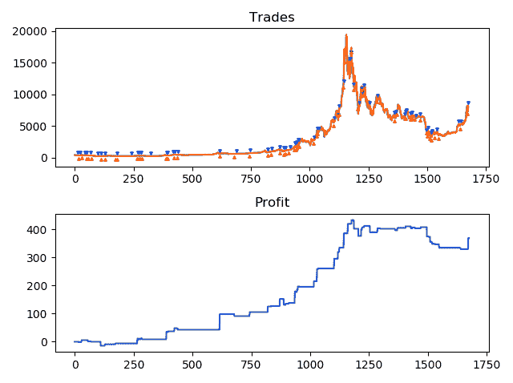

最终提升模型性能

| **指标** | **md=2/ne=10/reg=0.5+data** | **md=2/ne=10/reg=0.5** | **md=2/ne=10** | **md=2** | **xgb** |
| --- | --- | --- | --- | --- | --- |
| **MSE** | 16.78 | 16.37 | 16.39 | 19.14 | 19.20 |
| **Sharpe** | 0.32 | 0.21 | 0.21 | 0.17 | 0.13 |

所有增强模型的度量

# 随机森林

最后，我们将使用随机森林来建模数据。尽管我们预计集成方法能够利用额外滞后期和滚动平均的所有信息，但我们将首先仅使用 20 个滞后期和回报百分比作为输入。因此，我们的初始回归器仅为`RandomForestRegressor()`。这导致了一个表现不太理想的模型，MSE 为 19.02，Sharpe 值为 0.11。

下图展示了模型生成的交易：

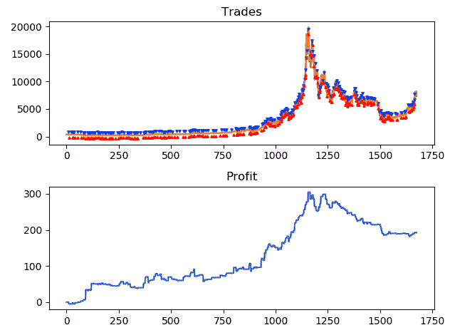

随机森林模型的交易

# 改进随机森林

为了改进我们的模型，我们尝试限制其过拟合能力，给每棵树设置最大深度为`3`。这大大提高了模型的性能，模型达到了 MSE 值为 17.42 和 Sharpe 值为 0.17。进一步将最大深度限制为`2`，虽然使 MSE 得分稍微提高到 17.13，但 Sharpe 值下降至 0.16。最后，将集成模型的大小增加到 50，使用`n_estimators=50`，生成了一个性能大幅提升的模型，MSE 为 16.88，Sharpe 值为 0.23。由于我们仅使用了原始特征集（20 个回报百分比的滞后期），我们希望尝试在增强部分使用的扩展数据集。通过添加 15 日滚动平均值，并将可用滞后期数量增加到 30，模型的 Sharpe 值提高到 0.24，尽管 MSE 也上升到 18.31。模型生成的交易如图所示：

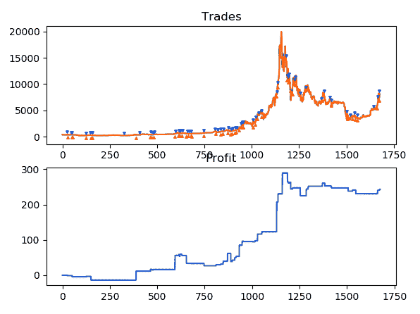

使用扩展数据集的随机森林结果

模型的结果总结如下表：

| **Metric** | **md=2/ne=50+data** | **md=2/ne=50** | **md=2** | **md=3** | **RF** |
| --- | --- | --- | --- | --- | --- |
| **MSE** | 18.31 | 16.88 | 17.13 | 17.42 | 19.02 |
| **Sharpe** | 0.24 | 0.23 | 0.16 | 0.17 | 0.11 |

所有随机森林模型的度量

# 总结

在本章中，我们尝试使用本书前几章介绍的所有集成方法来建模历史比特币价格。与大多数数据集一样，模型质量受多种决策的影响。数据预处理和特征工程是其中最重要的因素，尤其是当数据集的性质不允许直接建模时。时间序列数据集就属于这种情况，需要构建适当的特征和目标。通过将我们的非平稳时间序列转化为平稳序列，我们提高了算法对数据建模的能力。

为了评估我们模型的质量，我们使用了收益百分比的均方误差（MSE），以及夏普比率（我们假设模型被用作交易策略）。在涉及到 MSE 时，表现最佳的集成模型是简单投票集成。该集成包括一个 SVM 和 KNN 回归器，没有进行超参数调优，实现了一个 MSE 值为 15.71。作为交易策略，XGBoost 被证明是最佳集成模型，实现了一个夏普值为 0.32。尽管不全面，本章探索了使用集成学习方法进行时间序列建模的可能性和技术。

在接下来的章节中，我们将利用集成学习方法的能力，以预测各种推特的情感。
