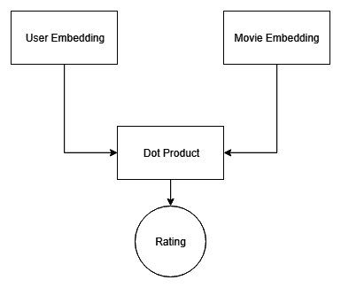
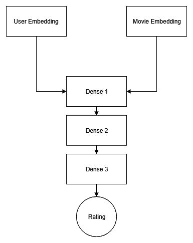
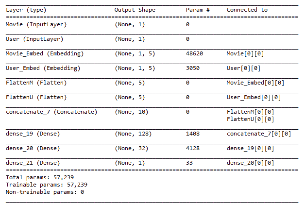

# 第十二章：使用 Keras 进行电影推荐

推荐系统是一种宝贵的工具。它们能够提升客户体验并增加公司的盈利能力。此类系统通过基于用户已喜欢的其他物品，推荐用户可能喜欢的物品。例如，在亚马逊上购买智能手机时，系统会推荐该手机的配件。这样既提高了客户体验（因为他们无需再寻找配件），也增加了亚马逊的盈利（例如，如果用户并不知道有配件在售）。

在本章中，我们将讨论以下主题：

+   解密推荐系统

+   神经网络推荐系统

+   使用 Keras 进行电影推荐

在本章中，我们将使用 MovieLens 数据集（可在[`files.grouplens.org/datasets/movielens/ml-latest-small.zip`](http://files.grouplens.org/datasets/movielens/ml-latest-small.zip)下载），利用 Keras 深度学习框架和集成学习技术创建一个电影推荐系统。

我们要感谢 GroupLens 团队授权我们在本书中使用他们的数据。有关数据的更多信息，请阅读以下相关论文：

F. Maxwell Harper 和 Joseph A. Konstan. 2015. *The MovieLens Datasets: History and Context*. ACM Transactions on Interactive Intelligent Systems (TiiS) 5, 4, Article 19 (2015 年 12 月)，第 19 页。

[论文可在以下链接获取：http://dx.doi.org/10.1145/2827872](http://dx.doi.org/10.1145/2827872)

# 技术要求

你需要具备基本的机器学习技术和算法知识。此外，了解 Python 的约定和语法也是必需的。最后，熟悉 NumPy 库将大大帮助读者理解一些自定义算法实现。

本章的代码文件可以在 GitHub 上找到：

[`github.com/PacktPublishing/Hands-On-Ensemble-Learning-with-Python/tree/master/Chapter12`](https://github.com/PacktPublishing/Hands-On-Ensemble-Learning-with-Python/tree/master/Chapter12)

查看以下视频，看看代码是如何执行的：[`bit.ly/2NXZqVE`](http://bit.ly/2NXZqVE)。

# 解密推荐系统

尽管推荐系统的内部机制一开始看起来可能令人畏惧，但其实它们非常直观。让我们以一些电影和用户为例。每个用户可以根据 1 到 5 的评分标准评价电影。推荐系统会尝试找到与新用户兴趣相似的其他用户，并根据这些相似用户喜欢的电影，向新用户推荐可能喜欢的电影。我们来看一个简单的例子，包含四个用户和六部电影：

| **用户** | **星际穿越** | **2001 太空漫游** | **黑客帝国** | **全金属外壳** | **海湾战争** | **壮志凌云** |
| --- | --- | --- | --- | --- | --- | --- |
| U0 | 5 | 4 |  | 2 | 1 |  |
| U1 |  | 1 |  | 4 | 4 | 3 |
| U2 | 4 |  | 4 |  |  | 1 |
| U3 |  | 4 | 5 | 5 | 4 |  |

每部电影每个用户的评分

如图所示，每个用户都评分了若干部电影，尽管并非所有用户都观看了相同的电影，并且每个用户的喜好各不相同。如果我们想向**用户二**（**U2**）推荐一部电影，我们必须首先找到最相似的用户。然后，我们可以通过**k-最近邻**（**k-NN**）的方式，使用*K*个最相似的用户来进行预测。当然，我们可以看到该用户可能喜欢科幻电影，但我们需要一种量化的方法来衡量这一点。如果我们将每个用户的偏好看作一个向量，我们就有四个六维的向量。然后，我们可以计算任意两个向量之间的余弦值。如果两个向量完全对齐，余弦值为 1，表示完全相同。如果向量完全相反，余弦值为 -1，表示两个用户的偏好完全相反。唯一的问题是，并非所有用户都评分了每部电影。为了计算余弦相似度，我们可以将空缺项填充为零。下图显示了用户之间的余弦相似度：


用户之间的余弦相似度

我们注意到，U0 和 U3 与 U2 展现出较高的相似度。问题是，U0 也与 U1 展现出较高的相似度，尽管他们的评分完全相反。这是因为我们将任何未评分的电影填充为 0，这意味着所有未观看电影的用户都同意他们不喜欢这部电影。这可以通过首先从每个用户的评分中减去其平均值来解决。这样可以将值归一化并将其集中在 0 附近。接下来，对于用户尚未评分的任何电影，我们将其赋值为 0。这表示用户对该电影没有偏好，并且用户的平均评分不会被改变。通过计算居中余弦相似度，我们得到以下值：


用户之间的居中余弦相似度

我们现在可以看到，U2 与 U0 和 U3 相似，而 U1 和 U0 则相差较大。为了计算 U2 未看过的电影的预测评分，但最近的*K*个邻居已经看过，我们将使用余弦相似度作为权重，计算每部电影的加权平均值。我们只对所有相似用户已经评分，但目标用户尚未评分的电影进行此操作。这为我们提供了以下预测评分。如果我们要向 U2 推荐一部电影，我们将推荐*2001：太空漫游*，一部科幻电影，正如我们之前所推测的：

| **星际穿越** | **2001：太空漫游** | **黑客帝国** | **全金属外壳** | **瓶中信** | **壮志凌云** |
| --- | --- | --- | --- | --- | --- |
| - | 4.00 | - | 3.32 | 2.32 | - |

U2 的预测评分

这种推荐方法被称为**协同过滤**。当我们像这个小示例一样寻找相似用户时，这称为**用户-用户过滤**。我们也可以将这种方法应用于通过转置评分表来寻找相似项，这被称为**物品-物品过滤**，在实际应用中通常表现得更好。这是因为物品通常属于更明确的类别，相较于用户。例如，一部电影可以是动作片、惊悚片、纪录片或喜剧片，类型之间几乎没有重叠。一个用户可能喜欢这些类别的某种混合；因此，找到相似的电影比找到相似的用户要容易。

# 神经网络推荐系统

我们可以利用深度学习技术，而不是显式定义相似度度量，来学习特征空间的良好表示和映射。神经网络有多种方法可以用于构建推荐系统。在本章中，我们将展示两种最简单的方法，以展示如何将集成学习融入到系统中。我们将在网络中使用的最重要部分是嵌入层。这些层类型接受整数索引作为输入，并将其映射到 n 维空间。例如，二维映射可以将 1 映射到[0.5, 0.5]。通过这些层，我们将能够将用户的索引和电影的索引输入到网络中，网络将预测特定用户-电影组合的评分。

我们将测试的第一个架构由两个嵌入层组成，在这两个嵌入层的输出上进行点积操作，以预测用户对电影的评分。该架构如下图所示。虽然它不是传统的神经网络，但我们将利用反向传播来训练这两个嵌入层的参数：



简单的点积架构

第二个架构是一个更传统的神经网络。我们将不再依赖预定义的操作来结合嵌入层的输出（点积操作），而是允许网络找到将它们结合的最佳方式。我们将不使用点积，而是将嵌入层的输出馈送到一系列全连接（**密集**）层。该架构如下图所示：



全连接架构

为了训练网络，我们将使用 Adam 优化器，并使用 **均方误差**（**MSE**）作为损失函数。我们的目标是尽可能准确地预测任何给定用户的电影评分。由于嵌入层具有预定的输出维度，我们将使用具有不同维度的多个网络来创建堆叠集成。每个单独的网络将是一个独立的基础学习器，并将使用相对简单的机器学习算法来组合各个预测。

# 使用 Keras 进行电影推荐

在本节中，我们将使用 Keras 作为深度学习框架来构建我们的模型。Keras 可以通过 `pip`（`pip install keras`）或 `conda`（`conda install -c conda-forge keras`）轻松安装。为了构建神经网络，我们首先需要理解我们的数据。MovieLens 数据集包含了近 100,000 个样本和 4 个不同的变量：

+   `userId`：与特定用户对应的数字索引

+   `movieId`：与特定电影对应的数字索引

+   `rating`：一个介于 0 和 5 之间的值

+   `timestamp`：用户评分电影的具体时间

数据集中的一个示例如下表所示。显然，数据集是按照 `userId` 列排序的。这可能会导致我们的模型出现过拟合问题。因此，我们将在数据分割之前对数据进行洗牌。此外，我们不会在模型中使用 `timestamp` 变量，因为我们并不关心电影评分的顺序：

| **userId** | **movieId** | **rating** | **timestamp** |
| --- | --- | --- | --- |
| 1 | 1 | 4 | 964982703 |
| 1 | 3 | 4 | 964981247 |
| 1 | 6 | 4 | 964982224 |
| 1 | 47 | 5 | 964983815 |
| 1 | 50 | 5 | 964982931 |

数据集示例

通过查看下图中评分的分布情况，我们可以看到大多数电影的评分为 3.5，超过了评分范围的中间值（2.5）。此外，分布图显示出左偏尾，表明大多数用户给出的评分都比较慷慨。事实上，评分的第一四分位数范围是从 0.5 到 3，而其余 75% 的评分则在 3 到 5 的范围内。换句话说，用户只有在评分低于 3 的电影中，才会选择 1 部电影：


评分分布

# 创建点模型

我们的第一个模型将包括两个嵌入层，一个用于电影索引，另一个用于用户索引，以及它们的点积。我们将使用 `keras.layers` 包，它包含了所需的层实现，以及 `keras.models` 包中的 `Model` 实现。我们将使用的层如下：

+   `Input` 层，负责将更传统的 Python 数据类型转换为 Keras 张量

+   `Embedding` 层，这是嵌入层的实现

+   `Flatten` 层，将任何 Keras n 维张量转换为一维张量

+   `Dot` 层，实现点积

此外，我们将使用 `train_test_split` 和 `sklearn` 的 `metrics`：

```py
from keras.layers import Input, Embedding, Flatten, Dot, Dense, Concatenate
from keras.models import Model
from sklearn.model_selection import train_test_split
from sklearn import metrics

import numpy as np
import pandas as pd
```

除了设置 `numpy` 的随机种子外，我们定义了一个函数来加载和预处理数据。我们从 `.csv` 文件中读取数据，去除时间戳，并利用 `pandas` 的 shuffle 函数打乱数据。此外，我们创建了一个 80%/20% 的训练集/测试集划分。然后，我们重新映射数据集的索引，使其成为连续的整数索引：

```py
def get_data():
    # Read the data and drop timestamp
    data = pd.read_csv('ratings.csv')
    data.drop('timestamp', axis=1, inplace=True)

    # Re-map the indices
    users = data.userId.unique()
    movies = data.movieId.unique()
    # Create maps from old to new indices
    moviemap={}
    for i in range(len(movies)):
        moviemap[movies[i]]=i
    usermap={}
    for i in range(len(users)):
        usermap[users[i]]=i

    # Change the indices
    data.movieId = data.movieId.apply(lambda x: moviemap[x]) 
    data.userId = data.userId.apply(lambda x: usermap[x]) 

    # Shuffle the data
    data = data.sample(frac=1.0).reset_index(drop=True)

    # Create a train/test split
    train, test = train_test_split(data, test_size=0.2)

    n_users = len(users)
    n_movies = len(movies)

    return train, test, n_users, n_movies
train, test, n_users, n_movies = get_data()
```

为了创建网络，我们首先定义输入的电影部分。我们创建一个 `Input` 层，它将作为我们 `pandas` 数据集的接口，通过接收数据并将其转换为 Keras 张量。接着，层的输出被输入到 `Embedding` 层，用于将整数映射到五维空间。我们将可能的索引数量定义为 `n_movies`（第一个参数），特征的数量定义为 `fts`（第二个参数）。最后，我们展平输出。用户部分重复相同的过程：

```py
fts = 5

# Movie part. Input accepts the index as input
# and passes it to the Embedding layer. Finally,
# Flatten transforms Embedding's output to a
# one-dimensional tensor.
movie_in = Input(shape=[1], name="Movie")
mov_embed = Embedding(n_movies, fts, name="Movie_Embed")(movie_in)
flat_movie = Flatten(name="FlattenM")(mov_embed)

# Repeat for the user.
user_in = Input(shape=[1], name="User")
user_inuser_embed = Embedding(n_users, fts, name="User_Embed")(user_in)
flat_user = Flatten(name="FlattenU")(user_inuser_embed)
```

最后，我们定义点积层，以两个展平的嵌入向量作为输入。然后，我们通过指定 `user_in` 和 `movie_in`（`Input`）层作为输入，`prod`（`Dot`）层作为输出，来定义 `Model`。在定义模型后，Keras 需要对其进行编译，以创建计算图。在编译过程中，我们定义优化器和损失函数：

```py
# Calculate the dot-product of the two embeddings
prod = Dot(name="Mult", axes=1)([flat_movie, flat_user])

# Create and compile the model
model = Model([user_in, movie_in], prod)
model.compile('adam', 'mean_squared_error')
```

通过调用 `model.summary()`，我们可以看到模型大约有 52,000 个可训练参数。所有这些参数都在 `Embedding` 层中。这意味着网络将只学习如何将用户和电影的索引映射到五维空间。函数的输出如下：


模型的摘要

最后，我们将模型拟合到训练集，并在测试集上评估它。我们训练网络十个周期，以观察其行为，以及它需要多少时间来训练。以下代码展示了网络的训练进度：

```py
# Train the model on the train set
model.fit([train.userId, train.movieId], train.rating, epochs=10, verbose=1)

# Evaluate on the test set
print(metrics.mean_squared_error(test.rating, 
      model.predict([test.userId, test.movieId])))
```

看一下下面的截图：


点积网络的训练进度

该模型在测试集上能够达到 1.28 的均方误差（MSE）。为了提高模型的性能，我们可以增加每个 `Embedding` 层能够学习的特征数量，但主要的限制是点积层。我们不会增加特征数量，而是让模型自由选择如何组合这两层。

# 创建密集模型

为了创建密集模型，我们将用一系列`Dense`层替代`Dot`层。`Dense`层是经典的神经元，每个神经元都会接收来自上一层的所有输出作为输入。在我们的例子中，由于我们有两个`Embedding`层，我们首先需要使用`Concatenate`层将它们连接起来，然后将其传递给第一个`Dense`层。这两层也包含在`keras.layers`包中。因此，我们的模型定义现在将如下所示：

```py
# Movie part. Input accepts the index as input
# and passes it to the Embedding layer. Finally,
# Flatten transforms Embedding's output to a
# one-dimensional tensor.
movie_in = Input(shape=[1], name="Movie")
mov_embed = Embedding(n_movies, fts, name="Movie_Embed")(movie_in)
flat_movie = Flatten(name="FlattenM")(mov_embed)

# Repeat for the user.
user_in = Input(shape=[1], name="User")
user_inuser_embed = Embedding(n_users, fts, name="User_Embed")(user_in)
flat_user = Flatten(name="FlattenU")(user_inuser_embed)

# Concatenate the Embedding layers and feed them 
# to the Dense part of the network
concat = Concatenate()([flat_movie, flat_user])
dense_1 = Dense(128)(concat)
dense_2 = Dense(32)(dense_1)
out = Dense(1)(dense_2)

# Create and compile the model
model = Model([user_in, movie_in], out)
model.compile('adam', 'mean_squared_error')
```

通过添加这三个`Dense`层，我们将可训练参数的数量从接近 52,000 增加到接近 57,200（增加了 10%）。此外，现在每一步的时间需要大约 210 微秒，较之前的 144 微秒增加了 45%，这一点从训练进度和总结中可以明显看出，具体表现如以下图所示：



密集模型的总结


密集模型的训练进度

尽管如此，该模型现在的均方误差为 0.77，约为原始点积模型的 60%。因此，由于该模型表现优于之前的模型，我们将利用此架构构建我们的堆叠集成模型。此外，由于每个网络具有更高的自由度，它具有更高的概率与其他基础学习器进行多样化。

# 创建堆叠集成模型

为了创建我们的堆叠集成模型，我们将使用三个密集网络，其中嵌入层包含 5、10 和 15 个特征作为基础学习器。我们将在原始训练集上训练所有网络，并利用它们在测试集上进行预测。此外，我们将训练一个贝叶斯岭回归模型作为元学习器。为了训练回归模型，我们将使用测试集中的所有样本，除了最后的 1,000 个样本。最后，我们将在这最后的 1,000 个样本上评估堆叠集成模型。

首先，我们将创建一个函数，用于创建和训练一个具有*n*个嵌入特征的密集网络，以及一个接受模型作为输入并返回其在测试集上预测结果的函数：

```py
def create_model(n_features=5, train_model=True, load_weights=False):
    fts = n_features

    # Movie part. Input accepts the index as input
    # and passes it to the Embedding layer. Finally,
    # Flatten transforms Embedding's output to a
    # one-dimensional tensor.
    movie_in = Input(shape=[1], name="Movie")
    mov_embed = Embedding(n_movies, fts, name="Movie_Embed")(movie_in)
    flat_movie = Flatten(name="FlattenM")(mov_embed)

    # Repeat for the user.
    user_in = Input(shape=[1], name="User")
    user_inuser_embed = Embedding(n_users, fts, name="User_Embed")(user_in)
    flat_user = Flatten(name="FlattenU")(user_inuser_embed)

    # Concatenate the Embedding layers and feed them 
    # to the Dense part of the network
    concat = Concatenate()([flat_movie, flat_user])
    dense_1 = Dense(128)(concat)
    dense_2 = Dense(32)(dense_1)
    out = Dense(1)(dense_2)

    # Create and compile the model
    model = Model([user_in, movie_in], out)
    model.compile('adam', 'mean_squared_error')
    # Train the model
    model.fit([train.userId, train.movieId], train.rating, epochs=10, verbose=1)

    return model

def predictions(model):
    preds = model.predict([test.userId, test.movieId])
    return preds
```

接下来，我们将创建并训练我们的基础学习器和元学习器，以便对测试集进行预测。我们将三种模型的预测结果组合成一个数组：

```py
# Create base and meta learner
model5 = create_model(5)
model10 = create_model(10)
model15 = create_model(15)
meta_learner = BayesianRidge()

# Predict on the test set
preds5 = predictions(model5)
preds10 = predictions(model10)
preds15 = predictions(model15)
# Create a single array with the predictions
preds = np.stack([preds5, preds10, preds15], axis=-1).reshape(-1, 3)
```

最后，我们在除了最后 1,000 个测试样本之外的所有样本上训练元学习器，并在这最后的 1,000 个样本上评估基础学习器以及整个集成模型：

```py
# Fit the meta learner on all but the last 1000 test samples
meta_learner.fit(preds[:-1000], test.rating[:-1000])

# Evaluate the base learners and the meta learner on the last
# 1000 test samples
print('Base Learner 5 Features')
print(metrics.mean_squared_error(test.rating[-1000:], preds5[-1000:]))
print('Base Learner 10 Features')
print(metrics.mean_squared_error(test.rating[-1000:], preds10[-1000:]))
print('Base Learner 15 Features')
print(metrics.mean_squared_error(test.rating[-1000:], preds15[-1000:]))
print('Ensemble')
print(metrics.mean_squared_error(test.rating[-1000:], meta_learner.predict(preds[-1000:])))
```

结果如以下表所示。从中可以看出，集成模型能够在未见数据上超越单独的基础学习器，达到了比任何单一基础学习器更低的均方误差（MSE）：

| **模型** | **均方误差（MSE）** |
| --- | --- |
| 基础学习器 5 | 0.7609 |
| 基础学习器 10 | 0.7727 |
| 基础学习器 15 | 0.7639 |
| 集成模型 | 0.7596 |

单独基础学习器和集成模型的结果

# 总结

本章中，我们简要介绍了推荐系统的概念以及协同过滤是如何工作的。然后，我们展示了如何利用神经网络来避免明确地定义规则，来决定用户对未评级项目的评分，使用嵌入层和点积。接着，我们展示了如何通过允许网络学习如何自行组合嵌入层，从而提高这些模型的性能。这使得模型拥有更高的自由度，而不会显著增加参数数量，从而显著提高了性能。最后，我们展示了如何利用相同的架构——具有不同数量嵌入特征——来创建堆叠集成的基学习器。为了组合这些基学习器，我们采用了贝叶斯岭回归，这比任何单一的基学习器都取得了更好的结果。

本章作为使用集成学习技术来构建深度推荐系统的概述，而非完全详细的指南。其实还有很多其他选项可以显著提高系统的性能。例如，使用用户描述（而非索引）、每部电影的附加信息（如类型）以及不同的架构，都能大大提升性能。不过，所有这些概念都可以通过使用集成学习技术来获益，本章已充分展示了这一点。

在接下来的最后一章中，我们将使用集成学习技术来对《世界幸福报告》中的数据进行聚类，以期发现数据中的模式。
